# OpenRA Knowledge Base Manual v.5

> **Version note:** Manual v.5 — this edition reflects the OpenRA engine source at tag `playtest-20260222-76-g972c10ec80` and is current as of 2026-06-24. File paths and class names may change in newer engine versions.

This single-file edition combines the OpenRA Knowledge Base Manual chapters into one document. It is the canonical version for reading, printing, or feeding to an AI for review.

## Table of Contents

- [OpenRA Knowledge Base Manual — Master Index](#file-MASTER_INDEX)
- [Part 0 — Foundations: How to Use This Manual](#file-chapters-Part_00_Foundations)
- [Chapter 1.1 — Entity-Component-System (ECS) and Actor Lifecycle](#file-chapters-Part_01_Chapter_01_ECS)
- [Chapter 1.2 — Activities and the Game Loop](#file-chapters-Part_01_Chapter_02_Activities)
- [Chapter 1.3 — World, OrderManager, and Orders](#file-chapters-Part_01_Chapter_03_World_Orders)
- [Chapter 1.4 — Deterministic Math and Coordinate Systems](#file-chapters-Part_01_Chapter_04_Math)
- [Chapter 1.5 — Pathfinding and Movement](#file-chapters-Part_01_Chapter_05_Pathfinding_Movement)
- [Chapter 1.6 — Combat and Damage Resolution](#file-chapters-Part_01_Chapter_06_Combat_Damage)
- [Chapter 2.1 — MiniYaml Parser and Inheritance](#file-chapters-Part_02_Chapter_01_MiniYaml)
- [Chapter 2.2 — Manifest, ModData, Ruleset, and RulesetCache](#file-chapters-Part_02_Chapter_02_Manifest)
- [Chapter 2.3 — FieldLoader and ObjectCreator](#file-chapters-Part_02_Chapter_03_FieldLoader)
- [Chapter 2.4 — Rulesets, Actors, and Weapons](#file-chapters-Part_02_Chapter_04_Rules_Weapons)
- [Chapter 3.1 — Mod SDK and Project Structure](#file-chapters-Part_03_Chapter_01_Mod_SDK)
- [Chapter 3.2 — Mod SDK Bootstrapping](#file-chapters-Part_03_Chapter_02_SDK_Bootstrap)
- [Chapter 3.3 — Build Pipeline and Packaging](#file-chapters-Part_03_Chapter_03_Build_Packaging)
- [Chapter 4.1 — Renderer, Sheet, and Sprite](#file-chapters-Part_04_Chapter_01_Renderer)
- [Chapter 4.2 — WorldRenderer](#file-chapters-Part_04_Chapter_02_WorldRenderer)
- [Chapter 4.3 — Widgets and Chrome](#file-chapters-Part_04_Chapter_03_Widgets)
- [Chapter 4.4 — Viewport and Input](#file-chapters-Part_04_Chapter_04_Viewport_Input)
- [Chapter 5.1 — Audio Architecture](#file-chapters-Part_05_Chapter_01_Audio_Architecture)
- [Chapter 5.2 — Spatial Sound Attenuation](#file-chapters-Part_05_Chapter_02_Spatial_Attenuation)
- [Chapter 5.3 — Music](#file-chapters-Part_05_Chapter_03_Music)
- [Chapter 5.4 — Sound Triggers](#file-chapters-Part_05_Chapter_04_Sound_Triggers)
- [Chapter 6.1 — Lua Scripting and Eluant](#file-chapters-Part_06_Chapter_01_Lua_Eluant)
- [Chapter 6.2 — ScriptContext Lifecycle and Bindings](#file-chapters-Part_06_Chapter_02_ScriptContext)
- [Chapter 6.3 — Virtual File System](#file-chapters-Part_06_Chapter_03_VFS)
- [Chapter 6.4 — Crypto Utilities and Player Authentication](#file-chapters-Part_06_Chapter_04_Crypto)
- [Chapter 6.5 — Asset Loaders](#file-chapters-Part_06_Chapter_05_Asset_Loaders)
- [Chapter 7.1 — Map Generation Pipeline Overview](#file-chapters-Part_07_Chapter_01_Pipeline)
- [Chapter 7.2 — Map Generation Data Structures](#file-chapters-Part_07_Chapter_02_Data_Structures)
- [Chapter 7.3 — Map Generation Algorithms](#file-chapters-Part_07_Chapter_03_Algorithms)
- [Chapter 7.4 — Terraformer](#file-chapters-Part_07_Chapter_04_Terraformer)
- [Chapter 7.5 — MultiBrush and Tile Placement](#file-chapters-Part_07_Chapter_05_MultiBrush)
- [Chapter 7.6 — Mod-Specific Generators](#file-chapters-Part_07_Chapter_06_Mod_Generators)
- [Chapter 7.7 — Resource and Actor Placement](#file-chapters-Part_07_Chapter_07_Resources_Actors)
- [Chapter 7.8 — Random Map Generator Extension Points](#file-chapters-Part_07_Chapter_08_Extension_Points)
- [Chapter 7.9 — Random Map Generator File Index](#file-chapters-Part_07_Chapter_09_File_Index)
- [Chapter 8.1 — Bot Architecture and IBot](#file-chapters-Part_08_Chapter_01_IBot)
- [Chapter 8.2 — Bot Modules](#file-chapters-Part_08_Chapter_02_Bot_Modules)
- [Chapter 8.3 — Bot Squads and Combat Heuristics](#file-chapters-Part_08_Chapter_03_Squads)
- [Chapter 8.4 — Bot Order Flow](#file-chapters-Part_08_Chapter_04_Order_Flow)
- [Chapter 9.1 — OrderManager and Lockstep Foundation](#file-chapters-Part_09_Chapter_01_OrderManager)
- [Chapter 9.2 — Server and Connection Layer](#file-chapters-Part_09_Chapter_02_Server_Connection)
- [Chapter 9.3 — Sync Hashing and Determinism](#file-chapters-Part_09_Chapter_03_Sync_Hashing)
- [Chapter 10.1 — Official Mods](#file-chapters-Part_10_Chapter_01_Official_Mods)
- [Chapter 10.2 — Online Services and References](#file-chapters-Part_10_Chapter_02_Online_References)
- [Chapter 10.3 — Porting, Modding, and Developer Workflows](#file-chapters-Part_10_Chapter_03_Port_And_Modding)
- [Appendix A — Glossary](#file-appendices-Appendix_A_Glossary)
- [Appendix B — Common YAML Patterns](#file-appendices-Appendix_B_Common_YAML_Patterns)
- [Appendix C — Debugging and Troubleshooting](#file-appendices-Appendix_C_Debugging)
- [Appendix D — Engine Conventions and Style](#file-appendices-Appendix_D_Engine_Conventions)
- [Appendix E — Practical Modding Recipes](#file-appendices-Appendix_E_Practical_Recipes)
- [Appendix F — Testing Strategies](#file-appendices-Appendix_F_Testing)
- [Appendix G — Advanced Modding Walkthroughs](#file-appendices-Appendix_G_Advanced_Modding_Walkthroughs)
- [Appendix H — Asset Visual Reference](#file-appendices-Appendix_H_Asset_Visual_Reference)
- [Appendix I — Actor Reference](#file-appendices-Appendix_I_Actor_Reference)
- [Appendix J — Terrain Tile Reference](#file-appendices-Appendix_J_Terrain_Tiles)
- [Appendix K — Environmental Actor Reference](#file-appendices-Appendix_K_Environmental_Actors)

---

<a id="file-MASTER_INDEX"></a>

<!-- --- FILE: MASTER_INDEX.md --- -->

# OpenRA Knowledge Base Manual — Master Index {#file-MASTER_INDEX}

This index provides a single-page overview of every chapter and appendix in the manual, grouped by part. Each entry links the file name to the topic so you can navigate quickly.

## Part 0 — Foundations

| File | Topic | Summary |
| :---- | :---- | :---- |
| `chapters/Part_00_Foundations.md` | How to Use This Manual | Learning paths, key concepts, and conventions. |

## Part 1 — Core Engine Architecture

| File | Topic | Summary |
| :---- | :---- | :---- |
| `chapters/Part_01_Chapter_01_ECS.md` | ECS, Actors, and Traits | Actor/Trait split, TraitInfo lifecycle, dependency resolution, caching. |
| `chapters/Part_01_Chapter_02_Activities.md` | Activity System | Multi-tick actor plans, activity chaining, tick loop. |
| `chapters/Part_01_Chapter_03_World_Orders.md` | World, OrderManager, and Orders | Simulation container, order dispatch, lockstep boundary. |
| `chapters/Part_01_Chapter_04_Math.md` | Math, Coordinates, and Determinism | World/cell coordinates, fixed-point math, determinism rules. |
| `chapters/Part_01_Chapter_05_Pathfinding_Movement.md` | Pathfinding and Movement | Locomotor, Mobile, PathFinder, HierarchicalPathFinder, Move activity. |
| `chapters/Part_01_Chapter_06_Combat_Damage.md` | Combat and Damage Resolution | Attack, Armament, projectiles, warheads, Health, Armor. |

## Part 2 — Data and Configuration

| File | Topic | Summary |
| :---- | :---- | :---- |
| `chapters/Part_02_Chapter_01_MiniYaml.md` | MiniYaml Parser | YAML dialect, inheritance, merging, node removal. |
| `chapters/Part_02_Chapter_02_Manifest.md` | Manifest and Mod Metadata | `mod.yaml` structure, mod discovery, global mod data. |
| `chapters/Part_02_Chapter_03_FieldLoader.md` | FieldLoader | YAML-to-C# deserialization, custom loaders, attributes. |
| `chapters/Part_02_Chapter_04_Rules_Weapons.md` | Rulesets, Actors, and Weapons | ActorInfo, WeaponInfo, ruleset loading, warheads. |

## Part 3 — Mod SDK, Build, and Deployment

| File | Topic | Summary |
| :---- | :---- | :---- |
| `chapters/Part_03_Chapter_01_Mod_SDK.md` | Mod SDK and Project Structure | Mod package structure, `mod.yaml`, `ModData`, object creation. |
| `chapters/Part_03_Chapter_02_SDK_Bootstrap.md` | Mod SDK Bootstrap | SDK bootstrap scripts, `mod.config`, engine pinning. |
| `chapters/Part_03_Chapter_03_Build_Packaging.md` | Build Pipeline and Packaging | Makefile, `dotnet publish`, platform packaging, utility commands. |

## Part 4 — Rendering and UI

| File | Topic | Summary |
| :---- | :---- | :---- |
| `chapters/Part_04_Chapter_01_Renderer.md` | Renderer, Sheet, and Sprite | Sprite sheets, palettes, renderables, shader pipeline. |
| `chapters/Part_04_Chapter_02_WorldRenderer.md` | WorldRenderer | World-to-screen rendering, renderable sorting, depth buffer. |
| `chapters/Part_04_Chapter_03_Widgets.md` | Widgets and Chrome | UI tree, chrome layouts, widget logic, input handling. |
| `chapters/Part_04_Chapter_04_Viewport_Input.md` | Viewport and Input | Camera, zoom, coordinate transforms, input dispatch. |

## Part 5 — Audio

| File | Topic | Summary |
| :---- | :---- | :---- |
| `chapters/Part_05_Chapter_01_Audio_Architecture.md` | Audio Architecture | Sound engine, loaders, audio playback lifecycle. |
| `chapters/Part_05_Chapter_02_Spatial_Attenuation.md` | Spatial Attenuation | 3D audio attenuation, OpenAL, listener position. |
| `chapters/Part_05_Chapter_03_Music.md` | Music | MusicPlaylist, track selection, loading. |
| `chapters/Part_05_Chapter_04_Sound_Triggers.md` | Sound Triggers | Notification, voice, and ambient sound triggers. |

## Part 6 — Scripting and Virtual File System

| File | Topic | Summary |
| :---- | :---- | :---- |
| `chapters/Part_06_Chapter_01_Lua_Eluant.md` | Lua Scripting and Eluant | Lua runtime, globals, bindings, safety. |
| `chapters/Part_06_Chapter_02_ScriptContext.md` | ScriptContext Lifecycle and Bindings | Script context creation, tick, death, debugging. |
| `chapters/Part_06_Chapter_03_VFS.md` | Virtual File System | Packages, loaders, mounting, file lookup. |
| `chapters/Part_06_Chapter_04_Crypto.md` | Crypto Utilities and Player Authentication | Cryptography, player IDs, authentication. |
| `chapters/Part_06_Chapter_05_Asset_Loaders.md` | Asset Loaders | Sprite, sound, video, and package loaders. |

## Part 7 — Random / Procedural Map Generator

| File | Topic | Summary |
| :---- | :---- | :---- |
| `chapters/Part_07_Chapter_01_Pipeline.md` | RMG Pipeline | End-to-end map generation pipeline. |
| `chapters/Part_07_Chapter_02_Data_Structures.md` | RMG Data Structures | CellLayer, MapGrid, actor plans, geometry. |
| `chapters/Part_07_Chapter_03_Algorithms.md` | RMG Algorithms | Noise, pathfinding, partitioning, terrain selection. |
| `chapters/Part_07_Chapter_04_Terraformer.md` | RMG Terraformer | Terrain generation and tile placement. |
| `chapters/Part_07_Chapter_05_MultiBrush.md` | RMG MultiBrush | Multi-tile brushes and stamping. |
| `chapters/Part_07_Chapter_06_Mod_Generators.md` | RMG Mod Generators | Per-mod generator registration and configuration. |
| `chapters/Part_07_Chapter_07_Resources_Actors.md` | RMG Resources and Actors | Resource placement, actor placement, base setup. |
| `chapters/Part_07_Chapter_08_Extension_Points.md` | RMG Extension Points | How to add custom generators and brushes. |
| `chapters/Part_07_Chapter_09_File_Index.md` | RMG File Index | Reference list of RMG source files. |

## Part 8 — AI and Bot Framework

| File | Topic | Summary |
| :---- | :---- | :---- |
| `chapters/Part_08_Chapter_01_IBot.md` | IBot and ModularBot | Bot interfaces, modular bot architecture, activation. |
| `chapters/Part_08_Chapter_02_Bot_Modules.md` | Bot Modules | Production, building, support power, and support modules. |
| `chapters/Part_08_Chapter_03_Squads.md` | Bot Squads and Combat Heuristics | Squad lifecycle, state machine, fuzzy attack/flee. |
| `chapters/Part_08_Chapter_04_Order_Flow.md` | Bot Order Flow | How bot orders enter the simulation. |

## Part 9 — Network and Lockstep

| File | Topic | Summary |
| :---- | :---- | :---- |
| `chapters/Part_09_Chapter_01_OrderManager.md` | OrderManager and Lockstep Foundation | Client-side order buffering and frame advancement. |
| `chapters/Part_09_Chapter_02_Server_Connection.md` | Server and Connection Layer | Server, connection, packet handling, lobby. |
| `chapters/Part_09_Chapter_03_Sync_Hashing.md` | Sync Hashing and Determinism | Sync hash, deterministic state, desync detection. |

## Part 10 — Official Mods and Ecosystem

| File | Topic | Summary |
| :---- | :---- | :---- |
| `chapters/Part_10_Chapter_01_Official_Mods.md` | Official Mods | RA, C&C, D2K, TS structure and mod-specific code. |
| `chapters/Part_10_Chapter_02_Online_References.md` | Online Services and References | Master server, LAN, map download, replay, web services. |
| `chapters/Part_10_Chapter_03_Port_And_Modding.md` | Porting, Modding, and Developer Workflows | Asset porting, trait creation, debugging, workflows. |

## Appendices

| File | Topic | Summary |
| :---- | :---- | :---- |
| `appendices/Appendix_A_Glossary.md` | Glossary | Definitions of OpenRA terms. |
| `appendices/Appendix_B_Common_YAML_Patterns.md` | Common YAML Patterns | Reusable MiniYaml patterns and examples. |
| `appendices/Appendix_C_Debugging.md` | Debugging and Troubleshooting | Logs, debug overlays, common problems. |
| `appendices/Appendix_D_Engine_Conventions.md` | Engine Conventions and Style | Coding style, trait conventions, sync safety. |
| `appendices/Appendix_E_Practical_Recipes.md` | Practical Modding Recipes | Copy-paste recipes for weapons, units, buildings, powers, conditions, traits, queues. |
| `appendices/Appendix_F_Testing.md` | Testing Strategies | Unit tests, sync testing, replay testing, performance testing, and common pitfalls. |
| `appendices/Appendix_H_Asset_Visual_Reference.md` | Asset Visual Reference | File formats, YAML definitions, and engine classes for every OpenRA asset category. |
| `appendices/Appendix_G_Advanced_Modding_Walkthroughs.md` | Advanced Modding Walkthroughs | Complete walkthroughs for Chrome UI, Lua missions, crates, resources, shroud, capture, cloak, voxels, and AI. |
| `appendices/Appendix_I_Actor_Reference.md` | Actor Reference | Auto-generated cameo + stat tables for every buildable actor in the ra, cnc, and d2k mods. |
| `appendices/Appendix_J_Terrain_Tiles.md` | Terrain Tile Reference | Per-mod tileset terrain types and representative templates for RA, C&C, D2K, and TS. |
| `appendices/Appendix_K_Environmental_Actors.md` | Environmental Actor Reference | Trees, rocks, civilian buildings, bridges, walls, gates, crates, and resource spawns across the four official mods. |

## Reference Files

| File | Purpose |
| :---- | :---- |
| `MASTER_INDEX.md` | This file — single-page master navigation. |
| `README.md` | Manual root README — start here for navigation. |
| `build files/README.md` | Manual introduction and chapter index. |
| `OpenRA Manual Build Files/TEMPLATE.md` | Chapter template. |
| `OpenRA Manual Build Files/FILE_INDEX.md` | C# source file listing by directory. |
| `OpenRA Manual Build Files/COVERAGE_MATRIX.md` | Source-to-chapter coverage mapping. |
| `DEVELOPMENT_LOG.md` | Project development log. |
| `OpenRA Manual Build Files/BUILD_PLAN.md` | Manual build plan. |


---

<a id="file-chapters-Part_00_Foundations"></a>

<!-- --- FILE: chapters/Part_00_Foundations.md --- -->

# Part 0 — Foundations: How to Use This Manual {#file-chapters-Part_00_Foundations}

## What OpenRA is

OpenRA is a real-time strategy (RTS) game engine that recreates and extends the classic Westwood/EA RTS games—Command & Conquer, Red Alert, Dune 2000, and Tiberian Sun—using modern, open-source technology. It is also a moddable engine: the same codebase that powers the official mods can be used to build entirely new RTS games.

OpenRA is not a monolithic game with hard-coded units. It is a **data-driven simulation engine**:

- The core engine is written in C# (.NET).
- Gameplay rules, units, weapons, maps, UI, and audio are defined in **[MiniYaml](#file-appendices-Appendix_A_Glossary)** files.
- Custom behavior is added through C# **traits** (plug-in components) that can be combined in YAML.
- Single-player missions and custom game modes are scripted in **Lua**.
- Multiplayer is deterministic and **lockstepped**: every client runs the same simulation and only player orders cross the network.

This architecture means that much of what looks like "game-specific code" is actually reusable engine machinery. A modder can change how a tank behaves without recompiling the engine, while an engine developer can add a new rendering feature that all mods inherit.

> **Version note:** This manual is current as of 2026-06-24 and reflects the OpenRA engine source at tag `playtest-20260222-76-g972c10ec80`. File paths and class names may change in newer engine versions, so always cross-check with the source tree or the official OpenRA docs.


## Learning Objectives


After studying this chapter, you should be able to:

- Explain what OpenRA is and how its data-driven engine architecture differs from a monolithic RTS.
- Identify the core technologies used by OpenRA (C#, MiniYaml, traits, Lua, lockstep networking).
- Match your goals to the recommended learning paths in the manual.
- Describe the foundational concepts of actors, traits, activities, orders, rulesets, determinism, and MiniYaml.
- Set up the recommended workflow for reading source code alongside the manual.
- Use the built-in tests, launch commands, and debug tools to verify changes.

## Who this manual is for

This manual has three audiences in mind:

1. **New contributors** who want to understand the engine before they open their first pull request.
2. **Modders** who want to go beyond tweaking YAML and understand *why* traits behave the way they do.
3. **Engine maintainers** who need a concise, source-grounded reference to subsystem architecture and extension points.

You do not need to read every chapter. The manual is organized so you can study it cover-to-cover or dip into specific subsystems.


## How to read this manual


### Chapter template

Every chapter follows the same structure:

| Section | Why it exists |
| :---- | :---- |
| **Purpose** | Tells you what the subsystem does and why it matters. |
| **Files** | Lists the key source files so you can read the code alongside the chapter. |
| **Architecture** | Explains the classes, interfaces, and relationships. |
| **Data Flow / Code Path** | Walks through the execution path from trigger to output. |
| **Configuration (YAML)** | Shows how MiniYaml controls the subsystem. |
| **Interconnectivity** | Points to upstream and downstream chapters. |
| **Algorithms** | Describes non-trivial logic in plain language. |
| **Extension Points** | Explains how to extend or override the subsystem. |
| **Common Pitfalls / Guardrails** | Lists mistakes, determinism rules, and performance constraints. |
| **References** | Source paths and related chapters. |

In addition to the chapters, the manual includes reference appendices you can dip into at any time:

- [Appendix A — Glossary](#file-appendices-Appendix_A_Glossary) — definitions of OpenRA terms.
- [Appendix B — Common YAML Patterns](#file-appendices-Appendix_B_Common_YAML_Patterns) — reusable MiniYaml snippets.
- [Appendix E — Practical Modding Recipes](#file-appendices-Appendix_E_Practical_Recipes) — copy-paste recipes for units, weapons, buildings, and support powers.
- [Appendix F — Testing Strategies](#file-appendices-Appendix_F_Testing) — unit tests, YAML validation, replay/sync testing, and performance testing.
- [Appendix H — Asset Visual Reference](#file-appendices-Appendix_H_Asset_Visual_Reference) — a categorical lookup of file formats, YAML definitions, and engine classes for every asset type.

The [Master Index](#file-MASTER_INDEX) provides a single-page overview of every chapter and appendix.


## Architecture at a Glance


OpenRA is built as a stack of layers. The engine code is shared by every mod; each mod layers its own assets, rules, and missions on top; and a running game session is the combination of a selected mod, a loaded map, and the live simulation state.

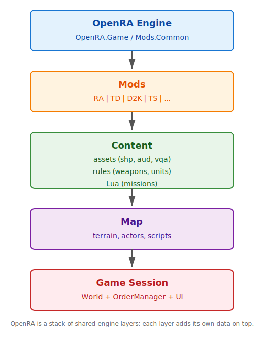
One simulation step follows a simple pipeline. Input is turned into orders, orders are applied on the next lockstep frame, the world ticks every actor and trait, and the renderer draws the resulting world state. The full order lockstep path is covered in [Part 1.3 — World, OrderManager, and Orders](#file-chapters-Part_01_Chapter_03_World_Orders) and [Part 9.1 — OrderManager and Lockstep Foundation](#file-chapters-Part_09_Chapter_01_OrderManager); the rendering frame is covered in [Part 4.1 — Renderer, Sheet, and Sprite](#file-chapters-Part_04_Chapter_01_Renderer).

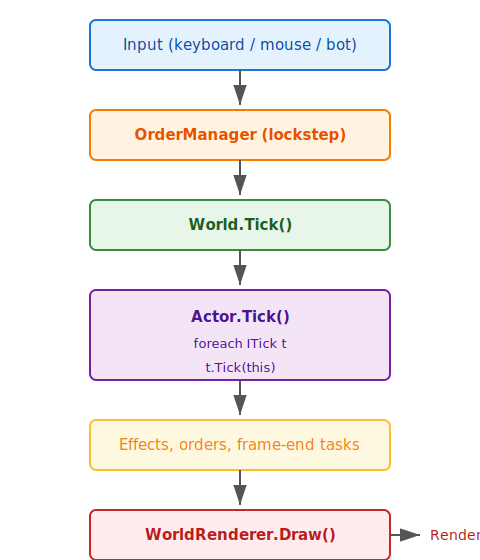
## Your first 30 minutes with OpenRA

If you are new to OpenRA, do not start by reading the whole manual. Start with this 30-minute loop:

1. **Get a working mod.** Follow [Part 3.2 — Mod SDK Bootstrapping](#file-chapters-Part_03_Chapter_02_SDK_Bootstrap) to clone the Mod SDK and launch the default mod.
2. **Open one actor YAML file.** In your mod's `rules/` or `mods/ra/rules/` folder, open `infantry.yaml` or `vehicles.yaml` and find a unit you recognize (e.g., `RIFLE` or `1TNK`).
3. **Change one number.** Double the `Speed` of a vehicle, or increase the `Range` of a weapon. Save the file.
4. **Run the game.** Use `./launch-game.sh` or `make run` and check your change in-game.
5. **Undo the change** (or keep it) and try a different trait name from the Traits reference in the official OpenRA docs.

This loop—read a rule, make a tiny change, see it in-game—is the fastest way to build intuition. The rest of the manual explains *why* each rule behaves the way it does, but the *what* and *how* come from hands-on experimentation.

For the SDK setup, see [Part 3.2 — Mod SDK Bootstrapping](#file-chapters-Part_03_Chapter_02_SDK_Bootstrap); for trait definitions, see the [OpenRA Traits reference](https://docs.openra.net/en/release/traits/).

### Recommended tooling

A good editor and the right supporting tools make the first 30 minutes much smoother:

- **Visual Studio / VS Code:** Use the [C# Dev Kit](https://marketplace.visualstudio.com/items?itemName=ms-dotnettools.csdevkit) and the OpenRA extension for C# editing, and the [community Lua tutorial setup page](https://steamsdev.github.io/content/openratut/luaintro.html) for Lua mission work.
- **JetBrains Rider:** A fully featured alternative C# IDE available at https://www.jetbrains.com/rider/.
- **OpenRA map editor:** Launched from the game client; use it for basic map creation and editing.
- **Official docs:** Keep the [OpenRA playtest docs](https://docs.openra.net/en/playtest/) and the [Traits reference](https://docs.openra.net/en/release/traits/) open while you work.


## Your first custom trait (the 5-minute version)


A custom trait is the smallest C# change you can make to OpenRA. Here is a complete, minimal example that adds a condition when an actor's health drops below 50%. You can copy this pattern for almost any simple trait.

### The C# code

Create a new file in your mod project (e.g., `MyMod/Traits/GrantConditionOnLowHealth.cs`):

```csharp
using OpenRA.Mods.Common.Traits;
using OpenRA.Traits;

namespace MyMod.Traits
{
    [Desc("Grants a condition while the actor's health is below a threshold.")]
    public class GrantConditionOnLowHealthInfo : TraitInfo, Requires<IHealthInfo>
    {
        [FieldLoader.Require]
        [GrantedConditionReference]
        [Desc("Condition to grant when health is below the threshold.")]
        public readonly string Condition = null;

        [Desc("Health threshold, as a fraction of total HP (0-1).")]
        public readonly float Threshold = 0.5f;

        public override object Create(ActorInitializer init) { return new GrantConditionOnLowHealth(init.Self, this); }
    }

    public class GrantConditionOnLowHealth : INotifyCreated, INotifyDamage
    {
        readonly GrantConditionOnLowHealthInfo info;
        readonly IHealth health;

        int conditionToken = Actor.InvalidConditionToken;

        public GrantConditionOnLowHealth(Actor self, GrantConditionOnLowHealthInfo info)
        {
            this.info = info;
            health = self.Trait<IHealth>();
        }

        void INotifyCreated.Created(Actor self)
        {
            UpdateCondition(self);
        }

        void INotifyDamage.Damaged(Actor self, AttackInfo e)
        {
            UpdateCondition(self);
        }

        void UpdateCondition(Actor self)
        {
            var lowHealth = health.HP < health.MaxHP * info.Threshold;
            var granted = conditionToken != Actor.InvalidConditionToken;

            if (lowHealth && !granted)
                conditionToken = self.GrantCondition(info.Condition);
            else if (!lowHealth && granted)
                conditionToken = self.RevokeCondition(conditionToken);
        }
    }
}
```

### The YAML registration

Add the trait to an actor definition:

```yaml
MyUnit:
    Inherits: ^Infantry
    Health:
        HP: 5000
    GrantConditionOnLowHealth:
        Condition: damaged
        Threshold: 0.5
    # ... other traits can now react to the `damaged` condition, e.g.:
    # SpeedMultiplier@DAMAGED:
    #     Modifier: 75
    #     RequiresCondition: damaged
```

### Build and test

1. Make sure your mod project file includes the new `.cs` file.
<!-- DEV-NOTE [tooling]: Microsoft .NET SDK: https://dotnet.microsoft.com — required to build the OpenRA engine and mod projects. -->
2. Run `make` or `dotnet build` to compile the mod assembly.
3. Launch the game with your mod and spawn the unit.
4. Attack the unit until its health drops below 50%; the `damaged` condition should now be active.

For a full walkthrough with debugging tips, see [Appendix E — Practical Modding Recipes](#file-appendices-Appendix_E_Practical_Recipes). For a deeper explanation of the trait lifecycle, see [Part 1.1 — Entity-Component-System (ECS) and Actor Lifecycle](#file-chapters-Part_01_Chapter_01_ECS).

### Suggested learning paths

**If you want to make a new unit or modify weapons (start here):**
- [Part 0 — Foundations: How to Use This Manual](#file-chapters-Part_00_Foundations) → [Part 2.1 — MiniYaml Parser and Inheritance](#file-chapters-Part_02_Chapter_01_MiniYaml) → [Part 2.4 — Rulesets, Actors, and Weapons](#file-chapters-Part_02_Chapter_04_Rules_Weapons) → [Part 1.1 — Entity-Component-System (ECS) and Actor Lifecycle](#file-chapters-Part_01_Chapter_01_ECS) → [Part 1.5 — Pathfinding and Movement](#file-chapters-Part_01_Chapter_05_Pathfinding_Movement) → [Part 1.6 — Combat and Damage Resolution](#file-chapters-Part_01_Chapter_06_Combat_Damage) → [Part 10.3 — Porting, Modding, and Developer Workflows](#file-chapters-Part_10_Chapter_03_Port_And_Modding) → [Appendix E — Practical Modding Recipes](#file-appendices-Appendix_E_Practical_Recipes).

**If you want to add AI behavior:**
- [Part 1.1 — Entity-Component-System (ECS) and Actor Lifecycle](#file-chapters-Part_01_Chapter_01_ECS) → [Part 1.3 — World, OrderManager, and Orders](#file-chapters-Part_01_Chapter_03_World_Orders) → [Part 8.1 — IBot and ModularBot](#file-chapters-Part_08_Chapter_01_IBot) → [Part 8.2 — Bot Modules](#file-chapters-Part_08_Chapter_02_Bot_Modules) → [Part 8.3 — Bot Squads and Combat Heuristics](#file-chapters-Part_08_Chapter_03_Squads) → [Part 8.4 — Bot Order Flow](#file-chapters-Part_08_Chapter_04_Order_Flow).

**If you want to work on graphics or UI:**
- [Part 4.1 — Renderer, Sheet, and Sprite](#file-chapters-Part_04_Chapter_01_Renderer) → [Part 4.2 — WorldRenderer](#file-chapters-Part_04_Chapter_02_WorldRenderer) → [Part 4.3 — Widgets and Chrome](#file-chapters-Part_04_Chapter_03_Widgets) → [Part 4.4 — Viewport and Input](#file-chapters-Part_04_Chapter_04_Viewport_Input).

**If you want to work on multiplayer/networking:**
- [Part 1.3 — World, OrderManager, and Orders](#file-chapters-Part_01_Chapter_03_World_Orders) → [Part 9.1 — OrderManager and Lockstep Foundation](#file-chapters-Part_09_Chapter_01_OrderManager) → [Part 9.2 — Server and Connection Layer](#file-chapters-Part_09_Chapter_02_Server_Connection) → [Part 9.3 — Sync Hashing and Determinism](#file-chapters-Part_09_Chapter_03_Sync_Hashing).

**If you want to create missions or scripted game modes:**
- [Part 6.1 — Lua Scripting and Eluant](#file-chapters-Part_06_Chapter_01_Lua_Eluant) → [Part 6.2 — ScriptContext Lifecycle and Bindings](#file-chapters-Part_06_Chapter_02_ScriptContext) → [Part 6.3 — Virtual File System](#file-chapters-Part_06_Chapter_03_VFS) → [Part 10.3 — Porting, Modding, and Developer Workflows](#file-chapters-Part_10_Chapter_03_Port_And_Modding).

**If you want to create a new mod:**
- [Part 3.1 — Mod SDK and Project Structure](#file-chapters-Part_03_Chapter_01_Mod_SDK) → [Part 3.2 — Mod SDK Bootstrapping](#file-chapters-Part_03_Chapter_02_SDK_Bootstrap) → [Part 3.3 — Build Pipeline and Packaging](#file-chapters-Part_03_Chapter_03_Build_Packaging) → [Part 10.1 — Official Mods](#file-chapters-Part_10_Chapter_01_Official_Mods) → [Part 10.3 — Porting, Modding, and Developer Workflows](#file-chapters-Part_10_Chapter_03_Port_And_Modding).

## Key concepts you should know first

### Actors and Traits

An **[Actor](#file-appendices-Appendix_A_Glossary)** is an object in the game world: a tank, a building, a projectile, a crate, a player, or the world itself. An actor by itself is empty. All behavior comes from **[Traits](#file-appendices-Appendix_A_Glossary)** attached to it.

A **Trait** is a C# class instance that lives on the actor. Traits implement marker interfaces (e.g., `ITick`, `IResolveOrder`, `IRender`) so the engine can call them at the right time.

Each trait has a **[TraitInfo](#file-appendices-Appendix_A_Glossary)** counterpart: an immutable configuration object loaded from YAML. `HealthInfo` becomes `Health` on every spawned actor.

See [Part 1.1 — Entity-Component-System (ECS) and Actor Lifecycle](#file-chapters-Part_01_Chapter_01_ECS) for the full explanation.

### Activities

An **[Activity](#file-appendices-Appendix_A_Glossary)** is a queued task for an actor: move to a cell, attack a target, play a death animation, wait, etc. Activities form a stack. The actor ticks the topmost activity each frame.

See [Part 1.2 — Activities and the Game Loop](#file-chapters-Part_01_Chapter_02_Activities) for details.

### Orders

An **[Order](#file-appendices-Appendix_A_Glossary)** is the only thing that crosses from the unsynced world (UI, AI, input) into the deterministic simulation. Every player action and bot action is packaged as an `Order` and executed on the next lockstep frame.

See [Part 1.3 — World, OrderManager, and Orders](#file-chapters-Part_01_Chapter_03_World_Orders) and [Part 9.1 — OrderManager and Lockstep Foundation](#file-chapters-Part_09_Chapter_01_OrderManager)

### Rulesets

A **[Ruleset](#file-appendices-Appendix_A_Glossary)** is the immutable set of actor definitions, weapons, voices, notifications, music, and terrain info loaded for a map. It is the boundary between YAML content and the C# simulation.

See [Part 2.4 — Rulesets, Actors, and Weapons](#file-chapters-Part_02_Chapter_04_Rules_Weapons).

### Determinism and sync

Because OpenRA uses lockstep multiplayer, the simulation must produce exactly the same result on every client. Anything that affects gameplay must be deterministic and must be included in the **sync hash**.

See [Part 9.3 — Sync Hashing and Determinism](#file-chapters-Part_09_Chapter_03_Sync_Hashing).

### MiniYaml

MiniYaml is OpenRA's configuration format. It is a simplified, indented markup used for rules, weapons, sequences, UI layouts, and more. It supports inheritance, overrides, and node removal.

See [Part 2.1 — MiniYaml Parser and Inheritance](#file-chapters-Part_02_Chapter_01_MiniYaml).

## How to use the source code alongside this manual

Every chapter lists the files it discusses. You should open those files in your editor and read them as you go. The manual is designed to be a **guided tour** of the source, not a replacement for it.

Recommended setup:

1. Clone the OpenRA repository.
2. Open the solution in your IDE.
3. When a chapter mentions a file, jump to it and read the relevant lines.
4. Use the search terms in the chapter to find related code.

## How to verify your understanding

- Run `make test` or `./utility.sh <mod> --check-yaml` after changing YAML.
- Launch the game with a specific mod: `./launch-game.sh Game.Mod=ra`.
- Use the in-game debug menu (F12) to visualize terrain grids, paths, actor bounds, and screen partitions.
- Read the unit tests in `OpenRA.Test` for examples of how engine systems are validated.
- Try small exercises: create a custom unit, add a trait, modify a sequence, or write a tiny Lua script.

## Conventions used in this manual

- Code paths are written as `Project/Directory/File.cs` relative to the repository root.
- Line references are approximate; they may shift between engine versions.
- `YAML` examples are illustrative; always check the official mods for exact syntax.
- `Part X.Y` refers to chapter `Y` of part `X`.

## Where to go next

**If you have never modified OpenRA before**, start with **Your first 30 minutes with OpenRA** above, then read **[Part 1.1 — Entity-Component-System (ECS) and Actor Lifecycle](#file-chapters-Part_01_Chapter_01_ECS)**. That chapter is the foundation for everything else.

**If you want to change units or weapons quickly**, read **[Part 2.4 — Rulesets, Actors, and Weapons](#file-chapters-Part_02_Chapter_04_Rules_Weapons)**, then **[Appendix E — Practical Modding Recipes](#file-appendices-Appendix_E_Practical_Recipes)**.

**If you want to write a custom trait in C#**, read **[Part 1.1 — Entity-Component-System (ECS) and Actor Lifecycle](#file-chapters-Part_01_Chapter_01_ECS)**, then **[Appendix E — Practical Modding Recipes](#file-appendices-Appendix_E_Practical_Recipes)** for the full recipe, and **[Part 3.1 — Mod SDK and Project Structure](#file-chapters-Part_03_Chapter_01_Mod_SDK)**/**[Part 3.2 — Mod SDK Bootstrapping](#file-chapters-Part_03_Chapter_02_SDK_Bootstrap)** for SDK setup.

**If you are returning to look up a specific subsystem**, use the **Master Index** in `build files/MASTER_INDEX.md` or the **Chapter Index** in `build files/README.md`.

## Summary

- This manual is a source-grounded tour of the OpenRA engine. It is meant to be read alongside the pinned engine source at tag `playtest-20260222-76-g972c10ec80`.
- OpenRA is an actor/trait ECS. Every game object is an `Actor`; all behavior comes from `Trait` instances configured by immutable `TraitInfo` objects loaded from MiniYaml.
- Activities queue deterministic work, Orders are the only cross from the unsynced UI/AI world into the lockstep simulation, and Rulesets are the immutable boundary between YAML content and the C# engine.
- The manual is organized into Parts 0–10 plus appendices. Suggested learning paths are provided above for new modders, AI authors, graphics/UI contributors, networking developers, and mission scripters.
- When you want to go deeper, open the source files listed in each chapter and read them alongside the chapter text.

## What to read next

- If you want to understand how actors and traits are constructed, read [Part 1.1 — Entity-Component-System (ECS) and Actor Lifecycle](#file-chapters-Part_01_Chapter_01_ECS).
- If you want to learn how OpenRA parses MiniYaml rules, read [Part 2.1 — MiniYaml Parser and Inheritance](#file-chapters-Part_02_Chapter_01_MiniYaml).
- If you want to set up a standalone mod project, read [Part 3.1 — Mod SDK and Project Structure](#file-chapters-Part_03_Chapter_01_Mod_SDK).


---

<a id="file-chapters-Part_01_Chapter_01_ECS"></a>

<!-- --- FILE: chapters/Part_01_Chapter_01_ECS.md --- -->

# Chapter 1.1 — Entity-Component-System (ECS) and Actor Lifecycle {#file-chapters-Part_01_Chapter_01_ECS}

## Purpose

This chapter explains the foundation of OpenRA's simulation architecture: every object in the game world is an [`Actor`](#file-appendices-Appendix_A_Glossary), and all behavior comes from detachable, data-driven **[Traits](#file-appendices-Appendix_A_Glossary)** that are attached to that actor. The goals are to show how an empty container (`Actor`) becomes a fully functional unit, building, or world system; how configuration (YAML) is separated from runtime state (C# trait instances); how the engine resolves trait dependencies, caches hot paths, and enforces single-instance invariants; and where mod authors can extend each stage of the lifecycle.

OpenRA's ECS differs from classical ECS frameworks. Instead of a dense array of homogeneous components queried by systems, OpenRA uses a **dictionary-of-traits** model: each actor owns a set of trait instances that implement marker interfaces, and the engine queries them via `Trait<T>`, `TraitOrDefault<T>`, or `TraitsImplementing<T>`. The split between [`TraitInfo`](#file-appendices-Appendix_A_Glossary) (immutable, shared, loaded from [YAML](#file-appendices-Appendix_A_Glossary)) and [`Trait`](#file-appendices-Appendix_A_Glossary) (mutable, per-actor, created at spawn time) is the key design that keeps the simulation [deterministic](#file-appendices-Appendix_A_Glossary) and cheap to replay.

## Learning Objectives


After studying this chapter, you should be able to:

1. Explain why OpenRA uses an Actor/Trait split rather than a classical object-oriented hierarchy.
2. Distinguish `TraitInfo` from `Trait` and describe their lifetimes and mutability rules.
3. Trace the path from a YAML actor definition to a fully constructed actor in the world.
4. Use `Trait<T>`, `TraitOrDefault<T>`, and `TraitsImplementing<T>` correctly in C# code.
5. Identify and resolve `Requires<T>` and `NotBefore<T>` dependency conflicts.
6. Understand why `Actor` caches hot interfaces and which interfaces are cached.
7. Explain how the condition system disables traits without removing them.


## Practical Example: Creating a Simple Unit


Suppose you want to add a `Scout` unit to a mod. In YAML you would write:

```yaml
Scout:
    Inherits: ^Vehicle
    Mobile:
        Speed: 80
    RevealsShroud:
        Range: 10c0
    Health:
        HP: 2000
    Armor:
        Type: Light
```

When the map loads, the engine:

1. Loads `Scout` into an `ActorInfo` with `TraitInfo` instances for `Mobile`, `RevealsShroud`, `Health`, and `Armor`.
2. Resolves dependencies (e.g., `Mobile` requires `IOccupySpace`).
3. When the unit is built, creates a new `Actor` and runs `Create` on each `TraitInfo` to produce the runtime traits.
4. Caches interfaces like `IOccupySpace` so the renderer and pathfinder can query them quickly.
5. Ticks the actor and its traits every frame until the unit is destroyed.

This example shows how YAML configuration becomes C# runtime behavior through the ECS pipeline.

## Files

- `OpenRA.Game/Actor.cs` — The `Actor` class: construction, interface caching, tick/render/order hooks, condition system, and disposal.
- `OpenRA.Game/Traits/TraitsInterfaces.cs` — Shared trait interfaces (`IHealth`, `IOccupySpace`, `IFacing`, `ITargetable`, `ISync`, `INotifyIdle`, `IRulesetLoaded`, `Requires<T>`, `NotBefore<T>`, etc.).
- `OpenRA.Game/TraitDictionary.cs` — Per-actor trait storage, indexed by actor ID and interface, used by `World.TraitDict`.
- `OpenRA.Game/Primitives/TypeDictionary.cs` — Generic dictionary keyed by type, used by `ActorInfo` for `TraitInfo` collections and by `ActorInitializer` for init values.
- `OpenRA.Game/Map/ActorInitializer.cs` — Bridge between actor construction arguments (`ActorInit`) and the traits that consume them; supports named trait instances and `ISingleInstanceInit`.
- `OpenRA.Game/ObjectCreator.cs` — Reflection-based factory that maps YAML trait names (`"Health"`) to C# `TraitInfo` types (`"HealthInfo"`), loads mod assemblies, and caches constructors.
- `OpenRA.Game/FieldLoader.cs` — YAML-to-C# value deserializer; parses primitives, collections, world types, and custom loaders via `SerializeAttribute` / `LoadUsingAttribute`.
- `OpenRA.Game/GameRules/ActorInfo.cs` — The rules-definition of an actor: a `TypeDictionary` of `TraitInfo`s, dependency resolution, and construction ordering.
- `OpenRA.Game/GameRules/Ruleset.cs` — Loads default and map-specific rules, runs `IRulesetLoaded` hooks, and exposes `Rules.Actors`.


## Architecture



### The OpenRA ECS Shape


OpenRA's ECS is a **two-tier info/instance pattern**.

| Tier | Class | Lifetime | Source | Role |
|------|-------|----------|--------|------|
| Info | `TraitInfo` (and `TraitInfo<T>`) | One per actor definition | YAML rules, loaded once per `Ruleset` | Immutable configuration, dependency graph, ruleset-wide cross references |
| Instance | The trait class `T` | One per spawned actor | Created by `TraitInfo.Create(ActorInitializer)` | Mutable runtime state, receives tick/order/render events |

- An `Actor` is an **empty container**. Its public members (`[World](#file-appendices-Appendix_A_Glossary)`, `ActorID`, `Owner`, `Info`, `IsInWorld`, etc.) exist only to wire traits together. The actor itself has no unit-specific logic.
- A `Trait` is any C# object attached to the actor. Traits implement one or more interfaces from `TraitsInterfaces.cs`. There is no base class requirement; a trait can be as small as a single data holder or as large as a full subsystem.
- `ITraitInfo` is not a single interface; it is a family of two things: the empty marker `ITraitInfoInterface`, and the abstract `TraitInfo` class that adds `InstanceName` and `abstract object Create(ActorInitializer init)`. Most trait definitions use `class MyTraitInfo : TraitInfo<MyTrait>, ...` to implement `Create` with `new T()`.
- `ActorInfo` is the rules-level definition of an actor. It contains a `TypeDictionary` of `TraitInfo` objects and knows how to order them by `Requires<T>` and `NotBefore<T>` dependencies.
- `World.TraitDict` is a `TraitDictionary` (per-world, not per-actor) that stores every trait instance of every actor, indexed by interface. This lets global queries like `World.ActorsWithTrait<MyInterface>()` run efficiently.
- `ActorInitializer` is the construction-time argument bag. It wraps a `TypeDictionary` of `ActorInit` objects and lets each `TraitInfo` pull `LocationInit`, `OwnerInit`, `HealthInit`, etc., in a named-trait-aware way.

### Why the Info/Trait Split Preserves Determinism

1. **Shared, immutable data** — `TraitInfo` objects are created once per `Ruleset` and reused by every actor of that type. Mutating one instance's fields would affect every actor, so `TraitInfo` fields are expected to be `readonly` or loaded only from YAML.
2. **Runtime state is per-actor** — Health, position, activity queues, condition tokens, and cached renderables live in the trait instance, not in the `Info`.
3. **Construction order is fixed** — `ActorInfo.TraitsInConstructOrder()` resolves dependencies before any actor is created, so all actors of the same type build their trait instances in the same deterministic order.
4. **Ruleset-level linking happens once** — `IRulesetLoaded.RulesetLoaded(Ruleset, ActorInfo)` lets trait infos cache references to other actors, weapons, or locomotors during ruleset construction, avoiding runtime reflection or string lookups during simulation.


### Key Cached Interfaces and Why They Are Cached


Inside `Actor` constructor the engine eagerly resolves specific interfaces and stores them in private fields. This is the most performance-critical code path of the whole engine: every actor pays this cost once, then gets fast access for the rest of its life.

| Cached field | Interface | Why it is cached |
|--------------|-----------|----------------|
| `OccupiesSpace` | `IOccupySpace` | Pathfinding, collision, shroud, rendering, and target queries all need `CenterPosition` / `TopLeft` / `OccupiedCells`. |
| `facing` | `IFacing` | Orientation, turret aiming, movement facing, and many renderables need `Facing`/`Orientation`. |
| `health` | `IHealth` | Damage, death, and selection status require fast `IsDead` / `DamageState` checks. |
| `EffectiveOwner` | `IEffectiveOwner` | Disguise/owner-spoofing logic is evaluated frequently by targeting and visibility. |
| `Targetables` | `ITargetable[]` | Combat, orders, and auto-target scan all targetable types. |
| `EnabledTargetablePositions` | `ITargetablePositions` | Provides world-space aim points; cached with `Exts.IsTraitEnabled` filtering. |
| `crushables` | `ICrushable[]` | Movement/ crushing logic checks these on every collision. |
| `resolveOrders` | `IResolveOrder[]` | Orders are dispatched to every resolver in a hot loop. |
| `renders` | `IRender[]` | Render frame. |
| `renderModifiers` | `IRenderModifier[]` | Frame. |
| `mouseBounds` | `IMouseBounds[]` | Input/selection. |
| `visibilityModifiers` | `IVisibilityModifier[]` | Shroud/visibility. |
| `defaultVisibility` | `IDefaultVisibility` | Shroud/visibility. |
| `becomingIdles` | `INotifyBecomingIdle[]` | Activity state transitions. |
| `tickIdles` | `INotifyIdle[]` | Called when idle. |
| `SyncHashes` | `ISync[]` | Network sync hashing walks this array every sync tick. |

Caching these at construction avoids per-frame reflection or `TraitsImplementing<T>` lookups in tight loops. The comments in `Actor.cs` explicitly call this out: the one-off cost is accepted because it speeds up pathfinding, visibility, rendering, and combat.

`ISync` is special: the `SyncHash` struct wraps each `ISync` trait with a precompiled hash function (`Sync.GetHashFunction`), so the network sync loop can call `Hash()` without reflection.

<!-- DEV-NOTE [visual-aid]: Actor lifecycle diagram showing the flow from YAML actor definition → ActorInfo → TraitInfo[] → new Actor() → TraitsInConstructOrder() → per-actor Trait instances → INotifyCreated hooks → World.Add() → Tick/Render/Order processing → World.Remove()/Disposal. Emphasise the immutable info/instance split and the deterministic creation order. -->

## Actor Lifecycle Diagram

The path from a YAML actor definition to a live unit in the world is a straight pipeline. First the ruleset creates immutable `TraitInfo` objects in `OpenRA.Game/GameRules/ActorInfo.cs`; later, spawning in `OpenRA.Game/World.cs` creates per-actor `Trait` instances through `TraitInfo.Create()` and runs the creation hooks.

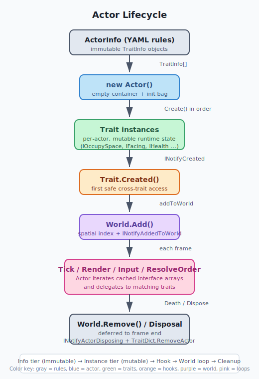
The `Actor` class itself is an empty container; it delegates the actual work to its traits by iterating over the interface arrays that were cached at construction time in `OpenRA.Game/Actor.cs`.

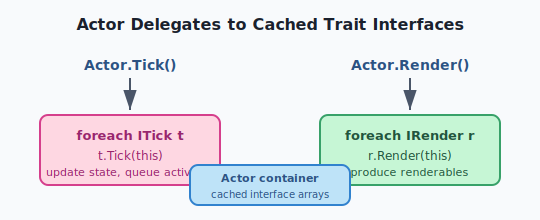


## Data Flow / Code Path


### 1. Ruleset Construction (once per map / mod change)

```
Ruleset.LoadDefaults(modData)                [Ruleset.cs]
  MergeOrDefault("Manifest,Rules", ...,
    k => new ActorInfo(modData.ObjectCreator, k.Key.ToLowerInvariant(), k.Value))

ActorInfo constructor                         [ActorInfo.cs]
  foreach (traitNode in yaml)
    trait = LoadTraitInfo(creator, traitName, traitNode.Value)
    traits.Add(trait)
  traits.TrimExcess()

LoadTraitInfo                                 [ActorInfo.cs]
  info = creator.CreateObject<TraitInfo>(traitName + "Info")
  FieldLoader.Load(info, yaml)
  return info

Ruleset constructor                           [Ruleset.cs]
  foreach (ActorInfo a)
    foreach (IRulesetLoaded t in a)
      t.RulesetLoaded(this, a)
```

At this point every actor definition has a fully populated `TypeDictionary` of `TraitInfo` objects. No actual actor exists yet.

### 2. Actor Instantiation and Trait Creation

```
World.CreateActor(bool addToWorld, string name, TypeDictionary initDict)
  var a = new Actor(this, name, initDict)    [World.cs]
  a.Initialize(addToWorld)

Actor constructor                             [Actor.cs]
  Validate: no duplicate ISingleInstanceInit inits
  init = new ActorInitializer(this, initDict)
  ActorID = world.NextAID()
  Owner = ownerInit.Value(world)
  Info = world.Map.Rules.Actors[name]

  foreach (TraitInfo in Info.TraitsInConstructOrder())
    var trait = traitInfo.Create(init)       // usually new T()
    AddTrait(trait)                          // World.TraitDict.AddTrait
    // cache hot interfaces
  }
```

`Info.TraitsInConstructOrder()` returns a topologically sorted array of `TraitInfo`s based on `Requires<T>` and `NotBefore<T>`. Traits are created in that order, and each `TraitInfo.Create` receives the `ActorInitializer` so it can pull map-spawn arguments such as `LocationInit` or `HealthInit`.

### 3. Post-Construction: `Actor.Initialize`

```
Actor.Initialize(bool addToWorld = true)      [Actor.cs]
  created = true
  foreach (INotifyCreated t)
    t.Created(this)

  foreach (IObservesVariables t)
    foreach (VariableObserver v in t.GetVariableObservers())
      register notifier with condition state

  foreach (VariableObserverNotifier n)
    n(this, readOnlyConditionCache)            // initial condition state

  foreach (ICreationActivity t where enabled)
    if activity != null
      throw (only one ICreationActivity allowed)
    CurrentActivity = t.GetCreationActivity()

  if (addToWorld)
    World.Add(this)
```

`INotifyCreated` is the first place a trait can safely interact with other traits. Before this point the actor is still being assembled; after this point the actor is considered "created" and can queue activities. `ICreationActivity` is the only trait that may inject the actor's initial activity, and `Actor.QueueActivity` throws if called before `created` is true.

### 4. World Add / Tick / Render

- `World.Add(this)` adds the actor to the world spatial index and calls `INotifyAddedToWorld` for each trait.
- `Actor.Tick()` runs the current activity, then `INotifyBecomingIdle` or `INotifyIdle.TickIdle` depending on the activity transition.
- `Actor.Render()` applies `IRenderModifier`s over the output of `IRender` traits.
- `Actor.ResolveOrder()` broadcasts `Order` objects to every `IResolveOrder` trait.

### 5. Disposal

```
Actor.Dispose()                               [Actor.cs]
  CurrentActivity?.OnActorDisposeOuter(this)
  WillDispose = true
  World.AddFrameEndTask(_ =>
  {
    if (IsInWorld) World.Remove(this)
    foreach (INotifyActorDisposing t)
      t.Disposing(this)
    World.TraitDict.RemoveActor(this)
    Disposed = true
  })
```

Disposal is deferred to the end of the frame so that other traits do not access a partially-destroyed actor during a tick.


## Configuration (YAML)


### Actor Definition

```yaml
# mod/rules/infantry.yaml
E1:
    Inherits: ^Infantry
    Buildable:
        Queue: Infantry
        BuildPaletteOrder: 10
    Mobile:
        Speed: 50
    Health:
        HP: 5000
    RevealsShroud:
        Range: 5c0
    WithInfantryBody:
    TakeCover:
```

Each top-level node under an actor name is a trait name. The trait name maps to a C# class by adding the suffix `Info`:

- `Health:` → `HealthInfo`
- `Mobile:` → `MobileInfo`
- `RevealsShroud:` → `RevealsShroudInfo`

### Named Trait Instances

Traits can be duplicated with an `@` suffix:

```yaml
DOME:
    RevealsShroud:
        Range: 10c0
    RevealsShroud@GAP:
        Range: 20c0
        RequiresCondition: gap-generator
```

`ActorInfo.TraitInstanceSeparator` is `'@'`. The base name becomes the trait type; the part after `@` becomes the `InstanceName`. `ActorInitializer.GetOrDefault<T>(TraitInfo)` will prefer an init whose `InstanceName` matches the trait's instance name, falling back to an unnamed init.

### FieldLoader Mapping

Fields in a `TraitInfo` are populated by `FieldLoader.Load`. The default behavior is:

- Public fields are serialized by default.
- Private fields are ignored unless marked with `[FieldLoader.Serialize]` or `[FieldLoader.LoadUsing]`.
- `[FieldLoader.Ignore]` excludes a field from YAML loading.
- `[FieldLoader.Require]` marks a field as required; missing fields raise `MissingFieldsException`.
- `[FieldLoader.LoadUsing("LoaderMethod")]` delegates YAML parsing to a static method on the info class.

Example trait info:

```csharp
public class MyTraitInfo : TraitInfo<MyTrait>
{
    [FieldLoader.Require]
    public readonly int Range = 0;

    [FieldLoader.Ignore]
    public readonly int RuntimeCache = 0;

    [FieldLoader.LoadUsing("LoadOffsets")]
    public readonly WVec[] Offsets = null;

    static WVec[] LoadOffsets(MiniYaml yaml) { ... }
}
```

`FieldLoader` uses a frozen dictionary of primitive parsers (`TypeParsers`) and generic parsers (`GenericTypeParsers`) for `HashSet<>`, `List<>`, `Dictionary<,>`, `ImmutableArray<>`, `FrozenSet<>`, `FrozenDictionary<,>`, `BitSet<>`, and `Nullable<>`. World types like `WPos`, `WVec`, `WDist`, `CPos`, `WRot`, `Color`, and `Hotkey` have dedicated parsers.

### `IRulesetLoaded` — Post-Load Linking

Trait infos that implement `IRulesetLoaded` receive `RulesetLoaded(Ruleset, ActorInfo)` after all rules are loaded. This is the correct place to:

- Resolve references to other actor types (e.g., `world.Map.Rules.Actors["mcv"]`).
- Cache the result of cross-trait info lookups (e.g., `LocomotorInfo` references by name).
- Validate that required trait infos are present.

It is **not** the place to mutate runtime actor state — no actors exist yet.

## Interconnectivity

### How `Actor`, `ActorInfo`, `ActorInitializer`, `TraitInfo`, and `Trait` Relate

- `Actor` holds a reference to its `ActorInfo` (`Info`).
- `ActorInfo` holds a `TypeDictionary` of `TraitInfo` objects and exposes `TraitInfo<T>()`, `TraitInfos<T>()`, `HasTraitInfo<T>()`.
- When `Actor` is constructed, it iterates `Info.TraitsInConstructOrder()` and calls `TraitInfo.Create(init)` for each.
- `TraitInfo.Create` receives an `ActorInitializer`, which wraps the `TypeDictionary` of `ActorInit` objects passed by the map or by `World.CreateActor`.
- The returned trait instance is added to `World.TraitDict` via `Actor.AddTrait(object)`.
- After construction, `Actor` exposes `Trait<T>()` and `TraitsImplementing<T>()` which query `World.TraitDict`.

### `TraitDictionary` vs `TypeDictionary`

- `TypeDictionary` (in `OpenRA.Primitives`) is a simple type-keyed dictionary. It is used for the `ActorInfo.traits` collection and for `ActorInitializer`'s init bag. `Get<T>()` throws if more than one instance of `T` exists.
- `TraitDictionary` (in `OpenRA.Game`) is the global world index. It stores `(Actor, trait)` pairs per interface, sorted by `ActorID`, and supports `ActorsWithTrait<T>`, `ActorsHavingTrait<T>`, and `WithInterface<T>` per actor. `Get<T>` throws if an actor has more than one trait of type `T`.

Both use the same pattern: a generic inner container is created at runtime via `MakeGenericType`, and a value is registered under every interface and base class of the concrete type.

### ObjectCreator and FieldLoader

- `ObjectCreator` is a reflection factory. Its constructor loads the game assembly and any mod assemblies listed in `Manifest.Assemblies`. It caches types by name and constructors decorated with `[ObjectCreator.UseCtorAttribute]`.
- `ObjectCreator.CreateObject<T>(className, args)` resolves the type, picks the `[UseCtor]` constructor if present, and maps the `args` dictionary to constructor parameter names.
- For traits, `ObjectCreator` is used as `creator.CreateObject<TraitInfo>(traitName + "Info")`. The linter can set `ObjectCreator.MissingTypeAction` to avoid crashing when a trait is missing.
- `FieldLoader` then populates the public fields of the newly created `TraitInfo` from the YAML subtree.

### `Requires<T>` and `NotBefore<T>`

Dependencies are declared as interface implementations on the `TraitInfo` class:

```csharp
public class MobileInfo : TraitInfo<Mobile>, Requires<IOccupySpaceInfo>
public class MyInfo : TraitInfo<My>, Requires<HealthInfo>, NotBefore<MobileInfo>
```

`ActorInfo.PrerequisitesOf` extracts `Requires<T>` and `ActorInfo.OptionalPrerequisitesOf` extracts `NotBefore<T>`. The topological sort in `TraitsInConstructOrder()` guarantees that every `Requires<T>` dependency is instantiated before the trait that depends on it, and every `NotBefore<T>` is instantiated after the referenced type if present.


## Algorithms


### Trait Construction Order Resolution

Source: `ActorInfo.TraitsInConstructOrder()`.

1. Build a work item for each `TraitInfo`:
   - `Type` = its concrete type.
   - `Dependencies` = `PrerequisitesOf(info)` (direct, hard requirements).
   - `OptionalDependencies` = `OptionalPrerequisitesOf(info)` (only affects ordering, not presence).
2. Seed `resolved` with traits that have no dependencies at all.
3. Move traits from `unresolved` to `resolved` when:
   - All `Dependencies` are satisfied by already-resolved traits, **and** no unresolved trait still provides a matching dependency.
   - All `OptionalDependencies` are either already resolved or absent.
4. Repeat until no more traits can be resolved.
5. If any trait remains unresolved, throw a `YamlException` listing missing dependencies and unresolved types with their unmet prerequisites.

This is a dependency-graph ordering with a specific tie-breaking rule: even if a dependency is already resolved, an unresolved trait that also implements the dependency blocks the dependent trait until the dependency-only trait is resolved. This prevents ordering races between multiple traits that implement the same interface.

### `TraitDictionary` Storage and Lookup

Source: `TraitDictionary` / `TraitContainer<T>`.

- Each interface/base-class `T` gets a `TraitContainer<T>` holding two parallel `List<T>`s: one of `Actor`, one of `T`.
- Insertion uses a custom binary search on `Actor.ActorID` to keep the list sorted by ID.
- `Get<T>(Actor)` returns the single trait for that actor; it throws if there are multiple.
- `WithInterface<T>(Actor)` returns a custom `IEnumerable<T>` enumerator that scans the contiguous block of entries for that actor ID.
- `ActorsWithTrait<T>()` returns `(Actor, trait)` pairs for every actor in the world.
- `RemoveActor(uint actorID)` removes all contiguous entries for that actor ID from every container.

The binary search is implemented as `SpanExts.BinarySearchMany`, which returns the first index where the actor ID is >= the searched ID. This supports both insertion and lookup.

### `TypeDictionary` Duplicate Detection

Source: `TypeDictionary.Get<T>()`.

- When `Get<T>()` is called, it returns the single object of type `T`.
- If the container holds more than one object of type `T`, it throws `InvalidOperationException`: `"TypeDictionary contains multiple instances of type 'T'"`.

This is how `ActorInfo.TraitInfo<T>()` enforces that only one trait info of a given type exists per actor definition. Traits that are expected to be unique (e.g., one `HealthInfo`) are retrieved via `TraitInfo<T>()`, while repeatable traits are retrieved via `TraitInfos<T>()` (which returns `IReadOnlyCollection<T>`).

### Actor Init Single-Instance Enforcement

Source: `Actor` constructor.

```csharp
var duplicateInit = initDict.WithInterface<ISingleInstanceInit>().GroupBy(i => i.GetType())
    .FirstOrDefault(i => i.Count() > 1);
if (duplicateInit != null)
    throw new InvalidDataException($"Duplicate initializer '{duplicateInit.Key.Name}'");
```

Any `ActorInit` that implements `ISingleInstanceInit` (e.g., `LocationInit`, `OwnerInit`) may appear at most once in an actor's init dictionary. `TypeDictionary` also enforces this when `ActorInitializer.Get<T>()` is called.

### Only-One-Enabled `ICreationActivity`

Source: `Actor.Initialize`.

```csharp
ICreationActivity creationActivity = null;
foreach (var ica in TraitsImplementing<ICreationActivity>())
{
    if (!ica.IsTraitEnabled())
        continue;
    if (creationActivity != null)
        throw new InvalidOperationException($"More than one enabled ICreationActivity trait: ...");
    ...
}
```

This is another single-instance guard: only one enabled trait may provide the actor's initial activity.


## Extension Points


### Adding a New Trait

1. Define a `MyTraitInfo : TraitInfo<MyTrait>` class (or implement `TraitInfo.Create` manually).
2. Add public fields; decorate with `[FieldLoader.Require]`, `[FieldLoader.LoadUsing]`, `[FieldLoader.Ignore]`, etc., as needed.
3. Implement `MyTrait` as the runtime class.
4. Implement one or more interfaces from `TraitsInterfaces.cs` to receive events:
   - `ITick` — called every tick.
   - `INotifyCreated` — called after construction, before world add.
   - `INotifyAddedToWorld` / `INotifyRemovedFromWorld` — world membership changes.
   - `INotifyIdle` / `INotifyBecomingIdle` — activity state.
   - `IResolveOrder` — receive player/AI orders.
   - `IIssueOrder` — provide order targeters.
   - `IRender` / `IRenderModifier` / `IRenderAboveShroud` / `IRenderAnnotations` — render hooks.
   - `IOccupySpace` / `IFacing` / `IHealth` / `ITargetable` — core actor state.
   - `ISync` — include trait in network sync hash.
   - `IObservesVariables` / `IConditionConsumer` — react to condition changes.
   - `IRulesetLoaded` — link against other rules during ruleset load.
   - `IGameSaveTraitData` — save/load persistent data.
5. Add `Requires<T>` / `NotBefore<T>` interfaces to the `Info` class to enforce construction order.
6. Add the trait to the actor YAML definition.

### `ConditionalTrait<T>`

Although not in the files requested, most traits in OpenRA.Mods.Common derive from `ConditionalTrait<T>`. This base class implements `IDisabledTrait` and integrates with the condition system. Traits that may be disabled by conditions should implement `IDisabledTrait` and check `IsTraitDisabled` / `IsTraitEnabled` in their hot paths. The actor's cached interface lists (e.g., `Targetables`, `EnabledTargetablePositions`) do not automatically filter by enabled state; consumers must call `IsTraitEnabled()` when it matters.

### `RequiresExplicitImplementationAttribute`

Several interfaces are marked with `[RequireExplicitImplementation]`. This is an engine-level marker that downstream tools (e.g., the lint pass, script interface generation) use to enforce that the interface is implemented directly rather than inherited implicitly. As a trait author, you should implement these interfaces explicitly if your trait exposes their members.


## Common Pitfalls / Guardrails


### Do not call `QueueActivity` before `INotifyCreated`

`Actor.QueueActivity` checks `if (!created)` and throws `"An activity was queued before the actor was created. Queue it inside the INotifyCreated.Created callback instead."`. The constructor runs before `created` is set; any per-actor setup that needs activities must happen in `INotifyCreated.Created`.

### Do not assume traits are available during `TraitInfo.Create`

The trait instance is created, but it is not yet added to `World.TraitDict` and other traits on the same actor may not be created yet. Use `INotifyCreated` for cross-trait initialization. `Requires<T>` ensures creation order but not access to the actual trait instance.

### `TraitInfo` fields must be immutable

Because `TraitInfo` instances are shared across all actors of the same type, mutating a `TraitInfo` field at runtime will corrupt every actor of that type. Keep fields `readonly` and perform runtime mutation in the trait instance.

### Missing required fields produce clear errors

`FieldLoader.MissingFieldsException` is caught by `ActorInfo.LoadTraitInfo` and rethrown as `YamlException` with the trait name prefix, so modders see messages like `Actor type e1: Trait name Health: Required property missing: HP`.

### Duplicate `ISingleInstanceInit` inits are rejected early

The actor constructor validates the init dictionary before creating any trait. Passing two `LocationInit` or `OwnerInit` values will throw before the actor is fully built.

### Duplicate trait instances of a non-repeatable type are rejected at lookup time

If a YAML definition accidentally contains two `Health:` nodes (or two `Health@A:` and `Health@B:` nodes that both resolve to `HealthInfo`), `TypeDictionary.Get<HealthInfo>()` will throw at runtime when code asks for `actor.Info.TraitInfo<HealthInfo>()`. The engine does not explicitly pre-validate that only one `HealthInfo` exists; it relies on the lookup semantics. If you need multiple similar behaviors, use distinct `InstanceName`s and query with `TraitInfos<T>()`.

### `ICreationActivity` conflicts are runtime-only

Two enabled traits implementing `ICreationActivity` will throw during `Actor.Initialize`. This is checked at runtime rather than lint time because it depends on condition state.

### `ObjectCreator` cannot unload assemblies

The comment in `ObjectCreator.cs` notes that .NET does not support unloading assemblies, so mod libraries leak across mod changes. `ResolvedAssemblies` uses a SHA1 hash to avoid loading the same assembly twice, but changing mods still leaks memory. Mod switchers should be aware of this limitation.

### `FieldLoader` value parsing is culture-invariant

Numeric parsers use `InvariantInfo`. Percent values and world coordinates (e.g., `5c0`, `0,0,0`) have dedicated parsers. Do not rely on locale-specific formatting.

### `TraitInfo` type names must match the YAML name

The convention is strict: YAML `Health:` maps to `HealthInfo`. The engine builds the type name by concatenation (`traitName + "Info"`). A mismatch results in `Cannot locate type: HealthInfo` (or a linter message if `MissingTypeAction` is set).

## Summary

This chapter explains the foundation of OpenRA's simulation architecture: every object in the game world is an [`Actor`](#file-appendices-Appendix_A_Glossary), and all behavior comes from detachable, data-driven **[Traits](#file-appendices-Appendix_A_Glossary)** that are attached to that actor.

After reading this chapter, you should be able to:

- Explain why OpenRA uses an Actor/Trait split rather than a classical object-oriented hierarchy.
- Distinguish `TraitInfo` from `Trait` and describe their lifetimes and mutability rules.
- Trace the path from a YAML actor definition to a fully constructed actor in the world.
- Use `Trait<T>`, `TraitOrDefault<T>`, and `TraitsImplementing<T>` correctly in C# code.
- Identify and resolve `Requires<T>` and `NotBefore<T>` dependency conflicts.
- Understand why `Actor` caches hot interfaces and which interfaces are cached.
- Explain how the condition system disables traits without removing them.

If any of the concepts above feel unclear, review the relevant section before continuing. For source files and further reading, see the References section.


## References

- `OpenRA.Game/Actor.cs` (`Actor` class, lifecycle, interface caching, conditions, disposal).
- `OpenRA.Game/Traits/TraitsInterfaces.cs` (core trait interfaces, `TraitInfo`, `Requires<T>`, `NotBefore<T>`, `RequireExplicitImplementationAttribute`).
- `OpenRA.Game/GameRules/ActorInfo.cs` (trait info loading, `TraitsInConstructOrder`, dependency resolution).
- `OpenRA.Game/GameRules/Ruleset.cs` (ruleset loading, `IRulesetLoaded` hook, default/map rule merging).
- `OpenRA.Game/TraitDictionary.cs` (global trait storage, per-actor lookup, `TraitContainer<T>` binary search).
- `OpenRA.Game/Primitives/TypeDictionary.cs` (type-keyed dictionary, duplicate-instance enforcement).
- `OpenRA.Game/Map/ActorInitializer.cs` (actor init bag, `ISingleInstanceInit`, named-instance lookup).
- `OpenRA.Game/ObjectCreator.cs` (reflection factory, mod assembly loading, constructor caching).
- `OpenRA.Game/FieldLoader.cs` (YAML deserialization, primitive/generic parsers, `SerializeAttribute`/`LoadUsingAttribute`).
- `OpenRA.Game/Primitives/ActorInfoDictionary.cs` (system actor fallback entries).


### External resources

- [OpenRA traits reference](https://docs.openra.net/en/release/traits/)
## What to read next

- [Part 1.2 — Activities and the Game Loop](#file-chapters-Part_01_Chapter_02_Activities): the actor lifecycle connects directly to the activity queue; learn how activities drive actor behavior each tick.
- [Part 2.4 — Rulesets, Actors, and Weapons](#file-chapters-Part_02_Chapter_04_Rules_Weapons): dive into how `ActorInfo` and `TraitInfo` are created from YAML rulesets.
- [Part 1.3 — World, OrderManager, and Orders](#file-chapters-Part_01_Chapter_03_World_Orders): see how the `World` container, actors, and orders interact at runtime.
- [Appendix B — Common YAML Patterns](#file-appendices-Appendix_B_Common_YAML_Patterns): for concrete examples of the actor/trait definitions that feed into the ECS lifecycle.
- [Appendix D — Engine Conventions and Style](#file-appendices-Appendix_D_Engine_Conventions): for the trait naming, `Requires<T>`/`NotBefore<T>`, and sync conventions you will use when adding new traits.


---

<a id="file-chapters-Part_01_Chapter_02_Activities"></a>

<!-- --- FILE: chapters/Part_01_Chapter_02_Activities.md --- -->

# Chapter 1.2 — Activities and the Game Loop {#file-chapters-Part_01_Chapter_02_Activities}

## Purpose

This chapter explains how OpenRA turns player orders into multi-tick, interruptible [actor](#file-appendices-Appendix_A_Glossary) behavior. The engine separates **persistent state** ([Traits](#file-appendices-Appendix_A_Glossary)) from **transient, multi-frame plans** ([Activities](#file-appendices-Appendix_A_Glossary)). The Activity system is the backbone of every unit action — move, attack, harvest, dock, build, transform, and so on — and it runs inside the deterministic 25 Hz simulation tick. The goal is to understand:

- How traits and activities differ.
- The lifecycle of an activity from queueing to completion.
- How `TickOuter`, `TickChild`, and `ChildHasPriority` drive the tick loop.
- How activity chains are built with `NextActivity` and `ChildActivity`.
- Why `ActivityUtils.RunActivity` is the hot path and how it relates to [`World.Tick`](#file-appendices-Appendix_A_Glossary).
- How concrete activities such as `Move`, `Attack`, and `HarvestResource` use the system.

## Learning Objectives


After studying this chapter, you should be able to:

1. Distinguish traits (persistent state) from activities (transient plans).
2. Explain how activities are queued, chained, and interrupted.
3. Trace the `TickOuter` / `TickChild` loop and understand `ChildHasPriority`.
4. Implement a simple custom activity that moves or waits.
5. Diagnose activity-related bugs such as stuck units or infinite loops.


## Practical Example: A Move Order


When a player orders a tank to move:

1. The order generator creates an [`Order`](#file-appendices-Appendix_A_Glossary) with `OrderString = "Move"` and [`Target`](#file-appendices-Appendix_A_Glossary) set to the destination cell.
2. The order is processed by `ResolveOrder` in the unit's `Mobile` trait.
3. `Mobile` creates a `Move` activity and queues it on the actor's activity stack.
4. Each tick, `ActivityUtils.RunActivity` calls `TickOuter` on the `Move` activity.
5. `Move` computes the path, calls child activities like `MovePart`, and completes when the destination is reached.
6. If the player issues a new order, the current `Move` is cancelled and a new activity is queued.

This example shows how orders become multi-frame behavior through the activity system.

## Files

| Source File | Path in the OpenRA Repository | Role |
|-------------|------------------------------|------|
| `Activity.cs` | `OpenRA.Game\Activities\Activity.cs` | Core activity state machine, states, chaining, and `TickOuter` |
| `ActivityUtils.cs` | `OpenRA.Game\Traits\ActivityUtils.cs` | `RunActivity` hot-path runner |
| `ActionQueue.cs` | `OpenRA.Game\Primitives\ActionQueue.cs` | Global thread-safe delayed action queue (not the actor activity queue) |
| `Actor.cs` | `OpenRA.Game\Actor.cs` | `CurrentActivity`, `QueueActivity`, `CancelActivity`, and `Tick` |
| `World.cs` | `OpenRA.Game\World.cs` | `WorldTick`, `Tick`, and trait ticking orchestration |
| `Move.cs` | `OpenRA.Mods.Common\Activities\Move\Move.cs` | Concrete movement activity that chains `MoveFirstHalf` / `MoveSecondHalf` |
| `Attack.cs` | `OpenRA.Mods.Common\Activities\Attack.cs` | Concrete attack activity that runs in parallel with movement children |
| `HarvestResource.cs` | `OpenRA.Mods.Common\Activities\HarvestResource.cs` | Concrete harvest activity that chains move/turn/wait children |


## Architecture


### Traits are passive, persistent state

An `Actor` is a container of **Traits**. Traits are created once in `Actor.ctor` (`OpenRA.Game\Actor.cs`), live as long as the actor, and are queried by their interfaces. They typically do not remember a multi-frame plan.

Traits that want per-tick logic implement one of:

- `ITick` — `void Tick(Actor self)` — called every simulation tick by the world after activities run (`OpenRA.Game\Traits\TraitsInterfaces.cs`).
- `ITickRender` — `void TickRender(WorldRenderer wr, Actor self)` — called once per render frame.
- `IResolveOrder` — `void ResolveOrder(Actor self, Order order)` — converts a player order into an activity (`TraitsInterfaces.cs`).
- `ICreationActivity` — `Activity GetCreationActivity()` — supplies an initial activity when the actor is created (`TraitsInterfaces.cs`).
- `INotifyBecomingIdle` / `INotifyIdle` — react when the actor has no activity left (`TraitsInterfaces.cs`).

Traits are **passive** in the sense that they do not own the actor's "current action"; they are queried each tick or when an order is issued. They can be disabled, paused, or conditionally enabled via `ConditionalTrait` without affecting the activity queue.

### Activities are multi-tick, interruptible state machines

An **Activity** is an object derived from `Activity` that exists only for the duration of a plan. It is stored in the actor's `currentActivity` field and is replaced when it completes. The base class in `OpenRA.Game\Activities\Activity.cs` defines:

- `ActivityState State { get; private set; }` — one of `Queued`, `Active`, `Canceling`, or `Done` (`Activity.cs`).
- `Activity NextActivity` — the next activity in the actor's queue (`Activity.cs`).
- `Activity ChildActivity` — a sub-activity that the parent may run before it can continue (`Activity.cs`).
- `bool IsInterruptible` — whether the activity can be cancelled (default `true`) (`Activity.cs`).
- `bool ChildHasPriority` — whether the child should run first (default `true`) (`Activity.cs`).
- `virtual bool Tick(Actor self)` — the per-tick logic; returns `true` when the activity is done.
- `virtual void OnFirstRun(Actor self)` — one-shot initialization immediately before the first tick.
- `virtual void OnLastRun(Actor self)` — one-shot cleanup immediately after the final tick.

`Actor.IsIdle` is defined as `CurrentActivity == null` (`Actor.cs`). When the actor has no activity, it is idle.

### The four activity states

The `ActivityState` enum has exactly four values (`Activity.cs`):

1. **Queued** — the activity has been created and linked but has not been started yet.
2. **Active** — the activity has run its `OnFirstRun` and is being ticked.
3. **Canceling** — `Cancel()` was called while the activity was active; it should return the actor to a consistent state and then finish.
4. **Done** — the activity has completed, or it was cancelled while still queued.

The state transition is central:

- `TickOuter` starts `Queued` activities, calling `OnFirstRun` and moving to `Active` (`Activity.cs`).
- `Cancel()` turns `Queued` directly into `Done` (so skipped) or `Active` into `Canceling` (`Activity.cs`).
- A tick that returns `true` sets `Done` and calls `OnLastRun` (`Activity.cs`).


## Data Flow / Code Path


### The 25 Hz deterministic simulation tick

The game loop runs at a fixed rate. The default game speed in all shipped mods is:

```yaml
GameSpeeds:
    DefaultSpeed: default
    Speeds:
        default:
            Name: options-game-speed.normal
            Timestep: 40
            OrderLatency: 3
```

`40` milliseconds per tick = **25 Hz** (`mods\ra\mod.yaml`, `mods\ts\mod.yaml`, etc.). The world loads this value as `GameSpeed.Timestep`, stored in `World.Timestep` (`World.cs`), and `OrderManager.SuggestedTimestep` returns it when the game is running (`OrderManager.cs`).

`Game.LogicTick` checks `OrderManager.LastTickTime.ShouldAdvance()` and then calls the world tick (`Game.cs`). Each world tick is deterministic and must be reproducible across all clients and replays.

### World.Tick: the top of the simulation

`World.Tick` in `OpenRA.Game\World.cs` does the following:

1. Resumes any game-save data if needed.
2. If the game is not paused:
   - Increments `WorldTick` (`World.cs`).
   - Ticks every actor via `foreach (var a in actors.Values) a.Tick()` (`World.cs`).
   - Ticks every trait that implements `ITick` (`World.cs`).
   - Ticks effects (`World.cs`).
3. Drains `frameEndActions` (queued world-level actions) (`World.cs`).

The actor tick is the bridge between the world tick and the activity system.

### Actor.Tick: where the current activity runs

```csharp
public void Tick()
{
    var wasIdle = IsIdle;
    CurrentActivity = ActivityUtils.RunActivity(this, CurrentActivity);

    if (!wasIdle && IsIdle)
    {
        foreach (var n in becomingIdles)
            n.OnBecomingIdle(this);

        // If IsIdle is true, it means the last CurrentActivity.Tick returned null.
        // If a next activity has been queued via OnBecomingIdle, we need to start running it now,
        // to avoid an 'empty' null tick where the actor will (visibly, if moving) do nothing.
        CurrentActivity = ActivityUtils.RunActivity(this, CurrentActivity);
    }
    else if (wasIdle)
        foreach (var tickIdle in tickIdles)
            tickIdle.TickIdle(this);
}
```

(`Actor.cs`)

Key observations:

- `CurrentActivity` is a property that automatically skips `Done` activities via `Activity.SkipDoneActivities` (`Actor.cs`).
- `ActivityUtils.RunActivity` is called once per actor tick. If `OnBecomingIdle` queued a new activity, it is called a second time to avoid a one-tick idle gap.

### ActivityUtils.RunActivity: the hot path

```csharp
public static class ActivityUtils
{
    public static Activity RunActivity(Actor self, Activity act)
    {
        // PERF: This is a hot path and must run with minimal added overhead.
        if (act == null)
            return act;

        var start = PerfTickLogger.GetTimestamp();
        do
        {
            var prev = act;
            act = act.TickOuter(self);
            start = PerfTickLogger.LogLongTick(start, "Activity", prev);
            if (act == prev)
                break;
        }
        while (act != null);

        return act;
    }
}
```

(`OpenRA.Game\Traits\ActivityUtils.cs`)

This is the **hot path**. `RunActivity` repeatedly calls `TickOuter` until the current activity either returns itself (meaning "not done yet") or returns `null` / a next activity that finishes immediately. The loop is important because one `World.Tick` can drain a chain of zero-duration activities (e.g., `Wait` with no delay, or a turn that completes instantly) without leaving the actor idle for a frame.

Perf timing is wrapped around every call: if a single activity takes too long, it is logged under the "Activity" perf category.

<!-- DEV-NOTE [visual-aid]: Activity TickOuter state machine diagram showing the transitions between Queued, Active, Canceling, and Done; the child-priority path (ChildHasPriority) where the child runs before the parent; and the NextActivity chaining that links completed activities to the next queued task. This should map directly to the code walkthrough below. -->

### Activity.TickOuter: the heart of the state machine

```csharp
public Activity TickOuter(Actor self)
{
    if (State == ActivityState.Done)
        throw new InvalidOperationException($"Actor {self} attempted to tick activity {GetType()} after it had already completed.");

    if (State == ActivityState.Queued)
    {
        OnFirstRun(self);
        firstRunCompleted = true;
        State = ActivityState.Active;
    }

    if (!firstRunCompleted)
        throw new InvalidOperationException($"Actor {self} attempted to tick activity {GetType()} before running its OnFirstRun method.");

    // Only run the parent tick when the child is done.
    // We must always let the child finish on its own before continuing.
    if (ChildHasPriority)
    {
        lastRun = TickChild(self) && (finishing || Tick(self));
        finishing |= lastRun;
    }

    // The parent determines whether the child gets a chance at ticking.
    else
        lastRun = Tick(self);

    // Avoid a single tick delay if the childactivity was just queued.
    var ca = ChildActivity;
    if (ca != null && ca.State == ActivityState.Queued)
    {
        if (ChildHasPriority)
            lastRun = TickChild(self) && finishing;
        else
            TickChild(self);
    }

    if (lastRun)
    {
        State = ActivityState.Done;
        OnLastRun(self);
        return NextActivity;
    }

    return this;
}
```

(`Activity.cs`)

Walkthrough:

1. **Validate state.** If `Done`, it is an error; `TickOuter` should not be called on completed activities.
2. **Start the activity.** If `Queued`, call `OnFirstRun`, set `firstRunCompleted`, and move to `Active`.
3. **Tick child and parent.**
   - If `ChildHasPriority` (default):
     - `TickChild(self)` runs the child. It returns `true` only when the child is gone.
     - The parent `Tick(self)` is only called if the child is done or if the parent already signaled `finishing`.
     - `finishing` is sticky once the parent `Tick` has returned `true`.
   - If `ChildHasPriority == false`:
     - The parent `Tick` runs every frame.
     - The parent is responsible for calling `TickChild` manually.
4. **Avoid a one-tick delay for newly queued children.** If a child was just queued in this tick, run it immediately.
5. **Complete.** If `lastRun` is true, set `Done`, call `OnLastRun`, and return `NextActivity` (or `null` if the queue is empty). Otherwise, return `this`.

### TickChild and ChildHasPriority semantics

```csharp
protected bool TickChild(Actor self)
{
    ChildActivity = ActivityUtils.RunActivity(self, ChildActivity);
    return ChildActivity == null;
}
```

(`Activity.cs`)

- `TickChild` returns `true` when the child activity is done (or was null).
- When `ChildHasPriority` is `true` (the default for most activities), the parent tick is suppressed until the child finishes.
- When `ChildHasPriority` is `false`, the parent tick runs every tick and may call `TickChild` itself to advance the child. This is used by `Attack` so that the activity can keep attacking while a child `Move` is chasing the target.

### Building chains: NextActivity vs ChildActivity

Two independent pointers exist:

```csharp
Activity nextActivity;   // sibling queue
Activity childActivity;  // nested sub-task
```

- `Queue(Activity activity)` appends to the sibling chain of `nextActivity` (`Activity.cs`).
- `QueueChild(Activity activity)` appends to the child chain. If no child exists, it becomes the child directly (`Activity.cs`).
- `Actor.QueueActivity(Activity)` hooks into the sibling chain via `CurrentActivity.Queue` or sets `CurrentActivity` directly if the actor is idle (`Actor.cs`).
- `Actor.QueueActivity(bool queued, Activity nextActivity)` optionally cancels the current activity first (`Actor.cs`).

Siblings (`NextActivity`) are sequential: when the current activity finishes, the runner starts the next one. Children (`ChildActivity`) are hierarchical: the parent normally waits for the child before continuing. Both are skipped automatically if they are `Done` via `SkipDoneActivities` (`Activity.cs`).

### Cancellation and `IsCanceling`

```csharp
public virtual void Cancel(Actor self, bool keepQueue = false)
{
    if (!keepQueue)
        NextActivity = null;

    if (!IsInterruptible)
        return;

    ChildActivity?.Cancel(self);

    // Directly mark activities that are queued and therefore didn't run yet as done
    State = State == ActivityState.Queued ? ActivityState.Done : ActivityState.Canceling;
}
```

(`Activity.cs`)

- `keepQueue = true` preserves the sibling queue. This is used when a parent wants to cancel its current sub-task but keep the rest of the actor's order queue.
- If `IsInterruptible == false`, `Cancel` is ignored.
- `Cancel` propagates to the child recursively.
- A queued activity is marked `Done` immediately; `SkipDoneActivities` will bypass it.
- An active activity is marked `Canceling`. It is the responsibility of the activity's `Tick` method to detect `IsCanceling` and return `true` once cleanup is finished.

`Actor.CancelActivity()` simply calls `CurrentActivity?.Cancel(this)` (`Actor.cs`). The OpenRA source comment explicitly warns against calling it from activity code: prefer calling `Cancel()` on the specific activity you want to cancel.

### OnFirstRun and OnLastRun

- `OnFirstRun` is the correct place to evaluate dynamic world state (actor position, conditions, target validity) because the constructor may run many ticks before the activity becomes active. The class header comments say: "Do not evaluate dynamic state in the activity's constructor; use the OnFirstRun method instead" (`Activity.cs`).
- `OnLastRun` is the correct place for cleanup. `Move.OnLastRun` clears the path (`Move.cs`), and `HarvestResource.OnLastRun` removes the resource claim (`HarvestResource.cs`).
- `OnActorDispose` is called on actor disposal and can be used to force cleanup that would otherwise be skipped (`Activity.cs`).

### ActionQueue (global delayed actions, not the actor queue)

`OpenRA.Game\Primitives\ActionQueue.cs` is a thread-safe, time-sorted queue of `DelayedAction` objects. It is used by the game-level `Game.delayedActions` queue and `Game.RunAfterTick` / `Game.PerformDelayedActions` (`Game.cs`). It is **not** the actor activity queue; it is used for deferred widget cleanup, disposal tasks, and cross-thread work. The `ActionQueue` performs all actions whose `desiredTime` is <= the current runtime.


## Configuration (YAML)


The activity system is largely code-driven, but its timing and behavior are controlled by YAML-defined traits:

- **GameSpeeds** (`mods\ra\mod.yaml`, `mods\ts\mod.yaml`, etc.) define the simulation tick rate. The default `Timestep: 40` gives 25 Hz.
- **Locomotor** and **Mobile** (`OpenRA.Mods.Common\Traits\Mobile.cs`) define movement speed, turning, blocking, and the pathing cost model. These parameters are read by `Move`.
- **Harvester** (`OpenRA.Mods.Common\Traits\Harvester.cs`) defines `BaleLoadDelay`, `HarvestFacings`, `Capacity`, and `HarvestLineColor`.
- **AttackFrontal** and related `Attack*` traits define weapon ranges, facing tolerance, and cooldowns.
- **DockClientManager** / **DockHost** define docking and unloading activities.
- **MapOptions** controls whether the shellmap is paused, which affects whether `World.Tick` increments the simulation (`World.cs`).

## Interconnectivity

### How traits create activities

Orders flow from the player through the input system, the order generator, and finally into the actor's `IResolveOrder` traits. The most common pattern is:

```csharp
void IResolveOrder.ResolveOrder(Actor self, Order order)
{
    if (order.OrderString == "Move")
    {
        self.QueueActivity(order.Queued, WrapMove(new Move(self, cell, WDist.FromCells(8), null, true, Info.TargetLineColor)));
        self.ShowTargetLines();
    }
}
```

(`OpenRA.Mods.Common\Traits\Mobile.cs`)

Other entry points:

- `ICreationActivity.GetCreationActivity()` returns an initial activity during `Actor.Initialize` (`Actor.cs`).
- `INotifyBecomingIdle.OnBecomingIdle()` can react to idleness and queue the next activity (`Actor.cs`).
- `INotifyIdle.TickIdle()` can run behavior while the actor has no activity (`Actor.cs`).
- `Scripting` properties (`ScriptActorPropertyActivity`) and bot modules directly call `QueueActivity`.

### How activities use traits

Activities query traits directly for state and capability:

- `Move` uses `Mobile` (pathfinding, movement speed, facing, subcell placement) and `IPositionable`.
- `Attack` uses `AttackFrontal`, `Armament`, `RevealsShroud`, `IFacing`, `IMove`, and `IPositionable`.
- `HarvestResource` uses `Harvester`, `IFacing`, `IMove`, `BodyOrientation`, `ResourceClaimLayer`, and `IResourceLayer`.

This is a **two-way relationship**: traits create activities, and activities call traits. Activities do not store the traits themselves; they fetch them from the actor each tick or cache them in `OnFirstRun`.

### Order queueing and activity replacement

- `QueueActivity(bool queued, Activity nextActivity)`:
  - If `queued` is `false`, it first calls `CancelActivity()` on the current activity, then queues the new activity.
  - If `queued` is `true`, it appends the new activity to the current queue via `CurrentActivity.Queue` (`Actor.cs`).
- Holding **Shift** in-game usually maps to `queued = true`, allowing the player to build up a sequence of move/attack/harvest orders.


## Algorithms


### The `RunActivity` loop

The runner uses a `do...while` loop to advance activities. Each iteration:

1. Capture the previous activity.
2. Call `TickOuter`.
3. Log the time if it was a long tick.
4. If the returned activity is the same as the previous one, break. The activity is not done and will be resumed next tick.
5. If the returned activity is different (a `NextActivity` or `null`), loop again.
6. Stop when the activity is `null`.

Because `TickOuter` can complete multiple children or siblings in a single call, a single [World](#file-appendices-Appendix_A_Glossary).Tick can drain a chain of instant activities.

### `SkipDoneActivities`

When an activity is cancelled while queued, it is marked `Done`. If it had a `NextActivity`, we must skip the dead node and continue to the next valid node. `SkipDoneActivities` walks the `nextActivity` chain until it finds a non-`Done` activity (`Activity.cs`). This is used by both `CurrentActivity` getter and `NextActivity` getter.

### `Move` path processing

`Move` in `OpenRA.Mods.Common\Activities\Move\Move.cs` is one of the most complex activities and demonstrates the design well.

1. `OnFirstRun`:
   - Records `startTicks = self.World.WorldTick` and sets `mobile.MoveResult = MoveResult.InProgress`.
   - If `evaluateNearestMovableCell`, finds the nearest cell the actor can stand in.
   - Tries pathfinding in `PathSearchOrder` (All, Stationary, Immovable, None) to find a route (`Move.cs`).
2. `Tick`:
   - If `IsCanceling` and the actor can stay in the current cell, clears the path and returns `MoveResult.CompleteCanceled` (`Move.cs`).
   - If `Mobile` is disabled or paused, returns `false` (wait) (`Move.cs`).
   - If already at the destination, completes.
   - Pops the next path cell via `PopPath`.
   - If the actor must turn in place first, queues a `Turn` child and returns `false` (`Move.cs`).
   - Otherwise sets the actor's location, computes from/to positions, and queues a `MoveFirstHalf` child (`Move.cs`).
3. `MovePart` (abstract):
   - Each `MovePart` advances `progress` by `mobile.MovementSpeedForCell(mobile.ToCell)` once per tick.
   - When `progress >= Distance`, it sets the actor's position, updates facing, and calls `OnComplete`, then queues the next move part.
   - `MoveFirstHalf.OnComplete` may queue `MoveSecondHalf`, or it may create another `MoveFirstHalf` if the path continues with a curved turn (`Move.cs`).
   - `MoveSecondHalf.OnComplete` calls `mobile.SetPosition` and carries over any remaining progress into the parent `Move` for the next cell (`Move.cs`).
4. `PopPath`:
   - Handles blockers, nudging, waiting, repathing, and backing up when the path is blocked.
   - Uses `self.World.ContainsTemporaryBlocker`, `mobile.CanEnterCell`, and `self.NotifyBlocker`.
5. `Cancel` is overridden to clear the path before calling `base.Cancel` so that the `MovePart` children cannot re-queue themselves (`Move.cs`).

### `Attack` parallel child behavior

`Attack` sets `ChildHasPriority = false` in its constructor (`Attack.cs`). This means the parent tick and the child tick can both run in the same frame.

```csharp
public override bool Tick(Actor self)
{
    if (!IsCanceling && !HasArmamentsFor(target))
        Cancel(self, true);

    if (!TickChild(self))
        return false;

    if (IsCanceling)
        return true;

    // ... recalculate target ...

    if (useLastVisibleTarget)
    {
        // ...
        moveCooldownHelper.NotifyMoveQueued();
        QueueChild(move.MoveWithinRange(target, WDist.Zero, lastVisibleMaximumRange, checkTarget.CenterPosition, Color.Red));
        return false;
    }

    // ... choose armaments, check range, turn, fire ...
    return true;
}
```

(`Attack.cs`)

Key points:

- `Attack` calls `TickChild` itself because it needs to know when the movement child is finished.
- It can return `true` (done) while a child is still running, so it must return `false` until the child is done.
- It queues `Move` children repeatedly to chase a target or move to the last known position.
- It performs in-place facing adjustment directly rather than queuing a `Turn` child for responsiveness.

### `HarvestResource` child chaining

`HarvestResource` uses the default `ChildHasPriority = true`. Its `Tick` chains children sequentially:

```csharp
public override bool Tick(Actor self)
{
    if (harv.IsTraitDisabled)
        Cancel(self, true);

    if (IsCanceling || harv.IsFull)
        return true;

    // ... move-cooldown helper ...

    if (self.Location != targetCell)
    {
        QueueChild(move.MoveTo(targetCell, 0));
        return false;
    }

    // Turn to harvestable facing
    if (desired != current)
    {
        QueueChild(new Turn(self, desired));
        return false;
    }

    // ... remove resource, add to harvester ...
    QueueChild(new Wait(harvInfo.BaleLoadDelay));
    return false;
}
```

(`HarvestResource.cs`)

This is the typical pattern for an activity that does one thing at a time: move to cell, then turn, then wait for the harvest animation, then continue on the next tick.


## Extension Points


To add a new activity, you typically:

1. Create a class inheriting from `Activity`.
2. Override `Tick(Actor self)` and return `false` while work remains and `true` when done.
3. Override `OnFirstRun(Actor self)` for state initialization that depends on the current world.
4. Override `OnLastRun(Actor self)` for cleanup.
5. Override `Cancel(Actor self, bool keepQueue)` if the default cancellation logic is insufficient.
6. Use `QueueChild(...)` to run sub-tasks, or `Queue(...)` inside the activity only when building a chain of siblings (rare from inside a child).
7. Implement `GetTargets` and `TargetLineNodes` if the activity should draw the target line and support unit commands.
8. Set `ChildHasPriority = false` if the parent must keep running while children are active (e.g., attacking while moving).
9. Set `IsInterruptible = false` for uninterruptible atomic actions (e.g., `MovePart` is uninterruptible so a move cannot stop mid-cell).
10. Hook into an `IResolveOrder`, `ICreationActivity`, `INotifyBecomingIdle`, or a script property to actually queue the activity.

### Common activity patterns

- **Single-tick activity:** `public override bool Tick(Actor self) { return true; }` completes immediately.
- **Wait N ticks:** `Wait` stores a tick count and decrements it.
- **Turn to face:** `Turn` stores a target facing and returns `true` once within tolerance.
- **Move to target:** `Move` or `move.MoveTo(...)` is the canonical child.
- **Repeat until condition:** `Tick` performs one step and returns `false`; each `QueueChild` advances the next step.


## Common Pitfalls / Guardrails


The class header in `Activity.cs` lists four hard rules:

1. **Use `return true` at least once somewhere in the tick method.** An activity that never returns `true` will run forever.
2. **Do not reuse activity objects.** Never queue an activity that has already started running as a next or child activity. Always create a new instance.
3. **Avoid calling `actor.CancelActivity()`.** It is almost always a bug. Call `activity.Cancel()` instead.
4. **Do not evaluate dynamic state in the constructor.** Use `OnFirstRun` for state that depends on the world at tick time.

Additional pitfalls:

- **Child priority vs parent return value.** If `ChildHasPriority` is `false`, the parent `Tick` must return `false` until the child is finished. Returning `true` while a child is still active will skip the child and likely leave the actor in a bad state.
- **Disabling a trait does not cancel the activity.** `Move` checks `mobile.IsTraitDisabled || mobile.IsTraitPaused` and returns `false` (waits) until the trait is re-enabled (`Move.cs`). `HarvestResource` calls `Cancel(self, true)` when the harvester is disabled. Each activity decides its own policy.
- **Pausing the world vs pausing the activity.** `World.Paused` prevents `WorldTick` from advancing, so no activity `Tick` is called. The activity itself does not need to know about pause.
- **Cancellation must leave a consistent state.** The comment on `Tick` says: "Cancelled activities must ensure they return the actor to a consistent state before returning true" (`Activity.cs`).
- **One-tick idle gap.** `Actor.Tick` detects the transition from "not idle" to "idle" and runs the activity runner a second time if `OnBecomingIdle` queued a new activity. Activity authors should not assume that the actor will be idle for a visible frame.
- **ActionQueue is not for game logic.** `ActionQueue` is for deferred UI/disposal tasks. Do not use it for actor-level state that must be deterministic or sync-safe.

## Summary

This chapter explains how OpenRA turns player orders into multi-tick, interruptible [actor](#file-appendices-Appendix_A_Glossary) behavior.

After reading this chapter, you should be able to:

- Distinguish traits (persistent state) from activities (transient plans).
- Explain how activities are queued, chained, and interrupted.
- Trace the `TickOuter` / `TickChild` loop and understand `ChildHasPriority`.
- Implement a simple custom activity that moves or waits.
- Diagnose activity-related bugs such as stuck units or infinite loops.

If any of the concepts above feel unclear, review the relevant section before continuing. For source files and further reading, see the References section.


## References

- `OpenRA.Game\Activities\Activity.cs` — state machine, states, chaining, `TickOuter`, `TickChild`, `Cancel`, `Queue`, `QueueChild`, `OnFirstRun`, `OnLastRun`, `OnActorDispose`.
- `OpenRA.Game\Traits\ActivityUtils.cs` — `RunActivity` hot-path runner.
- `OpenRA.Game\Primitives\ActionQueue.cs` — global thread-safe delayed action queue.
- `OpenRA.Game\Actor.cs` — `CurrentActivity`, `QueueActivity`, `CancelActivity`, `Tick`, and `OnBecomingIdle` / `INotifyIdle` handling.
- `OpenRA.Game\World.cs` — `WorldTick`, `Tick`, and trait/effect ticking.

## What to read next

- Now that you understand how activities queue, chain, and tick, read [Part 1.3 — World, OrderManager, and Orders](#file-chapters-Part_01_Chapter_03_World_Orders) to learn how player input becomes the orders that create activities.
- Now that you can trace `Move` and its child activities, read [Part 1.5 — Pathfinding and Movement](#file-chapters-Part_01_Chapter_05_Pathfinding_Movement) to see how the engine plans routes and turns them into movement activities.
- If the trait/activity split still feels abstract, review [Part 1.1 — Entity-Component-System (ECS) and Actor Lifecycle](#file-chapters-Part_01_Chapter_01_ECS) to solidify how traits own persistent state while activities own transient plans.
- For debugging stuck units and activity loops, see [Appendix C — Debugging and Troubleshooting](#file-appendices-Appendix_C_Debugging).
- For the order generator and UI side of the order-to-activity pipeline, see [Part 4.4 — Viewport and Input](#file-chapters-Part_04_Chapter_04_Viewport_Input).


---

<a id="file-chapters-Part_01_Chapter_03_World_Orders"></a>

<!-- --- FILE: chapters/Part_01_Chapter_03_World_Orders.md --- -->

# Chapter 1.3 — World, OrderManager, and Orders {#file-chapters-Part_01_Chapter_03_World_Orders}

## Purpose

This chapter explains the anatomy of an `Order` from the UI/player perspective: what an `Order` is, what fields it carries, how mouse clicks and hotkeys are converted into an `Order`, and the boundary between the unsynced UI and the synced simulation. It also introduces `World` as the simulation container that owns the authoritative state and `OrderManager` as the gatekeeper that orders pass through, but the full lockstep pipeline, serialization, and frame-pacing details are intentionally left to [Part 9.1 — OrderManager and Lockstep Foundation](#file-chapters-Part_09_Chapter_01_OrderManager). For how bot modules construct orders, see [Part 8.4 — Bot Order Flow](#file-chapters-Part_08_Chapter_04_Order_Flow).

At a high level, `World` owns the authoritative game state; `Order` is the only thing that can change that state during a match; and `OrderManager` is the gatekeeper that decides *when* each `Order` may be applied so that every client stays in lock-step. This chapter is the place to learn the shape of the `Order` message and the player-facing entry points that create it.

## Learning Objectives


After studying this chapter, you should be able to:

1. Explain the distinct responsibilities of `World`, `Order`, and `OrderManager` at a high level.
2. Describe the actor lifecycle, including `ActorID` allocation and the role of `TraitDictionary`.
3. Identify the key fields of the `Order` class and how they encode a player intent (command, target, payload, queueing, and visual feedback).
4. Trace the high-level path from a player click or bot decision through `World.IssueOrder` to the traits that change world state.
5. Contrast immediate orders (`IsImmediate`) with lockstep gameplay orders and explain why the UI/order boundary matters.
6. Use `World` queries such as `ActorsWithTrait<T>()` and `ActorsHavingTrait<T>()` to inspect simulation state.


## Practical Example: Issuing an Attack Order


When a player selects a tank and orders it to attack an enemy unit:

1. **Input detection.** The viewport captures the right-click and the selection system knows the active player owns the selected tank.
2. **Order generation.** The active `IOrderGenerator` creates an `Order` with `OrderString = "Attack"`, `Subject` set to the tank, and `Target` pointing to the enemy actor.
3. **World forwards the order.** `World.IssueOrder(order)` delegates to `OrderManager.IssueOrder(order)`.
4. **Lockstep pipeline.** The order enters the `OrderManager` lockstep pipeline. For the full path from client to simulation, see [Part 9.1 — OrderManager and Lockstep Foundation](#file-chapters-Part_09_Chapter_01_OrderManager).
5. **Actor behavior.** The tank's `Attack` trait receives the order and creates an `Attack` [Activity](#file-appendices-Appendix_A_Glossary), which is queued on the [Actor](#file-appendices-Appendix_A_Glossary)'s activity stack and ticks every simulation frame until the enemy is destroyed or the order is cancelled.

This example shows how a single player action is transformed into a deterministic, replayable, network-synchronized change in world state.

## Files

- `OpenRA.Game/World.cs`
- `OpenRA.Game/Network/OrderManager.cs`
- `OpenRA.Game/Network/Order.cs`
- `OpenRA.Game/Network/UnitOrders.cs`
- `OpenRA.Game/GameRules/ActorInfo.cs`
- `OpenRA.Mods.Common/Traits/Player/ModularBot.cs`


## Architecture


### The `World` as the Simulation Container

`World` is the root object of every running simulation. It is constructed once when a map starts and is owned by `Game.OrderManager.World` after `Game.StartGame` creates it. The class is `sealed` and `IDisposable` because it owns resources such as the map, the sound subsystem, and the `OrderManager` for shellmaps.

Key responsibilities of `World`:

1. **Actor lifecycle.** It maintains the canonical `SortedDictionary<uint, Actor> actors`, allocates `ActorID`s via `NextAID()`, and provides `CreateActor`, `Add`, and `Remove`.
2. **[Trait](#file-appendices-Appendix_A_Glossary) dictionaries.** `internal readonly TraitDictionary TraitDict` is the fast lookup structure used by all `ActorsWithTrait<T>`, `ActorsHavingTrait<T>`, and `ApplyToActorsWithTrait<T>` helpers.
3. **Effects.** `List<IEffect>` stores projectiles, explosions, beacon markers, and similar transient objects. Effects can optionally be spatially partitioned or synced.
4. **Player state.** `Player[] Players`, `LocalPlayer`, and `RenderPlayer` track who owns what and whose view is currently being rendered.
5. **Ticking.** `World.Tick()` is the heart of the simulation: every logic frame it increments `WorldTick`, ticks all actors, ticks all `ITick` traits, ticks effects, and finally drains `frameEndActions`.
6. **Rules lookup.** `World` does not store the rules itself; it uses `Map.Rules` (e.g., `Map.Rules.Actors`). The `Actor` constructor looks up `world.Map.Rules.Actors[name]` to get the `ActorInfo` used to instantiate traits.

`World` is created in one of three modes (`WorldType` enum):

- `Regular` — a normal game or replay.
- `Shellmap` — the background menu map.
- `Editor` — the map editor; uses `SystemActors.EditorWorld` instead of `SystemActors.World`.

### What an `Order` Is

An `Order` (`OpenRA.Game/Network/Order.cs`) is a serializable message that represents a single, deterministic, replayable input. It is the only way the game state is allowed to change during a networked match. The class is deliberately simple: a string `OrderString`, a `Subject` actor, a `Target`, a `TargetString`, flags such as `Queued`, and several payload fields.

Key fields:

- `OrderString` — the command name (e.g., `"Move"`, `"Attack"`, `"StartProduction"`, `"Chat"`, `"PauseGame"`).
- `Subject` — the actor that should resolve the order. `Player` is derived from `Subject.Owner`.
- `Target` — a `Target` struct describing the order target (actor, frozen actor, or terrain/cell position).
- `TargetString` — a free-form string payload, used for chat text, production queue item names, MiniYaml save data, and similar.
- `ExtraData` — an unsigned 32-bit integer payload.
- `ExtraActors` — additional actors involved in the order (e.g., a group selection or a multi-actor command).
- `ExtraLocation` — a `CPos` payload.
- `Queued` — whether the order should be queued behind existing orders (e.g., shift-queue movement).
- `GroupedActors` — if set, `UnitOrders.ProcessOrder` fans the order out to every actor in this array.
- `IsImmediate` — if true, the order bypasses the frame-locked network scheduler and is processed as soon as it is received (chat, pause, server messages, etc.).
- `SuppressVisualFeedback` — used by scripted or bot orders to avoid generating cursor effects.
- `Type` — `OrderType.Fields` for gameplay orders; special values such as `Handshake`, `SyncHash`, `Ping`, etc., are used by the network layer.

`Order` has a rich set of named constructors:

- `Order.Chat(string text, uint teamNumber)` — immediate chat order.
- `Order.FromTargetString(...)` — generic orders that only carry a string payload.
- `Order.StartProduction`, `PauseProduction`, `CancelProduction` — production-related orders.
- `Order.FromGroupedOrder(...)` — re-targets a group order to a single actor.

`Order` is serialized with a versioned binary format (`ProtocolVersion.Orders`). For the exact bit layout, `OrderFields` flags, and lockstep transmission path, see [Part 9.1 — OrderManager and Lockstep Foundation](#file-chapters-Part_09_Chapter_01_OrderManager).

### The `OrderManager` as the Lockstep Gatekeeper

`OrderManager` (`OpenRA.Game/Network/OrderManager.cs`) is the network client that sits between `World` and the underlying `IConnection`. It owns the local `World` reference, the connection (which may be a `NetworkConnection`, `ReplayConnection`, `EchoConnection`, etc.), and the order queues that keep the game deterministic.

Its primary job is to accept every order issued by the local player, bot, or script via `World.IssueOrder`, separate immediate orders from normal orders, and submit the normal orders to the lockstep network scheduler. For the full algorithm, including `localOrders`, `localImmediateOrders`, `pendingOrders`, `NetFrameNumber`, `LocalFrameNumber`, sync hashes, and disconnect handling, see [Part 9.1 — OrderManager and Lockstep Foundation](#file-chapters-Part_09_Chapter_01_OrderManager).


## Data Flow / Code Path


### From a Player Click to a World-State Change

1. **Input is converted to an `Order`.** The UI uses `IOrderGenerator` implementations (e.g., `GenericSelectTarget`, `OrderGenerator`) to decide what command the player is issuing. The active order generator returns an `Order` (or many orders) via `World.IssueOrder`.
2. **World forwards to the manager.** `World.IssueOrder(Order o)` is a thin wrapper that hides the manager from mod code: `OrderManager.IssueOrder(o)`.
3. **Manager routes the order.** `OrderManager.IssueOrder` separates immediate orders from normal orders. Normal orders enter the lockstep pipeline. For the full frame-by-frame path, see [Part 9.1 — OrderManager and Lockstep Foundation](#file-chapters-Part_09_Chapter_01_OrderManager).
4. **Orders are dispatched to the world.** When the agreed frame is reached, `OrderManager.ProcessOrders` calls `UnitOrders.ProcessOrder` for each order. `UnitOrders.ResolveOrder` validates the order and calls `Actor.ResolveOrder`.
5. **Actor distributes the order to its traits.** `Actor.ResolveOrder` iterates over the `IResolveOrder[]` array and invokes `r.ResolveOrder(this, order)` for every trait that implements the interface (e.g., `Mobile`, `AttackMove`, `ProductionQueue`). This is the actual state change.
6. **The world is ticked.** `Game.InnerLogicTick` calls `world.Tick()`, which advances `WorldTick`, ticks every actor, and drains `frameEndActions`.

### Bot and Lua Orders

Bots and Lua scripts do not call the UI order generators. Instead, they create `Order` objects directly and queue them:

- **Bots:** `ModularBot` implements `IBot.QueueOrder(Order order)`. It stores orders in a local `Queue<Order>`. On each tick, `ModularBot.Tick` calls `world.IssueOrder(orders.Dequeue())` for a configurable fraction of the queue. The bot path is described in [Part 8.4 — Bot Order Flow](#file-chapters-Part_08_Chapter_04_Order_Flow).
- **Lua:** The Lua API can call `World.IssueOrder` directly. Scripting orders are therefore recorded and synced like normal orders.

This is why bot and Lua orders are deterministic and appear in replays: they are issued through the same `World.IssueOrder` path as human orders.

### Grouped Orders

When a group of actors is selected, the order generator typically creates one `Order` with `GroupedActors` set to the selected actors. `UnitOrders.ProcessOrder` detects this and fans it out:

```csharp
if (order.GroupedActors == null)
    ResolveOrder(order, world, orderManager, clientId);
else
    foreach (var subject in order.GroupedActors)
        ResolveOrder(Order.FromGroupedOrder(order, subject), world, orderManager, clientId);
```

`Order.FromGroupedOrder` creates a clone with the individual actor as the `Subject`. This avoids sending one packet per selected unit while still allowing each actor to resolve the order independently.

### Immediate vs. Normal Orders

The distinction is fundamental to both networking and gameplay:

| Aspect | Normal Order | Immediate Order |
|--------|-------------|-----------------|
| Lockstep path | Queued in the lockstep pipeline and executed on the agreed net frame | Processed immediately, outside the lockstep frame loop |
| Determinism | Deterministic and synced across all clients | Not deterministic (may arrive on different clients at different local frames) |
| Typical uses | Move, Attack, Build, Sell, Set Rally Point | Chat, Pause, Server messages, Handshake, Game save metadata |

For the exact buffering, network timing, and dispatch logic, see [Part 9.1 — OrderManager and Lockstep Foundation](#file-chapters-Part_09_Chapter_01_OrderManager).

Because immediate orders are not frame-locked, they must never change simulation state. The engine uses them for UI notifications, chat, pause toggles, and server administration. If a modder accidentally sets `IsImmediate = true` on a gameplay order, the clients will diverge and the game will desync.

Conversely, if a normal order is used for something that should be instantaneous (e.g., a chat message), every client will wait until the next net frame before seeing it, which feels laggy.


## Configuration (YAML)


There is no direct YAML configuration for `World`, `OrderManager`, or `Order` themselves. However, they are deeply shaped by YAML rules:

- **Actor definitions** (`ActorInfo`) come from the mod YAML and the map YAML. `World` only knows about these through `Map.Rules`.
- **Game speed** (`GameSpeed`) is chosen from the `gamespeed` lobby option in the `World` constructor and determines `World.Timestep`.
- **Net frame interval** (`LobbyInfo.GlobalSettings.NetFrameInterval`) controls how often the order manager synchronizes clients. See [Part 9.1 — OrderManager and Lockstep Foundation](#file-chapters-Part_09_Chapter_01_OrderManager) for how `OrderManager` uses it.
- **[Order](#file-appendices-Appendix_A_Glossary) strings** are arbitrary strings defined by traits. For example, `"Move"`, `"Attack"`, `"DeployTransform"`, and `"StartProduction"` are order names that any trait can implement. There is no central registry; the contract is between the order generator and the `IResolveOrder` trait.
- **Default order generator** is named in `mod.yaml` via `DefaultOrderGenerator` and instantiated by `World`.

Because `Order.OrderString` is free-form, mods can add new order types without changing the engine, provided that:

1. Some order generator (UI, bot, or Lua) produces the order string.
2. Some actor trait implements `IResolveOrder` and handles that string.

## Interconnectivity

### `World` ↔ `OrderManager`

- `World` is created with an `OrderManager` reference and `World.IssueOrder` delegates to `OrderManager.IssueOrder`.
- `OrderManager` owns the authoritative `World` reference and calls `World.Tick()` indirectly via `Game.InnerLogicTick`.
- `OrderManager.ProcessOrders` calls `World.SyncHash()` and `World.OnClientDisconnected`.
- `World.Dispose` disposes the shellmap `OrderManager` because shellmaps own their own manager.
- See [Part 9.1 — OrderManager and Lockstep Foundation](#file-chapters-Part_09_Chapter_01_OrderManager) for the order scheduling, serialization, and network transport details.

### `World` ↔ `Map` / `ActorInfo`

- `World.Map` is passed to the constructor. `Map.Rules` contains `ActorInfo` objects for every actor type in the current mod/map.
- `World.CreateActor` constructs an `Actor` with the actor name and a `TypeDictionary` of initializers. The `Actor` constructor uses `world.Map.Rules.Actors[name]` to fetch the `ActorInfo` and instantiate its traits.
- `World.OrderValidators` is initialized from the `WorldActor` traits implementing `IValidateOrder`. These validators are invoked before every gameplay order resolves.

### `OrderManager` ↔ `IConnection`

- `OrderManager` is transport-agnostic. `IConnection` is responsible for sending/receiving order packets and sync frames.
- Concrete implementations include `NetworkConnection`, `ReplayConnection`, `EchoConnection`, and `OrderManagerConnection` for local/replay playback.
- `Connection.Receive(this)` routes incoming packets into `ReceiveOrders`, `ReceiveImmediateOrders`, `ReceiveSync`, or `ReceiveDisconnect`.
- See [Part 9.1 — OrderManager and Lockstep Foundation](#file-chapters-Part_09_Chapter_01_OrderManager) for the serialization and lockstep protocol.

### `World` ↔ `Sync`

- `World.SyncHash()` is the deterministic fingerprint of the entire world. It hashes:
  - All actors by `ActorID`.
  - All `ISync` traits on actors via `actor.SyncHashes`.
  - All synced effects (`SyncedEffects`).
  - The shared random generator.
  - Render-player unlock status.
- `OrderManager.ProcessOrders` sends this hash to the server via `Connection.SendSync` once per net frame. See [Part 9.3 — Sync Hashing and Determinism](#file-chapters-Part_09_Chapter_03_Sync_Hashing) for sync verification.

### `Order` ↔ `Actor` / `ActorInfo`

- `Order.Subject` is an `Actor` instance. `Order` serialization uses `ActorID` and `world.GetActorById` for deserialization.
- `Actor.ResolveOrder` distributes the order to `IResolveOrder` traits.
- `ActorInfo` describes which traits exist on an actor type, which determines which `IResolveOrder` handlers are available.


## Algorithms


### ActorInfo Trait Resolution

`ActorInfo.TraitsInConstructOrder()` is a dependency-resolution algorithm that sorts trait infos based on the `Requires<T>` and `NotBefore<T>` interfaces they implement. It works in passes:

1. Start with all traits that have no dependencies.
2. Repeatedly find traits whose dependencies are already resolved and whose optional-dependency peers are also resolved.
3. If any trait remains unresolved, throw an exception listing missing and unresolved dependencies.

This guarantees that when an actor is created, its traits are initialized in a valid order (e.g., `Health` before `SelectionDecorations`, `Mobile` before `AttackMove`).


## Extension Points


The following extension points are the normal way mods and new engine features interact with the world/order system:

1. **`IResolveOrder`** (`OpenRA.Game/Traits/TraitsInterfaces.cs`) — Implement on a trait to handle a gameplay order. Example: `Mobile` handles `"Move"`, `AttackMove` handles `"AttackMove"`.
2. **`IIssueOrder`** — Implement on a trait to expose orders that the cursor/order-generator system can issue. `IssueOrder` returns an `Order` object for a given target.
3. **`IOrderTargeter`** — Implement to define how the mouse cursor targets an actor or cell and what modifiers are supported.
4. **`IValidateOrder`** — Implement on the `WorldActor` to reject illegal orders before they reach `Actor.ResolveOrder`. Used for cheat prevention and sanity checks.
5. **`ISync`** (`OpenRA.Game/Sync.cs`) — Implement and mark fields/properties with `[VerifySync]` to include the object in the sync hash. Required for any state that affects gameplay determinism.
6. **`INotifyAddedToWorld`** / **`INotifyRemovedFromWorld`** — React to actor lifecycle events.
7. **`IWorldLoaded`** / **`IPostWorldLoaded`** — Run one-time setup after the world is created.
8. **Custom `IOrderGenerator`** — Replace or extend the default order generator to create new input modes (e.g., directional support powers, target-area selection).
9. **Custom `IConnection`** — Implement a new transport or replay format for orders. See [Part 9.1 — OrderManager and Lockstep Foundation](#file-chapters-Part_09_Chapter_01_OrderManager) for the network layer details.
10. **Custom `ActorInfo` rules** — Add new actor types, traits, and order strings in YAML without changing C# if matching trait/order handlers exist.


## Common Pitfalls / Guardrails


- **Changing the order protocol.** `Order.Serialize`/`Deserialize` use `ProtocolVersion.Orders`. If you change the binary format, you must bump the protocol version; otherwise, clients will corrupt each other's orders. See [Part 9.1 — OrderManager and Lockstep Foundation](#file-chapters-Part_09_Chapter_01_OrderManager) for the packet format.
- **Forgetting `IsImmediate`.** A normal order is not visible until the next net frame. If you want a chat or pause effect to happen right away, set `IsImmediate = true`.
- **Using `IsImmediate` for gameplay.** Never mark an order that changes simulation state as immediate. It will be processed at different local times on each client and will cause a [Desync](#file-appendices-Appendix_A_Glossary).
- **Using `CosmeticRandom` for gameplay.** `World.SharedRandom` is the deterministic RNG; `Game.CosmeticRandom` is unsynced and must only be used for visual or UI effects.
- **Mutating state in unsynced code.** `Sync.RunUnsynced` is used for UI, bot, and input code. It can optionally assert that the world sync hash does not change. If it does, an exception is thrown. This prevents accidental state changes from code that is supposed to be side-effect-free.
- **Missing `[VerifySync]`.** Only fields/properties with this attribute are included in the sync hash. If a gameplay-relevant field is unmarked, a desync will not be detected immediately and will cause a mismatch later.
- **Non-deterministic trait initialization.** `ActorInfo` requires `Requires<T>` and `NotBefore<T>` to be declared correctly. Missing dependencies throw a `YamlException` from `TraitsInConstructOrder()`.
- **Assuming `order.Subject` is alive.** `UnitOrders.ResolveOrder` checks `IsDead` before resolving. Handlers should still be defensive because the actor may have died between order creation and execution.
- **[World](#file-appendices-Appendix_A_Glossary) disposal order.** `World.Dispose()` disposes actors in reverse order, then drains `frameEndActions`, then optionally disposes the shellmap `OrderManager`. Disposing in the wrong order can leak map or sound resources.
- **Replay integrity.** Because bot orders are issued through the same path as human orders, they are recorded in the replay. If a bot's decision logic is not deterministic, replays will desync even though the orders were recorded.

## What to read next

- If you want to understand how the lockstep network layer schedules orders, read [Part 9.1 — OrderManager and Lockstep Foundation](#file-chapters-Part_09_Chapter_01_OrderManager).
- If you want to see how orders become multi-tick actor behavior, read [Part 1.2 — Activities and the Game Loop](#file-chapters-Part_01_Chapter_02_Activities).
- If you want to learn how bots and AI issue orders, read [Part 8.4 — Bot Order Flow](#file-chapters-Part_08_Chapter_04_Order_Flow).

## Summary

This chapter explains the anatomy of an `Order` from the player/UI perspective and the boundary between the unsynced world of input and the synced world of simulation. It introduces the `World` (the simulation container), the `Order` (the serialized intent that crosses the boundary), and the `OrderManager` (the gatekeeper that schedules orders), with an emphasis on the fields, construction, and entry points that turn a mouse click or hotkey into a deterministic, replayable state change.

After reading this chapter, you should be able to:

- Explain the distinct responsibilities of `World`, `Order`, and `OrderManager`.
- Describe the actor lifecycle, including `ActorID` allocation and the role of `TraitDictionary`.
- Identify the key fields of the `Order` class and how they affect targeting and queuing.
- Trace the high-level path from a player click or bot decision to a world-state change.
- Contrast immediate orders (`IsImmediate`) with lockstep gameplay orders.
- Use `World` queries such as `ActorsWithTrait<T>()` and `ActorsHavingTrait<T>()` to inspect simulation state.

If any of the concepts above feel unclear, review the relevant section before continuing. For source files and further reading, see the References section.


## References

- `OpenRA.Game/World.cs` — Simulation container, actor/effect ownership, tick loop, sync hash.
- `OpenRA.Game/Network/OrderManager.cs` — Order scheduling, network transport, sync reporting, frame pacing.
- `OpenRA.Game/Network/Order.cs` — `Order` message, serialization, named constructors.
- `OpenRA.Game/Network/UnitOrders.cs` — Order dispatch switch, group order fan-out, `IValidateOrder` gate.
- `OpenRA.Game/Sync.cs` — `ISync` interface, `[VerifySync]`, deterministic hash generation, `RunUnsynced` guard.
- `OpenRA.Game/GameRules/ActorInfo.cs` — Trait info container, dependency resolution, rules lookup.
- `OpenRA.Game/Actor.cs` — `ResolveOrder`, `SyncHashes`, trait array construction.
- `OpenRA.Game/Traits/TraitsInterfaces.cs` — `IResolveOrder`, `IIssueOrder`, `IOrderTargeter`, `IValidateOrder`.
- `OpenRA.Game/Game.cs` — `InnerLogicTick`, `LogicTick`, `StartGame`, `OrderManager` lifecycle.
- `OpenRA.Mods.Common/Traits/Player/ModularBot.cs` — Bot order queue and `World.IssueOrder` integration.


---

<a id="file-chapters-Part_01_Chapter_04_Math"></a>

<!-- --- FILE: chapters/Part_01_Chapter_04_Math.md --- -->

# Chapter 1.4 — Deterministic Math and Coordinate Systems {#file-chapters-Part_01_Chapter_04_Math}

## Purpose

OpenRA is a [deterministic](#file-appendices-Appendix_A_Glossary) [lockstep](#file-appendices-Appendix_A_Glossary) RTS engine: every client runs the same simulation from the same initial state and the same ordered inputs, and must arrive at byte-identical world states.  Because floating-point arithmetic can differ between CPU architectures, compiler versions, and optimization settings, the simulation layer performs **no floating-point math at all**.  This chapter documents the integer-only fixed-point primitives and coordinate systems that replace `float`/`double` in all gameplay logic, the deterministic math helpers that support them, and the `MapGrid` rules that convert between logical, world, projected, and rendered spaces.

## Learning Objectives


After studying this chapter, you should be able to:

- Explain why floating-point arithmetic is banned from the simulation layer.
- Convert between [WPos](#file-appendices-Appendix_A_Glossary), `WVec`, `WDist`, `WAngle`, and [CPos](#file-appendices-Appendix_A_Glossary) representations.
- Use the fixed-point 1024-unit convention to reason about distances, angles, and rotations.
- Configure [MapGrid](#file-appendices-Appendix_A_Glossary) settings in `mod.yaml` for rectangular and isometric mods.
- Identify which OpenRA math types are safe for simulation vs. rendering only.
- Trace a position update from WPos through cell conversion to the occupancy grid.

## Files

| File | Responsibility |
| :---- | :---- |
| `OpenRA.Game/WPos.cs` | 3D world position in integer world units (1 cell = 1024 WPos units). |
| `OpenRA.Game/WDist.cs` | 1D world distance / fixed-point scalar; 1024 units = 1 cell. |
| `OpenRA.Game/WAngle.cs` | 1D world angle; 1024 units = 360 degrees; lookup-table sin/cos/tan. |
| `OpenRA.Game/WVec.cs` | 3D world vector (offset, velocity) in world units. |
| `OpenRA.Game/WRot.cs` | 3D world rotation stored as a fixed-point quaternion; converts to/from Euler angles. |
| `OpenRA.Game/CPos.cs` | Packed cell coordinate (X, Y, Layer) used by gameplay logic. |
| `OpenRA.Game/CVec.cs` | 2D cell offset/delta. |
| `OpenRA.Game/MPos.cs` | Rectangular map coordinate (U, V) plus `PPos` projected map position. |
| `OpenRA.Game/Map/MapGrid.cs` | Grid type, sub-cell offsets, ramp definitions, tile distance lookup. |
| `OpenRA.Game/Map/Map.cs` | Coordinate conversions between CPos, MPos, WPos, and PPos. |
| `OpenRA.Game/Exts.cs` | Deterministic integer math utilities: integer square root, power-of-two helpers, rounding, etc. |

> Note: The source files `WPos.cs`, `WDist.cs`, `WAngle.cs`, `WVec.cs`, and `WRot.cs` live directly under `OpenRA.Game`, not in `OpenRA.Game/Primitives`.  `OpenRA.Game/MathUtils.cs` does not exist in this repository; the equivalent deterministic math utilities are in `OpenRA.Game/Exts.cs`.


## Architecture


### Determinism-first type system

All simulation-space quantities are represented by value types that wrap plain integers and perform integer arithmetic.  The core types form a hierarchy:

```
[WDist] --represents 1D distance/scalar--> 1024 units = 1 cell
[WAngle] --represents 1D rotation--> 1024 units = 360 degrees
[WVec]   --3D offset/velocity in WDist units along X, Y, Z
[WPos]   --3D position in WDist units (X, Y, Z)
[WRot]   --3D rotation, internally a fixed-point quaternion
[CPos]   --packed cell coordinate (X, Y, Layer)
[CVec]   --2D cell offset (X, Y)
[MPos]   --rectangular map index (U, V)
[PPos]   --projected map index (U, V) used for height/cell projection
```

These types are deliberately **read-only structs** with value equality.  They expose operators for addition, subtraction, scalar multiplication/division, and dot products, but never division by non-integer values, and never use `float` or `double` in simulation code.

### Why floating-point is banned

Floating-point arithmetic is non-deterministic across platforms for several reasons:

- **x87 vs. SSE**: legacy x87 FPU uses 80-bit extended precision internally, then rounds to 64-bit when storing.  SSE uses strict 64-bit IEEE-754.  The same expression can produce different low bits.
- **ARM vs. x86**: `double`/`float` handling, fusion, and contraction differ; some fused multiply-add instructions introduce extra precision.
- **Compiler optimizations**: `float` expressions may be reordered or constant-folded with different rounding results under different compiler versions.
- **Math library differences**: `Math.Sin`, `Math.Sqrt`, etc. are not guaranteed bit-identical across runtimes.

In OpenRA, even a single bit divergence in a unit position eventually diverges the entire simulation, causing [desyncs](#file-appendices-Appendix_A_Glossary) in multiplayer.  Therefore:

- **Simulation code** uses only `WPos`, `WVec`, `WDist`, `WAngle`, `WRot`, `CPos`, `CVec`, `MPos`, and `PPos`.
- **Rendering code** uses `float2`, `float3`, `int2`, and `WAngle.RendererRadians()` / `RendererDegrees()` only for the renderer, never to influence gameplay state.
- `decimal` is used in a few isolated places (e.g., `WPos.LerpQuadratic`) as a widening intermediate to avoid 32-bit overflow, but the final result is always cast back to `int`.

### Fixed-point conventions

| Type | Unit | Meaning of `1024` | Storage |
| :---- | :---- | :---- | :---- |
| `WDist` | length | 1 cell | `int Length` |
| `WVec` / `WPos` | 3D length | 1024 per cell axis | `int X, Y, Z` |
| `WAngle` | angle | 360 degrees | `int Angle` |
| `WRot` | rotation | quaternion normalized to 1024 = 1.0 | `int x, y, z, w` + Euler angles |

Multiplication and division are scaled by powers of `1024` where needed.  For example, a quaternion product divides by `1024` after each component multiplication because the quaternion components are already stored in 1024-normalized form.


## Data Flow / Code Path


### 1. Position update

1. An actor holds a `WPos CenterPosition` (via `IOccupySpace`).
2. Each tick, movement code computes a `WVec` delta using `WAngle` and `WDist` operations.
3. The new position is `newPosition = oldPosition + delta`.
4. `Map.CellContaining(newPosition)` converts the world position back into a `CPos` for occupancy, pathfinding, and rendering.
5. The occupancy grid (`ActorMap`) uses `CPos` and `SubCell` to track which units share a cell.

### 2. Angle → direction

1. A facing value (e.g., from `Mobile` or `Turret`) is stored as `WAngle`.
2. `WAngle.Cos()` / `Sin()` return integer values in the range `[-1024, 1024]` via lookup tables.
3. A movement vector is computed as `(dist * cos / 1024, dist * sin / 1024, 0)`.
4. Because the tables are identical on every client, every CPU produces the same integer result.

### 3. Map grid → tile distances

1. `MapGrid` constructor pre-computes `TilesByDistance`.
2. A pathfinder or search algorithm asks for cells at distance `d` and iterates `TilesByDistance[d]`.
3. Each entry is a `CVec`; adding it to a `CPos` yields a candidate neighbor.

### 4. Rendering isolation

1. The renderer reads `WPos` and `WRot` from the actor.
2. It converts to `float3` and `float` radians for OpenGL/Veldrid using `WAngle.RendererRadians()` or `WRot` matrix helpers.
3. The renderer's `float` conversions never write back into simulation state.


## Configuration (YAML)


`MapGrid` is an `IGlobalModData` loaded from each mod's `mod.yaml` under the `MapGrid:` key.  Fields are deserialized by `FieldLoader.Load`.

### Example — `mods/ra/mod.yaml`

```yaml
MapGrid:
	Type: Rectangular
```

### Example — `mods/ts/mod.yaml`

```yaml
MapGrid:
	EnableDepthBuffer: True
	Type: RectangularIsometric
	MaximumTerrainHeight: 16
	SubCellOffsets: 0,0,0, -362,0,0, 0,362,0, 362,0,0
	DefaultSubCell: 2
```

### Field reference

| YAML key | C# field | Default | Meaning |
| :---- | :---- | :---- | :---- |
| `Type` | `MapGridType Type` | `Rectangular` | `Rectangular` or `RectangularIsometric`. |
| `MaximumTerrainHeight` | `byte MaximumTerrainHeight` | `0` | Max height layer for terrain cliffs. |
| `SubCellOffsets` | `ImmutableArray<WVec> SubCellOffsets` | 6-entry default | World offsets (X,Y,Z) for each sub-cell index. |
| `DefaultSubCell` | `SubCell DefaultSubCell` | middle index | Sub-cell index used when no specific sub-cell is requested. |
| `MaximumTileSearchRange` | `int MaximumTileSearchRange` | `50` | Radius used to build `TilesByDistance`. |
| `EnableDepthBuffer` | `bool EnableDepthBuffer` | `false` | Whether the renderer uses a depth-aware drawing order for isometric heights. |

### Default sub-cell offsets

From `MapGrid.cs`:

```csharp
new(0, 0, 0),       // full cell - index 0
new(-299, -256, 0), // top left - index 1
new(256, -256, 0),  // top right - index 2
new(0, 0, 0),       // center - index 3
new(-299, 256, 0),  // bottom left - index 4
new(256, 256, 0),   // bottom right - index 5
```

Tiberian Sun overrides this in `mod.yaml` with a 4-offset layout (indices 0–3) and sets `DefaultSubCell: 2`.

## Interconnectivity

### Depends on

- **Random number generation** (`MersenneTwister`) — `WDist.FromPDF` and `WVec.FromPDF` sample deterministic distributions using the shared RNG.
- **Map loading / MiniYaml** — `MapGrid` is constructed from `mod.yaml` via `FieldLoader`.
- **Scripting bridge** (`Eluant`) — all W* and C* types implement `IScriptBindable` so Lua maps can query positions and angles without exposing raw integers.

### Used by

- **Actor movement / pathfinding** — `CPos`, `CVec`, `WPos`, `WVec`, `WAngle`.
- **Combat / weapons** — `WDist`, `WPos`, `WAngle` for range, accuracy, and firing arcs.
- **World renderer** — converts `WPos`/`WRot` to `float3` for drawing.
- **Map editor** — `MPos`, `PPos`, `CPos` for tile and cell selection.
- **Orders** — `CPos` is serialized in orders and sent over the network.


## Algorithms


### WAngle: 1024 = 360 degrees

`WAngle` stores an integer in `[0, 1023]` normalized on construction:

```csharp
public WAngle(int a)
{
    Angle = a % 1024;
    if (Angle < 0)
        Angle += 1024;
}
```

Key angle values:

| Direction | `WAngle` | Facing |
| :---- | :---- | :---- |
| North | `0` | `0` |
| East | `256` | `64` |
| South | `512` | `128` |
| West | `768` | `192` |
| Full circle | `1024` (stored as `0`) | `256` |

`FromFacing(int facing)` multiplies by `4` because the original game sprites use 256 facing steps.  `FromDegrees(int degrees)` multiplies by `1024 / 360`.

`Cos()` and `Sin()` use two precomputed 256-entry tables.  Because the first quadrant is symmetric, the code mirrors the index into `[0, 256]`:

```csharp
public int Cos()
{
    if (Angle <= 256) return CosineTable[Angle];
    if (Angle <= 512) return -CosineTable[512 - Angle];
    return -new WAngle(Angle - 512).Cos();
}
```

`Sin()` simply phases the angle by `-256` (90 degrees) and calls `Cos()`.  `Tan()` uses a separate `TanTable` with the same quadrant mirroring.  `ArcTan`, `ArcSin`, and `ArcCos` search the tables to find the closest matching value, yielding deterministic inverse trigonometric results without any floating point.

### WRot: fixed-point quaternion

`WRot` stores Euler angles (`Roll`, `Pitch`, `Yaw`) for public use and a fixed-point quaternion (`x`, `y`, `z`, `w`) for internal math.  Quaternion components are normalized to `1024 == 1.0`.

Construction from Euler angles:

```csharp
var qr = new WAngle(-Roll.Angle / 2);
var qp = new WAngle(-Pitch.Angle / 2);
var qy = new WAngle(-Yaw.Angle / 2);
var cr = (long)qr.Cos(); // etc.
x = (int)((sr * cp * cy - cr * sp * sy) / 1048576); // 1024^2
y = (int)((cr * sp * cy + sr * cp * sy) / 1048576);
z = (int)((cr * cp * sy - sr * sp * cy) / 1048576);
w = (int)((cr * cp * cy + sr * sp * sy) / 1048576);
```

The product `sin/cos` values are each in `[-1024, 1024]`, so their product is divided by `1048576` (1024²) to land back in the 1024-normalized quaternion space.

A vector is rotated by the 4×4 integer matrix produced by `WRot.AsMatrix()`:

```csharp
var lx = (long)X;
// ...
return new WVec(
    (int)((lx * mtx.M11 + ly * mtx.M21 + lz * mtx.M31) / mtx.M44),
    ...);
```

`mtx.M44` holds the squared quaternion length, which keeps the rotation correctly normalized despite accumulated integer rounding.

### Cell coordinate systems

OpenRA uses four related coordinate spaces:

| Space | Type | Purpose | Coordinates |
| :---- | :---- | :---- | :---- |
| Cell | `CPos` | Gameplay grid; what players think of as "a tile". | X, Y, Layer |
| Map | `MPos` | Rectangular array index into `CellLayer<T>`; always U, V. | U, V |
| World | `WPos` | Continuous 3D position in world units. | X, Y, Z |
| Projected | `PPos` | Screen-space-ish map index for height projection. | U, V |

`CPos` is packed into a single `int`:

```csharp
// XXXX XXXX XXXX YYYY YYYY YYYY LLLL LLLL
// X and Y are 12 bits signed: -2048..2047
// Layer is an unsigned byte
Bits = (x & 0xFFF) << 20 | (y & 0xFFF) << 8 | layer;
```

This packing makes equality and hashing cheap and network-order safe.

#### Rectangular grid conversions

For `Rectangular` maps:

```csharp
CPos <-> MPos: identical (X=U, Y=V)
CenterOfCell(CPos c): new WPos(1024 * c.X + 512, 1024 * c.Y + 512, 0)
CellContaining(WPos p): new CPos(p.X / 1024, p.Y / 1024)
```

One cell is 1024×1024 world units; its center is offset by 512 units.

#### Rectangular-isometric grid conversions

For `RectangularIsometric` maps (Tiberian Sun style):

```csharp
// CPos -> MPos
var v = X + Y;
var u = (v - (v & 1)) / 2 - Y;
return new MPos(u, v);

// MPos -> CPos
var y = (V - (V & 1)) / 2 - U;
var x = V - y;
return new CPos(x, y);

// CenterOfCell(CPos c)
var z = Height[cell] * 724 + Grid.Ramps[Ramp[cell]].CenterHeightOffset;
return new WPos(724 * (cell.X - cell.Y + 1), 724 * (cell.X + cell.Y + 1), z);

// CellContaining(WPos p)
var u = (p.Y + p.X - 724) / 1448;
var v = (p.Y - p.X + (p.Y > p.X ? 724 : -724)) / 1448;
return new CPos(u, v);
```

The factor `724` is `512 * sqrt(2)` rounded to an integer; the cell diagonal is `1448` = `1024 * sqrt(2)`.  These approximations are deterministic because they are integer constants.

### Sub-cells

A [`SubCell`](#file-appendices-Appendix_A_Glossary) is a byte index into `MapGrid.SubCellOffsets`.  The enum definition is:

```csharp
public enum SubCell : byte { Invalid = byte.MaxValue, Any = byte.MaxValue - 1, FullCell = 0, First = 1 }
```

- `FullCell` (0) is the first entry in the offset array and is usually `(0,0,0)`.
- `Invalid` means "not on the map".
- `Any` asks the occupancy system to pick a free sub-cell.

`Map.CenterOfSubCell(CPos cell, SubCell subCell)` returns:

```csharp
center + offset + rampHeightCorrection
```

If the cell has a ramp, the sub-cell's Z offset is adjusted by the ramp's height at that local offset so infantry standing on a slope are at the correct world height.

### Ramps and terrain orientation

`CellRamp` defines the 3D geometry of a sloped tile.  Each corner can be `Low` (0), `Half` (1), or `Full` (2), and the tile can be split into two triangles along `X` or `Y` to form non-planar slopes.

Corner vectors for rectangular:

```csharp
new WVec(-512, -512, 512 * tl),
new WVec(512, -512, 512 * tr),
new WVec(512, 512, 512 * br),
new WVec(-512, 512, 512 * bl)
```

For rectangular-isometric:

```csharp
new WVec(0, -724, 724 * tl),
new WVec(724, 0, 724 * tr),
new WVec(0, 724, 724 * br),
new WVec(-724, 0, 724 * bl)
```

`CellRamp.HeightOffset(dX, dY)` performs barycentric interpolation over the triangle(s) that contain `(dX, dY)` to return the Z offset at that point.  `MapGrid` hardcodes the 20 ramp types from the Tiberian Sun / Red Alert 2 map format.

### TilesByDistance

`MapGrid.CreateTilesByDistance()` builds concentric square rings of `CVec` offsets:

```csharp
for (j = -range .. range)
    for (i = -range .. range)
        if (range*range >= i*i + j*j)
            buckets[ISqrt(i*i + j*j, Ceiling)].Add(new CVec(i, j));
```

Each bucket is then sorted by real squared length, then by hash code, then X, then Y to produce a deterministic iteration order.  This is heavily used by `PathSearch` and area-effect searches.

### Integer square root

`Exts.ISqrt` implements the classic digit-by-digit (long division style) square root algorithm for `uint`/`ulong` and wraps it for `int`/`long`.  It supports three rounding modes:

```csharp
public enum ISqrtRoundMode { Floor, Nearest, Ceiling }
```

`WVec.Length` uses `Exts.ISqrt(LengthSquared)` for deterministic distance.  `MapGrid.TilesByDistance` uses `Ceiling` to assign cells to the correct ring.


## Extension Points


### Mod-level grid configuration

A mod can override `MapGrid` in `mod.yaml` to change the grid type, sub-cell layout, or maximum terrain height.  For example, Tiberian Sun switches to `RectangularIsometric` with custom sub-cell offsets.

### New ramp types

`MapGrid` hardcodes ramp definitions, but the geometry data (corner heights, split axis, orientation) is structurally defined.  A future engine extension could load ramp definitions from YAML or add new `CellRamp` constructors.

### Custom deterministic math

All new math that affects simulation state must:

1. Use integer arithmetic only.
2. Use `Exts.ISqrt` for square roots.
3. Use `WAngle`/`WRot` for trigonometry.
4. Avoid `float`/`double` intermediates except in renderer-only code.

### Scripting

Lua can read and manipulate `WPos`, `WVec`, `WDist`, `WAngle`, `CPos`, and `CVec` through the `IScriptBindable` interfaces.  These are read-only from scripts; creation is done via `WPos.New`, `WVec.New`, etc.


## Common Pitfalls / Guardrails


### Never use `float` in simulation

- `float2`, `float3`, `Math.Sin`, `Math.Cos`, `Math.Sqrt`, and `Vector3` are for rendering only.
- Even a single `float` multiplication in a movement or damage calculation can desync cross-platform multiplayer.

### Integer overflow

- `WVec.LengthSquared` is a `long` to prevent overflow of `X*X + Y*Y + Z*Z`.
- `WPos.Lerp` and `WPos.LerpQuadratic` use `long` and `decimal` intermediates respectively.
- Matrix multiplications in `WVec.Rotate` and `WRot` use `long` intermediates before dividing back to `int`.

### Division rounding

- Integer division truncates toward zero.  `Exts.IntegerDivisionRoundingAwayFromZero` is available when the rounding direction matters.
- Be careful with negative angles: `WAngle` normalizes them to `[0, 1023]`, but intermediate subtraction can produce negative values.

### Angle wrap-around

- `WAngle.Lerp` handles the 1024 wrap-around by comparing the two angles and subtracting 1024 from the larger if the gap exceeds 512.
- Facing (256-step) is converted to `WAngle` by multiplying by 4.

### Coordinate system confusion

- `CPos` is the gameplay cell; `MPos` is the rectangular array index.  They are identical in `Rectangular` maps but very different in `RectangularIsometric` maps.
- Always use `cell.ToMPos(map)` or `map.Grid.Type` when indexing into `CellLayer<T>`.
- `PPos` is the screen-space projected cell used for height and visibility; it is **not** the same as `MPos` when terrain height is non-zero.

### SubCell index validity

- `SubCell.Invalid` and `SubCell.Any` are sentinel values (`byte.MaxValue` and `byte.MaxValue - 1`).  They must be resolved before indexing `SubCellOffsets`.
- `MapGrid` validates `DefaultSubCell` in the constructor and throws if it is out of range.

### Determinism across platforms

- The `WAngle` trig tables and `Exts.ISqrt` are the same on every architecture because they are pure integer lookups and shift/subtract loops.
- `MersenneTwister` is used for deterministic randomness; never use `System.Random` for simulation.
- Hash codes for the coordinate structs use `X ^ Y ^ Z` (or `X ^ Y` for 2D types).  These are stable across .NET versions because they are custom implementations.

## Summary

This chapter explains the deterministic, integer-only math foundations that keep OpenRA's lockstep simulation consistent across clients and platforms.

After reading this chapter, you should be able to:

- An actor holds a `WPos CenterPosition` (via `IOccupySpace`).
- Each tick, movement code computes a `WVec` delta using `WAngle` and `WDist` operations.
- The new position is `newPosition = oldPosition + delta`.
- `Map.CellContaining(newPosition)` converts the world position back into a `CPos` for occupancy, pathfinding, and rendering.
- The occupancy grid (`ActorMap`) uses `CPos` and `SubCell` to track which units share a cell.

If any of the concepts above feel unclear, review the relevant section before continuing. For source files and further reading, see the References section.


## References

- Source files:
  - `OpenRA.Game/WPos.cs`
  - `OpenRA.Game/WDist.cs`
  - `OpenRA.Game/WAngle.cs`
  - `OpenRA.Game/WVec.cs`
  - `OpenRA.Game/WRot.cs`
  - `OpenRA.Game/CPos.cs`
  - `OpenRA.Game/CVec.cs`
  - `OpenRA.Game/MPos.cs`
  - `OpenRA.Game/Map/MapGrid.cs`
  - `OpenRA.Game/Map/Map.cs`
  - `OpenRA.Game/Exts.cs`
  - `OpenRA.Game/Traits/TraitsInterfaces.cs` (SubCell enum)
- Mod YAML:
  - `mods/ra/mod.yaml`
  - `mods/ts/mod.yaml`
  - `mods/cnc/mod.yaml`
  - `mods/d2k/mod.yaml`

## What to read next

- [Part 1.5 — Pathfinding and Movement](#file-chapters-Part_01_Chapter_05_Pathfinding_Movement): the pathfinding and movement systems are the biggest consumers of `WPos`, `CPos`, `WAngle`, and `MapGrid`.
- [Part 1.6 — Combat and Damage Resolution](#file-chapters-Part_01_Chapter_06_Combat_Damage): see how range, facing, and projectile positions use the same fixed-point math.
- [Part 9.1 — OrderManager and Lockstep Foundation](#file-chapters-Part_09_Chapter_01_OrderManager): understand why the deterministic math in this chapter is required for multiplayer lockstep.
- Related manual chapters:
  - Chapter 1.1 — ECS / Actor model
  - Chapter 1.2 — Activities
  - Chapter 1.3 — World Orders


---

<a id="file-chapters-Part_01_Chapter_05_Pathfinding_Movement"></a>

<!-- --- FILE: chapters/Part_01_Chapter_05_Pathfinding_Movement.md --- -->

# Chapter 1.5 — Pathfinding and Movement {#file-chapters-Part_01_Chapter_05_Pathfinding_Movement}

## Purpose

This chapter explains how OpenRA turns a destination cell into a sequence of smooth, deterministic unit motions. The pathfinding and movement subsystem is responsible for:

- Deciding whether a cell is reachable for a given actor type (terrain costs, actor blocking, crush rules, sub-cells, and custom movement layers).
- Searching the map for an efficient route from source to destination.
- Executing that route as a chain of per-tick movement steps, turns, and obstacle-avoidance retries.
- Keeping all of this [deterministic](#file-appendices-Appendix_A_Glossary) so that every client in a multiplayer match sees the same path and the same result.

If you have read [Part 1.1 — Entity-Component-System (ECS) and Actor Lifecycle](#file-chapters-Part_01_Chapter_01_ECS) and [Part 1.2 — Activities and the Game Loop](#file-chapters-Part_01_Chapter_02_Activities), you already know that [actors](#file-appendices-Appendix_A_Glossary) are containers of [traits](#file-appendices-Appendix_A_Glossary) and that [activities](#file-appendices-Appendix_A_Glossary) are transient, multi-tick plans. Movement is one of the clearest examples of that split: `Mobile` is the persistent trait that remembers position and facing, while `Move` is the activity that plans and executes a path. The heavy lifting is delegated to the world-level `PathFinder` trait and its hierarchical A* implementation.

## Learning Objectives


After studying this chapter, you should be able to:

1. Distinguish the roles of `Mobile`, `Locomotor`, `PathFinder`, `PathSearch`, `HierarchicalPathFinder`, and `Move`.
2. Trace the complete flow from a player click to a unit arriving at a destination cell.
3. Explain how terrain costs and actor blocking are combined into a movement graph.
4. Describe how A* is used, why the heuristic is weighted, and what the abstract graph in `HierarchicalPathFinder` is for.
5. Understand why paths are returned *reversed* and why source/target asymmetry matters.
6. Read and modify YAML that configures locomotion, movement speed, and pathfinding debug overlays.
7. Use the `/path-debug` command and interpret the pathfinding overlay.
8. Identify common pitfalls: desyncs from non-deterministic movement, stale paths, and lane-bias assumptions.


## Practical Example: A Unit Moves From A to B


Imagine a player selects a tank and right-clicks on an open cell.

```
[Player clicks cell B]
       |
       v
[MoveOrderTargeter] -> Order(OrderString = "Move", Target = cell B)
       |
       v
[Mobile.ResolveOrder] -> queues a Move activity
       |
       v
[Move.OnFirstRun] -> asks PathFinder for a path
       |
       v
[HierarchicalPathFinder] -> checks domains, runs abstract A*, runs local A*
       |
       v
[PathSearch] -> returns reversed path: [B, ..., A]
       |
       v
[Move.Tick] -> pops next cell, queues MoveFirstHalf then MoveSecondHalf
       |
       v
[MoveFirstHalf/SecondHalf] -> interpolate position, update facing, finish cell
```

Step by step:

1. **Input.** The viewport translates the click into a world position. The `MoveOrderTargeter` in `Mobile` decides the cursor and produces a `Move` [order](#file-appendices-Appendix_A_Glossary). See [Part 1.3 — World, OrderManager, and Orders](#file-chapters-Part_01_Chapter_03_World_Orders) for how orders are serialized and sent through `OrderManager`, and [Part 9.1 — OrderManager and Lockstep Foundation](#file-chapters-Part_09_Chapter_01_OrderManager) for why this happens in lockstep.
2. **Order resolution.** `Mobile.ResolveOrder` clamps the target to the map, checks shroud rules, and calls `self.QueueActivity(order.Queued, WrapMove(new Move(...)))`. This is where [Part 1.2 — Activities and the Game Loop](#file-chapters-Part_01_Chapter_02_Activities)'s activity queue begins to run the movement plan.
3. **Path planning.** The `Move` activity asks `mobile.PathFinder.FindPathToTargetCell` for a path from `mobile.ToCell` to the destination. The returned `List<CPos>` is reversed (target-to-source). `Move` stores it and pops cells one by one. The `CPos` cell coordinate type is defined in the [glossary](#file-appendices-Appendix_A_Glossary).
4. **Traversal.** For each path cell, `Move` computes a `firstFacing` using `Map.FacingBetween`. If the unit must turn first, it queues a `Turn` child; otherwise it queues `MoveFirstHalf` and `MoveSecondHalf` to interpolate the actor's `CenterPosition` and `Facing` over the tick distance.
5. **Completion.** When the path is consumed, `Move` returns `true` and the activity ends. The unit is now idle and the next queued activity (if any) takes over.

This example ties together ECS (the `Mobile` trait and world traits), activities (the `Move` activity chain), deterministic math (`CPos`, `WPos`, `WAngle`), and the ruleset (`LocomotorInfo` and `MobileInfo` loaded from YAML).

## Files

| File | Responsibility |
| :---- | :---- |
| `OpenRA.Mods.Common/Traits/Mobile.cs` | The per-actor movement trait. Implements `IIssueOrder`, `IResolveOrder`, `IMove`, `IPositionable`, `IFacing`, and `IOccupySpace`. Tracks `FromCell`, `ToCell`, `CenterPosition`, `Facing`, and movement speed. |
| `OpenRA.Mods.Common/Traits/World/Locomotor.cs` | World trait that defines movement costs per terrain type, cell blocking rules, and actor-crush rules. Used by `Mobile` and the pathfinder. |
| `OpenRA.Mods.Common/Traits/World/PathFinder.cs` | World trait that exposes `IPathFinder` and builds a `HierarchicalPathFinder` for every `Locomotor` on the map. |
| `OpenRA.Mods.Common/Pathfinder/HierarchicalPathFinder.cs` | Maintains a low-resolution abstract graph of the map to guide the high-resolution local A* search. |
| `OpenRA.Mods.Common/Pathfinder/PathSearch.cs` | Generic A* search engine. Uses `IPathGraph`, a priority queue, and a weighted heuristic. |
| `OpenRA.Mods.Common/Pathfinder/IPathGraph.cs` | Graph interface plus `GraphEdge`/`GraphConnection` structs and unreachable-cell constants. |
| `OpenRA.Mods.Common/Activities/Move/Move.cs` | The `Move` activity that turns a path into a sequence of cell transitions and child movement activities. |
| `OpenRA.Mods.Common/Activities/Move/MoveWithinRange.cs` | A derived activity that searches for any cell inside a min/max range of a target (used by attack and support powers). |
| `OpenRA.Mods.Common/Traits/World/PathFinderOverlay.cs` | Optional debug overlay that renders the abstract and local search edges explored by the pathfinder. |
| `OpenRA.Mods.Common/TraitsInterfaces.cs` | Defines `IPathFinder`, `IPositionable`, `IMove`, and `BlockedByActor` used by the movement system. |
| `OpenRA.Game/Traits/TraitsInterfaces.cs` | Defines `IOccupySpace`, `IOrderTargeter`, `IIssueOrder`, `IResolveOrder`, and `IActorMap` used by movement and orders. |
| `OpenRA.Game/Map/ActorInitializer.cs` | Provides `LocationInit`, `SubCellInit`, `CenterPositionInit`, and `FacingInit` used when spawning and moving actors. |


## Architecture


### The movement stack

Movement in OpenRA is layered. From the data definition down to the pixel position, the layers are:

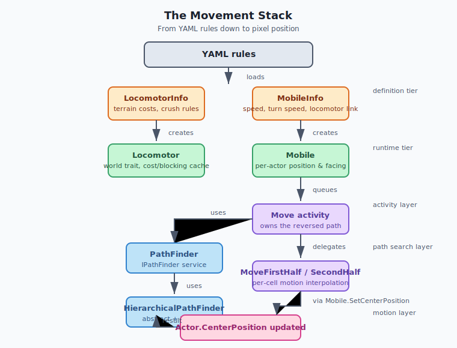
### Key classes and interfaces

- **`LocomotorInfo` / `Locomotor`** — The [world](#file-appendices-Appendix_A_Glossary) trait that owns the movement rules for a locomotor type. It stores `TerrainSpeeds` (which maps terrain type names to speed and path cost), `SharesCell`, `MoveIntoShroud`, `Crushes`, and more. The runtime `Locomotor` builds per-cell cost layers and a blocking cache that is updated whenever actors or terrain change. It is the single source of truth for "can this actor enter this cell." See [Part 2.4 — Rulesets, Actors, and Weapons](#file-chapters-Part_02_Chapter_04_Rules_Weapons) for how these infos are loaded from YAML.
- **`MobileInfo` / `Mobile`** — The per-actor trait that makes a unit movable. `MobileInfo` links the actor to a `Locomotor` by name, sets `Speed`, `TurnSpeed`, cursors, and voice responses. `Mobile` implements `IOccupySpace` so the actor has a `CenterPosition` and `OccupiedCells`, and it implements `IMove`/`IPositionable` so activities can query and set position. The `Locomotor` property is resolved in `Created` from the world actor. This is the ECS info/instance split described in [Part 1.1 — Entity-Component-System (ECS) and Actor Lifecycle](#file-chapters-Part_01_Chapter_01_ECS).
- **`IPathFinder`** — A world-level service that exposes `FindPathToTargetCell`, `FindPathToTargetCells`, `FindPathToTargetCellByPredicate`, and domain checks. `Mobile` caches a reference to it in `Created`.
- **`PathFinder`** — The concrete `IPathFinder` trait. It builds two `HierarchicalPathFinder` instances per `Locomotor`: one that ignores actors (`BlockedByActor.None`) and one that accounts for immovable actors (`BlockedByActor.Immovable`). It also validates inputs, handles the reversed path convention, and routes to the correct HPF.
- **`HierarchicalPathFinder`** — The performance core. It divides the map into a 10x10-cell grid, builds abstract nodes for connected regions within each grid, and connects adjacent grids into an abstract graph. It also assigns a *domain* index to each abstract node; if two cells map to different domains, no path exists. When a real path is requested, it first searches the abstract graph to guide the local search, then runs a local A* with a much better heuristic than straight-line distance.
- **`PathSearch`** — Plain A* over any `IPathGraph`. It maintains an open priority queue of `GraphConnection` and `CellInfo` (status, cost so far, estimated total cost, previous node). It can expand unidirectionally or bidirectionally and supports a `heuristicWeightPercentage`.
- **`IPathGraph` / `MapPathGraph` / `GridPathGraph` / `SparsePathGraph`** — The graph abstraction used by `PathSearch`. `MapPathGraph` expands to neighboring cells using `Locomotor.MovementCostToEnterCell`, while `GridPathGraph` restricts expansion to a bounding box and `SparsePathGraph` is used for the abstract graph.
- **`Move`** — The activity that owns the path and drives execution. It delegates actual per-cell motion to `MoveFirstHalf` and `MoveSecondHalf`, which interpolate `CenterPosition` and `Facing` over the tick distance.
- **`MoveWithinRange`** — A specialization of `MoveAdjacentTo` that calls `FindPathToTargetCells` with a candidate set of cells in an annulus around the target. It is used by `Attack` activities to stay within weapon range while remaining outside minimum range.

### Why the path is reversed

`PathFinder` and `HierarchicalPathFinder` consistently return paths in the form:

```
[target, ..., intermediate, source]
```

The `Move` activity consumes this by repeatedly taking `path[^1]` (the last element, which is the next cell to enter) and then removing it. This convention makes path reconstruction cheap inside `PathSearch.MakePath` and also allows the hierarchical pathfinder to handle an *unreachable source* gracefully: a unit is allowed to be standing on an inaccessible cell (for example, it was dropped there) and must be able to move *out*, but it is never allowed to end a path on an inaccessible target.

### Blocking levels

`BlockedByActor` is an enum in `OpenRA.Mods.Common/TraitsInterfaces.cs` that controls how much other actors obstruct movement:

```
None      -> ignore all actors
Immovable -> ignore immovable actors only
Stationary -> ignore stationary actors (allow moving through moving actors)
All       -> fully blocked by any actor that isn't crushable or friendly-movable
```

`Move` tries the levels in order from most restrictive to least restrictive: `All`, `Stationary`, `Immovable`, `None`. If a path cannot be found while avoiding moving actors, it relaxes the constraint. This is the source of common "nudging" and "waiting" behavior.


## Data Flow / Code Path


### 1. Order generation and resolution

A player right-click on terrain triggers the order targeter in `Mobile.MoveOrderTargeter`. The targeter checks the terrain, shroud, and whether the unit is forced to require a force-move modifier. It returns an `Order` with `OrderString = "Move"`. [Part 1.3 — World, OrderManager, and Orders](#file-chapters-Part_01_Chapter_03_World_Orders) covers the order pipeline and [Part 9.1 — OrderManager and Lockstep Foundation](#file-chapters-Part_09_Chapter_01_OrderManager) covers the lockstep network flow that ensures every client receives the same order on the same tick.

### 2. From order to activity

`Mobile.ResolveOrder` receives the order:

```csharp
if (order.OrderString == "Move")
{
    var cell = self.World.Map.Clamp(self.World.Map.CellContaining(order.Target.CenterPosition));
    if (!Info.LocomotorInfo.MoveIntoShroud && !self.Owner.Shroud.IsExplored(cell))
        return;

    self.QueueActivity(order.Queued, WrapMove(new Move(self, cell, WDist.FromCells(8), null, true, Info.TargetLineColor)));
    self.ShowTargetLines();
}
```

`WrapMove` allows other traits (e.g., `Transports` or `Aircraft`) to wrap the ground movement activity in something else via `IWrapMove`. `ShowTargetLines` draws the green line that players see in the viewport.

### 3. The Move activity starts

`Move.OnFirstRun` runs once before the first tick. It sets `mobile.MoveResult = MoveResult.InProgress`, optionally recalculates the nearest movable cell, and then tries to find a path with increasingly relaxed blocking:

```csharp
foreach (var check in PathSearchOrder) // All, Stationary, Immovable, None
{
    (alreadyAtDestination, path) = EvalPath(check);
    if (alreadyAtDestination || path.Count > 0)
        return;
}
```

`EvalPath` calls the `getPath` delegate created in the `Move` constructor. The default delegate looks roughly like this:

```csharp
getPath = check =>
{
    if (mobile.ToCell == destination)
        return (true, PathFinder.NoPath);

    return (false, mobile.PathFinder.FindPathToTargetCell(
        self, [mobile.ToCell], destination, check, ignoreActor: ignoreActor));
};
```

### 4. PathFinder routes the request

`PathFinder.FindPathToTargetCell` does several important things:

1. Resolves the actor's `Locomotor` from `Mobile` (a cached shortcut because `PathFinder` requires `Mobile`).
2. Validates the target cell: it must be inside the map, on a valid layer, and have a finite movement cost.
3. For a single source, picks the appropriate `HierarchicalPathFinder` and calls `FindPath`.
4. For multiple sources, uses the same HPF but with a unidirectional search.
5. If a specific actor is to be ignored, it uses the `BlockedByActor.None` HPF to avoid accidentally routing through the ignored actor that the `Immovable` HPF might have cached as blocking.

### 5. HierarchicalPathFinder finds a route

For a typical long-distance move, the HPF does the following:

1. **Domain check.** It maps source and target to abstract nodes and compares their `abstractDomains`. If the domains differ, there is no path.
2. **Short-distance shortcut.** If source and target are within two grid distances, it attempts a local A* in a small bounding box first to avoid the cost of the abstract search.
3. **Abstract search.** It inserts temporary edges from the source and target cells into the abstract graph, then runs a `PathSearch` over the abstract graph using the default cost estimator. This produces an abstract route that is aware of obstacles such as cliffs, lakes, and buildings.
4. **Local search.** It creates a local `PathSearch` over the full map with a heuristic derived from the abstract search. The heuristic estimates remaining cost to the target by looking at the next abstract node along the abstract route, rather than using a straight-line distance. This dramatically reduces the number of cells explored.
5. **Bidirectional search.** For single-source/single-target requests, the HPF runs two local searches in opposite directions and joins them when they meet (`PathSearch.FindBidiPath`).
6. **Return.** The resulting path is reversed and returned to `PathFinder`, which returns it to `Move`.

### 6. PathSearch (A*)

`PathSearch` is the generic engine:

```
1. Add initial cells to the priority queue with cost = heuristic * weight / 100.
2. While the queue is not empty:
   a. Pop the lowest estimated-cost cell.
   b. If it is the target, reconstruct path and return.
   c. Mark it Closed.
   d. For each neighbor from IPathGraph.GetConnections:
      i. Compute new cost so far.
      ii. If neighbor is Closed or the new cost is not better, skip.
      iii. Compute estimated remaining cost via heuristic.
      iv. Update CellInfo and push to queue.
3. If the queue empties, return PathFinder.NoPath.
```

The heuristic is weighted by `HeuristicWeightPercentage` (default 125). A weight above 100 makes the search faster but the path may be up to that percentage longer than optimal. A weight of 100 produces an admissible A* search and the shortest path. The Red Alert mod leaves the default at 125, which is a good trade-off for typical RTS maps.

### 7. Move executes the path

Back in `Move.Tick`, the activity pops the next cell from the path. If the cell is blocked, it waits briefly, notifies blockers, and may repath. If the path is still valid, it queues the actual movement children:

- `MoveFirstHalf` interpolates from the current sub-cell position to the midpoint between cells, updating `CenterPosition` and `Facing` each tick.
- `MoveSecondHalf` interpolates from the midpoint to the center of the new cell.
- If the next cell requires a sharp turn, a `Turn` child is queued first.

When `MoveSecondHalf` completes, it calls `mobile.SetPosition(self, mobile.ToCell)`, which snaps the actor to the new cell, updates `ActorMap` influence, and triggers `FinishedMoving` notifications (including crushing). The `Move` activity then proceeds to the next path cell on the following tick.

### 8. Movement speed

`MoveFirstHalf.Tick` advances `progress` by `mobile.MovementSpeedForCell(mobile.ToCell)` per tick unless the previous part completed on the same tick. `Mobile.MovementSpeedForCell` applies the unit's base `Speed` to the terrain speed from `Locomotor.MovementSpeedForCell`, then multiplies by any `ISpeedModifier` traits. This is where YAML-defined speeds become world-unit motion. See [Part 1.4 — Deterministic Math and Coordinate Systems](#file-chapters-Part_01_Chapter_04_Math) for the fixed-point [WPos](#file-appendices-Appendix_A_Glossary)/`WDist` math used in the interpolation.


## Configuration (YAML)


### Locomotor

Locomotors are defined on the world actor. In the Red Alert mod this is in `mods/ra/rules/defaults.yaml` or `mods/ra/rules/world.yaml` under the `World` actor:

```yaml
World:
    Locomotor@default:
        Name: default
        Crushes: crate, wall
        SharesCell: false
        MoveIntoShroud: true
        TerrainSpeeds:
            Clear: 100
                PathingCost: 100
            Rough: 70
            Road: 110
            Water: 0
```

Field reference:

| YAML key | C# field | Meaning |
| :---- | :---- | :---- |
| `Name` | `LocomotorInfo.Name` | Identifier referenced by `Mobile`. |
| `SharesCell` | `LocomotorInfo.SharesCell` | Allows multiple infantry-style units in one cell using sub-cells. |
| `MoveIntoShroud` | `LocomotorInfo.MoveIntoShroud` | Whether the unit can be ordered into unexplored terrain. |
| `Crushes` | `LocomotorInfo.Crushes` | Bitset of `CrushClass` types this locomotor can drive over. |
| `CrushDamageTypes` | `LocomotorInfo.CrushDamageTypes` | Damage types applied to crushed actors. |
| `TerrainSpeeds` | `LocomotorInfo.TerrainSpeeds` | Dictionary of terrain type to speed and optional `PathingCost`. A speed of `0` or missing entry means impassable. |
| `WaitAverage` / `WaitSpread` | `LocomotorInfo.WaitAverage` / `WaitSpread` | How long a unit waits before repathing when blocked. |

The `PathingCost` field is important: it is separate from the displayed speed. A terrain can have high speed but high pathing cost (e.g., a long detour), or low speed but low cost (e.g., a shortcut). The default cost is `10000 / speed`.

### Mobile

Mobile is attached to the actor itself:

```yaml
1TNK:
    Inherits: ^Vehicle
    Mobile:
        Locomotor: tracked
        Speed: 128
        TurnSpeed: 16
        Cursor: move
        TerrainCursors:
            Clear: move
            Water: move-blocked
```

Field reference:

| YAML key | C# field | Meaning |
| :---- | :---- | :---- |
| `Locomotor` | `MobileInfo.Locomotor` | Name of the `Locomotor` to use. Must exist on the world actor. |
| `Speed` | `MobileInfo.Speed` | Base speed applied to terrain speed. |
| `TurnSpeed` | `MobileInfo.TurnSpeed` | How fast the actor turns, in `WAngle` units per tick. |
| `AlwaysTurnInPlace` | `MobileInfo.AlwaysTurnInPlace` | Infantry-style; never use curved trajectories. |
| `TurnsWhileMoving` | `MobileInfo.TurnsWhileMoving` | Turn continuously during movement rather than stopping. |
| `CanMoveBackward` | `MobileInfo.CanMoveBackward` | Allows reversing. |
| `MaxBackwardCells` | `MobileInfo.MaxBackwardCells` | Maximum path length for which reversing is allowed. |
| `RequireForceMoveCondition` | `MobileInfo.RequireForceMoveCondition` | Boolean expression that forces the player to use force-move. |
| `ImmovableCondition` | `MobileInfo.ImmovableCondition` | Boolean expression that makes this actor immovable (affects pathfinder blocking). |
| `TerrainCursors` | `MobileInfo.TerrainCursors` | Cursor overrides per terrain type. |

### PathFinder

Also on the world actor:

```yaml
World:
    PathFinder:
        HeuristicWeightPercentage: 125
```

| YAML key | C# field | Meaning |
| :---- | :---- | :---- |
| `HeuristicWeightPercentage` | `PathFinderInfo.HeuristicWeightPercentage` | Weight applied to the A* heuristic. 100 = optimal, >100 = faster but possibly suboptimal. |

### PathFinderOverlay (debug)

```yaml
World:
    PathFinderOverlay:
        ShowCosts: true
```

This enables the `/path-debug` chat command when `DeveloperMode` is active. It renders the abstract graph (green lines) and the local search edges (yellow lines) for the selected actor, plus cost labels if `ShowCosts` is true.

### MapGrid

Although not part of movement directly, the `MapGrid` configuration in `mod.yaml` defines sub-cell offsets and whether the grid is rectangular or isometric. See [Part 1.4 — Deterministic Math and Coordinate Systems](#file-chapters-Part_01_Chapter_04_Math) for the full `MapGrid` field reference. Sub-cells are central to `SharesCell` locomotors and `Locomotor.GetAvailableSubCell`.

## Interconnectivity

- **Depends on:**
  - **[Part 1.1 — Entity-Component-System (ECS) and Actor Lifecycle](#file-chapters-Part_01_Chapter_01_ECS)** — `Actor`, `TraitInfo`/`Trait`, `IOccupySpace`, `Trait<T>` queries, and `Created`/`Tick` hooks.
  - **[Part 1.2 — Activities and the Game Loop](#file-chapters-Part_01_Chapter_02_Activities)** — `Activity` lifecycle, `TickOuter`, `ChildActivity`, `QueueChild`, and `OnFirstRun`/`OnLastRun`.
  - **[Part 1.3 — World, OrderManager, and Orders](#file-chapters-Part_01_Chapter_03_World_Orders)** — How `Move` orders are generated, buffered, and resolved.
  - **[Part 1.4 — Deterministic Math and Coordinate Systems](#file-chapters-Part_01_Chapter_04_Math)** — `CPos`, `WPos`, `WVec`, `WAngle`, `WDist`, and `MapGrid` conversions.
  - **[Part 2.4 — Rulesets, Actors, and Weapons](#file-chapters-Part_02_Chapter_04_Rules_Weapons)** — YAML loading of `LocomotorInfo` and `MobileInfo`, `IRulesetLoaded`, and `ActorInfo` dependency resolution.
  - **[Part 9.1 — OrderManager and Lockstep Foundation](#file-chapters-Part_09_Chapter_01_OrderManager)** — Why only orders cross the network and why all movement must be deterministic.

- **Used by:**
  - Attack activities (`Attack`, `AttackMoveActivity`) that call `Mobile.MoveWithinRange` or `MoveToTarget`.
  - Harvester AI, which chains `Move` activities between resource fields and refineries.
  - [Part 8.3 — Bot Squads and Combat Heuristics](#file-chapters-Part_08_Chapter_03_Squads), which issues move orders programmatically.
  - Lua map scripts (`Actor.Move` and `Actor.MoveTo`) that create `Move` activities via the actor's `IMove` interface.
  - The pathfinder overlay and debugging tools described in this chapter.


## Algorithms


### A* with a weighted heuristic

`PathSearch` implements A* on a graph where nodes are `CPos` cells and edges are movement costs. The cost of an edge from cell A to adjacent cell B is given by `Locomotor.MovementCostToEnterCell`. The heuristic used by default is the *diagonal distance* on the grid, scaled by the minimum terrain cost.

The weighted heuristic function is:

```
f(n) = g(n) + h(n) * weight / 100
```

where `g(n)` is the cost from the source to `n` and `h(n)` is the estimated cost from `n` to the target. When `weight = 100` the heuristic is admissible and A* is guaranteed optimal. When `weight > 100` the search expands fewer nodes but may return a path up to `weight - 100` percent longer than optimal.

### Hierarchical pathfinding

The map is divided into a 10x10 abstract grid. For each grid cell, the HPF flood-fills the reachable cells on each layer and creates one abstract node per connected region. Edges between abstract nodes are computed at grid boundaries and custom movement layer transitions. Each abstract node is also assigned a domain index via another flood fill; equal domains mean a path exists (ignoring movable actors).

When a real path is requested:

1. Source and target cells are mapped to abstract nodes.
2. An abstract A* search from source to target gives the high-level route.
3. The local A* heuristic at any cell `n` is the cost from `n` to the next abstract node along the abstract route, plus the remaining abstract cost. This guides the local search around obstacles rather than blindly toward the target.

This is a one-level abstraction. It handles terrain and immovable actors well, but it cannot predict congestion from other moving units, which is why `Move` can repath with a relaxed blocking level.

### Domain check

`HierarchicalPathFinder` assigns each abstract node a domain index. `PathFinder.PathExistsForLocomotor` and `PathMightExistForLocomotorBlockedByImmovable` compare domains to answer "is there any path?" cheaply. This is used by activities that want to avoid expensive path searches when the destination is on a different island of passable terrain.

### Cell blocking and crush logic

`Locomotor.CanMoveFreelyInto` is the authoritative rule. It checks:

1. Is the cell inside the map and on a valid layer?
2. Is the terrain cost finite?
3. Does the requested `BlockedByActor` level allow the actors currently in the cell?
4. Is the actor able to crush any occupant that would otherwise block it?

The result is cached in `Locomotor.blockingCache` per cell, with `CellFlag` bits for `HasMovingActor`, `HasStationaryActor`, `HasMovableActor`, `HasCrushableActor`, `HasTemporaryBlocker`, and `HasTransitOnlyActor`. The cache is marked dirty when `ActorMap.CellUpdated` fires and refreshed on the next read.


## Extension Points


### Adding a new movement type

The most common extension is defining a new `Locomotor` and making actors use it. For example, a "hover" locomotor could ignore rough terrain by giving it a high speed on `Clear`, `Rough`, and `Road` while keeping `Water` at 0.

```yaml
Locomotor@hover:
    Name: hover
    SharesCell: false
    Crushes: crate
    TerrainSpeeds:
        Clear: 120
        Rough: 100
        Road: 120
        Water: 0
```

Then attach `Mobile` to an actor with `Locomotor: hover`.

### Custom movement layers

Implement `ICustomMovementLayer` (e.g., tunnels, subterranean travel, elevated bridges, jumpjets) to create movement layers above the ground layer. A locomotor must be enabled for the layer (`EnabledForLocomotor`) and provide entry/exit costs. The HPF automatically connects ground-layer grids to custom-layer grids when these costs are finite. This is an advanced topic; the existing TS/RA2 mods contain the primary examples.

### Custom path cost

`FindPathToTargetCell` accepts a `Func<CPos, int> customCost`. Returning `PathGraph.PathCostForInvalidPath` from this delegate marks the cell as impassable for this specific search. This is used by attack activities to avoid cells near the target that are already occupied by allies, or by scripted missions to mark no-go zones.

### Speed modifiers

Implement `ISpeedModifier` on a trait and add it to the actor. `Mobile.MovementSpeedForCell` collects all enabled modifiers and applies them as percentage multipliers to the final speed. This is used by veterancy, crates, and terrain-specific effects without changing the locomotor definition.

### IWrapMove

Implement `IWrapMove` to intercept every `Move` activity created by `Mobile`. `Transports` uses this to tell units to move into a transport rather than across the ground. This is an activity-level extension point, not a pathfinding one.

### PathFinderOverlay colors

The `PathFinderOverlayInfo` trait exposes colors and cost display. Mods can change the overlay appearance or disable cost labels by YAML overrides.


## Common Pitfalls / Guardrails


### Determinism

All pathfinding and movement must be [deterministic](#file-appendices-Appendix_A_Glossary). The OpenRA simulation layer contains no floating-point math for gameplay state. Use `WPos`, `WAngle`, `WDist`, `CPos`, and `CVec` ([Part 1.4 — Deterministic Math and Coordinate Systems](#file-chapters-Part_01_Chapter_04_Math)). Do not use `Math.Sqrt`, `Random`, or `float` in path cost calculations. The world random (`self.World.SharedRandom`) is deterministic and seeded from the game state, but it should not be used in path cost evaluation because it would produce different paths on different clients.

### Source/target asymmetry

Path searches are deliberately asymmetric: a unit may leave an inaccessible cell but may never enter one. Swapping source and target arguments will often produce a `NoPath` result. Always call the correct API: `FindPathToTargetCell` for one target, `FindPathToTargetCells` for multiple targets, and `FindPathToTargetCellByPredicate` for a predicate search.

### Reversed paths

`PathFinder` returns paths in the form `[target, ..., source]`. Activities that forget this and try to read index `0` as the next step will move to the destination immediately. `Move` handles this by repeatedly reading the last element.

### Stale paths and repathing

A path is computed at a single tick in time. Other actors move, buildings are destroyed, and terrain may change. `Move` validates that the next cell is still adjacent (`Util.AreAdjacentCells`) and still enterable (`mobile.CanEnterCell`). If not, it repaths. Do not cache long paths across many ticks without revalidation.

### Heuristic weight and player perception

`PathFinderInfo.HeuristicWeightPercentage` default 125 can produce visibly non-optimal short paths. The HPF mitigates this by forcing a weight of 100 for short-distance local searches. If you increase the global weight, be aware that players may report "units taking the long way around."

### Blocking cache consistency

`Locomotor.UpdateCellBlocking` and `HierarchicalPathFinder.ActorIsBlocking`/`ActorCellIsBlocking` replicate the same blocking logic. If you change one, you must change the other. The source comments explicitly call this out. If they drift, the HPF may think a cell is blocked when the local pathfinder does not, or vice versa, causing inconsistent paths or failed domain checks.

### PathFinderOverlay is a cheat

`/path-debug` requires `DeveloperMode` to be enabled. It is intended for debugging only and should not be enabled in normal multiplayer rules. The overlay itself does not affect simulation state, but it is only accurate for the selected actor's most recent search.

### No exact path through dynamic crowds

The abstract graph only accounts for `BlockedByActor.Immovable` actors (buildings, trees, walls). It does not know where other moving units are. A path through a chokepoint may be valid at search time but blocked by a crowd when the unit arrives. The `Move` activity handles this by waiting, nudging, and repathing, but it can still fail if no route opens. Do not assume pathfinding will perfectly route around traffic jams.

## Summary

This chapter explains how OpenRA turns a destination cell into a sequence of smooth, deterministic unit motions.

After reading this chapter, you should be able to:

- Distinguish the roles of `Mobile`, `Locomotor`, `PathFinder`, `PathSearch`, `HierarchicalPathFinder`, and `Move`.
- Trace the complete flow from a player click to a unit arriving at a destination cell.
- Explain how terrain costs and actor blocking are combined into a movement graph.
- Describe how A* is used, why the heuristic is weighted, and what the abstract graph in `HierarchicalPathFinder` is for.
- Understand why paths are returned *reversed* and why source/target asymmetry matters.
- Read and modify YAML that configures locomotion, movement speed, and pathfinding debug overlays.
- Use the `/path-debug` command and interpret the pathfinding overlay.
- Identify common pitfalls: desyncs from non-deterministic movement, stale paths, and lane-bias assumptions.

If any of the concepts above feel unclear, review the relevant section before continuing. For source files and further reading, see the References section.


## References

- [Part 1.1 — Entity-Component-System (ECS) and Actor Lifecycle](#file-chapters-Part_01_Chapter_01_ECS)
- [Part 1.2 — Activities and the Game Loop](#file-chapters-Part_01_Chapter_02_Activities)
- [Part 1.3 — World, OrderManager, and Orders](#file-chapters-Part_01_Chapter_03_World_Orders)
- [Part 1.4 — Deterministic Math and Coordinate Systems](#file-chapters-Part_01_Chapter_04_Math)
- [Part 2.4 — Rulesets, Actors, and Weapons](#file-chapters-Part_02_Chapter_04_Rules_Weapons)
- [Part 9.1 — OrderManager and Lockstep Foundation](#file-chapters-Part_09_Chapter_01_OrderManager)
- `OpenRA.Mods.Common/Traits/World/PathFinder.cs`
- `OpenRA.Mods.Common/Pathfinder/PathSearch.cs`
- `OpenRA.Mods.Common/Pathfinder/HierarchicalPathFinder.cs`
- `OpenRA.Mods.Common/Pathfinder/IPathGraph.cs`
- `OpenRA.Mods.Common/Traits/World/Locomotor.cs`
- `OpenRA.Mods.Common/Traits/Mobile.cs`
- `OpenRA.Mods.Common/Activities/Move/Move.cs`
- `OpenRA.Mods.Common/Activities/Move/MoveWithinRange.cs`
- `OpenRA.Mods.Common/Traits/World/PathFinderOverlay.cs`
- `OpenRA.Mods.Common/TraitsInterfaces.cs` (`IPathFinder`, `IPositionable`, `IMove`, `BlockedByActor`)
- `OpenRA.Game/Traits/TraitsInterfaces.cs` (`IOccupySpace`, `IOrderTargeter`, `IIssueOrder`, `IResolveOrder`, `IActorMap`)
- `OpenRA.Game/Map/ActorInitializer.cs` (`LocationInit`, `SubCellInit`, `CenterPositionInit`, `FacingInit`)
- Amit Patel's game programming heuristics guide, referenced in `PathSearch.DefaultCostEstimator`: https://theory.stanford.edu/~amitp/GameProgramming/Heuristics.html

## What to read next

- [Part 1.6 — Combat, Damage, and Projectiles](#file-chapters-Part_01_Chapter_06_Combat_Damage): movement exists mainly to put units in position to attack; this chapter shows how combat uses the same pathfinding, target, and trait patterns.
- [Part 9.1 — OrderManager and Lockstep Foundation](#file-chapters-Part_09_Chapter_01_OrderManager): understand why every movement order is a deterministic, replayable order and how the network enforces the same tick for all clients.
- [Part 2.4 — Rulesets, Actors, and Weapons](#file-chapters-Part_02_Chapter_04_Rules_Weapons): continue from YAML definitions to runtime traits, especially `LocomotorInfo` and `MobileInfo` loading.


---

<a id="file-chapters-Part_01_Chapter_06_Combat_Damage"></a>

<!-- --- FILE: chapters/Part_01_Chapter_06_Combat_Damage.md --- -->

# Chapter 1.6 — Combat and Damage Resolution {#file-chapters-Part_01_Chapter_06_Combat_Damage}

## Purpose

This chapter traces the path from **"I want to attack that"** to **"the [target](#file-appendices-Appendix_A_Glossary)'s HP is reduced"** in OpenRA. It ties together the ECS [actor](#file-appendices-Appendix_A_Glossary) model from [Part 1.1 — Entity-Component-System (ECS) and Actor Lifecycle](#file-chapters-Part_01_Chapter_01_ECS), the ruleset/weapon definitions from [Part 2.4 — Rulesets, Actors, and Weapons](#file-chapters-Part_02_Chapter_04_Rules_Weapons), and the activity/order system from [Part 1.2 — Activities and the Game Loop](#file-chapters-Part_01_Chapter_02_Activities) and [Part 1.3 — World, OrderManager, and Orders](#file-chapters-Part_01_Chapter_03_World_Orders).

Combat internals are deliberately split across many small, single-purpose classes:

- `AttackBase` decides *when* and *what* to attack.
- `Armament` turns a weapon definition into a fired projectile.
- `WeaponInfo` owns the projectile and warheads.
- `IProjectile` implementations move the shot through the [world](#file-appendices-Appendix_A_Glossary).
- `IWarhead` implementations apply effects on impact.
- `Health` and `Armor` resolve the final numeric [damage](#file-appendices-Appendix_A_Glossary).

The goal is to show how those pieces cooperate without ever hard-coding a specific unit in the engine.

## Learning Objectives


After studying this chapter, you should be able to:

1. Trace a complete attack from an order through `AttackBase`, `Armament`, projectile creation, `Weapon.Impact`, warhead resolution, and `Health.InflictDamage`.
2. Explain the difference between weapon-level validation (`WeaponInfo.ValidTargets` / `InvalidTargets`) and warhead-level validation (`Warhead.ValidTargets` / `ValidRelationships`).
3. Describe how `DamageWarhead` combines firepower modifiers, armor `Versus` values, and `DamageTypes` into a final `Damage` instance.
4. Identify the role of `HitShape` in targeting and area-of-effect falloff calculations.
5. Add a new projectile, warhead, or damage modifier using the correct extension interfaces.
6. Diagnose common combat bugs such as "no damage dealt," "weapon won't fire," and "armor type is ignored."


## Practical Example: A 120 mm Shell versus a Heavy Tank


Imagine a tank firing a single shell at a heavy tank.

**Weapon definition**

```yaml
120mm:
    Range: 4c0
    ReloadDelay: 80
    ValidTargets: Ground, Water, GroundActor, WaterActor
    Projectile: Bullet
        Speed: 384
        Inaccuracy: 0
    Warhead@1Dam: SpreadDamage
        Spread: 128
        Damage: 4000
        ValidTargets: GroundActor, WaterActor
        Versus:
            None: 100
            Light: 60
            Heavy: 100
            Concrete: 30
        DamageTypes: ExplosionDeath
    Warhead@2Eff: CreateEffect
        Explosions: explosion
        ValidTargets: Ground, GroundActor, Water, WaterActor
```

**Target definition**

```yaml
HTNK:
    Inherits: ^Vehicle
    Health:
        HP: 50000
    Armor:
        Type: Heavy
    HitShape:
        Type: Circle
        Radius: 512
    Targetable:
        TargetTypes: GroundActor
```

**What happens at runtime**

1. The player issues an **Attack** [order](#file-appendices-Appendix_A_Glossary). `AttackBase` resolves it and starts an attack [activity](#file-appendices-Appendix_A_Glossary).
2. `AttackBase.DoAttack` finds the `Armament` whose `Name` matches the weapon slot.
3. `Armament.CheckFire` checks range, reload, target validity, and facing/turret alignment, then calls `FireBarrel`.
4. `FireBarrel` builds a `ProjectileArgs` and creates a `Bullet` via `BulletInfo.Create`.
5. The `Bullet` travels one tick at a time. When it reaches the target position, it builds a `WarheadArgs` and calls `WeaponInfo.Impact`.
6. `WeaponInfo.Impact` iterates its warheads. `Warhead@1Dam` is a `SpreadDamageWarhead`, so it runs `SpreadDamageWarhead.DoImpact`.
7. The warhead searches actors in the outer `Spread` radius, finds `HTNK`, validates target type and relationship, and selects the nearest `HitShape`.
8. `DamageVersus` sees the `Armor.Type: Heavy` and the warhead's `Versus: Heavy: 100`, so no armor reduction applies.
9. `DamageWarhead.InflictDamage` builds a `Damage` instance with `Value = 4000` and `DamageTypes = ExplosionDeath`.
10. `Actor.InflictDamage` forwards the call to `Health.InflictDamage`, which applies any `IDamageModifier` traits, clamps HP to `[0, MaxHP]`, and fires `INotifyDamage` / `INotifyDamageStateChanged` callbacks. If HP reaches 0, `INotifyKilled` callbacks run and the actor is disposed.

The final HP reduction is `50000 -> 46000` (assuming no external damage modifiers). The same pipeline is used for machine-gun bullets, missiles, explosions, and even bridge demolition.

## Files

| File | Responsibility |
| :---- | :---- |
| `OpenRA.Game/GameRules/WeaponInfo.cs` | Parses a weapon from YAML into range, reload, burst, projectile, and warheads. Implements `IsValidAgainst` target validation and `Impact` dispatch. |
| `OpenRA.Game/GameRules/DamageTypes.cs` | **Does not exist.** The `DamageType` type tag lives in `OpenRA.Game/Traits/TraitsInterfaces.cs` as a sealed class used by `BitSet<DamageType>`. |
| `OpenRA.Game/Traits/TraitsInterfaces.cs` | Defines `IHealth`, `IHealthInfo`, `DamageType`, `Damage`, `AttackInfo`, and notification interfaces used during combat. |
| `OpenRA.Game/Actor.cs` | Provides the `InflictDamage` and `Kill` convenience wrappers that forward to the cached `IHealth` trait. |
| `OpenRA.Mods.Common/Traits/Armament.cs` | Attaches a weapon to an actor, handles reload/burst timing, muzzle offsets, and creates projectiles via `IProjectileInfo.Create`. |
| `OpenRA.Mods.Common/Traits/Attack/AttackBase.cs` | Abstract base for attack logic: order resolution, target validity, and driving attached armaments. |
| `OpenRA.Mods.Common/Traits/Attack/AttackFrontal.cs` | Requires the actor to face the target before firing. |
| `OpenRA.Mods.Common/Traits/Attack/AttackTurreted.cs` | Requires a turret to align before `AttackBase` fires. |
| `OpenRA.Mods.Common/Traits/Health.cs` | Stores HP, applies damage modifiers, clamps HP, and dispatches damage/kill notifications. |
| `OpenRA.Mods.Common/Traits/Armor.cs` | A simple type-tag trait used by damage warheads to select `Versus` modifiers. |
| `OpenRA.Mods.Common/Traits/HitShape.cs` | Defines the actor's physical shape, targetable positions, and which armor types apply to that shape. |
| `OpenRA.Mods.Common/Traits/Buildings/Bridge.cs` | Example of a destructible actor with `Health` that changes terrain templates on death. |
| `OpenRA.Mods.Common/Projectiles/Bullet.cs` | Straight-line or arcing projectile with optional bounce, trail, and contrail. |
| `OpenRA.Mods.Common/Projectiles/Missile.cs` | Homing missile with fuel, turn rates, and jamming support. |
| `OpenRA.Mods.Common/Projectiles/InstantHit.cs` | Direct, invisible projectile used by beams and small-arms. |
| `OpenRA.Mods.Common/Warheads/Warhead.cs` | Base class for warheads: target validation, delay support, and `DoImpact` hook. |
| `OpenRA.Mods.Common/Warheads/DamageWarhead.cs` | Base class for warheads that deal HP damage; applies `Versus` and `DamageModifiers`. |
| `OpenRA.Mods.Common/Warheads/SpreadDamageWarhead.cs` | Area-of-effect damage with distance falloff and multiple damage-calculation modes. |
| `OpenRA.Mods.Common/Warheads/CreateEffectWarhead.cs` | Spawns explosion sprite and sound effects on impact. |
| `OpenRA.Mods.Common/Warheads/FireClusterWarhead.cs` | Fires a secondary weapon from the impact point using a footprint pattern. |


## Architecture


### The combat pipeline

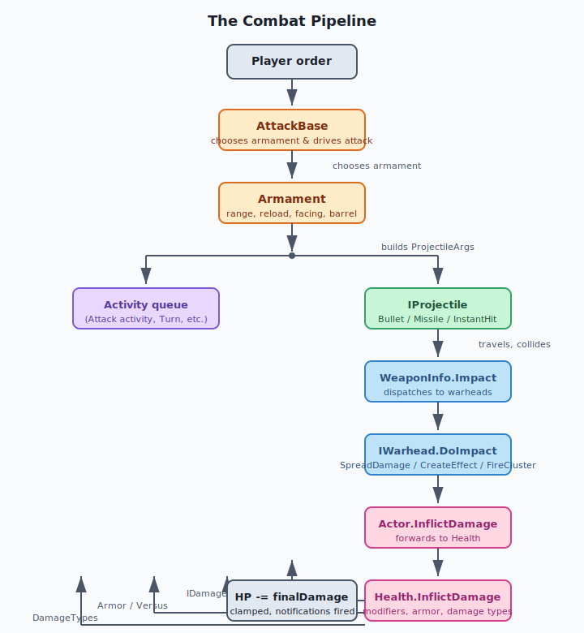
### Key classes and interfaces

- **`WeaponInfo`** — The immutable runtime definition of a weapon. It stores one `IProjectileInfo` and an ordered list of `IWarhead`s. Its `Impact` method is the entry point for warhead application.
- **`ProjectileArgs`** and **`WarheadArgs`** — Lightweight data bags that carry the source actor, target, muzzle facing, and accumulated damage modifiers from the armament to the projectile and from the projectile to the warheads.
- **`IProjectile` / `IProjectileInfo`** — Every projectile must implement `IProjectileInfo.Create` to produce a projectile instance, and `IProjectile` to receive per-tick `Tick` and `Render` calls.
- **`IWarhead`** — Implemented by all warheads. The base `Warhead` class provides target validation; derived classes implement `DoImpact`.
- **`AttackBase`** — An abstract ECS trait. It owns the **attack order**, the **target-line cursor**, and the loop that asks each `Armament` to fire. Concrete variants (`AttackFrontal`, `AttackTurreted`, `AttackFollow`) only change *when* the actor is considered ready to fire.
- **`Armament`** — The bridge between an actor and a weapon. It is responsible for reload timing, muzzle position, recoil, and notifying `INotifyAttack` listeners.
- **`Health`** / **`IHealth`** — The only place where an actor's HP is reduced. It also dispatches the entire damage notification graph.
- **`Armor`** — Has no behavior of its own. It is a typed marker queried by `DamageWarhead.DamageVersus`.
- **`HitShape`** — Provides the physical shape and targetable positions for targeting, falloff, and armor-type scoping.

### Why the pipeline is split this way

- **Reusability**: The same `WeaponInfo` can be mounted on infantry, vehicles, or turrets via different `Armament`/`AttackBase` combinations.
- **Data separation**: YAML decides *what* the weapon does; C# decides *how* to do it. No unit-specific code lives in the engine.
- **Determinism**: All randomness (inaccuracy, falloff scatter, effect selection) uses the shared world RNG or the local RNG consistently, which is important for replay and network sync.


## Data Flow / Code Path


The following is the complete flow for a normal ranged attack.

### 1. Order and attack activity

The player issues an `Attack` order. `AttackBase` implements `IResolveOrder` and `IIssueOrder`, so it creates an `Order` with the target. In `AttackBase.ResolveOrder`, the order is converted into an attack activity by calling `GetAttackActivity`, which is overridden by each attack type (e.g., `AttackFrontal` returns an `Attack` activity). The activity then runs each tick and repeatedly calls `AttackBase.DoAttack` when the target is reachable.

### 2. `AttackBase` chooses an armament

`DoAttack` first checks `CanAttack`, which verifies:

- The actor is in the world.
- The trait is not paused or disabled.
- The target is still valid for the attacker.
- At least one attached armament has a valid weapon (via `HasAnyValidWeapons`).
- The actor can interact with the ground layer if it is mobile.

It then loops over its `Armaments` and calls `Armament.CheckFire` for each.

### 3. `Armament` validates and fires

`Armament.CheckFire` runs `CanFire`, which checks:

- `FireDelay` / reload state (`IsReloading`).
- Turret alignment (`Turreted.HasAchievedDesiredFacing`).
- Range (`MaxRange()` and `Weapon.MinRange`).
- Weapon target validity (`WeaponInfo.IsValidAgainst`).

If everything passes, it constructs a `ProjectileArgs` containing:

- `Weapon` — the `WeaponInfo` from the armament.
- `DamageModifiers`, `InaccuracyModifiers`, `RangeModifiers` — arrays of percentages collected from traits such as `IFirepowerModifier`, `IInaccuracyModifier`, and `IRangeModifier`.
- `Source`, `CurrentSource`, `Facing`, `CurrentMuzzleFacing` — derived from the muzzle position and orientation.
- `PassiveTarget` — the aim point computed from the target's positions, burst offsets, and `TargetActorCenter`.
- `GuidedTarget` — the original `Target` for homing missiles.

`FireBarrel` schedules the actual projectile creation through `ScheduleDelayedAction` so that `FireDelay` and burst timing are honored. When the delay expires, `IProjectileInfo.Create` is called and the projectile is added to the world.

### 4. The projectile travels

Different projectiles behave differently:

- **`InstantHit`** — In its first `Tick`, it checks blocking actors if `Blockable` is true, builds a `WarheadArgs`, calls `WeaponInfo.Impact`, and removes itself.
- **`Bullet`** — Travels in a straight line or arc. It applies inaccuracy on creation, advances position each tick, supports bouncing, and calls `WeaponInfo.Impact` when its flight length is reached or it collides.
- **`Missile`** — Enters a homing state, updates velocity toward the guided target, and explodes when within `CloseEnough` distance or when it runs out of fuel.

All of them end with the same call: `args.Weapon.Impact(target, warheadArgs)`.

### 5. `WeaponInfo.Impact` dispatches warheads

```
foreach warhead in WeaponInfo.Warheads
    if warhead.Delay > 0
        schedule DelayedImpact
    else
        warhead.DoImpact(target, args)
```

Delayed warheads are wrapped in a `DelayedImpact` effect that calls `DoImpact` after the configured number of ticks. This is how time-delayed explosions work.

### 6. Warhead applies its effect

Every warhead inherits `Warhead.IsValidAgainst`, which checks:

- `AffectsParent` — can the weapon hit the attacker?
- `ValidRelationships` — is the target an ally, neutral, or enemy?
- `ValidTargets` / `InvalidTargets` — does the target's `BitSet<TargetableType>` overlap correctly?

Damage-dealing warheads (`DamageWarhead`) add an extra check: the target must have an `IHealthInfo` and an active `HitShape`.

For a single actor target, `DamageWarhead.DoImpact` finds the closest active `HitShape` and calls `InflictDamage(victim, firedBy, shape, args)`.

For a position target, `SpreadDamageWarhead.DoImpact` scans all actors within the outer radius, computes falloff distance from each actor's nearest `HitShape`, and calls `InflictDamage` per actor with a `DamageModifiers` array that includes the falloff percentage.

### 7. `DamageWarhead` calculates final damage

`DamageVersus` selects the armor values that apply:

```
for each enabled Armor trait on the victim
    if Versus contains the armor type
    and (HitShape has no ArmorTypes or ArmorTypes contains the armor type)
        include Versus[armor type]

final armor modifier = ApplyPercentageModifiers(100, selected values)
```

`InflictDamage` then combines firepower modifiers and armor modifiers:

```
damage = ApplyPercentageModifiers(Damage, DamageModifiers + DamageVersus)
```

and constructs `new Damage(damage, DamageTypes)`.

### 8. `Health` applies the result

`Actor.InflictDamage` simply calls `Health.InflictDamage` unless the actor is already disposed or has no health. `Health.InflictDamage` does the following:

1. If already dead, ignore the hit (overkill protection).
2. If `ignoreModifiers` is false and the damage is positive, apply every `IDamageModifier` on the actor and on the owning player's `PlayerActor`.
3. Subtract the final value from `HP` and clamp to `[0, MaxHP]`.
4. Build an `AttackInfo` and notify `INotifyDamage` and `INotifyDamageStateChanged` listeners.
5. If the attacker is alive and `NotifyAppliedDamage` is enabled, notify `INotifyAppliedDamage` listeners on the attacker.
6. If `HP` is now 0, notify `INotifyKilled` listeners and dispose the actor if `RemoveOnDeath` is true.

### 9. Death and side effects

`Bridge` is a useful example of a non-unit that uses the same pipeline. It has `Health`, reacts to `INotifyDamageStateChanged` in `Bridge.UpdateState`, and can call `Actor.Kill` on units standing on it when it collapses. `Actor.Kill` bypasses normal modifiers and inflicts exactly `MaxHP` damage with the given `DamageTypes`.


## Configuration (YAML)


### Weapon-level keys

| YAML key | C# field | Meaning |
| :---- | :---- | :---- |
| `Range` | `WeaponInfo.Range` | Maximum firing distance. |
| `MinRange` | `WeaponInfo.MinRange` | Minimum firing distance (used by `Armament.CanFire`). |
| `ReloadDelay` | `WeaponInfo.ReloadDelay` | Ticks between magazines. |
| `Burst` | `WeaponInfo.Burst` | Shots per magazine. |
| `BurstDelays` | `WeaponInfo.BurstDelays` | Ticks between shots in a burst. |
| `ValidTargets` | `WeaponInfo.ValidTargets` | BitSet of targetable types the weapon can aim at. |
| `InvalidTargets` | `WeaponInfo.InvalidTargets` | Overrides `ValidTargets`. |
| `TargetActorCenter` | `WeaponInfo.TargetActorCenter` | If true, aim at the actor's center instead of closest targetable position. |
| `Projectile` | `WeaponInfo.Projectile` | A nested `IProjectileInfo` block (e.g., `Bullet`, `Missile`, `InstantHit`). |
| `Warhead@Name` | `WeaponInfo.Warheads` | One or more warhead blocks. The suffix (`@1Dam`) is just for readability and YAML merging. |

### Projectile keys

- `Bullet` — `Speed`, `Inaccuracy`, `LaunchAngle`, `BounceCount`, `Blockable`, `Width`, `ContrailLength`, `Shadow`.
- `Missile` — `Speed`, `Acceleration`, `HorizontalRateOfTurn`, `VerticalRateOfTurn`, `RangeLimit`, `CloseEnough`, `Jammable`, `TrailImage`.
- `InstantHit` — `Inaccuracy`, `Blockable`, `Width`.

### Warhead keys (damage)

| YAML key | C# field | Meaning |
| :---- | :---- | :---- |
| `Spread` | `SpreadDamageWarhead.Spread` | Distance between falloff steps. |
| `Falloff` | `SpreadDamageWarhead.Falloff` | Damage percentage at each step. Defaults to `100, 37, 14, 5, 0`. |
| `Damage` | `DamageWarhead.Damage` | Base damage before modifiers. |
| `Versus` | `DamageWarhead.Versus` | Dictionary of `Armor.Type` to percentage. |
| `DamageTypes` | `DamageWarhead.DamageTypes` | BitSet of tags such as `ExplosionDeath`, `BulletDeath`, `FireDeath`. |
| `ValidTargets` | `Warhead.ValidTargets` | Targetable types this warhead can affect. |
| `ValidRelationships` | `Warhead.ValidRelationships` | `Enemy`, `Neutral`, `Ally`, or combinations. |
| `AffectsParent` | `Warhead.AffectsParent` | Can the warhead hit the attacker? |
| `Delay` | `Warhead.Delay` | Ticks before the warhead applies. |

### Armor and target type keys

```yaml
SomeUnit:
    Health:
        HP: 10000
    Armor:
        Type: Light
    HitShape:
        Type: Circle
        Radius: 256
        ArmorTypes: Light    # optional: only these armors apply to this shape
    Targetable:
        TargetTypes: GroundActor
```

- `Armor.Type` is an arbitrary string. It only matters if a warhead has a matching `Versus` entry.
- `HitShape.ArmorTypes` is optional. If specified, only those armor types are considered by `DamageVersus` for hits against this shape.
- `DamageTypes` are arbitrary string tags. Other traits (e.g., death animations, veterancy, crate effects) inspect them via `INotifyKilled` or `INotifyDamage`.

## Interconnectivity

### Depends on

- **[Part 1.1 — Entity-Component-System (ECS) and Actor Lifecycle](#file-chapters-Part_01_Chapter_01_ECS)** — All combat classes are traits attached to actors. `Armament`, `AttackBase`, `Health`, and `Armor` are created from `TraitInfo` and queried via `Trait`, `TraitOrDefault`, and `TraitsImplementing`.
- **[Part 1.2 — Activities and the Game Loop](#file-chapters-Part_01_Chapter_02_Activities)** — `AttackBase` returns an activity (`Attack`, `AttackFollow`) that manages movement and firing timing.
- **[Part 1.3 — World, OrderManager, and Orders](#file-chapters-Part_01_Chapter_03_World_Orders)** — Attack orders are issued, queued, and resolved through the world order system before reaching `AttackBase`.
- **[Part 1.5 — Pathfinding and Movement](#file-chapters-Part_01_Chapter_05_Pathfinding_Movement)** — `AttackMove` and `AttackFollow` rely on pathfinding to bring the attacker into range and to re-acquire targets.
- **[Part 2.4 — Rulesets, Actors, and Weapons](#file-chapters-Part_02_Chapter_04_Rules_Weapons)** — `WeaponInfo`, `ArmamentInfo`, and `ActorInfo` are built from YAML by the ruleset loader. `IRulesetLoaded` validates weapon references and warhead ranges.
- **[Part 8.3 — Bot Squads and Combat Heuristics](#file-chapters-Part_08_Chapter_03_Squads)** — AI squad modules issue attack orders and target selection decisions that feed into this same pipeline.

### Used by

- AI bot modules and [Part 6.1 — Lua Scripting and Eluant](#file-chapters-Part_06_Chapter_01_Lua_Eluant) — trigger attacks, check `IsDead`, and react to damage states.
- [Part 5.1 — Audio Architecture](#file-chapters-Part_05_Chapter_01_Audio_Architecture) — plays `Report`, `StartBurstReport`, and impact sounds.
- Renderer — muzzle flashes, projectile sprites, explosion effects, and debug overlays (`WarheadDebugOverlay`).
- Score/statistics traits — listen to `INotifyKilled` and `INotifyAppliedDamage`.


## Algorithms


### Damage modifier composition

OpenRA stores modifiers as integer percentages (e.g., `50` means half damage, `200` means double). The helper `Util.ApplyPercentageModifiers` multiplies them together in sequence:

```
result = baseValue
for each modifier in modifiers
    result = result * modifier / 100
```

`DamageModifiers` are collected from `IFirepowerModifier` on the attacker. `Armor` values come from `Versus`. `SpreadDamageWarhead` also appends a falloff percentage. The order is important only in that all percentages are multiplicative; the final result is the same regardless of sequence.

### Armor selection (`DamageVersus`)

```
selected = empty list
foreach Armor a on victim (not disabled)
    if a.Type is in Versus
        and (HitShape.ArmorTypes is empty or HitShape.ArmorTypes contains a.Type)
            selected.Add(Versus[a.Type])

if selected is empty
    return 100
else
    return ApplyPercentageModifiers(100, selected)
```

### Area-of-effect falloff

`SpreadDamageWarhead.GetDamageFalloff` walks the `effectiveRange` array built from `Spread` or `Range`:

```
inner = 0
for i = 1 to effectiveRange.Length - 1
    outer = effectiveRange[i]
    if distance < outer
        return Lerp(Falloff[i-1], Falloff[i], distance - inner, outer - inner)
    inner = outer
return 0
```

`int2.Lerp` is a linear interpolation clamped to the range. This is why units at the edge of an explosion take far less damage.

### Target validity

Both `WeaponInfo` and `Warhead` use the same pattern:

```
isValid = ValidTargets.Overlaps(targetTypes) && !InvalidTargets.Overlaps(targetTypes)
```

`BitSet<TargetableType>` makes this a fast bit-mask operation.


## Extension Points


1. **New projectile** — Implement `IProjectileInfo` and `IProjectile`. Register the class in the mod assembly; YAML then uses `Projectile: MyProjectile`. Implement `ISync` if the projectile needs to participate in network sync.
2. **New warhead** — Inherit `Warhead` (or `DamageWarhead` for HP damage). Implement `IRulesetLoaded<WeaponInfo>` to validate cross-references. YAML uses `Warhead@Name: MyWarhead`.
3. **New attack behavior** — Inherit `AttackBase` and override `CanAttack` and `GetAttackActivity`. Use `Requires<T>` in the `*Info` class to demand prerequisites such as `IFacingInfo` or `TurretedInfo`.
4. **Damage modifiers** — Implement `IDamageModifier` on the victim or on the `PlayerActor` to reduce or increase incoming damage. Implement `IFirepowerModifier` on the attacker to increase outgoing damage. Implement `IRangeModifier` or `IInaccuracyModifier` to change weapon range or projectile spread.
5. **Custom armor behavior** — The `Armor` trait itself is just a tag, but a custom `IDamageModifier` can read `DamageTypes` or `Armor.Type` to implement special rules (e.g., directional armor, shields).
6. **Damage/death notifications** — Implement `INotifyDamage`, `INotifyDamageStateChanged`, `INotifyKilled`, or `INotifyAppliedDamage` to react to combat events (veterancy, score, death animation, etc.).
7. **Combat debug overlay** — The engine can draw `Warhead` impact ranges and shapes via `WarheadDebugOverlay` when the `DebugVisualizations.CombatGeometry` flag is enabled.


## Common Pitfalls / Guardrails


- **No `DamageTypes.cs` file.** The `DamageType` tag is defined in `OpenRA.Game/Traits/TraitsInterfaces.cs`. Damage type strings are arbitrary and only meaningful to traits that consume them.
- **Health requires a `HitShape`.** `HealthInfo.RulesetLoaded` throws if the actor has no `HitShapeInfo`. Without a shape, the actor cannot be targeted or damaged by warheads.
- **Armor strings must match exactly.** If a warhead's `Versus` has `Heavy` but the actor's `Armor.Type` is `Hevy` (typo), the default 100% modifier is used silently.
- **Weapon `ValidTargets` vs. warhead `ValidTargets`.** The weapon controls whether the cursor/activity can target something. The warhead controls what actually happens on impact. It is common to have a weapon valid against `Ground` and a damage warhead valid only against `GroundActor`.
- **Damage modifiers apply only to positive damage.** `Health.InflictDamage` skips `IDamageModifier` when `damage.Value <= 0` or when `ignoreModifiers` is true. This is why healing or self-damage can be made unmodified.
- **Delayed warheads can hit disposed actors.** If the target is destroyed before a delayed warhead fires, the warhead should re-validate the target in `DoImpact`. The built-in damage warheads already do this.
- **`Actor.InflictDamage` is not the final authority.** The `Actor` wrapper simply forwards to `Health`. For special logic, call `IHealth.InflictDamage` directly or use `Actor.Kill`.
- **`InstantHit` is not free.** It still runs world queries for blocking actors when `Blockable` is true, which can be expensive with many shots.
- **Projectile randomness must be deterministic.** Use `World.SharedRandom` for gameplay-affecting randomness (inaccuracy, missile jitter) and `World.LocalRandom` for purely visual effects (explosion sprite selection, sound choice). This preserves replay/sync.
- **Do not mutate `WeaponInfo` at runtime.** `WeaponInfo` objects are shared across all actors. Runtime state belongs in the projectile, warhead args, or actor traits.
- **Bursts and `BurstDelays` length.** If you supply more than one `BurstDelays` value, the count must equal `Burst - 1`. `ArmamentInfo.RulesetLoaded` validates this.
- **ReloadDelay must be > 0.** `ArmamentInfo.RulesetLoaded` rejects `ReloadDelay <= 0`.
- **Bridge `RemoveOnDeath`.** `Bridge` sets `health.RemoveOnDeath = false` because the actor must survive to be repaired. Most units leave `RemoveOnDeath = true` so they are removed from the world on death.

## Summary

This chapter traces the path from **"I want to attack that"** to **"the [target](#file-appendices-Appendix_A_Glossary)'s HP is reduced"** in OpenRA.

After reading this chapter, you should be able to:

- Trace a complete attack from an order through `AttackBase`, `Armament`, projectile creation, `Weapon.Impact`, warhead resolution, and `Health.InflictDamage`.
- Explain the difference between weapon-level validation (`WeaponInfo.ValidTargets` / `InvalidTargets`) and warhead-level validation (`Warhead.ValidTargets` / `ValidRelationships`).
- Describe how `DamageWarhead` combines firepower modifiers, armor `Versus` values, and `DamageTypes` into a final `Damage` instance.
- Identify the role of `HitShape` in targeting and area-of-effect falloff calculations.
- Add a new projectile, warhead, or damage modifier using the correct extension interfaces.
- Diagnose common combat bugs such as "no damage dealt," "weapon won't fire," and "armor type is ignored."

If any of the concepts above feel unclear, review the relevant section before continuing. For source files and further reading, see the References section.


## References

### Internal chapters

- [Part 1.1 — Entity-Component-System (ECS) and Actor Lifecycle](#file-chapters-Part_01_Chapter_01_ECS)
- [Part 1.2 — Activities and the Game Loop](#file-chapters-Part_01_Chapter_02_Activities)
- [Part 1.3 — World, OrderManager, and Orders](#file-chapters-Part_01_Chapter_03_World_Orders)
- [Part 1.4 — Deterministic Math and Coordinate Systems](#file-chapters-Part_01_Chapter_04_Math)
- [Part 1.5 — Pathfinding and Movement](#file-chapters-Part_01_Chapter_05_Pathfinding_Movement)
- [Part 2.4 — Rulesets, Actors, and Weapons](#file-chapters-Part_02_Chapter_04_Rules_Weapons)
- [Part 8.3 — Bot Squads and Combat Heuristics](#file-chapters-Part_08_Chapter_03_Squads)

### Source files

- `OpenRA.Game/GameRules/WeaponInfo.cs`
- `OpenRA.Game/Traits/TraitsInterfaces.cs`
- `OpenRA.Game/Actor.cs`
- `OpenRA.Mods.Common/Traits/Armament.cs`
- `OpenRA.Mods.Common/Traits/Attack/AttackBase.cs`
- `OpenRA.Mods.Common/Traits/Attack/AttackFrontal.cs`
- `OpenRA.Mods.Common/Traits/Attack/AttackTurreted.cs`
- `OpenRA.Mods.Common/Traits/Health.cs`
- `OpenRA.Mods.Common/Traits/Armor.cs`
- `OpenRA.Mods.Common/Traits/HitShape.cs`
- `OpenRA.Mods.Common/Traits/Buildings/Bridge.cs`
- `OpenRA.Mods.Common/Projectiles/Bullet.cs`
- `OpenRA.Mods.Common/Projectiles/Missile.cs`
- `OpenRA.Mods.Common/Projectiles/InstantHit.cs`
- `OpenRA.Mods.Common/Warheads/Warhead.cs`
- `OpenRA.Mods.Common/Warheads/DamageWarhead.cs`
- `OpenRA.Mods.Common/Warheads/SpreadDamageWarhead.cs`
- `OpenRA.Mods.Common/Warheads/CreateEffectWarhead.cs`
- `OpenRA.Mods.Common/Warheads/FireClusterWarhead.cs`

### Online resources

- OpenRA wiki — "Weapons" and "Traits" modding guides: <https://wiki.openra.net/>
- OpenRA source repository — `OpenRA.Mods.Common/Traits` and `OpenRA.Mods.Common/Warheads`: <https://github.com/OpenRA/OpenRA>

## What to read next

- [Part 2.4 — Rulesets, Actors, and Weapons](#file-chapters-Part_02_Chapter_04_Rules_Weapons): combat classes and YAML are defined in the ruleset; this chapter explains how `WeaponInfo`, `ArmamentInfo`, and actor traits are loaded.
- [Part 8.3 — Bot Squads and Combat Heuristics](#file-chapters-Part_08_Chapter_03_Squads): see how AI squads and bot modules use the same attack pipeline to decide targets and issue orders.
- [Part 5.1 — Audio Architecture](#file-chapters-Part_05_Chapter_01_Audio_Architecture): continue from weapon reports and impact sounds into the audio subsystem that plays them.


---

<a id="file-chapters-Part_02_Chapter_01_MiniYaml"></a>

<!-- --- FILE: chapters/Part_02_Chapter_01_MiniYaml.md --- -->

# Chapter 2.1 — MiniYaml Parser and Inheritance {#file-chapters-Part_02_Chapter_01_MiniYaml}

## Purpose

OpenRA stores almost all of its mod data in a custom [YAML](#file-appendices-Appendix_A_Glossary) dialect called **[MiniYaml](#file-appendices-Appendix_A_Glossary)**. It is *not* a general-purpose YAML 1.1/1.2 parser: it is a small, deterministic, streaming parser tuned for the engine's specific needs. It loads rules, sequences, weapons, voices, notifications, chrome, settings, and map overrides; it resolves template inheritance across multiple files; and it merges map-defined overrides into mod defaults. This chapter explains the grammar, the AST, the parser's data path, the merge/inheritance algorithms, and the error cases that mod authors and engine developers hit in practice.

## Learning Objectives


After studying this chapter, you should be able to:

1. Explain why OpenRA uses a custom [YAML](#file-appendices-Appendix_A_Glossary) dialect instead of a standard YAML parser.
2. Describe the immutable `MiniYamlNode` / `MiniYaml` AST and the mutable `MiniYamlNodeBuilder` / `MiniYamlBuilder` variants.
3. Trace the parsing pipeline from `MiniYaml.FromFile` through `FromLines` to a tree of nodes.
4. Understand inheritance (`Inherits:`), multiple inheritance (`Inherits@NAME:`), and [trait](#file-appendices-Appendix_A_Glossary)/[actor](#file-appendices-Appendix_A_Glossary) removal (`-TraitName:`).
5. Predict how duplicate keys within a file and later files in a manifest list override earlier definitions.
6. Read and write MiniYaml for actors, traits, weapons, and sequences.
7. Use `SourceLocation` to diagnose parse errors, merge conflicts, and missing parents.


## Practical Example: Defining a Custom Infantry Unit


Suppose you want to add a new commando infantry unit named `e9` to the Red Alert mod. You can do this entirely with MiniYaml inheritance and overrides:

1. **Open the template.** In `mods/ra/rules/infantry.yaml`, most infantry inherit from `^Infantry` (defined in `mods/ra/rules/defaults.yaml`). The template already provides `Health`, `Mobile`, `RevealsShroud`, and other common traits.
2. **Create the concrete actor.** Add a new top-level node:
   ```yaml
   E9:
       Inherits: ^Infantry
       Inherits@AUTOTARGET: ^AutoTargetGroundAssaultMove
       Buildable:
           Queue: Infantry
           BuildPaletteOrder: 120
           Cost: 1000
       Valued:
           Cost: 1000
       Tooltip:
           Name: Commando
       Health:
           HP: 20000
       Mobile:
           Speed: 71
       Armament:
           Weapon: E9Rifle
       -TakeCover:
   ```
3. **Explain the inheritance.** `Inherits: ^Infantry` copies all of the template's children into `E9`. `Inherits@AUTOTARGET: ^AutoTargetGroundAssaultMove` adds a second inherited block without name collisions.
4. **Override fields.** `Health.HP: 20000` and `Mobile.Speed: 71` replace the inherited values. The parser merges these keys during `MergeSelfPartial`.
5. **Add a new trait.** `Armament:` adds a weapon slot that the template did not have.
6. **Remove an inherited trait.** `-TakeCover:` removes the prone/cover behavior that `^Infantry` included, so the commando never takes cover.
7. **Load and validate.** `Ruleset.LoadDefaults` calls `MiniYaml.Load`, which merges `defaults.yaml`, `infantry.yaml`, and any map overrides, resolves `Inherits`, then filters out `^` prefixed templates. The result is an [`ActorInfo`](#file-appendices-Appendix_A_Glossary) named `e9` containing the merged [`TraitInfo`](#file-appendices-Appendix_A_Glossary) collection.

This example shows how MiniYaml inheritance lets mod authors compose new units from shared templates without duplicating YAML or editing C#.

### Full Minimal Actor Example: A RECON Vehicle

The infantry example above showed inheritance and overrides in a single file. A complete, copy-pasteable vehicle also needs a sequence file and a `mod.yaml` manifest entry. This example assumes a small mod that inherits from the `common` mod (see [Part 10.3 — Porting, Modding, and Developer Workflows](#file-chapters-Part_10_Chapter_03_Port_And_Modding)).

1. **Actor definition.** In `my-mod/rules/vehicles.yaml`:
   ```yaml
   RECON:
       Inherits: ^Vehicle
       Inherits@GAIN: ^GainsExperience
       Inherits@AUTOTARGET: ^AutoTargetGroundAssaultMove
       Buildable:
           Queue: Vehicle
           BuildPaletteOrder: 330
           Prerequisites: ~vehicles.allies, ~techlevel.low
       Valued:
           Cost: 600
       Tooltip:
           Name: Recon Buggy
       Health:
           HP: 15000
       Armor:
           Type: Light
       Mobile:
           Speed: 160
           Locomotor: wheeled
       RevealsShroud:
           Range: 7c0
       Armament@PRIMARY:
           Weapon: M1Carbine
           LocalOffset: 0,0,128
       AttackFrontal:
           FacingTolerance: 0
       WithFacingSpriteBody:
       RenderSprites:
           Image: recon
       Voiced:
           VoiceSet: VehicleVoice
   ```

2. **Sequence definition.** In `my-mod/sequences/vehicles.yaml`:
   ```yaml
   recon:
       Defaults:
           Filename: recon.shp
       idle:
           Facings: 32
           UseClassicFacings: True
       icon:
           Filename: reconicon.shp
   ```

3. **Manifest entries.** Add the files to `my-mod/mod.yaml`:
   ```yaml
   Rules:
       my-mod|rules/vehicles.yaml
   Sequences:
       my-mod|sequences/vehicles.yaml
   ```

4. **Key points.**
   - `Inherits` plus `Inherits@GAIN` and `Inherits@AUTOTARGET` show multiple inheritance without key collisions.
   - `Armament@PRIMARY` is a named trait instance; `Armament` and `AttackFrontal` add behavior the `^Vehicle` template does not provide.
   - `Health`, `Armor`, `Mobile`, `Tooltip`, `Valued`, and `Buildable` override or fill values inherited from `^Vehicle`.
   - The sequence key `recon` must match `RenderSprites.Image`.
   - The weapon name in `Armament@PRIMARY.Weapon` must exist in a loaded `Weapons:` file (e.g., `M1Carbine` from the inherited mod).

For a full recipe covering weapons, buildings, and support powers, see [Appendix E -- Practical Modding Recipes](#file-appendices-Appendix_E_Practical_Recipes).

## Files

| File | Responsibility |
| :---- | :---- |
| `OpenRA.Game/MiniYaml.cs` | **Single source of truth for the entire MiniYaml stack.** Contains `MiniYamlExts` (serialization), `MiniYamlNode` / `MiniYaml` (immutable AST), `MiniYamlNodeBuilder` / `MiniYamlBuilder` (mutable AST), `YamlException`, and all parse/merge/inheritance logic. |
| `OpenRA.Game/Exts.cs` | Extension helpers used by the parser: `HashSet<T>.GetOrAdd(...)` (string-pool helper), `IntoDictionaryWithConflictLog(...)` (duplicate-key conflict reporting). |
| `OpenRA.Game/StreamExts.cs` | `ReadAllLinesAsMemory(Stream)` — low-allocation line streaming that backs `MiniYaml.FromStream`. |
| `OpenRA.Game/GameRules/ActorInfo.cs` | Defines `AbstractActorPrefix` (`'^'`) and `TraitInstanceSeparator` (`'@'`), and documents the `^`/`@` conventions. |
| `OpenRA.Game/GameRules/Ruleset.cs` | Loads rules and filters out `^` prefixed abstract actors after inheritance resolution. |
| `OpenRA.Game/Graphics/SequenceSet.cs` | Filters out `^` prefixed abstract actors when loading sequences. |
| `OpenRA.Game/Settings.cs` | Uses `MiniYamlNodeBuilder` / `MiniYamlBuilder` for editable settings YAML. |
| `OpenRA.Test/OpenRA.Game/MiniYamlTest.cs` | Exhaustive behavioral tests for parsing, merging, inheritance, removals, comments, whitespace, and round-trips. |

Note: The requested files `MiniYamlNode.cs` and `MiniYamlExtensions.cs` do not exist as separate files in this repository; their contents are folded into `OpenRA.Game/MiniYaml.cs`.


## Architecture


### The Two AST Shapes

MiniYaml has two parallel representations:

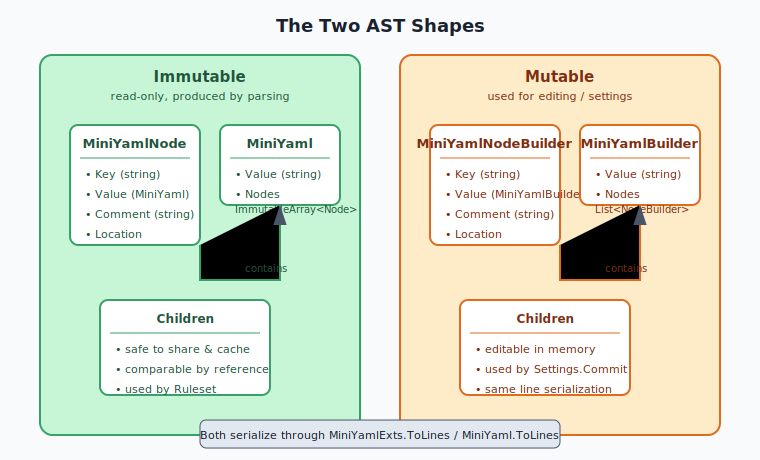

Immutable nodes are preferred for loaded rules because they are safe to share, cache, and compare by reference. `MiniYamlNodeBuilder` / `MiniYamlBuilder` exist only when the engine needs to mutate YAML in memory (e.g., `Settings.Commit`). Both shapes share the same line-oriented serialization in `MiniYamlExts.ToLines` and `MiniYaml.ToLines`.

### The Core Value Types

- `MiniYamlNode.SourceLocation` (`MiniYaml.cs`) is a small `readonly struct` holding the source file name and the 1-based line number. It is embedded in every node so diagnostics can report exactly where a conflict or missing parent originated.
- `MiniYaml.Value` (`MiniYaml.cs`) is the scalar after the colon. It is `null` for empty or whitespace-only values, not the empty string.
- `MiniYaml.Nodes` (`MiniYaml.cs`) is an `ImmutableArray<MiniYamlNode>`. Empty children use `ImmutableArray<MiniYamlNode>.Empty`.
- `MiniYaml` itself can be used as a synthetic root node: `new MiniYaml("", nodes)`.

### How OpenRA Uses the AST

- `Ruleset.LoadDefaults` / `Ruleset.Load` call `MiniYaml.Load(...)` to merge rule files and map overrides, then filter out `^` abstract templates.
- `ActorInfo` walks each actor's `MiniYaml` children and treats each child node as a trait instantiation (key = trait name, possibly with `@` suffix for a named instance).
- `FieldLoader` consumes individual `MiniYaml` subtrees to populate `TraitInfo` fields.


## Data Flow / Code Path


### 1. Parsing a Single File

```
MiniYaml.FromFile(path, discardCommentsAndWhitespace, stringPool)          [MiniYaml.cs]
  -> MiniYaml.FromStream(stream, name, ...)                               [MiniYaml.cs]
       -> StreamExts.ReadAllLinesAsMemory(stream)                         [StreamExts.cs]
       -> MiniYaml.FromLines(lines, name, discardCommentsAndWhitespace, stringPool)
            [MiniYaml.cs]
```

`FromLines` is the heart of the parser. It performs one pass over the input:

1. **Indentation scan** (`MiniYaml.cs`). Each line is scanned from the left. A space advances a counter; every 4 spaces increments one nesting level. A tab increments one level immediately. This means **tab and space indentation are not equivalent** — a tab is treated as a full indent level.
2. **Key / value / comment extraction** (`MiniYaml.cs`). The line is treated as `<key>: <value>#<comment>`. The first unescaped `:` separates key and value; the first unescaped `#` starts a comment. The `#` character is allowed in values if escaped as `\#`. Keys are always trimmed. Values are trimmed unless they start/end with a backslash followed by whitespace, which acts as a whitespace guard.
3. **String pooling** (`MiniYaml.cs`). Extracted key, value, and comment strings are canonicalized through a `HashSet<string>` via `GetOrAdd`, so identical strings share one instance.
4. **Node building** (`MiniYaml.cs`). Parsed lines are kept in a stack (`parsedLines`). When a line is less indented than the previous one, the parser closes the deeper node and attaches its children. Children are stored in a `result[level]` list, so parent/child relationships are resolved without recursion or lookahead. Top-level nodes are yielded as soon as they are completed.

### 2. Loading and Merging Multiple Files

```
MiniYaml.Load(fileSystem, files, mapRules)                                [MiniYaml.cs]
  -> Create a single string pool                                            [MiniYaml.cs]
  -> For each file: MiniYaml.FromStream(..., stringPool)                    [MiniYaml.cs]
  -> Append mapRules.Nodes if present                                       [MiniYaml.cs]
  -> MiniYaml.Merge(yaml)                                                   [MiniYaml.cs]
```

`Merge` (`MiniYaml.cs`) orchestrates the entire multi-file merge:

1. **Self-merge each source** (`MergeSelfPartial`, `MiniYaml.cs`). Within each file, duplicate keys are merged into a single node. This is what allows a file to define `Test:` twice and have the second occurrence extend the first.
2. **Partial merge across sources** (`MergePartial`, `MiniYaml.cs`). The self-merged sources are merged left-to-right using `MergePartial`. Later files override earlier files.
3. **Inheritance resolution** (`ResolveInherits`, `MiniYaml.cs`). The merged tree is walked; every `Inherits` or `Inherits@...` key is replaced by the resolved children of the named parent.
4. **Top-level removal resolution** (`ResolveInherits` on a synthetic root, `MiniYaml.cs`). This handles removing whole top-level nodes (e.g., removing an actor definition in a map override).

### 3. Converting YAML to Rules

```
Ruleset.LoadDefaults(modData)                                            [Ruleset.cs]
  -> MergeOrDefault("Manifest,Rules", fs, m.Rules, null, null,
       k => new ActorInfo(..., k.Value),
       filterNode: n => n.Key.StartsWith(ActorInfo.AbstractActorPrefix))
                                                                   [Ruleset.cs]
```

After `MiniYaml.Merge` resolves inheritance, the `^` prefixed abstract templates are still present in the tree. `Ruleset` (and `SequenceSet`) filters them out before instantiating `ActorInfo` objects. This is why `^` templates are visible to inheritance but are not themselves real actors.


## Configuration (YAML)


### MiniYaml Grammar vs. Standard YAML

MiniYaml is a deliberately small subset of YAML:

- Only **block-style** mapping nodes are supported. There are no flow collections (`[...]`, `{...}`), no anchors/aliases, no tags, and no multi-line literal/folded scalars.
- Indentation is **significant**. A child is indented by one level more than its parent. The parser accepts either 4 spaces or one tab per level, but it does not enforce consistency between adjacent lines.
- A node is one line: `key: value # comment`. The colon is required. A line with only a key and a colon is valid and has a `null` value.
- Empty lines are ignored for structure but **count for line numbers** (`MiniYamlTest.cs`).
- Comments are preserved only when `discardCommentsAndWhitespace` is `false`.

### Example of a Simple Tree

```yaml
Actor:
    Trait:
        Field: value
```

Parses as:
- `MiniYamlNode` `Actor`
  - `Value.Value = null`
  - `Value.Nodes` contains one node `Trait`
    - `Value.Value = null`
    - `Value.Nodes` contains one node `Field`
      - `Value.Value = "value"`

### The `@` Separator — Trait Instances

`@` is defined as `ActorInfo.TraitInstanceSeparator` (`ActorInfo.cs`). It is **not parsed specially** by MiniYaml; it is just a character in the key. The semantic meaning is enforced by the consumers:

```yaml
Armament@PRIMARY:
    Weapon: M1Carbine
Armament@GARRISONED:
    Name: garrisoned
    Weapon: Vulcan
```

`ActorInfo.LoadTraitInfo` splits the key at `@`, takes the left part as the trait class name (`ArmamentInfo`), and assigns the right part as the trait instance name (`InstanceName`). This allows multiple instances of the same trait class on one actor. MiniYaml treats `Armament@PRIMARY` and `Armament@GARRISONED` as unrelated keys.

### The `^` Prefix — Abstract Templates

`^` is defined as `ActorInfo.AbstractActorPrefix` (`ActorInfo.cs`). It is also **not parsed specially** by MiniYaml; it is a naming convention. Nodes whose key starts with `^` are intended to be inherited but never instantiated directly:

```yaml
^Soldier:
    Inherits: ^ExistsInWorld
    Health:
        HP: 5000

E1:
    Inherits: ^Soldier
    Buildable:
        Queue: Infantry
```

`Ruleset` and `SequenceSet` skip `^` prefixed nodes after inheritance has been resolved. If you forget to filter them, the engine would try to create `ActorInfo("^soldier", ...)` which is not a real unit.

### The `Inherits` / `Inherits@...` Key

The only real inheritance operator in MiniYaml is the key `Inherits` or `Inherits@<label>` (`MiniYaml.cs`):

```yaml
E1:
    Inherits: ^Soldier
    Inherits@AUTOTARGET: ^AutoTargetGroundAssaultMove
```

- `Inherits:` is a single inheritance parent.
- `Inherits@<label>` allows multiple inheritance parents. The label is arbitrary and only exists to keep the key unique within the node's children so MiniYaml does not see it as a duplicate key.
- The value of the node is the **parent name** (e.g., `^Soldier`). It is looked up by name in the merged tree.

Note: In `ActorInfo` comments, the convention is described as `Inherits:` and `-TraitName:` for removal. The actual parsing of `Inherits` is done by `MiniYaml.ResolveInherits`, not by `ActorInfo`.

### The `-` Prefix — Removal Nodes

A node whose key starts with `-` removes a previously defined node. It is used at two different stages:

```yaml
E1:
    Inherits: ^Soldier
    -TakeCover:
    Buildable:
        Queue: Infantry
```

- During `WeakResolveRemovals` (`MiniYaml.cs`) within a single node list, a removal node removes a matching plain node.
- During `ResolveInherits` (`MiniYaml.cs`), a removal node in the child list removes a matching inherited node.
- `MergeNode` (`MiniYaml.cs`) appends removal nodes to the result rather than merging them, so removals can act as boundaries between duplicate plain nodes.

## Interconnectivity

- **Depends on:**
  - `OpenRA.Game/StreamExts.cs` for line streaming (`ReadAllLinesAsMemory`).
  - `OpenRA.Game/Exts.cs` for `GetOrAdd` and conflict logging (`IntoDictionaryWithConflictLog`).
- **Used by:**
  - `OpenRA.Game/GameRules/Ruleset.cs` and `ActorInfo.cs` for loading actor definitions.
  - `OpenRA.Game/Graphics/SequenceSet.cs` for loading sequences.
  - `OpenRA.Game/FieldLoader.cs` for deserializing YAML values into C# [trait](#file-appendices-Appendix_A_Glossary) fields.
  - `OpenRA.Game/Settings.cs` for persisting user settings.
  - `OpenRA.Game/Widgets/WidgetLoader.cs`, `ChromeMetrics.cs`, `ChromeProvider.cs`, and network/session code for chrome and network configuration.


## Algorithms


### MergeNode — Merging One Node into a List

`MergeNode` (`MiniYaml.cs`) is the rule for how a single node is incorporated into an output list:

1. If the node is a removal node (`key.StartsWith('-')`), append it unchanged.
2. If the key has not been seen before, append it unchanged.
3. If the key has been seen before, look for the most recent plain node and the most recent removal node for that key.
   - If a removal node is closer (higher index) than the plain node, append the new node instead of merging. This preserves the sequence: old node applied, then removed, then new node applied.
   - Otherwise, merge the new node into the existing plain node in place: `existing.Value = MergePartial(existing.Value, new.Value)`.

### MergePartial — Merging Two Subtrees

`MergePartial` (`MiniYaml.cs`) combines two `MiniYaml` values:

1. Run `WeakResolveRemovals` on both node lists.
2. Check for duplicate keys inside each list using `IntoDictionaryWithConflictLog` with the shared `ConflictScratch` dictionary. If duplicates remain, throw `YamlException`.
3. If either side is null, return the other side.
4. The scalar value comes from the override: `overrideNodes.Value ?? existingNodes.Value`.
5. The child nodes come from the node-level `MergePartial`.

### WeakResolveRemovals

`WeakResolveRemovals` (`MiniYaml.cs`) scans a single node list and removes any plain node that is preceded by a matching `-Key` node. It is "weak" because it does not throw if the target is missing; it simply removes whatever it finds. This is used inside `MergePartial` to clean up the operands before merging, and also during inheritance resolution.

### MergeSelfPartial

`MergeSelfPartial` (`MiniYaml.cs`) merges duplicate keys within a single source. This is the first stage of `Merge` and is what allows a single YAML file to define the same top-level actor multiple times:

```yaml
Test:
    A: 1
Test:
    B: 2
```

becomes one `Test` node with both `A` and `B`.

### ResolveInherits — Recursive Inheritance

`ResolveInherits` (`MiniYaml.cs`) recursively expands `Inherits` directives:

1. For each child node:
   - If the key is `Inherits` or starts with `Inherits@`, look up the parent name in the merged tree.
   - If the parent is missing, throw `YamlException`.
   - If the parent has already been inherited in the current chain, throw `YamlException` with the previous location.
   - Recursively resolve the parent's children, then merge each resolved child into the current output using `MergeIntoResolved`.
   - The inherited parent's children are placed *before* the child's own explicit nodes (so explicit nodes override inherited ones).
2. If a child key starts with `-`, remove a matching node from the current output list.
3. Otherwise, merge the child into the output list.

The `inherited` dictionary is an `ImmutableDictionary<string, SourceLocation>` so each recursion gets an immutable copy of the inheritance chain.

### String Pooling

`FromLines` accepts a `HashSet<string> stringPool` (`MiniYaml.cs`). If null, a local pool is created. Every key, value, and comment string is passed through `stringPool.GetOrAdd(...)` (`Exts.cs`). Because the pool is shared across an entire `MiniYaml.Load` call, the same string appearing in many files (e.g., `Health`, `Inherits`, `true`, `0`) is allocated only once. This is critical because parsed YAML values stay resident for the lifetime of the `Ruleset`.

### Top-Level Removal

`MiniYaml.Merge` wraps the fully merged tree in a synthetic `MiniYaml` root (`MiniYaml.cs`) and runs `ResolveInherits` on it. This allows a map override to remove a whole actor definition defined in the mod:

```yaml
- ActorThatShouldNotExist:
```


## Extension Points


- **Custom file formats:** `MiniYaml.FromLines` accepts any `IEnumerable<ReadOnlyMemory<char>>`, so you can feed it pre-processed text without writing to disk.
- **Map overrides:** A map can supply `MiniYaml mapRules` and `MiniYaml mapSequences` to `MiniYaml.Load`. These are merged after the mod files, so map YAML wins.
- **Mutable editing:** Use `MiniYamlNodeBuilder` / `MiniYamlBuilder` to construct or edit YAML programmatically, then call `Build()` to obtain the immutable form.
- **Custom consumers:** The inheritance system is generic; any subsystem can call `MiniYaml.Merge` and then use `ToDictionary()` or `NodeWithKey()` to interpret the result.


## Common Pitfalls / Guardrails


### Indentation

- The parser uses `SpacesPerLevel = 4` (`MiniYaml.cs`) but a tab counts as one full level. Mixing tabs and spaces can produce surprising nesting if the counts do not align.
- A line that is indented more than one level deeper than the previous line causes `YamlException("Bad indent in miniyaml at ...")` (`MiniYaml.cs`).
- Empty lines are allowed between nodes and do not reset nesting.

### Duplicates and Merging

- Duplicates **within a single file** are allowed if the file is self-merged: `MergeSelfPartial` merges them.
- Duplicates **within a single node list that is not being merged with another list** cause a `YamlException` because `MergePartial` runs the conflict check. For example, two sibling nodes with the same key under the same parent that are not split by a removal will fail.
- Duplicates **across different files** are merged safely; later files override earlier files.
- Interleaving duplicate keys and removal nodes can suppress the duplicate error. See the test cases in `MiniYamlTest.cs`.

### Inheritance

- A parent referenced by `Inherits` must exist in the merged tree. If it is missing, the parser throws `YamlException` with the source location.
- Cyclic inheritance is detected by the `inherited` dictionary. The error message includes the previous location where the parent was inherited.
- Multiple inheritance is allowed via `Inherits@<label>`. Each label must be unique within the actor.
- Removals apply to inherited nodes as well as explicitly defined nodes, but the order matters. `ResolveInherits` processes children in order, so a removal node only removes nodes that have already been added to the output list.

### Comments and Whitespace

- A `#` in a value must be escaped as `\#` if it is not intended to start a comment. The parser replaces `\#` with `#` in the final value (`MiniYaml.cs`).
- When `discardCommentsAndWhitespace` is `true` (the default for most loads), comment lines and top-level comment-only nodes are dropped. The source line numbers of subsequent nodes are still correct because the parser counts every line.
- Whitespace at the start or end of a value can be preserved by placing a backslash before it: `key: \  value  \`. The backslash and the adjacent whitespace marker are stripped.
- Empty keys (` : value`) are allowed and result in `Key = null`. The node is ignored by `MergeSelfPartial` and `MergeNode` because they skip null keys.

### Performance

- `ConflictScratch` is a static `Dictionary<string, MiniYamlNode>` reused under a `lock` (`MiniYaml.cs`, `564-579`). This avoids allocating conflict dictionaries during merges, but it means `MergePartial` is not re-entrant.
- `NodeWithKeyOrDefault` and `IndexOfKey` / `LastIndexOfKey` avoid LINQ to keep hot paths fast.
- `ImmutableArray` is used for node storage because rules are read-mostly.
- Do not mutate `MiniYaml` or `MiniYamlNode` after creation; use the `With*` helpers or the mutable builders.

### The `^` Prefix is Not Magic to the Parser

MiniYaml does not treat `^` specially. `^Soldier` is just another key. If you forget to filter abstract nodes in your own loader, you will end up instantiating them. `Ruleset` and `SequenceSet` perform the filtering; custom loaders must do it themselves if needed.

### The `@` Separator is Not Magic to the Parser

`Armament@PRIMARY` is just a key. The parser does not know about traits. The split is done later by `ActorInfo.LoadTraitInfo` (`ActorInfo.cs`). This means `Merge` and inheritance operate on the full string, so two different `@` instances of the same trait are independent nodes.

## Summary

This chapter explains how OpenRA stores mod data in **[MiniYaml](#file-appendices-Appendix_A_Glossary)**, the custom YAML dialect that drives rules, sequences, weapons, and UI definitions.

After reading this chapter, you should be able to:

- Explain why OpenRA uses a custom [YAML](#file-appendices-Appendix_A_Glossary) dialect instead of a standard YAML parser.
- Describe the immutable `MiniYamlNode` / `MiniYaml` AST and the mutable `MiniYamlNodeBuilder` / `MiniYamlBuilder` variants.
- Trace the parsing pipeline from `MiniYaml.FromFile` through `FromLines` to a tree of nodes.
- Understand inheritance (`Inherits:`), multiple inheritance (`Inherits@NAME:`), and [trait](#file-appendices-Appendix_A_Glossary)/[actor](#file-appendices-Appendix_A_Glossary) removal (`-TraitName:`).
- Predict how duplicate keys within a file and later files in a manifest list override earlier definitions.
- Read and write MiniYaml for actors, traits, weapons, and sequences.
- Use `SourceLocation` to diagnose parse errors, merge conflicts, and missing parents.

If any of the concepts above feel unclear, review the relevant section before continuing. For source files and further reading, see the References section.


## References

- `OpenRA.Game/MiniYaml.cs` — Complete parser, AST, and merge/inheritance implementation.
- `OpenRA.Game/Exts.cs` — `GetOrAdd` and `IntoDictionaryWithConflictLog` helpers.
- `OpenRA.Game/StreamExts.cs` — `ReadAllLinesAsMemory` line streaming.
- `OpenRA.Game/GameRules/ActorInfo.cs` — `^` and `@` conventions, trait instantiation.
- `OpenRA.Game/GameRules/Ruleset.cs` — Rule loading and abstract-actor filtering.
- `OpenRA.Game/Graphics/SequenceSet.cs` — Sequence loading and abstract-actor filtering.
- `OpenRA.Game/Settings.cs` — Mutable `MiniYamlBuilder` usage for settings.
- `OpenRA.Test/OpenRA.Game/MiniYamlTest.cs` — Authoritative behavioral tests for edge cases.
- Online MiniYaml documentation: `https://github.com/OpenRA/OpenRA/wiki/MiniYAML` (engine wiki, verify for current edition).


### External resources

- [OpenRA traits reference](https://docs.openra.net/en/release/traits/)
## What to read next

- Now that you understand the MiniYaml grammar, AST, and inheritance rules, read [Part 2.2 — Manifest, ModData, Ruleset, and RulesetCache](#file-chapters-Part_02_Chapter_02_Manifest) to learn how the engine uses MiniYaml files to assemble a complete mod.
- For the next step in the data pipeline, read [Part 2.3 — FieldLoader and Type Conversions](#file-chapters-Part_02_Chapter_03_FieldLoader) to see how MiniYaml values are converted into C# trait and weapon fields.
- Now that you can read and write MiniYaml for actors and weapons, read [Part 2.4 — Rulesets, Actors, and Weapons](#file-chapters-Part_02_Chapter_04_Rules_Weapons) to learn how `ActorInfo` and `WeaponInfo` are produced from the parsed YAML.


---

<a id="file-chapters-Part_02_Chapter_02_Manifest"></a>

<!-- --- FILE: chapters/Part_02_Chapter_02_Manifest.md --- -->

# Chapter 2.2 — Manifest, ModData, Ruleset, and RulesetCache {#file-chapters-Part_02_Chapter_02_Manifest}

## Purpose

This chapter explains the four pillars that turn a mod's YAML configuration into a playable game world:

1. **`[Manifest](#file-appendices-Appendix_A_Glossary)`** — the static, read-only description of *what* a mod contains (files, metadata, compatibility, custom global data). It is the in-memory representation of the mod's `mod.yaml`.
2. **`[ModData](#file-appendices-Appendix_A_Glossary)`** — the runtime engine wrapper that owns a `Manifest`, mounts the mod's virtual file system, instantiates loaders, and exposes the default ruleset and terrain info.
3. **`[Ruleset](#file-appendices-Appendix_A_Glossary)`** — the compiled, object-oriented result of parsing the [YAML](#file-appendices-Appendix_A_Glossary) rules: actors, weapons, voices, notifications, music, model sequences, and terrain info.
4. **`RulesetCache`** — historically a separate caching layer. In the current codebase it has been removed and its responsibilities merged into `Ruleset` itself.

Together they answer: *How does OpenRA know which YAML files to load, how are they merged, how are map overrides applied, and how does the engine recover from broken map-specific rules?*

## Learning Objectives


After studying this chapter, you should be able to:

- Explain the roles of Manifest, ModData, Ruleset, and the historical RulesetCache.
- Trace how mod.yaml is loaded into a Manifest and how includes are resolved.
- Describe how ModData builds the VFS, loaders, and default ruleset.
- Explain how map-specific rule overrides are merged and fall back to defaults.
- Identify the seven dictionaries contained in a Ruleset.
- Explain the purpose of IRulesetLoaded callbacks.

## Files

| File | Role |
|------|------|
| `OpenRA.Game/Manifest.cs` | Parses `mod.yaml`, exposes `ImmutableArray<string>` lists for every asset category, metadata, filesystem config, and unrecognized global mod-data blocks. |
| `OpenRA.Game/ModData.cs` | Constructs the file system, loaders, object creator, map cache, cursors, default ruleset, and terrain info. Owns `IGlobalModData` instances. |
| `OpenRA.Game/GameRules/Ruleset.cs` | Builds the seven dictionaries/holders of a `Ruleset` (`Actors`, `Weapons`, `Voices`, `Notifications`, `Music`, `TerrainInfo`, `ModelSequences`) and wires `IRulesetLoaded` callbacks. |
| `OpenRA.Game/GameRules/RulesetCache.cs` | **Not present in the current checkout.** Removed by commit `82a9d69a51` ("Remove RulesetCache and push rule parsing to background thread"). Its logic now lives in `Ruleset.cs`. |
| `OpenRA.Game/Map/Map.cs` | Stores the map's custom-rule definitions (`RuleDefinitions`, `WeaponDefinitions`, etc.), applies them during `PostInit()`, and falls back to default rules if parsing fails. |
| `OpenRA.Game/Map/MapPreview.cs` | Mirrors map rule definitions for the shellmap/lobby preview and provides `DefinesUnsafeCustomRules()` and `LoadRuleset()`. |
| `OpenRA.Game/GameRules/ActorInfo.cs` | Parses a single actor node into a collection of [`TraitInfo`](#file-appendices-Appendix_A_Glossary) objects and resolves trait construction order. |
| `OpenRA.Game/Primitives/ActorInfoDictionary.cs` | Wraps the actor dictionary and guarantees that every `SystemActors` enum entry exists. |


## Architecture


### 1. Manifest: the mod.yaml object model

`Manifest` is constructed from a mod's `mod.yaml` file via the `Manifest(string modId, IReadOnlyPackage package)` constructor. The constructor performs three phases:

1. **Load and inline includes.** It reads `mod.yaml` with `[MiniYaml](#file-appendices-Appendix_A_Glossary).FromStream`, then expands every `Include:` node in-place by loading the referenced file and splicing its nodes into the tree. This allows mods to split configuration into reusable files.
2. **Merge inherited overrides.** The entire node tree is merged with `MiniYaml.Merge([nodes])`, then flattened into a `Dictionary<string, MiniYaml>` via `ToDictionary()`.
3. **Populate strongly-typed fields.** Each top-level key (e.g. `Rules`, `Sequences`, `Weapons`, `Voices`, `Music`, `Chrome`, `TileSets`, `Assemblies`, etc.) is read into an immutable array or a custom object.

Special handling:

- `Metadata` is loaded through `FieldLoader.Load<ModMetadata>`.
- `FileSystem` is mandatory and is stored as a raw `MiniYaml` block because the concrete file-system loader is instantiated via `ObjectCreator` later.
- `MapFolders` is parsed as a dictionary of path → classification strings (`System`, `User`, etc.).
- `MapCompatibility` always starts with the mod's own `Id`, then appends any comma-separated values from `SupportsMapsFrom:`.
- Any top-level key not in the `ReservedModuleNames` set is collected into `GlobalModData`, a `FrozenDictionary<string, MiniYaml>` that `ModData` will later convert into `IGlobalModData` instances.

This design means a mod author can declare *what* the engine needs to load; the engine then knows *where* to look before it actually loads the assets.

### 2. ModData: the live mod instance

`ModData` is the runtime owner of everything that belongs to a loaded mod. Its constructor is long and sequential because each subsystem depends on the previous one:

1. **Reload manifest.** It creates a fresh `Manifest` from the supplied manifest/package. This avoids keeping the original object graph.
2. **Create object creator.** `ObjectCreator` loads the engine assembly plus any `Assemblies:` declared in `mod.yaml`. It builds a type cache and resolves `AppDomain` assembly requests.
3. **Mount virtual file system.** `ModFiles` is a `FileSystem` instance created with the mod id and package loaders. The `IFileSystemLoader` named in `Manifest.FileSystem.Value` is instantiated, field-loaded from the `FileSystem` YAML, and asked to mount the manifest's packages. This is the point at which `^EngineDir`, `~^SupportDir|Content/...`, `cnc|rules`, and so on become resolvable paths in the [VFS](#file-appendices-Appendix_A_Glossary).
4. **Load global mod data.** For each entry in `Manifest.GlobalModData`, `ModData` looks up the C# type by key. If it implements `IGlobalModData` and has a `MiniYaml` constructor, that constructor is called directly; otherwise `ObjectCreator` creates the type and `FieldLoader` loads its child nodes. Examples: `MapGrid`, `GameSpeeds`, `AssetBrowser`, `DiscordService`.
5. **Initialize Fluent.** `FluentProvider.Initialize` loads the translation bundles listed in `FluentMessages` and `FluentCulture`.
6. **Load screen (optional).** If `useLoadScreen` is true, the `LoadScreen:` class is instantiated, initialized, and displayed.
7. **Create loaders and caches.** `WidgetLoader`, `MapCache`, `SoundLoaders`, `SpriteLoaders`, `VideoLoaders`, `SpriteSequenceLoader`, `HotkeyManager`, and the frozen cursor dictionary.
8. **Lazily load default rules and terrain.** `defaultRules` and `defaultTerrainInfo` are `Lazy<T>`; they only execute when first accessed.

Important `ModData` members:

- `DefaultRules` → `Ruleset.LoadDefaults(this)`.
- `DefaultTerrainInfo` → parses each `TileSets` file through the loader named by `TerrainFormat`.
- `GetOrCreate<T>()` and `GetOrNull<T>()` → retrieve `IGlobalModData` instances, lazily creating default objects if needed.
- `PrepareMap(Map map)` → reinitializes asset loaders with the map's file system, loads sprites, and loads map music.

### 3. Ruleset: from YAML to typed objects

A `Ruleset` is an immutable snapshot of the game world at a point in time. It contains:

- `Actors` (`ActorInfoDictionary`) — keyed by lower-case actor name.
- `Weapons` (`IReadOnlyDictionary<string, WeaponInfo>`) — keyed by lower-case weapon name.
- `Voices` / `Notifications` (`IReadOnlyDictionary<string, SoundInfo>`) — keyed by sound name.
- `Music` (`IReadOnlyDictionary<string, MusicInfo>`) — keyed by music name.
- `TerrainInfo` (`ITerrainInfo`) — the active tileset for this ruleset.
- `ModelSequences` (`IReadOnlyDictionary<string, MiniYamlNode>`) — raw model sequence nodes.

Construction of a `Ruleset` performs two post-load phases:

1. **Actor ruleset-loaded callbacks.** For every actor and every `IRulesetLoaded` trait on that actor, `RulesetLoaded(this, actor)` is called. Errors are wrapped with the actor name.
2. **Weapon ruleset-loaded callbacks.** For every weapon, the projectile and each warhead that implements `IRulesetLoaded<WeaponInfo>` receives `RulesetLoaded(this, weapon)`. Errors are wrapped with the weapon/pro projectile name.

These callbacks are the engine's way of letting traits resolve cross-references *after* the whole ruleset exists, e.g. looking up another actor or weapon by name.

### 4. RulesetCache (historical)

`OpenRA.Game/GameRules/RulesetCache.cs` existed in older versions. Its job was:

- Maintain per-mod caches (`actorCache`, `weaponCache`, etc.) so that identical YAML inputs reused already-parsed `ActorInfo`/`WeaponInfo` objects.
- Provide a `Load(...)` method that accepted a `Map` and a `TileSet` and produced a `Ruleset`.
- Fire a `LoadingProgress` event used by the load screen.

The class was removed by commit `82a9d69a51` (March 2016). The caching behavior was dropped in favor of simplicity, and rule parsing was moved to a background `Task` inside `Ruleset` (see `LoadDefaults`, `LoadDefaultsForTileSet`, and `Load`).

> **Current status:** `RulesetCache` is no longer in the codebase. All ruleset construction is now handled directly by static methods on `Ruleset`.


## Data Flow / Code Path


### Loading a mod from the command line

1. The game locates the mod package and builds a `Manifest`.
2. `ModData` is constructed with the manifest and the installed-mods list.
3. The first code path that accesses `modData.DefaultRules` triggers `Ruleset.LoadDefaults(this)`.
4. `Ruleset.LoadDefaults` runs on a background `Task` if the caller is on the main thread, allowing the load screen to animate via `modData.HandleLoadingProgress()`.

### Loading a map

1. `Map` constructor reads `map.yaml`, deserializes the `MapField` list, and populates `RuleDefinitions`, `WeaponDefinitions`, `VoiceDefinitions`, `NotificationDefinitions`, `MusicDefinitions`, and `ModelSequenceDefinitions`.
2. `PostInit()` calls `Ruleset.Load(modData, this, Tileset, ...)` with those map-specific YAML blocks.
3. `Ruleset.Load` calls `MiniYaml.Load(fileSystem, m.Rules, mapRules)` for each category. The merged YAML is turned into typed objects.
4. If the load succeeds, the map's `Rules` property is set.
5. If the load throws any exception, `Map.PostInit()` catches it, logs it to `debug`, marks `InvalidCustomRules = true`, stores the exception in `InvalidCustomRulesException`, and falls back to `Ruleset.LoadDefaultsForTileSet(modData, Tileset)`.

### Loading the shellmap / map preview

`MapPreview` keeps its own copy of the map's custom YAML blocks in `innerData`. It offers:

- `DefinesUnsafeCustomRules()` — calls `Ruleset.DefinesUnsafeCustomRules(...)` to decide whether the map should be flagged in the lobby.
- `LoadRuleset()` — calls `Ruleset.Load(modData, this, TileSet, ...)` with the preview's file system.


## Configuration (YAML)


### mod.yaml

`mod.yaml` is the single entry point a `Manifest` requires. A minimal logical skeleton looks like this:

```yaml
Metadata:
    Title: My Mod
    Version: {DEV_VERSION}

PackageFormats: Mix
FileSystem: ContentInstallerFileSystem
    ...

MapFolders:
    mymod|maps: System

Rules:
    mymod|rules/defaults.yaml
    mymod|rules/vehicles.yaml

Sequences:
    mymod|sequences/vehicles.yaml

Weapons:
    mymod|weapons.yaml

Voices:
    mymod|audio/voices.yaml

Notifications:
    mymod|audio/notifications.yaml

Music:
    mymod|audio/music.yaml

TileSets:
    mymod|tilesets/desert.yaml

Cursors:
    mymod|cursors.yaml

Chrome:
    mymod|chrome.yaml

Assemblies: OpenRA.Mods.MyMod.dll

LoadScreen: MyLoadScreen
    ...

TerrainFormat: DefaultTerrain
SpriteSequenceFormat: ClassicTilesetSpecificSpriteSequence
```

Key observations:

- The order of the lists matters. Files are loaded in order and later files override earlier ones via `MiniYaml.Merge`.
- `^` prefixes in the `Rules` list identify abstract (template) actors that are filtered out of the final `Actors` dictionary.
- `Include: filename.yaml` can appear anywhere and is expanded before the rest of the tree is merged.
- Any unrecognized top-level block whose name matches a C# type implementing `IGlobalModData` becomes a global mod data module.

### map.yaml

A map can override mod rules by declaring any of these optional blocks:

```yaml
Rules:
    e6:
        Health:
            HP: 1000

Weapons:
    ...

Voices:
    ...

Notifications:
    ...

Music:
    ...

Sequences:
    ...

ModelSequences:
    ...
```

Each block is deserialized into the corresponding `MiniYaml` field on `Map`. `Ruleset.Load` then merges these nodes *after* the mod files, so map entries always win. If a map wants to pull rules from an external file, it can use the inline-file syntax:

```yaml
Rules: mymap|rules.yaml
```

`MiniYaml.Load` detects this by reading `mapRules.Value`, splitting it into a list of file paths, and concatenating those files to the mod file list before merging.

## Interconnectivity

```
mod.yaml
   |
   v
Manifest  ----> ObjectCreator (assemblies, type lookup)
   |
   v
ModData  ----> FileSystem (ModFiles)
   |----> MapCache
   |----> WidgetLoader
   |----> Loaders (sound, sprite, video, sequence)
   |----> Cursors (frozen dict)
   |----> defaultRules (Lazy<Ruleset>)
   |----> defaultTerrainInfo (Lazy<...>)
   |----> IGlobalModData modules
   |
   +----> Ruleset.LoadDefaults(ModData)
            |
            +----> MiniYaml.Load(...)
            +----> ActorInfo, WeaponInfo, SoundInfo, MusicInfo
            +----> ActorInfoDictionary
            +----> IRulesetLoaded callbacks
   |
   +----> Map.PostInit()
            |
            +----> Ruleset.Load(..., mapRules, ...)
            +----> on failure: Ruleset.LoadDefaultsForTileSet(...)
```

Key contracts:

- `Manifest` never touches the file system after parsing `mod.yaml`. It only stores *paths*.
- `ModData` owns the file system and is the only thing that knows how to resolve `cnc|rules/foo.yaml`.
- `Ruleset` is a pure data object. It knows nothing about the file system; it only consumes already-loaded `MiniYaml` nodes.
- `Map` is both an `IReadOnlyFileSystem` and a consumer of rules. It provides the map-specific YAML to `Ruleset.Load`.


## Algorithms


### 1. YAML merging and inheritance

`MiniYaml.Load(fileSystem, files, mapRules)` is the engine's canonical way to produce a merged rule tree:

1. If `mapRules.Value` is non-null, parse it as a list of extra file paths and append them.
2. Load every file via `MiniYaml.FromStream`.
3. If `mapRules.Nodes` is non-empty, append the inline nodes as an additional source.
4. Run `MiniYaml.Merge(sources)`.

`Merge` first calls `MergeSelfPartial` on each source to resolve internal inheritance (`Inherits:`, `Inherits@`, `RemoveInherits`, removal prefixes), then combines sources with `MergePartial`. The result is a flat list of top-level nodes where later sources override earlier ones.

For `Ruleset`, the merged nodes are converted into a dictionary using `ToDictionaryWithConflictLog`, which reports duplicate keys with useful source-location information.

### 2. Abstract actor filtering

When loading actors, `Ruleset` passes a filter:

```csharp
filterNode: n => n.Key.StartsWith(ActorInfo.AbstractActorPrefix)
```

`AbstractActorPrefix` is the character `'^'`. Abstract actors are templates meant to be inherited by concrete actors, not spawned directly, so they are excluded from the final dictionary. This is the same behavior used by `SequenceSet`.

### 3. System actor guarantee

`ActorInfoDictionary` wraps the loaded actor dictionary and adds an empty `ActorInfo` for every value of the `SystemActors` enum (`world`, `editorworld`, `player`, etc.) that is not already present in the rules. This ensures that critical system actors always exist even if the mod YAML does not define them.

### 4. Default rules caching

The current implementation does **not** use a `RulesetCache`. Instead:

- `ModData.defaultRules` is a `Lazy<Ruleset>`.
- `Ruleset.LoadDefaults` builds the rules from the manifest lists.
- `Ruleset.LoadDefaultsForTileSet` reuses the same `Actors`, `Weapons`, `Voices`, `Notifications`, `Music`, and `ModelSequences` from the default ruleset and only swaps in the requested `TerrainInfo`.

This is the modern replacement for the old per-item caches: the default ruleset object is built once, then shared for tileset-specific variants.

### 5. Unsafe custom rule detection

`Ruleset.DefinesUnsafeCustomRules` decides whether a map's custom rules are "unsafe" for multiplayer lobbies that want to enforce no custom rules.

The algorithm is:

1. If the map defines any `Weapons`, `Voices`, `Notifications`, or `Sequences` overrides, it is immediately unsafe.
2. If the map defines `Rules`, inspect every actor's traits:
   - Strip the `@` instance suffix from the trait key.
   - Look up the trait type as `traitName + "Info"` via `ObjectCreator.FindType`.
   - If the type exists and does **not** implement `ILobbyCustomRulesIgnore`, the map is unsafe.
   - If the type lookup fails, the exception is logged and ignored for that trait.
3. If the map rules are inline files (`mapRules.Value` is non-null), repeat the trait check on each file's parsed nodes.

Traits such as `TerrainLightingInfo`, `WeatherOverlayInfo`, `TerrainTunnelInfo`, `ElevatedBridgePlaceholderInfo`, `TintPostProcessEffectInfo`, and `TerrainLightSourceInfo` implement `ILobbyCustomRulesIgnore` so that maps can use purely visual/environmental overrides without being flagged as unsafe.

### 6. Map custom rule fallback

`Map.PostInit()` loads the map ruleset inside a `try` block:

```csharp
Rules = Ruleset.Load(modData, this, Tileset, RuleDefinitions, WeaponDefinitions,
    VoiceDefinitions, NotificationDefinitions, MusicDefinitions, ModelSequenceDefinitions);
```

If any exception escapes, the map is marked invalid and the engine falls back to the default ruleset for the map's tileset:

```csharp
InvalidCustomRules = true;
InvalidCustomRulesException = e;
Rules = Ruleset.LoadDefaultsForTileSet(modData, Tileset);
```

This is the **correct architectural handling** for invalid map custom rules: a runtime `try/catch` fallback in `Map`, not a pre-validation or reflective exemption parser. The map remains loadable and the user can see/inspect it in the shellmap, but gameplay will use the mod defaults.


## Extension Points


### IGlobalModData

Any C# class implementing `IGlobalModData` can be declared as a top-level `mod.yaml` block by name. `ModData` will instantiate it and expose it via `GetOrCreate<T>()` / `GetOrNull<T>()`. Examples in the stock mods include `MapGrid`, `GameSpeeds`, `AssetBrowser`, and `DiscordService`.

### IFileSystemLoader

The `FileSystem:` block names a class implementing `IFileSystemLoader`. The loader is responsible for mounting packages into `ModFiles`. Mods can implement custom loaders if they have unusual archive formats.

### ILoadScreen

The `LoadScreen:` block names an `ILoadScreen` implementation. It receives the `LoadScreen` YAML block and can render progress while the mod loads.

### IRulesetLoaded

Traits and weapon components can implement `IRulesetLoaded` or `IRulesetLoaded<T>` to receive a callback after the full `Ruleset` is built. This is the standard place to resolve actor/weapon references that cannot be resolved during YAML parsing.

### ILobbyCustomRulesIgnore

A marker interface. If a trait's `Info` class implements it, map overrides for that trait will not cause the map to be flagged as having unsafe custom rules.


## Common Pitfalls / Guardrails


### 1. RulesetCache does not exist anymore

Documentation and older tutorials may refer to `RulesetCache.Load(...)`. In the current engine, call `Ruleset.LoadDefaults`, `Ruleset.LoadDefaultsForTileSet`, or `Ruleset.Load` directly. `ModData.DefaultRules` is the recommended entry point for the default ruleset.

### 2. Case sensitivity of actor keys

`Ruleset` lower-cases actor names when building the dictionary (`k.Key.ToLowerInvariant()`), but the YAML keys themselves are case-sensitive during merging. Keep actor names consistent across rules, sequences, and map files.

### 3. The `^` abstract prefix

Abstract template actors must start with `^`. They are filtered out of the runtime `Actors` dictionary. If you accidentally name a real actor `^MyTank`, it will not be spawnable.

### 4. Missing `FileSystem` section

`Manifest` throws `InvalidDataException` if `FileSystem` is missing. This is the only top-level block treated as mandatory inside `Manifest` (besides `mod.yaml` itself and `LoadScreen`).

### 5. Thread affinity

`ModData` records the thread that constructed it in `initialThreadId`. `HandleLoadingProgress` only updates the load screen when the current thread is that thread. `Ruleset` parsing may run on a background `Task` so the load screen can animate, but it will only do so when `modData.IsOnMainThread` is true.

### 6. Invalid map custom rules are swallowed

If a map's custom rules throw, the map still loads using default rules. This is intentional for usability, but it means the engine silently ignores broken overrides. Check the `debug` log for `Failed to load rules for ...` messages. The `InvalidCustomRules` and `InvalidCustomRulesException` properties on `Map` expose this state to UI code.

### 7. `ILobbyCustomRulesIgnore` is not a runtime exemption

The interface only affects the *lobby safety check* (`DefinesUnsafeCustomRules`). It does **not** exempt a trait from YAML parsing or from overriding mod defaults. The phrase "reflective exemption parser" is a misnomer: the engine does not use reflection to skip rule parsing; it uses reflection in `AnyFlaggedTraits` only to decide whether a trait's presence makes a map "unsafe" for a no-custom-rules lobby.

### 8. Map rule overrides can break terrain validation

`PostInit()` replaces invalid terrain tiles with the default tile from the ruleset's `TerrainInfo`. If the fallback ruleset (after a failed custom rule load) does not match the map's tileset, the map may still be playable but the terrain could differ from the author's intent.

### 9. `GlobalModData` types must exist and implement the interface

If a top-level `mod.yaml` block is not in the reserved list and its C# type cannot be found or does not implement `IGlobalModData`, `ModData` throws `InvalidDataException`. This is a common error when adding custom mod-data modules.

### 10. `Map` is the file system for map assets

Because `Map` implements `IReadOnlyFileSystem`, `Ruleset.Load` can resolve paths relative to the map package (e.g. `mymap|rules.yaml`). This is why map-specific files and inline rules are merged with the same `MiniYaml.Load` path used for mod files.

## Summary

This chapter explains the four pillars that turn a mod's YAML configuration into a playable game world.

After reading this chapter, you should be able to:

- **Load and inline includes.** It reads `mod.yaml` with `[MiniYaml](#file-appendices-Appendix_A_Glossary).FromStream`, then expands every `Include:` node in-place by loading the referenced file and splicing its nodes into the tree. This allows mods to split configuration into reusable files.
- **Merge inherited overrides.** The entire node tree is merged with `MiniYaml.Merge([nodes])`, then flattened into a `Dictionary<string, MiniYaml>` via `ToDictionary()`.
- **Populate strongly-typed fields.** Each top-level key (e.g. `Rules`, `Sequences`, `Weapons`, `Voices`, `Music`, `Chrome`, `TileSets`, `Assemblies`, etc.) is read into an immutable array or a custom object.

If any of the concepts above feel unclear, review the relevant section before continuing. For source files and further reading, see the References section.


## References

- `OpenRA.Game/Manifest.cs` — `Manifest` class, `ModMetadata`, `RendererConstants`, `ReservedModuleNames`.
- `OpenRA.Game/ModData.cs` — `ModData` constructor, `IGlobalModData` loading, lazy default rules, `PrepareMap`.
- `OpenRA.Game/GameRules/Ruleset.cs` — `Ruleset` construction, `LoadDefaults`, `LoadDefaultsForTileSet`, `Load`, `DefinesUnsafeCustomRules`, `AnyFlaggedTraits`.
- `OpenRA.Game/GameRules/ActorInfo.cs` — `ActorInfo`, `AbstractActorPrefix`, `TraitInstanceSeparator`, trait loading, construction order.
- `OpenRA.Game/Primitives/ActorInfoDictionary.cs` — system actor guarantee.
- `OpenRA.Game/Map/Map.cs` — `MapField`, `RuleDefinitions`, `PostInit`, invalid custom rule fallback.
- `OpenRA.Game/Map/MapPreview.cs` — `DefinesUnsafeCustomRules`, `LoadRuleset`.
- `OpenRA.Game/Traits/TraitsInterfaces.cs` — `ILobbyCustomRulesIgnore`, `IRulesetLoaded`, `IGlobalModData`.
- `OpenRA.Game/ObjectCreator.cs` — assembly loading, type resolution, `CreateObject`.
- `OpenRA.Game/MiniYaml.cs` — `MiniYaml.Merge`, `MiniYaml.Load`, `MergePartial`, `ToDictionaryWithConflictLog`.

## What to read next

- [Part 2.4 — Rulesets, Actors, and Weapons](#file-chapters-Part_02_Chapter_04_Rules_Weapons): the `Ruleset` built by `ModData` is the central data structure described here; continue there for the actor and weapon dictionaries.
- [Part 3.1 — Mod SDK and Project Structure](#file-chapters-Part_03_Chapter_01_Mod_SDK): the `mod.yaml` manifest and `ModData` are the core of the SDK; this chapter explains them from a mod-author perspective.
- [Part 2.3 — FieldLoader and Type Conversions](#file-chapters-Part_02_Chapter_03_FieldLoader): after `MiniYaml` is parsed, `FieldLoader` converts YAML values into C# trait and global-mod-data fields.
- [Appendix H — Asset Visual Reference](#file-appendices-Appendix_H_Asset_Visual_Reference): for a categorical lookup of the asset manifest keys (Sequences, TileSets, Cursors, Chrome, Voices, Notifications, Music, etc.) and their engine loaders.
- Git history: commit `82a9d69a51` ("Remove RulesetCache and push rule parsing to background thread.") removed `OpenRA.Game/GameRules/RulesetCache.cs` and moved its logic into `Ruleset.cs`.


---

<a id="file-chapters-Part_02_Chapter_03_FieldLoader"></a>

<!-- --- FILE: chapters/Part_02_Chapter_03_FieldLoader.md --- -->

# Chapter 2.3 — FieldLoader and ObjectCreator {#file-chapters-Part_02_Chapter_03_FieldLoader}

## Purpose

`FieldLoader` and `ObjectCreator` are the two halves of OpenRA's runtime bridge between [YAML](#file-appendices-Appendix_A_Glossary) rule files and the C# object model. `ObjectCreator` turns a textual type name (e.g., `Mobile`, `Health`, `WeaponInfo`) into a living C# instance. `FieldLoader` then takes the YAML key/value pairs under that node and assigns them to the matching fields of the instance. Together they make it possible for a modder to declare an actor such as:

```yaml
3tnk:
    Health:
        HP: 50000
    Armor:
        Type: Heavy
```

…and have the engine instantiate `HealthInfo` and `ArmorInfo`, populate their `HP` and `Type` fields, and add them to the actor's [`TypeDictionary`](#file-appendices-Appendix_A_Glossary) of [traits](#file-appendices-Appendix_A_Glossary). The same machinery is reused for weapon info, settings modules, map rules, and any other YAML-backed configuration object.

## Learning Objectives


After studying this chapter, you should be able to:

- Explain how ObjectCreator resolves YAML type names to C# instances.
- Describe how FieldLoader maps YAML key-value pairs to C# fields.
- Use [Require], [LoadUsing], and [Ignore] attributes to control YAML loading.
- Trace the data flow from a [MiniYaml](#file-appendices-Appendix_A_Glossary) actor node to a populated [`TraitInfo`](#file-appendices-Appendix_A_Glossary).
- Identify the built-in scalar and generic collection parsers in FieldLoader.
- Debug common FieldLoader errors such as missing required fields.

## Files

| File | Responsibility |
| :---- | :---- |
| `OpenRA.Game/ObjectCreator.cs` | Resolves type names to .NET `Type` objects, picks constructors, and instantiates objects. It also manages the assembly list supplied by the mod manifest and caches `Type` → `ConstructorInfo` lookups. |
| `OpenRA.Game/FieldLoader.cs` | Deserializes YAML scalar and node data into C# fields. Maintains hard-coded scalar parsers (`TypeParsers`), generic collection parsers (`GenericTypeParsers`), expression caches, and the `[Require]` / `[LoadUsing]` / `[Ignore]` attribute logic. |
| `OpenRA.Game/GameRules/ActorInfo.cs` | Consumer of both systems: iterates the trait nodes of an actor definition, calls `ObjectCreator` to create the `TraitInfo`, then calls `FieldLoader.Load` to fill it. |
| `OpenRA.Game/Traits/TraitsInterfaces.cs` | Defines `TraitInfo`, `TraitInfo<T>`, and the dependency interfaces (`Requires<>`, `NotBefore<>`) that `ActorInfo` uses after loading. |


## Architecture


```
[MiniYaml rules] --parsed by--> [ActorInfo / Ruleset / Settings]
     |
     v
[ObjectCreator] --FindType--> [TypeCache]
     |
     v
[Constructor with UseCtor] or [parameterless ctor]
     |
     v
[TraitInfo instance] --FieldLoader.Load--> [FieldLoadInfo[]]
     |
     v
[TypeParsers / GenericTypeParsers / TypeDescriptor]
     |
     v
[Populated C# object]
```

### ObjectCreator

`ObjectCreator` is a disposable, mod-scoped service constructed from the active `Manifest` and the installed mods list.

- **Assembly list** (`assemblies`): It always starts with `typeof(Game).Assembly` (the core engine). Then it loads every additional DLL named in the mod's `Assemblies` manifest entry, placing them next to the game executable (`Platform.BinDir`). Because .NET cannot unload assemblies, it hashes each file with SHA-1 and stores the loaded `Assembly` in a static `ResolvedAssemblies` dictionary so the same physical DLL is never loaded twice across mod changes.
- **Type cache** (`typeCache`): Maps a bare class name like `HealthInfo` to a `Type` by scanning every namespace of every loaded assembly (`FindType`). The first match wins.
- **Constructor cache** (`ctorCache`): Maps a `Type` to the single constructor decorated with `[ObjectCreator.UseCtor]`, or `null` if the type should be created with its parameterless constructor.
- **Assembly resolve hook**: It subscribes to `AppDomain.CurrentDomain.AssemblyResolve` so that dependencies of mod assemblies can be found at runtime.

### FieldLoader

`FieldLoader` is a static utility class. Its central job is `Load(object self, MiniYaml my)`, which walks the cached metadata for the target type and assigns values from the YAML.

Key caches:

- `TypeLoadInfo` — a `ConcurrentCache<Type, FieldLoadInfo[]>` built once per type by `BuildTypeLoadInfo`. It inspects every instance field (public or non-public) and decides whether to serialize it based on `SerializeAttribute`. The result is an array of `FieldLoadInfo` containing the `FieldInfo`, the `SerializeAttribute`, and an optional `Func<MiniYaml, object>` loader.
- `BooleanExpressionCache` — caches parsed `BooleanExpression` objects by string.
- `IntegerExpressionCache` — caches parsed `IntegerExpression` objects by string.

### FieldLoadInfo

`FieldLoadInfo` is the metadata token for one YAML-bound field. It contains:

- `Field` — the `FieldInfo` to set.
- `Attribute` — the `SerializeAttribute` derived from `[Require]`, `[LoadUsing]`, `[Ignore]`, or the default.
- `Loader` — an optional delegate created from a `[LoadUsing("MethodName")]` static method.
- `YamlName` — always the C# field name; YAML keys must match it exactly.

### Parser dictionaries

`TypeParsers` is a `FrozenDictionary<Type, Func<string, Type, string, object>>` keyed by exact scalar types: `int`, `ushort`, `float`, `bool`, `string`, `Color`, `Hotkey`, `WDist`, `WVec`, `WPos`, `WAngle`, `WRot`, `CPos`, `CVec`, `BooleanExpression`, `IntegerExpression`, `DateTime`, and several fixed-size vector/array types.

`GenericTypeParsers` is a `FrozenDictionary<Type, Func<string, Type, string, MiniYaml, object>>` keyed by open generic definitions: `HashSet<>`, `List<>`, `Dictionary<,>`, `ImmutableArray<>`, `FrozenSet<>`, `FrozenDictionary<,>`, `BitSet<>`, and `Nullable<>`.

Both are static and intentionally read-only; they cannot be mutated at runtime. This is a deliberate performance choice: frozen dictionaries provide fast lookup and the parser table is compiled into the engine.


## Data Flow / Code Path


### 1. From a YAML actor to a trait instance

The canonical path is `ActorInfo` construction in `ActorInfo.cs`.

1. The constructor receives a `MiniYaml` node representing one actor definition.
2. For each child node (`node.Nodes`), it calls `LoadTraitInfo(creator, t.Key, t.Value)`.
3. `LoadTraitInfo` first rejects a non-empty scalar value on the trait node itself — a trait must be a mapping, not a string.
4. It strips any `@InstanceName` suffix using `TraitInstanceSeparator` (`'@'`), so `Mobile@CampaignOnly` becomes `Mobile`.
5. It asks `ObjectCreator` for `creator.CreateObject<TraitInfo>(traitName + "Info")`. This is the name convention: a YAML trait `Health` maps to the C# info class `HealthInfo`.
6. `CreateObject<TraitInfo>` looks up the type in `typeCache` and either:
   - throws `InvalidOperationException` if the type cannot be found (unless `ObjectCreator.MissingTypeAction` is set for the linter), or
   - finds the `[UseCtor]` constructor (or the parameterless constructor) and creates the instance.
7. If an instance name was present, it is written via reflection into the `TraitInfo.InstanceName` field.
8. `FieldLoader.Load(info, my)` is called.

### 2. FieldLoader.Load

`FieldLoader.Load(object self, MiniYaml my)` performs the population.

1. It looks up the cached `FieldLoadInfo[]` for `self.GetType()`.
2. It lazily converts the YAML node into a `Dictionary<string, MiniYaml>` for key lookup.
3. For each `FieldLoadInfo`:
   - If a custom `Loader` exists, it checks whether the field is `[Require]` and whether the YAML key is present. If required and missing, the YAML name is added to a `missing` list; otherwise the loader is invoked with the original `MiniYaml`.
   - If no custom loader exists, it calls `TryGetValueFromYaml`. If the key is absent and the field is `[Require]`, it is recorded as missing; otherwise the field is skipped and its default value remains.
   - If a value is produced, `fli.Field.SetValue(self, val)` is called.
4. After all fields are processed, if any required fields were missing, a `FieldLoader.MissingFieldsException` is thrown.

### 3. Converting a YAML value to a C# value

`TryGetValueFromYaml` calls `GetValue(field.Name, field.FieldType, yaml)`, which dispatches to the most specific overload: `GetValue(string fieldName, Type fieldType, string value, MiniYaml yaml)`.

1. The scalar value is trimmed.
2. If the type is a generic type, it looks up the open generic definition in `GenericTypeParsers`.
3. Otherwise it checks `TypeParsers` by exact type.
4. If neither matched, it checks for one-dimensional arrays and enums.
5. If still unmatched, it falls back to `TypeDescriptor.GetConverter(fieldType)`. If the converter can convert from `string`, it is used; otherwise `UnknownFieldAction` is invoked.

The parser itself returns an object. Scalar value types are boxed on return; the dictionary/array parsers return already-allocated objects. `Field.SetValue` then performs the final unboxing or reference assignment.


## Configuration (YAML)


### Trait names → Info class names

YAML uses the trait name without the `Info` suffix. The engine appends `Info` internally. Examples from the Red Alert mod:

```yaml
3tnk:
    Mobile:
        Speed: 85
    Health:
        HP: 50000
    Armor:
        Type: Heavy
```

These map to `MobileInfo`, `HealthInfo`, and `ArmorInfo` respectively.

### Trait instance suffix

To use a trait multiple times on the same actor, add `@Name`:

```yaml
someactor:
    Armament@Primary:
        Weapon: 25mm
    Armament@Secondary:
        Weapon: 50mm
```

The `ObjectCreator` still resolves `ArmamentInfo`, but the post-creation reflection step sets `InstanceName` to `Primary` and `Secondary` in `ActorInfo.cs`.

### Field names → YAML keys

YAML keys are matched against C# field names case-sensitively. The default `SerializeAttribute` means public and non-public instance fields are eligible unless marked `[Ignore]`. Properties are **not** loaded by `FieldLoader.Load` — only fields. `FieldLoader.LoadFieldOrProperty` can load both fields and properties, but it is used only for ad-hoc overrides such as command-line settings.

### Value formats

- Numeric scalars are parsed with invariant culture. `float` and `decimal` accept an optional trailing `%` (e.g., `Speed: 50%` becomes `0.5`).
- Vector types use comma-separated components: `WVec: 0,0,1` is `WVec(0, 0, 1)`.
- Arrays and lists use comma-separated scalar values: `Offsets: 1,2,3,4` becomes a collection of ints.
- Dictionary and `FrozenDictionary` types consume the child YAML nodes: each child node becomes one key/value pair.
- `BooleanExpression` and `IntegerExpression` store the raw string but parse it once and cache the compiled expression.
- `Nullable<T>` accepts an empty or missing value as `null`.

## Interconnectivity

### Depends on

- **MiniYaml parser** (`OpenRA.Game/MiniYaml.cs`) — supplies the `MiniYaml` and `MiniYamlNode` structures that `FieldLoader` consumes.
- **Manifest / AssemblyLoader** (`OpenRA.Game/Manifest.cs`, `OpenRA.Game/Support/AssemblyLoader.cs`) — tell `ObjectCreator` which mod assemblies to load.
- **TypeDescriptor / .NET converters** — the fallback path for types not explicitly handled by `TypeParsers`.
- **CryptoUtil** (`OpenRA.Primitives/CryptoUtil.cs`) — used to hash assemblies before loading them.
- **Cache / ConcurrentCache** (`OpenRA.Primitives/Cache.cs`) — provides the memoization used by `ObjectCreator` and `FieldLoader`.

### Used by

- **ActorInfo** (`OpenRA.Game/GameRules/ActorInfo.cs`) — loads trait info from actor rules.
- **WeaponInfo** (`OpenRA.Game/GameRules/WeaponInfo.cs`) — loads weapon definitions.
- **Ruleset** (`OpenRA.Game/GameRules/Ruleset.cs`) — orchestrates the loading of actor, weapon, voice, music, and condition rules.
- **Settings** (`OpenRA.Game/Settings.cs`) — loads and merges user settings from YAML and command-line overrides.
- **MapGenerator / MultiBrush** (`OpenRA.Mods.Common/MapGenerator/MultiBrush.cs`) — invokes `FieldLoader.InvalidValueAction` manually for custom validation.
- **CheckYaml linter** (`OpenRA.Mods.Common/UtilityCommands/CheckYaml.cs`) — replaces `ObjectCreator.MissingTypeAction` and `FieldLoader.UnknownFieldAction` to emit non-fatal errors.


## Algorithms


### Type resolution in ObjectCreator

```
function FindType(className):
    for each (assembly, namespace) in assemblies:
        type = assembly.GetType(namespace + "." + className, false)
        if type != null:
            return type
    return null
```

The `assemblies` array is built once during construction and is the Cartesian product of every loaded assembly and every namespace declared inside that assembly. This means a bare name like `HealthInfo` can live in any namespace of any loaded assembly, but the first matching namespace wins. Modders should avoid duplicate type names across namespaces.

### Constructor selection

```
function GetCtor(type):
    ctors = type.GetConstructors(all instance flags) where HasAttribute<UseCtor>()
    if count > 1: throw
    return first or null
```

If a `[UseCtor]` constructor is found, `CreateUsingArgs` is used. It builds an argument array by matching constructor parameter names to keys in the `args` dictionary passed to `CreateObject`. If no `[UseCtor]` constructor is found, the parameterless constructor is invoked via `CreateBasic`.

### Field metadata construction

```
function BuildTypeLoadInfo(type):
    result = []
    for each instance field in type (public or non-public):
        attr = custom SerializeAttribute or Default
        if not attr.Serialize: continue
        loader = attr.GetLoader(type)
        result.add(new FieldLoadInfo(field, attr, loader))
    return result
```

Only instance fields are considered. Static fields and properties are ignored by `FieldLoader.Load`.

### Parser dispatch

```
function GetValue(fieldName, fieldType, value, yaml):
    value = value.Trim()
    if fieldType.IsGenericType:
        if GenericTypeParsers.TryGetValue(fieldType.GetGenericTypeDefinition()):
            return parser(fieldName, fieldType, value, yaml)
    else:
        if TypeParsers.TryGetValue(fieldType):
            return parser(fieldName, fieldType, value)
        if fieldType.IsArray and rank == 1:
            return ParseArray(...)
        if fieldType.IsEnum:
            return ParseEnum(...)
    converter = TypeDescriptor.GetConverter(fieldType)
    if converter.CanConvertFrom(string):
        try convert; on error call InvalidValueAction
    else:
        UnknownFieldAction(...)
```

This order matters: generic types are handled before exact-type fallback, and the `TypeDescriptor` fallback is the last resort.

### BooleanExpression / IntegerExpression caching

Both expression types are parsed via static `ConcurrentCache` instances. The cache key is the raw expression string. The first parse compiles the expression; subsequent identical strings reuse the same object. This is important because conditions and integer expressions are used heavily in trait definitions and would otherwise be parsed repeatedly during every rule load.


## Extension Points


### 1. TypeConverter fallback

For types that are not in `TypeParsers` or `GenericTypeParsers`, `FieldLoader` asks the .NET `TypeDescriptor` for a converter. The standard library provides converters for `sbyte`, `byte`, `short`, `double`, `TimeSpan`, `Guid`, and many other primitive and struct types. Modders can write their own by subclassing `System.ComponentModel.TypeConverter` and applying `[TypeConverter(typeof(MyConverter))]` to their custom type. `OpenRA.Mods.Common/ActorInitializer.cs` does exactly this with `ActorInitLoader` for `ActorInitActorReference`.

Limitations:

- The fallback only receives a trimmed string; it cannot inspect child YAML nodes.
- It is invoked only after the built-in parser dictionaries fail.

### 2. `[LoadUsing]` custom loader

For cases where the built-in parser machinery is insufficient, a field can request a custom static loader method:

```csharp
public class MyTraitInfo : TraitInfo<MyTrait>
{
    [FieldLoader.LoadUsing(nameof(LoadCustomData))]
    public CustomType Data;

    static CustomType LoadCustomData(MiniYaml yaml)
    {
        // Full access to the MiniYaml node
        return ...;
    }
}
```

The loader method must be static, accept `MiniYaml`, and return `object`. It is looked up with `BindingFlags.Public | BindingFlags.NonPublic | BindingFlags.Static | BindingFlags.FlattenHierarchy`, so it can be private or inherited. The returned value is assigned directly to the field via reflection.

### 3. Custom mod assemblies

New types are discovered by listing their assembly in the mod's `mod.yaml`:

```yaml
Assemblies:
    common|OpenRA.Mods.Common.dll
    mymod|MyMod.dll
```

`ObjectCreator` loads the DLL and scans its namespaces. Any `TraitInfo` class following the naming convention `MyTraitInfo` can then be referenced from YAML as `MyTrait`.

### 4. Error-action overrides

`ObjectCreator.MissingTypeAction`, `FieldLoader.UnknownFieldAction`, and `FieldLoader.InvalidValueAction` are public static delegates. They can be replaced to change failure behavior. The linter uses this to turn exceptions into logged errors in `CheckYaml.cs`, and the settings loader uses it to substitute default values instead of crashing in `Settings.cs`.

Because these are global static fields, callers should always save the previous value and restore it in a `finally` block.

### 5. Adding new "first-class" types

Engine developers can extend `TypeParsers` or `GenericTypeParsers` by editing `FieldLoader.cs` and adding a new `case` to the static initialization. This is not a runtime extension point, but it is the standard way to add high-performance parsing for a new scalar or collection type that is used by many traits. The convention is to add a `ParseXxx` static method and register it in the appropriate frozen dictionary.


## Common Pitfalls / Guardrails


### Assembly lifetime

`ObjectCreator` comments explicitly note that .NET does not support unloading assemblies. The static `ResolvedAssemblies` dictionary prevents duplicate loads, but once a mod DLL is loaded it stays in memory until the process exits. This is why mod changes require a game restart.

### TypeParsers are frozen

`TypeParsers` and `GenericTypeParsers` are built as `FrozenDictionary` objects. They cannot be modified at runtime. Modders cannot "register" a new parser without recompiling the engine. Use `[LoadUsing]` or `TypeConverter` instead.

### BoxedInt cache only covers 0–32

`BoxedInts` is initialized as `Exts.MakeArray(33, i => (object)i)`. When `ParseInt` returns an integer in the range `0` to `32` inclusive, it returns the cached boxed object instead of allocating a new box. This is a micro-optimization for very common small values (facing angles, tile offsets, counts). Values outside this range are boxed normally. Relying on reference equality of boxed ints is a bug; only value equality is guaranteed.

### BooleanExpression and IntegerExpression caches are unbounded

They cache by raw string, so every unique expression string lives in the cache for the process lifetime. This is fine because rule sets use a finite set of expressions, but dynamically generated expressions with unique keys could grow memory. Expression parse errors are caught and rethrown as `YamlException` with the original expression text preserved.

### `[Require]` does not apply to default values

A field marked `[FieldLoader.Require]` must be present in the YAML node. If the key is missing, `FieldLoader.Load` collects the name and throws a single `MissingFieldsException` at the end. The exception message is decorated by `ActorInfo.LoadTraitInfo` to include the trait name. `LoadUsing` fields also honor `[Require]`.

### Properties are not auto-loaded

`BuildTypeLoadInfo` only enumerates `GetFields`, not `GetProperties`. If you add a property, it will not be populated by YAML unless you explicitly call `FieldLoader.LoadFieldOrProperty`.

### LoadUsing method signature

The loader must be `static object MethodName(MiniYaml yaml)`. If the method signature is wrong, `Delegate.CreateDelegate` will throw at metadata-build time. The method name is given as a string, so renaming the method without updating the attribute will cause a runtime `InvalidOperationException`.

### Trait nodes must not carry scalar values

`LoadTraitInfo` throws `YamlException` if the trait node has a non-empty `Value`. A trait is always a mapping; its data lives in child nodes.

### Unknown fields throw by default

If a YAML file contains a key that does not match any serializable field on the target type, the default `UnknownFieldAction` throws a `NotImplementedException`. The linter swaps this to a logged error. The same action is also used when the `TypeDescriptor` fallback cannot find a converter for a type.

### Type name collisions

Because `FindType` scans every namespace of every loaded assembly, two different assemblies defining the same bare class name (e.g., `HealthInfo`) will collide. The first namespace in the `assemblies` array wins. The array order is deterministic: core engine first, then manifest assemblies in the order declared.

## Summary

This chapter explains how `FieldLoader` and `ObjectCreator` turn MiniYaml rule files into runtime C# objects.

After reading this chapter, you should be able to:

- The constructor receives a `MiniYaml` node representing one actor definition.
- For each child node (`node.Nodes`), it calls `LoadTraitInfo(creator, t.Key, t.Value)`.
- `LoadTraitInfo` first rejects a non-empty scalar value on the trait node itself — a trait must be a mapping, not a string.
- It strips any `@InstanceName` suffix using `TraitInstanceSeparator` (`'@'`), so `Mobile@CampaignOnly` becomes `Mobile`.
- It asks `ObjectCreator` for `creator.CreateObject<TraitInfo>(traitName + "Info")`. This is the name convention: a YAML trait `Health` maps to the C# info class `HealthInfo`.
- `CreateObject<TraitInfo>` looks up the type in `typeCache` and either:

If any of the concepts above feel unclear, review the relevant section before continuing. For source files and further reading, see the References section.


## References

- `OpenRA.Game/FieldLoader.cs` — source for `FieldLoader`, `FieldLoadInfo`, `SerializeAttribute`, `RequireAttribute`, `LoadUsingAttribute`, `IgnoreAttribute`, and all parser methods.
- `OpenRA.Game/ObjectCreator.cs` — source for type resolution, constructor selection, and object instantiation.
- `OpenRA.Game/GameRules/ActorInfo.cs` — primary caller demonstrating the trait-name → `Info` convention and the use of `FieldLoader.Load`.
- `OpenRA.Game/Traits/TraitsInterfaces.cs` — definition of `TraitInfo` and `TraitInfo<T>`.
- `OpenRA.Game/Settings.cs` — example of swapping `InvalidValueAction` and `UnknownFieldAction` for non-fatal settings loading.
- `OpenRA.Mods.Common/UtilityCommands/CheckYaml.cs` — example of swapping error actions for linting.
- `OpenRA.Mods.Common/ActorInitializer.cs` — example of a custom `TypeConverter` for `ActorInitActorReference`.
- `OpenRA.Test/OpenRA.Game/FieldLoaderTest.cs` — exhaustive test cases covering every parser, `[Require]`, `[LoadUsing]`, `[Ignore]`, `LoadFieldOrProperty`, nested collections, and `TypeConverter` fallback.
- Online: .NET `TypeDescriptor` and `TypeConverter` documentation for implementing custom converters.

## What to read next

- [Part 2.4 — Rulesets, Actors, and Weapons](#file-chapters-Part_02_Chapter_04_Rules_Weapons): FieldLoader and ObjectCreator are the bridge that produces the `ActorInfo` and `WeaponInfo` objects stored in the ruleset.
- [Part 2.1 — MiniYaml Parser and Inheritance](#file-chapters-Part_02_Chapter_01_MiniYaml): the AST and merge/inheritance algorithms that supply the `MiniYaml` nodes consumed by `FieldLoader`.
- [Part 2.2 — Manifest, ModData, Ruleset, and RulesetCache](#file-chapters-Part_02_Chapter_02_Manifest): learn how `ModData` creates the `ObjectCreator` and invokes the ruleset load that uses FieldLoader.


---

<a id="file-chapters-Part_02_Chapter_04_Rules_Weapons"></a>

<!-- --- FILE: chapters/Part_02_Chapter_04_Rules_Weapons.md --- -->

# Chapter 2.4 — Rulesets, Actors, and Weapons {#file-chapters-Part_02_Chapter_04_Rules_Weapons}

## Purpose

OpenRA is a data-driven engine.  Rather than hard-coding units, buildings, weapons, sounds, and music, the engine loads each of these definitions from MiniYaml files and turns them into immutable, fast runtime objects.  The ruleset subsystem is responsible for that transformation.

A **[ruleset](#file-appendices-Appendix_A_Glossary)** is the complete set of definitions that describe what can exist in a game session:

* **[Actors](#file-appendices-Appendix_A_Glossary)** (`ActorInfo`) — every unit, building, decoration, projectile, crate, player, world, and system actor.  An `ActorInfo` is a named collection of `[TraitInfo](#file-appendices-Appendix_A_Glossary)` objects, each configured with [YAML](#file-appendices-Appendix_A_Glossary) fields.
* **[Weapons](#file-appendices-Appendix_A_Glossary)** (`WeaponInfo`) — every weapon, including its projectile, warheads, range, burst, reload, firing sounds, and target validation rules.
* **Voices** and **Notifications** (`SoundInfo`) — spoken unit acknowledgments and UI/game notifications.
* **Music** (`MusicInfo`) — the soundtrack selection for the session.
* **Model sequences** (`MiniYamlNode`) — voxel/model animation data used by the D2k/Tiberian Sun style isometric assets.
* **Terrain info** (`ITerrainInfo`) — the tileset-specific terrain definition for the map being played.

`Ruleset`, `ActorInfo`, and `WeaponInfo` exist so that the engine can resolve all of this data once per map/session, produce a deterministic snapshot of the game world, and then hand immutable references to the runtime ECS ([Actor/Trait system](#file-appendices-Appendix_A_Glossary)), AI, network order validation, audio, and the renderer.  The ruleset is the boundary between YAML mod content and the C# simulation.

## Learning Objectives


After studying this chapter, you should be able to:

1. Define a ruleset and list the seven categories of data it stores.
2. Explain how `ActorInfo` turns a YAML actor block into a collection of `TraitInfo` instances.
3. Describe how `WeaponInfo` combines range, reload, projectile, and warheads into a runtime object.
4. Use inheritance (`Inherits:`), instance naming (`@`), and trait dependencies (`Requires<>`, `NotBefore<>`) when writing or reading rules.
5. Trace the complete load path from `mod.yaml` manifest lists to `ModData.DefaultRules` and map-specific rulesets.
6. Implement `IRulesetLoaded` or `IRulesetLoaded<T>` to validate cross-references after loading.
7. Diagnose common ruleset errors such as missing `^` parents, duplicate trait instances, and broken `Requires` dependencies.


## Practical Example: Adding a Custom Weapon to a Tank


Suppose you want to give the Red Alert light tank a new secondary weapon that fires a short-range missile.

1. **Define the weapon.** Add a new top-level weapon block in `mods/ra/weapons/missiles.yaml`:
   ```yaml
   LightTankMissile:
       Range: 4c0
       ReloadDelay: 80
       Burst: 2
       Projectile: Missile
           Speed: 298
       Warhead: SpreadDamage
           Spread: 128
           Damage: 2500
           Versus:
               None: 25
               Wood: 35
               Light: 100
               Heavy: 100
   ```
2. **Add the armament to the actor.** In `mods/ra/rules/vehicles.yaml`, locate the `1TNK` (light tank) actor and add a second armament instance:
   ```yaml
   1TNK:
       Inherits: ^Tank
       Inherits@GAIN: ^GainsExperience
       Inherits@AUTOTARGET: ^AutoTargetGroundAssaultMove
       Mobile:
           Speed: 128
       Armament@PRIMARY:
           Weapon: 25mm
       Armament@SECONDARY:
           Weapon: LightTankMissile
           LocalOffset: 0,0,0
       AttackFrontal:
       ...
   ```
3. **Load into `Ruleset`.** When the game starts, `Ruleset.LoadDefaults` calls `MergeOrDefault` for the `Weapons` manifest list. It creates a `WeaponInfo` named `LightTankMissile` from the YAML block, with `FieldLoader` populating `Range`, `ReloadDelay`, `Burst`, `Projectile`, and `Warheads`.
4. **Bind to `Armament`.** `ActorInfo` parses the `1TNK` block and creates two `Armament` trait instances: `Armament@PRIMARY` (weapon `25mm`) and `Armament@SECONDARY` (weapon `LightTankMissile`). The `@SECONDARY` suffix is stored in `TraitInfo.InstanceName`.
5. **Fire during combat.** When the tank's `AttackFrontal` trait decides to attack, it asks the relevant `Armament` to fire. `Armament` checks the weapon's range, reload timer, and target validity, then creates the `Missile` projectile from `IProjectileInfo.Create` and dispatches the `SpreadDamage` warhead on impact.
6. **Validate.** Run `./utility.sh ra --check-yaml` to verify that the weapon and actor references are valid and that `Requires`/`NotBefore` dependencies are satisfied.

This example shows how a single YAML change flows through the ruleset system into runtime combat behavior.

## Files

| File | Responsibility |
| :---- | :---- |
| `OpenRA.Game/GameRules/Ruleset.cs` | Loads, merges, and stores the complete set of actors, weapons, voices, notifications, music, model sequences, and terrain info. Fires `IRulesetLoaded` callbacks. |
| `OpenRA.Game/GameRules/ActorInfo.cs` | Parses a single actor block from YAML into a collection of `TraitInfo` instances. Resolves trait dependencies and build order. Filters abstract `^` actors. |
| `OpenRA.Game/GameRules/WeaponInfo.cs` | Parses a single weapon block from YAML into range, burst, reload, sounds, a projectile, and a list of warheads. Implements target validation and impact dispatch. |
| `OpenRA.Game/Primitives/ActorInfoDictionary.cs` | Read-only dictionary wrapper over `ActorInfo`s. Guarantees entries for `SystemActors` even if YAML does not define them. |
| `OpenRA.Game/Primitives/TypeDictionary.cs` | Stores `TraitInfo` instances indexed by runtime type, base types, and interfaces. Enables `TraitInfo<T>`, `TraitInfos<T>`, and fast lookup by trait interface. |
| `OpenRA.Game/Traits/TraitsInterfaces.cs` | Defines `TraitInfo`, `IRulesetLoaded`, `IRulesetLoaded<T>`, `Requires<>`, `NotBefore<>`, and `ILobbyCustomRulesIgnore`. |
| `OpenRA.Game/FieldLoader.cs` | Reflection-based YAML-to-C# loader. Parses primitive fields, arrays, dictionaries, and generic collections; supports `[FieldLoader.Require]` and `[FieldLoader.LoadUsing]`. |
| `OpenRA.Game/MiniYaml.cs` | YAML parsing, inheritance resolution (`Inherits:`), node removal (`-Node`), and multi-source merging (mod files + map overrides). |
| `OpenRA.Mods.Common/Traits/Armament.cs` | The trait that attaches a `WeaponInfo` to an actor and drives firing, reloading, modifiers, and muzzle effects. |
| `OpenRA.Mods.Common/Projectiles/Bullet.cs` | A common projectile implementation (straight-line/arc travel with sprite, shadow, trail, contrail, and bouncing). |
| `OpenRA.Mods.Common/Projectiles/InstantHit.cs` | Invisible direct-hit projectile used by many small arms and beams. |
| `OpenRA.Mods.Common/Warheads/Warhead.cs` | Abstract base for warheads; defines target relationships, valid/invalid target types, and `AirThreshold`. |
| `OpenRA.Mods.Common/Warheads/DamageWarhead.cs` | Adds raw damage, damage types, and armor `Versus` handling. |
| `OpenRA.Mods.Common/Warheads/SpreadDamageWarhead.cs` | Area-of-effect damage with falloff; implements `IRulesetLoaded<WeaponInfo>` to validate its range table. |
| `mods/ra/mod.yaml` | Manifest that lists the rules, weapons, voices, notifications, music, and model-sequence files for the Red Alert mod. |
| `mods/ra/rules/defaults.yaml` | Abstract `^` actors (`^Infantry`, `^Soldier`, `^Vehicle`, `^ExistsInWorld`, etc.) that are inherited by concrete units and structures. |
| `mods/ra/rules/infantry.yaml` | Concrete infantry actors such as `E1`, `E2`, `DOG`, `SPY`, `E6`. |
| `mods/ra/weapons/smallcaliber.yaml` | Concrete and abstract weapons (`M1Carbine`, `Vulcan`, `^HeavyMG`, `^LightMG`, `^AACannon`). |


## Architecture


The ruleset architecture is a thin layer of immutable runtime objects sitting on top of the YAML pipeline described in [Part 2.1 — MiniYaml and the Rules File Format](#file-chapters-Part_02_Chapter_01_MiniYaml) and [Part 2.3 — FieldLoader and Type Conversions](#file-chapters-Part_02_Chapter_03_FieldLoader).  The flow is: Manifest file lists -> `MiniYaml.Load/Merge` -> `MergeOrDefault<T>` -> dictionaries of `ActorInfo`, `WeaponInfo`, `SoundInfo`, `MusicInfo`, and model sequences -> `new Ruleset(...)` -> `IRulesetLoaded` callbacks -> `ModData.DefaultRules` / map-specific ruleset -> consumed by the Actor ECS, `Armament`, `AttackBase`, AI, audio, and world systems.

### Key classes and interfaces

* **`Ruleset`** — `OpenRA.Game/GameRules/Ruleset.cs`.  Holds seven read-only dictionaries/objects and runs the post-load callback phase.
* **`ActorInfo`** — `OpenRA.Game/GameRules/ActorInfo.cs`.  A named collection of `TraitInfo` plus a computed topological construction order.
* **`ActorInfoDictionary`** — `OpenRA.Game/Primitives/ActorInfoDictionary.cs`.  Wraps the dictionary and injects empty entries for `SystemActors`.
* **`TraitInfo`** / **`TraitInfo<T>`** — `OpenRA.Game/Traits/TraitsInterfaces.cs`.  Base class for every trait info; `InstanceName` is set by reflection when the YAML key contains `@`.
* **`TypeDictionary`** — `OpenRA.Game/Primitives/TypeDictionary.cs`.  Indexes trait info objects by concrete type, base types, and interfaces, enabling fast `TraitInfo<T>` and `TraitInfos<T>` lookups.
* **`WeaponInfo`** — `OpenRA.Game/GameRules/WeaponInfo.cs`.  Holds weapon fields plus `Projectile` (`IProjectileInfo`) and `Warheads` (`ImmutableArray<IWarhead>`), loaded by `FieldLoader.LoadUsing`.
* **`IProjectileInfo`** / **`IProjectile`** — `OpenRA.Game/GameRules/WeaponInfo.cs`.  `IProjectileInfo.Create(ProjectileArgs)` returns a runtime projectile effect.
* **`IWarhead`** — `OpenRA.Game/Traits/TraitsInterfaces.cs`.  Warheads implement `IsValidAgainst` and `DoImpact`.
* **`IRulesetLoaded`** / **`IRulesetLoaded<TInfo>`** — `OpenRA.Game/Traits/TraitsInterfaces.cs`.  Implemented by trait info and weapon/warhead classes for post-load cross-reference validation and derived state.
* **`Requires<T>`** / **`NotBefore<T>`** — `OpenRA.Game/Traits/TraitsInterfaces.cs`.  Generic marker interfaces declaring trait construction dependencies (required presence vs. required ordering).
* **`ILobbyCustomRulesIgnore`** — `OpenRA.Game/Traits/TraitsInterfaces.cs`.  Marker interface for trait info classes safe to override in map rules without flagging the map as "unsafe".

### Inheritance and instance naming

* **`Inherits:`** — Resolves a parent block and merges its children into the child block.
* **`Inherits@SOMETHING:`** — Multiple inheritance with a unique key, e.g. `Inherits@AUTOTARGET: ^AutoTargetGroundAssaultMove`.
* **`^` abstract actor prefix** — `ActorInfo.AbstractActorPrefix = '^'`.  `^` actors are filtered from the runtime dictionary but can be inherited.
* **`-TraitName:`** — Removes an inherited trait, e.g. `-AttackFrontal:` on the Dog.
* **`TraitName@INSTANCE:`** — Creates a second instance of the same trait info on one actor, e.g. `Armament@PRIMARY`, `WithInfantryBody@RUN`.  The instance name is stored in `TraitInfo.InstanceName`.


## Data Flow / Code Path


### 1. Loading the default ruleset (`Ruleset.LoadDefaults`)

`OpenRA.Game/GameRules/Ruleset.cs` build the default ruleset once per mod at startup.  It calls `MergeOrDefault` for each manifest list:

```csharp
var actors = MergeOrDefault("Manifest,Rules", fs, m.Rules, null, null,
    k => new ActorInfo(modData.ObjectCreator, k.Key.ToLowerInvariant(), k.Value),
    filterNode: n => n.Key.StartsWith(ActorInfo.AbstractActorPrefix));

var weapons = MergeOrDefault("Manifest,Weapons", fs, m.Weapons, null, null,
    k => new WeaponInfo(k.Value));

// voices, notifications, music, modelSequences constructed similarly

ruleset = new Ruleset(actors, weapons, voices, notifications, music, null, modelSequences);
```

The default ruleset is stored in `ModData.DefaultRules` and has no terrain tileset.

### 2. Binding a tileset (`Ruleset.LoadDefaultsForTileSet`)

`OpenRA.Game/GameRules/Ruleset.cs`:

```csharp
var dr = modData.DefaultRules;
var terrainInfo = modData.DefaultTerrainInfo[tileSet];
return new Ruleset(dr.Actors, dr.Weapons, dr.Voices, dr.Notifications, dr.Music, terrainInfo, dr.ModelSequences);
```

This reuses the immutable default dictionaries and only adds the tileset-specific terrain info.

### 3. Map-specific rules (`Ruleset.Load`)

`OpenRA.Game/GameRules/Ruleset.cs` are called when a map is selected.  They pass the default dictionaries into `MergeOrDefault` as the `defaults` argument and apply map overrides on top:

```csharp
var actors = MergeOrDefault("Rules", fileSystem, m.Rules, mapRules, dr.Actors,
    k => new ActorInfo(modData.ObjectCreator, k.Key.ToLowerInvariant(), k.Value),
    filterNode: n => n.Key.StartsWith(ActorInfo.AbstractActorPrefix));

var weapons = MergeOrDefault("Weapons", fileSystem, m.Weapons, mapWeapons, dr.Weapons,
    k => new WeaponInfo(k.Value));

ruleset = new Ruleset(actors, weapons, voices, notifications, music, terrainInfo, modelSequences);
```

### 4. `MergeOrDefault<T>`

`OpenRA.Game/GameRules/Ruleset.cs`:

```csharp
static IReadOnlyDictionary<string, T> MergeOrDefault<T>(string name,
    IReadOnlyFileSystem fileSystem, IEnumerable<string> files, MiniYaml additional,
    IReadOnlyDictionary<string, T> defaults, Func<MiniYamlNode, T> makeObject,
    Func<MiniYamlNode, bool> filterNode = null)
{
    if (additional == null && defaults != null)
        return defaults;

    IEnumerable<MiniYamlNode> yamlNodes = MiniYaml.Load(fileSystem, files, additional);

    if (filterNode != null)
        yamlNodes = yamlNodes.Where(k => !filterNode(k));

    return yamlNodes.ToDictionaryWithConflictLog(k => k.Key.ToLowerInvariant(), makeObject, "LoadFromManifest<" + name + ">");
}
```

The `additional == null && defaults != null` short-circuit returns the existing defaults dictionary unchanged when no map override exists, keeping mod-only games fast.  Otherwise `MiniYaml.Load` merges the manifest files with any map files and the override tree.

### 5. MiniYaml inheritance and merge

`OpenRA.Game/MiniYaml.cs` implement the core merge.  `MiniYaml.Merge` performs three stages:

1. **MergeSelfPartial** — merges duplicate keys within each source list.
2. **MergePartial** — merges all sources left-to-right, overriding values recursively.  `-Key` removals are preserved.
3. **ResolveInherits** — expands `Inherits:` and `Inherits@` parents, applies `-Key` removals, and detects inheritance cycles.

`ToDictionaryWithConflictLog` throws a `YamlException` when duplicate keys cannot be merged.

### 6. Actor parsing (`ActorInfo` constructor)

`OpenRA.Game/GameRules/ActorInfo.cs` iterate each child node of the actor, call `LoadTraitInfo`, and add the resulting `TraitInfo` to a `TypeDictionary`.  `LoadTraitInfo` splits the key on `ActorInfo.TraitInstanceSeparator`, appends `Info` to the trait name, instantiates the class via `ObjectCreator`, sets `InstanceName` by reflection, and loads fields via `FieldLoader.Load`:

```csharp
var traitInstance = traitName.Split(TraitInstanceSeparator);
var info = creator.CreateObject<TraitInfo>(traitInstance[0] + "Info");
if (traitInstance.Length > 1)
    info.GetType().GetField(nameof(info.InstanceName)).SetValue(info, traitInstance[1]);

FieldLoader.Load(info, my);
```

`LoadTraitInfo` returns `null` only when the linter is running and the trait name is unknown; in normal gameplay, a missing trait throws.

### 7. Weapon parsing (`WeaponInfo` constructor)

`OpenRA.Game/GameRules/WeaponInfo.cs`:

```csharp
public WeaponInfo(MiniYaml content)
{
    content = content.WithNodes(MiniYaml.Merge([content.Nodes]));
    FieldLoader.Load(this, content);
}

static object LoadProjectile(MiniYaml yaml)
{
    var proj = yaml.NodeWithKeyOrDefault("Projectile")?.Value;
    if (proj == null) return null;
    var ret = Game.CreateObject<IProjectileInfo>(proj.Value + "Info");
    FieldLoader.Load(ret, proj);
    return ret;
}

static object LoadWarheads(MiniYaml yaml)
{
    var retList = new List<IWarhead>();
    foreach (var node in yaml.Nodes.Where(n => n.Key.StartsWith("Warhead", StringComparison.Ordinal)))
    {
        var ret = Game.CreateObject<IWarhead>(node.Value.Value + "Warhead");
        FieldLoader.Load(ret, node.Value);
        retList.Add(ret);
    }

    return retList.ToImmutableArray();
}
```

The `Projectile` node value names the projectile class with `Info` appended.  Every child node starting with `Warhead` names a warhead class with `Warhead` appended.

### 8. `IRulesetLoaded` callbacks

`OpenRA.Game/GameRules/Ruleset.cs` fire post-load callbacks after the dictionaries are built.  It iterates every actor's `IRulesetLoaded` trait infos and every weapon's `IRulesetLoaded<WeaponInfo>` projectile and warheads.  Callbacks are the correct place to resolve cross-references (e.g. `ArmamentInfo` looks up `Weapon` in `rules.Weapons`), validate invariants (e.g. `HealthInfo` checks `HitShapeInfo`), and cache derived values (e.g. `SpreadDamageWarhead` computes `effectiveRange`).  Exceptions are wrapped with the actor or weapon name.

### 9. Weapon attachment at runtime

`OpenRA.Mods.Common/Traits/Armament.cs`.  `ArmamentInfo` declares `Requires<AttackBaseInfo>` and uses `[FieldLoader.Require]` on `Weapon`.  Its `RulesetLoaded` resolves the string reference into a `WeaponInfo`, validates `BurstDelays` and `ReloadDelay`, and caches `ModifiedRange` from range-modifier traits.  The runtime `Armament` trait then fires, reloads, and applies modifiers using the cached `WeaponInfo`.


## Configuration (YAML)


### Manifest entries

A mod's `mod.yaml` declares the file lists for the ruleset.  `mods/ra/mod.yaml` lists `Rules`, `Weapons`, `Voices`, `Notifications`, `Music`, and `ModelSequences` entries; the `Rules` and `Weapons` lists are the most important for modders.  Example:

```yaml
Rules:
    ra|rules/defaults.yaml
    ra|rules/infantry.yaml
    ra|rules/vehicles.yaml
    ra|rules/structures.yaml
    ...

Weapons:
    ra|weapons/smallcaliber.yaml
    ra|weapons/missiles.yaml
    ...
```

### Actor YAML syntax

A concrete actor block inherits from one or more abstract actors and then adds, overrides, or removes traits.

From `mods/ra/rules/infantry.yaml`, the `E1` (Rifle Infantry) actor:

```yaml
E1:
    Inherits: ^Soldier
    Inherits@AUTOTARGET: ^AutoTargetGroundAssaultMove
    Buildable:
        Queue: Infantry
        BuildAtProductionType: Soldier
        BuildPaletteOrder: 10
        Prerequisites: ~barracks, ~techlevel.infonly
    Valued:
        Cost: 100
    Health:
        HP: 5000
    Armament@PRIMARY:
        Weapon: M1Carbine
    Armament@GARRISONED:
        Name: garrisoned
        Weapon: Vulcan
    WithInfantryBody:
        DefaultAttackSequence: shoot
        RequiresCondition: !parachute
    WithInfantryBody@PARACHUTE:
        StandSequences: parachute
        RequiresCondition: parachute
```

Key points:

* `Inherits: ^Soldier` pulls in the entire `^Soldier` abstract block.
* `Inherits@AUTOTARGET: ^AutoTargetGroundAssaultMove` is a second inheritance line.  The `@AUTOTARGET` suffix is only a YAML key; it lets the same actor have multiple `Inherits` entries.
* `Armament@PRIMARY` and `Armament@GARRISONED` are two distinct instances of `ArmamentInfo`.  The instance names are stored in `TraitInfo.InstanceName`.
* `WithInfantryBody@PARACHUTE` is a second `WithInfantryBody` instance active only when the `parachute` condition is granted.

Removing inherited traits is done with a leading `-`; the `DOG` actor in `mods/ra/rules/infantry.yaml` removes inherited `AttackFrontal` and `TakeCover` with `-AttackFrontal:` and `-TakeCover:`.

### Weapon YAML syntax

Weapons are configured as a top-level block per weapon.  A common pattern is to define an abstract base weapon and inherit concrete weapons from it.

From `mods/ra/weapons/smallcaliber.yaml`, the abstract `^HeavyMG`:

```yaml
^HeavyMG:
    ReloadDelay: 35
    Range: 6c0
    Report: gun13.aud
    ValidTargets: Ground, Water, GroundActor, WaterActor
    Projectile: InstantHit
        Blockable: true
    Warhead@1Dam: SpreadDamage
        Spread: 128
        Damage: 2500
        ValidTargets: GroundActor, WaterActor
        Versus:
            None: 120
            Wood: 60
            Light: 72
            Heavy: 28
            Concrete: 28
        DamageTypes: Prone50Percent, TriggerProne, BulletDeath
    Warhead@2Eff: CreateEffect
        Explosions: piffs
        ValidTargets: Ground, GroundActor, Air, AirborneActor, WaterActor, Trees
    Warhead@3EffWater: CreateEffect
        Explosions: water_piffs
        ValidTargets: Water, Underwater
        InvalidTargets: Bridge
```

A concrete weapon such as `M1Carbine` inherits from `^LightMG` and overrides `ReloadDelay`, `Range`, `Report`, and individual warheads.

Key weapon fields:

* `ReloadDelay` — ticks between magazine reloads.
* `Burst` — shots per magazine.
* `BurstDelays` — ticks between shots in a burst; single value or `Burst - 1` entries.
* `Range` / `MinRange` — maximum and minimum firing range.
* `ValidTargets` / `InvalidTargets` — `BitSet<TargetableType>` controlling what the weapon can fire at.
* `CanTargetSelf` — whether the weapon can hit the firer.
* `Report` — sound played each time the weapon fires.
* `StartBurstReport` — sound played only on the first shot of a burst.
* `AfterFireSound` — sound played when the magazine reloads.
* `Projectile` — names the projectile class (e.g. `InstantHit`, `Bullet`, `Missile`).
* `Warhead@Name` — one or more warhead instances; each key must start with `Warhead`.

The `Projectile` block's child fields are loaded into the projectile's `*Info` class.  The `Warhead@Name` node's value is the warhead class name and its children are loaded into the warhead's `*Warhead` class.

## Interconnectivity

* **Depends on:**
  * **[Part 2.1 — MiniYaml and the Rules File Format](#file-chapters-Part_02_Chapter_01_MiniYaml)** for parsing, inheritance, and merging.
  * **[Part 2.2 — Manifest, ModData, Ruleset, and RulesetCache](#file-chapters-Part_02_Chapter_02_Manifest)** for `DefaultTerrainInfo` and the tileset-specific ruleset.
  * **[Part 2.3 — FieldLoader and Type Conversions](#file-chapters-Part_02_Chapter_03_FieldLoader)** for converting YAML values into C# fields.
  * **[Part 3.1 — ModData, the Mod SDK, and the Manifest](#file-chapters-Part_03_Chapter_01_Mod_SDK)** for the file lists, the `ObjectCreator`, and the `DefaultFileSystem`.
  * **[Part 5.1 — Audio Architecture](#file-chapters-Part_05_Chapter_01_Audio_Architecture)** for `SoundInfo` and `MusicInfo`.

* **Used by:**
  * **[Part 1.1 — Entity-Component-System (ECS) and Actor Lifecycle](#file-chapters-Part_01_Chapter_01_ECS)** because `ActorInfo` is the blueprint from which every `Actor` is instantiated.
  * **[Part 1.3 — World, OrderManager, and Orders](#file-chapters-Part_01_Chapter_03_World_Orders)** because `IValidateOrder` and `IResolveOrder` traits are discovered from `ActorInfo`.
  * **[Part 4.3 — Widgets and Chrome](#file-chapters-Part_04_Chapter_03_Widgets)** for production queues, tooltips, and palettes.
  * **[Part 5.1 — Audio Architecture](#file-chapters-Part_05_Chapter_01_Audio_Architecture)** for voices and notifications.
  * **[Part 6.5 — Asset Loaders](#file-chapters-Part_06_Chapter_05_Asset_Loaders)** for model sequences.
  * **[Part 8.1 — IBot and the AI Foundation](#file-chapters-Part_08_Chapter_01_IBot)** because the AI queries the ruleset to know which units exist, what they cost, and what weapons they carry.
  * **[Part 9.1 — OrderManager and Lockstep Foundation](#file-chapters-Part_09_Chapter_01_OrderManager)** because order validation and creation use the trait interfaces found in `ActorInfo`.


## Algorithms


### 1. Trait construction order (`TraitsInConstructOrder`)

`OpenRA.Game/GameRules/ActorInfo.cs`.  Every actor must create its runtime traits in a deterministic order that respects `Requires<T>` and `NotBefore<T>` dependencies.

Plain-language algorithm:

```
source = every TraitInfo in this actor, with:
    Type = its runtime type
    Dependencies = types from Requires<T> interfaces
    OptionalDependencies = types from NotBefore<T> interfaces

resolved = all traits with no dependencies and no optional dependencies
unresolved = all remaining traits

repeat:
    ready = every unresolved trait where:
        every dependency d is satisfied by a resolved trait, AND
        no unresolved trait also satisfies d, AND
        every optional dependency d is not satisfied by any unresolved trait
    add ready to resolved
    remove ready from unresolved
until ready is empty

if unresolved is not empty:
    throw a detailed YamlException listing missing and unresolved dependencies

cache and return resolved order
```

The key predicate `AreResolvable(a, b)` is `a.IsAssignableFrom(b)`.  This means a dependency on `HealthInfo` can be satisfied by any `HealthInfo` or subclass.  The loop is repeated until no more traits can be resolved; if any remain, the actor has an unsatisfiable or circular dependency graph.

### 2. MiniYaml merge (`MergeOrDefault` and `MiniYaml.Merge`)

Plain-language algorithm:

```
MergeOrDefault(name, files, mapOverrides, defaults, makeObject, filter):
    if mapOverrides is null and defaults is not null:
        return defaults                           // fast path

    yamlNodes = MiniYaml.Load(fileSystem, files, mapOverrides)
    if filter is not null:
        yamlNodes = yamlNodes where not filter(node)

    return yamlNodes.ToDictionaryWithConflictLog(
        key = node.Key.ToLowerInvariant(),
        value = makeObject(node),
        logName = "LoadFromManifest<" + name + ">")

MiniYaml.Load(files, mapOverrides):
    if mapOverrides.Value is a list of file paths:
        files = files + those map file paths
    parsed = read and parse each file
    return Merge(parsed)

MiniYaml.Merge(sources):
    for each source list:
        merge duplicate keys within the source (MergeSelfPartial)
    merge all sources left-to-right (MergePartial)
    build a dictionary keyed by top-level node name
    for each top-level node:
        recursively resolve Inherits: and Inherits@ parents
    return the resolved tree
```

Conflict log: `ToDictionaryWithConflictLog` and `IntoDictionaryWithConflictLog` are used at multiple stages.  They produce a `YamlException` if the same key appears twice and cannot be merged into a single entry.  The exception message includes the conflicting keys and their source locations.

### 3. Weapon target validation (`WeaponInfo.IsValidAgainst`)

`OpenRA.Game/GameRules/WeaponInfo.cs`.

```
IsValidAgainst(target, world, firedBy):
    if target is Actor:
        return IsValidAgainst(actor, firedBy)
    if target is FrozenActor:
        return IsValidAgainst(frozenActor, firedBy)
    if target is Terrain:
        altitude = distance above terrain at target position
        if altitude > AirThreshold:
            return IsValidTarget(Air)               // only air target type
        cell = map cell containing target position
        if cell not in map:
            return false
        return IsValidTarget(cell.TerrainInfo.TargetTypes)
    return false

IsValidAgainst(actor, firedBy):
    if not CanTargetSelf and actor == firedBy:
        return false
    return IsValidTarget(actor.GetEnabledTargetTypes())

IsValidTarget(targetTypes):
    return ValidTargets.Overlaps(targetTypes) and not InvalidTargets.Overlaps(targetTypes)
```

`ValidTargets` and `InvalidTargets` are `BitSet<TargetableType>`.  The weapon is valid against a target only if the target shares at least one valid target type and shares none of the invalid ones.  `InvalidTargets` overrides `ValidTargets`.  For terrain targets above the `AirThreshold`, the weapon ignores all terrain types and only checks whether `Air` is valid.


## Extension Points


### 1. Adding new actor types

Create a new top-level YAML block in a rules file, inherit from an abstract actor such as `^Vehicle`, `^Soldier`, or `^Infantry`, and add or override traits.  No C# is required unless the new behavior needs a new trait.

### 2. Adding new weapons

Create a new top-level YAML block in a weapons file and define a `Projectile` and one or more `Warhead@` entries.  The node values name the C# class (`Bullet`, `SpreadDamage`, `CreateEffect`, etc.) with `Info` or `Warhead` appended during load.

### 3. Adding new projectiles and warheads

Implement a new `IProjectileInfo` class (and matching `IProjectile`) or derive from `Warhead` / `DamageWarhead` in a mod assembly, then reference them by name in YAML:

```yaml
Projectile: MyProjectile
    Speed: 200
Warhead@1My: MyWarhead
    SomeField: 42
```

### 4. Implementing `IRulesetLoaded<>`

Use this when a trait or weapon component needs to validate cross-references or compute derived values after the whole ruleset is built.  `HealthInfo` uses it to assert that an actor with `Health` also has `HitShapeInfo`; `SpreadDamageWarhead` uses `IRulesetLoaded<WeaponInfo>` to validate and cache its range/falloff table.

### 5. Adding custom trait dependencies

Declare `Requires<T>` when a trait cannot exist without another trait, and `NotBefore<T>` when it must be constructed after another trait if present:

```csharp
public class MyTraitInfo : TraitInfo, Requires<HealthInfo>, NotBefore<SomeOtherInfo>
{
    public override object Create(ActorInitializer init) { return new MyTrait(init, this); }
}
```

`Requires<T>` and `NotBefore<T>` are generic marker interfaces; `ActorInfo.PrerequisitesOf` and `ActorInfo.OptionalPrerequisitesOf` discover them via reflection.


## Common Pitfalls / Guardrails


### 1. Determinism and load frequency

Rulesets are loaded once per map/session.  `ModData.DefaultRules` is loaded at mod startup.  `Ruleset.Load` is called when a map is selected, and the resulting ruleset is stored on the `World` or `Map`.  Do not create or modify `ActorInfo` / `WeaponInfo` objects at runtime; they must be immutable for deterministic simulation and replay correctness.

### 2. Linter `LoadTraitInfo` null-return behavior

`ActorInfo.LoadTraitInfo` returns `null` only when the linter is running and a trait name cannot be resolved.  In normal gameplay, an unknown trait name throws from `ObjectCreator.CreateObject`.  Do not rely on `null` return for normal flow; treat it as a lint-only convenience.

### 3. Abstract actor prefix (`^`) filtering

`ActorInfo.AbstractActorPrefix = '^'`.  `Ruleset.LoadDefaults` and `Ruleset.Load` filter out any top-level actor node whose key starts with `^`.  This means abstract actors cannot be spawned directly, but they can be inherited.  If you accidentally name a concrete actor `^MyActor`, it will silently disappear from the ruleset.

### 4. `YamlException` wrapping

Both `ActorInfo` and `Ruleset` catch `YamlException` and rethrow with a prefix identifying the actor or weapon.  Always throw `YamlException` from `IRulesetLoaded` callbacks, not generic exceptions, so users get clean YAML error messages.

### 5. `ILobbyCustomRulesIgnore` and unsafe map rules

`OpenRA.Game/Traits/TraitsInterfaces.cs` defines the `ILobbyCustomRulesIgnore` marker interface.  `Ruleset.DefinesUnsafeCustomRules` flags maps with custom weapon, voice, notification, or sequence overrides as unsafe, and calls `AnyFlaggedTraits` to check every map trait override.  If a trait's `*Info` class does **not** implement `ILobbyCustomRulesIgnore`, the map is flagged as unsafe for multiplayer.  Any trait intended to be safely overridable by map authors must implement this marker.

### 6. Weapon validation

`ArmamentInfo.RulesetLoaded` validates that `BurstDelays` is either a single value or exactly `Burst - 1` entries when `Burst > 1`, and that `ReloadDelay` is greater than zero.

### 7. Warhead target relationships and armor

`Warhead.IsValidAgainst` checks `ValidRelationships` against the owner relationship.  `ValidRelationships: Ally` is useful for healing or buffing; `ValidRelationships: Enemy` is the default for damage.  `DamageWarhead.DamageVersus` requires an `Armor` trait whose type matches the `HitShape` `ArmorTypes`; otherwise the warhead defaults to 100% damage.

## Summary

This chapter explains how OpenRA turns MiniYaml actor and weapon definitions into immutable runtime rulesets.

After reading this chapter, you should be able to:

- Define a ruleset and list the seven categories of data it stores.
- Explain how `ActorInfo` turns a YAML actor block into a collection of `TraitInfo` instances.
- Describe how `WeaponInfo` combines range, reload, projectile, and warheads into a runtime object.
- Use inheritance (`Inherits:`), instance naming (`@`), and trait dependencies (`Requires<>`, `NotBefore<>`) when writing or reading rules.
- Trace the complete load path from `mod.yaml` manifest lists to `ModData.DefaultRules` and map-specific rulesets.
- Implement `IRulesetLoaded` or `IRulesetLoaded<T>` to validate cross-references after loading.
- Diagnose common ruleset errors such as missing `^` parents, duplicate trait instances, and broken `Requires` dependencies.

If any of the concepts above feel unclear, review the relevant section before continuing. For source files and further reading, see the References section.


## References

* Internal chapters:
  * [Part 1.1 — Entity-Component-System (ECS) and Actor Lifecycle](#file-chapters-Part_01_Chapter_01_ECS)
  * [Part 1.3 — World, OrderManager, and Orders](#file-chapters-Part_01_Chapter_03_World_Orders)
  * [Part 2.1 — MiniYaml and the Rules File Format](#file-chapters-Part_02_Chapter_01_MiniYaml)
  * [Part 2.2 — Manifest, ModData, Ruleset, and RulesetCache](#file-chapters-Part_02_Chapter_02_Manifest)
  * [Part 2.3 — FieldLoader and Type Conversions](#file-chapters-Part_02_Chapter_03_FieldLoader)
  * [Part 3.1 — ModData, the Mod SDK, and the Manifest](#file-chapters-Part_03_Chapter_01_Mod_SDK)
  * [Part 4.3 — Widgets and Chrome](#file-chapters-Part_04_Chapter_03_Widgets)
  * [Part 5.1 — Audio Architecture](#file-chapters-Part_05_Chapter_01_Audio_Architecture)
  * [Part 6.5 — Asset Loaders](#file-chapters-Part_06_Chapter_05_Asset_Loaders)
  * [Part 8.1 — IBot and the AI Foundation](#file-chapters-Part_08_Chapter_01_IBot)
  * [Part 9.1 — OrderManager and Lockstep Foundation](#file-chapters-Part_09_Chapter_01_OrderManager)

* Source files:
  * `OpenRA.Game/GameRules/Ruleset.cs`
  * `OpenRA.Game/GameRules/ActorInfo.cs`
  * `OpenRA.Game/GameRules/WeaponInfo.cs`
  * `OpenRA.Game/Primitives/ActorInfoDictionary.cs`
  * `OpenRA.Game/Primitives/TypeDictionary.cs`
  * `OpenRA.Game/Traits/TraitsInterfaces.cs`
  * `OpenRA.Game/FieldLoader.cs`
  * `OpenRA.Game/MiniYaml.cs`
  * `OpenRA.Mods.Common/Traits/Armament.cs`
  * `OpenRA.Mods.Common/Traits/Health.cs`
  * `OpenRA.Mods.Common/Projectiles/Bullet.cs`
  * `OpenRA.Mods.Common/Projectiles/InstantHit.cs`
  * `OpenRA.Mods.Common/Warheads/Warhead.cs`
  * `OpenRA.Mods.Common/Warheads/DamageWarhead.cs`
  * `OpenRA.Mods.Common/Warheads/SpreadDamageWarhead.cs`
  * `mods/ra/mod.yaml`
  * `mods/ra/rules/defaults.yaml`
  * `mods/ra/rules/infantry.yaml`
  * `mods/ra/weapons/smallcaliber.yaml`

* Official documentation:
  * OpenRA modding wiki: https://wiki.openra.net/
  * GitHub repository: https://github.com/OpenRA/OpenRA


### External resources

- [OpenRA traits reference](https://docs.openra.net/en/release/traits/)
- [OpenRA weapons reference](https://docs.openra.net/en/release/weapons/)
## What to read next

- Now that you know how `ActorInfo` and `TraitInfo` are built from YAML, read [Part 1.1 — Entity-Component-System (ECS) and Actor Lifecycle](#file-chapters-Part_01_Chapter_01_ECS) to learn how the engine turns those static definitions into live actors and traits.
- Now that you understand how `WeaponInfo`, projectiles, and warheads are loaded, read [Part 1.6 — Combat and Damage Resolution](#file-chapters-Part_01_Chapter_06_Combat_Damage) to see how they actually fire and resolve damage in the simulation.
- If you want to apply these rules to a real mod, read [Part 3.1 — ModData, the Mod SDK, and the Manifest](#file-chapters-Part_03_Chapter_01_Mod_SDK) to learn how the manifest, `ModData`, and the SDK bootstrap create the environment in which the ruleset is loaded.


---

<a id="file-chapters-Part_03_Chapter_01_Mod_SDK"></a>

<!-- --- FILE: chapters/Part_03_Chapter_01_Mod_SDK.md --- -->

# Chapter 3.1 — Mod SDK and Project Structure {#file-chapters-Part_03_Chapter_01_Mod_SDK}

## Purpose

OpenRA is designed to be heavily modded. The **[Mod SDK](#file-appendices-Appendix_A_Glossary)** provides the project structure, [manifest](#file-appendices-Appendix_A_Glossary) format, and build conventions for creating standalone mods. This chapter explains the anatomy of a mod package, the `mod.yaml` manifest, the `[ModData](#file-appendices-Appendix_A_Glossary)` object, and how the engine discovers and loads mod assets and code.

## Learning Objectives


After studying this chapter, you should be able to:

- Explain the purpose of the OpenRA Mod SDK and the anatomy of a mod package.
- List the key sections of mod.yaml and what each declares.
- Describe how mods inherit from parent mods using RequiresMods.
- Explain how the engine discovers and registers mods.
- Create custom global mod data and load it via IGlobalModData.
- Outline the steps to add custom C# code and asset loaders to a mod.

## Files

| File | Responsibility |
| :---- | :---- |
| `mod.yaml` (in mod package) | Manifest: metadata, file system, rules, sequences, chrome, loaders, dependencies. |
| `OpenRA.Game/Manifest.cs` | Parses `mod.yaml` and exposes manifest sections. |
| `OpenRA.Game/ModData.cs` | Creates the file system, loaders, rules, widgets, and map cache for a mod. |
| `OpenRA.Game/ObjectCreator.cs` | Creates objects by type name using mod assemblies. |
| `OpenRA.Game/ExternalMods.cs` | Discovers installed mods on the system. |
| `OpenRA.Game/UtilityCommands/RegisterModCommand.cs` | Registers a mod with the system. |
| `OpenRA.Game/UtilityCommands/UnregisterModCommand.cs` | Unregisters a mod. |
| `OpenRA.Game/Platform.cs` | Engine directory and platform detection. |
| `mods/*` | Official mod packages (ra, cnc, d2k, ts). |
| `OpenRA.Mods.*` | C# assemblies containing mod-specific traits. |


## Architecture


### Mod package structure

A mod package is a folder or ZIP containing:

```
mods/my-mod/
    mod.yaml
    rules/
    sequences/
    chrome/
    audio/
    bits/
    languages/
    maps/
    ...
```

`mod.yaml` is the entry point. It declares everything the engine needs to load.

### Manifest sections

Key sections of `mod.yaml`:

| Section | Purpose |
| :---- | :---- |
| `Metadata` | Title, version, website, hidden flag. |
| `FileSystem` | Packages to mount and package loader setup. |
| `MapFolders` | Paths for map discovery. |
| `Rules` | [YAML](#file-appendices-Appendix_A_Glossary) files for [actor](#file-appendices-Appendix_A_Glossary) rules. |
| `Weapons` | YAML files for [weapon](#file-appendices-Appendix_A_Glossary) definitions. |
| `Sequences` | YAML files for sprite sequences. |
| `Cursors` | YAML files for cursor definitions. |
| `Chrome` | YAML files for chrome asset definitions. |
| `ChromeLayout` | YAML files for widget layouts. |
| `ChromeMetrics` | YAML files for UI metrics. |
| `Voices` | YAML files for unit voices. |
| `Notifications` | YAML files for audio notifications. |
| `Music` | YAML files for music tracks. |
| `FluentMessages` | `.ftl` localization files. |
| `TileSets` | YAML files for terrain tile sets. |
| `Assemblies` | C# DLLs to load. |
| `Loaders` | [Asset loader](#file-appendices-Appendix_A_Glossary) setup (sprite, sound, video, package, sequence, terrain). |
| `ServerTraits` | Server-side traits. |
| `LoadScreen` | Loading screen class. |
| `DefaultOrderGenerator` | Default order generator class. |
| `RequiresMods` | Parent mod dependencies. |
| `SupportsMapsFrom` | Compatible map sources. |

### Inheritance

Mods can inherit from another mod using `RequiresMods`:

```yaml
RequiresMods:
    ra: {APP_VERSION}
```

This allows the child mod to reuse the parent's assets and override specific files. The file system mounts the parent mod package first, then the child, so child files take precedence.

### Mod discovery

`ExternalMods` scans the engine directory and registered locations for mod packages. Each mod is identified by its `mod.yaml` file and registered with its ID.

### Global mod data

Custom global mod data can be declared in `mod.yaml` under the mod ID:

```yaml
my-mod:
    MyGlobalData:
        Foo: 123
```

The engine creates a singleton `IGlobalModData` object of type `MyGlobalData` and loads it via `FieldLoader`.


## Data Flow / Code Path


### Loading a mod

```csharp
public ModData(Manifest mod, InstalledMods mods, bool useLoadScreen = false)
{
    Manifest = new Manifest(mod.Id, mod.Package);
    ObjectCreator = new ObjectCreator(Manifest, mods);
    PackageLoaders = ObjectCreator.GetLoaders<IPackageLoader>(Manifest.PackageFormats, "package");
    ModFiles = new FS(mod.Id, mods, PackageLoaders);

    FileSystemLoader = ObjectCreator.GetLoader<IFileSystemLoader>(Manifest.FileSystem.Value, "filesystem");
    FieldLoader.Load(FileSystemLoader, Manifest.FileSystem);
    FileSystemLoader.Mount(Manifest, ModFiles, ObjectCreator);
    ModFiles.TrimExcess();

    ...
    WidgetLoader = new WidgetLoader(Manifest, DefaultFileSystem);
    MapCache = new MapCache(Manifest, ModFiles);
    SoundLoaders = ObjectCreator.GetLoaders<ISoundLoader>(Manifest.SoundFormats, "sound");
    SpriteLoaders = ObjectCreator.GetLoaders<ISpriteLoader>(Manifest.SpriteFormats, "sprite");
    VideoLoaders = ObjectCreator.GetLoaders<IVideoLoader>(Manifest.VideoFormats, "video");
    SpriteSequenceLoader = ObjectCreator.GetLoader<ISpriteSequenceLoader>(Manifest.SpriteSequenceFormat, "sequence");
    Hotkeys = new HotkeyManager(ModFiles, ObjectCreator, Manifest);
    Cursors = ParseCursors(Manifest, DefaultFileSystem);

    defaultRules = Exts.Lazy(() => Ruleset.LoadDefaults(this));
    defaultTerrainInfo = Exts.Lazy(() => ...);
}
```

### Object creation

`ObjectCreator` resolves class names to types by scanning the mod assemblies and the engine assemblies:

```csharp
public T CreateObject<T>(string className, object[] args)
{
    ...
}
```

This is how YAML entries like `Mobile` or `Health` map to `OpenRA.Mods.Common.Traits.Mobile`.

### File system loader

`IFileSystemLoader` is created from the `FileSystem` section of `mod.yaml`. It mounts the mod packages, optional content packages, and inherited mod packages.

### Mod registration

The `RegisterModCommand` utility command registers a mod so it appears in the mod chooser. `UnregisterModCommand` removes the registration.


## Configuration (YAML)


### Example mod.yaml

```yaml
Metadata:
    Title: My Custom Mod
    Version: {VERSION}
    Website: https://example.com

RequiresMods:
    ra: {APP_VERSION}

FileSystem:
    LoadScreen: DefaultLoadScreen
    DefaultOrderGenerator: OpenRA.Orders.GenericSelect

MapFolders:
    my-mod|maps: Container
    ^UserMapsDir/my-mod: User

Rules:
    my-mod|rules/defaults.yaml
    my-mod|rules/infantry.yaml
    my-mod|rules/vehicles.yaml

Sequences:
    my-mod|sequences/infantry.yaml

Assemblies:
    my-mod|OpenRA.Mods.MyMod.dll

Loaders:
    Sprite:
        - OpenRA.Mods.Common.SpriteLoaders.ShpTSLoader
    Sound:
        - OpenRA.Mods.Common.AudioLoaders.AudLoader
    Sequence:
        - OpenRA.Mods.Common.SpriteLoaders.DefaultSpriteSequenceLoader
```

### Map compatibility

`SupportsMapsFrom` allows the mod to load maps from another mod:

```yaml
SupportsMapsFrom: ra, cnc
```

### Global mod data

```yaml
my-mod:
    MyGlobalData:
        Foo: 123
```

## Interconnectivity

- **Depends on:** [Part 2.1 — MiniYaml and the Rules File Format](#file-chapters-Part_02_Chapter_01_MiniYaml), [Part 2.2 — Manifest, ModData, Ruleset, and RulesetCache](#file-chapters-Part_02_Chapter_02_Manifest), [Part 2.3 — FieldLoader and Type Conversions](#file-chapters-Part_02_Chapter_03_FieldLoader), [Part 2.4 — Rulesets, Actors, and Weapons](#file-chapters-Part_02_Chapter_04_Rules_Weapons), [Part 6.3 — Virtual File System](#file-chapters-Part_06_Chapter_03_VFS).
- **Used by:** [Part 3.2 — Mod SDK Bootstrapping](#file-chapters-Part_03_Chapter_02_SDK_Bootstrap) reads `mod.config`, [Part 3.3 — Build Pipeline and Packaging](#file-chapters-Part_03_Chapter_03_Build_Packaging) uses `mod.yaml`, [Part 4.1 — Renderer, Sheet, and Sprite](#file-chapters-Part_04_Chapter_01_Renderer) provides renderer constants, [Part 4.3 — Widgets and Chrome](#file-chapters-Part_04_Chapter_03_Widgets) provides chrome, [Part 5.1 — Audio Architecture](#file-chapters-Part_05_Chapter_01_Audio_Architecture) provides audio loaders, [Part 6.5 — Asset Loaders](#file-chapters-Part_06_Chapter_05_Asset_Loaders) loads assets, and [Part 10.1 — Official Mods](#file-chapters-Part_10_Chapter_01_Official_Mods) documents the mods.


## Algorithms


### Include processing

`Manifest` supports inline `Include` directives:

```yaml
Include: other.yaml
```

The included file is loaded and its nodes are inserted at the include location.

### Reserved module names

`mod.yaml` has a reserved set of top-level keys. Custom global mod data must be declared under the mod ID, not at the top level.

### Loader discovery

Loaders are discovered by naming convention. The manifest lists class names; `ObjectCreator` resolves them by looking for types in the loaded assemblies.

### Lazy ruleset loading

`DefaultRules` and `DefaultTerrainInfo` are loaded lazily. They are not parsed until first use, which improves startup time for menu screens.


## Extension Points


### Create a new mod

Start from the OpenRA Mod SDK template, or copy an official mod. Customize `mod.yaml`, rules, sequences, and assets. Register the mod with the utility command.

### Add custom code

Create a new C# project referencing `OpenRA.Game` and `OpenRA.Mods.Common`. Build the DLL and add it to `Assemblies`. Define custom traits, weapons, activities, and widgets.

### Add custom global mod data

Implement `IGlobalModData` and declare it in `mod.yaml`. Access it via `modData.GetOrCreate<T>()`.

### Add custom file system behavior

Implement `IFileSystemLoader` and reference it in the `FileSystem` section. This is useful for mods that need to mount files from non-standard locations.

### Add custom load screen

Implement `ILoadScreen` and reference it in `LoadScreen`. The load screen can display mod-specific artwork and progress.


## Common Pitfalls / Guardrails


- **Mod ID consistency:** the mod ID must match the package name and the manifest references. Mismatches cause the mod to fail to load.
- **RequiresMods version:** the version string must match the engine's `AppVersion`. A mismatch produces a "mod is not compatible" error.
- **Assembly loading:** mod DLLs must be built against the same engine version. Mismatched assemblies can cause runtime errors or crashes.
- **YAML overrides:** inherited mods are loaded first; child files override them. Make sure child files are listed after parent files if they depend on parent definitions.
- **MapFolders:** paths must be valid. `^UserMapsDir` maps to the user's local maps directory.
- **Global mod data naming:** must be declared under the mod ID key, not a reserved top-level key.
- **Loader registration:** each format loader must be listed in the correct `Loaders` category (sprite, sound, video, package, sequence, terrain).
- **Localization:** `FluentMessages` must point to valid `.ftl` files. Missing messages will show as their keys.

## Summary

This chapter explains the OpenRA [Mod SDK](#file-appendices-Appendix_A_Glossary) structure: the `mod.yaml` manifest, the `ModData` object, and how the engine loads mod assets and code.

If any of the concepts above feel unclear, review the relevant section before continuing. For source files and further reading, see the References section.


## References

- `mod.yaml` files in official mods.
- `OpenRA.Game/Manifest.cs` — manifest parser.
- `OpenRA.Game/ModData.cs` — mod data initialization.
- `OpenRA.Game/ObjectCreator.cs` — object creation.
- `OpenRA.Game/ExternalMods.cs` — mod discovery.
- `OpenRA.Game/UtilityCommands/RegisterModCommand.cs` — mod registration.
- `OpenRA.Game/UtilityCommands/UnregisterModCommand.cs` — mod unregistration.
- `OpenRA.Game/Platform.cs` — engine/platform paths.

## What to read next

- Now that you understand the anatomy of a mod package and the `mod.yaml` manifest, read [Part 3.2 — Mod SDK Bootstrapping](#file-chapters-Part_03_Chapter_02_SDK_Bootstrap) to learn how `mod.config` and the SDK launch scripts turn that package into a running game.
- For the engine internals behind `Manifest` and `ModData`, continue to [Part 2.2 — Manifest, ModData, Ruleset, and RulesetCache](#file-chapters-Part_02_Chapter_02_Manifest).
- Now that you can load a mod project, read [Part 3.3 — Build Pipeline and Packaging](#file-chapters-Part_03_Chapter_03_Build_Packaging) to learn how the SDK compiles, packages, and ships a mod from the project structure defined here.


---

<a id="file-chapters-Part_03_Chapter_02_SDK_Bootstrap"></a>

<!-- --- FILE: chapters/Part_03_Chapter_02_SDK_Bootstrap.md --- -->

# Chapter 3.2 — Mod SDK Bootstrapping {#file-chapters-Part_03_Chapter_02_SDK_Bootstrap}

## Purpose

The OpenRA [Mod SDK](#file-appendices-Appendix_A_Glossary) bootstrapping layer is the small set of cross-platform entry scripts and configuration files that turn a standalone [mod](#file-appendices-Appendix_A_Glossary) repository into a runnable game. Its responsibilities are narrow but critical: declare which mod and which engine version the project needs, acquire and pin that engine version automatically, resolve the correct .NET runtime, and hand control over to the engine with the right command-line arguments. By keeping mod assets, custom C# code, and engine binaries in separate, well-defined locations, the bootstrap scripts enforce the OpenRA design philosophy that a mod is a *consumer* of the engine, not a fork of it.

This chapter documents the bootstrap flow from the moment a developer types `launch-game.sh` (Linux/macOS) or `launch-game.cmd` (Windows) through the automatic engine download and build orchestration performed by `make`/`make.cmd`/`make.ps1`.

## Learning Objectives


After studying this chapter, you should be able to:

- Explain the role of the Mod SDK bootstrap layer in keeping mods and engine separate.
- Configure mod.config and user.config for engine version, mod ID, and directory layout.
- Trace the launch flow from launch-game.sh/cmd through engine version checks to OpenRA execution.
- Describe how make/Makefile/make.ps1 fetch and build the pinned engine.
- Identify the cross-platform differences between Unix and Windows bootstrap scripts.
- Debug common bootstrap failures such as missing engine or runtime mismatch.

## Files

| File | Responsibility |
| :---- | :---- |
| `OpenRAModSDK/mod.config` | Central key-value configuration file defining the mod identity, required engine version, download source, and local directory layout. |
| `OpenRAModSDK/user.config` | Optional, uncommitted override file read after `mod.config`; allows per-developer overrides without editing the tracked file. |
<!-- DEV-NOTE [tooling]: Microsoft .NET SDK: https://dotnet.microsoft.com — required to build the OpenRA engine and mod projects. -->
| `OpenRAModSDK/launch-game.sh` | Unix launcher entry point. Validates tools, sources the config files, checks the engine, picks `mono` or `dotnet`, and runs `OpenRA.dll`. |
| `OpenRAModSDK/launch-game.cmd` | Windows launcher entry point. Parses config files, validates required variables, checks the engine, and runs `OpenRA.exe`. |
| `OpenRAModSDK/fetch-engine.sh` | Unix helper that downloads, extracts, and compiles the engine if the local copy is missing or out of date. |
| `OpenRAModSDK/Makefile` | Unix build orchestrator. Exposes targets such as `all`, `engine`, `clean`, `version`, `test`, `check`, and `check-scripts`. |
| `OpenRAModSDK/make.cmd` | Thin Windows wrapper that simply forwards its arguments to `make.ps1` via PowerShell. |
| `OpenRAModSDK/make.ps1` | Windows build orchestrator. Mirrors the Unix `Makefile` targets, fetches the engine if needed, and compiles the mod. |


## Architecture


At the highest level, the Mod SDK is a **dependency manager plus launcher wrapper**. The mod repository contains only the pieces that belong to the [mod](#file-appendices-Appendix_A_Glossary): a `mods/` directory, optional custom `.sln` / `.csproj` files, packaging scripts, documentation, and a few small bootstrap files. The [engine](#file-appendices-Appendix_A_Glossary) itself is treated as an external, pinned dependency, downloaded into a local directory that is normally excluded from version control.

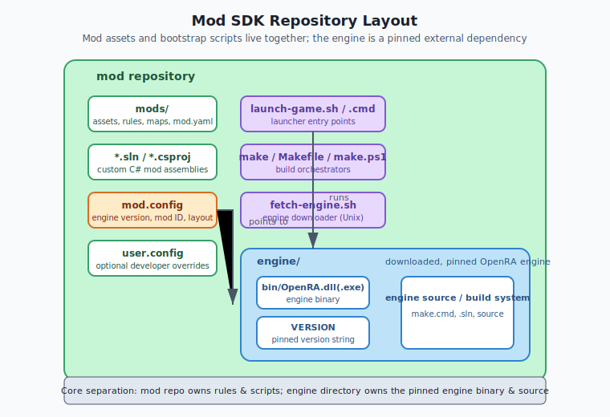

The launcher scripts live *inside* the mod repository, but they run the engine binary that lives *inside* the engine directory. This separation is the core of the decoupling: a mod repository does not need to contain the engine source, only a pointer to a precise engine version.

### Separation of concerns

| Concern | Lives in mod repo | Lives in engine directory | Lives in config |
| :---- | :---- | :---- | :---- |
| Gameplay rules, art, maps, audio | `mods/` | — | — |
| Custom C# logic | `*.sln` / `*.csproj` | — | — |
| Engine version selection | — | — | `ENGINE_VERSION` |
| Mod identity | — | — | `MOD_ID` |
| Engine binaries | — | `bin/OpenRA.dll` | — |
| Engine source / build system | — | engine root | — |
| Local engine path | — | — | `ENGINE_DIRECTORY` |

Because the engine is downloaded and built locally, the same mod repository can be checked out by any developer on Linux, macOS, or Windows, and the bootstrap scripts will produce a runnable environment for that platform.


## Data Flow / Code Path


### 1. Launcher entry point

A developer invokes the mod with either `launch-game.sh` (Unix) or `launch-game.cmd` (Windows). The two scripts are not shared code; they are platform-specific implementations of the same contract.

#### `launch-game.sh` (Unix)

1. **Prerequisite check**: the script verifies that at least one of `mono` or `dotnet` is installed, and that either `python3` or `python` is available.
2. **Locate the SDK root**: `python` is used to resolve the real path of the script, from which the `TEMPLATE_ROOT` and the mod search path are derived.
3. **Load configuration**: `mod.config` is sourced as a shell script; `user.config` is sourced if it exists. Because the config file is written as `KEY="value"`, sourcing it directly sets shell variables.
4. **Validate required variables**: a helper `require_variables` asserts that `MOD_ID`, `ENGINE_VERSION`, and `ENGINE_DIRECTORY` are non-empty.
5. **Engine version check**: the script verifies that `${ENGINE_DIRECTORY}/bin/OpenRA.dll` exists and that the contents of `${ENGINE_DIRECTORY}/VERSION` exactly match `ENGINE_VERSION`. If either test fails, it prints an error and exits with the message to run `make`.
6. **Runtime selection**: if `mono` is installed and `OpenRA.dll` does not contain the string `.NETCoreApp,Version=`, the launcher chooses `mono --debug`; otherwise it chooses `dotnet`.
7. **Handoff to engine**: the working directory changes to the engine directory and the engine is launched with the arguments `Game.Mod="${MOD_ID}"`, `Engine.EngineDir=".."`, `Engine.LaunchPath="${TEMPLATE_LAUNCHER}"`, and `Engine.ModSearchPaths="${MOD_SEARCH_PATHS}"`, plus any extra arguments passed through `$@`.

#### `launch-game.cmd` (Windows)

1. **Parse configuration**: the batch file iterates over `mod.config` and `user.config` (if present), splitting each line at the first `=` and assigning the left side as an environment variable and the right side as its value.
2. **Validate required variables**: it checks `MOD_ID`, `ENGINE_VERSION`, and `ENGINE_DIRECTORY`.
3. **Engine presence and version check**: it verifies that `%ENGINE_DIRECTORY%\bin\OpenRA.exe` exists and that the string `%ENGINE_VERSION%` appears in `%ENGINE_DIRECTORY%\VERSION`.
4. **Launch**: after changing to the engine directory, it runs `bin\OpenRA.exe` with the same argument set as the Unix launcher.
5. **Error handling**: if the engine exits with a non-zero code, the script shows a crash dialog pointing the user to the logs and FAQ.

### 2. Build entry point (Unix)

When a developer runs `make` or `make all`:

1. `Makefile` sets defaults: `RUNTIME ?= net6`, `CONFIGURATION ?= Release`.
2. It detects the host platform (`linux-x64`, `linux-arm64`, `osx-x64`, `osx-arm64`, or `unix-generic`) unless `TARGETPLATFORM` is already provided.
3. `all` depends on `engine`.
4. `engine` depends on `check-variables` and `check-sdk-scripts`.
5. `fetch-engine.sh` is invoked. If the engine is already present and its `VERSION` matches `ENGINE_VERSION`, it exits immediately; otherwise it downloads the archive, extracts it, removes a lint file that the example mod cannot pass, and runs the engine's own `make version`.
6. The engine is then built with `make RUNTIME=$(RUNTIME) TARGETPLATFORM=$(TARGETPLATFORM) all`.
7. Finally, the mod's own `.sln` files (if any) are compiled with `dotnet build` or `msbuild`, depending on the runtime.

### 3. Build entry point (Windows)

When a developer runs `make.cmd` or `make all` on Windows:

1. `make.cmd` calls `make.ps1` with all arguments forwarded.
2. `make.ps1` requires PowerShell 3 or later.
3. It parses `mod.config` and `user.config` using `ReadConfigLine` / `ParseConfigFile`, which populates environment variables for a fixed set of keys.
4. If the command is `all`, `clean`, or `check`, it inspects the engine version.
   - If the engine is present and matches `ENGINE_VERSION`, it delegates to the engine's own `make.cmd` inside the engine directory.
   - If `AUTOMATIC_ENGINE_MANAGEMENT` is disabled, it stops with a manual-update message.
   - Otherwise, it deletes the old engine directory, downloads the zip from `AUTOMATIC_ENGINE_SOURCE`, extracts it, renames the extracted folder to `ENGINE_DIRECTORY`, removes the same lint file, and runs the engine's `make.cmd version` and `make.cmd $command`.
5. It sets `$utilityPath = $env:ENGINE_DIRECTORY + "/bin/OpenRA.Utility.exe"`.
6. It dispatches to the command handler (`All-Command`, `Clean-Command`, `Version-Command`, `Test-Command`, `Check-Command`, or `Check-Scripts-Command`).


## Configuration (YAML)


`mod.config` is not MiniYAML; it is a plain `KEY="value"` file read as shell-style variables. However, it is the single source of truth for all bootstrap behavior, and it is the closest equivalent to a YAML manifest for this layer.

### Core variables

| Variable | Default example | Meaning |
| :---- | :---- | :---- |
| `MOD_ID` | `"example"` | The directory name under `mods/` that contains the mod's `mod.yaml`. The engine will load `mods/$MOD_ID/mod.yaml`. Must not contain spaces. |
| `ENGINE_VERSION` | `"release-20250330"` | The exact OpenRA engine version required by this mod. This is the version string written into the engine's `VERSION` file and used as the Git ref / archive tag for downloads. |
| `ENGINE_DIRECTORY` | `"./engine"` | The local path (relative to the SDK root) where the engine source/binaries are stored. |

### Engine management variables

| Variable | Default example | Meaning |
| :---- | :---- | :---- |
| `AUTOMATIC_ENGINE_MANAGEMENT` | `"True"` | When `True`, the SDK is allowed to download and replace the engine directory automatically. When `False`, the developer must manage the engine manually. |
| `AUTOMATIC_ENGINE_SOURCE` | `"https://github.com/OpenRA/OpenRA/archive/${ENGINE_VERSION}.zip"` | The URL from which the engine archive is downloaded. The literal substring `${ENGINE_VERSION}` is replaced by the value of `ENGINE_VERSION`. |
| `AUTOMATIC_ENGINE_EXTRACT_DIRECTORY` | `"./engine_temp"` | Temporary directory used while extracting the downloaded archive. |
| `AUTOMATIC_ENGINE_TEMP_ARCHIVE_NAME` | `"engine.zip"` | File name for the downloaded archive. |

### Packaging variables (read by build/packaging scripts)

The file also contains many packaging keys (`PACKAGING_INSTALLER_NAME`, `PACKAGING_DISPLAY_NAME`, `PACKAGING_WEBSITE_URL`, `PACKAGING_FAQ_URL`, `PACKAGING_AUTHORS`, `PACKAGING_COPY_CNC_DLL`, `PACKAGING_COPY_D2K_DLL`, etc.). These are not used by the bootstrap launcher itself, but they are part of the same config contract because the packaging scripts read the same `mod.config` file.

### `user.config` overrides

Both the Unix and Windows bootstrap paths read `user.config` after `mod.config` if it exists. This allows a developer to override `ENGINE_VERSION`, `ENGINE_DIRECTORY`, or any other key locally without changing the committed file. The order of precedence is:

1. `mod.config` (shared defaults).
2. `user.config` (per-user overrides).

Any values not present in `user.config` retain the value from `mod.config`.

## Interconnectivity

- **Depends on:**
  - The OpenRA engine repository (`OpenRA/OpenRA`), because the bootstrap downloads and builds the engine from it.
  - The engine's own `Makefile` and `make.cmd` inside the engine directory, which are invoked to build the engine and stamp its version.
  - The mod's `mods/<MOD_ID>/mod.yaml`, which is not read by the bootstrap scripts but is passed to the engine as the mod manifest to load.
- **Used by:**
  - The packaging scripts in `packaging/` (Linux, macOS, Windows), which read the same `mod.config` variables to produce installers.
  - The dedicated-server launcher (`launch-dedicated.sh`), which follows the same config-loading and runtime-resolution pattern.
  - The utility script (`utility.sh` / `utility.cmd`), which is used by the `test` and `check` make targets.


## Algorithms


### Required-variable validation

Both `launch-game.sh` and `fetch-engine.sh` use the same `require_variables` function:

```
for each variable name in [MOD_ID, ENGINE_VERSION, ENGINE_DIRECTORY]:
    if the variable is empty or unset:
        append the variable name to the missing list
if the missing list is not empty:
    print "Required mod.config variables are missing:" and the list
    exit with failure
```

The Windows launcher uses a simpler inline check: if `!MOD_ID!`, `!ENGINE_VERSION!`, or `!ENGINE_DIRECTORY!` is empty after parsing, it jumps to the `badconfig` label. `make.ps1` collects missing variables into a `$missing` array and prints the same diagnostic before exiting.

### Runtime selection (Unix)

```
if mono is available:
    if OpenRA.dll does not contain the string ".NETCoreApp,Version=":
        RUNTIME_LAUNCHER = "mono --debug"
    else:
        RUNTIME_LAUNCHER = "dotnet"
else if dotnet is available:
    RUNTIME_LAUNCHER = "dotnet"
else:
    error: "The OpenRA mod SDK requires dotnet or mono."
```

The check for `.NETCoreApp,Version=` inside the assembly is a heuristic: if the engine was built for .NET Core / .NET 5+, it needs `dotnet`; otherwise it is a .NET Framework / Mono build and can be run with `mono`. The Windows launcher does not perform this check because the Windows distribution of the SDK always expects `OpenRA.exe` and .NET 6+.

### Engine version pinning

The engine version is pinned by the `VERSION` file placed inside the engine directory. The bootstrap scripts compare this file to the value of `ENGINE_VERSION` from `mod.config`.

Unix:
```
if OpenRA.dll does not exist or (cat ENGINE_DIRECTORY/VERSION) != ENGINE_VERSION:
    print "Required engine files not found."
    exit with failure
```

Windows:
```
if OpenRA.exe does not exist or ENGINE_VERSION not found in ENGINE_DIRECTORY/VERSION:
    print "Required engine files not found."
    pause and exit
```

When `make` or `make.ps1` updates the engine, it stamps the engine with `make version VERSION="<ENGINE_VERSION>"`, which writes the version into the engine's `VERSION` file.

### Automatic engine fetch (Unix)

```
if AUTOMATIC_ENGINE_MANAGEMENT is not "True":
    error and ask for manual update

if current engine VERSION == ENGINE_VERSION:
    exit 0

if engine directory exists:
    print current version (or "unknown version")
    delete engine directory

print "Downloading engine..."
if curl available:
    download using curl -L -O
else:
    download using wget -cq

extract archive
inspect top-level directory name in the zip (REFNAME)
move engine_temp/REFNAME to ENGINE_DIRECTORY
remove engine_temp and archive
remove OpenRA.Mods.Common/Lint/CheckFluentReferences.cs
change to ENGINE_DIRECTORY
run "make version VERSION=ENGINE_VERSION"
```

The removal of `CheckFluentReferences.cs` is a deliberate hack: the SDK ships with an example mod that does not satisfy that lint check, so the file is deleted to prevent a false failure during the engine build.

### Automatic engine fetch (Windows)

The Windows path in `make.ps1` is conceptually identical but uses .NET APIs:

```
if current engine VERSION == ENGINE_VERSION:
    delegate to engine's make.cmd

if AUTOMATIC_ENGINE_MANAGEMENT != "True":
    error and ask for manual update

if engine directory exists:
    delete it

print "Downloading engine..."
remove old temp extract directory
construct URL by replacing ${ENGINE_VERSION} in AUTOMATIC_ENGINE_SOURCE
System.Net.WebClient.DownloadFile(url, tempArchive)
System.IO.Compression.ZipFile.ExtractToDirectory(tempArchive, tempExtractDir)
move extracted subdir to ENGINE_DIRECTORY
remove temp extract directory and archive
remove OpenRA.Mods.Common/Lint/CheckFluentReferences.cs
delegate to engine's make.cmd version and make.cmd <command>
```

### Build orchestration

Unix `Makefile`:

```
engine target:
    run fetch-engine.sh
    run engine make with RUNTIME and TARGETPLATFORM

all target:
    depend on engine
    if RUNTIME == mono:
        msbuild each .sln with Mono=true
    else:
        dotnet build each .sln

clean target:
    depend on engine
    clean each .sln
    clean engine

version target:
    call engine packaging function to set mod.yaml version

test target:
    depend on all
    run utility.sh --check-yaml

check target:
    depend on engine
    build in Debug with warnings as errors
    run utility.sh --check-explicit-interfaces
    run utility.sh --check-conditional-trait-interface-overrides
```

Windows `make.ps1`:

```
parse mod.config and user.config
if command is all/clean/check:
    fetch or verify engine
    run engine's make.cmd for the same command
set utilityPath = ENGINE_DIRECTORY/bin/OpenRA.Utility.exe
if command is all:
    All-Command: dotnet build *.sln
if command is clean:
    Clean-Command: dotnet clean, remove obj directories
if command is version:
    Version-Command: edit mods/<MOD_ID>/mod.yaml
if command is test:
    Test-Command: [Utility](#file-appendices-Appendix_A_Glossary).exe --check-[yaml](#file-appendices-Appendix_A_Glossary)
if command is check:
    Check-Command: build debug with warnaserror, then utility checks
if command is check-scripts:
    Check-Scripts-Command: luac -p each .lua map script
```


## Extension Points


- **Custom engine directory:** a developer can set `ENGINE_DIRECTORY` to a different path in `user.config` to point to a manually built engine. This is useful when testing engine changes alongside the mod.
- **Custom engine source:** `AUTOMATIC_ENGINE_SOURCE` can be changed to point to a fork or a private archive. The only requirement is that the archive must contain a single top-level directory that the extraction scripts can rename.
- **Manual engine management:** set `AUTOMATIC_ENGINE_MANAGEMENT="False"` and the SDK will stop trying to download the engine. The developer must then place the correct engine at `ENGINE_DIRECTORY` and run the engine's own build.
- **Custom build targets:** `Makefile` and `make.ps1` can be extended with new targets for mod-specific tools, but doing so requires keeping both Unix and Windows scripts in sync.
- **Additional packaging metadata:** the packaging variables in `mod.config` are read directly by the packaging scripts, so adding new installer behavior usually starts with adding a new config key.


## Common Pitfalls / Guardrails


- **Line endings in `mod.config`:** `Makefile` has a `check-sdk-scripts` target that runs `awk '/\r$/ { exit(1); }' mod.config`. If `mod.config` is saved with CRLF line endings, the Unix shell scripts will fail to parse it correctly. The file must use Unix line endings (LF).

- **Executable bit on shell scripts:** `check-sdk-scripts` also verifies that `fetch-engine.sh`, `launch-dedicated.sh`, `launch-game.sh`, and `utility.sh` are executable. If the SDK is cloned on Windows or extracted from an archive, the executable bits may be lost. Run `git update-index --chmod=+x *.sh` and commit the resulting mode change.

- **Missing engine version error:** if `launch-game.sh` prints `Required engine files not found`, the root cause is almost always that the `VERSION` file inside the engine directory does not match `ENGINE_VERSION` in `mod.config`, or that the engine was never built. Running `make` resolves this.

- **Runtime mismatch:** on Unix, if both `mono` and `dotnet` are installed, the launcher chooses based on whether the built engine assembly contains `.NETCoreApp,Version=`. If the engine is rebuilt for a different framework without updating the launcher, the wrong runtime may be selected. Keep the engine and SDK versions in sync.

- **Windows batch parser limitations:** `launch-game.cmd` splits each config line at the first `=` only. Values that themselves contain `=` will be truncated. Avoid `=` in config values.

- **PowerShell execution policy:** `make.cmd` passes `-ExecutionPolicy Bypass` to PowerShell, so the script can run even if the default policy is restricted. Do not remove this flag unless the environment is already configured to allow unsigned scripts.

- **Engine archive top-level directory:** `fetch-engine.sh` assumes the downloaded zip has exactly one top-level directory (e.g., `OpenRA-release-20250330`). The Windows script uses `Get-ChildItem -Recurse | Select-Object -First 1` for the same assumption. Custom archives must follow this layout.

- **The `CheckFluentReferences.cs` hack:** the SDK removes `OpenRA.Mods.Common/Lint/CheckFluentReferences.cs` from the downloaded engine. If the engine's lint checks change, this removal may break the engine build or become unnecessary. It exists only for the example mod; production mods should not rely on it being removed.

- **Do not commit the engine directory:** `ENGINE_DIRECTORY` and `AUTOMATIC_ENGINE_EXTRACT_DIRECTORY` are intended to be temporary. Add them to `.gitignore` so the pinned engine is not committed.

- **Mod search paths:** the launcher passes `Engine.ModSearchPaths="./mods,<engine>/mods"` (Windows) or `${TEMPLATE_ROOT}/mods,./mods` (Unix). The engine then scans those directories for a subdirectory matching `MOD_ID`. If the mod is not found, the engine will fail to start; the path must be correct relative to the engine directory.

## Summary

This chapter explains how the OpenRA [Mod SDK](#file-appendices-Appendix_A_Glossary) bootstrapping layer turns a standalone [mod](#file-appendices-Appendix_A_Glossary) repository into a runnable game.

After reading this chapter, you should be able to:

- **Prerequisite check**: the script verifies that at least one of `mono` or `dotnet` is installed, and that either `python3` or `python` is available.
- **Locate the SDK root**: `python` is used to resolve the real path of the script, from which the `TEMPLATE_ROOT` and the mod search path are derived.
- **Load configuration**: `mod.config` is sourced as a shell script; `user.config` is sourced if it exists. Because the config file is written as `KEY="value"`, sourcing it directly sets shell variables.
- **Validate required variables**: a helper `require_variables` asserts that `MOD_ID`, `ENGINE_VERSION`, and `ENGINE_DIRECTORY` are non-empty.
- **Engine version check**: the script verifies that `${ENGINE_DIRECTORY}/bin/OpenRA.dll` exists and that the contents of `${ENGINE_DIRECTORY}/VERSION` exactly match `ENGINE_VERSION`. If either test fails, it prints an error and exits with the message to run `make`.
- **Runtime selection**: if `mono` is installed and `OpenRA.dll` does not contain the string `.NETCoreApp,Version=`, the launcher chooses `mono --debug`; otherwise it chooses `dotnet`.
- **Handoff to engine**: the working directory changes to the engine directory and the engine is launched with the arguments `Game.Mod="${MOD_ID}"`, `Engine.EngineDir=".."`, `Engine.LaunchPath="${TEMPLATE_LAUNCHER}"`, and `Engine.ModSearchPaths="${MOD_SEARCH_PATHS}"`, plus any extra arguments passed through `$@`.

If any of the concepts above feel unclear, review the relevant section before continuing. For source files and further reading, see the References section.


## References

- Source files:
  - `OpenRAModSDK/mod.config`
  - `OpenRAModSDK/launch-game.sh`
  - `OpenRAModSDK/launch-game.cmd`
  - `OpenRAModSDK/fetch-engine.sh`
  - `OpenRAModSDK/Makefile`
  - `OpenRAModSDK/make.cmd`
  - `OpenRAModSDK/make.ps1`
- Upstream documentation:
  - OpenRA Mod SDK repository: `https://github.com/OpenRA/OpenRAModSDK`
  - OpenRA engine repository: `https://github.com/OpenRA/OpenRA`
  - OpenRA wiki / FAQ: `https://wiki.openra.net/FAQ`
- Related manual chapters:
  - [Part 3.1 — Mod SDK and Project Structure](#file-chapters-Part_03_Chapter_01_Mod_SDK) and [Part 3.3 — Build Pipeline and Packaging](#file-chapters-Part_03_Chapter_03_Build_Packaging) cover packaging, the dedicated server, and the utility scripts in more detail.
  - [Part 2.1 — MiniYaml and the Rules File Format](#file-chapters-Part_02_Chapter_01_MiniYaml), [Part 2.2 — Manifest, ModData, Ruleset, and RulesetCache](#file-chapters-Part_02_Chapter_02_Manifest), and [Part 2.3 — FieldLoader and Type Conversions](#file-chapters-Part_02_Chapter_03_FieldLoader) cover the `mod.yaml` loaded once the engine has started.

## What to read next

- [Part 3.1 — Mod SDK and Project Structure](#file-chapters-Part_03_Chapter_01_Mod_SDK): review the `mod.yaml` manifest and `ModData` environment that the bootstrap scripts launch into.
- [Part 3.3 — Build Pipeline and Packaging](#file-chapters-Part_03_Chapter_03_Build_Packaging): the `make` targets described here delegate to the build pipeline and packaging scripts covered there.
- [Part 2.2 — Manifest, ModData, Ruleset, and RulesetCache](#file-chapters-Part_02_Chapter_02_Manifest): once the engine starts, the manifest and `ModData` classes parse the loaded configuration.


---

<a id="file-chapters-Part_03_Chapter_03_Build_Packaging"></a>

<!-- --- FILE: chapters/Part_03_Chapter_03_Build_Packaging.md --- -->

# Chapter 3.3 — Build Pipeline and Packaging {#file-chapters-Part_03_Chapter_03_Build_Packaging}

## Purpose

OpenRA uses .NET for the [engine](#file-appendices-Appendix_A_Glossary) and [mod](#file-appendices-Appendix_A_Glossary) assemblies, and a collection of shell scripts for packaging and deployment. This chapter explains the build process from source to distributable packages, including the Makefile, `dotnet publish`, utility commands, and platform-specific packaging.

## Learning Objectives


After studying this chapter, you should be able to:

- Explain the full build pipeline from source to self-contained release [packages](#file-appendices-Appendix_A_Glossary).
- Use the main Makefile targets for build, test, check, and version.
- Describe the role of dotnet publish and platform-specific packaging scripts.
- Validate mod [YAML](#file-appendices-Appendix_A_Glossary) using the OpenRA [Utility](#file-appendices-Appendix_A_Glossary) commands.
- Configure project files for [TargetPlatform](#file-appendices-Appendix_A_Glossary) and target framework.
- Identify platform-specific packaging requirements (Windows, Linux, macOS).

## Files

| File | Responsibility |
| :---- | :---- |
| `Makefile` | Top-level build targets: `all`, `test`, `check`, `install`, `version`. |
| `OpenRA.Game/OpenRA.Game.csproj` | Engine project file. |
| `OpenRA.Mods.Common/OpenRA.Mods.Common.csproj` | Common mod project file. |
| `OpenRA.Mods.Cnc/OpenRA.Mods.Cnc.csproj` | C&C mod project file. |
| `OpenRA.Mods.D2k/OpenRA.Mods.D2k.csproj` | D2K mod project file. |
| `OpenRA.WindowsLauncher/` | Windows launcher project. |
| `packaging/functions.sh` | Shared packaging helper functions. |
| `packaging/windows/buildpackage.sh` | Windows installer/package builder. |
| `packaging/linux/buildpackage.sh` | Linux AppImage/package builder. |
| `packaging/macos/buildpackage.sh` | macOS app bundle builder. |
| `packaging/package-all.sh` | Builds packages for all platforms. |
| `utility.sh` | Wrapper for running the OpenRA utility. |
| `launch-game.sh` | Development launch script. |
| `fetch-geoip.sh` | Downloads GeoIP database for server IP location. |
| `configure-system-libraries.sh` | Configures system native dependencies. |
| `VERSION` | Version file used by packaging scripts. |


## Architecture


### Build overview

```
[Source] -> [dotnet build] -> [bin/ engine + mod DLLs] -> [dotnet publish --self-contained] -> [platform package]
```

The engine and mod assemblies are built with .NET. For releases, `dotnet publish` produces a self-contained package that includes the .NET runtime and native dependencies. Platform-specific scripts then bundle the binaries into installers, app bundles, or AppImages.

### Make targets

| Target | Purpose |
| :---- | :---- |
| `make` / `make all` | Builds the engine and mods in Release mode. |
| `make test` | Builds and checks official mod YAML. |
| `make tests` | Builds and runs unit tests. |
| `make check` | Builds in Debug mode and runs code-style checks. |
| `make check-scripts` | Checks Lua script syntax. |
| `make install` | Installs engine and official mods locally. |
| `make version` | Updates version in `VERSION` and `mod.yaml` files. |
| `make install-linux-shortcuts` | Installs desktop files and icons. |

### Configuration

- `CONFIGURATION` — `Release` or `Debug`.
- `TARGETPLATFORM` — `win-x64`, `linux-x64`, `linux-arm64`, `osx-x64`, `osx-arm64`.
- `DEPENDENCIES` — `bundled` (default) or `system` for native libraries.

### Platform RID

The Makefile detects the target platform using `dotnet --info` and `uname`. Cross-platform builds are possible by setting `TARGETPLATFORM` explicitly.


## Data Flow / Code Path


### Build

```makefile
all:
    @$(DOTNET) build -c ${CONFIGURATION} -nologo -p:TargetPlatform=$(TARGETPLATFORM)
    @./fetch-geoip.sh
```

This compiles the solution and downloads the GeoIP database.

### Test

```makefile
test: all
    @./utility.sh ts-content --check-yaml
    @./utility.sh ts --check-yaml
    @./utility.sh d2k-content --check-yaml
    @./utility.sh d2k --check-yaml
    @./utility.sh cnc-content --check-yaml
    @./utility.sh cnc --check-yaml
    @./utility.sh ra-content --check-yaml
    @./utility.sh ra --check-yaml
```

The `utility.sh` script runs the OpenRA Utility command-line tool, which loads each mod and validates its YAML.

### Code style checks

```makefile
check:
    @$(DOTNET) build -c Debug -nologo -warnaserror -p:TargetPlatform=$(TARGETPLATFORM)
    @./utility.sh all --check-explicit-interfaces
    @./utility.sh all --check-conditional-trait-interface-overrides
```

### Publish

The `packaging/functions.sh` script uses `dotnet publish`:

```bash
dotnet publish -c Release -p:TargetPlatform="${TARGETPLATFORM}" -p:CopyGenericLauncher="${COPY_GENERIC_LAUNCHER}" -p:CopyCncDll="${COPY_CNC_DLL}" -p:CopyD2kDll="${COPY_D2K_DLL}" -r "${TARGETPLATFORM}" -p:PublishDir="${DEST_PATH}" --self-contained true
```

### Data installation

After publishing, the packaging scripts copy data:

```bash
install_data() {
    ./fetch-geoip.sh
<!-- DEV-NOTE [tooling]: Khronos GLSL reference: https://www.khronos.org/opengl/wiki/OpenGL_Shading_Language — reference for the shader dialect used by the engine. -->
    cp -r "${SRC_PATH}/glsl" "${DEST_PATH}"
    cp -r "${SRC_PATH}/mods/common" "${DEST_PATH}/mods/"
    cp -r "${SRC_PATH}/mods/${MOD_ID}" "${DEST_PATH}/mods/"
    cp -r "${SRC_PATH}/mods/common-content" "${DEST_PATH}/mods/"
    cp -r "${SRC_PATH}/mods/${MOD_ID}-content" "${DEST_PATH}/mods/"
}
```

### Platform-specific launchers

- **Windows:** `OpenRA.WindowsLauncher` builds a per-mod `.exe` with the mod name, icon, and FAQ URL embedded.
- **macOS:** `packaging/macos/buildpackage.sh` creates an `.app` bundle with the launcher, binaries, and mod data.
- **Linux:** `packaging/linux/buildpackage.sh` creates an AppImage or a portable tarball.


## Configuration (YAML)


### Mod version

The version is stored in `VERSION` and injected into `mod.yaml` during packaging:

```bash
set_engine_version "$(VERSION)" .
set_mod_version "$(VERSION)" mods/*/mod.yaml
```

### Project files

Each C# project targets the appropriate .NET version and includes `TargetPlatform` properties:

```xml
<PropertyGroup>
    <TargetFramework>net6.0</TargetFramework>
    <TargetPlatform Condition="'$(TargetPlatform)' == ''">win-x64</TargetPlatform>
</PropertyGroup>
```

## Interconnectivity

- **Depends on:** [Part 3.1 — Mod SDK and Project Structure](#file-chapters-Part_03_Chapter_01_Mod_SDK) (`mod.yaml`, manifest), [Part 2.1 — MiniYaml and the Rules File Format](#file-chapters-Part_02_Chapter_01_MiniYaml) validation, [Part 9.2 — Server and Connection Layer](#file-chapters-Part_09_Chapter_02_Server_Connection) packaging.
- **Used by:** [Part 10.1 — Official Mods](#file-chapters-Part_10_Chapter_01_Official_Mods) are packaged this way, and [Part 10.3 — Porting, Modding, and Developer Workflows](#file-chapters-Part_10_Chapter_03_Port_And_Modding) covers porting and deployment workflows.


## Algorithms


### Dependency bundling

<!-- DEV-NOTE [tooling]: OpenAL Soft: https://openal-soft.org — the open-source implementation of the spatial audio API used by OpenRA. -->
When `DEPENDENCIES=bundled`, the build includes native libraries such as SDL2, OpenAL, and FreeType in the output. When `DEPENDENCIES=system`, it links against system libraries.

### Self-contained publish

`dotnet publish --self-contained true` bundles the .NET runtime, so players do not need to install .NET separately.

### YAML validation

The utility's `--check-yaml` command loads each mod's rules, sequences, weapons, and other YAML files and reports errors. This catches syntax errors and missing references before release.

### Explicit interface checks

`--check-explicit-interfaces` verifies that traits implement interfaces explicitly where required, preventing subtle reflection issues.

### Conditional trait interface checks

`--check-conditional-trait-interface-overrides` validates that conditional trait interfaces are correctly overridden.

### Lua syntax checks

`make check-scripts` runs `luac -p` on all Lua files in maps and scripts.


## Extension Points


### Add a new mod to the build

Create a `.csproj` for the mod assembly, add it to the solution, and reference it in `mod.yaml`. Add the mod to the packaging scripts if it should be released.

### Add a custom build target

Extend the Makefile or add a new packaging script under `packaging/`. Use `packaging/functions.sh` to share common steps.

### Add a utility command

Implement `IUtilityCommand` in a C# class and run it via `utility.sh <mod> --command-name`. Utility commands are useful for custom tooling, data conversion, or validation.

### Add custom packaging

Create a new script under `packaging/<platform>/` and call it from `package-all.sh`. The shared functions in `packaging/functions.sh` handle assembly and data installation.


## Common Pitfalls / Guardrails


- **Target platform mismatch:** build and publish must use the same `TargetPlatform`. Mismatches can cause native dependency errors.
- **Runtime version:** the .NET SDK version must match the target framework in the project files.
- **GeoIP fetch:** `fetch-geoip.sh` downloads an external file. Packaging may fail if the network is unavailable; include a fallback or pre-download the file.
- **Mod version injection:** `make version` updates `mod.yaml` and `VERSION`. Commit these changes before tagging a release.
- **YAML validation warnings:** `make test` treats warnings as errors by default. Set `TREAT_WARNINGS_AS_ERRORS=false` to see warnings without failing the build.
- **Self-contained size:** self-contained packages are large. Consider trimming unused assemblies if package size is a concern.
- **macOS notarization:** macOS app bundles may require code signing and notarization for distribution outside the App Store.
- **Windows launcher:** the Windows launcher embeds the mod ID and FAQ URL. Make sure these are correct for each mod.

## Summary

This chapter explains how OpenRA builds its engine and mod assemblies from source into self-contained, platform-specific release packages.

If any of the concepts above feel unclear, review the relevant section before continuing. For source files and further reading, see the References section.


## References

- `Makefile` — top-level build targets.
- `packaging/functions.sh` — shared packaging helpers.
- `packaging/windows/buildpackage.sh` — Windows packaging.
- `packaging/linux/buildpackage.sh` — Linux packaging.
- `packaging/macos/buildpackage.sh` — macOS packaging.
- `packaging/package-all.sh` — all-platform packaging.
- `utility.sh` — utility command wrapper.
- `launch-game.sh` — development launch.
- `fetch-geoip.sh` — GeoIP download.
- `OpenRA.Game/IUtilityCommand.cs` — utility command interface.

## What to read next

- [Part 3.1 — Mod SDK and Project Structure](#file-chapters-Part_03_Chapter_01_Mod_SDK): return to the mod package layout that the build pipeline packages into release installers and archives.
- [Part 10.3 — Porting, Modding, and Developer Workflows](#file-chapters-Part_10_Chapter_03_Port_And_Modding): continue from packaging into porting, deployment, and development workflows for new mods.
- [Part 9.2 — Server and Connection Layer](#file-chapters-Part_09_Chapter_02_Server_Connection): understand how packaged releases connect to the server infrastructure.

### External resources

- [Microsoft .NET SDK](https://dotnet.microsoft.com) — required to build the OpenRA engine and mod projects.


---

<a id="file-chapters-Part_04_Chapter_01_Renderer"></a>

<!-- --- FILE: chapters/Part_04_Chapter_01_Renderer.md --- -->

# Chapter 4.1 — Renderer, Sheet, and Sprite {#file-chapters-Part_04_Chapter_01_Renderer}

## Purpose

OpenRA's graphics engine is a 2D [sprite](#file-appendices-Appendix_A_Glossary) renderer built on top of a thin platform abstraction. It uploads sprite frames to GPU [sheets](#file-appendices-Appendix_A_Glossary), draws them as textured quads, supports indexed ([palette](#file-appendices-Appendix_A_Glossary)) and true-color sprites, and applies blend modes. This chapter explains the core renderer interfaces, the `Sheet`/`Sprite` model, the palette system, and how the CPU-side game loop drives the GPU frame by frame.


## Mental Model

Think of the renderer as an industrial print shop that produces a flip-book of every frame.

- **The artist** (mod author) creates individual frames as sprites and sequences in YAML.
- **The print shop** (`SpriteCache` and `SheetBuilder`) packs those frames onto large sheets of paper (GPU texture atlases) so they can be printed in a single pass.
- **The colorist** (`HardwarePalette` and palette traits) keeps a tray of indexed inks; indexed sprites are just numbered dents on a sheet, and the palette decides which real color fills each dent.
- **The press operator** (`Renderer` / `SpriteRenderer`) runs the sheets through the press in a strict order: `BeginFrame` sets up the shop, `BeginWorld` loads the world canvas, `BeginUI` switches to the UI canvas, and `EndFrame` presents the final page to the player.
- **The shop manager** (world and UI code) decides which sprites appear where, which palette row to use, and which blend mode (transparent ink, additive ink, etc.) applies.

This mental model explains why the engine cares so much about batching (draw every sprite that shares the same sheet and palette before changing paper), why UV insets exist (so the press does not accidentally smudge a neighboring frame), and why the world and UI are rendered separately (they use different scaling, projection, and depth settings). The sequence data that points the renderer at a sprite comes from [Part 6.5 — Asset Loaders](#file-chapters-Part_06_Chapter_05_Asset_Loaders), the rules that bind it to an actor live in [Part 2.4 — Rulesets, Actors, and Weapons](#file-chapters-Part_02_Chapter_04_Rules_Weapons), and the trait that actually produces renderables is part of the ECS described in [Part 1.1 — Entity-Component-System (ECS) and Actor Lifecycle](#file-chapters-Part_01_Chapter_01_ECS).

## Learning Objectives


After studying this chapter, you should be able to:

1. Describe the renderer stack from game code through `Renderer`, `SpriteRenderer`, and the platform abstraction to the GPU.
2. Explain the `Sheet`/`Sprite` model and why sprite packing reduces draw calls.
3. Distinguish indexed (palette) sprites from true-color sprites and explain how `HardwarePalette` works.
4. Trace a sprite frame from asset file through `SpriteCache` to a GPU sheet upload.
<!-- DEV-NOTE [tooling]: Khronos GLSL reference: https://www.khronos.org/opengl/wiki/OpenGL_Shading_Language — reference for the shader dialect used by the engine. -->
5. Configure renderer constants, shader references, and palette definitions in YAML.
6. Identify common rendering pitfalls such as texture bleeding, sheet size limits, and threading violations.
7. Explain the purpose of UV inset and channel packing for indexed sprites.
8. Describe the frame lifecycle and the exact roles of `BeginFrame`, `BeginWorld`, `BeginUI`, `Flush`, and `EndFrame`.


## Practical Example: Rendering a New Infantry Sprite


Suppose you have created a new infantry sprite file `commando.shp` and want to see it in-game.

<!-- DEV-NOTE [visual-aid]: sprite-loading pipeline diagram: commando.shp on disk -> VFS -> ISpriteLoader -> ISpriteFrame[] -> SpriteCache reserves -> SheetBuilder packs into Indexed/BGRA sheet (channel packing) -> Sprite with UVs -> SequenceSet -> Render trait -> WorldRenderer.Draw. Show palette texture sampling for indexed path. -->

1. **Place the asset.** Copy `commando.shp` into the mod's VFS path, for example `mods/ra/bits/commando.shp` (see [Part 6.3 — Virtual File System](#file-chapters-Part_06_Chapter_03_VFS)).
2. **Define the [sequence](#file-appendices-Appendix_A_Glossary).** In `mods/ra/sequences/infantry.yaml`, add a sequence entry for the actor that uses the sprite:
   ```yaml
   e9:
       idle:
           Start: 0
           Length: 1
           ShadowStart: 410
       run:
           Start: 8
           Length: 6
           Facings: 8
           ShadowStart: 418
   ```
3. **Reserve the sprite.** At startup, `SequenceSet` asks the `SpriteCache` to reserve the frames referenced by the sequence. `SpriteCache` records the reservation as a token grouped by filename, so duplicate frames can be deduplicated and loaded in one pass.
4. **Load the sprite.** During `SpriteCache.LoadReservations`, the registered `ISpriteLoader` implementations try to parse `commando.shp`. The winning loader returns an `ISpriteFrame[]` array. The cache orders frames by height to pack rows tightly, then calls `SheetBuilder.Add` for each distinct frame.
5. **Pack into sheets.** The `SheetBuilder` chooses an `Indexed` sheet (because `commando.shp` is an 8-bit SHP) and allocates a rectangle with a one-pixel margin. `Util.FastCopyIntoChannel` writes the frame into the chosen channel of the sheet's CPU buffer. When the current channel fills up, the builder advances to the next RGBA channel; when the sheet fills, it allocates a new sheet and releases the old buffer.
6. **Create a `Sprite` reference.** For each frame, `SheetBuilder.Add` returns a `Sprite` that stores the rectangle inside the sheet, the UV coordinates (inset by `1/128` of a pixel to avoid bleeding), and the `TextureChannel` (for indexed sprites). `SpriteCache` caches the sprite under the reservation token.
7. **Bind to an actor.** The actor's `RenderSprites` and `WithInfantryBody` traits reference the sequence name `e9`. During `WorldRenderer.Draw`, the body trait creates `SpriteRenderable` objects that submit the sprite to the `WorldSpriteRenderer` batch.
8. **Apply a palette.** `commando.shp` is an indexed sprite. The [renderable](#file-appendices-Appendix_A_Glossary) selects the appropriate palette row (e.g., `player` for the owning player's color). The shader samples the palette texture using the index from the sprite and the palette row, producing the final color. If the unit uses player color remapping, the palette row itself was created by remapping base indices to the player's color.
9. **Draw the frame.** `Renderer.BeginWorld` binds the world framebuffer and clears it; `WorldRenderer.Draw` submits terrain and actor renderables; `SpriteRenderer` batches the quads by blend mode, sheet, and palette. After the world is complete, `Renderer.BeginUI` composites the world buffer into the screen buffer and draws the [chrome](#file-appendices-Appendix_A_Glossary). Finally, `Renderer.EndFrame` flushes the remaining draw calls and presents the framebuffer.

This example shows how a single sprite asset travels through asset loading, sequence resolution, sheet packing, palette sampling, and batch rendering to become a colored, animated unit on the screen.

### Wiring the sprite to an actor

To actually see the sprite in-game, you need a sequence entry (already shown above) and an actor rule that references it. The actor rule below is the same pattern used by infantry in the default mods and can be copy-pasted into `mods/<mod>/rules/infantry.yaml`:

```yaml
COMMANDO:
    Inherits: ^Infantry
    RenderSprites:
        Image: e9
    WithInfantryBody:
        StandSequences: idle
    Mobile:
        Speed: 71
    Health:
        HP: 10000
    Armament:
        Weapon: Colt45
    AttackFrontal:
    Selectable:
        Bounds: 12,17,0,-9
```

The `RenderSprites` trait tells the engine which sequence image this actor uses, and `WithInfantryBody` creates the per-frame `SpriteRenderable` objects that `WorldRenderer` sorts and draws. These traits are part of the ECS described in [Part 1.1 — Entity-Component-System (ECS) and Actor Lifecycle](#file-chapters-Part_01_Chapter_01_ECS); the rule syntax is covered in [Part 2.4 — Rulesets, Actors, and Weapons](#file-chapters-Part_02_Chapter_04_Rules_Weapons).

## Files

| File | Responsibility |
| :---- | :---- |
| `OpenRA.Game/Renderer.cs` | Main renderer class, frame begin/end, viewport, renderables, shader management. |
| `OpenRA.Game/Graphics/PlatformInterfaces.cs` | Platform abstraction: `IPlatform`, `IPlatformWindow`, `IGraphicsContext`, `ITexture`, `IShader`, `IVertexBuffer`, `IFrameBuffer`, `IFont`. |
| `OpenRA.Game/Graphics/Sheet.cs` | GPU texture sheet with CPU buffer. |
| `OpenRA.Game/Graphics/Sprite.cs` | Reference to a rectangle inside a sheet, UVs, offset, blend mode. |
| `OpenRA.Game/Graphics/SpriteCache.cs` | Caches sprite frames and packs them into sheets. |
| `OpenRA.Game/Graphics/SheetBuilder.cs` | Allocates rectangles on sheets and manages channel packing. |
| `OpenRA.Game/Graphics/SpriteRenderer.cs` | Batches sprite quads and issues draw calls. |
| `OpenRA.Game/Graphics/Palette.cs` | `IPalette`, `ImmutablePalette`, `MutablePalette`, palette remapping. |
| `OpenRA.Game/Graphics/HardwarePalette.cs` | Uploads palettes to the GPU as textures. |
| `OpenRA.Game/Graphics/Util.cs` | CPU-side helpers for copying sprite data into sheets and creating quads. |
| `OpenRA.Game/Graphics/Vertex.cs` | `Vertex` struct and `CombinedShaderBindings`. |
| `OpenRA.Game/Graphics/ShaderBindings.cs` | Base class for shader bindings and vertex attributes. |
<!-- DEV-NOTE [tooling]: SDL2: https://www.libsdl.org — cross-platform windowing, input, and event library used by OpenRA. -->
| `OpenRA.Platforms.Default/*.cs` | Default SDL2/OpenGL platform implementation. |
| `OpenRA.Game/Manifest.cs` | `RendererConstants` manifest section. |
| `OpenRA.Game/Graphics/SequenceSet.cs` | Loads sequences and creates the `SpriteCache`. |


## Architecture


### Renderer layers

```
[Game code] -> [Renderer / WorldRenderer] -> [SpriteRenderer] -> [IGraphicsContext / IShader] -> [OpenGL / SDL2]
```

The `Renderer` class is the high-level coordinator. It manages the platform window, the graphics context, the shader state, and the sprite rendering batches. The `WorldRenderer` ([Part 4.2 — WorldRenderer](#file-chapters-Part_04_Chapter_02_WorldRenderer)) builds renderables and submits them to the renderer. The UI layer ([Part 4.3 — Widgets and Chrome](#file-chapters-Part_04_Chapter_03_Widgets)) draws chrome through the same `Renderer` path after the world has been rendered.

### Platform abstraction

All platform-specific graphics code is hidden behind interfaces:

- `IPlatformWindow` — window creation, input pumping, clipboard, cursor, display management.
- `IGraphicsContext` — vertex buffers, textures, framebuffers, shaders, draw calls.
- `ITexture` — GPU texture upload/download.
- `IShader` — shader uniform/texture binding.
- `IPlatform` — factory for window, sound, and fonts.

The default implementation lives in `OpenRA.Platforms.Default` and uses SDL2 for windowing/input and OpenGL for rendering.

### Frame lifecycle

Each frame is produced in a strict sequence so that the world and the UI are rendered into separate compositor buffers before being blitted to the screen.

```csharp
Game.Renderer.BeginWorld(viewportLocation, viewportSize);
worldRenderer.Draw();          // terrain, actors, overlays, shroud, post-processing
Game.Renderer.BeginUI();
Ui.Draw();                     // chrome and HUD
Game.Renderer.EndFrame(inputHandler);
```

1. `BeginWorld` — `Renderer.BeginFrame()` is called internally. It clears the screen, ensures the world framebuffer is sized to the viewport, and updates the viewport/projection uniforms for the world sprite renderer. The world render target is bound.
2. `WorldRenderer.Draw()` — submits all world renderables, runs the shroud layer, and draws overlays (see [Part 4.2 — WorldRenderer](#file-chapters-Part_04_Chapter_02_WorldRenderer)). Each draw call is batched by `SpriteRenderer`; nothing is sent to the GPU until `Flush()` is triggered.
3. `Renderer.Flush()` — `WorldRenderer` calls `Flush()` between phases so that batched geometry is actually drawn before the render state changes (for example, between terrain and actor layers, or before a post-processing pass).
4. `BeginUI` — first flushes the world pass, unbinds the world framebuffer, and binds the screen framebuffer. It then draws the world buffer into the screen buffer with pixel-art scaling. If the world was not rendered, it simply begins a new UI frame. The UI sprite renderer is now active.
5. `Ui.Draw()` — traverses the widget tree from `Ui.Root` and draws chrome, tooltips, and windows.
6. `EndFrame` — flushes the final UI batch, unbinds the screen buffer, draws the screen buffer to the actual window, pumps input, and calls `Context.Present()` to swap the front buffer.

The `Renderer` tracks which render type is active (`None`, `World`, or `UI`) and throws an exception if the sequence is violated. This separation is essential because world and UI rendering use different viewport parameters, depth-buffer settings, and scaling behavior.

### Sheet model

A `Sheet` is a large GPU texture with a CPU-side buffer. Sprites are small rectangles inside the sheet. By packing many sprites into a few large sheets, the engine reduces texture switching and draw calls.

`Sheet` has two important states:

- **Buffered** — the CPU `byte[] data` exists. Mods can read or write it, and the texture is marked dirty until `GetTexture()` uploads it.
- **Unbuffered** — the CPU buffer has been released after upload to save memory. Only the GPU texture remains.

Sheets are created by `SheetBuilder` in two sizes: `SequenceBgraSheetSize` for true-color sprites and `SequenceIndexedSheetSize` for indexed sprites. The maximum size is limited by GPU texture size support (modern hardware usually supports 8192 or 16384, but OpenRA defaults to 2048 for compatibility).

### Sprite reference

A `Sprite` stores:

- `Sheet` — the sheet containing the texture.
- `Bounds` — the rectangle within the sheet, in pixels.
- `Top/Left/Bottom/Right` — UV coordinates (slightly inset to avoid texture bleeding).
- `Channel` — which texture channel to use (for indexed sheets).
- `BlendMode` — how to blend with the framebuffer.
- `Offset` — world-space offset relative to the actor's position.
- `ZRamp` — fake depth scaling for isometric mods.
- `Size` — scaled world size used by the renderer to place the quad.

The `Sprite` constructor insets the UVs by `1/128` of a pixel. This compensates for GPU precision issues when rendering into non-1:1 framebuffers, preventing a stray line of texels from sampling outside the sprite rectangle. `SpriteWithSecondaryData` extends a sprite with a secondary sheet and bounds, used for per-pixel depth offset maps.

### Channel packing and sheet grouping

OpenRA keeps two kinds of sheets: `Indexed` (1 byte per effective channel) and `BGRA` (32-bit color). `SheetBuilder.FrameTypeToSheetType` maps decoded sprite formats to these buckets:

- `SpriteFrameType.Indexed8` -> `SheetType.Indexed`
- `SpriteFrameType.Bgra32`, `Bgr24`, `Rgba32`, `Rgb24` -> `SheetType.BGRA`

For indexed sheets, four sprite frames can be packed into the RGBA channels of a single texture. The `TextureChannel` enum (`Red`, `Green`, `Blue`, `Alpha`) selects which channel to sample. The shader reconstructs the index by taking the dot product of the sampled texel and the channel mask (`SelectChannelMask` in the vertex shader), then samples the palette texture at `(index, paletteRow)`. This multiplies effective sheet capacity by four and keeps all indexed artwork in the same texture format.

True-color sprites use `TextureChannel.RGBA` and are sampled directly; the palette texture is only used for color-shift effects if one is configured.

### Palette system

OpenRA palettes are 256-entry lookup tables. The core interfaces are:

- `IPalette` — read-only indexed color accessor (`uint this[int index]`).
- `ImmutablePalette` — a fixed 256-color palette loaded from a `.pal` file or another palette.
- `MutablePalette` — a mutable copy that `IPaletteModifier` traits can adjust each frame.
- `IPaletteRemap` — remaps a single color at a time, used for player color palettes.
- `HardwarePalette` — collects all registered palettes into a GPU texture.

Palette loading in YAML is done by world traits such as:

- `PaletteFromFile` — loads a `.pal` file from the VFS.
- `PaletteFromPaletteWithAlpha` — derives a palette from another with alpha adjustments.
- `PlayerColorPalette` — remaps a base palette to a player's color using `IPaletteRemap`.
- `PaletteFromPlayerPaletteWithHue` — derives a hue-shifted copy for another purpose.

Each palette row is registered in `HardwarePalette` with a flag `AllowModifiers`. If modifiers are allowed, the palette is kept as a `MutablePalette`; otherwise, the immutable copy is written directly into the GPU palette buffer. The first row of the palette texture is reserved as a no-op row for non-paletted sprites, avoiding a palette lookup for most RGBA sprites.

<!-- DEV-NOTE [visual-aid]: palette system diagram: a 2D texture where rows are palettes and columns are 256 color indices. Show arrows from a `.pal` file row, from a PlayerColorPalette remapped row, and from an IPaletteModifier writing into a MutablePalette. Add a magnified view of the fragment shader sampling (index, paletteRow) to produce the final RGBA color. -->

| Concept | Real-world analogy | Source / registration |
| :---- | :---- | :---- |
| `ImmutablePalette` | A pre-mixed tray of 256 inks | `PaletteFromFile` or `PaletteFromPaletteWithAlpha` in `rules/world.yaml` |
| `MutablePalette` | A tray that can be tinted each frame | `AllowModifiers: true` keeps a copy for `IPaletteModifier` traits |
| `PlayerColorPalette` | Replacing a few inks in the tray with a house color | `RemapIndex` selects which indices are recolored per player |
| `HardwarePalette` | The master ink chart uploaded to the GPU | Created by `WorldRenderer` and refreshed every frame via `RefreshPalette` |
| `IPaletteRemap` | A recipe that recolors one ink at a time | Used by `PlayerColorPalette` to build per-player palette rows |

Palette traits are world traits, so they are declared in the `World` actor definition (see [Part 2.4 — Rulesets, Actors, and Weapons](#file-chapters-Part_02_Chapter_04_Rules_Weapons)). The per-frame color effects that drive `MutablePalette` are often triggered by gameplay code, such as the nuke flash or the desert theater tint, which are described alongside the simulation logic in [Part 1.1 — Entity-Component-System (ECS) and Actor Lifecycle](#file-chapters-Part_01_Chapter_01_ECS).

### Shader pipeline

The current engine uses a single combined sprite shader defined in `glsl/combined.vert` and `glsl/combined.frag`. The C# binding is `CombinedShaderBindings` in `OpenRA.Game/Graphics/Vertex.cs`, which inherits `ShaderBindings` and declares the vertex attributes:

```csharp
new ShaderVertexAttribute("aVertexPosition", ShaderVertexAttributeType.Float, 3, 0),
new ShaderVertexAttribute("aVertexTexCoord", ShaderVertexAttributeType.Float, 4, 12),
new ShaderVertexAttribute("aVertexAttributes", ShaderVertexAttributeType.UInt, 1, 28),
new ShaderVertexAttribute("aVertexTint", ShaderVertexAttributeType.Float, 4, 32)
```

At startup `Renderer` creates two `SpriteRenderer` instances, one for the world and one for the UI, both sharing the same `CombinedShaderBindings` compiled via `Context.CreateShader`. The platform layer compiles and caches the shader program.

Uniforms and textures are bound each frame or each batch:

- `SetViewportParams` sends `Scroll`, `p1`, `p2`, and `PaletteRows` to the vertex shader.
- `SpriteRenderer.SetPalette` binds the `Palette` and `ColorShifts` textures and sets `PaletteRows`.
- `SetTexture("TextureN", sheet.GetTexture())` binds up to eight sprite sheets to samplers `Texture0` through `Texture7`.
- `EnableDepthPreview`, `DepthPreviewParams`, `DepthTextureScale`, and `EnablePixelArtScaling` are toggled as needed.

The vertex shader decodes the packed `aVertexAttributes` integer into:

- channel type (paletted R/G/B/A, RGBA, or raw color)
- secondary depth channel
- primary and secondary sampler indices
- palette row index

The fragment shader then samples the correct sheet, looks up the palette if needed, applies color shifting, depth offsets, tinting, and blending.

> **Note:** Older versions of OpenRA configured separate `SpriteShader`, `SpriteDepthShader`, `WorldShader`, and `WorldDepthShader` in `RendererConstants`. The modern engine has unified these into the `combined` shader, with depth and world behavior controlled by uniforms and vertex attributes.


## Data Flow / Code Path


### Frame rendering

```csharp
Game.Renderer.BeginWorld(viewportLocation, viewportSize);
worldRenderer.Draw();
Game.Renderer.BeginUI();
Ui.Draw();
Game.Renderer.EndFrame(inputHandler);
```

`BeginWorld` internally calls `BeginFrame`, which clears the context, ensures the screen and world framebuffers are allocated at the correct power-of-two size, and sets the UI viewport parameters. `BeginWorld` then binds the world framebuffer and sets the world viewport parameters. `WorldRenderer.Draw` submits renderables. `BeginUI` flushes the world pass, composites the world buffer into the screen buffer, and sets the render type to UI. `Ui.Draw` draws the chrome. `EndFrame` flushes everything, blits the screen buffer to the window, pumps input, and presents.

### Sprite loading pipeline

The complete path from asset file to GPU is:

1. YAML `SequenceSet` references `commando.shp` and a set of frame indices.
2. `SequenceSet` creates a `SpriteCache` with the configured `SequenceBgraSheetSize` and `SequenceIndexedSheetSize`.
3. `SpriteCache.ReserveSprites` records the file and frame indices as a reservation token.
4. During `LoadReservations`, `ISpriteLoader` implementations attempt to parse the file. The successful loader returns `ISpriteFrame[]`.
5. The cache orders frames by height, then for each frame calls `SheetBuilder.Add`.
6. `SheetBuilder` chooses `SheetType.Indexed` or `SheetType.BGRA`, allocates a rectangle with a one-pixel margin, copies the frame data with `Util.FastCopyIntoChannel`, and calls `CommitBufferedData` to mark the sheet dirty.
7. `SheetBuilder` returns a `Sprite` with UVs, channel, and bounds. `SpriteCache` stores it keyed by `(filename, frameIndex, premultiplied, adjustFrame)`.
8. The first time the sheet is needed for rendering, `Sheet.GetTexture()` creates a GPU texture and calls `texture.SetData(data, width, height)`. After upload, the CPU buffer may be released if `ReleaseBuffer` was requested.

### Texture upload

```csharp
public ITexture GetTexture()
{
    if (texture == null)
    {
        texture = Game.Renderer.Context.CreateTexture();
        dirty = true;
    }

    if (data != null && dirty)
    {
        texture.SetData(data, Size.Width, Size.Height);
        dirty = false;
        if (releaseBufferOnCommit)
            data = null;
    }

    return texture;
}
```

Sheets are uploaded lazily. This is important for load screens: the engine can decode hundreds of frames into CPU buffers during startup and only upload the texture when the first renderable using that sheet is drawn.

### Palette upload

`HardwarePalette` builds a texture where each row is a palette and each column is a color index. The shader samples the palette texture using the sprite index and the selected palette row. The first row is reserved for non-indexed sprites that do not need a color shift.

Each frame `WorldRenderer.RefreshPalette` calls `ApplyModifiers` on all `IPaletteModifier` traits, copies the mutable palettes into the CPU buffer, and uploads the buffer to the GPU. The mutable palettes are then reset to their original values so modifiers can be applied again next frame.

### Batching

`SpriteRenderer` collects sprite quads into a large vertex buffer and draws them with a single shader. Quads are grouped by blend mode, sheet, and palette. The renderer flushes the batch when any of these change, or when the vertex buffer is full. Up to eight sheets can be bound simultaneously (`SheetCount = 8`); if a ninth sheet is needed, the current batch is flushed first.

`Renderer.CurrentBatchRenderer` is the mechanism that triggers the flush: when a different batch renderer becomes active, the previous one is flushed. This allows the world renderer, UI renderer, line renderers, and post-process passes to interleave without losing batch state.


## Configuration (YAML)


### Renderer constants

`RendererConstants` is a section in the mod manifest (`OpenRA.Game/Manifest.cs`). The engine defaults are:

```yaml
RendererConstants:
    FontSheetSize: 512
    CursorSheetSize: 512
    SequenceBgraSheetSize: 2048
    SequenceIndexedSheetSize: 2048
```

Increasing `SequenceBgraSheetSize` or `SequenceIndexedSheetSize` can reduce the number of sheets and therefore the number of batch flushes, but it must not exceed the maximum texture size supported by the target hardware. The `FontSheetSize` controls how many glyphs are packed into a single font sheet; large translations or high-DPI windows may need a larger value.

### Shader definitions

Shaders are loaded by `ShaderBindings` from `glsl/<name>.vert` and `glsl/<name>.frag` relative to the engine directory. The default sprite shader is `glsl/combined.vert` and `glsl/combined.frag`. The platform layer (`IGraphicsContext.CreateShader`) compiles and links these into an `IShader` program and caches the program by `IShaderBindings`. Mods can add custom post-processing passes with their own shader bindings; these are not declared in YAML but are referenced by the trait code that implements `IRenderPostProcessPass` (see [Part 4.2 — WorldRenderer](#file-chapters-Part_04_Chapter_02_WorldRenderer)).

### Palette definitions

Palettes are defined by world traits in `rules/world.yaml` or similar:

```yaml
World:
    PaletteFromFile:
        Name: player
        Filename: temperat.pal
        AllowModifiers: true
    PlayerColorPalette:
        BasePalette: player
        BasePaletteName: player
        RemapIndex: 16, 17, 18, 19, 20, 21, 22, 23
        AllowModifiers: true
```

`AllowModifiers: true` means the palette is copied into a `MutablePalette` and can be modified each frame by `IPaletteModifier` traits (for example, the nuke flash effect). `RemapIndex` lists the palette indices that should be replaced with the player's color.

## Interconnectivity

- **Depends on:** [Part 1.1 — Entity-Component-System (ECS) and Actor Lifecycle](#file-chapters-Part_01_Chapter_01_ECS), [Part 1.3 — World, OrderManager, and Orders](#file-chapters-Part_01_Chapter_03_World_Orders), [Part 2.4 — Rulesets, Actors, and Weapons](#file-chapters-Part_02_Chapter_04_Rules_Weapons), [Part 3.1 — Mod SDK and Project Structure](#file-chapters-Part_03_Chapter_01_Mod_SDK), [Part 6.3 — Virtual File System](#file-chapters-Part_06_Chapter_03_VFS), [Part 6.5 — Asset Loaders](#file-chapters-Part_06_Chapter_05_Asset_Loaders).
- **Used by:** [Part 4.2 — WorldRenderer](#file-chapters-Part_04_Chapter_02_WorldRenderer), [Part 4.3 — Widgets and Chrome](#file-chapters-Part_04_Chapter_03_Widgets), [Part 4.4 — Viewport and Input](#file-chapters-Part_04_Chapter_04_Viewport_Input), [Part 5.1 — Audio Architecture](#file-chapters-Part_05_Chapter_01_Audio_Architecture), [Part 7.8 — Random Map Generator Extension Points](#file-chapters-Part_07_Chapter_08_Extension_Points) (tile rendering for generated maps), [Part 1.2 — Activity System](#file-chapters-Part_01_Chapter_02_Activities), [Part 10.3 — Porting, Modding, and Developer Workflows](#file-chapters-Part_10_Chapter_03_Port_And_Modding).


## Algorithms


### Sheet packing

`SpriteCache` uses a `SheetBuilder` to allocate rectangles on sheets. The algorithm:

1. Sort pending frames by height so that rows contain sprites of similar height, minimizing wasted space.
2. Place sprites left-to-right along a row, leaving a one-pixel margin on all sides.
3. When the current row exceeds the sheet width, advance to the next row with `rowHeight + margin`.
4. When the sheet height is exceeded, advance to the next channel (for indexed sheets) or allocate a new sheet (for BGRA sheets, or when all indexed channels are exhausted).
5. Reuse the CPU buffer between sheets when possible to reduce GC pressure.

### UV inset

To prevent texture bleeding when scaling, sprites inset their UVs by `1/128` of a pixel:

```csharp
const float Inset = 1 / 128f;
Left = (Math.Min(bounds.Left, bounds.Right) + Inset) / sheet.Size.Width;
Top = (Math.Min(bounds.Top, bounds.Bottom) + Inset) / sheet.Size.Height;
Right = (Math.Max(bounds.Left, bounds.Right) - Inset) / sheet.Size.Width;
Bottom = (Math.Max(bounds.Top, bounds.Bottom) - Inset) / sheet.Size.Height;
```

The one-pixel margin in the sheet builder, combined with the UV inset, ensures that bilinear filtering and downscaling never sample from a neighboring sprite.

### Channel packing

Indexed sheets pack four sprite frames into the RGBA channels of a single texture. The shader uses the sprite's `Channel` to select which channel to sample. The vertex shader encodes the channel as a `vChannelMask` (e.g., `(1,0,0,0)` for `Red`) and the fragment shader takes the dot product of the sampled texel and the mask to recover the index.

This packing is transparent to sequences but requires that all indexed frames placed in the same channel respect the margin so that channel data does not bleed.

### Palette remapping

`PlayerColorPalette` and similar traits create an `IPaletteRemap` that replaces specific indices with the player's color. `ImmutablePalette` has a constructor that accepts a base palette and a remap, producing a new palette where every index in the remap range is remapped. The remapped palette is then registered in `HardwarePalette` with the player's name suffix (e.g., `player0`), so units owned by different players can share the same sheet but use different palette rows.

### Color shifting

`HardwarePalette.SetColorShift` stores a per-palette hue/saturation/value shift in the `ColorShifts` texture. The fragment shader reads the range and shift vectors and applies them only to colors whose hue falls within the range. This is used for effects like the desert theater palette shift or team color highlighting.


## Extension Points


### Add a new platform

Implement `IPlatform` and `IPlatformWindow` to target a new operating system or graphics API. Register the platform in the engine startup.

### Add a new shader

Add a GLSL vertex and fragment shader pair under `glsl/`, create a `ShaderBindings` subclass that declares the vertex attributes, and create it via `Renderer.CreateShader`. Use it from a custom renderer or post-processing pass.

### Add a custom palette source

Create a world trait that implements `ILoadsPalettes` or `IPaletteModifier` to add or modify palettes at runtime. `ILoadsPlayerPalettes` is used for per-player palette variants.

### Add a custom renderable

Implement `IRenderable` or `IAboveShroud` and submit it to the `WorldRenderer` during the render phase (see [Part 4.2 — WorldRenderer](#file-chapters-Part_04_Chapter_02_WorldRenderer)).


## Common Pitfalls / Guardrails


- **Sheet size limits:** GPU textures have a maximum size. OpenRA defaults to 2048 for indexed and BGRA sequence sheets; older hardware may support only 1024. Very large sprites may need to be split or sheet sizes increased. Always verify the target hardware's `GL_MAX_TEXTURE_SIZE` before raising these values.
- **Texture bleeding:** always use the UV inset and keep the one-pixel margin between packed sprites. If you see a colored fringe around a sprite, the UVs are likely not inset or the margin was removed.
- **Palette row count:** the hardware palette texture has a limited number of rows. Adding too many palettes can exceed the texture height. Raise awareness when adding new palettes, especially per-player variants.
- **Channel mismatch:** indexed sprites must be placed on `SheetType.Indexed` and sampled with the correct `TextureChannel`. BGRA sprites use `TextureChannel.RGBA`. Sampling an indexed sprite as RGBA produces garbage colors.
- **Premultiplied vs non-premultiplied:** `SpriteCache` stores premultiplied and non-premultiplied versions of the same frame separately because blending math differs. Do not mix them in the same batch unless the blend mode is set correctly.
- **CPU buffer lifetime:** sheets can release their CPU buffer after uploading to save memory. Mods that need to read sheet pixels (for example, screenshots or editor tools) must keep the buffer or call `CreateBuffer` before reading. Do not access `Sheet.GetData()` on an unbuffered sheet unless you have recreated the buffer.
- **Threading:** all rendering calls must happen on the main thread. Do not upload textures, call `Sheet.GetTexture()`, or call `Draw` from background threads. The only thread-safe rendering operation is `ThreadPool.QueueUserWorkItem` for screenshot encoding after `SaveScreenshot` has already read the buffer on the main thread.
- **Calling `GetTexture()` on the render thread:** `Sheet.GetTexture()` triggers GPU upload if the sheet is dirty. This must happen on the main render thread, not during async asset loading or from a worker thread. Decoding and buffer writes can happen on load threads, but upload must wait for the main thread.
- **Flushing the wrong batch:** `Renderer.Flush()` clears `CurrentBatchRenderer`, which flushes whichever batch renderer was active. If you manually change render state (scissor, depth buffer) without flushing, later draw calls may use the wrong state. Always call `Flush()` before a state change that affects the batch.
- **Palette invalidation:** if you add or replace palettes after world initialization, raise `WorldRenderer.PaletteInvalidated` so that cached `PaletteReference` objects and sequences are re-resolved.

## What to read next

- [Part 4.2 — WorldRenderer](#file-chapters-Part_04_Chapter_02_WorldRenderer) for the world render pipeline and renderable sorting.
- [Part 4.3 — Widgets and Chrome](#file-chapters-Part_04_Chapter_03_Widgets) for UI rendering through the same renderer path.
- [Part 6.5 — Asset Loaders](#file-chapters-Part_06_Chapter_05_Asset_Loaders) for how raw sprite, audio, and video files are parsed before they reach the renderer.
- [Appendix H — Asset Visual Reference](#file-appendices-Appendix_H_Asset_Visual_Reference) for a categorical lookup of sprite, palette, cursor, and chrome file formats and their engine classes.

## Summary

This chapter explains how OpenRA's 2D [sprite](#file-appendices-Appendix_A_Glossary) renderer uploads frames to GPU sheets, applies palettes, and draws the world and UI.

After reading this chapter, you should be able to:

- Describe the renderer stack from game code through `Renderer`, `SpriteRenderer`, and the platform abstraction to the GPU.
- Explain the `Sheet`/`Sprite` model and why sprite packing reduces draw calls.
- Distinguish indexed (palette) sprites from true-color sprites and explain how `HardwarePalette` works.
- Trace a sprite frame from asset file through `SpriteCache` to a GPU sheet upload.

If any of the concepts above feel unclear, review the relevant section before continuing. For source files and further reading, see the References section.


## References

- `OpenRA.Game/Renderer.cs` — main renderer.
- `OpenRA.Game/Graphics/PlatformInterfaces.cs` — platform abstraction.
- `OpenRA.Game/Graphics/Sheet.cs` — texture sheet.
- `OpenRA.Game/Graphics/Sprite.cs` — sprite reference.
- `OpenRA.Game/Graphics/SpriteCache.cs` — sprite cache.
- `OpenRA.Game/Graphics/SheetBuilder.cs` — sheet packing.
- `OpenRA.Game/Graphics/SpriteRenderer.cs` — sprite batching.
- `OpenRA.Game/Graphics/Palette.cs` — palette data.
- `OpenRA.Game/Graphics/HardwarePalette.cs` — GPU palette texture.
- `OpenRA.Game/Graphics/Util.cs` — CPU copy helpers.
- `OpenRA.Game/Graphics/Vertex.cs` — `Vertex` and `CombinedShaderBindings`.
- `OpenRA.Game/Graphics/ShaderBindings.cs` — shader binding base class.
- `OpenRA.Game/Manifest.cs` — `RendererConstants`.
- `OpenRA.Platforms.Default/*.cs` — default SDL2/OpenGL implementation.
- `OpenRA.Game/Graphics/SequenceSet.cs` — sequence loading and `SpriteCache` creation.
- `glsl/combined.vert` and `glsl/combined.frag` — default sprite shader.


### External resources

- [OpenRA sprite sequences](https://docs.openra.net/en/release/sprite-sequences/)
- [OpenRA playtest docs](https://docs.openra.net/en/playtest/)


---

<a id="file-chapters-Part_04_Chapter_02_WorldRenderer"></a>

<!-- --- FILE: chapters/Part_04_Chapter_02_WorldRenderer.md --- -->

# Chapter 4.2 — WorldRenderer {#file-chapters-Part_04_Chapter_02_WorldRenderer}

## Purpose

`WorldRenderer` turns the simulation world into a rendered frame. It collects [renderables](#file-appendices-Appendix_A_Glossary) from actors, effects, and the [order generator](#file-appendices-Appendix_A_Glossary), sorts them, prepares them for the GPU, and draws them in the correct order: terrain, actors, above-world, shroud, overlay, annotations, and post-processing. This chapter explains the render pipeline, [palette](#file-appendices-Appendix_A_Glossary) management, and the interfaces that traits implement to participate in it.


## Mental Model

Think of `WorldRenderer` as a stage director preparing one photograph of a live play.

- **The stage floor** is the terrain layer. It is painted first because everything else stands on top of it.
- **The actors** (units and buildings) are the performers. They are sorted by their depth on stage so that an actor standing in front of another covers the one behind. The engine uses a stable sort so that two actors at the same depth do not flicker back and forth.
- **Special effects** (water wakes, projectiles, etc.) sit on a transparent layer just above the stage floor but below the fog.
- **The fog machine** (shroud) hides parts of the stage the audience is not allowed to see.
- **The director's notes** (selection brackets, health bars, target lines) are drawn on top of the fog so they remain readable.
- **Post-processing passes** are like Instagram filters applied at specific points between layers.

This mental model explains why the draw order is rigid (the floor must exist before the actors), why `IRenderAboveShroud` exists (notes must stay visible even when the stage is foggy), and why `PrepareRenderables` is separate from `Draw` (the director casts the scene before taking the photograph). The actors are produced by the ECS described in [Part 1.1 — Entity-Component-System (ECS) and Actor Lifecycle](#file-chapters-Part_01_Chapter_01_ECS), their rules come from [Part 2.4 — Rulesets, Actors, and Weapons](#file-chapters-Part_02_Chapter_04_Rules_Weapons), and the orders that generate preview renderables are described in [Part 4.4 — Viewport and Input](#file-chapters-Part_04_Chapter_04_Viewport_Input).

## Learning Objectives


After studying this chapter, you should be able to:

- Explain the phases of WorldRenderer.Draw and the purpose of each layer.
- Describe the renderable interfaces (IRenderable, IRenderAboveShroud, etc.) and when to use each.
- Trace how renderables are collected, sorted, and prepared each frame.
- Explain how palette management and modifiers work in the world renderer.
- Configure post-processing passes and depth-buffer options in YAML.
- Implement a custom renderable trait using the correct interface.
- Explain why stable Z-sort matters and how overlay grouping preserves draw behavior.
- Describe the post-processing pass timing and the depth-buffer options.

## Practical Example: Drawing a Range Circle When a Unit Is Selected

Suppose you want a unit to display a circular range indicator whenever it is selected. The cleanest way to do this is to implement `IRenderAnnotationsWhenSelected`, which draws after the shroud and overlay layers and is only visible when the actor is selected.

### YAML wiring

Add the trait to the actor rule in `mods/<mod>/rules/vehicles.yaml`:

```yaml
MYTANK:
    Inherits: ^Vehicle
    RenderRangeCircle:
        Color: FFFF0080
        Width: 2
        BorderColor: 00000080
        BorderWidth: 4
```

`RenderRangeCircle` is already provided by `OpenRA.Mods.Common`. If you want a custom version, you can implement it like this:

```csharp
using System.Collections.Generic;
using OpenRA.Graphics;
using OpenRA.Mods.Common.Graphics;
using OpenRA.Primitives;
using OpenRA.Traits;

namespace OpenRA.Mods.MyMod.Traits
{
    public class MyRangeCircleInfo : TraitInfo<MyRangeCircle> { }

    public class MyRangeCircle : IRenderAnnotationsWhenSelected
    {
        public IEnumerable<IRenderable> RenderAnnotations(Actor self, WorldRenderer wr)
        {
            yield return new RangeCircleAnnotationRenderable(
                self.CenterPosition,
                new WDist(1024 * 5),   // 5 cells
                0,
                Color.Yellow,
                2,
                Color.Black,
                4);
        }

        // Opt out of spatial partitioning so the circle still renders
        // when the unit is near the edge of the viewport.
        bool IRenderAnnotationsWhenSelected.SpatiallyPartitionable => false;
    }
}
```

`WorldRenderer` collects this renderable during `GenerateAnnotationRenderables`, then `DrawAnnotations` draws it after the shroud and overlay layers. The range circle stays visible through fog because it is an annotation, while the unit itself is hidden if the cell is shrouded.

## Files

| File | Responsibility |
| :---- | :---- |
| `OpenRA.Game/Graphics/WorldRenderer.cs` | Main world rendering coordinator. |
| `OpenRA.Game/Graphics/Renderable.cs` | Base `IRenderable` interface and helpers. |
| `OpenRA.Game/Graphics/SpriteRenderable.cs` | Simple sprite-based renderable. |
| `OpenRA.Game/Graphics/TargetLineRenderable.cs` | Renderable for target lines. |
| `OpenRA.Mods.Common/Traits/World/TerrainRenderer.cs` | Renders the terrain layer. |
| `OpenRA.Game/Graphics/TerrainSpriteLayer.cs` | Batches terrain tiles into a sprite layer. |
| `OpenRA.Game/Traits/TraitsInterfaces.cs` | Render-related trait interfaces. |
| `OpenRA.Game/Graphics/HardwarePalette.cs` | GPU palette management. |
| `OpenRA.Game/Effects/IEffect.cs` | `IEffect` and `IEffectAboveShroud` interfaces. |
| `OpenRA.Game/Graphics/Viewport.cs` | Viewport used for culling and coordinate transforms. |
| `OpenRA.Game/Traits/TraitsInterfaces.cs` | Defines `PostProcessPassType` and `IRenderPostProcessPass`. |


## Architecture


### Render phases

`WorldRenderer.Draw` executes in phases, with post-processing hooks inserted at well-defined boundaries:

1. **Scissor and depth setup** — a scissor rectangle is enabled so nothing outside the world [viewport](#file-appendices-Appendix_A_Glossary) is drawn. If the map grid uses a depth buffer, it is enabled now.
2. **Terrain** — the base map tiles are drawn first. `IRenderTerrain.RenderTerrain` draws the tile layers; for the default mod this is handled by `TerrainRenderer` using `TerrainSpriteLayer`.
3. **Actors and effects** — all on-screen actors, the world actor, the render player's player actor, unpartitioned effects, and on-screen partitioned effects are collected as `IRenderable` objects, sorted by Z, prepared, and drawn. The order generator also contributes renderables in this phase.
4. **Above-world** — `IRenderAboveWorld` traits draw directly above the world layer but below shroud. This layer is not sorted; it is drawn in trait order after the actor layer.
5. **Post-processing after world** — passes of type `AfterWorld` run before the shroud layer.
6. **Shroud** — `IRenderShroud` traits draw the fog of war and explored-area overlay. The depth buffer is disabled before overlays so that 2D UI elements are not depth-tested.
7. **Overlay** — selection brackets, target lines, health bars, range circles, and other UI elements drawn by `IRenderAboveShroud` and `IRenderAboveShroudWhenSelected` traits, plus effects that implement `IEffectAboveShroud`. These are grouped by type for historical draw order.
8. **Post-processing after shroud** — passes of type `AfterShroud` run between the overlay and annotation layers.
9. **Annotations** — `DrawAnnotations` draws text labels, debug geometry, and screen-map overlays. `IRenderAnnotations` and `IRenderAnnotationsWhenSelected` traits contribute here. Anti-aliasing is enabled for this pass.
10. **Post-processing after annotations** — passes of type `AfterAnnotations` run after annotations but before the world buffer is composited into the UI.

Annotations are deliberately separated from overlays because they are drawn with anti-aliasing and are typically translucent or text-heavy, so they should not be obscured by shroud or clipped by the same scissor rules as world geometry.

<!-- DEV-NOTE [visual-aid]: renderable sorting and depth diagram. Left side: a stack of layers (terrain -> actors sorted by Y+Z -> above-world -> shroud -> overlays grouped by type -> annotations). Right side: the composite key for stable sort: high 32 bits = RenderableZPositionComparisonKey(Y+Z+ZOffset), low 32 bits = insertion index. Show the depth buffer on/off toggle between phases and the scissor rectangle around the viewport. -->

### Renderable types

Traits can participate in rendering through several interfaces:

- `IRenderable` — returns world renderables for the actor. These are sorted by Z and drawn before the shroud. Most [sprite](#file-appendices-Appendix_A_Glossary) traits implement this.
- `IRenderAboveShroud` — returns renderables drawn after the shroud layer. Useful for selection brackets, health bars, range circles, and target lines that should remain visible under fog.
- `IRenderAboveShroudWhenSelected` — returns renderables only when the actor is selected. The selection-specific version of `IRenderAboveShroud`.
- `IRenderAnnotations` — returns annotation renderables (text, debug geometry). Annotations are drawn with anti-aliasing after the overlay layer.
- `IRenderAnnotationsWhenSelected` — annotations only when selected.
- `IRenderAboveWorld` — draws directly above the world layer but below shroud. This is not sorted by Z and is intended for effects like water wakes or projectiles that must sit above terrain but below shroud.
- `IRenderShroud` — draws the shroud overlay.
- `IRenderPostProcessPass` — full-screen post-processing pass with a specific timing.

Effects participate through parallel interfaces: `IEffect` (rendered in the actor layer), `IEffectAboveShroud` (overlay layer), and `IEffectAnnotation` (annotation layer). Effects are not spatially partitioned unless they opt into the screen map.

### Spatial partitioning

`World.ScreenMap` keeps track of which actors and effects are on screen. `WorldRenderer` only renders actors inside the viewport, reducing per-frame work. The `SpatiallyPartitionable` flag on render interfaces allows traits to opt out of culling when they need to render even off-screen (for example, long-range target lines).

### Palette management

`WorldRenderer` initializes palettes during construction and refreshes them each frame to apply `IPaletteModifier` effects. `PaletteReference` objects are cached so sequences can look up palette indices quickly.

The palette lifecycle in `WorldRenderer`:

1. **Construction** — every world trait implementing `ILoadsPalettes` calls `LoadPalettes(this)` and registers immutable palettes via `WorldRenderer.AddPalette`. Traits that implement `ILoadsPlayerPalettes` create per-player palettes later via `UpdatePalettesForPlayer`.
2. **Palette registration** — `AddPalette` adds an `ImmutablePalette` to the internal `HardwarePalette`. If `AllowModifiers` is true, a mutable copy is also kept. If the palette texture height changes, `PaletteInvalidated` is raised so that cached `PaletteReference` objects can be re-resolved.
3. **Palette reference cache** — `Palette(string name)` returns a cached `PaletteReference` containing the `IPalette`, the GPU texture index, and a reference to the `HardwarePalette`. This avoids string lookups and dictionary lookups in the hot render loop.
4. **Per-frame refresh** — `PrepareRenderables` calls `RefreshPalette`, which runs all `IPaletteModifier` traits, copies the mutable palettes into the GPU buffer, and calls `Renderer.SetPalette`. The mutable palettes are then reset to their original values so modifiers can be applied again next frame.
5. **Color shifts** — `SetPaletteColorShift` stores a per-palette HSV shift in the `ColorShifts` texture. This is used for effects like desert palette shifts or team color overlays.


## Data Flow / Code Path


### Construction

```csharp
internal WorldRenderer(ModData modData, World world)
{
    World = world;
    TileSize = World.Map.Rules.TerrainInfo.TileSize;
    TileScale = World.Map.Grid.TileScale;
    Viewport = new Viewport(this, world.Map);

    createPaletteReference = CreatePaletteReference;

    var mapGrid = modData.GetOrCreate<MapGrid>();
    enableDepthBuffer = mapGrid.EnableDepthBuffer;

    foreach (var pal in world.TraitDict.ActorsWithTrait<ILoadsPalettes>())
        pal.Trait.LoadPalettes(this);

    Player.SetupRelationshipColors(world.Players, world.LocalPlayer, this, true);

    palette.Initialize();

    TerrainLighting = world.WorldActor.TraitOrDefault<ITerrainLighting>();
    renderers = world.WorldActor.TraitsImplementing<IRenderer>().ToArray();
    terrainRenderer = world.WorldActor.TraitOrDefault<IRenderTerrain>();

    debugVis = Exts.Lazy(world.WorldActor.TraitOrDefault<DebugVisualizations>);

    postProcessPasses = world.WorldActor.TraitsImplementing<IRenderPostProcessPass>().ToArray();
}
```

The constructor creates the `Viewport`, loads static palettes, initializes the `HardwarePalette`, and caches the `IRenderer`, `IRenderTerrain`, and `IRenderPostProcessPass` traits. The `enableDepthBuffer` flag is read from `MapGrid` and is used throughout `Draw` to decide when to enable, clear, or disable the depth buffer.

### Preparing renderables

```csharp
public void PrepareRenderables()
{
    if (World.WorldActor.Disposed)
        return;

    RefreshPalette();

    onScreenActors.UnionWith(World.ScreenMap.RenderableActorsInBox(Viewport.TopLeft, Viewport.BottomRight));

    GenerateRenderables();
    GenerateOverlayRenderables();
    GenerateAnnotationRenderables();

    onScreenActors.Clear();
}
```

`PrepareRenderables` is called once per frame before `Draw`. It refreshes palettes, collects the set of on-screen actors, and then generates the three prepared renderable lists. The `onScreenActors` hash set is reused to avoid allocation; it is cleared after generation.

### Generating world renderables

```csharp
void GenerateRenderables()
{
    foreach (var actor in onScreenActors)
        renderablesBuffer.AddRange(actor.Render(this));

    renderablesBuffer.AddRange(World.WorldActor.Render(this));

    if (World.RenderPlayer != null)
        renderablesBuffer.AddRange(World.RenderPlayer.PlayerActor.Render(this));

    if (World.OrderGenerator != null)
        renderablesBuffer.AddRange(World.OrderGenerator.Render(this, World));

    // Unpartitioned effects
    foreach (var e in World.UnpartitionedEffects)
        renderablesBuffer.AddRange(e.Render(this));

    // Partitioned, currently on-screen effects
    foreach (var e in World.ScreenMap.RenderableEffectsInBox(Viewport.TopLeft, Viewport.BottomRight))
        renderablesBuffer.AddRange(e.Render(this));

    // Renderables must be ordered using a stable sorting algorithm to avoid flickering artefacts
    if (renderablesKeysBuffer.Length < renderablesBuffer.Count)
        renderablesKeysBuffer = new long[Exts.NextPowerOf2(renderablesBuffer.Count)];
    for (var i = 0; i < renderablesBuffer.Count; i++)
        renderablesKeysBuffer[i] = ((long)RenderableZPositionComparisonKey(renderablesBuffer[i]) << 32) + i;
    var keys = renderablesKeysBuffer.AsSpan(0, renderablesBuffer.Count);
    keys.Sort(CollectionsMarshal.AsSpan(renderablesBuffer));

    foreach (var renderable in renderablesBuffer)
        preparedRenderables.Add(renderable.PrepareRender(this));

    renderablesBuffer.Clear();
}
```

World renderables come from on-screen actors, the world actor, the render player's player actor, the current order generator, and both unpartitioned and partitioned effects. They are then sorted using a stable sort with a composite key, and finally prepared into `IFinalizedRenderable` objects that can be drawn quickly.

### Drawing

```csharp
public void Draw()
{
    if (World.WorldActor.Disposed)
        return;

    debugVis.Value?.UpdateDepthBuffer();

    var bounds = Viewport.GetScissorBounds(World.Type != WorldType.Editor);
    Game.Renderer.EnableScissor(bounds);

    if (enableDepthBuffer)
        Game.Renderer.Context.EnableDepthBuffer();

    terrainRenderer?.RenderTerrain(this, Viewport);

    Game.Renderer.Flush();

    for (var i = 0; i < preparedRenderables.Count; i++)
        preparedRenderables[i].Render(this);

    if (enableDepthBuffer)
        Game.Renderer.ClearDepthBuffer();

    ApplyPostProcessing(PostProcessPassType.AfterActors);

    World.ApplyToActorsWithTrait<IRenderAboveWorld>((actor, trait) =>
    {
        if (actor.IsInWorld && !actor.Disposed)
            trait.RenderAboveWorld(actor, this);
    });

    if (enableDepthBuffer)
        Game.Renderer.ClearDepthBuffer();

    ApplyPostProcessing(PostProcessPassType.AfterWorld);

    World.ApplyToActorsWithTrait<IRenderShroud>((actor, trait) => trait.RenderShroud(this));

    if (enableDepthBuffer)
        Game.Renderer.Context.DisableDepthBuffer();

    Game.Renderer.DisableScissor();

    // HACK: Keep old grouping behaviour
    var groupedOverlayRenderables = preparedOverlayRenderables.GroupBy(prs => prs.GetType());
    foreach (var g in groupedOverlayRenderables)
        foreach (var r in g)
            r.Render(this);

    ApplyPostProcessing(PostProcessPassType.AfterShroud);

    Game.Renderer.Flush();
}
```

`Draw` is called after `PrepareRenderables`. It sets up scissor and depth state, draws terrain, draws the sorted actor/effect renderables, clears the depth buffer before above-world and shroud layers, and then draws overlays grouped by type. `DrawAnnotations` is called separately from `Game` after `Draw` so that annotations can be drawn with anti-aliasing and without the world scissor.


## Configuration (YAML)


### Depth buffer

The map grid can enable a depth buffer for isometric mods:

```yaml
MapGrid:
    EnableDepthBuffer: true
```

When enabled, the depth buffer is used during the terrain and actor phases to sort isometric sprites by depth. The depth buffer is cleared before the above-world and shroud layers so that overlays are not incorrectly depth-tested. Top-down mods typically leave this disabled because Y-based Z-sort is sufficient.

### Post-processing passes

A post-processing pass is a world trait:

```yaml
World:
    MyPostProcessPass:
```

The trait implements `IRenderPostProcessPass` and specifies when it runs via the `Type` property:

- `AfterActors` — after the actor/effect layer but before above-world.
- `AfterWorld` — after above-world but before shroud.
- `AfterShroud` — after overlays but before annotations.
- `AfterAnnotations` — after annotations but before the world buffer is composited into the UI.

The engine flushes the current batch before invoking each pass, so passes can bind the current framebuffer or render their own full-screen geometry without interfering with batched sprites.

### Palette traits

Palettes are loaded by world traits:

```yaml
World:
    PaletteFromFile:
        Name: terrain
        Filename: temperat.pal
    PlayerColorPalette:
        BasePalette: player
        BasePaletteName: player
        RemapIndex: 16, 17, 18, 19, 20, 21, 22, 23
```

`AllowModifiers: true` on a palette causes `WorldRenderer` to keep a mutable copy that can be modified each frame by `IPaletteModifier` traits. Modifiers are applied in `RefreshPalette` before the GPU palette texture is updated.

## Interconnectivity

- **Depends on:** [Part 1.1 — Entity-Component-System (ECS) and Actor Lifecycle](#file-chapters-Part_01_Chapter_01_ECS), [Part 1.3 — World, OrderManager, and Orders](#file-chapters-Part_01_Chapter_03_World_Orders), [Part 2.2 — Manifest and Mod Metadata](#file-chapters-Part_02_Chapter_02_Manifest), [Part 2.3 — FieldLoader](#file-chapters-Part_02_Chapter_03_FieldLoader), [Part 2.4 — Rulesets, Actors, and Weapons](#file-chapters-Part_02_Chapter_04_Rules_Weapons), [Part 4.1 — Renderer, Sheet, and Sprite](#file-chapters-Part_04_Chapter_01_Renderer), [Part 4.3 — Widgets and Chrome](#file-chapters-Part_04_Chapter_03_Widgets), [Part 4.4 — Viewport and Input](#file-chapters-Part_04_Chapter_04_Viewport_Input), [Part 6.3 — Virtual File System](#file-chapters-Part_06_Chapter_03_VFS).
- **Used by:** [Part 4.4 — Viewport and Input](#file-chapters-Part_04_Chapter_04_Viewport_Input), [Part 5.3 — Music](#file-chapters-Part_05_Chapter_03_Music), [Part 7.8 — Random Map Generator Extension Points](#file-chapters-Part_07_Chapter_08_Extension_Points) (RMG maps render like normal maps), Part 8 (bot orders produce target-line renderables), [Part 1.2 — Activity System](#file-chapters-Part_01_Chapter_02_Activities), [Part 10.3 — Porting, Modding, and Developer Workflows](#file-chapters-Part_10_Chapter_03_Port_And_Modding).


## Algorithms


### Stable Z sort

Renderables are sorted by a composite key:

```csharp
public static readonly Func<IRenderable, int> RenderableZPositionComparisonKey =
    r => r.Pos.Y + r.Pos.Z + r.ZOffset;
```

The Y coordinate, Z height, and explicit Z offset are combined so that sprites lower on the screen are drawn later. Because the sort key can be identical for many renderables (for example, units standing on the same cell), the original index `i` is packed into the low 32 bits of the sort key. This makes the sort stable, which is critical: an unstable sort would cause sprites with equal Z to swap order every frame, producing visible flicker. The sort uses `CollectionsMarshal.AsSpan` and `keys.Sort` to sort both the keys and the renderables in place without extra allocations.

### On-screen actor culling

`World.ScreenMap` partitions actors spatially. `RenderableActorsInBox` returns only actors whose bounds intersect the viewport. This is much faster than iterating over every actor in the world. The culling is conservative: an actor whose bounding box touches the viewport is rendered even if its actual sprite is not visible, so render traits must still clip their own output if necessary.

### Overlay grouping

Overlay renderables are grouped by type to maintain historical draw behavior:

```csharp
var groupedOverlayRenderables = preparedOverlayRenderables.GroupBy(prs => prs.GetType());
foreach (var g in groupedOverlayRenderables)
    foreach (var r in g)
        r.Render(this);
```

Grouping by `GetType()` means all health bars of one type are drawn together, then all selection brackets of another type, and so on. This preserves the original draw order from before the overlay renderables were batched and prepared. Without grouping, interleaving different overlay types could cause one type to draw on top of another in an inconsistent order depending on the spatial sort of the underlying actors.

### Palette refresh

Each frame, palette modifiers are applied:

```csharp
public void RefreshPalette()
{
    palette.ApplyModifiers(World.WorldActor.TraitsImplementing<IPaletteModifier>());
    Game.Renderer.SetPalette(palette);
}
```

This allows effects such as flashing, color cycling, or faction tinting to update the GPU palette without changing sprite data. `ApplyModifiers` modifies the `MutablePalette` copies, uploads the result, and then resets the mutable palettes back to their originals so that each frame starts from a known baseline.

### Renderable collection

`GenerateRenderables` pulls renderables from five sources:

1. On-screen actors (`actor.Render(this)`).
2. The world actor (`World.WorldActor.Render(this)`), which holds world-level render traits.
3. The render player's player actor, if any.
4. The current order generator (`World.OrderGenerator.Render(this, World)`), used for cursors, target lines, and preview sprites.
5. Effects, both unpartitioned and partitioned.

`GenerateOverlayRenderables` and `GenerateAnnotationRenderables` use `World.ApplyToActorsWithTrait<T>` to iterate all actors with the relevant interface, then additionally process selected actors (for the `WhenSelected` variants) and effects that implement the matching effect interface. This three-stage collection keeps the main actor layer sorted by Z while letting overlays and annotations bypass the Z-sort.

### Depth buffer usage

When `MapGrid.EnableDepthBuffer` is true, the depth buffer is enabled during the terrain and actor phases. The depth value for each sprite is derived from its world position and any per-pixel depth offset provided by a secondary `SpriteWithSecondaryData`. The depth buffer is cleared twice during `Draw`: once after the actor layer (so above-world effects do not depth-fight with actors) and once after the above-world layer (so the shroud and overlays are not depth-tested). It is disabled before overlays are drawn because UI indicators should always be visible regardless of world depth.


## Extension Points


### Add a custom renderable trait

Implement `IRenderable` on an actor trait. The `Render` method returns one or more `IRenderable` objects. Implement `PrepareRender` to convert them to `IFinalizedRenderable` for the GPU. Most traits do not implement `IRenderable` directly; instead they return one of the built-in renderable types such as `SpriteRenderable`.

### Draw above shroud

Implement `IRenderAboveShroud` to draw after the shroud layer. This is useful for selection indicators, range circles, and target lines. Use `IRenderAboveShroudWhenSelected` if the overlay should only appear when the actor is selected.

### Draw annotations

Implement `IRenderAnnotations` to draw text or debug graphics. Annotations are drawn with anti-aliasing enabled. Use `IRenderAnnotationsWhenSelected` for selection-only annotations.

### Add a post-processing pass

Implement `IRenderPostProcessPass` and add it as a world trait. The pass can render a full-screen effect using the framebuffer. Choose the `PostProcessPassType` carefully: `AfterWorld` is the most common for full-screen tinting, while `AfterAnnotations` is useful for effects that must include the UI overlays.

### Custom terrain renderer

Implement `IRenderTerrain` on a world trait to replace the default tile rendering. The default implementation uses `TerrainSpriteLayer` and `TerrainRenderer`.


## Common Pitfalls / Guardrails


- **Render thread only:** all rendering code must run on the main thread. Do not create renderables from background threads.
- **Disposal:** `WorldRenderer` is disposable. It must be cleaned up when the world is destroyed; it also disposes the `World` it owns.
- **Palette invalidation:** if you add palettes after initialization, raise `PaletteInvalidated` so that sequences can re-resolve their palette references.
- **Renderable lifetime:** `IRenderable` objects are created each frame. Do not cache them between frames unless they are independent of world state.
- **Sorting cost:** very large numbers of renderables increase sort cost. Use spatial partitioning to keep the count low.
- **Depth buffer:** enabling the depth buffer changes the draw order semantics. Isometric mods need it; top-down mods typically do not. Do not rely on depth sorting for overlays, because the depth buffer is cleared before the overlay layer.
- **Overlay grouping:** if you add a new overlay type, be aware that `GroupBy(prs => prs.GetType())` will draw all instances of your type together. If your overlay depends on being drawn relative to another type, you may need to coordinate the order or choose a different render interface.
- **PrepareRender before Draw:** `Draw` expects `PrepareRenderables` to have been called first. Calling `Draw` without preparation will result in empty render lists.
- **Scissor and annotations:** annotations are drawn outside `WorldRenderer.Draw`, after the scissor has been disabled. If your annotation needs world clipping, compute the clip rectangle yourself from `Viewport.GetScissorBounds`.

## What to read next

- [Part 4.1 — Renderer, Sheet, and Sprite](#file-chapters-Part_04_Chapter_01_Renderer) for the sprite, sheet, and palette foundations that feed the world renderer.
- [Part 4.4 — Viewport and Input](#file-chapters-Part_04_Chapter_04_Viewport_Input) for the camera and order-generator context that drives world rendering.
- [Part 6.5 — Asset Loaders](#file-chapters-Part_06_Chapter_05_Asset_Loaders) for how sprite, sequence, and video data are loaded into renderables.

## Summary

This chapter explains how `WorldRenderer` turns the simulation world into a rendered frame.

After reading this chapter, you should be able to:

- Trace the layered render pipeline from terrain through actors/effects, above-world, post-processing, shroud, overlays, annotations, and final post-processing.
- Choose the correct renderable interface (`IRenderable`, `IRenderAboveShroud`, `IRenderAnnotations`, etc.) for a trait.
- Explain why `PrepareRenderables` is split from `Draw` and why stable Z-sort matters.
- Configure depth buffer and post-processing passes in YAML.
- Implement a custom renderable trait using `IRenderAnnotationsWhenSelected` or a similar interface.

If any of the concepts above feel unclear, review the relevant section before continuing. For source files and further reading, see the References section.


## References

- `OpenRA.Game/Graphics/WorldRenderer.cs` — world renderer.
- `OpenRA.Game/Graphics/Renderable.cs` — renderable interface.
- `OpenRA.Game/Graphics/SpriteRenderable.cs` — sprite renderable.
- `OpenRA.Game/Graphics/TargetLineRenderable.cs` — target line renderable.
- `OpenRA.Mods.Common/Traits/World/TerrainRenderer.cs` — terrain renderer.
- `OpenRA.Game/Graphics/TerrainSpriteLayer.cs` — terrain sprite batching.
- `OpenRA.Game/Traits/TraitsInterfaces.cs` — render interfaces.
- `OpenRA.Game/Graphics/HardwarePalette.cs` — GPU palette.
- `OpenRA.Game/Effects/IEffect.cs` — effect interfaces.
- `OpenRA.Game/Graphics/Viewport.cs` — viewport and culling.


### External resources

- [OpenRA sprite sequences](https://docs.openra.net/en/release/sprite-sequences/)
- [OpenRA playtest docs](https://docs.openra.net/en/playtest/)


---

<a id="file-chapters-Part_04_Chapter_03_Widgets"></a>

<!-- --- FILE: chapters/Part_04_Chapter_03_Widgets.md --- -->

# Chapter 4.3 — Widgets and Chrome {#file-chapters-Part_04_Chapter_03_Widgets}

## Purpose

OpenRA's user interface is built on a custom [widget](#file-appendices-Appendix_A_Glossary) system. Menus, HUDs, tooltips, and editors are all declared in YAML "[chrome](#file-appendices-Appendix_A_Glossary)" files and driven by C# logic classes. This chapter explains the widget hierarchy, the `WidgetLoader`, the base widget lifecycle, event propagation, and how chrome interacts with the game world.


## Mental Model

Think of the widget tree as a set of nested picture frames on a glass table.

- **The window** is the outermost frame (`Ui.Root`). Inside it are the menu frames (`MenuRootWidget`) and the in-game frames (`WorldRootWidget`).
- **Every widget** is a smaller frame placed inside its parent. It has its own painting (`Draw`), heartbeat (`Tick`), and touch sensor (`HandleInput`).
- **Layout expressions** (`X`, `Y`, `Width`, `Height`) are the ruler and compass the engine uses to place each frame at load time.
- **Events** are like drops of water falling from above. The topmost frame under the drop gets the first chance to catch them; if it catches the drop, the water stops. If it lets the drop pass, the water drips through to the next frame below.
- **Focus** is the same as holding a frame steady so it continues to catch drops even when the mouse moves away. `MouseFocusWidget` keeps drag events on a widget, and `KeyboardFocusWidget` keeps typed text on a text field.
- **Logic classes** (`ChromeLogic`) are the backstage crew. They are attached to a frame and update its state, but they are not the frame itself.

This mental model explains why events stop at the first widget that handles them (a button on top of a scroll panel prevents the panel from scrolling), why hidden frames do not tick or draw (they are removed from the table), and why `OpenWindow`/`CloseWindow` use a stack (opening a new picture covers the old one without throwing it away). The YAML syntax is parsed by the engine described in [Part 2.1 — MiniYaml Parser](#file-chapters-Part_02_Chapter_01_MiniYaml) and the data-driven rules in [Part 2.4 — Rulesets, Actors, and Weapons](#file-chapters-Part_02_Chapter_04_Rules_Weapons); for a complete UI walkthrough see [Part 10.3 — Porting, Modding, and Developer Workflows](#file-chapters-Part_10_Chapter_03_Port_And_Modding).

## Learning Objectives


After studying this chapter, you should be able to:

- Explain the OpenRA widget hierarchy and the roles of Ui.Root, MenuRootWidget, and WorldRootWidget.
- Describe how YAML chrome files define widget layouts and logic classes.
- Trace the widget lifecycle from loading through Tick, Draw, and input handling.
- Use ChromeMetrics to share UI constants across widgets.
- Implement a custom widget type and a ChromeLogic logic class.
- Explain focus management and the window stack behavior.
- Describe how mouse and keyboard events propagate through the widget tree.
- Author a new chrome layout from YAML to a working screen.

## Files

| File | Responsibility |
| :---- | :---- |
| `OpenRA.Game/Widgets/Widget.cs` | Base `Widget` class, `ContainerWidget`, `InputWidget`, `ChromeLogic`, `Ui` root, input handling, focus management. |
| `OpenRA.Game/Widgets/WidgetLoader.cs` | Loads widget definitions from YAML and instantiates them. |
| `OpenRA.Game/Widgets/ChromeMetrics.cs` | Named UI metrics (colors, sizes, offsets) loaded from YAML. |
| `OpenRA.Mods.Common/Widgets/ButtonWidget.cs` | Button widget. |
| `OpenRA.Mods.Common/Widgets/LabelWidget.cs` | Text label widget. |
| `OpenRA.Mods.Common/Widgets/ImageWidget.cs` | Image widget. |
| `OpenRA.Mods.Common/Widgets/TextFieldWidget.cs` | Editable text field. |
| `OpenRA.Mods.Common/Widgets/DropDownButtonWidget.cs` | Dropdown button widget. |
| `OpenRA.Game/Widgets/Widget.cs` | Defines `ContainerWidget` and the base `Widget` class. |
| `OpenRA.Mods.Common/Widgets/ScrollPanelWidget.cs` | Scrollable panel widget. |
| `OpenRA.Mods.Common/Widgets/CheckboxWidget.cs` | Checkbox widget. |
| `OpenRA.Mods.Common/Widgets/SliderWidget.cs` | Slider widget. |
| `OpenRA.Mods.Common/Widgets/*.cs` | Many common widgets (radar, chat, production, lobby, etc.). |
| `OpenRA.Game/Widgets/Logic/*.cs` | Built-in logic classes. |
| `OpenRA.Mods.Common/Widgets/Logic/*.cs` | Common logic classes (lobby, settings, main menu, etc.). |


## Architecture


### Widget tree

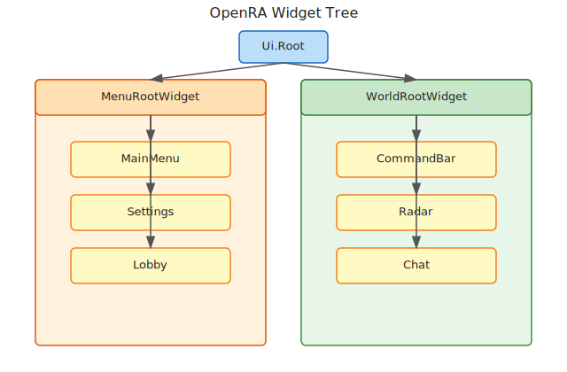

All UI widgets are nodes in a single tree rooted at `Ui.Root`. The engine maintains two main subtrees: the menu chrome (`MenuRootWidget`) and the in-game chrome (`WorldRootWidget`). Windows can be pushed onto a stack so that closing one restores the previous window. Every widget has a `Parent`, a list of `Children`, and `Bounds` expressed in screen coordinates.

### YAML-driven layout

A widget is defined in YAML like this:

```yaml
MainMenu:
    Container:
        X: (WINDOW_WIDTH - WIDTH)/2
        Y: (WINDOW_HEIGHT - HEIGHT)/2
        Width: 400
        Height: 300
        Children:
            Label@TITLE:
                X: 0
                Y: 0
                Width: 400
                Height: 40
                Text: OpenRA
            Button@START:
                X: 50
                Y: 80
                Width: 300
                Height: 40
                Text: Start Game
                Font: Bold
```

The widget type is the node key (e.g., `Container`, `Label`, `Button`). The `@NAME` suffix sets the widget's `Id`. The type name `Foo` in YAML maps to a C# class named `FooWidget` by naming convention. `FieldLoader` maps the remaining YAML keys to public fields or properties on the widget class.

### Logic classes

Widgets can have one or more `Logic` classes declared in YAML:

```yaml
MainMenu:
    Container:
        Logic: MainMenuLogic
        ...
```

The logic class must inherit `ChromeLogic` and is instantiated when the widget is loaded. It receives the widget and any `WidgetArgs` passed during loading. Logic classes handle events, update widget state, and implement screen behavior. The `Logic` field can be a single string or a comma-separated list; multiple logic objects are created in order and each receives `Tick`, `BecameHidden`, and `BecameVisible`.

### Metrics

`ChromeMetrics` is a global dictionary of UI values shared across widgets:

```yaml
Metrics:
    TextfieldColorHighlight: 3A8C3A
    ButtonTextColor: FFFFFF
    ButtonTextColorDisabled: 808080
```

Widgets reference these keys in code via `ChromeMetrics.Get<T>("key")`. They are loaded from the files listed in the manifest's `ChromeMetrics` section. Metrics are commonly used for colors, default cursors, button sizes, and spacing constants.

### Widget lifecycle

The complete lifecycle of a widget is:

```
WidgetLoader.LoadWidget
  -> NewWidget (ObjectCreator creates FooWidget by naming convention)
  -> AddChild to parent
  -> Load Id from "Type@Id"
  -> FieldLoader loads fields from YAML (except Children)
  -> Initialize(args)        // evaluates layout expressions, sets Bounds
  -> recursively LoadWidget for each child
  -> PostInit(args)          // creates ChromeLogic objects
  -> TickOuter() each frame  // calls Tick(), then children, then Logic.Tick()
  -> DrawOuter() each frame  // calls Draw(), then children
  -> HandleMouseInputOuter() / HandleKeyPressOuter() / HandleTextInputOuter()
  -> Hidden() / Removed()    // logic objects receive BecameHidden / Dispose
```

Important lifecycle details:

- `Initialize` is called after the widget object is created and its fields are loaded, but before children are created. This is where `Bounds` is evaluated from the `X`, `Y`, `Width`, `Height` expressions.
- `PostInit` is called after all children are created. It instantiates the `ChromeLogic` classes listed in the `Logic` field, adds them to `LogicObjects`, and subscribes them to the `Ui` mediator.
- `TickOuter` visits children in order and then ticks each logic object. Only visible widgets tick; hidden widgets are skipped entirely.
- `DrawOuter` visits children in order. Only visible widgets draw.
- `Hidden()` is called when a widget is removed from its parent by `HideChild` (for example, when a new window is opened and the old one is hidden). It forces the widget to yield mouse and keyboard focus and propagates `Hidden()` to children. The logic objects receive `BecameHidden` from `Ui.OpenWindow`/`CloseWindow`.
- `Removed()` is called when a widget is permanently removed. It yields focus and disposes logic objects.

### Event propagation

Mouse and keyboard events travel from the root down to the leaves. The first widget that consumes the event stops propagation. Focus widgets receive keyboard events even if they are not under the mouse.

#### Mouse events

`Ui.HandleInput` is the entry point:

1. If a widget already owns `MouseFocusWidget`, it is given the event first. This allows a widget to continue receiving drag events even when the cursor leaves its bounds.
2. If the focus widget does not consume the event, the event is dispatched to `Root.HandleMouseInputOuter`, which recurses from the root down to the deepest visible child whose `EventBounds` contains the mouse position.
3. For each candidate widget, `HandleMouseInputOuter` first forwards the event to its children in reverse order (topmost child first), then calls `HandleMouseInput` on itself.
4. If a child handles the event, propagation stops immediately.
5. On `MouseInputEvent.Move`, the deepest widget that is not marked `IgnoreMouseOver` becomes `Ui.MouseOverWidget`. `MouseEntered`/`MouseExited` are raised when the mouse-over widget changes.

A widget can request mouse focus by calling `TakeMouseFocus`. It should yield focus with `YieldMouseFocus` when the drag or click ends. Without focus, a widget only receives mouse events while the cursor is inside its `EventBounds`.

#### Keyboard events

`Ui.HandleKeyPress` is the entry point:

1. If `KeyboardFocusWidget` is set, the key press goes to `KeyboardFocusWidget.HandleKeyPressOuter`.
2. Otherwise, the event is dispatched from `Root.HandleKeyPressOuter`, which recurses through children in reverse order and calls `HandleKeyPress` if no child consumed it.
3. `Ui.HandleTextInput` follows the same pattern for text input events.

Text fields should call `TakeKeyboardFocus` when activated; otherwise typed characters will bubble up to the root and may be interpreted as hotkeys.

#### Event propagation example

Consider a settings panel with a button and a scrollable list. The panel is the parent, the scrollable list is a child, and the button is a child of the list.

```yaml
SettingsPanel:
    Container:
        X: (WINDOW_WIDTH - WIDTH) / 2
        Y: (WINDOW_HEIGHT - HEIGHT) / 2
        Width: 500
        Height: 400
        Logic: SettingsPanelLogic
        Children:
            ScrollPanel@LIST:
                X: 20
                Y: 20
                Width: 460
                Height: 300
                Children:
                    Button@OK:
                        X: 0
                        Y: 0
                        Width: 100
                        Height: 40
                        Text: OK
```

```csharp
public class SettingsPanelLogic : ChromeLogic
{
    public SettingsPanelLogic(Widget widget)
    {
        var list = widget.Get<ScrollPanelWidget>("LIST");
        var ok = list.Get<ButtonWidget>("OK");

        ok.OnClick = () =>
        {
            // This click is handled by the button. The scroll panel
            // never sees the event, so it cannot scroll while the
            // button is being clicked.
            Ui.CloseWindow();
        };

        list.OnMouseDown = mi =>
        {
            // Clicks that miss the button fall through to the scroll
            // panel, which can use them for drag-scrolling.
            return true;
        };
    }
}
```

If the cursor is over the button, `HandleMouseInputOuter` visits the button first. The button returns `true` from `OnMouseDown`, so the event stops. If the cursor is over the scroll panel but not over the button, the button still receives the event first because it is a child, but it returns `false` (or is outside `EventBounds`), so the event reaches the scroll panel. This is why a click on a button inside a scroll panel does not scroll the list.

### Focus management

`Ui.MouseFocusWidget`, `Ui.KeyboardFocusWidget`, and `Ui.MouseOverWidget` are static references that track which widget currently owns input focus. Widgets can request focus in `OnMouseDown` or `OnKeyPress`. Focus is yielded automatically when a widget is hidden or removed, but widgets can also override `YieldMouseFocus` or `YieldKeyboardFocus` to refuse focus loss (for example, a modal dialog).


## Data Flow / Code Path


### Loading chrome

`WidgetLoader` reads the files listed in the manifest's `ChromeLayout`:

```csharp
public WidgetLoader(Manifest manifest, IReadOnlyFileSystem fileSystem)
{
    var stringPool = new HashSet<string>(); // Reuse common strings in YAML
    foreach (var file in manifest.ChromeLayout.Select(
        a => MiniYaml.FromStream(fileSystem.Open(a), a, stringPool: stringPool)))
        foreach (var w in file)
        {
            var key = w.Key[(w.Key.IndexOf('@') + 1)..];
            if (widgets.ContainsKey(key))
                throw new InvalidDataException($"Widget has duplicate Key `{w.Key}` at {w.Location}");
            widgets.Add(key, w);
        }
}
```

Each top-level key in a chrome YAML file becomes the name that can be passed to `Ui.OpenWindow`. The loader stores the whole YAML node under that key, so layout definitions can be instantiated many times.

### Instantiating a widget

```csharp
public Widget LoadWidget(WidgetArgs args, Widget parent, MiniYamlNode node)
{
    var widget = NewWidget(node.Key, args);
    parent?.AddChild(widget);

    if (node.Key.Contains('@'))
        FieldLoader.LoadFieldOrProperty(widget, "Id", node.Key.Split('@')[1]);

    foreach (var child in node.Value.Nodes)
        if (child.Key != "Children")
            FieldLoader.LoadFieldOrProperty(widget, child.Key, child.Value.Value);

    widget.Initialize(args);

    foreach (var child in node.Value.Nodes)
        if (child.Key == "Children")
            foreach (var c in child.Value.Nodes)
                LoadWidget(args, widget, c);

    var logicNode = node.Value.NodeWithKeyOrDefault("Logic");
    var logic = logicNode?.Value.ToDictionary();
    args.Add("logicArgs", logic);

    widget.PostInit(args);

    args.Remove("logicArgs");

    return widget;
}
```

`NewWidget` strips the `@Id` suffix and appends `Widget` to find the C# class, then creates it via `ObjectCreator`. Fields are loaded before children so that children can reference parent state during their own initialization. `Logic` is loaded after children because logic classes often look up child widgets by ID in their constructor.

### Opening a window

```csharp
public static Widget OpenWindow(string id, WidgetArgs args)
{
    if (!args.ContainsKey("modData"))
        args = new WidgetArgs(args) { { "modData", modData } };

    var window = Game.ModData.WidgetLoader.LoadWidget(args, Root, id);
    if (WindowList.Count > 0)
        Root.HideChild(WindowList.Peek());
    WindowList.Push(window);
    return window;
}
```

`OpenWindow` loads the top-level widget definition, adds it to `Ui.Root`, and pushes it onto the window stack. If a window is already open, it is hidden (not removed) so that `CloseWindow` can restore it. Hidden windows have their logic objects receive `BecameHidden` so they can pause animations or stop ticking expensive logic.

### Per-frame tick

```csharp
public static void Tick() { Root.TickOuter(); }
```

Widgets receive `Tick` from root to leaves. `TickOuter` first checks `IsVisible`, calls the widget's `Tick`, recurses into children, and then ticks each `LogicObject`. Logic classes can also implement `LogicTick` indirectly through `ChromeLogic.Tick`. Because hidden widgets do not tick, opening a modal window naturally pauses the screen underneath.

### Drawing

```csharp
public static void Draw()
{
    if (!WidgetsVisible)
        return;
    Root.DrawOuter();
}
```

Widgets draw from root to leaves. Each widget is responsible for its own background and children. `DrawOuter` short-circuits invisible subtrees, so hiding a container hides all of its children.

### Input handling

```csharp
public static bool HandleInput(MouseInput mi)
{
    var wasMouseOver = MouseOverWidget;

    if (mi.Event == MouseInputEvent.Move)
        MouseOverWidget = null;

    var handled = false;
    if (MouseFocusWidget != null && MouseFocusWidget.HandleMouseInputOuter(mi))
        handled = true;

    if (!handled && Root.HandleMouseInputOuter(mi))
        handled = true;

    if (mi.Event == MouseInputEvent.Move)
    {
        Viewport.LastMousePos = mi.Location;
        Viewport.LastMoveRunTime = Game.RunTime;
    }

    if (wasMouseOver != MouseOverWidget)
    {
        wasMouseOver?.MouseExited();
        MouseOverWidget?.MouseEntered();
    }

    return handled;
}
```

Mouse and keyboard events are dispatched down the tree. The first widget that consumes the event stops propagation. Focus widgets receive keyboard events. The `MouseOverWidget` is recalculated on every move event so that widgets can respond to hover state.


## Configuration (YAML)


### Chrome layout

```yaml
ChromeLayout:
    - mods/common/chrome/mainmenu.yaml
    - mods/common/chrome/ingame.yaml
    - mods/common/chrome/lobby.yaml
```

### Chrome metrics

```yaml
ChromeMetrics:
    - mods/common/metrics.yaml
```

### Widget type registration

Widget classes are discovered by naming convention: `FooWidget` in YAML maps to class `FooWidget` in the loaded assemblies. The `WidgetLoader` constructs the class by passing the name to `ObjectCreator`, which looks for `FooWidget` in all loaded assemblies.

### Logic registration

Logic classes are instantiated via `ObjectCreator`. They must have a constructor that matches the provided `WidgetArgs`. The `widget` argument is always added before `PostInit` and removed afterward. Other common arguments include `modData`, `world`, `orderManager`, and `onExit`.


## Chrome authoring workflow


To add a new screen or panel to a mod, follow this workflow:

1. **Create a YAML chrome layout file.** Add a new file under `mods/<mod>/chrome/` or `mods/common/chrome/`. The top-level key is the ID that will be passed to `Ui.OpenWindow`.
2. **Pick a root widget type.** Usually a `Container` or `Background` with `X`, `Y`, `Width`, and `Height` expressions that center the window on screen. Use `WINDOW_WIDTH`, `WINDOW_HEIGHT`, `PARENT_WIDTH`, `PARENT_HEIGHT`, `WIDTH`, and `HEIGHT` in expressions.
3. **Add child widgets.** Use `Label`, `Button`, `ImageWidget`, `TextField`, `DropDownButton`, `Checkbox`, `Slider`, `ScrollPanel`, etc. Give each child an `@Id` so it can be looked up from logic code.
4. **Bind a logic class.** Add `Logic: MyScreenLogic` to the root widget. Create `MyScreenLogic` inheriting `ChromeLogic` in `OpenRA.Mods.Common/Widgets/Logic/` (or the mod's widget logic folder). In the constructor, look up child widgets with `widget.Get<ButtonWidget>("START")` and attach event handlers.
5. **Add ChromeMetrics entries.** If the screen uses shared colors, sizes, or cursors, add them to the mod's `metrics.yaml` and load them with `ChromeMetrics.Get<T>("MyKey")`.
6. **Register the layout in mod.yaml.** Add the new chrome file to the `ChromeLayout` list.
7. **Open the window.** Call `Ui.OpenWindow("MyScreen", new WidgetArgs { { "world", world }, { "onExit", onExit } })` from a button, console command, or hotkey handler. Use `Ui.CloseWindow()` to return to the previous window.

A minimal example:

```yaml
MyScreen:
    Container:
        X: (WINDOW_WIDTH - WIDTH)/2
        Y: (WINDOW_HEIGHT - HEIGHT)/2
        Width: 400
        Height: 200
        Logic: MyScreenLogic
        Children:
            Label@TITLE:
                X: 0
                Y: 20
                Width: 400
                Height: 30
                Text: My Screen
                Align: Center
            Button@CLOSE:
                X: 150
                Y: 120
                Width: 100
                Height: 40
                Text: Close
```

```csharp
public class MyScreenLogic : ChromeLogic
{
    public MyScreenLogic(Widget widget, World world)
    {
        var closeButton = widget.Get<ButtonWidget>("CLOSE");
        closeButton.OnClick = () => Ui.CloseWindow();
    }
}
```

## Widget conventions

When working with widgets, follow these conventions:

- **Naming convention.** A widget class must be named `FooWidget` and be declared in YAML as `Foo`. The class must inherit `Widget` (or a subclass like `ContainerWidget`).
- **ID syntax.** Use `Type@Id` in YAML to set the widget's `Id` field. IDs must be unique within their subtree for `Get<T>` to be unambiguous.
- **FieldLoader mapping.** YAML keys map to public fields or properties by exact name. Types must be compatible with `FieldLoader.GetValue<T>`. For example, `Text: Hello` sets the `Text` field; `Font: Bold` sets the `Font` field.
- **Logic classes live in `Widgets/Logic`.** Keep UI behavior in logic classes, not in widget classes. Widget classes should be reusable presentation components; logic classes own screen-specific state and event wiring.
- **Common widget types.**
  - `ButtonWidget` — clickable button with text and optional key binding.
  - `LabelWidget` — read-only text label.
  - `ImageWidget` — static or animated [sprite](#file-appendices-Appendix_A_Glossary) image.
  - `TextFieldWidget` — editable text field; takes keyboard focus.
  - `DropDownButtonWidget` — button that opens a dropdown panel.
  - `CheckboxWidget` — boolean toggle.
  - `SliderWidget` — numeric value slider.
  - `ScrollPanelWidget` — scrollable container.
  - `ContainerWidget` — non-visual grouping container with optional click-through.
- **Layout expressions.** `X`, `Y`, `Width`, and `Height` can be integer expressions using the variables `WINDOW_WIDTH`, `WINDOW_HEIGHT`, `PARENT_WIDTH`, `PARENT_HEIGHT`, `WIDTH`, `HEIGHT`, and `DROPDOWN_WIDTH` (for dropdown panels). Earlier engine versions used `WINDOW_RIGHT`, `WINDOW_BOTTOM`, `PARENT_RIGHT`, and `PARENT_BOTTOM`; those are now `WINDOW_WIDTH`/`WINDOW_HEIGHT` and `PARENT_WIDTH`/`PARENT_HEIGHT`. Expressions are evaluated at initialization time.
- **Focus management.** Mouse-driven widgets should not call `TakeKeyboardFocus` unless they need typed input. Keyboard-driven widgets should yield focus when done so hotkeys work again.
- **Visibility.** Set `Visible = false` to hide a widget and its entire subtree. Hidden widgets do not tick, draw, or receive input. Use `IsVisible` as a lambda if visibility depends on runtime state.

## Interconnectivity

- **Depends on:** [Part 1.1 — Entity-Component-System (ECS) and Actor Lifecycle](#file-chapters-Part_01_Chapter_01_ECS), [Part 1.3 — World, OrderManager, and Orders](#file-chapters-Part_01_Chapter_03_World_Orders), [Part 2.1 — MiniYaml Parser](#file-chapters-Part_02_Chapter_01_MiniYaml), [Part 2.4 — Rulesets, Actors, and Weapons](#file-chapters-Part_02_Chapter_04_Rules_Weapons), [Part 3.1 — Mod SDK and Project Structure](#file-chapters-Part_03_Chapter_01_Mod_SDK), [Part 4.1 — Renderer, Sheet, and Sprite](#file-chapters-Part_04_Chapter_01_Renderer), [Part 4.4 — Viewport and Input](#file-chapters-Part_04_Chapter_04_Viewport_Input), [Part 6.3 — Virtual File System](#file-chapters-Part_06_Chapter_03_VFS).
- **Used by:** [Part 4.2 — WorldRenderer](#file-chapters-Part_04_Chapter_02_WorldRenderer), [Part 4.4 — Viewport and Input](#file-chapters-Part_04_Chapter_04_Viewport_Input), [Part 7.8 — Random Map Generator Extension Points](#file-chapters-Part_07_Chapter_08_Extension_Points), [Part 8.1 — IBot and ModularBot](#file-chapters-Part_08_Chapter_01_IBot), [Part 9.2 — Server and Connection Layer](#file-chapters-Part_09_Chapter_02_Server_Connection), [Part 10.3 — Porting, Modding, and Developer Workflows](#file-chapters-Part_10_Chapter_03_Port_And_Modding).


## Algorithms


### Widget lookup

Widgets can be found by ID: `widget.Get<ButtonWidget>("START")` or `widget.GetOrNull<ButtonWidget>("START")`. The lookup searches the subtree recursively. `Get` throws if the widget is missing or the wrong type; `GetOrNull` returns null. For performance, lookups should be done once in the logic constructor and cached, not every frame.

### Focus management

`Ui.MouseFocusWidget`, `Ui.KeyboardFocusWidget`, and `Ui.MouseOverWidget` track which widget currently owns input focus. Widgets can request focus in `OnMouseDown` or `OnKeyPress`. `TakeMouseFocus` and `TakeKeyboardFocus` first ask the current focus owner to yield; if the owner refuses, focus is not stolen. This prevents, for example, a modal dialog from losing focus to a background click.

### Window stack

`Ui.OpenWindow` pushes a new window onto a stack and hides the previous one. `Ui.CloseWindow` pops the stack and restores the previous window. This makes modal dialogs easy to implement. The window stack lives in `Ui` as a static `Stack<Widget>`. Only the window at the top of the stack is attached to `Ui.Root`; hidden windows are detached but not disposed, so their state is preserved.

### Visible/hidden lifecycle

When a widget is hidden, its `LogicObjects` receive `BecameHidden`. When a hidden widget is restored, they receive `BecameVisible`. This is used to pause/resume animations or tick logic. The widget itself receives `Hidden()` and `Removed()`; `Removed()` also disposes the logic objects and unsubscribes them from the `Ui` mediator.

### Layout expressions

Widget positions/sizes can be expressions using variables like `WINDOW_WIDTH`, `WINDOW_HEIGHT`, `PARENT_WIDTH`, `PARENT_HEIGHT`, `WIDTH`, `HEIGHT`, and `DROPDOWN_WIDTH` (historically `WINDOW_RIGHT`, `WINDOW_BOTTOM`, `PARENT_RIGHT`, `PARENT_BOTTOM`). These are evaluated by `Widget.Initialize` through `IntegerExpression.Evaluate`. The expressions are evaluated once at load time, so they do not respond to window resizing unless the widget is reloaded or its bounds are explicitly updated in code.

### Layout variable reference

The layout evaluator in `OpenRA.Game/Widgets/Widget.cs` exposes the following integer symbols when it evaluates a widget's `X`, `Y`, `Width`, and `Height` expressions:

| Variable | Source | Meaning |
| :---- | :---- | :---- |
| `WINDOW_WIDTH` | `OpenRA.Game/Widgets/Widget.cs` | Width of the game window in screen pixels. |
| `WINDOW_HEIGHT` | `OpenRA.Game/Widgets/Widget.cs` | Height of the game window in screen pixels. |
| `PARENT_WIDTH` | `OpenRA.Game/Widgets/Widget.cs` | Width of the widget's parent container. For a root widget, this equals `WINDOW_WIDTH`. |
| `PARENT_HEIGHT` | `OpenRA.Game/Widgets/Widget.cs` | Height of the widget's parent container. For a root widget, this equals `WINDOW_HEIGHT`. |
| `WIDTH` | `OpenRA.Game/Widgets/Widget.cs` | The evaluated width of this widget; can be used in `X` and `Y` expressions. |
| `HEIGHT` | `OpenRA.Game/Widgets/Widget.cs` | The evaluated height of this widget; can be used in `X` and `Y` expressions. |
| `DROPDOWN_WIDTH` | `OpenRA.Mods.Common/Widgets/DropDownButtonWidget.cs` | Width of the dropdown button that opened a panel; injected into the panel's `substitutions` widget args so the panel can align to the button. |

`WIDTH` and `HEIGHT` are evaluated before `X` and `Y`, so a widget can reference its own size when positioning itself. For example, `X: (WINDOW_WIDTH - WIDTH) / 2` centers the widget horizontally.

Older versions of OpenRA provided `WINDOW_RIGHT`, `WINDOW_BOTTOM`, `PARENT_RIGHT`, and `PARENT_BOTTOM` as layout symbols. These were renamed to `WINDOW_WIDTH`, `WINDOW_HEIGHT`, `PARENT_WIDTH`, and `PARENT_HEIGHT` because the right and bottom edges of the window or parent equal the width and height in the top-left-anchored coordinate system. The update rule `OpenRA.Mods.Common/UpdateRules/Rules/20231010/RenameWidgetSubstitutions.cs` can migrate old chrome files that still use the old names. In current YAML, use `WINDOW_WIDTH` where older examples used `WINDOW_RIGHT`, and `PARENT_WIDTH` where they used `PARENT_RIGHT`.

There are no `HORIZONTAL_ALIGNMENT` or `VERTICAL_ALIGNMENT` layout symbols. Alignment is handled by widget-specific fields such as `Align` on `LabelWidget`, or by explicit layout expressions.

#### Common anchor patterns

These expressions cover the most common placements:

| Result | X | Y | Width | Height |
| :---- | :---- | :---- | :---- | :---- |
| Center horizontally | `(WINDOW_WIDTH - WIDTH) / 2` | N/A | N/A | N/A |
| Center vertically | N/A | `(WINDOW_HEIGHT - HEIGHT) / 2` | N/A | N/A |
| Bottom-right corner | `WINDOW_WIDTH - WIDTH` | `WINDOW_HEIGHT - HEIGHT` | N/A | N/A |
| Top-left corner | `0` | `0` | N/A | N/A |
| Full window width | `0` | N/A | `WINDOW_WIDTH` | N/A |
| Fill parent | `0` | `0` | `PARENT_WIDTH` | `PARENT_HEIGHT` |

An `N/A` entry means the field is not dictated by the pattern and can be set to a fixed value or another expression.

#### Percentages

Percentage values are not natively supported in layout expressions. Use fractional arithmetic instead: `WINDOW_WIDTH / 4` gives 25% of the window width, `PARENT_HEIGHT * 2 / 3` gives two-thirds of the parent height, and `(WINDOW_WIDTH - WIDTH) / 2` centers the widget.

### Event bubbling

Mouse and keyboard events bubble from the leaf back to the root if unhandled. `HandleMouseInputOuter` and `HandleKeyPressOuter` first ask children, then ask the widget itself. Returning `true` from `HandleMouseInput`/`HandleKeyPress` stops the bubble. This is why clicking a button on top of a scroll panel does not also scroll the panel: the button consumes the event.


## Extension Points


### Add a new widget type

Create a class inheriting `Widget` and name it `MyWidgetWidget`. Declare it in YAML as `MyWidget`. Override `Draw`, `Tick`, and input methods as needed. If the widget should be cloneable, override `Clone()`. Add the new assembly to the mod manifest if it is not already loaded.

### Add a new logic class

Create a class inheriting `ChromeLogic`. Reference it in YAML via `Logic: MyLogic`. Add event handlers to the widget in the constructor. Common patterns include subscribing to `Ui` mediator notifications, caching child widget references, and updating widget state in `Tick`.

### Add custom metrics

Add entries to the mod's chrome metrics YAML. Use `ChromeMetrics.Get<T>("MyKey")` in code. Keep metrics in one file so that theming and localization are easier to maintain.

### Add a custom layout

Create a new YAML file and add it to the manifest's `ChromeLayout`. The top-level keys are the widget IDs that can be opened with `Ui.OpenWindow`. Use the same file for related screens (for example, all settings tabs) so that shared chrome can be referenced by ID.

### Add a widget command

UI commands can be exposed to the console or hotkeys. The `UiCommands` class maps commands to widget actions. Alternatively, logic classes can subscribe to `INotificationHandler<T>` notifications sent via `Ui.Send<T>`.

## Practical Example


### Practical Example: Updating a Label from ChromeLogic


This example shows how to declare a `LabelWidget` in YAML and drive its text from a `ChromeLogic` class that runs every frame.

`chrome.yaml`:

```yaml
MyLabelPanel:
    Container:
        Logic: MyLabelLogic
        X: (WINDOW_WIDTH - WIDTH) / 2
        Y: (WINDOW_HEIGHT - HEIGHT) / 2
        Width: 200
        Height: 40
        Children:
            Label@MY_LABEL:
                X: 0
                Y: 0
                Width: 200
                Height: 40
                Text: Waiting...
                Align: Left
```

`MyLabelLogic.cs`:

```csharp
public class MyLabelLogic : ChromeLogic
{
    readonly LabelWidget label;
    string status;

    [ObjectCreator.UseCtor]
    public MyLabelLogic(Widget widget)
    {
        label = widget.Get<LabelWidget>("MY_LABEL");
        label.GetText = () => status;
    }

    public override void Tick()
    {
        // Update the backing string each frame; GetText reads it when the label draws.
        status = "Game time: " + Game.LocalTick;
    }
}
```

The pattern is: the widget is declared in `chrome.yaml`, the `ChromeLogic` class is written in C# and referenced in YAML via `Logic: MyLabelLogic`, and data flows from the simulation or UI state to the widget text through `GetText`. OpenRA calls `Tick()` on each logic object every frame, so the label stays in sync with the source data without extra polling or timers.

For a static label, assign `GetText` once in the constructor; for data that changes every frame, update the backing value in `Tick` and let the label read it via `GetText`.


## Common Pitfalls / Guardrails


- **Widget IDs must be unique:** duplicate keys in chrome YAML cause a runtime error.
- **Logic class constructor:** the logic class must have a constructor that matches the `WidgetArgs`. Missing arguments cause a runtime error. The `widget` argument is always added before `PostInit`.
- **Dispose logic:** logic classes are not automatically disposed on hide; they are disposed on `Removed()`. Use `BecameHidden` or `BecameVisible` for cleanup when a window is hidden but may be restored.
- **Threading:** widgets run on the UI thread. Do not update widget state from background threads; use `Game.RunAfterTick` to schedule updates on the next tick.
- **Layout evaluation:** expression-based layout is evaluated at runtime. Syntax errors produce exceptions when the widget is drawn. Use parentheses and only the documented variables.
- **Modal dialogs:** use `Ui.OpenWindow`/`Ui.CloseWindow` rather than manually adding/removing children to preserve focus and restore behavior.
- **Widget state:** widgets are recreated when the screen changes. Do not store long-lived state in widgets; use `Game.GlobalData` or a static service, or pass state through `WidgetArgs`.
- **Keyboard focus:** only the widget with `KeyboardFocusWidget` receives typed text. Ensure text fields acquire focus when activated and yield it when closed.
- **Mouse capture:** for dragging operations, the widget should grab mouse focus with `TakeMouseFocus` so it receives events even when the cursor leaves the widget bounds. Remember to yield focus on mouse up.
- **Event bounds vs render bounds:** `EventBounds` defaults to `RenderBounds`, but some widgets override it (for example, to make a small button easier to hit). Make sure `EventBoundsContains` is not abused to steal input from overlapping widgets.
- **Visible vs IsVisible:** `Visible` is a field; `IsVisible` is a lambda. Setting `Visible` directly affects ticking and drawing. Changing `IsVisible` without updating `Visible` may have no effect unless the widget checks `IsVisible()` in its own code.

## What to read next

- [Part 4.4 — Viewport and Input](#file-chapters-Part_04_Chapter_04_Viewport_Input) for the world-interaction widget and order-generator UI.
- [Part 4.1 — Renderer, Sheet, and Sprite](#file-chapters-Part_04_Chapter_01_Renderer) for the renderer path that draws chrome.
- [Part 10.3 — Porting, Modding, and Developer Workflows](#file-chapters-Part_10_Chapter_03_Port_And_Modding) for practical UI and modding recipes.
- [Appendix H — Asset Visual Reference](#file-appendices-Appendix_H_Asset_Visual_Reference) for a reference of chrome, cursor, and UI asset formats and engine classes.
- [Appendix G — Advanced Modding Walkthroughs](#file-appendices-Appendix_G_Advanced_Modding_Walkthroughs) for a complete Chrome UI panel walkthrough.

## Summary

This chapter explains how OpenRA's custom [widget](#file-appendices-Appendix_A_Glossary) and chrome system builds menus, HUDs, and in-game UI.

After reading this chapter, you should be able to:

- Describe the widget tree, the roles of `Ui.Root`, `MenuRootWidget`, and `WorldRootWidget`, and the window-stack behavior.
- Read and write YAML chrome layouts that bind widgets to C# `ChromeLogic` classes.
- Trace the widget lifecycle from `WidgetLoader.LoadWidget` through `Initialize`, `PostInit`, `Tick`, `Draw`, input handling, and `Removed`.
- Use `ChromeMetrics` and layout expressions (`WINDOW_WIDTH`, `PARENT_WIDTH`, etc.) to build responsive UI.
- Explain how mouse and keyboard events propagate and how focus prevents unwanted bubbling.
- Implement a custom widget type and a `ChromeLogic` logic class.

If any of the concepts above feel unclear, review the relevant section before continuing. For source files and further reading, see the References section.


## References

- `OpenRA.Game/Widgets/Widget.cs` — widget base class, `ContainerWidget`, `InputWidget`, `ChromeLogic`, and `Ui` root.
- `OpenRA.Game/Widgets/WidgetLoader.cs` — widget loading.
- `OpenRA.Game/Widgets/ChromeMetrics.cs` — UI metrics.
- `OpenRA.Mods.Common/Widgets/ButtonWidget.cs` — button widget.
- `OpenRA.Mods.Common/Widgets/LabelWidget.cs` — label widget.
- `OpenRA.Mods.Common/Widgets/ImageWidget.cs` — image widget.
- `OpenRA.Mods.Common/Widgets/TextFieldWidget.cs` — text field widget.
- `OpenRA.Mods.Common/Widgets/DropDownButtonWidget.cs` — dropdown button widget.
- `OpenRA.Mods.Common/Widgets/*.cs` — common widget implementations.
- `OpenRA.Mods.Common/Widgets/Logic/*.cs` — common logic classes.


### External resources

- [OpenRA traits reference](https://docs.openra.net/en/release/traits/)
- [OpenRA playtest docs](https://docs.openra.net/en/playtest/)


---

<a id="file-chapters-Part_04_Chapter_04_Viewport_Input"></a>

<!-- --- FILE: chapters/Part_04_Chapter_04_Viewport_Input.md --- -->

# Chapter 4.4 — Viewport and Input {#file-chapters-Part_04_Chapter_04_Viewport_Input}

## Purpose

The [viewport](#file-appendices-Appendix_A_Glossary) maps the simulation world to the screen. It controls scroll position, zoom, and the visible cell region. Input is captured by the platform window and routed through the UI, the [order generator](#file-appendices-Appendix_A_Glossary), and the world. This chapter explains the `Viewport` class, the input pipeline, order generators, and how mouse/keyboard events become game orders.


## Mental Model

Think of the viewport as the camera on a film set, and input as the director's walkie-talkie.

- **The camera** (`Viewport`) maps the 3D world onto the 2D screen. It can zoom in, zoom out, and pan, but it is clamped so it never shows the empty space outside the set.
- **The camera operator** (`WorldRenderer`) uses the viewport to decide which actors are visible and where to place their sprites.
- **The walkie-talkie** (mouse and keyboard events) is picked up by the UI crew first. If a widget cares about the message (for example, a button click), it answers and the message stops there.
- **The stage crew** (`WorldInteractionControllerWidget`) receives any messages the UI did not want. It translates the message into world coordinates and passes it to the current **shooting mode** (`World.OrderGenerator`).
- **The shooting mode** decides what the click means: select, move, attack, guard, or place a building. It turns the click into a formal instruction (`Order`) that is sent to the lockstep scheduler.

This mental model explains why a click on a UI button never issues a move order, why the order generator can change the cursor, and why all game-changing input must become an `Order` (so it can be replayed and synchronized). The actor that produces the order is part of the ECS in [Part 1.1 — Entity-Component-System (ECS) and Actor Lifecycle](#file-chapters-Part_01_Chapter_01_ECS), and the lockstep scheduler is described in [Part 9.1 — OrderManager and Lockstep Foundation](#file-chapters-Part_09_Chapter_01_OrderManager).

## Learning Objectives


After studying this chapter, you should be able to:

- Explain how the Viewport maps world coordinates to screen coordinates and vice versa.
- Describe the input dispatch pipeline from platform window to order generator.
- Implement a custom IOrderGenerator for a new command mode.
- Configure WorldViewportSizes and input settings in YAML.
- Trace how mouse events become game orders through World.IssueOrder.
- Identify common pitfalls in input handling and viewport coordinate transforms.
- Explain how drag gestures, multi-tap selection, and viewport scroll clamping work.

## Practical Example: A Ping Order Generator

Suppose you want a "ping" command mode that lets the player place a beacon on the map. The command mode is implemented as an `OrderGenerator`.

### Order generator

```csharp
using System.Collections.Generic;
using OpenRA.Graphics;
using OpenRA.Mods.Common.Orders;
using OpenRA.Traits;

namespace OpenRA.Mods.MyMod.Orders
{
    public class PingOrderGenerator : OrderGenerator
    {
        public PingOrderGenerator(World world) : base(world) { }

        protected override MouseActionType ActionType => MouseActionType.ConfirmOrder;

        protected override string GetCursor(World world, CPos cell, int2 worldPixel, MouseInput mi)
        {
            return "ability"; // cursor name from cursors.yaml
        }

        protected override IEnumerable<Order> OrderInner(World world, CPos cell, int2 worldPixel, MouseInput mi)
        {
            yield return new Order("PingBeacon", null, Target.FromCell(world, cell), false);
        }

        protected override IEnumerable<IRenderable> Render(WorldRenderer wr, World world) { return SpriteRenderable.None; }
        protected override IEnumerable<IRenderable> RenderAboveShroud(WorldRenderer wr, World world) { return SpriteRenderable.None; }
        protected override IEnumerable<IRenderable> RenderAnnotations(WorldRenderer wr, World world) { return SpriteRenderable.None; }
    }
}
```

### UI wiring

```csharp
public class PingButtonLogic : ChromeLogic
{
    public PingButtonLogic(Widget widget, World world)
    {
        var ping = widget.Get<ButtonWidget>("PING");
        ping.OnClick = () => world.OrderGenerator = new PingOrderGenerator(world);
    }
}
```

When the player clicks the button, the widget assigns `PingOrderGenerator` to `World.OrderGenerator`. From then on, every mouse click on the world is routed to `PingOrderGenerator.OrderInner`, which converts the screen pixel into a cell via `Viewport.ViewToWorld` and issues a `PingBeacon` order. The order crosses into the deterministic simulation through `World.IssueOrder`, exactly as described in [Part 1.3 — World, OrderManager, and Orders](#file-chapters-Part_01_Chapter_03_World_Orders).

## Files

| File | Responsibility |
| :---- | :---- |
| `OpenRA.Game/Graphics/Viewport.cs` | `Viewport` class: scroll, zoom, coordinate transforms, visible cells. |
| `OpenRA.Game/WorldViewportSizes.cs` | Default viewport sizes and zoom levels. |
| `OpenRA.Game/Input/IInputHandler.cs` | `IInputHandler`, `MouseInput`, `KeyInput`, `MouseButton`, `Modifiers`. |
| `OpenRA.Game/Input/InputHandler.cs` | `DefaultInputHandler` and `NullInputHandler`. |
| `OpenRA.Game/Input/Keycode.cs` | Keycode enum for keyboard input. |
| `OpenRA.Game/Orders/IOrderGenerator.cs` | Interface for order generators (command cursors). |
| `OpenRA.Mods.Common/Orders/OrderGenerator.cs` | Base order generator class. |
| `OpenRA.Mods.Common/Orders/UnitOrderGenerator.cs` | Default selection and order generator. |
| `OpenRA.Mods.Common/Orders/GuardOrderGenerator.cs` | Guard order generator example. |
| `OpenRA.Mods.Common/Orders/PlaceBuildingOrderGenerator.cs` | Support power / building placement example. |
| `OpenRA.Mods.Common/Widgets/WorldInteractionControllerWidget.cs` | Bridge between world input and order generators. |
| `OpenRA.Game/Game.cs` | Top-level loop and order generator tick. |
| `OpenRA.Game/World.cs` | Order generator property and `IssueOrder`. |
<!-- DEV-NOTE [tooling]: SDL2: https://www.libsdl.org — cross-platform windowing, input, and event library used by OpenRA. -->
| `OpenRA.Platforms.Default/Sdl2Input.cs` | SDL2 input pumping and multi-tap detection. |
| `OpenRA.Platforms.Default/MultiTapDetection.cs` | Multi-tap/double-click logic. |
| `OpenRA.Game/Graphics/WorldRenderer.cs` | Uses viewport for culling and coordinate transforms. |
| `OpenRA.Mods.Common/Widgets/Logic/Ingame/CommandBarLogic.cs` | In-game command bar UI logic. |


## Architecture


### Viewport coordinate spaces

OpenRA uses several coordinate spaces:

- **World position** (`WPos`) — 3D world coordinates in world pixels. The Z component represents height above the ground plane.
- **Cell position** (`CPos`) — tile coordinates on the map grid.
- **Map position** (`MPos`) / **Projected position** (`PPos`) — internal grid coordinates used for rectangular and isometric maps.
- **View position** (`int2`) — screen pixels relative to the viewport origin (top-left of the world view).
- **UI position** (`int2`) — screen pixels relative to the window; for a world at the top-left of the window, this is the same as view position.

The `Viewport` converts between these spaces:

- `WorldToViewPx` — world position to screen pixels. Accounts for zoom, UI scale, and the current viewport center.
- `ViewToWorldPx` — screen pixels to world position (the inverse of `WorldToViewPx`).
- `ViewToWorld` — screen pixels to a cell, with isometric cliff handling and fallback to the nearest candidate cell.
- `ProjectedPosition` — world position projected onto the 2D ground plane (Z = 0). This is the inverse of the projection used by `WorldRenderer.ScreenPosition`.
- `CenterPosition` — the `WPos` at the center of the viewport, derived from `CenterLocation` via `ProjectedPosition`.

Because the world is rendered with a projection where `screenY = worldY - worldZ` (and `screenZ = worldY` for depth), the same screen pixel can correspond to many world positions. `ProjectedPosition` resolves this ambiguity by choosing the point with zero elevation. `ViewToWorld` resolves it by testing candidate cells and choosing the one whose center is closest to the projected point.

### Viewport state

A `Viewport` stores:

- `CenterLocation` — the world pixel position at the center of the screen (the unprojected screen coordinate).
- `Zoom` — the current zoom level. Higher values zoom in; lower values zoom out.
- `ViewportSize` — the visible world area in world pixels, derived from `NativeResolution / Zoom * UIScale`.
- `MinZoom` / `MaxZoom` — zoom limits computed from `WorldViewportSizes` and the native resolution.
- `mapBounds` — the clamping rectangle so the camera cannot scroll past the edge of the map. Computed from the map's projected corners in world pixels.
- `VisibleCellsInsideBounds` / `AllVisibleCells` — cached `ProjectedCellRegion` of the visible map cells.

### Input dispatch

```
[SDL2 window] -> [Sdl2Input] -> [IInputHandler] -> [Game] -> [Ui.HandleInput / HandleKeyPress / HandleTextInput]
                                              -> [WorldInteractionControllerWidget] -> [World.OrderGenerator.Order]
                                              -> [World.IssueOrder] -> [OrderManager.IssueOrder]
```

The platform window (SDL2) pumps input events into the `IInputHandler` provided by `Game`. The default handler is `DefaultInputHandler`, which wraps `Ui.HandleInput` for mouse events and `Ui.HandleKeyPress`/`Ui.HandleTextInput` for keyboard events. These are run inside `Sync.RunUnsynced` so that input handling does not affect the deterministic simulation.

<!-- DEV-NOTE [visual-aid]: input-routing flow diagram. A horizontal swim-lane showing: SDL2 window -> Sdl2Input -> DefaultInputHandler/Sync.RunUnsynced -> Ui.HandleInput (widget tree) -> WorldInteractionControllerWidget -> World.OrderGenerator.Order -> Viewport coordinate transforms -> World.IssueOrder -> OrderManager.IssueOrder. Show two branches: UI consumes (event stops) and world consumes (event becomes an Order). -->

`WorldInteractionControllerWidget` is a special [widget](#file-appendices-Appendix_A_Glossary) that covers the world viewport. It receives mouse events after the UI [chrome](#file-appendices-Appendix_A_Glossary) has had a chance to consume them. It converts screen coordinates to world coordinates and asks the current `World.OrderGenerator` to produce orders. The orders are then issued through `World.IssueOrder`, which forwards them to the `OrderManager` for local execution and network synchronization (see [Part 9.1 — OrderManager and Lockstep Foundation](#file-chapters-Part_09_Chapter_01_OrderManager)).

Keyboard events are handled entirely by the widget system unless a widget consumes them. If no widget consumes a key press, it may be interpreted as a hotkey by the command bar logic.

### Order generators

An order generator is the active command mode. It determines the cursor, draws target lines and preview [sprites](#file-appendices-Appendix_A_Glossary), and produces `Order` objects when the player clicks. Examples include:

- `UnitOrderGenerator` — default selection, movement, and attack. It is active when no special command mode is set.
- `DeployOrderGenerator` — orders selected units to deploy (for example, MCVs or GIs).
- `AttackMoveOrderGenerator` / `GuardOrderGenerator` — attack-move and guard commands.
- `PlaceBuildingOrderGenerator` — support power placement and building placement previews.
- `RepairOrderGenerator` — repair cursor for buildings.
- `BeaconOrderGenerator` — places a beacon/ping on the map.

Order generators are not registered in YAML; they are created by UI widgets, hotkey handlers, or command bar logic and assigned to `World.OrderGenerator` at runtime. The previous order generator is deactivated (its `Deactivate` method is called) when replaced, and the default `UnitOrderGenerator` is restored by `World.CancelInputMode`.


## Data Flow / Code Path


### Viewport construction

```csharp
public Viewport(WorldRenderer wr, Map map)
{
    worldRenderer = wr;
    tileSize = map.Rules.TerrainInfo.TileSize;
    viewportSizes = Game.ModData.GetOrCreate<WorldViewportSizes>();
    graphicSettings = Game.Settings.Graphics;
    defaultScale = viewportSizes.DefaultScale;

    // Calculate map bounds in world-px
    if (wr.World.Type == WorldType.Editor)
    {
        var width = map.MapSize.Width * tileSize.Width;
        var height = map.MapSize.Height * tileSize.Height;
        if (wr.World.Map.Grid.Type == MapGridType.RectangularIsometric)
            height /= 2;

        mapBounds = new Rectangle(0, 0, width, height);
        CenterLocation = new int2(width / 2, height / 2);
    }
    else
    {
        var tl = wr.ScreenPxPosition(map.ProjectedTopLeft);
        var br = wr.ScreenPxPosition(map.ProjectedBottomRight);
        mapBounds = Rectangle.FromLTRB(tl.X, tl.Y, br.X, br.Y);
        CenterLocation = (tl + br) / 2;
    }

    UpdateViewportZooms();
}
```

The viewport is created by `WorldRenderer` during world construction. It computes the initial camera center and the scroll bounds from the map's projected corners. In the editor, the bounds are the full map rectangle; in the game, they are the projected bounding box of the playable map.

### Zoom adjustment

```csharp
public void AdjustZoom(float dz)
{
    Zoom = (zoom * (float)Math.Exp(dz)).Clamp(unlockMinZoom ? unlockedMinZoom : MinZoom, MaxZoom);
}

public void AdjustZoom(float dz, int2 center)
{
    var oldCenter = worldRenderer.Viewport.ViewToWorldPx(center);
    AdjustZoom(dz);
    var newCenter = worldRenderer.Viewport.ViewToWorldPx(center);

    var candidateCenterLocation = CenterLocation + oldCenter - newCenter;
    CenterLocation = candidateCenterLocation.Clamp(mapBounds);
}
```

Zoom is exponential so that zooming in and out by the same amount produces the same visual change. When zooming around a point (for example, the mouse cursor), the viewport adjusts the center so that the world point under the cursor stays stationary. The result is then clamped to `mapBounds`.

### Coordinate transforms

The core transforms are:

```csharp
public int2 ViewToWorldPx(int2 view)
    => (graphicSettings.UIScale / Zoom * view.ToFloat2() + CenterLocation - ViewportSize.ToInt2() / 2).ToInt2();

public int2 WorldToViewPx(int2 world)
    => (Zoom / graphicSettings.UIScale * (world - CenterLocation + ViewportSize.ToInt2() / 2)).ToInt2();

public WPos CenterPosition => worldRenderer.ProjectedPosition(CenterLocation.ToInt2());
```

`WorldRenderer` provides the complementary projection:

```csharp
public int2 ScreenPxPosition(WPos pos)
{
    var px = ScreenPosition(pos);
    return new int2((int)Math.Round(px.X), (int)Math.Round(px.Y));
}

public float2 ScreenPosition(WPos pos)
    => new float2((float)TileSize.Width * pos.X / TileScale, (float)TileSize.Height * (pos.Y - pos.Z) / TileScale);

public WPos ProjectedPosition(int2 screenPx)
    => new WPos(TileScale * screenPx.X / TileSize.Width, TileScale * screenPx.Y / TileSize.Height, 0);
```

`ScreenPxPosition` converts a 3D world position to a 2D screen pixel. `ProjectedPosition` is the inverse for a point on the ground plane. The subtraction of `pos.Z` in `ScreenPosition` is what makes objects higher in the world appear higher on the screen, enabling isometric depth.

### Input handling

The game implements `IInputHandler` through `DefaultInputHandler`:

```csharp
public class DefaultInputHandler : IInputHandler
{
    readonly World world;
    public DefaultInputHandler(World world) { this.world = world; }

    public void ModifierKeys(Modifiers mods) { Game.HandleModifierKeys(mods); }
    public void OnKeyInput(KeyInput input) { Sync.RunUnsynced(world, () => Ui.HandleKeyPress(input)); }
    public void OnTextInput(string text) { Sync.RunUnsynced(world, () => Ui.HandleTextInput(text)); }
    public void OnMouseInput(MouseInput input) { Sync.RunUnsynced(world, () => Ui.HandleInput(input)); }
}
```

`MouseInput` contains the event type (`Down`, `Move`, `Up`, `Scroll`), button, location, delta, modifiers, and multi-tap count. `KeyInput` contains the event type, key, modifiers, multi-tap count, unicode character, and repeat flag.

### Mouse to order

When a mouse event reaches the world, the current order generator converts it to orders:

```csharp
public interface IOrderGenerator
{
    MouseButton ActionButton { get; }
    IEnumerable<Order> Order(World world, CPos cell, int2 worldPixel, MouseInput mi);
    void Tick(World world);
    IEnumerable<IRenderable> Render(WorldRenderer wr, World world);
    IEnumerable<IRenderable> RenderAboveShroud(WorldRenderer wr, World world);
    IEnumerable<IRenderable> RenderAnnotations(WorldRenderer wr, World world);
    string GetCursor(World world, CPos cell, int2 worldPixel, MouseInput mi);
    void Deactivate();
    bool HandleKeyPress(KeyInput e);
    void SelectionChanged(World world, IEnumerable<Actor> selected);
}
```

`WorldInteractionControllerWidget.ApplyOrders` is the bridge:

```csharp
void ApplyOrders(World world, MouseInput mi)
{
    if (world.OrderGenerator == null)
        return;

    var cell = worldRenderer.Viewport.ViewToWorld(mi.Location);
    var worldPixel = worldRenderer.Viewport.ViewToWorldPx(mi.Location);
    var orders = world.OrderGenerator.Order(world, cell, worldPixel, mi).ToArray();
    orders.PlayVoiceForOrders();

    foreach (var o in orders)
    {
        if (o == null)
            continue;

        // Visual feedback flashes
        ...

        world.IssueOrder(o);
    }
}
```

### Order issue

When the order generator returns orders, the game issues them through `World.IssueOrder`:

```csharp
public void IssueOrder(Order o) { OrderManager.IssueOrder(o); }
```

`OrderManager.IssueOrder` queues the order for the local player and, in network games, serializes it for transmission to other clients (see [Part 9.1 — OrderManager and Lockstep Foundation](#file-chapters-Part_09_Chapter_01_OrderManager)).


## Configuration (YAML)


### Viewport sizes

`WorldViewportSizes` is a global mod data object defined in the mod manifest:

```yaml
WorldViewportSizes:
    CloseWindowHeights: 480, 600
    MediumWindowHeights: 600, 900
    FarWindowHeights: 900, 1300
    DefaultScale: 1.0
    MaxZoomScale: 2.0
    MaxZoomWindowHeight: 240
    AllowNativeZoom: true
```

- `CloseWindowHeights`, `MediumWindowHeights`, `FarWindowHeights` — height ranges for the three viewport distances (selected by the player in settings as `WorldViewport.Close`, `Medium`, or `Far`).
- `DefaultScale` — the base scale applied to the native resolution before computing zoom limits.
- `MaxZoomScale` — the maximum zoom-in factor relative to the minimum zoom.
- `MaxZoomWindowHeight` — the smallest window height considered when computing the maximum zoom.
- `AllowNativeZoom` — if true, the player can select a "native" viewport distance that uses `DefaultScale` directly.

The `WorldViewport` setting is stored in the player's `settings.yaml` under `Graphics.ViewportDistance`, not in mod YAML. The mod only provides the allowable size ranges.

### Input settings

Input settings are in `settings.yaml`:

```yaml
Input:
    MouseButtonPreference: Left
    UseClassicMouseStyle: false
    KeyboardLayout: Default
```

`MouseButtonPreference` and `UseClassicMouseStyle` change how left/right clicks are interpreted by `UnitOrderGenerator` and `WorldInteractionControllerWidget`. The classic style uses left-click for orders and right-click for selection, while the default style is the opposite.

### Order generator registration

Order generators are typically created by UI widgets or hotkey handlers. They are not registered in YAML; they are set on `World.OrderGenerator` at runtime. For example, `CommandBarLogic` creates an `AttackMoveOrderGenerator` when the attack-move button is clicked, and `PlaceBuildingOrderGenerator` is created when a support power is selected.

## Interconnectivity

- **Depends on:** [Part 1.1 — Entity-Component-System (ECS) and Actor Lifecycle](#file-chapters-Part_01_Chapter_01_ECS), [Part 1.3 — World, OrderManager, and Orders](#file-chapters-Part_01_Chapter_03_World_Orders), [Part 2.2 — Manifest and Mod Metadata](#file-chapters-Part_02_Chapter_02_Manifest), [Part 2.3 — FieldLoader](#file-chapters-Part_02_Chapter_03_FieldLoader), [Part 2.4 — Rulesets, Actors, and Weapons](#file-chapters-Part_02_Chapter_04_Rules_Weapons), [Part 4.1 — Renderer, Sheet, and Sprite](#file-chapters-Part_04_Chapter_01_Renderer), [Part 4.2 — WorldRenderer](#file-chapters-Part_04_Chapter_02_WorldRenderer), [Part 4.3 — Widgets and Chrome](#file-chapters-Part_04_Chapter_03_Widgets), [Part 6.3 — Virtual File System](#file-chapters-Part_06_Chapter_03_VFS), [Part 7.8 — Random Map Generator Extension Points](#file-chapters-Part_07_Chapter_08_Extension_Points) (camera bounds for generated maps).
- **Used by:** [Part 1.3 — World, OrderManager, and Orders](#file-chapters-Part_01_Chapter_03_World_Orders), [Part 4.2 — WorldRenderer](#file-chapters-Part_04_Chapter_02_WorldRenderer), [Part 4.3 — Widgets and Chrome](#file-chapters-Part_04_Chapter_03_Widgets), [Part 8.1 — IBot and ModularBot](#file-chapters-Part_08_Chapter_01_IBot), [Part 9.1 — OrderManager and Lockstep Foundation](#file-chapters-Part_09_Chapter_01_OrderManager), [Part 10.3 — Porting, Modding, and Developer Workflows](#file-chapters-Part_10_Chapter_03_Port_And_Modding).


## Algorithms


### Visible cell region

The viewport computes the set of visible cells (`ProjectedCellRegion`) from the current view rectangle. The algorithm in `CalculateVisibleCells`:

1. Project the top-left and bottom-right corners of the view rectangle onto the ground plane with `WorldRenderer.ProjectedPosition`.
2. Convert the projected points to map cells.
3. For rectangular-isometric maps, expand the rectangle by one cell in each direction because isometric edges are not axis-aligned.
4. Clamp to the map bounds if `insideBounds` is true.

The result is cached in `VisibleCellsInsideBounds` and `AllVisibleCells` until `CenterLocation` or `Zoom` changes (which sets `cellsDirty`/`allCellsDirty`). This region is used by `TerrainRenderer` to decide which tiles to draw and by `World.ScreenMap` for culling.

### Scroll clamping

`CenterLocation` is clamped to `mapBounds` so the camera cannot scroll past the edge of the map:

```csharp
public void Scroll(float2 delta, bool ignoreBorders)
{
    CenterLocation += 1f / Zoom * delta;
    cellsDirty = true;
    allCellsDirty = true;

    if (!ignoreBorders)
        CenterLocation = CenterLocation.Clamp(mapBounds);
}

public void AdjustZoom(float dz, int2 center)
{
    var oldCenter = worldRenderer.Viewport.ViewToWorldPx(center);
    AdjustZoom(dz);
    var newCenter = worldRenderer.Viewport.ViewToWorldPx(center);

    var candidateCenterLocation = CenterLocation + oldCenter - newCenter;
    CenterLocation = candidateCenterLocation.Clamp(mapBounds);
}
```

The `GetBlockedDirections` helper returns which edge of the map the camera is currently touching, useful for disabling scroll arrows or edge-scroll in those directions.

### Zoom extents

`MinZoom` and `MaxZoom` are computed in `UpdateViewportZooms`:

1. Read `graphicSettings.ViewportDistance` (Close/Medium/Far/Native).
2. If `AllowNativeZoom` and the distance is `Native`, use `DefaultScale` as `MinZoom`.
3. Otherwise, use `CalculateMinimumZoom` to find a clean zoom factor that keeps the native resolution within the selected height range.
4. `MaxZoom` is the smaller of `MinZoom * MaxZoomScale` and `NativeResolution.Height * defaultScale / MaxZoomWindowHeight`.
5. If the mod has unlocked the minimum zoom (for spectators or the editor), compute `unlockedMinZoom` and allow zooming out further.

The final zoom is clamped to `[MinZoom, MaxZoom]` (or `[unlockedMinZoom, MaxZoom]` if unlocked). The renderer is notified of the maximum viewport size so the world framebuffer can be allocated accordingly.

### Multi-tap detection

The input layer counts rapid successive clicks on the same button. The `MultiTapDetection` class keeps a history of the last three releases for each button/key and returns a tap count of 1, 2, or 3 if the releases are within 250 ms and 4 pixels of each other:

```csharp
static bool CloseEnough((DateTime Time, int2 Location) a, (DateTime Time, int2 Location) b)
{
    return a.Time - b.Time < TimeSpan.FromMilliseconds(250)
        && (a.Location - b.Location).Length < 4;
}
```

`MultiTapCount` is stored in `MouseInput` and `KeyInput`. In `WorldInteractionControllerWidget`, a `MultiTapCount >= 2` on the left mouse up triggers double-click selection of all on-screen actors that share the same selection class as the actor under the cursor.

### Mouse delta handling

For drag operations, the mouse delta is tracked between frames in `MouseInput.Delta`. `WorldInteractionControllerWidget` tracks `dragStart` and `mousePos` in world pixels and uses `SelectionUtils.SelectActorsInBoxWithDeadzone` to select actors inside the drag box. The drag box is only considered valid if the cursor has moved more than `Game.Settings.Game.SelectionDeadzone` pixels, preventing accidental selection on a single click.

### Drag gesture flow

A typical drag selection works like this:

1. `MouseInputEvent.Down` on left button in `WorldInteractionControllerWidget` calls `TakeMouseFocus` and records `dragStart = ViewToWorldPx(location)`.
2. `MouseInputEvent.Move` updates `mousePos` and draws the selection rectangle in `Draw()`.
3. `MouseInputEvent.Up` checks `IsValidDragbox` and, if valid, selects all actors in the box. If the drag is too small, it is treated as a single click and may issue an order instead.
4. On mouse up, `YieldMouseFocus` is called and the drag state is cleared.

### Order generator selection logic

`UnitOrderGenerator` is the default order generator. It decides whether a click should select or order by calling `InputOverridesSelection`:

- If the target is an actor and the selected units have a valid order against that target (for example, attack or repair), the click issues an order.
- Otherwise, the click selects the actor.
- With the classic mouse style, the logic is reversed: left-click orders and right-click selects.

Custom order generators (such as `GuardOrderGenerator`) override `InputOverridesSelection` to always return true, so the cursor is never interpreted as a selection cursor while the special mode is active.


## Extension Points


### Add a custom order generator

Implement `IOrderGenerator` and set it as `World.OrderGenerator`. The generator can draw a custom cursor via `GetCursor`, render target lines and preview sprites via `Render`/`RenderAboveShroud`, and issue orders via `Order`. This is how support power placement and attack-move work. Inherit from `OrderGenerator` in `OpenRA.Mods.Common` to reuse the `ActionButton`/`CancelButton` plumbing.

### Add custom input handling

Widgets can override `HandleMouseInput` and `HandleKeyInput` to consume input before it reaches the order generator. The main menu and lobby are entirely widget-driven. For world input, create a custom widget and add it to the world chrome; it will receive events after the command bar but before `WorldInteractionControllerWidget` if it is higher in the tree.

### Add a custom viewport controller

Implement `INotifyViewportZoomExtentsChanged` to react to zoom limit changes. The default controller uses `WorldViewportSizes`, but mods can override this. The viewport also exposes `ViewportCenterProvider` and `ViewportTick` for scripted camera movement.

### Add custom cursors

The cursor is chosen by the active order generator's `GetCursor` method. The `CursorManager` maps cursor names to animated or static cursor sequences defined in `mods/<mod>/cursors.yaml`.


## Common Pitfalls / Guardrails


- **UI consumes input first:** if a widget is under the mouse, it will receive the event before the world. Order generators must not assume they always receive mouse events. Check `WorldInteractionControllerWidget` for the actual dispatch point.
- **Keyboard focus:** only the widget with `KeyboardFocusWidget` receives typed text. Ensure text fields acquire focus when activated and yield it when done.
- **Zoom and UI scale:** `Zoom` affects the world view but not the UI scale. `Game.Renderer.WindowScale` is separate. Coordinate transforms must account for both `Zoom` and `graphicSettings.UIScale`.
- **Viewport bounds:** when the map is smaller than the window, the clamping bounds may be larger than the map. Handle edge cases in minimap and overview modes.
- **Coordinate precision:** `WPos` is integer world pixels. Use `ProjectedPosition` for screen-space calculations, not raw world coordinates. Remember that `ViewToWorldPx` returns a screen-space pixel coordinate, not a cell; use `ViewToWorld` for the cell.
- **Order generator cleanup:** call `Deactivate` when switching order generators to clean up cursors and renderables. `World.CancelInputMode` restores the default `UnitOrderGenerator` and deactivates the current one.
- **Mouse capture:** for dragging operations, the widget should grab mouse focus so it receives events even when the cursor leaves the widget bounds. `WorldInteractionControllerWidget` does this via `TakeMouseFocus`/`YieldMouseFocus`.
- **Multi-tap timing:** `MultiTapCount` is based on the last three releases within 250 ms and 4 pixels. If your UI needs stricter double-click behavior, do not rely solely on `MultiTapCount`; add your own timing or distance check.
- **Sync safety:** input handling runs inside `Sync.RunUnsynced`. Do not change world simulation state directly from input handlers; issue `Order` objects so that the change happens deterministically on the next tick.
- **Order generator Tick:** `World.OrderGenerator.Tick(world)` is called once per simulation tick in `Game.Run`. Use it for per-frame preview updates (for example, moving a building placement ghost) but do not issue orders from `Tick` unless the order is deterministic and independent of input.

## What to read next

- [Part 1.3 — World, OrderManager, and Orders](#file-chapters-Part_01_Chapter_03_World_Orders) for how the generated orders enter the deterministic simulation.
- [Part 4.3 — Widgets and Chrome](#file-chapters-Part_04_Chapter_03_Widgets) for the widget tree that dispatches input before it reaches the world.
- [Part 9.1 — OrderManager and Lockstep Foundation](#file-chapters-Part_09_Chapter_01_OrderManager) for the network and lockstep boundary that orders cross.

## Summary

This chapter explains how the [viewport](#file-appendices-Appendix_A_Glossary) maps the simulation world to the screen and routes input through order generators.

After reading this chapter, you should be able to:

- Convert between world, cell, view, and UI coordinate spaces using the `Viewport`.
- Describe the input dispatch pipeline from the SDL2 window to the active order generator and `World.IssueOrder`.
- Implement a custom `IOrderGenerator` that changes the cursor and issues orders.
- Configure `WorldViewportSizes` and input settings in YAML.
- Explain drag gestures, multi-tap selection, scroll clamping, and zoom extents.

If any of the concepts above feel unclear, review the relevant section before continuing. For source files and further reading, see the References section.


## References

- `OpenRA.Game/Graphics/Viewport.cs` — viewport.
- `OpenRA.Game/WorldViewportSizes.cs` — viewport sizes.
- `OpenRA.Game/Input/IInputHandler.cs` — input handler interface and input structs.
- `OpenRA.Game/Input/InputHandler.cs` — default and null input handlers.
- `OpenRA.Game/Input/Keycode.cs` — keycodes.
- `OpenRA.Game/Orders/IOrderGenerator.cs` — order generator interface.
- `OpenRA.Mods.Common/Orders/OrderGenerator.cs` — base order generator.
- `OpenRA.Mods.Common/Orders/UnitOrderGenerator.cs` — default order generator.
- `OpenRA.Mods.Common/Orders/GuardOrderGenerator.cs` — guard order generator.
- `OpenRA.Mods.Common/Orders/PlaceBuildingOrderGenerator.cs` — placement order generator.
- `OpenRA.Mods.Common/Widgets/WorldInteractionControllerWidget.cs` — input-to-order bridge.
- `OpenRA.Game/Game.cs` — top-level loop.
- `OpenRA.Game/World.cs` — `IssueOrder` and `OrderGenerator` property.
- `OpenRA.Platforms.Default/Sdl2Input.cs` — SDL2 input pumping.
- `OpenRA.Platforms.Default/MultiTapDetection.cs` — multi-tap detection.


---

<a id="file-chapters-Part_05_Chapter_01_Audio_Architecture"></a>

<!-- --- FILE: chapters/Part_05_Chapter_01_Audio_Architecture.md --- -->

# Chapter 5.1 — Audio Architecture {#file-chapters-Part_05_Chapter_01_Audio_Architecture}

## Purpose

OpenRA's audio system bridges game events (unit voices, UI feedback, music, weapon reports) to a low-level sound engine. The architecture is deliberately layered: the engine defines a small, backend-agnostic interface (`ISoundEngine`), the `Sound` class manages samples, voices, notifications, and music, and a platform-specific implementation (OpenAL) handles device management, source pooling, and 3D spatialization. This chapter explains the layers, the data flow, and the configuration that ties them together.

## Learning Objectives


After studying this chapter, you should be able to:

- Explain the layered audio architecture from game code through [ISoundEngine](#file-appendices-Appendix_A_Glossary) to the OpenAL backend.
- Describe the roles of ISoundEngine, [ISoundSource](#file-appendices-Appendix_A_Glossary), [ISound](#file-appendices-Appendix_A_Glossary), and the Sound class.
- Trace how a sound file is loaded, cached, and played through the audio pipeline.
- Configure audio loaders and sound [manifests](#file-appendices-Appendix_A_Glossary) in mod.yaml.
- Explain the difference between UI sounds and world sounds, including player filtering.
- Describe source pooling and per-frame capping in OpenAlSoundEngine.

## Files

| File | Responsibility |
| :---- | :---- |
| `OpenRA.Game/Sound/SoundDevice.cs` | `ISoundEngine`, `ISound`, `ISoundSource`, and `SoundDevice` records. |
| `OpenRA.Game/Sound/Sound.cs` | Main API: sample caching, playback, music, video audio, and listener position. |
| `OpenRA.Game/GameRules/SoundInfo.cs` | Ruleset sound configuration (variants, prefixes, voice pools, notification pools). |
| `OpenRA.Game/GameRules/MusicInfo.cs` | Music track metadata (filename, title, hidden, volume modifier, length). |
| `OpenRA.Platforms.Default/OpenAlSoundEngine.cs` | OpenAL backend implementation: device enumeration, source pool, spatial attenuation. |
| `OpenRA.Mods.Common/FileFormats/ImaAdpcmReader.cs` | IMA ADPCM format reader. |
| `OpenRA.Mods.Common/AudioLoaders/WavLoader.cs` | WAV format loader. |
| `OpenRA.Mods.Common/AudioLoaders/OggLoader.cs` | Ogg Vorbis loader. |
| `OpenRA.Mods.Common/AudioLoaders/Mp3Loader.cs` | MP3 loader. |
| `OpenRA.Mods.Cnc/AudioLoaders/VocLoader.cs` | Westwood VOC format loader. |
| `OpenRA.Mods.Cnc/VideoLoaders/VqaLoader.cs` | VQA video loader (also produces audio). |
| `OpenRA.Mods.Common/Traits/World/MusicPlaylist.cs` | World trait that drives the music playlist, victory/defeat music, and background music. |
| `OpenRA.Game/Settings.cs` | `SoundSettings` for volume, device, mute, shuffle, etc. |
| `OpenRA.Game/ModData.cs` | Holds `SoundLoaders` and exposes them to `Sound.Initialize`. |


## Architecture


### Layered audio stack

```
[Game / Traits] -> [Sound] -> [ISoundEngine] -> [OpenAlSoundEngine] -> [OpenAL device]
```

The `Sound` class is the single point of contact for the rest of the game. It never talks to OpenAL directly. Instead it calls methods on the `ISoundEngine` interface, which is provided by `IPlatform.CreateSound(...)`. The only shipped implementation is `OpenAlSoundEngine` in `OpenRA.Platforms.Default`.

### Key abstractions

- `ISoundEngine` — backend contract: create sources, play sounds, pause/stop, set listener position, manage volume.
- `ISoundSource` — a loaded audio buffer (e.g., an OpenAL buffer). Created once and reused for many plays.
- `ISound` — an active playing instance (e.g., an OpenAL source). Tracks completion and position.
- `Sound` — high-level cache and playback API exposed as `Game.Sound`.

### Sound object lifetime

At startup, `Sound` receives a `SoundSettings` object and asks the platform to create an engine. It then loads audio files on demand through a `Cache<string, ISoundSource>` keyed by filename. When a game mod is loaded, `Sound.Initialize` is called with the mod's `SoundLoaders` and `IReadOnlyFileSystem`. This stops all current sounds, disposes cached sources, and rebuilds the cache for the new mod.


## Data Flow / Code Path


### Engine creation and initialization

```csharp
soundEngine = platform.CreateSound(soundSettings.Device);
```

`IPlatform.CreateSound` is implemented by `OpenRA.Platforms.Default` and returns an `OpenAlSoundEngine` (or a dummy engine if sound is disabled). The device string comes from the `SoundSettings.Device` field. If `soundSettings.Mute` is true, `Sound.MuteAudio()` is called immediately.

### Loading a sample

```csharp
ISoundSource LoadIntoMemory(ISoundFormat soundFormat) => soundEngine.AddSoundSourceFromMemory(
    soundFormat.GetPCMInputStream().ReadAllBytes(), soundFormat.Channels, soundFormat.SampleBits, soundFormat.SampleRate);

sounds = new Cache<string, ISoundSource>(filename => LoadSound(filename, LoadIntoMemory));
```

When `Sound.Play` is called with a filename, the cache resolves the filename, opens the file via the mod file system, tries each `ISoundLoader` until one parses the format, and then asks the engine to create a source from the decoded PCM.

### Playing a sound

The central `Play` method is:

```csharp
ISound Play(SoundType type, Player player, string name, bool headRelative, WPos pos, float volumeModifier = 1f, bool loop = false)
{
    if (string.IsNullOrEmpty(name) || DisableAllSounds || (DisableWorldSounds && type == SoundType.World))
        return null;

    if (player != null && player != player.World.LocalPlayer)
        return null;

    return soundEngine.Play2D(sounds[name],
        loop, headRelative, pos,
        InternalSoundVolume * volumeModifier, true);
}
```

`SoundType` is either `UI` or `World`. UI sounds are always head-relative and unattenuated. World sounds are placed at a `WPos` and are attenuated by distance and the listener position.

### Player filtering

`PlayToPlayer` plays a sound only for a specific player. If `player` is not the local player, the call returns null immediately. This is used for per-player notifications such as "Building complete" or "Unit ready".

### Listener position

The camera/controller sets the listener position:

```csharp
public void SetListenerPosition(WPos position)
{
    soundEngine.SetListenerPosition(position);
}
```

World sounds are attenuated relative to this listener. UI sounds are relative to the listener (head-relative) so they are not attenuated.

### Source pooling

`OpenAlSoundEngine` pre-creates a pool of 256 OpenAL sources. When a sound is played, the engine allocates an idle source, or reclaims one whose sound has completed. If the pool is exhausted and no completed sounds are reclaimable, the play request returns null.

The engine also implements per-frame capping: if more than `MaxInstancesPerFrame` (3) instances of the same sound source start within 5 frames and within `GroupDistance` (2730 world units) of each other, additional plays are dropped to prevent audio spam.

### Music and video audio

Music is loaded via `Sound.PlayMusic(MusicInfo, bool looped)` and streamed through `ISoundEngine.Play2DStream`. The `Sound.Tick` method monitors the music `ISound.Complete` flag and invokes the `onMusicComplete` callback to advance the playlist.

Video audio is decoded by the video loader and passed directly as raw PCM to `soundEngine.AddSoundSourceFromMemory` and `soundEngine.Play2D`.


## Configuration (YAML)


### Sound manifest

The mod manifest lists the audio file loaders:

```yaml
Loaders:
    Sound:
        - OpenRA.Mods.Common.AudioLoaders.WavLoader
        - OpenRA.Mods.Common.AudioLoaders.OggLoader
        - OpenRA.Mods.Common.AudioLoaders.Mp3Loader
```

The order matters: `Sound.LoadSound` tries each loader in order until one succeeds.

### Voices and notifications

`SoundInfo` is loaded from the manifest's `Voices` and `Notifications` files. It defines:

- `Variants` — per-actor sound file extensions (e.g., `.aud`, `.ogg`).
- `Prefixes` — per-actor path prefixes.
- `Voices` — named voice sets mapped to arrays of sound files.
- `Notifications` — named notification sets mapped to sound pools with volume modifiers and interrupt types.

Example:

```yaml
Sounds:
    Voices:
        e1:
            Select: e1sel1, e1sel2, e1sel3
            Move: e1mov1, e1mov2, e1mov3
            Attack: e1atk1, e1atk2
    Notifications:
        Building:
            VolumeModifier: 0.9
            InterruptType: Overlap
            Notifications: build1, build2
```

### Music

Music tracks are defined in the manifest's `Music` files:

```yaml
Music:
    intro:
        Title: Act on Instinct
        Filename: intro
        Extension: aud
        VolumeModifier: 1.0
        Hidden: false
```

`MusicInfo` computes the actual filename as `<Filename or key>.<Extension>` and lazily probes its length and existence through the file system.

### MusicPlaylist

The world actor carries a `MusicPlaylist` trait:

```yaml
World:
    MusicPlaylist:
        StartingMusic: intro
        VictoryMusic: win1
        DefeatMusic: lose1
        BackgroundMusic: map1
        DisableWorldSounds: false
```

## Interconnectivity

- **Depends on:** [Part 2.1 — MiniYaml Parser](#file-chapters-Part_02_Chapter_01_MiniYaml), [Part 2.3 — FieldLoader](#file-chapters-Part_02_Chapter_03_FieldLoader), [Part 3.1 — Mod SDK and Project Structure](#file-chapters-Part_03_Chapter_01_Mod_SDK), [Part 6.3 — Virtual File System](#file-chapters-Part_06_Chapter_03_VFS), [Part 4.2 — WorldRenderer](#file-chapters-Part_04_Chapter_02_WorldRenderer).
- **Used by:** [Part 5.2 — Spatial Attenuation](#file-chapters-Part_05_Chapter_02_Spatial_Attenuation), [Part 5.3 — Music](#file-chapters-Part_05_Chapter_03_Music), [Part 5.4 — Sound Triggers](#file-chapters-Part_05_Chapter_04_Sound_Triggers), Part 1 (Actor/World traits), Part 8 (AI notifications), Part 9 (network/local determinism boundary).


## Algorithms


### Sound loader selection

`Sound.LoadSound<T>` iterates through `loaders` and rewinds the stream to position 0 for each attempt. The first loader that returns `true` from `TryParseSound` wins. If none succeed, an `InvalidDataException` is thrown.

### Per-player sound filtering

The filter `if (player != null && player != player.World.LocalPlayer) return null;` guarantees that `PlayToPlayer` sounds are only audible for the owning player. This is the boundary between the authoritative simulation and the local-only audio presentation.

### Source pool reclamation

In `OpenAlSoundEngine.Play2D`, if no idle source is available, the engine scans the pool for slots whose `ISound.Complete` flag is true. It rewinds the OpenAL source, detaches its buffer, unbinds the sound, and reactivates the slot. This lets a 256-source pool handle a large number of short, overlapping sounds.

### Instance throttling

```csharp
if (++instances == MaxInstancesPerFrame)
    return null;
```

The same sound starting too many times in a small area within a few frames is dropped. This is a presentation-layer optimization, not a simulation-layer change, so it does not affect gameplay determinism.


## Extension Points


### Add a new audio format

Implement `ISoundLoader` and `ISoundFormat` in a mod. Register the loader in the manifest's `Loaders: Sound:` list. The loader must parse the file from a `Stream`, expose `Channels`, `SampleBits`, `SampleRate`, and `LengthInSeconds`, and return a PCM stream via `GetPCMInputStream()`.

### Add a custom sound engine

Implement `ISoundEngine` and create a new platform assembly that provides it via `IPlatform.CreateSound`. This is how alternative backends (e.g., a WASAPI or SDL backend) could be integrated.

### Add new voice or notification pools

Define them in the mod's `SoundInfo` YAML. The keys are arbitrary and are looked up by traits such as `Voiced` and `AnnounceOnBuild`.

### Override music behavior

Subclass `MusicPlaylist` or add a new world trait that calls `Game.Sound.PlayMusic(...)` directly. The playlist trait is only one possible driver; music can be triggered from any world trait.

### Disable world audio per map

Set `MusicPlaylist.DisableWorldSounds: true` to silence combat and ambient world sounds while keeping UI sounds and music.

## Practical Example

This section ties the YAML actor definition, the trait trigger, and the `Game.Sound` API together with a concrete example.


### Practical Example: Playing a Sound from a Trait


First, define the actor in the mod's rules YAML and add the trait that will react when the unit is created:

```yaml
myunit:
    Inherits: ^Vehicle
    Buildable:
        Queue: Vehicle
        BuildPaletteOrder: 10
    AnnounceOnCreated:
    Valued:
        Cost: 500
```

The trait is a minimal C# class that implements `INotifyCreated` and calls the sound API:

```csharp
using OpenRA.Traits;

class AnnounceOnCreatedInfo : TraitInfo<AnnounceOnCreated> { }

class AnnounceOnCreated : INotifyCreated
{
    public void Created(Actor self)
    {
        // Positional world sound played at the actor's location.
        Game.Sound.Play(SoundType.World, "unit-online", self.CenterPosition);

        // Per-player notification, filtered to the owning player.
        Game.Sound.PlayNotification(self.World, self.Owner, "Speech", "UnitReady", self.Owner.Faction.InternalName);
    }
}
```

When the actor defined in YAML is created, the `AnnounceOnCreated` trait receives the `Created` event. The YAML rule selects which actor gets the behavior; the trait decides when the trigger fires; the C# code calls `Game.Sound` to enqueue the sound; and the `SoundEngine` resolves the asset through the mod file system, loads the decoded PCM into an `ISoundSource`, and asks the OpenAL backend for a source to play it.


## Common Pitfalls / Guardrails


- **Determinism:** audio playback is client-side. `Sound` is not part of the lockstep simulation, and all randomness used for voice lines uses `Game.CosmeticRandom` (or `world.LocalRandom`), not the world sync random.
- **Missing files:** `Sound.LoadSound<T>` returns `default` if the file does not exist. Callers that ignore null checks may crash when a sound file is absent.
- **Format support:** not every mod ships every loader. A mod that uses MP3 music must include `Mp3Loader` in its manifest.
- **Volume hierarchy:** the final volume is a product of the engine `Volume`, the `InternalSoundVolume` multiplier, the per-call `volumeModifier`, and the `MusicInfo.VolumeModifier` (for music).
- **Source exhaustion:** a busy battlefield can exhaust the 256-source pool. The engine drops new sounds rather than crashing; the throttling heuristic reduces this risk.
- **Listener position:** world sounds must have the listener updated by the camera or they will be attenuated relative to the default origin.

## What to read next

- [Part 5.2 — Spatial Attenuation](#file-chapters-Part_05_Chapter_02_Spatial_Attenuation) for how world sounds are positioned in 3D space.
- [Part 5.3 — Music](#file-chapters-Part_05_Chapter_03_Music) for the music playlist and streaming logic that runs on top of the sound engine.
- [Part 5.4 — Sound Triggers](#file-chapters-Part_05_Chapter_04_Sound_Triggers) for the traits and activities that call into the audio API.

## Summary

This chapter explains the layered audio architecture that drives OpenRA's sound engine, from the backend-agnostic `ISoundEngine` interface through the OpenAL backend to the `Sound` API that game code and traits consume.

If any of the concepts above feel unclear, review the relevant section before continuing. For source files and further reading, see the References section.


## References

- `OpenRA.Game/Sound/SoundDevice.cs` — backend interface.
- `OpenRA.Game/Sound/Sound.cs` — high-level audio API.
- `OpenRA.Platforms.Default/OpenAlSoundEngine.cs` — OpenAL backend.
- `OpenRA.Game/GameRules/SoundInfo.cs` — ruleset sound configuration.
- `OpenRA.Game/GameRules/MusicInfo.cs` — music metadata.
- `OpenRA.Mods.Common/Traits/World/MusicPlaylist.cs` — music playlist driver.
- `OpenRA.Mods.Common/AudioLoaders/*.cs` — format loaders.
- `OpenRA.Game/Settings.cs` — sound settings.
- `OpenRA.Game/ModData.cs` — loader registration and sound initialization.
- [OpenRA sound notification docs](https://docs.openra.net/en/release/traits/)

### External resources

- [OpenAL Soft](https://openal-soft.org) — the open-source implementation of the spatial audio API used by OpenRA.

## What to read next

- [Part 5.3 — Music](#file-chapters-Part_05_Chapter_03_Music) for the music playlist and track selection.
- [Part 5.4 — Sound Triggers](#file-chapters-Part_05_Chapter_04_Sound_Triggers) for voice and notification triggers.
- [Appendix H — Asset Visual Reference](#file-appendices-Appendix_H_Asset_Visual_Reference) for a categorical lookup of audio file formats, YAML definitions, and engine classes.


---

<a id="file-chapters-Part_05_Chapter_02_Spatial_Attenuation"></a>

<!-- --- FILE: chapters/Part_05_Chapter_02_Spatial_Attenuation.md --- -->

# Chapter 5.2 — Spatial Sound Attenuation {#file-chapters-Part_05_Chapter_02_Spatial_Attenuation}

## Purpose

[Spatial attenuation](#file-appendices-Appendix_A_Glossary) makes world sounds feel as if they originate from places on the battlefield. A tank firing near the camera is loud; a distant explosion is quiet. OpenRA delegates this to OpenAL, feeding it source positions and a listener position that tracks the camera. This chapter explains how positions flow from the simulation to OpenAL, the OpenAL attenuation model, and the tuning constants OpenRA uses.

## Learning Objectives


After studying this chapter, you should be able to:

- Explain how spatial attenuation makes world sounds feel positioned in the battlefield.
- Describe how the listener position follows the camera and how source positions are set.
- Trace the data flow from a WPos to an OpenAL source position.
- Interpret OpenRA's OpenAL constants (reference distance, max distance, listener Z offset).
- Explain the inverse-distance attenuation model used by OpenAL.
- Implement moving sounds and per-sound volume modifiers correctly.

## Files

| File | Responsibility |
| :---- | :---- |
| `OpenRA.Game/Game.cs` | Calls `Sound.SetListenerPosition(worldRenderer.Viewport.CenterPosition)` once per render frame. |
| `OpenRA.Game/Sound/Sound.cs` | `SetListenerPosition`, `Play(..., WPos pos)`, `SetPosition(ISound, WPos)`. |
| `OpenRA.Game/Sound/SoundDevice.cs` | `ISoundEngine` interface methods for listener position and source position. |
| `OpenRA.Platforms.Default/OpenAlSoundEngine.cs` | OpenAL implementation: `SetListenerPosition`, `OpenAlSound` constructor, `SetSoundPosition`. |
| `OpenRA.Game/Graphics/WorldRenderer.cs` | Provides `Viewport.CenterPosition` for the listener. |


## Architecture


### Listener follows the camera

```
[Game loop] -> [WorldRenderer.Viewport.CenterPosition] -> [Sound.SetListenerPosition] -> [OpenAL listener]
```

Once per frame, the main loop in `OpenRA.Game/Game.cs` sets the listener to the center of the [viewport](#file-appendices-Appendix_A_Glossary):

```csharp
Sound.SetListenerPosition(worldRenderer.Viewport.CenterPosition);
```

World sounds that are played with a `WPos` argument are automatically placed at their source position. OpenAL then computes the gain based on the distance between the source and the listener.

### UI sounds vs world sounds

UI sounds are played with `headRelative: true`. OpenAL treats them as attached to the listener, so they are not attenuated by distance. World sounds use `headRelative: false` and are positioned in the world. The `SoundType` enum (`UI` or `World`) is used by `Sound.Play` to suppress world sounds when the user disables them, but it does not affect attenuation directly.

### Moving sounds

A sound that has already started can be moved by calling `Sound.SetPosition(ISound, WPos)`. This updates the source's OpenAL `AL_POSITION` while the sound is playing. This is used for continuous sounds attached to moving actors, such as sirens or long-running ambient loops.


## Data Flow / Code Path


### Playing a positioned sound

```csharp
public ISound Play(SoundType type, string name, WPos pos) { return Play(type, null, name, false, pos, 1f); }
```

The public overload passes `headRelative: false` and the world position to the internal `Play` method, which calls `soundEngine.Play2D(sounds[name], loop, headRelative, pos, volume, attenuateVolume: true)`.

### Inside OpenAL

`OpenAlSoundEngine.Play2D` obtains a source from the pool, fills a `PoolSlot` with position and metadata, and constructs an `OpenAlSound`:

```csharp
slot.Sound = new OpenAlSound(source, loop, relative, pos, volume * atten, alSoundSource.SampleRate, alSoundSource.Buffer);
```

The `OpenAlSound` constructor sets the OpenAL source parameters:

```csharp
AL10.alSourcef(source, AL10.AL_PITCH, 1f);
AL10.alSource3f(source, AL10.AL_POSITION, pos.X, pos.Y, pos.Z);
AL10.alSource3f(source, AL10.AL_VELOCITY, 0f, 0f, 0f);
AL10.alSourcei(source, AL10.AL_LOOPING, looping ? 1 : 0);
AL10.alSourcei(source, AL10.AL_SOURCE_RELATIVE, relative ? 1 : 0);
AL10.alSourcef(source, AL10.AL_REFERENCE_DISTANCE, 6826);
AL10.alSourcef(source, AL10.AL_MAX_DISTANCE, 136533);
```

After the source is configured, `AL10.alSourcePlay(source)` starts playback.

### Listener setup

`OpenAlSoundEngine.SetListenerPosition` moves the listener slightly above the ground plane and sets the world-to-meter scale:

```csharp
public void SetListenerPosition(WPos position)
{
    AL10.alListener3f(AL10.AL_POSITION, position.X, position.Y, position.Z + 2133);

    var orientation = new[] { 0f, 0f, 1f, 0f, -1f, 0f };
    AL10.alListenerfv(AL10.AL_ORIENTATION, orientation);
    AL10.alListenerf(EFX.AL_METERS_PER_UNIT, .01f);
}
```

The `+2133` on the Z axis pulls the listener out of the isometric plane so that sounds directly under the camera center are not panned too sharply. The orientation vector is a fixed "look down, Y up" orientation. The scale `0.01` means one world unit is treated as one centimeter by OpenAL's distance model.


## Configuration (YAML)


Spatial attenuation is driven entirely by C# constants and OpenAL defaults; there are no mod-facing YAML knobs for the reference distance or max distance. However, the effective loudness of a sound is controlled by two YAML-level values:

- `VolumeModifier` on a `MusicInfo` or `SoundPool` entry.
- The `volumeModifier` argument passed by traits when they call `Game.Sound.Play`.

For example:

```yaml
Notifications:
    Explosion:
        VolumeModifier: 0.7
        Notifications: expl1, expl2
```

A trait can then call `Game.Sound.Play(SoundType.World, "Explosion", self.CenterPosition, volumeModifier)` to further scale the sound.

## Interconnectivity

- **Depends on:** [Part 5.1 — Audio Architecture](#file-chapters-Part_05_Chapter_01_Audio_Architecture), [Part 4.2 — WorldRenderer](#file-chapters-Part_04_Chapter_02_WorldRenderer), [Part 1.4 — Math, Coordinates, and Determinism](#file-chapters-Part_01_Chapter_04_Math).
- **Used by:** [Part 5.4 — Sound Triggers](#file-chapters-Part_05_Chapter_04_Sound_Triggers), Part 8 (bot notifications), and any trait that plays a world sound.


## Algorithms


### OpenAL inverse-distance attenuation

With the default OpenAL distance model (inverse distance clamped), source gain is:

```
gain = clamp(distance / referenceDistance, 0, 1)  // inverted
actual gain = volume * (1 - clampedFactor)
```

More precisely, OpenAL computes:

```
distance = max(distance, AL_REFERENCE_DISTANCE)
gain = AL_REFERENCE_DISTANCE / (AL_REFERENCE_DISTANCE + AL_ROLLOFF_FACTOR * (distance - AL_REFERENCE_DISTANCE))
gain = clamp(gain, 0.0, 1.0)
```

OpenRA does not set `AL_ROLLOFF_FACTOR`, so it defaults to `1.0`, producing standard inverse-distance rolloff. The gain is clamped so that sounds beyond `AL_MAX_DISTANCE` become silent and sounds at or within `AL_REFERENCE_DISTANCE` are at full volume.

### OpenRA constants in world units

Because `AL_METERS_PER_UNIT = 0.01`, the OpenAL constants translate to world units as follows:

- `AL_REFERENCE_DISTANCE = 6826` world units (~68.3 meters).
- `AL_MAX_DISTANCE = 136533` world units (~1365 meters).
- Listener Z offset = 2133 world units (~21 meters above the ground plane).
- `GroupDistance = 2730` world units used for the instance-throttling heuristic.

These values were chosen so that the isometric camera (typically looking down at an angle) hears nearby combat clearly and distant combat fades naturally.

### Instance throttling and volume

Before the source is allocated, `OpenAlSoundEngine.Play2D` computes an additional attenuation factor based on how many sources are currently active:

```csharp
atten = 0.66f * ((PoolSize - activeCount * 0.5f) / PoolSize);
```

This is multiplied by the requested volume. As the pool fills, all new sounds become slightly quieter to reduce the overall perceived volume and prevent clipping. This is independent of spatial distance attenuation.

### Per-frame capping

The same sound source starting too many times within 5 frames and within `GroupDistanceSqr` (2730 world units) is dropped entirely:

```csharp
if (++instances == MaxInstancesPerFrame)
    return null;
```

This prevents rapid-fire sounds (e.g., many machine guns from a cluster of infantry) from overwhelming the audio pipeline.

### Moving a playing sound

`OpenAlSound.SetPosition` updates `AL_POSITION` directly:

```csharp
public void SetPosition(WPos pos)
{
    if (done)
        return;

    AL10.alSource3f(Source, AL10.AL_POSITION, pos.X, pos.Y, pos.Z);
}
```

This is the only way to keep a long sound spatially accurate as its source actor moves.


## Extension Points


### Change attenuation constants

The only way to alter reference distance, max distance, or the listener Z offset is to modify `OpenAlSoundEngine` or provide a custom `ISoundEngine` implementation. These are not exposed through YAML because OpenRA's camera and world scale are fixed.

### Per-sound volume scaling

Mods can use the `volumeModifier` argument in `Game.Sound.Play` calls to make certain sounds louder or quieter relative to their spatial distance. This is the recommended way to balance combat audio without touching the engine.

### Custom distance model

A custom `ISoundEngine` could ignore OpenAL's built-in attenuation and compute gain itself based on the source/listener distance, then set `AL_GAIN` directly. This would allow nonlinear rolloff curves, but it would require re-implementing the rest of the source management.

### Head-relative sounds

Sounds that should always be full volume regardless of camera position should be played with `headRelative: true` (or the `Play(SoundType, string name)` overload that defaults to it). This is the right choice for UI feedback, music, and per-player announcements.


## Common Pitfalls / Guardrails


- **Listener Z offset:** the `+2133` offset means sounds very far above or below the listener plane can behave unexpectedly. Always pass a grounded `WPos` (e.g., `self.CenterPosition` or `self.World.Map.CenterOfCell(cell)`) for world sounds.
- **Source-relative flag:** `headRelative: true` disables spatialization entirely. Do not accidentally pass `false` for UI sounds.
- **Max distance:** sounds beyond 136533 world units will be silent. This is rarely hit on typical maps, but very large custom maps should keep this in mind.
- **Pool exhaustion:** if the source pool is exhausted, the sound is simply dropped. There is no queue; the gameplay is unaffected.
- **Determinism:** attenuation is client-side. The simulation does not know whether a sound was played or how loud it was. Never use audio state for gameplay logic.
- **Volume hierarchy:** the final gain is the product of the source volume, the `volumeModifier`, the OpenAL distance gain, and the global `AL_GAIN` listener gain. Changing any one changes the final loudness.

## What to read next

- [Part 5.1 — Audio Architecture](#file-chapters-Part_05_Chapter_01_Audio_Architecture) for the ISoundEngine, ISoundSource, and ISound abstractions.
- [Part 5.4 — Sound Triggers](#file-chapters-Part_05_Chapter_04_Sound_Triggers) for the traits that trigger the positional sounds attenuated here.
- [Part 4.4 — Viewport and Input](#file-chapters-Part_04_Chapter_04_Viewport_Input) for the camera viewport that provides the listener position.

## Summary

This chapter explains how OpenRA positions world sounds in 3D space through OpenAL spatial attenuation, from source and listener positions to the inverse-distance model and tuning constants.

If any of the concepts above feel unclear, review the relevant section before continuing. For source files and further reading, see the References section.


## References

- `OpenRA.Game/Game.cs` — listener position update in the main loop.
- `OpenRA.Game/Sound/Sound.cs` — `SetListenerPosition`, `Play` with position, `SetPosition`.
- `OpenRA.Game/Sound/SoundDevice.cs` — `ISoundEngine` interface.
- `OpenRA.Platforms.Default/OpenAlSoundEngine.cs` — `SetListenerPosition`, `Play2D`, `OpenAlSound`, source pool.
- `OpenRA.Platforms.Default/DummySoundEngine.cs` — no-op backend for headless/muted mode.
- `OpenRA.Game/Graphics/WorldRenderer.cs` — viewport and camera position.
- OpenAL Soft documentation: `AL_REFERENCE_DISTANCE`, `AL_MAX_DISTANCE`, `AL_SOURCE_RELATIVE`, `AL_METERS_PER_UNIT`.

### External resources

- [OpenAL Soft](https://openal-soft.org) — the open-source implementation of the spatial audio API used by OpenRA.


---

<a id="file-chapters-Part_05_Chapter_03_Music"></a>

<!-- --- FILE: chapters/Part_05_Chapter_03_Music.md --- -->

# Chapter 5.3 — Music {#file-chapters-Part_05_Chapter_03_Music}

## Purpose

Music in OpenRA is driven by a world-level playlist trait that selects tracks, handles victory/defeat jingles, supports background music, and respects player settings such as shuffle and mute. The actual decoding and streaming is handled by the `Sound` layer described in [Part 5.1 — Audio Architecture](#file-chapters-Part_05_Chapter_01_Audio_Architecture). This chapter focuses on the music metadata, the playlist state machine, and the configuration that controls it.

## Learning Objectives


After studying this chapter, you should be able to:

- Explain how MusicInfo tracks are loaded from the manifest and probed by the file system.
- Describe the [MusicPlaylist](#file-appendices-Appendix_A_Glossary) state machine and its handling of shuffle, repeat, and background music.
- Trace the music flow from map loading through playback, completion, and song advancement.
- Configure music tracks and the MusicPlaylist world trait in YAML.
- Explain the difference between streaming music and in-memory sound effects.
- Implement victory/defeat and background music transitions.

## Files

| File | Responsibility |
| :---- | :---- |
| `OpenRA.Game/GameRules/MusicInfo.cs` | Metadata for a single music track (title, filename, extension, volume, hidden, length). |
| `OpenRA.Mods.Common/Traits/World/MusicPlaylist.cs` | World trait that drives playback, playlist, background music, and game-over music. |
| `OpenRA.Game/Sound/Sound.cs` | `PlayMusic`, `PlayMusicThen`, `StopMusic`, `Tick`, music volume control. |
| `OpenRA.Game/Settings.cs` | `SoundSettings.MusicVolume`, `Repeat`, `Shuffle`, `MuteBackgroundMusic`. |
| `OpenRA.Game/Map/Map.cs` | Access to `Map.Rules.Music` and `InstalledMusic`. |
| `OpenRA.Game/Map/MapPreview.cs` | Uses `Ruleset.LoadDefaultsForTileSet` to pre-load music for the music preview. |
| `mods/*/audio/music.yaml` | Music track definitions for each mod. |


## Architecture


### MusicInfo as a lightweight ruleset entry

`MusicInfo` is created during ruleset loading from the manifest's `Music` files. It stores:

- `Title` — display name.
- `Filename` — actual file path computed as `<Filename or key>.<Extension>`.
- `VolumeModifier` — per-track volume scaling.
- `Hidden` — whether the track appears in the playlist UI.
- `Length` — duration in seconds, probed when the file is first loaded.
- `Exists` — whether the file was found in the mod's file system.

The `Load(IReadOnlyFileSystem)` method is called during map loading to probe the file and set `Exists` and `Length`. Tracks that cannot be found are skipped by the playlist.

### MusicPlaylist state machine

`MusicPlaylist` is a world trait that holds the current song and the background song. Its behavior is roughly:

1. On construction, build the `playlist` array from `InstalledMusic` excluding `Hidden` tracks.
2. Shuffle the playlist into `random` if shuffle is enabled.
3. Pick a starting song (either `StartingMusic`, `BackgroundMusic`, or a random track).
4. On `PostWorldLoaded`, play the current song.
5. When the song ends, `PlayNextSong` selects the next track and starts it.
6. On game over, switch to `VictoryMusic` or `DefeatMusic` as background.
7. When the player stops the music, fall back to `BackgroundMusic` if one is defined.

### Background music

`BackgroundMusic` is a track that plays when no other song is active and cannot be paused (but can be muted if `AllowMuteBackgroundMusic` is true). The `CurrentSongIsBackground` flag tracks whether the active track is the background track, so it is not advanced when it ends.

### Streaming vs in-memory

Music is streamed rather than loaded entirely into memory. `Sound.PlayMusic` calls `soundEngine.Play2DStream` with the decoded PCM stream, so large music files do not consume the source-memory cache.


## Data Flow / Code Path


### Loading music metadata

During `Ruleset.LoadDefaults`, the engine calls:

```csharp
var music = MergeOrDefault("Manifest,Music", fs, m.Music, null, null,
    k => new MusicInfo(k.Key, k.Value));
```

Each entry becomes a `MusicInfo` keyed by its YAML node name. Later, when a map is loaded, `MusicInfo.Load(fileSystem)` probes the file.

### Starting playback

The playlist starts music in `PostWorldLoaded`:

```csharp
void IPostWorldLoaded.PostWorldLoaded(World world, WorldRenderer wr)
{
    Game.Sound.DisableWorldSounds = info.DisableWorldSounds;

    if (!world.IsLoadingGameSave)
        Play();
}
```

`Play()` calls `Game.Sound.PlayMusicThen(currentSong, PlayNextSong)`.

### Advancing songs

`Sound.Tick` checks whether the music instance is complete:

```csharp
public void Tick()
{
    if (MusicPlaying && music.Complete)
    {
        StopMusic();
        onMusicComplete();
    }
}
```

When complete, `PlayNextSong` is invoked. It picks the next song from the shuffled or ordered playlist and calls `Play()` again.

### Resuming the same song

`PlayMusicThen` first checks if the requested song is already loaded:

```csharp
if (m == CurrentMusic && music != null)
{
    soundEngine.PauseSound(music, false);
    MusicPlaying = true;
    return;
}
```

This avoids restarting the file when the music volume is toggled or the playlist is paused and resumed.

### Game-over music

`MusicPlaylist` implements `IGameOver`. On game over it sets the background song to the victory or defeat track and calls `Stop()`, which immediately transitions to the new background music:

```csharp
if (SongExists(info.VictoryMusic))
{
    currentBackgroundSong = world.Map.Rules.Music[info.VictoryMusic];
    Stop();
}
```


## Configuration (YAML)


### Music manifest

Music tracks are declared in the mod manifest:

```yaml
Music:
    mods/ra/audio/music.yaml
```

### Track definition

```yaml
intro:
    Title: Act on Instinct
    Filename: intro
    Extension: aud
    VolumeModifier: 1.0

map1:
    Title: Map Theme
    Filename: map1
    Extension: aud
    Hidden: false
```

If `Filename` is omitted, the YAML key is used as the base filename. The default extension is `aud` if `Extension` is omitted.

### Playlist trait

The world actor carries the playlist:

```yaml
World:
    MusicPlaylist:
        StartingMusic: intro
        VictoryMusic: win1
        DefeatMusic: lose1
        BackgroundMusic: map1
        AllowMuteBackgroundMusic: false
        DisableWorldSounds: false
```

### Player settings

In `settings.yaml` or the in-game settings panel:

- `MusicVolume` — global music gain.
- `Repeat` — loop the current track.
- `Shuffle` — randomize the playlist order.
- `MuteBackgroundMusic` — silence the background track (if `AllowMuteBackgroundMusic` is true).

## Interconnectivity

- **Depends on:** [Part 2.1 — MiniYaml Parser](#file-chapters-Part_02_Chapter_01_MiniYaml), [Part 2.4 — Rulesets, Actors, and Weapons](#file-chapters-Part_02_Chapter_04_Rules_Weapons), [Part 3.1 — Mod SDK and Project Structure](#file-chapters-Part_03_Chapter_01_Mod_SDK), [Part 5.1 — Audio Architecture](#file-chapters-Part_05_Chapter_01_Audio_Architecture), [Part 6.3 — Virtual File System](#file-chapters-Part_06_Chapter_03_VFS).
- **Used by:** Part 10 (official mods that ship music packs), UI music browser widgets, and the end-game screen.


## Algorithms


### Playlist selection

```csharp
var songs = Game.Settings.Sound.Shuffle ? random : playlist;

var next = reverse
    ? songs.Reverse().SkipWhile(m => m != currentSong).Skip(1).FirstOrDefault() ?? songs.Reverse().FirstOrDefault()
    : songs.SkipWhile(m => m != currentSong).Skip(1).FirstOrDefault() ?? songs.FirstOrDefault();
```

When shuffle is on, the playlist walks through the pre-shuffled `random` array. When shuffle is off, it walks through the original `playlist` array. In either case, it wraps around to the first track when it reaches the end.

### Background/foreground priority

- `CurrentSongIsBackground == true` means the active track is the background music. When it ends, the playlist does not advance it; it simply re-evaluates whether the background music should resume.
- `CurrentSongIsBackground == false` means the active track is a normal playlist song. When it ends, the playlist advances to the next song.

### Music file probing

`MusicInfo.Load` opens the file once, tries every registered sound loader, and records the first successful duration. If no loader can parse the file, `Exists` remains false and the track is skipped. This is why a mod that ships music in a new format must register the loader in the manifest.


## Extension Points


### Add new music tracks

Add entries to the mod's music YAML and ensure the files are packaged in the mod's [VFS](#file-appendices-Appendix_A_Glossary) paths. No code changes are needed.

### Change playlist behavior

`MusicPlaylist` is a world trait. A mod can replace it with a custom trait that drives `Game.Sound.PlayMusic` directly. For example, a campaign could add a trait that plays specific tracks based on scripted objectives.

### Add a new music format

Register a new `ISoundLoader` as described in [Part 5.1 — Audio Architecture](#file-chapters-Part_05_Chapter_01_Audio_Architecture). Music files are decoded through the same loader pipeline as sound effects.

### Volume and muting

Mods can expose `MusicInfo.VolumeModifier` per track and `SoundSettings.MusicVolume` globally. A custom UI widget can change these at runtime without restarting the game.

### Victory/defeat music

Set `VictoryMusic` and `DefeatMusic` in the `MusicPlaylist` trait to play jingles on game over. If a map should not play a jingle, leave these fields null.


## Common Pitfalls / Guardrails


- **File existence:** if a music file is missing, `MusicInfo.Exists` is false and the track is silently skipped. The playlist will still work, but the missing track will never play.
- **Format loaders:** `MusicInfo.Load` tries every sound loader. If a mod uses MP3 or OGG, the corresponding loader must be registered in the manifest's `Loaders: Sound:` list.
- **Determinism:** music playback is client-side. The `random` playlist order uses `Game.CosmeticRandom`, not the world sync random.
- **Background music loop:** background music is not advanced by `PlayNextSong`. If it stops, it will restart automatically unless muted.
- **Save/load:** `MusicPlaylist` implements `INotifyGameLoaded` and resumes playback after a savegame is loaded.
- **Length probing:** `MusicInfo.Length` is set only when the file is probed. Code that reads `Length` before `Load` is called may see zero.

## What to read next

- [Part 5.1 — Audio Architecture](#file-chapters-Part_05_Chapter_01_Audio_Architecture) for the sound engine that decodes and streams music tracks.
- [Part 5.4 — Sound Triggers](#file-chapters-Part_05_Chapter_04_Sound_Triggers) for how the audio system is used from traits and activities.
- [Part 6.5 — Asset Loaders](#file-chapters-Part_06_Chapter_05_Asset_Loaders) for the sound loaders that parse music file formats.

## Summary

This chapter explains how music in OpenRA is driven by a world-level playlist trait that selects tracks, handles victory/defeat jingles, supports background music, and respects player settings such as shuffle and mute.

After reading this chapter, you should be able to:

- On construction, build the `playlist` array from `InstalledMusic` excluding `Hidden` tracks.
- Shuffle the playlist into `random` if shuffle is enabled.
- Pick a starting song (either `StartingMusic`, `BackgroundMusic`, or a random track).
- On `PostWorldLoaded`, play the current song.
- When the song ends, `PlayNextSong` selects the next track and starts it.
- On game over, switch to `VictoryMusic` or `DefeatMusic` as background.
- When the player stops the music, fall back to `BackgroundMusic` if one is defined.

If any of the concepts above feel unclear, review the relevant section before continuing. For source files and further reading, see the References section.


## References

- `OpenRA.Game/GameRules/MusicInfo.cs` — music track metadata.
- `OpenRA.Mods.Common/Traits/World/MusicPlaylist.cs` — playlist driver.
- `OpenRA.Game/Sound/Sound.cs` — music playback and `Tick`.
- `OpenRA.Game/Settings.cs` — sound settings.
- `OpenRA.Game/Map/Map.cs` — map rules and `InstalledMusic`.
- `mods/ra/audio/music.yaml` — example music definitions.


---

<a id="file-chapters-Part_05_Chapter_04_Sound_Triggers"></a>

<!-- --- FILE: chapters/Part_05_Chapter_04_Sound_Triggers.md --- -->

# Chapter 5.4 — Sound Triggers {#file-chapters-Part_05_Chapter_04_Sound_Triggers}

## Purpose

Sound triggers are the [traits](#file-appendices-Appendix_A_Glossary) and [activities](#file-appendices-Appendix_A_Glossary) that call `Game.Sound.Play` or `Game.Sound.PlayNotification` in response to game events. They are the bridge between the simulation and the audio system. This chapter covers the common trigger traits, the voice/notification resolution pipeline, and how modders can add new audio feedback.

## Learning Objectives


After studying this chapter, you should be able to:

- Explain the difference between [world](#file-appendices-Appendix_A_Glossary) sounds and UI/notification sounds.
- Describe the voice and notification resolution pipeline through PlayPredefined.
- Use SoundPool interrupt types (DoNotPlay, Interrupt, Overlap) to prevent audio spam.
- Configure voice sets, notifications, and weapon reports in YAML.
- Implement common sound trigger traits such as Voiced, AttackSounds, and SoundOnDamageTransition.
- Add custom sound triggers that respond to game events.

## Files

| File | Responsibility |
| :---- | :---- |
| `OpenRA.Mods.Common/Traits/Voiced.cs` | Plays voice phrases for a selected actor (Select, Move, Attack, etc.). |
| `OpenRA.Mods.Common/Traits/Sound/VoiceAnnouncement.cs` | Plays a voice clip when the trait is enabled. |
| `OpenRA.Mods.Common/Traits/Sound/AttackSounds.cs` | Plays a sound when an actor attacks or prepares an attack. |
| `OpenRA.Mods.Common/Traits/Sound/SoundOnDamageTransition.cs` | Plays sounds when damage state crosses Heavy or Dead. |
| `OpenRA.Mods.Common/Traits/Sound/DeathSounds.cs` | Plays a death sound when an actor is killed. |
| `OpenRA.Mods.Common/Traits/Sound/AmbientSound.cs` | Plays a continuous looped sound attached to an actor. |
| `OpenRA.Mods.Common/Traits/Sound/AnnounceOnSeen.cs` | Plays a notification when an actor is first spotted. |
| `OpenRA.Mods.Common/Traits/Sound/AnnounceOnKill.cs` | Plays a notification when an actor scores a kill. |
| `OpenRA.Mods.Common/Traits/Sound/CaptureNotification.cs` | Plays a notification when an actor is captured. |
| `OpenRA.Mods.Common/Traits/Sound/ActorLostNotification.cs` | Plays a notification when an actor is lost. |
| `OpenRA.Mods.Common/Traits/Player/ProductionQueue.cs` | Plays construction-started and unit-ready notifications. |
| `OpenRA.Mods.Common/Traits/Player/PlaceBuilding.cs` | Plays building placement and cancellation sounds. |
| `OpenRA.Mods.Common/Traits/Player/PlaceBeacon.cs` | Plays a beacon placement sound. |
| `OpenRA.Mods.Common/Traits/SupportPowers/SupportPower.cs` | Plays support-power charging and activation sounds. |
| `OpenRA.Game/Sound/Sound.cs` | `PlayPredefined`, `PlayNotification`, `Play`, and sound pools. |
| `OpenRA.Game/GameRules/SoundInfo.cs` | `SoundPool` and interrupt behavior. |


## Architecture


### Two main trigger families

Sound triggers fall into two categories:

1. **World sounds** — positional, played at an [actor](#file-appendices-Appendix_A_Glossary)'s `CenterPosition` and attenuated by the camera. Examples: gunshots, explosions, voices, ambient loops.
2. **UI/Notification sounds** — head-relative, played at zero volume attenuation. Examples: "Building complete", "Low power", "Unit ready".

### Voice vs notification resolution

`Sound.PlayPredefined` is the central dispatcher. It takes a `type` (voice set or notification type), a `definition` (phrase name such as "Select" or "Attack"), and an optional `variant` (faction or actor variant). It then:

1. Looks up the `SoundInfo` for the voice set or notification type.
2. Finds the matching `SoundPool` for the definition.
3. Picks the next clip from the pool.
4. Applies variant-specific suffix/prefix from `SoundInfo.Variants` and `Prefixes`.
5. Plays the clip through the sound engine.

For voices, the pool is keyed by actor ID so that each actor can have its own active voice. For notifications, the pool is keyed by the resolved clip name, so the same notification cannot overlap itself unless configured to.

### Interrupt types

Every `SoundPool` has an `InterruptType`:

- `DoNotPlay` — if the same sound is already playing, the new request is dropped.
- `Interrupt` — the old sound is stopped and the new one plays.
- `Overlap` — the new sound is allowed to play over the old one.

This is configured per notification in YAML and is the primary tool for preventing audio spam.


## Data Flow / Code Path


### Voice trigger

When the player clicks a unit, the selection logic calls `self.PlayVoice("Select")`, which resolves to `IVoiced.PlayVoice(...)` in `Voiced.cs`:

```csharp
bool IVoiced.PlayVoice(Actor self, string phrase, string variant)
{
    ...
    return Game.Sound.PlayPredefined(SoundType.World, self.World.Map.Rules, null, self, type, phrase, variant, true, WPos.Zero, volume, true);
}
```

`PlayVoice` is head-relative (used for UI feedback when the actor is selected). `PlayVoiceLocal` is positional and uses the actor's `CenterPosition`.

### Notification trigger

Player-level traits call `Game.Sound.PlayNotification(rules, player, type, notification, variant)`:

```csharp
public bool PlayNotification(Ruleset rules, Player player, string type, string notification, string variant)
{
    return PlayPredefined(SoundType.UI, rules, player, null, type.ToLowerInvariant(), notification, variant, true, WPos.Zero, 1f, false);
}
```

The player filter ensures that only the local player hears notifications meant for them.

### Attack sound trigger

`AttackSounds` implements `INotifyAttack` and `ITick`. When the actor fires or prepares to fire, it schedules a delayed sound or plays it immediately:

```csharp
void INotifyAttack.Attacking(Actor self, in Target target, Armament a, Barrel barrel)
{
    if (info.DelayRelativeTo == AttackDelayType.Attack)
    {
        if (info.Delay > 0)
            tick = info.Delay;
        else
            PlaySound(self);
    }
}

void PlaySound(Actor self)
{
    if (info.Sounds.Length > 0)
        Game.Sound.Play(SoundType.World, info.Sounds, self.World, self.CenterPosition);
}
```

### Damage sound trigger

`SoundOnDamageTransition` implements `INotifyDamageStateChanged`:

```csharp
void INotifyDamageStateChanged.DamageStateChanged(Actor self, AttackInfo e)
{
    if (!info.DamageTypes.IsEmpty && !e.Damage.DamageTypes.Overlaps(info.DamageTypes))
        return;

    var rand = Game.CosmeticRandom;

    if (e.DamageState == DamageState.Dead)
    {
        var sound = info.DestroyedSounds.RandomOrDefault(rand);
        Game.Sound.Play(SoundType.World, sound, self.CenterPosition);
    }
    else if (e.DamageState >= DamageState.Heavy && e.PreviousDamageState < DamageState.Heavy)
    {
        var sound = info.DamagedSounds.RandomOrDefault(rand);
        Game.Sound.Play(SoundType.World, sound, self.CenterPosition);
    }
}
```


## Configuration (YAML)


### Voice set

A voice set is a named collection of phrases mapped to arrays of sound files:

```yaml
Sounds:
    Voices:
        e1:
            Select: e1sel1, e1sel2, e1sel3
            Move: e1mov1, e1mov2, e1mov3
            Attack: e1atk1, e1atk2
```

An actor that uses the voice set declares:

```yaml
E1:
    Voiced:
        VoiceSet: e1
        Volume: 1
```

The standard phrase names used by the engine and activities are:

- `Select` — played when the actor is selected.
- `Move` — played when the actor is ordered to move.
- `Attack` — played when the actor is ordered to attack.
- `Guard` — played when the actor is ordered to guard.
- `Build` — played when the actor is produced.
- `Die` — played when the actor is killed.
- `Capture` — played when the actor captures a building.
- `Enter` — played when the actor enters a transport or structure.

### Notifications

Notifications are defined per notification type (usually `Speech` or `Sounds`):

```yaml
Sounds:
    Notifications:
        Speech:
            Building:
                VolumeModifier: 1
                InterruptType: DoNotPlay
                Notifications: bldgin1
            UnitReady:
                InterruptType: Interrupt
                Notifications: unitredy1
```

Traits call `Game.Sound.PlayNotification(rules, player, "Speech", "Building", null)`.

### Weapon reports

Weapons declare their own sounds in `WeaponInfo`:

```yaml
M1Carbine:
    Report: gun11
    StartBurstReport: gun11
    AfterFireSound: reload
```

These are triggered by the `Armament` trait when the weapon fires.

### Trigger traits

Most sound trigger traits can be added directly to an actor:

```yaml
E1:
    AttackSounds:
        Sounds: gun11
        Delay: 0
    SoundOnDamageTransition:
        DamagedSounds: unitdie1
        DestroyedSounds: unitdie1
    AmbientSound:
        SoundFile: tesla
        Interval: 30
        Delay: 0
```

## Interconnectivity

- **Depends on:** [Part 5.1 — Audio Architecture](#file-chapters-Part_05_Chapter_01_Audio_Architecture), [Part 5.2 — Spatial Attenuation](#file-chapters-Part_05_Chapter_02_Spatial_Attenuation), [Part 2.4 — Rulesets, Actors, and Weapons](#file-chapters-Part_02_Chapter_04_Rules_Weapons), [Part 1.1 — ECS, Actors, and Traits](#file-chapters-Part_01_Chapter_01_ECS).
- **Used by:** Part 8 (AI notifications), [Part 4.3 — Widgets and Chrome](#file-chapters-Part_04_Chapter_03_Widgets), Part 9 ([order](#file-appendices-Appendix_A_Glossary) handling that triggers voices), [Part 2.4 — Rulesets, Actors, and Weapons](#file-chapters-Part_02_Chapter_04_Rules_Weapons).


## Algorithms


### SoundPool clip selection

`SoundPool.GetNext()` maintains a `liveclips` list. When the list is empty, it refills from the original `clips` array and then randomly removes one entry to play. This guarantees that every clip in a pool is played before any clip repeats, preventing the same voice line from being selected twice in a row.

```csharp
public string GetNext()
{
    if (liveclips.Count == 0)
        liveclips.AddRange(clips);

    if (liveclips.Count == 0)
        return null;

    var i = Game.CosmeticRandom.Next(liveclips.Count);
    var s = liveclips[i];
    liveclips.RemoveAt(i);
    return s;
}
```

### Variant suffix/prefix selection

```csharp
if (variant != null)
{
    if (rules.Variants.TryGetValue(variant, out var v) && !rules.DisableVariants.Contains(definition))
        suffix = v[(int)(id % v.Length)];
    if (rules.Prefixes.TryGetValue(variant, out var p) && !rules.DisablePrefixes.Contains(definition))
        prefix = p[(int)(id % v.Length)];
}
```

The actor ID is used to deterministically pick a variant suffix/prefix so the same actor always uses the same voice variant across the game session.

### Actor selection muting

```csharp
var actorId = voicedActor != null && voicedActor.World.Selection.Contains(voicedActor) ? 0 : id;
```

Selected actors share `actorId = 0`, so only one selected actor can speak at a time. This prevents the cacophony of selecting multiple units and giving them an order.

### Interrupt handling

For notifications, `currentNotifications` tracks active sounds by name. If the same notification is requested again, the engine either drops the new request, stops the old one, or overlaps based on the pool's `InterruptType`.

For actor voices, `currentSounds` tracks active sounds by actor ID. This prevents a single actor from stacking voice lines and respects the same interrupt behavior.


## Extension Points


### Add a new sound trigger trait

Create a trait that implements the appropriate notification interface (e.g., `INotifyAttack`, `INotifyDamageStateChanged`, `INotifyKilled`, `INotifyCreated`, `INotifyCapture`, `INotifyDiscovered`) and call `Game.Sound.Play` or `Game.Sound.PlayNotification` at the right moment.

### Add a new voice phrase

Add a new entry under the actor's voice set in `SoundInfo.Voices`, then call `self.PlayVoice("MyPhrase")` from an activity or trait. The phrase name is arbitrary as long as it is defined in the voice set.

### Add a new notification type

Define a new notification entry under `SoundInfo.Notifications`, then call `Game.Sound.PlayNotification(rules, player, "MyType", "MyNotification", variant)`.

### Customize interrupt behavior

Set `InterruptType` per notification pool to control overlap. Use `DoNotPlay` for infrequent announcements (e.g., "Low power"), `Interrupt` for critical state changes (e.g., "Unit ready"), and `Overlap` for ambient or layered effects.

### Add ambient sounds

Use `AmbientSound` to attach a continuous or looping sound to an actor. The sound is played at the actor's position and can be moved with `Sound.SetPosition` if the actor moves.


## Common Pitfalls / Guardrails


- **Client-side only:** all sound triggers are client-side. Do not use audio playback for gameplay logic or determinism.
- **Random source:** triggers use `Game.CosmeticRandom`, not `world.LocalRandom` or `world.SharedRandom`. This ensures voice line selection does not affect the simulation.
- **Player filtering:** `PlayNotification` filters by `player == localPlayer`. If you call it with the wrong player, no one will hear it.
- **Missing pools:** `PlayPredefined` throws if the requested `definition` is not present in the voice or notification pool. Ensure YAML definitions match the phrase names used in code.
- **Spatial attenuation:** world sounds must be passed a valid `WPos` or they will be attenuated relative to the origin. UI sounds must be played with `headRelative: true`.
- **Pool exhaustion:** if too many sounds overlap, new ones are dropped. Use `InterruptType.Overlap` sparingly for loud sounds.
- **Variant arrays:** if `Variants` or `Prefixes` have fewer entries than the actor ID modulo, the lookup will index out of bounds. Keep variant arrays consistent across all voice sets.

## What to read next

- [Part 5.1 — Audio Architecture](#file-chapters-Part_05_Chapter_01_Audio_Architecture) for the ISoundEngine, ISoundSource, and ISound playback pipeline.
- [Part 5.2 — Spatial Attenuation](#file-chapters-Part_05_Chapter_02_Spatial_Attenuation) for how world-sound triggers are attenuated by distance.
- [Part 1.1 — ECS, Actors, and Traits](#file-chapters-Part_01_Chapter_01_ECS) for the actor/trait model that hosts sound trigger traits.
- [Appendix H — Asset Visual Reference](#file-appendices-Appendix_H_Asset_Visual_Reference) for a reference of voice, notification, and music asset definitions and engine classes.

## Summary

This chapter explains how sound triggers are implemented by [traits](#file-appendices-Appendix_A_Glossary) and [activities](#file-appendices-Appendix_A_Glossary) that call `Game.Sound.Play` or `Game.Sound.PlayNotification` in response to game events.

After reading this chapter, you should be able to:

- **World sounds** — positional, played at an [actor](#file-appendices-Appendix_A_Glossary)'s `CenterPosition` and attenuated by the camera. Examples: gunshots, explosions, voices, ambient loops.
- **UI/Notification sounds** — head-relative, played at zero volume attenuation. Examples: "Building complete", "Low power", "Unit ready".

If any of the concepts above feel unclear, review the relevant section before continuing. For source files and further reading, see the References section.


## References

- `OpenRA.Mods.Common/Traits/Voiced.cs` — voice playback.
- `OpenRA.Mods.Common/Traits/Sound/VoiceAnnouncement.cs` — voice announcement trigger.
- `OpenRA.Mods.Common/Traits/Sound/AttackSounds.cs` — attack sounds.
- `OpenRA.Mods.Common/Traits/Sound/SoundOnDamageTransition.cs` — damage state sounds.
- `OpenRA.Mods.Common/Traits/Sound/DeathSounds.cs` — death sounds.
- `OpenRA.Mods.Common/Traits/Sound/AmbientSound.cs` — ambient sounds.
- `OpenRA.Mods.Common/Traits/Player/ProductionQueue.cs` — production notifications.
- `OpenRA.Mods.Common/Traits/SupportPowers/SupportPower.cs` — support power sounds.
- `OpenRA.Game/Sound/Sound.cs` — `PlayPredefined` and `PlayNotification`.
- `OpenRA.Game/GameRules/SoundInfo.cs` — `SoundPool` and interrupt types.


---

<a id="file-chapters-Part_06_Chapter_01_Lua_Eluant"></a>

<!-- --- FILE: chapters/Part_06_Chapter_01_Lua_Eluant.md --- -->

# Chapter 6.1 — Lua Scripting and Eluant {#file-chapters-Part_06_Chapter_01_Lua_Eluant}

## Purpose

OpenRA supports [Lua scripting](https://docs.openra.net/en/release/lua/) for mission logic, custom game modes, and [map-specific behavior](https://steamsdev.github.io/content/openratut/mapscript.html). The Lua runtime is embedded through the **[Eluant](#file-appendices-Appendix_A_Glossary)** library, which is a C# wrapper around Lua. The engine exposes a curated set of C# objects to Lua as globals, actor properties, and player properties, and scripts can trigger game events, query state, and issue orders. This chapter introduces the Lua runtime, the binding model, and the sandbox.

## Learning Objectives


After studying this chapter, you should be able to:

- Explain how OpenRA embeds Lua through the Eluant library and sandboxes scripts.
- Describe the three binding layers: globals, actor properties, and player properties.
- Configure a map to load [Lua script](#file-appendices-Appendix_A_Glossary) files via the LuaScript trait.
- Implement a new [ScriptGlobal](#file-appendices-Appendix_A_Glossary), ScriptActorProperties, or ScriptPlayerProperties class.
- Trace the per-frame tick flow and how ScriptTriggers connect C# events to Lua callbacks.
- Understand the memory and instruction limits that constrain user scripts.

## Files

| File | Responsibility |
| :---- | :---- |
| `OpenRA.Mods.Common/Scripting/LuaScript.cs` | World trait that loads and runs map scripts. |
| `OpenRA.Game/Scripting/ScriptContext.cs` | Creates the Lua runtime, registers globals, and loads scripts. Also defines the `ScriptGlobal`, `ScriptActorProperties`, `ScriptPlayerProperties`, `ScriptGlobalAttribute`, and `ScriptPropertyGroupAttribute` base classes. |
| `OpenRA.Game/Scripting/ScriptObjectWrapper.cs` | Wraps a C# object as a Lua table. |
| `OpenRA.Game/Scripting/ScriptMemberWrapper.cs` | Wraps a C# property/method as a Lua function. |
| `OpenRA.Game/Scripting/ScriptTypes.cs` | Type conversions between C# and Lua. |
| `OpenRA.Game/Scripting/ScriptActorInterface.cs` | Exposes actor properties to Lua. |
| `OpenRA.Game/Scripting/ScriptPlayerInterface.cs` | Exposes player properties to Lua. |
| `OpenRA.Mods.Common/Scripting/ScriptTriggers.cs` | Connects Lua events to trait notifications. |
| `OpenRA.Mods.Common/Scripting/Properties/*.cs` | Script property implementations for actors and players. |
| `OpenRA.Mods.Common/Scripting/Global/*.cs` | Global Lua tables (e.g., `Media`, `Map`, `Player`, `Utils`, `World`). |
| `Eluant` (external library) | `MemoryConstrainedLuaRuntime` is the Lua runtime wrapper used by `ScriptContext` to enforce memory and instruction limits. |


## Architecture


### Lua runtime per map

Each map that uses scripts gets a fresh `ScriptContext` created by the `LuaScript` world trait when the world is loaded. The context owns a `MemoryConstrainedLuaRuntime` (Eluant), loads the specified script files, and registers global bindings.

### Sandboxing

The runtime is heavily sandboxed:

- Most standard Lua globals are removed except for safe ones (`ipairs`, `pairs`, `tonumber`, `tostring`, `math`, `string`, `table`, etc.).
- `math.random` and `math.randomseed` are removed to prevent desyncs.
- Scripts are limited to 50 MB of memory and 1,000,000 instructions per function call.
- `print` is redirected to a Lua log channel.
- A `FatalError` global is provided so scripts can report unrecoverable errors.

### Three binding layers

OpenRA exposes three kinds of Lua bindings:

1. **Globals** — top-level Lua tables such as `World`, `Map`, `Player`, `Media`, `Utils`. These are defined by classes inheriting `ScriptGlobal` and marked with `[ScriptGlobalAttribute("Name")]`.
2. **Actor properties** — properties attached to actor objects. These are defined by classes inheriting `ScriptActorProperties` and marked with `[ScriptPropertyGroupAttribute("Category")]`.
3. **Player properties** — properties attached to player objects. These are defined by classes inheriting `ScriptPlayerProperties` and marked with `[ScriptPropertyGroupAttribute("Category")]`.

### Automatic binding discovery

`ScriptContext` uses reflection to find all `ScriptGlobal`, `ScriptActorProperties`, and `ScriptPlayerProperties` subclasses and register them. Actor properties are filtered by actor type so each actor only exposes the properties relevant to its traits.


## Data Flow / Code Path


### Loading scripts

When the world is loaded, `LuaScript.WorldLoaded` creates a `ScriptContext`:

```csharp
void IWorldLoaded.WorldLoaded(World world, WorldRenderer worldRenderer)
{
    var scripts = info.Scripts ?? Enumerable.Empty<string>();
    Context = new ScriptContext(world, worldRenderer, scripts);
    Context.WorldLoaded();
}
```

The context constructor:

1. Creates the Eluant runtime.
2. Clears unsafe globals.
3. Registers global tables.
4. Loads each script file via `runtime.DoBuffer`.
5. Looks up a global `Tick` function to call each frame.

### Per-frame tick

`LuaScript.Tick` calls `Context.Tick`, which calls the Lua `Tick` function if it exists:

```csharp
void ITick.Tick(Actor self)
{
    Context.Tick();
}
```

### Calling Lua from C# events

`ScriptTriggers` wires trait notifications to Lua callbacks. For example, when an actor is killed, a Lua `OnKilled` function can be invoked. This is how mission scripts respond to game events.

### Calling C# from Lua

When Lua accesses a property or method on a bound object, the `ScriptObjectWrapper` and `ScriptMemberWrapper` translate the call to C#. Return values are converted to Lua values via `ScriptTypes` and `ToLuaValue`.


## Configuration (YAML)


### Enabling scripts on a map

The world actor in a map's rules YAML declares the script files:

```yaml
World:
    LuaScript:
        Scripts: script.lua
```

Multiple scripts can be listed. Paths are relative to the map [package](#file-appendices-Appendix_A_Glossary).

### Registering a global table

A C# class can be exposed as a Lua global:

```csharp
[ScriptGlobal("MyGlobal")]
[Desc("My custom global table.")]
public class MyGlobal : ScriptGlobal
{
    public MyGlobal(ScriptContext context) : base(context) { }

    [Desc("Does something useful.")]
    public void DoSomething() { ... }
}
```

### Registering actor properties

```csharp
[ScriptPropertyGroup("MyProperties")]
[Desc("Properties for my custom actor.")]
public class MyActorProperties : ScriptActorProperties
{
    public MyActorProperties(ScriptContext context, Actor self) : base(context, self) { }

    [Desc("Returns the actor's custom value.")]
    public int CustomValue => Self.Trait<MyTrait>().Value;
}
```

### Registering player properties

```csharp
[ScriptPropertyGroup("MyPlayerProperties")]
public class MyPlayerProperties : ScriptPlayerProperties
{
    public MyPlayerProperties(ScriptContext context, Player player) : base(context, player) { }

    [Desc("Returns the player's score.")]
    public int Score => Player.PlayerActor.Trait<MyScoreTrait>().Score;
}
```

## Interconnectivity

- **Depends on:** [Part 1.1 — ECS, Actors, and Traits](#file-chapters-Part_01_Chapter_01_ECS), [Part 2.1 — MiniYaml Parser](#file-chapters-Part_02_Chapter_01_MiniYaml), [Part 3.1 — Mod SDK and Project Structure](#file-chapters-Part_03_Chapter_01_Mod_SDK), [Part 6.3 — Virtual File System](#file-chapters-Part_06_Chapter_03_VFS), [Part 1.3 — World, OrderManager, and Orders](#file-chapters-Part_01_Chapter_03_World_Orders).
- **Used by:** [Part 6.2 — ScriptContext Lifecycle and Bindings](#file-chapters-Part_06_Chapter_02_ScriptContext), Part 10 (official campaigns use Lua scripts), and map authors.


## Algorithms


### Instruction counting

`MemoryConstrainedLuaRuntime` hooks into the Lua runtime to count instructions. If a script exceeds `MaxUserScriptInstructions`, the runtime throws an exception, preventing infinite loops from hanging the game.

### Memory tracking

The runtime tracks Lua memory use and sets a hard limit. The limit is initialized after system libraries are loaded so that only user script memory counts toward the cap.

### Type conversion

`ScriptTypes` and `ScriptObjectWrapper` handle conversions between C# and Lua:

- Primitive types (int, float, bool, string) pass directly.
- `Actor`, `Player`, `World`, and `WorldRenderer` are wrapped as script objects.
- `IEnumerable<T>` and arrays are converted to Lua tables.
- `LuaValue` and `LuaFunction` are passed as Lua references.

### Property filtering

Actor properties are filtered per actor type by checking which property classes are applicable:

```csharp
Type[] FilterActorCommands(ActorInfo actorInfo)
{
    return knownActorCommands
        .Where(t => t.GetInterfaces().Any(i => i.IsGenericType && i.GetGenericTypeDefinition() == typeof(Requires<>)
            && actorInfo.HasTraitInfo(i.GetGenericArguments()[0])))
        .ToArray();
}
```

A property class that declares `Requires<MyTraitInfo>` is only exposed on actors that have `MyTrait`.


## Extension Points


### Add a new global table

Create a `ScriptGlobal` subclass with a `[ScriptGlobal]` attribute and a constructor taking `ScriptContext`. The runtime will discover it automatically.

### Add new actor properties

Create a `ScriptActorProperties` subclass with a `[ScriptPropertyGroup]` attribute and `Requires<>` constraints. Lua scripts can then access these properties through actor objects.

### Add new player properties

Create a `ScriptPlayerProperties` subclass with a `[ScriptPropertyGroup]` attribute.

### Add Lua event triggers

Use `ScriptTriggers` to map trait notifications to Lua function names. For example, add an `OnCaptured` event that maps to a Lua callback.

### Custom Lua libraries

The sandbox removes most standard libraries. If you need additional safe functions, you can register them as globals from a `ScriptGlobal` class.


## Common Pitfalls / Guardrails


- **Determinism:** Lua scripts must not use `math.random` or external I/O. Use `world.SharedRandom` or `world.LocalRandom` through C# bindings if needed.
- **Memory limits:** heavy scripts can hit the 50 MB limit. Avoid large tables and excessive closures.
- **Instruction limits:** infinite loops or very expensive computations will trigger the instruction limit and abort the script.
- **Disposal:** `LuaValue` and `LuaFunction` references must be disposed to avoid leaking Lua memory. Use `using` statements.
- **Actor lifetime:** do not hold Lua references to dead actors. Use `ScriptActorPropertyActivityAttribute` for properties that are safe to call on destroyed actors.
- **Error handling:** a fatal Lua error disables the script context for the rest of the game. Mission scripts should validate preconditions and avoid throwing.
- **Thread safety:** Lua scripts run on the main simulation thread. Do not use async operations.

## Practical Example


### Practical Example: Reinforcement Trigger


The snippet below is a complete, minimal mission script for the playtest-20260614 build. When the player's engineer (`e6`) enters the named `extractionZone` cell region, a group of allied units is spawned at the landing zone and a message is displayed.

```lua
ReinforcementsSpawned = false

WorldLoaded = function()
    -- The human player in this mission
    player = Player.GetPlayer("Greece")

    -- Cell region the engineer must reach
    extractionZone = { CPos.New(45, 30), CPos.New(46, 30), CPos.New(47, 30),
                       CPos.New(45, 31), CPos.New(46, 31), CPos.New(47, 31) }

    -- Fire once when the player's engineer enters the zone
    Trigger.OnEnteredFootprint(extractionZone, function(a, id)
        if not ReinforcementsSpawned and a.Owner == player and a.Type == "e6" then
            ReinforcementsSpawned = true
            SpawnReinforcements()
        end
    end)
end

SpawnReinforcements = function()
    local entry = CPos.New(5, 5)

    Actor.Create("mcv", true, { Owner = player, Location = entry })
    Actor.Create("jeep", true, { Owner = player, Location = entry + CVec.New(1, 0) })
    Actor.Create("jeep", true, { Owner = player, Location = entry + CVec.New(2, 0) })
    Actor.Create("e1", true, { Owner = player, Location = entry + CVec.New(0, 1) })
    Actor.Create("e1", true, { Owner = player, Location = entry + CVec.New(1, 1) })

    Media.DisplayMessage("Reinforcements have arrived. Establish your base.")
end
```

Register the script in the map's rules YAML:

```yaml
World:
    LuaScript:
        Scripts: script.lua
```

Adjust the actor types (`e6`, `mcv`, `jeep`, `e1`), player names (`Greece`), and coordinates for the map you are building.

## What to read next

- [Part 6.2 — ScriptContext Lifecycle and Bindings](#file-chapters-Part_06_Chapter_02_ScriptContext) for the runtime lifecycle that hosts Lua scripts.
- [Part 7.1 — RMG Pipeline](#file-chapters-Part_07_Chapter_01_Pipeline) for how procedural maps can use Lua-driven logic.
- [Part 10.3 — Porting, Modding, and Developer Workflows](#file-chapters-Part_10_Chapter_03_Port_And_Modding) for practical mission-scripting workflows.
- [Appendix G — Advanced Modding Walkthroughs](#file-appendices-Appendix_G_Advanced_Modding_Walkthroughs) for a complete single-player Lua mission walkthrough.

## Summary

This chapter explains how OpenRA embeds Lua through the Eluant library to script missions, custom game modes, and map-specific behavior.

After reading this chapter, you should be able to:

- **Globals** — top-level Lua tables such as `World`, `Map`, `Player`, `Media`, `Utils`. These are defined by classes inheriting `ScriptGlobal` and marked with `[ScriptGlobalAttribute("Name")]`.
- **Actor properties** — properties attached to actor objects. These are defined by classes inheriting `ScriptActorProperties` and marked with `[ScriptPropertyGroupAttribute("Category")]`.
- **Player properties** — properties attached to player objects. These are defined by classes inheriting `ScriptPlayerProperties` and marked with `[ScriptPropertyGroupAttribute("Category")]`.

If any of the concepts above feel unclear, review the relevant section before continuing. For source files and further reading, see the References section.


## References

- `OpenRA.Mods.Common/Scripting/LuaScript.cs` — world trait entry point.
- `OpenRA.Game/Scripting/ScriptContext.cs` — runtime creation, binding, and base classes for `ScriptGlobal` / `ScriptActorProperties` / `ScriptPlayerProperties`.
- `OpenRA.Game/Scripting/ScriptObjectWrapper.cs` — object-to-table wrapper.
- `OpenRA.Game/Scripting/ScriptMemberWrapper.cs` — member binding.
- `OpenRA.Game/Scripting/ScriptTypes.cs` — type conversion.
- `Eluant` (external library) — `MemoryConstrainedLuaRuntime` used by `ScriptContext`.
- `OpenRA.Mods.Common/Scripting/Global/*.cs` — global tables.
- `OpenRA.Mods.Common/Scripting/Properties/*.cs` — actor/player properties.


### External resources

- [OpenRA Lua API](https://docs.openra.net/en/release/lua/)
- [OpenRA Lua API reference](https://docs.openra.net/en/release/lua/)
- [OpenRA Lua tutorial](https://steamsdev.github.io/content/openratut/home.html)
- [OpenRA Lua scripting community tutorial](https://steamsdev.github.io/content/openratut/mapscript.html)


---

<a id="file-chapters-Part_06_Chapter_02_ScriptContext"></a>

<!-- --- FILE: chapters/Part_06_Chapter_02_ScriptContext.md --- -->

# Chapter 6.2 — ScriptContext Lifecycle and Bindings {#file-chapters-Part_06_Chapter_02_ScriptContext}

## Purpose

`ScriptContext` is the bridge between the OpenRA world and the Lua runtime. It manages the [Eluant](#file-appendices-Appendix_A_Glossary) runtime instance, discovers and registers C# bindings, loads map scripts, executes the per-frame tick, and handles fatal errors. This chapter focuses on the internal lifecycle of the context and the mechanics of how C# objects become Lua tables.

## Learning Objectives


After studying this chapter, you should be able to:

- Explain the lifecycle of a [ScriptContext](#file-appendices-Appendix_A_Glossary) from creation to disposal.
- Describe how the Eluant runtime is created, sanitized, and configured.
- Trace the binding discovery process for [ScriptGlobal](#file-appendices-Appendix_A_Glossary), ScriptActorProperties, and ScriptPlayerProperties.
- Explain how ScriptObjectWrapper and ScriptMemberWrapper bridge C# and Lua.
- Handle fatal Lua errors and understand why the context stops ticking after an error.
- Implement conditional actor bindings using Requires<> constraints.

## Files

| File | Responsibility |
| :---- | :---- |
| `OpenRA.Game/Scripting/ScriptContext.cs` | `ScriptContext` plus the `ScriptGlobal`, `ScriptActorProperties`, `ScriptPlayerProperties` base classes and the `ScriptGlobalAttribute` / `ScriptPropertyGroupAttribute` metadata. |
| `OpenRA.Game/Scripting/ScriptObjectWrapper.cs` | Wraps one or more C# objects as a single Lua table. |
| `OpenRA.Game/Scripting/ScriptMemberWrapper.cs` | Wraps individual C# properties and methods. |
| `OpenRA.Game/Scripting/ScriptMemberExts.cs` | Extension methods for reflecting over script-exposed members. |
| `OpenRA.Game/Scripting/ScriptActorInterface.cs` | Builds the actor property table for a given actor. |
| `OpenRA.Game/Scripting/ScriptPlayerInterface.cs` | Builds the player property table for a given player. |
| `OpenRA.Game/Scripting/ScriptTypes.cs` | Conversion registry for C# <=> Lua values. |
| `OpenRA.Mods.Common/Scripting/ScriptTriggers.cs` | Binds Lua functions to trait notifications. |


## Architecture


### Context ownership

```
[World] -> [LuaScript trait] -> [ScriptContext] -> [MemoryConstrainedLuaRuntime]
                                          -> [ScriptGlobal bindings]
                                          -> [Actor/Player interface bindings]
                                          -> [Loaded scripts]
```

There is exactly one `ScriptContext` per loaded map that uses scripts. The context is created during `IWorldLoaded.WorldLoaded` and disposed when the world is disposed.

### Object wrappers

The core abstraction is `ScriptObjectWrapper`. It takes one or more C# objects and exposes them as a Lua table. For each public property or method, it creates a `ScriptMemberWrapper` that handles the Lua-to-C# invocation.

### Global registration

Globals are registered by iterating over all types implementing `ScriptGlobal` and invoking the constructor that takes a `ScriptContext`. The resulting object is wrapped and assigned to the Lua global table under the name specified by `[ScriptGlobal("Name")]`.

### Actor and player registration

Actors and players are not pre-bound. Instead, `ScriptContext` maintains a cache of "command" types per `ActorInfo`. When Lua accesses an actor object, `ScriptActorInterface` builds a fresh wrapper containing the property classes that apply to that actor's traits. The same applies to players via `ScriptPlayerInterface`.


## Data Flow / Code Path


### Constructor

The `ScriptContext` constructor performs the following steps:

1. Create the Eluant runtime.
2. Add a dedicated `lua` log channel.
3. Discover `ScriptActorProperties` and `ScriptPlayerProperties` types.
4. Filter player commands against the `Player` actor rules.
5. Sanitize the Lua global environment:
   - Remove all non-whitelisted globals.
   - Remove `math.random` and `math.randomseed`.
6. Register the `EngineDir`, `FatalError`, `print`, and `MaxUserScriptInstructions` globals.
7. Register all `ScriptGlobal` subclasses.
8. Set the memory limit based on current usage plus the user allowance.
9. Load and execute each script file.
10. Cache the global `Tick` function for later use.

```csharp
public ScriptContext(World world, WorldRenderer worldRenderer, IEnumerable<string> scripts)
{
    runtime = new MemoryConstrainedLuaRuntime();
    ...
    runtime.MaxMemoryUse = runtime.MemoryUse + MaxUserScriptMemory;

    foreach (var script in scripts)
        runtime.DoBuffer(world.Map.Open(script).ReadAllText(), script).Dispose();

    tick = runtime.Globals["Tick"] as LuaFunction;
}
```

### WorldLoaded

After construction, `LuaScript.WorldLoaded` calls `Context.WorldLoaded()`. This gives globals a chance to run setup code. The default `ScriptContext.WorldLoaded` iterates over registered globals and calls any `WorldLoaded` logic they expose.

### Tick

`Context.Tick()` calls the Lua `Tick` function once per frame:

```csharp
public void Tick()
{
    if (disposed || FatalErrorOccurred)
        return;

    try
    {
        using (tick)
            tick?.Call();
    }
    catch (Exception e)
    {
        FatalError(e);
    }
}
```

The function is disposed each call because Eluant `LuaFunction` references are single-use wrappers.

### Fatal error handling

If a script throws or violates a limit, `FatalError` is called:

```csharp
public void FatalError(Exception e)
{
    ErrorMessage = e.Message;
    FatalErrorOccurred = true;
    Log.Write("lua", $"Fatal Lua Error: {e.Message}");
    ...
}
```

Once a fatal error has occurred, the context stops ticking and the mission script is effectively disabled.

### Disposal

When the world is disposed, `LuaScript.Disposing` calls `Context.Dispose()`, which releases the Lua runtime and all bound objects.


## Configuration (YAML)


ScriptContext behavior is mostly controlled through the `LuaScript` trait:

```yaml
World:
    LuaScript:
        Scripts: script1.lua, script2.lua
```

The memory and instruction limits are hardcoded in `ScriptContext`:

- `MaxUserScriptMemory = 50 * 1024 * 1024` (50 MB).
- `MaxUserScriptInstructions = 1,000,000`.

## Interconnectivity

- **Depends on:** [Part 1.1 — ECS, Actors, and Traits](#file-chapters-Part_01_Chapter_01_ECS), [Part 2.4 — Rulesets, Actors, and Weapons](#file-chapters-Part_02_Chapter_04_Rules_Weapons), [Part 3.1 — Mod SDK and Project Structure](#file-chapters-Part_03_Chapter_01_Mod_SDK), [Part 6.1 — Lua Scripting and Eluant](#file-chapters-Part_06_Chapter_01_Lua_Eluant), [Part 6.3 — Virtual File System](#file-chapters-Part_06_Chapter_03_VFS).
- **Used by:** [Part 6.1 — Lua Scripting and Eluant](#file-chapters-Part_06_Chapter_01_Lua_Eluant), [Part 6.3 — Virtual File System](#file-chapters-Part_06_Chapter_03_VFS), Part 10 (campaign scripts).


## Algorithms


### Binding discovery

Globals are discovered via `ObjectCreator.GetTypesImplementing<ScriptGlobal>()`:

```csharp
var bindings = Game.ModData.ObjectCreator.GetTypesImplementing<ScriptGlobal>();
foreach (var b in bindings)
{
    var ctor = b.GetConstructors(...).FirstOrDefault(c =>
    {
        var p = c.GetParameters();
        return p.Length == 1 && p[0].ParameterType == typeof(ScriptContext);
    });

    if (ctor == null)
        throw new InvalidOperationException(...);

    var binding = (ScriptGlobal)ctor.Invoke([this]);
    using (var obj = binding.ToLuaValue(this))
        runtime.Globals.Add(binding.Name, obj);
}
```

Each global must have a public constructor taking exactly one `ScriptContext` parameter.

### Actor command filtering

```csharp
Type[] FilterActorCommands(ActorInfo actorInfo)
{
    return knownActorCommands
        .Where(t => t.GetInterfaces().Any(i =>
            i.IsGenericType &&
            i.GetGenericTypeDefinition() == typeof(Requires<>) &&
            actorInfo.HasTraitInfo(i.GetGenericArguments()[0])))
        .ToArray();
}
```

This ensures an actor only exposes the Lua properties that are meaningful for its traits.

### Member caching

`ScriptMemberWrapper` caches the reflected method/property info so repeated Lua calls do not pay the reflection cost each time. The wrapper also handles argument conversion and return value conversion.

### ToLuaValue conversion

`ScriptObjectWrapper.ToLuaValue` creates a Lua table that forwards index access to the wrapped C# members. The table is cached by Eluant's runtime, so multiple Lua references to the same object reuse the same wrapper.


## Extension Points


### Add custom global setup

A `ScriptGlobal` can override `WorldLoaded` to perform initialization after all scripts are loaded. For example, the `MapGlobal` or `WorldGlobal` may cache commonly used world state.

### Add script triggers

Implement `ScriptTriggers` patterns to let Lua subscribe to trait events. This is done by adding a trait that stores Lua callbacks and invoking them when the corresponding notification fires.

### Custom type conversion

`ScriptTypes` is the central registry. To add a new convertible type, implement a conversion function and register it with `ScriptTypes`. For example, convert a custom struct to a Lua table.

### Conditional actor bindings

Use `Requires<>` on a `ScriptActorProperties` class to conditionally expose properties based on actor traits. Use `NotBefore<>` to control initialization order.


## Common Pitfalls / Guardrails


- **Constructor signature:** a `ScriptGlobal` must have a public constructor with exactly one `ScriptContext` parameter. Multiple constructors or different signatures will cause a runtime error.
- **Duplicate global names:** two `[ScriptGlobal]` attributes with the same name will collide when registering in `runtime.Globals`.
- **Lua reference disposal:** always dispose `LuaValue` and `LuaFunction` objects obtained from the runtime. Failing to do so leaks Lua memory.
- **Re-entrancy:** the Lua runtime is single-threaded. Do not call Lua from multiple threads or from inside Lua callbacks in a way that re-enters the runtime.
- **Fatal errors:** once a fatal error occurs, the context stops. Mission scripts should handle errors gracefully to avoid breaking the entire mission.
- **Script order:** scripts are loaded in the order listed in YAML. Later scripts can override functions defined by earlier scripts.
- **Memory limit:** the limit is set once after loading system libraries. If a script loads a very large table early, it may consume most of the budget.

## What to read next

- [Part 6.1 — Lua Scripting and Eluant](#file-chapters-Part_06_Chapter_01_Lua_Eluant) for the Lua runtime and binding basics that ScriptContext wraps.
- [Part 6.3 — Virtual File System](#file-chapters-Part_06_Chapter_03_VFS) for how script files are loaded from the VFS.
- [Part 10.3 — Porting, Modding, and Developer Workflows](#file-chapters-Part_10_Chapter_03_Port_And_Modding) for debugging and extending script bindings.
- [Appendix G — Advanced Modding Walkthroughs](#file-appendices-Appendix_G_Advanced_Modding_Walkthroughs) for a complete single-player Lua mission walkthrough.

## Summary

This chapter explains how `ScriptContext` bridges the OpenRA world and the Lua runtime.

After reading this chapter, you should be able to:

- Create the Eluant runtime.
- Add a dedicated `lua` log channel.
- Discover `ScriptActorProperties` and `ScriptPlayerProperties` types.
- Filter player commands against the `Player` actor rules.
- Sanitize the Lua global environment:

If any of the concepts above feel unclear, review the relevant section before continuing. For source files and further reading, see the References section.


## References

- `OpenRA.Game/Scripting/ScriptContext.cs` — context lifecycle.
- `OpenRA.Game/Scripting/ScriptObjectWrapper.cs` — object wrappers.
- `OpenRA.Game/Scripting/ScriptMemberWrapper.cs` — member binding.
- `OpenRA.Game/Scripting/ScriptActorInterface.cs` — actor interface.
- `OpenRA.Game/Scripting/ScriptPlayerInterface.cs` — player interface.
- `OpenRA.Game/Scripting/ScriptTypes.cs` — type conversion.
- `OpenRA.Mods.Common/Scripting/ScriptTriggers.cs` — event triggers.


### External resources

- [OpenRA Lua API](https://docs.openra.net/en/release/lua/)
- [OpenRA Lua tutorial](https://steamsdev.github.io/content/openratut/home.html)


---

<a id="file-chapters-Part_06_Chapter_03_VFS"></a>

<!-- --- FILE: chapters/Part_06_Chapter_03_VFS.md --- -->

# Chapter 6.3 — Virtual File System {#file-chapters-Part_06_Chapter_03_VFS}

## Purpose

OpenRA's assets come from many sources: loose mod directories, ZIP archives, Westwood MIX files, and even InstallShield CAB archives. The **Virtual File System** ([VFS](#file-appendices-Appendix_A_Glossary)) unifies these sources into a single layered namespace where code can open files by name without knowing the underlying container. This chapter explains how [packages](#file-appendices-Appendix_A_Glossary) are loaded, mounted, and resolved.

## Learning Objectives


After studying this chapter, you should be able to:

- Explain the purpose of the Virtual File System and the layered package model.
- Describe how IPackageLoader implementations handle different archive formats.
- Trace file resolution through explicit mounts, the file index cache, and fallback package scanning.
- Configure Packages and [Package loaders](#file-appendices-Appendix_A_Glossary) in mod.yaml.
- Understand how map-local files override mod files through mount priority.
- Add a new package format by implementing IPackageLoader.

## Files

| File | Responsibility |
| :---- | :---- |
| `OpenRA.Game/FileSystem/FileSystem.cs` | The main `FileSystem` class, mount table, file index, and `IReadOnlyFileSystem` implementation. |
| `OpenRA.Game/FileSystem/IPackage.cs` | `IPackageLoader`, `IReadOnlyPackage`, `IReadWritePackage` interfaces. |
| `OpenRA.Game/FileSystem/Folder.cs` | `Folder` package and `FolderLoader` for raw directories. |
| `OpenRA.Game/FileSystem/ZipFile.cs` | `ZipFile` package and `ZipFileLoader` for ZIP archives. |
| `OpenRA.Mods.Cnc/FileSystem/MixFile.cs` | `MixFile` package and `MixLoader` for Westwood MIX files. |
| `OpenRA.Mods.Common/FileSystem/InstallShieldPackage.cs` | `InstallShieldPackage` loader for InstallShield archives; includes InstallShield CAB decompression. |
| `OpenRA.Game/ModData.cs` | Creates the default `FileSystem` and mounts mod packages. |
| `OpenRA.Game/Map/Map.cs` | Mounts map packages and exposes map-local files. |
| `OpenRA.Game/Manifest.cs` | Declares `Packages` and `MapFolders` to mount. |


## Architecture


### Layered package model

The VFS is a stack of `IReadOnlyPackage` instances. When a file is requested, the `FileSystem` looks up the most recently mounted package that contains the file. This allows mods to override base game assets by mounting later packages after the base packages.

### Package loaders

Each package format implements `IPackageLoader`:

```csharp
public interface IPackageLoader
{
    bool TryParsePackage(Stream s, string filename, FileSystem context, out IReadOnlyPackage package);
}
```

Loaders are registered in the mod manifest. The `FileSystem` tries each loader in order until one succeeds. The `ZipFileLoader` is always appended as a fallback.

### File index

`FileSystem` maintains a `Cache<string, List<IReadOnlyPackage>>` that maps each file name to the packages that contain it. The list is ordered by mount priority, so the last entry is the most authoritative.

<!-- DEV-NOTE [visual-aid]: VFS mount/lookup flow diagram showing manifest `Packages` → `FileSystem.Mount()` → `IPackageLoader` selection → package mounting → file index cache → explicit mount (`name|file`) or `TryOpen` cache/fallback scan → returned `Stream`. Include the `~` optional prefix and the `$` mod-reference edge cases, and show that later mounts override earlier ones. -->


## Data Flow / Code Path


### Mod initialization

`ModData` creates a `FileSystem` and mounts the packages listed in the manifest:

```csharp
public FileSystem(string modID, IReadOnlyDictionary<string, Manifest> installedMods, IPackageLoader[] packageLoaders)
{
    this.modID = modID;
    this.installedMods = installedMods;
    this.packageLoaders = packageLoaders.Append(new ZipFileLoader()).ToArray();
}
```

The manifest's `Packages` section lists package paths to mount.

### Mounting a package

```csharp
public void Mount(string name, string explicitName = null)
{
    var optional = name.StartsWith('~');
    if (optional)
        name = name[1..];

    try
    {
        IReadOnlyPackage package;
        if (name.StartsWith('$'))
        {
            name = name[1..];
            if (!installedMods.TryGetValue(name, out var mod))
                throw new InvalidOperationException(...);

            package = mod.Package;
            modPackages.Add(package);
        }
        else
        {
            package = OpenPackage(name);
            if (package == null)
                throw new InvalidOperationException(...);
        }

        Mount(package, explicitName);
    }
    catch when (optional)
    {
    }
}
```

Packages can be identified by:

- A relative path to a file or directory.
- A mod reference starting with `$` (e.g., `$ra` to mount the Red Alert mod).
- An optional prefix `~` that suppresses errors if the package is missing.

### Explicit mounts

A package can be mounted with an explicit name:

```csharp
Mount(package, "audio");
```

Files in that package can then be accessed via `audio|filename.wav`. The `|` separator forces the lookup to a specific mount.

### File lookup

`FileSystem.TryOpen` resolves a file request:

```csharp
public bool TryOpen(string filename, out Stream s)
{
    var explicitSplit = filename.IndexOf('|');
    if (explicitSplit > 0 && explicitMounts.TryGetValue(filename[..explicitSplit], out var explicitPackage))
    {
        s = explicitPackage.GetStream(filename[(explicitSplit + 1)..]);
        if (s != null)
            return true;
    }

    s = GetFromCache(filename);
    if (s != null)
        return true;

    ...
}
```

First, explicit mounts are checked. Then the file index cache is used. If neither finds the file, the system falls back to scanning mounted packages.

### Map-local files

Each map is itself a package. When a map is loaded, its package is mounted so that scripts and rules can reference files inside the map (e.g., `script.lua`, custom tiles, or local audio). Map files take precedence over mod files because the map package is mounted after the mod packages.

### Unmounting

`Unmount` decrements the mount count. When the count reaches zero, the package is removed from the file index and disposed (unless it is a mod package). `UnmountAll` disposes all non-mod packages and clears the index.


## Configuration (YAML)


### Manifest packages

The mod manifest declares which packages to mount:

```yaml
Packages:
    - ^Content|ra
    - assets|bits
    - audio
    - ~missing-optional
```

The order matters: later packages override earlier ones for the same filename.

### Package loaders

Loaders are registered in the manifest:

```yaml
Loaders:
    Package:
        - OpenRA.Mods.Cnc.FileSystem.MixLoader
        - OpenRA.Mods.Common.FileSystem.InstallShieldLoader
```

`ZipFileLoader` is always added automatically.

### Map packages

Maps are loaded as packages automatically. The map's rules, scripts, and assets are accessible relative to the map package.

## Practical Example: Shipping a Custom Audio Package

Suppose you want to distribute a small mod pack that replaces a few in-game sounds without editing the base mod files.

1. Put the replacement WAV files in a new folder next to your mod content, e.g. `mods/my-mod/audio/`.
2. Declare the folder as a package in `mod.yaml`:

```yaml
Packages:
    - ^Content|ra
    - audio
    - my-mod-audio
```

3. Reference the files in your weapon or notification YAML using the explicit mount syntax:

```yaml
M1Carbine:
    Report: my-mod-audio|gun_custom.wav
```

Because `my-mod-audio` is mounted after the base `audio` package, `gun_custom.wav` takes precedence for any request that uses the explicit mount. If the file is optional, you can prefix the package with `~` so a missing folder does not crash the game.

This example shows how the VFS layers packages, uses explicit mounts, and lets mod authors override assets without touching the original files.

## Interconnectivity

- **Depends on:** [Part 2.1 — MiniYaml Parser](#file-chapters-Part_02_Chapter_01_MiniYaml), [Part 3.1 — Mod SDK and Project Structure](#file-chapters-Part_03_Chapter_01_Mod_SDK), [Part 6.1 — Lua Scripting and Eluant](#file-chapters-Part_06_Chapter_01_Lua_Eluant).
- **Used by:** [Part 2.4 — Rulesets, Actors, and Weapons](#file-chapters-Part_02_Chapter_04_Rules_Weapons), [Part 5.1 — Audio Architecture](#file-chapters-Part_05_Chapter_01_Audio_Architecture), [Part 5.3 — Music](#file-chapters-Part_05_Chapter_03_Music), [Part 6.1 — Lua Scripting and Eluant](#file-chapters-Part_06_Chapter_01_Lua_Eluant), [Part 6.5 — Asset Loaders](#file-chapters-Part_06_Chapter_05_Asset_Loaders), [Part 4.1 — Renderer, Sheet, and Sprite](#file-chapters-Part_04_Chapter_01_Renderer), [Part 10.1 — Official Mods](#file-chapters-Part_10_Chapter_01_Official_Mods).

For a categorical lookup of package formats and the asset classes that flow through the VFS, see [Appendix H — Asset Visual Reference](#file-appendices-Appendix_H_Asset_Visual_Reference).


## Algorithms


### Package format detection

`OpenPackage` resolves a path and tries to parse it as a package:

```csharp
public IReadOnlyPackage OpenPackage(string filename)
{
    var resolvedPath = Platform.ResolvePath(filename);
    if (!resolvedPath.Contains('|') && Directory.Exists(resolvedPath))
        return new Folder(resolvedPath);

    if (TryGetPackageContaining(filename, out var parent, out var subPath))
        return parent.OpenPackage(subPath, this);

    var stream = Open(filename);
    if (TryParsePackage(stream, filename, out var package))
        return package;

    stream.Dispose();
    return null;
}
```

Directories are opened as `Folder` packages. Files are opened as streams and passed to each package loader.

### Loader chain

```csharp
public bool TryParsePackage(Stream stream, string filename, out IReadOnlyPackage package)
{
    package = null;
    foreach (var packageLoader in packageLoaders)
        if (packageLoader.TryParsePackage(stream, filename, this, out package))
            return true;

    return false;
}
```

A loader that recognizes the stream takes ownership of it. If no loader recognizes the stream, the caller must dispose it.

### File index priority

When a package is mounted, its contents are added to the file index. Re-mounting the same package moves it to the end of the list for each file, increasing its priority. The `GetFromCache` method uses `LastOrDefault` to select the highest-priority package.

### Case insensitivity

`ResolveCaseInsensitivePath` normalizes paths to support case-insensitive lookups. This is important because many legacy game archives store filenames in uppercase while mod YAML uses lowercase.


## Extension Points


### Add a new package format

Implement `IPackageLoader` and a matching `IReadOnlyPackage` class. Register the loader in the mod manifest. The loader must:

- Recognize the stream format.
- Take ownership of the stream on success.
- Reset the stream position on failure.

### Add custom mount logic

Mods can call `FileSystem.Mount(package, name)` at runtime to add explicit mounts. This is used by maps and dynamic asset loading.

### Implement a writable package

Implement `IReadWritePackage` to support modifying package contents. This is used by the map editor when saving maps.


## Common Pitfalls / Guardrails


- **Stream ownership:** a package loader must dispose the stream when it takes ownership, or reset the stream position when it does not. Leaked streams can cause file locks or memory leaks.
- **Mount order:** because later mounts override earlier ones, the manifest order matters. Put optional or mod-specific packages after the base packages.
- **Optional packages:** use the `~` prefix for packages that may not exist. The VFS will ignore the mount if the package is missing.
- **Mod references:** mod packages referenced with `$` are owned by the mod manager and are not disposed by the VFS.
- **Explicit mounts:** the `|` syntax is powerful but can fail silently if the explicit mount name is misspelled.
- **Case sensitivity:** Windows and Linux handle case differently. Use the VFS `Exists` and `TryOpen` methods rather than direct file system checks.
- **Map package lifecycle:** map packages are mounted when the map loads and unmounted when the world is disposed. Do not hold streams from map packages after the map is unloaded.

## What to read next

- [Part 6.5 — Asset Loaders](#file-chapters-Part_06_Chapter_05_Asset_Loaders) for the loaders that consume files exposed by the VFS.
- [Part 4.1 — Renderer, Sheet, and Sprite](#file-chapters-Part_04_Chapter_01_Renderer) for how sprite data is loaded from the VFS into GPU sheets.
- [Part 2.2 — Manifest and Mod Metadata](#file-chapters-Part_02_Chapter_02_Manifest) for the manifest that declares packages and package loaders.
- [Appendix A — Glossary](#file-appendices-Appendix_A_Glossary) for definitions of VFS, Package, and Package Loader.
- [Appendix H — Asset Visual Reference](#file-appendices-Appendix_H_Asset_Visual_Reference) for a categorical lookup of the asset formats that flow through the VFS.

## Summary

This chapter explains how OpenRA's Virtual File System mounts packages and resolves asset paths across MIX, ZIP, CAB, and loose mod directories.

If any of the concepts above feel unclear, review the relevant section before continuing. For source files and further reading, see the References section.


## References

- `OpenRA.Game/FileSystem/FileSystem.cs` — main VFS.
- `OpenRA.Game/FileSystem/IPackage.cs` — package interfaces.
- `OpenRA.Game/FileSystem/Folder.cs` — folder package.
- `OpenRA.Game/FileSystem/ZipFile.cs` — ZIP package.
- `OpenRA.Mods.Cnc/FileSystem/MixFile.cs` — MIX package.
- `OpenRA.Mods.Common/FileSystem/InstallShieldPackage.cs` — InstallShield package, including InstallShield CAB decompression.
- `OpenRA.Game/ModData.cs` — VFS creation.
- `OpenRA.Game/Map/Map.cs` — map package mounting.
- `OpenRA.Game/Manifest.cs` — manifest package declarations.


---

<a id="file-chapters-Part_06_Chapter_04_Crypto"></a>

<!-- --- FILE: chapters/Part_06_Chapter_04_Crypto.md --- -->

# Chapter 6.4 — Crypto Utilities and Player Authentication {#file-chapters-Part_06_Chapter_04_Crypto}

## Purpose

OpenRA uses a small set of cryptographic utilities for player authentication, server verification, and replay/game-save integrity. The operations are deliberately simple: RSA public-key signing, SHA1 hashing, and PEM key encoding. This chapter covers the `CryptoUtil` class and how the player profile system uses these primitives.

## Learning Objectives


After studying this chapter, you should be able to:

- Explain the cryptographic primitives used by OpenRA (RSA, SHA1, PEM).
- Describe how player identity is derived from a public key fingerprint.
- Trace the authentication flow from handshake to signature verification.
- Encode and decode PEM public keys and compute SHA1 fingerprints.
- Configure PlayerDatabase and ServerSettings authentication options.
- Recognize the security limitations of SHA1 and the appropriate use cases for crypto in OpenRA.

## Files

| File | Responsibility |
| :---- | :---- |
| `OpenRA.Game/CryptoUtil.cs` | RSA key encoding/decoding, signing, verification, SHA1 hashing, PEM helpers. |
| `OpenRA.Game/PlayerProfile.cs` | Player profile data including fingerprint, public key, and badges. |
| `OpenRA.Game/PlayerDatabase.cs` | Loads player badges and profile data from the forum server. |
| `OpenRA.Game/Network/Handshake.cs` | Server handshake that exchanges public keys and signatures. |
| `OpenRA.Game/Network/Session.cs` | Lobby session containing client public keys and fingerprints. |
| `OpenRA.Game/Server/Server.cs` | Server-side validation of signed client data. |
| `OpenRA.Game/Network/GameServer.cs` | Game server listing with optional fingerprint/signature fields. |
| `OpenRA.Test/OpenRA.Game/Sha1Tests.cs` | Unit tests for SHA1 hashing. |


## Architecture


### Crypto primitives

`CryptoUtil` is a static helper class with three categories of functions:

1. **Key encoding** — `EncodePEMPublicKey`, `DecodePEMPublicKey`, `PublicKeyFingerprint`.
2. **Signing/verification** — `Sign`, `VerifySignature` using RSA with SHA1.
3. **Hashing** — `SHA1Hash` for streams, byte arrays, and strings.

All cryptographic operations use .NET's `RSACryptoServiceProvider` with SHA1.

### Player identity

Player identity is based on an RSA public key. The **fingerprint** of a key is the SHA1 hash of the key's modulus and exponent bytes:

```csharp
public static string PublicKeyFingerprint(RSAParameters parameters)
{
    return SHA1Hash(parameters.Modulus.Append(parameters.Exponent).ToArray());
}
```

This fingerprint is used to identify players consistently across sessions and to verify that a player's public key has not changed.

### Authentication flow

1. A player generates or loads an RSA key pair.
2. The client sends the public key to the server during the handshake.
3. The server sends a challenge or a session token.
4. The client signs the challenge with its private key and sends the signature back.
5. The server verifies the signature against the public key and fingerprint.
6. The server can then look up the player's profile in the forum database using the fingerprint.


## Data Flow / Code Path


### RSA key encoding

Public keys are exchanged in PEM format. `EncodePEMPublicKey` builds an ASN.1 DER structure and base64-encodes it with PEM header/footer:

```csharp
public static string EncodePEMPublicKey(RSAParameters parameters)
{
    var data = Convert.ToBase64String(EncodePublicKey(parameters));
    var output = new StringBuilder();
    output.AppendLine("-----BEGIN PUBLIC KEY-----");
    for (var i = 0; i < data.Length; i += 64)
        output.AppendLine(data.Substring(i, Math.Min(64, data.Length - i)));
    output.Append("-----END PUBLIC KEY-----");

    return output.ToString();
}
```

`DecodePEMPublicKey` parses the ASN.1 structure to extract the modulus and exponent.

### Signing data

```csharp
public static string Sign(RSAParameters parameters, byte[] data)
{
    using (var rsa = new RSACryptoServiceProvider())
    {
        rsa.ImportParameters(parameters);
        return Convert.ToBase64String(rsa.SignHash(SHA1.HashData(data), CryptoConfig.MapNameToOID("SHA1")));
    }
}
```

The data is first SHA1-hashed, then signed with RSA PKCS#1 v1.5.

### Verifying a signature

```csharp
public static bool VerifySignature(RSAParameters parameters, byte[] data, string signature)
{
    using (var rsa = new RSACryptoServiceProvider())
    {
        rsa.ImportParameters(parameters);
        return rsa.VerifyHash(SHA1.HashData(data), CryptoConfig.MapNameToOID("SHA1"), Convert.FromBase64String(signature));
    }
}
```

### SHA1 hashing

```csharp
public static string SHA1Hash(byte[] data)
{
    return ToHex(SHA1.HashData(data), true);
}
```

Hashes are returned as lowercase hex strings.

### Player profile lookup

`PlayerProfile` stores the fingerprint and public key for an authenticated player. `PlayerDatabase` loads additional profile data (name, rank, badges) from the OpenRA forum server. Badges are loaded asynchronously and cached in a [sprite](#file-appendices-Appendix_A_Glossary) sheet.


## Configuration (YAML)


### Player database endpoint

The `PlayerDatabase` URL is configured in the mod's global mod data:

```yaml
PlayerDatabase:
    Profile: https://forum.openra.net/openra/info/
    IconSize: 24
```

### Server authentication

Server settings in `ServerSettings` control whether authentication is required:

```yaml
ServerSettings:
    RequireAuthentication: false
    EnableGeoIP: true
    ...
```

## Interconnectivity

- **Depends on:** [Part 2.1 — MiniYaml Parser](#file-chapters-Part_02_Chapter_01_MiniYaml), [Part 3.1 — Mod SDK and Project Structure](#file-chapters-Part_03_Chapter_01_Mod_SDK), [Part 6.3 — Virtual File System](#file-chapters-Part_06_Chapter_03_VFS), [Part 4.3 — Widgets and Chrome](#file-chapters-Part_04_Chapter_03_Widgets).
- **Used by:** [Part 9.2 — Server and Connection Layer](#file-chapters-Part_09_Chapter_02_Server_Connection), Part 10 (online services and authentication ecosystem).


## Algorithms


### ASN.1 DER encoding

`EncodePublicKey` manually constructs a DER-encoded SubjectPublicKeyInfo structure:

1. Outer `SEQUENCE`.
2. Algorithm identifier `SEQUENCE` with the RSA OID header.
3. `BIT STRING` containing the inner `SEQUENCE`.
4. Inner `SEQUENCE` with two `INTEGER`s: modulus and exponent.

The modulus and exponent are padded with a leading zero byte to prevent them from being interpreted as negative numbers in ASN.1 INTEGER encoding.

### TLV length encoding

```csharp
static void WriteTLVLength(BinaryWriter writer, int length)
{
    if (length < 0x80)
        writer.Write((byte)length);
    else
    {
        var lengthBytes = BitConverter.GetBytes(length).Reverse().SkipWhile(b => b == 0).ToArray();
        writer.Write((byte)(0x80 | lengthBytes.Length));
        writer.Write(lengthBytes);
    }
}
```

This implements ASN.1 length encoding for DER.

### Fingerprint computation

The public key fingerprint is simply the SHA1 of the concatenated modulus and exponent bytes:

```csharp
return SHA1Hash(parameters.Modulus.Append(parameters.Exponent).ToArray());
```

This is deterministic and stable, so the same key always produces the same fingerprint.


## Extension Points


### Add a new hash algorithm

Add a new helper method to `CryptoUtil`. If the hash is used for sync or file identity, ensure it is deterministic and consistent across platforms.

### Custom authentication providers

`PlayerDatabase` is a global mod data object. A custom mod could replace it with a subclass that loads profiles from a different service.

### Server-side verification

Server traits can use `CryptoUtil.VerifySignature` to validate signed orders or admin commands. This is how vote-kick and authentication commands are verified.


## Common Pitfalls / Guardrails


- **SHA1 is not collision-resistant:** while OpenRA uses SHA1 for fingerprints and signatures, it is not suitable for new security-critical use cases. The existing use is acceptable because the data is not high-value.
- **RSA key size:** `RSACryptoServiceProvider` defaults to a 1024-bit key on older .NET versions. Ensure keys are large enough for your security needs.
- **Private key storage:** private keys are stored on the client machine. They must be protected from unauthorized access by the operating system.
- **Signature verification:** always verify signatures before trusting data from the network. The server does this during authentication.
- **Badges async loading:** badges are loaded asynchronously from the network. UI code must handle the case where a badge is not yet available.
- **Do not use crypto for gameplay:** cryptographic operations are not deterministic enough for the simulation. Never include signature verification or hash results in sync state.

## What to read next

- [Part 6.3 — Virtual File System](#file-chapters-Part_06_Chapter_03_VFS) for how badge textures and other assets are mounted and loaded.
- [Part 9.2 — Server and Connection Layer](#file-chapters-Part_09_Chapter_02_Server_Connection) for the handshake that uses the crypto primitives covered here.
- [Part 10.2 — Online Services and References](#file-chapters-Part_10_Chapter_02_Online_References) for the online-services ecosystem that player authentication plugs into.

## Summary

This chapter explains the cryptographic utilities OpenRA uses for player authentication, server verification, and replay/game-save integrity.

After reading this chapter, you should be able to:

- **Key encoding** — `EncodePEMPublicKey`, `DecodePEMPublicKey`, `PublicKeyFingerprint`.
- **Signing/verification** — `Sign`, `VerifySignature` using RSA with SHA1.
- **Hashing** — `SHA1Hash` for streams, byte arrays, and strings.

If any of the concepts above feel unclear, review the relevant section before continuing. For source files and further reading, see the References section.


## References

- `OpenRA.Game/CryptoUtil.cs` — cryptographic utilities.
- `OpenRA.Game/PlayerProfile.cs` — player profile data.
- `OpenRA.Game/PlayerDatabase.cs` — profile and badge loading.
- `OpenRA.Game/Network/Handshake.cs` — handshake with key exchange.
- `OpenRA.Game/Network/Session.cs` — lobby session keys.
- `OpenRA.Game/Server/Server.cs` — server-side validation.
- `OpenRA.Game/Network/GameServer.cs` — server listings.
- `OpenRA.Test/OpenRA.Game/Sha1Tests.cs` — SHA1 tests.


---

<a id="file-chapters-Part_06_Chapter_05_Asset_Loaders"></a>

<!-- --- FILE: chapters/Part_06_Chapter_05_Asset_Loaders.md --- -->

# Chapter 6.5 — Asset Loaders {#file-chapters-Part_06_Chapter_05_Asset_Loaders}

## Purpose

OpenRA assets come in many formats: legacy Westwood [sprites](#file-appendices-Appendix_A_Glossary) (SHP/TMP), audio (AUD/VOC/WAV/OGG/MP3), video (VQA), and modern formats (PNG). The engine uses a plugin-style loader system so each format can be parsed independently. This chapter covers the loader interfaces for sprites, [sequences](#file-appendices-Appendix_A_Glossary), audio, and video, and how they are registered and invoked.

## Learning Objectives


After studying this chapter, you should be able to:

- Explain the loader chain architecture for sprites, sequences, audio, and video.
- Describe the interfaces ISpriteLoader, ISpriteSequenceLoader, ISoundLoader, and IVideoLoader.
- Trace the sprite pipeline from raw file to GPU sheet.
- Configure asset loaders in the mod manifest.
- Implement a new loader for a custom asset format.
- Explain how sprite sequences and sheet packing work.

## Files

| File | Responsibility |
| :---- | :---- |
| `OpenRA.Game/Graphics/SpriteLoader.cs` | `ISpriteLoader`, `ISpriteFrame`, `FrameCache`, `FrameLoader`, `SpriteFrameType`. |
| `OpenRA.Game/Graphics/SequenceSet.cs` | `ISpriteSequence`, `ISpriteSequenceLoader`, `SequenceSet`. |
| `OpenRA.Game/Graphics/SpriteCache.cs` | Caches sprite frames and packs them into GPU sheets. |
| `OpenRA.Game/Sound/Sound.cs` | `ISoundLoader`, `ISoundFormat`. |
| `OpenRA.Game/Graphics/VideoLoader.cs` | `IVideoLoader`, `IVideo`. |
| `OpenRA.Game/ModData.cs` | Holds `SpriteLoaders`, `SpriteSequenceLoader`, `SoundLoaders`, `VideoLoaders`, and `PackageLoaders`. |
| `OpenRA.Mods.Common/SpriteLoaders/*.cs` | Common sprite loaders (Png, Shp, ShpTS, Tmp, etc.). |
| `OpenRA.Mods.Common/AudioLoaders/*.cs` | Common audio loaders (Wav, Ogg, Mp3). |
| `OpenRA.Mods.Cnc/AudioLoaders/VocLoader.cs` | Westwood VOC loader. |
| `OpenRA.Mods.Cnc/VideoLoaders/VqaLoader.cs` | Westwood VQA video loader. |
| `OpenRA.Game/Graphics/Sprite.cs` | In-memory sprite reference. |
| `OpenRA.Game/Graphics/Sheet.cs` | GPU texture sheet. |


## Architecture


### Loader chains

Each asset category has a loader chain:

```
[File request] -> [FrameLoader/SoundLoader/VideoLoader] -> tries each ISpriteLoader/ISoundLoader/IVideoLoader -> returns parsed asset
```

`ModData` stores the arrays of loaders discovered from the mod manifest. When an asset is requested, the engine tries each loader in order until one succeeds.

### Sprite pipeline

```
[Sprite file] -> [ISpriteLoader] -> [ISpriteFrame[]] -> [SpriteCache] -> [Sheet] -> [Sprite]
```

A sprite loader reads the raw file and produces one or more `ISpriteFrame` objects. The `SpriteCache` reserves space on GPU sheets and, when `LoadSprites` is called, uploads the frames and creates `Sprite` objects.

### Sequence pipeline

```
[sequences/*.yaml] -> [ISpriteSequenceLoader] -> [ISpriteSequence dictionary] -> [SpriteCache] -> resolved sprites
```

Sequences are YAML definitions that describe how a sprite file is sliced into frames, facings, and animations. The `ISpriteSequenceLoader` parses the YAML and creates `ISpriteSequence` objects. Sequences are resolved lazily through the `SpriteCache`.

### Audio pipeline

```
[audio file] -> [ISoundLoader] -> [ISoundFormat] -> [ISoundEngine] -> [ISoundSource]
```

Audio loaders parse the file and expose a PCM stream. The sound engine then creates a source from the PCM data.

### Video pipeline

```
[video file] -> [IVideoLoader] -> [IVideo] -> [renderer] + [sound engine]
```

Video loaders decode frames and audio. The renderer displays frames, and the sound engine plays the audio track.


## Data Flow / Code Path


### Loading sprite frames

```csharp
public static ISpriteFrame[] GetFrames(Stream stream, ISpriteLoader[] loaders, string filename, out TypeDictionary metadata)
{
    metadata = null;
    foreach (var loader in loaders)
        if (loader.TryParseSprite(stream, filename, out var frames, out metadata))
            return frames;

    return null;
}
```

The first loader that recognizes the file wins. `metadata` can contain format-specific data (e.g., embedded palettes).`

### Sprite cache

`SpriteCache` reserves sprite slots on GPU sheets. It is created during `SequenceSet` construction and loaded after the world is ready:

```csharp
public void LoadSprites()
{
    SpriteCache.LoadReservations(modData);
    foreach (var sequences in images.Values)
        foreach (var sequence in sequences)
            sequence.Value.ResolveSprites(SpriteCache);
}
```

### Loading sequences

```csharp
IReadOnlyDictionary<string, IReadOnlyDictionary<string, ISpriteSequence>> Load(...)
{
    var nodes = MiniYaml.Load(fileSystem, modData.Manifest.Sequences, additionalSequences);
    var images = new Dictionary<string, IReadOnlyDictionary<string, ISpriteSequence>>();
    foreach (var node in nodes)
    {
        if (node.Key.StartsWith(ActorInfo.AbstractActorPrefix))
            continue;

        images[node.Key] = modData.SpriteSequenceLoader.ParseSequences(modData, TileSet, SpriteCache, node);
    }

    return images;
}
```

Each top-level YAML node is an "image" (e.g., `e1`, `tank`) that contains multiple named sequences (e.g., `idle`, `run`, `die`).

### Loading audio

```csharp
T LoadSound<T>(string filename, Func<ISoundFormat, T> loadFormat)
{
    using (var stream = fileSystem.Open(filename))
    {
        foreach (var loader in loaders)
        {
            stream.Position = 0;
            if (loader.TryParseSound(stream, out var soundFormat))
            {
                var source = loadFormat(soundFormat);
                soundFormat.Dispose();
                return source;
            }
        }
    }

    throw new InvalidDataException(filename + " is not a valid sound file!");
}
```

### Loading video

```csharp
public static IVideo GetVideo(Stream stream, bool useFramePadding, IVideoLoader[] loaders)
{
    foreach (var loader in loaders)
        if (loader.TryParseVideo(stream, useFramePadding, out var video))
            return video;

    return null;
}
```


## Configuration (YAML)


### Loader registration

The mod manifest declares loaders for each asset type:

```yaml
Loaders:
    Sprite:
        - OpenRA.Mods.Common.SpriteLoaders.PngLoader
        - OpenRA.Mods.Common.SpriteLoaders.ShpLoader
        - OpenRA.Mods.Common.SpriteLoaders.ShpTSLoader
        - OpenRA.Mods.Common.SpriteLoaders.TmpLoader
    SpriteSequence:
        - OpenRA.Mods.Common.SpriteLoaders.DefaultSpriteSequenceLoader
    Sound:
        - OpenRA.Mods.Common.AudioLoaders.AudLoader
        - OpenRA.Mods.Common.AudioLoaders.WavLoader
        - OpenRA.Mods.Common.AudioLoaders.OggLoader
        - OpenRA.Mods.Common.AudioLoaders.Mp3Loader
    Video:
        - OpenRA.Mods.Cnc.VideoLoaders.VqaLoader
    Package:
        - OpenRA.Mods.Common.FileSystem.MixFileLoader
```

### Sequence definitions

Sequences are defined in YAML files listed under `Sequences` in the manifest:

```yaml
Sequences:
    mods/ra/sequences/infantry.yaml
```

Example sequence:

```yaml
e1:
    idle:
        Start: 0
        Facings: 8
    die:
        Start: 8
        Length: 8
```

## Interconnectivity

- **Depends on:** [Part 2.1 — MiniYaml Parser](#file-chapters-Part_02_Chapter_01_MiniYaml), [Part 3.1 — Mod SDK and Project Structure](#file-chapters-Part_03_Chapter_01_Mod_SDK), [Part 6.3 — Virtual File System](#file-chapters-Part_06_Chapter_03_VFS), [Part 4.1 — Renderer, Sheet, and Sprite](#file-chapters-Part_04_Chapter_01_Renderer), [Part 5.1 — Audio Architecture](#file-chapters-Part_05_Chapter_01_Audio_Architecture).
- **Used by:** [Part 4.2 — WorldRenderer](#file-chapters-Part_04_Chapter_02_WorldRenderer), [Part 5.4 — Sound Triggers](#file-chapters-Part_05_Chapter_04_Sound_Triggers), Part 10 (mods define their assets).

For a quick reference of sprite, audio, and video asset formats and their engine loaders, see [Appendix H — Asset Visual Reference](#file-appendices-Appendix_H_Asset_Visual_Reference).


## Algorithms


### Sprite frame types

`SpriteFrameType` defines the pixel format:

- `Indexed8` — 8-bit palette index.
- `Bgra32` — 32-bit BGRA.
- `Bgr24` — 24-bit BGR.
- `Rgba32` — 32-bit RGBA.
- `Rgb24` — 24-bit RGB.

The renderer uses the type to decide whether to apply a palette or upload directly.

### Sprite sheet packing

`SpriteCache` packs multiple frames into larger GPU sheets based on the frame type (indexed vs. BGRA) and size. The size of the sheets is controlled by `RendererConstants` in the manifest:

```yaml
RendererConstants:
    SequenceBgraSheetSize: 2048
    SequenceIndexedSheetSize: 2048
```

### Sequence parsing

`DefaultSpriteSequenceLoader` parses sequence YAML and creates `SpriteSequence` objects. Each sequence specifies:

- `Start` / `Length` / `Stride` — frame indices.
- `Facings` — number of orientations.
- `Tick` — animation interval.
- `ZOffset` / `ShadowZOffset` — draw depth.
- `Offset` / `FlipX` / `FlipY` — transform.
- `Transpose` / `ReverseFacings` — orientation mapping.

### Audio format detection

Each `ISoundLoader` inspects the stream's header. The `WavLoader` checks for RIFF/WAVE, `OggLoader` checks for Ogg pages, `AudLoader` checks for Westwood AUD magic, etc.

### Video frame padding

Some video formats need frame padding to be uploaded as textures. The `useFramePadding` flag is passed to the loader so it can add the necessary padding.


## Extension Points


### Add a new sprite loader

Implement `ISpriteLoader` and register it in the manifest. The loader should:

- Recognize the file format from the stream.
- Return `ISpriteFrame[]` with the correct `SpriteFrameType`.
- Optionally return metadata via `TypeDictionary`.

### Add a new sequence loader

Implement `ISpriteSequenceLoader` and register it. The loader parses MiniYaml and returns `ISpriteSequence` objects. This is useful for custom animation systems.

### Add a new audio format

Implement `ISoundLoader` and `ISoundFormat`. The loader must expose the number of channels, sample bits, sample rate, and a PCM stream.

### Add a new video format

Implement `IVideoLoader` and `IVideo`. The loader must expose frame count, dimensions, BGRA frame data, and optionally audio.

### Add custom metadata

A sprite loader can return arbitrary metadata in a `TypeDictionary`. Downstream code can read this metadata (e.g., a palette override) from the cache.


## Common Pitfalls / Guardrails


- **Stream position:** loaders must reset the stream position if they fail, so the next loader can read from the beginning.
- **Frame type:** returning the wrong `SpriteFrameType` will cause visual corruption or palette errors.
- **Sheet size:** very large frames may exceed the configured sheet size. Increase `SequenceBgraSheetSize` or split the asset.
- **Audio format:** the sound engine supports common channel/sample/rate combinations. Unusual formats may not play.
- **Video audio:** video audio must be decoded to PCM before being passed to the sound engine. The loader is responsible for decompression.
- **Loader order:** put the most common or specific loaders first to reduce the number of failed parse attempts.
- **Caching:** `FrameCache` and `SpriteCache` cache assets by filename. Mods that dynamically swap assets should understand the cache invalidation model.

## What to read next

- [Part 4.1 — Renderer, Sheet, and Sprite](#file-chapters-Part_04_Chapter_01_Renderer) for how loaded sprites and sequences are packed into sheets.
- [Part 5.1 — Audio Architecture](#file-chapters-Part_05_Chapter_01_Audio_Architecture) for the sound engine that consumes audio loaders.
- [Part 6.3 — Virtual File System](#file-chapters-Part_06_Chapter_03_VFS) for the package layer that asset loaders read from.

## Summary

This chapter explains how OpenRA loads legacy and modern asset formats through its sprite, sequence, audio, and video loaders.

If any of the concepts above feel unclear, review the relevant section before continuing. For source files and further reading, see the References section.


## References

- `OpenRA.Game/Graphics/SpriteLoader.cs` — sprite loader interface.
- `OpenRA.Game/Graphics/SequenceSet.cs` — sequence loader interface.
- `OpenRA.Game/Graphics/SpriteCache.cs` — sprite cache and sheet packing.
- `OpenRA.Game/Sound/Sound.cs` — audio loader interface.
- `OpenRA.Game/Graphics/VideoLoader.cs` — video loader interface.
- `OpenRA.Game/Graphics/Video.cs` — video interface.
- `OpenRA.Game/ModData.cs` — loader registration.
- `OpenRA.Mods.Common/SpriteLoaders/*.cs` — sprite loader implementations.
- `OpenRA.Mods.Common/AudioLoaders/*.cs` — audio loader implementations.
- `OpenRA.Mods.Cnc/VideoLoaders/VqaLoader.cs` — VQA loader.
- `OpenRA.Mods.Cnc/AudioLoaders/VocLoader.cs` — VOC loader.


---

<a id="file-chapters-Part_07_Chapter_01_Pipeline"></a>

<!-- --- FILE: chapters/Part_07_Chapter_01_Pipeline.md --- -->

# Chapter 7.1 — Map Generation Pipeline Overview {#file-chapters-Part_07_Chapter_01_Pipeline}

## Purpose

This chapter explains how OpenRA turns a user-facing seed/settings panel into a fully realized, playable `Map`. It covers the entire entry-to-output pipeline: the two UI entry points (the map chooser's random-map panel and the editor's map generator tool), the trait-based registration of generators, the settings/options bridge that converts widget state into a serializable `MapGenerationArgs`, and the `IMapGeneratorInfo` / `IEditorMapGeneratorInfo` contracts that make the whole thing modular.

After reading this chapter, you should understand:

- How a click in the UI eventually calls `IMapGeneratorInfo.Generate`.
- What `MapGeneratorSettings` does and how options map to generator parameters.
- How `MapGenerationArgs` carries a deterministic fingerprint of the map to be generated.
- How the generated `Map` is saved, previewed, and either loaded into a game or blitted onto an existing editor map.
- Where to plug in a new generator.

## Learning Objectives


After studying this chapter, you should be able to:

- Explain the end-to-end map generation pipeline from UI click to playable Map.
- Describe the IMapGeneratorInfo and IEditorMapGeneratorInfo contracts.
- Trace how MapGeneratorSettings compiles widget options into MapGenerationArgs.
- Explain the difference between Generate and TryGenerateMetadata.
- Register a new generator in YAML and wire it into the map chooser or editor.
- Describe how generated maps are saved, previewed, or blitted into the editor.

<!-- DEV-NOTE [visual-aid]: RMG pipeline overview diagram showing the full flow from Seed + Settings → UI entry points (map chooser and editor tool) → `MapGenerationArgs` → Part 7.2 data structures (CellLayer, Matrix, MapGrid, Map) → Part 7.3 algorithms → Part 7.4 Terraformer → Part 7.5 MultiBrush → Part 7.6 mod generators → Part 7.7 resources/actors → final `.oramap`. The diagram should also show the parallel metadata-only path (`TryGenerateMetadata`) used for previews. -->

## RMG at a glance

OpenRA's [Random Map Generator (RMG)](#file-appendices-Appendix_A_Glossary) turns a seed and a handful of YAML settings into a playable `.oramap` file. The pipeline is:

```
Seed + Settings
    |
    v
[7.1 Pipeline]           MapGenerationArgs, UI entry points
    |
    v
[7.2 Data Structures]    CellLayer, Matrix, MapGrid, Map
    |
    v
[7.3 Algorithms]         Noise, Symmetry, MatrixUtils
    |
    v
[7.4 Terraformer]        Terrain, elevation, roads
    |
    v
[7.5 MultiBrush]         Tile/actor brush stamps
    |
    v
[7.6 Mod Generators]     Per-mod generator classes
    |
    v
[7.7 Resources/Actors]   Spawns, resources, actor placement
    |
    v
[7.8 Extension Points]   Custom generators, brushes, options
    |
    v
[7.9 File Index]         Source reference
    |
    v
.oramap
```

The rest of this chapter walks through the entry points and contracts that make this pipeline modular.

## Files

> Note: the task requested `OpenRA.Mods.Common/Traits/World/MapGeneratorLogic.cs` and `OpenRA.Mods.Common/Traits/World/MapGeneratorToolLogic.cs`. In this checkout, those files actually live under the `Widgets/Logic` tree, not `Traits/World`. The table below lists the real locations.

| File | Responsibility |
| :---- | :---- |
| `OpenRA.Mods.Common/Widgets/Logic/MapGeneratorLogic.cs` | Chrome logic for the map chooser's random-map generation panel (preview, settings, async generation). |
| `OpenRA.Mods.Common/Widgets/Logic/Editor/MapGeneratorToolLogic.cs` | Chrome logic for the editor's map generator tool panel (in-place generation as an undoable editor action). |
| `OpenRA.Mods.Common/MapGenerator/MapGeneratorSettings.cs` | Parses generator settings YAML, exposes the `IMapGeneratorSettings` implementation, and compiles widget state into `MapGenerationArgs`. |
| `OpenRA.Game/Traits/TraitsInterfaces.cs` | Defines the base `IMapGeneratorInfo` interface (`Generate` and `TryGenerateMetadata`). |
| `OpenRA.Mods.Common/TraitsInterfaces.cs` | Defines `IEditorMapGeneratorInfo` (extends `IMapGeneratorInfo` with `Tilesets` and `GetSettings`) and `IMapGeneratorSettings`. |
| `OpenRA.Game/Map/MapGenerationArgs.cs` | The serializable carrier object that uniquely identifies a generated map (generator type, tileset, size, seed, settings, title, author). |
| `OpenRA.Mods.Common/Widgets/Logic/MapChooserLogic.cs` | Loads the generation panel, stores the generated package, and promotes it into the `MapCache`. |
| `OpenRA.Mods.Common/Widgets/Logic/Editor/MapToolsLogic.cs` | Enumerates `IEditorTool` instances and loads their tool panels. |
| `OpenRA.Mods.Common/Traits/World/ClassicMapGenerator.cs` | The standard Red Alert / Tiberian Dawn style generator. |
| `OpenRA.Mods.Common/Traits/World/ClearMapGenerator.cs` | A minimal "clear everything to one tile" generator. |
| `OpenRA.Mods.D2k/Traits/World/D2kMapGenerator.cs` | Dune 2000 generator implementation. |
| `OpenRA.Mods.Cnc/Traits/World/TSMapGenerator.cs` | Tiberian Sun generator implementation. |
| `OpenRA.Game/Map/MapPreview.cs` | Metadata-only preview and lazy full generation of maps on demand. |
| `mods/ra/rules/map-generators.yaml` | Example YAML registration of `ClassicMapGenerator` and `ClearMapGenerator` for the Red Alert mod. |
| `mods/common/chrome/map-chooser.yaml` | Chrome definition for the map chooser generation panel (`MAPCHOOSER_GENERATE_PANEL`). |
| `mods/common/chrome/editor.yaml` | Chrome definition for the editor generator tool panel (`MAP_GENERATOR_TOOL_PANEL`). |


## Architecture


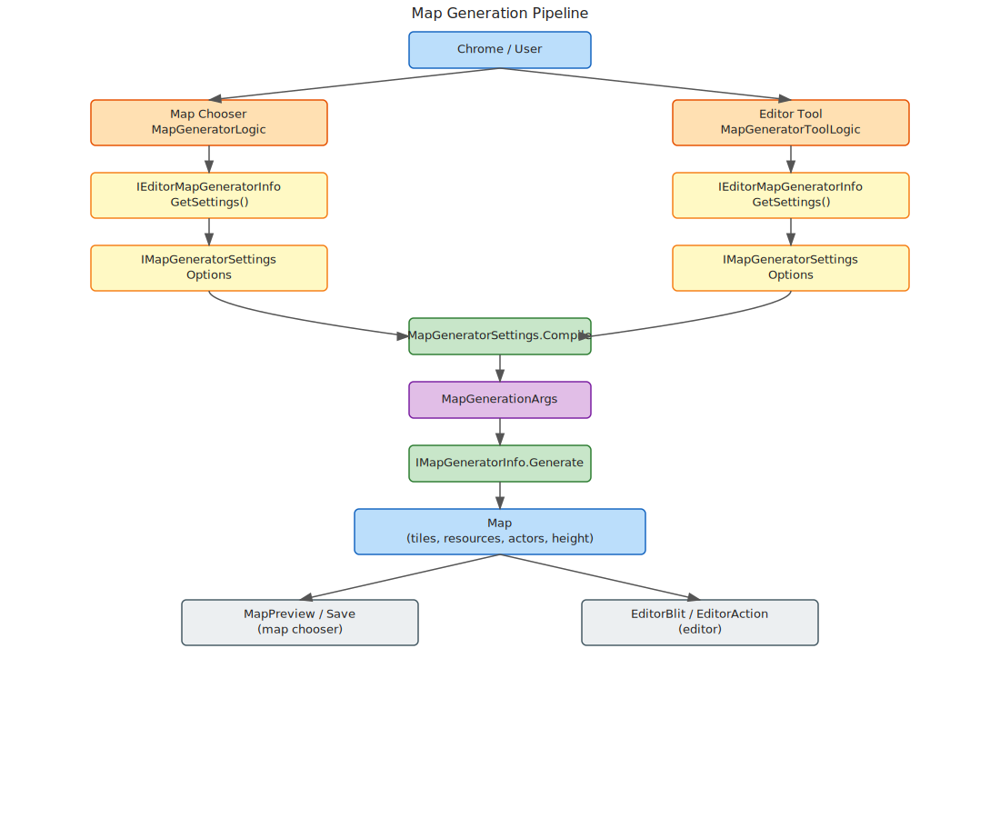
### The generator contract

The base contract is `IMapGeneratorInfo` in `OpenRA.Game/Traits/TraitsInterfaces.cs`:

```csharp
public interface IMapGeneratorInfo : ITraitInfoInterface
{
    string Type { get; }
    string Name { get; }
    string MapTitle { get; }

    Map Generate(ModData modData, MapGenerationArgs args);
    bool TryGenerateMetadata(ModData modData, MapGenerationArgs args, out MapPlayers players, out Dictionary<string, MiniYaml> rules);
}
```

- `Type` is the internal identifier used to look up the generator by name.
- `Name` is the human-readable (Fluent) name shown in the UI.
- `MapTitle` is the default title applied to generated maps.
- `Generate` is the heavy lifting: build a `Map` object from the supplied args.
- `TryGenerateMetadata` is a lightweight path that only produces the player count and ruleset required for previews and server-side map selection.

Editor-visible generators extend this with `IEditorMapGeneratorInfo` in `OpenRA.Mods.Common/TraitsInterfaces.cs`:

```csharp
public interface IEditorMapGeneratorInfo : IMapGeneratorInfo
{
    ImmutableArray<string> Tilesets { get; }
    IMapGeneratorSettings GetSettings();
}
```

- `Tilesets` lists which terrain sets the generator knows how to paint.
- `GetSettings()` returns a UI-configurable `IMapGeneratorSettings` object.

### The settings bridge

`IMapGeneratorSettings` (`OpenRA.Mods.Common/TraitsInterfaces.cs`) is the contract that lets both UI logics talk to a generator without knowing its internals:

```csharp
public interface IMapGeneratorSettings
{
    ImmutableArray<MapGeneratorOption> Options { get; }
    int PlayerCount { get; }
    void Randomize(MersenneTwister random);
    void Initialize(MapGenerationArgs args);
    MapGenerationArgs Compile(ITerrainInfo terrainInfo, Size size);
}
```

`MapGeneratorSettings` (`OpenRA.Mods.Common/MapGenerator/MapGeneratorSettings.cs`) is the only concrete implementation. It parses the `Settings` MiniYaml from a generator trait and builds a list of `MapGeneratorOption` objects. The option types are:

| Option class | YAML key | UI widget | What it produces |
| :---- | :---- | :---- | :---- |
| `MapGeneratorBooleanOption` | `BooleanOption@<id>` | checkbox | a single `<Parameter>: True/False` setting |
| `MapGeneratorIntegerOption` | `IntegerOption@<id>` | text field | a single `<Parameter>: <int>` setting |
| `MapGeneratorMultiIntegerChoiceOption` | `MultiIntegerChoiceOption@<id>` | dropdown | a single `<Parameter>: <int>` setting chosen from a fixed list |
| `MapGeneratorMultiChoiceOption` | `MultiChoiceOption@<id>` | dropdown | a block of settings selected by a named choice (can be tileset/player-count filtered) |

All options expose `Id`, `Label`, and `Priority`. `Priority` controls the order in which their settings are merged: lower values are applied first, later values can override them.

### The generation carrier

`MapGenerationArgs` (`OpenRA.Game/Map/MapGenerationArgs.cs`) is the canonical fingerprint of a generated map. It contains:

```csharp
public string Uid;
public string Generator;
public string Tileset;
public Size Size;
public string Title;
public string Author;
public MiniYaml Settings;
```

`Settings` is the merged MiniYaml produced by all selected options. `MapGeneratorSettings.Compile` also stores a separate `Options` dictionary (as a `FrozenDictionary<string, string>`) so the UI can restore the exact panel state later.


## Data Flow / Code Path


There are two top-level entry points. They share the same generator interface but differ in what they do with the resulting `Map`.

### Path 1: the map chooser random-map panel

1. **Panel creation.** `MapChooserLogic` checks whether the `EditorWorld` actor has any `IEditorMapGeneratorInfo` traits (`OpenRA.Mods.Common/Widgets/Logic/MapChooserLogic.cs`). If so, it calls `SetupGenerateMapPanel`.

2. **Widget loading.** `SetupGenerateMapPanel` loads the chrome widget `MAPCHOOSER_GENERATE_PANEL` (`mods/common/chrome/map-chooser.yaml`). That widget declares `Logic: MapGeneratorLogic`, so the engine creates a `MapGeneratorLogic` instance.

3. **Generator selection.** The constructor grabs the **first** `IEditorMapGeneratorInfo` registered on the `EditorWorld` actor (`MapGeneratorLogic.cs`). It then calls `GetSettings()` to obtain a `MapGeneratorSettings` object (`MapGeneratorLogic.cs`).

4. **UI setup.** The logic manually creates two dropdowns: one for tileset and one for map size (`MapGeneratorLogic.cs`). These are handled outside the generator because the generator itself doesn't expose tileset/size as ordinary options.

5. **Randomize.** The `Generate` button (`MapGeneratorLogic.cs`) calls `settings.Randomize(Game.CosmeticRandom)`, which sets the `Seed` option to a random integer (`MapGeneratorSettings.cs`), then calls `RandomizeSize()` to pick a width/height from the `MapSizes` dictionary with a small grid adjustment (`MapGeneratorLogic.cs`).

6. **Compile arguments.** `GenerateMap()` (`MapGeneratorLogic.cs`) calls `settings.Compile(selectedTerrain, size)` (`MapGeneratorSettings.cs`). `Compile`:
   - reads the current `PlayerCount`;
   - orders options by `Priority`;
   - collects each option's `GetSettings` output into a list of `MiniYamlNode` layers;
   - merges those layers into a single `MiniYaml` via `MiniYaml.Merge`;
   - builds a `FrozenDictionary` of UI option values so the panel can be recreated later;
   - returns a `MapGenerationArgs` with `Generator`, `Tileset`, `Size`, `Title` (from `MapTitle`), `Author` (from `Name`), and the merged `Settings`.

7. **Generate the map.** `MapGeneratorLogic.cs` calls `generator.Generate(modData, args)` on a background thread.

8. **Save and preview.** If generation succeeds, the `Map` is saved to a fresh `ZipFileLoader.ReadWriteZipFile()` (`MapGeneratorLogic.cs`), the UID is copied back into `args.Uid`, and the preview widget is updated. The `onGenerate` callback is invoked with `(args, package)`.

9. **Adoption.** `MapChooserLogic` receives the callback and stores `generatedMapArgs` and `generatedMapPackage` (`MapChooserLogic.cs`). When the player clicks OK, the generated tab is considered selected; `MapCache[generatedMapArgs.Uid]` is updated via `UpdateFromGenerationArgs` and `UpdateFromMap` (`MapChooserLogic.cs`), and the caller's `onSelectGenerated` callback is invoked.

10. **Lazy full generation.** If a generated map is chosen but only metadata exists, `MapPreview.Generate()` (`MapPreview.cs`) does the final full generation on a background thread, saves the result, and again asserts that the resulting `Map.Uid` matches `GenerationArgs.Uid` (`MapPreview.cs`).

### Path 2: the editor map generator tool

1. **Tool discovery.** `MapToolsLogic` enumerates all `IEditorTool` traits on the world actor (`MapToolsLogic.cs`). Each generator class (e.g. `ClassicMapGenerator`, `ClearMapGenerator`) implements `IEditorTool` and exposes a `PanelWidget` and `Label`.

2. **Panel loading.** `MapToolsLogic.cs` loads `MAP_GENERATOR_TOOL_PANEL` (`mods/common/chrome/editor.yaml`), passing the `IEditorTool` as a widget argument. The panel declares `Logic: MapGeneratorToolLogic`, whose constructor receives the `tool`.

3. **Generator cast.** `MapGeneratorToolLogic` casts the tool's `TraitInfo` to `IEditorMapGeneratorInfo` and calls `GetSettings()` (`MapGeneratorToolLogic.cs`).

4. **Generate.** Clicking the generate button calls `GenerateMap()` -> `GenerateMapMayThrow()` (`MapGeneratorToolLogic.cs`). It:
   - compiles `MapGenerationArgs` from the current map's tileset and size (`MapGeneratorToolLogic.cs`);
   - logs the settings (`MapGeneratorToolLogic.cs`);
   - calls `generator.Generate(modData, args)` (`MapGeneratorToolLogic.cs`);
   - converts the generated map's tiles, resources, and actors into an `EditorBlitSource` and `EditorBlit` (`MapGeneratorToolLogic.cs`);
   - wraps the blit in a `RandomMapEditorAction` (`MapGeneratorToolLogic.cs`);
   - adds the action to the `EditorActionManager` (`MapGeneratorToolLogic.cs`), making it undoable and redoable.

5. **Error handling.** Any `MapGenerationException` or `YamlException` is shown in a confirmation dialog with the exception message; other exceptions are logged and shown as a generic failure prompt (`MapGeneratorToolLogic.cs`).

### Common sub-flow: from `MapGenerationArgs` to `Map`

Both paths eventually call a generator's `Generate` method. The generator's job is:

1. Look up the `ITerrainInfo` for `args.Tileset`.
2. Create a blank `Map` with `new Map(modData, terrainInfo, args.Size)`.
3. Parse its internal `Parameters` from `args.Settings` (usually via a private `Parameters` class using `FieldLoader`).
4. Use a `Terraformer` (or direct tile painting) to fill `map.Tiles`, `map.Resources`, `map.Height`, and add actor plans.
5. Return the `Map`.

For example, `ClassicMapGenerator.Generate` (`ClassicMapGenerator.cs`) constructs a `Parameters`, creates a `Terraformer`, derives many independent `MersenneTwister` RNGs from the seed, paints land/sea, cliffs, forests, roads, resources, and neutral buildings, then returns the map.


## Configuration (YAML)


Generators are registered as traits on the `EditorWorld` actor in a mod's rules YAML. The Red Alert example is `mods/ra/rules/map-generators.yaml`:

```yaml
^MapGenerators:
    ClassicMapGenerator@classic:
        Type: classic
        Name: map-generator-classic
        Tilesets: DESERT, SNOW, TEMPERAT
        MapTitle: label-random-map
        Settings:
            ...
```

Key fields:

- `Type` (required): internal generator ID used by `MapGenerationArgs.Generator`.
- `Name` (required, Fluent reference): shown in the UI and used as the map author.
- `Tilesets` (required): comma-separated list of tileset IDs the generator supports.
- `MapTitle` (optional, Fluent reference): default title for generated maps.
- `PanelWidget` (optional): chrome panel used by the editor tool; default is `MAP_GENERATOR_TOOL_PANEL`.
- `Settings` (required): the options exposed to the user.

### Settings option syntax

```yaml
Settings:
    BooleanOption@DenyWalledArea:
        Label: label-ra-map-generator-option-deny-walled-areas
        Parameter: DenyWalledAreas
        Default: True
        Priority: 1

    IntegerOption@Seed:
        Label: label-ra-map-generator-option-seed
        Parameter: Seed
        Default: 0

    MultiIntegerChoiceOption@Players:
        Label: label-ra-map-generator-option-players
        Parameter: Players
        Choices: 1, 2, 3, 4, 5, 6, 7, 8
        Default: 2
        Priority: 1

    MultiChoiceOption@TerrainType:
        Label: label-ra-map-generator-option-terrain-type
        Default: Plots
        Priority: 2
        Choice@Plots:
            Label: label-ra-map-generator-choice-terrain-type-plots
            Settings:
                Water: 100
                Forests: 300
                ...
        Choice@Plains:
            Label: label-ra-map-generator-choice-terrain-type-plains
            Settings:
                Water: 0
```

- `Label` is a Fluent key for the option's UI label.
- `Parameter` is the generator parameter name the option writes into `Settings`.
- `Default` is the initial value (for `MultiChoiceOption`, a list of fallback keys).
- `Priority` controls merge order (see `MapGeneratorSettings.Compile`, `MapGeneratorSettings.cs`).

For `MultiChoiceOption`, each `Choice` can optionally declare:

- `Tileset: <ids>`: only show this choice when the selected tileset is in the list.
- `Players: <counts>`: only show this choice when the selected player count is in the list.
- `Settings`: a block of parameters that are injected when this choice is selected.

This is how mods implement "terrain presets" or "resource presets" that change many underlying parameters at once.

### Hidden defaults and overrides

Because `MapGeneratorSettings.Compile` merges layers by priority, a common pattern is to define a `MultiChoiceOption` with no UI label that acts as a hidden defaults layer, and then subsequent choices override it. For example, in `mods/ra/rules/map-generators.yaml` the `MultiChoiceOption@hidden_defaults` injects the baseline `ClassicMapGenerator` parameters, while the visible `TerrainType` choice overrides only the values that change.

## Practical Example: Adding a New Generator to the Skirmish Lobby

Suppose you want a "Large Open Plains" generator that always creates a flat, resource-light map with fixed settings.

1. Create a C# class that implements `IMapGeneratorInfo` (or inherit from the existing `ClassicMapGenerator` if you only need to override terrain parameters):

```csharp
public class OpenPlainsGeneratorInfo : TraitInfo<OpenPlainsGenerator>, IMapGeneratorInfo
{
    public string Type => "openplains";
    public string Name => "map-generator-openplains";
    public string MapTitle => "label-openplains-map";

    public Map Generate(ModData modData, MapGenerationArgs args) { /* ... */ }
    public bool TryGenerateMetadata(...) { /* ... */ }
}

public class OpenPlainsGenerator { }
```

2. Register it on the `EditorWorld` actor in your mod's `rules/map-generators.yaml`:

```yaml
^MapGenerators:
    OpenPlainsGenerator@openplains:
        Type: openplains
        Name: map-generator-openplains
        Tilesets: TEMPERAT, DESERT, SNOW
        MapTitle: label-openplains-map
```

3. Because the generator implements `IEditorMapGeneratorInfo` (via the base trait), the map chooser's `MapGeneratorLogic` discovers it through `TraitInfos<IEditorMapGeneratorInfo>().First()` and exposes a "Generate" button. The editor tool panel will list it alongside the other generators.

This example shows the three pipeline steps every new generator needs: a `TraitInfo` class implementing the generator contract, YAML registration on `EditorWorld`, and UI discovery through the `IEditorMapGeneratorInfo` interface.

## Interconnectivity

### Depends on

- **Trait system** ([Part 1.1 — ECS, Actors, and Traits](#file-chapters-Part_01_Chapter_01_ECS) / [Part 1.2 — Activity System](#file-chapters-Part_01_Chapter_02_Activities)): generators are registered as `TraitInfo` on the `EditorWorld` actor and discovered via `TraitInfos<T>`.
- **MiniYaml / FieldLoader** ([Part 2.1 — MiniYaml Parser](#file-chapters-Part_02_Chapter_01_MiniYaml) / [Part 2.3 — FieldLoader](#file-chapters-Part_02_Chapter_03_FieldLoader)): all settings, options, and `MapGenerationArgs` are loaded and saved through `FieldLoader` and `MiniYaml`.
- **Fluent localization**: all user-visible labels are Fluent keys (`Label`, `Name`, `MapTitle`).
- **Map / [CellLayer](#file-appendices-Appendix_A_Glossary) / [MapGrid](#file-appendices-Appendix_A_Glossary)** ([Part 7.2 — Map Generation Data Structures](#file-chapters-Part_07_Chapter_02_Data_Structures)): the final output is a `Map` object with `CellLayer` tile, resource, and height layers.
- **TerrainInfo**: generators validate tile types against `modData.DefaultTerrainInfo`.
- **[Terraformer](#file-appendices-Appendix_A_Glossary) / [MultiBrush](#file-appendices-Appendix_A_Glossary) / Matrix** ([Part 7.4 — Terraformer](#file-chapters-Part_07_Chapter_04_Terraformer), [Part 7.5 — MultiBrush and Tile Placement](#file-chapters-Part_07_Chapter_05_MultiBrush)): the standard generators use these to build the actual terrain.
- **Editor action system** (`MapGeneratorToolLogic.cs`): editor generation is applied as an undoable `IEditorAction`.
- **MapCache / MapPreview** (`OpenRA.Game/Map/MapPreview.cs`): generated maps are registered as `MapClassification.Generated` with lazy full generation.

### Used by

- **Map chooser UI** (`MapChooserLogic`): provides the "Generate" tab; see [Part 4.3 — Widgets and Chrome](#file-chapters-Part_04_Chapter_03_Widgets) for the chrome/widget system that hosts it.
- **Editor tools UI** (`MapToolsLogic`): lists generator tools; see [Part 4.4 — Viewport and Input](#file-chapters-Part_04_Chapter_04_Viewport_Input) for the editor's UI entry points.
- **Server / map pool logic**: uses `MapPreview.UpdateFromGenerationArgs` to display and select generated maps without generating the full tile grid.
- **`--fuzz-map-generator` utility command** (`OpenRA.Mods.Common/UtilityCommands/FuzzMapGeneratorCommand.cs`): exercises generators by iterating through combinations of settings and tilesets.


## Algorithms


### Merging option layers

`MapGeneratorSettings.Compile` (simplified from `MapGeneratorSettings.cs`):

```text
playerCount = PlayerCount
layers = Options.OrderBy(Priority).Select(o => o.GetSettings(terrainInfo, playerCount))
merged = MiniYaml.Merge(layers)
options = { optionId -> formattedValue for each option }
return new MapGenerationArgs {
    Generator = generatorInfo.Type,
    Tileset = terrainInfo.Id,
    Size = size,
    Title = FluentProvider.GetMessage(generatorInfo.MapTitle),
    Author = FluentProvider.GetMessage(generatorInfo.Name),
    Settings = merged,
    Options = frozen options
}
```

The merge is order-sensitive: a `MultiChoiceOption` choice can override a default value, and an `IntegerOption` can override a preset.

### Deterministic RNG derivation

Generators like `ClassicMapGenerator` take a single `Seed` and then create many independent `MersenneTwister` instances from it (`ClassicMapGenerator.cs`). This is a deliberate design to keep different algorithmic stages decoupled: changing one part of the generator does not perturb the random sequence used by unrelated parts. It also makes parallel or future threaded work easier.

### MultiChoice fallback

When a `MultiChoiceOption` is compiled, it may discover that the current `value` is not valid for the selected tileset or player count. It then falls back to:

1. The first entry of `Default` that is valid.
2. The first valid choice overall.

If no valid choice exists, the option contributes no settings (`MapGeneratorSettings.cs`). This is important for symmetry options that only make sense for certain player counts.

### Metadata-only path

`TryGenerateMetadata` exists so the map chooser, server, and lobby can display a generated map's player count, spawn points, and rules without running the full (potentially expensive) terrain generation. `ClassicMapGenerator.TryGenerateMetadata` (`ClassicMapGenerator.cs`) extracts the `Players` parameter from `args.Settings` and creates a `MapPlayers` with that count. The runtime later fills in placeholder spawn points and custom rules (`MapPreview.cs`).


## Extension Points


### Adding a brand-new generator

1. **Implement `IMapGeneratorInfo` (or `IEditorMapGeneratorInfo`).**
   - Create a `TraitInfo` subclass.
   - Add `[TraitLocation(SystemActors.EditorWorld)]` so it is attached to the editor world.
   - Implement `Type`, `Name`, `MapTitle`.
   - Implement `Generate` and `TryGenerateMetadata`.
   - If editor-visible, implement `IEditorMapGeneratorInfo.Tilesets` and `GetSettings()`.

2. **Provide a runtime `IEditorTool` class** (only if editor-visible).
   - The class must expose `Label`, `PanelWidget`, `IsEnabled`, and `TraitInfo`.
   - `IsEnabled` can filter by current map tileset (e.g. `ClassicMapGenerator.cs`).
   - The trait's `Create` override returns this runtime object.

3. **Add the YAML entry.** Register the trait under the `EditorWorld` actor or a template like `^MapGenerators`:

```yaml
MyWorld:
    MyMapGeneratorInfo@mygen:
        Type: mygen
        Name: my-generator-name
        Tilesets: TEMPERAT, DESERT
        MapTitle: label-random-map
        Settings:
            IntegerOption@Seed:
                Parameter: Seed
                Default: 0
            ...
```

4. **Add chrome if needed.** If the editor tool uses a custom panel, define the widget in `mods/<mod>/chrome/editor.yaml` and reference it via `PanelWidget`.

5. **Implement `Generate`.** Start with `new Map(modData, terrainInfo, args.Size)`, fill `map.Tiles`, and call `map.Save` if the caller needs it.

6. **Implement `TryGenerateMetadata`.** Return `true` with a `MapPlayers` matching the `Players` parameter and an empty or appropriate rules dictionary.

7. **Test with the fuzzer.** `OpenRA.Utility.exe --fuzz-map-generator --generator=mygen --tilesets=TEMPERAT --sizes=64x64,96x96` will iterate through option combinations and report failures.

### Custom option types

As of this codebase, the option type system is **not** open for extension without modifying `MapGeneratorSettings.cs`. The parser uses a hardcoded `switch` (`MapGeneratorSettings.cs`) that only recognizes `BooleanOption`, `IntegerOption`, `MultiIntegerChoiceOption`, and `MultiChoiceOption`. If you need a new option type (e.g., a slider, color picker, or coordinate entry), you must add a new `MapGeneratorOption` subclass and update the `switch` in `MapGeneratorSettings` and the UI logics in `MapGeneratorLogic` and `MapGeneratorToolLogic`.

### Customizing an existing generator

Most of the real "modding" is done through YAML overrides:

- Change `Tilesets` to enable/disable a generator for a tileset.
- Add new `Choice` blocks to `MultiChoiceOption` to create new presets.
- Change `BuildingWeights` or `ResourceSpawnWeights` to alter the mix of neutral buildings/resources.
- Override the hidden defaults layer to tweak parameters without changing code.


## Common Pitfalls / Guardrails


- **UID determinism.** Generated maps are identified by `Map.Uid`. The `MapCache` expects `map.Uid` to equal `GenerationArgs.Uid` (`MapPreview.cs`). If the generator's output depends on anything outside `args.Settings` (e.g., the current time, ambient randomness, or global mutable state), the UID check will fail and the map will be rejected. Always derive randomness from the `Seed` parameter.

- **MapGenerationException is the expected error type.** `MapGeneratorToolLogic` and the map chooser UI only display user-friendly messages for `MapGenerationException` and `YamlException`. Other exceptions are treated as bugs and either crash or log a generic message. Use `MapGenerationException` for expected failure modes like "map too small" or "could not fit tiles".

- **Thread safety.** `MapGeneratorLogic.GenerateMap` runs generation on a thread-pool task. Only the `Game.RunAfterTick` lambda may touch the UI. Keep generator algorithms free of UI assumptions.

- **PlayerCount contract.** `MapGeneratorSettings.PlayerCount` specifically looks for an option with `Id == "Players"` and expects either a `MapGeneratorIntegerOption` or `MapGeneratorMultiIntegerChoiceOption` (`MapGeneratorSettings.cs`). If you rename or omit the `Players` option, the player count logic will report `0`.

- **Seed option convention.** `MapGeneratorSettings.Randomize` looks for an option with `Id == "Seed"` and treats it as an integer (`MapGeneratorSettings.cs`). If you want a randomize button, expose a seed option with that ID.

- **Tileset/size are not ordinary options.** Both UI logics create tileset and size dropdowns manually, not through the `MapGeneratorSettings` option system. The generator receives them via `MapGenerationArgs.Tileset` and `MapGenerationArgs.Size`. Do not rely on finding them in `args.Settings`.

- **MultiChoice defaults must be valid.** If the `Default` array of a `MultiChoiceOption` contains keys that are not valid for the current tileset/player count, the option will fall back to the first valid choice. This can cause the UI to display a different value than the one in `Settings` after a tileset change.

- **Isometric size handling.** `MapGeneratorLogic.RandomizeSize` doubles the height for `RectangularIsometric` grids and adds a border based on `MaximumTerrainHeight` (`MapGeneratorLogic.cs`). Generators must tolerate non-square sizes for isometric tilesets.

- **Editor resource layer hack.** `MapGeneratorToolLogic` casts `resourceLayer.Info` to `EditorResourceLayerInfo` to map resource indices back to resource type names (`MapGeneratorToolLogic.cs`). This is brittle and assumes the editor resource layer is always present.

- **Metadata generation must agree with full generation.** `TryGenerateMetadata` should report the same effective player count and rules as the full `Generate` path for the same `args`. If they disagree, the lobby preview and the actual generated map will be inconsistent.

- **Only the first generator is used by the map chooser.** `MapGeneratorLogic` calls `TraitInfos<IEditorMapGeneratorInfo>().First()` (`MapGeneratorLogic.cs`). If a mod registers multiple editor-visible generators, the map chooser will ignore all but the first one. The editor tool panel, however, will list all of them through `MapToolsLogic`.

- **The `MapGeneratorSettings` option parser is case-sensitive.** It expects keys of the form `<OptionType>@<Id>` and only recognizes the four option types listed above.

## What to read next

- [Part 7.2 — Map Generation Data Structures](#file-chapters-Part_07_Chapter_02_Data_Structures) for the grid and layer types that generators manipulate.
- [Part 7.4 — Terraformer](#file-chapters-Part_07_Chapter_04_Terraformer) and [Part 7.5 — MultiBrush and Tile Placement](#file-chapters-Part_07_Chapter_05_MultiBrush) for the high-level tools that turn settings into terrain.
- [Part 7.8 — Random Map Generator Extension Points](#file-chapters-Part_07_Chapter_08_Extension_Points) if you want to add a new generator or brush collection.
- [Appendix A — Glossary](#file-appendices-Appendix_A_Glossary) for definitions of RMG, CellLayer, MapGrid, Terraformer, and MultiBrush.
- [Part 2.2 — Manifest and Mod Metadata](#file-chapters-Part_02_Chapter_02_Manifest) for the mod YAML and `ModData` plumbing that loads generator traits.

## Summary

This chapter explains how OpenRA turns a user-facing seed/settings panel into a fully realized, playable `Map`.

After reading this chapter, you should be able to:

- Explain the end-to-end map generation pipeline from UI click to playable Map.
- Describe the `IMapGeneratorInfo` and `IEditorMapGeneratorInfo` contracts.
- Trace how `MapGeneratorSettings` compiles widget options into `MapGenerationArgs`.
- Explain the difference between `Generate` and `TryGenerateMetadata`.
- Register a new generator in YAML and wire it into the map chooser or editor.
- Describe how generated maps are saved, previewed, or blitted into the editor.

If any of the concepts above feel unclear, review the relevant section before continuing. For source files and further reading, see the References section.


## References

### Source files

- `OpenRA.Game/Traits/TraitsInterfaces.cs` — `IMapGeneratorInfo` definition.
- `OpenRA.Mods.Common/TraitsInterfaces.cs` — `IEditorMapGeneratorInfo`, `IMapGeneratorSettings`, and `MapGenerationException`.
- `OpenRA.Game/Map/MapGenerationArgs.cs` — the serializable args carrier.
- `OpenRA.Mods.Common/MapGenerator/MapGeneratorSettings.cs` — options and `IMapGeneratorSettings` implementation.
- `OpenRA.Mods.Common/Widgets/Logic/MapGeneratorLogic.cs` — map chooser generation panel.
- `OpenRA.Mods.Common/Widgets/Logic/MapChooserLogic.cs` — integration with the map chooser, generated tab setup.
- `OpenRA.Mods.Common/Widgets/Logic/Editor/MapGeneratorToolLogic.cs` — editor tool logic.
- `OpenRA.Mods.Common/Widgets/Logic/Editor/MapToolsLogic.cs` — editor tool discovery.
- `OpenRA.Mods.Common/Traits/World/ClassicMapGenerator.cs` — example generator implementation.
- `OpenRA.Mods.Common/Traits/World/ClearMapGenerator.cs` — minimal example generator.
- `OpenRA.Mods.D2k/Traits/World/D2kMapGenerator.cs` — Dune 2000 generator.
- `OpenRA.Mods.Cnc/Traits/World/TSMapGenerator.cs` — Tiberian Sun generator.
- `OpenRA.Game/Map/MapPreview.cs` — metadata preview and lazy generation.
- `OpenRA.Mods.Common/UtilityCommands/FuzzMapGeneratorCommand.cs` — command-line generator exerciser.

### YAML / chrome

- `mods/ra/rules/map-generators.yaml` — Red Alert generator registration and options.
- `mods/cnc/rules/map-generators.yaml` — Tiberian Dawn generator registration.
- `mods/ts/rules/map-generators.yaml` — Tiberian Sun generator registration.
- `mods/d2k/rules/map-generators.yaml` — Dune 2000 generator registration.
- `mods/common/chrome/map-chooser.yaml` — map chooser generation panel (`MAPCHOOSER_GENERATE_PANEL`).
- `mods/common/chrome/editor.yaml` — editor generator tool panel (`MAP_GENERATOR_TOOL_PANEL`).
- `mods/cnc/chrome/editor.yaml` — CNC editor tool panel container (`MAP_GENERATOR_TOOL_PANEL`).

### Related manual chapters

- [Part 7.2 — Map Generation Data Structures](#file-chapters-Part_07_Chapter_02_Data_Structures)
- [Part 7.3 — Map Generation Algorithms](#file-chapters-Part_07_Chapter_03_Algorithms)
- [Part 7.4 — Terraformer](#file-chapters-Part_07_Chapter_04_Terraformer)
- [Part 7.5 — MultiBrush and Tile Placement](#file-chapters-Part_07_Chapter_05_MultiBrush)
- [Part 7.6 — Mod-Specific Generators](#file-chapters-Part_07_Chapter_06_Mod_Generators)
- [Part 7.7 — Resource and Actor Placement](#file-chapters-Part_07_Chapter_07_Resources_Actors)
- [Part 7.8 — Random Map Generator Extension Points](#file-chapters-Part_07_Chapter_08_Extension_Points)
- [Part 7.9 — Random Map Generator File Index](#file-chapters-Part_07_Chapter_09_File_Index)


### External resources

- [OpenRA playtest docs](https://docs.openra.net/en/playtest/)


---

<a id="file-chapters-Part_07_Chapter_02_Data_Structures"></a>

<!-- --- FILE: chapters/Part_07_Chapter_02_Data_Structures.md --- -->

# Chapter 7.2 — Map Generation Data Structures {#file-chapters-Part_07_Chapter_02_Data_Structures}

## Purpose

This chapter explains the core data structures that OpenRA uses to store, index, and transform a map. Map generation code in `OpenRA.Mods.Common.MapGenerator` works mostly with generic, CPos-aligned 2D arrays (`Matrix<T>`), while the runtime engine stores the final map in grid-aware layers (`CellLayer<T>`). The bridge between these two representations, the shape and coordinate rules that govern them, and the top-level `Map` container that holds tile, resource, height, ramp, and actor data are all covered here.

The goal is to give readers a precise mental model of:

- How `[CellLayer<T>](#file-appendices-Appendix_A_Glossary)` stores one scalar value per map cell.
- How `Matrix<T>` provides a grid-agnostic workbench for generator algorithms.
- How `[MapGrid](#file-appendices-Appendix_A_Glossary)` defines the geometry of the world (rectangular vs. isometric, sub-cells, ramps, tile search).
- How `Map` assembles all of these layers into one serializable object.
- How `[CPos](#file-appendices-Appendix_A_Glossary)`, `[MPos](#file-appendices-Appendix_A_Glossary)`, `PPos`, and `[WPos](#file-appendices-Appendix_A_Glossary)` relate to each other and how to convert between them safely.

## Learning Objectives


After studying this chapter, you should be able to:

- Explain the difference between CellLayer<T> and Matrix<T> and when to use each.
- Convert between CPos, MPos, PPos, and WPos using MapGrid rules.
- Describe how MapGrid defines grid geometry, sub-cells, ramps, and tile search.
- Use CellLayerUtils to bridge generator Matrix results into engine CellLayer layers.
- Explain how Map assembles tile, resource, height, ramp, and actor layers.
- Identify coordinate system edge cases on RectangularIsometric grids.

## Files

| File | Role |
|------|------|
| `OpenRA.Game/Map/CellLayerBase.cs` | Abstract base for a flat array of values whose dimensions match a `MapGrid`. |
| `OpenRA.Game/Map/CellLayer.cs` | Generic `CellLayer<T>` with `CPos`/`MPos` indexers and a `CellEntryChanged` event. |
| `OpenRA.Mods.Common/MapGenerator/Matrix.cs` | Generic 2D array indexed by `int2` (or `x,y`) used by map-generator algorithms. |
| `OpenRA.Mods.Common/MapGenerator/CellLayerUtils.cs` | Bridge helpers that copy data between `CellLayer<T>` and `Matrix<T>`. |
| `OpenRA.Game/Map/MapGrid.cs` | Mod-level definition of the grid type, sub-cells, ramps, and `TilesByDistance`. |
| `OpenRA.Game/Map/Map.cs` | Top-level map container: tile/resource/height/ramp layers, bounds, projection, actors. |
| `OpenRA.Game/CPos.cs` | Packed cell coordinate (X, Y, Layer). |
| `OpenRA.Game/MPos.cs` | Raw map coordinate (U, V) plus the `PPos` projected coordinate struct. |
| `OpenRA.Game/WPos.cs` | World-space 3D position (X, Y, Z). |
| `OpenRA.Game/CVec.cs` | 2D cell-space offset vector. |


## Architecture


### 1. The Layer Abstraction: `CellLayerBase<T>` and `CellLayer<T>`

A `CellLayer<T>` is a dense, one-dimensional array of `T` values that is sized to the map and tagged with the grid type (`Rectangular` or `RectangularIsometric`). The base class handles the raw memory, while the sealed subclass adds coordinate-aware indexers and change notification.

#### `CellLayerBase<T>` (CellLayerBase.cs)

- `Size` — the layer dimensions in raw map cells (`OpenRA.Primitives.Size`).
- `GridType` — either `Rectangular` or `RectangularIsometric`.
- `Entries` — a protected `T[]` of length `Size.Width * Size.Height`.
- `Bounds` — a `Rectangle(0, 0, Size.Width, Size.Height)` used for bounds checks.
- `CopyValuesFrom(CellLayerBase<T>)` — validates that both layers have the same `Size` and `GridType`, then copies the backing span.
- `Clear()` and `Clear(T value)` — fill the backing span with `default(T)` or a specific value.
- `IEnumerable<T>` enumerates `Entries` directly in row-major order.
- `AsReadOnlyMemory()` / `AsMemory()` expose the underlying array for efficient bulk operations.

#### `CellLayer<T>` (CellLayer.cs)

`CellLayer<T>` is the concrete layer that the rest of the engine uses. Its public surface is built around two coordinate systems:

- `this[CPos cell]` — converts the cell coordinate to an `MPos` and reads/writes the entry.
- `this[MPos uv]` — reads/writes the raw array entry directly.

The indexer setter always invokes the `CellEntryChanged` event:

```csharp
public event Action<CPos> CellEntryChanged = null;
```

For `this[CPos]`, the event is raised with the same `CPos`. For `this[MPos]`, the event is raised with `uv.ToCPos(GridType)`.

Important guards:

- `CopyValuesFrom`, `Clear()`, and `Clear(T)` throw `InvalidOperationException` if any listener is attached to `CellEntryChanged`. This prevents silent loss of notifications.
- `Contains(CPos)` and `TryGetValue(CPos, out T)` explicitly reject the case `X < Y` on `RectangularIsometric` grids because `ToMPos()` is symmetric in `X` and `Y` for that grid type.
- `Clamp` clamps an `MPos` to the layer bounds and converts back to the caller’s coordinate type.
- `CellRegion` returns a `CellRegion` spanning the entire layer.

A static helper class `CellLayer` provides:

```csharp
public static CellLayer<T> Resize<T>(CellLayer<T> layer, Size newSize, T defaultValue)
```

This creates a new layer of the same grid type and copies the overlapping top-left region; new cells are filled with `defaultValue`.

### 2. The Generator Workbench: `Matrix<T>`

`Matrix<T>` is a fixed-size 2D array designed for the map-generator pipeline. It does **not** know about `MapGridType` or `CPos` semantics; it stores values in a flat `T[] Data` and indexes them by `int2` or `x,y`.

Key members (Matrix.cs):

- `Data` — public read-only backing array.
- `Size` — dimensions as an `int2`.
- `Index(int2 xy)` / `Index(int x, int y)` — bounds-checked linear index.
- `XY(int index)` — reverse of `Index`.
- `this[int x, int y]` / `this[int2 xy]` / `this[int i]` — indexers.
- `ContainsXY(int2 xy)` / `ContainsXY(int x, int y)` — bounds check.
- `IsEdge(int x, int y)` — true if the coordinate is on the matrix border.
- `ClampXY(int x, int y)` — clamp to the matrix bounds.
- `Transpose()` — returns a new transposed matrix by shallow copying values.
- `Map<R>(Func<T, R>)` — returns a new matrix with transformed values.
- `Fill(T)` — fills the matrix and returns `this` for chaining.
- `Clone()` — returns a shallow copy.
- `Zip<T1, T2, T>(...)` — combines two same-size matrices with a function.
- `CopyTo(Matrix<T>)` — copies `Data` to another matrix of identical size.
- `Enumerate()` — yields `(int2 Xy, T Value)` for every cell.

The matrix is deliberately simple: no events, no grid conversions, no `Layer` field. It is the “scratch pad” for noise, distance transforms, morphological kernels, and other raster algorithms.

### 3. Bridging `Matrix<T>` and `CellLayer<T>`

The conversion between the two is handled by `OpenRA.Mods.Common.MapGenerator.CellLayerUtils`. These helpers are not in the requested file list but are essential for the “conversion to `CellLayer`” topic, so they are documented here.

#### `CellLayerUtils.ToMatrix<T>(CellLayer<T> cellLayer, T defaultValue)`

- Computes the smallest `CPos`-aligned rectangle that contains all cells for the layer’s grid type (`CellBounds`).
- Allocates a `Matrix<T>` of that size and fills it with `defaultValue`.
- Iterates over the layer’s `CellRegion` (which enumerates valid `CPos` cells) and copies each value into the matrix at `matrix[cpos.X - cellBounds.Left, cpos.Y - cellBounds.Top]`.

For `RectangularIsometric` grids, this means the matrix may contain “holes” for `CPos` positions that do not correspond to real cells; those holes stay at `defaultValue`.

#### `CellLayerUtils.FromMatrix<T>(CellLayer<T> cellLayer, Matrix<T> matrix, bool allowOversizedMatrix = false)`

- Computes the destination `CellBounds`.
- If `allowOversizedMatrix` is false, the matrix must exactly match the bounds size; otherwise, the matrix must be at least as large.
- Iterates over the layer’s `CellRegion` and writes `matrix[cpos.X - cellBounds.Left, cpos.Y - cellBounds.Top]` into the layer.

This is the standard way generator algorithms push their results back into a `CellLayer`.

#### Additional coordinate helpers in `CellLayerUtils`

- `Center<T>(CellLayer<T>)` / `Center(Map)` — world center of the layer.
- `Radius<T>(CellLayer<T>)` / `Radius(Map)` — maximum inscribed circle radius.
- `CornerToWPos(CPos, MapGridType)` / `WPosToCorner(WPos, MapGridType)` — map corner conversions.
- `CPosToWPos(CPos, MapGridType)` / `WPosToCPos(WPos, MapGridType)` — full cell center conversions.
- `MPosToWPos(MPos, MapGridType)` / `WPosToMPos(WPos, MapGridType)` — via `CPos`.
- `CVecToWVec(CVec, MapGridType)` — cell vector to world vector.
- `ToMatrixPoints` / `FromMatrixPoints` — convert arrays of `CPos` to zero-based `int2` coordinates relative to `CellBounds`.

### 4. `MapGrid` — The Geometry Contract

`MapGrid` is an `IGlobalModData` class loaded from the `MapGrid` section of `mod.yaml`. It defines everything the engine needs to know about the shape of one cell.

#### Grid types (MapGrid.cs)

```csharp
public enum MapGridType { Rectangular, RectangularIsometric }
```

- `Rectangular` — classic square cells. One cell step is `1024` world units.
- `RectangularIsometric` — diamond-shaped cells used by Tiberian Sun/Red Alert 2 style tilesets. One cell step along the diagonal world axes is `1448` units; the tile scale is `1448`.

#### Grid properties

- `Type` — grid type.
- `MaximumTerrainHeight` — max map height value (0 disables the height system).
- `MaximumTileSearchRange` — radius used to build `TilesByDistance`.
- `TileScale` — `1024` for rectangular, `1448` for isometric.
- `EnableDepthBuffer` — used by the renderer to handle per-cell depth offsets.
- `SubCellOffsets` — immutable array of world offsets for each sub-cell slot.
- `DefaultSubCell` — default sub-cell index; if omitted, defaults to the middle entry of `SubCellOffsets`.
- `Ramps` — immutable array of `CellRamp` definitions.
- `TilesByDistance` — precomputed `ImmutableArray<ImmutableArray<CVec>>` used by range queries.

#### Sub-cells

The default `SubCellOffsets` array has six entries:

```csharp
new(0, 0, 0),       // full cell - index 0
new(-299, -256, 0), // top left  - index 1
new(256, -256, 0),  // top right - index 2
new(0, 0, 0),       // center    - index 3
new(-299, 256, 0),  // bottom left - index 4
new(256, 256, 0),   // bottom right - index 5
```

`OffsetOfSubCell(SubCell)` returns `WVec.Zero` for `SubCell.Invalid` or `SubCell.Any`, otherwise returns the corresponding offset.

#### Ramps

A `CellRamp` is a struct that defines the 3D shape of one sloped tile.

- `CenterHeightOffset` — precomputed height at the center of the cell.
- `Corners` — four `WVec` corner offsets.
- `Polygons` — one polygon for flat ramps, two triangles for split ramps.
- `Orientation` — a `WRot` describing the ramp’s normal orientation.

The constructor takes the four corner heights (`Low`, `Half`, or `Full`) and a `RampSplit`:

- `RampSplit.Flat` — one quad.
- `RampSplit.X` — split along the X diagonal (`[0,1,3]` and `[1,2,3]`).
- `RampSplit.Y` — split along the Y diagonal (`[0,1,2]` and `[0,2,3]`).

`HeightOffset(int dX, int dY)` locates the triangle containing the point, then uses barycentric interpolation to compute the Z offset at that local position.

`MapGrid` constructs a hardcoded list of 20 ramps (MapGrid.cs) that follow the Tiberian Sun / Red Alert 2 slope conventions. The first ramp is flat, the rest are half-height and full-height combinations with specific orientations.

#### `TilesByDistance`

`CreateTilesByDistance()` builds an array of `CVec` groups indexed by integer distance:

1. For every `i,j` in `[-MaximumTileSearchRange, MaximumTileSearchRange]`, if `i² + j² ≤ MaximumTileSearchRange²`, add the `CVec(i,j)` to bucket `ceil(sqrt(i² + j²))`.
2. Sort each bucket by `LengthSquared`, then hash code, then X, then Y. The hash tie-breaker is intentional: it gives a stable but non-axis-aligned order for equal-distance tiles.

This table is used by `Map.FindTilesInAnnulus` and `Map.FindTilesInCircle`.

### 5. `Map` — The Final Container

`Map` is the object that joins the layers, the grid, the metadata, the rules, and the actor definitions.

#### Metadata and definitions

- `MapFormat` / `SupportedMapFormat` / `CurrentMapFormat` — map format versioning.
- `RequiresMod`, `Title`, `Author`, `Tileset`, `Categories`, `Visibility`.
- `MapSize` — dimensions of the backing layers.
- `Bounds` — playable area rectangle.
- `PlayerDefinitions` — `MiniYamlNode` collection for player slots.
- `ActorDefinitions` — `MiniYamlNode` collection for actor placements.
- `RuleDefinitions`, `SequenceDefinitions`, `WeaponDefinitions`, etc. — optional custom YAML.

#### Core layers

- `Tiles` — `CellLayer<TerrainTile>`; stores the tile type and tile index for each cell.
- `Resources` — `CellLayer<ResourceTile>`; stores resource type and density.
- `Height` — `CellLayer<byte>`; stores the terrain height value.
- `Ramp` — `CellLayer<byte>`; stores the ramp index, derived from the tile type.
- `CustomTerrain` — `CellLayer<byte>`; runtime override of the terrain type index.

All layers are created with the same `Grid.Type` and `MapSize` (Map.cs).

#### Projection state

When `MaximumTerrainHeight > 0`, the map builds a 3D-to-2D projection used for shroud, targeting, and rendering:

- `CellLayer<PPos[]> cellProjection` — for each `MPos`, the list of projected screen positions it covers.
- `CellLayer<List<MPos>> inverseCellProjection` — for each `PPos`, the list of `MPos` cells that project onto it.
- `CellLayer<byte> projectedHeight` — the visible height at each projected position.
- `PPos[] ProjectedCells` — cached array of all valid projected cells inside the bounds.
- `event Action<CPos> CellProjectionChanged` — raised when a cell’s projection changes.

The projection is lazily initialized in `InitializeCellProjection()` and updated on `Tiles.CellEntryChanged` and `Height.CellEntryChanged`.

#### Other useful state

- `AllCells` — a `CellRegion` covering the entire map.
- `AllEdgeCells` — list of `CPos` cells on the edge of the playable area.
- `ReplacedInvalidTerrainTiles` — dictionary of tiles that were invalid for the current tileset and were replaced on load.
- `ProjectedTopLeft` / `ProjectedBottomRight` — legacy world bounds of the playable area.

#### Events tied to the layers

During construction, `Map` subscribes to the layer events:

```csharp
if (Grid.MaximumTerrainHeight > 0)
{
    Tiles.CellEntryChanged += UpdateRamp;
    Tiles.CellEntryChanged += UpdateProjection;
    Height.CellEntryChanged += UpdateProjection;
}

CustomTerrain.CellEntryChanged += InvalidateTerrainIndex;
Tiles.CellEntryChanged += InvalidateTerrainIndex;
```

- `UpdateRamp` recomputes `Ramp[cell]` from the terrain info.
- `UpdateProjection` recomputes the cell’s projection and raises `CellProjectionChanged`.
- `InvalidateTerrainIndex` clears the cached terrain index for the cell.

### 6. Coordinate Systems

OpenRA uses four coordinate types and two vector types for cells. Understanding them is the biggest source of bugs in map code.

#### `CPos` — Cell Position

- Stored as a packed 32-bit integer: `XXXX XXXX XXXX YYYY YYYY YYYY LLLL LLLL`.
- `X` and `Y` are 12-bit signed values; `Layer` is an unsigned byte.
- `CPos` is the coordinate system actors and the user interface usually speak.
- For rectangular maps, `X` and `Y` are the raw map coordinates.
- For isometric maps, `X` and `Y` form a staggered cell grid; many valid combinations do not exist as real cells.
- Conversions:
  - `CPos.ToMPos(Map)` / `CPos.ToMPos(MapGridType)` — returns the raw map coordinate.
  - For rectangular: `new MPos(X, Y)`.
  - For isometric: `v = X + Y`, `u = (v - (v & 1)) / 2 - Y`.
- Explicit cast from `int2` to `CPos`.
- Supports `+`/`-` with `CVec`.

#### `MPos` — Map Position

- Raw 2D coordinate `(U, V)` that directly maps to the backing array.
- For rectangular maps, `U == X` and `V == Y`.
- For isometric maps, `U` and `V` are the non-staggered row/column coordinates.
- Conversions:
  - `MPos.ToCPos(Map)` / `MPos.ToCPos(MapGridType)`.
  - For rectangular: `new CPos(U, V)`.
  - For isometric: `y = (V - (V & 1)) / 2 - U`, `x = V - y`.
- `MPos.Clamp(Rectangle)` clamps `U` and `V`.

#### `PPos` — Projected Position

- Defined in the same file as `MPos` (MPos.cs).
- A 2D coordinate `(U, V)` used for the screen-space projection of an isometric map.
- Explicit casts connect it to `MPos`:
  - `(MPos)puv` → `new MPos(puv.U, puv.V)`.
  - `(PPos)uv` → `new PPos(uv.U, uv.V)`.
- `PPos` is **not** the same as `MPos`; using it properly requires the projection tables in `Map`.

#### `WPos` — World Position

- 3D position in world units: `X`, `Y`, `Z`.
- `Z` is height in the same units as `X` and `Y`.
- One rectangular cell is `1024` units wide.
- One isometric cell is `1448` units along the world diagonal axes.
- `WPos` = `WPos + WVec`; `WPos - WPos` = `WVec`.
- `WPos` is used by physics, movement, targeting, and rendering.

#### `CVec` — Cell Vector

- 2D integer offset `(X, Y)` in cell space.
- Supports arithmetic, scaling, dot product, length, clamping, and the eight `Directions`.
- `CPos + CVec` → `CPos`.
- `CPos - CPos` → `CVec`.

#### `WVec` — World Vector

- 3D integer vector in world units.
- Used for movement deltas, sub-cell offsets, and ramp normals.
- `WPos` operators are defined in `WPos.cs`.


## Data Flow / Code Path


### Loading a map

1. `Map` constructor reads `map.yaml`.
2. It reads `MapSize` and creates the four layers (`Tiles`, `Resources`, `Height`, `Ramp`) using `Grid.Type` and `MapSize`.
3. It reads `map.bin` and writes `Tiles`, `Resources`, and `Height` by `MPos`.
4. `PostInit()`:
   - Loads the `Ruleset` and `SequenceSet`.
   - Builds `AllCells` from the map corners.
   - Calls `SetBounds` to compute the playable rectangle and the projection.
   - Creates `CustomTerrain` and fills it with `byte.MaxValue`.
   - Replaces invalid tiles with the default tile and records them in `ReplacedInvalidTerrainTiles`.
   - Fills `Ramp` from the terrain info.
   - Computes `AllEdgeCells`.
   - Attaches layer event handlers.
5. If the map has height, `InitializeCellProjection()` is triggered lazily on the first projection query.

### Map generation pipeline

1. A generator creates one or more `CellLayer<T>` objects, usually from `Map.Tiles` or `Map.Height`.
2. `CellLayerUtils.ToMatrix(layer, defaultValue)` converts the layer into a `Matrix<T>` that the generator can process.
3. Algorithms (noise, blur, distance transforms, boolean morphology) operate on `Matrix<T>`.
4. `CellLayerUtils.FromMatrix(layer, matrix)` writes the result back.
5. Because the layer setter fires `CellEntryChanged`, any dependent state (`Ramp`, projection, terrain-index cache) is automatically refreshed.

### Runtime query path

1. An actor or widget asks `Map` for a world position or a cell.
2. `Map` uses `Grid.Type` to choose the correct conversion formula.
3. For height-aware maps, the query may be routed through the projection tables (`ProjectedCellsCovering`, `Unproject`, `ProjectedHeight`).
4. The final `MPos` or `CPos` is used to read `CellLayer<T>` entries.


## Configuration (YAML)


### `MapGrid` in `mod.yaml`

`MapGrid` is an `IGlobalModData` block. The most relevant fields are:

```yaml
MapGrid:
    Type: Rectangular
    MaximumTerrainHeight: 0
    SubCellOffsets: 0,0,0, -299,-256,0, 256,-256,0, 0,0,0, -299,256,0, 256,256,0
    DefaultSubCell: 3
    MaximumTileSearchRange: 50
    EnableDepthBuffer: false
```

- `Type` — `Rectangular` or `RectangularIsometric`.
- `MaximumTerrainHeight` — max value for the `Height` layer; `0` disables ramps and projection.
- `SubCellOffsets` — world offsets for each sub-cell slot. Index 0 is the full cell; the remaining entries are per-unit offsets.
- `DefaultSubCell` — index of the default sub-cell when an actor is spawned without a specific sub-cell. If omitted, it defaults to the middle of the array.
- `MaximumTileSearchRange` — radius for `TilesByDistance`.
- `EnableDepthBuffer` — renderer hint.

### `map.yaml`

The map file declares the top-level metadata and points to the binary data:

```yaml
MapFormat: 12
RequiresMod: ra
Title: Example
Author: Author
Tileset: TEMPERAT
MapSize: 128,128
Bounds: 1,1,126,126
Visibility: Lobby
Categories: Conquest
Actors:
    Actor0: ...
```

`MapSize` is the raw backing size of all `CellLayer` instances. `Bounds` defines the playable rectangle. `Actors` is the `ActorDefinitions` collection that `Map` stores as `MiniYamlNode` objects.

### `map.bin`

The binary companion stores the per-cell data:

- `TileFormat` byte.
- Width and height.
- Offsets for tiles, heights, and resources.
- Tile data as `ushort type` + `byte index`.
- Height data as `byte` (only if `MaximumTerrainHeight > 0`).
- Resource data as `byte type` + `byte density`.

The offsets are written by `SaveBinaryData()` in Map.cs.

## Interconnectivity

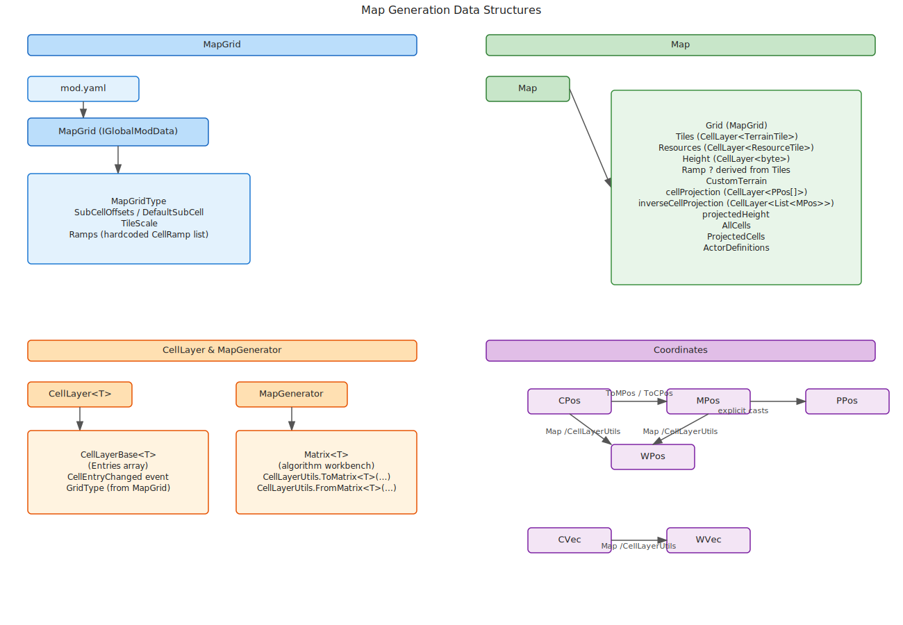
`Map` is the root: it owns the grid, the layers, and the projection. `CellLayer<T>` is the storage primitive. `Matrix<T>` is the algorithmic primitive. `CellLayerUtils` is the adapter. `MapGrid` is the geometric contract that every coordinate conversion and layer indexing follows.


## Algorithms


### CellLayer Index Calculation

`CellLayer<T>.Index(CPos)` inlines `CPos.ToMPos` for performance:

- Rectangular:
  - `index = Y * Size.Width + X`
- RectangularIsometric:
  - `u = (x - y) / 2`
  - `v = x + y`
  - `index = v * Size.Width + u`

`Index(MPos)` simply checks `Bounds.Contains(u, v)` and returns `v * Size.Width + u`. These two indexers are the reason coordinate conversion is hot in the engine.

### `CPos` ↔ `MPos` for Isometric Maps

Forward (`CPos` → `MPos`):

```
v = X + Y
u = (v - (v & 1)) / 2 - Y
```

Reverse (`MPos` → `CPos`):

```
y = (V - (V & 1)) / 2 - U
x = V - y
```

These formulas account for the staggered rows of isometric cells.

### `Map` Projection

When a cell has height, it may project onto several screen-space tiles.

- `ProjectCellInner(MPos uv)`:
  - If height is 0, returns `(PPos)uv`.
  - If height is odd and the cell has a non-zero ramp, height is rounded up to the next even value.
  - Odd heights project to four candidate `PPos` cells.
  - Even heights project to one `PPos` cell.
  - Candidates are filtered to those that are in bounds.

- `ProjectedCellHeightInner(PPos puv)`:
  - Walks the inverse projection downward until it finds an `MPos` that projects onto the `PPos`.
  - Returns `Height[uv] - TerrainHeight[uv]`, because the top of a cliff is treated like the bottom of the cliff in the original games.

- `UpdateProjection(CPos cell)`:
  - Removes the old reverse mapping.
  - Computes the new projection.
  - Adds the new reverse mapping.
  - Propagates the height up cliff faces.
  - Raises `CellProjectionChanged`.

### `MapGrid.Ramps`

`CellRamp` constructs four corners based on the grid type and the four corner heights:

- RectangularIsometric corners are at `±724` on the world axes.
- Rectangular corners are at `±512`.

For split ramps, the quad is divided into two triangles. `HeightOffset` uses a barycentric test: for each triangle with vertices `p0, p1, p2`, it solves for `u` and `v` such that the point is inside the triangle, then computes the interpolated Z as:

```
(u * p0.Z + v * p1.Z + (1024 - u - v) * p2.Z) / 1024
```

This is how `Map.CenterOfSubCell` and `Map.DistanceAboveTerrain` produce ramp-aware world positions.

### `TilesByDistance`

This is a rasterized circle table. For each `(i, j)` in range, it computes the ceiling of the Euclidean distance and places the offset in that bucket. Sorting is stable by design, using hash codes as a tie-breaker so that equal-distance tiles are not biased toward the top-left.

### `Matrix<T>` Algorithms

`Matrix<T>` itself only provides primitives. The heavy algorithms live in `MatrixUtils` (boolean blur, Chebyshev distance, walking distance, dilation/erosion, direction maps, chirality, etc.). They consume `Matrix<T>` and produce `Matrix<T>` or arrays of points. The generator then converts those back to `CellLayer<T>` via `CellLayerUtils.FromMatrix`.

### `CellLayerUtils` Bulk Operations

- `Entries<T>` — flattens a layer into a linear array in row-major order.
- `CalibrateQuantileInPlace` — shifts all values so that a given quantile hits a target.
- `CalibratedBooleanThreshold` — converts a numeric layer into a boolean layer with a calibrated fraction of true cells.
- `FloodFill` — generic breadth-first propagation with a user-defined filler function.
- `SimpleFloodFill` — boolean masked fill.
- `Intersect` / `Union` / `Subtract` — boolean set operations across layers.
- `Aggregate` — generic per-cell fold across multiple layers.
- `Clone` — shallow copy of a layer.
- `Map` — per-cell transform into a new layer.
- `Create` — initialize a layer from a function over `MPos` or `CPos`.


## Extension Points


### Custom `CellLayer<T>`

Because `CellLayer<T>` is generic, mods and tools can create new layers for any cell-attached data. Examples include occupancy masks, influence maps, or pathfinding cost layers. The only requirement is that the layer is created with the same `MapGridType` and `Size` as the map.

### Custom terrain via `CustomTerrain`

`Map.CustomTerrain` lets gameplay code override the terrain type index of a cell at runtime. The cached terrain index in `Map` is invalidated automatically via `CellEntryChanged`, so new queries reflect the override.

### Sub-cell configuration

Mods can customize `SubCellOffsets` and `DefaultSubCell` in `MapGrid` to change how many units can occupy a cell and where they stand. The default array supports up to five sub-cells plus the full-cell slot.

### Map generator algorithms

New generators can freely use `Matrix<T>` with `CellLayerUtils.ToMatrix`/`FromMatrix` to implement custom raster operations. The `Matrix<T>` API is generic, so any value type can be used.

### `IMapPreviewSignatureInfo`

Mods can implement `IMapPreviewSignatureInfo` to influence how actors and terrain features are drawn in the map preview and minimap. The `Map.SavePreview` method queries these traits.

### Grid type extension

Adding a new `MapGridType` is not a simple YAML change. The entire engine assumes one of the two existing grid types in the conversion functions inside `CPos`, `MPos`, `Map`, `CellLayerUtils`, and the renderer. A new grid type would require coordinated changes in all of those locations.


## Common Pitfalls / Guardrails


### `CellLayer<T>` with listeners

Never call `Clear()` or `CopyValuesFrom()` on a `CellLayer<T>` that still has `CellEntryChanged` subscribers. `CellLayer<T>` explicitly throws `InvalidOperationException` in that case (CellLayer.cs). Detach listeners first, or operate on the layer one cell at a time so each change is notified.

### RectangularIsometric `X < Y` cells

For isometric grids, many `CPos` coordinates are invalid. `CellLayer.Contains(CPos)` and `CellLayer.TryGetValue(CPos, out T)` reject `X < Y` before calling `ToMPos()` (CellLayer.cs). If you bypass these helpers and index by a raw `CPos`, you may read the wrong cell because `ToMPos()` is symmetric in `X` and `Y`.

### `Matrix<T>` vs `CellLayer<T>` bounds

`Matrix<T>` uses `int2` coordinates and is **not** grid-aware. A `Matrix<T>` that corresponds to a `CellLayer<T>` on an isometric map will be larger than the raw layer because it covers the bounding `CPos` rectangle. The unused cells (holes) are filled with the default value passed to `CellLayerUtils.ToMatrix`. Always copy back with `CellLayerUtils.FromMatrix` so that only valid cells are written.

### `MPos` and `PPos` are not interchangeable

`PPos` and `MPos` are both `(U, V)` structs, but they mean different things. `PPos` is screen-space; `MPos` is raw array space. The explicit casts make them cheap to convert, but they do not validate bounds or projection. Use `Map.ProjectedCellsCovering`, `Map.Unproject`, and `Map.ProjectedHeight` for real projection-aware queries.

### `Height` and `Ramp` are derived

`Map.Ramp` is computed from `Map.Tiles` during `PostInit` and kept in sync via `UpdateRamp`. If you manually set `Ramp` without changing the tile, the next tile change will overwrite it. If you want custom slopes, you usually change the tile to one with the desired ramp type in the tileset.

### `DefaultSubCell` validation

`MapGrid` validates the configured default index. If the offset array has more than one entry, the default must be greater than 0 (index 0 is the full-cell slot, not a sub-cell). An invalid index throws `InvalidDataException`.

### `Contains` semantics

`Map.Contains(CPos)` and `Map.Contains(MPos)` differ:

- `Contains(CPos)` may do a quick rectangular check for flat maps or the `X < Y` pre-filter for isometric maps.
- `Contains(MPos)` checks `CustomTerrain.Contains(uv)` and then calls `ContainsAllProjectedCellsCovering(uv)` for height-aware maps.
- `Contains(PPos)` is a simple bounds check against the playable rectangle.

### Projection safe bounds

`Map.SetBounds` computes a `projectionSafeBounds` rectangle. Inside this rectangle, any `MPos` is guaranteed to project to cells that are within the map. Outside it, the engine must run the full `ProjectedCellsCovering` check. Do not assume all cells near the map edge have a one-to-one projection when height is enabled.

### World coordinates

- Rectangular: one cell step = `1024` world units.
- Isometric: one cell step along the diagonal axes = `1448` world units (`sqrt(2) * 1024`), and the half-height step is `724`.
- `Map.CellHeightStep` returns `724` for isometric and `512` for rectangular.
- Do not confuse `MPos`/`CPos` height values (small integers) with `WPos.Z` (world units). `Map.CenterOfCell` multiplies the cell height by `724` for isometric and adds the ramp center offset.

### `CellLayer.Resize` is not a geometric transformation

`CellLayer.Resize` copies the overlapping top-left region of the old layer into the new layer and fills the rest with the default value. It does not scale, rotate, or reproject. After resizing, `Map.Resize` also rebuilds `AllCells` and resets the bounds.

### `ToMatrix` default value matters

For isometric layers, `CellLayerUtils.ToMatrix` fills matrix cells that do not correspond to real map cells with `defaultValue`. Choose a default that is harmless to your algorithm. For example, when converting a boolean passability mask, use `false` for the holes so that algorithms do not treat non-existent cells as passable.

### `FindTilesInCircle` range limit

`Map.FindTilesInCircle` and `FindTilesInAnnulus` use `Grid.TilesByDistance`, which is only precomputed up to `MaximumTileSearchRange`. Requesting a larger range throws `ArgumentOutOfRangeException`. If your mod needs larger range queries, increase `MaximumTileSearchRange` in `MapGrid`.

## What to read next

- [Part 7.3 — Map Generation Algorithms](#file-chapters-Part_07_Chapter_03_Algorithms) for the noise, symmetry, and matrix operations that consume these data structures.
- [Part 7.4 — Terraformer](#file-chapters-Part_07_Chapter_04_Terraformer) for the high-level orchestrator that uses `CellLayer` and `Matrix` together.
- [Part 1.4 — Deterministic Math and Coordinate Systems](#file-chapters-Part_01_Chapter_04_Math) for the full CPos/MPos/WPos conversion rules used by the engine.

## Summary

This chapter explains the core data structures that OpenRA uses to store, index, and transform a map.

After reading this chapter, you should be able to:

- For every `i,j` in `[-MaximumTileSearchRange, MaximumTileSearchRange]`, if `i² + j² ≤ MaximumTileSearchRange²`, add the `CVec(i,j)` to bucket `ceil(sqrt(i² + j²))`.
- Sort each bucket by `LengthSquared`, then hash code, then X, then Y. The hash tie-breaker is intentional: it gives a stable but non-axis-aligned order for equal-distance tiles.

If any of the concepts above feel unclear, review the relevant section before continuing. For source files and further reading, see the References section.


## References

- `OpenRA.Game/Map/CellLayerBase.cs` — `CellLayerBase<T>` definition, backing array, copying, clearing, memory access.
- `OpenRA.Game/Map/CellLayer.cs` — `CellLayer<T>` indexers, `CellEntryChanged`, `Contains`, `Clamp`, `Resize`.
- `OpenRA.Mods.Common/MapGenerator/Matrix.cs` — `Matrix<T>` generic 2D array and matrix operations.
- `OpenRA.Mods.Common/MapGenerator/CellLayerUtils.cs` — `ToMatrix`, `FromMatrix`, `CellBounds`, coordinate conversions, bulk helpers.
- `OpenRA.Game/Map/MapGrid.cs` — `MapGridType`, `CellRamp`, `SubCellOffsets`, `Ramps`, `TilesByDistance`.
- `OpenRA.Game/Map/Map.cs` — `Map` container, layer ownership, projection, loading, saving, bounds.
- `OpenRA.Game/CPos.cs` — `CPos` packed coordinate and `ToMPos`.
- `OpenRA.Game/MPos.cs` — `MPos` and `PPos` definitions and conversions.
- `OpenRA.Game/WPos.cs` — `WPos` world position and vector arithmetic.
- `OpenRA.Game/CVec.cs` — `CVec` cell vector and directions.


---

<a id="file-chapters-Part_07_Chapter_03_Algorithms"></a>

<!-- --- FILE: chapters/Part_07_Chapter_03_Algorithms.md --- -->


---

<a id="file-chapters-Part_07_Chapter_03_Algorithms"></a>

<!-- --- FILE: chapters/Part_07_Chapter_03_Algorithms.md --- -->

# Chapter 7.3 — Map Generation Algorithms {#file-chapters-Part_07_Chapter_03_Algorithms}

## Purpose

This chapter documents the low-level algorithmic primitives that the OpenRA procedural map generator uses to synthesize terrain, roads, rivers, resource patches, and base sites. These primitives are not a complete map pipeline by themselves; rather, they are the mathematical building blocks that higher-level generators (the "[Terraformer](#file-appendices-Appendix_A_Glossary)", tiling, actor placement, and resource distribution systems) compose to produce a finished `Map`. The three files covered here are tightly coupled: `NoiseUtils` produces candidate height fields, `Symmetry` constrains those fields to fair multiplayer layouts, and `MatrixUtils` turns those scalar fields into clean, connected, pathable regions and contour lines. Understanding how they fit together is essential for diagnosing map artifacts, tuning YAML parameters, and extending the generator.

## Learning Objectives


After studying this chapter, you should be able to:

- Explain how Perlin noise and fractal noise are synthesized for terrain generation.
- Apply Symmetry operations to create mirror and rotational-symmetric noise fields.
- Use MatrixUtils to threshold, smooth, morph, and extract contours from boolean masks.
- Trace the typical generator path from noise to mask to path to final placement.
- Configure YAML parameters that drive these algorithms (featureSize, rotations, smoothing, etc.).
- Debug map artifacts by understanding the underlying algorithmic primitives.

## Files

| File | Responsibility |
| :---- | :---- |
| `OpenRA.Mods.Common/MapGenerator/NoiseUtils.cs` | Perlin noise generation, octave summation (fractal noise), symmetric fractal noise, and amplitude-spectrum presets used for terrain features. |
| `OpenRA.Mods.Common/MapGenerator/MatrixUtils.cs` | Boolean morphology, smoothing ("BooleanBlotch"), contour/path extraction, loop/partition optimization, flood fills, distance transforms, and matrix debugging dumps. |
| `OpenRA.Mods.Common/MapGenerator/Symmetry.cs` | Mirror and rotational-symmetry primitives, point projection around centers, and coordinate-system-aware wrappers for `WPos`/`CPos`. |
| `OpenRA.Mods.Common/MapGenerator/Direction.cs` | Direction enum, direction masks, and adjacency helpers used heavily by `MatrixUtils` border tracing. |


## Architecture


These classes are all static helper classes, not object-oriented services. They operate on two shared data types:

- `Matrix<T>` — a 2-D rectangular array of `T` with a flat backing array, an `int2 Size`, and indexers `[x, y]` / `[i]`.
- `[CellLayer<T>](#file-appendices-Appendix_A_Glossary)` — a map-aware layer tied to the grid type (`Rectangular` or `RectangularIsometric`) and used when the generator needs to work in `CPos`/`WPos` space.

```
NoiseUtils
    PerlinNoise          => Matrix<int>
    FractalNoise         => Matrix<int>   (uses PerlinNoise + MatrixUtils.IntegerInterpolate)
    SymmetricFractalNoise=> Matrix<int>   (uses FractalNoise + Symmetry.RotateAndMirrorPointAround)
    SymmetricFractalNoiseIntoCellLayer => CellLayer<int>

Symmetry
    Mirror enum
    WMirror struct
    MirrorPointAround
    RotateAndMirrorPointAround
    RotateAndMirrorWPosAround / CPos
    ProjectionProximity

MatrixUtils
    IntegerInterpolate
    BooleanBlur / BooleanBlotch
    RetainThickRegions / DilateThinRegions
    BordersToPoints
    DirectionMapToPaths / DirectionMapToPathsWithPruning
    RemoveStubsFromDirectionMapInPlace / RemoveJunctionsFromDirectionMap
    MaskPathPoints
    DeflateSpace / ChebyshevRoom / WalkingDistances
    FloodFill / KernelFilter / BinomialBlur
    ColorDump2d / Dump2d / GraphPoints (debug only)
```

The design is deliberately functional: each method transforms one matrix into another and returns both the result and, where useful, a change count. The caller is responsible for deciding when to stop iterating, which is why many methods return `(Output, Changes)`.


## Data Flow / Code Path


A typical high-level generator path through these three files looks like this:

1. **YAML parameters are read** by the higher-level generator (e.g., `Terraformer` or `MapGenerator`). Values such as `featureSize`, `rotations`, `mirror`, `terrainSmoothing`, `minimumThickness`, `threshold`, and `thresholdOutOf` are passed as arguments.

2. **Noise is synthesized**.
   ```
   SymmetricFractalNoise(random, size, rotations, mirror, featureSize, ampFunc)
       FractalNoise(random, size * 2 + 2, featureSize, ampFunc)
           PerlinNoise(random, span) for each octave
           IntegerInterpolate(template, ...) for sub-grid sampling
       RotateAndMirrorPointAround(templateCenter, ...)
   ```

3. **Noise is converted to a boolean mask** by `CalibratedBooleanThreshold` or a custom threshold.

4. **The mask is cleaned up** by `BooleanBlotch`.
   ```
   BooleanBlotch(input, terrainSmoothing, smoothingThreshold,
                 smoothingThresholdOutOf, minimumThickness, bias)
       BooleanBlur
       RetainThickRegions / DilateThinRegions (true, then false)
       optional OverCircle bias fill
   ```

5. **Contours are extracted** from the cleaned mask with `BordersToPoints`, producing one or more `int2[]` loops and open paths.

6. **Paths are optimized** with `DirectionMapToPathsWithPruning`, `MaskPathPoints`, and other utilities to remove stubs, short loops, and off-mask segments.

7. **The final path or region data is consumed** by tile placement, cliff/river/road rendering, resource spawning, and actor placement logic.


## Configuration (YAML)


These three files themselves are not YAML-configured; they are static algorithm libraries. However, the parameters they expose are consumed from YAML by higher-level generators. The table below maps the arguments in these files to the kinds of YAML keys a mod author would edit.

| Parameter | Typical YAML key | Description |
| :---- | :---- | :---- |
| `featureSize` | `TerrainFeatureSize`, `WaterFeatureSize`, `CliffFeatureSize` | Largest wavelength of the noise field, in 1024ths of a cell. |
| `ampFunc` | `Amplitude: White`, `Amplitude: Pink`, `Clumpiness: N` | Preset that controls how much each octave contributes. |
| `rotations` | `Symmetry: N` (rotational count) | Number of copies of the map around its center. |
| `mirror` | `Mirror: None`, `Mirror: LeftMatchesRight`, etc. | Whether to mirror each rotated copy across an axis. |
| `terrainSmoothing` / `smoothingThreshold` / `smoothingThresholdOutOf` | `TerrainSmoothing`, `SmoothingThreshold` | Radius and vote threshold for the cellular-automata smoothing step. |
| `minimumThickness` | `MinimumThickness` | Minimum Chebyshev thickness of land/water regions. |
| `bias` | `Bias` | Tie-breaker used when land and water correction fight. |

Because the arguments are plain integers, booleans, and function delegates, any generator can supply them directly from YAML, from constants, or from random seeds. The `MersenneTwister` instance is the only source of randomness and must be deterministically seeded so that all clients in a multiplayer match generate the same map.

## Interconnectivity

- **Depends on:**
  - `OpenRA.Mods.Common/MapGenerator/Matrix.cs` and `OpenRA.Game/Map/CellLayer.cs` — the underlying grid containers.
  - `OpenRA.Support/MersenneTwister.cs` — deterministic RNG.
  - `OpenRA.Game/Primitives/int2.cs`, `WPos.cs`, `WAngle.cs`, `WDist.cs` — coordinate and fixed-point math.
  - `OpenRA.Mods.Common/MapGenerator/Direction.cs` — adjacency, direction masks, and offsets.
  - `OpenRA.Mods.Common/MapGenerator/CellLayerUtils.cs` — conversions between `Matrix`, `CellLayer`, `CPos`, and `WPos`.

- **Used by:**
  - Higher-level generator classes in `OpenRA.Mods.Common/MapGenerator/` (e.g., `Terraformer.cs`, `TilingPath.cs`, `RampTiler.cs`, `MapGenerator.cs`). These files are covered in subsequent chapters of Part 7.
  - Debugging utilities and the map editor preview, which use the `ColorDump2d` / `Dump2d` helpers.


## Algorithms


### 1. Perlin Noise (`NoiseUtils.PerlinNoise`)

OpenRA uses a classic gradient-based Perlin noise implementation. The output is a `Matrix<int>` of size `span × span`. The gradients are random unit vectors; the dot products are accumulated into the four corners of every cell.

**Pseudocode:**

The output range is documented as `[-5792, +5792]`. The maximum magnitude occurs when every corner of a cell receives the maximum possible projection, which is `2 * 1024 * 2 * sqrt(2) ≈ 5792` in the engine's fixed-point integer representation.

### 2. Fractal Noise (`NoiseUtils.FractalNoise`)

Fractal noise is built by summing several octaves of Perlin noise. Each octave is generated at a wavelength of `featureSize >> i` (halving each octave) and is interpolated into the output matrix using `IntegerInterpolate`. The amplitude of each octave is controlled by `ampFunc`.

**Pseudocode:**
```
function FractalNoise(random, size, featureSize, ampFunc):
    span = max(size.X, size.Y)
    octaveCount = floor(log2(span))
    noise = new Matrix<int>(size).fill(0)
    for i = 0 to octaveCount - 1:
        wavelength = featureSize >> i
        if wavelength <= 1024 / 2:
            break
        amplitude = ampFunc(wavelength)
        subSpan = span * 1024 / wavelength + 2
        subNoise = PerlinNoise(random, subSpan)
        offsetX = random.NextUint() % (wavelength + 1)
        offsetY = random.NextUint() % (wavelength + 1)
        for y = 0 to size.Y - 1:
            for x = 0 to size.X - 1:
                sx = x * 1024 + offsetX
                sy = y * 1024 + offsetY
                ix = sx / wavelength
                iy = sy / wavelength
                wx = sx % wavelength
                wy = sy % wavelength
                noise[x, y] += amplitude * IntegerInterpolate(
                    subNoise, ix, iy, wx, wy, wavelength)
    return noise
```

Key design points:

- `Scale` is fixed at 1024. All sub-pixel coordinates are in 1024ths of a cell.
- Wavelengths below `Scale/2` are skipped because they would no longer contribute meaningful spatial variation.
- The random offsets are in units of the current wavelength so that each octave aligns with the same conceptual grid.
- `IntegerInterpolate` performs bilinear interpolation with fixed-point weights and clamps edge coordinates to the border cells.

### 3. Amplitude Functions (`NoiseUtils`)

The amplitude function decides how loud each octave is.

| Function | Formula | Effect |
| :---- | :---- | :---- |
| `WhiteAmplitude` | `1` for every octave | Uniform spectrum; lots of fine grain, no natural clustering. |
| `PinkAmplitude` | `wavelength` | Amplitude proportional to wavelength; large features dominate. |
| `ClumpinessAmplitude` | `wavelength ** (1 / 2 ** clumpiness)` | Intermediate between pink and white; higher `clumpiness` = more uniform, blob-like terrain. |

The `ClumpinessAmplitude` loop repeatedly applies `Exts.ISqrt` (integer square root) to `wavelength` `clumpiness` times. For `clumpiness == 0`, it is exactly pink noise.

**Pseudocode:**
```
function ClumpinessAmplitude(wavelength, clumpiness):
    amplitude = wavelength
    for i = 0 to clumpiness - 1:
        amplitude = IntegerSqrt(amplitude)
    return amplitude
```

### 4. Symmetric Fractal Noise (`NoiseUtils.SymmetricFractalNoise`)

Symmetric fractal noise is the same as fractal noise but sampled in a way that makes the output invariant under a chosen symmetry group. The engine creates a larger template (`size * 2 + 2`) to avoid cropping and rotation artifacts. For each output cell, it computes the cell's coordinate relative to the output center, projects that point through every rotation and mirror, and accumulates the bilinear samples.

**Pseudocode:**
```
function SymmetricFractalNoise(random, size, rotations, mirror, featureSize, ampFunc):
    templateSpan = max(size.X, size.Y) * 2 + 2
    templateSize = (templateSpan, templateSpan)
    template = FractalNoise(random, templateSize, featureSize, ampFunc)
    templateCenter = (templateSpan - 1) * 1024 / 2
    outputMid = (size - 1) * 1024 / 2
    output = new Matrix<int>(size)
    for y = 0 to size.Y - 1:
        for x = 0 to size.X - 1:
            fromCenter = (x * 1024, y * 1024) - outputMid
            // sqrt(2) scaling so diagonal samples don't alias
            fromCenter *= (1448 / 1024)
            templateXY = fromCenter + templateCenter
            projections = RotateAndMirrorPointAround(templateXY, templateCenter,
                                                     rotations, mirror)
            for p in projections:
                output[x, y] += IntegerInterpolate(template,
                    p.X / 1024, p.Y / 1024,
                    p.X % 1024, p.Y % 1024, 1024)
    return output
```

The `ScaledSqrt2 = 1448` constant is `floor(1024 * sqrt(2))`, ensuring that the radius of the sample circle stays consistent when the coordinate is rotated by arbitrary angles.

### 5. Symmetry (`Symmetry.cs`)

#### 5.1 Mirror Modes

The `Symmetry.Mirror` enum gives four reflection axes, plus `None`:

| Enum | Axis | Mapping |
| :---- | :---- | :---- |
| `None` | — | No mirror. |
| `LeftMatchesRight` | Vertical | `(x, y) -> (2*cx - x, y)` |
| `TopMatchesBottom` | Horizontal | `(x, y) -> (x, 2*cy - y)` |
| `TopLeftMatchesBottomRight` | Diagonal (NW-SE) | `(x, y) -> (cy - y + cx, cx - x + cy)` |
| `TopRightMatchesBottomLeft` | Anti-diagonal (NE-SW) | `(x, y) -> (cx + y - cy, cy + x - cx)` |

#### 5.2 WMirror and Coordinate Systems

`WMirror` pairs a `Mirror` with a `MapGridType`. The isometric grid (`RectangularIsometric`) rotates the conceptual axis by two steps because the `CPos` coordinate system is rotated 45 degrees relative to `WPos`. `ForCPos()` returns `((mirror + 2) & 0b11) + 1` for isometric grids; otherwise it returns the same mirror.

#### 5.3 Rotational and Mirror Projection

`RotateAndMirrorPointAround` computes the full orbit of an original point under the symmetry group. The rotation count `N` produces `N` equally spaced angles around 360 degrees. If mirroring is enabled, each rotated point is also mirrored, doubling the total count.

**Pseudocode:**
```
function RotateAndMirrorPointAround(original, center, rotations, mirror):
    total = (mirror == None) ? rotations : rotations * 2
    projections = new int2[total]
    idx = 0
    for r = 0 to rotations - 1:
        angle = r * 1024 / rotations
        cos = WAngle(angle).Cos()
        sin = WAngle(angle).Sin()
        rel = original - center
        px = (rel.X * cos - rel.Y * sin) / 1024 + center.X
        py = (rel.X * sin + rel.Y * cos) / 1024 + center.Y
        projections[idx++] = (px, py)
        if mirror != None:
            projections[idx++] = MirrorPointAround(mirror, (px, py), center)
    return projections
```

`ProjectionProximity` computes the smallest Euclidean distance between any two projections in the set, which is used by higher-level code to verify that the symmetry is not so dense that base sites or terrain features overlap.

### 6. BooleanBlur (`MatrixUtils.BooleanBlur`)

`BooleanBlur` is a thresholded median blur. It counts `true` cells in a square `(2*r+1)²` neighborhood around each cell. If the count is above `trueThreshold`, the cell becomes `true`; if below `falseThreshold`, it becomes `false`; otherwise it keeps its original value.

The implementation is optimized with a two-pass sliding window:

1. First pass produces horizontal counts `hTrueCounts` in `O((size.X + radius) * size.Y)`.
2. Second pass sums the vertical windows over `hTrueCounts` in `O(size.X * (size.Y + radius))`.

**Pseudocode:**

The `threshold` controls the "aggressiveness" of the smoothing. A threshold of `1/2` is a pure majority-vote median; a threshold like `20/25` (80%) requires an overwhelming majority to flip a cell, which preserves larger regions while only smoothing very ragged edges.

### 7. BooleanBlotch (`MatrixUtils.BooleanBlotch`)

`BooleanBlotch` is the higher-level cleanup routine that converts a noisy boolean mask into "blobby" regions. It combines three operations:

1. **Thresholded smoothing** via repeated `BooleanBlur`.
2. **Minimum thickness enforcement** via `RetainThickRegions` and `DilateThinRegions`.
3. **Diagonal disconnect fix** via `OverCircle` bias filling.

**Pseudocode:**
```
function BooleanBlotch(input, terrainSmoothing, threshold, thresholdOutOf,
                       minimumThickness, bias):
    maxSpan = max(input.Size.X, input.Size.Y)
    matrix = BooleanBlur(input, terrainSmoothing, 1, 2).output
    for outerPass = 0 to 15:
        // Smooth until stable
        for innerPass = 0 to maxSpan - 1:
            changesAcc = 0
            for r = 1 to terrainSmoothing:
                (matrix, changes) = BooleanBlur(matrix, r, threshold, thresholdOutOf)
                changesAcc += changes
            if changesAcc == 0: break

        // Enforce thickness
        changesAcc = 0
        (matrix, changes) = RetainThickRegions(matrix, true, minimumThickness)
        changesAcc += changes
        changesAcc += DilateThinRegionsInPlaceFull(matrix, true, minimumThickness)
        midFixLandmass = matrix.clone()
        (matrix, changes) = RetainThickRegions(matrix, false, minimumThickness)
        changesAcc += changes
        changesAcc += DilateThinRegionsInPlaceFull(matrix, false, minimumThickness)
        if changesAcc == 0: break

        // If we are stuck and oscillating, bias-fill the difference
        if outerPass >= 8 and outerPass % 4 == 0:
            diff = matrix != midFixLandmass
            for each cell (x, y) where diff:
                OverCircle(matrix, center=(x*1024+512, y*1024+512),
                           radius=minimumThickness*2048,
                           outside=false, action: matrix[cell] = bias)
    return matrix
```

The 16-outer-pass cap is a hard guardrail. The inner loops can also terminate early if no cell changes. The final bias fill prevents land/water corrections from flipping forever by forcibly painting a circular region in the direction of the `bias` parameter.

### 8. Thickness Enforcement (`RetainThickRegions` / `DilateThinRegions`)

`RetainThickRegions` keeps a foreground cell only if an `span × span` square centered on it (which may extend outside the matrix) contains no background cells. It is effectively an erosion that removes thin spikes.

`DilateThinRegions` is the opposite: it finds the thinnest remaining background cells and flips them to foreground. It uses a `cornerMask` that encodes how far from a foreground corner a cell is. The mask value is `1 + width + width - x - y`, with the `(0,0)` corner set to zero (ignored). The algorithm scans each cell, checks which combinations of the four cardinal neighbors are foreground, and writes the appropriate mask values into the four diagonal quadrants. It then flips every cell that has the maximum thinness score.

**Pseudocode for `DilateThinRegionsInPlace`:**

The loop is repeated by `DilateThinRegionsInPlaceFull` until no more changes occur.

### 9. Contour Extraction (`MatrixUtils.BordersToPoints`)

`BordersToPoints` converts a boolean matrix into a set of closed loops and open paths that trace the boundary between `true` and `false` cells. The algorithm:

1. Computes two signed gradient matrices:
   - `gradientH[x, y] = matrix[x, y] - matrix[x, y-1]` (vertical edge)
   - `gradientV[x, y] = matrix[x, y] - matrix[x-1, y]` (horizontal edge)
   Positive values mean the edge is oriented so that `true` is on the right as the path travels forward.
2. Traces paths by following non-zero gradients, always keeping `true` on the right-hand side.
3. First traces open paths that start at the matrix edge.
4. Then traces internal loops.
5. Zeros out each gradient as it is used so no segment is traced twice.

**Pseudocode:**
```
function BordersToPoints(matrix, mask):
    gradientH = Matrix<sbyte>(matrix.Size)
    gradientV = Matrix<sbyte>(matrix.Size)
    for y:
        for x:
            if mask allows (x-1, y) and (x, y):
                gradientV[x, y] = (matrix[x, y] ? 1 : 0) - (matrix[x-1, y] ? 1 : 0)
            if mask allows (x, y-1) and (x, y):
                gradientH[x, y] = (matrix[x, y] ? 1 : 0) - (matrix[x, y-1] ? 1 : 0)

    paths = []
    function TracePath(sx, sy, direction):
        points = []
        x, y = sx, sy
        points.add((x, y))
        loop:
            move one step in direction
            clear the gradient used by the step
            points.add((x, y))
            R = gradientH[x, y] > 0
            D = gradientV[x, y] < 0
            L = gradientH[x-1, y] < 0
            U = gradientV[x, y-1] > 0
            // Prefer turning left to keep true region on the right
            if direction == R and U: direction = U
            else if direction == D and R: direction = R
            else if direction == L and D: direction = D
            else if direction == U and L: direction = L
            else if R: direction = R
            else if D: direction = D
            else if L: direction = L
            else if U: direction = U
            else: break
        while (x, y) != (sx, sy)
        paths.add(points)

    // Trace open paths from the boundary
    for x = 1 to size.X - 1:
        if gradientV[x, 0] < 0: TracePath(x, 0, D)
        if gradientV[x, size.Y-1] > 0: TracePath(x, size.Y, U)
    for y = 1 to size.Y - 1:
        if gradientH[0, y] > 0: TracePath(0, y, R)
        if gradientH[size.X-1, y] < 0: TracePath(size.X, y, L)

    // Trace remaining loops
    for y:
        for x:
            if gradientH[x, y] > 0: TracePath(x, y, R)
            else if gradientH[x, y] < 0: TracePath(x+1, y, L)
            if gradientV[x, y] < 0: TracePath(x, y, D)
            else if gradientV[x, y] > 0: TracePath(x, y+1, U)

    return paths
```

The result is an array of `int2[]`. For loops, the first and last point are identical; for open paths, they are the two edge-intersection points.

### 10. Path Partitioning and Optimization

After extraction, paths often contain stubs, junctions, and very short loops. `MatrixUtils` provides several utilities to clean them.

#### 10.1 Direction Map Representation

A direction map is a `Matrix<byte>` where each byte is a `DirectionMask` bit field. A bit set in a cell means there is a path link from that cell to its neighbor in the corresponding direction. The path must be bidirectional: if cell A has the `MR` bit, cell B must have the `ML` bit.

#### 10.2 Removing Stubs (`RemoveStubsFromDirectionMapInPlace`)

A stub is a direction link that is not reciprocated. The method iterates every cell, checks every set direction, and clears the link if the neighbor does not have the reverse bit.

#### 10.3 Removing Junctions (`RemoveJunctionsFromDirectionMap`)

A junction is a cell with more than two direction links. The method clones the input, scans for cells where `DirectionMask.Count() > 2`, and clears that cell and all connected links. This splits a complex intersection into separate path endpoints.

#### 10.4 Direction Map to Paths (`DirectionMapToPaths`)

After stub/junction removal, the direction map is a collection of 2-degree paths and isolated loops. `DirectionMapToPaths` traces each path from an endpoint until it cannot continue, and then traces loops by picking the lowest bit direction. It returns both the forward and reverse versions of every path.

#### 10.5 Pruning (`DirectionMapToPathsWithPruning`)

`DirectionMapToPathsWithPruning` repeatedly removes stubs, extracts paths, measures their lengths, and deletes the shortest paths until every remaining path is at least `minimumLength`. The `minimumJunctionSeparation` parameter causes short paths to sever neighboring junctions instead of merging them. The `preserveEdgePaths` flag prevents paths that touch the matrix edge from being pruned.

**Pseudocode:**
```
function DirectionMapToPathsWithPruning(input, minimumLength, minimumJunctionSeparation, preserveEdgePaths):
    links = input.clone()
    while true:
        RemoveStubsFromDirectionMapInPlace(links)
        pointArrays = DirectionMapToPaths(links)
        removeable = preserveEdgePaths
            ? pointArrays where neither endpoint is on the edge
            : pointArrays
        if removeable is empty: return pointArrays
        shortest = min length of removeable
        if shortest >= minimumLength: return pointArrays
        toDelete = []
        for path in removeable where path.length == shortest:
            for point in path:
                toDelete.add(point)
                if path.length < minimumJunctionSeparation:
                    for each neighbor linked from point:
                        toDelete.add(neighbor)
        for point in toDelete:
            links[point] = 0
```

#### 10.6 Masking Paths (`MaskPathPoints`)

`MaskPathPoints` filters a set of point arrays through a boolean mask. It splits sequences where they exit the mask and wraps around looped paths. Segments with fewer than two points are dropped.

### 11. Distance Transforms and Space Shrinkwrapping

#### 11.1 ChebyshevRoom (`MatrixUtils.ChebyshevRoom`)

This computes a Chebyshev distance transform. For each cell, it stores the distance to the nearest opposite-valued cell. Positive values mean the cell is `true` and the distance is to the nearest `false`; negative values mean the opposite. The algorithm seeds the flood fill at all boundary cells (3x3 neighborhoods that contain both values) and propagates outward using 8-directional adjacency.

#### 11.2 DeflateSpace (`MatrixUtils.DeflateSpace`)

`DeflateSpace` is a rough Voronoi shrinkwrap. It identifies each connected background region ("hole"), floods the foreground to assign every foreground cell to its nearest hole, and then produces a `(size + 1)` direction map that marks which of the four cell-to-cell edges separate different hole assignments. This is used to build cliff and river edges that are guaranteed to be topologically safe.

#### 11.3 WalkingDistances (`MatrixUtils.WalkingDistances`)

A Dijkstra distance transform on a boolean passability matrix. It uses `PriorityArray` to extract the closest unprocessed cell and supports a `maxDistance` cutoff. Diagonal steps cost 1448 (1024 * sqrt(2)) and straight steps cost 1024.

### 12. Flood Fill (`MatrixUtils.FloodFill`)

A generic breadth-first propagation primitive. It takes a set of seeds, each with a propagation value `P`. For each cell, it calls `filler(xy, prop)`, which may return an updated `P` to propagate or `null` to stop. The fill expands layer by layer, so `filler` is called in order of increasing distance from the nearest seed. This single method is reused by `ChebyshevRoom`, `DeflateSpace`, and `WalkingDistances`.

**Pseudocode:**
```
function FloodFill(size, seeds, filler, spread):
    current = []
    next = seeds
    while next is not empty:
        swap(current, next)
        next.clear()
        for (source, prop) in current:
            newProp = filler(source, prop)
            if newProp is not null:
                for offset in spread:
                    destination = source + offset
                    if destination in bounds:
                        next.add((destination, newProp))
```


## Extension Points


The map generator is designed to be extended without modifying these core files:

- **Custom amplitude functions.** Any `Func<int, int>` that maps a wavelength to an integer amplitude can be passed to `FractalNoise` or `SymmetricFractalNoise`. Mods can implement brown noise, blue noise, or tile-size-aware spectra.
- **Custom symmetry groups.** `Symmetry.RotateAndMirrorPointAround` and the `WMirror` wrapper are the canonical primitives. A generator could extend the family to support non-rectangular or translation symmetries, but it would need to add a new helper rather than reusing these existing ones.
- **Post-processing masks.** After `BooleanBlotch`, a generator can apply any additional `Matrix<bool>` kernel through `KernelDilateOrErode`, `ChebyshevRoom`, or `DeflateSpace` before contour extraction.
- **Custom path optimizers.** `DirectionMapToPathsWithPruning` accepts `minimumLength`, `minimumJunctionSeparation`, and `preserveEdgePaths`. More elaborate criteria can be applied by calling `DirectionMapToPaths` and implementing a custom pruning loop.
- **Debug visualization.** The `ColorDump2d`, `EnumDump2d`, `Dump2d`, and `GraphPoints` methods are intended for development and can be enabled to print intermediate matrices to the console.


## Common Pitfalls / Guardrails


- **Determinism.** Every algorithm here is deterministic given a seed. The `MersenneTwister` must be created with the same seed on all clients; consuming it in a different order between client and server will desync the map.
- **Parameter validity.** `BooleanBlur` throws if `threshold < 1`, `thresholdOutOf < 1`, or `threshold * 2 < thresholdOutOf`. `ClumpinessAmplitude` requires `clumpiness >= 0`. `SymmetricFractalNoise` requires `rotations >= 1`. Always validate YAML before calling.
- **Boundary clamping.** `IntegerInterpolate`, `KernelFilter`, and `BooleanBlur` clamp out-of-bounds coordinates to the nearest edge cell. This means the map border is never sampled from outside; large features can appear to "flatten" near the edge.
- **Rotation precision.** `RotateAndMirrorPointAround` uses `WAngle` cos/sin values, which are integer approximations. The comment notes that accuracy could be improved with dedicated lookup tables for exotic rotation counts.
- **Isometric mirroring.** `WMirror.ForCPos()` adds a 2-step offset for `RectangularIsometric` grids. Forgetting to use `WMirror` and using raw `Mirror` values in `CPos` space will produce asymmetric maps on isometric tile sets.
- **Loop-vs-open-path handling.** `BordersToPoints` returns loops with identical start/end points. Downstream consumers must check `pointArray[0] == pointArray[^1]` to detect loops.
- **Performance of `BooleanBlotch`.** The outer loop is capped at 16 passes, but the inner smoothing can run `maxSpan` times. On very large maps or very high `terrainSmoothing` values, the cleanup can become the dominant cost of generation.
- **Memory alignment.** The symmetric fractal noise template is `2 * max(size) + 2` on each side. For a 256x256 map, the template is 514x514 integers, which is large but manageable; for very large custom maps, watch memory pressure.

## What to read next

- [Part 7.2 — Map Generation Data Structures](#file-chapters-Part_07_Chapter_02_Data_Structures) for the `Matrix` and `CellLayer` containers these algorithms operate on.
- [Part 7.4 — Terraformer](#file-chapters-Part_07_Chapter_04_Terraformer) for the orchestrator that calls these algorithms in sequence.
- [Part 7.5 — MultiBrush and Tile Placement](#file-chapters-Part_07_Chapter_05_MultiBrush) for the brush system that stamps the final tile output.

## Summary

This chapter documents the low-level algorithmic primitives that the OpenRA procedural map generator uses to synthesize terrain, roads, rivers, resource patches, and base sites.

After reading this chapter, you should be able to:

- **YAML parameters are read** by the higher-level generator (e.g., `Terraformer` or `MapGenerator`). Values such as `featureSize`, `rotations`, `mirror`, `terrainSmoothing`, `minimumThickness`, `threshold`, and `thresholdOutOf` are passed as arguments.

If any of the concepts above feel unclear, review the relevant section before continuing. For source files and further reading, see the References section.


## References

- Source files:
  - `OpenRA.Mods.Common/MapGenerator/NoiseUtils.cs`
  - `OpenRA.Mods.Common/MapGenerator/MatrixUtils.cs`
  - `OpenRA.Mods.Common/MapGenerator/Symmetry.cs`
  - `OpenRA.Mods.Common/MapGenerator/Direction.cs`
- Related engine files:
  - `OpenRA.Game/Map/CellLayer.cs`
  - `OpenRA.Mods.Common/MapGenerator/Matrix.cs`
  - `OpenRA.Support/MersenneTwister.cs`
  - `OpenRA.Mods.Common/MapGenerator/CellLayerUtils.cs`
- External references:
  - Ken Perlin, "Improving Noise", SIGGRAPH 2002 (fractal noise / octave summation).
  - Standard references on binary morphology and distance transforms for the `BooleanBlotch` and `ChebyshevRoom` operations.


---

<a id="file-chapters-Part_07_Chapter_04_Terraformer"></a>

<!-- --- FILE: chapters/Part_07_Chapter_04_Terraformer.md --- -->

# Chapter 7.4 — Terraformer {#file-chapters-Part_07_Chapter_04_Terraformer}

## Purpose

`[Terraformer](#file-appendices-Appendix_A_Glossary)` is the high-level orchestration class for OpenRA procedural map generation. While the algorithmic primitives live in `NoiseUtils`, `MatrixUtils`, and `Symmetry`, and the brush engine lives in `[MultiBrush](#file-appendices-Appendix_A_Glossary)`, the `Terraformer` is the place where a generator author actually calls those pieces together to create a playable, balanced, and visually coherent map. It provides a single mutable workspace that holds:

- the `Map` being generated,
- a list of `[ActorPlan](#file-appendices-Appendix_A_Glossary)`s that will eventually be baked into the map's actor definitions,
- the symmetry settings (`WMirror`, `Rotations`),
- and convenience wrappers for terrain selection, space analysis, path tiling, resource placement, actor placement, and symmetry enforcement.

A generator typically constructs one `Terraformer` at the start of a run, mutates the map through `Terraformer` calls, and finally calls `BakeMap()` to produce the final map file. The class is deliberately stateful and procedural: it owns the workspace, it expects callers to mutate it in order, and it exposes idempotent or order-dependent helper methods that compose the map one layer at a time.

## Learning Objectives


After studying this chapter, you should be able to:

- Explain the role of Terraformer as the high-level map generation orchestrator.
- Describe the workspace (Map, ActorPlans, symmetry settings) and its lifecycle.
- Use Terraformer methods to generate terrain, roads, actors, and resources.
- Enforce symmetry with ImproveSymmetry and ProjectionSpacing.
- Trace InitMap and BakeMap and explain what they finalize.
- Implement a custom generator phase using the Terraformer toolbox.

## Files

| File | Responsibility |
| :---- | :---- |
| `OpenRA.Mods.Common/MapGenerator/Terraformer.cs` | The `Terraformer` class and all high-level map generation helpers: initialization, symmetry, noise, zoning, painting, path/contour operations, actor placement, and resource planning. |
| `OpenRA.Mods.Common/MapGenerator/CellLayerUtils.cs` | Conversions between `CellLayer`, `Matrix`, `CPos`, and `WPos`; wrappers for `MatrixUtils.BordersToPoints`. |
| `OpenRA.Mods.Common/MapGenerator/MatrixUtils.cs` | Low-level boolean morphology, contour/path extraction, distance transforms, and `BordersToPoints` used by `PlanPassages` and `PlanRoads`. |
| `OpenRA.Mods.Common/MapGenerator/NoiseUtils.cs` | Fractal noise generation consumed by `Terraformer.BooleanNoise`, `ElevationNoiseMatrix`, and `ResourceNoise`. |
| `OpenRA.Mods.Common/MapGenerator/Symmetry.cs` | Rotational and mirror-symmetry operations consumed by `ImproveSymmetry`, actor projection, and `ProjectionSpacing`. |
| `OpenRA.Mods.Common/MapGenerator/MultiBrush.cs` | Tile/actor super-brush engine used by `PaintArea`, `PaintTiling`, `PaintLoopsAndFill`, and `RepaintTiles`. |
| `OpenRA.Mods.Common/MapGenerator/TilingPath.cs` | Path-aware tiling used by `PartitionPath` and `PaintLoopsAndFill`. |
| `OpenRA.Mods.Common/MapGenerator/ActorPlan.cs` | Mutable actor placement plan used by `ActorPlans`, `ProjectPlaceDezoneActor`, and `ReorderPlayerSpawns`. |


## Architecture


`Terraformer` is a single-instance-per-map workspace. The constructor captures everything needed to produce the map, then the public methods mutate the workspace or return derived layers.

```
MapGenerationArgs
       |
       v
new Terraformer(map, modData, actorPlans, mirror, rotations)
       |
       +-- Map  ........................... mutable map tile/height/actor data
       +-- ActorPlans  .................... mutable list of planned actors
       +-- WMirror / Rotations  ........... symmetry settings
       +-- terrainInfo / templatedTerrainInfo  (cached tileset rules)
       +-- lazyProjectionSpacing  ........... Chebyshev distance to nearest symmetry projection
       |
       v
   InitMap()  --> set Map bounds, title, author, mod
       |
       v
   (generate terrain / paths / actors / resources)
       |
       v
   BakeMap()  --> create PlayerDefinitions, ActorDefinitions
```

### Core types defined in `Terraformer`

- **`Terraformer`** — main orchestration class.
- **`ResourceBias`** — describes how to bias or exclude resource placement near a point or actor.
- **`Region`** — metadata for connected regions returned by `FindRegions`.
- **`PathPartitionZone`** — describes a zone segment when partitioning a path (e.g., water, land, road).
- **`Side` enum** — `Out = -1`, `None = 0`, `In = 1`; used by `InsideOutside` and `PaintLoopsAndFill`.
- **`ResourceDensityMode` enum** — controls how resource density is interpreted: `Adjacency` (runtime calculated) or `BakedAdjacency` (saved to map data).
- **`FractionMax = 1000`** — common denominator for fractional arguments; many parameters are expressed as `N / 1000`.

### Key fields and construction

The constructor caches `terrainInfo`, extracts `templatedTerrainInfo` if the current tileset supports templates, and lazily builds a `projectionSpacing` layer. `ProjectionSpacing` computes, for each cell, half the distance to its nearest symmetry-projection copy. It is used everywhere the generator needs to avoid placing an object so close to its own mirror image that the two placements collide.

```csharp
public Terraformer(
    MapGenerationArgs mapGenerationArgs,
    Map map,
    ModData modData,
    List<ActorPlan> actorPlans,
    Symmetry.Mirror mirror,
    int rotations)
{
    MapGenerationArgs = mapGenerationArgs;
    Map = map;
    ModData = modData;
    ActorPlans = actorPlans;
    WMirror = new Symmetry.WMirror(mirror, map.Grid.Type);
    Rotations = rotations;
    terrainInfo = modData.DefaultTerrainInfo[map.Tileset];
    templatedTerrainInfo = terrainInfo as ITemplatedTerrainInfo;
    lazyProjectionSpacing = new(ProjectionSpacing);
}
```


## Data Flow / Code Path


A typical procedural map generator using `Terraformer` follows this sequence:

1. **Create the workspace.**
   ```csharp
   var terraformer = new Terraformer(args, map, modData, actorPlans, mirror, rotations);
   terraformer.InitMap();
   ```

2. **Generate terrain.**
   - Use `ElevationNoiseMatrix` to get a height field.
   - Use `SliceElevation` to threshold the field into land/water masks.
   - Use `BooleanNoise` for additional masks (clumps, roughness, etc.).
   - Paint base terrain via `PaintArea` / `PaintActors` / `RepaintTiles`.
   - Carve passageways with `PlanPassages` and fill them in.

3. **Generate roads / rivers / cliffs.**
   - Use `PlanRoads` or external contour extraction to get point paths.
   - Use `PartitionPath` / `PartitionPaths` to assign segment types to sub-paths.
   - Use `PaintLoopsAndFill` or `PaintTiling` to stamp the path tiles.

4. **Place actors and resources.**
   - Build masks with `CheckSpace` / `GetZoneable`.
   - Place spawns with `ChooseSpawnInZoneable` and `ProjectPlaceDezoneActor`.
   - Place other actors with `AddActor`, `AddDistributedActors`, or `AddActorCluster`.
   - Place resources with `PlanResources` and `GrowResources`.
   - Optionally run `ReorderPlayerSpawns` before baking.

5. **Commit everything.**
   ```csharp
   terraformer.BakeMap();
   ```

### `InitMap`

`InitMap` sets the play area bounds, title, author, and required mod. It accounts for the maximum terrain height when computing the bottom-right bound, because the topmost row of an elevated map is reserved for height projection.

```csharp
public void InitMap()
{
    var maxTerrainHeight = Map.Grid.MaximumTerrainHeight;
    var tl = new PPos(1, 1 + maxTerrainHeight);
    var br = new PPos(Map.MapSize.Width - 2, Map.MapSize.Height - maxTerrainHeight - 2);
    Map.SetBounds(tl, br);
    Map.Title = MapGenerationArgs.Title;
    Map.Author = MapGenerationArgs.Author;
    Map.RequiresMod = ModData.Manifest.Id;
}
```

### `BakeMap`

`BakeMap` turns the mutable workspace into a serializable map. Player definitions are generated based on the count of `mpspawn` actors. Actor definitions are filtered by whether their projected footprint is inside the map, then serialized into a numbered list. The comment in the code is explicit: this can trigger initialization of map data structures, so it should be near the end of the pipeline.

```csharp
public void BakeMap()
{
    var playerCount = ActorsOfType("mpspawn").Count();
    Map.PlayerDefinitions = new MapPlayers(Map.Rules, playerCount).ToMiniYaml();

    bool HasProjectedFootprintInMap(ActorPlan plan)
    {
        return plan.Footprint()
            .SelectMany(f => Map.ProjectedCellsCovering(f.Key.ToMPos(Map)))
            .Any(Map.Contains);
    }

    Map.ActorDefinitions = ActorPlans
        .Where(HasProjectedFootprintInMap)
        .Select((plan, i) => new MiniYamlNode($"Actor{i}", plan.Reference.Save()))
        .ToImmutableArray();
}
```

### `ImproveSymmetry`

`ImproveSymmetry` is the central symmetry enforcement tool. It creates a new `CellLayer` by rotating and mirroring each cell's position to collect all symmetry-projected source cells, then aggregating them with a caller-supplied function. Outside the original layer, the source value is treated as `outsideValue`.

```csharp
public CellLayer<T> ImproveSymmetry<T>(
    CellLayer<T> layer,
    T outsideValue,
    Func<T, T, T> aggregator)
{
    var newLayer = new CellLayer<T>(layer.GridType, layer.Size);
    Symmetry.RotateAndMirrorOverCPos(
        layer,
        Rotations,
        WMirror,
        (sources, destination)
            => newLayer[destination] = sources
                .Select(source => layer.TryGetValue(source, out var value) ? value : outsideValue)
                .Aggregate(aggregator));
    return newLayer;
}
```

Common aggregation functions:

- Boolean "and": `(a, b) => a && b` — used to enforce a strict intersection of allowed cells across all symmetry copies.
- Boolean "or": `(a, b) => a || b` — used to enforce a strict union of required cells.
- Integer `int.Min` / `int.Max` — used to take the minimum or maximum of scored cells.
- For resource plans, `-int.MaxValue` with `int.Min` clamps the lowest (worst) score across all symmetry copies.

### `ActorsOfType`

A simple, frequently used query over `ActorPlans`:

```csharp
public IEnumerable<ActorPlan> ActorsOfType(string type)
{
    return ActorPlans.Where(a => a.Reference.Type == type);
}
```

It is used in `BakeMap` to count player spawns, and by generators to find specific actors (e.g., `mpspawn`, resources seeds, or scripted units) that have been placed earlier.


## Configuration (YAML)


`Terraformer` itself is not YAML-bound; it is a runtime orchestrator. The values passed to its methods normally come from a YAML-driven map generator or from hard-coded generator logic. The table below maps the most common `Terraformer` arguments to typical YAML keys.

| Parameter | Typical YAML key | Description |
| :---- | :---- | :---- |
| `mirror` | `Mirror: None`, `LeftMatchesRight`, `TopMatchesBottom`, etc. | Mirror symmetry applied on top of rotations. |
| `rotations` | `Symmetry: N` | Number of rotational copies around the map center. |
| `noiseFeatureSize` | `TerrainFeatureSize`, `WaterFeatureSize`, `CliffFeatureSize`, etc. | Largest wavelength of the noise field, in 1024ths of a cell. |
| `fraction` | `Fraction` / `Threshold` / `ThresholdOutOf` | Fraction of true values desired in a boolean noise layer, expressed as `N / 1000` (`FractionMax`). |
| `clumpiness` | `Clumpiness`, `Amplitude` | Number of times to square-root the wavelength when computing octave amplitude; `0` is pink noise. |
| `smoothing` | `TerrainSmoothing`, `Smoothing` | Radius, in cells, for binomial blur of elevation noise. |
| `minimumContourSpacing` | `MinimumContourSpacing` | Minimum Chebyshev distance between successive elevation slices. |
| `centralReservationFraction` | `CentralReservation` | Fraction of map smallest dimension inside which spawns are biased away. |
| `minimumRadius`, `maximumRadius`, `zoneRadius` | spawn-zone settings | Chebyshev space required for and used by spawn placement. |
| `cutoutRadius` | `PassageCutoutRadius` | Half-thickness of passages planned by `PlanPassages`. |
| `maximumCutoutSpacing` | `MaximumPassageSpacing` | Maximum Chebyshev distance between passages; `0` disables extra passages. |
| `minimumSpacing` | `RoadMinimumSpacing` | Minimum distance between planned roads and the edges of available space. |
| `minimumLength` | `RoadMinimumLength` | Roads shorter than this are merged or pruned. |
| `MultiBrush` collection names | `TerrainType: Land`, `Water`, `Cliff`, `Road`, etc. | Named brush collections from the tileset YAML used by `PaintArea`, `PaintLoopsAndFill`, and `RepaintTiles`. |
| `ResourceType` | `ResourceType` | Default resource type for `PlanResources`. |
| `targetValue` | `ResourceTargetValue` | Total economic value the map should try to grow. |

Because `Terraformer` is method-driven, a YAML generator simply reads these values and forwards them. The `MersenneTwister` used by most `Terraformer` methods must be deterministically seeded from the map generation settings so all clients generate the same result.

## Interconnectivity

- **Depends on:**
  - `OpenRA.Mods.Common/MapGenerator/NoiseUtils.cs` — fractal noise synthesis ([Part 7.3 — Map Generation Algorithms](#file-chapters-Part_07_Chapter_03_Algorithms)).
  - `OpenRA.Mods.Common/MapGenerator/MatrixUtils.cs` — boolean morphology, contour extraction, path extraction ([Part 7.3 — Map Generation Algorithms](#file-chapters-Part_07_Chapter_03_Algorithms)).
  - `OpenRA.Mods.Common/MapGenerator/Symmetry.cs` — mirror and rotation primitives ([Part 7.3 — Map Generation Algorithms](#file-chapters-Part_07_Chapter_03_Algorithms)).
  - `OpenRA.Mods.Common/MapGenerator/CellLayerUtils.cs` — layer conversions and helper shapes.
  - `OpenRA.Mods.Common/MapGenerator/MultiBrush.cs` — tile/actor brush placement ([Part 7.5 — MultiBrush and Tile Placement](#file-chapters-Part_07_Chapter_05_MultiBrush)).
  - `OpenRA.Mods.Common/MapGenerator/TilingPath.cs` — path-aware tiling ([Part 7.6 — Mod-Specific Generators](#file-chapters-Part_07_Chapter_06_Mod_Generators)).
  - `OpenRA.Mods.Common/MapGenerator/ActorPlan.cs` — actor placement plans ([Part 7.7 — Resource and Actor Placement](#file-chapters-Part_07_Chapter_07_Resources_Actors)).
  - `OpenRA.Mods.Common/Terrain/DefaultTerrain.cs` — tileset rules.
  - `OpenRA.Mods.Common/Traits/World/ResourceLayer.cs` / `PlayerResourcesInfo.cs` — resource rules.
  - `OpenRA.Game/Map/Map.cs` — the map object itself.

- **Used by:**
  - Higher-level generator classes in `OpenRA.Mods.Common/Traits/World/` (e.g., `ClassicMapGenerator.cs`, `ClearMapGenerator.cs`) and any custom `IGenerator` implementations.
  - Map generator YAML-driven templates that wire the method calls together.


## Algorithms


### 1. Noise generation

`Terraformer` exposes three noise methods, all of which respect the configured symmetry:

#### `BooleanNoise`

Generates a boolean fractal noise mask. It uses `NoiseUtils.SymmetricFractalNoiseIntoCellLayer` to fill a `CellLayer<int>` with symmetric fractal noise, then thresholds it so that approximately `fraction / FractionMax` of the cells are `true`.

```csharp
public CellLayer<bool> BooleanNoise(
    MersenneTwister random,
    int noiseFeatureSize,
    int fraction,
    int clumpiness = 0)
{
    var noise = new CellLayer<int>(Map);
    NoiseUtils.SymmetricFractalNoiseIntoCellLayer(
        random,
        noise,
        Rotations,
        WMirror,
        noiseFeatureSize,
        wavelength => NoiseUtils.ClumpinessAmplitude(wavelength, clumpiness));

    return CellLayerUtils.CalibratedBooleanThreshold(
        noise, fraction, FractionMax);
}
```

**Pseudocode:**
```
function BooleanNoise(random, featureSize, fraction, clumpiness):
    noise = new CellLayer<int>(Map)
    fill noise with symmetric fractal noise
        using amplitude = ClumpinessAmplitude(wavelength, clumpiness)
    threshold = CalibratedBooleanThreshold(noise, fraction, 1000)
    return threshold
```

#### `ElevationNoiseMatrix`

Generates a height field in a `Matrix<int>` sized to the map's cell bounds. The matrix is normalized to the range `[0, 1024]` and then optionally blurred with a binomial kernel.

```csharp
public Matrix<int> ElevationNoiseMatrix(
    MersenneTwister random,
    int noiseFeatureSize,
    int smoothing)
{
    var elevation = NoiseUtils.SymmetricFractalNoise(
        random,
        CellLayerUtils.CellBounds(Map).Size.ToInt2(),
        Rotations,
        WMirror.ForCPos(),
        noiseFeatureSize,
        NoiseUtils.PinkAmplitude);
    MatrixUtils.NormalizeRangeInPlace(elevation, 1024);

    if (smoothing > 0)
        elevation = MatrixUtils.BinomialBlur(elevation, smoothing);

    return elevation;
}
```

**Pseudocode:**
```
function ElevationNoiseMatrix(random, featureSize, smoothing):
    bounds = CellBounds(Map)
    elevation = SymmetricFractalNoise(
        random, bounds.Size, Rotations, WMirror.ForCPos(),
        featureSize, PinkAmplitude)
    NormalizeRangeInPlace(elevation, 1024)
    if smoothing > 0:
        elevation = BinomialBlur(elevation, smoothing)
    return elevation
```

#### `ResourceNoise`

Generates a non-negative, clumped resource placement pattern. The output is calibrated to the range `[uniformity, uniformity + 1024]`. Higher values indicate more desirable resource cells.

```csharp
public CellLayer<int> ResourceNoise(
    MersenneTwister random,
    int noiseFeatureSize,
    int clumpiness,
    int uniformity)
{
    var pattern = new CellLayer<int>(Map);
    NoiseUtils.SymmetricFractalNoiseIntoCellLayer(
        random,
        pattern,
        Rotations,
        WMirror,
        noiseFeatureSize,
        wavelength => NoiseUtils.ClumpinessAmplitude(wavelength, clumpiness));
    {
        CellLayerUtils.CalibrateQuantileInPlace(
            pattern,
            0,
            0, 1);
        var max = pattern.Max();
        foreach (var mpos in Map.AllCells.MapCoords)
            pattern[mpos] = uniformity + 1024 * pattern[mpos] / max;
    }

    return pattern;
}
```

### 2. Elevation slicing

#### `SliceElevation`

`SliceElevation` turns a continuous elevation matrix into a boolean mask. If no mask is provided, it thresholds the entire matrix. If a mask is provided, it only considers cells inside the mask, thresholds based on the masked area, and then enforces a minimum Chebyshev distance (`minimumContourSpacing`) between the new slice's contour and the previous mask's contour.


**Pseudocode:**
```
function SliceElevation(elevation, mask, fraction, minimumContourSpacing):
    if mask is null:
        return CalibratedBooleanThreshold(elevation, fraction, 1000)

    filtered = clone(elevation)
    room = ChebyshevRoom(mask, true)
    available = count(mask)
    for each cell n:
        if not mask[n]:
            filtered[n] = -infinity

    slice = CalibratedBooleanThreshold(filtered, available * fraction / 1000, total)
    for each cell n:
        slice[n] &= room[n] >= minimumContourSpacing + 1
    return slice
```

This is the standard way to build layered terrain: a low-elevation slice becomes the base playable area, the next slice becomes water or cliffs, and so on.

### 3. Space and zoning analysis

#### `CheckSpace` / `GetZoneable`

`CheckSpace` returns a boolean layer of where the map currently meets the caller's constraints. It can filter by terrain type, tile type, absence of actors, absence of resources, bounds, and ramps. It has two overloads: one for allowed terrain byte indices, and one for an exact tile type.

`GetZoneable` is the higher-level variant used for object placement. It starts from `CheckSpace` with all the usual constraints (terrain, actors, resources, bounds, ramps), intersects with an optional mask, reserves the center of the map when symmetry is enabled, and finally runs `ImproveSymmetry` with a boolean `&&` aggregation.

```csharp
public CellLayer<bool> GetZoneable(
    IReadOnlySet<byte> zoneableTerrain,
    CellLayer<bool> mask = null)
{
    var zoneable = CheckSpace(zoneableTerrain, true, true, true, true);
    if (mask != null)
        zoneable = CellLayerUtils.Intersect([zoneable, mask]);

    if (Rotations > 1 || WMirror.HasMirror)
    {
        CellLayerUtils.OverCircle(
            cellLayer: zoneable,
            wCenter: CellLayerUtils.Center(Map),
            wRadius: new WDist(1024),
            outside: false,
            action: (mpos, _, _, _) => zoneable[mpos] = false);
    }

    zoneable = ImproveSymmetry(zoneable, false, (a, b) => a && b);
    return zoneable;
}
```

The center reservation is a subtle but important guard: if the map has any symmetry, the exact center cell cannot be mirrored cleanly (it maps to itself), so it is excluded from placement to avoid asymmetry artifacts.

#### `ErodeZones`

`ErodeZones` shrinks zoneable areas by a Chebyshev thickness. It is a convenience wrapper over `CellLayerUtils.ChebyshevRoom` and `CellLayerUtils.Map`.

```
function ErodeZones(zoneable, amount):
    room = ChebyshevRoom(zoneable, false)
    return Map(room, r => r > amount)
```

### 4. Spawn and actor placement

#### `ProjectionSpacing`

This method builds the cached layer that answers: "how far is this cell from the nearest copy of itself created by symmetry?" It is used in `ChooseSpawnInZoneable` and `ChooseInZoneable` to prevent an object from being placed so close to its own mirror image that the placements overlap.

```
function ProjectionSpacing():
    spacing = new CellLayer<int>(Map)
    for each cell and its symmetry projections:
        spacing[cell] = ProjectionProximity(projections) / 2
    return spacing
```

#### `ChooseSpawnInZoneable`

Spawns are placed differently from generic actors because they must be:

- far enough from the map center and symmetry axes (to avoid center conflicts and overlapping mirror copies),
- in a space with at least `minimumRadius` Chebyshev room,
- in a space where the projection spacing can accommodate `zoneRadius`.

The method builds a `spawnBias` layer (via `SpawnBias`) and combines it with `ChebyshevRoom` to score each cell. The best valid cell is chosen at random among ties.

**Pseudocode:**
```
function ChooseSpawnInZoneable(random, zoneable, centralFraction, minR, maxR, zoneR):
    projectionSpacing = lazyProjectionSpacing.Value
    spawnBias = SpawnBias(centralFraction)
    room = ChebyshevRoom(zoneable, false)

    for each cell:
        if room[cell] >= minR and projectionSpacing[cell] * 2 >= zoneR + minR:
            score[cell] = spawnBias[cell] * min(maxR, room[cell])
        else:
            score[cell] = 0

    return FindRandomBest(score, random)
```

#### `ChooseInZoneable`

A simpler variant that picks the cell with the most free space, capped by `maximumSpace` and by projection spacing.

```
function ChooseInZoneable(random, zoneable, maximumSpace):
    room = ChebyshevRoom(zoneable, false)
    for each cell:
        room[cell] = min(maximumSpace, room[cell], projectionSpacing[cell])
    return FindRandomBest(room, random)
```

#### `ProjectPlaceDezoneActor`

One of the most common compound operations: place an actor, add all its symmetry-projected copies to `ActorPlans`, and subtract their footprints from `zoneable`.

```csharp
public void ProjectPlaceDezoneActor(
    ActorPlan actorPlan,
    CellLayer<bool> zoneable = null,
    WDist? dezoneRadius = null)
{
    var projections = Symmetry.RotateAndMirrorActorPlan(
        actorPlan, Rotations, WMirror);
    ActorPlans.AddRange(projections);
    if (zoneable != null)
        foreach (var projection in projections)
            DezoneActor(projection, zoneable, dezoneRadius);
}
```

#### `AddActor`

A convenience wrapper for placing a single actor type. It computes a required space from the actor's `MaxSpan`, chooses a location, and projects, places, and dezones.

```
function AddActor(random, zoneable, actorType, dezoneRadius):
    plan = new ActorPlan(Map, actorType)
    requiredSpace = plan.MaxSpan() * 1024 / 1448 + 2
    (cpos, room) = ChooseInZoneable(random, zoneable, requiredSpace)
    if room < requiredSpace:
        return false
    plan.WPosCenterLocation = CPosToWPos(cpos, Map.Grid.Type)
    ProjectPlaceDezoneActor(plan, zoneable, dezoneRadius)
    return true
```

#### `AddDistributedActors`

Places a target number of actors from a weighted actor-type pool, using a caller-supplied distribution layer. Each placed actor subtracts a circle around itself from the distribution layer so subsequent actors are spread out.

#### `AddActorCluster`

Places a cluster of actors around a chosen center. It builds a circular distribution with an optional inner reservation (hole) and a radius limit, then delegates to `AddDistributedActors`.

#### `TargetWalkingDistance`

This is used to place objects near (or far from) walking routes. It computes the walking distance from a set of seed points through a `walkable` mask, then scores each cell by how close its walking distance is to a `targetRange`. Cells outside the mask or beyond `maximumRange` receive `-int.MaxValue`.

```
function TargetWalkingDistance(walkable, mask, seeds, targetRange, maxRange):
    distances = WalkingDistances(walkable, seeds, maxRange)
    for each cell:
        if not mask[cell]:
            score[cell] = -inf
        else if distance <= targetRange:
            score[cell] = distance / 1024
        else:
            score[cell] = (2 * targetRange - distance) / 1024
    return score
```

### 5. Terrain painting methods

`Terraformer` does not itself paint tiles; it delegates to `MultiBrush`. What it provides are the policy wrappers that decide which cells are allowed to be painted and which brush collections to use.

#### `PaintArea`

The most general painter. It takes a `CellLayer<MultiBrush.Replaceability>` indicating which cells may be overwritten and how, and a list of `MultiBrush` candidates. The `alwaysPreferLargerBrushes` flag biases brush selection toward larger brushes.

```csharp
public void PaintArea(
    MersenneTwister random,
    CellLayer<MultiBrush.Replaceability> replace,
    IReadOnlyList<MultiBrush> brushes,
    bool alwaysPreferLargerBrushes = false)
{
    MultiBrush.PaintArea(
        Map,
        ActorPlans,
        replace,
        brushes,
        random,
        alwaysPreferLargerBrushes);
}
```

#### `PaintActors`

A convenience wrapper that treats a boolean mask as "tiles stay, actors can be placed" (`Replaceability.Actor`).

```
function PaintActors(random, mask, brushes, alwaysPreferLargerBrushes):
    replace = Map(mask, b => b ? Actor : None)
    PaintArea(random, replace, brushes, alwaysPreferLargerBrushes)
```

#### `PaintTiling`

Paints a single already-tiled `MultiBrush` (typically the result of `TilingPath.Tile`).

#### `PaintLoopsAndFill`

This is the "loops and fill" method used for water bodies, cliffs, or any closed terrain feature. It:

1. Tiles each `TilingPath` into a `MultiBrush`.
2. Paints each brush onto the map.
3. Runs `InsideOutside` to determine which cells are inside the closed loops.
4. Paints the inside and outside regions with separate brush collections.

If any tiling fails, the method returns `null` without modifying the map.

```
function PaintLoopsAndFill(random, tilingPaths, fallback, outside, inside, replaceMask, heightOffset):
    tilings = empty list
    for path in tilingPaths:
        tiling = path.Tile(random)
        if tiling is null:
            return null
        tilings.add(tiling)

    for tiling in tilings:
        tiling.Paint(Map, ActorPlans, origin, heightOffset, Any, random)

    if inside is null and outside is null:
        return null

    sides = InsideOutside(tilings, fallback)

    for (brushes, side) in [(inside, In), (outside, Out)]:
        if brushes is null:
            continue
        replace = Map(sides, s => s == side ? replaceMask or Any : None)
        PaintArea(random, replace, brushes)

    return sides
```

#### `InsideOutside`

Determines which cells are inside or outside a set of closed, tiled loops. It uses `MatrixUtils.PointsChirality` to compute a winding-number-like field. Tiled cells are `Side.None`. Cells with positive chirality are `Side.In`; negative chirality is `Side.Out`. If no valid chirality matrix exists (e.g., no paths contained in the map), it falls back to the caller's default side.

#### `FillUnmaskedSideAndBorder`

Used to "undo" or extend a side assignment. For example, after painting a water body, you may want to flood-fill a connected unmasked region (and a one-cell border) so it can be replaced with deep water. The method flood-fills from cells matching `fillSide` that are not in the mask, only moving into cells that are not the opposite side.

```
function FillUnmaskedSideAndBorder(mask, sides, fillSide, fillAction):
    if fillSide == None:
        error
    notFillSide = opposite(fillSide)
    seeds = cells where sides == fillSide and not mask[cell] and in bounds
    seeds = ImproveSymmetry(seeds, false, ||)
    fillable = Map(sides, s => s != notFillSide)
    SimpleFloodFill(fillable, seeds, fillAction, cardinal spread)
```

#### `RepaintTiles`

Repaints all cells whose tile type matches one of the keys in a `tile -> MultiBrush collection` dictionary. Useful for post-processing: for example, replacing a generic water tile with varied shore details.

```
function RepaintTiles(random, rules):
    for (tile, brushes) in rules sorted by tile:
        replace = Map(all cells, c => Map.Tiles[c].Type == tile ? Any : None)
        MultiBrush.PaintArea(Map, ActorPlans, replace, brushes, random)
```

### 6. Path and contour operations

#### `PartitionPath`

This is the most complex algorithm in `Terraformer`. It takes a single matrix path (open or closed loop) and a `zoneMask` that assigns each path point a preferred zone, and divides the path into `TilingPath` segments whose segment types match the zones as closely as possible.

The algorithm:

1. Detects whether the path is a loop (`path[0] == path[^1]`). If so, it normalizes the loop start with `NormalizeLoopStart` to a point near the map center.
2. Samples `zoneMask` at each path point to build a `zones` array.
3. Precomputes prefix sums (`partitionAcc`) for each zone so it can count how many points of a given zone appear in any sub-path in O(1).
4. Defines a `Vote(from, length, checkMinLength)` function that returns the number of mismatched points if the best zone is chosen for that sub-path.
5. Identifies "straight" points and "valid terminal" points where a segment boundary is allowed (subject to `minimumStraight`).
6. Runs a Dijkstra / best-first search over sub-path lengths to minimize the total number of mismatched points while satisfying each zone's `MinimumLength`.
7. Backtracks to find the optimal boundaries, then builds one `TilingPath` per segment with appropriate start/end/inner segment types.

**Pseudocode for the core optimization:**
```
function PartitionPath(path, allZones, zoneMask, brushes, minimumStraight):
    isLoop = path[0] == path[end]
    if isLoop:
        path = NormalizeLoopStart(path)

    zones = [zoneMask[path[i]] for each point i]
    precompute prefix sums for each zone

    function Vote(from, length, checkMinLength):
        if checkMinLength and length < min(allZones.MinimumLength):
            return infinity
        best = -1
        for each zone i:
            count = points of zone i in range [from, from+length)
            if checkMinLength and length < zone[i].MinimumLength:
                skip
            best = max(best, count)
        return totalNonWildcards - best

    validTerminal = points where both forward and backward straight runs
                    are at least minimumStraight deep

    solutions = []
    for each valid start offset in the loop:
        costs = array filled with infinity
        costs[0] = 0
        priority queue from 0
        while queue not empty:
            from = popMin()
            if from == end:
                break
            for length from minLength to end - from:
                to = from + length
                if not validTerminal[Idx(offset + to)]:
                    continue
                mismatch = Vote(offset + from, length, true)
                if mismatch is infinity:
                    continue
                if costs[from] + mismatch < costs[to]:
                    costs[to] = costs[from] + mismatch
                    push(to)

        if costs[end] is infinity:
            continue
        backtrack to recover boundaries
        solutions.add((costs[end], boundaries))

    if no solutions:
        return SinglePath(fallbackZone)

    best = solutions with minimum cost
    choose the one with the most boundaries among ties
    build TilingPath for each segment
    return segments
```

#### `PartitionPaths`

A simple wrapper that applies `PartitionPath` to each path in an enumerable.

```
function PartitionPaths(paths, zones, partitionMask, brushes, minStraight):
    return paths.flatMap(p => PartitionPath(p, zones, partitionMask, brushes, minStraight))
```

#### `NormalizeLoopStart`

For a closed loop, the start point affects whether the loop and its symmetry projections align. This method chooses the point closest to the map center as the start, with tie-breaking based on the furthest point, so that different symmetry copies of the same loop start at corresponding points.

#### `BordersToPoints` (not in `Terraformer.cs`)

`Terraformer` does not contain a `BordersToPoints` method. The functionality is provided by `MatrixUtils.BordersToPoints` in `MatrixUtils.cs` and the `CellLayerUtils.BordersToPoints` wrapper in `CellLayerUtils.cs`. The generator uses these helpers to extract contour paths from boolean masks. For example, an elevation slice or a water mask is converted into a set of closed loops, which are then passed to `PartitionPath` and `PaintLoopsAndFill`.

**Pseudocode:**
```
function BordersToPoints(matrix, mask):
    trace the boundary between true and false cells
    return array of closed/open point loops
```

#### `PlanPassages`

`PlanPassages` ensures that a given `space` remains connected even after obstructions are carved into it. It produces a boolean layer of passages that should be kept open.

The algorithm:

1. If `maximumCutoutSpacing > 0`, repeatedly carve holes in a cloned `space` at the points with the largest Chebyshev room until no room is larger than the maximum spacing. This guarantees that any two points in the space are within the required distance of a passage.
2. Convert the (possibly modified) `space` to a matrix.
3. Deflate the space (convert cell squares to grid points) using `MatrixUtils.DeflateSpace`.
4. Dilate the deflated grid with a circular kernel of radius `cutoutRadius` using `MatrixUtils.KernelDilateOrErode`.
5. Return the result as a `CellLayer<bool>`.

**Pseudocode:**
```
function PlanPassages(random, space, cutoutRadius, maximumCutoutSpacing):
    if cutoutRadius <= 0:
        return empty passages

    if maximumCutoutSpacing > 0:
        space = clone(space)
        room = ChebyshevRoom(space, false)
        cap room at maximumCutoutSpacing
        loop:
            (chosen, room) = FindRandomBest(room, random)
            if room < maximumCutoutSpacing:
                break
            for each symmetry projection of chosen:
                mark space[projection] = false
                clear room in a (4*spacing - 3) square around projection

    matrixSpace = ToMatrix(space, false)
    deflated = DeflateSpace(matrixSpace, false)
    kernel = filled bool matrix of size (2*cutoutRadius, 2*cutoutRadius)
    inflated = KernelDilateOrErode(
        deflated.Map(v => v != 0),
        kernel,
        (cutoutRadius - 1, cutoutRadius - 1),
        true)

    passages = FromMatrix(inflated, true)
    return passages
```

The result is meant to be subtracted from obstacle layers: any cell marked `true` in the returned layer must remain walkable.

#### `PlanRoads`

`PlanRoads` finds the skeleton of the open space where roads can run. It uses the medial-axis-like path extracted from the eroded space.

The algorithm:

1. Creates an enlarged, symmetric copy of the available space.
2. Dilates the space inward by `minimumSpacing` using a circular kernel.
3. Deflates the result back to grid points.
4. If the symmetry is imperfect (mirrors, 3-fold, or 5+ rotations), iteratively removes short stubs and prunes paths that are not consistent across all symmetry projections.
5. Converts the remaining direction map to paths, keeps disjoint paths only, and normalizes their chirality.

### 7. Region analysis and playable-area selection

#### `FindRegions`

Flood-fill connected components in a boolean space. Returns an array of `Region` metadata and a `RegionMap` layer assigning each cell its region ID (`-1` for background).

#### `ChoosePlayableRegion`

Selects the largest connected region that is both unpoisoned and sufficiently symmetric. A region is disqualified if fewer than half of its cells have matching region IDs across all their symmetry projections.

```
function ChoosePlayableRegion(playable, poison):
    (regions, regionMask) = FindRegions(playable, Spread8)
    disqualify regions containing poison cells

    symmetryScore = count of cells whose projections all share the same region id
    if symmetryScore[id] < area[id] / 2:
        disqualify region[id]

    return largest remaining region
```

#### `FindAsymmetries`

Compares the current map against its symmetry projections. Cells that are "dominant" (matching terrain, or covered by actors if `dominantActors` is true) and whose projections are not dominant, or cells with terrain-type mismatches, are marked as asymmetries. This is useful for debugging or for post-generation correction passes.

### 8. Resource planning and growth

#### `PlanResources`

Builds a placement-score layer and a per-cell resource-type layer from a noise pattern, a mask, and a list of `ResourceBias` objects.

The algorithm:

1. Reads all resource types from the world's `ResourceLayerInfo`.
2. Builds a `strength` layer per resource type, initialized to `1`.
3. Applies each `ResourceBias` by calling its `Bias` function over a circle around its `WPos`.
4. For each cell, picks the resource type with the highest strength.
5. Multiplies the input pattern by the maximum strength to get the final score.
6. Invalidates cells outside the mask, on incompatible terrain, or inside an exclusion radius.
7. Runs `ImproveSymmetry` on the score.

#### `GrowResources`

Grows resources onto the map greedily by picking the highest-scoring cell, placing its symmetry-projected copies, and subtracting their economic value from the target until the target is reached or no valid cells remain.

The method uses a `PriorityArray<int>` keyed by `MPos` to repeatedly find the minimum `-score` (i.e., the maximum score). It also supports `BakedAdjacency` mode, where the density saved in the map is computed from the number of adjacent matching resources.

### 9. Spawn reordering

#### `ReorderPlayerSpawns`

After spawns are placed, the `mpspawn` actors in `ActorPlans` are in an arbitrary order. `ReorderPlayerSpawns` sorts them clockwise around the map center, then rotates the list so that the first spawn is the one after the largest angular gap. This makes the lobby spawn order more intuitive and naturally suggests team groupings.

```
function ReorderPlayerSpawns():
    mpspawns = ActorPlans.Where(type == "mpspawn").ToList()
    if count <= 1: return

    ActorPlans.RemoveAll(type == "mpspawn")
    mpspawns = sort by polar angle around center

    for each spawn i in order:
        gap = angle from previous spawn to this spawn
        choices.add((gap, x, y, i))

    best = max gap
    candidates = choices where gap >= best - 2
    bestIndex = candidate with min (x, y, index)

    mpspawns = rotate so bestIndex is first
    ActorPlans.AddRange(mpspawns)
```


## Extension Points


`Terraformer` is not an interface; it is a concrete class that a generator instantiates. Extensions therefore happen in one of two ways:

1. **Write a new generator that uses `Terraformer` differently.** Any class that has access to `Map`, `ModData`, and `MapGenerationArgs` can create a `Terraformer` and call its methods in a new order. This is the intended path for custom map generators.

2. **Add new helper methods to `Terraformer`.** The class is a natural home for cross-cutting map generation utilities. New methods can follow the existing patterns: validate input shape with `CheckHasMapShape`, use `ImproveSymmetry` when symmetry must be enforced, and delegate actual tile placement to `MultiBrush`.

3. **Provide new brush collections in the tileset YAML.** Because all terrain painting flows through `MultiBrush`, adding new brush collections to `DefaultTerrainInfo.MultiBrushCollections` lets generators use them without changing `Terraformer`.

4. **Subclass `ResourceBias` or create custom bias functions.** The `Bias` delegate in `ResourceBias` is a clean hook for custom resource distribution logic (e.g., falloff curves, cluster-based biasing, or avoiding specific actor types).

5. **Add new `PathPartitionZone` types.** The zone system in `PartitionPath` is data-driven; new zones can be defined and used by the same partitioning algorithm.


## Common Pitfalls / Guardrails


- **Determinism.** `Terraformer` relies on a caller-supplied `MersenneTwister`. Every method that uses `random` must receive the same seeded instance on every client, or the generated map will desync. Do not use `System.Random` or `DateTime.Now` inside generator code.

- **Shape checking.** Most methods call `CheckHasMapShape` or `CheckHasMapShapeOrNull`. A `CellLayer` or `Matrix` that is not the same size as the map will throw `ArgumentException`. Always derive layers from the map or from `Terraformer` helpers rather than constructing them by hand.

- **Symmetry after the fact.** `ImproveSymmetry` returns a new layer; it does not modify the map directly. If you want the map to be symmetric, you must apply the result back to the map (e.g., by painting through `PaintArea` or by modifying `ActorPlans` via `Symmetry.RotateAndMirrorActorPlan`).

- **Center cell reservation.** `GetZoneable` reserves the center cell when symmetry is active. If a generator bypasses `GetZoneable` and manually picks symmetric cells, it must handle the center cell itself to avoid collisions.

- **Projection spacing.** Placing objects near the center or near symmetry axes can cause overlapping projections. Always check `ProjectionSpacing` or use `ChooseSpawnInZoneable` / `ChooseInZoneable` when placing anything that must have a clear footprint.

- **Baking order.** `BakeMap` should be one of the last calls. It initializes map cell projections and may invalidate assumptions that earlier helper methods hold.

- **Tileset assumptions.** Some methods assume `templatedTerrainInfo` is non-null (e.g., `PickTile`). On a non-templated terrain (very rare), these will fail at runtime. Check the tileset type before calling template-dependent methods.

- **Resource density.** `GrowResources` uses a greedy priority queue. The economic target may not be reached exactly if the mask is too small or the value per cell is high. Always check the remaining value after generation if exact resource budgets matter.

- **Path partitioning complexity.** `PartitionPath` uses a dynamic-programming/Dijkstra search over the entire path. Very long paths with many zones can be expensive. Keep the number of zones and the path length reasonable for the target map size.

- **Loop normalization.** `NormalizeLoopStart` only makes sense for loops that do not overlap their own symmetry projections. If a loop overlaps itself, the normalized start point may not correspond correctly across symmetries.

- **Inside/outside chirality.** `InsideOutside` assumes that clockwise loops enclose the inside. If a path is self-intersecting or degenerate, the chirality field may be ambiguous and the fallback side will be used.

## What to read next

- [Part 7.5 — MultiBrush and Tile Placement](#file-chapters-Part_07_Chapter_05_MultiBrush) for the brush engine that `Terraformer` calls to paint terrain.
- [Part 7.7 — Resource and Actor Placement](#file-chapters-Part_07_Chapter_07_Resources_Actors) for how `ActorPlan`s are placed and baked into the final map.
- [Part 7.8 — Random Map Generator Extension Points](#file-chapters-Part_07_Chapter_08_Extension_Points) if you want to implement a custom generator phase using the `Terraformer` toolbox.

## Summary

This chapter explains how `[Terraformer](#file-appendices-Appendix_A_Glossary)` orchestrates the high-level procedural map generation pipeline.

After reading this chapter, you should be able to:

- **Create the workspace.**

If any of the concepts above feel unclear, review the relevant section before continuing. For source files and further reading, see the References section.


## References

- Source file: `OpenRA.Mods.Common/MapGenerator/Terraformer.cs`.
- [Part 7.3 — Map Generation Algorithms](#file-chapters-Part_07_Chapter_03_Algorithms) (`NoiseUtils`, `MatrixUtils`, `Symmetry`).
- [Part 7.5 — MultiBrush and Tile Placement](#file-chapters-Part_07_Chapter_05_MultiBrush).
- [Part 7.6 — Mod-Specific Generators](#file-chapters-Part_07_Chapter_06_Mod_Generators).
- [Part 7.7 — Resource and Actor Placement](#file-chapters-Part_07_Chapter_07_Resources_Actors).
- OpenRA source: `OpenRA.Mods.Common/MapGenerator/CellLayerUtils.cs` (for `BordersToPoints` wrapper).
- OpenRA source: `OpenRA.Mods.Common/MapGenerator/MatrixUtils.cs` (for `BordersToPoints` implementation and `DirectionMapToPathsWithPruning`).
- OpenRA source: `OpenRA.Mods.Common/MapGenerator/ActorPlan.cs`.
- OpenRA source: `OpenRA.Mods.Common/Traits/World/ResourceLayer.cs`.
- OpenRA source: `OpenRA.Mods.Common/Terrain/DefaultTerrain.cs`.


---

<a id="file-chapters-Part_07_Chapter_05_MultiBrush"></a>

<!-- --- FILE: chapters/Part_07_Chapter_05_MultiBrush.md --- -->

# Chapter 7.5 — MultiBrush and Tile Placement {#file-chapters-Part_07_Chapter_05_MultiBrush}

## Purpose

`[MultiBrush](#file-appendices-Appendix_A_Glossary)` is OpenRA’s template-based tile (and actor) placement system. It takes a YAML-defined “super-template” — one or more terrain templates, individual terrain tiles, and/or actor placements — and applies it to a map as a single unit. The system is used by the map generator and editor tooling to paint large, coherent terrain features (beaches, cliffs, roads, water-to-land transitions) while respecting which cells are allowed to be overwritten, and by how much.

The core idea is: a modder or generator defines a brush once in a [TileSet](#file-appendices-Appendix_A_Glossary) YAML file, and code can later ask the `MultiBrush` system to stamp that brush onto the map, optionally randomizing tile variants, adjusting heights, and laying down matching actors.

## Learning Objectives


After studying this chapter, you should be able to:

- Explain how MultiBrush provides template-based tile and actor placement.
- Describe the YAML data layer (MultiBrushInfo), segments, and runtime layer (MultiBrush).
- Load brush collections from tileset YAML and paint them onto a Map.
- Understand Replaceability contracts and how they control overwrite behavior.
- Use segments to chain brushes for roads, cliffs, and beaches.
- Implement a new brush definition and validate it with the lint pass.

## Files

| File | Responsibility |
| :---- | :---- |
| `OpenRA.Mods.Common/MapGenerator/MultiBrush.cs` | Contains `MultiBrushInfo`, `MultiBrushSegment`, and `MultiBrush`; the full runtime implementation of brush parsing, composition, and painting. |
| `OpenRA.Mods.Common/MapGenerator/Direction.cs` | Defines the `Direction`/`DirectionMask` values used by segment directions (e.g. `R`, `RD`, `D`, `LD`, `L`, `LU`, `U`, `RU`). |
| `OpenRA.Mods.Common/Terrain/DefaultTerrain.cs` | Loads the `MultiBrushCollections` node from a tileset YAML file and exposes it through `ITemplatedTerrainInfo`. |
| `OpenRA.Mods.Common/Traits/World/TilingPathTool.cs` | Downstream consumer that loads all segmented brushes and chains them into editor placeable paths. |
| `OpenRA.Mods.Common/Lint/CheckMultiBrushes.cs` | Lint pass that instantiates every `MultiBrushInfo` at load time to catch YAML/template errors early. |


## Architecture


The subsystem is split into three layers:

1. **YAML Data Layer — `MultiBrushInfo`**  
   A plain, immutable, [FieldLoader](#file-appendices-Appendix_A_Glossary)-driven definition. It can be loaded from [MiniYaml](#file-appendices-Appendix_A_Glossary) before a map is available, and is later turned into a `MultiBrush` once a `Map` (and therefore the tileset and rules) exists. `MultiBrushInfo.ParseCollection` is the normal entry point for reading a tileset collection.

2. **Segment Layer — `MultiBrushSegment`**  
   Describes how some brushes link head-to-tail (e.g. a cliff that continues in a straight line or turns a corner). A segment is optional; many brushes are standalone.

3. **Runtime Layer — `MultiBrush`**  
   The actual paintable object. It owns a list of tile ranges, a list of `[ActorPlan](#file-appendices-Appendix_A_Glossary)`s, an optional segment, a weight, and a cached shape/footprint. It knows how to paint itself onto a `Map`, how to merge into another brush, and how to be selected by weighted random choice.

```
Tileset YAML
   |
   v
MultiBrushInfo.ParseCollection
   |
   v
MultiBrushInfo (per-brush definition)
   |
   +--> MultiBrushSegment (optional)
   |
   v
new MultiBrush(map, info)
   |
   v
MultiBrush.Paint / MultiBrush.PaintArea
   |
   v
map.Tiles / map.Height / actorPlans
```

### Key classes

- **`MultiBrushInfo`** — YAML-bound definition. Contains:
  - `Weight` (int, default 1000)
  - `Actors` (`ImmutableArray<ActorInfo>`)
  - `BackingTile` (`TerrainTile?`)
  - `Templates` (`ImmutableArray<TemplateInfo>`)
  - `Tiles` (`ImmutableArray<TileInfo>`)
  - `Segment` (`MultiBrushSegment`)

- **`MultiBrushInfo.ActorInfo`** — actor type plus a `WVec` offset.
- **`MultiBrushInfo.TemplateInfo`** — terrain template ID plus a `CVec` offset.
- **`MultiBrushInfo.TileInfo`** — explicit `TerrainTile` plus a `CVec` offset.

- **`MultiBrushSegment`** — describes chaining:
  - `Start` — required, includes a direction suffix (e.g. `Beach.L`, `Cliff.RD`).
  - `Inner` — optional, no direction suffix (e.g. `Beach`). If omitted, `Start` and `End` can be used as inner types.
  - `End` — required, includes a direction suffix.
  - `Points` — cardinal-step path of `-X-Y` corners of template tiles.

- **`MultiBrush`** — runtime brush. Notable members:
  - `Weight`
  - `tiles` — list of `(CVec XY, TileRange TileRange)`
  - `actorPlans` — list of `ActorPlan`
  - `Segment`
  - `Shape` — cached footprint (tile cells + actor cells)
  - `Area` — footprint cell count
  - `FirstCell` — first cell in the shape ordering (used for alignment)

- **`MultiBrush.Replaceability`** — a mask describing how a cell may be modified:
  - `None` (0) — cannot be touched.
  - `Tile` (1) — the tile may be replaced; an actor may also be placed.
  - `Actor` (2) — the tile must stay, but an actor may be placed.
  - `Any` (3) — both tile and actor may be placed.

- **`MultiBrush.TileRange`** — a tile type plus an optional index range, height offset, and ramp. Supports randomization between `MinIndex` and `MaxIndex`.


## Data Flow / Code Path


### 1. Loading from YAML

`DefaultTerrainInfo` (in `DefaultTerrain.cs`) parses the top-level `MultiBrushCollections` node in the tileset YAML. Each collection is stored as `FrozenDictionary<string, ImmutableArray<MultiBrushInfo>>` in `DefaultTerrain.cs`.

When code needs a named collection, it calls:

```csharp
var brushes = MultiBrush.LoadCollection(map, name);  // MultiBrush.cs
```

`LoadCollection` fetches the `MultiBrushInfo` array and constructs a `MultiBrush` for each one:

```csharp
public MultiBrush(Map map, MultiBrushInfo info)
    : this()
{
    WithWeight(info.Weight);
    foreach (var actorInfo in info.Actors)
        WithActor(new ActorPlan(map, actorInfo.Type) { WPosLocation = WPos.Zero + actorInfo.Offset });
    if (info.BackingTile != null)
        WithBackingTile((TerrainTile)info.BackingTile);
    foreach (var templateInfo in info.Templates)
        WithTemplate(map, templateInfo.Type, templateInfo.Offset);
    foreach (var tileInfo in info.Tiles)
        WithTile(tileInfo.Type, tileInfo.Offset);
    ReplaceSegment(info.Segment);
}
```

This is the only bridge between the YAML-bound `MultiBrushInfo` and the runtime `MultiBrush`.

### 2. Composing a brush

A brush can be built incrementally:

- `WithTemplate` — expands a `TerrainTemplateInfo` into one or more tile entries. If `PickAny` is true, the brush stores a single tile with an index range `0..TilesCount-1`; otherwise it stores every non-null template cell at its local `(x, y)` offset.
- `WithTile` — adds a single explicit tile.
- `WithActor` — adds an `ActorPlan`.
- `WithBackingTile` — adds the same tile to every cell currently in the shape. Used to give actors a surface to stand on.
- `ReplaceSegment` — attaches a `MultiBrushSegment`.
- `WithWeight` — sets the selection weight; must be > 0.
- `MergeFrom` — copies tiles and actor plans from another brush at an offset, with an optional height offset.

### 3. Computing the footprint

The shape is the union of all tile offsets and all actor footprint cells:

```csharp
void UpdateShape()
{
    var xys = new HashSet<CVec>();
    foreach (var (xy, _) in tiles)
        xys.Add(xy);
    foreach (var actorPlan in actorPlans)
        foreach (var cpos in actorPlan.Footprint().Keys)
            xys.Add(new CVec(cpos.X, cpos.Y));
    if (xys.Count != 0)
        shape = xys.OrderBy(xy => (xy.Y, xy.X)).ToArray();
    else
        shape = [new CVec(0, 0)];
}
```

This is lazily cached and invalidated whenever tiles or actors are added. The ordering is `(Y, X)`, so `FirstCell` is the left-most cell in the top row.

### 4. Painting a single brush

`Paint` is the direct stamping method:

```csharp
public void Paint(Map map, List<ActorPlan> actorPlans, CPos paintAt,
    short? heightOffset, Replaceability contract, MersenneTwister random)
```

Steps:

1. Determine the final height offset. If `heightOffset` is `null`, the height is sampled from the first occupied cell on the target map; otherwise the supplied value is used.
2. Apply the contract:
   - `Replaceability.None` → throw.
   - `Any` → paint tiles and actors.
   - `Tile` → paint tiles (and also actors, because the tile replacement contract still permits the optional actor part).
   - `Actor` → paint only actors.
3. `PaintTiles` iterates `tiles`, converts each offset to an `MPos`, checks `map.Tiles.Contains`, and writes the picked tile and final height:
   ```csharp
   map.Tiles[mpos] = tile.Pick(random);
   map.Height[mpos] = (byte)Math.Clamp(tile.HeightOffset + heightOffset, byte.MinValue, byte.MaxValue);
   ```
4. `PaintActors` clones each stored `ActorPlan`, shifts it by `paintAt`, and adds it to the supplied `actorPlans` list.

### 5. Painting an area from a replaceability mask

`PaintArea` is the higher-level generator entry point. It consumes a `CellLayer<Replaceability>` mask and fills the marked cells with brushes from `availableBrushes`.

Algorithm:

1. Group brushes by `Area` (descending). Add a final 1×1 pass for any actor-only brush whose area is 1.
2. For each group, compute:
   - `brushTotalArea` and `brushTotalWeight` across all brushes.
   - `brushWeightForArea` and `remainingQuota`:
     - If the brush area is 1 or `alwaysPreferLargerBrushes` is true, the quota is `int.MaxValue`.
     - Otherwise, `remainingQuota = (replaceMposes.Count * brushWeightForArea + brushTotalWeight - 1) / brushTotalWeight`.
3. Refresh the list of remaining target cells and shuffle them.
4. For each candidate cell, pick a weighted random brush from the current group.
5. Compute `paintAt = mpos.ToCPos(map) - brush.FirstCell`.
6. Call `ReserveShape` to check whether the brush fits:
   - Skip cells not contained in the `replace` layer.
   - If any cell in the shape has already been consumed, reject.
   - Intersect the brush’s contract with each cell’s replaceability.
   - If the result is `None`, reject.
   - If accepted, mark every shape cell as consumed.
7. If accepted, call `brush.Paint` with the intersected contract.
8. Decrement `remainingQuota` by `brushArea` and continue until the quota is exhausted.

`ReserveShape` is the gatekeeper: it ensures a brush never overwrites the same cell twice and that the brush’s capabilities match the replaceability mask.

### 6. Editor/export path

`ToEditorBlitSource` converts the brush into an `EditorBlitSource`, allowing the editor to preview or stamp the brush as a single blit. It handles actor ownership defaults and randomizes tiles when a `MersenneTwister` is provided.


## Configuration (YAML)


`MultiBrush` definitions live inside the tileset YAML under a top-level `MultiBrushCollections` node. Each collection is a named list of brushes.

### Collection structure

```yaml
MultiBrushCollections:
    Segmented:
        MultiBrush@3:
            Template: 3
            Segment:
                Start: Beach.L
                End: Beach.L
                Points: 4,1, 4,2, 3,2, 2,2, 1,2, 1,3, 0,3
```

### Per-brush keys

| Key | C# target | Description |
| :---- | :---- | :---- |
| `Template` | `MultiBrushInfo.TemplateInfo` | A template ID. Optional `Offset: x,y` shifts the template origin. |
| `Tile` | `MultiBrushInfo.TileInfo` | An explicit tile string, e.g. `Tile: Clear,0`. Optional `Offset: x,y`. |
| `Actor` | `MultiBrushInfo.ActorInfo` | An actor type. Optional `Offset: x,y,z` (world-space). |
| `BackingTile` | `MultiBrushInfo.BackingTile` | A tile that is placed under every cell of the brush’s current footprint. |
| `Weight` | `MultiBrushInfo.Weight` | Selection weight; default 1000, must be > 0. |
| `Segment` | `MultiBrushInfo.Segment` | Head/tail chaining metadata. |

### Segment sub-keys

| Key | C# target | Description |
| :---- | :---- | :---- |
| `Start` | `MultiBrushSegment.Start` | Required. Type with direction, e.g. `Beach.L`. |
| `End` | `MultiBrushSegment.End` | Required. Type with direction, e.g. `Beach.L`. |
| `Inner` | `MultiBrushSegment.Inner` | Optional. Type without direction, e.g. `Beach`. If omitted, `Start`/`End` types are eligible as inner types. |
| `Points` | `MultiBrushSegment.Points` | Comma-separated `x,y` sequence of `-X-Y` corners of template tiles. Each step must be a single cardinal cell (Manhattan distance == 1). |

### Bulk generators

`MultiBrushInfo.ParseCollection` supports two shorthand entries for collections:

- `FromTemplates: 1, 2, 3` — creates one brush per template ID, sharing any other nodes on the same entry (e.g. `Weight` or `Segment`).
- `FromActors: vlk, vlk, 3tnk` — creates one brush per actor type.

These are convenient when many brushes share the same metadata.

### Example: actor-only brush

```yaml
MultiBrushCollections:
    Decorations:
        MultiBrush@Rocks:
            Actor: rock1
            Weight: 500
```

### Example: explicit tile with segment

```yaml
MultiBrush@45:
    Template: 45
    Segment:
        Start: Beach.L
        End: Beach.U
        Points: 3,1, 2,1, 1,1, 1,0, 2,0
```

## Interconnectivity

### Depends on

- **Tileset / `ITemplatedTerrainInfo`** — `MultiBrush` reads `Templates`, `TerrainInfo`, and `MultiBrushCollections` from the active tileset.
- **`ActorPlan`** — actors are stored and emitted as `ActorPlan` objects so the caller can finalize actor placement.
- **`Direction`/`DirectionMask`** — segment directions are parsed against the `Direction` enum (R, RD, D, LD, L, LU, U, RU).
- **`CellLayer<T>` / `Map.Tiles` / `Map.Height`** — the final output is written to the map’s height and tile layers.
- **`EditorBlitSource`** — the editor export path reuses the same data as an editor-stampable object.

### Used by

- **`TilingPathTool`** — loads every `Segment` brush from every `MultiBrushCollection` and chains them along editor-drawn paths.
- **Map generators** — call `MultiBrush.PaintArea` to fill `CellLayer<Replaceability>` masks with terrain/actor variations.
- **`CheckMultiBrushes`** — lint pass validates every `MultiBrushInfo` by instantiating it against a 1×1 map.


## Algorithms


### Weighted random selection

Both `MultiBrush.PickAny` and `PaintArea` use `MersenneTwister.PickWeighted(int[])`:

```
weights = [b1.Weight, b2.Weight, ...]
index = random.PickWeighted(weights)
return brushes[index]
```

The default weight is 1000. A weight of 0 or negative is rejected by `WithWeight`.

### Shape reservation

`ReserveShape` is the collision/contract check:

```
contract = brush.Contract()    // None / Tile / Actor / Any
for each cvec in brush.Shape:
    cpos = paintAt + cvec
    if replace not contains cpos: continue
    if remaining[cpos] == false: return None
    contract &= replace[cpos]
    if contract == None: return None

for each cvec in brush.Shape:
    cpos = paintAt + cvec
    if replace contains cpos:
        remaining[cpos] = false

return contract
```

A cell can be revisited only if the layer does not contain it (e.g., outside the map). Cells inside the map are consumed immediately on success.

### Area-filling quota

`PaintArea` tries to spend roughly the same proportion of the replaceable area on each brush-area group:

```
quota = (replaceableCellCount * groupWeight + totalWeight - 1) / totalWeight
```

The integer ceiling ensures that, on average, a group’s weight is reflected in the number of brush placements. One-cell brushes and `alwaysPreferLargerBrushes` bypass the quota entirely, giving them a final pass over the leftovers.

### Segment type matching

`MultiBrushSegment.MatchesType` is permissive:

```
MatchesType(type, matcher):
    if type == matcher: return true
    return type.StartsWith(matcher + ".")
```

This allows a matcher like `Beach` to match `Beach.L`, `Beach.RD`, etc. `HasInnerType` uses the explicit `Inner` if present, otherwise falls back to the start and end types.


## Extension Points


The primary extension mechanism is **YAML-defined brushes** inside the tileset. Modders can add new `MultiBrush` entries, new collections, or new `FromTemplates`/`FromActors` generators without touching C#.

For code-level extension, the class is `sealed`, so the extension points are composition and the public static helpers:

- `MultiBrush.LoadCollection(map, name)` — load a named tileset collection.
- `MultiBrush.PaintArea(...)` — fill a `CellLayer<Replaceability>` mask.
- `MultiBrush.PickAny(brushes, random)` — weighted selection from a pre-filtered list.
- `MultiBrush.MergeFrom(other, at, mapGridType, heightOffset)` — compose larger brushes from smaller ones.
- `MultiBrush.ToEditorBlitSource(...)` — turn a brush into an editor preview/stamp.
- `MultiBrush.MaxHeightOfBrushes` / `MaxHeightOfSegmentType` — utility queries for terrain-aware generation.

Because `MultiBrush` exposes `Shape`, `Area`, `FirstCell`, `GetHeightsAndRamps()`, and `PossibleTiles()`, custom map generators can inspect a brush before deciding where to place it.


## Common Pitfalls / Guardrails


- **Weight must be positive.** `WithWeight` throws `ArgumentException` if `weight <= 0`.
- **Segment points must be cardinal unit steps.** Diagonal steps fail validation with `non-unit steps`.
- **Segment points must be even-length.** An odd number of coordinates triggers `InvalidValueAction`.
- **Only one `Segment` per brush.** The parser throws on duplicate `Segment` keys.
- **`Inner` has no direction suffix; `Start`/`End` must have one.** `TypeDirection` expects the last dot-separated token to parse as a `Direction` enum value.
- **Unknown `MultiBrush` collection keys are rejected.** Only `MultiBrush`, `FromTemplates`, and `FromActors` are valid.
- **Template IDs must exist.** `WithTemplate(ITemplatedTerrainInfo, ...)` throws `ArgumentException` if the template is missing.
- **PickAny templates are treated as one randomized tile.** The brush stores a single cell with an index range `0..TilesCount-1` rather than expanding every tile index.
- **`WithBackingTile` requires a non-zero shape.** If the brush has no tiles or actors, it only has the default `(0,0)` cell and the backing tile is placed there.
- **`PaintArea` decrements quota even if a placement fails.** If a brush’s shape cannot fit at a candidate cell, the loop still subtracts its area from `remainingQuota`. This prevents infinite looping but means the final fill may be slightly under the statistical target when space is tight.
- **`PaintArea` processes larger-area brushes first.** Small brushes (area > 1) are deferred to later groups; a 1×1 actor-only brush is always given a final pass.
- **`FirstCell` is not the bounding-box top-left.** It is the top-left-most occupied cell according to the shape’s `(Y, X)` ordering.
- **`Replaceability.Tile` still permits actors.** The `Tile` flag means “tile must be replaced, actor may be added.” If a tile+actor brush is placed on a tile-only cell, the tile *and* the actor are placed.
- **Actor offsets are world-space (`WVec`), tile offsets are cell-space (`CVec`).** Mixing them up will misalign actors relative to the terrain.
- **Out-of-bounds shape cells are ignored during reservation but not counted as failures.** If a brush’s footprint extends past the replaceability layer, it may still be placed if the in-bounds portion is available. The actual tile write is then guarded by `map.Tiles.Contains` in `PaintTiles`.
- **The replaceability layer is consumed immediately.** Once a cell is reserved by a brush, no subsequent brush can use it, regardless of whether the later brush is smaller or larger.

## What to read next

- [Part 7.4 — Terraformer](#file-chapters-Part_07_Chapter_04_Terraformer) for the orchestrator that uses `MultiBrush` to paint terrain.
- [Part 7.6 — Mod-Specific Generators](#file-chapters-Part_07_Chapter_06_Mod_Generators) to see how mod generators load and apply brush collections.
- [Part 7.8 — Random Map Generator Extension Points](#file-chapters-Part_07_Chapter_08_Extension_Points) for adding custom brush definitions to a tileset.

## Summary

This chapter explains how `[MultiBrush](#file-appendices-Appendix_A_Glossary)` places terrain templates and actors during procedural map generation.

After reading this chapter, you should be able to:

- **YAML Data Layer — `MultiBrushInfo`**

If any of the concepts above feel unclear, review the relevant section before continuing. For source files and further reading, see the References section.


## References

- Source: `OpenRA.Mods.Common/MapGenerator/MultiBrush.cs`
- Source: `OpenRA.Mods.Common/MapGenerator/Direction.cs`
- Source: `OpenRA.Mods.Common/Terrain/DefaultTerrain.cs`
- Source: `OpenRA.Mods.Common/Traits/World/TilingPathTool.cs`
- Source: `OpenRA.Mods.Common/Lint/CheckMultiBrushes.cs`
- Tileset examples: `mods/ra/tilesets/temperat.yaml`, `mods/cnc/tilesets/temperat.yaml`, `mods/ts/tilesets/temperate.yaml`, `mods/d2k/tilesets/arrakis.yaml`
- Related manual chapters (to be linked): Tileset & Terrain System, Map Generator, Editor Tools, `ActorPlan`.


---

<a id="file-chapters-Part_07_Chapter_06_Mod_Generators"></a>

<!-- --- FILE: chapters/Part_07_Chapter_06_Mod_Generators.md --- -->

# Chapter 7.6 — Mod-Specific Generators {#file-chapters-Part_07_Chapter_06_Mod_Generators}

## Purpose

The OpenRA map generator is not a single monolithic program. It is a small ecosystem of **[Mod](#file-appendices-Appendix_A_Glossary)-specific generators** that each decide *what* a procedurally generated map should look like for a particular game, while a shared layer of `OpenRA.Mods.Common` code decides *how* to sculpt terrain, tile paths, grow resources, and place actors. This chapter studies the three current mod-specific generators:

- `D2kMapGenerator` — generates Arrakis-style Dune 2000 maps.
- `TSMapGenerator` — generates Tiberian Sun-style maps with full-height cliffs and ramps.
- `ClassicMapGenerator` — generates Red Alert and Tiberian Dawn style maps.

By reading these three generators side-by-side, you can see how the same shared `[Terraformer](#file-appendices-Appendix_A_Glossary)` toolbox is used for different design goals, how each mod exposes its own YAML settings, and where to add new mod-specific generators of your own.

## Learning Objectives


After studying this chapter, you should be able to:

- Explain the two-level architecture of mod-specific map generators (Info class + tool class).
- Compare the D2k, TS, and Classic generators and their shared algorithmic toolbox.
- Describe how Parameters classes bridge YAML settings to typed generator fields.
- Use deterministic MersenneTwister seeding to keep generators reproducible.
- Trace the common generator phases from base terrain to BakeMap.
- Add a new mod-specific generator by implementing IEditorMapGeneratorInfo.

## Files

- `OpenRA.Mods.D2k/Traits/World/D2kMapGenerator.cs`
- `OpenRA.Mods.Cnc/Traits/World/TSMapGenerator.cs`
- `OpenRA.Mods.Common/Traits/World/ClassicMapGenerator.cs`

Supporting shared infrastructure documented in related chapters ([Part 7.3 — Map Generation Algorithms](#file-chapters-Part_07_Chapter_03_Algorithms), [Part 7.4 — Terraformer](#file-chapters-Part_07_Chapter_04_Terraformer), [Part 7.5 — MultiBrush and Tile Placement](#file-chapters-Part_07_Chapter_05_MultiBrush), and [Part 7.7 — Resource and Actor Placement](#file-chapters-Part_07_Chapter_07_Resources_Actors)) includes:

- `OpenRA.Mods.Common/MapGenerator/Terraformer.cs`
- `OpenRA.Mods.Common/MapGenerator/TilingPath.cs`
- `OpenRA.Mods.Common/MapGenerator/MultiBrush.cs`
- `OpenRA.Mods.Common/MapGenerator/RampTiler.cs`
- `OpenRA.Mods.Common/MapGenerator/LatTiler.cs`
- `OpenRA.Mods.Common/MapGenerator/MatrixUtils.cs`
- `OpenRA.Mods.Common/MapGenerator/CellLayerUtils.cs`
- `OpenRA.Mods.Common/MapGenerator/NoiseUtils.cs`

YAML configuration:

- `mods/d2k/rules/map-generators.yaml`
- `mods/ts/rules/map-generators.yaml`
- `mods/ra/rules/map-generators.yaml`
- `mods/cnc/rules/map-generators.yaml`

Tileset brush libraries ([MultiBrush](#file-appendices-Appendix_A_Glossary) collections):

- `mods/d2k/tilesets/arrakis.yaml` (`MultiBrushCollections/Segmented`)
- `mods/ra/tilesets/*.yaml` (`MultiBrushCollections/Segmented`)
- `mods/cnc/tilesets/*.yaml` (`MultiBrushCollections/Segmented`)
- `mods/ts/tilesets/*.yaml` (`MultiBrushCollections/Segmented`)


## Architecture


### Two-level architecture

Each generator is a `[TraitInfo](#file-appendices-Appendix_A_Glossary)` located on `SystemActors.EditorWorld`. The actual class is split into two parts:

1. **The `Info` class** (`D2kMapGeneratorInfo`, `TSMapGeneratorInfo`, `ClassicMapGeneratorInfo`) — implements `IEditorMapGeneratorInfo` and owns:
   - `Type`, `Name`, `Tilesets`, `MapTitle`, `PanelWidget` metadata.
   - A `Settings` MiniYaml subtree that describes the editor UI options.
   - A `Generate` method that is the real map generation routine.
   - `TryGenerateMetadata` for player count and rule definitions.

2. **The generator tool class** (`D2kMapGenerator`, `TSMapGenerator`, `ClassicMapGenerator`) — implements `IEditorTool` and is what the editor UI instantiates when the tool is selected. It only carries the label and panel name.

This split is consistent with how OpenRA separates trait metadata from runtime trait instances.

### Common interface

All three implement `IMapGeneratorInfo` (from `OpenRA.Game/Traits/TraitsInterfaces.cs`):

```csharp
public interface IMapGeneratorInfo : ITraitInfoInterface
{
    string Type { get; }
    string Name { get; }
    string MapTitle { get; }
    Map Generate(ModData modData, MapGenerationArgs args);
    bool TryGenerateMetadata(...);
}
```

They also implement `IEditorMapGeneratorInfo` (from `OpenRA.Mods.Common/TraitsInterfaces.cs`):

```csharp
public interface IEditorMapGeneratorInfo : IMapGeneratorInfo
{
    ImmutableArray<string> Tilesets { get; }
    IMapGeneratorSettings GetSettings();
}
```

`GetSettings` returns a `MapGeneratorSettings` object that parses the `Settings` MiniYaml and exposes the options the editor UI renders.

### Shared algorithm layer

Every generator follows the same broad pattern:

1. Create a new `Map` from `modData.DefaultTerrainInfo[args.Tileset]` and the requested size.
2. Create an `[ActorPlan](#file-appendices-Appendix_A_Glossary)` list to hold mpspawns, resource spawns, neutral buildings, etc.
3. Build a `Parameters` object by loading the generator-specific YAML settings via `FieldLoader.Load`.
4. Instantiate `Terraformer` with the chosen symmetry (mirror + rotations).
5. Seed a master `MersenneTwister` from `param.Seed`, then derive independent sub-generators for each phase.
6. Initialize the map to a default tile (sand, land, etc.).
7. Run a sequence of terrain phases (water, rock, cliffs, forests, dunes, ramps, etc.), each using `Terraformer` and `MatrixUtils` helpers.
8. Place actors, resources, and decorations.
9. Call `terraformer.ReorderPlayerSpawns()` and `terraformer.BakeMap()` to finalize the map.

The generators differ mostly in the **order** and **parameters** of these phases, not in the underlying tools.


## Data Flow / Code Path


### Entry point

When a user clicks the random-map button in the editor, the engine:

1. Looks up the generator by `Type` under `^MapGenerators:`.
2. Calls `IEditorMapGeneratorInfo.GetSettings()` to build the option panel.
3. Collects the user choices into a `MapGenerationArgs`.
4. Calls `IMapGeneratorInfo.Generate(modData, args)`.
5. Calls `TryGenerateMetadata` to produce player definitions.

Inside `Generate`, the first thing each generator does is:

```csharp
var terrainInfo = modData.DefaultTerrainInfo[args.Tileset];
var size = args.Size;
var map = new Map(modData, terrainInfo, size);
var actorPlans = new List<ActorPlan>();
var param = new Parameters(map, args.Settings);
var terraformer = new Terraformer(args, map, modData, actorPlans, param.Mirror, param.Rotations);
```

The `Parameters` inner class is critical: it is the bridge between the raw YAML settings and the typed data the generator uses. Each `Parameters` constructor:

- Uses `FieldLoader.Load(this, my)` for scalar/boolean values.
- Uses custom `LoadUsing` methods for dictionaries (`BuildingWeightsLoader`, `ResourceSpawnWeightsLoader`), the `Mirror` enum (`MirrorLoader`), and terrain index sets (`ParseTerrainIndexes`).
- Resolves resource types against the `ResourceLayerInfo.ResourceTypes` dictionary.
- Loads `MultiBrush` collections from the tileset via `MultiBrush.LoadCollection(map, ...)`.

### Per-phase random generators

Every generator derives many independent `MersenneTwister` instances from a single seed. For example, in `ClassicMapGenerator`:

```csharp
var random = new MersenneTwister(param.Seed);
var elevationRandom = new MersenneTwister(random.Next());
var coastTilingRandom = new MersenneTwister(random.Next());
var cliffTilingRandom = new MersenneTwister(random.Next());
...
```

This is important for **reproducibility**: changing the forest algorithm should not change the coastline. The source comments explicitly warn that new generators should be appended only, and disused ones replaced with a `random.Next()` call, to keep seeds stable.

### Finalization

At the end of every generator:

```csharp
terraformer.ReorderPlayerSpawns();
terraformer.BakeMap();
return map;
```

`ReorderPlayerSpawns` sorts `mpspawn` actors clockwise around the map center and rotates the sequence so the first spawn is the one with the largest angular gap before it. This makes spawn numbering feel natural in a lobby. `BakeMap` commits the `ActorPlans` list into the map's `ActorDefinitions` and creates a `MapPlayers` block from the actual `mpspawn` count.

## D2kMapGenerator Phases

The Dune 2000 generator (`D2kMapGenerator.cs`) builds an Arrakis map in roughly this order.

### 1. Sand base

```csharp
foreach (var mpos in map.AllCells.MapCoords)
    map.Tiles[mpos] = terraformer.PickTile(pickAnyRandom, param.SandTile);
```

The entire map is seeded with the default sand tile (tile 0). This is the canvas on which everything else is painted.

### 2. Elevation and roughness

```csharp
var elevation = terraformer.ElevationNoiseMatrix(elevationRandom, param.TerrainFeatureSize, param.TerrainSmoothing);
var roughnessMatrix = MatrixUtils.GridVariance(elevation, param.RoughnessRadius);
```

A symmetric fractal elevation map is created, then a local variance (roughness) matrix is computed over a small radius. The roughness matrix drives where cliff transitions occur.

### 3. Rock platforms

```csharp
var cliffMask = MatrixUtils.CalibratedBooleanThreshold(roughnessMatrix, param.RockRoughness, FractionMax);
var plan = terraformer.SliceElevation(elevation, null, param.Rock);
plan = MatrixUtils.BooleanBlotch(plan, param.TerrainSmoothing, param.SmoothingThreshold, FractionMax,
    param.MinimumRockSandThickness, true);
var contours = MatrixUtils.BordersToPoints(plan);
var partitionMask = cliffMask.Map(masked => masked ? sandRockCliffZone : rockSmoothZone);
var tilingPaths = terraformer.PartitionPaths(contours, [rockSmoothZone, sandRockCliffZone],
    partitionMask, param.SegmentedBrushes, param.MinimumRockStraight);
```

The generator slices the elevation map to pick the highest `Rock` fraction of cells. `BooleanBlotch` enforces a minimum thickness, smooths the shape, and removes isolated specks. `BordersToPoints` extracts the contour, and `PartitionPaths` assigns each contour segment either a smooth rock-to-sand transition or a jagged cliff segment based on the roughness mask. The loop is tiled and the interior is filled with the rock tile.

### 4. Sand-sand cliffs

```csharp
if (param.SandCliffs > 0)
{
    var sandMask = CellLayerUtils.Map(rockSmoothSand, s => s == Terraformer.Side.Out);
    var inverseElevation = elevation.Map(v => -v);
    var cliffMask = MatrixUtils.CalibratedBooleanThreshold(roughnessMatrix, param.SandRoughness, FractionMax);
    var plan = terraformer.SliceElevation(inverseElevation, CellLayerUtils.ToMatrix(sandMask, true),
        param.SandCliffs, param.SandContourSpacing);
    plan = MatrixUtils.BooleanBlotch(plan, param.TerrainSmoothing, param.SmoothingThreshold, FractionMax,
        param.MinimumSandCliffThickness, false);
    var contours = MatrixUtils.BordersToPoints(plan);
    var partitionMask = cliffMask.Map(masked => masked ? sandSandCliffZone : sandZone);
    var tilingPaths = terraformer.PartitionPaths(contours, [sandSandCliffZone, sandZone],
        partitionMask, param.SegmentedBrushes, param.MinimumSandCliffStraight);
    foreach (var tilingPath in tilingPaths)
    {
        var brush = tilingPath.OptimizeLoop().ExtendEdge(4).SetAutoEndDeviation().Tile(sandSandCliffTilingRandom)
            ?? throw new MapGenerationException("Could not fit tiles for sand-sand cliffs");
        terraformer.PaintTiling(pickAnyRandom, brush);
    }
}
```

Sand cliffs are carved *inside* the remaining sand areas by inverting the elevation and slicing again. The resulting low-elevation pockets are turned into sand-sand cliffs, giving the map vertical relief without converting the sand into rock.

### 5. Sand detail

```csharp
if (param.SandDetail > 0)
{
    var space = terraformer.CheckSpace(param.PlayableTerrain);
    var passages = terraformer.PlanPassages(topologyRandom, ...);
    var plan = terraformer.BooleanNoise(sandDetailRandom, param.SandDetailFeatureSize,
        param.SandDetail, param.SandDetailClumpiness);
    plan = CellLayerUtils.Subtract([CellLayerUtils.Intersect([plan, terraformer.CheckSpace(param.SandTile, true)]), passages]);
    terraformer.PaintArea(sandDetailTilingRandom, CellLayerUtils.Map(plan, ...), param.SandDetailBrushes, true);
}
```

Small rough patches (`Rough-Sand-Detail` brushes) are scattered over the sand using fractal noise. `PlanPassages` is used to carve corridors through the detail so the map does not become choked.

### 6. Dunes

```csharp
if (param.Dunes > 0)
{
    var duneNoise = terraformer.ElevationNoiseMatrix(duneRandom, param.DuneFeatureSize, param.DuneSmoothing);
    var duneable = terraformer.CheckSpace(param.SandTile, true);
    var plan = terraformer.SliceElevation(duneNoise, CellLayerUtils.ToMatrix(duneable, true),
        param.Dunes, param.DuneContourSpacing);
    plan = MatrixUtils.BooleanBlotch(plan, param.DuneSmoothing, param.SmoothingThreshold, FractionMax,
        param.MinimumDuneThickness, false);
    var contours = CellLayerUtils.FromMatrixPoints(MatrixUtils.BordersToPoints(plan), map.Tiles);
    var tilingPaths = contours.Select(contour => TilingPath.QuickCreate(...)).ToArray();
    _ = terraformer.PaintLoopsAndFill(duneTilingRandom, tilingPaths, plan[0] ? Side.In : Side.Out,
        null, param.DuneBrushes, null, 0);
}
```

Dunes are raised sand areas painted with dedicated `Dune` brushes. They are constrained to existing sand cells and their interiors are left as sand (only the borders are tiled with dune transition graphics), because the dune is a terrain variation, not a different ground type.

### 7. Entity placement (if `CreateEntities`)

The D2k generator is unusual because spawns must be placed on **rock**, not sand:

```csharp
var playable = terraformer.ChoosePlayableRegion(terraformer.CheckSpace(param.PlayableTerrain, true, false, true), null);
var rockZoneable = terraformer.GetZoneable(param.RockZoneableTerrain, playable);
var (regions, regionMask) = terraformer.FindRegions(rockZoneable, DirectionExts.Spread8CVec);
var acceptableRegions = regions.Where(r => r.Area >= param.MinimumSpawnRockArea).Select(r => r.Id).ToHashSet();
```

Only rock regions large enough to hold a base are acceptable. Then spawns are chosen with `ChooseSpawnInZoneable`, and each spawn is projected to all symmetry positions with `ProjectPlaceDezoneActor`.

### 8. Spice blooms

D2k places two kinds of spice blooms:

- **Biased blooms** near player spawns using `TargetWalkingDistance`.
- **Unbiased blooms** scattered randomly across the sand zone.

```csharp
var walkingDistances = terraformer.TargetWalkingDistance(playable, ...);
for (var i = 0; i < param.BiasedResourceSpawns; i++)
    ... ProjectPlaceDezoneActor(new ActorPlan(map, param.ResourceSpawn) { ... }, sandZoneable, ...);
```

### 9. Worms

```csharp
var targetWormSpawnCount = (int)(param.WormSpawns * perSymmetryEntityMultiplier / EntityBonusMax);
for (var i = 0; i < targetWormSpawnCount; i++)
    terraformer.AddActor(expansionRandom, sandZoneable, param.WormSpawn, ...);
```

Worm spawners are placed on sand using the standard `AddActor` helper.

### 10. Growing spice

```csharp
var resourcePattern = terraformer.ResourceNoise(resourceRandom, param.ResourceFeatureSize,
    param.ResourceClumpiness, param.ResourceUniformity * 1024 / FractionMax);
var resourceBiases = ...;
var (plan, typePlan) = terraformer.PlanResources(resourcePattern, spiceZoneable, param.Resource, resourceBiases);
terraformer.GrowResources(plan, typePlan, targetResourceValue);
terraformer.ZoneFromResources(sandZoneable, false);
```

Spice is grown from the resource pattern, biased toward the spice blooms, and its total value is scaled by map area and player count.

## TSMapGenerator Phases

The Tiberian Sun generator (`TSMapGenerator.cs`) is the most complex because it must produce a full height map with ramp tiles.

### 1. Base land and elevation

```csharp
foreach (var mpos in map.AllCells.MapCoords)
    map.Tiles[mpos] = terraformer.PickTile(pickAnyRandom, param.LandTile);

var elevation = terraformer.ElevationNoiseMatrix(elevationRandom, param.TerrainFeatureSize, param.TerrainSmoothing);
var roughnessMatrix = MatrixUtils.GridVariance(elevation, param.RoughnessRadius);

var landPlan = terraformer.SliceElevation(elevation, null, FractionMax - param.Water);
landPlan = MatrixUtils.BooleanBlotch(landPlan, ...);
```

The map is seeded with land, then an elevation map is sliced so that the lowest `Water` fraction becomes water. Note that TS uses `FractionMax - param.Water` because the *high* elevation is land and the *low* is water.

### 2. Coastline

The coastline can be either smooth beaches or jagged water cliffs:

```csharp
if (param.WaterCliffs)
{
    var waterCliffZone = ...;
    var waterCliffMask = MatrixUtils.CalibratedBooleanThreshold(roughnessMatrix, param.WaterRoughness, FractionMax);
    var partitionMask = waterCliffMask.Map(masked => masked ? waterCliffZone : beachZone);
    coastPaths = terraformer.PartitionPaths(coast, [beachZone, waterCliffZone], partitionMask, ...);
}
else
{
    coastPaths = CellLayerUtils.FromMatrixPoints(coast, map.Tiles)
        .Select(beach => TilingPath.QuickCreate(...)).ToList();
}
```

The coast is tiled, and the water side is filled with the water tile.

### 3. Mountains and height map

```csharp
var heightMap = new RampTiler.HeightMap(map);
...
for (var altitude = 0; altitude < param.MaximumAltitude; altitude++)
{
    elevationPlan = terraformer.SliceElevation(elevation, elevationPlan, param.Mountains, param.MinimumTerrainContourSpacing);
    elevationPlan = MatrixUtils.BooleanBlotch(elevationPlan, ...);
    var contours = MatrixUtils.BordersToPoints(elevationPlan);
    var partitionMask = cliffMask.Map(masked => masked ? cliffZone : clearZone);
    ...
    foreach (var tilingPath in tilingPaths)
    {
        var brush = tilingPath.OptimizeLoop().ExtendEdge(4).SetAutoEndDeviation().Tile(cliffTilingRandom);
        terraformer.PaintTiling(pickAnyRandom, brush, baseHeight);
        heightMap.MarkUntileable(brush.Shape.Select(cvec => CPos.Zero + cvec));
    }
    ...
    heightMap.AdjustCellHeights(1, shortMask);
    heightMap.AdjustCellHeights(cliffHeight, tallMask);
}
```

Mountains are built iteratively. At each altitude, a new slice of elevation is taken, and the contour is tiled with cliff segments. The `RampTiler.HeightMap` tracks which cells are already occupied by cliffs and which corner heights are adjustable. Short contours raise the local height by 1, while tall contours raise it by the full cliff height.

### 4. Ramps

```csharp
rampTiler.PullHeightMap(heightMap);
var noise = NoiseUtils.SymmetricFractalNoise(heightMapNoiseRandom, heightMap.Target.Size,
    terraformer.Rotations, terraformer.WMirror.ForCPos(), param.RampFeatureSize, NoiseUtils.PinkAmplitude);
noise = MatrixUtils.BinomialBlur(noise, 1);
noise = MatrixUtils.NormalizeRangeInPlace(noise, 3);
for (var i = 0; i < noise.Data.Length; i++)
    heightMap.Target[i] = (byte)Math.Clamp(noise[i] + heightMap.Target[i], byte.MinValue, byte.MaxValue);

heightMap.Soften(param.RampSoften);
if (!heightMap.Constrain(RampTiler.AdjustmentMode.LowerMiddle))
    throw new MapGenerationException("created unfixable heightmap");

var brush = rampTiler.TileHeightMap(heightMap, rampTilingRandom)
    ?? throw new MapGenerationException("created invalid heightmap");
terraformer.PaintTiling(rampTilingRandom, brush, 0);
```

After cliffs are fixed, a height noise layer is added, the height map is softened, and `RampTiler` selects ramp tiles that fit the required corner heights. This is the phase that makes Tiberian Sun maps look like Tiberian Sun.

### 5. Forests

```csharp
if (param.Forests > 0)
{
    var space = terraformer.CheckSpace(param.ClearTerrain);
    var passages = terraformer.PlanPassages(topologyRandom, ...);
    forestPlan = terraformer.BooleanNoise(forestRandom, param.ForestFeatureSize, param.Forests, param.ForestClumpiness);
    var replace = PlayableToReplaceable();
    foreach (var mpos in map.AllCells.MapCoords)
        if (!forestPlan[mpos] || !space[mpos] || passages[mpos])
            replace[mpos] = MultiBrush.Replaceability.None;
    terraformer.PaintArea(forestTilingRandom, replace, param.ForestObstacles);
}
```

Forests are painted with tree MultiBrushes on clear terrain, leaving passages open so units can move through.

### 6. Enforce symmetry

```csharp
if (param.EnforceSymmetry != 0)
{
    var asymmetries = terraformer.FindAsymmetries(param.DominantTerrain, true, param.EnforceSymmetry == 2);
    terraformer.PaintActors(symmetryTilingRandom, asymmetries, param.ForestObstacles);
}
```

If symmetry is enforced, asymmetric cells are covered with forest actors (or whatever obstacle collection is configured) to hide discrepancies.

### 7. Playable region

```csharp
playable = terraformer.ChoosePlayableRegion(terraformer.CheckSpace(param.PlayableTerrain, true, false, true), null);
if (playable.Count(p => p) < minimumPlayableSpace)
    throw new MapGenerationException("playable space is too small");
if (param.DenyWalledAreas)
    ...
```

The largest symmetric playable region is selected. If it is too small, generation fails. `DenyWalledAreas` fills unplayable pockets with obstructions.

### 8. Spawns, resource spawns, expansions, neutral buildings

These follow the same patterns as Classic (see below), but TS has additional resource bias for `veinhole` actors:

```csharp
resourceBiases.AddRange(
    terraformer.ActorsOfType("veinhole")
        .Select(a => new Terraformer.ResourceBias(a)
        {
            BiasRadius = new WDist(16 * 1024),
            Bias = (value, rSq) => value + (int)(512 * 1024 / (1024 + Exts.ISqrt(rSq))),
        }));
```

### 9. Ground decoration and LAT tiling

```csharp
void DecorateFloorTiles(ushort tile, int fraction, CellLayer<bool> addIn = null)
{
    var tileable = terraformer.CheckSpace(param.LandTile);
    var noise = terraformer.BooleanNoise(groundTypeNoiseRandom, 10240, fraction);
    ...
    foreach (var cpos in map.Tiles.CellRegion)
        if (noise[cpos])
            map.Tiles[cpos] = new TerrainTile(tile, 0);
}

DecorateFloorTiles(param.ForestFloorTile, param.ForestFloor, forestPlan);
foreach (var (tile, fraction) in param.OtherGround)
    DecorateFloorTiles(tile, fraction);

terraformer.PaintTiling(pickAnyRandom, param.LatTiler.OfferReplacements(map, pickAnyRandom), 0);
if (param.UseIceLatTiler)
    terraformer.PaintTiling(pickAnyRandom, param.IceLatTiler.OfferReplacements(map, pickAnyRandom), 0);

terraformer.RepaintTiles(repaintRandom, param.RepaintTiles);
```

TS applies grass/rough/snow floor transitions using noise, then runs `LatTiler` rules to smooth transitions between ground types, and finally repaints specific tiles (such as water edges) with dedicated MultiBrush collections.

## ClassicMapGenerator Phases

The Red Alert and Tiberian Dawn generator (`ClassicMapGenerator.cs`) is the baseline shared generator. It lives in `OpenRA.Mods.Common` so both `ra` and `cnc` mods can use it.

### 1. Base land and elevation

```csharp
foreach (var mpos in map.AllCells.MapCoords)
    map.Tiles[mpos] = terraformer.PickTile(pickAnyRandom, param.LandTile);

var elevation = terraformer.ElevationNoiseMatrix(elevationRandom, param.TerrainFeatureSize, param.TerrainSmoothing);
var roughnessMatrix = MatrixUtils.GridVariance(elevation, param.RoughnessRadius);
```

Same as TS, but Classic has no height system.

### 2. Water

```csharp
Matrix<bool> mapShape;
if (param.ExternalCircularBias == 0)
    mapShape = new Matrix<bool>(CellLayerUtils.CellBounds(map).Size.ToInt2()).Fill(true);
else
    mapShape = CellLayerUtils.ToMatrix(terraformer.CenteredCircle(true, false, externalCircleRadius), false);

var landPlan = terraformer.SliceElevation(elevation, mapShape, FractionMax - param.Water);

if (param.ExternalCircularBias > 0)
    ...

landPlan = MatrixUtils.BooleanBlotch(landPlan, ...);
```

Classic supports `ExternalCircularBias`: 0 = square map, 1 = circle of mountains, -1 = circle of water. The map shape is used to force an outer ring of land or water.

### 3. Coast / water cliffs

```csharp
if (param.WaterRoughness > 0)
{
    var beachZone = ...;
    var waterCliffZone = ...;
    var waterCliffMask = MatrixUtils.CalibratedBooleanThreshold(roughnessMatrix, param.WaterRoughness, FractionMax);
    var partitionMask = waterCliffMask.Map(masked => masked ? waterCliffZone : beachZone);
    coastPaths = terraformer.PartitionPaths(coast, [beachZone, waterCliffZone], partitionMask, ...);
}
else
{
    coastPaths = CellLayerUtils.FromMatrixPoints(coast, map.Tiles)
        .Select(beach => TilingPath.QuickCreate(...)).ToList();
}

var landCoastWater = terraformer.PaintLoopsAndFill(coastTilingRandom, coastPaths, ...,
    [new MultiBrush().WithTemplate(map, param.WaterTile, CVec.Zero)], null, null, 0);
```

The coastline is tiled and the water side is filled with the water tile.

### 4. Cliffs / mountains

```csharp
if (param.Mountains > 0)
{
    var cliffMask = MatrixUtils.CalibratedBooleanThreshold(roughnessMatrix, param.Roughness, FractionMax);
    var cliffPlan = Matrix<bool>.Zip(landPlan, mapShape, (a, b) => a && b);

    for (var altitude = 0; altitude < param.MaximumAltitude; altitude++)
    {
        cliffPlan = terraformer.SliceElevation(elevation, cliffPlan, param.Mountains, param.MinimumTerrainContourSpacing);
        cliffPlan = MatrixUtils.BooleanBlotch(cliffPlan, ...);
        var unmaskedCliffs = MatrixUtils.BordersToPoints(cliffPlan);
        var maskedCliffs = MatrixUtils.MaskPathPoints(unmaskedCliffs, cliffMask);
        var cliffs = CellLayerUtils.FromMatrixPoints(maskedCliffs, map.Tiles)
            .Where(cliff => cliff.Length >= param.MinimumCliffLength).ToArray();
        foreach (var cliff in cliffs)
        {
            var cliffPath = TilingPath.QuickCreate(...);
            var brush = cliffPath.Tile(cliffTilingRandom);
            terraformer.PaintTiling(pickAnyRandom, brush);
        }
    }
}
```

Mountains are carved as impassable cliffs. Classic uses `MaskPathPoints` to place cliffs only on rough parts of the contour.

### 5. Forests

Identical in spirit to TS but with no height offset:

```csharp
if (param.Forests > 0)
{
    var space = terraformer.CheckSpace(param.ClearTerrain);
    var passages = terraformer.PlanPassages(topologyRandom, ...);
    var forestNoise = terraformer.BooleanNoise(forestRandom, ...);
    var replace = PlayableToReplaceable();
    ...
    terraformer.PaintArea(forestTilingRandom, replace, param.ForestObstacles);
}

if (param.EnforceSymmetry != 0)
    ...
```

### 6. Playable region

Same as TS but with the `poison` circle handling for `ExternalCircularBias`.

### 7. Roads

Classic is the only generator that generates roads:

```csharp
if (param.Roads)
{
    const int RoadMinimumShrinkLength = 12;
    const int RoadStraightenShrink = 4;
    const int RoadStraightenGrow = 2;
    const int RoadInertialRange = 8;

    var roadPaths = terraformer.PlanRoads(
        terraformer.CheckSpace(param.ClearTerrain, true, false),
        param.RoadSpacing,
        RoadMinimumShrinkLength + 2 * (RoadStraightenShrink + param.RoadShrink));
    foreach (var roadPath in roadPaths)
    {
        var tilingPath = TilingPath.QuickCreate(...)
            .StraightenEnds(RoadStraightenShrink + param.RoadShrink, RoadStraightenGrow,
                RoadMinimumShrinkLength, RoadInertialRange)
            .RetainIfValid();
        if (tilingPath.Points == null)
            continue;
        var brush = tilingPath.Tile(roadTilingRandom);
        terraformer.PaintTiling(pickAnyRandom, brush);
    }
}
```

Roads are planned by `PlanRoads`, which finds the medial axis of clear space, then straightens the ends and tiles with road MultiBrushes.

### 8. Resources and entities

Classic places spawns, expansion resource spawns, neutral buildings, and grows resources using the same helpers as TS. The main differences are:

- No `veinhole` bias.
- No `RampTiler` or `LatTiler` post-processing.
- Resources are grown with `ResourceDensityMode.Adjacency` (default), whereas TS uses `BakedAdjacency`.

### 9. Civilian buildings

```csharp
if (param.CivilianBuildings > 0)
{
    var decorationNoise = terraformer.DecorationPattern(...);
    terraformer.PaintActors(decorationTilingRandom, decorationNoise, param.CivilianBuildingsObstacles,
        alwaysPreferLargerBrushes: true);
}
```

Civilian buildings are scattered using `DecorationPattern`, which ensures clusters of minimum density.

### 10. Repaint

```csharp
terraformer.RepaintTiles(repaintRandom, param.RepaintTiles);
```

Classic ends with a simple repaint pass; it does not use `LatTiler` because the terrain system does not require it.


## Configuration (YAML)


### Generator registration

Each mod registers its generator under `^MapGenerators:`:

```yaml
^MapGenerators:
    D2kMapGenerator@d2k:
        Type: d2k
        Name: map-generator-d2k
        Tilesets: ARRAKIS
        Settings:
            ...
```

The `Type` string is what the engine uses to select the generator. The `Name` is a Fluent reference key for the UI label. `Tilesets` restricts which tilesets the generator can be used with.

### Settings options

Settings use the option system from `MapGeneratorSettings`:

- `IntegerOption` — integer value (e.g., `Seed`).
- `MultiChoiceOption` — one of several named choices (e.g., `TerrainType`, `Symmetry`, `Resources`).
- `MultiIntegerChoiceOption` — integer choice list (e.g., `Players`).

A hidden default block is typically placed under `MultiChoiceOption@hidden_defaults:Choice@hidden_defaults:Settings` so that every option has a base value before user overrides are applied.

### Tileset overrides

Because Classic and TS support multiple tilesets, the YAML uses a hidden `MultiChoiceOption@hidden_tileset_overrides` to patch settings per tileset. For example:

```yaml
MultiChoiceOption@hidden_tileset_overrides:
    Choice@temperat:
        Tileset: TEMPERATE
        Settings:
            ForestFloorTile: 626
            OtherGround:
                535: 150
                150: 250
            LatTiler:
                Rule@Rough:
                    ...
```

These overrides are merged at runtime by `MapGeneratorSettings.Compile`.

### Key parameters by generator

| Parameter | D2k | Classic | TS |
|-----------|-----|---------|----|
| TerrainFeatureSize | yes | yes | yes |
| SandDetailFeatureSize | yes | no | no |
| DuneFeatureSize | yes | no | no |
| ForestFeatureSize | no | yes | yes |
| ResourceFeatureSize | yes | yes | yes |
| CivilianBuildingsFeatureSize | no | yes | yes |
| RampFeatureSize | no | no | yes |
| Water | no | yes | yes |
| Mountains | no | yes | yes |
| Forests | no | yes | yes |
| Dunes | yes | no | no |
| SandCliffs | yes | no | no |
| SandDetail | yes | no | no |
| RockRoughness / SandRoughness | yes | no | no |
| Roughness | no | yes | yes |
| WaterRoughness | no | yes | yes |
| WaterCliffs | no | no | yes |
| ExternalCircularBias | no | yes | no |
| Roads | no | yes | no |
| RampTiles | no | no | yes |
| LatTiler | no | no | yes |
| UseIceLatTiler | no | no | yes |
| ForestFloor / OtherGround | no | no | yes |
| RepaintTiles | no | yes | yes |
| MaximumAltitude | no | yes | yes |
| RampSoften | no | no | yes |
| MinimumBeachLength | no | yes | yes |
| MinimumWaterCliffLength | no | yes | yes |
| MinimumCoastStraight | no | yes | yes |
| MinimumCliffStraight | no | no | yes |
| MinimumCliffLength | no | yes | yes |
| MinimumClearLength | no | no | yes |
| MinimumLandSeaThickness | no | yes | yes |
| MinimumMountainThickness | no | yes | yes |
| MinimumRockSandThickness | yes | no | no |
| MinimumSandCliffThickness | yes | no | no |
| MinimumDuneThickness | yes | no | no |
| MinimumRockStraight | yes | no | no |
| MinimumSandCliffStraight | yes | no | no |
| MinimumRockSmoothLength | yes | no | no |
| MinimumSandRockCliffLength | yes | no | no |
| MinimumSandSandCliffLength | yes | no | no |
| MinimumSandLength | yes | no | no |
| SandContourSpacing | yes | no | no |
| DuneContourSpacing | yes | no | no |
| SandDetailCutout | yes | no | no |
| MaximumSandDetailCutoutSpacing | yes | no | no |
| ForestCutout | no | yes | yes |
| MaximumCutoutSpacing | no | yes | yes |
| ForestClumpiness | no | yes | yes |
| SandDetailClumpiness | yes | no | no |
| ResourceClumpiness | yes | no | no |
| OreClumpiness | no | yes | yes |
| ResourceUniformity | yes | no | no |
| OreUniformity | no | yes | yes |
| SpawnBuildSize | no | yes | yes |
| SpawnRegionSize | yes | yes | yes |
| MinimumSpawnRadius | yes | yes | yes |
| SpawnReservation | yes | yes | yes |
| SpawnResourceSpawns | no | yes | yes |
| SpawnResourceBias | no | yes | yes |
| ResourcesPerPlayer | yes | yes | yes |
| MaximumExpansionResourceSpawns | no | yes | yes |
| MaximumResourceSpawnsPerExpansion | no | yes | yes |
| MinimumExpansionSize | no | yes | yes |
| MaximumExpansionSize | no | yes | yes |
| ExpansionInner | no | yes | yes |
| ExpansionBorder | no | yes | yes |
| MinimumBuildings | no | yes | yes |
| MaximumBuildings | no | yes | yes |
| BuildingWeights | no | yes | yes |
| CivilianBuildings | no | yes | yes |
| CivilianBuildingDensity | no | yes | yes |
| MinimumCivilianBuildingDensity | no | yes | yes |
| CivilianBuildingDensityRadius | no | yes | yes |
| CreateEntities | yes | yes | yes |
| AreaEntityBonus | yes | yes | yes |
| PlayerCountEntityBonus | yes | yes | yes |
| CentralSpawnReservationFraction | yes | yes | yes |
| DenyWalledAreas | no | yes | yes |
| EnforceSymmetry | no | yes | yes |
| Mirror | yes | yes | yes |
| Rotations | yes | yes | yes |
| Seed | yes | yes | yes |

### Resource spawn seeds

Classic and TS define which actor types seed which resource type during the resource growth phase:

```yaml
ResourceSpawnSeeds:
    mine: Ore
    gmine: Gems
```

```yaml
ResourceSpawnSeeds:
    tibtre01: Tiberium
    tibtre02: Tiberium
    tibtre03: Tiberium
    bigblue: BlueTiberium
    veinhole: Veins
```

D2k only has a single `ResourceSpawn: spicebloom.spawnpoint` and `Resource: Spice`, because the spice bloom actor is the seed.

## Interconnectivity

### Generator → Terraformer

Every generator delegates almost all work to `Terraformer`:

- `terraformer.InitMap()` — sets map bounds, title, author, mod ID.
- `terraformer.ElevationNoiseMatrix(...)` — creates symmetric fractal elevation.
- `terraformer.BooleanNoise(...)` — creates boolean noise for forests, sand detail, etc.
- `terraformer.SliceElevation(...)` — turns elevation into boolean masks.
- `terraformer.PartitionPath` / `PartitionPaths` — splits contour paths into segment-typed sub-paths.
- `terraformer.PaintLoopsAndFill(...)` — tiles a loop and fills one side.
- `terraformer.PaintTiling(...)` — paints a single tiled brush.
- `terraformer.PaintArea(...)` — paints MultiBrushes over a replaceability mask.
- `terraformer.PaintActors(...)` — places actors over a boolean mask.
- `terraformer.CheckSpace(...)` — builds boolean masks of valid terrain.
- `terraformer.GetZoneable(...)` — builds a mask of cells safe for actor/resource placement.
- `terraformer.ChoosePlayableRegion(...)` — finds the largest symmetric playable region.
- `terraformer.ChooseSpawnInZoneable(...)` — picks a spawn location.
- `terraformer.ProjectPlaceDezoneActor(...)` — places an actor and its symmetry projections.
- `terraformer.AddActor(...)` / `AddActorCluster(...)` / `AddDistributedActors(...)` — places actors/resources.
- `terraformer.ResourceNoise(...)` / `PlanResources(...)` / `GrowResources(...)` — resource growth.
- `terraformer.TargetWalkingDistance(...)` / `PlanRoads(...)` / `PlanPassages(...)` — pathfinding-based planning.
- `terraformer.ImproveSymmetry(...)` / `FindAsymmetries(...)` — symmetry helpers.
- `terraformer.ReorderPlayerSpawns()` / `BakeMap()` — finalization.

### Generator → MatrixUtils / CellLayerUtils

Low-level matrix operations are performed by static utilities:

- `MatrixUtils.CalibratedBooleanThreshold(...)` — converts a real-valued matrix to a boolean mask at a target fraction.
- `MatrixUtils.BooleanBlotch(...)` — smooths, thickens, and removes isolated cells from boolean masks.
- `MatrixUtils.BordersToPoints(...)` — extracts contour points from a boolean matrix.
- `MatrixUtils.GridVariance(...)` — computes local variance to detect roughness.
- `MatrixUtils.PointsChirality(...)` — determines inside/outside of a loop.
- `MatrixUtils.MaskPathPoints(...)` — filters contour points by a mask.
- `MatrixUtils.DeflateSpace(...)` / `KernelDilateOrErode(...)` — morphological operations.
- `MatrixUtils.DirectionMapToPaths(...)` / `RemoveStubsFromDirectionMapInPlace(...)` — skeleton-to-path conversion.
- `CellLayerUtils.CheckSpace(...)` / `Intersect(...)` / `Union(...)` / `Subtract(...)` — boolean cell-layer algebra.
- `CellLayerUtils.ToMatrix(...)` / `FromMatrix(...)` / `FromMatrixPoints(...)` — conversions between `CellLayer` and `Matrix`.
- `CellLayerUtils.ChebyshevRoom(...)` / `OverCircle(...)` — distance transforms and circular masks.
- `CellLayerUtils.FindRandomBest(...)` / `PickWeighted(...)` — selection helpers.

### Generator → TilingPath / MultiBrush

After a generator decides *where* a path should go, `TilingPath` decides *how* to tile it:

- `TilingPath.QuickCreate(...)` — builds a path from a contour and segment types.
- `OptimizeLoop()`, `ExtendEdge(...)`, `SetAutoEndDeviation()`, `StraightenEnds(...)`, `RetainIfValid()` — path refinements.
- `Tile(random)` — chooses a chain of `MultiBrush` segments that fit the path.

`MultiBrush` segments are defined in tileset YAML with `Start`, `Inner`, and `End` type strings, and `Points` that describe the path geometry they cover. The generator passes segment type names like `RockSmooth`, `SandRockCliff`, `Cliff`, `Beach`, `Road`, `Clear`, etc.

### Generator → RampTiler / LatTiler (TS only)

- `RampTiler.HeightMap` — tracks target and bounds for corner heights.
- `RampTiler.PullHeightMap(...)` / `TileHeightMap(...)` — converts a height map into ramp tiles.
- `LatTiler.OfferReplacements(...)` — applies transition rules between ground types.

### Generator → ModData / Rules

The generator frequently queries the ruleset:

- `map.Rules.TerrainInfo` and `modData.DefaultTerrainInfo[tileset]` for terrain type lookups.
- `map.Rules.Actors[SystemActors.World].TraitInfoOrDefault<ResourceLayerInfo>().ResourceTypes` for resource type resolution.
- `map.Rules.Actors[SystemActors.Player].TraitInfoOrDefault<PlayerResourcesInfo>().ResourceValues` for resource value calculation.


## Algorithms


### Symmetric fractal noise

All terrain patterns begin with `NoiseUtils.SymmetricFractalNoise` or `NoiseUtils.SymmetricFractalNoiseIntoCellLayer`. These generate diamond-square / midpoint-displacement noise that is already consistent with the chosen symmetry. The `Terraformer.WMirror` and `Rotations` are passed in so that noise values at symmetric points are identical.

### Elevation slicing

`Terraformer.SliceElevation` converts a continuous elevation matrix into a boolean mask by finding a threshold that leaves a target fraction of the masked cells as `true`. It respects an optional minimum contour spacing so that successive slices do not overlap too closely.

### Boolean blotch

`MatrixUtils.BooleanBlotch` is a morphological smoothing step. It:

1. Dilates / erodes the mask to enforce minimum thickness.
2. Removes small isolated components.
3. Optionally biases the result toward the majority (e.g., if water is less than half the map, keep more land).

The `SmoothingThreshold` controls how aggressively small holes and peninsulas are closed.

### Contour partitioning

`Terraformer.PartitionPath` is one of the most important algorithms. It:

1. Takes a closed or open contour (array of `int2` points).
2. Uses a voting / dynamic-programming approach to find the best way to split the contour into segments whose `PathPartitionZone` matches the majority of points in that segment.
3. Builds a `TilingPath` per segment with correct start/end segment types and directions.
4. Honors `MinimumLength`, `MinimumStraight`, and `MaximumDeviation` constraints.

This is what allows a single coastline to be partly smooth beach and partly rocky cliff, or a rock border to alternate between smooth and jagged transitions.

### Inside/outside fill

`PaintLoopsAndFill` uses `InsideOutside` to determine which cells are inside each tiled loop. It relies on `MatrixUtils.PointsChirality`: for a clockwise loop, the right-hand side is inside; for counter-clockwise, the left-hand side. The generator then fills the appropriate side with a MultiBrush or a single tile.

### Path planning for passages

`Terraformer.PlanPassages` takes a space mask and a cutout radius, and returns a mask of passageways that, when subtracted, keep the space connected. It uses `MatrixUtils.DeflateSpace` to shrink the space to a skeleton, then dilates by the cutout radius. If `maximumCutoutSpacing` is set, it also adds extra corridors to ensure no region is too far from a passage.

### Road planning

`Terraformer.PlanRoads` finds the medial axis of clear space by:

1. Enlarging the map to an even-multiple size for isometric grid compatibility.
2. Improving symmetry.
3. Dilating the obstacles by `minimumSpacing`.
4. Deflating the remaining free space to a skeleton.
5. Removing stubs and asymmetric paths.
6. Converting the skeleton back to paths.

This produces roads that run through the middle of clear areas.

### Spawn placement

`ChooseSpawnInZoneable` uses a `SpawnBias` layer that combines:

- Distance from the map center (`CentralSpawnReservationFraction`).
- Distance from symmetry projections (so spawns are not placed too close to their mirrored copies).
- Local free-space room (`ChebyshevRoom`).

The chosen cell maximizes these factors while satisfying `MinimumSpawnRadius` and `SpawnReservation`.

### Resource growth

`PlanResources` combines a noise pattern with per-resource strength maps. Each `ResourceBias` adds or excludes value around actors. The result is a plan of resource type and placement score.

`GrowResources` is a greedy priority algorithm:

1. Sorts all cells by score (highest first).
2. Places resources in symmetry-projected groups.
3. Computes the actual value of the 3×3 neighborhood using the same density logic as the runtime `ResourceLayer`.
4. Stops when the target value is reached.

`ResourceDensityMode.Adjacency` means density is calculated at runtime; `BakedAdjacency` saves the density into the map.

### Decoration pattern

`DecorationPattern` places civilian buildings or other decorations in out-of-the-way locations. It uses white noise for placement, pink noise for density, and a repeated boolean-blur filter to enforce a minimum local density so that villages do not consist of a single isolated building.


## Extension Points


### Adding a new mod-specific generator

The cleanest way to add a new generator is to follow the same two-class pattern:

1. Create a new assembly or mod-specific traits file.
2. Define a `TraitInfo` class that implements `IEditorMapGeneratorInfo`.
3. Add a small companion class that implements `IEditorTool`.
4. Register the generator in the mod's YAML under `^MapGenerators:`.

The generator class must provide:

```csharp
public sealed class MyMapGeneratorInfo : TraitInfo, IEditorMapGeneratorInfo
{
    public readonly string Type = ...;
    public readonly string Name = ...;
    public readonly ImmutableArray<string> Tilesets = ...;
    public readonly string MapTitle = ...;
    public readonly string PanelWidget = ...;
    public readonly MiniYaml Settings; // loaded via SettingsLoader

    string IMapGeneratorInfo.Type => Type;
    string IMapGeneratorInfo.Name => Name;
    string IMapGeneratorInfo.MapTitle => MapTitle;
    ImmutableArray<string> IEditorMapGeneratorInfo.Tilesets => Tilesets;

    public IMapGeneratorSettings GetSettings()
        => new MapGeneratorSettings(this, Settings);

    public Map Generate(ModData modData, MapGenerationArgs args) { ... }
    public bool TryGenerateMetadata(...) { ... }

    public override object Create(ActorInitializer init)
        => new MyMapGenerator(this);
}
```

### Reusing ClassicMapGenerator

If the new mod's terrain system is similar to Red Alert or Tiberian Dawn, you do not need to write a new generator class. You can simply add a new `ClassicMapGenerator` entry in the mod's YAML with different tilesets, terrain sets, and option overrides. `ClassicMapGenerator` already reads all its parameters from YAML and does not hardcode game-specific behavior.

### Custom terrain phases

Because the `Terraformer` API is public, a new generator can mix and match the phases in any order. For example, you could:

- Add a new phase that places crater MultiBrushes using `terraformer.PaintArea`.
- Add a new phase that carves rivers using `PaintLoopsAndFill` with a water-side fill.
- Add a new phase that places mod-specific actor seeds using `AddActorCluster`.

### Custom segment types

You can define new segment types in tileset YAML under `MultiBrushCollections/Segmented` and then reference them from the generator YAML:

```yaml
MultiBrushCollections:
    Segmented:
        MultiBrush@MyCliff:
            Template: 123
            Segment:
                Start: MyCliff.R
                End: MyCliff.R
                Points: 0,0, 1,0
```

The generator can then use `SegmentType = "MyCliff"` in a `PathPartitionZone`.

### Custom resource density modes

The `Terraformer.ResourceDensityMode` enum currently has `Adjacency` and `BakedAdjacency`. A new generator could add a third mode by modifying the enum and `GrowResources`, but this is a deeper change to shared code.

### Custom option UI

The `Settings` MiniYaml uses the option classes from `OpenRA.Mods.Common/MapGenerator/MapGeneratorSettings.cs`. If you need new UI behavior, you may need to add a new option type there and in the editor UI.


## Common Pitfalls / Guardrails


### 1. Seed stability

The source code explicitly warns that new `MersenneTwister` derivatives should be **appended only** to the list of sub-generators. Reordering or removing them changes the random sequence for all subsequent phases. If you remove a generator, replace it with a `random.Next()` call.

### 2. Symmetry validation

`ClassicMapGenerator.Validate` and `TSMapGenerator` enforce that:

- `Rotations` must be 1, 2, or 4 for `EnforceSymmetry` to work.
- `Players` must be divisible by the symmetry projection count.
- `Players` must not exceed 32.

D2k does not have these explicit validations in `Parameters`, but the same logic is implicit in `ProjectPlaceDezoneActor`.

### 3. Minimum thickness values

`BooleanBlotch` requires `MinimumLandSeaThickness`, `MinimumMountainThickness`, etc. to be at least 1. If a thickness is too small, tiled paths may fail because the contour is too narrow for the MultiBrush segments.

### 4. Tileset mismatch

The generator's `Tilesets` list must match the tileset being used. If a tileset is missing a required MultiBrush collection (e.g., `Segmented`), the generator will throw during `MultiBrush.LoadCollection`.

### 5. Resource value mismatch

`GrowResources` uses the `PlayerResourcesInfo.ResourceValues` dictionary. If a resource type in `ResourceSpawnSeeds` or `DefaultResource` is not in that dictionary, the value calculation will fail.

### 6. Height map constraints (TS)

TS must produce a height map that `RampTiler` can tile. If cliffs are too tall or too close, `heightMap.Constrain(...)` may fail and throw `"created unfixable heightmap"`. The `RampSoften` and `MaximumAltitude` parameters are the main levers for avoiding this.

### 7. Playable region not found

If the map is too small or the water/mountain coverage is too high, `ChoosePlayableRegion` returns `null` and the generator throws `"could not find a playable region"`. Increase the map size or reduce the terrain coverage.

### 8. Actor placement exhaustion

`AddActor` returns `false` when there is no room. Generators generally use this as a signal to stop trying, rather than throwing. However, if `CreateEntities` is true but the map is too constrained, target counts may not be met and the resulting map will have fewer resources/buildings than expected.

### 9. Mirror enum parsing

The `Mirror` field in YAML must be parseable by `Symmetry.TryParseMirror`. The `MirrorLoader` helper throws a `YamlException` for invalid values.

### 10. Fluent references

The `FluentReferences` field in each `Info` class is loaded by reflecting over the `Settings` MiniYaml and collecting all `Label` keys. If you add a new option label, make sure the corresponding Fluent string exists or the linter will complain.

## What to read next

- [Part 7.4 — Terraformer](#file-chapters-Part_07_Chapter_04_Terraformer) for the shared toolbox that all three generators use.
- [Part 7.7 — Resource and Actor Placement](#file-chapters-Part_07_Chapter_07_Resources_Actors) for how the `ActorPlan` list is turned into player spawns and resources.
- [Part 7.8 — Random Map Generator Extension Points](#file-chapters-Part_07_Chapter_08_Extension_Points) for adding your own mod-specific generator from scratch.

## Summary

This chapter explains how the OpenRA map generator is split into mod-specific generators and shared engine tooling.

After reading this chapter, you should be able to:

- **The `Info` class** (`D2kMapGeneratorInfo`, `TSMapGeneratorInfo`, `ClassicMapGeneratorInfo`) — implements `IEditorMapGeneratorInfo` and owns:

If any of the concepts above feel unclear, review the relevant section before continuing. For source files and further reading, see the References section.


## References

- `OpenRA.Mods.D2k/Traits/World/D2kMapGenerator.cs` — Dune 2000 generator.
- `OpenRA.Mods.Cnc/Traits/World/TSMapGenerator.cs` — Tiberian Sun generator.
- `OpenRA.Mods.Common/Traits/World/ClassicMapGenerator.cs` — Red Alert / Tiberian Dawn generator.
- `OpenRA.Mods.Common/MapGenerator/Terraformer.cs` — shared terraforming toolkit.
- `OpenRA.Mods.Common/MapGenerator/TilingPath.cs` — path tiling.
- `OpenRA.Mods.Common/MapGenerator/MultiBrush.cs` — tile/actor brush definitions.
- `OpenRA.Mods.Common/MapGenerator/RampTiler.cs` — ramp tile fitting for TS.
- `OpenRA.Mods.Common/MapGenerator/LatTiler.cs` — ground-type transition rules.
- `OpenRA.Mods.Common/MapGenerator/MapGeneratorSettings.cs` — option UI model.
- `OpenRA.Game/Traits/TraitsInterfaces.cs` — `IMapGeneratorInfo` contract.
- `OpenRA.Mods.Common/TraitsInterfaces.cs` — `IEditorMapGeneratorInfo` contract.
- `mods/d2k/rules/map-generators.yaml` — D2k generator YAML.
- `mods/ts/rules/map-generators.yaml` — TS generator YAML.
- `mods/ra/rules/map-generators.yaml` — RA generator YAML.
- `mods/cnc/rules/map-generators.yaml` — CNC generator YAML.
- `mods/d2k/tilesets/arrakis.yaml` — D2k MultiBrush collections.
- `mods/ra/tilesets/*.yaml`, `mods/cnc/tilesets/*.yaml`, `mods/ts/tilesets/*.yaml` — Classic/TS MultiBrush collections.

For a deeper treatment of the shared algorithms, see Part 7 Chapter 4 (Terraformer), Chapter 5 (MultiBrush), and Chapter 7 (Resources and Actors).


---

<a id="file-chapters-Part_07_Chapter_07_Resources_Actors"></a>

<!-- --- FILE: chapters/Part_07_Chapter_07_Resources_Actors.md --- -->

# Chapter 7.7 — Resource and Actor Placement {#file-chapters-Part_07_Chapter_07_Resources_Actors}

## Purpose

This chapter documents the subsystem that decides **where resources and [actors](#file-appendices-Appendix_A_Glossary) go on procedurally generated maps**. After terrain, elevation, water, and forests have been carved out, the map generator must place player spawns, resource fields, neutral structures, expansion points, and decorative actors without breaking fairness, symmetry, or playability. The code in `[Terraformer](#file-appendices-Appendix_A_Glossary).cs` and `Symmetry.cs` provides the core algorithms; `ClassicMapGenerator.cs` wires them together through YAML-driven parameters.

The placement layer is responsible for:

- Respecting the map's chosen symmetry (rotations and mirror) so that every player receives an equivalent starting position and equivalent access to resources.
- Keeping player spawns away from the map center and away from symmetry axes, while ensuring each spawn has enough buildable room.
- Converting noise patterns into concrete resource fields that cluster near resource-spawn actors and near player bases, but not inside base footprints.
- Placing actors (resource spawns, neutral buildings, civilians) into valid zones without overlapping each other or terrain that cannot hold them.
- Committing the drafted actor placements into the final map's actor and player definitions.

Understanding this subsystem is essential for anyone writing a custom map generator, tuning resource economics, or extending OpenRA with new terrain/resource/actor types.

## Learning Objectives


After studying this chapter, you should be able to:

- Explain how resources and actors are placed on procedurally generated maps while respecting fairness and symmetry.
- Describe the roles of Terraformer, ActorPlan, and Symmetry in placement.
- Build zoneable masks that exclude invalid terrain, ramps, actors, and resources.
- Use ResourceBias and PlanResources/GrowResources to create resource fields.
- Place player spawns, expansion clusters, and neutral buildings without overlapping.
- Trace how ActorPlans are baked into the final map's ActorDefinitions.

## Files

| File | Responsibility |
| :---- | :---- |
| `OpenRA.Mods.Common/MapGenerator/Terraformer.cs` | High-level map-generation utilities. Contains `PlanResources`, `GrowResources`, spawn placement (`ChooseSpawnInZoneable`, `SpawnBias`), actor placement helpers (`AddActor`, `AddDistributedActors`, `AddActorCluster`, `ProjectPlaceDezoneActor`, `DezoneActor`), zone management (`CheckSpace`, `GetZoneable`, `ZoneFromActors`, `ZoneFromResources`), and `BakeMap`. |
| `OpenRA.Mods.Common/MapGenerator/ActorPlan.cs` | Lightweight draft description of an actor to be placed on a map. Tracks location, ownership, footprint, and center offset, and can clone/relocate itself for symmetry projection. |
| `OpenRA.Mods.Common/MapGenerator/Symmetry.cs` | Defines `Mirror`, `WMirror`, and the rotate-and-mirror helpers used to duplicate points, cell layers, and `ActorPlan`s across the map's symmetry group. |
| `OpenRA.Mods.Common/Traits/World/ClassicMapGenerator.cs` | The primary consumer. Parses YAML parameters, orchestrates terrain generation, then calls `Terraformer` to place spawns, resources, expansions, and buildings, and finally calls `ReorderPlayerSpawns` and `BakeMap`. |
| `OpenRA.Mods.Common/MapGenerator/MultiBrush.cs` | Multi-purpose brush that can paint both tiles and embedded `ActorPlan`s; used by terrain/obstacle passes that also need to reserve actor space. |
| `OpenRA.Mods.Common/MapGenerator/CellLayerUtils.cs` | Grid conversion helpers (`CPos`/`WPos`/`MPos`), `OverCircle`, `ChebyshevRoom`, `FindRandomBest`, `PickWeighted`, and other primitives used heavily by placement algorithms. |
| `OpenRA.Mods.Common/Traits/World/ResourceLayer.cs` | Defines `ResourceLayerInfo` / `ResourceTypeInfo` and the `ResourceTypes` table consulted by `PlanResources` and `GrowResources`. |


## Architecture


### Core Objects

```
[Terraformer] --owns--> [Map, ModData, ActorPlans]
[Terraformer] --uses--> [Symmetry.WMirror]
[Terraformer] --creates--> [ActorPlan]
[ActorPlan] --references--> [ActorReference, ActorInfo, Map]
[ClassicMapGenerator] --orchestrates--> [Terraformer]
[MultiBrush] --embeds--> [ActorPlan]
```

### `Terraformer`

`Terraformer` is the central utility class for a single map generation pass. It is constructed with:

- `MapGenerationArgs` — title, author, tileset, size, seed, settings YAML.
- `Map` — the mutable map being generated.
- `ModData` — rules and terrain info.
- `List<[ActorPlan](#file-appendices-Appendix_A_Glossary)>` — the shared draft list of all actors to be baked later.
- `Symmetry.Mirror` and `int Rotations` — the symmetry group.

It exposes `WMirror` (a grid-aware wrapper around the raw mirror) and `Rotations`, and it lazily computes `ProjectionSpacing`, a `[CellLayer](#file-appendices-Appendix_A_Glossary)<int>` that records, for each cell, half the minimum distance to any of its symmetry-projected positions. This layer is used to prevent placements from colliding with their own mirror images.

### `ActorPlan`

`ActorPlan` is a draft actor. It stores:

- `Map` and `ActorInfo` (resolved from the actor type in the rules).
- `ActorReference` — the actual YAML-ready reference, including `LocationInit` and `OwnerInit`.
- `Location` (CPos) and `WPosLocation` / `WPosCenterLocation` (convenience accessors that convert between cell and world coordinates).
- `Footprint()` — the occupied cells derived from `IOccupySpaceInfo.OccupiedCells`, falling back to the single location cell.
- `MaxSpan()` — the larger of footprint width/height, used to reserve enough space.
- `Clone()` — clones the underlying `ActorReference` so the same actor type can be placed at multiple symmetry projections.

By convention, `ActorPlan`s created by `Terraformer` constructors are owned by the neutral player unless explicitly changed.

### `Symmetry`

`Symmetry` defines the symmetry group abstractly:

- `Mirror` enum: `None`, `LeftMatchesRight`, `TopLeftMatchesBottomRight`, `TopMatchesBottom`, `TopRightMatchesBottomLeft`.
- `WMirror` adapts a mirror from the `WPos` (world) coordinate system to `CPos` (cell) coordinates. For `RectangularIsometric` grids, the mirror index is rotated by 2 because the cell grid is sheared relative to world space.
- `RotateAndMirrorActorPlan` clones an `ActorPlan` at each projected position.
- `RotateAndMirrorOverCPos` iterates every cell and applies a callback to each symmetry orbit, used by `ImproveSymmetry` to aggregate values.

The projection count is `rotations` if there is no mirror, otherwise `rotations * 2`.

### `ResourceBias`

`ResourceBias` is a small configuration object that tells `PlanResources` how to treat a specific location:

- `WPos` — the anchor point (e.g., an actor's center).
- `ExclusionRadius` — if set, no resources will be placed within this distance.
- `BiasRadius` — if set, the bias function is applied to every cell within this distance.
- `Bias` — a function `(int value, long wrSq) => int` that transforms the per-resource strength value based on squared world distance from the anchor.
- `ResourceType` — if set, the bias only affects that resource type; otherwise it affects all resources.


## Data Flow / Code Path


The canonical caller is `ClassicMapGenerator.Generate`. The relevant portion of the flow, after terrain and water have been resolved, is:

### 1. Build the zoneable mask

```
zoneable = terraformer.GetZoneable(param.ZoneableTerrain, playable)
```

`GetZoneable`:
- Starts with `CheckSpace(zoneableTerrain, checkActors: true, checkResources: true, checkBounds: true, checkRamps: true)`.
- Intersects with the `playable` mask.
- For non-trivial symmetry, clears the central cell to avoid symmetry collisions at the origin.
- Runs `ImproveSymmetry(zoneable, false, (a, b) => a && b)` so a cell is only zoneable if all of its symmetry projections are also zoneable.

### 2. Place player spawns

```
for each symmetry group:
    chosenCPos = terraformer.ChooseSpawnInZoneable(...)
    spawn = new ActorPlan(map, "mpspawn") { Location = chosenCPos }
    resourceSpawnPreferences = terraformer.TargetWalkingDistance(...)
    terraformer.AddDistributedActors(
        zoneable, resourceSpawnPreferences,
        param.ResourceSpawnWeights,
        param.SpawnResourceSpawns,
        weighted: false,
        actorDezoneRadius: ResourceSpawnReservation)
    terraformer.ProjectPlaceDezoneActor(spawn, zoneable, SpawnReservation)
```

Only one `mpspawn` is chosen per symmetry group; `ProjectPlaceDezoneActor` automatically mirrors it into `symmetryCount` total spawns.

### 3. Place expansion clusters

```
while resourceSpawnsRemaining > 0:
    added = terraformer.AddActorCluster(...)
    resourceSpawnsRemaining -= added
```

Each cluster picks a random spot with enough room and fills a ring/annulus around it with resource-spawn actors.

### 4. Place neutral buildings

```
for each target building:
    terraformer.AddActor(buildingRandom, zoneable, buildingType)
```

Buildings are placed one at a time into the remaining zoneable space.

### 5. Plan resources

```
resourcePattern = terraformer.ResourceNoise(...)
resourceBiases = [
    biases toward each resource-spawn actor type,
    biases toward player spawns (with exclusion zone for base)
]
(plan, typePlan) = terraformer.PlanResources(
    resourcePattern, mask, param.DefaultResource, resourceBiases)
```

### 6. Grow resources

```
targetResourceValue = param.ResourcesPerPlayer * entityMultiplier / EntityBonusMax
terraformer.GrowResources(plan, typePlan, targetResourceValue)
terraformer.ZoneFromResources(zoneable, false)
```

### 7. Place civilian decorations

```
decorationNoise = terraformer.DecorationPattern(...)
terraformer.PaintActors(decorationTilingRandom, decorationNoise, ...)
```

### 8. Finalize

```
terraformer.RepaintTiles(repaintRandom, param.RepaintTiles)
terraformer.ReorderPlayerSpawns()
terraformer.BakeMap()
```

`ReorderPlayerSpawns` sorts `mpspawn` actors clockwise around the map center and rotates the list so the first spawn is the one after the largest angular gap. `BakeMap` converts the `ActorPlans` list into `Map.ActorDefinitions` and derives `Map.PlayerDefinitions` from the number of `mpspawn` actors.


## Configuration (YAML)


`ClassicMapGenerator` loads a `Settings` MiniYaml block. The keys most relevant to resource and actor placement are listed below. They map to fields in the nested `Parameters` class.

### Symmetry

| Key | C# Field | Meaning |
| :---- | :---- | :---- |
| `Rotations` | `Rotations` | Rotational symmetry count. Allowed: 1, 2, 4. |
| `Mirror` | `Mirror` | Mirror symmetry; parsed by `Symmetry.TryParseMirror`. |
| `CentralSpawnReservationFraction` | `CentralSpawnReservationFraction` | Fraction (out of `FractionMax` = 1000) of the map's smallest dimension used as a central/axis reservation for spawns. |

### Player Spawn Placement

| Key | C# Field | Meaning |
| :---- | :---- | :---- |
| `MinimumSpawnRadius` | `MinimumSpawnRadius` | Minimum Chebyshev room a spawn cell must have. |
| `SpawnRegionSize` | `SpawnRegionSize` | Maximum region radius considered for spawn preference. |
| `SpawnBuildSize` | `SpawnBuildSize` | Radius of the base-building area reserved around each spawn (resource exclusion). |
| `SpawnReservation` | `SpawnReservation` | General clear radius around each spawn. |
| `SpawnResourceSpawns` | `SpawnResourceSpawns` | Number of resource-spawn actors placed near each spawn. |
| `ResourceSpawnReservation` | `ResourceSpawnReservation` | Clear radius around each resource-spawn actor. |

### Resource Generation

| Key | C# Field | Meaning |
| :---- | :---- | :---- |
| `ResourcesPerPlayer` | `ResourcesPerPlayer` | Target resource value per player. |
| `ResourceFeatureSize` | `ResourceFeatureSize` | Noise wavelength for resource pattern. |
| `OreClumpiness` | `OreClumpiness` | Clumpiness of the resource noise. |
| `OreUniformity` | `OreUniformity` | Minimum value added to the noise pattern (in 1024ths). |
| `SpawnResourceBias` | `SpawnResourceBias` | Strength of the bias pulling resources toward player spawns. |
| `DefaultResource` | `DefaultResource` | Fallback resource type when no bias selects a type. |
| `ResourceSpawnSeeds` | `ResourceSpawnSeeds` | Mapping from actor type name to resource type name; biases resources toward each placed seed actor. |
| `ResourceSpawnWeights` | `ResourceSpawnWeights` | Weighted table of resource-spawn actor types used by `AddDistributedActors` and `AddActorCluster`. |

### Expansion and Neutral Buildings

| Key | C# Field | Meaning |
| :---- | :---- | :---- |
| `MaximumExpansionResourceSpawns` | `MaximumExpansionResourceSpawns` | Budget for expansion resource spawns. |
| `MaximumResourceSpawnsPerExpansion` | `MaximumResourceSpawnsPerExpansion` | Max actors per expansion cluster. |
| `MinimumExpansionSize` / `MaximumExpansionSize` | `MinimumExpansionSize` / `MaximumExpansionSize` | Cluster radius bounds. |
| `ExpansionInner` | `ExpansionInner` | Inner radius kept clear within a cluster. |
| `ExpansionBorder` | `ExpansionBorder` | Outer spacing required beyond the cluster radius. |
| `MinimumBuildings` / `MaximumBuildings` | `MinimumBuildings` / `MaximumBuildings` | Range of neutral buildings to place. |
| `BuildingWeights` | `BuildingWeights` | Weighted table of neutral building types. |
| `CivilianBuildings` | `CivilianBuildings` | Fraction of map to cover with civilian decoration actors. |

All fraction fields use `FractionMax = 1000` as the denominator.

## Interconnectivity

- **Depends on:**
  - **Terrain generation** (`Terraformer` elevation slicing, `CheckSpace`, `GetZoneable`) — placement is only valid on `playable` / `zoneable` cells.
  - **Noise utilities** (`NoiseUtils.SymmetricFractalNoiseIntoCellLayer`, `ResourceNoise`) — produces the raw resource pattern before biasing.
  - **Symmetry** (`Symmetry.cs`) — every actor placement and many cell layers are mirrored/rotated through the symmetry group.
  - **Cell layer utilities** (`CellLayerUtils`) — distance transforms, random-best selection, weighted picks, circle iteration, and coordinate conversion.
  - **Ruleset** (`ResourceLayerInfo`, `PlayerResourcesInfo`) — resolves `ResourceTypeInfo` and per-resource values/densities.

- **Used by:**
  - **Map generator UI** (`ClassicMapGeneratorInfo` implements `IEditorMapGeneratorInfo`) — exposes the YAML settings to the editor.
  - **Map save/load** — `BakeMap` produces the final `Map.ActorDefinitions` and `Map.PlayerDefinitions`.
  - **Custom map generators** — can reuse `Terraformer` placement helpers for new algorithms.


## Algorithms


### PlanResources

`PlanResources` takes:

- `pattern` — a `CellLayer<int>` noise pattern (values ≥ 0 are candidates, negative values are ignored).
- `mask` — a `CellLayer<bool>` limiting where resources may appear.
- `defaultResource` — the fallback `ResourceTypeInfo`.
- `resourceBiases` — a list of `ResourceBias` objects.

It returns a tuple `(plan, typePlan)` where `plan` is a scored `CellLayer<int>` and `typePlan` selects the resource type per cell.

Steps:

1. **Collect resource types.** Read `ResourceTypes` from the world's `ResourceLayerInfo`, ordered by key.
2. **Build allowed terrain combos.** For each resource type, collect `(resourceTypeInfo, terrainIndex)` pairs for every terrain name in `AllowedTerrainTypes`. Only these combinations can hold a resource.
3. **Initialize per-resource strengths.** Each resource type gets a `CellLayer<int>` filled with `1`.
4. **Apply biases.** For each `ResourceBias` with both `Bias` and `BiasRadius` set:
   - Determine the target types: either `ResourceType` if specified, or all resource types.
   - For each target type, iterate over the circle defined by `BiasRadius` and apply `Bias(strength, wrSq)` to every cell, where `wrSq` is the squared world distance from the bias anchor.
5. **Select the winning type per cell.** For each cell, pick the resource type with the highest strength and record it in `bestResource`. Initialize `bestResource` to `defaultResource`.
6. **Score the plan.** `plan[mpos] = pattern[mpos] * maxStrength1024ths[mpos]` for candidate cells; otherwise `-int.MaxValue`.
7. **Apply mask and terrain legality.** Any cell that is masked out or whose terrain does not support the winning resource type is set to `-int.MaxValue`.
8. **Apply exclusions.** For each `ResourceBias` with `ExclusionRadius`, mark all cells inside the radius as `-int.MaxValue`.
9. **Improve symmetry.** Run `ImproveSymmetry(plan, -int.MaxValue, int.Min)` so that the plan is consistent across the symmetry group. The aggregator `int.Min` keeps the worst score among projections; if any projection is illegal, the whole orbit is illegal.

Important: `ResourceBias` functions are applied in input order, but **exclusions always take precedence** because they run after the scoring phase.

### GrowResources

`GrowResources` consumes the `plan` and `typePlan` from `PlanResources` and places actual resource tiles until a target value is reached.

Steps:

1. Clear `Map.Resources`.
2. Build a `PriorityArray<int>` where lower values mean higher priority. Each cell's priority is `-plan[value]`.
3. Repeatedly pop the minimum-priority cell, mirror it through the symmetry group, and place resources for every valid projection.
4. For each placed cell, compute the density using the same adjacency logic as the runtime `ResourceLayer` (or save a baked density if `BakedAdjacency` is selected).
5. The value contributed by a cell is the 3×3 sum of `resourceValue * density`.
6. Stop when `remaining` target value drops to zero or no legal cells remain.

The density hack uses a lerp to `9` even though the maximum adjacent resources is `8` because changing it would disrupt existing generated maps.

### ResourceBias

A `ResourceBias` is the primary mechanism for shaping resource fields around actors.

- **Exclusion radius** (`ExclusionRadius`) creates a hard no-resource zone. This is used to keep the base-building area around a player spawn free of ore.
- **Bias radius** (`BiasRadius`) creates a soft zone where the custom function modifies the strength score.
- **Bias function** receives `(int currentValue, long squaredWorldDistance)` and returns the new value. The squared distance is in `WDist` units (1024 per cell). A typical function adds a falloff term such as `1024*1024 / (1024 + sqrt(rSq))`.
- **Resource type** (`ResourceType`) restricts the bias to a single resource type. When omitted, the bias affects all resources equally, which means it can boost the likelihood of *any* resource appearing near that anchor, but the type-plan still picks the highest-strength type.

### Spawn Placement

`ChooseSpawnInZoneable` finds a player spawn using a multi-stage scoring process:

1. **Spawn bias.** `SpawnBias(centralReservationFraction)` creates a `CellLayer<int>` that is low near the center and symmetry axes and rises toward the edges. It is computed by:
   - Creating a circle around the map center with radius `minSpan * centralReservationFraction / FractionMax`.
   - For each cell inside the circle, the value is the distance from the center in cells.
   - Clamping by `ProjectionSpacing` so that cells close to their own symmetry projections are not preferred.
2. **Roominess.** `CellLayerUtils.ChebyshevRoom` computes the Chebyshev distance to the nearest non-zoneable cell.
3. **Preference filter.** A cell is valid only if its roominess ≥ `minimumRadius` and its projection spacing can accommodate `zoneRadius + minimumRadius`. Valid cells are scored as `spawnBias * min(maximumRadius, roominess)`; invalid cells are zero.
4. **Random best.** `FindRandomBest` picks uniformly among the highest-scoring cells.

After a spawn is chosen, `ProjectPlaceDezoneActor` clones it across the symmetry group and subtracts its reservation radius from `zoneable`.

### Actor Planning and Symmetry Projection

Every actor placement in `Terraformer` goes through the same projection pipeline:

```
ActorPlan original
    -> Symmetry.RotateAndMirrorActorPlan(original, Rotations, WMirror)
        -> for each projection point:
               clone = original.Clone()
               clone.WPosCenterLocation = point
               projections.Add(clone)
    -> ActorPlans.AddRange(projections)
    -> foreach projection:
           DezoneActor(projection, zoneable, dezoneRadius)
```

`DezoneActor` first marks every cell in the actor's `Footprint()` as non-zoneable, then optionally clears a circle around the actor's center.

### BakeMap

`BakeMap` is the final commit step:

1. Count `mpspawn` actors to determine the number of players.
2. Create `MapPlayers` from the rules and assign `Map.PlayerDefinitions`.
3. Filter out any `ActorPlan` whose projected footprint does not intersect the map (using `Map.ProjectedCellsCovering` and `Map.Contains`).
4. Save each surviving plan as a `MiniYamlNode` named `Actor0`, `Actor1`, etc., and assign `Map.ActorDefinitions`.

Note: `HasProjectedFootprintInMap` calls `Map.ProjectedCellsCovering`, which can initialize the map's cell projection caches. After `BakeMap`, further edits to height or tile data could invalidate those caches.

### ReorderPlayerSpawns

After all symmetry-projected spawns are in `ActorPlans`, `ReorderPlayerSpawns` ensures the lobby order is intuitive:

1. Extract all `mpspawn` actors.
2. Compute polar coordinates relative to the map center (`WAngle.ArcTan(dy, dx)` and radius squared).
3. Sort clockwise by angle.
4. Find the largest angular gap between consecutive spawns; the spawn after that gap becomes "A".
5. Tie-breakers prefer the leftmost, then topmost, spawn.
6. Rotate the list so "A" is first and append it back to `ActorPlans`.

This makes the spawn order in the map file correspond to the visual clockwise order, which is important for the lobby and team assignment UI.


## Extension Points


### Writing a New Map Generator

The most direct extension is to implement a new `IEditorMapGeneratorInfo` / `IMapGeneratorInfo` trait (see `ClassicMapGeneratorInfo` for the pattern) and call `Terraformer` helpers directly. The recommended approach is:

1. Create a `List<ActorPlan>`.
2. Construct a `Terraformer` with the desired `Mirror` and `Rotations`.
3. Build masks using `CheckSpace`, `GetZoneable`, and `ChoosePlayableRegion`.
4. Place `mpspawn` actors with `ChooseSpawnInZoneable` and `ProjectPlaceDezoneActor`.
5. Place other actors with `AddActor`, `AddDistributedActors`, or `AddActorCluster`.
6. Generate resources with `ResourceNoise`, `PlanResources`, and `GrowResources`.
7. Call `ReorderPlayerSpawns` and `BakeMap`.

### Custom Resource Biases

A new generator can supply arbitrary `ResourceBias` functions. For example:

```csharp
new Terraformer.ResourceBias(actorPlan)
{
    ExclusionRadius = new WDist(5 * 1024),
    BiasRadius = new WDist(20 * 1024),
    Bias = (value, rSq) => value + (int)(1024L * 1024L / Math.Max(rSq, 1024L)),
    ResourceType = myResourceType
}
```

Because the bias function receives squared world distance, it can implement any radial falloff: linear, inverse, Gaussian, step, etc.

### New Resource Types

Adding a resource type is mostly a rules/YAML change:

1. Define a new `ResourceTypeInfo` under the world's `ResourceLayer` trait.
2. Ensure `AllowedTerrainTypes` lists terrain names that exist in the tileset.
3. Add the resource to `PlayerResourcesInfo.ResourceValues` so `GrowResources` can compute its value.
4. Reference the new type by name in `DefaultResource` or `ResourceSpawnSeeds`.

`PlanResources` will automatically discover the new type from `ResourceTypes`.

### New Actor Types

Actors used by the generator need:

- A valid `ActorInfo` in the rules.
- An `IOccupySpaceInfo` implementation (usually `BuildingInfo` or `MobileInfo`) so `Footprint()` returns occupied cells.
- For `mpspawn`, the actor type name must be exactly `"mpspawn"` because `BakeMap` and `ReorderPlayerSpawns` key off it.

### Custom Symmetry

`Symmetry.Mirror` is a closed enum, but `WMirror` handles the coordinate-system conversion. If you add a new mirror, you must implement `MirrorPointAround` in both `int2` and `WPos` forms and update `RotateAndMirrorProjectionCount`. Grid-aware consumers like `WMirror.ForCPos` must also know how to transform the mirror for `RectangularIsometric` grids.

### Adding New Placement Algorithms

`Terraformer` provides composable primitives:

- `ChooseInZoneable` — random cell with maximum Chebyshev room.
- `TargetWalkingDistance` — score cells by walk distance from seeds, useful for road/resource placement.
- `ErodeZones` / `DilateZones` — shrink/grow zoneable masks.
- `ImproveSymmetry` — aggregate a cell layer across the symmetry group.
- `ProjectionSpacing` — distance to the nearest symmetry projection.

These can be combined into new high-level placement strategies without modifying the existing helpers.


## Common Pitfalls / Guardrails


### Determinism

Map generation is expected to be deterministic for a given seed. `Terraformer` does not use global `Random`; every call site receives a `MersenneTwister` derived from the master seed. When adding a new random-consuming step, derive a new `MersenneTwister(random.Next())` and do not reorder existing derivations, or previously generated maps will change.

### Symmetry Count Mismatch

`ClassicMapGenerator.Validate` enforces `Players % symmetryCount == 0`. The symmetry count is `Rotations` if `Mirror == None`, else `Rotations * 2`. If you add spawns manually, ensure the total number of `mpspawn` actors equals the desired player count; `BakeMap` derives the player count from this.

### WPos vs. CPos vs. MPos

- `WPos` is world coordinates (1024 units per cell). Symmetry math is performed in `WPos` for accuracy, then snapped to `CPos` for grid placement.
- `CPos` is the canonical cell coordinate. `ActorPlan.Location` is a `CPos`.
- `MPos` is the internal map-array coordinate. `CellLayer<T>` is indexed by `MPos`.

Functions like `CellLayerUtils.OverCircle` operate on `CellLayer` and take `WPos` centers, so distances are accurate even on non-rectangular grids.

### Grid Type Differences

`RectangularIsometric` grids shear the CPos grid relative to WPos. `WMirror.ForCPos` rotates the mirror index by 2 to compensate. If you write a new symmetry-aware function, use `WMirror` consistently rather than raw `Mirror` values.

### Footprint Projection

`BakeMap` filters actors by their **projected footprint**, not by `Map.Tiles.Contains` or `Map.Bounds.Contains`. An actor whose center is inside the map but whose footprint extends partially outside can still be saved if any projected cell is inside `Map.Contains`. Conversely, an actor whose center is outside but whose footprint reaches inside can also be saved.

### Resource Density

`GrowResources` density computation contains a deliberate off-by-one (`lerp` to `9` instead of `8`). Fixing it would change the visual density and economic value of generated maps. Any new density mode must be explicitly added to `ResourceDensityMode`.

### Zoneable After BakeMap

`BakeMap` can trigger cell-projection initialization. Modifying the map after calling it (e.g., changing tiles or heights) may leave cached projection data inconsistent. Perform all terrain and actor edits before `BakeMap`.

### Ordering of Biases

`PlanResources` applies bias functions in the order supplied, but exclusions are applied last. If two biases overlap, the later one wins for the strength value, but any exclusion from any bias will still force `-int.MaxValue`. Plan your bias list carefully when mixing multiple resource types and spawn anchors.

### Avoiding the Center

`GetZoneable` automatically clears the central cell when symmetry is non-trivial. If you write a custom zoneable builder, remember to do this; otherwise actors or resources placed at the center can collide with their own projections at the origin.

## What to read next

- [Part 7.4 — Terraformer](#file-chapters-Part_07_Chapter_04_Terraformer) for the full set of helper methods used during actor and resource placement.
- [Part 7.6 — Mod-Specific Generators](#file-chapters-Part_07_Chapter_06_Mod_Generators) to see how `ClassicMapGenerator` wires placement into a complete generator.
- [Part 7.8 — Random Map Generator Extension Points](#file-chapters-Part_07_Chapter_08_Extension_Points) for custom generator and placement options.

## Summary

This chapter documents the subsystem that decides **where resources and [actors](#file-appendices-Appendix_A_Glossary) go on procedurally generated maps**.

After reading this chapter, you should be able to:

- **Collect resource types.** Read `ResourceTypes` from the world's `ResourceLayerInfo`, ordered by key.
- **Build allowed terrain combos.** For each resource type, collect `(resourceTypeInfo, terrainIndex)` pairs for every terrain name in `AllowedTerrainTypes`. Only these combinations can hold a resource.
- **Initialize per-resource strengths.** Each resource type gets a `CellLayer<int>` filled with `1`.
- **Apply biases.** For each `ResourceBias` with both `Bias` and `BiasRadius` set:

If any of the concepts above feel unclear, review the relevant section before continuing. For source files and further reading, see the References section.


## References

- `OpenRA.Mods.Common/MapGenerator/Terraformer.cs` — core placement helpers.
- `OpenRA.Mods.Common/MapGenerator/ActorPlan.cs` — draft actor representation.
- `OpenRA.Mods.Common/MapGenerator/Symmetry.cs` — rotate-and-mirror primitives.
- `OpenRA.Mods.Common/MapGenerator/CellLayerUtils.cs` — grid and distance utilities.
- `OpenRA.Mods.Common/MapGenerator/MultiBrush.cs` — brushes that embed actors.
- `OpenRA.Mods.Common/Traits/World/ClassicMapGenerator.cs` — primary orchestrator.
- `OpenRA.Mods.Common/Traits/World/ResourceLayer.cs` — `ResourceLayerInfo` / `ResourceTypeInfo` definitions.
- `OpenRA.Game/Map/Map.cs` — `Map.ActorDefinitions`, `Map.PlayerDefinitions`, `ProjectedCellsCovering`.
- `OpenRA.Game/Map/MapPlayers.cs` — player definition generation from spawn count.


---

<a id="file-chapters-Part_07_Chapter_08_Extension_Points"></a>

<!-- --- FILE: chapters/Part_07_Chapter_08_Extension_Points.md --- -->

# Chapter 7.8 — Random Map Generator Extension Points {#file-chapters-Part_07_Chapter_08_Extension_Points}

## Purpose

The OpenRA [Random Map Generator (RMG)](#file-appendices-Appendix_A_Glossary) is deliberately split into reusable pieces. The shared engine code in `OpenRA.Mods.Common` provides the toolbox—`[Terraformer](#file-appendices-Appendix_A_Glossary)`, `TilingPath`, `[MultiBrush](#file-appendices-Appendix_A_Glossary)`, `MatrixUtils`, `CellLayerUtils`, and `NoiseUtils`—while each [Mod](#file-appendices-Appendix_A_Glossary) provides its own generator class that decides how to use that toolbox. This chapter describes the formal extension points: how to add a brand-new generator, how to expose editor options, how to extend an existing generator without recompiling the engine, and how to add new tileset-specific brush collections.

## Learning Objectives


After studying this chapter, you should be able to:

- Explain the formal extension points for OpenRA's random map generator.
- Implement a new generator by creating IEditorMapGeneratorInfo and IEditorTool classes.
- Configure generator options using MapGeneratorSettings and the four option types.
- Describe how the Parameters class bridges YAML settings to typed generator fields.
- Add new tileset brush collections under MultiBrushCollections.
- Extend an existing generator with new YAML options without recompiling the engine.

## Files

| File | Responsibility |
| :---- | :---- |
| `OpenRA.Game/Traits/TraitsInterfaces.cs` | Core `IMapGeneratorInfo` interface. |
| `OpenRA.Mods.Common/TraitsInterfaces.cs` | `IEditorMapGeneratorInfo`, `IMapGeneratorSettings`, `MapGenerationException`. |
| `OpenRA.Mods.Common/MapGenerator/MapGeneratorSettings.cs` | `MapGeneratorSettings` and the four option types (`Boolean`, `Integer`, `MultiChoice`, `MultiIntegerChoice`). |
| `OpenRA.Mods.Common/Traits/World/ClearMapGenerator.cs` | Minimal example of a generator and editor tool. |
| `OpenRA.Mods.Common/Traits/World/ClassicMapGenerator.cs` | Complex generator with a full `Parameters` class and YAML settings. |
| `OpenRA.Mods.D2k/Traits/World/D2kMapGenerator.cs` | Mod-specific generator example. |
| `OpenRA.Mods.Cnc/Traits/World/TSMapGenerator.cs` | Mod-specific generator example with full-height cliffs. |
| `mods/*/rules/map-generators.yaml` | YAML registration of generators and their options. |
| `mods/*/tilesets/*.yaml` | Tileset `MultiBrushCollections/Segmented` definitions. |


## Architecture


### Two interfaces every generator must implement

The generator contract is defined in two layers:

```
[IMapGeneratorInfo] <--extends-- [IEditorMapGeneratorInfo]
```

`IMapGeneratorInfo` (engine, `OpenRA.Game/Traits/TraitsInterfaces.cs`) is the runtime contract:

```csharp
public interface IMapGeneratorInfo : ITraitInfoInterface
{
    string Type { get; }
    string Name { get; }
    string MapTitle { get; }
    Map Generate(ModData modData, MapGenerationArgs args);
    bool TryGenerateMetadata(ModData modData, MapGenerationArgs args, out MapPlayers players, out Dictionary<string, MiniYaml> rules);
}
```

`IEditorMapGeneratorInfo` (Common, `OpenRA.Mods.Common/TraitsInterfaces.cs`) adds editor integration:

```csharp
public interface IEditorMapGeneratorInfo : IMapGeneratorInfo
{
    ImmutableArray<string> Tilesets { get; }
    IMapGeneratorSettings GetSettings();
}
```

A generator is a `[TraitInfo](#file-appendices-Appendix_A_Glossary)` placed on `SystemActors.EditorWorld`. The concrete generator class (e.g., `ClearMapGenerator`) only implements `IEditorTool` and is what the editor UI instantiates; the heavy work is done by the `Info` class (e.g., `ClearMapGeneratorInfo`). This mirrors the normal OpenRA trait pattern.

### Settings and option objects

The editor option panel is produced by `IMapGeneratorSettings.GetSettings()`. The canonical implementation is `MapGeneratorSettings` in `OpenRA.Mods.Common/MapGenerator/MapGeneratorSettings.cs`. It parses a `Settings` [MiniYaml](#file-appendices-Appendix_A_Glossary) subtree and creates a typed option object for each `BooleanOption@`, `IntegerOption@`, `MultiChoiceOption@`, and `MultiIntegerChoiceOption@` entry.

Each option subclasses `MapGeneratorOption` and overrides `GetSettings(ITerrainInfo terrainInfo, int playerCount)` to emit `MiniYamlNode` values that the generator will later load through its `Parameters` class. Choices in a `MultiChoiceOption` can be gated by `Tileset` and `Players`, so the same generator can show different defaults for different tilesets and player counts.

### The `Parameters` bridge

Every non-trivial generator defines an inner `Parameters` class. The constructor of `Parameters` receives the map and the `MapGenerationArgs` produced by the settings object, then uses `[FieldLoader](#file-appendices-Appendix_A_Glossary).Load` to turn the emitted MiniYaml into typed fields. `Parameters` is the place where a mod author declares every tunable knob (feature sizes, thresholds, terrain index sets, resource types, spawn counts, etc.) without changing the engine code.

### Editor wiring

The editor discovers generators from the `^MapGenerators:` rule section. It calls `GetSettings()` to build the option panel, collects the user choices into a `MapGenerationArgs`, and then calls `Generate()` and `TryGenerateMetadata()` to produce the final map and player definitions.


## Data Flow / Code Path


### Adding a new generator from scratch

1. Create a class `MyMapGeneratorInfo` that inherits `TraitInfo` and implements `IEditorMapGeneratorInfo`.
2. Declare required metadata fields: `Type`, `Name`, `Tilesets`, `MapTitle`, and `PanelWidget`.
3. Add a `Settings` MiniYaml field loaded via `SettingsLoader` and a `GetSettings()` method returning `new MapGeneratorSettings(this, Settings)`.
4. Implement `Generate(ModData, MapGenerationArgs)` to create a `Map`, build a `Parameters`, instantiate `Terraformer`, run the chosen terrain/actor phases, and call `BakeMap()`.
5. Implement `TryGenerateMetadata(...)` to return a `MapPlayers` block and any rule overrides.
6. Implement `Create(...)` to return the `IEditorTool` instance (usually just a wrapper).
7. Add the generator to the mod's `rules/map-generators.yaml` under `^MapGenerators:`.
8. Add Fluent labels for `Name`, option labels, and choice labels.

### Minimal generator example: ClearMapGenerator

`OpenRA.Mods.Common/Traits/World/ClearMapGenerator.cs` is the smallest possible generator. It declares metadata, returns a single `MapGeneratorSettings` that expects a `Tile` parameter, and produces a flat map of that tile:

```csharp
public Map Generate(ModData modData, MapGenerationArgs args)
{
    var random = new MersenneTwister();
    var terrainInfo = modData.DefaultTerrainInfo[args.Tileset];

    if (!Exts.TryParseUshortInvariant(args.Settings.NodeWithKey("Tile").Value.Value, out var tileType))
        throw new YamlException("Illegal tile type");

    if (!terrainInfo.TryGetTerrainInfo(new TerrainTile(tileType, 0), out var _))
        throw new MapGenerationException("Illegal tile type");

    var map = new Map(modData, terrainInfo, args.Size);
    var terraformer = new Terraformer(args, map, modData, [], Symmetry.Mirror.None, 1);

    terraformer.InitMap();

    foreach (var mpos in map.AllCells.MapCoords)
        map.Tiles[mpos] = terraformer.PickTile(random, tileType);

    terraformer.BakeMap();

    return map;
}
```

This generator is useful as a template because it shows every required step: validate settings, create a `Map`, instantiate `Terraformer`, initialize the map, mutate cells, and bake.

### Parameter loading in a real generator

In `ClassicMapGenerator`, the `Parameters` class constructor does something like:

```csharp
public Parameters(Map map, MiniYaml my)
{
    FieldLoader.Load(this, my);
    Mirror = LoadMirror(my);
    Rotations = LoadRotations(my);
    LandTiles = ParseTerrainIndexes(...);
    WaterTiles = ParseTerrainIndexes(...);
    DefaultResource = LoadResourceType(...);
    ResourceSpawnSeeds = LoadResourceSpawnWeights(...);
}
```

These custom loaders are where a mod author translates YAML strings (tile names, resource types, mirror names) into the numeric or object values the generator actually uses.

### Settings option emission

When the user clicks Generate, the editor calls `IMapGeneratorSettings.Compile(...)` to produce a `MapGenerationArgs`. Each option contributes nodes via `GetSettings`. For example, a `MapGeneratorBooleanOption` emits:

```csharp
return [new MiniYamlNode(Parameter, FieldSaver.FormatValue(Value))];
```

A `MapGeneratorMultiChoiceOption` emits the entire `Settings` block of the chosen choice, optionally filtered by tileset and player count. This lets a single generator expose presets such as “Lakes”, “Continents”, or “Oceanic” without code changes.


## Configuration (YAML)


### Registering a generator

Every generator must be listed under `^MapGenerators:` in a mod's `rules/map-generators.yaml`:

```yaml
^MapGenerators:
    ClassicMapGenerator@classic:
        Type: classic
        Name: map-generator-classic
        Tilesets: DESERT, SNOW, TEMPERAT
        Settings:
            IntegerOption@Seed:
                Label: label-ra-map-generator-option-seed
                Parameter: Seed
                Default: 0
            MultiChoiceOption@TerrainType:
                Label: label-ra-map-generator-option-terrain-type
                Default: Plots
                Choice@Plots:
                    Label: label-ra-map-generator-choice-terrain-type-plots
                    Settings:
                        Water: 100
                        Forests: 300
```

The `Type` value is the key used by the editor to look up the generator. The `Name` is a Fluent reference. `Tilesets` restricts which tilesets the tool appears for.

### Option types

| YAML node | Class | Use case |
| :---- | :---- | :---- |
| `BooleanOption@Id` | `MapGeneratorBooleanOption` | Checkbox (e.g., “Roads”). |
| `IntegerOption@Id` | `MapGeneratorIntegerOption` | Free integer (e.g., “Seed”). |
| `MultiIntegerChoiceOption@Id` | `MapGeneratorMultiIntegerChoiceOption` | Dropdown of integers (e.g., “Players”). |
| `MultiChoiceOption@Id` | `MapGeneratorMultiChoiceOption` | Dropdown of presets with per-choice `Settings` blocks. |

`Parameter` names the emitted YAML key. `Default` is used when the option has not been touched. `Priority` influences panel ordering (higher values appear first). `MultiChoiceOption` entries can filter by `Tileset` and `Players` so that, for example, a symmetry choice that only works for 2 or 4 players is hidden otherwise.

### Hidden presets

It is common to use two `MultiChoiceOption` entries with hidden defaults and tileset overrides:

```yaml
MultiChoiceOption@hidden_defaults:
    Choice@hidden_defaults:
        Settings:
            TerrainFeatureSize: 20480
            Water: 200
            ...
MultiChoiceOption@hidden_tileset_overrides:
    Choice@desert:
        Tileset: DESERT
        Settings:
            LandTile: 255
            WaterTile: 256
```

These are not shown in the UI (they have no `Label` or are otherwise invisible), but their `Settings` blocks are emitted before the visible options, giving each tileset a base profile and each visible preset a tunable delta.

### Tileset brush collections

Generators that use `MultiBrush` rely on `MultiBrushCollections/Segmented` entries in the tileset YAML. For example, from the Red Alert tileset:

```yaml
MultiBrushCollections:
    Segmented:
        Cliff:
            ...
        WaterCliff:
            ...
```

A mod can add new collections and load them in the generator's `Parameters` class:

```csharp
var cliffCollection = MultiBrush.LoadCollection(map, "Segmented", "Cliff");
```

No engine change is required; the generator only needs to know the collection name.

## Interconnectivity

- **Depends on:** [Part 2.1 — MiniYaml Parser](#file-chapters-Part_02_Chapter_01_MiniYaml) (MiniYaml parsing), [Part 2.3 — FieldLoader](#file-chapters-Part_02_Chapter_03_FieldLoader) (FieldLoader), [Part 3.1 — Mod SDK and Project Structure](#file-chapters-Part_03_Chapter_01_Mod_SDK) (Manifest and ModData), [Part 7.2 — Map Generation Data Structures](#file-chapters-Part_07_Chapter_02_Data_Structures) (data structures such as `CellLayer` and `Map`), [Part 7.4 — Terraformer](#file-chapters-Part_07_Chapter_04_Terraformer) (Terraformer), [Part 7.5 — MultiBrush and Tile Placement](#file-chapters-Part_07_Chapter_05_MultiBrush) (MultiBrush).
- **Used by:** the map editor (not otherwise documented), [Part 10.1 — Official Mods](#file-chapters-Part_10_Chapter_01_Official_Mods) (official mods that ship their own generators), and mod authors who want to add new procedural map styles.


## Algorithms


### Settings resolution order

The final `MapGenerationArgs.Settings` is built by merging option emissions in the order they appear in the `Settings` list. Later options override earlier ones. The `MultiChoiceOption` therefore works as a preset: the hidden defaults run first, the tileset override runs next, and the visible choice (such as “Lakes” or “Continents”) runs last, overriding any earlier parameter.

### Validating the generated map

Most generators call `Terraformer.BakeMap()` at the end. `BakeMap` commits the `ActorPlans` list into the map's `ActorDefinitions` and creates a `MapPlayers` block from the actual `mpspawn` count. Before that, `ReorderPlayerSpawns()` sorts spawns clockwise and rotates the sequence so spawn numbering feels natural. A custom generator must either call these helpers or construct its own `MapPlayers` and actor definitions manually.

### Reproducibility when adding options

The `ClassicMapGenerator` derives many independent `MersenneTwister` instances from the seed. When adding a new option, the generator author should add a new `random.Next()` call only at the end of the chain. Changing the order or number of calls changes every map previously generated with the same seed, breaking reproducibility.


## Extension Points


### Add a new generator

Create a new `TraitInfo` class in a mod or in `OpenRA.Mods.Common` that implements `IEditorMapGeneratorInfo`. The only engine requirement is the `Type` string and the `Generate` method. Everything else—the terrain phases, the resource model, the actor placement logic—is mod code.

### Extend an existing generator via subclassing

Because `ClassicMapGenerator`, `D2kMapGenerator`, and `TSMapGenerator` are ordinary classes, a mod can subclass them, override `Generate`, call `base.Generate(...)`, and then perform additional post-processing (placing custom props, stamping special zones, etc.) before returning the map.

### Add new editor options

A mod can add `BooleanOption`, `IntegerOption`, or `MultiChoiceOption` entries to a generator's `Settings` YAML without touching C#. As long as the existing `Parameters` class already has a matching field name (or the custom generator handles the new node), the option works immediately. If the option is brand-new, a custom generator is required to read it.

### Add new tileset brushes

Adding a `MultiBrushCollections/Segmented` entry to a tileset YAML is enough to make new brushes available to any generator that loads that collection name. This is the standard way to add new cliff styles, water cliff styles, or forest obstacles.

### Add custom resource/actor placement logic

The `ActorPlans` list passed into `Terraformer` is mutable. A custom generator can place actors manually using `ActorPlan.Add`, and `Terraformer.BakeMap()` will commit them. Resources are placed as actors with `ResourceLayer` traits, so the same actor mechanism applies.

### Implement custom ruleset overrides

`TryGenerateMetadata` can return rule definitions in the `out Dictionary<string, MiniYaml> rules` parameter. This is how a generator can inject custom map rules (for example, spawn-related settings or special game-mode rules) without editing the mod's default rules.


## Common Pitfalls / Guardrails


- **Tileset validation:** always validate that a tile index exists in `terrainInfo` before writing it into `map.Tiles`. `ClearMapGenerator` does this explicitly and other generators should follow suit.
- **Player count consistency:** `TryGenerateMetadata` must produce a `MapPlayers` block whose count matches the `mpspawn` actors placed by the generator; otherwise lobby logic will misreport the map.
- **Deterministic seeds:** `MapGeneratorSettings.Randomize` sets the `Seed` option to `random.Next()` from the editor's random source. If you add a new random source inside `Generate`, seed it from a deterministic chain based on the `Seed` parameter.
- **Linter requirements:** `MapGeneratorSettings` collects `FluentReferences` from options so the translation linter can verify them. Add a `FluentReferencesLoader` that calls `GetSettings().Options.SelectMany(o => o.GetFluentReferences())` to keep labels linted.
- **Inheritance prefix:** abstract actors used by the generator (e.g., resource actors) begin with `^`. Do not accidentally register these as real units; the generator must load them as templates, not as spawnable actors.
- **PanelWidget:** every generator must specify a `PanelWidget` widget tree name that the editor can open. The default `MAP_GENERATOR_TOOL_PANEL` works for most generators; a custom UI requires a matching YAML definition.

## What to read next

- [Part 7.1 — Map Generation Pipeline Overview](#file-chapters-Part_07_Chapter_01_Pipeline) for the entry points and contracts that new generators must implement.
- [Part 7.6 — Mod-Specific Generators](#file-chapters-Part_07_Chapter_06_Mod_Generators) for concrete examples of full generator implementations.
- [Part 3.1 — Mod SDK and Project Structure](#file-chapters-Part_03_Chapter_01_Mod_SDK) for how manifest and `ModData` discovery work.

## Summary

This chapter explains how the OpenRA [Random Map Generator (RMG)](#file-appendices-Appendix_A_Glossary) is split into reusable extension points and how to add new generators or brushes.

After reading this chapter, you should be able to:

- Create a class `MyMapGeneratorInfo` that inherits `TraitInfo` and implements `IEditorMapGeneratorInfo`.
- Declare required metadata fields: `Type`, `Name`, `Tilesets`, `MapTitle`, and `PanelWidget`.
- Add a `Settings` MiniYaml field loaded via `SettingsLoader` and a `GetSettings()` method returning `new MapGeneratorSettings(this, Settings)`.
- Implement `Generate(ModData, MapGenerationArgs)` to create a `Map`, build a `Parameters`, instantiate `Terraformer`, run the chosen terrain/actor phases, and call `BakeMap()`.
- Implement `TryGenerateMetadata(...)` to return a `MapPlayers` block and any rule overrides.
- Implement `Create(...)` to return the `IEditorTool` instance (usually just a wrapper).
- Add the generator to the mod's `rules/map-generators.yaml` under `^MapGenerators:`.
- Add Fluent labels for `Name`, option labels, and choice labels.

If any of the concepts above feel unclear, review the relevant section before continuing. For source files and further reading, see the References section.


## References

- `OpenRA.Game/Traits/TraitsInterfaces.cs` — `IMapGeneratorInfo`.
- `OpenRA.Mods.Common/TraitsInterfaces.cs` — `IEditorMapGeneratorInfo`, `IMapGeneratorSettings`, `MapGenerationException`.
- `OpenRA.Mods.Common/MapGenerator/MapGeneratorSettings.cs` — `MapGeneratorSettings` and option classes.
- `OpenRA.Mods.Common/Traits/World/ClearMapGenerator.cs` — minimal generator reference.
- `OpenRA.Mods.Common/Traits/World/ClassicMapGenerator.cs` — full generator reference.
- `OpenRA.Mods.D2k/Traits/World/D2kMapGenerator.cs` — mod-specific generator example.
- `OpenRA.Mods.Cnc/Traits/World/TSMapGenerator.cs` — mod-specific generator example with ramps.
- `mods/ra/rules/map-generators.yaml` — YAML registration example.
- `mods/ra/tilesets/temperat.yaml` — tileset brush collection example.


---

<a id="file-chapters-Part_07_Chapter_09_File_Index"></a>

<!-- --- FILE: chapters/Part_07_Chapter_09_File_Index.md --- -->

# Chapter 7.9 — Random Map Generator File Index {#file-chapters-Part_07_Chapter_09_File_Index}

## Purpose

The OpenRA [Random Map Generator (RMG)](#file-appendices-Appendix_A_Glossary) spans the engine, the common mod code, and the official mods. This chapter is a curated reference of the files involved in random/procedural map generation, grouped by role so a developer can locate the right source when extending or debugging a generator.

## Learning Objectives


After studying this chapter, you should be able to:

- Navigate the file structure of the random map generator across engine, common, and mod code.
- Locate the interface contracts, shared infrastructure, and mod-specific generators.
- Identify YAML configuration files for generator registration and tileset brushes.
- Find the editor and UI files that host generator panels.
- Use this chapter as a reference when extending or debugging a generator.

## Core Engine Contracts

| File | Responsibility |
| :---- | :---- |
| `OpenRA.Game/Traits/TraitsInterfaces.cs` | Defines `IMapGeneratorInfo`, the base interface implemented by every generator. |
| `OpenRA.Game/Map/Map.cs` | The `Map` object being generated; holds `Tiles`, `Resources`, `ActorDefinitions`, `MapPlayers`, and `AllCells`. |
| `OpenRA.Game/Map/MapGrid.cs` | [MapGrid](#file-appendices-Appendix_A_Glossary) coordinate grid and cell geometry; determines how cell indices map to world positions. |
| `OpenRA.Game/MiniYaml.cs` | [MiniYaml](#file-appendices-Appendix_A_Glossary) parsing and merging; `MapGenerationArgs.Settings` is a `MiniYaml` object. |
| `OpenRA.Game/FieldLoader.cs` | [FieldLoader](#file-appendices-Appendix_A_Glossary) loads YAML values into C# fields via attributes such as `[FieldLoader.Require]`, `[FieldLoader.LoadUsing]`, and `[FieldLoader.Ignore]`. |
| `OpenRA.Game/FieldSaver.cs` | Formats C# values back into YAML strings used by option emission. |
| `OpenRA.Game/Support/MersenneTwister.cs` | Deterministic random source used by all generators. |
| `OpenRA.Game/Primitives/TypeDictionary.cs` | Storage of trait info instances on `ActorInfo` objects. |
| `OpenRA.Support/Exts.cs` | Utility helpers such as `TryParseUshortInvariant`. |

## Common Map Generator Infrastructure

| File | Responsibility |
| :---- | :---- |
| `OpenRA.Mods.Common/TraitsInterfaces.cs` | `IEditorMapGeneratorInfo`, `IMapGeneratorSettings`, `MapGenerationException`, `IEditorTool`. |
| `OpenRA.Mods.Common/MapGenerator/MapGeneratorSettings.cs` | `MapGeneratorSettings` and the four option classes (`Boolean`, `Integer`, `MultiChoice`, `MultiIntegerChoice`). |
| `OpenRA.Mods.Common/MapGenerator/Terraformer.cs` | [Terraformer](#file-appendices-Appendix_A_Glossary) high-level orchestration: `InitMap`, `PickTile`, `SliceElevation`, `ElevationNoiseMatrix`, `Symmetry`, `BakeMap`, `ReorderPlayerSpawns`, actor placement. |
| `OpenRA.Mods.Common/MapGenerator/TilingPath.cs` | Path-based tile assignment for coastlines, cliffs, roads, and water cliffs. |
| `OpenRA.Mods.Common/MapGenerator/MultiBrush.cs` | [MultiBrush](#file-appendices-Appendix_A_Glossary) procedural tile brush that combines multiple tiles into a single stamp. |
| `OpenRA.Mods.Common/MapGenerator/RampTiler.cs` | Cliff/ramp tiling for height transitions. |
| `OpenRA.Mods.Common/MapGenerator/LatTiler.cs` | Low-level lookup and transition tiling. |
| `OpenRA.Mods.Common/MapGenerator/MatrixUtils.cs` | Boolean and numeric matrix operations (thresholds, blotch, dilation, contour detection, distance transforms). |
| `OpenRA.Mods.Common/MapGenerator/CellLayerUtils.cs` | Helpers that operate on `[CellLayer<T>](#file-appendices-Appendix_A_Glossary)` objects. |
| `OpenRA.Mods.Common/MapGenerator/NoiseUtils.cs` | Fractal noise generation, smoothing, and turbulence used by `ElevationNoiseMatrix`. |
| `OpenRA.Mods.Common/Traits/World/ClearMapGenerator.cs` | Minimal generator and editor tool reference. |
| `OpenRA.Mods.Common/Traits/World/ClassicMapGenerator.cs` | The Red Alert / Tiberian Dawn generator with full `Parameters` and phases. |
| `OpenRA.Mods.Common/MapGenerator/ActorPlan.cs` | Mutable [ActorPlan](#file-appendices-Appendix_A_Glossary) used by `Terraformer` to stage spawns, resources, and props. |

## Mod-Specific Generators

| File | Responsibility |
| :---- | :---- |
| `OpenRA.Mods.D2k/Traits/World/D2kMapGenerator.cs` | Dune 2000 Arrakis generator (sand, rock platforms, spice, dunes). |
| `OpenRA.Mods.Cnc/Traits/World/TSMapGenerator.cs` | Tiberian Sun generator (full-height cliffs, ramps, Blue/Green Tiberium, forests). |


## YAML Configuration


| File | Responsibility |
| :---- | :---- |
| `mods/ra/rules/map-generators.yaml` | Red Alert generator registration, presets, and options. |
| `mods/cnc/rules/map-generators.yaml` | Tiberian Dawn generator registration, presets, and options. |
| `mods/d2k/rules/map-generators.yaml` | Dune 2000 generator registration, presets, and options. |
| `mods/ts/rules/map-generators.yaml` | Tiberian Sun generator registration, presets, and options. |
| `mods/ra/tilesets/*.yaml` | Red Alert tilesets including `MultiBrushCollections/Segmented`. |
| `mods/cnc/tilesets/*.yaml` | Tiberian Dawn tilesets including `MultiBrushCollections/Segmented`. |
| `mods/d2k/tilesets/arrakis.yaml` | Arrakis tileset including `MultiBrushCollections/Segmented`. |
| `mods/ts/tilesets/*.yaml` | Tiberian Sun tilesets including `MultiBrushCollections/Segmented`. |
| `mods/*/rules/defaults.yaml` | Abstract actor definitions inherited by generated actors. |
| `mods/*/rules/palettes.yaml` | Palettes referenced by generated terrain and actors. |

## Editor and UI

| File | Responsibility |
| :---- | :---- |
| `OpenRA.Mods.Common/Widgets/Logic/Editor/MapToolsLogic.cs` | Discovers editor tools via `world.WorldActor.TraitsImplementing<IEditorTool>()`. |
| `OpenRA.Mods.Common/Widgets/Logic/Editor/MapGeneratorToolLogic.cs` | Logic that wires the generator option panel to the generator's `GetSettings()` and `Generate()` calls. |
| `mods/*/chrome/*.yaml` | Chrome definitions for the editor panels and the default `MAP_GENERATOR_TOOL_PANEL`. |

## Related Manual Chapters

- [Part 2.1 — MiniYaml Parser](#file-chapters-Part_02_Chapter_01_MiniYaml)
- [Part 2.3 — FieldLoader](#file-chapters-Part_02_Chapter_03_FieldLoader)
- [Part 3.1 — Mod SDK and Project Structure](#file-chapters-Part_03_Chapter_01_Mod_SDK)
- [Part 7.2 — Map Generation Data Structures](#file-chapters-Part_07_Chapter_02_Data_Structures)
- [Part 7.3 — Map Generation Algorithms](#file-chapters-Part_07_Chapter_03_Algorithms)
- [Part 7.4 — Terraformer](#file-chapters-Part_07_Chapter_04_Terraformer)
- [Part 7.5 — MultiBrush and Tile Placement](#file-chapters-Part_07_Chapter_05_MultiBrush)
- [Part 7.6 — Mod-Specific Generators](#file-chapters-Part_07_Chapter_06_Mod_Generators)
- [Part 7.7 — Resource and Actor Placement](#file-chapters-Part_07_Chapter_07_Resources_Actors)
- [Part 7.8 — Random Map Generator Extension Points](#file-chapters-Part_07_Chapter_08_Extension_Points)

## How to Use This Index

When extending a generator, start with the interface and settings files in the Core and Common sections, then read the mod-specific generator closest to your desired style. When debugging a crash or unexpected output, use the Infrastructure section to find the helper class responsible for the phase producing the bad result. When adding new tilesets or presets, use the YAML Configuration section as the source of truth for syntax and existing values.

## Summary

This chapter indexes the files that make up the OpenRA [Random Map Generator (RMG)](#file-appendices-Appendix_A_Glossary), grouped by engine contracts, common infrastructure, mod-specific generators, editor UI, and YAML configuration.

## What to read next

- [Part 7.1 — Map Generation Pipeline Overview](#file-chapters-Part_07_Chapter_01_Pipeline) for the end-to-end pipeline and UI entry points.
- [Part 7.4 — Terraformer](#file-chapters-Part_07_Chapter_04_Terraformer) for the high-level orchestration code referenced in the Common Infrastructure section.
- [Part 7.8 — Random Map Generator Extension Points](#file-chapters-Part_07_Chapter_08_Extension_Points) for the formal extension points when adding new generators or brushes.


---

<a id="file-chapters-Part_08_Chapter_01_IBot"></a>

<!-- --- FILE: chapters/Part_08_Chapter_01_IBot.md --- -->

# Chapter 8.1 — Bot Architecture and IBot {#file-chapters-Part_08_Chapter_01_IBot}

## Purpose

OpenRA's [bot](#file-appendices-Appendix_A_Glossary) framework is built around the idea that **bot logic is not allowed to mutate the [world](#file-appendices-Appendix_A_Glossary) directly**. Instead, a bot is a player-level trait that observes the world, decides what [orders](#file-appendices-Appendix_A_Glossary) to issue, and queues those orders through the normal order system. Because orders go through the same lockstep pipeline as human orders, bot actions are recorded in replays and stay synchronized across clients. This chapter introduces the core interfaces (`IBot`, `IBotInfo`, `IBotTick`) and the modular `[ModularBot](#file-appendices-Appendix_A_Glossary)` that runs them.

## Learning Objectives


After studying this chapter, you should be able to:

1. Explain why bot logic is forbidden from mutating world state directly and must issue orders instead.
2. Describe the responsibilities of `IBot`, `IBotInfo`, and `ModularBot`.
3. List the common bot module callback interfaces (`IBotTick`, `IBotEnabled`, `IBotRespondToAttack`, etc.) and when each is invoked.
4. Trace bot activation, the per-tick decision loop, and attack-response dispatch.
5. Explain how `ModularBot` throttles orders and why `RunUnsynced` is used around bot code.
6. Register a bot type and configure modules in a mod's AI YAML.
7. Diagnose common bot issues such as stalled construction, unresponsive defense, and order flooding.


## Practical Example: A Bot Builds a Power Plant


When a rush-style AI decides it needs more power:

1. **Bot activation.** At game start, the engine creates the bot's `PlayerActor` and calls `IBot.Activate`. `ModularBot` caches references to all modules on the actor that implement `IBotTick` and `IBotRespondToAttack`.
2. **Tick entry.** Every simulation tick, `ModularBot.Tick` runs inside a `PerfSample` and wraps module logic in `Sync.RunUnsynced(...)` so that bot-private calculations do not affect the sync hash.
3. **Base builder decision.** `BaseBuilderBotModule` (an `IBotTick` module) checks the current power surplus, building limits, and building fractions. It decides that a power plant is required.
4. **Order queuing.** The module calls `bot.QueueOrder(Order.StartProduction(...))` with `Subject` set to the construction yard and `TargetString` set to the power plant actor name.
5. **Order throttling.** `ModularBot.Tick` dequeues only a fraction of the pending orders each tick based on `MinOrderQuotientPerTick`. This prevents the bot from dumping a large burst of orders onto the network in a single frame.
6. **Order issue.** The selected order is passed to `world.IssueOrder`, which routes it through `OrderManager` exactly like a human order.
7. **Production resolve.** The construction yard's `ProductionQueue` trait receives the order via `ResolveOrder`, starts production, and eventually places the building when the player has enough funds.
8. **Placement confirmation.** A second queued order (e.g., `PlaceBuilding`) is issued when the power plant is ready, and the building appears on the map on the same simulation frame for every client.

This example shows how a bot decision becomes a sequence of normal orders that stay synchronized, replayable, and fair in multiplayer.

## Files

| File | Responsibility |
| :---- | :---- |
| `OpenRA.Game/Traits/TraitsInterfaces.cs` | Core `IBotInfo` and `IBot` interfaces. |
| `OpenRA.Mods.Common/TraitsInterfaces.cs` | Bot module callback interfaces (`IBotTick`, `IBotEnabled`, `IBotRespondToAttack`, `IBotPositionsUpdated`, etc.). |
| `OpenRA.Mods.Common/Traits/Player/ModularBot.cs` | The `ModularBot` trait that activates bot modules and issues queued orders. |
| `OpenRA.Mods.Common/Traits/BotModules/BaseBuilderBotModule.cs` | Base construction module. |
| `OpenRA.Mods.Common/Traits/BotModules/UnitBuilderBotModule.cs` | Unit production module. |
| `OpenRA.Mods.Common/Traits/BotModules/HarvesterBotModule.cs` | Harvester management module. |
| `OpenRA.Mods.Common/Traits/BotModules/SquadManagerBotModule.cs` | Combat squad management module. |
| `OpenRA.Mods.Common/Traits/BotModules/SupportPowerBotModule.cs` | Support power usage module. |
| `mods/*/rules/ai.yaml` | YAML definitions of bot types and their module configurations. |


## Architecture


### Core interfaces

The engine defines two minimal interfaces in `OpenRA.Game/Traits/TraitsInterfaces.cs`:

```csharp
public interface IBotInfo : ITraitInfoInterface
{
    string Type { get; }
    string Name { get; }
}

public interface IBot
{
    void Activate(Player p);
    void QueueOrder(Order order);
    IBotInfo Info { get; }
    Player Player { get; }
}
```

Every bot is a player-level [trait](#file-appendices-Appendix_A_Glossary) whose `Info` class implements `IBotInfo` and whose instance class implements `IBot`. The engine activates the bot when the player is created, and the bot then queues orders through `QueueOrder`.

### ModularBot

The current bot system is `ModularBot` in `OpenRA.Mods.Common/Traits/Player/ModularBot.cs`. It is a `TraitInfo` located on `SystemActors.Player` and implements `ITick` and `INotifyDamage`. The class itself is a thin coordinator:

```csharp
public sealed class ModularBot : ITick, IBot, INotifyDamage
{
    readonly Queue<Order> orders = [];
    IBotTick[] tickModules;
    IBotRespondToAttack[] attackResponseModules;
    ...
}
```

`ModularBot` does not contain any AI strategy itself. It discovers modules on the same `PlayerActor` that implement `IBotTick`, `IBotRespondToAttack`, or other bot callback interfaces, and invokes them at the right times.

### Bot module callback interfaces

`OpenRA.Mods.Common/TraitsInterfaces.cs` defines the callbacks that modules can subscribe to:

| Interface | Callback | Purpose |
| :---- | :---- | :---- |
| `IBotEnabled` | `BotEnabled(IBot bot)` | One-time setup when the bot is activated. |
| `IBotTick` | `BotTick(IBot bot)` | Called every tick for ongoing decision-making. |
| `IBotRespondToAttack` | `RespondToAttack(IBot bot, Actor self, AttackInfo e)` | Called when the bot's actor is damaged. |
| `IBotPositionsUpdated` | `UpdatedBaseCenter(CPos)` / `UpdatedDefenseCenter(CPos)` | Receives base/defense center updates from `BaseBuilderBotModule`. |
| `IBotNotifyIdleBaseUnits` | `UpdatedIdleBaseUnits(List<Actor>)` | Receives idle unit counts from `SquadManagerBotModule`. |
| `IBotRequestUnitProduction` | `RequestUnitProduction(...)` / `RequestedProductionCount(...)` | Allows one module to request units from another. |
| `IBotRequestPauseUnitProduction` | `PauseUnitProduction { get; }` | Tells `UnitBuilderBotModule` to pause production. |
| `IBotBaseExpansion` | `UpdateExpansionParams(...)` | Receives base expansion decisions from `McvManagerBotModule`. |
| `IBotSuggestRefineryProduction` | `RequestLocation(...)` | Suggests refinery placement locations. |

A module is a normal `ConditionalTrait<TInfo>` that implements one or more of these interfaces. Modules are placed on the `PlayerActor` in the mod's AI YAML.


## Data Flow / Code Path


### Bot activation

When a player is created with a bot type, the engine calls `IBot.Activate`:

```csharp
public void Activate(Player p)
{
    if (p.World.IsReplay)
        return;

    IsEnabled = true;
    player = p;
    tickModules = p.PlayerActor.TraitsImplementing<IBotTick>().ToArray();
    attackResponseModules = p.PlayerActor.TraitsImplementing<IBotRespondToAttack>().ToArray();
    foreach (var ibe in p.PlayerActor.TraitsImplementing<IBotEnabled>())
        ibe.BotEnabled(this);
}
```

Bots are disabled during replays because replays only replay orders, not bot decision-making.

### Per-tick decision loop

`ModularBot.Tick` runs each `IBotTick` module in `Sync.RunUnsynced`, which allows bot code to use world-local state without affecting the sync hash:

```csharp
void ITick.Tick(Actor self)
{
    if (!IsEnabled || self.World.IsLoadingGameSave)
        return;

    using (new PerfSample("bot_tick"))
    {
        Sync.RunUnsynced(Game.Settings.Debug.SyncCheckBotModuleCode, world, () =>
        {
            foreach (var t in tickModules)
                if (t.IsTraitEnabled())
                    t.BotTick(this);
        });
    }

    var ordersToIssueThisTick = Math.Min((orders.Count + info.MinOrderQuotientPerTick - 1) / info.MinOrderQuotientPerTick, orders.Count);
    for (var i = 0; i < ordersToIssueThisTick; i++)
        world.IssueOrder(orders.Dequeue());
}
```

Modules call `bot.QueueOrder(order)` to add orders. The bot issues a configurable fraction of the queue each tick to avoid network spikes and to keep the bot from looking too robotic.

### Attack response

When the bot player actor is damaged, `INotifyDamage.Damaged` dispatches to `IBotRespondToAttack` modules:

```csharp
void INotifyDamage.Damaged(Actor self, AttackInfo e)
{
    ...
    Sync.RunUnsynced(..., () =>
    {
        foreach (var t in attackResponseModules)
            if (t.IsTraitEnabled())
                t.RespondToAttack(this, self, e);
    });
}
```

This is how the harvester or base defense modules react to raids without waiting for the next tick.

### Order issuing

`world.IssueOrder` places the order into the local order manager. From there, the order follows the same path as human orders: it is serialized to the local command queue, sent to the server if multiplayer, and executed on the next simulation tick.


## Configuration (YAML)


### Bot registration

Bots are defined in the mod's AI YAML, typically `mods/*/rules/ai.yaml`:

```yaml
Player:
    ModularBot@rush:
        Type: rush
        Name: bot-rush
        MinOrderQuotientPerTick: 5
    BaseBuilderBotModule:
        ConstructionYardTypes: fact
        RefineryTypes: proc
        PowerTypes: powr, apwr
        ProductionTypes: barr, tent, weap, afld, hpred
        BuildingFractions:
            powr: 20
            tent: 10
            weap: 20
            proc: 20
        BuildingLimits:
            weap: 2
            afld: 2
    UnitBuilderBotModule:
        UnitQueues: Infantry, Vehicle, Aircraft
        UnitsToBuild:
            e1: 80
            e2: 20
            jeep: 10
    SquadManagerBotModule:
        ...
```

The `Type` string is the key used by the lobby dropdown. The `Name` is a Fluent reference.

### Conditional traits

Bot modules are `ConditionalTrait<TInfo>` subclasses. They can be enabled or disabled by external conditions (e.g., a game mode that turns off base building), though in practice most AI modules are always enabled.

## Interconnectivity

- **Depends on:** [Part 1.1 — ECS, Actors, and Traits](#file-chapters-Part_01_Chapter_01_ECS) (Actor/Trait system), [Part 1.3 — World, OrderManager, and Orders](#file-chapters-Part_01_Chapter_03_World_Orders) (World/Orders), [Part 2.4 — Rulesets, Actors, and Weapons](#file-chapters-Part_02_Chapter_04_Rules_Weapons) (Rulesets and production queues), [Part 3.1 — Mod SDK and Project Structure](#file-chapters-Part_03_Chapter_01_Mod_SDK) (PlayerActor setup), [Part 9.1 — OrderManager and Lockstep Foundation](#file-chapters-Part_09_Chapter_01_OrderManager) (OrderManager and lockstep).
- **Used by:** [Part 8.2 — Bot Modules](#file-chapters-Part_08_Chapter_02_Bot_Modules) (Bot Modules), [Part 8.3 — Bot Squads and Combat Heuristics](#file-chapters-Part_08_Chapter_03_Squads) (Squads), [Part 8.4 — Bot Order Flow](#file-chapters-Part_08_Chapter_04_Order_Flow) (Order Flow), [Part 9.1 — OrderManager and Lockstep Foundation](#file-chapters-Part_09_Chapter_01_OrderManager) (network orders originate from bot `QueueOrder`).


## Algorithms


### Order throttling

`MinOrderQuotientPerTick` controls the maximum fraction of the queue issued per tick:

```csharp
var ordersToIssueThisTick = Math.Min((orders.Count + info.MinOrderQuotientPerTick - 1) / info.MinOrderQuotientPerTick, orders.Count);
```

With `MinOrderQuotientPerTick = 5`, at least one fifth of the pending queue is issued each tick. This smooths bot output and prevents a single tick from being flooded with orders.

### Module discovery

`ModularBot` discovers modules at activation time using `TraitsImplementing<T>()`. This means modules are plain traits; no central registry is needed. A mod can add new AI behavior by adding new trait modules.

### Sync isolation

```csharp
Sync.RunUnsynced(Game.Settings.Debug.SyncCheckBotModuleCode, world, () =>
{
    foreach (var t in tickModules)
        ...
});
```

Bot code runs unsynced, so it can use random numbers, local state, and pathfinding without affecting the deterministic simulation. The only thing that crosses the sync boundary is the `Order` issued afterward.


## Extension Points


### Add a new bot module

Create a `ConditionalTrait<TInfo>` that implements `IBotTick` (and optionally `IBotRespondToAttack`, `IBotPositionsUpdated`, etc.). Add it to the `PlayerActor` in the AI YAML. The module can queue orders via `bot.QueueOrder(order)` and access the world through `bot.Player.World`.

### Add a new bot personality

Define a new `ModularBot@<type>` entry in the AI YAML with a different combination of modules and different module settings. Because modules are traits, the same bot framework can produce many personalities by changing YAML alone.

### Replace ModularBot

A custom bot can implement `IBot` and `IBotInfo` directly. This is useful if the modular approach is not appropriate, for example, a scripted campaign AI or a machine-learning bot that needs centralized control.

### Add new bot callbacks

Define a new interface in `OpenRA.Mods.Common/TraitsInterfaces.cs`, discover implementers in `ModularBot.Activate`, and trigger the callback from an appropriate event. This is how the existing callbacks were added incrementally.


## Common Pitfalls / Guardrails


- **No direct world mutation:** bot modules must not call `actor.QueueActivity`, set actor state, or mutate the world directly. All changes must flow through orders.
- **Replays:** bot logic is disabled during replays. If a bot mutates state without an order, the replay will desync.
- **Order latency:** bot modules should account for order latency. A module that checks "is this building being built?" must consider that the order it issued earlier has not yet executed.
- **Sync isolation:** bot code runs unsynced, so it must not call simulation-only APIs that assume sync context. Random choices should use `world.LocalRandom`, not `world.SharedRandom`.
- **Trait enabled checks:** `ModularBot` only invokes modules whose `IsTraitEnabled()` is true. If a module is conditional, it should handle being skipped gracefully.
- **Performance:** bot ticks are wrapped in `PerfSample("bot_tick")`. Expensive pathfinding or scanning should be rate-limited with tick counters, as seen in `BaseBuilderBotModule` and `HarvesterBotModule`.

## What to read next

- [Part 8.2 — Bot Modules](#file-chapters-Part_08_Chapter_02_Bot_Modules) for the individual modules that `ModularBot` coordinates.
- [Part 8.4 — Bot Order Flow](#file-chapters-Part_08_Chapter_04_Order_Flow) for how bot orders enter the lockstep pipeline.
- [Part 9.1 — OrderManager and Lockstep Foundation](#file-chapters-Part_09_Chapter_01_OrderManager) for the network frame pacing that makes bot orders deterministic.

## Summary

This chapter explains how OpenRA's [bot](#file-appendices-Appendix_A_Glossary) framework issues [orders](#file-appendices-Appendix_A_Glossary) through the lockstep pipeline instead of mutating the [world](#file-appendices-Appendix_A_Glossary) directly.

After reading this chapter, you should be able to:

- Explain why bot logic is forbidden from mutating world state directly and must issue orders instead.
- Describe the responsibilities of `IBot`, `IBotInfo`, and `ModularBot`.
- List the common bot module callback interfaces (`IBotTick`, `IBotEnabled`, `IBotRespondToAttack`, etc.) and when each is invoked.
- Trace bot activation, the per-tick decision loop, and attack-response dispatch.
- Explain how `ModularBot` throttles orders and why `RunUnsynced` is used around bot code.
- Register a bot type and configure modules in a mod's AI YAML.
- Diagnose common bot issues such as stalled construction, unresponsive defense, and order flooding.

If any of the concepts above feel unclear, review the relevant section before continuing. For source files and further reading, see the References section.


## References

- `OpenRA.Game/Traits/TraitsInterfaces.cs` — `IBot`, `IBotInfo`.
- `OpenRA.Mods.Common/TraitsInterfaces.cs` — bot callback interfaces.
- `OpenRA.Mods.Common/Traits/Player/ModularBot.cs` — bot coordinator.
- `OpenRA.Mods.Common/Traits/BotModules/BaseBuilderBotModule.cs` — base building.
- `OpenRA.Mods.Common/Traits/BotModules/UnitBuilderBotModule.cs` — unit production.
- `OpenRA.Mods.Common/Traits/BotModules/HarvesterBotModule.cs` — harvester logic.
- `OpenRA.Mods.Common/Traits/BotModules/SquadManagerBotModule.cs` — combat squads.
- `mods/ra/rules/ai.yaml` — example bot definitions.


### External resources

- [OpenRA traits reference](https://docs.openra.net/en/release/traits/)


---

<a id="file-chapters-Part_08_Chapter_02_Bot_Modules"></a>

<!-- --- FILE: chapters/Part_08_Chapter_02_Bot_Modules.md --- -->

# Chapter 8.2 — Bot Modules {#file-chapters-Part_08_Chapter_02_Bot_Modules}

## Purpose

`[ModularBot](#file-appendices-Appendix_A_Glossary)` is only a coordinator; the actual AI behavior lives in specialized **[bot modules](#file-appendices-Appendix_A_Glossary)**. Each module is a player-level trait that observes one slice of the world (base construction, units, harvesters, squads, support powers) and issues [orders](#file-appendices-Appendix_A_Glossary) through the bot's `QueueOrder`. This chapter surveys the major modules, their responsibilities, and the heuristics that guide them.

## Learning Objectives


After studying this chapter, you should be able to:

- Explain the modular bot architecture and how modules are discovered as player traits.
- Describe the responsibilities of the major bot modules (base builder, unit builder, harvester, squad, support power, etc.).
- Understand how modules coordinate through shared callback interfaces.
- Trace the data flow and heuristics in BaseBuilderBotModule and UnitBuilderBotModule.
- Configure bot modules in YAML to tune AI behavior.
- Implement a new bot module that integrates with ModularBot.

## Files

| File | Responsibility |
| :---- | :---- |
| `OpenRA.Mods.Common/Traits/BotModules/BaseBuilderBotModule.cs` | Base layout, building queues, power management, refinery placement. |
| `OpenRA.Mods.Common/Traits/BotModules/UnitBuilderBotModule.cs` | Unit production queues and idle-unit tracking. |
| `OpenRA.Mods.Common/Traits/BotModules/HarvesterBotModule.cs` | Assigns harvesters to resource fields and refineries. |
| `OpenRA.Mods.Common/Traits/BotModules/ResourceMapBotModule.cs` | Builds a coarse resource map for base/expansion decisions. |
| `OpenRA.Mods.Common/Traits/BotModules/SquadManagerBotModule.cs` | Groups idle units into squads and assigns combat roles. |
| `OpenRA.Mods.Common/Traits/BotModules/SupportPowerBotModule.cs` | Decides when and where to use support powers. |
| `OpenRA.Mods.Common/Traits/BotModules/McvManagerBotModule.cs` | Deploys MCVs and requests new ones when needed. |
| `OpenRA.Mods.Common/Traits/BotModules/McvExpansionManagerBotModule.cs` | Decides when to move/undeploy an MCV for expansion. |
| `OpenRA.Mods.Common/Traits/BotModules/CaptureManagerBotModule.cs` | Manages engineer-style capture orders. |
| `OpenRA.Mods.Common/Traits/BotModules/BuildingRepairBotModule.cs` | Automatically orders building repairs. |
| `OpenRA.Mods.Common/Traits/BotModules/PowerDownBotManager.cs` | Powers down buildings when low on power. |
| `OpenRA.Mods.Common/Traits/BotModules/BotModuleLogic/MinelayerBotModule.cs` | Orders minelayers to lay mines. |
| `OpenRA.Mods.Common/Traits/BotModules/BotModuleLogic/SupportPowerDecision.cs` | YAML-decodable decision rules for support powers. |
| `OpenRA.Mods.Common/AIUtils.cs` | Shared helpers for queue lookup, actor counting, etc. |


## Architecture


### Module as a player trait

Every module is a `ConditionalTrait<TInfo>` located on `SystemActors.Player`. The `Info` class carries YAML-configurable parameters and the runtime class implements one or more bot callback [trait](#file-appendices-Appendix_A_Glossary) interfaces. For example:

```csharp
public class BaseBuilderBotModule : ConditionalTrait<BaseBuilderBotModuleInfo>,
    IGameSaveTraitData, IBotTick, IBotPositionsUpdated, IBotRespondToAttack,
    IBotRequestPauseUnitProduction, IBotSuggestRefineryProduction, INotifyActorDisposing
```

Modules are not owned by `ModularBot`; they are discovered by interface query when the bot is activated.

### Shared data structures

Many modules use `ActorIndex` to efficiently track subsets of the world by owner and actor names:

```csharp
readonly ActorIndex.OwnerAndNamesAndTrait<BuildingInfo> constructionYardBuildings;
readonly ActorIndex.OwnerAndNamesAndTrait<BuildingInfo> refineries;
```

These indices are created in the constructor and queried during each tick. They are much cheaper than scanning `world.Actors` every tick.

### Inter-module coordination

Modules coordinate through the callback interfaces defined in `OpenRA.Mods.Common/TraitsInterfaces.cs`. Examples:

- `BaseBuilderBotModule` updates `initialBaseCenter` and `DefenseCenter` via `IBotPositionsUpdated` for other modules.
- `UnitBuilderBotModule` pauses production when `IBotRequestPauseUnitProduction.PauseUnitProduction` is true (controlled by `BaseBuilderBotModule`).
- `SquadManagerBotModule` reports idle base units via `IBotNotifyIdleBaseUnits`.
- `McvManagerBotModule` requests MCV production via `IBotRequestUnitProduction`.
- `BaseBuilderBotModule` and `HarvesterBotModule` share the `ResourceMapBotModule`.


## Data Flow / Code Path


### BaseBuilderBotModule

`BaseBuilderBotModule` maintains a set of `BaseBuilderQueueManager` instances, one for each building queue and one for each defense queue. Each tick, the module rotates through the managers and asks them to process their queue.

Key decisions:

1. **Refinery-first rule:** `PauseUnitProduction` returns true until the bot has a minimum number of refineries, so `UnitBuilderBotModule` does not waste cash on units before the economy is established.
2. **Building fractions:** `BuildingFractions` defines the target percentage of each building type. The queue manager picks the building whose actual count is furthest below its target.
3. **Power management:** when excess power is low, the queue manager prioritizes power plants.
4. **Placement:** `BaseBuilderQueueManager` finds a valid placement near the base center, handles naval adjacency, and issues a production order.
5. **Defense center:** `DefenseCenter` can be set toward the nearest enemy or combat hotspot so defenses face the front.

### UnitBuilderBotModule

`UnitBuilderBotModule` iterates over unit production queues every `FeedbackTime` ticks (30 ticks by default). It checks:

1. **Pending requests:** if another module requested a specific unit, build it first.
2. **Idle unit cap:** if `IdleBaseUnitsMaximum` is reached, stop producing units.
3. **Cash:** only produce when `playerResources.GetCashAndResources() >= ProductionMinCashRequirement`.
4. **Unit fractions:** `UnitsToBuild` is a dictionary of actor names to desired counts. The module picks the unit whose actual count is furthest below its target.

### HarvesterBotModule

`HarvesterBotModule` tracks harvesters in a `Dictionary<Actor, HarvesterTraitWrapper>` and assigns them to resource fields. On each tick:

1. Scan for idle or low-yield harvesters.
2. Find a resource cell in a desirable resource patch.
3. Issue a `Harvest` order to the closest refinery.
4. If attacked, briefly flee or call for help.

It uses the `ResourceMapBotModule` to find the best resource areas.

### ResourceMapBotModule

`ResourceMapBotModule` divides the map into a coarse grid of `ResourceIndice` cells. Each cell tracks:

- `ResourceCellsCount` — how many valuable resource cells are in the area.
- `ResourceCellsCenter` — centroid of the resource cells.
- `PlayerRefineryCount` / `PlayerHarvesterCount` — bot presence.
- `EnemyUnitCount` / `EnemyBaseCount` — enemy presence.
- `FriendlyBaseCount` / `FriendlyUnitCount` — friendly presence.

The map is updated one indice per tick to spread the cost. Other modules use this data to decide where to place refineries, expand, or send harvesters.

### SquadManagerBotModule

`SquadManagerBotModule` is covered in detail in [Part 8.3 — Bot Squads and Combat Heuristics](#file-chapters-Part_08_Chapter_03_Squads). In short, it scans idle units, assigns them to existing [squads](#file-appendices-Appendix_A_Glossary) or creates new squads, and sends squads to attack targets or defend the base.

### SupportPowerBotModule

`SupportPowerBotModule` uses a YAML-defined `SupportPowerDecision` for each support power. Each tick:

1. Iterate over the player's `SupportPowerManager.Powers`.
2. Skip powers that are disabled, not ready, or recently scanned.
3. For ready powers, run a coarse scan (`FindCoarseAttackLocationToSupportPower`) to find a target area.
4. Run a fine scan (`FindFineAttackLocationToSupportPower`) to refine the target cell.
5. Queue the power order with `Target.FromCell`.

The decision rules include minimum target counts, target type filters, and scan intervals.

### McvManagerBotModule

`McvManagerBotModule` handles construction-yard deployment:

1. On first tick, deploy all idle MCVs.
2. Every `ScanForNewMcvInterval` ticks, deploy idle MCVs and check whether a new MCV should be built.
3. If the construction yard count is below `MinimumConstructionYardCount` and the bot has no MCV in the field, request one.
4. If `RestrictMCVDeploymentFallbackToBase` is enabled, deployment is limited to the base radius when explicit deploy locations are unavailable.

### CaptureManagerBotModule

`CaptureManagerBotModule` tracks actors with the `Captures` trait and assigns them to capture enemy buildings. It evaluates targets by value (e.g., construction yards, power plants) and ensures the capture actor survives the approach.

### BuildingRepairBotModule

`BuildingRepairBotModule` listens to damage notifications and automatically issues repair orders for damaged buildings. It respects cash availability and a cooldown to avoid spamming repair orders.

### PowerDownBotManager

`PowerDownBotManager` monitors the player's power state. When power is negative, it selectively powers down low-priority buildings until the deficit is resolved. When power is restored, it powers them back up.


## Configuration (YAML)


### AI YAML layout

Each bot personality is a block on the `Player` actor. A typical block contains:

```yaml
Player:
    ModularBot@rush:
        Type: rush
        Name: bot-rush
        MinOrderQuotientPerTick: 5
    BaseBuilderBotModule:
        ConstructionYardTypes: fact
        RefineryTypes: proc
        PowerTypes: powr, apwr
        ProductionTypes: barr, tent, weap, afld, hpred
        BuildingFractions:
            powr: 20
            tent: 10
            weap: 20
            proc: 20
        BuildingLimits:
            weap: 2
            afld: 2
    UnitBuilderBotModule:
        UnitQueues: Infantry, Vehicle, Aircraft
        UnitsToBuild:
            e1: 80
            e2: 20
            jeep: 10
        IdleBaseUnitsMaximum: 20
        ProductionMinCashRequirement: 500
    SquadManagerBotModule:
        SquadSize: 10
        RushInterval: 2500
        AssignRolesInterval: 150
        AttackForceInterval: 250
        MinimumAttackForceDelay: 1000
        DangerScanRadius: 10
    SupportPowerBotModule:
        Decisions:
            airstrike:
                OrderName: airstrike
                MinimumAttractiveness: 200
                Consideration: target-anything
                ...
    HarvesterBotModule:
        RefineryTypes: proc
        HarvesterTypes: harv
        InitialHarvesters: 4
    ResourceMapBotModule:
        ValuableResourceTypes: Ore, Gems
        ResourceMapStrideRadius: 12
    McvManagerBotModule:
        McvTypes: mcv
        ConstructionYardTypes: fact
        MinimumConstructionYardCount: 1
    CaptureManagerBotModule:
        CapturingActorTypes: e6
        CapturableActorTypes: fact, powr, weap, barr
```

### Building fractions

`BuildingFractions` is a dictionary of actor names to percentages. The AI tries to keep the share of each building near its target fraction. For example, if the base has 10 buildings and `weap` has a fraction of 20, the AI aims for 2 weapons factories.

### Unit build counts

`UnitsToBuild` is a dictionary of actor names to desired counts. Unlike `BuildingFractions`, these are absolute counts, not percentages. The AI builds the unit whose current count is furthest below its target.

## Interconnectivity

- **Depends on:** [Part 8.1 — Bot Architecture and IBot](#file-chapters-Part_08_Chapter_01_IBot) (IBot and ModularBot), [Part 1.1 — ECS, Actors, and Traits](#file-chapters-Part_01_Chapter_01_ECS) (Actor/Trait), [Part 2.4 — Rulesets, Actors, and Weapons](#file-chapters-Part_02_Chapter_04_Rules_Weapons) (Ruleset and production queues), [Part 1.3 — World, OrderManager, and Orders](#file-chapters-Part_01_Chapter_03_World_Orders) (Orders), [Part 9.1 — OrderManager and Lockstep Foundation](#file-chapters-Part_09_Chapter_01_OrderManager) (lockstep order flow).
- **Used by:** [Part 8.3 — Bot Squads and Combat Heuristics](#file-chapters-Part_08_Chapter_03_Squads) (Squads), [Part 8.4 — Bot Order Flow](#file-chapters-Part_08_Chapter_04_Order_Flow) (Order flow), [Part 10.1 — Official Mods](#file-chapters-Part_10_Chapter_01_Official_Mods) (official mod AI personalities).


## Algorithms


### BaseBuilder rotation

`BaseBuilderBotModule` rotates through `builders` with `currentBuilderIndex` so that only one queue manager is processed per tick. This prevents a single tick from being dominated by placement searches and mirrors the way a human can only click one build button at a time.

### Unit selection under-production

```csharp
var unitsToBuild = Info.UnitsToBuild.RandomSubset(
    world.LocalRandom, Info.UnitsToBuild.Count).Where(kvp =>
        kvp.Value > unitsToBuildCount[kvp.Key]);

var unit = unitsToBuild.MaxByOrDefault(kvp => kvp.Value - unitsToBuildCount[kvp.Key]);
```

The deficit between the desired count and the actual count drives unit selection. Random subsetting prevents the AI from always picking the same unit first.

### Resource indice update

`ResourceMapBotModule` updates one indice per tick using a sliding index:

```csharp
UpdateResourceMap(updateResourceMapIndex);
updateResourceMapIndex = (updateResourceMapIndex + 1) % resourceMapIndices.Length;
```

This amortizes the cost of scanning the entire map over many ticks.

### Support power target scoring

`SupportPowerDecision` assigns an attractiveness score to each candidate cell based on the number and type of targets. The coarse scan finds the highest-scoring region; the fine scan finds the best cell within that region.

### MCV expansion trigger

`BaseBuilderBotModule` decides whether to expand based on:

```csharp
AI will move mcv when refinery count <= productions + tech - ExpansionTolerate
```

If the bot has too few refineries relative to its production/tech buildings, it will try to move an MCV to a new resource patch.


## Extension Points


### Add a new module

Create a new `ConditionalTrait<TInfo>` that implements `IBotTick` (or another callback), and add it to the AI YAML. The module can read any world state and queue any order.

### Tune existing personalities

Because all module behavior is driven by YAML parameters, new AI personalities can be created by copying an existing bot block and adjusting the numbers. No recompilation is needed.

### Add custom support power decisions

Create `SupportPowerDecision` entries in YAML for each support power. The decision defines minimum attractiveness, target types, and scan intervals.

### Add a new base builder queue

Add a new queue name to `BuildingQueues` or `DefenseQueues` and ensure the production building has a matching `ProductionQueue` trait.


## Common Pitfalls / Guardrails


- **Module dependencies:** modules can declare `Requires<>` or `NotBefore<>` dependencies on trait info. For example, `BaseBuilderBotModuleInfo` requires `ResourceMapBotModuleInfo`.
- **Order latency:** a module must not assume that an order it issued is instantly reflected in the world state. Most modules check actual actor counts rather than pending orders.
- **Cash checks:** building and unit production modules guard against spending cash below `ProductionMinCashRequirement`. Removing this guard can bankrupt the AI.
- **Idle unit maximum:** `UnitBuilderBotModule` stops producing when idle units exceed the cap. This prevents the AI from endlessly producing units that it cannot manage.
- **Replays:** modules run unsynced and only influence the world through orders. If a module mutates state directly, replays will desync.
- **Pathfinding cost:** modules that pathfind for placement or movement should rate-limit the search, as seen in the `ScanFor...Interval` fields.

## What to read next

- [Part 8.1 — Bot Architecture and IBot](#file-chapters-Part_08_Chapter_01_IBot) for the `ModularBot` coordinator that discovers and invokes these modules.
- [Part 8.3 — Bot Squads and Combat Heuristics](#file-chapters-Part_08_Chapter_03_Squads) for the squad manager module and combat decision-making.
- [Part 8.4 — Bot Order Flow](#file-chapters-Part_08_Chapter_04_Order_Flow) for how the orders produced by modules enter the simulation.
- [Appendix G — Advanced Modding Walkthroughs](#file-appendices-Appendix_G_Advanced_Modding_Walkthroughs) for a complete custom YAML AI bot walkthrough.

## Summary

This chapter explains how `[ModularBot](#file-appendices-Appendix_A_Glossary)` coordinates specialized **[bot modules](#file-appendices-Appendix_A_Glossary)** that each handle one slice of AI behavior.

After reading this chapter, you should be able to:

- **Refinery-first rule:** `PauseUnitProduction` returns true until the bot has a minimum number of refineries, so `UnitBuilderBotModule` does not waste cash on units before the economy is established.
- **Building fractions:** `BuildingFractions` defines the target percentage of each building type. The queue manager picks the building whose actual count is furthest below its target.
- **Power management:** when excess power is low, the queue manager prioritizes power plants.
- **Placement:** `BaseBuilderQueueManager` finds a valid placement near the base center, handles naval adjacency, and issues a production order.
- **Defense center:** `DefenseCenter` can be set toward the nearest enemy or combat hotspot so defenses face the front.

If any of the concepts above feel unclear, review the relevant section before continuing. For source files and further reading, see the References section.


## References

- `OpenRA.Mods.Common/Traits/Player/ModularBot.cs` — bot coordinator.
- `OpenRA.Mods.Common/Traits/BotModules/BaseBuilderBotModule.cs` — base construction.
- `OpenRA.Mods.Common/Traits/BotModules/UnitBuilderBotModule.cs` — unit production.
- `OpenRA.Mods.Common/Traits/BotModules/HarvesterBotModule.cs` — harvester logic.
- `OpenRA.Mods.Common/Traits/BotModules/ResourceMapBotModule.cs` — resource map.
- `OpenRA.Mods.Common/Traits/BotModules/SquadManagerBotModule.cs` — squads.
- `OpenRA.Mods.Common/Traits/BotModules/SupportPowerBotModule.cs` — support powers.
- `OpenRA.Mods.Common/Traits/BotModules/BotModuleLogic/SupportPowerDecision.cs` — support power decision rules.
- `OpenRA.Mods.Common/Traits/BotModules/McvManagerBotModule.cs` — MCV management.
- `OpenRA.Mods.Common/Traits/BotModules/McvExpansionManagerBotModule.cs` — MCV expansion.
- `OpenRA.Mods.Common/Traits/BotModules/CaptureManagerBotModule.cs` — capture logic.
- `OpenRA.Mods.Common/Traits/BotModules/BuildingRepairBotModule.cs` — repair automation.
- `OpenRA.Mods.Common/Traits/BotModules/PowerDownBotManager.cs` — power management.
- `OpenRA.Mods.Common/AIUtils.cs` — shared helpers.
- `mods/ra/rules/ai.yaml` — example bot configurations.


---

<a id="file-chapters-Part_08_Chapter_03_Squads"></a>

<!-- --- FILE: chapters/Part_08_Chapter_03_Squads.md --- -->

# Chapter 8.3 — Bot Squads and Combat Heuristics {#file-chapters-Part_08_Chapter_03_Squads}

## Purpose

Once a [bot](#file-appendices-Appendix_A_Glossary) has produced units, it needs to turn them into effective combat forces. OpenRA's `SquadManagerBotModule` groups idle units into [squads](#file-appendices-Appendix_A_Glossary), assigns each squad a [target](#file-appendices-Appendix_A_Glossary), and drives the squad through a small state machine. The most important combat decision—whether to attack or flee—is made by a [fuzzy-logic](#file-appendices-Appendix_A_Glossary) heuristic. This chapter explains squad lifecycle, squad states, and the `AttackOrFleeFuzzy` rules.

## Learning Objectives


After studying this chapter, you should be able to:

- Explain how SquadManagerBotModule groups idle units into squads.
- Describe the squad lifecycle from unit discovery to attack force creation.
- Trace the ground squad state machine (Idle, AttackMove, Attack, Flee).
- Understand the fuzzy logic behind AttackOrFleeFuzzy decisions.
- Configure squad sizes, intervals, and unit type filters in YAML.
- Implement custom squad states or behaviors.

## Files

| File | Responsibility |
| :---- | :---- |
| `OpenRA.Mods.Common/Traits/BotModules/SquadManagerBotModule.cs` | Creates squads, assigns units, and ticks them. |
| `OpenRA.Mods.Common/Traits/BotModules/Squads/Squad.cs` | Squad data container, serialization, target tracking. |
| `OpenRA.Mods.Common/Traits/BotModules/Squads/AttackOrFleeFuzzy.cs` | Fuzzy logic engine for attack/flee decisions. |
| `OpenRA.Mods.Common/Traits/BotModules/Squads/StateMachine.cs` | Tiny state machine wrapper. |
| `OpenRA.Mods.Common/Traits/BotModules/Squads/States/StateBase.cs` | Shared state helpers. |
| `OpenRA.Mods.Common/Traits/BotModules/Squads/States/GroundStates.cs` | Ground/naval squad states (Idle, AttackMove, Attack, Flee). |
| `OpenRA.Mods.Common/Traits/BotModules/Squads/States/AirStates.cs` | Air squad states. |
| `OpenRA.Mods.Common/Traits/BotModules/Squads/States/ProtectionStates.cs` | Protection squad states. |


## Architecture


### Squad as a unit group

A `Squad` is a lightweight object owned by `SquadManagerBotModule`:

```csharp
public class Squad
{
    public HashSet<Actor> Units = [];
    public SquadType Type;
    internal Target Target;
    internal Actor TargetActor;
    internal StateMachine FuzzyStateMachine;
}
```

The `SquadType` enum has five values:

- `Assault` — main ground attack force.
- `Rush` — early aggressive force.
- `Air` — aircraft squad.
- `Naval` — ship squad.
- `Protection` — defensive squad that responds to base attacks.

Each squad type has its own state machine states (e.g., `GroundUnitsIdleState`, `AirIdleState`, `UnitsForProtectionIdleState`).

### Squad lifecycle

1. `SquadManagerBotModule.FindNewUnits()` scans the world for newly produced units that are not yet in `activeUnits`.
2. Air and naval units are immediately added to their type-specific squads.
3. Ground units are added to `unitsHangingAroundTheBase`.
4. Every `AssignRolesInterval` ticks, `CreateAttackForce()` converts the idle pile into an `Assault` squad when it reaches `SquadSize`.
5. Every `AttackForceInterval` ticks, squads are pushed onto `squadsPendingUpdate` and processed a few per tick.
6. Each squad's `Update()` calls `FuzzyStateMachine.Update(this)`, which transitions states and issues orders.
7. `CleanSquads()` removes dead units and empty squads.

### SquadManagerBotModule tick structure

```csharp
void AssignRolesToIdleUnits(IBot bot)
{
    CleanSquads();
    activeUnits.RemoveWhere(unitCannotBeOrdered);
    unitsHangingAroundTheBase.RemoveAll(unitCannotBeOrdered);

    if (--rushTicks <= 0)
    {
        rushTicks = Info.RushInterval;
        TryToRushAttack(bot);
    }

    if (--attackForceTicks <= 0)
    {
        attackForceTicks = Info.AttackForceInterval;
        foreach (var s in Squads)
            squadsPendingUpdate.Push(s);
    }

    var updateCount = Exts.IntegerDivisionRoundingAwayFromZero(squadsPendingUpdate.Count, attackForceTicks);
    for (var i = 0; i < updateCount; i++)
    {
        var squadPendingUpdate = squadsPendingUpdate.Pop();
        if (squadPendingUpdate.IsValid)
            squadPendingUpdate.Update();
    }

    if (--assignRolesTicks <= 0)
    {
        assignRolesTicks = Info.AssignRolesInterval;
        FindNewUnits(bot);
    }

    if (--minAttackForceDelayTicks <= 0)
    {
        minAttackForceDelayTicks = Info.MinimumAttackForceDelay;
        CreateAttackForce(bot);
    }

    if (respondToAttackCooldown-- == MaxRespondToAttackCooldown)
        ProtectOwn(bot, protectFrom);
}
```

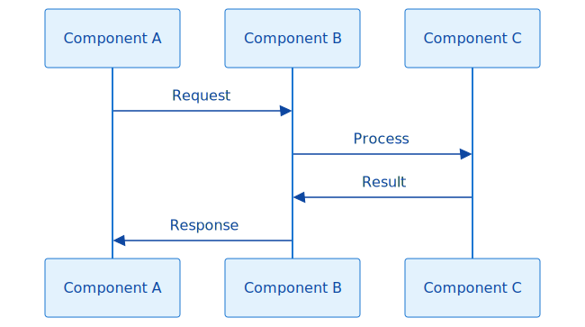

## Data Flow / Code Path


### Finding new units

```csharp
void FindNewUnits(IBot bot)
{
    var newUnits = World.ActorsHavingTrait<IPositionable>()
        .Where(a => a.Owner == Player &&
            !Info.ExcludeFromSquadsTypes.Contains(a.Info.Name) &&
            !activeUnits.Contains(a));

    foreach (var a in newUnits)
    {
        if (Info.AirUnitsTypes.Contains(a.Info.Name))
        {
            var air = GetSquadOfType(SquadType.Air);
            air ??= RegisterNewSquad(bot, SquadType.Air);
            air.Units.Add(a);
        }
        else if (Info.NavalUnitsTypes.Contains(a.Info.Name))
        {
            ...
        }
        else
            unitsHangingAroundTheBase.Add(a);

        activeUnits.Add(a);
    }
}
```

`activeUnits` is the global set of all units already assigned to the squad manager. New units are categorized by their YAML type lists.

### Creating an attack force

```csharp
void CreateAttackForce(IBot bot)
{
    var randomizedSquadSize = Info.SquadSize + World.LocalRandom.Next(Info.SquadSizeRandomBonus);

    if (unitsHangingAroundTheBase.Count >= randomizedSquadSize)
    {
        var attackForce = RegisterNewSquad(bot, SquadType.Assault);
        attackForce.Units.UnionWith(unitsHangingAroundTheBase);
        unitsHangingAroundTheBase.Clear();
    }
}
```

When enough idle ground units accumulate, they become a single assault squad.

### Ground squad state machine

The ground state machine has four states:

1. **Idle** — the squad has no valid target. It picks the closest enemy and decides whether to attack or flee.
2. **AttackMove** — the squad moves toward the target while trying to stay grouped.
3. **Attack** — the squad actively engages a visible enemy.
4. **Flee** — the squad retreats toward the base.

State transitions are driven by the fuzzy `CanAttack` result, target validity, and a 2.5-second movement timeout.

### Leader election

`GroundStateBase.Leader()` picks a squad leader:

```csharp
var leastCommonDenominator = units
    .Select(a => a.TraitOrDefault<Mobile>()?.Locomotor)
    .Where(l => l != null)
    .MinByOrDefault(l => l.Info.TerrainSpeeds.Count)
    ?.Info.TerrainSpeeds.Count;

if (leastCommonDenominator != null)
    units = units.Where(a => a.TraitOrDefault<Mobile>()?.Locomotor.Info.TerrainSpeeds.Count == leastCommonDenominator).ToList();

var centerPosition = units.Select(a => a.CenterPosition).Average();
return units.MinBy(a => (a.CenterPosition - centerPosition).LengthSquared);
```

The leader is the unit with the most restrictive locomotor (fewest terrain speeds) that is closest to the center. This reduces the chance that the squad will follow a unit that other members cannot path to.

### Target acquisition

```csharp
var closestEnemy = NewLeaderAndFindClosestEnemy(owner);
owner.SetActorToTarget(closestEnemy);
```

The squad manager finds the closest enemy actor that is visible, not a husk, and not in the ignored target type set. It returns both the actor and a small offset so that naval units can target a reachable cell near a land unit.


## Configuration (YAML)


### Squad configuration

```yaml
SquadManagerBotModule:
    ConstructionYardTypes: fact
    AirUnitsTypes: yak, mig, heli, orca, hind
    NavalUnitsTypes: ss, ca, dd, pt
    ExcludeFromSquadsTypes: mcv, harv
    SquadSize: 10
    SquadSizeRandomBonus: 5
    RushInterval: 2500
    AssignRolesInterval: 150
    AttackForceInterval: 250
    MinimumAttackForceDelay: 1000
    IdleScanRadius: 10
    AttackScanRadius: 12
    DangerScanRadius: 10
    IgnoredEnemyTargetTypes: Husk
```

### Targeting filters

- `IgnoredEnemyTargetTypes` — target types that the squad should ignore (e.g., husks).
- `DangerScanRadius` — range used when responding to attacks on the base.
- `IdleScanRadius` — range used when looking for enemies while idle.
- `AttackScanRadius` — range used when looking for enemies while attacking.

## Interconnectivity

- **Depends on:** [Part 8.1 — Bot Architecture and IBot](#file-chapters-Part_08_Chapter_01_IBot) (IBot/ModularBot), [Part 8.2 — Bot Modules](#file-chapters-Part_08_Chapter_02_Bot_Modules) (Bot Modules), [Part 1.1 — ECS, Actors, and Traits](#file-chapters-Part_01_Chapter_01_ECS) (Actor traits), [Part 1.3 — World, OrderManager, and Orders](#file-chapters-Part_01_Chapter_03_World_Orders) (Orders), [Part 2.4 — Rulesets, Actors, and Weapons](#file-chapters-Part_02_Chapter_04_Rules_Weapons) (rulesets and target types).
- **Used by:** [Part 8.4 — Bot Order Flow](#file-chapters-Part_08_Chapter_04_Order_Flow) (orders flow out of squad states), [Part 9.1 — OrderManager and Lockstep Foundation](#file-chapters-Part_09_Chapter_01_OrderManager) (orders are queued for lockstep execution).


## Algorithms


### Fuzzy attack/flee logic

`AttackOrFleeFuzzy` is a Mamdani fuzzy system with four inputs:

- `OwnHealth` — normalized health of the squad (0–100).
- `EnemyHealth` — normalized health of nearby enemies (0–100).
- `RelativeAttackPower` — own attack power divided by enemy attack power, scaled to 0–1000.
- `RelativeSpeed` — own speed divided by enemy speed, scaled to 0–1000.

And one output:

- `AttackOrFlee` — 0–50, where values below 30 mean attack and above 30 mean flee.

```csharp
public bool CanAttack(IReadOnlyCollection<Actor> ownUnits, IReadOnlyCollection<Actor> enemyUnits)
{
    ...
    var result = fuzzyEngine.Calculate(inputValues);
    attackChance = result[fuzzyEngine.OutputByName("AttackOrFlee")];
    return !double.IsNaN(attackChance) && attackChance < 30.0;
}
```

If `CanAttack` returns true, the squad transitions to attack/attack-move; otherwise it flees.

### Normalized health

```csharp
static float NormalizedHealth(IEnumerable<Actor> actors, int normalizeByValue)
{
    var sumOfMaxHp = 0;
    var sumOfHp = 0;
    foreach (var a in actors)
    {
        if (a.Info.HasTraitInfo<IHealthInfo>())
        {
            sumOfMaxHp += a.Trait<IHealth>().MaxHP;
            sumOfHp += a.Trait<IHealth>().HP;
        }
    }

    if (sumOfMaxHp == 0)
        return 0;

    return sumOfHp * 100 / sumOfMaxHp;
}
```

The fuzzy engine receives the average health of the group as a percentage.

### Relative power and speed

`RelativeAttackPower` and `RelativeSpeed` are computed from the aggregated firepower and movement speed of the squad versus the enemy. The exact formulas combine weapon DPS, range, and locomotor speed.

### Stuck-squad timeout

Both `GroundUnitsAttackMoveState` and `GroundUnitsAttackState` track the leader's last known location and the last target change. If neither changes for 63 ticks (~2.5 seconds), the squad drops back to `Idle` to find a new path or target:

```csharp
if (owner.World.WorldTick > lastUpdatedTick + 63)
{
    owner.FuzzyStateMachine.ChangeState(owner, new GroundUnitsIdleState());
    return;
}
```

This prevents expensive pathfinding loops when a squad is blocked.

### Regrouping

During `AttackMove`, if the squad is spread out, the leader stops and the stragglers are ordered to attack-move to the leader's cell:

```csharp
var ownUnits = owner.World.FindActorsInCircle(leader.CenterPosition, WDist.FromCells(owner.Units.Count) / 3)
    .Where(owner.Units.Contains).ToHashSet();

if (ownUnits.Count < owner.Units.Count)
{
    owner.Bot.QueueOrder(new Order("Stop", leader, false));
    var units = owner.Units.Where(a => !ownUnits.Contains(a)).ToArray();
    owner.Bot.QueueOrder(new Order("AttackMove", null, Target.FromCell(owner.World, leader.Location), false, groupedActors: units));
}
```

This keeps the squad cohesive before engaging.


## Extension Points


### Add a new squad type

Add a new value to `SquadType`, create states in `OpenRA.Mods.Common/Traits/BotModules/Squads/States/`, and add assignment logic in `FindNewUnits` and `CreateAttackForce`. For example, a "Stealth" squad type could be created for invisible hit-and-run units.

### Customize the fuzzy rules

`AttackOrFleeFuzzy` has a `Default` rule set and a more aggressive `Rush` rule set. Mods can create custom rule sets by constructing a new `AttackOrFleeFuzzy` with their own rule strings. However, the rule engine is currently hardcoded in C#, so a new bot personality cannot change rules purely through YAML.

### Add a new ground state

Subclasses of `GroundStateBase` implement `IState` and can be inserted into the state machine. For example, a "Harass" state could send small groups to attack resource harvesters and retreat.

### Adjust squad sizes and timing

All timing and sizing parameters are in YAML. A defensive AI could use smaller squads and a shorter `DangerScanRadius`, while an aggressive AI could use larger squads and a shorter `RushInterval`.

### Custom target selection

Override `SquadManagerBotModule.FindClosestEnemy` or add a new `FindEnemies` filter to change what the bot considers a valid target. The default filter ignores husks and invisible units.


## Common Pitfalls / Guardrails


- **No simulation state:** squad logic runs unsynced. It must issue orders to change state; it cannot modify actors directly.
- **Mixed locomotors:** the leader election heuristic helps, but a squad with wildly incompatible units (e.g., land and naval) can still fail to path together.
- **Fuzzy rule tuning:** changing the fuzzy rule strings can produce unexpected behaviors. Test carefully on a variety of unit matchups.
- **Squad size inflation:** a very large `SquadSize` can cause all units to sit at the base for a long time before attacking. A very small value can cause the AI to send units piecemeal.
- **Stuck squads:** the 2.5-second timeout is a safety net, not a pathfinding fix. If many squads get stuck, the pathfinding or map layout may need review.
- **Save/load:** squads are serialized via `IGameSaveTraitData`. Custom squad types must implement `Serialize`/`Deserialize` to survive savegames.

## What to read next

- [Part 8.2 — Bot Modules](#file-chapters-Part_08_Chapter_02_Bot_Modules) for how `SquadManagerBotModule` fits into the broader bot module architecture.
- [Part 8.4 — Bot Order Flow](#file-chapters-Part_08_Chapter_04_Order_Flow) for how squad states translate into `Order` objects.
- [Part 1.5 — Pathfinding and Movement](#file-chapters-Part_01_Chapter_05_Pathfinding_Movement) for the pathfinding and locomotor rules that affect squad movement.

## Summary

This chapter explains how a [bot](#file-appendices-Appendix_A_Glossary) turns produced units into effective combat forces through squads and fuzzy heuristics.

After reading this chapter, you should be able to:

- `SquadManagerBotModule.FindNewUnits()` scans the world for newly produced units that are not yet in `activeUnits`.
- Air and naval units are immediately added to their type-specific squads.
- Ground units are added to `unitsHangingAroundTheBase`.
- Every `AssignRolesInterval` ticks, `CreateAttackForce()` converts the idle pile into an `Assault` squad when it reaches `SquadSize`.
- Every `AttackForceInterval` ticks, squads are pushed onto `squadsPendingUpdate` and processed a few per tick.
- Each squad's `Update()` calls `FuzzyStateMachine.Update(this)`, which transitions states and issues orders.
- `CleanSquads()` removes dead units and empty squads.

If any of the concepts above feel unclear, review the relevant section before continuing. For source files and further reading, see the References section.


## References

- `OpenRA.Mods.Common/Traits/BotModules/SquadManagerBotModule.cs` — squad coordinator.
- `OpenRA.Mods.Common/Traits/BotModules/Squads/Squad.cs` — squad container.
- `OpenRA.Mods.Common/Traits/BotModules/Squads/AttackOrFleeFuzzy.cs` — fuzzy decision engine.
- `OpenRA.Mods.Common/Traits/BotModules/Squads/StateMachine.cs` — state machine.
- `OpenRA.Mods.Common/Traits/BotModules/Squads/States/GroundStates.cs` — ground/naval states.
- `OpenRA.Mods.Common/Traits/BotModules/Squads/States/AirStates.cs` — air states.
- `OpenRA.Mods.Common/Traits/BotModules/Squads/States/ProtectionStates.cs` — protection states.
- `mods/ra/rules/ai.yaml` — example squad configurations.


---

<a id="file-chapters-Part_08_Chapter_04_Order_Flow"></a>

<!-- --- FILE: chapters/Part_08_Chapter_04_Order_Flow.md --- -->

# Chapter 8.4 — Bot Order Flow {#file-chapters-Part_08_Chapter_04_Order_Flow}

## Purpose

This chapter focuses specifically on how [ModularBot](#file-appendices-Appendix_A_Glossary) and individual bot modules construct and issue [Order](#file-appendices-Appendix_A_Glossary) objects. It covers the path from a bot module decision through `IBot.QueueOrder` and `ModularBot.Tick` to `World.IssueOrder`, plus the throttling and visual-feedback suppression that are unique to bot orders. It intentionally does *not* re-explain the full lockstep pipeline or the complete field-by-field anatomy of an `Order`; for those, see [Part 9.1 — OrderManager and Lockstep Foundation](#file-chapters-Part_09_Chapter_01_OrderManager) and [Part 1.3 — World, OrderManager, and Orders](#file-chapters-Part_01_Chapter_03_World_Orders) respectively.

## Learning Objectives


After studying this chapter, you should be able to:

- Explain how bot orders enter the same lockstep pipeline as human orders.
- Describe the `Order` class fields and how they encode bot decisions.
- Trace an order from bot module construction through `ModularBot.QueueOrder` to `World.IssueOrder`.
- Understand `ModularBot`'s throttling logic and why it exists.
- Configure bot behavior indirectly through YAML-driven modules.
- Implement a new bot order that is compatible with the existing order pipeline.

## Files

| File | Responsibility |
| :---- | :---- |
| `OpenRA.Game/Network/Order.cs` | `Order` class, fields, serialization, named constructors. |
| `OpenRA.Game/Network/OrderManager.cs` | Receives and buffers orders per frame, sync hash checking. |
| `OpenRA.Game/World.cs` | `IssueOrder` wrapper around the order manager. |
| `OpenRA.Mods.Common/Traits/Player/ModularBot.cs` | Bot order queue and throttling. |
| `OpenRA.Mods.Common/Traits/BotModules/SquadManagerBotModule.cs` | Issues squad movement and attack orders. |
| `OpenRA.Mods.Common/Traits/BotModules/BaseBuilderBotModule.cs` | Issues building production and placement orders. |
| `OpenRA.Mods.Common/Traits/BotModules/UnitBuilderBotModule.cs` | Issues unit production orders. |
| `OpenRA.Mods.Common/Traits/BotModules/HarvesterBotModule.cs` | Issues harvest and dock orders. |
| `OpenRA.Mods.Common/Traits/SupportPowers/SupportPowerManager.cs` | Receives support power orders. |
| `OpenRA.Game/Network/UnitOrders.cs` | System-level order handlers (pause, handshake, game state). |
| `OpenRA.Game/Network/OrderIO.cs` | Low-level order packet read/write. |


## Architecture


### Order as the only cross-boundary message

```
[Bot Module] -> [Order] -> [ModularBot.QueueOrder] -> [ModularBot.Tick] -> [World.IssueOrder] -> [OrderManager] -> [Lockstep Pipeline] -> [Execution]
```

The `Order` class is the only object that leaves the unsynced bot module and enters the deterministic simulation. Everything about the bot's decision—the unit, the target, the command string—is encoded in this object. After `World.IssueOrder`, the order enters the same lockstep pipeline as a human order. For the full serialization, buffering, and frame-pacing details, see [Part 9.1 — OrderManager and Lockstep Foundation](#file-chapters-Part_09_Chapter_01_OrderManager).

### Order fields in bot modules

Bot modules populate the same `Order` fields that the UI order generators do. For the complete field definitions and their semantic meaning, see [Part 1.3 — World, OrderManager, and Orders](#file-chapters-Part_01_Chapter_03_World_Orders). The examples in the next section show how specific bot modules use those fields to encode a decision: for example, `TargetString` is set to the actor type to build, `ExtraData` often carries the production queue index, and `SuppressVisualFeedback` is set to true so bot orders do not spam selection brackets and target lines.


## Data Flow / Code Path


### Constructing an order in a module

Squad movement:

```csharp
owner.Bot.QueueOrder(new Order("AttackMove", null, owner.Target, false, groupedActors: owner.Units.ToArray()));
```

Building production:

```csharp
bot.QueueOrder(new Order("Build", factory, false)
{
    TargetString = buildingType,
    ExtraData = (uint)queueIndex
});
```

Unit production:

```csharp
bot.QueueOrder(new Order("StartProduction", factory, false)
{
    TargetString = unitType,
    ExtraData = (uint)queueIndex
});
```

Support power:

```csharp
bot.QueueOrder(new Order(sp.Key, supportPowerManager.Self, Target.FromCell(world, attackLocation.Value), false)
{
    SuppressVisualFeedback = true,
    ExtraData = uint.MaxValue
});
```

Each module constructs the exact `Order` that a human player would produce for the same action.

### Queuing in the bot

`ModularBot.QueueOrder` simply stores the order:

```csharp
void IBot.QueueOrder(Order order)
{
    orders.Enqueue(order);
}
```

### Throttling and issuing

During `ModularBot.Tick`, a subset of the queue is issued:

```csharp
var ordersToIssueThisTick = Math.Min((orders.Count + info.MinOrderQuotientPerTick - 1) / info.MinOrderQuotientPerTick, orders.Count);
for (var i = 0; i < ordersToIssueThisTick; i++)
    world.IssueOrder(orders.Dequeue());
```

`World.IssueOrder` forwards to the order manager:

```csharp
public void IssueOrder(Order o) { OrderManager.IssueOrder(o); }
```

At this point the bot order is indistinguishable from a human order. From here it follows the same lockstep path as human orders. For the exact serialization, server relay, ready check, and frame-pacing algorithm, see [Part 9.1 — OrderManager and Lockstep Foundation](#file-chapters-Part_09_Chapter_01_OrderManager).

### Execution

Once the lockstep pipeline delivers the order (see [Part 9.1 — OrderManager and Lockstep Foundation](#file-chapters-Part_09_Chapter_01_OrderManager) for the frame dispatch), `UnitOrders.ProcessOrder` resolves it by the `Subject` actor's traits or by the support power manager, exactly as it would be for a human order. For example, an `"AttackMove"` order with `GroupedActors` is resolved by the `AttackMove` [activity](#file-appendices-Appendix_A_Glossary) on each actor. See [Part 1.3 — World, OrderManager, and Orders](#file-chapters-Part_01_Chapter_03_World_Orders) for the order-to-trait dispatch path.


## Configuration (YAML)


There are no direct YAML controls for the order flow itself. However, the behavior that flows through orders is entirely YAML-driven:

- `SquadManagerBotModule` parameters decide when and how many orders are generated.
- `BaseBuilderBotModule` and `UnitBuilderBotModule` decide which actors are produced.
- `SupportPowerBotModule` decides which powers are ordered and when.

## Interconnectivity

- **Depends on:** [Part 8.1 — Bot Architecture and IBot](#file-chapters-Part_08_Chapter_01_IBot) (IBot and ModularBot), [Part 8.2 — Bot Modules](#file-chapters-Part_08_Chapter_02_Bot_Modules) (Bot Modules), [Part 8.3 — Bot Squads and Combat Heuristics](#file-chapters-Part_08_Chapter_03_Squads) (Squads), [Part 1.3 — World, OrderManager, and Orders](#file-chapters-Part_01_Chapter_03_World_Orders) (World, Orders, and OrderManager), [Part 9.1 — OrderManager and Lockstep Foundation](#file-chapters-Part_09_Chapter_01_OrderManager) (OrderManager and lockstep).
- **Used by:** [Part 9.1 — OrderManager and Lockstep Foundation](#file-chapters-Part_09_Chapter_01_OrderManager) (network orders are the bridge between bot and simulation), [Part 1.2 — Activity System](#file-chapters-Part_01_Chapter_02_Activities) (Activities execute the orders).


## Algorithms


### Grouped actor orders

For orders that affect multiple units, the `GroupedActors` array contains the selected actors. When the order is resolved, the engine iterates over the grouped actors and applies the command to each of them. This is how a squad attack-move is implemented:

```csharp
new Order("AttackMove", null, owner.Target, false, groupedActors: owner.Units.ToArray())
```

The subject is `null` because the order applies to the group, not a single actor.

### Order throttling

The throttling fraction is:

```csharp
var ordersToIssueThisTick = Math.Min((orders.Count + info.MinOrderQuotientPerTick - 1) / info.MinOrderQuotientPerTick, orders.Count);
```

This ensures that a large backlog of orders is issued over multiple ticks. For example, with `MinOrderQuotientPerTick = 5`, a queue of 100 orders issues at most 20 orders per tick.

### Visual feedback suppression

`SuppressVisualFeedback = true` tells the order resolver to skip target-line drawing and selection flash effects. This is important for bot orders so that observers do not see constant target lines from every bot action.


## Extension Points


### Add a new order command

Define a new order string and a handler. Order handlers can be implemented in traits (e.g., `IResolveOrder`) or in the support power manager. A bot module can then issue the order just like any other.

### Add a new bot module that issues orders

Any new module can call `bot.QueueOrder(new Order(...))`. The order will flow through the same pipeline as existing modules.

### Immediate orders

Set `IsImmediate = true` for orders that should not cross the lockstep pipeline and should be processed immediately. This is used for system orders such as chat, pause, and game saves. Most bot orders should not be immediate. See [Part 9.1 — OrderManager and Lockstep Foundation](#file-chapters-Part_09_Chapter_01_OrderManager) for the immediate-order path and the lockstep distinction.


## Common Pitfalls / Guardrails


- **Order subject must exist:** if the `Subject` actor dies before the order is executed, the order is dropped. Use `null` subject for group orders to avoid this.
- **Target validity:** a target that is invalid when the order executes (e.g., a dead actor) will cause the order to be ignored or produce an error. Modules should re-check targets when re-issuing orders.
- **Order latency:** an order issued in frame N is executed in frame N+1 or later. Bot modules must not assume immediate effect.
- **Desync risk:** bot orders must be deterministic on all clients. Do not include unsynced random values or client-only state in the order payload.
- **Suppress visual feedback:** always set `SuppressVisualFeedback = true` for bot orders to avoid visual clutter.
- **Queue order from the right thread:** `IBot.QueueOrder` is called from the bot tick. Do not call it from async callbacks or background threads.
- **Replay correctness:** because bot logic is disabled during replays, only the orders are replayed. If a bot order depends on unsynced state that was not deterministic, the replay may differ from the original game.

## What to read next

- [Part 1.3 — World, OrderManager, and Orders](#file-chapters-Part_01_Chapter_03_World_Orders) for the complete anatomy of an `Order` and the player order entry points.
- [Part 9.1 — OrderManager and Lockstep Foundation](#file-chapters-Part_09_Chapter_01_OrderManager) for the full lockstep buffering, serialization, and frame-pacing path.
- [Part 1.2 — Activity System](#file-chapters-Part_01_Chapter_02_Activities) for how orders become actor activities once they reach the simulation.
- [Part 8.1 — Bot Architecture and IBot](#file-chapters-Part_08_Chapter_01_IBot) for the broader `IBot` and `ModularBot` architecture.

## Summary

This chapter focuses on how bot modules construct [orders](#file-appendices-Appendix_A_Glossary) and how `[ModularBot](#file-appendices-Appendix_A_Glossary)` queues, throttles, and issues them through the same `World.IssueOrder` entry point as human orders. It does not cover the full field-by-field `Order` anatomy or the complete lockstep pipeline; those are the responsibilities of [Part 1.3 — World, OrderManager, and Orders](#file-chapters-Part_01_Chapter_03_World_Orders) and [Part 9.1 — OrderManager and Lockstep Foundation](#file-chapters-Part_09_Chapter_01_OrderManager) respectively.

If any of the concepts above feel unclear, review the relevant section before continuing. For source files and further reading, see the References section.


## References

- `OpenRA.Game/Network/Order.cs` — `Order` class and serialization.
- `OpenRA.Game/Network/OrderManager.cs` — order buffering and network transmission.
- `OpenRA.Game/Network/OrderIO.cs` — order packet format.
- `OpenRA.Game/Network/UnitOrders.cs` — system order handlers.
- `OpenRA.Game/World.cs` — `IssueOrder` wrapper.
- `OpenRA.Mods.Common/Traits/Player/ModularBot.cs` — bot order queue and throttling.
- `OpenRA.Mods.Common/Traits/BotModules/SquadManagerBotModule.cs` — squad order construction.
- `OpenRA.Mods.Common/Traits/BotModules/BaseBuilderBotModule.cs` — building orders.
- `OpenRA.Mods.Common/Traits/BotModules/UnitBuilderBotModule.cs` — unit production orders.
- `OpenRA.Mods.Common/Traits/SupportPowers/SupportPowerManager.cs` — support power order resolution.


---

<a id="file-chapters-Part_09_Chapter_01_OrderManager"></a>

<!-- --- FILE: chapters/Part_09_Chapter_01_OrderManager.md --- -->

# Chapter 9.1 — OrderManager and Lockstep Foundation {#file-chapters-Part_09_Chapter_01_OrderManager}

## Purpose

This chapter is the canonical reference for OpenRA's lockstep order pipeline. It explains how the `[OrderManager](#file-appendices-Appendix_A_Glossary)` paces the simulation: collecting local orders, separating immediate and normal orders, sending normal orders over the network, buffering remote orders per frame, and dispatching them once every client is ready. It also covers the synchronization machinery (`localOrders`, `localImmediateOrders`, `pendingOrders`, `NetFrameNumber`, `LocalFrameNumber`, sync hashes, and disconnect markers) that keeps every client deterministic. For the anatomy of the `Order` message and the player order entry points that feed this pipeline, see [Part 1.3 — World, OrderManager, and Orders](#file-chapters-Part_01_Chapter_03_World_Orders). For how bot modules construct and issue orders into the same pipeline, see [Part 8.4 — Bot Order Flow](#file-chapters-Part_08_Chapter_04_Order_Flow).

## Learning Objectives


After studying this chapter, you should be able to:

1. Explain the client-server lockstep model and why only orders cross the network.
2. Describe the purpose of `localOrders`, `localImmediateOrders`, `pendingOrders`, and `syncForFrame`.
3. Trace a local order from `World.IssueOrder` through serialization, sending, receiving, and processing.
4. Explain how `NetFrameNumber` and `LocalFrameNumber` pace the simulation and prevent one client from running ahead.
5. Contrast immediate orders with normal gameplay orders and give examples of each.
6. Describe how [sync hashes](#file-appendices-Appendix_A_Glossary) and defeat states are sent and compared to detect [desyncs](#file-appendices-Appendix_A_Glossary).
7. Explain how disconnect markers keep the simulation deterministic when a client leaves.


## Practical Example: Chat vs. Move in a Multiplayer Match


Consider two actions that happen at roughly the same moment during a multiplayer match: a chat message and a move order.

1. **Chat message.** The player types a message and presses Enter. The UI creates an `Order` with `OrderString = "Chat"` and `IsImmediate = true`. `OrderManager.IssueOrder` places it in `localImmediateOrders`.
2. **Immediate send.** `TickImmediate()` calls `SendImmediateOrders()` and the chat packet is sent to the server right away. `ReceiveAllOrdersAndCheckSync()` delivers the packet to all clients on the current frame.
3. **Immediate process.** `UnitOrders.ProcessOrder` handles the chat order, displaying the text in the in-game chat panel. Because the chat is immediate, it does not affect the lockstep simulation state.
4. **Move order.** The player right-clicks on the ground. The UI creates an `Order` with `OrderString = "Move"`, `IsImmediate = false`, and `Target` set to the destination cell.
5. **Local buffering.** `OrderManager.IssueOrder` places the move order in `localOrders` instead of `localImmediateOrders`.
6. **Frame-locked submission.** At the end of the net frame, `SendOrders()` serializes the move order and sends it to the server tagged with `NetFrameNumber`.
7. **Server relay.** The server forwards the move order to every other client. Each client stores it in `pendingOrders` keyed by the issuing client index and the frame number.
8. **Ready check.** Before advancing, `OrderManager` checks `IsReadyForNextFrame`. If any client has not yet submitted an order packet for the current frame, the simulation stalls.
9. **Lockstep execution.** Once all packets are present, `ProcessOrders()` dequeues each client's packet for the frame, calls `UnitOrders.ProcessOrder` for the move order, and increments `NetFrameNumber`.
10. **Sync verification.** After processing the frame, the client computes `World.SyncHash()` and a defeat-state bitmask, then sends them to the server via `Connection.SendSync`. The server compares them with the values from other clients; a mismatch triggers an out-of-sync warning.

This example shows how two superficially similar "player inputs" follow completely different paths: chat is immediate and visible, while movement is deterministic and replayable.

## Files

| File | Responsibility |
| :---- | :---- |
| `OpenRA.Game/Network/OrderManager.cs` | Central order buffering, frame pacing, sync hash verification. |
| `OpenRA.Game/Network/Order.cs` | `Order` object, serialization, deserialization. |
| `OpenRA.Game/Network/OrderIO.cs` | Order packet packing and unpacking. |
| `OpenRA.Game/Network/UnitOrders.cs` | System-level order handlers (pause, chat, game state, etc.). |
| `OpenRA.Game/Network/ReplayConnection.cs` | Replays saved orders as if they came from the network. |
| `OpenRA.Game/Network/Connection.cs` | Base network connection abstraction. |
| `OpenRA.Game/Server/Server.cs` | Server-side order relay and game state management. |
| `OpenRA.Game/Server/OrderBuffer.cs` | Server-side buffering of client orders per frame. |
| `OpenRA.Game/World.cs` | `IssueOrder` wrapper, `SyncHash` computation. |
| `OpenRA.Game/Sync.cs` | Sync hash generation for `ISync` objects and `RunUnsynced` guard. |


## Architecture


### Client-server lockstep

```
[Client A] --orders--> [Server] --orders--> [Client B]
[Client B] --orders--> [Server] --orders--> [Client A]
```

Every simulation frame, each client sends a packet containing its orders. The server collects packets from all clients and relays them. A client does not advance the simulation until it has received an order packet for the current frame from every other client. This is the **lockstep** model.

### OrderManager state

`OrderManager` maintains:

- `localOrders` — orders generated by the local player/bot this frame.
- `localImmediateOrders` — orders that are processed immediately (chat, pause, system).
- `pendingOrders` — per-client queues of order packets, indexed by frame.
- `syncForFrame` — remote sync hashes used to detect desyncs.
- `NetFrameNumber` — the next frame to execute.
- `LocalFrameNumber` — the next frame for which local orders will be sent.

### Frame pacing

The simulation runs at a fixed `World.Timestep` (usually 40 ms per frame). The order manager can run ahead of the simulation, but it will stall if it is waiting for orders from other clients. The `SuggestedTimestep` can be scaled by the server to slow down the game when clients are struggling.


## Data Flow / Code Path


> This section is the canonical explanation of the order lockstep, buffering, serialization, and frame-advance path. [Part 1.3 — World, OrderManager, and Orders](#file-chapters-Part_01_Chapter_03_World_Orders) and [Part 8.4 — Bot Order Flow](#file-chapters-Part_08_Chapter_04_Order_Flow) intentionally defer to this chapter for the full client-to-simulation details.

### Local order generation

When a player clicks or a bot ticks, the game calls `World.IssueOrder(order)`:

```csharp
public void IssueOrder(Order o) { OrderManager.IssueOrder(o); }
```

`OrderManager.IssueOrder` separates immediate and normal orders:

```csharp
public void IssueOrder(Order order)
{
    if (order.IsImmediate)
        localImmediateOrders.Add(order);
    else
        localOrders.Add(order);
}
```

### Sending orders

At the end of each net frame, the order manager sends the local orders to the server:

```csharp
void SendOrders()
{
    if (GameStarted && GameSaveLastFrame < NetFrameNumber && sentOrdersFrame < NetFrameNumber)
    {
        Connection.Send(NetFrameNumber, localOrders);
        localOrders.Clear();
        sentOrdersFrame = NetFrameNumber;
    }
}
```

The order packet is serialized using `Order.Serialize` and the bit-field flags from `OrderFields`.

### Receiving orders

The server sends back order packets tagged by frame and client. The client stores them:

```csharp
public void ReceiveOrders(int clientId, (int Frame, OrderPacket Orders) orders)
{
    if (pendingOrders.TryGetValue(clientId, out var queue))
        queue.Enqueue((orders.Frame, orders.Orders));
    else
        throw new InvalidDataException($"Received packet from disconnected client '{clientId}'");
}
```

### Ready check

A client is ready for the next frame only when it has received an order packet for the current frame from every other client:

```csharp
bool IsReadyForNextFrame => GameStarted && pendingOrders.All(p => p.Value.Count > 0);
```

Even if a client has no orders, it still sends an empty packet so that the other clients can advance.

### Order processing

When ready, the order manager processes all orders for the current frame:

After processing, the client sends its own sync hash and defeat state to the server for comparison.

### Sync hash verification

Remote sync hashes are compared in `ReceiveSync`:

```csharp
public void ReceiveSync((int Frame, int SyncHash, ulong DefeatState) sync)
{
    if (syncForFrame.TryGetValue(sync.Frame, out var s))
    {
        if (s.SyncHash != sync.SyncHash || s.DefeatState != sync.DefeatState)
            OutOfSync(sync.Frame);
    }
    else
        syncForFrame.Add(sync.Frame, (sync.SyncHash, sync.DefeatState));
}
```

If two clients disagree, the game is marked out of sync and typically cannot continue.


## Configuration (YAML)


There are no direct YAML controls for the OrderManager. However, the following settings influence it:

- `Game.Settings.Debug.SyncCheckUnsyncedCode` — whether `RunUnsynced` should verify sync hashes.
- `Game.Settings.Debug.SyncCheckBotModuleCode` — whether bot module code runs inside a sync check.
- `World.Timestep` — the simulation frame interval in milliseconds.

## Interconnectivity

- **Depends on:** [Part 1.3 — World, OrderManager, and Orders](#file-chapters-Part_01_Chapter_03_World_Orders) (World, OrderManager, and Orders), [Part 1.1 — ECS, Actors, and Traits](#file-chapters-Part_01_Chapter_01_ECS) (Actor traits), [Part 2.1 — MiniYaml Parser](#file-chapters-Part_02_Chapter_01_MiniYaml) (MiniYaml), [Part 8.4 — Bot Order Flow](#file-chapters-Part_08_Chapter_04_Order_Flow) (Bot Order Flow).
- **Used by:** [Part 9.2 — Server and Connection Layer](#file-chapters-Part_09_Chapter_02_Server_Connection) (Server/Connection), [Part 9.3 — Sync Hashing and Determinism](#file-chapters-Part_09_Chapter_03_Sync_Hashing) (Sync Hashing), [Part 1.2 — Activity System](#file-chapters-Part_01_Chapter_02_Activities) (Activities execute orders), [Part 8.1 — Bot Architecture and IBot](#file-chapters-Part_08_Chapter_01_IBot) (ModularBot uses orders).


## Algorithms


### Order packet serialization

`Order.Serialize` writes a compact binary packet:

1. Order name string.
2. `OrderFields` bit flags.
3. Subject actor ID (if `Subject` flag).
4. Target type and data (if `Target` flag).
5. Target string (if `TargetString` flag).
6. Queued flag (if set).
7. Extra actors, location, data (if respective flags set).
8. Grouped actors (if `Grouped` flag).

This format keeps the per-frame network traffic small.

### Network frame pacing

`OrderManager.TryTick` decides whether the simulation can advance:

```csharp
if (IsNetFrame)
{
    shouldTick = pendingOrders.All(p => p.Key == Connection.LocalClientId || p.Value.Count > 0);

    if (shouldTick)
        SendOrders();

    willTick = IsReadyForNextFrame;
}
```

If the local client is not ready, `willTick` is false and the simulation stalls.

### Disconnect handling

When a client disconnects, the server inserts a special disconnect marker for the next frame. All clients process `World.OnClientDisconnected(clientId)` on the same frame, keeping the simulation deterministic.

### Immediate orders

Immediate orders bypass the lockstep queue. They are sent and processed on the current frame. This is used for chat messages, pause toggles, and system commands that do not affect the deterministic simulation.


## Extension Points


### Add a new order handler

Order handlers are typically implemented as traits implementing `IResolveOrder` or as methods in `UnitOrders` for system commands. The order string is matched to the handler.

### Add a new order type

For most gameplay commands, the existing `OrderType.Fields` is sufficient. For system-level commands, you can add a new `OrderType` value and extend `Order.Serialize`/`Deserialize`. This is rarely needed.

### Custom network connection

Implement `IConnection` to replace the default network layer. This is how `ReplayConnection` replays saved games and how unit tests can simulate network traffic.

### Sync report generation

When `generateSyncReport` is true, the order manager records the state of every synced object each frame. This is used for debugging desyncs.


## Common Pitfalls / Guardrails


- **Deterministic execution:** every order must produce the same result on every client. Do not use `Game.CosmeticRandom` or `world.LocalRandom` in order resolution.
- **Order timing:** orders are processed at the beginning of the frame. The world state at that moment is the state all clients have.
- **Empty packets:** a client must send a packet even if it has no orders, or the other clients will stall.
- **Immediate orders:** do not mark gameplay orders as immediate, or they will bypass the lockstep and may cause desyncs.
- **Sync hash changes:** only fields marked with `[Sync]` or `[VerifySync]` contribute to the sync hash. If you add a state that affects gameplay, mark it appropriately.
- **Bot order isolation:** bot code runs unsynced via `Sync.RunUnsynced`. The orders it issues are the only sync-crossing data.

## What to read next

- [Part 9.2 — Server and Connection Layer](#file-chapters-Part_09_Chapter_02_Server_Connection) for the server-side relay and connection layer that sits behind `OrderManager`.
- [Part 9.3 — Sync Hashing and Determinism](#file-chapters-Part_09_Chapter_03_Sync_Hashing) for how `World.SyncHash()` is generated and compared.
- [Part 1.3 — World, OrderManager, and Orders](#file-chapters-Part_01_Chapter_03_World_Orders) for the anatomy of an `Order` and the player/bot entry points that feed this pipeline.
- [Part 8.4 — Bot Order Flow](#file-chapters-Part_08_Chapter_04_Order_Flow) for how bot modules construct and queue orders into `OrderManager`.

## Summary

This chapter is the canonical reference for OpenRA's lockstep order pipeline. It explains how OpenRA's [OrderManager](#file-appendices-Appendix_A_Glossary) coordinates the deterministic multiplayer lockstep loop: collecting, sending, buffering, and dispatching orders so that every client advances the simulation in perfect sync.

After reading this chapter, you should be able to:

- Explain the client-server lockstep model and why only orders cross the network.
- Describe the purpose of `localOrders`, `localImmediateOrders`, `pendingOrders`, and `syncForFrame`.
- Trace a local order from `World.IssueOrder` through serialization, sending, receiving, and processing.
- Explain how `NetFrameNumber` and `LocalFrameNumber` pace the simulation and prevent one client from running ahead.
- Contrast immediate orders with normal gameplay orders and give examples of each.
- Describe how [sync hashes](#file-appendices-Appendix_A_Glossary) and defeat states are sent and compared to detect [desyncs](#file-appendices-Appendix_A_Glossary).
- Explain how disconnect markers keep the simulation deterministic when a client leaves.

If any of the concepts above feel unclear, review the relevant section before continuing. For source files and further reading, see the References section.


## References

- `OpenRA.Game/Network/OrderManager.cs` — order coordination.
- `OpenRA.Game/Network/Order.cs` — order object and serialization.
- `OpenRA.Game/Network/OrderIO.cs` — packet I/O.
- `OpenRA.Game/Network/UnitOrders.cs` — system order handlers.
- `OpenRA.Game/Network/Connection.cs` — connection abstraction.
- `OpenRA.Game/Server/Server.cs` — server relay.
- `OpenRA.Game/Server/OrderBuffer.cs` — server-side buffering.
- `OpenRA.Game/World.cs` — sync hash and `IssueOrder`.
- `OpenRA.Game/Sync.cs` — sync hash generation and unsynced guards.


### External resources

- [OpenRA main site](https://www.openra.net)


---

<a id="file-chapters-Part_09_Chapter_02_Server_Connection"></a>

<!-- --- FILE: chapters/Part_09_Chapter_02_Server_Connection.md --- -->

# Chapter 9.2 — Server and Connection Layer {#file-chapters-Part_09_Chapter_02_Server_Connection}

## Purpose

The `[OrderManager](#file-appendices-Appendix_A_Glossary)` ([Part 9.1 — OrderManager and Lockstep Foundation](#file-chapters-Part_09_Chapter_01_OrderManager)) coordinates the client side of the [lockstep](#file-appendices-Appendix_A_Glossary) loop. The server and connection layer handles the actual network transport: accepting client connections, relaying order packets, recording replays, and managing game state transitions. This chapter covers the server architecture, the connection abstractions, and how packets are framed and dispatched.

## Learning Objectives


After studying this chapter, you should be able to:

- Explain the server roles: lobby host, order relay, sync aggregator, replay recorder, and game save manager.
- Describe the server trait system and how it allows custom server behavior.
- Trace the connection establishment and order packet framing process.
- Understand OrderBuffer scheduling and OrderLatency.
- Configure server settings, game speeds, and server traits in YAML.
- Implement a custom server trait for match commands or tournaments.

## Files

| File | Responsibility |
| :---- | :---- |
| `OpenRA.Game/Server/Server.cs` | Main server class: lobby, game start, order relay, game saves. |
| `OpenRA.Game/Server/Connection.cs` | Server-side connection wrapper. |
| `OpenRA.Game/Server/OrderBuffer.cs` | Buffers and schedules order packets per frame. |
| `OpenRA.Game/Network/Connection.cs` | Client-side `IConnection` implementations (`EchoConnection`, `NetworkConnection`). |
| `OpenRA.Game/Network/OrderIO.cs` | Low-level packet framing. |
| `OpenRA.Game/Network/ReplayConnection.cs` | Replays a recorded game as a fake connection. |
| `OpenRA.Game/Network/ReplayRecorder.cs` | Records game packets to a replay file. |
| `OpenRA.Game/Server/ProtocolVersion.cs` | Handshake protocol version constants. |
| `OpenRA.Game/Settings.cs` | Contains the nested `ServerSettings` class for server configuration (ports, name, dedicated mode, etc.). |
| `OpenRA.Game/Server/TraitInterfaces.cs` | Server trait interfaces (e.g., `IStartGame`, `IInterpretCommand`). |


## Architecture


### Server roles

The OpenRA server is a lightweight relay with some game-state awareness:

- **Lobby host:** validates clients, assigns player indices, enforces game settings, and synchronizes lobby state.
- **Order relay:** receives order packets from each client and forwards them to every other client.
- **Sync aggregator:** receives sync hashes from clients and forwards them so each client can detect desyncs.
- **Replay recorder:** records all dispatched packets so the game can be replayed later.
- **Game save manager:** stores game state so clients can resume a saved multiplayer game.

### Server trait system

The server uses a small trait system similar to the game world. [Server Traits](#file-appendices-Appendix_A_Glossary) are loaded from the mod manifest and implement interfaces such as `IStartGame`, `INotifySyncLobbyInfo`, and `IInterpretCommand`. This allows mods to add custom server behavior (e.g., match commands, auto-balance, tournaments) without modifying the core server.

### Client connection abstraction

`IConnection` is the client-side interface to the network:

```csharp
public interface IConnection : IDisposable
{
    int LocalClientId { get; }
    void StartGame();
    void Send(int frame, IEnumerable<Order> orders);
    void SendImmediate(IEnumerable<Order> orders);
    void SendSync(int frame, int syncHash, ulong defeatState);
    void Receive(OrderManager orderManager);
}
```

Two main implementations are provided:

- `NetworkConnection` — connects to a remote server over TCP.
- `EchoConnection` — local loopback used for single-player and skirmish games.

### Replay connection

`ReplayConnection` reads a recorded replay file and feeds the saved packets into the `OrderManager` as if they came from the network. This makes replays deterministic: the simulation is replayed from the same order stream.


## Data Flow / Code Path


### Connection establishment

1. The server listens on TCP sockets.
2. A client creates a `NetworkConnection` with the server's `ConnectionTarget`.
3. The client spins up connect threads for each endpoint and keeps the first successful connection.
4. After connecting, the server sends a handshake: protocol version and client ID.
5. The client enters the `Connected` state and starts a receive thread.

### Lobby setup and game start

The lobby is the phase between a successful handshake and the first simulation frame. It is coordinated by `Server` on the host side and mirrored in every client by `OrderManager` through a shared `LobbyInfo` state.

#### Lobby lifecycle

A typical lobby flows as follows:

1. **Create or join.** The host client selects "Create Game" and starts a local server, or a dedicated server is started from the command line. Other clients select "Join Game" and provide the server's address. See `OpenRA.Game/Server/Server.cs` for the server initialization path and `OpenRA.Game/Network/Connection.cs` for the client join path.
2. **Handshake and slot assignment.** After the TCP connection and protocol handshake, the server assigns a unique client index and broadcasts a `SyncLobbyInfo` order so every client sees the current list of players and slots. The server owns the authoritative `LobbyInfo`; clients apply updates sent by the server and may locally predict small changes such as selecting a color before the server confirms them.
3. **Map selection.** The host chooses a map from the map cache. The server validates the selected map by loading a `MapPreview` from the mod's map cache and checking that the map exists and is supported by the current mod and game version. Clients receive the map UID and metadata through the lobby sync; if a client does not have the map, the server may offer a map transfer via the `MapTransfer` server trait, or the client must download the map manually before the game can start.
4. **Game options.** The host sets game speed, crate frequency, starting units, and other mod-defined options. These are stored in `LobbyInfo.GlobalSettings` and synchronized with each lobby update. Clients render the options in the lobby UI but cannot change them unless the server grants them permission.
5. **Faction, team, and color selection.** Each client picks a faction, team, and color from the values allowed by the selected map and the server rules. The choices are sent to the server as lobby orders, validated (e.g., no duplicate color), and then broadcast. The server maps each client to a `Slot`; the slot determines the in-game player index, spawn point, and initial faction/team/color.
6. **Ready state.** Clients toggle a ready flag. The server may require all clients to be ready before starting, or the host may force a start. Bots are always considered ready.
7. **Game start.** When the start command is issued, the server transitions to `Launching`, runs `IStartGame` server traits, finalizes the `Session` data, and then broadcasts a `StartGame` order. Clients create a `[World](#file-appendices-Appendix_A_Glossary)` from the selected map and ruleset, and the server enters the `Playing` state. From this point on, orders are treated as simulation inputs and buffered by `OrderBuffer` for lock-step execution (see [Part 9.1 — OrderManager and Lockstep Foundation](#file-chapters-Part_09_Chapter_01_OrderManager)).

#### Lobby state machine

`Server` tracks the current phase of a multiplayer session through a small state machine. The main states are:

- **Waiting.** The server is accepting connections and clients can modify lobby settings. The server listens for new connections, validates orders such as `SyncLobbyInfo`, `SetTeam`, and `SetReady`, and periodically broadcasts the lobby state to all clients.
- **Launching.** The server has received a valid start command and is finalizing the session before the first frame. New clients are rejected during this state, and lobby changes are blocked. The server runs `IStartGame` traits and prepares the initial order stream so all clients begin the simulation deterministically.
- **Playing.** The game is running. The server no longer accepts lobby changes; instead, it relays simulation orders via `OrderBuffer` and forwards sync packets. Clients drive their local `World` with the orders they receive.
- **ShuttingDown.** The server is closing, either because the host quit, the game ended, or a fatal error occurred. Existing connections are closed and no new connections are accepted.


In the `Waiting` state, the server accepts connections and applies lobby changes. The `Launching` state locks the lobby and prepares the synchronized start. Once every client has created a `World` and the first frame begins, the server enters `Playing` and switches to relaying simulation orders. `ShuttingDown` ends the session and closes connections.

Key server traits that participate in the lobby are defined by the interfaces in `OpenRA.Game/Server/TraitInterfaces.cs` and implemented in `OpenRA.Game/Server/` and `OpenRA.Mods.Common/ServerTraits/`:

- `IStartGame` — called when the game is about to start; can finalize or reject the start.
- `INotifySyncLobbyInfo` — called when the lobby state is updated, allowing traits to enforce rules or inject additional state.
- `IInterpretCommand` — parses chat commands such as `/kick`, `/lock`, or `/start` and returns server orders that apply the result.
- `IClientJoined` — responds to a client joining before the game starts. (Client disconnects are handled by the server's connection-drop logic and `INotifyServerEmpty`, not a dedicated lobby trait.)

#### Slot and spawn assignment

The `Slot` class (`OpenRA.Game/Network/Session.cs`, nested `Slot` class) describes one playable position on the map. Each slot is tied to a `PlayerReference` from the map YAML and carries fields such as `PlayerReference`, `Closed`, `AllowBots`, `LockFaction`, `LockColor`, and `LockSpawn`. The client occupying a slot is a separate `Client` record whose `Slot` field holds the slot ID and which carries the per-player `Color`, `Faction`, `SpawnPoint`, and `Bot` values. A slot can be in one of several states:

| Slot state | Meaning |
| :---- | :---- |
| **Open** | Available for a human client to join. |
| **Occupied** | A human client has claimed the slot; the client's `Slot` field references this slot's ID in `LobbyInfo`. |
| **Bot** | The slot is filled by a bot; the occupying client's `Bot` field names the bot controller type. |
| **Closed** | The slot is disabled by the host and will not be used in the match. |
| **Spectator** | The client is not assigned to a slot; spectators observe the game and do not own actors. |

When a client claims a slot, the server sets that client's `Slot` field to the slot ID, assigns its `SpawnPoint`, and broadcasts the new lobby state. The spawn point for each player is derived from the map's `Spawn` actors and the slot order; the server does not send a separate spawn list but relies on every client resolving the same `SpawnPoint` index from the agreed slot assignment. Because the slot assignment is deterministic and synchronized before start, every client creates the same `Player` array in `World` and assigns actors to the same owners.

#### Map selection and validation

The map is the most important piece of shared state in the lobby. On the client side, `MapPreview` (`OpenRA.Game/Map/MapPreview.cs`) is a lightweight, cacheable summary of a map that includes the title, author, size, player count, spawn points, and a minimap thumbnail. On the server side, the host's map selection is converted to a `MapPreview` UID, and the server loads the full map rules to verify that the requested player count and slot layout match the connected clients.

When the host changes the map:

1. The server looks up the map UID in the mod map cache.
2. The server validates that the map supports the current number of human and bot players, that no required asset is missing, and that the map's ruleset version matches the mod.
3. The server sends a `SyncLobbyInfo` order containing the new map UID, title, and player-count information.
4. Each client checks whether it already has the map in its local cache. If not, the client requests the map data from the server using the `MapTransfer` order flow if the server supports it, or the client is forced to leave the lobby and acquire the map externally.
5. The game cannot start until every client has a validated copy of the selected map, because even tiny differences in map YAML or tile definitions would cause an immediate desync.

#### Chat and orders during the lobby

Lobby chat uses the same `Order` system as gameplay chat, but with `IsImmediate = true`. When a player types a message, the client creates a `Chat` order and sends it via `Connection.SendImmediate`. The server receives it, optionally runs it through `IInterpretCommand` traits (for slash commands), and forwards the chat order to all clients. Clients display the text in the lobby UI and, if the command was interpreted by the server, apply the resulting server orders such as `SetTeam` or `KickClient`.

Pre-game lobby actions are also represented as orders. Examples include:

- `SyncLobbyInfo` — server-to-client broadcast of the entire lobby state.
- `SetTeam` — a client asks to change team.
- `SetReady` — a client toggles ready state.
- `SetFaction` / `SetColor` — cosmetic and strategic choices assigned to a slot.
- `StartGame` — server-to-client signal that the world should be created.
- `MapTransfer` — server-to-client transfer of missing map data.

These orders are handled by `UnitOrders.ProcessOrder` on the client side, while the server validates them in `OpenRA.Game/Server/Server.cs` and the relevant server traits before relaying them.

### Order packet framing

Each packet sent over TCP is length-prefixed:

```csharp
ms.Write(packet.Length);
ms.Write(packet);
```

The receive thread reads the 4-byte length, then the payload bytes, then enqueues the packet for processing.

### Server order relay

When a client sends an order packet:

1. The server receives the length, client ID, and payload.
2. The server asks `OrderBuffer` to schedule the packet for the appropriate frame.
3. When the frame is due, the server dispatches the packet to every other client.
4. The server also records the packet in the replay recorder.

```csharp
public void DispatchOrdersToClients(Connection conn, int frame, byte[] data)
{
    var from = conn.PlayerIndex;
    var frameData = CreateFrame(from, frame, data);
    foreach (var c in Conns)
        if (c != conn)
            DispatchFrameToClient(c, from, frameData);

    RecordOrder(frame, data, from);
}
```

### Order latency

The server uses a fixed `OrderLatency` (in frames) to give all clients time to receive and process orders. At game start, the server injects empty order packets for the first few frames so the client can begin simulation immediately.

```csharp
for (var i = 0; i < OrderLatency; i++)
{
    from.LastOrdersFrame = firstFrame + i;
    var frameData = CreateFrame(from.PlayerIndex, from.LastOrdersFrame, []);
    foreach (var to in conns)
        DispatchFrameToClient(to, from.PlayerIndex, frameData);

    RecordOrder(from.LastOrdersFrame, [], from.PlayerIndex);
}
```

### OrderBuffer

`OrderBuffer` is the server-side scheduler. It keeps a per-client queue of incoming packets and releases them on the correct frame. This ensures that clients receive orders in the same order and at the same logical time.

### Sync packet relay

Sync packets are not sent as separate packets. Instead, they are bundled with the next order packet sent by the client:

```csharp
void Send(byte[] packet)
{
    var ms = new MemoryStream();
    ms.Write(packet.Length);
    ms.Write(packet);

    foreach (var s in queuedSyncPackets)
    {
        var q = OrderIO.SerializeSync(s);
        ms.Write(q.Length);
        ms.Write(q);
        sentSync.Enqueue(s);
    }

    queuedSyncPackets.Clear();
    ms.WriteTo(tcp.GetStream());
}
```

The server forwards these sync packets to all clients.

### Game save

When a game save is created, the server records the state and the current order stream. On restart, the server replays the saved orders up to the last sync frame and then resumes normal relay. This allows multiplayer campaigns or long games to be resumed.


## Configuration (YAML)


### Server settings

Server settings are loaded from `settings.yaml` and include:

- `Name` — server name shown in the lobby browser.
- `ListenPort` — TCP port(s) to listen on.
- `Dedicated` — whether the server runs in dedicated mode.
- `EnableSingleplayer` — allow single-player games hosted on the server.
- `EnableSyncReports` — forward detailed sync reports to clients.
- `EnableGameSaves` — allow multiplayer game saves.

### Game speed

Game speed is defined in the mod's `GameSpeeds` YAML:

```yaml
GameSpeeds:
    DefaultSpeed: normal
    Speeds:
        normal:
            Name: Normal
            Timestep: 40
            OrderLatency: 3
```

`Timestep` is the frame interval in milliseconds; `OrderLatency` is the number of frames the server buffers orders.

### Server traits

Server traits are declared in the mod manifest:

```yaml
ServerTraits:
    - OpenRA.Mods.Common.ServerTraits.PlayerMessageTracker
    - OpenRA.Mods.Common.ServerTraits.VoteKickTracker
    - OpenRA.Mods.Common.ServerTraits.MasterServerPinger
```

## Interconnectivity

- **Depends on:** [Part 9.1 — OrderManager and Lockstep Foundation](#file-chapters-Part_09_Chapter_01_OrderManager) (OrderManager, lockstep, and order relay), [Part 1.3 — World, OrderManager, and Orders](#file-chapters-Part_01_Chapter_03_World_Orders) (World, Order, and the order pipeline), [Part 2.1 — MiniYaml Parser](#file-chapters-Part_02_Chapter_01_MiniYaml) (MiniYaml for lobby and game settings), [Part 3.1 — Mod SDK and Project Structure](#file-chapters-Part_03_Chapter_01_Mod_SDK) (ModData and manifest).
- **Used by:** [Part 9.3 — Sync Hashing and Determinism](#file-chapters-Part_09_Chapter_03_Sync_Hashing) (sync packets are relayed), [Part 8.1 — Bot Architecture and IBot](#file-chapters-Part_08_Chapter_01_IBot) (bot orders are relayed like human orders), [Part 10.2 — Online Services and References](#file-chapters-Part_10_Chapter_02_Online_References) (multiplayer ecosystem).
- **Lobby flow:** The lobby lifecycle described in this chapter is the bridge between the connection handshake in `OpenRA.Game/Server/Server.cs` and the lockstep simulation in `OrderManager`. Slot assignment and map validation happen in the server; the resulting `StartGame` order triggers the `World` creation and order processing described in [Part 1.3 — World, OrderManager, and Orders](#file-chapters-Part_01_Chapter_03_World_Orders) and [Part 9.1 — OrderManager and Lockstep Foundation](#file-chapters-Part_09_Chapter_01_OrderManager).


## Algorithms


### Frame creation

`CreateFrame` wraps a client ID, frame number, and payload into a single byte array:

```csharp
void DispatchOrdersToClient(Connection c, int client, int frame, byte[] data)
{
    DispatchFrameToClient(c, client, CreateFrame(client, frame, data));
}
```

The frame format is read by `OrderIO` and `Order.Deserialize` on the client.

### Connection quality tracking

The server periodically sends `SyncConnectionQuality` orders to clients with ping and connection quality data. This is used by the UI to display latency indicators.

### Vote kick and chat

Server traits such as `VoteKickTracker` and `PlayerMessageTracker` handle chat commands and vote kicks. They interpret chat messages and dispatch server orders to enforce the result.

### Master server pinger

`MasterServerPinger` is a server trait that registers the server with the public master server list and periodically updates its status. This is how the in-game server browser discovers dedicated servers.


## Extension Points


### Add a server trait

Implement one of the server trait interfaces (e.g., `IStartGame`, `IInterpretCommand`, `INotifySyncLobbyInfo`) and register the trait in the mod manifest. The server will call it at the appropriate lifecycle points.

### Custom network connection

Implement `IConnection` to add a new transport (e.g., WebSockets, UDP-based protocol). The rest of the game does not need to change because `OrderManager` only depends on `IConnection`.

### Custom replay format

`ReplayRecorder` and `ReplayConnection` define the replay format. A custom replay format would require subclassing or replacing these, but the in-game replay format is well-established.

### Custom game save logic

`GameSave` is managed by the server. Mods can extend the saved state by adding server-side traits that participate in the save/load lifecycle.


## Common Pitfalls / Guardrails


- **Protocol version:** the server and client must agree on `ProtocolVersion.Handshake`. A mismatch causes immediate disconnect.
- **Order latency:** latency must be high enough to cover network jitter but low enough to feel responsive. Too low causes frequent stalls; too high adds input lag.
- **Empty packets:** clients require an order packet every frame, even if empty. The server must inject empty packets when a client has nothing to send.
- **Disconnect markers:** client disconnects are handled as special disconnect packets so all clients process the disconnect on the same frame.
- **Replay recording:** the server records packets it relays. If the server does not relay a packet (e.g., a direct server order), it must record it separately.
- **Dedicated server state:** dedicated servers have no local world; they only relay and record. They must not run simulation logic.

### Common lobby issues

- **Version mismatch.** The client and server must agree on `ProtocolVersion.Handshake` and the mod version. If a client joins with a different release, the server rejects the connection during the handshake. Keep all clients on the same mod and engine version.
- **Map not found.** If a client joins a lobby whose selected map is not in the local map cache, the client cannot start the game. The server may offer a map transfer if the `MapTransfer` server trait is enabled; otherwise, the client must download the map manually and rejoin.
- **Slot mismatch.** A map may not have enough slots for all human and bot players, or the host may have closed slots after a client joined. The server validates slot counts before starting and will refuse to launch until the configuration matches the map's player layout.
- **NAT / firewall blocking.** OpenRA uses direct TCP connections between clients and the server. If the server is behind NAT or a firewall without port forwarding, remote clients cannot connect. Dedicated servers typically need the `ListenPort` forwarded; local hosts can use UPnP or the OpenRA master server relay if available in the mod.
- **Player dropping before start.** If a ready player disconnects while the server is in the `Launching` state, the server may abort the start and return to `Waiting`, or it may fall back to a bot if the slot supports it. Hosts should confirm all players are stable before starting, especially on large maps or with many spectators.

## What to read next

- [Part 9.1 — OrderManager and Lockstep Foundation](#file-chapters-Part_09_Chapter_01_OrderManager) for the client-side lockstep loop that consumes server-relayed orders.
- [Part 9.3 — Sync Hashing and Determinism](#file-chapters-Part_09_Chapter_03_Sync_Hashing) for the sync packets the server forwards after each frame.
- [Part 10.2 — Online Services and References](#file-chapters-Part_10_Chapter_02_Online_References) for master server advertisement and server browser integration.

## Summary

This chapter explains the server and connection layer that transports [orders](#file-appendices-Appendix_A_Glossary) and game state between clients during a multiplayer match.

After reading this chapter, you should be able to:

- The server listens on TCP sockets.
- A client creates a `NetworkConnection` with the server's `ConnectionTarget`.
- The client spins up connect threads for each endpoint and keeps the first successful connection.
- After connecting, the server sends a handshake: protocol version and client ID.
- The client enters the `Connected` state and starts a receive thread.

If any of the concepts above feel unclear, review the relevant section before continuing. For source files and further reading, see the References section.


## References

- `OpenRA.Game/Server/Server.cs` — main server; lobby state machine, handshake, slot and map validation, order relay, and game start.
- `OpenRA.Game/Server/Connection.cs` — server-side connection wrapper.
- `OpenRA.Game/Network/Session.cs` — lobby `Client` metadata, `Slot` definitions, and spawn assignment.
- `OpenRA.Game/Player.cs` — runtime player object created after the game starts.
- `OpenRA.Game/Server/OrderBuffer.cs` — server-side order scheduling.
- `OpenRA.Game/Network/Connection.cs` — client-side `IConnection` implementations (`EchoConnection`, `NetworkConnection`).
- `OpenRA.Game/Network/OrderManager.cs` — client-side coordinator for lobby and in-game orders; see [Part 9.1 — OrderManager and Lockstep Foundation](#file-chapters-Part_09_Chapter_01_OrderManager).
- `OpenRA.Game/Network/Order.cs` — `Order` object, serialization, and immediate vs. gameplay orders.
- `OpenRA.Game/Network/OrderIO.cs` — packet framing.
- `OpenRA.Game/Network/UnitOrders.cs` — system-level order handlers for chat, lobby sync, and game state.
- `OpenRA.Game/Network/ReplayConnection.cs` — replay playback.
- `OpenRA.Game/Network/ReplayRecorder.cs` — replay recording.
- `OpenRA.Game/Server/ProtocolVersion.cs` — handshake protocol.
- `OpenRA.Game/Settings.cs` — nested `ServerSettings` class for server configuration.
- `OpenRA.Game/Server/TraitInterfaces.cs` — server trait interfaces (`IStartGame`, `IInterpretCommand`, `INotifySyncLobbyInfo`, etc.).
- `OpenRA.Mods.Common/ServerTraits/*.cs` — common server trait implementations (`LobbyCommands`, `MasterServerPinger`, `PlayerPinger`, `SkirmishLogic`).
- `OpenRA.Game/Server/` — additional server-side trackers such as `VoteKickTracker` and `PlayerMessageTracker`.
- `OpenRA.Game/Map/MapPreview.cs` — lightweight, cacheable map summary used by clients and the server for validation.


---

<a id="file-chapters-Part_09_Chapter_03_Sync_Hashing"></a>

<!-- --- FILE: chapters/Part_09_Chapter_03_Sync_Hashing.md --- -->

# Chapter 9.3 — Sync Hashing and Determinism {#file-chapters-Part_09_Chapter_03_Sync_Hashing}

## Purpose

OpenRA's multiplayer relies on deterministic simulation. Every client receives the same orders and runs the same code; therefore, every client should reach the same world state after each frame. **[Sync Hash](#file-appendices-Appendix_A_Glossary)** is the mechanism that verifies this: each client computes a hash of the synced world state and sends it to the server, which forwards it to all clients. If any client disagrees, the game has [desynced](#file-appendices-Appendix_A_Glossary). This chapter explains how the sync hash is computed, what it covers, and how to write sync-safe code.

## Learning Objectives


After studying this chapter, you should be able to:

- Explain why sync hashing is essential for deterministic multiplayer.
- Describe the ISync contract and how VerifySync fields contribute to the hash.
- Trace sync hash generation and comparison across clients.
- Use RunUnsynced to safely isolate non-deterministic code.
- Debug desyncs using sync reports.
- Add synced state to a trait correctly.

## Files

| File | Responsibility |
| :---- | :---- |
| `OpenRA.Game/Sync.cs` | Sync hash generation, `ISync` interface, `VerifySyncAttribute`, `RunUnsynced` guard. |
| `OpenRA.Game/World.cs` | `SyncHash()` aggregation over all synced world objects. |
| `OpenRA.Game/Network/OrderManager.cs` | Receives and compares remote sync hashes. |
| `OpenRA.Game/Traits/TraitsInterfaces.cs` | `ISync` marker interface. |
| `OpenRA.Game/Network/SyncReport.cs` | Detailed sync report generation for debugging desyncs. |
| `OpenRA.Game/Traits/Player/Shroud.cs` | Example of a synced trait. |
| `OpenRA.Game/Traits/Player/FrozenActorLayer.cs` | Example of synced state. |


## Architecture


### What contributes to the sync hash

The sync hash is a 32-bit XOR combination of hashes from every object that implements `[ISync](#file-appendices-Appendix_A_Glossary)`. The world iterates over all synced actors and traits and calls `Sync.Hash` on each. Typical synced objects include:

- Actor traits that implement `ISync`.
- Player traits such as `Shroud` and `FrozenActorLayer`.
- [World](#file-appendices-Appendix_A_Glossary) traits that implement `ISync`.
- Effects and projectiles that implement `ISync`.

Client-only state (camera position, audio, UI, selection) does not implement `ISync` and therefore does not affect the hash.

### The ISync contract

```csharp
public interface ISync { }

[AttributeUsage(AttributeTargets.Field | AttributeTargets.Property)]
public sealed class VerifySyncAttribute : Attribute { }
```

Any class implementing `ISync` and marking fields/properties with `[VerifySync]` contributes to the sync hash. The sync system generates an IL-based hash function at runtime for each type.

### Hash function generation

`Sync.GenerateHashFunc` creates a dynamic method that:

1. Casts the object to its concrete type.
2. Initializes a hash accumulator to 0.
3. For each `[VerifySync]` field, loads the field value and XORs it into the accumulator.
4. For each `[VerifySync]` property, calls the getter and XORs the value.
5. Returns the final hash.

The `EmitSyncOpcodes` method handles primitive types and custom hash functions for common OpenRA types:

```csharp
static void EmitSyncOpcodes(Type type, ILGenerator il)
{
    if (CustomHashFunctions.TryGetValue(type, out var hashFunction))
        il.EmitCall(OpCodes.Call, hashFunction, null);
    else if (type == typeof(bool))
        ...
    else if (type != typeof(int))
        throw new NotImplementedException(...);

    il.Emit(OpCodes.Xor);
}
```

Supported custom types include `int2`, `CPos`, `CVec`, `WDist`, `WPos`, `WVec`, `WAngle`, `WRot`, `Actor`, `Player`, and `Target`.

### World sync hash

`World.SyncHash()` aggregates the hashes of all synced objects in the world:

```csharp
public int SyncHash()
{
    var n = 0;
    foreach (var actor in syncHashes)
    {
        if (actor.IsInWorld)
            n += Sync.Hash(actor);
    }

    foreach (var t in syncHashesTraitSet)
    {
        var hash = Sync.Hash(t);
        n += hash;
    }

    return n;
}
```

The result is sent to the server every frame.


## Data Flow / Code Path


### Syncing during a frame

1. The order manager processes all orders for the frame.
2. After the simulation tick completes, the world state is updated.
3. `World.SyncHash()` is called.
4. The hash is sent to the server bundled with the next order packet.
5. The server forwards the hash to all clients.
6. Each client compares the received hash with the local hash for that frame.
7. If they differ, the game is marked out of sync.

### Remote sync comparison

```csharp
public void ReceiveSync((int Frame, int SyncHash, ulong DefeatState) sync)
{
    if (syncForFrame.TryGetValue(sync.Frame, out var s))
    {
        if (s.SyncHash != sync.SyncHash || s.DefeatState != sync.DefeatState)
            OutOfSync(sync.Frame);
    }
    else
        syncForFrame.Add(sync.Frame, (sync.SyncHash, sync.DefeatState));
}
```

The first client to report a hash stores it; subsequent clients are compared against it.

### Out of sync handling

When a desync is detected, the order manager:

1. Marks `IsOutOfSync = true`.
2. Dumps a sync report if sync reports are enabled.
3. Notifies the player that the game cannot continue reliably.


## Configuration (YAML)


There are no direct YAML controls for sync hashing, but the following settings matter:

- `Game.Settings.Debug.SyncCheckUnsyncedCode` — when true, `RunUnsynced` verifies the hash before and after the call.
- `Game.Settings.Debug.SyncCheckBotModuleCode` — when true, bot module ticks run inside a sync check.
- `LobbyInfo.GlobalSettings.EnableSyncReports` — enables detailed sync reports for debugging.

## Interconnectivity

- **Depends on:** [Part 1.1 — ECS, Actors, and Traits](#file-chapters-Part_01_Chapter_01_ECS) (Actor/Trait system), [Part 1.3 — World, OrderManager, and Orders](#file-chapters-Part_01_Chapter_03_World_Orders) (World/Orders), [Part 9.1 — OrderManager and Lockstep Foundation](#file-chapters-Part_09_Chapter_01_OrderManager) (OrderManager), [Part 9.2 — Server and Connection Layer](#file-chapters-Part_09_Chapter_02_Server_Connection) (Server/Connection).
- **Used by:** [Part 9.1 — OrderManager and Lockstep Foundation](#file-chapters-Part_09_Chapter_01_OrderManager) (OrderManager receives sync hashes), [Part 8.1 — Bot Architecture and IBot](#file-chapters-Part_08_Chapter_01_IBot) (bot code runs in `RunUnsynced`), and every trait that implements `ISync`.


## Algorithms


### Type-specific hash functions

The `CustomHashFunctions` dictionary provides stable hashes for common types:

```csharp
public static int HashCPos(CPos i2) => i2.Bits;
public static int HashActor(Actor a) => a != null ? (int)(a.ActorID << 16) : 0;
public static int HashPlayer(Player p) => p != null ? (int)(p.PlayerActor.ActorID << 16) * 0x567 : 0;
public static int HashTarget(Target t) => ...;
```

These are stable across platforms because they do not rely on default `GetHashCode` implementations that may vary.

### Bool hash

Booleans are hashed with distinct values:

```csharp
il.Emit(OpCodes.Ldc_I4, 0xaaa);
il.Emit(OpCodes.Brtrue, l);
il.Emit(OpCodes.Pop);
il.Emit(OpCodes.Ldc_I4, 0x555);
```

This ensures that `true` and `false` produce different and stable hash contributions.

### Unsynced code guard

`Sync.RunUnsynced` allows code that does not affect the simulation to run safely:

```csharp
public static T RunUnsynced<T>(bool checkSyncHash, World world, Func<T> fn)
{
    unsyncCount++;
    var sync = unsyncCount == 1 && checkSyncHash && world != null ? world.SyncHash() : 0;

    try
    {
        return fn();
    }
    finally
    {
        unsyncCount--;
        if (unsyncCount == 0 && checkSyncHash && world != null && !world.Disposing && sync != world.SyncHash())
            throw new InvalidOperationException("RunUnsynced: sync-changing code may not run here");
    }
}
```

The guard checks that the world sync hash did not change while running unsynced code. If it did, the code is not truly unsynced.

### Sync report generation

`SyncReport` records, for every synced object, the value of each `[VerifySync]` field. When a desync occurs, the report can be compared between clients to pinpoint the exact object and field that diverged.


## Extension Points


### Add synced state to a trait

1. Implement `ISync` on the trait class.
2. Mark the relevant fields/properties with `[VerifySync]`.
3. Ensure the field type is supported (int, bool, or a custom type in `CustomHashFunctions`).

Example:

```csharp
public class MySyncedTrait : ISync
{
    [VerifySync]
    public int Health;

    [VerifySync]
    public bool IsActive;
}
```

### Add custom hash support

If you need to sync a new struct type, add a custom hash function to `Sync.CustomHashFunctions` and make it stable across platforms. Do not use `GetHashCode` for structs unless you are certain it is deterministic.

### Debug desyncs

Enable `EnableSyncReports` in the lobby. After a desync, the game will generate a sync report. Compare the reports from two clients to find the first object whose hash differs.

### Mark code as unsynced

Use `Sync.RunUnsynced` to wrap code that reads world state but does not change it. This is useful for AI, UI, audio, and rendering. If the code accidentally mutates state, the sync check will catch it.


## Common Pitfalls / Guardrails


- **Do not use `GetHashCode` for custom types:** default .NET hash codes are not deterministic across platforms or runs. Use the custom hash functions in `Sync.cs`.
- **Floating point:** do not use `float` or `double` in synced state. Floating-point math can differ across CPUs and compilers. Use fixed-point math (`WPos`, `WDist`, `WAngle`, etc.).
- **Random sources:** only use `world.SharedRandom` inside simulation code. `world.LocalRandom` and `Game.CosmeticRandom` are for unsynced code.
- **Dictionaries and sets:** standard .NET dictionaries/sets have non-deterministic iteration order. Do not iterate over them in simulation code unless the order does not matter.
- **LINQ ordering:** ensure that any ordering in simulation code is stable. `OrderBy` with a non-unique key can produce non-deterministic order.
- **Culture:** string formatting and parsing can be culture-dependent. Use invariant culture when converting values that affect simulation.
- **Threading:** simulation code runs on a single thread. Do not spawn threads that touch simulation state.
- **Client-only code:** camera, audio, selection, and UI must not implement `ISync` and must not modify `ISync` state.
- **RunUnsynced reentry:** `RunUnsynced` can be nested. The sync hash check only runs at the outermost level.

## What to read next

- [Part 9.1 — OrderManager and Lockstep Foundation](#file-chapters-Part_09_Chapter_01_OrderManager) for where `World.SyncHash()` is sent and compared each frame.
- [Part 8.1 — Bot Architecture and IBot](#file-chapters-Part_08_Chapter_01_IBot) for how bot code is isolated from the sync hash using `RunUnsynced`.
- [Appendix D — Engine Conventions and Style](#file-appendices-Appendix_D_Engine_Conventions) for the full sync-safety coding guidelines.

## Summary

This chapter explains how OpenRA's sync-hash mechanism verifies that every client stays in lockstep during multiplayer games.

After reading this chapter, you should be able to:

- Casts the object to its concrete type.
- Initializes a hash accumulator to 0.
- For each `[VerifySync]` field, loads the field value and XORs it into the accumulator.
- For each `[VerifySync]` property, calls the getter and XORs the value.
- Returns the final hash.

If any of the concepts above feel unclear, review the relevant section before continuing. For source files and further reading, see the References section.


## References

- `OpenRA.Game/Sync.cs` — sync hash generation and guards.
- `OpenRA.Game/World.cs` — `SyncHash()` aggregation.
- `OpenRA.Game/Network/OrderManager.cs` — sync hash comparison.
- `OpenRA.Game/Network/SyncReport.cs` — sync report debugging.
- `OpenRA.Game/Traits/TraitsInterfaces.cs` — `ISync` interface.
- `OpenRA.Game/Traits/Player/Shroud.cs` — example synced trait.
- `OpenRA.Game/Traits/Player/FrozenActorLayer.cs` — example synced state.


---

<a id="file-chapters-Part_10_Chapter_01_Official_Mods"></a>

<!-- --- FILE: chapters/Part_10_Chapter_01_Official_Mods.md --- -->

# Chapter 10.1 — Official Mods {#file-chapters-Part_10_Chapter_01_Official_Mods}

## Purpose

OpenRA ships with four official [mods](#file-appendices-Appendix_A_Glossary) that demonstrate the engine's capabilities and serve as reference implementations: **Red Alert** (`ra`), **Tiberian Dawn** (`cnc`), **Dune 2000** (`d2k`), and **Tiberian Sun** (`ts`). This chapter describes the structure, content, and unique features of each official mod, and how they can be used as templates for new mods.

## Learning Objectives


After studying this chapter, you should be able to:

- Describe the four official OpenRA mods and their unique features.
- Explain how official mods inherit from the shared common mod.
- Understand the structure of mod manifests, content installers, and maps.
- Configure AI personalities, game speeds, and tile sets in YAML.
- Use an official mod as a template for a new mod.
- Identify common pitfalls when modifying official mod content.

## Files

| File | Responsibility |
| :---- | :---- |
| `mods/ra/mod.yaml` | Red Alert manifest. |
| `mods/cnc/mod.yaml` | Tiberian Dawn manifest. |
| `mods/d2k/mod.yaml` | Dune 2000 manifest. |
| `mods/ts/mod.yaml` | Tiberian Sun manifest. |
| `mods/ra*/` directories | Red Alert and its content installer. |
| `mods/cnc*/` directories | Tiberian Dawn and its content installer. |
| `mods/d2k*/` directories | Dune 2000 and its content installer. |
| `mods/ts*/` directories | Tiberian Sun and its content installer. |
| `mods/common/` | Shared chrome, assets, traits, and widgets. |
| `mods/common-content/` | Shared content installer assets. |
| `mods/ra/maps/`, `mods/cnc/maps/`, etc. | Built-in maps and missions. |


## Architecture


### Shared common mod

The `mods/common/` directory contains assets, rules, [traits](#file-appendices-Appendix_A_Glossary), chrome, and widgets shared by all official mods. Each official mod inherits from `common` by mounting it and referencing its files. The content installers (`mods/ra-content/`, `mods/cnc-content/`, etc.) handle downloading or extracting original game assets.

### Official mod inheritance

Each official mod declares its dependencies and assets in `mod.yaml`. For example:

```yaml
RequiresMods:
    common: {APP_VERSION}
```

This makes the mod a child of `common`, allowing it to override specific files while reusing the rest.

### Mod-specific code

Official mods have dedicated C# assemblies:

- `OpenRA.Mods.Cnc` — C&C-specific traits, sprites, video, and audio loaders.
- `OpenRA.Mods.D2k` — Dune 2000-specific traits (e.g., building on sand, spice, sandworms).
- `OpenRA.Mods.TS` — Tiberian Sun-specific traits (e.g., isometric terrain, jumpjets, voxels).

Red Alert uses `OpenRA.Mods.Common` plus a few C&C-specific features for some assets.


## Data Flow / Code Path


### Mod loading

When a player selects a mod, the engine loads its `mod.yaml`, mounts its packages, and creates a `ModData` object. The `ModData` loads the rules, sequences, chrome, and other assets declared in the [Manifest](#file-appendices-Appendix_A_Glossary).

### Content installer

Before an official mod can run, it may need original game assets. The content installer (`mods/*-content/`) checks for the required files and offers to download or copy them. The installer is itself a YAML-defined screen with C# logic.

### Map loading

Official mods ship with built-in maps in `mods/*/maps/`. Multiplayer maps are loaded from the map cache. Missions are single-player or cooperative maps with Lua scripts.

### Mission scripts

Many single-player missions use [Lua scripts](#file-appendices-Appendix_A_Glossary) for objectives, triggers, and cinematics. These are stored in `mods/*/maps/<mission-name>/` alongside the map data.


## Configuration (YAML)


### Official mod manifest examples

Each official mod has a `mod.yaml` that defines:

- `Metadata` — title, version, website.
- `RequiresMods` — parent mod (usually `common`).
- `FileSystem` — package mounts.
- `MapFolders` — map search paths.
- `Rules`, `Weapons`, `Sequences`, `Cursors`, `Chrome`, `ChromeLayout`, `Voices`, `Notifications`, `Music`, `[TileSets](#file-appendices-Appendix_A_Glossary)`, `FluentMessages`.
- `Assemblies` — mod-specific DLLs.
- `Loaders` — format loaders.

### Tile sets

Each mod defines its own tile sets:

- `ra` — temperate, snow, desert, interior.
- `cnc` — temperate, winter, desert.
- `d2k` — arrakis.
- `ts` — temperate, snow, urban, etc.

### Game speeds

Each mod defines game speeds in `mods/*/rules/misc.yaml` or similar:

```yaml
GameSpeeds:
    DefaultSpeed: normal
    Speeds:
        normal:
            Name: Normal
            Timestep: 40
            OrderLatency: 3
```

## Interconnectivity

- **Depends on:** [Part 3.1 — Mod SDK and Project Structure](#file-chapters-Part_03_Chapter_01_Mod_SDK) (mod.yaml and manifest), [Part 3.3 — Build Pipeline and Packaging](#file-chapters-Part_03_Chapter_03_Build_Packaging) (build and packaging), [Part 2.1 — MiniYaml Parser](#file-chapters-Part_02_Chapter_01_MiniYaml) (MiniYaml), [Part 6.3 — Virtual File System](#file-chapters-Part_06_Chapter_03_VFS) (VFS for mod assets), [Part 6.1 — Lua Scripting and Eluant](#file-chapters-Part_06_Chapter_01_Lua_Eluant) (Lua scripts), [Part 2.2 — Manifest and Mod Metadata](#file-chapters-Part_02_Chapter_02_Manifest) (maps).
- **Used by:** [Part 10.2 — Online Services and References](#file-chapters-Part_10_Chapter_02_Online_References) (online references point to official mods), [Part 10.3 — Porting, Modding, and Developer Workflows](#file-chapters-Part_10_Chapter_03_Port_And_Modding) (porting guides use official mods as source).


## Algorithms


### Asset extraction

The content installer reads installer definitions in YAML (e.g., `downloads.yaml`) to know which original game files are needed and where to obtain them. It can download from the OpenRA mirrors or extract from a local installation/CD.

### Mission objective system

`MissionObjectiveProperties` and `MissionObjective` are Lua-exposed classes that track primary and secondary objectives. Missions add objectives via Lua and mark them as completed or failed.

### AI personalities

Official mods define AI bot configurations in YAML under the `Player` actor:

```yaml
Player:
    ModularBot:
        ...
    SquadManagerBotModule:
        ...
```

Each mod has different default values for squad sizes, attack intervals, and unit types.

### Mod-specific rendering

- `TS` uses `EnableDepthBuffer` for isometric terrain and buildings.
- `TS` supports voxel models for some units.
- `D2k` uses `SpriteAlpha` for spice bloom overlays.
- `Cnc` and `D2k` use custom building placement logic.


## Extension Points


### Create a new official-style mod

Copy an official mod directory, rename it, update `mod.yaml`, and replace assets and rules. Use `RequiresMods` to inherit from `common` or from another mod.

### Add a new faction

Add a faction entry in the `Faction` world trait YAML and add faction-specific actors or palettes.

### Add custom missions

Create a map in `mods/<mod>/maps/`, add a Lua script, and define mission objectives. Reference the mission in `mod.yaml` under `Missions`.

### Add custom AI

Copy the `Player` actor definition from an official mod and adjust the bot modules and their parameters. Define multiple AI personalities by varying the YAML.

### Add custom content installer

Create a `mods/<mod>-content/` directory with `installer.yaml` and `downloads.yaml`. Define the required files and download sources.


## Common Pitfalls / Guardrails


- **Asset dependencies:** official mods require original game assets. Make sure the content installer is configured correctly.
- **Mod version:** the `RequiresMods` version must match the engine version.
- **Map compatibility:** `SupportsMapsFrom` controls which mods can load a map. Make sure maps are compatible with the mod's tile sets and rules.
- **Common mod overrides:** when overriding files from `common`, list them after the common entries in `mod.yaml`.
- **Mission scripts:** Lua scripts are not validated by `make test` unless the map is included in the test list. Test missions manually.
- **TS isometric rendering:** Tiberian Sun uses a different coordinate system and depth buffer. Mods based on TS should understand the isometric pipeline.
- **D2k tile rules:** Dune 2000 has unique terrain rules (buildable sand, rock, spice). Modifying these can break the building and harvester logic.

## What to read next

- [Part 3.1 — Mod SDK and Project Structure](#file-chapters-Part_03_Chapter_01_Mod_SDK) for how manifests and `ModData` are structured.
- [Part 10.3 — Porting, Modding, and Developer Workflows](#file-chapters-Part_10_Chapter_03_Port_And_Modding) for practical workflows when using an official mod as a template.
- [Appendix E — Practical Modding Recipes](#file-appendices-Appendix_E_Practical_Recipes) for copy-paste examples based on the official mods.

## Summary

This chapter describes the four official OpenRA [mods](#file-appendices-Appendix_A_Glossary) — Red Alert, Tiberian Dawn, Dune 2000, and Tiberian Sun — and how they serve as reference implementations.

If any of the concepts above feel unclear, review the relevant section before continuing. For source files and further reading, see the References section.


## References

- `mods/ra/mod.yaml` — Red Alert manifest.
- `mods/cnc/mod.yaml` — Tiberian Dawn manifest.
- `mods/d2k/mod.yaml` — Dune 2000 manifest.
- `mods/ts/mod.yaml` — Tiberian Sun manifest.
- `mods/common/mod.yaml` — Common mod manifest.
- `mods/*-content/installer.yaml` — content installer definitions.
- `OpenRA.Mods.Cnc/` — C&C-specific code.
- `OpenRA.Mods.D2k/` — Dune 2000-specific code.
- `OpenRA.Mods.TS/` — Tiberian Sun-specific code.


---

<a id="file-chapters-Part_10_Chapter_02_Online_References"></a>

<!-- --- FILE: chapters/Part_10_Chapter_02_Online_References.md --- -->

# Chapter 10.2 — Online Services and References {#file-chapters-Part_10_Chapter_02_Online_References}

## Purpose

OpenRA includes several online services: the master server browser, LAN advertisement, player authentication, replay metadata, and map download. This chapter explains how the game discovers, lists, and connects to servers, and how it interacts with the OpenRA web services.

## Learning Objectives


After studying this chapter, you should be able to:

- Explain the online services: master server, LAN advertisement, authentication, map download, and replay upload.
- Describe the WebServices global mod data and its endpoints.
- Trace server advertisement, server list fetch, and map download flows.
- Configure server and client settings for online play.
- Implement custom [server traits](#file-appendices-Appendix_A_Glossary) or custom web service endpoints.
- Understand server compatibility checks and joinability requirements.

## Files

| File | Responsibility |
| :---- | :---- |
| `OpenRA.Mods.Common/WebServices.cs` | Global mod data for web service endpoints (master server, replays, map download, badges). |
| `OpenRA.Mods.Common/ServerTraits/MasterServerPinger.cs` | Advertises servers to the master server and LAN. |
| `OpenRA.Game/Network/GameServer.cs` | `GameServer` data class for server listings. |
| `OpenRA.Game/Network/GameServer.cs` | `GameClient` data class for players in a server. |
| `OpenRA.Mods.Common/Widgets/Logic/ServerListLogic.cs` | Multiplayer server browser UI logic. |
| `OpenRA.Game/Network/Session.cs` | Lobby session and client data. |
| `OpenRA.Game/ExternalMods.cs` | Installed mod registry for server compatibility. |
| `OpenRA.Game/Network/Connection.cs` | Network connection used to join servers. |
| `OpenRA.Game/Map/MapCache.cs` | Map download and cache management; queries remote map details. |
| `OpenRA.Mods.Common/Widgets/Logic/Lobby/MapPreviewLogic.cs` | UI logic for map download progress and installation. |
| `OpenRA.Game/Server/Server.cs` | Dedicated server that advertises itself. |


## Architecture


### Master server

The master server is a web service that maintains a list of public game servers. A dedicated or hosted server pings the master server periodically with its status. The client fetches the list and displays it in the multiplayer browser.

### LAN advertisement

Servers can also advertise on the local network using a UDP beacon (`BeaconLib`). Clients on the same LAN can see these games without going through the master server.

### Server listing fields

The `GameServer` class contains:

- `Name` — server name.
- `Address` — `ip:port`.
- `Mod` / `Version` — mod ID and version.
- `Map` — current map UID.
- `State` — waiting/playing/completed.
- `MaxPlayers` — total slots.
- `Protected` — password protected.
- `Authentication` — requires forum authentication.
- `Clients` — list of players.
- `DisabledSpawnPoints` — spawn points disabled by the host.
- `Location` — GeoIP-resolved location.

### Server compatibility

When a client receives a server list, it checks each entry against `Game.ExternalMods` to determine if the [mod](#file-appendices-Appendix_A_Glossary) and version are installed. If not, the server may be joinable after mod switching or map download.

### Web service endpoints

`WebServices` is a global mod data object that stores URLs:

- `ServerAdvertise` — master server ping endpoint.
- `ServerList` — master server list endpoint.
- `MapRepository` — map download endpoint.
- `ReplayServer` — replay upload endpoint.
- `BadgeRepository` — player badge endpoint.


## Data Flow / Code Path


### Server advertisement

```csharp
public void Tick(S server)
{
    if (!server.IsMultiplayer)
        return;

    if ((server.Settings.AdvertiseOnline || server.Settings.AdvertiseOnLocalNetwork)
        && !isBusy && ((lastChanged > lastPing && Game.RunTime - lastPing > RateLimitInterval) || isInitialPing))
    {
        var gs = new GameServer(server);
        if (server.Settings.AdvertiseOnline)
            UpdateMasterServer(server, gs.ToPOSTData(false));

        if (server.Settings.AdvertiseOnLocalNetwork && lanGameBeacon != null)
            lanGameBeacon.BeaconData = gs.ToPOSTData(true);

        lastPing = Game.RunTime;
    }
}
```

### Master server ping

```csharp
void UpdateMasterServer(S server, string postData)
{
    isBusy = true;
    Task.Run(async () =>
    {
        var endpoint = server.ModData.GetOrCreate<WebServices>().ServerAdvertise;
        var client = HttpClientFactory.Create();
        var response = await client.PostAsync(endpoint, new StringContent(postData));
        var masterResponseText = await response.Content.ReadAsStringAsync();
        ...
        isBusy = false;
    });
}
```

### Server list fetch

The server browser UI (`ServerListLogic`) fetches the server list from the master server endpoint, parses each entry into a `GameServer`, and displays them grouped by mod. The client can query server details and join compatible games.

### Map download

If a server is running a map the client does not have, the client can download it from the map repository. `MapDownload` performs the HTTP request and adds the map to the `MapCache`.

### Replay upload

After a game, the replay file can be uploaded to the replay server. The server stores metadata (`ReplayMetadata`) such as players, map, duration, and mod.


## Configuration (YAML)


### Web services

```yaml
WebServices:
    ServerAdvertise: https://master.openra.net/games
    ServerList: https://master.openra.net/games
    MapRepository: https://resource.openra.net/map/
    ReplayServer: https://replay.openra.net/
```

### Server settings

```yaml
ServerSettings:
    Name: My OpenRA Server
    ListenPort: 1234
    AdvertiseOnline: true
    AdvertiseOnLocalNetwork: true
    RequireAuthentication: false
    Password: ""
```

### Client settings

```yaml
Game:
    AllowDownloading: true
    FilterGamesInServerList: false
```

## Interconnectivity

- **Depends on:** [Part 3.1 — Mod SDK and Project Structure](#file-chapters-Part_03_Chapter_01_Mod_SDK) (global mod data), [Part 3.3 — Build Pipeline and Packaging](#file-chapters-Part_03_Chapter_03_Build_Packaging) (packaging), [Part 6.4 — Crypto Utilities and Player Authentication](#file-chapters-Part_06_Chapter_04_Crypto) (crypto for authentication), [Part 9.2 — Server and Connection Layer](#file-chapters-Part_09_Chapter_02_Server_Connection) (server network), [Part 2.2 — Manifest and Mod Metadata](#file-chapters-Part_02_Chapter_02_Manifest) (maps and map cache).
- **Used by:** [Part 10.1 — Official Mods](#file-chapters-Part_10_Chapter_01_Official_Mods) (official mods use the master server), [Part 9.2 — Server and Connection Layer](#file-chapters-Part_09_Chapter_02_Server_Connection) (server advertises), [Part 4.3 — Widgets and Chrome](#file-chapters-Part_04_Chapter_03_Widgets) (server browser UI).


## Algorithms


### Server compatibility check

```csharp
var externalKey = ExternalMod.MakeKey(Mod, Version);
if (Game.ExternalMods.TryGetValue(externalKey, out var external) && external.Version == Version)
    IsCompatible = true;

var mapAvailable = Game.Settings.Game.AllowDownloading || Game.ModData.MapCache[Map].Status == MapStatus.Available;
IsJoinable = IsCompatible && State == 1 && mapAvailable;
```

A server is joinable only if the mod is installed (or switchable) and the map is available (or downloadable).

### Rate-limited pings

The master server pinger waits at least 1 second between pings and sends a full ping every 3 minutes to prevent the advertisement from expiring.

### LAN beacon

`BeaconLib.Beacon` broadcasts a UDP packet on the LAN with a game identifier and payload. Clients listen for beacons from `OpenRALANGame`.

### GeoIP resolution

The server uses the GeoIP database to resolve the location of connected clients. This is used for the server list's location column.


## Extension Points


### Run a custom master server

Change `ServerAdvertise` and `ServerList` in `WebServices` to point to your own server listing service. The POST format is defined by `GameServer.ToPOSTData`.

### Add custom server traits

Implement server trait interfaces such as `INotifyServerStart` and `ITick` to add custom server behavior, such as auto-kick, tournaments, or stats collection.

### Custom map repository

Host a map repository compatible with the OpenRA map download API and set `MapRepository` in `WebServices`.

### Custom replay server

Host a replay upload endpoint and set `ReplayServer` in `WebServices`. Implement replay upload logic in a server trait or post-game UI.


## Common Pitfalls / Guardrails


- **Master server rate limits:** do not ping too frequently. The built-in rate limit is 1 second minimum and 3 minutes maximum TTL.
- **Server name blacklist:** the master server may reject servers with inappropriate names. Error codes are shown in the server console.
- **Port forwarding:** advertising online requires the server's port to be reachable from the internet. The master server returns an error if it cannot connect.
- **Mod compatibility:** clients must have the exact mod version. Minor differences prevent joining.
- **Map download:** ensure `AllowDownloading` is enabled and the map repository is reachable. Large maps may take time to download.
- **Authentication:** requiring authentication limits the server to players with forum accounts. Use `ProfileIDWhitelist` for private tournaments.
- **LAN beacon:** LAN games may not be visible across subnets or VPNs. The beacon uses UDP broadcast.

## What to read next

- [Part 9.2 — Server and Connection Layer](#file-chapters-Part_09_Chapter_02_Server_Connection) for the underlying server and connection layer that online services use.
- [Part 3.1 — Mod SDK and Project Structure](#file-chapters-Part_03_Chapter_01_Mod_SDK) for how `WebServices` is declared as global mod data.
- [Part 10.1 — Official Mods](#file-chapters-Part_10_Chapter_01_Official_Mods) for the official mod structure that configures these services.

## Summary

This chapter explains how OpenRA discovers and connects to servers, authenticates players, and downloads maps and replays through its online services.

If any of the concepts above feel unclear, review the relevant section before continuing. For source files and further reading, see the References section.


## References

- `OpenRA.Mods.Common/WebServices.cs` — web service endpoints.
- `OpenRA.Mods.Common/ServerTraits/MasterServerPinger.cs` — server advertisement.
- `OpenRA.Game/Network/GameServer.cs` — server listing data.
- `OpenRA.Mods.Common/Widgets/Logic/ServerListLogic.cs` — server browser UI.
- `OpenRA.Game/Map/MapCache.cs` — map cache and remote map queries.
- `OpenRA.Mods.Common/Widgets/Logic/Lobby/MapPreviewLogic.cs` — map download/install UI logic.
- `OpenRA.Game/FileFormats/ReplayMetadata.cs` — replay metadata.


---

<a id="file-chapters-Part_10_Chapter_03_Port_And_Modding"></a>

<!-- --- FILE: chapters/Part_10_Chapter_03_Port_And_Modding.md --- -->

# Chapter 10.3 — Porting, Modding, and Developer Workflows {#file-chapters-Part_10_Chapter_03_Port_And_Modding}

## Purpose

This chapter provides practical guidance for developers and modders who want to extend OpenRA, port assets from the original games, or create new [mods](#file-appendices-Appendix_A_Glossary). It covers the recommended workflows, common tools, debugging techniques, and migration paths.

## Learning Objectives


After studying this chapter, you should be able to:

1. Set up a new mod project using the OpenRA [Mod SDK](#file-appendices-Appendix_A_Glossary) template.
2. Use the most common [Utility Commands](#file-appendices-Appendix_A_Glossary) (`--check-yaml`, `--check-missing-sprites`, `--extract`, `--map`, etc.).
3. Port original-game assets through the content installer or the `--extract` command.
4. Create a custom C# [trait](#file-appendices-Appendix_A_Glossary) and register it in a mod assembly.
5. Add a new [sequence](#file-appendices-Appendix_A_Glossary) and reference it from an actor's render traits.
6. Debug desyncs, read log files, and use the in-game debug overlays.
7. Package a mod for release using the SDK packaging scripts.
8. Compare the official mod, SDK mod, and common mod project structures and choose the right starting point.
9. Avoid the most common modding mistakes by following the pitfalls checklist.


## Mental Model


A new modder is building a pipeline. Every custom unit is the answer to five questions:

1. **What is it?** — the actor definition (`RECON`).
2. **What does it shoot?** — the weapon definition (`ReconGun`).
3. **What does it look like?** — the sequence definition (`recon`).
4. **How is it built?** — the build queue and the production building that provides it.
5. **Does it work?** — YAML validation and an in-game test.

Your job as a modder is to walk this pipeline in order. Start with the actor, add the weapon it needs, add the sequence it displays, place it in a build queue, then validate and launch. If any link in the chain is missing, the unit will not appear, will not fire, or will crash on load. This mental model is the fastest way to diagnose mistakes.

For more on the data formats, see [Part 2.1 — MiniYaml Parser](#file-chapters-Part_02_Chapter_01_MiniYaml), [Part 2.4 — Rulesets, Actors, and Weapons](#file-chapters-Part_02_Chapter_04_Rules_Weapons), and [Appendix B — Common YAML Patterns](#file-appendices-Appendix_B_Common_YAML_Patterns).

## Practical Example: From zero to first custom unit


Suppose you want to create a small mod named `cameo` that reuses the OpenRA engine but introduces one custom unit.

1. **Clone the SDK template and set up the project.**
   ```bash
   git clone https://github.com/OpenRA/OpenRA-Mod-SDK.git cameo
   cd cameo
   # Windows
   make.cmd all
   # Linux / macOS
   make all
   ```
   The template downloads the pinned engine, compiles the mod assembly, and produces a working launcher. If the build succeeds, you can already run `./launch-game.sh` and see the default SDK mod menu.

2. **Choose an identity and inherit from the common mod.** Edit `mod.yaml`:
   ```yaml
   Metadata:
       Title: Cameo
       Version: {VERSION}
       Author: Your Name

   RequiresMods:
       common: {APP_VERSION}
   ```
   Inherit from the common mod by including its rules, sequences, weapons, chrome, and audio files so you do not have to redeclare every template. See [Part 3.1 — Mod SDK and Project Structure](#file-chapters-Part_03_Chapter_01_Mod_SDK) and [Part 3.2 — Mod SDK Bootstrap](#file-chapters-Part_03_Chapter_02_SDK_Bootstrap) for the full SDK layout.

3. **Port or create an asset.** Obtain a sprite file `cameo/bits/recon.shp` either by extracting it from an original game archive with `./utility.sh ra --extract` or by creating a new PNG sequence and converting it with `--png-sheet` or `--convert-shp`. Also place `reconicon.shp` in the same folder. For the art pipeline, see [Part 4.1 — Renderer, Sheet, and Sprite](#file-chapters-Part_04_Chapter_01_Renderer).

4. **Define a custom weapon.** Create `cameo/weapons/recon.yaml`:
   ```yaml
   ReconGun:
       ReloadDelay: 15
       Range: 4c0
       Report: gun11
       Projectile: InstantHit
       Warhead@1Dam: SpreadDamage
           Spread: 32
           Damage: 1500
           Versus:
               None: 100
               Wood: 50
               Light: 100
               Heavy: 25
               Concrete: 25
   ```
   Register it under `Weapons:` in `mod.yaml`:
   ```yaml
   Weapons:
       common|weapons/smallcaliber.yaml
       cameo|weapons/recon.yaml
   ```
   The weapon name (`ReconGun`) is what the actor's `Armament` trait will reference. For weapon syntax, see [Part 2.4 — Rulesets, Actors, and Weapons](#file-chapters-Part_02_Chapter_04_Rules_Weapons).

5. **Define a custom unit.** In `cameo/rules/recon.yaml`, add a concrete actor that can be built, move, see, and fight:
   ```yaml
   RECON:
       Inherits: ^Vehicle
       Inherits@GAIN: ^GainsExperience
       Inherits@AUTOTARGET: ^AutoTargetGroundAssaultMove
       Buildable:
           Queue: Vehicle
           BuildPaletteOrder: 330
           Prerequisites: ~vehicles.allies, ~techlevel.low
       Valued:
           Cost: 600
       Tooltip:
           Name: Recon Buggy
       Health:
           HP: 15000
       Armor:
           Type: Light
       Mobile:
           Speed: 200
           Locomotor: wheeled
       RevealsShroud:
           Range: 7c0
       Armament:
           Weapon: ReconGun
           LocalOffset: 0,0,128
       AttackFrontal:
           FacingTolerance: 0
       WithFacingSpriteBody:
       RenderSprites:
           Image: recon
       Voiced:
           VoiceSet: VehicleVoice
   ```
   `Armament` points at the custom `ReconGun` weapon defined in the previous step. See [Part 2.1 — MiniYaml Parser](#file-chapters-Part_02_Chapter_01_MiniYaml) for indentation and inheritance rules.

6. **Add the sequence and register the files.** In `cameo/sequences/recon.yaml`, reference the sprite:
   ```yaml
   recon:
       Defaults:
           Filename: recon.shp
       idle:
           Facings: 32
           UseClassicFacings: True
       icon:
           Filename: reconicon.shp
   ```
   Then list the new files in `cameo/mod.yaml`:
   ```yaml
   Rules:
       cameo|rules/recon.yaml
   Sequences:
       cameo|sequences/recon.yaml
   Weapons:
       cameo|weapons/recon.yaml
   ```
   The sequence key (`recon`) must match the `RenderSprites.Image` value.

7. **Add the unit to a build queue.** The `Buildable.Queue: Vehicle` line on the actor places it in the vehicle production queue. Make sure that queue is provided by a production building. If you are inheriting from an official mod, the `Vehicle` queue already exists. If you are building the queue from scratch, add a `Production` trait to a building such as:
   ```yaml
   VEHICLEFACTORY:
       Inherits: ^Building
       Production:
           Queue: Vehicle
       ProvidesPrerequisite:
           Prerequisite: vehicles.allies
   ```
   Then verify the `Buildable.Prerequisites` on `RECON` are satisfied by that building.

8. **Validate YAML.** Run the utility checks in order:
   ```bash
   ./utility.sh cameo --check-yaml
   ./utility.sh cameo --check-missing-sequences
   ./utility.sh cameo --check-missing-sprites
   ```
   The first command catches syntax errors, missing parents, and broken trait references; the others confirm that the actor references existing sequences and sprite files.

9. **Run locally.** Start the mod with:
   ```bash
   ./launch-game.sh Game.Mod=cameo
   ```
   Use the F12 debug menu to show actor bounds and terrain grid while testing the new unit.

10. **Debug issues.** If the unit does not appear, check `Logs/debug.log` for trait load errors, `Logs/graphics.log` for sprite problems, and `Logs/perf.log` for frame-time issues. If you later add a Lua mission, check `Logs/lua.log` for script errors.

11. **Package.** When the mod is ready, run the SDK packaging scripts (`make version` and platform-specific scripts) to produce Windows, Linux, and macOS installers.

This example shows the complete workflow from a blank mod project to a validated, playable, and packageable custom unit.

## Files

| File | Responsibility |
| :---- | :---- |
| `OpenRA.Utility` / `utility.sh` | Command-line tool for modding tasks (YAML checks, lint, asset conversion). |
| `OpenRA.Launcher` / `launch-game.sh` | Development launcher. |
| `mods/common/mod.yaml` | Reference common mod manifest. |
| `mods/*/mod.yaml` | Official mod manifests for reference. |
| `OpenRA.Game/Traits/TraitsInterfaces.cs` | Trait interface reference. |
| `OpenRA.Game/Graphics/SequenceSet.cs` | Sequence format reference. |
| `OpenRA.Mods.Common/UtilityCommands/*.cs` | Utility command implementations. |
| `OpenRA.Mods.Common/Traits/*.cs` | Common trait reference implementations. |
| `OpenRA.Mods.Common/Scripting/Global/*.cs` | Lua global reference. |
| `OpenRA.Mods.Common/Scripting/Properties/*.cs` | Lua property reference. |


## Architecture


### SDK setup from scratch

If you are starting a new mod, the recommended path is the OpenRA Mod SDK rather than forking the engine.

1. **Clone the SDK template.**
   ```bash
   git clone https://github.com/OpenRA/OpenRA-Mod-SDK.git my-mod
   cd my-mod
   ```
   The template contains a small working mod, packaging scripts, and a `mod.config` file.

2. **Choose an identity.** Edit `mod.yaml` and set:
   ```yaml
   Metadata:
       Title: My Mod
       Version: {VERSION}
       Author: Your Name
   ```
   The `Title` is what players see in the launcher and the server browser.

3. **Pin the engine.** In `mod.config`, set:
   ```bash
   ENGINE_VERSION=playtest-20240628
   ```
   The SDK download scripts fetch this exact engine tag and place it in a sibling directory. Pinning the version keeps your mod reproducible and makes it easy to bump the engine later by changing one value and running `make all` again.

4. **Inherit from the common mod.** Add to `mod.yaml`:
   ```yaml
   RequiresMods:
       common: {APP_VERSION}
   ```
   Also include the common mod's rules, sequences, weapons, and chrome files so you do not have to redeclare every trait. Most SDK mods start as a thin layer on top of `common` or one of the official mods.

5. **Build once.** Run `make all` (Linux/macOS) or `make.cmd all` (Windows). This downloads the pinned engine, compiles the mod assembly, and produces a working launcher. If the build succeeds, you can run `./launch-game.sh` and see the default mod menu.

6. **Create your own directories.** Add folders such as `my-mod/rules/`, `my-mod/sequences/`, `my-mod/audio/`, `my-mod/bits/`, and `my-mod/chrome/`. Register them in `mod.yaml` under `Rules:`, `Sequences:`, `ChromeLayout:`, etc.

### Developer workflow

A typical OpenRA development workflow looks like this:

<!-- DEV-NOTE [tooling]: Microsoft .NET SDK: https://dotnet.microsoft.com — required to build the OpenRA engine and mod projects. -->
1. **Set up the repository** — clone the engine, install the .NET SDK, run `make all`.
2. **Run the game** — use `launch-game.sh Game.Mod=ra` to launch a specific mod.
3. **Edit YAML** — modify rules, sequences, weapons, or chrome in a mod directory.
4. **Validate** — run `make test` or `./utility.sh <mod> --check-yaml`.
5. **Test in-game** — launch the mod and verify the changes.
6. **Debug** — use logging, debug overlays, and the in-game console.
7. **Package** — use `make version` and the platform packaging scripts.

### Modder workflow

A modder using the Mod SDK:

1. **Create a mod project** from the SDK template.
2. **Define `mod.yaml`** — inherit from an official mod or `common`.
3. **Add assets** — sprites, audio, maps, and tile sets.
4. **Write YAML rules** — actors, weapons, traits, missions.
5. **Add custom code** if needed — new C# traits in a mod assembly.
6. **Test locally** — run the mod launcher.
7. **Build releases** — use the SDK packaging scripts.

### Mod structure comparison

| Structure | What it is | Best for | Key files |
| :---- | :---- | :---- | :---- |
| **Official mod** (`mods/ra`, `mods/cnc`, etc.) | Lives inside the engine repository and is built with the engine. | Engine contributors who change both gameplay and engine code. | `mod.yaml`, `rules/`, `sequences/`, `audio/`, `chrome/`, `maps/` under `mods/<mod>/`. |
| **SDK mod** | Separate repository that references a pinned engine and the common mod. | Modders who want stable engine upgrades and a clean project. | `mod.yaml`, `mod.config`, `makefile`, packaging scripts, plus `rules/`, `sequences/`, etc. |
| **Common mod** (`mods/common`) | Shared traits, chrome, assets, and utilities used by official mods and many SDK mods. | Reusing existing UI, effects, or gameplay logic without copying it. | `mods/common/mod.yaml`, `mods/common/rules/`, `mods/common/sequences/`, `mods/common/chrome/`, `mods/common/audio/`. |

Most new mods should start as an SDK mod that depends on `common`. This gives you the smallest project footprint and the smoothest upgrade path when the engine releases new playtests.


## Data Flow / Code Path


### First custom unit walkthrough

This walkthrough assumes an SDK mod called `my-mod` that depends on the common mod.

1. **Create the actor definition.** In `my-mod/rules/vehicles.yaml`, add a concrete vehicle:
   ```yaml
   RECON:
       Inherits: ^Vehicle
       Inherits@GAINSEXPERIENCE: ^GainsExperience
       Inherits@AUTOTARGET: ^AutoTargetGroundAssaultMove
       Buildable:
           Queue: Vehicle
           BuildPaletteOrder: 330
           Prerequisites: ~vehicles.allies, ~techlevel.low
       Valued:
           Cost: 600
       Tooltip:
           Name: Recon Buggy
       Health:
           HP: 15000
       Armor:
           Type: Light
       Mobile:
           Speed: 160
           Locomotor: wheeled
       RevealsShroud:
           Range: 7c0
       Armament:
           Weapon: M1Carbine
           LocalOffset: 0,0,128
       AttackFrontal:
           FacingTolerance: 0
       WithFacingSpriteBody:
       AutoTarget:
           ScanRadius: 7
       RenderSprites:
           Image: recon
       Voiced:
           VoiceSet: VehicleVoice
   ```

2. **Add the sequence.** In `my-mod/sequences/vehicles.yaml`, reference the sprite file:
   ```yaml
   recon:
       Defaults:
           Filename: recon.shp
       idle:
           Facings: 32
           UseClassicFacings: True
       icon:
           Filename: reconicon.shp
   ```

3. **Place the asset.** Put `recon.shp` and `reconicon.shp` in `my-mod/bits/` or a VFS path that the mod loads. The sequence key (`recon`) must match the `RenderSprites.Image` value.

4. **Register the rules and sequence files.** In `my-mod/mod.yaml`, ensure the files are listed:
   ```yaml
   Rules:
       my-mod|rules/defaults.yaml
       my-mod|rules/vehicles.yaml
   Sequences:
       my-mod|sequences/vehicles.yaml
   ```

5. **Validate.** Run `./utility.sh my-mod --check-yaml` and `./utility.sh my-mod --check-missing-sequences`. The first command catches inheritance and syntax errors; the second confirms `RECON` references an existing sequence.

6. **Test.** Launch with `./launch-game.sh Game.Mod=my-mod`, build the unit from the vehicle queue, and verify it moves, fires, and displays its icon.

7. **Iterate.** If the unit does not appear, check `debug.log` for trait load errors and `graphics.log` for missing sprite references. If the build button is missing, check `Buildable.Queue` and `BuildPaletteOrder`.

### Before/After: Minimal vs. Full Actor Definition

This walkthrough adds a full, playable vehicle in one step. The comparison below shows the same actor as a bare skeleton and as the final, buildable unit.

**Before — minimal skeleton:**

```yaml
RECON:
    Inherits: ^Vehicle
    RenderSprites:
        Image: recon
    WithFacingSpriteBody:
```

**After — full walkthrough actor:**

```yaml
RECON:
    Inherits: ^Vehicle
    Inherits@GAINSEXPERIENCE: ^GainsExperience
    Inherits@AUTOTARGET: ^AutoTargetGroundAssaultMove
    Buildable:
        Queue: Vehicle
        BuildPaletteOrder: 330
        Prerequisites: ~vehicles.allies, ~techlevel.low
    Valued:
        Cost: 600
    Tooltip:
        Name: Recon Buggy
    Health:
        HP: 15000
    Armor:
        Type: Light
    Mobile:
        Speed: 160
        Locomotor: wheeled
    RevealsShroud:
        Range: 7c0
    Armament:
        Weapon: M1Carbine
        LocalOffset: 0,0,128
    AttackFrontal:
        FacingTolerance: 0
    WithFacingSpriteBody:
    AutoTarget:
        ScanRadius: 7
    RenderSprites:
        Image: recon
    Voiced:
        VoiceSet: VehicleVoice
```

The skeleton is only enough to render the actor, while the full version adds economy, production, combat, and voice behavior.

### Utility commands

Common utility commands:

- `--check-yaml` — loads the mod and reports YAML errors.
- `--check-explicit-interfaces` — verifies trait interface implementations.
- `--check-conditional-trait-interface-overrides` — validates conditional trait overrides.
- `--check-missing-sprites` — reports missing sprite references.
- `--check-missing-sequences` — reports missing sequence references.
- `--check-referenced-sequences` — validates sequence references.
- `--extract` — extracts assets from original game files.
- `--png-sheet` — creates a sprite sheet from PNG images.
- `--convert-shp` — converts images to SHP format.
- `--map` — creates or modifies maps.
- `--man-page` — generates a man page.

### Launch arguments

```bash
./launch-game.sh Game.Mod=ra
./launch-game.sh Game.Mod=ra Launch.Connect=127.0.0.1:1234
./launch-game.sh Game.Mod=ra Launch.World=mods/ra/maps/my-map.oramap
```

### Debug overlays

The in-game debug menu (F12) can show:

- Terrain grid.
- Pathfinding cost field.
- Actor bounds.
- Screen map partitions.
- Sync reports.

### Logging

OpenRA uses a log system with channels such as `debug`, `server`, `lua`, `audio`, `graphics`, `map`. Logs are written to `Logs/` in the engine directory.


## Configuration (YAML)


### Mod development manifest

A minimal mod.yaml for development:

```yaml
Metadata:
    Title: My Mod
    Version: {VERSION}

RequiresMods:
    common: {APP_VERSION}

FileSystem:
    LoadScreen: DefaultLoadScreen

MapFolders:
    my-mod|maps: Container

Rules:
    my-mod|rules/defaults.yaml
    my-mod|rules/vehicles.yaml

Assemblies:
    my-mod|OpenRA.Mods.MyMod.dll
```

### Development settings

`settings.yaml` can enable developer features:

```yaml
Debug:
    SyncCheckUnsyncedCode: true
    SyncCheckBotModuleCode: true
    DeveloperMode: true
```

## Interconnectivity

- **Depends on:** [Part 1.1 — ECS, Actors, and Traits](#file-chapters-Part_01_Chapter_01_ECS) (ECS/trait lifecycle), [Part 2.1 — MiniYaml Parser](#file-chapters-Part_02_Chapter_01_MiniYaml) (MiniYaml), [Part 2.4 — Rulesets, Actors, and Weapons](#file-chapters-Part_02_Chapter_04_Rules_Weapons) (rulesets and weapons), [Part 3.1 — Mod SDK and Project Structure](#file-chapters-Part_03_Chapter_01_Mod_SDK) (mod SDK), [Part 3.2 — Mod SDK Bootstrap](#file-chapters-Part_03_Chapter_02_SDK_Bootstrap) (SDK bootstrap), [Part 3.3 — Build Pipeline and Packaging](#file-chapters-Part_03_Chapter_03_Build_Packaging) (build), [Part 4.3 — Widgets and Chrome](#file-chapters-Part_04_Chapter_03_Widgets) (chrome), [Part 6.1 — Lua Scripting and Eluant](#file-chapters-Part_06_Chapter_01_Lua_Eluant) (Lua), [Part 9.3 — Sync Hashing and Determinism](#file-chapters-Part_09_Chapter_03_Sync_Hashing) (sync debugging), [Part 10.1 — Official Mods](#file-chapters-Part_10_Chapter_01_Official_Mods) (official mods), [Appendix B — Common YAML Patterns](#file-appendices-Appendix_B_Common_YAML_Patterns) (YAML patterns), [Appendix E — Practical Modding Recipes](#file-appendices-Appendix_E_Practical_Recipes) (practical recipes), [Appendix I — Actor Reference](#file-appendices-Appendix_I_Actor_Reference) (actor reference).
- **Used by:** All other chapters; this is the practical capstone.


## Algorithms


### Asset porting

1. Identify the original asset format (SHP, TMP, MIX, AUD, VQA, etc.).
2. Use the content installer or the `--extract` utility command to obtain the file.
3. Place the file in the mod's VFS path.
4. Reference the file in sequences, rules, or audio YAML.
5. Test in-game and adjust offsets, palettes, or sequence frames.

### Trait creation checklist

1. Create a class inheriting `TraitInfo` and the trait class.
2. Implement the necessary interfaces.
3. Add `[Desc]` attributes for documentation.
4. Register the trait in the actor's YAML.
5. Run `--check-yaml` and `--check-explicit-interfaces`.
6. Test sync safety if the trait changes state.

### Sequence creation checklist

1. Create a sprite file or reference existing assets.
2. Add a sequence entry in YAML with `Start`, `Length`, `Facings`, etc.
3. Reference the sequence from an actor's `RenderSprites` or `WithSpriteBody` trait.
4. Run `--check-missing-sequences`.
5. Verify in-game animation.

### Lua script workflow

1. Add the script file to `World: LuaScript: Scripts` in the map rules.
2. Implement `Tick()` and event callbacks.
3. Use `print()` for debugging; check `lua.log`.
4. Test the mission in a skirmish or mission load.
5. Watch for fatal Lua errors that disable the script context.

### Debugging desyncs

1. Enable `EnableSyncReports` in the lobby.
2. Reproduce the desync.
3. Compare sync reports between clients.
4. Identify the first diverged trait/field.
5. Check for unsynced code, random sources, or floating-point math.

### Performance profiling

1. Use the in-game perf graph (if enabled).
2. Check `perf.log` for frame timings.
3. Use `PerfSample` in code to measure custom sections.
4. Profile slow paths: pathfinding, rendering, bot modules, Lua scripts.


## Extension Points


### Create a new utility command

Implement `IUtilityCommand` in a mod assembly. Run it with `./utility.sh <mod> --command-name`. Utility commands are powerful for batch processing and CI.

### Add custom debug overlays

Implement `IRenderAnnotations` or subscribe to the debug visualization trait to draw custom debug information.

### Add custom settings

Add entries to `settings.yaml` and read them via `Game.Settings`. Use the settings UI to expose user-configurable options.

### Add custom mod content installer

Create `mods/<mod>-content/` with `downloads.yaml` and `installer.yaml`. Define the required files and extraction steps.

### Add custom map generator

Create a world trait implementing `IMapGenerator` or extend the existing random map generator. Register it in the mod's `map-generators.yaml`.

### Next steps

After the basic workflow is comfortable, follow these chapters for deeper topics:
- **Custom traits:** [Part 1.1 — ECS, Actors, and Traits](#file-chapters-Part_01_Chapter_01_ECS) for the trait lifecycle, [Part 2.4 — Rulesets, Actors, and Weapons](#file-chapters-Part_02_Chapter_04_Rules_Weapons) for ruleset/weapon context, and [Appendix D — Engine Conventions and Style](#file-appendices-Appendix_D_Engine_Conventions) for engine conventions.
- **Custom weapons and units:** [Part 2.4 — Rulesets, Actors, and Weapons](#file-chapters-Part_02_Chapter_04_Rules_Weapons), [Appendix E — Practical Modding Recipes](#file-appendices-Appendix_E_Practical_Recipes).
- **Custom UI/chrome:** [Part 4.3 — Widgets and Chrome](#file-chapters-Part_04_Chapter_03_Widgets).
- **Scripted missions:** [Part 6.1 — Lua Scripting and Eluant](#file-chapters-Part_06_Chapter_01_Lua_Eluant) and [Part 6.2 — ScriptContext Lifecycle and Bindings](#file-chapters-Part_06_Chapter_02_ScriptContext).
- **Packaging and release:** [Part 3.3 — Build Pipeline and Packaging](#file-chapters-Part_03_Chapter_03_Build_Packaging).


## Common Pitfalls Checklist


Use this checklist before committing a change or sharing a build, especially for a new mod project:

- [ ] The project is an SDK mod with the engine version pinned in `mod.config`.
- [ ] The mod ID in `mod.yaml` and the directory name match the package name and `Game.Mod=` argument.
- [ ] The `RequiresMods` version in `mod.yaml` matches the engine version.
- [ ] The actor inherits a valid template (`^Vehicle`, `^Infantry`, `^Building`, etc.).
- [ ] The sequence key matches `RenderSprites.Image` or the actor ID when `RenderSprites` is omitted.
- [ ] For buildings, `Footprint` matches `Building.Dimensions` and every cell is passable for the exit.
- [ ] Every new YAML file is listed in the correct manifest section (`Rules`, `Sequences`, `Weapons`, `Audio`, `ChromeLayout`, etc.) and listed after inherited files if it overrides them.
- [ ] `BuildPaletteOrder` values are unique within the same queue.
- [ ] The `Buildable.Queue` on the actor matches a `Production` queue on a production building.
- [ ] Custom trait assemblies are listed in `mod.yaml` `Assemblies:` and built against the same engine version.
- [ ] New C# traits that affect gameplay use `[Sync]` or `[VerifySync]` on relevant fields and use `world.SharedRandom` for randomness.
- [ ] No unsynced code (UI, AI, or render-only logic) changes simulation state.
- [ ] Asset paths use the VFS syntax (`my-mod|path/to/file`) and lowercase names for Linux compatibility.
- [ ] `--check-yaml` passes after every non-trivial YAML change.
- [ ] `--check-missing-sequences` and `--check-missing-sprites` pass after adding new artwork.
- [ ] Replays are re-tested after gameplay rule changes because replays require the same ruleset.

### Guardrails for new mod projects

- **Do not edit generated files:** files under `bin/` or `obj/` are generated. Edit source files and rebuild.
- **YAML indentation:** MiniYaml is sensitive to indentation. Use tabs or spaces consistently.
- **Trait order:** `NotBefore` and `Requires` matter. A trait that reads another trait's state must be initialized after it.
- **Sync safety:** any state that affects gameplay must be marked `[Sync]` or `[VerifySync]`. Client-only state must not.
- **Random sources:** use `world.SharedRandom` for simulation. `world.LocalRandom` is for UI/AI only.
- **Asset paths:** use the VFS path syntax (`mod|path/to/file`). Do not hardcode absolute paths.
- **Case sensitivity:** Windows and Linux handle filename case differently. Use lowercase paths consistently.
- **Mod version:** keep `RequiresMods` versions synchronized with the engine version.
- **Testing:** run `--check-yaml` after every non-trivial YAML change. It catches many errors before launch.
- **Replay compatibility:** changing gameplay rules can break old replays. Replays encode only orders; they require the same ruleset.


## How to debug a broken actor definition


When an actor fails to load or does not appear in-game, follow this workflow in order.

1. **Validate the YAML.**
   ```bash
   ./utility.sh <mod> --check-yaml
   ```
   This catches syntax errors, inheritance problems, missing parents, and trait references that do not exist. If `--check-yaml` fails, fix the first reported error and run it again; later errors often disappear once the first one is resolved.

2. **Confirm the actor is registered.**
   - The actor's YAML file must be listed under `Rules:` in `mod.yaml`.
   - The actor ID must be unique and not shadowed by another file loaded later in the manifest.
   - The actor must inherit a valid template (for example `^Vehicle`, `^Infantry`, or `^Building`).

3. **Confirm the trait exists and is valid in this context.**
   - Search the [OpenRA traits reference](https://docs.openra.net/en/release/traits/) for the trait name.
   - Check the `OpenRA.Mods.Common/Traits/` directory for the source `.cs` file.
   - See [Appendix I — Actor Reference](#file-appendices-Appendix_I_Actor_Reference) for actor/trait combinations.

4. **Check sequence and sprite references.**
   - Run `./utility.sh <mod> --check-missing-sequences`.
   - Run `./utility.sh <mod> --check-missing-sprites`.
   - Make sure the sequence key matches `RenderSprites.Image`.
   - Verify the asset file exists in the mod VFS path and that the filename case matches exactly.

5. **Read the logs.**
   - `Logs/debug.log` — trait load errors and actor instantiation failures.
   - `Logs/graphics.log` — missing sprites, palette errors, and sequence problems.
   - `Logs/perf.log` — performance warnings.
   - `Logs/lua.log` — Lua errors for scripted maps.

6. **Use the in-game debug overlays.**
   - Press F12 and enable actor bounds, terrain grid, and pathfinding overlays to verify the unit appears in the world.

7. **Isolate the change.**
   - Temporarily remove half the actor's traits to find which trait causes the error.
   - Compare your actor against a known-good example from the same mod or from `mods/ra/rules/vehicles.yaml`.

For more details, see [Appendix C — Debugging](#file-appendices-Appendix_C_Debugging) and [Appendix F — Testing](#file-appendices-Appendix_F_Testing).

## How to find the trait you need


OpenRA has dozens of common traits. The fastest way to locate one is to work backward from the behavior you want.

1. **Check the official documentation.** The [OpenRA traits reference](https://docs.openra.net/en/release/traits/) lists every trait with a one-line description and the fields it exposes. Use the browser search to find keywords like `Buildable`, `Armament`, `Mobile`, `RenderSprites`, or `RevealsShroud`.

2. **Search the official mods.** Most common behaviors are already used in `mods/ra`, `mods/cnc`, `mods/d2k`, or `mods/common`. Search the rules YAML for the trait name and copy the related trait block. If you want a UI trait, look at `mods/common/chrome/` and the rules for `Player` or `World`.

3. **Read the trait source.** The `OpenRA.Mods.Common/Traits/` directory contains the authoritative implementation. Open the matching `.cs` file to see the `[Desc("...")]` documentation, which interfaces the trait implements, and which fields are required.

4. **Use the [Appendix I -- Actor Reference](#file-appendices-Appendix_I_Actor_Reference) actor reference.** [Appendix I — Actor Reference](#file-appendices-Appendix_I_Actor_Reference) provides a generated list of actors and the traits they use across the official mods.

5. **Test the trait.** When you find a candidate, add it to the actor YAML and run `./utility.sh <mod> --check-yaml` to confirm it is valid in that context.

See also [Part 1.1 — ECS, Actors, and Traits](#file-chapters-Part_01_Chapter_01_ECS) for the trait lifecycle and [Part 2.4 — Rulesets, Actors, and Weapons](#file-chapters-Part_02_Chapter_04_Rules_Weapons) for how rules are loaded.

## Asset Creation Pipeline


This section describes the journey from raw source assets to playable mod content, and the recommended workflow for adding a new unit. It focuses on the four asset classes that most mods touch: art, audio, maps, and YAML. For copy-paste examples, see [Appendix E — Practical Modding Recipes](#file-appendices-Appendix_E_Practical_Recipes).

### IDE setup and asset tooling

Before you create new assets, make sure you have the following tools available:

- **.NET SDK:** Required to build the OpenRA engine and mod projects. Download it from https://dotnet.microsoft.com.
- **Code editor:** VS Code, Visual Studio, or JetBrains Rider with C# support for editing engine and mod C# code.
- **Sprite art:** [GIMP](https://www.gimp.org) or [Aseprite](https://www.aseprite.org) for creating and editing indexed sprites.
- **Audio samples:** [Audacity](https://www.audacityteam.org) for recording and editing WAV/OGG samples.
- **3D/pre-rendered art:** [Blender](https://www.blender.org) for rendering frames or producing source artwork.
- **OpenRA Utility:** The command-line tool for converting and linting assets. See the [Utility documentation](https://docs.openra.net/en/release/utility/) for available commands.

### Asset-creation pipeline overview

A new asset usually flows through four stages:

<!-- DEV-NOTE [tooling]: GIMP: https://www.gimp.org — raster image editing for indexed sprites and palette work. -->
1. **Create the source file** in an external tool (GIMP, Photoshop, Aseprite, Audacity, etc.).
2. **Convert it to an engine-friendly format** if necessary (SHP, WAV, etc.).
3. **Describe it in YAML** so the engine knows how to load and use it.
4. **Register the YAML file in `mod.yaml`** so it is loaded when the mod starts.

The sections below show how each asset class fits into that flow.

#### Art: sprites, SHP files, and sequences

OpenRA draws most world objects as 2D sprites. The typical art pipeline is:

- Draw frames as a PNG strip, sprite sheet, or individual PNGs, or produce a Westwood-style SHP file with indexed palette colors.
- Place the compiled file in the mod's VFS path, such as `my-mod/bits/`.
- Add a sequence entry in a `sequences/*.yaml` file:
  ```yaml
  myunit:
      Defaults:
          Filename: myunit.shp
      idle:
          Start: 0
          Length: 1
          Facings: 32
      icon:
          Filename: myuniticon.shp
  ```
- Reference the sequence key from the actor's render traits, for example `RenderSprites: Image: myunit`. The sequence key must match the image name.

See [Part 4.1 — Renderer, Sheet, and Sprite](#file-chapters-Part_04_Chapter_01_Renderer) for how `SequenceSet`, `SpriteCache`, and `SheetBuilder` turn sequence definitions into GPU-drawn sprites.

### Sprite and palette conventions

Beyond the basic file-and-sequence setup, the art pipeline has a few conventions that control how colors are interpreted at runtime. Getting them right keeps units from rendering as solid blocks or the wrong player color.

#### Indexed vs. true-color sprites

OpenRA traditionally uses 8-bit indexed PNGs or SHPs. Each pixel stores an index (0-255) into a palette, rather than a full RGB color. The engine can also load true-color PNGs (RGB/RGBA), but those bypass the palette system entirely and are drawn as-is. For most mod art, especially when reusing Westwood-style assets or wanting player color remapping, 8-bit indexed is the expected format.

Index 0 is conventionally transparent in most mods, although the exact transparent indices depend on the palette and sequence settings. When authoring indexed art, reserve index 0 for fully transparent areas unless your mod defines a different convention.

#### Palette files

Palettes live in the mod VFS as `.pal` files (VGA 768-byte palette format). Common locations include `mods/<mod>/bits/palette.pal` or tileset-specific palettes such as `mods/ra/bits/temperat.pal`. They are declared in `mod.yaml` under the `Rules` section as world traits, typically in a `rules/palettes.yaml` file that is then listed under `Rules:` in the manifest.

A typical `rules/palettes.yaml` entry looks like:

```yaml
^Palettes:
    PaletteFromFile@player:
        Name: player
        Filename: temperat.pal
        ShadowIndex: 4
```

`PaletteFromFile` (in `OpenRA.Mods.Common/Traits/Palettes/PaletteFromFile.cs`) reads the 256-entry palette, applies the configured `TransparentIndex` and `ShadowIndex` overrides, and registers the result with `WorldRenderer` under `Name`. The palette named `player` is then used as the base for the player-color remapped palette.

#### Player-remappable colors

Many mods want faction-colored areas on units (red for Soviet, blue for Allies, etc.). The convention is to reserve a specific index range in the source palette for these remappable pixels. The artist draws the unit's base colors in the normal palette entries, then places the faction-colored pixels in the reserved range. Common ranges are the last 16 entries (240-255), the range 80-95 in the Red Alert mod, or 16-31 in Tiberian Sun.

At runtime, the engine creates a per-player copy of the palette using `PlayerColorPalette` (in `OpenRA.Mods.Common/Traits/Palettes/PlayerColorPalette.cs`). This builds an `IPaletteRemap` via `OpenRA.Game/Graphics/PlayerColorRemap.cs`, which replaces each remappable index with a color derived from the player's chosen color while preserving the original brightness. The mod author must ensure the artist places player-remappable pixels at the exact indices listed in `RemapIndex`; otherwise the colors will not change per player.

Example from `mods/ra/rules/palettes.yaml`:

```yaml
PlayerColorPalette:
    BasePalette: player
    RemapIndex: 80, 81, 82, 83, 84, 85, 86, 87, 88, 89, 90, 91, 92, 93, 94, 95
```

Any pixel in the source art that uses index 80-95 will render in the owning player's color.

#### Shadow rendering

Shadows are also drawn via palette indices. A palette file can mark one or more indices as shadow entries (`ShadowIndex`), which causes the engine to draw them with partial transparency. In `mods/ra` the default shadow index is `4`, while Tiberian Sun often uses `1`. The actual transparency value comes from the palette loader, which writes a fixed alpha for shadow indices.

In sequences, artists can split a frame into a body and a shadow by using `ShadowStart` and `ShadowLength`, or use a separate palette via the actor's `Palette`/`PlayerPalette` traits. If a sprite is drawn with the `player` palette, the shadow pixels use the shadow index configured on that palette. For a non-shadow draw, use a palette variant with the shadow index also listed as `TransparentIndex` (for example `player-noshadow` in `mods/ra/rules/palettes.yaml`).

#### SHP conversion and frame layout

Legacy Westwood SHP files are 8-bit indexed and can be produced from PNG source frames. The `--convert-shp` (or `--shp`) utility command, implemented in `OpenRA.Mods.Cnc/UtilityCommands/ConvertPngToShpCommand.cs`, takes a list of same-size indexed PNGs and writes a single `ShpTDSprite` file. The `--png-sheet`/`--png-sheet-import` commands in `OpenRA.Mods.Common/UtilityCommands` go the other direction, exporting engine sheets back to PNGs for editing.

For modern PNG sequences, the engine supports both horizontal strips and sheets. A strip is a single PNG whose frames are laid out left-to-right (and top-to-bottom if needed). A sheet is a multi-frame PNG with embedded metadata defining the per-frame rectangles. In either case, the sequence YAML maps the continuous frame list to named sequences by `Start`, `Length`, and `Facings`:

```yaml
myunit:
    Defaults:
        Filename: myunit.png
    idle:
        Start: 0
        Length: 1
        Facings: 32
    run:
        Start: 32
        Length: 6
        Facings: 8
    icon:
        Filename: myuniticon.png
```

#### Complete example

Putting the pieces together, a Red Alert style vehicle with player-remappable colors and a palette shadow looks like this.

`rules/palettes.yaml` (registered under `Rules:` in `mod.yaml`):

```yaml
^Palettes:
    PaletteFromFile@player:
        Name: player
        Filename: myunit.pal
        ShadowIndex: 4
    PlayerColorPalette:
        BasePalette: player
        RemapIndex: 80, 81, 82, 83, 84, 85, 86, 87, 88, 89, 90, 91, 92, 93, 94, 95
```

`sequences/vehicles.yaml`:

```yaml
myunit:
    Defaults:
        Filename: myunit.shp
        Palette: player
    idle:
        Facings: 32
        UseClassicFacings: True
    icon:
        Filename: myuniticon.shp
```

`rules/vehicles.yaml`:

```yaml
MYUNIT:
    Inherits: ^Vehicle
    RenderSprites:
        Image: myunit
        PlayerPalette: player
    WithFacingSpriteBody:
```

For this to work, the source `myunit.shp` must be 8-bit indexed using `myunit.pal`, player-remappable pixels must use indices 80-95, and shadow pixels must use index 4. The `Palette: player` sequence default plus the `PlayerPalette: player` render trait tells the engine to apply the per-player remapped palette.

For a complete copy-paste walkthrough of adding a vehicle, see Recipe 2 in `Appendix_E_Practical_Recipes.md`.

#### Audio: WAV/AUD and sound manifests

OpenRA plays three categories of sound: unit voices, notifications, and music.

- Prepare samples as WAV, OGG, or MP3. Classic Westwood AUD/VOC files can be used directly when the mod loader is registered.
- Place the files in `my-mod/audio/` or another loaded VFS path.
- Define voice sets in `audio/voices.yaml`:
  ```yaml
  MyUnitVoice:
      Inherits: VehicleVoice
      Voices:
          Select: mysel1, mysel2
          Move: mymov1, mymov2
          Attack: myatk1
  ```
- Define notifications in `audio/notifications.yaml`:
  ```yaml
  MyNotification:
      Notifications: mynote1
      InterruptType: Overlap
  ```
- Define music tracks in `audio/music.yaml`:
  ```yaml
  Music:
      mytrack:
          Title: My Track
          Filename: mytrack
          Extension: wav
  ```
- Register the voice, notification, and music files under `Voices:`, `Notifications:`, and `Music:` in `mod.yaml`.

See [Part 5.1 — Audio Architecture](#file-chapters-Part_05_Chapter_01_Audio_Architecture) for the `Sound` class, loader order, source pooling, and player filtering.

#### Maps: editor, export/import, and Lua

Maps are self-contained packages that include terrain, actors, rules overrides, and scripts.

- Build the map in the in-game map editor.
- Save the map as an `.oramap` file. The package contains `map.yaml`, `map.bin`, `map.png`, and optional Lua scripts.
- Export or import maps with the editor's file dialogs, or import legacy maps with the `--map-import` utility command.
- Add Lua mission logic under the map's `Rules` section:
  ```yaml
  Rules:
      World:
          LuaScript:
              Scripts: my-mission.lua
  ```

See [Part 7.1 — Map Generation Pipeline Overview](#file-chapters-Part_07_Chapter_01_Pipeline) for the generation pipeline and how `MapGenerationArgs` is turned into a playable `Map`.

#### YAML: rules, weapons, chrome, sequences, and tilesets

YAML is the glue that ties assets to behavior.

- `rules/` define actors and their traits.
- `weapons/` define weapons, projectiles, and warheads.
- `chrome/` defines UI layouts.
- `sequences/` define sprite animation.
- `tilesets/` define terrain tile sets.
- `mod.yaml` registers all of these under the matching manifest sections:
  ```yaml
  Rules:
      my-mod|rules/defaults.yaml
      my-mod|rules/vehicles.yaml
  Weapons:
      my-mod|weapons/smallcaliber.yaml
  Sequences:
      my-mod|sequences/vehicles.yaml
  ChromeLayout:
      my-mod|chrome/layout.yaml
  TileSets:
      my-mod|tilesets/temperat.yaml
  ```

### Recommended workflow for adding a new unit

A typical workflow for a new unit from concept to package is:

1. **Concept** — decide the unit's role, size, faction, and whether it needs a new sprite or can reuse existing art.
2. **Art** — draw or extract the sprite frames and icon. Place the compiled SHP or PNG in `my-mod/bits/`.
3. **Sequences** — add a sequence entry in `my-mod/sequences/*.yaml` that references the sprite file, facings, and icon.
4. **Rules** — add the actor in `my-mod/rules/*.yaml` with traits such as `Buildable`, `Valued`, `Mobile`, `Armament`, `RenderSprites`, and `Voiced`.
5. **Audio** — add voice and weapon sounds if needed, and register them in `audio/voices.yaml` and `audio/notifications.yaml`.
6. **Register** — list the new YAML files and asset paths in `mod.yaml`.
7. **Test** — run `./utility.sh my-mod --check-yaml` and `./utility.sh my-mod --check-missing-sequences`, then launch the mod and build the unit.
8. **Package** — run the SDK packaging scripts (`make version` and platform scripts) to produce release installers.

### Useful modding utility commands

| Command | What it validates or produces |
| :---- | :---- |
| `--check-yaml` | Loads the mod and reports YAML syntax errors, inheritance problems, and broken trait references. |
| `--check-sequences` | Validates sequence definitions. |
| `--check-missing-sequences` | Reports sequence references that do not resolve to a loaded sequence. |
| `--check-missing-sprites` | Reports sprite filenames that cannot be found in the mod file system. |
| `--extract` | Extracts (exports) art, audio, or video assets from original game MIX archives. |
| `--map-import` | Imports legacy map files into the OpenRA `.oramap` format. |
| `--png-sheet` | Creates a sprite sheet from individual PNG frames. |
| `--convert-shp` | Converts PNG images into Westwood SHP format. |

These commands can be chained in CI so that every commit is validated before it is merged.

### File naming and packaging conventions

- `mod.yaml` is the mod manifest. Every rules, sequence, weapon, chrome, audio, and tileset file must be listed here.
- `mod.config` in the SDK controls the pinned engine version, assembly name, and packaging settings.
- Asset folders:
  - `my-mod/bits/` — small loose sprites, icons, and cursors.
  - `my-mod/audio/` — voice, notification, and music files.
  - `my-mod/sequences/` — sequence YAML.
  - `my-mod/rules/` — actor and weapon YAML.
  - `my-mod/maps/` — map packages.
- Use lowercase names and forward slashes for cross-platform compatibility. Windows is case-insensitive; Linux players will fail to load `MyUnit.shp` if the YAML references `myunit.shp`.
- The Mod SDK packages these folders into platform installers. The packaging scripts read `mod.config` to determine the engine version, mod ID, and output names.

### Common asset-creation pitfalls

- **Wrong sequence frame count.** If `Length` or `Facings` exceeds the number of frames in the sprite file, the sequence will fail to load or the animation will glitch. Use `--check-sequences` and `--check-missing-sprites` to catch this early.
- **Missing palette.** Indexed SHP sprites need a palette registered in `mod.yaml` under `Palettes:` or `SpriteSequenceFormat`. If the palette is missing, the unit renders as a solid color or invisible.
- **Unregistered asset file.** A new SHP, WAV, or YAML file is ignored until it is listed in `mod.yaml` or placed in a loaded package such as `bits/`.
- **Audio sample rate mismatch.** WAV files should be 22050 Hz or 44100 Hz mono/stereo. Unexpected rates can cause pitch shifts or load failures depending on the loader.
- **Path case mismatch on Linux.** A sequence that references `MyUnit.shp` will work on Windows but fail on Linux if the file is named `myunit.shp`. Use lowercase everywhere.
- **Sequence key mismatch.** The sequence key in `sequences/*.yaml` must match the `RenderSprites.Image` value on the actor.

### Cross-references

- [Part 2.1 — MiniYaml Parser](#file-chapters-Part_02_Chapter_01_MiniYaml) — MiniYaml syntax, inheritance, and overrides.
- [Part 2.4 — Rulesets, Actors, and Weapons](#file-chapters-Part_02_Chapter_04_Rules_Weapons) — ruleset loading, actor definitions, and weapon definitions.
- [Part 3.1 — Mod SDK and Project Structure](#file-chapters-Part_03_Chapter_01_Mod_SDK) — SDK layout, `mod.yaml`, and the dependency model.
- [Part 3.2 — Mod SDK Bootstrap](#file-chapters-Part_03_Chapter_02_SDK_Bootstrap) — engine download, bootstrap scripts, and first build.
- [Part 4.1 — Renderer, Sheet, and Sprite](#file-chapters-Part_04_Chapter_01_Renderer) — sprite sheets, palettes, `SequenceSet`, and the rendering path.
- [Part 4.3 — Widgets and Chrome](#file-chapters-Part_04_Chapter_03_Widgets) — UI layout, chrome YAML, and widget trees.
- [Part 5.1 — Audio Architecture](#file-chapters-Part_05_Chapter_01_Audio_Architecture) — sound loaders, voices, notifications, and music.
- [Part 6.1 — Lua Scripting and Eluant](#file-chapters-Part_06_Chapter_01_Lua_Eluant) — mission scripting and the Lua API.
- [Part 7.1 — Map Generation Pipeline Overview](#file-chapters-Part_07_Chapter_01_Pipeline) — map generation, editor integration, and `MapGenerationArgs`.
- [Appendix B — Common YAML Patterns](#file-appendices-Appendix_B_Common_YAML_Patterns) — reusable patterns for inheritance, overrides, and conditional logic.
- [Appendix E — Practical Modding Recipes](#file-appendices-Appendix_E_Practical_Recipes) — copy-paste recipes for adding units, weapons, buildings, and support powers.
- [Appendix H — Asset Visual Reference](#file-appendices-Appendix_H_Asset_Visual_Reference) — categorical lookup of the file formats, YAML definitions, and engine classes for every asset type covered in this workflow.
- [Appendix G — Advanced Modding Walkthroughs](#file-appendices-Appendix_G_Advanced_Modding_Walkthroughs) — complete walkthroughs for Chrome UI, Lua missions, custom AI, crates, resources, shroud, capture, cloak, and voxels.
- [Appendix I — Actor Reference](#file-appendices-Appendix_I_Actor_Reference) — generated reference of actors and their traits across the official mods.

## References

- `utility.sh` — utility command launcher.
- `launch-game.sh` — development launcher.
- `OpenRA.Game/IUtilityCommand.cs` — utility command interface.
- `OpenRA.Mods.Common/UtilityCommands/*.cs` — utility command implementations.
- `OpenRA.Game/Traits/TraitsInterfaces.cs` — trait interfaces.
- `OpenRA.Mods.Common/Traits/*.cs` — reference trait implementations.
- `OpenRA.Game/Settings.cs` — settings definitions.
- `mods/common/mod.yaml` — common mod manifest.
- Official mod directories for reference rules and sequences.


### External resources

- [OpenRA traits reference](https://docs.openra.net/en/release/traits/)
- [OpenRA weapons reference](https://docs.openra.net/en/release/weapons/)
- [OpenRA sprite sequences](https://docs.openra.net/en/release/sprite-sequences/)
- [OpenRA Lua API](https://docs.openra.net/en/release/lua/)

## Summary

This chapter provides practical guidance for developers and modders who want to extend OpenRA, port assets from the original games, or create new [mods](#file-appendices-Appendix_A_Glossary).

After reading this chapter, you should be able to:

- Set up a new mod project using the OpenRA [Mod SDK](#file-appendices-Appendix_A_Glossary) template.
- Use the most common [Utility Commands](#file-appendices-Appendix_A_Glossary) (`--check-yaml`, `--check-missing-sprites`, `--extract`, `--map`, etc.).
- Port original-game assets through the content installer or the `--extract` command.
- Create a custom C# [trait](#file-appendices-Appendix_A_Glossary) and register it in a mod assembly.
- Add a new [sequence](#file-appendices-Appendix_A_Glossary) and reference it from an actor's render traits.
- Debug desyncs, read log files, and use the in-game debug overlays.
- Package a mod for release using the SDK packaging scripts.
- Compare the official mod, SDK mod, and common mod project structures and choose the right starting point.
- Avoid the most common modding mistakes by following the pitfalls checklist.

If any of the concepts above feel unclear, review the relevant section before continuing. For source files and further reading, see the References section above.

## What to read next

- If you are starting a new mod project, read [Part 3.1 — Mod SDK and Project Structure](#file-chapters-Part_03_Chapter_01_Mod_SDK) next to learn the manifest, package layout, and dependency model.
- Now that you have seen the end-to-end workflow for adding a unit, read [Appendix E — Practical Modding Recipes](#file-appendices-Appendix_E_Practical_Recipes) for copy-paste recipes for units, weapons, buildings, and support powers.
- If you need to diagnose a broken actor or trait, read [Appendix C — Debugging](#file-appendices-Appendix_C_Debugging) and [Appendix I — Actor Reference](#file-appendices-Appendix_I_Actor_Reference).
- If you plan to write custom C# traits, read [Appendix D — Engine Conventions and Style](#file-appendices-Appendix_D_Engine_Conventions) for sync-safety rules and coding conventions.


---

<a id="file-appendices-Appendix_A_Glossary"></a>

<!-- --- FILE: appendices/Appendix_A_Glossary.md --- -->

# Appendix A — Glossary {#file-appendices-Appendix_A_Glossary}

This glossary defines the terms used throughout the OpenRA engine and this manual. Terms are grouped by domain for easier navigation.

## Core Engine

| Term | Definition | See also |
| :---- | :---- | :---- |
| **Actor** | An object in the game world. It is an empty container that gains behavior from attached traits. Actors have an `ActorID`, an owner, a position, and a ruleset definition (`ActorInfo`). | [Part 1.1 — Entity-Component-System (ECS) and Actor Lifecycle](#file-chapters-Part_01_Chapter_01_ECS), [Part 2.4 — Rulesets, Actors, and Weapons](#file-chapters-Part_02_Chapter_04_Rules_Weapons) |
| **Trait** | A C# object attached to an actor that implements one or more engine interfaces. Traits hold runtime state and respond to tick, order, render, and other events. | [Part 1.1 — Entity-Component-System (ECS) and Actor Lifecycle](#file-chapters-Part_01_Chapter_01_ECS) |
| **TraitInfo** | The immutable, YAML-loaded configuration for a trait. One `TraitInfo` instance exists per actor definition; many actors may share it. | [Part 1.1 — Entity-Component-System (ECS) and Actor Lifecycle](#file-chapters-Part_01_Chapter_01_ECS), [Part 2.4 — Rulesets, Actors, and Weapons](#file-chapters-Part_02_Chapter_04_Rules_Weapons) |
| **ActorInfo** | The rules-level definition of an actor: a name plus a collection of `TraitInfo` objects. | [Part 1.1 — Entity-Component-System (ECS) and Actor Lifecycle](#file-chapters-Part_01_Chapter_01_ECS), [Part 2.4 — Rulesets, Actors, and Weapons](#file-chapters-Part_02_Chapter_04_Rules_Weapons) |
| **World** | The root simulation object. It owns all actors, the map, trait dictionaries, effects, order generation, and the game loop. | [Part 1.3 — World, OrderManager, and Orders](#file-chapters-Part_01_Chapter_03_World_Orders) |
| **WorldRenderer** | The object that renders the simulation world each frame. It collects renderables, sorts them, and drives the rendering pipeline. | [Part 4.2 — WorldRenderer](#file-chapters-Part_04_Chapter_02_WorldRenderer) |
| **Ruleset** | The immutable set of actor definitions, weapons, voices, notifications, music, and terrain info loaded for a game session. | [Part 2.2 — Manifest, ModData, Ruleset, and RulesetCache](#file-chapters-Part_02_Chapter_02_Manifest) |
| **Activity** | A queued task for an actor. Activities are stacked; the topmost activity is ticked each frame. | [Part 1.2 — Activities and the Game Loop](#file-chapters-Part_01_Chapter_02_Activities) |
| **Order** | The data object that carries a player or bot command from the unsynced world into the deterministic simulation. | [Part 1.3 — World, OrderManager, and Orders](#file-chapters-Part_01_Chapter_03_World_Orders), [Part 9.1 — OrderManager and Lockstep Foundation](#file-chapters-Part_09_Chapter_01_OrderManager) |
| **Target** | A struct that can represent an actor, a frozen actor, a cell, or a world position. Used by orders and weapon targeting. | [Part 1.6 — Combat and Damage Resolution](#file-chapters-Part_01_Chapter_06_Combat_Damage) |
| **Sync Hash** | A deterministic hash of all simulation state that must match across all clients. Used to detect desyncs. | [Part 9.3 — Sync Hashing and Determinism](#file-chapters-Part_09_Chapter_03_Sync_Hashing) |
| **Desync** | A condition where two clients have different simulation states. The game cannot continue reliably after a desync. | [Part 9.3 — Sync Hashing and Determinism](#file-chapters-Part_09_Chapter_03_Sync_Hashing) |

## Data and Configuration

| Term | Definition | See also |
| :---- | :---- | :---- |
| **MiniYaml** | OpenRA's simplified YAML-like configuration format used for rules, weapons, sequences, UI, and other data. | [Part 2.1 — MiniYaml Parser and Inheritance](#file-chapters-Part_02_Chapter_01_MiniYaml) |
| **Manifest** | The `mod.yaml` file that declares a mod's metadata, file system, rules, assets, and loader configuration. | [Part 2.2 — Manifest, ModData, Ruleset, and RulesetCache](#file-chapters-Part_02_Chapter_02_Manifest) |
| **FieldLoader** | The reflection-based system that converts MiniYaml values into C# object fields. | [Part 2.3 — FieldLoader and ObjectCreator](#file-chapters-Part_02_Chapter_03_FieldLoader) |
| **Inherits** | A MiniYaml directive that merges a parent node's values into the current node. | [Part 2.1 — MiniYaml Parser and Inheritance](#file-chapters-Part_02_Chapter_01_MiniYaml) |
| **Abstract Actor** | An actor whose YAML key starts with `^`. It exists for inheritance but is not spawned directly. | [Part 2.1 — MiniYaml Parser and Inheritance](#file-chapters-Part_02_Chapter_01_MiniYaml), [Part 2.4 — Rulesets, Actors, and Weapons](#file-chapters-Part_02_Chapter_04_Rules_Weapons) |
| **Instance Name** | A suffix after `@` in a trait key (e.g., `Armament@PRIMARY`). It allows multiple instances of the same trait on one actor. | [Part 2.1 — MiniYaml Parser and Inheritance](#file-chapters-Part_02_Chapter_01_MiniYaml), [Part 2.4 — Rulesets, Actors, and Weapons](#file-chapters-Part_02_Chapter_04_Rules_Weapons) |
| **WeaponInfo** | The immutable, YAML-loaded definition of a weapon: range, projectile, warheads, reload, sounds, etc. | [Part 2.4 — Rulesets, Actors, and Weapons](#file-chapters-Part_02_Chapter_04_Rules_Weapons) |
| **Warhead** | The part of a weapon that determines what happens when a projectile hits (damage, spread, effects, etc.). | [Part 2.4 — Rulesets, Actors, and Weapons](#file-chapters-Part_02_Chapter_04_Rules_Weapons), [Part 1.6 — Combat and Damage Resolution](#file-chapters-Part_01_Chapter_06_Combat_Damage) |
| **Sequence** | A named animation definition that maps frames from a sprite file to an actor state. | [Part 4.1 — Renderer, Sheet, and Sprite](#file-chapters-Part_04_Chapter_01_Renderer), [Part 6.5 — Asset Loaders](#file-chapters-Part_06_Chapter_05_Asset_Loaders) |
| **TileSet** | A definition of terrain tiles, colors, and movement properties for a particular map style. | [Part 2.4 — Rulesets, Actors, and Weapons](#file-chapters-Part_02_Chapter_04_Rules_Weapons), [Part 6.5 — Asset Loaders](#file-chapters-Part_06_Chapter_05_Asset_Loaders) |

## Rendering and UI

| Term | Definition | See also |
| :---- | :---- | :---- |
| **Sheet** | A large GPU texture that holds many sprite frames. Used to reduce draw calls and texture switches. | [Part 4.1 — Renderer, Sheet, and Sprite](#file-chapters-Part_04_Chapter_01_Renderer) |
| **Sprite** | A reference to a rectangle within a sheet, including UV coordinates and draw metadata. | [Part 4.1 — Renderer, Sheet, and Sprite](#file-chapters-Part_04_Chapter_01_Renderer) |
| **Palette** | A 256-color lookup table. Used for 8-bit indexed sprites. | [Part 4.1 — Renderer, Sheet, and Sprite](#file-chapters-Part_04_Chapter_01_Renderer) |
| **Renderable** | An object that can be drawn by the world renderer. Renderables are sorted and batched each frame. | [Part 4.2 — WorldRenderer](#file-chapters-Part_04_Chapter_02_WorldRenderer) |
| **Chrome** | OpenRA's UI system. Widgets, layouts, and logic are declared in YAML and driven by C#. | [Part 4.3 — Widgets and Chrome](#file-chapters-Part_04_Chapter_03_Widgets) |
| **Widget** | A node in the UI tree. Widgets handle input, tick logic, and drawing. | [Part 4.3 — Widgets and Chrome](#file-chapters-Part_04_Chapter_03_Widgets) |
| **Viewport** | The camera view into the world. It controls scroll position, zoom, and visible cell region. | [Part 4.4 — Viewport and Input](#file-chapters-Part_04_Chapter_04_Viewport_Input) |
| **Order Generator** | The active command mode that translates mouse/keyboard input into orders and renders cursors. | [Part 4.4 — Viewport and Input](#file-chapters-Part_04_Chapter_04_Viewport_Input), [Part 1.3 — World, OrderManager, and Orders](#file-chapters-Part_01_Chapter_03_World_Orders) |
| **Asset Visual Reference** | A quick-lookup table for file formats, YAML definitions, and engine classes for OpenRA art, audio, and data assets. | [Appendix H — Asset Visual Reference](#file-appendices-Appendix_H_Asset_Visual_Reference) |

## Audio

| Term | Definition | See also |
| :---- | :---- | :---- |
| **ISoundEngine** | The platform abstraction for audio playback. | [Part 5.1 — Audio Architecture](#file-chapters-Part_05_Chapter_01_Audio_Architecture) |
| **ISoundSource** | A cached, playable audio buffer (e.g., a sound effect). | [Part 5.1 — Audio Architecture](#file-chapters-Part_05_Chapter_01_Audio_Architecture) |
| **ISound** | An active instance of a playing sound. | [Part 5.1 — Audio Architecture](#file-chapters-Part_05_Chapter_01_Audio_Architecture) |
| **Spatial Attenuation** | The reduction of sound volume based on distance from the listener. | [Part 5.2 — Spatial Sound Attenuation](#file-chapters-Part_05_Chapter_02_Spatial_Attenuation) |
| **MusicPlaylist** | The subsystem that manages background music tracks and playback. | [Part 5.3 — Music](#file-chapters-Part_05_Chapter_03_Music) |


## Scripting and VFS


| Term | Definition | See also |
| :---- | :---- | :---- |
| **VFS** | Virtual File System. A layered namespace that unifies files from directories, ZIP archives, MIX files, and other packages. | [Part 6.3 — Virtual File System](#file-chapters-Part_06_Chapter_03_VFS) |
| **Package** | A container that the VFS can mount. Examples: folders, ZIP files, MIX files. | [Part 6.3 — Virtual File System](#file-chapters-Part_06_Chapter_03_VFS) |
| **Package Loader** | A class that parses a specific package format and exposes it as an `IReadOnlyPackage`. | [Part 6.3 — Virtual File System](#file-chapters-Part_06_Chapter_03_VFS), [Part 6.5 — Asset Loaders](#file-chapters-Part_06_Chapter_05_Asset_Loaders) |
| **Lua Script** | A script file loaded by a map. Used for missions, objectives, and custom game logic. | [Part 6.1 — Lua Scripting and Eluant](#file-chapters-Part_06_Chapter_01_Lua_Eluant) |
| **ScriptContext** | The runtime environment that hosts Lua scripts and binds C# objects to Lua. | [Part 6.2 — ScriptContext Lifecycle and Bindings](#file-chapters-Part_06_Chapter_02_ScriptContext) |
| **ScriptGlobal** | A C# class exposed as a global Lua table. | [Part 6.2 — ScriptContext Lifecycle and Bindings](#file-chapters-Part_06_Chapter_02_ScriptContext) |
| **ScriptActorProperties** | A C# class that exposes actor properties and methods to Lua. | [Part 6.2 — ScriptContext Lifecycle and Bindings](#file-chapters-Part_06_Chapter_02_ScriptContext) |
| **ScriptPlayerProperties** | A C# class that exposes player properties and methods to Lua. | [Part 6.2 — ScriptContext Lifecycle and Bindings](#file-chapters-Part_06_Chapter_02_ScriptContext) |
| **Eluant** | The C# Lua runtime library used by OpenRA. | [Part 6.1 — Lua Scripting and Eluant](#file-chapters-Part_06_Chapter_01_Lua_Eluant) |

## AI and Networking

| Term | Definition | See also |
| :---- | :---- | :---- |
| **Bot** | A computer-controlled player driven by `IBot` modules. | [Part 8.1 — Bot Architecture and IBot](#file-chapters-Part_08_Chapter_01_IBot) |
| **ModularBot** | The standard OpenRA bot implementation that coordinates multiple bot modules. | [Part 8.1 — Bot Architecture and IBot](#file-chapters-Part_08_Chapter_01_IBot) |
| **Bot Module** | A trait that implements one aspect of AI behavior (production, base building, squads, support powers, etc.). | [Part 8.2 — Bot Modules](#file-chapters-Part_08_Chapter_02_Bot_Modules) |
| **Squad** | A group of units managed by the bot as a single combat force. | [Part 8.3 — Bot Squads and Combat Heuristics](#file-chapters-Part_08_Chapter_03_Squads) |
| **Fuzzy Logic** | A rule system that uses degrees of truth rather than strict boolean logic. OpenRA uses it for attack/flee decisions. | [Part 8.3 — Bot Squads and Combat Heuristics](#file-chapters-Part_08_Chapter_03_Squads) |
| **OrderManager** | The client-side coordinator that buffers orders and advances the lockstep simulation. | [Part 9.1 — OrderManager and Lockstep Foundation](#file-chapters-Part_09_Chapter_01_OrderManager), [Part 1.3 — World, OrderManager, and Orders](#file-chapters-Part_01_Chapter_03_World_Orders) |
| **Lockstep** | The networking model where every client waits for all orders before advancing the simulation frame. | [Part 9.1 — OrderManager and Lockstep Foundation](#file-chapters-Part_09_Chapter_01_OrderManager) |
| **Server Trait** | A plugin that runs on the server to add custom behavior (e.g., master server pinging, vote kick). | [Part 9.2 — Server and Connection Layer](#file-chapters-Part_09_Chapter_02_Server_Connection) |

## Map Generation

| Term | Definition | See also |
| :---- | :---- | :---- |
| **RMG** | Random Map Generator. The subsystem that procedurally generates skirmish maps. | [Part 7.1 — Map Generation Pipeline Overview](#file-chapters-Part_07_Chapter_01_Pipeline) |
| **CellLayer** | A 2D grid indexed by map cells, used to store terrain data, distance fields, and placement masks. | [Part 7.2 — Map Generation Data Structures](#file-chapters-Part_07_Chapter_02_Data_Structures) |
| **MapGrid** | The definition of the map coordinate system, including tile shape and depth-buffer settings. | [Part 7.2 — Map Generation Data Structures](#file-chapters-Part_07_Chapter_02_Data_Structures) |
| **Terraformer** | The RMG phase that builds terrain from parameterized templates. | [Part 7.4 — Terraformer](#file-chapters-Part_07_Chapter_04_Terraformer) |
| **MultiBrush** | A brush that can stamp multiple tiles at once, used by the RMG for terrain features. | [Part 7.5 — MultiBrush and Tile Placement](#file-chapters-Part_07_Chapter_05_MultiBrush) |
| **ActorPlan** | A planned actor placement in the RMG output. | [Part 7.7 — Resource and Actor Placement](#file-chapters-Part_07_Chapter_07_Resources_Actors) |

## Modding and Build

| Term | Definition | See also |
| :---- | :---- | :---- |
| **Mod** | A set of YAML, assets, and optional C# code that defines a game using the OpenRA engine. | [Part 3.1 — Mod SDK and Project Structure](#file-chapters-Part_03_Chapter_01_Mod_SDK) |
| **Mod SDK** | The project template and tooling for building standalone mods. | [Part 3.1 — Mod SDK and Project Structure](#file-chapters-Part_03_Chapter_01_Mod_SDK) |
| **Content Installer** | The system that downloads or extracts original game assets for official mods. | [Part 3.2 — Mod SDK Bootstrapping](#file-chapters-Part_03_Chapter_02_SDK_Bootstrap) |
| **Utility Command** | A command-line tool implemented in C# for modding and validation tasks. | [Part 10.3 — Porting, Modding, and Developer Workflows](#file-chapters-Part_10_Chapter_03_Port_And_Modding) |
| **Launch Script** | A shell script that starts the game with a specific mod during development. | [Part 3.2 — Mod SDK Bootstrapping](#file-chapters-Part_03_Chapter_02_SDK_Bootstrap), [Part 10.3 — Porting, Modding, and Developer Workflows](#file-chapters-Part_10_Chapter_03_Port_And_Modding) |


## Coordinates


| Term | Definition | See also |
| :---- | :---- | :---- |
| **CPos** | Cell position. Integer coordinates on the map grid. | [Part 1.4 — Deterministic Math and Coordinate Systems](#file-chapters-Part_01_Chapter_04_Math) |
| **WPos** | World position. Integer coordinates in world pixels (usually 1024 per cell). | [Part 1.4 — Deterministic Math and Coordinate Systems](#file-chapters-Part_01_Chapter_04_Math) |
| **WVec** | World vector. Difference between two world positions. | [Part 1.4 — Deterministic Math and Coordinate Systems](#file-chapters-Part_01_Chapter_04_Math) |
| **WAngle** | A fixed-point angle used for facings and orientations. | [Part 1.4 — Deterministic Math and Coordinate Systems](#file-chapters-Part_01_Chapter_04_Math) |
| **WDist** | A fixed-point distance in world pixels. | [Part 1.4 — Deterministic Math and Coordinate Systems](#file-chapters-Part_01_Chapter_04_Math) |
| **SubCell** | A subdivision within a cell for infantry placement. | [Part 1.4 — Deterministic Math and Coordinate Systems](#file-chapters-Part_01_Chapter_04_Math) |

## Summary

This glossary defines the key terms used throughout the OpenRA engine and this manual. Use it as a quick reference when you encounter unfamiliar terminology in the architecture chapters or in the source code.

## What to read next

- **For the actor/trait model:** [Part 1.1 — Entity-Component-System (ECS) and Actor Lifecycle](#file-chapters-Part_01_Chapter_01_ECS)
- **For the Virtual File System:** [Part 6.3 — Virtual File System](#file-chapters-Part_06_Chapter_03_VFS)
- **For common YAML syntax patterns:** [Appendix B — Common YAML Patterns](#file-appendices-Appendix_B_Common_YAML_Patterns)
- **For copy-paste modding examples:** [Appendix E — Practical Modding Recipes](#file-appendices-Appendix_E_Practical_Recipes)


---

<a id="file-appendices-Appendix_B_Common_YAML_Patterns"></a>

<!-- --- FILE: appendices/Appendix_B_Common_YAML_Patterns.md --- -->

# Appendix B — Common YAML Patterns {#file-appendices-Appendix_B_Common_YAML_Patterns}

This appendix collects the [MiniYaml](#file-appendices-Appendix_A_Glossary) patterns you will encounter most often when reading or writing OpenRA rules. It is designed as a quick reference and a learning aid: each pattern shows a concrete example, explains why it works, and points to the relevant chapter.

## Abstract actors and inheritance

[Abstract Actor](#file-appendices-Appendix_A_Glossary)s start with `^` and are never spawned directly. They exist to be inherited by concrete actors.

```yaml
^Infantry:
    Inherits@1: ^ExistsInWorld
    Inherits@2: ^SpriteActor
    Health:
        HP: 5000
    Mobile:
        Speed: 40
    AttackFrontal:
        FacingTolerance: 0

E1:
    Inherits: ^Infantry
    Buildable:
        Queue: Infantry
        Cost: 100
    Mobile:
        Speed: 50
```

**Why this works:** `[ActorInfo](#file-appendices-Appendix_A_Glossary)` merges the inherited nodes before creating the `[TraitInfo](#file-appendices-Appendix_A_Glossary)` collection. The concrete actor (`E1`) inherits `Health` and `Mobile` from `^Infantry`, then overrides `Mobile.Speed`. This keeps common defaults in one place.

**See:** [Part 2.4 — Rulesets, Actors, and Weapons](#file-chapters-Part_02_Chapter_04_Rules_Weapons).

## Multiple inheritance with keyed inherits

When an actor inherits from several abstract actors, use keyed inherits to avoid node-name collisions.

```yaml
E1:
    Inherits@1: ^Infantry
    Inherits@2: ^AutoTargetGround
    Inherits@3: ^ProducibleWithQueue
```

**Why this works:** The merge algorithm treats each `[Inherits](#file-appendices-Appendix_A_Glossary)@N` as a separate merge source. Without the `@N` suffix, later `Inherits` keys would overwrite earlier ones.

## Trait instances

Multiple instances of the same [trait](#file-appendices-Appendix_A_Glossary) can be attached to one actor using the `@Name` suffix.

```yaml
E1:
    Armament@PRIMARY:
        Name: primary
        Weapon: M1Carbine
        LocalOffset: 0,0,171
    Armament@SECONDARY:
        Name: secondary
        Weapon: Grenade
        LocalOffset: 0,0,171
```

**Why this works:** `TraitInfo.[InstanceName](#file-appendices-Appendix_A_Glossary)` stores the suffix. Traits that reference armaments (e.g., `AttackFrontal`) use the `Name` field to select which one to fire.

**See:** [Part 1.1 — ECS, Actors, and Traits](#file-chapters-Part_01_Chapter_01_ECS) and [Part 2.4 — Rulesets, Actors, and Weapons](#file-chapters-Part_02_Chapter_04_Rules_Weapons).

## Removing inherited traits

Prefix a trait name with `-` to remove an inherited trait.

```yaml
DOG:
    Inherits: ^Infantry
    -AttackFrontal:
    -Armament:
    AttackLeap:
        ...
```

**Why this works:** The merge pass treats `-TraitName` as a removal instruction before the final `TraitInfo` collection is built.

## Conditional trait interfaces

Some traits can be disabled by conditions (e.g., `Disabled`, `Parking`, `Emp`). This is controlled by `RequiresCondition` and `PauseOnCondition`.

```yaml
E1:
    Mobile:
        Speed: 50
        PauseOnCondition: disabled || emp
    WithInfantryBody:
        RequiresCondition: !disabled
```

**Why this works:** The condition system evaluates tokens like `disabled` and `emp`. `PauseOnCondition` stops the trait from ticking; `RequiresCondition` hides it from interface queries.

**See:** [Part 1.1 — ECS, Actors, and Traits](#file-chapters-Part_01_Chapter_01_ECS) for condition tokens.

## Weapon definition

```yaml
M1Carbine:
    Range: 4c0
    ReloadDelay: 20
    Burst: 3
    BurstDelay: 5
    Report: gun11.aud
    Projectile: Bullet
        Speed: 1c682
    Warhead@1Dam: SpreadDamage
        Spread: 0c256
        Damage: 1500
        Versus:
            None: 100
            Wood: 60
            Light: 40
            Heavy: 25
            Concrete: 10
    Warhead@2Eff: CreateEffect
        Explosions: piff
```

**Why this works:** `[WeaponInfo](#file-appendices-Appendix_A_Glossary)` loads the projectile and [warhead](#file-appendices-Appendix_A_Glossary) nodes. Multiple warheads are allowed. `Versus` modifies damage based on the target's armor type.

**See:** [Part 2.4 — Rulesets, Actors, and Weapons](#file-chapters-Part_02_Chapter_04_Rules_Weapons).

## Sequence definition

```yaml
e1:
    idle:
        Start: 0
        Facings: 8
    run:
        Start: 8
        Length: 6
        Facings: 8
        Tick: 120
    die:
        Start: 134
        Length: 8
        Facings: 8
        Tick: 80
```

**Why this works:** The image key (`e1`) matches the sprite file. The [sequence](#file-appendices-Appendix_A_Glossary) name (`idle`) is referenced by render traits. `Facings` duplicates the frames for each orientation.

**See:** [Part 6.5 — Asset Loaders](#file-chapters-Part_06_Chapter_05_Asset_Loaders) and [Part 4.1 — Renderer, Sheet, and Sprite](#file-chapters-Part_04_Chapter_01_Renderer).


## Chrome widget definition


```yaml
MainMenu:
    Container:
        Logic: MainMenuLogic
        X: (WINDOW_RIGHT - WIDTH)/2
        Y: (WINDOW_BOTTOM - HEIGHT)/2
        Width: 400
        Height: 300
        Children:
            Label@TITLE:
                X: 0
                Y: 0
                Width: 400
                Height: 40
                Text: OpenRA
            Button@START:
                X: 50
                Y: 80
                Width: 300
                Height: 40
                Text: Start Game
```

**Why this works:** `WidgetLoader` instantiates the [widget](#file-appendices-Appendix_A_Glossary) class named by the node key (`Container`, `Label`, `Button`). The `@ID` suffix sets the widget ID. The `Logic` class receives the widget and drives its behavior.

**See:** [Part 4.3 — Widgets and Chrome](#file-chapters-Part_04_Chapter_03_Widgets).

## Map generator definition

```yaml
World:
    ClassicMapGenerator:
        TerrainDensity: 0x40
        Water: 0.2
        WaterDepth: 3
        TerrainFeatures: 0.3
        ResourceSpawn: 0.1
```

**Why this works:** The `World` actor is the root for map-level systems. The `ClassicMapGenerator` trait is registered as a map generator and appears in the skirmish lobby.

**See:** [Part 7.6 — Mod-Specific Generators](#file-chapters-Part_07_Chapter_06_Mod_Generators).

## Bot module configuration

```yaml
Player:
    ModularBot:
        Type: rush
    BaseBuilderBotModule:
        MinimumExcessPower: 15
        MaximumExcessPower: 150
        ConstructionYardTypes: fact
        McvTypes: mcv
    UnitBuilderBotModule:
        UnitQueues: Infantry, Vehicle
        UnitsToBuild:
            e1: 50
            e2: 25
            jeep: 25
            tank: 50
    SquadManagerBotModule:
        SquadSize: 10
        IdleScanRadius: 10
        AttackScanRadius: 12
```

**Why this works:** `[ModularBot](#file-appendices-Appendix_A_Glossary)` is the coordinator. The other [bot modules](#file-appendices-Appendix_A_Glossary) are independent traits that each implement a slice of AI behavior. They all read the same `Player` actor.

**See:** [Part 8.2 — Bot Modules](#file-chapters-Part_08_Chapter_02_Bot_Modules).

## Conditions

Conditions are boolean flags that traits expose to each other.

```yaml
^Vehicle:
    GrantConditionOnDamageState@CRITICAL:
        Condition: critical
        ValidDamageState: Critical
    WithDamageOverlay:
        Image: fire
        RequiresCondition: critical
```

**Why this works:** `GrantConditionOnDamageState` sets `critical` when the actor enters the critical damage state. `WithDamageOverlay` only renders the fire overlay while the condition is active.

## Global mod data

Custom mod-wide data can be declared in `mod.yaml` under the mod ID.

```yaml
my-mod:
    MyGlobalData:
        Foo: 123
        Bar: hello
```

**Why this works:** `ModData` creates an instance of `MyGlobalData` (which must implement `IGlobalModData`) and loads it with `[FieldLoader](#file-appendices-Appendix_A_Glossary)`. It can be accessed anywhere via `modData.GetOrCreate<MyGlobalData>()`.

**See:** [Part 3.1 — Mod SDK and Project Structure](#file-chapters-Part_03_Chapter_01_Mod_SDK).

## Good vs. bad patterns

The best way to avoid MiniYaml errors is to compare a broken snippet with the corrected version. Each pair below shows the mistake first, then the fix, and explains why the engine rejects or misinterprets the bad version.

### 1. Wrong indentation / mixing tabs and spaces

OpenRA's parser counts one indentation level per tab or per four spaces. Mixing them silently changes the parent/child relationship.

**Bad:**

```yaml
E1:
    Inherits: ^Infantry
  Health:
      HP: 5000
```

**Good:**

```yaml
E1:
    Inherits: ^Infantry
    Health:
        HP: 5000
```

**Why it matters:** The bad version places `Health` at the wrong level, so the parser treats it as a sibling of `E1` instead of a child. This usually produces a "Sequence contains no matching element" or unexpected node error during `Ruleset.LoadDefaults`.

**See:** [Part 2.1 — MiniYaml Parser](#file-chapters-Part_02_Chapter_01_MiniYaml).

### 2. Missing `Inherits:` or misspelled parent name

Templates are referenced by exact name. A typo or missing line leaves the actor without its default traits.

**Bad:**

```yaml
E1:
    Inherits: ^Infentry
    Health:
        HP: 5000
```

**Good:**

```yaml
E1:
    Inherits: ^Infantry
    Health:
        HP: 5000
```

**Why it matters:** `^Infentry` does not exist, so the inheritance resolver fails with a "Missing parent" error. The actor also loses the `Mobile`, `RevealsShroud`, and other traits defined in `^Infantry`.

### 3. Duplicate `BuildPaletteOrder` in the same queue

Two actors in the same production queue cannot share the same palette order. The second one may hide or displace the first.

**Bad:**

```yaml
E1:
    Buildable:
        Queue: Infantry
        BuildPaletteOrder: 10

E2:
    Buildable:
        Queue: Infantry
        BuildPaletteOrder: 10
```

**Good:**

```yaml
E1:
    Buildable:
        Queue: Infantry
        BuildPaletteOrder: 10

E2:
    Buildable:
        Queue: Infantry
        BuildPaletteOrder: 20
```

**Why it matters:** `BuildPaletteOrder` is the sort key in the production palette. Duplicates are accepted by the parser but cause layout conflicts in the UI and make one icon unclickable.

### 4. Condition name mismatch across traits

A condition granted by one trait must be spelled exactly the same in every trait that reacts to it.

**Bad:**

```yaml
E1:
    GrantConditionOnDamageState@CRITICAL:
        Condition: critical
    WithDamageOverlay:
        Image: fire
        RequiresCondition: critcal
```

**Good:**

```yaml
E1:
    GrantConditionOnDamageState@CRITICAL:
        Condition: critical
    WithDamageOverlay:
        Image: fire
        RequiresCondition: critical
```

**Why it matters:** `critcal` is never granted, so `WithDamageOverlay` never activates. The actor will not show the fire overlay even when heavily damaged. Condition tokens are literal strings, not inferred.

**See:** [Part 1.1 — ECS, Actors, and Traits](#file-chapters-Part_01_Chapter_01_ECS) and the "Conditions" section earlier in this appendix.

### 5. Forgetting the `@` instance suffix when adding multiple instances of the same trait

Without the suffix, the second trait definition overwrites the first.

**Bad:**

```yaml
E1:
    Armament:
        Weapon: M1Carbine
    Armament:
        Weapon: Grenade
```

**Good:**

```yaml
E1:
    Armament@PRIMARY:
        Weapon: M1Carbine
    Armament@SECONDARY:
        Weapon: Grenade
```

**Why it matters:** The bad version leaves `E1` with only the Grenade armament. The `AttackFrontal` trait will fire only that weapon, and the rifle will be missing entirely. The suffix is stored in `TraitInfo.InstanceName` and lets the engine keep both instances.

**See:** [Part 2.4 — Rulesets, Actors, and Weapons](#file-chapters-Part_02_Chapter_04_Rules_Weapons) and the "Trait instances" section earlier in this appendix.

### 6. Referencing a sequence key that does not match `RenderSprites.Image` or the actor ID

Render traits look up sequences by image name, not by actor name, unless the actor name is used as the default image.

**Bad:**

```yaml
E1:
    RenderSprites:
        Image: e1
    WithInfantryBody:
        Sequence: runn
```

**Good:**

```yaml
E1:
    RenderSprites:
        Image: e1
    WithInfantryBody:
        Sequence: run
```

**Why it matters:** The sequence block in `mods/ra/sequences/infantry.yaml` defines `run`, not `runn`. A missing sequence causes the renderer to throw a `SequenceNotFoundException` or display a blank sprite.

**See:** [Part 6.5 — Asset Loaders](#file-chapters-Part_06_Chapter_05_Asset_Loaders) and [Part 4.1 — Renderer, Sheet, and Sprite](#file-chapters-Part_04_Chapter_01_Renderer).

### 7. Forgetting to list a new file in `mod.yaml`

A YAML file that is not listed in the manifest is never loaded, no matter how correct its contents are.

**Bad:**

```yaml
Rules:
    mods/ra/rules/defaults.yaml
    mods/ra/rules/infantry.yaml
    # vehicles.yaml is missing
```

**Good:**

```yaml
Rules:
    mods/ra/rules/defaults.yaml
    mods/ra/rules/infantry.yaml
    mods/ra/rules/vehicles.yaml
```

**Why it matters:** `mod.yaml` is the entry point for `MiniYaml.Load`. If `vehicles.yaml` is omitted, any actor defined in it is invisible to the ruleset and the game cannot spawn it.

**See:** [Part 2.4 — Rulesets, Actors, and Weapons](#file-chapters-Part_02_Chapter_04_Rules_Weapons) and [Part 3.1 — Mod SDK and Project Structure](#file-chapters-Part_03_Chapter_01_Mod_SDK).

## Complete minimal actor examples

The blocks below are intentionally small but complete: each one contains the minimum set of traits needed for the actor to be spawned, rendered, and functional. They are useful as starting points for new units.

### Minimal infantry actor

```yaml
RIFLE:
    Inherits: ^Infantry
    Health:
        HP: 10000
    Mobile:
        Speed: 50
    RevealsShroud:
        Range: 5c0
    RenderSprites:
        Image: rifle
    WithInfantryBody:
    Armament:
        Weapon: M1Carbine
    AttackFrontal:
        FacingTolerance: 0
```

**Why it works:** `^Infantry` supplies the base interface, selection, and selection-box traits. `Health`, `Mobile`, and `RevealsShroud` make the actor spawn and move. `RenderSprites` plus `WithInfantryBody` provide the sprite animation, `Armament` attaches a weapon, and `AttackFrontal` lets the player issue attack orders.

**See:** `mods/ra/rules/infantry.yaml` and `mods/ra/sequences/infantry.yaml`.

### Minimal vehicle actor

```yaml
JEEP:
    Inherits: ^Vehicle
    Mobile:
        Speed: 120
        Locomotor: wheeled
    Health:
        HP: 15000
    Armor:
        Type: Light
    RevealsShroud:
        Range: 6c0
    RenderSprites:
        Image: jeep
    WithFacingSpriteBody:
    Armament:
        Weapon: M1Carbine
    AttackFrontal:
        FacingTolerance: 0
```

**Why it works:** `^Vehicle` provides the default vehicle behavior and selection logic. `Mobile` with a `Locomotor` references the movement class defined in `mods/ra/rules/defaults.yaml`. `Armor` assigns a type that warheads use for `Versus` calculations. `WithFacingSpriteBody` renders the chassis with directional facings, while `Armament` and `AttackFrontal` handle combat.

**See:** `mods/ra/rules/vehicles.yaml` and `mods/ra/sequences/vehicles.yaml`.

### Minimal building actor

```yaml
TENT:
    Inherits: ^Building
    Building:
        Footprint: xx xx
        Dimensions: 2,2
    Health:
        HP: 60000
    Armor:
        Type: Wood
    RevealsShroud:
        Range: 5c0
    RenderSprites:
        Image: tent
    WithIdleOverlay:
        Sequence: idle
    Power:
        Amount: -30
    Exit@1:
        ExitCell: 0,2
        ProductionTypes: Infantry
    Production:
        Produces: Infantry
    RallyPoint:
```

**Why it works:** `^Building` supplies placement, selection, and damage-state logic. `Building` defines the footprint and dimensions. `WithIdleOverlay` renders the idle animation. `Power` makes the structure require a power plant. `Exit`, `Production`, and `RallyPoint` allow the building to create units and send them to a rally point.

**See:** `mods/ra/rules/structures.yaml`, `mods/ra/rules/defaults.yaml`, and `mods/ra/sequences/structures.yaml`.

### Minimal weapon definition

```yaml
M1Carbine:
    ReloadDelay: 20
    Range: 4c0
    ValidTargets: Ground, Water
    Projectile: InstantHit
    Warhead: SpreadDamage
        Spread: 0c256
        Damage: 1500
        ValidTargets: Ground, Water
```

**Why it works:** `ReloadDelay` sets the fire interval in ticks. `Range` defines the maximum attack distance. `ValidTargets` restricts what the weapon can aim at. `Projectile: InstantHit` means the shot reaches the target immediately with no visible projectile. `Warhead: SpreadDamage` applies area damage when the shot lands. Every weapon must have at least one projectile and one warhead.

**See:** `mods/ra/weapons/smallcaliber.yaml` and [Part 2.4 — Rulesets, Actors, and Weapons](#file-chapters-Part_02_Chapter_04_Rules_Weapons).

## Common mistakes in YAML

- **Forgetting the `^` prefix on abstract actors.** If `^Infantry` is defined without `^`, it will appear as a spawnable unit.
- **Using `Inherits:` without keyed names when inheriting multiple blocks.** Later `Inherits` keys overwrite earlier ones.
- **Forgetting that `TraitInfo` fields are case-sensitive.** `Speed` and `speed` are different fields.
- **Removing a trait that is required by another trait.** `Requires<T>` dependencies will throw an error during ruleset construction.
- **Referencing a sequence that does not exist.** The renderer will crash or show a missing sprite.
- **Using `world.LocalRandom` in YAML-driven logic.** YAML configuration itself does not run code; randomness comes from traits that call `world.SharedRandom`.

## Where to find more examples

The official mods are the definitive reference. Browse:

- `mods/ra/rules/defaults.yaml` — abstract actor patterns.
- `mods/ra/weapons/smallcaliber.yaml` — weapon patterns.
- `mods/ra/sequences/infantry.yaml` — sequence patterns.
- `mods/common/chrome/ingame.yaml` — UI patterns.

## Summary

This appendix collects the most common MiniYaml patterns you will encounter when writing or reading OpenRA rules: inheritance, trait instances, conditions, weapons, sequences, chrome widgets, and more. It is intended as a quick reference to complement the architecture chapters and the official mod rules.

## What to read next

- [Part 2.1 — MiniYaml Parser](#file-chapters-Part_02_Chapter_01_MiniYaml) for the parser rules that make these patterns work.
- [Part 2.4 — Rulesets, Actors, and Weapons](#file-chapters-Part_02_Chapter_04_Rules_Weapons) for the actor and weapon loading pipeline.
- [Part 1.1 — Entity-Component-System (ECS) and Actor Lifecycle](#file-chapters-Part_01_Chapter_01_ECS) for how the trait and instance-name patterns in YAML map to C# runtime behavior.
- [Part 6.3 — Virtual File System](#file-chapters-Part_06_Chapter_03_VFS) for how the `Package` and `Loader` patterns in `mod.yaml` mount asset sources.
- [Appendix E — Practical Modding Recipes](#file-appendices-Appendix_E_Practical_Recipes) for ready-to-use YAML snippets that build on these patterns.
- [Appendix H — Asset Visual Reference](#file-appendices-Appendix_H_Asset_Visual_Reference) for a categorical lookup of the asset types (sprites, audio, maps, chrome, etc.) behind these patterns.


---

<a id="file-appendices-Appendix_C_Debugging"></a>

<!-- --- FILE: appendices/Appendix_C_Debugging.md --- -->

# Appendix C — Debugging and Troubleshooting {#file-appendices-Appendix_C_Debugging}

This appendix is a practical guide for diagnosing problems in OpenRA. It covers the tools, log files, debug overlays, and systematic approaches that help you find and fix bugs in the engine, in a mod, or in a map.

## Logs

OpenRA writes logs to the `Logs/` directory under the engine folder (or the user data folder on some platforms). Important log channels:

| File | Contents |
| :---- | :---- |
| `debug.log` | General debug messages, warnings, and errors. |
| `server.log` | Dedicated server output and network events. |
| `lua.log` | Lua script output and errors. |
| `perf.log` | Performance timings and frame statistics. |
| `audio.log` | Audio initialization and playback issues. |
<!-- DEV-NOTE [tooling]: Khronos GLSL reference: https://www.khronos.org/opengl/wiki/OpenGL_Shading_Language — reference for the shader dialect used by the engine. -->
| `graphics.log` | Renderer and shader errors. |
| `sync.log` | Sync report data when sync reports are enabled. |

You can add custom log output from code:

```csharp
Log.Write("debug", "My debug message: {0}", value);
```

### Log file quick reference

Use the following channels to narrow down a problem quickly.

| Channel | What to look for | When to check |
| :---- | :---- | :---- |
| `debug` | Exception stack traces, [trait](#file-appendices-Appendix_A_Glossary) load warnings, YAML parse errors, invalid trait/field names, and unhandled order strings. | Crashes on startup, trait misconfiguration, order resolution failures, or any unknown error. |
| `server` | Client connects/disconnects, malformed packets, ping spikes, order latency, and dropped frames. | Network stalls, [desyncs](#file-appendices-Appendix_A_Glossary), or players dropping unexpectedly. |
| `lua` | `print()` output, "Fatal Lua Error" messages, script context disables, and stack traces from [Lua scripts](#file-appendices-Appendix_A_Glossary). | Scripted missions that do not trigger, fail to spawn actors, or stop running. |
| `graphics` | Renderer initialization failures, missing shaders, texture upload errors, and sprite sheet problems. | Invisible sprites, black screens, palette errors, or GPU crashes. |
| `perf` | Frame timings, tick durations, and `PerfSample` markers for slow subsystems. | Frame drops, stuttering, or long simulation ticks. |
| `sync` | Per-actor and per-trait [sync hashes](#file-appendices-Appendix_A_Glossary) when sync reports are enabled. | Multiplayer desyncs; compare reports from two clients to find the first diverging trait. |

## The in-game debug menu

Press **F12** in-game to open the debug menu. It can show:

- **Terrain grid** — outlines map cells.
- **Pathfinding cost field** — shows path costs and blocked cells.
- **Actor bounds** — shows selection and collision boxes.
- **Screen map partitions** — shows the spatial partitioning grid.
- **Render geometry** — shows sprite bounds and origins.
- **Depth buffer** — visualizes the depth buffer (isometric mods).

These overlays help you understand why a unit is pathing somewhere, why an actor is not visible, or why a sprite is drawn incorrectly.

### Debug overlays quick reference

| Overlay | What it shows | Use it when |
| :---- | :---- | :---- |
| **Terrain grid** | Map cell boundaries and cell coordinates. | A unit clips the wrong cell, a building footprint is misaligned, or path destinations look off by one cell. |
| **Pathfinding cost field** | Blocked cells, terrain costs, and reachable regions per locomotor. | A unit refuses to move, takes a strange route, or cannot reach a destination that looks open. |
| **Actor bounds** | Selection boxes, collision boxes, and targetable hit shapes. | An actor is hard to select, projectiles miss or hit unexpectedly, or crush rules behave oddly. |
| **Screen map partitions** | The spatial grid used to partition actors for rendering and queries. | Too many actors are being iterated, performance is poor, or effects are not visible at the edges of the screen. |
| **Render geometry** | Sprite bounds, origins, and Z-order offsets. | A sprite is invisible, drawn at the wrong scale, or layered behind terrain it should be in front of. |
| **Depth buffer** | Isometric depth values used by the renderer. | Depth fighting, sprites drawn on the wrong plane, or transparency ordering issues. |
| **Sync reports** | Live sync hashes for the world and selected actors when sync reports are enabled. | A multiplayer desync is suspected and you need to confirm which objects differ. |


## Decision trees for common problems


Decision trees help you isolate a bug by following a short series of yes/no checks. Each path ends in the most likely cause.

### My unit won't move

1. Does the actor have a `Mobile` trait?
   - **No.** Add `Mobile` and link it to a valid `Locomotor` name.
   - **Yes.** Continue.
2. Does the actor's `Locomotor` have `TerrainSpeeds` entries for the terrain it is on?
   - **No.** Add `TerrainSpeeds` for that terrain type in `OpenRA.Mods.Common/Traits/World/Locomotor.cs` rules or YAML, or move the actor to valid terrain.
   - **Yes.** Continue.
3. Is the destination on the same pathfinding domain and not blocked by immovable actors or terrain?
   - **No.** Use the terrain grid and pathfinding cost field overlays to see blocked cells; check that the destination is reachable by that locomotor.
   - **Yes.** Continue.
4. Is the actor currently disabled by a status condition, loaded into cargo, or falling from a parachute?
   - **Yes.** Wait for the condition to clear, or check the condition granting logic in the actor's rules.
   - **No.** Continue.
5. Is the actor already running an [activity](#file-appendices-Appendix_A_Glossary) that prevents movement, such as an attack-chase loop or a `Turn` activity?
   - **Yes.** Inspect the activity queue and the order that started it.
   - **No.** Continue.
6. Is the destination inside unrevealed shroud and the locomotor does not allow `MoveIntoShroud`?
   - **Yes.** Reveal the area or set `MoveIntoShroud: true` on the locomotor if appropriate.
   - **No.** Look at `debug.log` for path errors, then step through `Move` in `OpenRA.Mods.Common/Activities/Move/Move.cs`.

### My weapon doesn't fire

1. Does the actor have an `Armament` and an attack trait such as `AttackFrontal` or `AttackTurreted`?
   - **No.** Add the missing trait and ensure the armament `Name` matches the attack trait's weapon slot.
   - **Yes.** Continue.
2. Does the weapon's `ValidTargets` include at least one of the target's `Targetable` target types?
   - **No.** Adjust `ValidTargets` on the weapon or the target's `Targetable` types.
   - **Yes.** Continue.
3. Is the target within the weapon's `Range`?
   - **No.** Move the attacker closer, or increase the weapon range if the design requires it.
   - **Yes.** Continue.
4. Does the armament have a `ReloadDelay` or burst cooldown that has not elapsed?
   - **Yes.** Wait for the reload; verify the timing in the weapon definition.
   - **No.** Continue.
5. For `AttackFrontal` or `AttackTurreted`, is the actor or turret facing the target?
   - **No.** Check `TurnSpeed` and `IdleTurnSpeed`; the actor may be stuck turning.
   - **Yes.** Continue.
6. Does the warhead's `ValidTargets` or `ValidRelationships` exclude the target?
   - **Yes.** Update the warhead in `OpenRA.Mods.Common/Warheads/Warhead.cs` or derived types.
   - **No.** Continue.
7. Is the target visible to the owning player, or does the weapon allow firing into shroud?
   - **No.** Reveal the target or adjust the weapon/attack traits.
   - **Yes.** Set a breakpoint in `Armament.CheckFire` in `OpenRA.Mods.Common/Traits/Armament.cs` and trace the failure.

### My trait isn't loading

1. Is the trait name spelled exactly as it appears in the C# class name (without the `Info` suffix) or in the YAML name mapping?
   - **No.** Fix the typo in the actor or world rules.
   - **Yes.** Continue.
2. If the trait is custom, is the mod assembly listed in `mod.yaml` `Assemblies` and is the class public?
   - **No.** Register the assembly or make the trait class public.
   - **Yes.** Continue.
3. Is the trait placed on the right kind of actor? Some traits must be on the world actor, on a player actor, or on a regular actor.
   - **No.** Move the trait to the correct actor type.
   - **Yes.** Continue.
4. Does the trait depend on another trait that is missing? For example, `Mobile` requires a `Locomotor` and `AttackFrontal` requires an `Armament`.
   - **Yes.** Add the prerequisite trait or check that it was not removed by an earlier rule.
   - **No.** Continue.
5. Is the trait explicitly removed by a `-TraitName` rule before it is redefined?
   - **Yes.** Reorder or simplify the inheritance chain; removals must happen before the trait is added again.
   - **No.** Continue.
6. Does running `--check-yaml` report a field error or missing interface?
   - **Yes.** Fix the reported YAML or C# interface mismatch.
   - **No.** Check `debug.log` for an exception during trait creation and inspect the trait constructor in the source.

### I'm investigating a desync

1. Did the out-of-sync message appear during a multiplayer game?
   - **No.** A single-player crash is not a desync; treat it as a normal exception.
   - **Yes.** Continue.
2. Are all clients running the same engine, mod, and map versions with no local file edits?
   - **No.** Synchronize versions and restart.
   - **Yes.** Continue.
3. Was `EnableSyncReports` enabled in the lobby *before* the desync happened?
   - **No.** Enable it, reproduce the desync, and compare the resulting `sync.log` files.
   - **Yes.** Continue.
4. Do the `sync.log` files from both clients diverge at a specific actor or trait?
   - **No.** The desync may be in the world hash, settings, or mod data; check the earliest hash difference.
   - **Yes.** Continue.
5. Does the diverging trait use `world.LocalRandom` instead of `world.SharedRandom`?
   - **Yes.** Replace `LocalRandom` with `SharedRandom` for any simulation-affecting decision.
   - **No.** Continue.
6. Does the trait iterate over dictionaries, hash sets, or other unordered collections without sorting?
   - **Yes.** Sort the collection by a stable key, or iterate over an ordered structure such as a list.
   - **No.** Continue.
7. Does the trait run inside `Sync.RunUnsynced` but change world state, actor state, or synced fields?
   - **Yes.** Move the mutation out of `RunUnsynced` and mark the changed fields with `[VerifySync]` if they affect gameplay.
   - **No.** Continue.
8. Does the trait use `float` or `double` math in the simulation path?
   - **Yes.** Convert to fixed-point math (`WPos`, `WDist`, `WAngle`, `WVec`, `int`) or ensure the result is fully deterministic across platforms.
   - **No.** Continue.
9. Does the trait read client-only state such as camera position, selection, or UI settings?
   - **Yes.** Gate that code behind client-only logic and never let it affect the simulation.
   - **No.** Continue to the Top 10 desync causes list and review each item.

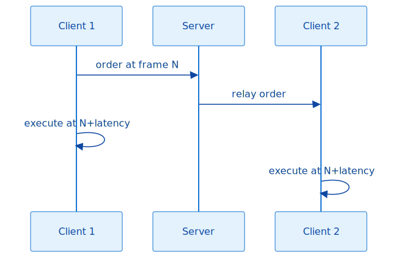

## Top 10 desync causes


Most multiplayer desyncs come from a small set of mistakes. Work through this list when the decision tree above does not immediately point to the cause.

| # | Cause | What to do |
| :---- | :---- | :---- |
| 1 | Using `world.LocalRandom` for gameplay-affecting decisions. | Use `world.SharedRandom` anywhere the result changes simulation state. |
| 2 | Iterating over dictionaries or hash sets without deterministic ordering. | Sort by a stable key, or use ordered collections in synced code paths. |
| 3 | Modifying simulation state from UI or unsynced code. | Keep world mutations inside simulation ticks; use `Sync.RunUnsynced` only for read-only or client-side effects. |
| 4 | Missing `[VerifySync]` on gameplay fields that affect the outcome. | Implement `ISync` and mark fields that must be identical on every client. |
| 5 | Floating-point math (`float`/`double`) in simulation code. | Prefer fixed-point types and integer math; isolate any floats and test across CPUs. |
| 6 | Bot logic or AI modules that differ between clients or read client-only state. | Run bot decisions in `RunUnsynced` only if they do not mutate state; keep bot state synced if it matters. |
| 7 | Reading client-only state such as camera, selection, or settings in simulation code. | Pass simulation-relevant data through orders or synced fields, not from client state. |
| 8 | Culture-dependent parsing of strings or numbers. | Use `CultureInfo.InvariantCulture` or OpenRA's parse helpers for any string-to-number conversion. |
| 9 | Different mod/map versions or modified data files across clients. | Verify checksums and ensure every client uses the same release. |
| 10 | Race conditions between simulation and rendering, or unguarded shared state. | Mutate state only on the simulation thread; protect shared state with locks if it is truly shared. |

## Utility commands for validation

```bash
./utility.sh ra --check-yaml
./utility.sh ra --check-missing-sprites
./utility.sh ra --check-missing-sequences
./utility.sh all --check-explicit-interfaces
./utility.sh all --check-conditional-trait-interface-overrides
./utility.sh all --check-referenced-sequences
```

Run these after changing YAML, sequences, or traits. They catch many errors before launch.

## Common problem: crash on startup

1. Check `debug.log` for the exception stack trace.
2. Identify whether the crash is in engine code, mod YAML, or a custom assembly.
3. If the crash mentions a trait name, check the actor's YAML for malformed fields.
4. If the crash is in a custom assembly, ensure it is built against the correct engine version.
5. Run `--check-yaml` to validate the mod.


## Common problem: desync in multiplayer


1. Enable `EnableSyncReports` in the lobby settings.
2. Reproduce the desync.
3. Compare `sync.log` files from both clients.
4. Find the first actor/trait whose hash differs.
5. Investigate the trait for:
   - Use of `world.LocalRandom` instead of `world.SharedRandom`.
   - Floating-point math (`float`/`double`).
   - Non-deterministic iteration order (e.g., over dictionaries).
   - Culture-dependent string parsing.
   - Code that runs in a `RunUnsynced` block but mutates state.

**See:** [Part 9.3 — Sync Hashing and Determinism](#file-chapters-Part_09_Chapter_03_Sync_Hashing) and the "I'm investigating a desync" decision tree and Top 10 desync causes above.

## Common problem: unit does not move or attack

1. Check that the actor has `Mobile` and `AttackFrontal` (or equivalent) traits.
2. Check that the `RevealsShroud` or `RevealsFog` trait covers the target area.
3. Check that the weapon's `ValidTargets` includes the target's target type.
4. Check that the locomotor's `TerrainSpeeds` allows movement on the terrain.
5. Use the pathfinding debug overlay to see if the destination is reachable.

**See:** [Part 1.5 — Pathfinding and Movement](#file-chapters-Part_01_Chapter_05_Pathfinding_Movement) and [Part 1.6 — Combat and Damage Resolution](#file-chapters-Part_01_Chapter_06_Combat_Damage).

## Common problem: sprite is invisible or wrong

1. Check that the sequence name is correct and the sprite file is loaded.
2. Check the `ZOffset` and `RenderSprites` settings.
3. Check the palette name for indexed sprites.
4. Use the render geometry debug overlay to see if the sprite is off-screen or scaled incorrectly.
5. Check `graphics.log` for texture upload errors.

## Common problem: bot does nothing

1. Check that the `Player` actor has `ModularBot` and the desired bot modules.
2. Check that the AI's `BuildingFractions` or `UnitsToBuild` reference valid actor names.
3. Check that the bot has a valid construction yard or factory.
4. Check `lua.log` if the map uses custom scripts that override bot behavior.
5. Enable debug logs for the bot modules.

## Common problem: YAML not applied as expected

1. Check inheritance order. Later files override earlier files.
2. Check that `Inherits` keys are keyed (`Inherits@1`) when using multiple inheritance.
3. Check that `-TraitName` removals are applied before the trait is redefined.
4. Check for typos in trait or field names.
5. Run `--check-yaml` to see the merged result.


## Debugging with an IDE


<!-- DEV-NOTE [tooling]: Microsoft .NET SDK: https://dotnet.microsoft.com — required to build the OpenRA engine and mod projects. -->
1. Open the OpenRA solution in Visual Studio, Rider, or VS Code.
2. Set a breakpoint in the relevant trait or world code.
3. Launch the game in debug mode.
4. Reproduce the issue.
5. Inspect the call stack, variables, and trait state.


## Debugging Lua scripts


1. Use `print("message")` in the script.
2. Check `lua.log` for output.
3. Watch for "Fatal Lua Error" messages that disable the script context.
4. Use the `World` and `Map` globals to inspect state.
5. Test scripts incrementally; Lua errors are fatal to the script context.

## Performance profiling

1. Enable `PerfGraph` in settings if available.
2. Check `perf.log` for frame timings.
3. Use `PerfSample` in code to measure sections:

```csharp
using (new PerfSample("my section"))
{
    // code to measure
}
```

4. Common slow paths:
   - Pathfinding on large maps.
   - Too many actors or effects.
   - Inefficient trait queries in tight loops.
   - Large Lua scripts or frequent Lua calls.


## Network debugging


1. Enable `EnableSyncReports` in the lobby.
2. Check `server.log` for disconnects, malformed packets, or ping failures.
3. Use `OrderManager.IsReadyForNextFrame` to diagnose stalls.
4. Verify that all clients have the same mod and map versions.


## Useful debugging tips


- **Start small:** when testing a new trait or weapon, create a minimal actor that uses only that feature.
- **Use the mod chooser:** run `./launch-game.sh` without arguments to choose the mod and map.
- **Isolate maps:** copy a map to a test directory and edit it without affecting the main mod.
- **Read the stack trace:** OpenRA's logs usually include enough context to pinpoint the subsystem.
- **Check official mods:** compare your YAML to the official mods. They are the reference implementation.
- **Use `git diff`:** if you modified the engine, review your changes for unintended side effects.

## Where to get help

- OpenRA GitHub issues and discussions.
- OpenRA Discord/IRC community.
- The source code itself — the engine is well-organized and heavily commented.

## Summary

This appendix is a practical guide for diagnosing problems in OpenRA. It covers the log files, the in-game debug menu, decision trees for common failures, network debugging, and general troubleshooting tips. Use it as a first stop when a mod, map, or engine change does not behave as expected.

## What to read next

- **If you are stuck on a YAML error:** [Appendix B — Common YAML Patterns](#file-appendices-Appendix_B_Common_YAML_Patterns)
- **If a unit will not move or an activity is stuck:** [Part 1.2 — Activities and the Game Loop](#file-chapters-Part_01_Chapter_02_Activities) for the activity queue, and [Part 1.1 — Entity-Component-System (ECS) and Actor Lifecycle](#file-chapters-Part_01_Chapter_01_ECS) for trait/condition interactions.
- **If the issue is a desync or network stall:** [Part 9.3 — Sync Hashing and Determinism](#file-chapters-Part_09_Chapter_03_Sync_Hashing)
- **If you are investigating performance problems:** [Appendix D — Engine Conventions](#file-appendices-Appendix_D_Engine_Conventions) and [Appendix E — Practical Recipes](#file-appendices-Appendix_E_Practical_Recipes)
- **If you want to set up automated reproduction checks:** [Appendix F — Testing](#file-appendices-Appendix_F_Testing)


---

<a id="file-appendices-Appendix_D_Engine_Conventions"></a>

<!-- --- FILE: appendices/Appendix_D_Engine_Conventions.md --- -->

# Appendix D — Engine Conventions and Style {#file-appendices-Appendix_D_Engine_Conventions}

This appendix documents the coding, naming, and architectural conventions used in the OpenRA engine. Following these conventions makes your code consistent with the rest of the codebase and easier to review.

## C# style

OpenRA uses a standard C# style with a few project-specific conventions:

- **Braces** on the same line for methods and control structures.
- **Indentation** with tabs.
- **Naming:**
  - `PascalCase` for classes, methods, properties, and public fields.
  - `camelCase` for local variables and private fields.
  - `ALL_CAPS` for constants.
  - `[TraitInfo](#file-appendices-Appendix_A_Glossary)` classes are named `MyTraitInfo` and the runtime trait is `MyTrait`.
- **Avoid LINQ in tight loops.** The codebase explicitly calls this out for performance-critical paths.
- **Use `var`** when the type is obvious.
- **Prefer readonly fields** on `TraitInfo` classes.

## Trait conventions

### TraitInfo class

```csharp
public class MyTraitInfo : TraitInfo<MyTrait>, Requires<SomeOtherTraitInfo>
{
    [Desc("Description of this field for modders.")]
    public readonly int MyField = 10;

    public override object Create(ActorInitializer init) { return new MyTrait(init, this); }
}
```

### Trait class

```csharp
public class MyTrait : INotifyCreated, ITick
{
    readonly MyTraitInfo info;

    public MyTrait(ActorInitializer init, MyTraitInfo info)
    {
        this.info = info;
    }

    void INotifyCreated.Created(Actor self)
    {
        // Post-creation setup
    }

    void ITick.Tick(Actor self)
    {
        // Per-frame logic
    }
}
```

### Use `Requires<T>` and `NotBefore<T>` correctly

- `Requires<T>` means the [actor](#file-appendices-Appendix_A_Glossary) must have [trait](#file-appendices-Appendix_A_Glossary) `T`.
- `NotBefore<T>` means this trait must be created after trait `T`.
- Use `TraitOrDefault<T>` if the trait may be absent.
- Use `TraitsImplementing<T>()` to iterate over multiple instances.

## Sync safety

- Mark gameplay-relevant fields with `[Sync]` or `[VerifySync]`.
- Use `world.SharedRandom` inside the simulation.
- Use `world.LocalRandom` only for UI, AI, or cosmetic effects.
- Never use `float`/`double` for synced state.
- Never iterate over non-deterministic collections (e.g., `Dictionary.Values`) in simulation code unless order is guaranteed not to matter.
- Wrap unsynced code in `Sync.RunUnsynced` if it reads world state.

## Order handling

- [Orders](#file-appendices-Appendix_A_Glossary) are the only way to change the [world](#file-appendices-Appendix_A_Glossary) state from the UI or [AI](#file-appendices-Appendix_A_Glossary).
- Order handlers implement `IResolveOrder` or are handled in `UnitOrders`.
- Use `Order` with `SuppressVisualFeedback = true` for bot orders.
- Validate targets before acting; invalid targets are common in multiplayer due to latency.

## YAML conventions

- Use spaces for indentation in [MiniYaml](#file-appendices-Appendix_A_Glossary) (not tabs).
- Use lowercase for actor keys and trait names.
- Use `^` for abstract actors.
- Use `@N` keyed inherits for multiple inheritance.
- Use `@INSTANCE` for multiple trait instances.
- Keep abstract actors in `defaults.yaml` or `shared.yaml`.
- Group related rules in separate files.

## Error handling

- Use exceptions for programming errors (e.g., missing required trait).
- Use `Log.Write` for recoverable runtime issues.
- Validate assumptions in `IRulesetLoaded` or `Created` hooks rather than silently failing.
- Do not catch exceptions that hide logic errors unless you are handling a specific expected case.

## Performance considerations

- Cache trait lookups in the actor constructor.
- Avoid `foreach` over large collections in tight loops.
- Use `World.ScreenMap` for spatial queries instead of scanning all actors.
- Batch rendering and avoid per-sprite draw calls.
- Use `PerfSample` to measure suspected slow paths.
- Profile before optimizing.

## Documentation conventions

- Use `[Desc("...")]` on public `TraitInfo` fields so the field is documented in YAML.
- Add XML comments to public APIs when the behavior is non-obvious.
- Keep comments focused on *why*, not *what*.
- Update this manual when adding significant new subsystems.

## File organization

- Engine code is in `OpenRA.Game/`.
- Common mod code is in `OpenRA.Mods.Common/`.
- Mod-specific code is in `OpenRA.Mods.<Mod>/`.
- YAML rules are in `mods/<mod>/rules/`.
- Sequences are in `mods/<mod>/sequences/`.
- Chrome layouts are in `mods/<mod>/chrome/`.

## Testing conventions

- Unit tests are in `OpenRA.Test/`.
- Name test classes after the class under test.
- Run `make tests` before submitting changes.
- For gameplay changes, test in multiplayer to ensure sync safety.

## Versioning

- Mods declare `RequiresMods` with the exact engine version.
- Use `make version` to update version strings before release.
- Keep the `VERSION` file and `mod.yaml` metadata in sync.

## Pull request etiquette

- Keep changes focused on one subsystem.
- Include tests when possible.
- Run `make check` and `make test` before submitting.
- Explain the motivation, not just the mechanics.
- Reference related issues or chapters in the manual.

## Summary

This appendix documents the coding, naming, and architectural conventions used in the OpenRA engine. Following these conventions — C# style, trait design, sync safety, YAML structure, error handling, and performance — keeps custom code and mods consistent with the rest of the codebase and easier to review.

## What to read next

- **For trait and actor lifecycle basics:** [Part 1.1 — ECS, Actors, and Traits](#file-chapters-Part_01_Chapter_01_ECS)
- **For the activity system and tick conventions:** [Part 1.2 — Activities and the Game Loop](#file-chapters-Part_01_Chapter_02_Activities)
- **For order and sync safety details:** [Part 9.1 — OrderManager and Networked Orders](#file-chapters-Part_09_Chapter_01_OrderManager) and [Part 9.3 — Sync Hashing and Determinism](#file-chapters-Part_09_Chapter_03_Sync_Hashing)
- **For YAML pattern examples:** [Appendix B — Common YAML Patterns](#file-appendices-Appendix_B_Common_YAML_Patterns)
- **For debugging recipes that apply these conventions:** [Appendix C — Debugging and Troubleshooting](#file-appendices-Appendix_C_Debugging)
- **For testing practices:** [Appendix F — Testing](#file-appendices-Appendix_F_Testing)


---

<a id="file-appendices-Appendix_E_Practical_Recipes"></a>

<!-- --- FILE: appendices/Appendix_E_Practical_Recipes.md --- -->

# Appendix E — Practical Modding Recipes {#file-appendices-Appendix_E_Practical_Recipes}

This appendix provides copy-paste-friendly recipes for the most common OpenRA [modding](#file-appendices-Appendix_A_Glossary) tasks. They are intended as a practical complement to the architecture chapters ([Part 1.1 — ECS, Actors, and Traits](#file-chapters-Part_01_Chapter_01_ECS), [Part 2.4 — Rulesets, Actors, and Weapons](#file-chapters-Part_02_Chapter_04_Rules_Weapons), [Part 3.1 — Mod SDK and Project Structure](#file-chapters-Part_03_Chapter_01_Mod_SDK), [Part 4.3 — Widgets and Chrome](#file-chapters-Part_04_Chapter_03_Widgets), [Part 10.3 — Porting, Modding, and Developer Workflows](#file-chapters-Part_10_Chapter_03_Port_And_Modding)) and [Appendix B — Common YAML Patterns](#file-appendices-Appendix_B_Common_YAML_Patterns).

> **Note:** All examples use the Red Alert mod as the baseline. File paths are relative to your mod folder, e.g. `mods/ra/` or `mods/my-mod/`.

---

## Recipe 1 — Add a New Weapon

**Goal:** Clone an existing rifle and increase its rate of fire.

**What you need to know first:** [Part 2.4 — Rulesets, Actors, and Weapons](#file-chapters-Part_02_Chapter_04_Rules_Weapons) and the weapon definition in [Appendix B — Common YAML Patterns](#file-appendices-Appendix_B_Common_YAML_Patterns).

**Files to edit:** `mods/ra/weapons/smallcaliber.yaml` (or a new file loaded under `Weapons:` in `mod.yaml`).

**Before:**

```yaml
M1Carbine:
    Inherits: ^LightMG
    ReloadDelay: 20
    Range: 5c0
    Report: gun11.aud
```

**After:**

```yaml
M2Carbine:
    Inherits: M1Carbine
    ReloadDelay: 15
    Burst: 3
    BurstDelays: 3
    Warhead@1Dam: SpreadDamage
        Damage: 1200
        Versus:
            None: 150
            Wood: 40
            Light: 50
            Heavy: 25
            Concrete: 15
```

**How to verify it works:**
- Attach it to a unit: `Armament: Weapon: M2Carbine`.
- Run `OpenRA.Utility.exe ra --check-yaml` and test in a skirmish.

**Common pitfalls:**
- The weapon name in `Armament` must match the YAML key exactly.
- `ReloadDelay` is in ticks; lower is faster.

---

## Recipe 2 — Add a New Vehicle with Sequences and Voice

**Goal:** Add a fast scout vehicle with its own sprite, weapon, and voice set.

**What you need to know first:** [Part 2.4 — Rulesets, Actors, and Weapons](#file-chapters-Part_02_Chapter_04_Rules_Weapons), [Part 6.5 — Asset Loaders](#file-chapters-Part_06_Chapter_05_Asset_Loaders), and the inheritance/sequence examples in [Appendix B — Common YAML Patterns](#file-appendices-Appendix_B_Common_YAML_Patterns).

**Files to edit:**
- `mods/ra/rules/vehicles.yaml`
- `mods/ra/sequences/vehicles.yaml`
- `mods/ra/audio/voices.yaml` (for a custom voice set)

**Before:**

```yaml
1TNK:
    Inherits: ^TrackedVehicle
    Inherits@GAINSEXPERIENCE: ^GainsExperience
    Buildable:
        Queue: Vehicle
        BuildPaletteOrder: 120
```

**After:**

`rules/vehicles.yaml`:

```yaml
RAIDR:
    Inherits: ^Vehicle
    Inherits@GAINSEXPERIENCE: ^GainsExperience
    Inherits@AUTOTARGET: ^AutoTargetGroundAssaultMove
    Buildable:
        Queue: Vehicle
        BuildPaletteOrder: 330
        Prerequisites: ~vehicles.allies, ~techlevel.low
        Description: actor-raidr.description
    Valued:
        Cost: 600
    Tooltip:
        Name: actor-raidr.name
    Health:
        HP: 15000
    Armor:
        Type: Light
    Mobile:
        Speed: 160
        Locomotor: wheeled
    RevealsShroud:
        Range: 7c0
    Armament:
        Weapon: M2Carbine
        LocalOffset: 0,0,128
    AttackFrontal:
        FacingTolerance: 0
    WithFacingSpriteBody:
    AutoTarget:
        ScanRadius: 7
    RenderSprites:
        Image: raidr
    Voiced:
        VoiceSet: RaiderVoice
```

`sequences/vehicles.yaml`:

```yaml
raidr:
    Defaults:
        Filename: raidr.shp
    idle:
        Facings: 32
        UseClassicFacings: True
    icon:
        Filename: raidricon.shp
```

`audio/voices.yaml`:

```yaml
RaiderVoice:
    Inherits: VehicleVoice
    Voices:
        Select: vehic1,report1
        Action: ackno,affirm1
```

**How to verify it works:**
- Ensure the `raidr.shp` and `raidricon.shp` assets are in a loaded package.
- Run `--check-yaml` and start a skirmish; confirm the unit moves, fires, and speaks.

**Common pitfalls:**
- The sequence key must match the `RenderSprites.Image` value (or the actor ID if `RenderSprites` is omitted).
- `BuildPaletteOrder` must be unique within the same queue.

---

## Recipe 3 — Add a New Building with Production

**Goal:** Add a factory that produces units from the existing Vehicle queue.

**What you need to know first:** [Part 2.4 — Rulesets, Actors, and Weapons](#file-chapters-Part_02_Chapter_04_Rules_Weapons) and the building/production [traits](#file-appendices-Appendix_A_Glossary) in [Part 3.1 — Mod SDK and Project Structure](#file-chapters-Part_03_Chapter_01_Mod_SDK). Review `SPEN` or `WEAP` in `rules/structures.yaml`.

**Files to edit:**
- `mods/ra/rules/structures.yaml`
- `mods/ra/sequences/structures.yaml`

**Before:**

```yaml
SPEN:
    Inherits: ^Building
    Inherits@PRIMARY: ^PrimaryBuilding
    Production:
        Produces: Ship, Submarine
    ProductionBar:
        ProductionType: Ship
    RallyPoint:
```

**After:**

`rules/structures.yaml`:

```yaml
AFA:
    Inherits: ^Building
    Inherits@PRIMARY: ^PrimaryBuilding
    Inherits@IDISABLE: ^DisableOnLowPowerOrPowerDown
    Buildable:
        Queue: Building
        BuildPaletteOrder: 200
        Prerequisites: fix, anypower, ~vehicles.allies, ~techlevel.medium
        Description: actor-afa.description
    Valued:
        Cost: 1200
    Tooltip:
        Name: actor-afa.name
    Building:
        Footprint: xxx xxx
        Dimensions: 3,2
    Health:
        HP: 90000
    Armor:
        Type: Wood
    RevealsShroud:
        Range: 5c0
    Exit@1:
        SpawnOffset: 0,0,0
        ExitCell: 0,2
        ProductionTypes: Vehicle
    Production:
        Produces: Vehicle
    ProductionBar:
        ProductionType: Vehicle
    RallyPoint:
    Power:
        Amount: -30
    WithIdleOverlay@DOOR:
        Sequence: idle
        RequiresCondition: !build-incomplete
```

`sequences/structures.yaml`:

```yaml
afa:
    Defaults:
        Filename: afa.shp
    idle:
        Length: 16
        Tick: 120
    make:
        Filename: afamake.shp
        Length: *
    icon:
        Filename: afaicon.shp
```

**How to verify it works:**
- Ensure the `afa.shp` and `afaicon.shp` assets are in a loaded package.
- Run `--check-yaml` and start a skirmish; confirm the AFA can produce vehicles.

**Common pitfalls:**
- `Footprint` must match `Building.Dimensions` exactly; each character is one cell.
- `ExitCell` must be a clear, passable cell or units will get stuck.
- `Production.Produces` and `ProductionBar.ProductionType` must match a `ClassicProductionQueue` `Type` in `rules/player.yaml`.

---

## Recipe 4 — Add a Support Power

**Goal:** Add a single-target invulnerability power to a new building.

**What you need to know first:** [Part 3.1 — Mod SDK and Project Structure](#file-chapters-Part_03_Chapter_01_Mod_SDK) for support powers and [Part 1.1 — ECS, Actors, and Traits](#file-chapters-Part_01_Chapter_01_ECS) for the [condition](#file-appendices-Appendix_A_Glossary) system. The Iron Curtain in `rules/structures.yaml` is the canonical example.

**Files to edit:**
- `mods/ra/rules/structures.yaml`
- `mods/ra/sequences/structures.yaml` (for the icon and building artwork)
- `mods/ra/audio/notifications.yaml` (optional, for charging/ready speech)

**Before:**

```yaml
GrantExternalConditionPower@IRONCURTAIN:
    Icon: invuln
    ChargeInterval: 3000
    Duration: 400
    Condition: invulnerability
    SupportPowerPaletteOrder: 10
```

**After:**

```yaml
SHIELD:
    Inherits: ^ScienceBuilding
    Inherits@IDISABLE: ^DisableOnLowPowerOrPowerDown
    Inherits@shape: ^2x2Shape
    Buildable:
        Queue: Defense
        BuildPaletteOrder: 150
        Prerequisites: atek, ~structures.allies, ~techlevel.high
        BuildLimit: 1
        Description: actor-shield.description
    Valued:
        Cost: 1500
    Tooltip:
        Name: actor-shield.name
    Building:
        Footprint: xx xx
        Dimensions: 2,2
    Health:
        HP: 60000
    Armor:
        Type: Heavy
    RevealsShroud:
        Range: 6c0
    GrantExternalConditionPower@SHIELD:
        Icon: shield
        ChargeInterval: 6000
        Duration: 300
        Name: actor-shield.shield-name
        Description: actor-shield.shield-description
        Condition: invulnerability
        OnFireSound: ironcur9.aud
        SelectTargetSpeechNotification: SelectTarget
        EndChargeSpeechNotification: IronCurtainReady
        SupportPowerPaletteOrder: 80
        DisplayRadarPing: True
    SupportPowerChargeBar:
    Power:
        Amount: -100
    WithIdleOverlay:
        Sequence: idle
        RequiresCondition: !build-incomplete
```

**How to verify it works:**
- Ensure the `shield` icon is defined in a sequence or chrome image set.
- Run `--check-yaml` and test in a skirmish; the target should gain the Iron Curtain overlay and become invulnerable.

**Common pitfalls:**
- The target actor must accept the condition. In RA, all units and buildings inherit `^IronCurtainable`, which defines `ExternalCondition@INVULNERABILITY` with the condition `invulnerability`.
- `SupportPowerPaletteOrder` must be unique across all support powers for that player.
- `Duration` is in ticks; `300` ticks is about 7.5 seconds at default speed.

---

## Recipe 5 — Add a Status Effect with a Condition

**Goal:** Make a vehicle move faster when it is heavily damaged.

**What you need to know first:** [Part 1.1 — ECS, Actors, and Traits](#file-chapters-Part_01_Chapter_01_ECS) for condition tokens and the `GrantConditionOnDamageState` / `SpeedMultiplier` [traits](#file-appendices-Appendix_A_Glossary) in `defaults.yaml` and `rules/vehicles.yaml`.

**Files to edit:** `mods/ra/rules/vehicles.yaml` (or any actor file).

**Before:**

```yaml
^Vehicle:
    GrantConditionOnDamageState@DAMAGED:
        Condition: damaged
        ValidDamageStates: Light, Medium, Heavy, Critical
```

**After:**

```yaml
RAIDR:
    Inherits: ^Vehicle
    ...
    GrantConditionOnDamageState@DESPERATE:
        Condition: desperate
        ValidDamageStates: Heavy, Critical
        GrantPermanently: false
    SpeedMultiplier@DESPERATE:
        Modifier: 125
        RequiresCondition: desperate
    WithDecoration@DESPERATE:
        Image: pips
        Sequence: tag
        RequiresCondition: desperate
        Position: TopRight
        Margin: 5, 5
```

**How to verify it works:**
- Run `--check-yaml` and start a skirmish.
- Let the RAIDR take heavy damage; its speed should increase and the decoration should appear.

**Common pitfalls:**
- The condition name (`desperate`) must match exactly in every trait that references it.
- Damage states are percentages of max HP, not absolute values.
- Multiple `SpeedMultiplier` modifiers stack multiplicatively.

---


## Recipe 6 — Add a Custom C# Trait


**Goal:** Give the player a cash bonus every time a specific actor is built.

**What you need to know first:** [Part 1.1 — ECS, Actors, and Traits](#file-chapters-Part_01_Chapter_01_ECS), [Appendix D — Engine Conventions and Style](#file-appendices-Appendix_D_Engine_Conventions), and the `PlayerResources` [trait](#file-appendices-Appendix_A_Glossary) in `OpenRA.Mods.Common/Traits/Player/PlayerResources.cs`.

**Files to edit:**
- A new C# file in your custom mod assembly, e.g. `OpenRA.Mods.MyMod/Traits/CashOnCreated.cs`
- `mods/ra/mod.yaml` (add the assembly to `Assemblies:`)
- The actor YAML where you want to use the trait

**C# snippet:**

```csharp
using OpenRA.Traits;
using OpenRA.Mods.Common.Traits;

namespace OpenRA.Mods.MyMod.Traits
{
    [Desc("Grants a cash bonus to the owner when this actor is created.")]
    public class CashOnCreatedInfo : TraitInfo
    {
        [FieldLoader.Require]
        [Desc("Cash amount to grant when the actor is created.")]
        public readonly int Amount = 0;

        public override object Create(ActorInitializer init) { return new CashOnCreated(init, this); }
    }

    public class CashOnCreated : INotifyCreated
    {
        readonly CashOnCreatedInfo info;

        public CashOnCreated(ActorInitializer init, CashOnCreatedInfo info)
        {
            this.info = info;
        }

        void INotifyCreated.Created(Actor self)
        {
            // PlayerResources lives on the player actor, not on the unit itself.
            var playerResources = self.Owner.PlayerActor.Trait<PlayerResources>();
            playerResources.GiveCash(info.Amount);
        }
    }
}
```

**After:**

`mod.yaml`:

```yaml
Assemblies:
    OpenRA.Mods.Common.dll
    OpenRA.Mods.Cnc.dll
    OpenRA.Mods.MyMod.dll
```

`rules/structures.yaml`:

```yaml
AFA:
    ...
    CashOnCreated:
        Amount: 500
```

**How to verify it works:**
- Build the custom mod assembly and ensure the DLL is next to the game executable.
- Run `--check-yaml` and start a skirmish; build the AFA and confirm the cash increases by 500.

**Common pitfalls:**
- The YAML trait name is the class name without the `Info` suffix (`CashOnCreated`).
- The custom assembly must be listed in `mod.yaml` and built against the same engine version.
- `GiveCash` affects the simulation; if you add randomness, use `world.SharedRandom`, not `Game.CosmeticRandom`.

---

## Recipe 7 — Add a New Production Queue and Build Tab

**Goal:** Add a new "Superweapon" production queue and a matching sidebar tab.

**What you need to know first:** [Part 4.3 — Widgets and Chrome](#file-chapters-Part_04_Chapter_03_Widgets) and the production-queue definitions in `rules/player.yaml`.

**Files to edit:**
- `mods/ra/rules/player.yaml`
- `mods/ra/chrome/ingame-player.yaml`
- `mods/ra/chrome.yaml`
- `mods/ra/fluent/chrome.ftl` (for the tooltip text)

**Before:**

```yaml
ClassicProductionQueue@Vehicle:
    Type: Vehicle
    DisplayOrder: 3
    ...
```

```yaml
ProductionTypeButton@VEHICLE:
    Y: 93
    ProductionGroup: Vehicle
```

**After:**

`rules/player.yaml`:

```yaml
ClassicProductionQueue@Super:
    Type: Super
    DisplayOrder: 6
    LowPowerModifier: 300
    ReadyAudio: UnitReady
    ReadyTextNotification: notification-unit-ready
    BlockedAudio: NoBuild
    BlockedTextNotification: notification-unable-to-build-more
    LimitedAudio: BuildingInProgress
    LimitedTextNotification: notification-unable-to-comply-building-in-progress
    QueuedAudio: Building
    OnHoldAudio: OnHold
    CancelledAudio: Cancelled
    SpeedUp: True
```

`chrome/ingame-player.yaml` (inside `Container@PRODUCTION_TYPES`):

```yaml
ProductionTypeButton@SUPER:
    Logic: AddFactionSuffixLogic
    Y: 186
    Width: 28
    Height: 28
    VisualHeight: 0
    Background: sidebar-button
    TooltipText: button-production-types-super-tooltip
    TooltipContainer: TOOLTIP_CONTAINER
    ProductionGroup: Super
    Key: ProductionTypeSuper
    Children:
        Image@ICON:
            X: 6
            Y: 6
            ImageCollection: production-icons
            ImageName: super
```

`chrome.yaml`:

```yaml
production-icons:
    Inherits: ^Glyphs
    Regions:
        ...
        super: 204, 68, 16, 16
        super-disabled: 204, 85, 16, 16
        super-alert: 204, 102, 16, 16
```

`fluent/chrome.ftl`:

```ftl
button-production-types-super-tooltip = Superweapon
```

Finally, assign a building to the new queue (for example, the SHIELD from Recipe 4):

```yaml
SHIELD:
    Buildable:
        Queue: Super
        BuildPaletteOrder: 10
```

**How to verify it works:**
- Run `--check-yaml` and start a skirmish.
- Build the SHIELD prerequisites; a new "Superweapon" tab should appear in the sidebar.

**Common pitfalls:**
- `ProductionGroup` in the button must exactly match the `Type` field of the `ClassicProductionQueue`.
- `DisplayOrder` controls the queue order in the UI; do not reuse an existing value.
- The `Key` field must be defined in the hotkey file if you want a keyboard shortcut.

## Summary

This appendix provides copy-paste-friendly recipes for the most common OpenRA modding tasks: adding weapons, vehicles, buildings, support powers, production queues, and more. Each recipe explains the goal, the files to edit, the before/after YAML, how to verify it works, and the pitfalls to avoid.

## What to read next

- **For the architecture behind actors and traits:** [Part 1.1 — ECS, Actors, and Traits](#file-chapters-Part_01_Chapter_01_ECS)
- **For weapon and ruleset design:** [Part 2.4 — Rulesets, Actors, and Weapons](#file-chapters-Part_02_Chapter_04_Rules_Weapons)
- **For YAML pattern snippets and syntax:** [Appendix B — Common YAML Patterns](#file-appendices-Appendix_B_Common_YAML_Patterns)
- **For engine conventions when writing custom C# traits:** [Appendix D — Engine Conventions and Style](#file-appendices-Appendix_D_Engine_Conventions)
- **For debugging recipes that do not work:** [Appendix C — Debugging and Troubleshooting](#file-appendices-Appendix_C_Debugging)
- **For custom asset packages and VFS mounting:** [Part 6.3 — Virtual File System](#file-chapters-Part_06_Chapter_03_VFS)
- **For random map generator recipes:** [Part 7.1 — Map Generation Pipeline Overview](#file-chapters-Part_07_Chapter_01_Pipeline)
- **For testing your changes:** [Appendix F — Testing](#file-appendices-Appendix_F_Testing)
- **For longer advanced walkthroughs:** [Appendix G — Advanced Modding Walkthroughs](#file-appendices-Appendix_G_Advanced_Modding_Walkthroughs)


---

<a id="file-appendices-Appendix_F_Testing"></a>

<!-- --- FILE: appendices/Appendix_F_Testing.md --- -->

# Appendix F — Testing Strategies {#file-appendices-Appendix_F_Testing}

OpenRA is a [deterministic](#file-appendices-Appendix_A_Glossary), [lockstep](#file-appendices-Appendix_A_Glossary) real-time strategy engine. That means the simulation must produce exactly the same result on every client when given the same initial state and the same stream of [orders](#file-appendices-Appendix_A_Glossary). Testing is therefore not only about catching crashes; it is about proving that the engine, an official mod, or a custom mod stays deterministic across hardware, platforms, and game versions. This appendix covers the testing layers used to protect that determinism: unit tests, YAML validation, replay testing, sync testing, performance testing, and practical checklists.

## Overview

Why does deterministic testing matter? In a lockstep architecture the server only forwards player [orders](#file-appendices-Appendix_A_Glossary); each client runs the full simulation locally. If two clients ever compute a different [world](#file-appendices-Appendix_A_Glossary) state, the game has **[desynced](#file-appendices-Appendix_A_Glossary)** and cannot be trusted to continue. Replays rely on the same property: a replay file stores only the initial settings and the order stream, so playback must reproduce the original simulation frame-for-frame.

A bug can be completely invisible in single-player or skirmish mode yet break multiplayer immediately. Common examples include:

- A [trait](#file-appendices-Appendix_A_Glossary) using a random number generator that is not shared between clients.
- A trait iterating over an unordered collection without a stable sort key.
- A rule change that makes an old replay compute a different battle outcome.

Testing should happen at every layer: code, YAML, recorded gameplay, live multiplayer sync, and performance.


## Unit tests


<!-- DEV-NOTE [tooling]: NUnit: https://nunit.org — the testing framework used by the OpenRA.Test project. -->
OpenRA's unit tests live in the `OpenRA.Test` project. They use **NUnit** and target the same engine and mod assemblies the game runs. The project is split into the same namespaces as the engine, so tests for `OpenRA.Game` live under `OpenRA.Test/OpenRA.Game/`, tests for `OpenRA.Mods.Common` under `OpenRA.Test/OpenRA.Mods.Common/`, and so on.

### Layout

| Location | Typical contents |
| :---- | :---- |
| `OpenRA.Test/OpenRA.Game/` | Tests for core types such as `CPos`, `WPos`, `MiniYaml`, `Order`, and `Sync` helpers. |
| `OpenRA.Test/OpenRA.Mods.Common/` | Tests for traits, activities, weapons, pathfinding, and utility commands. |
| `OpenRA.Test/OpenRA.Mods.Cnc/` | Tests specific to the Tiberian Dawn mod. |
| `OpenRA.Test/OpenRA.Mods.Ra/` | Tests specific to the Red Alert mod. |

### Adding a test for a trait

A trait test usually constructs a small world or uses helper methods that create a map with the actor and rules needed. Keep the test focused on the trait's behavior rather than the whole game loop. Here is a minimal pattern:

```csharp
[Test]
public void MyTraitDoesX()
{
    // Arrange: create a map and ruleset that include the [actor](#file-appendices-Appendix_A_Glossary).
    var map = new Map(...);
    var rules = map.Rules; // or a custom Ruleset loaded from [MiniYaml](#file-appendices-Appendix_A_Glossary)
    var actor = CreateActor(map, rules, "my-actor");

    // Act: tick the trait or call its public method directly.
    actor.Tick();

    // Assert: verify the trait state or the actor's state changed as expected.
    Assert.That(SomeState, Is.EqualTo(expectedValue));
}
```

Many existing tests create actors through `World` helpers or set up `TraitData` directly. Look at `OpenRA.Test/OpenRA.Mods.Common/Traits/` for existing examples when adding a new trait test.

### Adding a test for an activity

Activity tests are similar, but they usually queue the activity on an actor and tick it until completion:

```csharp
[Test]
public void MyActivityCompletes()
{
    var actor = CreateActor(...);
    var activity = new MyActivity(Target.FromActor(other));
    actor.QueueActivity(activity);

    // Tick until the activity finishes or a safety limit is reached.
    for (var i = 0; i < 100 && !actor.IsIdle; i++)
        actor.Tick();

    Assert.That(actor.IsIdle, Is.True);
}
```

### Adding a test for a utility command

Utility commands implement `IUtilityCommand`. You can test them by invoking `Run` with a `Utility` instance and the arguments you would pass on the command line:

```csharp
[Test]
public void MyUtilityCommandRuns()
{
    var utility = new Utility("ra", new string[0]);
    var command = new MyUtilityCommand();

    var args = new[] { "my-utility-command", "some-arg" };
    command.Run(utility, args);

    // Assert the expected output files, console output, or return state.
}
```

### Running the tests

<!-- DEV-NOTE [tooling]: Microsoft .NET SDK: https://dotnet.microsoft.com — required to build the OpenRA engine and mod projects. -->
Use `dotnet test` directly:

```bash
dotnet test OpenRA.Test/OpenRA.Test.csproj
```

Run a single test or namespace with the `--filter` option:

```bash
dotnet test OpenRA.Test/OpenRA.Test.csproj --filter "FullyQualifiedName~MyTrait"
```

The OpenRA build scripts also expose a convenient target:

```bash
make test
```

On Windows the equivalent is usually `make.cmd test` or `dotnet test` from the solution root. CI runs the full suite on every pull request, so adding a test for new engine behavior is the best way to prevent regressions.

## YAML validation

A large part of OpenRA is data-driven. Mods, maps, weapons, sequences, chrome layouts, and audio definitions are all written in [MiniYaml](#file-appendices-Appendix_A_Glossary). The engine provides a family of utility commands that parse and validate this data without launching the game. Running these commands is the cheapest way to catch errors before a human player sees them.

### `--check-yaml`

`--check-yaml` loads the full mod ruleset and reports syntax errors, inheritance problems, missing trait fields, invalid trait references, and duplicate keys. It is the first command to run after any non-trivial YAML change.

```bash
./utility.sh ra --check-yaml
```

Common issues it catches:

| Error type | Example | What to do |
| :---- | :---- | :---- |
| Parse error | Misaligned indentation or a missing colon. | Fix indentation and MiniYaml syntax. |
| Invalid trait name | `Helth:` instead of `Health:`. | Correct the trait or field name. |
| Missing required field | `Mobile:` with no `Locomotor` defined. | Add the required field or inherit from a template that provides it. |
| Inheritance loop | `A inherits: B` and `B inherits: A`. | Remove the circular `Inherits` reference. |
| Duplicate key | Two `Armament` nodes without `@` instance names. | Key them (`Armament@PRIMARY`, `Armament@SECONDARY`). |

### `--check-sequences` and related commands

`--check-sequences` validates sequence definitions, image references, and frame ranges. Other useful commands include:

| Command | Purpose |
| :---- | :---- |
| `--check-sequences` | Validate sequence YAML and image references. |
| `--check-missing-sprites` | Report sprites referenced by sequences but not present in the VFS. |
| `--check-missing-sequences` | Report actors that reference sequences that do not exist. |
| `--check-referenced-sequences` | Verify that every `RenderSprites` or sequence trait uses a defined sequence. |
| `--check-explicit-interfaces` | Verify that traits correctly implement required interfaces. |
| `--check-conditional-trait-interface-overrides` | Validate conditional trait interface overrides. |

Typical validation workflow after adding art:

```bash
./utility.sh ra --check-yaml
./utility.sh ra --check-sequences
./utility.sh ra --check-missing-sprites
./utility.sh ra --check-missing-sequences
```

If `--check-yaml` passes, the mod is likely syntactically valid. Passing the sequence checks means the artwork is wired correctly. These commands do not verify gameplay balance or logic, but they eliminate the most common startup crashes.


## Replay testing


A [replay](#file-appendices-Appendix_A_Glossary) is a deterministic recording of a game. It stores the initial map, lobby settings, random seed, and the complete order stream from every player. It does **not** store the [world](#file-appendices-Appendix_A_Glossary) state, so every frame must be recomputed during playback. If the simulation is not deterministic, the replay will desync from the original game.

### Recording and playback

Replays are recorded automatically during normal games. They are written to the `Replays/` folder under the user data directory. To play a replay back, select it from the replay browser in the main menu, or launch it directly from the command line with the appropriate replay path.

```bash
./launch-game.sh "Game.Replay=<path-to-replay>"
```

During playback the game feeds the stored orders into the same simulation loop used for live games. Any divergence between the recorded [sync hash](#file-appendices-Appendix_A_Glossary) and the computed hash indicates a [desync](#file-appendices-Appendix_A_Glossary).

### What a replay regression tells you

If a replay that worked on a previous engine version desyncs on the new version, the simulation has changed. This is expected when gameplay rules change intentionally, but it is a bug when the engine itself was supposed to stay compatible. Investigate the same way you would a multiplayer desync:

1. Enable sync reports if possible.
2. Find the first frame where the sync hash differs.
3. Identify the actor or trait that changed.
4. Look for unordered collections, random sources, floating-point math, or missing `[VerifySync]` fields.

Because replay compatibility is fragile, official mods keep a set of reference replays and replay them in CI. Mods should also re-test important replays after rule changes. See [Part 9.3 — Sync Hashing and Determinism](#file-chapters-Part_09_Chapter_03_Sync_Hashing) for how the sync hash is computed and compared.


## Sync testing


Sync testing is multiplayer testing. Its goal is to prove that every client reaches the same world state after every frame. The primary tool is the **sync report**, which dumps the per-actor, per-trait hash contributions when a desync is detected.

### Enabling sync reports

Sync reports are enabled in the lobby before the game starts:

```yaml
GlobalSettings:
    EnableSyncReports: true
```

You can also enable extra guards in `settings.yaml` for development:

```yaml
Debug:
    SyncCheckUnsyncedCode: true
    SyncCheckBotModuleCode: true
```

- `SyncCheckUnsyncedCode`: wraps `Sync.RunUnsynced` calls with a before/after sync hash comparison, catching code that accidentally mutates world state while claiming to be unsynced.
- `SyncCheckBotModuleCode`: runs bot module ticks inside a sync check so that AI decisions that differ between clients are caught early.

### Comparing sync reports

When a desync occurs, each client writes a `sync.log` file to the `Logs/` directory. The log contains one line per synced object with its hash and the values of its `[VerifySync]` fields. To find the cause:

1. Collect `sync.log` from two clients that desynced on the same frame.
2. Compare the reports line by line from the top.
3. The first object whose hash differs is the most likely culprit.
4. Once the actor/trait is known, inspect the trait code for determinism violations.

### Isolating a desyncing trait

Use this decision tree when a sync report points to a specific trait:

1. Does the trait use `world.SharedRandom` for any simulation-affecting decision?
   - **No.** Use `world.SharedRandom` for combat, movement, spawning, and any other gameplay outcome. `world.LocalRandom` and `Game.CosmeticRandom` are only for client-side or cosmetic effects.
2. Does the trait iterate over dictionaries, hash sets, or other unordered collections?
   - **Yes.** Sort the collection by a stable key such as `ActorID` or use an ordered list.
3. Does the trait run inside `Sync.RunUnsynced` but change world state or synced fields?
   - **Yes.** Move the mutation out of `RunUnsynced` and add `[VerifySync]` to the fields it changes.
4. Does the trait use `float` or `double` math in the simulation path?
   - **Yes.** Replace with fixed-point types (`WPos`, `WDist`, `WAngle`, `WVec`, `int`) or isolate the math and prove it is deterministic across platforms.
5. Does the trait read client-only state such as camera position, selection, or UI settings?
   - **Yes.** Gate the code behind client-only logic and never let it affect the simulation.

See [Appendix C — Debugging and Troubleshooting](#file-appendices-Appendix_C_Debugging) for a full decision tree and the top ten desync causes, and [Part 9.3 — Sync Hashing and Determinism](#file-chapters-Part_09_Chapter_03_Sync_Hashing) for the sync hashing contract.


## Performance testing


Performance testing makes sure the game stays responsive as the world grows. OpenRA provides two simple in-code tools: `PerfSample` and `PerfTimer`. Both write timings to `perf.log` so you can see where the simulation or renderer spends its time.

### Using `PerfSample`

`PerfSample` measures a block of code with a `using` statement. The sample name appears in `perf.log` and can be aggregated across frames.

```csharp
using (new PerfSample("my trait tick"))
{
    // Work to measure
}
```

### Using `PerfTimer`

`PerfTimer` is useful when you need to measure several named sub-sections manually or when the work is not naturally scoped to a single `using` block.

```csharp
using (var timer = new PerfTimer("pathfinding"))
{
    timer.StartSection("build graph");
    BuildGraph();

    timer.StartSection("search");
    Search();
}
```

### Reading `perf.log`

`perf.log` contains frame timings, tick durations, and custom `PerfSample` markers. Look for:

| Marker | What it tells you |
| :---- | :---- |
| Frame time | Total time to render and simulate one frame. Spikes here cause stutter. |
| Tick time | Time spent inside the simulation tick. Long ticks delay the lockstep frame. |
| `PerfSample` names | Custom sections you added; compare before/after to measure optimizations. |

Common hotspots to measure and optimize:

- Pathfinding on large maps with many actors.
- Trait queries inside tight loops, especially `World.ActorsWithTrait<T>` or `World.ActorsHavingTrait<T>`.
- Heavy effects and projectile counts.
- Lua scripts that run frequently or allocate many objects.
- Rendering many actors without effective spatial partitioning.

In-game performance graphs can be enabled in settings when available. Use them alongside `perf.log` to confirm that an optimization actually improves the worst-case frame time, not just the average.

## Writing a test plan for a new feature

Before committing a new trait, weapon, activity, or utility command, work through this short checklist. It catches the determinism, data, and performance problems that are easiest to introduce and hardest to debug later.

- [ ] **Unit tests.** Add NUnit tests for the new logic. If the feature is a trait, test it in a small world. If it is a utility command, test `Run` directly.
- [ ] **YAML coverage.** Add or update a test map or test actor that exercises the new YAML fields. Run `--check-yaml` and any sequence or sprite checks.
- [ ] **Explicit interface checks.** Run `--check-explicit-interfaces` and `--check-conditional-trait-interface-overrides` when the trait implements conditional interfaces.
- [ ] **Replay regression.** Record a replay with the feature active and ensure it plays back without desyncing. Re-test after every rule change.
- [ ] **Sync safety.** If the feature changes world state, implement `ISync` and mark relevant fields with `[VerifySync]`. Use `world.SharedRandom` for randomness.
- [ ] **Unsynced code guard.** If the feature reads world state but should not change it, wrap it in `Sync.RunUnsynced` and enable `SyncCheckUnsyncedCode` during testing.
- [ ] **Bot/[AI](#file-appendices-Appendix_A_Glossary) safety.** If the feature is touched by bot modules, enable `SyncCheckBotModuleCode` and test with at least one bot player in a local multiplayer game.
- [ ] **Performance baseline.** Add `PerfSample` markers around expensive work and check `perf.log` under worst-case conditions (many actors, large map, many effects).
- [ ] **Documentation.** Update trait `[Desc]` attributes, YAML comments, and manual references so other developers know how to test the feature.
- [ ] **Manual QA.** Run the feature in a real skirmish or mission, including edge cases such as the actor dying mid-action, the player being defeated, and the game being saved/loaded if applicable.

## Common testing pitfalls

These are the mistakes that most often slip through single-player testing and surface only in multiplayer or replay playback. Most of them are also listed in the Top 10 desync causes in [Appendix C — Debugging and Troubleshooting](#file-appendices-Appendix_C_Debugging).

| # | Pitfall | Why it breaks tests | What to do |
| :---- | :---- | :---- | :---- |
| 1 | Non-deterministic RNG | Using `world.LocalRandom` or `Game.CosmeticRandom` for a gameplay outcome means different clients roll different numbers. | Use `world.SharedRandom` for simulation. |
| 2 | Relying on client-only state | Camera position, selection, UI settings, and local player preferences differ across clients. | Pass simulation-relevant data through orders or synced fields. |
| 3 | Unordered collections | `Dictionary`, `HashSet`, and some LINQ queries have non-deterministic iteration order. | Sort by `ActorID`, `PlayerName`, or another stable key before iterating. |
| 4 | Using `DateTime.Now` or wall-clock time | Wall-clock time differs on every client and depends on the local system. | Use game ticks, frame numbers, or `World.WorldTick` for timing. |
| 5 | Uninitialized static fields | Static state can persist between tests or game runs and leak from one test into another. | Initialize static state explicitly or avoid static mutable state in tests. |
| 6 | Missing `[VerifySync]` | Gameplay state that is not hashed will silently diverge between clients. | Implement `ISync` and mark every field that affects outcomes. |
| 7 | Floating-point math | `float` and `double` can produce slightly different results across CPUs and compilers. | Use fixed-point math (`WPos`, `WDist`, `WAngle`, `WVec`) or integers. |
| 8 | Culture-dependent parsing | `float.Parse` or string formatting can vary by locale and change parsed values. | Use `CultureInfo.InvariantCulture` or OpenRA's parsing helpers. |
| 9 | Mutating state from `RunUnsynced` | Code marked as unsynced is not allowed to change the world. | Move mutations into the simulation tick and sync them. |
| 10 | Assuming file-system order | Directory enumeration order is not guaranteed across platforms. | Sort file lists before using them in simulation or deterministic loading. |

If a multiplayer bug is hard to reproduce, add a small test that calls the same code path twice with the same inputs and asserts the outputs are identical. Deterministic functions should always produce the same result on the same input, and this property is much easier to test in isolation than in a live game.

## Summary

This section recaps the key points, definitions, and recipes presented above. Use it as a quick reference before moving to the next chapter or before returning to this material later.


## References

- [Part 9.3 — Sync Hashing and Determinism](#file-chapters-Part_09_Chapter_03_Sync_Hashing): the sync hash contract, `ISync`, `VerifySync`, and the `RunUnsynced` guard.
- [Part 10.3 — Porting, Modding, and Developer Workflows](#file-chapters-Part_10_Chapter_03_Port_And_Modding): developer workflow, utility commands, and the trait/sequence checklists.
- [Appendix C — Debugging and Troubleshooting](#file-appendices-Appendix_C_Debugging): log channels, debug overlays, decision trees for desyncs, and the Top 10 desync causes.
- [Appendix A — Glossary](#file-appendices-Appendix_A_Glossary): definitions for actor, trait, order, sync hash, desync, and other terms used in this appendix.

Key files to explore while writing tests:

- `OpenRA.Test/OpenRA.Test.csproj` — NUnit test project.
- `OpenRA.Game/Sync.cs` — sync hash generation and `RunUnsynced`.
- `OpenRA.Game/Network/SyncReport.cs` — sync report generation.
- `OpenRA.Game/Traits/TraitsInterfaces.cs` — `ISync` and other trait interfaces.
- `OpenRA.Mods.Common/UtilityCommands/` — utility command implementations and tests.
- `OpenRA.Mods.Common/Traits/` — reference trait implementations.
- `OpenRA.Game/Support/PerfSample.cs` and `OpenRA.Game/Support/PerfTimer.cs` — performance measurement helpers.


### External resources

- [OpenRA playtest docs](https://docs.openra.net/en/playtest/)
- [OpenRA main site](https://www.openra.net)
## What to read next

- **For the sync hashing and determinism contract:** [Part 9.3 — Sync Hashing and Determinism](#file-chapters-Part_09_Chapter_03_Sync_Hashing)
- **For debugging desyncs and testing failures:** [Appendix C — Debugging and Troubleshooting](#file-appendices-Appendix_C_Debugging)
- **For engine conventions when writing testable traits:** [Appendix D — Engine Conventions and Style](#file-appendices-Appendix_D_Engine_Conventions)
- **For practical modding recipes to test against:** [Appendix E — Practical Modding Recipes](#file-appendices-Appendix_E_Practical_Recipes)
- **For developer workflows and utility commands:** [Part 10.3 — Porting, Modding, and Developer Workflows](#file-chapters-Part_10_Chapter_03_Port_And_Modding)


---

<a id="file-appendices-Appendix_G_Advanced_Modding_Walkthroughs"></a>

<!-- --- FILE: appendices/Appendix_G_Advanced_Modding_Walkthroughs.md --- -->

# Appendix G — Advanced Modding Walkthroughs {#file-appendices-Appendix_G_Advanced_Modding_Walkthroughs}

This appendix provides complete, copy-paste-friendly walkthroughs for advanced OpenRA [modding](#file-appendices-Appendix_A_Glossary) tasks that are rarely covered in one place. Each walkthrough explains the files to edit, the minimum viable example, how the engine interprets it, and how to verify it. The examples are written against the Red Alert mod structure, but the same patterns apply to any mod using the OpenRA engine.

> **Note:** All file paths are relative to your mod folder, e.g. `mods/ra/` or `mods/my-mod/`.

---

## Walkthrough 1 — Creating a Custom Chrome UI Panel

**Goal:** Add a new in-game panel with a label and a close button, and open it from a hotkey or a menu button.

**What you need to know first:** [Part 4.3 — Widgets and Chrome](#file-chapters-Part_04_Chapter_03_Widgets) for the Chrome/Widget system, [Part 3.1 — Mod SDK and Project Structure](#file-chapters-Part_03_Chapter_01_Mod_SDK) for `mod.yaml` structure, and [Appendix B — Common YAML Patterns](#file-appendices-Appendix_B_Common_YAML_Patterns) for inheritance.

**Files to edit:**
- `mods/ra/chrome.yaml` (or your mod's chrome collection) — add the panel image collection entry
- `mods/ra/chrome/my-panel.yaml` (new) — layout definition
- `OpenRA.Mods.MyMod/Widgets/Logic/MyPanelLogic.cs` (or a new custom assembly) — `ChromeLogic` class
- `mods/ra/mod.yaml` — register the new `ChromeLayout` file and the assembly if needed
- `mods/ra/hotkeys.yaml` (optional) — define the hotkey used by the panel

**Complete example:**

`mods/ra/chrome.yaml` — add a reusable dialog background collection (or reuse `^Dialog`):

```yaml
^Dialog:
    Image: dialog.png

my-panel-bg:
    Inherits: ^Dialog
    PanelRegion: 0, 0, 5, 5, 120, 120, 5, 5
```

`mods/ra/chrome/my-panel.yaml` — define the panel widget tree:

```yaml
Background@MY_PANEL:
    Logic: MyPanelLogic
    X: (WINDOW_WIDTH - WIDTH) / 2
    Y: (WINDOW_HEIGHT - HEIGHT) / 2
    Width: 400
    Height: 200
    Background: my-panel-bg
    Children:
        Label@TITLE:
            X: 0
            Y: 20
            Width: PARENT_WIDTH
            Height: 25
            Font: Bold
            Align: Center
            Text: label-my-panel-title
        Button@CLOSE_BUTTON:
            X: PARENT_WIDTH - WIDTH - 20
            Y: PARENT_HEIGHT - 45
            Width: 120
            Height: 25
            Text: button-close
            Font: Bold
            Key: escape
```

`OpenRA.Mods.MyMod/Widgets/Logic/MyPanelLogic.cs` (create this file in your custom assembly):

```csharp
using System.Collections.Generic;
using OpenRA.Mods.Common.Lint;
using OpenRA.Widgets;

namespace OpenRA.Mods.MyMod.Widgets.Logic
{
    [ChromeLogicArgsHotkeys("ToggleMyPanelKey")]
    public class MyPanelLogic : ChromeLogic
    {
        [ObjectCreator.UseCtor]
        public MyPanelLogic(Widget widget, Dictionary<string, MiniYaml> logicArgs)
        {
            widget.Get<ButtonWidget>("CLOSE_BUTTON").OnClick = Ui.CloseWindow;
        }
    }
}
```

Hotkey registration in `mods/ra/hotkeys.yaml`:

```yaml
ToggleMyPanel: F8
    Description: hotkey-description-toggle-my-panel
    Types: Menu
    Contexts: player
```

Wire the hotkey to an existing ingame handler. For example, add `MyPanelHotkeyLogic` to `mods/common/chrome/ingame.yaml` or create a dedicated logic widget in your custom assembly:

```csharp
using System.Collections.Generic;
using OpenRA.Widgets;

namespace OpenRA.Mods.MyMod.Widgets.Logic
{
    public class MyPanelHotkeyLogic : ChromeLogic
    {
        [ObjectCreator.UseCtor]
        public MyPanelHotkeyLogic(Widget widget, ModData modData, Dictionary<string, MiniYaml> logicArgs)
        {
            var key = new HotkeyReference();
            if (logicArgs.TryGetValue("ToggleMyPanelKey", out var yaml))
                key = modData.Hotkeys[yaml.Value];

            var keyhandler = widget.Get<LogicKeyListenerWidget>("WORLD_KEYHANDLER");
            keyhandler.AddHandler(e =>
            {
                if (e.Event == KeyInputEvent.Down && key.IsActivatedBy(e))
                {
                    Ui.OpenWindow("MY_PANEL", new WidgetArgs());
                    return true;
                }

                return false;
            });
        }
    }
}
```

In `mods/ra/chrome/ingame.yaml` (or the file that defines the world-root key handler), add the logic to the existing `LogicKeyListener@WORLD_KEYHANDLER`:

```yaml
LogicKeyListener@WORLD_KEYHANDLER:
    Logic: MyPanelHotkeyLogic, MusicHotkeyLogic, ...
    ToggleMyPanelKey: ToggleMyPanel
```

Register the new layout in `mods/ra/mod.yaml`:

```yaml
ChromeLayout:
    ...
    ra|chrome/my-panel.yaml
```

**How it works:**
- `Background@MY_PANEL` creates a top-level widget. The `Logic:` key tells the engine which `ChromeLogic` class to instantiate when the widget is opened.
- `Ui.OpenWindow("MY_PANEL", ...)` looks up the widget by its declared ID and creates it from the loaded Chrome layouts.
- `Ui.CloseWindow()` destroys the current top-level window. The button's `OnClick` is wired to that in the logic class.
- `ChromeLogicArgsHotkeys` tells the linter which `logicArgs` keys are hotkey references, so `--check-yaml` can verify `ToggleMyPanelKey` points to a real hotkey definition.

**How to verify it works:**
- Run `OpenRA.Utility.exe ra --check-yaml`.
- Start a skirmish or mission and press the bound key (or trigger the button that calls `Ui.OpenWindow("MY_PANEL")`); the panel should appear centered.
- Click the close button or press Escape; the panel should close.

**Common pitfalls:**
- The top-level widget ID passed to `Ui.OpenWindow` must match the `Background@` ID exactly (e.g. `MY_PANEL`).
- The `Logic:` class name must be fully discoverable. If it lives in a custom assembly, the assembly must be listed under `Assemblies:` in `mod.yaml`.
- `ChromeLayout` files must be listed in `mod.yaml`; otherwise `--check-yaml` may not see the widget at all.
- If you add a hotkey, the `Description` fluent key must exist in your fluent files or `--check-fluent` will complain.

---

## Walkthrough 2 — Creating a Complete Single-Player Lua Mission

**Goal:** Build a simple single-player mission with an initial base, enemy attack waves, primary objectives, and victory/defeat conditions.

**What you need to know first:** [Part 6.1 — Lua and Eluant](#file-chapters-Part_06_Chapter_01_Lua_Eluant) for the Lua runtime, [Part 1.1 — ECS, Actors, and Traits](#file-chapters-Part_01_Chapter_01_ECS) for actors and players, and [Appendix E — Practical Modding Recipes](#file-appendices-Appendix_E_Practical_Recipes) for actor YAML basics.

**Files to edit:**
- `mods/ra/maps/my-mission/map.yaml` — map metadata, player references, and pre-placed actors
- `mods/ra/maps/my-mission/map.lua` (or `my-mission.lua`) — the script
- `mods/ra/maps/my-mission/rules.yaml` (optional) — map-specific overrides
- `mods/ra/maps/my-mission/map.ftl` (optional) — mission text strings

**Complete example:**

`mods/ra/maps/my-mission/map.yaml` (excerpt):

```yaml
MapFormat: 12
RequiresMod: ra
Title: My Custom Mission
Author: Your Name
Tileset: TEMPERAT
MapSize: 96,96
Bounds: 16,16,64,64
Visibility: MissionSelector
Categories: Campaign
LockPreview: True

Rules: ra|rules/campaign-rules.yaml, ra|rules/campaign-tooltips.yaml, ra|rules/campaign-palettes.yaml, rules.yaml

FluentMessages: ra|fluent/lua.ftl, ra|fluent/campaign.ftl, map.ftl

Players:
    PlayerReference@USSR:
        Name: USSR
        Playable: True
        Required: True
        Faction: soviet
        LockFaction: True
        Enemies: Germany
    PlayerReference@Germany:
        Name: Germany
        Faction: allies
        Color: 5050F0
        Enemies: USSR
        Bot: campaign

Actors:
    Actor0: fact
        Location: 30,30
        Owner: USSR
    Actor1: harv
        Location: 32,32
        Owner: USSR
    Actor2: e1
        Location: 28,30
        Owner: USSR
        Facing: 128
    Actor3: weap
        Location: 45,45
        Owner: Germany
    Actor4: 2tnk
        Location: 47,47
        Owner: Germany
        Facing: 64
    Waypoint1: waypoint
        Location: 30,35
        Owner: Neutral
    EnemyEntry: waypoint
        Location: 79,79
        Owner: Neutral
```

`mods/ra/maps/my-mission/map.lua`:

```lua
--[[
   Copyright (c) The OpenRA Developers and Contributors
   This file is part of OpenRA, which is free software. It is made
   available to you under the terms of the GNU General Public License
   as published by the Free Software Foundation, either version 3 of
   the License, or (at option) any later version. For more
   information, see COPYING.
]]

WorldLoaded = function()
    USSR = Player.GetPlayer("USSR")
    Germany = Player.GetPlayer("Germany")

    InitObjectives(USSR)

    -- Primary objective: destroy the German weapons factory.
    DestroyFactoryObjective = AddPrimaryObjective(USSR, "destroy-enemy-factory")

    -- Schedule an attack wave after 2 minutes.
    Trigger.AfterDelay(DateTime.Seconds(120), function()
        Media.PlaySpeechNotification(USSR, "ReinforcementsArrived")
        local wave = Reinforcements.Reinforce(Germany, { "e1", "e1", "e3", "2tnk" }, { EnemyEntry.Location }, 10)
        Utils.Do(wave, function(a)
            a.AttackMove(Actor3.Location)
        end)
    end)

    -- Defeat condition: lose the Construction Yard (destroyed, sold, or captured).
    Trigger.OnRemovedFromWorld(Actor0, function()
        USSR.MarkFailedObjective(DestroyFactoryObjective)
    end)

    Trigger.OnCapture(Actor0, function()
        USSR.MarkFailedObjective(DestroyFactoryObjective)
    end)

    -- Victory condition: destroy the enemy factory.
    Trigger.OnRemovedFromWorld(Actor3, function()
        USSR.MarkCompletedObjective(DestroyFactoryObjective)
    end)
end

Tick = function()
    -- Fallback: if the Construction Yard is gone or no longer ours, fail.
    if Actor0.IsDead or Actor0.Owner ~= USSR then
        USSR.MarkFailedObjective(DestroyFactoryObjective)
    end

    -- Fallback: if the enemy factory is gone, win.
    if Actor3.IsDead then
        USSR.MarkCompletedObjective(DestroyFactoryObjective)
    end
end
```

Map-specific rules in `mods/ra/maps/my-mission/rules.yaml`:

```yaml
Player:
    ModularBot@CampaignAI:
        Name: bot-campaign-ai.name
        Type: campaign
    PlayerResources:
        DefaultCash: 5000

World:
    LuaScript:
        Scripts: campaign.lua, utils.lua, map.lua
    MissionData:
        Briefing: briefing
```

The `LuaScript` trait's field is `Scripts` (a comma-separated list), not `Script`. The list must include the shared `campaign.lua` and `utils.lua` (from `mods/ra/scripts/` and `mods/common/scripts/`) because they define the mission helpers used above — `InitObjectives` lives in `campaign.lua` and `AddPrimaryObjective` lives in `utils.lua`. (By contrast, `MarkCompletedObjective` and `MarkFailedObjective` are engine bindings, so they work without any shared script.) The map's own `map.lua` is listed last so it can call them.

`MissionData` provides the mission briefing shown in the mission selector. Its `Briefing:` field is a Fluent key; the actual text lives in `map.ftl`.

> **Why the `Player` block is needed:** `ModularBot@CampaignAI` registers the `campaign` bot type used by the Germany player. `PlayerResources.DefaultCash` overrides the campaign rules' default of `0` so the player can actually build units. The `map.yaml` also loads the full engine campaign rules (`ra|rules/campaign-rules.yaml`) which disable `SpawnStartingUnits` / `MapStartingLocations` and set up the campaign lobby, but adding these two pieces directly in the map's `rules.yaml` makes the mission robust against cases where the mod rules are not resolved as expected.

> **Why the defeat condition uses `OnRemovedFromWorld` and `OnCapture`:** `Trigger.OnKilled` only fires when an actor is destroyed. Selling a building removes it from the world without killing it, and an engineer capture changes the owner without destroying it. `OnRemovedFromWorld` catches both destruction and sale, while `OnCapture` catches ownership change. Always cover all three paths when a building must survive for the player to win.

Mission translations in `mods/ra/maps/my-mission/map.ftl`:

```ftl
briefing = Destroy the German weapons factory to win the mission. Protect your Construction Yard at all costs.

destroy-enemy-factory = Destroy the German weapons factory.
```

`AddPrimaryObjective` (and the other objective helpers) take a **Fluent translation key**, not raw text. The key must exist in a `.ftl` file that is loaded by `FluentMessages:` in `map.yaml`. If the key is missing, the escape menu will display the raw key string instead of the readable description. If `MissionData` is missing, the mission selector may show no briefing or retain the briefing from the previously selected mission.

> **Note:** Real RA campaign maps use exactly this pattern, e.g. `Scripts: campaign.lua, utils.lua, allies01.lua` in `mods/ra/maps/allies-01/rules.yaml`. The scripts are merged in order, so list shared helpers before the map-specific script.

**How it works:**
- `WorldLoaded` runs once when the simulation starts. It is the standard entry point for mission setup.
- `Player.GetPlayer("Name")` returns the script handle for the player defined in `map.yaml`.
- `AddPrimaryObjective` registers a mission objective; `MarkCompletedObjective`/`MarkFailedObjective` update the win/loss state.
- `Trigger.AfterDelay` schedules delayed events; `Trigger.OnRemovedFromWorld` and `Trigger.OnCapture` handle win/loss when a critical building is destroyed, sold, or captured.
- `Reinforcements.Reinforce` spawns a list of actors at a waypoint and moves them onto the map.
- `Tick` runs every simulation tick; use it for lightweight win/loss checks (avoid heavy logic here).

**How to verify it works:**

1. **Package the map as an `.oramap`.** OpenRA's mission selector loads packaged maps, not loose folders. Two ways to do this:
   - Use the in-game map editor's **Save As** and pick the `.oramap` format.
   - Or, from the map folder, zip these files at the **root** (not inside a subfolder) and rename the `.zip` to `.oramap`:
     ```
     map.yaml
     map.bin
     map.png
     rules.yaml
     map.lua
     campaign.lua
     utils.lua
     map.ftl
     ```
     > A complete, ready-to-package example is included in the manual repository at `build files/engine-tests/lua-mission/`.
2. **Validate the package:** run `OpenRA.Utility.exe ra --check-yaml` on the resulting `.oramap`. You should see `Testing map: Manual Test Mission` and exit code `0`.
3. **Play the mission:** start it from the Mission Selector. Confirm the objective appears, the attack wave arrives after the delay, and destroying (or selling) the factory wins the mission while losing the Construction Yard by destruction, sale, or capture loses it.

**Common pitfalls:**
- `InitObjectives` (from `campaign.lua`) and `AddPrimaryObjective` (from `utils.lua`) are shared-script helpers, not engine bindings. If you forget to list those scripts in `Scripts:` before `map.lua`, the calls raise a "nil value" error and the mission aborts on load.
- Objective descriptions passed to `AddPrimaryObjective` are **Fluent translation keys**, not raw text. They must be defined in a `.ftl` file and loaded via `FluentMessages:` in `map.yaml`; otherwise the escape menu shows the raw key string.
- Actor references in Lua must match the actor **keys** (names) in `map.yaml`. Typos fail silently (the variable becomes `nil`).
- `WorldLoaded` must be a global function; the engine calls it by name.
- `DateTime.Seconds(120)` is real seconds, not in-game seconds at high speed. Use `DateTime.Ticks(120)` for game ticks if you need speed-independent timing.
- Players with `Bot: campaign` require a `CampaignBot` or `ModularBot` definition in the mod's AI rules; otherwise the enemy will not do anything.
- Always guard against dead actors: `if not Actor3.IsDead then ... end` before using actor references in callbacks.

---

## Walkthrough 3 — Adding a Custom Crate Type

**Goal:** Add a new crate that gives a random unit or a lump of cash.

**What you need to know first:** [Part 2.4 — Rulesets, Actors, and Weapons](#file-chapters-Part_02_Chapter_04_Rules_Weapons) for actor rules and [Appendix B — Common YAML Patterns](#file-appendices-Appendix_B_Common_YAML_Patterns) for trait inheritance.

**Files to edit:** `mods/ra/rules/misc.yaml` (or a new crate file loaded under `Rules:` in `mod.yaml`).

**Before:**

```yaml
CRATE:
    Inherits: ^Crate
    GiveCashCrateAction:
        Amount: 1000
        SelectionShares: 50
        UseCashTick: true
```

**After:**

```yaml
CRATE:
    Inherits: ^Crate
    GiveCashCrateAction:
        Amount: 1000
        SelectionShares: 30
        UseCashTick: true
    GiveCashCrateAction@BIGBONUS:
        Amount: 5000
        SelectionShares: 5
        UseCashTick: true
    GiveUnitCrateAction@RANDOMLIGHT:
        SelectionShares: 15
        Units: jeep, 1tnk, apc, ftrk
        ValidFactions: allies, england, france, germany, soviet, russia, ukraine
        Prerequisites: techlevel.low
    GiveUnitCrateAction@RANDOMHEAVY:
        SelectionShares: 8
        Units: 2tnk, 3tnk, v2rl, arty
        ValidFactions: allies, england, france, germany, soviet, russia, ukraine
        Prerequisites: techlevel.medium, fix
```

**How it works:**
- `CrateAction` is the base class. Every `GiveCashCrateAction` or `GiveUnitCrateAction` trait is a potential reward.
- `SelectionShares` is the weight used when the crate is collected. Higher shares means the action is more likely to be picked.
- `GiveCashCrateAction.Amount` is the cash value; `UseCashTick: true` displays a floating cash tick.
- `GiveUnitCrateAction.Units` is an immutable list of actor types. One is chosen randomly when collected, and the engine tries to place it on a nearby passable cell.
- `ValidFactions` restricts which faction can receive the action; `Prerequisites` gates it by the collector's tech state.
- `GetSelectionShares` returns zero if the action cannot be fulfilled (e.g. no space for the unit, wrong faction, or unmet prerequisites), so invalid actions are skipped automatically.

**How to verify it works:**
- Run `OpenRA.Utility.exe ra --check-yaml`.
- Start a skirmish with crates enabled and collect several crates. You should eventually see the new cash amounts and the listed units appear.

**Common pitfalls:**
- `GiveUnitCrateAction.Units` is plural and required. The field name changed from the older `Unit` to `Units` in recent engine versions.
- If no cell is suitable for the unit, the action silently fails and the crate is consumed. Add a variety of unit types to improve placement odds.
- `Prerequisites` are checked against the collector's tech tree, not the crate owner. A crate collected by a low-tech player will not pick a high-tech action.
- `SelectionShares` are summed across all actions; a value of 0 disables the action unless other conditions make it selectable.

---

## Walkthrough 4 — Adding a Custom Resource Type

**Goal:** Add a new resource type (e.g. "Gems" alongside "Ore") that harvesters can gather, refineries can accept, and the renderer can display.

**What you need to know first:** [Part 2.4 — Rulesets, Actors, and Weapons](#file-chapters-Part_02_Chapter_04_Rules_Weapons) for actor rules, [Part 7.7 — Resources and Actors](#file-chapters-Part_07_Chapter_07_Resources_Actors) for the resource pipeline, and [Appendix B — Common YAML Patterns](#file-appendices-Appendix_B_Common_YAML_Patterns).

**Files to edit:**
- `mods/ra/rules/world.yaml` — `ResourceLayer`, `ResourceRenderer`, `EditorResourceLayer`
- `mods/ra/rules/defaults.yaml` — `Locomotor` terrain speeds for the new resource terrain
- `mods/ra/rules/vehicles.yaml` (or harvester actor) — `Harvester.Resources` and `StoresResources`
- `mods/ra/rules/structures.yaml` (or refinery/silo actors) — `StoresResources.Resources` and `Refinery`
- `mods/ra/rules/player.yaml` — `PlayerResources.ResourceValues`
- `mods/ra/sequences/misc.yaml` — new resource sequences
- `mods/ra/tilesets/*.yaml` — `TerrainType` entry for the new resource (if not already present)

**Complete example:**

`mods/ra/rules/world.yaml` — add `Gems` to the world resource layer:

```yaml
World:
    ...
    ResourceLayer:
        RecalculateResourceDensity: true
        ResourceTypes:
            Ore:
                ResourceIndex: 1
                TerrainType: Ore
                AllowedTerrainTypes: Clear, Road
                MaxDensity: 12
            Gems:
                ResourceIndex: 2
                TerrainType: Gems
                AllowedTerrainTypes: Clear, Road
                MaxDensity: 3
    ResourceRenderer:
        ResourceTypes:
            Ore:
                Sequences: gold01, gold02, gold03, gold04
                Palette: player
                Name: resource-minerals
            Gems:
                Sequences: gem01, gem02, gem03, gem04
                Palette: player
                Name: resource-gems
```

Also mirror the same `Gems` entry under `EditorWorld:` -> `EditorResourceLayer:` and `EditorWorld:` -> `ResourceRenderer:` so the map editor can paint and preview the resource.

`mods/ra/rules/defaults.yaml` — ensure locomotors can drive over the resource terrain:

```yaml
Locomotor@WHEELED:
    Name: wheeled
    TerrainSpeeds:
        Clear: 100
        Road: 125
        Ore: 88
        Gems: 88
```

`mods/ra/sequences/misc.yaml` — define the new sprites:

```yaml
resources:
    Defaults:
        Length: *
    gem01:
        Filename: gem01.tem
        TilesetFilenames:
            SNOW: gem01.sno
    gem02:
        Filename: gem02.tem
        TilesetFilenames:
            SNOW: gem02.sno
    gem03:
        Filename: gem03.tem
        TilesetFilenames:
            SNOW: gem03.sno
    gem04:
        Filename: gem04.tem
        TilesetFilenames:
            SNOW: gem04.sno
```

`mods/ra/rules/vehicles.yaml` (harvester `HARV`):

```yaml
HARV:
    ...
    Harvester:
        Resources: Ore, Gems
        ...
```

`mods/ra/rules/structures.yaml` (refinery `PROC` and silo `SILO`):

```yaml
PROC:
    ...
    StoresResources:
        Capacity: 2000
        Resources: Ore, Gems
    Refinery:
```

`mods/ra/rules/player.yaml`:

```yaml
Player:
    ...
    PlayerResources:
        ResourceValues:
            Ore: 25
            Gems: 50
```

`mods/ra/tilesets/temperat.yaml` (and other tilesets) — add the terrain type used by the resource:

```yaml
TerrainType@GEMS:
    Type: Gems
    Color: 00FF00
    TargetTypes: Ground
    MovementClass: 1
```

**How it works:**
- `ResourceLayer` is a world trait that stores the simulation-side resource grid. `ResourceTypes` maps the resource name to the index used in the binary map data, a terrain type, and placement rules.
- `ResourceRenderer` is a world trait that reads `ResourceLayer` and draws the matching sprite sequences. `Sequences` lists one or more image sequences that are randomly chosen per cell.
- `Harvester` can only gather resources listed in its `Resources` field, and only if the actor also has an `IStoresResources` trait (e.g. `StoresResources`) that accepts those types.
- `Refinery` accepts any resource the player owns a `StoresResources` trait for and converts it via `PlayerResources.ResourceValues` into cash.
- `PlayerResources.ResourceValues` defines the value per bale. The refinery applies `IResourceValueModifier` traits (e.g. ore refineries vs. gem refineries) to this base value.

**How to verify it works:**
- Run `OpenRA.Utility.exe ra --check-yaml`.
- Open the map editor and paint the new resource type. It should appear with the correct color and sprite.
- Start a skirmish, build a refinery and harvester, and order the harvester to gather the new resource. The cash counter should increase and the resource sprite should be removed from the cell.

**Common pitfalls:**
- There is no standalone `ResourceType` trait in the engine. Resource types are configured as nested dictionaries inside `ResourceLayer`, `EditorResourceLayer`, and `ResourceRenderer`.
- `ResourceIndex` must match the index used by the map binary data for that resource. In a custom mod, keep the same index across the layer, editor layer, and map files.
- `Harvester` validates its `Resources` list against `IStoresResourcesInfo.ResourceTypes` on the same actor. If the harvester does not have a `StoresResources` trait listing the resource, `--check-yaml` will throw an error.
- `Locomotor` must include the resource terrain type or harvesters will refuse to path over it.
- `PlayerResources.ResourceValues` must contain an entry for every resource type or refineries will refuse it.
- If you forget to add the resource to `EditorWorld:` -> `EditorResourceLayer:`, the map editor will not let you place it.

---

## Walkthrough 5 — Customizing Shroud and Fog of War

**Goal:** Change reveal ranges, disable fog globally, or grant/remove shroud sources per actor.

**What you need to know first:** [Part 1.1 — ECS, Actors, and Traits](#file-chapters-Part_01_Chapter_01_ECS) for the trait system, [Part 4.2 — WorldRenderer](#file-chapters-Part_04_Chapter_02_WorldRenderer) for rendering, and [Appendix B — Common YAML Patterns](#file-appendices-Appendix_B_Common_YAML_Patterns).

**Files to edit:**
- `mods/ra/rules/player.yaml` — `Shroud` lobby options
- `mods/ra/rules/defaults.yaml` or actor rules — `RevealsShroud` and `CreatesShroud`
- `mods/ra/rules/world.yaml` — `ShroudRenderer`
- `mods/ra/sequences/misc.yaml` — `shroud` and `fog` sequences

**Complete example:**

`mods/ra/rules/player.yaml` — disable fog by default but keep shroud:

```yaml
Player:
    ...
    Shroud:
        FogCheckboxEnabled: false
        FogCheckboxLabel: checkbox-fog-of-war.label
        FogCheckboxDescription: checkbox-fog-of-war.description
```

`mods/ra/rules/defaults.yaml` — change default unit vision:

```yaml
^Vehicle:
    RevealsShroud:
        Range: 6c0
        MinRange: 0c0
        Type: GroundPosition
```

Per-actor example in `mods/ra/rules/vehicles.yaml` (a scout with a larger sight range):

```yaml
JEEP:
    ...
    RevealsShroud:
        Range: 10c0
        Type: GroundPosition
        RevealGeneratedShroud: true
```

An actor that generates shroud for enemies (e.g. a mobile gap generator):

```yaml
GAPV:
    ...
    CreatesShroud:
        Range: 8c0
        ValidRelationships: Neutral, Enemy
```

`mods/ra/rules/world.yaml` — configure the shroud/fog renderer:

```yaml
World:
    ...
    ShroudRenderer:
        Sequence: shroud
        ShroudVariants: shroud
        FogVariants: fog
        ShroudPalette: shroud
        FogPalette: fog
        Index: 12, 9, 8, 3, 1, 6, 4, 2, 13, 11, 7, 14
        UseExtendedIndex: false
```

**How it works:**
- `Shroud` is a player-actor trait. It stores the visibility grid and exposes the `FogEnabled` and `ExploreMapEnabled` options configured via `ILobbyOptions`.
- `RevealsShroud` is an actor trait that adds a visibility source to allied players. `Range` is a `WDist` (e.g. `6c0` = 6 cells). `RevealGeneratedShroud` controls whether it clears shroud created by `CreatesShroud`.
- `CreatesShroud` is an actor trait that adds a shroud source to neutral/enemy players, hiding the area around the actor.
- `ShroudRenderer` is a world trait that draws the shroud/fog overlay. It uses a single `Sequence` image with variant names for shroud and fog tiles, and an `Index` that maps neighbor visibility states to sprite frames.
- Both traits inherit from `AffectsShroud`, which recalculates projected cells when the actor moves, is created, or is disabled.

**How to verify it works:**
- Run `OpenRA.Utility.exe ra --check-yaml`.
- Start a skirmish. The scout should reveal farther than other units. If you place a `CreatesShroud` actor, enemy players should lose vision in the area until they have a `RevealsShroud` source with `RevealGeneratedShroud: true` nearby.
- Toggle the `Fog` checkbox in the lobby; with `FogCheckboxEnabled: false` the default should be off.

**Common pitfalls:**
- `Range` uses `WDist` syntax: `c0` means cells, `c512` means half a cell. `6c0` = 6 full cells.
- `RevealsShroud.ValidRelationships` defaults to `Ally`; `CreatesShroud.ValidRelationships` defaults to `Neutral | Enemy`. Changing these changes who is affected.
- `RevealGeneratedShroud: false` on a revealer means it will not clear shroud generated by `CreatesShroud`. This is why the Phase Transport in RA has `RevealGeneratedShroud: False` on its secondary mini-revealer.
- `ShroudRenderer.Index` must match the number of frames in the shroud/fog sequences. If the sequence has fewer frames than the index values, the renderer will crash or draw garbage.
- Disabling fog does not disable shroud. Players still need to explore the map; explored areas remain visible even without fog.

---

## Walkthrough 6 — Adding a Capture/Engineer Mechanic

**Goal:** Add an engineer infantry that can capture enemy structures.

**What you need to know first:** [Part 1.1 — ECS, Actors, and Traits](#file-chapters-Part_01_Chapter_01_ECS) for the condition and trait system, [Part 2.4 — Rulesets, Actors, and Weapons](#file-chapters-Part_02_Chapter_04_Rules_Weapons), and [Appendix E — Practical Modding Recipes](#file-appendices-Appendix_E_Practical_Recipes).

**Files to edit:**
- `mods/ra/rules/infantry.yaml` — the engineer actor
- `mods/ra/rules/defaults.yaml` — base building capture support
- `mods/ra/rules/structures.yaml` — any building-specific capture overrides

**Complete example:**

`mods/ra/rules/infantry.yaml` — add or clone an engineer (based on RA's `E6`):

```yaml
E6:
    Inherits: ^Soldier
    Inherits@selection: ^SelectableSupportUnit
    Buildable:
        Queue: Infantry
        BuildAtProductionType: Soldier
        BuildPaletteOrder: 60
        Prerequisites: ~barracks, ~techlevel.infonly
        Description: actor-e6.description
    Valued:
        Cost: 400
    Tooltip:
        Name: actor-e6.name
    CaptureManager:
    Captures:
        CaptureTypes: building
        PlayerExperience: 10
        CaptureDelay: 200
        ConsumedByCapture: true
        SabotageThreshold: 0
        EnterCursor: enter
        EnterBlockedCursor: enter-blocked
    Voiced:
        VoiceSet: EngineerVoice
    -AttackFrontal:
```

`mods/ra/rules/defaults.yaml` — ensure buildings can be captured:

```yaml
^Building:
    ...
    CaptureManager:
        BeingCapturedCondition: being-captured
    Capturable:
        RequiresCondition: !build-incomplete
        Types: building
    CapturableProgressBar:
    CapturableProgressBlink:
```

A reusable engineer variant (does not die on capture):

```yaml
E6.REUSABLE:
    Inherits: E6
    Captures:
        CaptureTypes: building
        CaptureDelay: 375
        ConsumedByCapture: false
        PlayerExperience: 10
```

**How it works:**
- `CaptureManager` is required on both the capturer and the target. It coordinates the capture order and grants the `being-captured` condition while the capture is in progress.
- `Captures` defines what the engineer can capture via `CaptureTypes`. The target must have a `Capturable` trait with a matching `Types` entry.
- `CaptureDelay` is the number of ticks the engineer must stand next to the target before the capture completes. During this time the `CapturableProgressBar` and `CapturableProgressBlink` traits draw the progress indicator.
- `ConsumedByCapture: true` removes the engineer after a successful capture; `false` lets the engineer survive and capture again.
- `SabotageThreshold` allows the engineer to damage healthy targets instead of capturing them. Set to `0` to disable sabotage.
- There is no `ExternalCaptures` trait in the current engine. The capture mechanic is fully implemented by the `Captures` / `Capturable` / `CaptureManager` trio.

**How to verify it works:**
- Run `OpenRA.Utility.exe ra --check-yaml`.
- Train an engineer and order it onto an enemy building. The cursor should change to `enter`, a progress bar should appear, and after the delay the building should change ownership.
- If `ConsumedByCapture` is false, the engineer should remain selected and ready for another capture.

**Common pitfalls:**
- Both actors must have `CaptureManager`. Without it on the target, the engineer cannot issue a capture order; without it on the engineer, the order is rejected.
- `CaptureTypes` must match exactly between `Captures` and `Capturable`. If the engineer has `building` but the target has `structure`, capture will not work.
- `RequiresCondition: !build-incomplete` prevents capturing buildings that are still under construction. If the condition is omitted, engineers can capture unfinished foundations.
- `CaptureDelay` is in ticks. At normal speed, 25 ticks ≈ 1 second, so `CaptureDelay: 200` is about 8 seconds.
- A reusable engineer still needs a valid target after the first capture; if all nearby buildings are friendly, the cursor will show blocked.

---

## Walkthrough 7 — Adding a Cloak/Invisibility System

**Goal:** Add a stealth tank that cloaks when not attacking and is only revealed by detectors.

**What you need to know first:** [Part 1.1 — ECS, Actors, and Traits](#file-chapters-Part_01_Chapter_01_ECS) for conditions and the [trait](#file-appendices-Appendix_A_Glossary) system, and [Part 2.4 — Rulesets, Actors, and Weapons](#file-chapters-Part_02_Chapter_04_Rules_Weapons).

**Files to edit:**
- `mods/ra/rules/vehicles.yaml` — the stealth tank actor
- `mods/ra/rules/defaults.yaml` — detector defaults

**Complete example:**

`mods/ra/rules/vehicles.yaml` — add a stealth tank based on the existing `stnk`:

```yaml
STNK:
    Inherits: ^Vehicle
    Inherits@selection: ^SelectableCombatUnit
    Inherits@GAP: ^DisableOnGroundShroud
    Buildable:
        Queue: Vehicle
        BuildPaletteOrder: 330
        Prerequisites: atek, ~vehicles.france, ~techlevel.high
        Description: actor-stnk.description
    Valued:
        Cost: 1000
    Tooltip:
        Name: actor-stnk.name
    Health:
        HP: 35000
    Armor:
        Type: Light
    Mobile:
        Speed: 128
        Locomotor: heavywheeled
        PauseOnCondition: notmobile || being-captured
    RevealsShroud:
        MinRange: 4c0
        Range: 7c0
        RevealGeneratedShroud: false
    AutoTarget:
        InitialStance: HoldFire
        InitialStanceAI: ReturnFire
    Armament:
        Weapon: APTusk.stnk
        LocalOffset: 192,0,176
    Turreted:
        TurnSpeed: 20
    AttackTurreted:
    WithSpriteTurret:
    Cloak:
        InitialDelay: 125
        CloakDelay: 175
        CloakSound: appear1.aud
        UncloakSound: appear1.aud
        PauseOnCondition: cloak-force-disabled
        UncloakOn: Attack, Load, Unload, Heal, Dock
    GrantConditionOnDamageState@UNCLOAK:
        Condition: cloak-force-disabled
        ValidDamageStates: Critical
    -MustBeDestroyed:
```

`mods/ra/rules/defaults.yaml` — make sure some actors can detect cloaked units:

```yaml
^Vehicle:
    ...
    DetectCloaked:
        DetectionTypes: Cloak
        Range: 6c0
```

**How it works:**
- `Cloak` is a `PausableConditionalTrait` that hides the actor from enemy players after an initial delay and a cloak delay.
- `UncloakOn` is a bitfield of events that force the actor to become visible temporarily. `Attack` is included by default, so the tank uncloaks when firing.
- `CloakedCondition` grants a named condition while cloaked, which can be used by other traits (e.g. to disable weapons or change the sprite).
- `DetectionTypes` defines which detector types can see this cloak. `DetectCloaked.DetectionTypes` on the observer must match.
- `CloakStyle` controls the visual effect: `Alpha` (partial transparency), `Color` (tint), `Palette` (swap palette), or `None` (fully invisible).
- `PauseOnCondition` can disable cloaking entirely, used here via `GrantConditionOnDamageState@UNCLOAK` to force the tank visible when critically damaged.

**How to verify it works:**
- Run `OpenRA.Utility.exe ra --check-yaml`.
- Build a stealth tank in a skirmish. Move it near an enemy. After a short delay it should fade or disappear from the enemy's view.
- Order it to attack; it should become visible while firing, then recloak after the cloak delay.
- Move a detector unit nearby; the enemy player should see the tank within the detector's range even while cloaked.

**Common pitfalls:**
- `UncloakOn` is a bitfield; the default already includes `Attack`, `Unload`, `Infiltrate`, `Demolish`, and `Dock`. To keep stealth while moving, do **not** add `Move` to the list.
- If the actor also has a passenger `Cargo` trait with `LoadingCondition: notmobile`, loading/unloading units will trigger the `Load`/`Unload` uncloak events.
- `CloakDelay` is the time after the last uncloak event before the actor can recloak. A very low value makes the unit flicker; a very high value makes it vulnerable.
- `DetectionTypes` must match exactly between `Cloak` and `DetectCloaked`. The default type is `Cloak`.
- `Cloak` does not make the actor immune to damage; area-of-effect weapons can still hit it. It only affects visibility and targeting.

---

## Walkthrough 8 — Adding a Voxel Unit (TS/RA2 Style)

**Goal:** Add a 3D voxel unit to a mod that already supports voxels (e.g. Tiberian Sun), including file placement, model sequences, rendering traits, and unit rules.

**What you need to know first:** [Part 6.5 — Asset Loaders](#file-chapters-Part_06_Chapter_05_Asset_Loaders) for asset loading, [Part 4.1 — Renderer](#file-chapters-Part_04_Chapter_01_Renderer) for rendering, and [Appendix H — Asset Visual Reference](#file-appendices-Appendix_H_Asset_Visual_Reference).

**Files to edit:**
- `mods/ts/mod.yaml` — ensure `ModelSequences` is declared and `OpenRA.Mods.Cnc.dll` is loaded
- `mods/ts/sequences/voxels.yaml` — add model sequences
- `mods/ts/rules/defaults.yaml` — `^VoxelActor` template
- `mods/ts/rules/gdi-vehicles.yaml` (or your unit file) — the actor rules
- Package the `.vxl` (voxel model) and `.hva` (orientation/animation) files into a loaded asset package

**Complete example:**

`mods/ts/mod.yaml`:

```yaml
Assemblies: OpenRA.Mods.Common.dll, OpenRA.Mods.Cnc.dll

Sequences:
    ts|sequences/infantry.yaml
    ts|sequences/misc.yaml
    ts|sequences/vehicles.yaml
    ...

ModelSequences:
    ts|sequences/voxels.yaml
```

`mods/ts/sequences/voxels.yaml`:

```yaml
mmk2:
    idle:

mmk2tur:
    idle:

mmk2barl:
    idle:
```

`mods/ts/rules/defaults.yaml`:

```yaml
^VoxelActor:
    BodyOrientation:
        QuantizedFacings: 0
    RenderVoxels:
    WithVoxelBody:
```

`mods/ts/rules/gdi-vehicles.yaml`:

```yaml
MMK2:
    Inherits: ^Tank
    Inherits@VOXELS: ^VoxelActor
    Inherits@EXPERIENCE: ^GainsExperience
    Inherits@AUTOTARGET: ^AutoTargetGroundAssaultMove
    Buildable:
        Queue: Vehicle
        BuildPaletteOrder: 150
        Prerequisites: ~gaweap, gatech, ~techlevel.high
        Description: actor-mmk2.description
    Valued:
        Cost: 2500
    Tooltip:
        Name: actor-mmk2.name
    Mobile:
        TurnSpeed: 12
        Speed: 42
    Health:
        HP: 80000
    Armor:
        Type: Heavy
    RevealsShroud:
        Range: 8c0
        MaxHeightDelta: 3
    AttackFrontal:
        FacingTolerance: 0
    Armament:
        Weapon: MammothTusk
    RenderVoxels:
        Scale: 11.5
    WithVoxelTurret:
    WithVoxelBarrel:
        LocalOffset: 0,51,256
```

**How it works:**
- Voxel support lives in `OpenRA.Mods.Cnc.dll`, so the mod must load that assembly. The mod must also use an isometric map grid (TS/RA2 style) for the depth buffer to work correctly.
- `ModelSequences` is the YAML section that maps actor names (or `RenderVoxels.Image`) to named voxel sequences. The sequence names (`idle`, `turret`, `barrel`) are referenced by the rendering traits.
- `RenderVoxels` is the main rendering trait for voxel actors. It manages the model renderer, palette, lighting, and scale. `Image` defaults to the actor ID if omitted.
- `WithVoxelBody` draws the main body. `WithVoxelTurret` and `WithVoxelBarrel` draw turret and barrel components that rotate independently.
- `BodyOrientation` with `QuantizedFacings: 0` tells the engine to use smooth voxel rotations rather than quantized sprite facings.
- Voxel files are looked up by the actor/image name plus the sequence name. For `MMK2` with `idle`, the engine loads `voxels/mmk2.vxl` and `voxels/mmk2.hva` (or the appropriate package path). Turret/barrel sequences load their own files (`mmk2tur.vxl`, `mmk2barl.vxl`).

**How to verify it works:**
- Run `OpenRA.Utility.exe ts --check-yaml`.
- Ensure the `.vxl` and `.hva` files are in a package listed under `Packages:` in `mod.yaml`.
- Start a skirmish, build the unit, and confirm it renders as a voxel model, rotates smoothly, and the turret/barrel tracks targets.

**Common pitfalls:**
- `OpenRA.Mods.Cnc.dll` must be in the `Assemblies:` list. Without it, `RenderVoxels` and `WithVoxelBody` are unknown traits.
- The `ModelSequences` section is separate from `Sequences`. 2D sprite sequences and voxel model sequences cannot be mixed in the same section.
- Voxel files must be named to match the sequence lookup. If the actor is `MMK2` and the sequence is `idle`, the files are typically `mmk2.vxl` and `mmk2.hva` (case-insensitive on Windows but case-sensitive on some platforms—match the case exactly).
- `BodyOrientation.QuantizedFacings` must be `0` for voxel actors; otherwise the engine tries to quantize facings into a sprite-like set and the model will snap unnaturally.
- `Scale` on `RenderVoxels` adjusts the model size. Values around 10–12 are typical for TS units; experiment until the unit matches the cell footprint.
- If the unit does not appear, check the ingame asset browser to verify the voxel files are loaded and named correctly.

---

## Walkthrough 9 — Configuring a Custom AI Bot via YAML

**Goal:** Add a defensive "turtle" AI that focuses on base building, heavy defenses, and late-game units.

**What you need to know first:** [Part 8.1 — IBot](#file-chapters-Part_08_Chapter_01_IBot) for bot architecture, [Part 8.2 — Bot Modules](#file-chapters-Part_08_Chapter_02_Bot_Modules), and [Part 2.4 — Rulesets, Actors, and Weapons](#file-chapters-Part_02_Chapter_04_Rules_Weapons).

**Files to edit:**
- `mods/ra/rules/ai.yaml` — bot definitions and modules
- `mods/ra/mod.yaml` — ensure `ai.yaml` is loaded under `Rules:`
- `mods/ra/fluent/rules.ftl` (or similar) — bot name strings

**Complete example:**

`mods/ra/rules/ai.yaml` — add a new bot type:

```yaml
Player:
    ModularBot@TurtleAI:
        Name: bot-turtle-ai.name
        Type: turtle

    GrantConditionOnBotOwner@turtle:
        Condition: enable-turtle-ai
        Bots: turtle

    ResourceMapBotModule:
        RequiresCondition: enable-turtle-ai
        ResourceCreatorTypes: mine, gmine
        ValuableResourceTypes: Ore, Gems
        HarvesterTypes: harv
        RefineryTypes: proc
        EnemyBaseBuildingTypes: pbox,gun,ftur,tsla,agun,barr,tent,weap,afld,hpad,fact,powr,apwr,proc

    HarvesterBotModule@turtle:
        RequiresCondition: enable-turtle-ai
        HarvesterTypes: harv
        RefineryTypes: proc
        InitialHarvesters: 6

    BaseBuilderBotModule@turtle:
        RequiresCondition: enable-turtle-ai
        MinimumExcessPower: 0
        MaximumExcessPower: 250
        ExcessPowerIncrement: 80
        ExcessPowerIncreaseThreshold: 4
        ConstructionYardTypes: fact
        RefineryTypes: proc
        PowerTypes: powr,apwr
        TechTypes: mslo, dome, atek, stek, fix
        ProductionTypes: barr,tent,weap,afld,hpad
        NewProductionCashThreshold: 7000
        SiloTypes: silo
        DefenseTypes: hbox,pbox,gun,ftur,tsla,agun,sam
        BuildingLimits:
            barr: 5
            tent: 5
            kenn: 1
            dome: 1
            weap: 3
            afld: 2
            hpad: 2
            atek: 1
            stek: 1
            fix: 1
            powr: 8
            apwr: 8
            proc: 4
            pbox: 10
            gun: 10
            tsla: 6
            agun: 6
            sam: 6
        BuildingFractions:
            powr: 2
            apwr: 2
            proc: 4
            barr: 2
            tent: 2
            kenn: 1
            weap: 2
            afld: 1
            hpad: 1
            pbox: 8
            gun: 8
            tsla: 6
            agun: 6
            sam: 6
            dome: 4
            atek: 1
            stek: 1
            fix: 1
        BuildingDelays:
            pbox: 1000
            gun: 1500
            tsla: 2000

    SquadManagerBotModule@turtle:
        RequiresCondition: enable-turtle-ai
        SquadSize: 12
        SquadSizeRandomBonus: 4
        RushInterval: 6000
        MinimumAttackForceCount: 20
        ProtectUnitScanInterval: 50
        AssignRolesInterval: 100
        AttackForceInterval: 100
        UnitsToBuild:
            e1: 60
            e3: 40
            e4: 30
            e6: 1
            1tnk: 20
            2tnk: 30
            3tnk: 30
            v2rl: 20
            arty: 20
            yak: 10
            mig: 10

    SupportPowerBotModule:
        RequiresCondition: enable-turtle-ai
        Decisions:
            nukepower:
                OrderName: NukePowerInfoOrder
                MinimumAttractiveness: 3000
                Consideration@1:
                    Against: Enemy
                    Types: Structure
                    Attractiveness: 1
                    TargetMetric: Value
                    CheckRadius: 5c0
```

`mods/ra/fluent/rules.ftl`:

```yaml
bot-turtle-ai-name = Turtle AI
```

`mods/ra/mod.yaml` — ensure `ai.yaml` is loaded:

```yaml
Rules:
    ...
    ra|rules/ai.yaml
```

**How it works:**
- `ModularBot` is the player-actor trait that drives all YAML-configured bots. It delegates decisions to `IBotTick` and `IBotRespondToAttack` modules.
- `GrantConditionOnBotOwner` grants a condition when the player is using the specified bot type. Every module uses `RequiresCondition: enable-turtle-ai` so it only runs for that bot.
- `BaseBuilderBotModule` builds the base. `BuildingFractions` are relative weights; `BuildingLimits` cap the number of each building. `BuildingDelays` throttle how quickly the AI repeats a building type.
- `HarvesterBotModule` manages harvester production and assignment. `InitialHarvesters` controls how many harvesters the AI tries to keep alive.
- `ResourceMapBotModule` scouts and defends resource areas. `ValuableResourceTypes` tells the AI which resources are worth fighting over.
- `SquadManagerBotModule` manages attack forces and defensive rushes. `UnitsToBuild` maps actor types to desired counts.
- `SupportPowerBotModule` automatically fires support powers like nukes when the target attractiveness exceeds the threshold.

**How to verify it works:**
- Run `OpenRA.Utility.exe ra --check-yaml`.
- Start a skirmish and select the new bot from the AI dropdown.
- Observe that it builds many power plants, refineries, and defenses before attacking, and that harvesters are plentiful.
- Use the debug overlay (F9) to see the bot's squad assignments and building priorities.

**Common pitfalls:**
- The `Type` in `ModularBot` must match the `Bots:` list in `GrantConditionOnBotOwner`. A mismatch means the modules never activate.
- `BaseBuilderBotModule` requires `ConstructionYardTypes` to match the MCV/Construction Yard actor ID. If the AI has no construction yard, it cannot build anything.
- `BuildingFractions` are weights, not percentages. If `proc` has weight 4 and `pbox` has weight 8, the AI will build roughly twice as many pillboxes as refineries over time, subject to `BuildingLimits`.
- `MinimumAttackForceCount` and `SquadSize` must be set realistically. If the AI never builds enough units, it will never attack.
- The AI cannot use units that are not listed in `UnitsToBuild`. If you add a new unit, add it here or the AI will ignore it.
- Bot names must be defined in the mod's fluent files; otherwise the lobby will show a missing-text error.

---

## Summary

This appendix covered nine advanced modding topics that together fill the most common gaps between reading the engine docs and shipping a working mod feature:

1. **Custom Chrome UI panels** — `chrome.yaml`, Chrome layouts, `ChromeLogic` classes, hotkey wiring, and `mod.yaml` registration.
2. **Single-player Lua missions** — `map.yaml` structure, `WorldLoaded`/`Tick`, objectives, triggers, and reinforcements.
3. **Custom crate rewards** — `GiveCashCrateAction` and `GiveUnitCrateAction` with `SelectionShares`, prerequisites, and faction filters.
4. **Custom resources** — `ResourceLayer`, `ResourceRenderer`, `Harvester`, `StoresResources`, `Refinery`, and `PlayerResources.ResourceValues`.
5. **Shroud and fog customization** — `Shroud`, `RevealsShroud`, `CreatesShroud`, and `ShroudRenderer`.
6. **Capture mechanics** — `CaptureManager`, `Captures`, and `Capturable` for engineer-style capture (and reusable capture via `ConsumedByCapture: false`).
7. **Cloak/stealth** — the `Cloak` trait, `UncloakOn`, detection types, and `DetectCloaked`.
8. **Voxel units** — `ModelSequences`, `RenderVoxels`, `WithVoxelBody`, and TS-style actor rules.
9. **Custom AI bots** — `ModularBot` and the bot-module ecosystem configured in `ai.yaml`.

Each walkthrough is designed to be copied into a mod and iterated on, with verification steps and common pitfalls to speed up debugging.

## What to read next

- [Part 10.3 — Porting, Modding, and Developer Workflows](#file-chapters-Part_10_Chapter_03_Port_And_Modding) for the broader mod development workflow.
- [Appendix E — Practical Modding Recipes](#file-appendices-Appendix_E_Practical_Recipes) for shorter, more focused recipes that complement these walkthroughs.
- [Appendix H — Asset Visual Reference](#file-appendices-Appendix_H_Asset_Visual_Reference) for sprite, sequence, and voxel asset conventions.
- [Part 1.1 — ECS, Actors, and Traits](#file-chapters-Part_01_Chapter_01_ECS) for the fundamentals of OpenRA's trait system.
- [Part 2.4 — Rulesets, Actors, and Weapons](#file-chapters-Part_02_Chapter_04_Rules_Weapons) for YAML ruleset authoring.
- [Part 4.3 — Widgets and Chrome](#file-chapters-Part_04_Chapter_03_Widgets) for deeper Chrome UI internals.
- [Part 6.1 — Lua and Eluant](#file-chapters-Part_06_Chapter_01_Lua_Eluant) and [Part 6.2 — ScriptContext](#file-chapters-Part_06_Chapter_02_ScriptContext) for mission scripting internals.
- [Part 8.1 — IBot](#file-chapters-Part_08_Chapter_01_IBot) and [Part 8.2 — Bot Modules](#file-chapters-Part_08_Chapter_02_Bot_Modules) for AI architecture.


---

<a id="file-appendices-Appendix_H_Asset_Visual_Reference"></a>

<!-- --- FILE: appendices/Appendix_H_Asset_Visual_Reference.md --- -->

# Appendix H — Asset Visual Reference {#file-appendices-Appendix_H_Asset_Visual_Reference}

This appendix is a categorical field guide to every asset type that OpenRA loads, renders, plays, or simulates. For each category it shows the raw file format, the YAML file that wires the asset into the engine, the C# class or loader that owns it, a plain-text visual placeholder, and any special notes. Use it when you need to answer "what kind of asset is this and where is it defined?".

> **Visual note:** All previews in this appendix are placeholder descriptions or diagrams. No copyrighted game art is embedded.

## How to read the tables

Each table uses the same columns:

| Column | Meaning |
| :---- | :---- |
| **Asset** | The name of the asset type in modding terms. |
| **File Format(s)** | The raw file extension(s) the engine reads. |
| **Definition YAML** | The YAML file(s) and manifest key that tell the engine how to use the asset. |
| **Engine Loader / Class** | The C# class, interface, or loader responsible for the asset. |
| **Visual Preview** | A description of what the asset looks like in-game. |
| **Notes** | Anything special: palette usage, tileset rules, spatial audio, etc. |

---

## Sprites / Sprite Sequences

Sprites are the 2D bitmaps that actors, projectiles, effects, and overlays draw on screen. A *sequence* is a named animation that maps frames from a sprite file to an actor state.

| Asset | File Format(s) | Definition YAML | Engine Loader / Class | Visual Preview | Notes |
| :---- | :---- | :---- | :---- | :---- | :---- |
| Unit / vehicle sprite | `.shp`, `.shp(TS)`, `.png` | `sequences/*.yaml`, `mod.yaml` → `Sequences` | `DefaultSpriteSequence`, `ClassicSpriteSequence`, `ISpriteSequence` (`OpenRA.Game/Graphics/SequenceSet.cs`), `SpriteCache` (`OpenRA.Game/Graphics/SpriteCache.cs`), `SheetBuilder` (`OpenRA.Game/Graphics/SheetBuilder.cs`) | A rectangular sprite sheet; each cell is one frame of the unit viewed from a fixed angle. | `Facings` duplicates frames for 8 or 32 orientations. `DepthSprite` can give per-pixel depth. |
| Infantry sprite | `.shp`, `.png` | `sequences/infantry.yaml` | same as above | A strip of walking frames, repeated for 8 facing directions. | Uses `Tick` for gait timing and `Transpose` or `Facings` for orientation. `WithInfantryBody` selects the sequence. |
| Structure sprite | `.shp`, `.png` | `sequences/structures.yaml` | same as above | A large base frame plus optional build, idle, and damaged frames. | `Make:` is the construction animation; `WithIdleOverlay` adds independent overlays. |
| Projectile / effect sprite | `.shp`, `.png` | `sequences/misc.yaml`, `weapons.yaml` `Image` / `Palette` | same as above | A small 16×16 to 48×48 burst, bullet, or explosion frame. | Usually short `Length` and no facings; referenced by `Projectile` or `CreateEffect` warhead. |
| Raw sprite sheet | `.shp`, `.png`, `.tmp` | `mod.yaml` → `SpriteFormats` / `Loaders` → `Sprite` | `ISpriteLoader` (`OpenRA.Game/Graphics/SpriteLoader.cs`), `SpriteCache`, `SheetBuilder`, `Sprite` (`OpenRA.Game/Graphics/Sprite.cs`) | A large GPU texture packed with many individual frames. | `SpriteCache` packs frames into `Sheet` objects to reduce draw calls. |

---

## Terrain / Tilesets

Tilesets define the visual and gameplay properties of every cell on a map. A tileset YAML file contains the tile size, terrain types, and a library of templates that the map editor and renderer use.

| Asset | File Format(s) | Definition YAML | Engine Loader / Class | Visual Preview | Notes |
| :---- | :---- | :---- | :---- | :---- | :---- |
| Tile template | `.shp`, `.tmp`, `.png` | `tilesets/*.yaml`, `mod.yaml` → `TileSets` | `ITerrainInfo` / `DefaultTerrainInfo` (`OpenRA.Mods.Common/Terrain/DefaultTerrain.cs`), `TerrainTemplateInfo` (`OpenRA.Mods.Common/Terrain/TerrainInfo.cs`), `TerrainRenderer` (`OpenRA.Mods.Common/Traits/World/TerrainRenderer.cs`) | A square tile grid showing a single terrain template (e.g., a 2×2 cliff or road piece). | `PickAny` lets the engine pick a random variation; `Riser` defines height transitions between cells. |
| Terrain type | `.yaml` (inside tileset) | `tilesets/*.yaml` | `TerrainTypeInfo` (`OpenRA.Game/Map/TerrainInfo.cs`), `ITerrainInfo` | A colored cell representing a movement/terrain class. | Defines speed, minimap color, and restricted player color rules. |
| Rendered terrain layer | `.bin` (inside map) | `map.yaml`, `tilesets/*.yaml` | `TerrainRenderer`, `Map` (`OpenRA.Game/Map/Map.cs`) | A top-down isometric battlefield of connected tiles. | Each map cell stores a template index + frame; the renderer draws only the visible tiles. |

---

## Palettes

Palettes are 256-color lookup tables used by 8-bit indexed sprites. The engine can load a palette from disk, derive one from another palette, or extract one from a sprite file.

| Asset | File Format(s) | Definition YAML | Engine Loader / Class | Visual Preview | Notes |
| :---- | :---- | :---- | :---- | :---- | :---- |
| Palette from file | `.pal` | `rules/palettes.yaml` | `PaletteFromFile` (`OpenRA.Mods.Common/Traits/Palettes/PaletteFromFile.cs`), `IPalette` (`OpenRA.Game/Graphics/Palette.cs`) | A horizontal strip of 256 indexed colors numbered 0–255. | 8-bit sprites reference a named palette at render time; a `.pal` can be 6-bit Westwood or 8-bit. |
| Derived palette | `.yaml` only | `rules/palettes.yaml` | `PaletteFromPaletteWithAlpha` (`OpenRA.Mods.Common/Traits/Palettes/PaletteFromPaletteWithAlpha.cs`), `PaletteFromPlayerPalette*` (common palettes), `IPalette` | Same color strip but with a translucent or player-tint overlay. | Used for remap colors, shadows, and faction tints. |
| Embedded palette | inside `.shp` | `rules/palettes.yaml` | `PaletteFromEmbeddedSpritePalette` (`OpenRA.Mods.Common/Traits/Palettes/PaletteFromEmbeddedSpritePalette.cs`) | A tiny palette extracted from a sprite file. | Some SHP files carry their own palette; OpenRA can expose it via a palette trait. |

---

## Cursors

Cursors are small animated sprites that follow the mouse pointer. OpenRA prefers hardware cursors but falls back to software rendering when necessary.

| Asset | File Format(s) | Definition YAML | Engine Loader / Class | Visual Preview | Notes |
| :---- | :---- | :---- | :---- | :---- | :---- |
| Mouse cursor | `.shp`, `.png` | `cursors.yaml`, `mod.yaml` → `Cursors` | `CursorManager` (`OpenRA.Game/Graphics/CursorManager.cs`), `IHardwareCursor` / `ISoftwareCursor` (`OpenRA.Game/Graphics/PlatformInterfaces.cs`) | A small pointer (e.g., 32×32) with an active hot spot. | Hardware cursors are preferred; software fallback is used when disabled. |
| Animated cursor | `.shp`, `.png` | `cursors.yaml` | `CursorManager` | A 4–8 frame animation loop (e.g., a loading spinner). | `Start` / `Length` selects frames from the source sprite; packed onto a cursor sheet. |

---

## Chrome / UI

Chrome is OpenRA's UI system. It combines skin images (chrome collections) with widget layout YAML and C# logic classes to build menus, HUDs, and in-game interfaces.

| Asset | File Format(s) | Definition YAML | Engine Loader / Class | Visual Preview | Notes |
| :---- | :---- | :---- | :---- | :---- | :---- |
| UI panel / button skin | `.png` (1×, 2×, 3×) | `chrome.yaml`, `mod.yaml` → `Chrome` | `ChromeProvider` (`OpenRA.Game/Graphics/ChromeProvider.cs`) | A 9-slice panel: corners, edges, and a stretchable center. | `PanelRegion` and `PanelSides` define the slices; `Collection` maps names to regions. |
| Widget layout | `.yaml` | `chrome/*.yaml`, `mod.yaml` → `ChromeLayout` | `WidgetLoader`, `Widget` (`OpenRA.Game/Widgets/Widget.cs`), `ChromeLogic` | A tree diagram of nested UI containers, labels, and buttons. | The `Logic` key names the C# class that drives the widget. |
| UI icon | `.png` | `chrome.yaml` | `ChromeProvider` | A small 24×24 icon inside a named collection region. | Referenced by chrome widgets via `Image` / `ImageCollection`. |

---

## Audio / Sounds

Sound effects are short positional or global samples triggered by weapons, traits, and UI events. The engine tries each registered `ISoundLoader` until one parses the file.

| Asset | File Format(s) | Definition YAML | Engine Loader / Class | Visual Preview | Notes |
| :---- | :---- | :---- | :---- | :---- | :---- |
| Sound effect | `.aud`, `.wav`, `.ogg`, `.mp3` | `weapons.yaml` `Report`, trait `Sound:` fields, `mod.yaml` → `SoundFormats` | `ISoundLoader` (`OpenRA.Game/Sound/Sound.cs`), `Sound` (Game.Sound) | A short waveform or a single "pop" in a sound-field. | Spatial attenuation; random pitch via `Pitch` modifiers; can be positional. |
| Ambient sound | `.wav`, `.ogg` | `AmbientSound` trait in map / rules | `Sound`, `AmbientSound` trait | A looping waveform that fills an area. | Optional `Interval` and `RequiredCondition` control when it plays. |

---

## Voices

Voices are phrases spoken by units when selected, ordered, or killed. They are grouped into sets and referenced by the `Voiced` trait.

| Asset | File Format(s) | Definition YAML | Engine Loader / Class | Visual Preview | Notes |
| :---- | :---- | :---- | :---- | :---- | :---- |
| Voice set | `.aud`, `.wav`, `.ogg` | `voices.yaml`, `mod.yaml` → `Voices` | `SoundInfo` (`OpenRA.Game/GameRules/Ruleset.cs`), `Sound` | A speaker icon with a unit silhouette and phrases like "Select", "Move", "Attack". | `Voiced` trait selects the set; the engine picks a phrase matching the action. |

---

## Notifications

Notifications are global speech events such as "Construction complete" or "Unit ready". They are not positional and are played per-player through the central sound system.

| Asset | File Format(s) | Definition YAML | Engine Loader / Class | Visual Preview | Notes |
| :---- | :---- | :---- | :---- | :---- | :---- |
| Game notification | `.aud`, `.wav`, `.ogg` | `notifications.yaml`, `mod.yaml` → `Notifications` | `SoundInfo` (`OpenRA.Game/GameRules/Ruleset.cs`), `Sound` | A warning triangle with a speech bubble (e.g., "Construction complete"). | Played via `Game.Sound.PlayNotification`; global per-player, not positional. |

---

## Music

Music tracks are background songs played by the `MusicPlaylist` trait. The mod manifest lists the available tracks and the ruleset loads them as `MusicInfo` objects.

| Asset | File Format(s) | Definition YAML | Engine Loader / Class | Visual Preview | Notes |
| :---- | :---- | :---- | :---- | :---- | :---- |
| Music track | `.ogg`, `.mp3`, `.wav` | `music.yaml`, `mod.yaml` → `Music` | `MusicInfo` (`OpenRA.Game/GameRules/Ruleset.cs`), `MusicPlaylist` (`OpenRA.Mods.Common/Traits/World/MusicPlaylist.cs`) | A musical note with a track title and progress bar. | `MusicPlaylist` selects tracks, honors `Hidden`, and pauses for in-game speech. |

---

## Maps

Maps are self-contained packages that include terrain, actor placement, rules overrides, and a preview image. They can be packaged as `.oramap` (a ZIP file) or as a directory.

| Asset | File Format(s) | Definition YAML | Engine Loader / Class | Visual Preview | Notes |
| :---- | :---- | :---- | :---- | :---- | :---- |
| Map package | `.oramap` (zip), directory | `map.yaml`, `map.bin`, `map.png` | `Map` (`OpenRA.Game/Map/Map.cs`), `MapPreview` (`OpenRA.Game/Map/MapPreview.cs`) | A minimap thumbnail with colored terrain and numbered spawn points. | `map.bin` is the binary tile layer; `map.yaml` holds rules, actors, and metadata. |
| Map preview image | `.png` | `map.png` | `MapPreview` | A 256×256 top-down overview of the map. | Auto-generated by the editor; used by the map browser. |

---

## Fonts

Fonts are TrueType files declared in `mod.yaml`. The engine rasterizes glyphs into a sprite sheet via `SpriteFont` so text can be drawn efficiently with the rest of the UI.

| Asset | File Format(s) | Definition YAML | Engine Loader / Class | Visual Preview | Notes |
| :---- | :---- | :---- | :---- | :---- | :---- |
| UI font | `.ttf` | `mod.yaml` → `Fonts` | `SpriteFont` (`OpenRA.Game/Graphics/SpriteFont.cs`), `IFont` (`OpenRA.Game/Graphics/PlatformInterfaces.cs`) | The text "ABC" rendered as a crisp bitmap glyph strip. | Rasterized into a sprite sheet at load time; multiple named sizes can use the same `.ttf`. |

---

## Translations

Translations use Project Fluent `.ftl` files. The engine loads a mod-level bundle and an optional map-level bundle, then resolves strings by key at runtime.

| Asset | File Format(s) | Definition YAML | Engine Loader / Class | Visual Preview | Notes |
| :---- | :---- | :---- | :---- | :---- | :---- |
| Fluent string | `.ftl` | `mod.yaml` → `Translations`, map `FluentMessageDefinitions` | `FluentProvider` (`OpenRA.Game/FluentProvider.cs`), `FluentBundle` | A label shown in two languages side by side. | Supports variables, pluralization, and map-level overrides. |

---

## Videos

Full-motion videos are loaded through the `IVideoLoader` interface. The Tiberian Dawn mod provides a Westwood VQA loader.

| Asset | File Format(s) | Definition YAML | Engine Loader / Class | Visual Preview | Notes |
| :---- | :---- | :---- | :---- | :---- | :---- |
| FMV / cutscene | `.vqa`, `.ogv` | `mod.yaml` → `Movies` | `IVideoLoader` (`OpenRA.Game/Graphics/VideoLoader.cs`), `VqaLoader` (`OpenRA.Mods.Cnc/VideoLoaders/VqaLoader.cs`), `IVideo` | A filmstrip frame with a play button and subtitle area. | The sound engine plays the audio track; optional subtitle support. |

---

## Voxels (TS/RA2)

Voxels are 3D models used by Tiberian Sun and Red Alert 2 style mods. They are stored as a `.vxl` volume plus an `.hva` animation/position file.

| Asset | File Format(s) | Definition YAML | Engine Loader / Class | Visual Preview | Notes |
| :---- | :---- | :---- | :---- | :---- | :---- |
| Voxel model | `.vxl` + `.hva` | `mod.yaml` → `ModelSequences` | `VoxelLoader` (`OpenRA.Mods.Cnc/Graphics/VoxelLoader.cs`), `Voxel` (`OpenRA.Mods.Cnc/Graphics/Voxel.cs`), `IModel` | A blocky 3D object (e.g., a turret) viewed from a rotating angle. | `.hva` holds the limb transforms; TS/RA2-style mods use these for units and projectiles. |

---

## MIX / Package archives

OpenRA mounts archives and directories through a layered virtual file system. MIX files are the classic Westwood archive format; ZIP files and loose folders are also supported.

| Asset | File Format(s) | Definition YAML | Engine Loader / Class | Visual Preview | Notes |
| :---- | :---- | :---- | :---- | :---- | :---- |
| MIX archive | `.mix` | `mod.yaml` → `PackageFormats` / `Packages` / `FileSystem` | `MixFile` (`OpenRA.Mods.Cnc/FileSystem/MixFile.cs`), `IPackage` (`OpenRA.Game/FileSystem/IPackage.cs`), `FileSystem` | A closed box labeled `.mix` containing many small asset icons. | Westwood archive format; mounted by the VFS so files are addressed by name. |
| ZIP / loose package | `.zip`, folder | `mod.yaml` → `Packages` | `ZipFile` (`OpenRA.Game/FileSystem/ZipFile.cs`), `IPackage` | A folder or zip icon at the bottom of a layered stack. | The VFS layers packages in mount order; later mounts override earlier ones. |

---

## Summary

This appendix catalogued OpenRA's asset types: sprites, terrain, palettes, cursors, chrome, audio, voices, notifications, music, maps, fonts, translations, videos, voxels, and MIX archives. Each entry showed the raw file format, the YAML definition, the engine loader or class, and any special rendering or playback notes. It is intended as a quick reference while reading the rest of the manual or while working in a mod's asset tree.

## What to read next

- [Part 4.1 — Renderer, Sheet, and Sprite](#file-chapters-Part_04_Chapter_01_Renderer) for sprite sheet and palette details.
- [Part 6.5 — Asset Loaders](#file-chapters-Part_06_Chapter_05_Asset_Loaders) for the loader chain architecture.
- [Part 6.3 — Virtual File System](#file-chapters-Part_06_Chapter_03_VFS) for package mounting and file lookup.
- [Appendix B — Common YAML Patterns](#file-appendices-Appendix_B_Common_YAML_Patterns) for reusable MiniYaml snippets that wire many of these assets together.


---

<a id="file-appendices-Appendix_I_Actor_Reference"></a>

<!-- --- FILE: appendices/Appendix_I_Actor_Reference.md --- -->

# Appendix I — Actor Reference {#file-appendices-Appendix_I_Actor_Reference}

This appendix consolidates, in one place, every **buildable actor** in the four mods that ship with OpenRA — *Red Alert*, *Tiberian Dawn*, *Dune 2000*, and *Tiberian Sun* — with its cameo, codename, faction, role, and core combat statistics. The goal is the thing that exists nowhere else: the sprite, the internal codename you write in YAML, and the numbers that define the unit, all next to each other, so a new modder can see at a glance what a unit *is* and what rules drive it.

This is engine-data reference, not balance commentary. Every value here is read directly from the mod's own rules YAML, so it always reflects the pinned engine rather than a hand-maintained copy that can drift.

> **Generated, not hand-written.** This appendix is produced by `build files/generate_actor_reference.py`, which parses each mod's `rules/*.yaml` (resolving `Inherits:` chains) and `fluent/rules.ftl` (for display names).

## How to read these tables

Each mod is split into **Infantry, Vehicles, Aircraft, Naval, and Buildings**. Columns:

- **Preview** — the build-palette cameo and the in-world battlefield sprite stacked in one cell. The cameo is the icon shown in the production sidebar; the unit is the idle/stand frame rendered with the same palette the engine uses in-game. (See the note on the images below.)
- **Code** — the actor's internal name; this is the key you use in `rules/*.yaml`, map actor definitions, and Lua (`Actor.Create("e1", ...)`).
- **Name** — the in-game display name, resolved from the mod's Fluent (`.ftl`) strings.
- **Faction** — derived from the build `Prerequisites`/`Queue` (e.g. `~vehicles.soviet`). A dash means shared or not faction-restricted.
- **Cost** — `Valued.Cost` (credits).
- **HP** — `Health.HP`, in raw engine health units (OpenRA's RA mod uses a ~100x scale, so `60000` is the classic "600").
- **Armor** — `Armor.Type` (matched against weapon `Versus` tables).
- **Speed** — `Mobile.Speed` (ground) or `Aircraft.Speed` (air), in engine units.
- **Sight** — `RevealsShroud.Range`, in cells (`WDist`, e.g. `6c0` = 6 cells).
- **Weapon(s)** — the weapon name(s) from each `Armament`; look these up in the mod's `weapons/*.yaml`.
- **Notable traits** — a curated set of standout abilities present on the actor (cloak, capture, deploy, support powers, self-heal, etc.).

> **About the images.** Each actor shows a **Preview** cell containing both the build-palette cameo (sidebar/construction-menu icon) and the in-world battlefield sprite. Both are rendered from the original game art, which lives only where you have installed the OpenRA game content — it is not in the engine source, so it cannot be bundled. Until the extraction script (below) is run on a machine with the content installed, the cell shows two labelled faction-tinted **placeholders** (the cameo box is grey; the unit box is blue-grey). A handful of actors have no art for one of the two slots (e.g. fake structures, or units with no separate sidebar icon) and keep its placeholder there. The manual is fully laid out and link-valid in the meantime.

> **A note on art.** OpenRA's own assets are openly licensed; the classic Westwood/EA unit art is distributed as freeware and remains its owners' property. Showing cameos in a free, non-commercial, educational reference is a fair-use use, not an open-license grant. Attribute the art to its owners and include a "not endorsed by or affiliated with EA" notice when publishing.

## Red Alert

*90 buildable actors.*

### Red Alert — Infantry (15)

| Preview | Code | Name | Faction | Cost | HP | Armor | Speed | Sight | Weapon(s) | Notable traits |
| :---: | :--- | :--- | :--- | ---: | ---: | :--- | ---: | ---: | :--- | :--- |
|  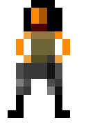 | `E7` | Tanya | Allied | 1800 | 10000 | None | 68 | 6c0 | Colt45, Colt45 | Demolition, DetectCloaked, Parachutable, ProducibleWithLevel |
|   | `Ant` | Giant Ant | — | 300 | 75000 | None | 92 | 4c0 | mandible | DetectCloaked, Parachutable |
|  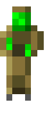 | `Zombie` | Zombie | — | 100 | 25000 | None | 39 | 4c0 | claw | DetectCloaked, Parachutable |
|  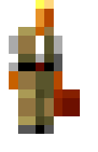 | `E6` | Engineer | — | 400 | 2500 | None | 54 | 4c0 | — | Captures, DetectCloaked, Parachutable |
|  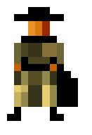 | `THF` | Thief | Soviet | 500 | 8000 | None | 72 | 5c0 | — | Captures, Cloak, DetectCloaked, Parachutable |
|  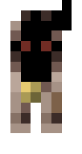 | `DOG` | Attack Dog | Soviet | 200 | 1800 | None | 100 | 5c512 | DogJaw | DetectCloaked, Parachutable |
|  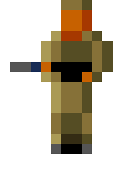 | `E1` | Rifle Infantry | — | 100 | 5000 | None | 54 | 4c0 | M1Carbine, Vulcan | DetectCloaked, Parachutable, ProducibleWithLevel |
|  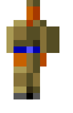 | `E2` | Grenadier | Soviet | 150 | 5000 | None | 68 | 4c0 | Grenade, Grenade | DetectCloaked, Parachutable, ProducibleWithLevel |
|  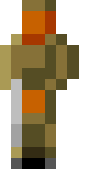 | `E3` | Rocket Soldier | — | 300 | 4500 | None | 54 | 4c0 | RedEye, Dragon, RedEye, Dragon | DetectCloaked, Parachutable, ProducibleWithLevel |
|  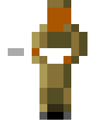 | `E4` | Flame Infantry | Soviet | 300 | 4000 | None | 54 | 4c0 | Flamer, Flamer | DetectCloaked, Parachutable, ProducibleWithLevel |
|  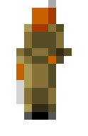 | `MEDI` | Medic | Allied | 200 | 6000 | None | 49 | 3c0 | Heal | DetectCloaked, Parachutable |
| 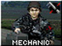 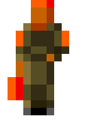 | `MECH` | Mechanic | Allied | 500 | 8000 | None | 49 | 3c0 | Repair | Captures, DetectCloaked, Parachutable |
|  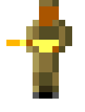 | `SHOK` | Shock Trooper | Soviet | 350 | 5000 | None | 54 | 5c0 | PortaTesla, PortaTesla | DetectCloaked, Parachutable, ProducibleWithLevel |
|   | `FireAnt` | Fire Ant | — | 300 | 7500 | Heavy | 68 | 4c0 | AntFireball | DetectCloaked, Parachutable |
|   | `ScoutAnt` | Scout Ant | — | 300 | 8500 | Light | 92 | 4c0 | mandible | DetectCloaked, Parachutable |

### Red Alert — Vehicle (21)

| Preview | Code | Name | Faction | Cost | HP | Armor | Speed | Sight | Weapon(s) | Notable traits |
| :---: | :--- | :--- | :--- | ---: | ---: | :--- | ---: | ---: | :--- | :--- |
| 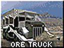 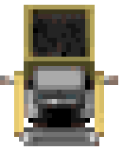 | `HARV` | Ore Truck | — | 1100 | 60000 | Heavy | 72 | 4c0 | — | Chronoshiftable, Parachutable, Repairable |
|  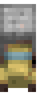 | `TRUK` | Supply Truck | — | 500 | 11000 | Light | 113 | 4c0 | — | Chronoshiftable, Parachutable, Repairable |
|  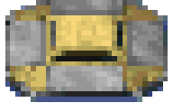 | `LST` | Transport | — | 500 | 40000 | Heavy | 115 | 6c0 | — | — |
|  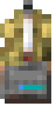 | `V2RL` | V2 Rocket Launcher | Soviet | 900 | 20000 | Light | 72 | 5c0 | SCUD | Chronoshiftable, Parachutable, ProducibleWithLevel, Repairable |
| 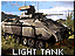 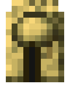 | `1TNK` | Light Tank | Allied | 700 | 23000 | Heavy | 113 | 5c0 | 25mm | Chronoshiftable, Parachutable, ProducibleWithLevel, Repairable |
|   | `2TNK` | Medium Tank | Allied | 850 | 46000 | Heavy | 72 | 6c0 | 90mm | Chronoshiftable, Parachutable, ProducibleWithLevel, Repairable |
| 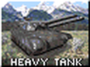 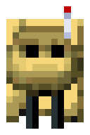 | `3TNK` | Heavy Tank | Soviet | 1150 | 60000 | Heavy | 64 | 6c0 | 105mm | Chronoshiftable, Parachutable, ProducibleWithLevel, Repairable |
|  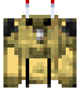 | `4TNK` | Mammoth Tank | Soviet | 2000 | 90000 | Heavy | 43 | 6c0 | 120mm, MammothTusk | Chronoshiftable, Parachutable, ProducibleWithLevel, Repairable |
|   | `ARTY` | Artillery | Allied | 850 | 10000 | Light | 72 | 5c0 | 155mm | Chronoshiftable, Parachutable, ProducibleWithLevel, Repairable |
|   | `MCV` | Mobile Construction Vehicle | — | 2000 | 60000 | Light | 60 | 4c0 | — | Chronoshiftable, Parachutable, Repairable, Transforms |
|   | `JEEP` | Ranger | Allied | 500 | 15000 | Light | 164 | 7c0 | M60mg | Chronoshiftable, Parachutable, ProducibleWithLevel, Repairable |
|   | `APC` | Armored Personnel Carrier | Soviet | 850 | 35000 | Heavy | 128 | 5c0 | M60mg | Chronoshiftable, Parachutable, ProducibleWithLevel, Repairable |
|   | `MNLY` | Minelayer | — | 800 | 30000 | Heavy | 113 | 5c0 | — | Chronoshiftable, DetectCloaked, Minelayer, Parachutable, Repairable |
|   | `MGG` | Mobile Gap Generator | Allied | 1000 | 22000 | Heavy | 72 | 6c0 | — | Chronoshiftable, Parachutable, Repairable |
|   | `MRJ` | Mobile Radar Jammer | Allied | 1000 | 22000 | Heavy | 68 | 7c0 | — | Chronoshiftable, Parachutable, Repairable |
|   | `TTNK` | Tesla Tank | Soviet | 1350 | 40000 | Light | 92 | 7c0 | TTankZap | Chronoshiftable, Parachutable, ProducibleWithLevel, Repairable |
|   | `FTRK` | Mobile Flak | Soviet | 600 | 15000 | Light | 113 | 6c0 | FLAK-23-AA, FLAK-23-AG | Chronoshiftable, Parachutable, ProducibleWithLevel, Repairable |
|   | `DTRK` | Demolition Truck | Soviet | 2500 | 2800 | Light | 67 | 4c0 | DemoTruckTargeting | Chronoshiftable, GrantConditionOnDeploy, Parachutable, Repairable |
|   | `CTNK` | Chrono Tank | Allied | 1350 | 40000 | Light | 86 | 6c0 | APTusk | Chronoshiftable, Parachutable, ProducibleWithLevel, Repairable |
|   | `QTNK` | MAD Tank | Soviet | 2000 | 90000 | Heavy | 46 | 6c0 | — | Chronoshiftable, Parachutable, Repairable |
|   | `STNK` | Phase Transport | Allied | 1000 | 35000 | Light | 128 | 7c0 | APTusk.stnk | Chronoshiftable, Cloak, Parachutable, ProducibleWithLevel, Repairable |

### Red Alert — Aircraft (6)

| Preview | Code | Name | Faction | Cost | HP | Armor | Speed | Sight | Weapon(s) | Notable traits |
| :---: | :--- | :--- | :--- | ---: | ---: | :--- | ---: | ---: | :--- | :--- |
|   | `MIG` | MiG Attack Plane | Soviet | 2000 | 8000 | Light | 223 | 13c0 | Maverick | ProducibleWithLevel, Repairable |
|   | `YAK` | Yak Attack Plane | Soviet | 1350 | 6000 | Light | 178 | 11c0 | ChainGun.Yak | ProducibleWithLevel, Repairable |
|   | `TRAN` | Chinook | Allied | 900 | 14000 | Light | 128 | 8c0 | — | Repairable |
|   | `HELI` | Longbow | Allied | 2000 | 12000 | Light | 149 | 12c0 | HellfireAA, HellfireAG | ProducibleWithLevel, Repairable |
|   | `HIND` | Hind | Allied | 1500 | 10000 | Light | 112 | 10c0 | ChainGun | ProducibleWithLevel, Repairable |
|   | `MH60` | Black Hawk | Allied | 1500 | 10000 | Light | 112 | 10c0 | ChainGun | ProducibleWithLevel, Repairable |

### Red Alert — Naval (5)

| Preview | Code | Name | Faction | Cost | HP | Armor | Speed | Sight | Weapon(s) | Notable traits |
| :---: | :--- | :--- | :--- | ---: | ---: | :--- | ---: | ---: | :--- | :--- |
|   | `SS` | Submarine | Soviet | 950 | 25000 | Light | 78 | 8c0 | TorpTube | Chronoshiftable, Cloak, DetectCloaked |
|   | `MSUB` | Missile Submarine | Soviet | 2000 | 40000 | Light | 44 | 8c0 | SubMissile, SubMissileAA | Chronoshiftable, Cloak, DetectCloaked |
|   | `DD` | Destroyer | Soviet | 1000 | 40000 | Heavy | 92 | 5c0 | Stinger, DepthCharge, StingerAA | Chronoshiftable, DetectCloaked |
|   | `CA` | Cruiser | Soviet / Allied | 2400 | 80000 | Heavy | 44 | 7c0 | 8Inch, 8Inch | Chronoshiftable |
|   | `PT` | Gunboat | Soviet | 500 | 20000 | Heavy | 142 | 8c0 | 2Inch, DepthCharge | Chronoshiftable, DetectCloaked |

### Red Alert — Building (43)

| Preview | Code | Name | Faction | Cost | HP | Armor | Speed | Sight | Weapon(s) | Notable traits |
| :---: | :--- | :--- | :--- | ---: | ---: | :--- | ---: | ---: | :--- | :--- |
|   | `SPEN` | Sub Pen | Soviet | 800 | 100000 | Wood | — | 5c0 | — | DetectCloaked |
|   | `SYRD` | Naval Yard | Allied | 1000 | 100000 | Wood | — | 5c0 | — | DetectCloaked |
|   | `FIX` | Service Depot | — | 1200 | 80000 | Wood | — | 5c0 | — | — |
|   | `MSLO` | Missile Silo | — | 2500 | 100000 | Wood | — | 6c0 | — | NukePower |
|   | `IRON` | Iron Curtain | Soviet | 2000 | 100000 | Wood | — | 6c0 | — | — |
|   | `DOME` | Radar Dome | — | 1500 | 100000 | Wood | — | 10c0 | — | ProvidesRadar |
|   | `ATEK` | Allied Tech Center | Allied | 1500 | 60000 | Wood | — | 5c0 | — | — |
|   | `WEAP` | War Factory | — | 2000 | 150000 | Wood | — | 5c0 | — | — |
|   | `PROC` | Ore Refinery | — | 1400 | 90000 | Wood | — | 5c0 | — | — |
|   | `HPAD` | Helipad | Allied | 500 | 80000 | Wood | — | 5c0 | — | — |
|   | `AFLD` | Airfield | Soviet | 500 | 100000 | Wood | — | 5c0 | — | AirstrikePower, ParatroopersPower |
|   | `POWR` | Power Plant | — | 300 | 40000 | Wood | — | 4c0 | — | — |
|   | `APWR` | Advanced Power Plant | — | 500 | 70000 | Wood | — | 5c0 | — | — |
|   | `BARR` | Soviet Barracks | Soviet | 500 | 60000 | Wood | — | 5c0 | — | — |
|   | `TENT` | Allied Barracks | Allied | 500 | 60000 | Wood | — | 5c0 | — | — |
|   | `FPWR` | Fake Power Plant | — | 30 | 40000 | Wood | — | 1c0 | — | — |
|   | `TENF` | Fake Allied Barracks | — | 50 | 60000 | Wood | — | 1c0 | — | — |
|   | `SYRF` | Fake Naval Yard | — | 100 | 100000 | Light | — | 1c0 | — | — |
|   | `SPEF` | Fake Sub Pen | — | 80 | 100000 | Light | — | 1c0 | — | — |
|   | `WEAF` | Fake War Factory | — | 200 | 150000 | Wood | — | 1c0 | — | — |
|   | `DOMF` | Fake Radar Dome | — | 180 | 100000 | Wood | — | 1c0 | — | — |
|   | `FIXF` | Fake Service Depot | — | 120 | 80000 | Wood | — | 1c0 | — | — |
|   | `FAPW` | Fake Advanced Power Plant | — | 50 | 70000 | Wood | — | 1c0 | — | — |
|   | `ATEF` | Fake Allied Tech Center | — | 150 | 40000 | Wood | — | 1c0 | — | — |
|   | `PDOF` | Fake Chronosphere | — | 150 | 100000 | Wood | — | 1c0 | — | — |
|   | `MSLF` | Fake Missile Silo | — | 250 | 100000 | Wood | — | 1c0 | — | — |
|   | `FACF` | Fake Construction Yard | — | 200 | 150000 | Wood | — | 1c0 | — | — |
|   | `GAP` | Gap Generator | Allied | 800 | 50000 | Heavy | — | 6c0 | — | — |
|   | `PDOX` | Chronosphere | Allied | 1500 | 100000 | Wood | — | 6c0 | — | — |
|   | `TSLA` | Tesla Coil | Soviet | 1200 | 40000 | Heavy | — | 7c0 | TeslaZap | DetectCloaked |
|   | `AGUN` | AA Gun | Allied | 800 | 40000 | Heavy | — | 6c0 | ZSU-23 | — |
|   | `PBOX` | Pillbox | Allied | 600 | 40000 | Heavy | — | 6c0 | — | DetectCloaked |
|   | `HBOX` | Camo Pillbox | Allied | 750 | 40000 | Heavy | — | 6c0 | — | Cloak, DetectCloaked |
|   | `GUN` | Turret | Allied | 800 | 40000 | Heavy | — | 6c512 | TurretGun | DetectCloaked |
|   | `FTUR` | Flame Tower | Soviet | 600 | 40000 | Heavy | — | 6c0 | FireballLauncher | DetectCloaked |
|   | `SAM` | SAM Site | Soviet | 700 | 40000 | Heavy | — | 8c0 | Nike | — |
|   | `FACT` | Construction Yard | — | 2000 | 150000 | Wood | — | 5c0 | — | BaseProvider, Transforms |
|   | `SILO` | Silo | — | 150 | 30000 | Wood | — | 4c0 | — | — |
|   | `STEK` | Soviet Tech Center | Soviet | 1500 | 80000 | Wood | — | 5c0 | — | — |
|   | `KENN` | Kennel | Soviet | 200 | 30000 | Wood | — | 4c0 | — | — |
|   | `SBAG` | Sandbag Wall | Allied | 30 | 15000 | Wood | — | — | — | — |
|   | `FENC` | Wire Fence | Soviet | 30 | 15000 | Wood | — | — | — | — |
|   | `BRIK` | Concrete Wall | — | 200 | 40000 | Concrete | — | — | — | — |

## Tiberian Dawn

*54 buildable actors.*

### Tiberian Dawn — Infantry (11)

| Preview | Code | Name | Faction | Cost | HP | Armor | Speed | Sight | Weapon(s) | Notable traits |
| :---: | :--- | :--- | :--- | ---: | ---: | :--- | ---: | ---: | :--- | :--- |
|   | `E6` | Engineer | GDI / Nod | 500 | 3000 | None | 46 | 5c0 | — | Captures, DetectCloaked |
|   | `E1` | Minigunner | GDI / Nod | 100 | 5000 | None | 54 | 5c0 | M16 | DetectCloaked |
|   | `E2` | Grenadier | GDI | 160 | 5000 | None | 68 | 5c0 | Grenade | DetectCloaked |
|   | `E3` | Rocket Soldier | GDI / Nod | 300 | 4500 | None | 39 | 5c0 | Rockets | DetectCloaked |
|   | `E4` | Flamethrower | Nod | 200 | 9000 | None | 54 | 5c0 | Flamethrower | DetectCloaked |
|   | `E5` | Chemical Warrior | Nod | 300 | 9000 | None | 54 | 5c0 | Chemspray | DetectCloaked |
|   | `RMBO` | Commando | GDI | 1500 | 15000 | None | 68 | 6c0 | Sniper | Demolition, DetectCloaked |
|   | `STEG` | Stegosaurus | GDI / Nod | 1000 | 100000 | Wood | 113 | 6c0 | tail | — |
|   | `TREX` | Tyrannosaurus rex | GDI / Nod | 1000 | 100000 | Wood | 113 | 6c0 | teeth | — |
|   | `TRIC` | Triceratops | GDI / Nod | 1000 | 100000 | Wood | 113 | 6c0 | horn | — |
|   | `RAPT` | Velociraptor | GDI / Nod | 1000 | 100000 | Wood | 113 | 6c0 | claw | — |

### Tiberian Dawn — Vehicle (17)

| Preview | Code | Name | Faction | Cost | HP | Armor | Speed | Sight | Weapon(s) | Notable traits |
| :---: | :--- | :--- | :--- | ---: | ---: | :--- | ---: | ---: | :--- | :--- |
|   | `TRUCK` | Supply Truck | GDI / Nod | 1000 | 11000 | Light | 113 | 4c0 | — | Repairable |
|   | `HARV` | Harvester | GDI / Nod | 1100 | 62500 | Heavy | 72 | 4c0 | — | Cloak, Repairable |
|   | `MCV` | Mobile Construction Vehicle | GDI / Nod | 3000 | 120000 | Heavy | 60 | 8c0 | — | Repairable, Transforms |
|   | `PVICE` | Visceroid | GDI / Nod | 700 | 30000 | Light | 68 | 6c0 | Chemspray | — |
|   | `APC` | APC | GDI | 600 | 19000 | Heavy | 128 | 7c0 | APCGun, APCGun.AA | Cloak, Repairable |
|   | `ARTY` | Artillery | Nod | 600 | 7500 | Light | 72 | 5c0 | ArtilleryShell | Cloak, Repairable |
|   | `FTNK` | Flame Tank | Nod | 600 | 27000 | Heavy | 92 | 6c0 | BigFlamer | Cloak, Repairable |
|   | `BGGY` | Nod Buggy | Nod | 300 | 12000 | Light | 170 | 8c0 | MachineGun | Cloak, Repairable |
|   | `BIKE` | Recon Bike | Nod | 500 | 11000 | Light | 192 | 8c0 | BikeRockets | Cloak, Repairable |
|   | `JEEP` | Hum-vee | GDI | 400 | 16000 | Light | 145 | 8c0 | MachineGunH | Cloak, Repairable |
|   | `LTNK` | Light Tank | Nod | 750 | 32000 | Heavy | 102 | 6c0 | 70mm | Cloak, Repairable |
|   | `MTNK` | Medium Tank | GDI | 900 | 45000 | Heavy | 72 | 6c0 | 120mm | Cloak, Repairable |
|   | `HTNK` | Mammoth Tank | GDI | 1800 | 87000 | Heavy | 46 | 6c0 | 120mmDual, MammothMissiles | Cloak, Repairable |
|   | `MSAM` | Rocket Launcher | GDI | 900 | 12000 | Light | 72 | 6c0 | 227mm, 227mm | Cloak, Repairable |
|   | `MLRS` | Mobile SAM | Nod | 600 | 18000 | Light | 92 | 8c0 | Patriot | Cloak, Repairable |
|   | `STNK` | Stealth Tank | Nod | 900 | 15000 | Light | 127 | 7c0 | 227mm.stnk, 227mm.stnkAA | Cloak, Repairable |
|   | `MHQ` | Mobile HQ | — | 1000 | 20000 | Light | 72 | 6c0 | — | Repairable |

### Tiberian Dawn — Aircraft (3)

| Preview | Code | Name | Faction | Cost | HP | Armor | Speed | Sight | Weapon(s) | Notable traits |
| :---: | :--- | :--- | :--- | ---: | ---: | :--- | ---: | ---: | :--- | :--- |
|   | `TRAN` | Chinook Transport | GDI / Nod | 750 | 12500 | Light | 150 | 10c0 | — | Repairable |
|   | `HELI` | Apache Longbow | Nod | 1200 | 12500 | Light | 180 | 10c0 | HeliAGGun, HeliAAGun | Repairable |
|   | `ORCA` | Orca | GDI | 1200 | 10000 | Light | 186 | 10c0 | OrcaAGMissiles, OrcaAAMissiles | Repairable |

### Tiberian Dawn — Building (23)

| Preview | Code | Name | Faction | Cost | HP | Armor | Speed | Sight | Weapon(s) | Notable traits |
| :---: | :--- | :--- | :--- | ---: | ---: | :--- | ---: | ---: | :--- | :--- |
|   | `MISS` | Tech Center | — | 0 | 80000 | Wood | — | 13c0 | — | — |
|   | `HPAD` | Helipad | GDI / Nod | 1000 | 60000 | Wood | — | 5c0 | — | — |
|   | `FIX` | Repair Facility | GDI / Nod | 500 | 80000 | Wood | — | 5c0 | — | — |
|   | `FACT` | Construction Yard | — | 3000 | 210000 | Wood | — | 10c0 | — | BaseProvider, Transforms |
|   | `NUKE` | Power Plant | GDI / Nod | 500 | 55000 | Wood | — | 4c0 | — | — |
|   | `NUK2` | Advanced Power Plant | GDI / Nod | 800 | 70000 | Wood | — | 4c0 | — | — |
|   | `PROC` | Tiberium Refinery | GDI / Nod | 1500 | 100000 | Wood | — | 6c0 | — | — |
|   | `SILO` | Tiberium Silo | GDI / Nod | 100 | 50000 | Wood | — | 4c0 | — | — |
|   | `PYLE` | Barracks | GDI | 500 | 60000 | Wood | — | 5c0 | — | — |
|   | `HAND` | Hand of Nod | Nod | 500 | 60000 | Wood | — | 5c0 | — | — |
|   | `AFLD` | Airstrip | Nod | 2000 | 110000 | Wood | — | 7c0 | — | — |
|   | `WEAP` | Weapons Factory | GDI | 2000 | 110000 | Wood | — | 4c0 | — | — |
|   | `HQ` | Communications Center | GDI / Nod | 1000 | 80000 | Wood | — | 10c0 | — | AirstrikePower, DetectCloaked, ProvidesRadar |
|   | `EYE` | Advanced Communications Center | GDI | 1800 | 130000 | Wood | — | 10c0 | — | DetectCloaked, IonCannonPower, ProvidesRadar |
|   | `TMPL` | Temple of Nod | Nod | 2000 | 210000 | Wood | — | 6c0 | — | DetectCloaked, NukePower |
|   | `GUN` | Turret | GDI / Nod | 600 | 41000 | Concrete | — | 6c0 | TurretGun | DetectCloaked |
|   | `SAM` | SAM Site | Nod | 650 | 40000 | Concrete | — | 8c0 | Dragon | — |
|   | `OBLI` | Obelisk of Light | Nod | 1500 | 75000 | Concrete | — | 8c0 | Laser | DetectCloaked |
|   | `GTWR` | Guard Tower | GDI / Nod | 600 | 40000 | Concrete | — | 7c0 | HighV | DetectCloaked |
|   | `ATWR` | Advanced Guard Tower | GDI | 1000 | 55000 | Concrete | — | 8c0 | TowerMissile, TowerAAMissile | DetectCloaked |
|   | `SBAG` | Sandbag Barrier | GDI | 25 | 10000 | Light | — | — | — | — |
|   | `CYCL` | Chain Link Barrier | Nod | 25 | 10000 | Light | — | — | — | — |
|   | `BRIK` | Concrete Barrier | GDI / Nod | 150 | 20000 | Concrete | — | — | — | — |

## Dune 2000

*45 buildable actors.*

### Dune 2000 — Infantry (10)

| Preview | Code | Name | Faction | Cost | HP | Armor | Speed | Sight | Weapon(s) | Notable traits |
| :---: | :--- | :--- | :--- | ---: | ---: | :--- | ---: | ---: | :--- | :--- |
|   | `saboteur` | Saboteur | — | 300 ## actually 0, but spawns from support power at Palace | 5000 | None | 43 | 4c768 | — | Cloak, Demolition, DetectCloaked, GrantConditionOnDeploy |
|   | `engineer` | Engineer | — | 400 | 5000 | None | 31 | 2c768 | — | Captures, DetectCloaked |
|   | `light_inf` | Light Infantry | — | 50 | 6000 | None | 43 | 3c768 | LMG | DetectCloaked |
|   | `trooper` | Trooper | — | 100 | 7000 | None | 31 | 4c768 | Bazooka | DetectCloaked |
|   | `thumper` | Thumper Infantry | — | 200 | 3750 | None | 43 | 2c768 | — | DetectCloaked, GrantConditionOnDeploy |
|   | `fremen` | Fremen | — | 200 ## actually 0, but spawns from support power at Palace | 7000 | None | 43 | 4c768 | Fremen_S, Fremen_L | Cloak, DetectCloaked |
|   | `grenadier` | Grenadier | Atreides | 80 | 6000 | None | 43 | 3c768 | grenade | DetectCloaked |
|   | `sardaukar` | Sardaukar | — | 120 | 10000 | None | 31 | 4c768 | M_LMG, M_HMG | DetectCloaked |
|   | `mpsardaukar` | Sardaukar | Harkonnen | 200 | 10000 | None | 31 | 4c768 | M_LMG_H, M_HMG_H | DetectCloaked |
|   | `nsfremen` | Fremen | — | 200 ## actually 0, but spawns from support power at Palace | 7000 | None | 43 | 4c768 | Fremen_S, Fremen_L | DetectCloaked |

### Dune 2000 — Vehicle (14)

| Preview | Code | Name | Faction | Cost | HP | Armor | Speed | Sight | Weapon(s) | Notable traits |
| :---: | :--- | :--- | :--- | ---: | ---: | :--- | ---: | ---: | :--- | :--- |
|   | `harvester` | Spice Harvester | — | 1200 | 45000 | Harvester | 43 | 3c768 | — | Repairable |
|   | `mcv` | Mobile Construction Vehicle | — | 2000 | 45000 | Light | 31 | 2c768 | — | Repairable, Transforms |
|   | `trike` | Trike | — | 300 | 9000 | Wood | 128 | 5c512 | HMG | Repairable |
|   | `quad` | Missile Quad | — | 400 | 11000 | Light | 96 | 4c768 | Rocket | Repairable |
|   | `siege_tank` | Siege Tank | — | 800 | 11500 | Light | 40 | 6c768 | 155mm | Repairable |
|   | `missile_tank` | Missile Tank | — | 900 | 13000 | Wood | 60 | 6c768 | mtank_pri | Repairable |
|   | `sonic_tank` | Sonic Tank | Atreides | 1100 | 30000 | Light | 31 | 5c768 | Sound | Repairable |
|   | `devastator` | Devastator | Harkonnen | 1200 | 50000 | Heavy | 31 | 5c512 | DevBullet | GrantConditionOnDeploy, Repairable |
|   | `raider` | Raider Trike | — | 330 | 9200 | Wood | 140 | 4c768 | HMGo | Repairable |
|   | `stealth_raider` | Stealth Raider Trike | Ordos | 400 | 10000 | Wood | 140 | 4c768 | HMGo | Cloak, Repairable |
|   | `deviator` | Deviator | Ordos | 1000 | 12500 | Wood | 53 | 6c0 | DeviatorMissile | Repairable |
|   | `combat_tank_a` | Atreides Combat Tank | — | 700 | 22000 | Heavy | 75 | 5c768 | 80mm_A | Repairable |
|   | `combat_tank_h` | Harkonnen Combat Tank | — | 700 | 28500 | Heavy | 64 | 5c768 | 80mm_H | Repairable |
|   | `combat_tank_o` | Ordos Combat Tank | — | 700 | 19000 | Heavy | 85 | 5c768 | 80mm_O | Repairable |

### Dune 2000 — Aircraft (2)

| Preview | Code | Name | Faction | Cost | HP | Armor | Speed | Sight | Weapon(s) | Notable traits |
| :---: | :--- | :--- | :--- | ---: | ---: | :--- | ---: | ---: | :--- | :--- |
|   | `carryall` | Carryall | — | 1000 | 20000 | Light | 170 | — | — | — |
|   | `ornithopter` | Ornithopter | — | — | 8000 | Light | 224 | — | OrniBomb | — |

### Dune 2000 — Building (19)

| Preview | Code | Name | Faction | Cost | HP | Armor | Speed | Sight | Weapon(s) | Notable traits |
| :---: | :--- | :--- | :--- | ---: | ---: | :--- | ---: | ---: | :--- | :--- |
|   | `silo` | Silo | — | 120 | 15000 | Building | — | 2c768 | — | — |
|   | `wall` | Concrete Wall | — | 100 | 20000 | Wall | — | 1c768 | — | — |
|   | `repair_pad` | Repair Pad | — | 800 | 30000 | Building | — | 3c768 | — | — |
|   | `deathhand` | Death Hand | — | — | — | — | — | — | — | — |
|   | `concretea` | Concrete Slab | — | 20 | — | — | — | — | — | — |
|   | `concreteb` | Large Concrete Slab | — | 50 | — | — | — | — | — | — |
|   | `construction_yard` | Construction Yard | — | 2000 | 30000 | Cy | — | 5c768 | — | — |
|   | `wind_trap` | Wind Trap | — | 225 | 28000 | Building | — | 3c768 | — | — |
|   | `barracks` | Barracks | — | 300 | 32000 | Building | — | 3c768 | — | — |
|   | `refinery` | Spice Refinery | — | 1500 | 30000 | Building | — | 3c768 | — | — |
|   | `light_factory` | Light Factory | — | 600 | 33000 | Building | — | 5c768 | — | — |
|   | `heavy_factory` | Heavy Factory | — | 1200 | 35000 | Building | — | 4c768 | — | — |
|   | `outpost` | Outpost | — | 750 | 35000 | Building | — | 11c0 | — | DetectCloaked, ProvidesRadar |
|   | `starport` | Starport | — | 1500 | 35000 | Heavy | — | 3c768 | — | — |
|   | `medium_gun_turret` | Gun Turret | — | 550 | 24000 | Wall | — | 5c0 | 110mm_Gun | DetectCloaked |
|   | `large_gun_turret` | Rocket Turret | — | 750 | 27000 | Wall | — | 6c0 | TowerMissile | DetectCloaked |
|   | `high_tech_factory` | High Tech Factory | — | 1150 | 35000 | Building | — | 4c768 | — | AirstrikePower |
|   | `research_centre` | IX Research Center | — | 1000 | 25000 | Building | — | 4c768 | — | — |
|   | `palace` | Palace | — | 1600 | 40000 | Heavy | — | 4c768 | — | NukePower |

## Tiberian Sun

*80 buildable actors.*

### Tiberian Sun — Infantry (10)

| Preview | Code | Name | Faction | Cost | HP | Armor | Speed | Sight | Weapon(s) | Notable traits |
| :---: | :--- | :--- | :--- | ---: | ---: | :--- | ---: | ---: | :--- | :--- |
|   | `E2` | Disc Thrower | — | 200 | 15000 | None | 56 | 7c0 | Grenade | Cloak, ProducibleWithLevel |
|   | `MEDIC` | Medic | — | 600 | 12500 | None | 56 | 6c0 | Heal | Cloak |
|   | `GHOST` | Ghost Stalker | — | 1750 | 20000 | Light | 56 | 6c0 | LtRail | Cloak, Demolition, ProducibleWithLevel |
|   | `SMECH` | Wolverine | — | 500 | 17500 | Light | 99 | 6c0 | AssaultCannon | Cloak, Repairable |
|   | `E3` | Rocket Infantry | — | 250 | 10000 | None | 56 | 7c0 | Bazooka | Cloak, ProducibleWithLevel |
|   | `CYBORG` | Cyborg Infantry | — | 650 | 30000 | Light | 56 | 5c0 | Vulcan3 | Cloak, ProducibleWithLevel |
|   | `CYC2` | Cyborg Commando | — | 2000 | 50000 | Heavy | 56 | 7c0 | CyCannon | Cloak, ProducibleWithLevel |
|   | `MHIJACK` | Mutant Hijacker | — | 1850 | 30000 | None | 99 | 6c0 | — | Captures, Cloak |
|   | `E1` | Light Infantry | — | 120 | 12500 | None | 71 | 5c0 | Minigun, M1Carbine | Cloak, ProducibleWithLevel |
|   | `ENGINEER` | Engineer | — | 500 | 10000 | None | 56 | 4c0 | — | Captures, Cloak |

### Tiberian Sun — Vehicle (20)

| Preview | Code | Name | Faction | Cost | HP | Armor | Speed | Sight | Weapon(s) | Notable traits |
| :---: | :--- | :--- | :--- | ---: | ---: | :--- | ---: | ---: | :--- | :--- |
|   | `JUMPJET` | Jump Jet Infantry | — | 600 | 12000 | Light | 71 | 6c0 | JumpCannon | Cloak, ProducibleWithLevel |
|   | `APC` | Amphibious APC | — | 800 | 20000 | Heavy | 113 | 5c0 | — | Cloak, Repairable |
|   | `MMCH` | Titan | — | 800 | 40000 | Heavy | 56 | 8c0 | 120mm | Cloak, DetectCloaked, Repairable |
|   | `HMEC` | Mammoth Mk. II | — | 3000 | 80000 | Heavy | 42 | 8c0 | MammothTusk, MechRailgun | Cloak, Repairable |
|   | `SONIC` | Disruptor | — | 1300 | 50000 | Heavy | 56 | 7c0 | SonicZap | Cloak, Repairable |
|   | `JUGG` | Juggernaut | — | 950 | 35000 | Light | 71 | 9c0 | Jugg90mm | Cloak, GrantConditionOnDeploy, Repairable |
|   | `MOBILEMP` | Mobile EMP Cannon | — | 1000 | 80000 | Heavy | 85 | 6c0 | — | Cloak, Repairable |
|   | `BGGY` | Attack Buggy | — | 500 | 22000 | Light | 142 | 6c0 | RaiderCannon | Cloak, Repairable |
|   | `BIKE` | Attack Cycle | — | 600 | 15000 | Wood | 170 | 5c0 | BikeMissile, HoverMissile | Cloak, Repairable |
|   | `TTNK` | Tick Tank | — | 800 | 35000 | Light | 85 | 5c0 | 90mm, 120mmx, 90mm, 120mmx | Cloak, DetectCloaked, GrantConditionOnDeploy, Repairable |
|   | `ART2` | Artillery | — | 975 | 30000 | Light | 71 | 9c0 | 155mm | Cloak, GrantConditionOnDeploy, Repairable |
|   | `REPAIR` | Mobile Repair Vehicle | — | 1000 | 20000 | — | 85 | 5c0 | Repair | Cloak, Repairable |
|   | `WEED` | Weed Eater | — | 1400 | 60000 | Heavy | 71 | 4c0 | — | Cloak, Repairable |
|   | `SAPC` | Subterranean APC | — | 800 | 17500 | Heavy | 71 | 5c0 | — | Cloak, Repairable |
|   | `SUBTANK` | Devil's Tongue | — | 750 | 30000 | Light | 71 | 5c0 | FireballLauncher | Cloak, Repairable |
|   | `STNK` | Stealth Tank | — | 1100 | 18000 | Light | 85 | 5c0 | Dragon | Cloak, Repairable |
|   | `SGEN` | Mobile Stealth Generator | — | 1600 | 20000 | Light | 85 | 5c0 | — | Cloak, GrantConditionOnDeploy, Repairable |
|   | `MCV` | Mobile Construction Vehicle | — | 2500 | 100000 | Heavy | 42 | 6c0 | — | Cloak, Repairable, Transforms |
|   | `HARV` | Harvester | — | 1400 | 100000 | Heavy | 71 | 4c0 | — | Cloak, Repairable |
|   | `LPST` | Mobile Sensor Array | — | 950 | 60000 | Wood | 85 | 10c0 | — | Cloak, DetectCloaked, GrantConditionOnDeploy, Repairable |

### Tiberian Sun — Aircraft (6)

| Preview | Code | Name | Faction | Cost | HP | Armor | Speed | Sight | Weapon(s) | Notable traits |
| :---: | :--- | :--- | :--- | ---: | ---: | :--- | ---: | ---: | :--- | :--- |
|   | `ORCA` | Orca Fighter | — | 1000 | 20000 | Light | 186 | 2c0 | Hellfire | Cloak, Repairable |
|   | `ORCAB` | Orca Bomber | — | 1600 | 26000 | Light | 96 | 2c0 | Bomb | Cloak, Repairable |
|   | `ORCATRAN` | Orca Transport | — | 1200 | 20000 | Light | 84 | 2c0 | — | Cloak, Repairable |
|   | `TRNSPORT` | Carryall | — | 750 | 17500 | Light | 149 | 2c0 | — | Carryall, Cloak, Repairable |
|   | `SCRIN` | Banshee Fighter | — | 1500 | 28000 | Light | 200 | 2c0 | Proton | Cloak, Repairable |
|   | `APACHE` | Harpy | — | 1000 | 22500 | Light | 130 | 2c0 | HarpyClaw | Cloak, Repairable |

### Tiberian Sun — Naval (1)

| Preview | Code | Name | Faction | Cost | HP | Armor | Speed | Sight | Weapon(s) | Notable traits |
| :---: | :--- | :--- | :--- | ---: | ---: | :--- | ---: | ---: | :--- | :--- |
|   | `HVR` | Hover MLRS | — | 900 | 23000 | Wood | 99 | 7c0 | HoverMissile | Cloak, Repairable |

### Tiberian Sun — Building (43)

| Preview | Code | Name | Faction | Cost | HP | Armor | Speed | Sight | Weapon(s) | Notable traits |
| :---: | :--- | :--- | :--- | ---: | ---: | :--- | ---: | ---: | :--- | :--- |
|   | `GASAND` | Sandbags | — | 25 | 25000 | Light | — | — | — | Cloak |
|   | `GAPOWR` | GDI Power Plant | GDI | 300 | 75000 | Wood | — | 4c0 | — | Cloak |
|   | `GAPOWRUP` | Power Turbine | GDI | 150 | — | — | — | — | — | — |
|   | `GAPILE` | GDI Barracks | GDI | 300 | 80000 | Wood | — | 5c0 | — | Cloak |
|   | `GAWEAP` | GDI War Factory | GDI | 2000 | 100000 | Heavy | — | 4c0 | — | Cloak |
|   | `GAHPAD` | Helipad | GDI | 500 | 60000 | — | — | 5c0 | — | Cloak |
|   | `GADEPT` | Service Depot | GDI | 1200 | 110000 | — | — | 5c0 | — | Cloak |
|   | `GARADR` | GDI Radar | GDI | 1000 | 100000 | Wood | — | 10c0 | — | Cloak, DetectCloaked, ProvidesRadar |
|   | `GATECH` | GDI Tech Center | GDI | 1500 | 50000 | Wood | — | 4c0 | — | Cloak |
|   | `GAPLUG` | GDI Upgrade Center | GDI | 1000 | 100000 | Wood | — | 6c0 | — | Cloak, IonCannonPower |
|   | `GAPLUG2` | Seeker Control | GDI | 1000 | — | — | — | — | — | — |
|   | `GAPLUG3` | Ion Cannon Uplink | GDI | 1500 | — | — | — | — | — | — |
|   | `GAPLUG4` | Drop Pod Node | GDI | 1000 | — | — | — | — | — | — |
|   | `GAFIRE` | Firestorm Generator | GDI | 1500 | 100000 | — | — | 6c0 | — | Cloak |
|   | `GAWALL` | Concrete Wall | GDI | 50 | 22500 | Concrete | — | — | — | Cloak |
|   | `GAGATE_A` | GDI Gate | GDI | 250 | 35000 | Heavy | — | — | — | Cloak |
|   | `GAGATE_B` | GDI Gate | GDI | 250 | 35000 | Heavy | — | — | — | Cloak |
|   | `GACTWR` | Component Tower | GDI | 200 | 50000 | Light | — | 6c0 | VulcanTower, RPGTower, RedEye2 | Cloak, DetectCloaked |
|   | `GAVULC` | Vulcan Tower | GDI | 150 | — | — | — | — | — | — |
|   | `GAROCK` | RPG Upgrade | GDI | 600 | — | — | — | — | — | — |
|   | `GACSAM` | SAM Upgrade | GDI | 300 | — | — | — | — | — | — |
|   | `NAPOWR` | Nod Power Plant | Nod | 300 | 75000 | Wood | — | 4c0 | — | Cloak |
|   | `NAAPWR` | Nod Advanced Power Plant | Nod | 500 | 75000 | Wood | — | 4c0 | — | Cloak |
|   | `NAHAND` | Hand of Nod | Nod | 300 | 80000 | Wood | — | 5c0 | — | Cloak |
|   | `NAWEAP` | Nod War Factory | Nod | 2000 | 100000 | Heavy | — | 4c0 | — | Cloak |
|   | `NAHPAD` | Helipad | Nod | 500 | 60000 | — | — | 5c0 | — | Cloak |
|   | `NARADR` | Nod Radar | Nod | 1000 | 100000 | Wood | — | 10c0 | — | Cloak, DetectCloaked, ProvidesRadar |
|   | `NATECH` | Nod Tech Center | Nod | 1500 | 50000 | Wood | — | 4c0 | — | Cloak |
|   | `NASTLH` | Stealth Generator | Nod | 2500 | 60000 | Wood | — | 6c0 | — | Cloak |
|   | `NATMPL` | Temple of Nod | Nod | 2000 | 100000 | Wood | — | 6c0 | — | Cloak |
|   | `NAMISL` | Nod Missile Silo | Nod | 1300 | 100000 | Wood | — | 4c0 | — | Cloak, NukePower |
|   | `NAWAST` | Waste Refinery | Nod | 1600 | 40000 | — | — | 6c0 | — | Cloak |
|   | `NAWALL` | Concrete Wall | Nod | 50 | 22500 | Concrete | — | — | — | Cloak |
|   | `NAGATE_A` | Nod Gate | Nod | 250 | 35000 | Heavy | — | — | — | Cloak |
|   | `NAGATE_B` | Nod Gate | Nod | 250 | 35000 | Heavy | — | — | — | Cloak |
|   | `NAPOST` | Laser Fence | Nod | 200 | 30000 | Concrete | — | 4c0 | — | Cloak |
|   | `NALASR` | Laser Turret | Nod | 300 | 50000 | Wood | — | 7c0 | TurretLaserFire | Cloak, DetectCloaked |
|   | `NAOBEL` | Obelisk of Light | Nod | 1500 | 72500 | Wood | — | 8c0 | ObeliskLaserFire | Cloak, DetectCloaked |
|   | `NASAM` | S.A.M. Site | Nod | 500 | 60000 | Wood | — | 6c0 | RedEye2 | Cloak, DetectCloaked |
|   | `GACNST` | Construction Yard | — | 2500 | 150000 | Wood | — | 5c0 | — | Cloak, Transforms |
|   | `PROC` | Tiberium Refinery | — | 2000 | 90000 | — | — | 6c0 | — | Cloak |
|   | `GASILO` | Silo | — | 150 | 30000 | Wood | — | 4c0 | — | Cloak |
|   | `NAPULS` | EMP Cannon | — | 1000 | 50000 | Heavy | — | 8c0 | EMPulseCannon | Cloak, DetectCloaked |

## Summary

This appendix is a single-source, auto-generated reference to every buildable actor in OpenRA's four bundled mods, pairing each unit's cameo and internal codename with its faction, role, and core statistics drawn straight from the engine's own rules. It lowers the barrier to entry for new modders by putting the sprite, the YAML codename, and the numbers in one place, and it stays accurate over time because it is regenerated from the pinned source rather than maintained by hand.

## What to read next

- [Part 2.4 — Rules and Weapons](#file-chapters-Part_02_Chapter_04_Rules_Weapons) — how the actor and weapon YAML in these tables is defined.
- [Appendix H — Asset Visual Reference](#file-appendices-Appendix_H_Asset_Visual_Reference) — the file formats and engine classes behind cameos, sprites, and other assets.
- [Part 10.3 — Porting and Modding](#file-chapters-Part_10_Chapter_03_Port_And_Modding) — creating your own actor from scratch.


---

<a id="file-appendices-Appendix_J_Terrain_Tiles"></a>

<!-- --- FILE: appendices/Appendix_J_Terrain_Tiles.md --- -->

# Appendix J — Terrain Tile Reference {#file-appendices-Appendix_J_Terrain_Tiles}

This appendix catalogs every terrain template in every official OpenRA mod tileset.
Each row shows a rendered preview, the template ID, the source image file(s), the grid size,
the primary terrain type, and notes about the template.

## RA — Temperate

### `mods/ra/tilesets/temperat.yaml`

#### All Templates

| Preview | Id | Image(s) | Size | Primary Terrain | Notes |
| :-- | ---: | :--- | :--- | :--- | :--- |
|  | 1 | w1.tem | 1,1 | Water | Category: Terrain |
|  | 2 | w2.tem | 2,2 | Water | Category: Terrain |
|  | 3 | sh01.tem | 4,5 | Beach | Category: Beach; Mixed terrain: {'0': 'Beach', '1': 'Beach', '2': 'Beach', '3': 'Rock', '4': 'Beach', '5': 'Clear', '6': 'Clear', '7': 'Beach', '8': 'Beach', '9': 'Water', '10': 'Water', '11': 'River', '12': 'Water', '13': 'Water', '14': 'Beach', '15': 'Beach', '16': 'Water', '17': 'Beach', '18': 'Beach', '19': 'Beach'} |
|  | 4 | sh02.tem | 5,5 | Beach | Category: Beach; Mixed terrain: Beach (17), Clear (2), River (1), Rock (1), Rough (2), Water (2) |
|  | 5 | sh03.tem | 3,5 | Beach | Category: Beach; Mixed terrain: {'0': 'Beach', '1': 'Beach', '2': 'Clear', '3': 'Beach', '4': 'Beach', '5': 'Beach', '6': 'Beach', '7': 'Beach', '8': 'Beach', '9': 'Water', '10': 'Water', '11': 'Beach', '12': 'Water', '13': 'Beach', '14': 'Beach'} |
|  | 6 | sh04.tem | 3,3 | Beach | Category: Beach; Mixed terrain: {'0': 'Beach', '1': 'Beach', '2': 'Beach', '3': 'Beach', '4': 'Beach', '5': 'Beach', '6': 'Water', '7': 'Water', '8': 'Water'} |
|  | 7 | sh05.tem | 3,3 | Rock | Category: Beach; Mixed terrain: {'0': 'Beach', '1': 'Rock', '2': 'Beach', '3': 'Beach', '4': 'Rock', '5': 'Rock', '6': 'Rock', '7': 'River', '8': 'River'} |
|  | 8 | sh06.tem | 3,3 | Beach | Category: Beach; Mixed terrain: {'0': 'Beach', '1': 'Beach', '2': 'Beach', '3': 'Beach', '4': 'Beach', '5': 'Beach', '6': 'Water', '7': 'Water', '8': 'Water'} |
|  | 9 | sh07.tem | 3,3 | Beach | Category: Beach; Mixed terrain: {'0': 'Beach', '1': 'Beach', '2': 'Beach', '3': 'Beach', '4': 'Beach', '5': 'Beach', '6': 'Water', '7': 'Water', '8': 'Water'} |
|  | 10 | sh08.tem | 1,2 | Beach | Category: Beach |
|  | 11 | sh09.tem | 3,3 | Water | Category: Beach; Mixed terrain: {'0': 'Clear', '1': 'River', '2': 'Rock', '3': 'Clear', '4': 'River', '5': 'Beach', '6': 'Water', '7': 'Water', '8': 'Water'} |
|  | 12 | sh10.tem | 5,6 | Beach | Category: Beach; Mixed terrain: Beach (20), Clear (2), Rock (3), Water (5) |
|  | 13 | sh11.tem | 4,5 | Beach | Category: Beach; Mixed terrain: {'0': 'Beach', '1': 'Clear', '2': 'Beach', '3': 'Beach', '4': 'Beach', '5': 'Water', '6': 'Beach', '7': 'Beach', '8': 'Water', '9': 'Water', '10': 'Beach', '11': 'Beach', '12': 'Beach', '13': 'Beach', '14': 'Beach', '15': 'Beach', '16': 'Beach', '17': 'Beach', '18': 'Water', '19': 'Beach'} |
|  | 14 | sh12.tem | 3,5 | Beach | Category: Beach; Mixed terrain: {'0': 'Beach', '1': 'Clear', '2': 'Beach', '3': 'Beach', '4': 'Beach', '5': 'Beach', '6': 'Water', '7': 'Beach', '8': 'Beach', '9': 'Beach', '10': 'Water', '11': 'Beach', '12': 'Beach', '13': 'Beach', '14': 'Water'} |
|  | 15 | sh13.tem | 6,5 | Beach | Category: Beach; Mixed terrain: Beach (22), Clear (2), Rock (1), Rough (1), Water (4) |
|  | 16 | sh14.tem | 4,4 | Beach | Category: Beach; Mixed terrain: {'0': 'Beach', '1': 'Beach', '2': 'Clear', '3': 'Beach', '4': 'River', '5': 'Beach', '6': 'Beach', '7': 'Beach', '8': 'Rough', '9': 'Beach', '10': 'Beach', '11': 'Beach', '12': 'Beach', '13': 'Water', '14': 'Beach', '15': 'Beach'} |
|  | 17 | sh15.tem | 5,3 | Beach | Category: Beach; Mixed terrain: {'0': 'Water', '1': 'Water', '2': 'Beach', '3': 'Clear', '4': 'Beach', '5': 'Beach', '6': 'Water', '7': 'Beach', '8': 'Beach', '9': 'Beach', '10': 'Beach', '11': 'Beach', '12': 'Water', '13': 'Beach', '14': 'Beach'} |
|  | 18 | sh16.tem | 3,3 | Water | Category: Beach; Mixed terrain: {'0': 'Water', '1': 'Beach', '2': 'Clear', '3': 'Water', '4': 'Beach', '5': 'Clear', '6': 'Water', '7': 'Beach', '8': 'Clear'} |
|  | 19 | sh17.tem | 2,1 | Beach | Category: Beach; Mixed terrain: {'0': 'Beach', '1': 'Clear'} |
|  | 20 | sh18.tem | 3,3 | Water | Category: Beach; Mixed terrain: {'0': 'Water', '1': 'Water', '2': 'Rough', '3': 'Water', '4': 'River', '5': 'River', '6': 'Water', '7': 'Beach', '8': 'Rough'} |
|  | 21 | sh19.tem | 4,5 | Beach | Category: Beach; Mixed terrain: {'0': 'Beach', '1': 'Water', '2': 'Beach', '3': 'Clear', '4': 'Beach', '5': 'Beach', '6': 'Beach', '7': 'Clear', '8': 'Water', '9': 'Beach', '10': 'Beach', '11': 'Beach', '12': 'Water', '13': 'Beach', '14': 'Beach', '15': 'Beach', '16': 'Water', '17': 'Beach', '18': 'Clear', '19': 'Beach'} |
|  | 22 | sh20.tem | 5,4 | Beach | Category: Beach; Mixed terrain: {'0': 'Beach', '1': 'Beach', '2': 'Water', '3': 'Beach', '4': 'Beach', '5': 'Water', '6': 'Beach', '7': 'Beach', '8': 'Beach', '9': 'Beach', '10': 'Water', '11': 'Beach', '12': 'Beach', '13': 'Beach', '14': 'Beach', '15': 'Water', '16': 'Beach', '17': 'Beach', '18': 'Beach', '19': 'Beach'} |
|  | 23 | sh21.tem | 5,3 | Beach | Category: Beach; Mixed terrain: {'0': 'Beach', '1': 'Water', '2': 'Beach', '3': 'Beach', '4': 'Clear', '5': 'Water', '6': 'Beach', '7': 'Beach', '8': 'Clear', '9': 'Beach', '10': 'Water', '11': 'Beach', '12': 'Beach', '13': 'Beach', '14': 'Beach'} |
|  | 24 | sh22.tem | 6,5 | Beach | Category: Beach; Mixed terrain: Beach (21), Clear (1), Water (8) |
|  | 25 | sh23.tem | 5,5 | Beach | Category: Beach; Mixed terrain: Beach (16), Clear (2), River (1), Water (6) |
|  | 26 | sh24.tem | 3,4 | Beach | Category: Beach; Mixed terrain: {'0': 'Beach', '1': 'Water', '2': 'Beach', '3': 'Beach', '4': 'Water', '5': 'Water', '6': 'Beach', '7': 'Clear', '8': 'Beach', '9': 'Beach', '10': 'Beach', '11': 'Clear'} |
|  | 27 | sh25.tem | 3,3 | Rock | Category: Beach; Mixed terrain: {'0': 'Water', '1': 'Water', '2': 'Water', '3': 'Rock', '4': 'Rock', '5': 'Beach', '6': 'Rock', '7': 'Rock', '8': 'Beach'} |
|  | 28 | sh26.tem | 3,3 | Beach | Category: Beach; Mixed terrain: {'0': 'Water', '1': 'Water', '2': 'Water', '3': 'Beach', '4': 'Beach', '5': 'Rough', '6': 'Beach', '7': 'Beach', '8': 'Beach'} |
|  | 29 | sh27.tem | 3,3 | Beach | Category: Beach; Mixed terrain: {'0': 'Rock', '1': 'Rock', '2': 'Rock', '3': 'Beach', '4': 'Beach', '5': 'Beach', '6': 'Beach', '7': 'Beach', '8': 'Rough'} |
|  | 30 | sh28.tem | 3,3 | Rock | Category: Beach; Mixed terrain: {'0': 'Beach', '1': 'Rock', '2': 'Rock', '3': 'Beach', '4': 'Rock', '5': 'Rock', '6': 'Beach', '7': 'Rough', '8': 'Rough'} |
|  | 31 | sh29.tem | 1,2 | Beach | Category: Beach; Mixed terrain: {'0': 'Beach', '1': 'Clear'} |
|  | 32 | sh30.tem | 3,2 | River | Category: Beach; Mixed terrain: {'0': 'Beach', '1': 'River', '2': 'River', '3': 'Clear', '4': 'River', '5': 'Rough'} |
|  | 33 | sh31.tem | 6,5 | Beach | Category: Beach; Mixed terrain: Beach (17), Clear (5), Water (8) |
|  | 34 | sh32.tem | 4,4 | Beach | Category: Beach; Mixed terrain: {'0': 'Beach', '1': 'Beach', '2': 'Water', '3': 'Water', '4': 'Water', '5': 'Water', '6': 'Beach', '7': 'Beach', '8': 'Beach', '9': 'Beach', '10': 'Beach', '11': 'Beach', '12': 'Clear', '13': 'Clear', '14': 'Beach', '15': 'Beach'} |
|  | 35 | sh33.tem | 3,4 | Beach | Category: Beach; Mixed terrain: {'0': 'Beach', '1': 'Water', '2': 'Beach', '3': 'Water', '4': 'Beach', '5': 'Clear', '6': 'Beach', '7': 'Rough', '8': 'Beach', '9': 'Beach', '10': 'Beach', '11': 'Beach'} |
|  | 36 | sh34.tem | 6,5 | Beach | Category: Beach; Mixed terrain: Beach (25), Clear (1), Water (4) |
|  | 37 | sh35.tem | 4,4 | Beach | Category: Beach; Mixed terrain: {'0': 'Beach', '1': 'Beach', '2': 'Beach', '3': 'Water', '4': 'Beach', '5': 'Clear', '6': 'Beach', '7': 'Rough', '8': 'Beach', '9': 'Beach', '10': 'Beach', '11': 'Water', '12': 'Clear', '13': 'Beach', '14': 'Water', '15': 'Beach'} |
|  | 38 | sh36.tem | 4,3 | Beach | Category: Beach; Mixed terrain: {'0': 'Beach', '1': 'Beach', '2': 'Beach', '3': 'Water', '4': 'Beach', '5': 'Beach', '6': 'Water', '7': 'Beach', '8': 'Beach', '9': 'Water', '10': 'Water', '11': 'Beach'} |
|  | 39 | sh37.tem | 3,3 | Beach | Category: Beach; Mixed terrain: {'0': 'Beach', '1': 'Beach', '2': 'Water', '3': 'Clear', '4': 'Beach', '5': 'Water', '6': 'Rough', '7': 'Beach', '8': 'Water'} |
|  | 40 | sh38.tem | 2,1 | Clear | Category: Beach; Mixed terrain: {'0': 'Clear', '1': 'Beach'} |
|  | 41 | sh39.tem | 3,3 | Water | Category: Beach; Mixed terrain: {'0': 'Rock', '1': 'Beach', '2': 'Water', '3': 'River', '4': 'River', '5': 'Water', '6': 'Clear', '7': 'Beach', '8': 'Water'} |
|  | 42 | sh40.tem | 5,5 | Beach | Category: Beach; Mixed terrain: Beach (17), Clear (2), Water (6) |
|  | 43 | sh41.tem | 4,4 | Beach | Category: Beach; Mixed terrain: {'0': 'Beach', '1': 'Water', '2': 'Beach', '3': 'Beach', '4': 'Beach', '5': 'Beach', '6': 'Water', '7': 'Beach', '8': 'Beach', '9': 'Beach', '10': 'Water', '11': 'Water', '12': 'Beach', '13': 'Clear', '14': 'Beach', '15': 'Water'} |
|  | 44 | sh42.tem | 4,3 | Beach | Category: Beach; Mixed terrain: {'0': 'Beach', '1': 'Beach', '2': 'Water', '3': 'Beach', '4': 'Beach', '5': 'Beach', '6': 'Beach', '7': 'River', '8': 'Beach', '9': 'Clear', '10': 'Beach', '11': 'Water'} |
|  | 45 | sh43.tem | 3,3 | Beach | Category: Beach; Mixed terrain: {'0': 'Beach', '1': 'Beach', '2': 'Beach', '3': 'Beach', '4': 'Beach', '5': 'Beach', '6': 'Beach', '7': 'Water', '8': 'Water'} |
|  | 46 | sh44.tem | 2,2 | Water | Category: Beach; Mixed terrain: {'0': 'Water', '1': 'Beach', '2': 'River', '3': 'Water'} |
|  | 47 | sh45.tem | 3,3 | Water | Category: Beach; Mixed terrain: {'0': 'Water', '1': 'Beach', '2': 'Water', '3': 'Water', '4': 'Rough', '5': 'Beach', '6': 'Water', '7': 'River', '8': 'Beach'} |
|  | 48 | sh46.tem | 2,2 | River | Category: Beach; Mixed terrain: {'0': 'Water', '1': 'River', '2': 'River', '3': 'Beach'} |
|  | 49 | sh47.tem | 3,3 | Beach | Category: Beach; Mixed terrain: {'0': 'Water', '1': 'Beach', '2': 'Beach', '3': 'Beach', '4': 'Water', '5': 'Beach', '6': 'Beach', '7': 'Beach', '8': 'Water'} |
|  | 50 | sh48.tem | 2,2 | Water | Category: Beach; Mixed terrain: {'0': 'Water', '1': 'Water', '2': 'Clear', '3': 'Beach'} |
|  | 51 | sh49.tem | 3,3 | Rock | Category: Beach; Mixed terrain: {'0': 'Beach', '1': 'Water', '2': 'Water', '3': 'Rock', '4': 'Rock', '5': 'River', '6': 'River', '7': 'Rock', '8': 'Rock'} |
|  | 52 | sh50.tem | 2,2 | Beach | Category: Beach; Mixed terrain: {'0': 'Beach', '1': 'Beach', '2': 'Beach', '3': 'Water'} |
|  | 53 | sh51.tem | 3,3 | Beach | Category: Beach; Mixed terrain: {'0': 'Clear', '1': 'Beach', '2': 'Beach', '3': 'Beach', '4': 'Beach', '5': 'Beach', '6': 'Beach', '7': 'Rough', '8': 'Clear'} |
|  | 54 | sh52.tem | 3,3 | Beach | Category: Beach; Mixed terrain: {'0': 'Beach', '1': 'Clear', '2': 'Clear', '3': 'Clear', '4': 'Beach', '5': 'Beach', '6': 'Beach', '7': 'Beach', '8': 'Water'} |
|  | 55 | sh53.tem | 3,3 | Beach | Category: Beach; Mixed terrain: {'0': 'Beach', '1': 'Clear', '2': 'Beach', '3': 'Beach', '4': 'Beach', '5': 'Clear', '6': 'Water', '7': 'Beach', '8': 'Clear'} |
|  | 56 | sh54.tem | 3,3 | Beach | Category: Beach; Mixed terrain: {'0': 'Water', '1': 'Beach', '2': 'Clear', '3': 'Beach', '4': 'Beach', '5': 'Beach', '6': 'Clear', '7': 'Beach', '8': 'Beach'} |
|  | 57 | sh55.tem | 1,1 | Rock | Category: Debris |
|  | 58 | sh56.tem | 2,1 | Rock | Category: Debris |
|  | 59 | wc01.tem | 2,2 | Rock | Category: Water Cliffs |
|  | 60 | wc02.tem | 2,3 | Rock | Category: Water Cliffs; Mixed terrain: {'0': 'Rock', '1': 'Rough', '2': 'Rock', '3': 'Rock', '4': 'Rock', '5': 'Rock'} |
|  | 61 | wc03.tem | 2,2 | Rock | Category: Water Cliffs |
|  | 62 | wc04.tem | 2,2 | Rock | Category: Water Cliffs |
|  | 63 | wc05.tem | 2,2 | Rock | Category: Water Cliffs |
|  | 64 | wc06.tem | 2,3 | Rock | Category: Water Cliffs; Mixed terrain: {'0': 'Rough', '1': 'Rock', '2': 'Rock', '3': 'Rock', '4': 'Rock', '5': 'Beach'} |
|  | 65 | wc07.tem | 2,2 | Rock | Category: Water Cliffs |
|  | 66 | wc08.tem | 2,2 | Rock | Category: Water Cliffs |
|  | 67 | wc09.tem | 3,2 | Rock | Category: Water Cliffs; Mixed terrain: {'0': 'Rock', '1': 'Rock', '2': 'Rock', '3': 'River', '4': 'Rock', '5': 'Rock'} |
|  | 68 | wc10.tem | 2,2 | Rock | Category: Water Cliffs |
|  | 69 | wc11.tem | 2,2 | Rock | Category: Water Cliffs |
|  | 70 | wc12.tem | 2,2 | Rock | Category: Water Cliffs |
|  | 71 | wc13.tem | 3,2 | Rock | Category: Water Cliffs; Mixed terrain: {'0': 'Rock', '1': 'Rock', '2': 'Rough', '3': 'Rock', '4': 'Rock', '5': 'Clear'} |
|  | 72 | wc14.tem | 2,2 | Beach | Category: Water Cliffs; Mixed terrain: {'0': 'Rock', '1': 'Beach', '2': 'Beach', '3': 'Beach'} |
|  | 73 | wc15.tem | 2,2 | Rock | Category: Water Cliffs |
|  | 74 | wc16.tem | 2,3 | Rock | Category: Water Cliffs; Mixed terrain: {'0': 'Water', '1': 'Beach', '2': 'Rock', '3': 'Rock', '4': 'Beach', '5': 'Rock'} |
|  | 75 | wc17.tem | 2,2 | Rock | Category: Water Cliffs |
|  | 76 | wc18.tem | 2,2 | Rock | Category: Water Cliffs |
|  | 77 | wc19.tem | 2,2 | Rock | Category: Water Cliffs |
|  | 78 | wc20.tem | 2,3 | Rock | Category: Water Cliffs; Mixed terrain: {'0': 'Beach', '1': 'River', '2': 'Rock', '3': 'Rock', '4': 'Rock', '5': 'Rough'} |
|  | 79 | wc21.tem | 1,2 | Rock | Category: Water Cliffs |
|  | 80 | wc22.tem | 2,2 | Rock | Category: Water Cliffs |
|  | 81 | wc23.tem | 3,2 | Rock | Category: Water Cliffs; Mixed terrain: {'0': 'Rock', '1': 'Rock', '2': 'River', '3': 'Rock', '4': 'Rock', '5': 'Water'} |
|  | 82 | wc24.tem | 2,2 | Rock | Category: Water Cliffs |
|  | 83 | wc25.tem | 2,2 | Rock | Category: Water Cliffs |
|  | 84 | wc26.tem | 2,2 | Rock | Category: Water Cliffs |
|  | 85 | wc27.tem | 3,2 | Rock | Category: Water Cliffs; Mixed terrain: {'0': 'Rock', '1': 'Rock', '2': 'Water', '3': 'Clear', '4': 'Rock', '5': 'Rock'} |
|  | 86 | wc28.tem | 2,2 | Rock | Category: Water Cliffs; Mixed terrain: {'0': 'Rock', '1': 'Rock', '2': 'Beach', '3': 'Rock'} |
|  | 87 | wc29.tem | 2,2 | Rock | Category: Water Cliffs |
|  | 88 | wc30.tem | 2,2 | Rock | Category: Water Cliffs |
|  | 89 | wc31.tem | 2,2 | Rock | Category: Water Cliffs; Mixed terrain: {'0': 'Rock', '1': 'River', '2': 'Rock', '3': 'Rock'} |
|  | 90 | wc32.tem | 2,2 | Rock | Category: Water Cliffs; Mixed terrain: {'0': 'Rock', '1': 'Rock', '2': 'Water', '3': 'Beach'} |
|  | 91 | wc33.tem | 2,2 | Rock | Category: Water Cliffs |
|  | 92 | wc34.tem | 2,2 | Rock | Category: Water Cliffs |
|  | 93 | wc35.tem | 2,2 | Rock | Category: Water Cliffs |
|  | 94 | wc36.tem | 2,2 | Rock | Category: Water Cliffs |
|  | 95 | wc37.tem | 2,2 | Rock | Category: Water Cliffs |
|  | 96 | wc38.tem | 2,2 | Rock | Category: Water Cliffs |
|  | 97 | b1.tem | 1,1 | Rock | Category: Debris |
|  | 98 | b2.tem | 2,1 | Rock | Category: Debris |
|  | 99 | b3.tem | 3,1 | Rock | Category: Debris |
|  | 103 | p01.tem | 1,1 | Rock | Category: Debris |
|  | 104 | p02.tem | 1,1 | Rock | Category: Debris |
|  | 105 | p03.tem | 1,1 | Rock | Category: Debris |
|  | 106 | p04.tem | 1,1 | Rock | Category: Debris |
|  | 107 | p07.tem | 4,2 | Clear | Category: Debris; Mixed terrain: {'0': 'Rough', '1': 'Clear', '2': 'Clear', '3': 'Clear', '4': 'Clear', '5': 'Clear', '6': 'Clear', '7': 'Clear'} |
|  | 108 | p08.tem | 3,2 | Clear | Category: Debris |
|  | 109 | p13.tem | 3,2 | Rock | Category: Debris |
|  | 110 | p14.tem | 2,1 | Rock | Category: Debris |
|  | 112 | rv01.tem | 5,4 | Rock | Category: River; Mixed terrain: {'0': 'Rock', '1': 'Rock', '2': 'Beach', '3': 'Beach', '4': 'Beach', '5': 'Rock', '6': 'River', '7': 'River', '8': 'River', '9': 'River', '10': 'Rock', '11': 'Rock', '12': 'Rock', '13': 'Rock', '14': 'Rock', '15': 'Beach', '16': 'Rock', '17': 'Rough', '18': 'Beach', '19': 'Beach'} |
|  | 113 | rv02.tem | 5,3 | Rock | Category: River; Mixed terrain: {'0': 'Rock', '1': 'Rock', '2': 'Rock', '3': 'Rough', '4': 'Rough', '5': 'River', '6': 'River', '7': 'River', '8': 'River', '9': 'River', '10': 'Rock', '11': 'Rock', '12': 'Rock', '13': 'Beach', '14': 'Beach'} |
|  | 114 | rv03.tem | 4,4 | Rock | Category: River; Mixed terrain: {'0': 'Rock', '1': 'Rough', '2': 'Beach', '3': 'Beach', '4': 'Rock', '5': 'Rock', '6': 'Rock', '7': 'Clear', '8': 'Rock', '9': 'Rock', '10': 'River', '11': 'River', '12': 'Beach', '13': 'Clear', '14': 'Clear', '15': 'Rock'} |
|  | 115 | rv04.tem | 4,4 | Rock | Category: River; Mixed terrain: {'0': 'Beach', '1': 'Beach', '2': 'Rock', '3': 'Rough', '4': 'Beach', '5': 'Rough', '6': 'Rock', '7': 'River', '8': 'River', '9': 'River', '10': 'River', '11': 'River', '12': 'Rock', '13': 'Rock', '14': 'Rock', '15': 'Beach'} |
|  | 116 | rv05.tem | 3,3 | Rock | Category: River; Mixed terrain: {'0': 'Clear', '1': 'River', '2': 'Rock', '3': 'Rock', '4': 'River', '5': 'Rock', '6': 'Rock', '7': 'River', '8': 'Rock'} |
|  | 117 | rv06.tem | 3,2 | Rock | Category: River; Mixed terrain: {'0': 'Rock', '1': 'River', '2': 'Rock', '3': 'Rock', '4': 'River', '5': 'Rock'} |
|  | 118 | rv07.tem | 3,2 | Rock | Category: River; Mixed terrain: {'0': 'Rock', '1': 'Rock', '2': 'River', '3': 'Rock', '4': 'Rock', '5': 'River'} |
|  | 119 | rv08.tem | 2,2 | River | Category: River; Mixed terrain: {'0': 'Rock', '1': 'River', '2': 'River', '3': 'River'} |
|  | 120 | rv09.tem | 2,2 | Clear | Category: River; Mixed terrain: {'0': 'Clear', '1': 'Clear', '2': 'River', '3': 'River'} |
|  | 121 | rv10.tem | 2,2 | River | Category: River; Mixed terrain: {'0': 'River', '1': 'River', '2': 'Rock', '3': 'River'} |
|  | 122 | rv11.tem | 2,2 | River | Category: River; Mixed terrain: {'0': 'River', '1': 'River', '2': 'River', '3': 'Rock'} |
|  | 123 | rv12.tem | 3,4 | River | Category: River; Mixed terrain: {'0': 'Clear', '1': 'River', '2': 'Rock', '3': 'Rock', '4': 'River', '5': 'Rock', '6': 'River', '7': 'River', '8': 'Rock', '9': 'Rough', '10': 'River', '11': 'Rock'} |
|  | 124 | rv13.tem | 4,4 | River | Category: River; Mixed terrain: {'0': 'Beach', '1': 'Beach', '2': 'Clear', '3': 'Rough', '4': 'River', '5': 'River', '6': 'River', '7': 'River', '8': 'River', '9': 'Rock', '10': 'River', '11': 'Rock', '12': 'Clear', '13': 'Rock', '14': 'River', '15': 'Rough'} |
|  | 125 | falls1.tem | 3,3 | Rock | Category: River; Mixed terrain: {'0': 'Rock', '1': 'Rock', '2': 'Rock', '3': 'River', '4': 'Rock', '5': 'Rock', '6': 'Rough', '7': 'Rock', '8': 'Rock'} |
|  | 126 | falls1a.tem | 3,3 | Rock | Category: Water Cliffs; Mixed terrain: {'0': 'Water', '1': 'River', '2': 'Rock', '3': 'Water', '4': 'Rock', '5': 'Rock', '6': 'Water', '7': 'River', '8': 'Rock'} |
|  | 127 | falls2.tem | 3,2 | Rock | Category: River; Mixed terrain: {'0': 'Rock', '1': 'Rock', '2': 'Rock', '3': 'River', '4': 'Rock', '5': 'Rock'} |
|  | 128 | falls2a.tem | 3,2 | Rock | Category: Water Cliffs; Mixed terrain: {'0': 'Rock', '1': 'Rock', '2': 'Rock', '3': 'River', '4': 'River', '5': 'River'} |
|  | 129 | ford1.tem | 3,3 | Rough | Category: Bridge; Mixed terrain: {'0': 'Rough', '1': 'River', '2': 'Rough', '3': 'Road', '4': 'Rough', '5': 'Road', '6': 'Clear', '7': 'Rough', '8': 'Rough'} |
|  | 130 | ford2.tem | 3,3 | Rough | Category: Bridge; Mixed terrain: {'0': 'Rough', '1': 'Rough', '2': 'Rough', '3': 'Rock', '4': 'Rough', '5': 'Rough', '6': 'Clear', '7': 'Road', '8': 'Clear'} |
|  | 131 | bridge1.tem | 5,3 | Rock | Category: Bridge; Mixed terrain: {'0': 'Beach', '1': 'Rock', '2': 'Bridge', '3': 'Bridge', '4': 'Rock', '5': 'Rock', '6': 'Bridge', '7': 'Bridge', '8': 'Rock', '9': 'Rock', '10': 'Beach', '11': 'Beach', '12': 'Rock', '13': 'Beach', '14': 'Beach'} |
|  | 132 | bridge1d.tem | 5,3 | Rock | Category: Bridge; Mixed terrain: {'0': 'Beach', '1': 'Rock', '2': 'Rock', '3': 'Rock', '4': 'Rock', '5': 'Rock', '6': 'Rock', '7': 'Rock', '8': 'Rock', '9': 'Rock', '10': 'Beach', '11': 'Beach', '12': 'Rock', '13': 'Beach', '14': 'Beach'} |
|  | 133 | bridge2.tem | 5,2 | Rock | Category: Bridge; Mixed terrain: {'0': 'Rock', '1': 'Bridge', '2': 'Bridge', '3': 'Rock', '4': 'Beach', '5': 'Rock', '6': 'Rock', '7': 'Bridge', '8': 'Bridge', '9': 'Rock'} |
|  | 134 | bridge2d.tem | 5,2 | Rock | Category: Bridge; Mixed terrain: {'0': 'Rock', '1': 'Rock', '2': 'Rock', '3': 'Rock', '4': 'Beach', '5': 'Rock', '6': 'Rock', '7': 'Rock', '8': 'Rock', '9': 'Rock'} |
|  | 135 | s01.tem | 2,2 | Rock | Category: Cliffs |
|  | 136 | s02.tem | 2,3 | Rock | Category: Cliffs; Mixed terrain: {'0': 'Rock', '1': 'Rough', '2': 'Rock', '3': 'Rock', '4': 'Rock', '5': 'Rock'} |
|  | 137 | s03.tem | 2,2 | Rock | Category: Cliffs |
|  | 138 | s04.tem | 2,2 | Rock | Category: Cliffs |
|  | 139 | s05.tem | 2,2 | Rock | Category: Cliffs |
|  | 140 | s06.tem | 2,3 | Rock | Category: Cliffs; Mixed terrain: {'0': 'Rough', '1': 'Rock', '2': 'Rock', '3': 'Rock', '4': 'Rock', '5': 'Beach'} |
|  | 141 | s07.tem | 2,2 | Rock | Category: Cliffs |
|  | 142 | s08.tem | 2,2 | Rock | Category: Cliffs |
|  | 143 | s09.tem | 3,2 | Rock | Category: Cliffs |
|  | 144 | s10.tem | 2,2 | Rock | Category: Cliffs |
|  | 145 | s11.tem | 2,2 | Rock | Category: Cliffs |
|  | 146 | s12.tem | 2,2 | Rock | Category: Cliffs |
|  | 147 | s13.tem | 3,2 | Rock | Category: Cliffs; Mixed terrain: {'0': 'Rock', '1': 'Rock', '2': 'Rough', '3': 'Rock', '4': 'Rock', '5': 'Rough'} |
|  | 148 | s14.tem | 2,2 | Rock | Category: Cliffs; Mixed terrain: {'0': 'Rock', '1': 'Rough', '2': 'Rock', '3': 'Beach'} |
|  | 149 | s15.tem | 2,2 | Rock | Category: Cliffs |
|  | 150 | s16.tem | 2,3 | Rock | Category: Cliffs; Mixed terrain: {'0': 'Rough', '1': 'Beach', '2': 'Rock', '3': 'Rock', '4': 'Beach', '5': 'Rock'} |
|  | 151 | s17.tem | 2,2 | Rock | Category: Cliffs |
|  | 152 | s18.tem | 2,2 | Rock | Category: Cliffs |
|  | 153 | s19.tem | 2,2 | Rock | Category: Cliffs |
|  | 154 | s20.tem | 2,3 | Rock | Category: Cliffs; Mixed terrain: {'0': 'Beach', '1': 'Rock', '2': 'Rock', '3': 'Rock', '4': 'Rock', '5': 'Rough'} |
|  | 155 | s21.tem | 1,2 | Rock | Category: Cliffs |
|  | 156 | s22.tem | 2,1 | Rock | Category: Cliffs |
|  | 157 | s23.tem | 3,2 | Rock | Category: Cliffs; Mixed terrain: {'0': 'Rock', '1': 'Rock', '2': 'Rock', '3': 'Rock', '4': 'Rock', '5': 'Rough'} |
|  | 158 | s24.tem | 2,2 | Rock | Category: Cliffs |
|  | 159 | s25.tem | 2,2 | Rock | Category: Cliffs |
|  | 160 | s26.tem | 2,2 | Rock | Category: Cliffs |
|  | 161 | s27.tem | 3,2 | Rock | Category: Cliffs; Mixed terrain: {'0': 'Rock', '1': 'Rock', '2': 'Rough', '3': 'Rough', '4': 'Rock', '5': 'Rock'} |
|  | 162 | s28.tem | 2,2 | Rock | Category: Cliffs; Mixed terrain: {'0': 'Rock', '1': 'Rock', '2': 'Beach', '3': 'Rock'} |
|  | 163 | s29.tem | 2,2 | Rock | Category: Cliffs |
|  | 164 | s30.tem | 2,2 | Rock | Category: Cliffs |
|  | 165 | s31.tem | 2,2 | Rock | Category: Cliffs; Mixed terrain: {'0': 'Rock', '1': 'Rough', '2': 'Rock', '3': 'Rock'} |
|  | 166 | s32.tem | 2,2 | Rock | Category: Cliffs; Mixed terrain: {'0': 'Rock', '1': 'Rock', '2': 'Rough', '3': 'Beach'} |
|  | 167 | s33.tem | 2,2 | Rock | Category: Cliffs |
|  | 168 | s34.tem | 2,2 | Rock | Category: Cliffs |
|  | 169 | s35.tem | 2,2 | Rock | Category: Cliffs |
|  | 170 | s36.tem | 2,2 | Rock | Category: Cliffs |
|  | 171 | s37.tem | 2,2 | Rock | Category: Cliffs |
|  | 172 | s38.tem | 2,2 | Rock | Category: Cliffs |
|  | 173 | d01.tem | 2,2 | Clear | Category: Road; Mixed terrain: {'0': 'Beach', '1': 'Road', '2': 'Clear', '3': 'Clear'} |
|  | 174 | d02.tem | 2,2 | Clear | Category: Road; Mixed terrain: {'0': 'Clear', '1': 'Road', '2': 'Clear', '3': 'Clear'} |
|  | 175 | d03.tem | 1,2 | Clear | Category: Road; Mixed terrain: {'0': 'Clear', '1': 'Road'} |
|  | 176 | d04.tem | 2,2 | Clear | Category: Road; Mixed terrain: {'0': 'Beach', '1': 'Clear', '2': 'Road', '3': 'Clear'} |
|  | 177 | d05.tem | 3,4 | Road | Category: Road; Mixed terrain: {'0': 'Beach', '1': 'Road', '2': 'Clear', '3': 'Road', '4': 'Road', '5': 'Beach', '6': 'Road', '7': 'Road', '8': 'Beach', '9': 'Road', '10': 'Road', '11': 'Beach'} |
|  | 178 | d06.tem | 2,3 | Road | Category: Road; Mixed terrain: {'0': 'Road', '1': 'Beach', '2': 'Road', '3': 'Road', '4': 'Road', '5': 'Clear'} |
|  | 179 | d07.tem | 3,2 | Clear | Category: Road; Mixed terrain: {'0': 'Clear', '1': 'Road', '2': 'Clear', '3': 'Beach', '4': 'Road', '5': 'Clear'} |
|  | 180 | d08.tem | 3,2 | Beach | Category: Road; Mixed terrain: {'0': 'Beach', '1': 'Road', '2': 'Beach', '3': 'Clear', '4': 'Road', '5': 'Clear'} |
|  | 181 | d09.tem | 4,3 | Clear | Category: Road; Mixed terrain: {'0': 'Clear', '1': 'Clear', '2': 'Clear', '3': 'Clear', '4': 'Road', '5': 'Road', '6': 'Road', '7': 'Road', '8': 'Beach', '9': 'Beach', '10': 'Clear', '11': 'Clear'} |
|  | 182 | d10.tem | 4,2 | Road | Category: Road; Mixed terrain: {'0': 'Clear', '1': 'Rock', '2': 'Beach', '3': 'Beach', '4': 'Road', '5': 'Road', '6': 'Road', '7': 'Road'} |
|  | 183 | d11.tem | 2,3 | Beach | Category: Road; Mixed terrain: {'0': 'Beach', '1': 'Clear', '2': 'Road', '3': 'Road', '4': 'Clear', '5': 'Beach'} |
|  | 184 | d12.tem | 2,2 | Road | Category: Road; Mixed terrain: {'0': 'Clear', '1': 'Beach', '2': 'Road', '3': 'Road'} |
|  | 185 | d13.tem | 4,3 | Road | Category: Road; Mixed terrain: {'0': 'Road', '1': 'Road', '2': 'Clear', '3': 'Beach', '4': 'Clear', '5': 'Road', '6': 'Road', '7': 'Rock', '8': 'Beach', '9': 'Beach', '10': 'Rock', '11': 'Road'} |
|  | 186 | d14.tem | 3,3 | Road | Category: Road; Mixed terrain: {'0': 'Beach', '1': 'Clear', '2': 'Road', '3': 'Clear', '4': 'Rock', '5': 'Road', '6': 'Road', '7': 'Road', '8': 'Road'} |
|  | 187 | d15.tem | 3,3 | Road | Category: Road; Mixed terrain: {'0': 'Road', '1': 'Road', '2': 'Road', '3': 'Road', '4': 'Road', '5': 'Clear', '6': 'Road', '7': 'Clear', '8': 'Beach'} |
|  | 188 | d16.tem | 3,3 | Road | Category: Road; Mixed terrain: {'0': 'Clear', '1': 'Road', '2': 'Road', '3': 'Road', '4': 'Road', '5': 'Road', '6': 'Road', '7': 'Road', '8': 'Rock'} |
|  | 189 | d17.tem | 3,2 | Road | Category: Road; Mixed terrain: {'0': 'Road', '1': 'Road', '2': 'Road', '3': 'Clear', '4': 'Road', '5': 'Clear'} |
|  | 190 | d18.tem | 3,3 | Clear | Category: Road; Mixed terrain: {'0': 'Clear', '1': 'Road', '2': 'Clear', '3': 'Road', '4': 'Road', '5': 'Clear', '6': 'Clear', '7': 'Road', '8': 'Rock'} |
|  | 191 | d19.tem | 3,3 | Road | Category: Road; Mixed terrain: {'0': 'Clear', '1': 'Road', '2': 'Clear', '3': 'Road', '4': 'Road', '5': 'Road', '6': 'Clear', '7': 'Road', '8': 'Clear'} |
|  | 192 | d20.tem | 3,3 | Road | Category: Road; Mixed terrain: {'0': 'Road', '1': 'Clear', '2': 'Beach', '3': 'Road', '4': 'Road', '5': 'Clear', '6': 'Clear', '7': 'Road', '8': 'Road'} |
|  | 193 | d21.tem | 3,2 | Road | Category: Road; Mixed terrain: {'0': 'Rock', '1': 'Road', '2': 'Road', '3': 'Clear', '4': 'Road', '5': 'Rough'} |
|  | 194 | d22.tem | 3,3 | Clear | Category: Road; Mixed terrain: {'0': 'Beach', '1': 'Clear', '2': 'Beach', '3': 'Road', '4': 'Road', '5': 'Clear', '6': 'Clear', '7': 'Road', '8': 'Clear'} |
|  | 195 | d23.tem | 3,3 | Road | Category: Road; Mixed terrain: {'0': 'Beach', '1': 'Road', '2': 'Clear', '3': 'Clear', '4': 'Road', '5': 'Clear', '6': 'Road', '7': 'Road', '8': 'Beach'} |
|  | 196 | d24.tem | 3,3 | Road | Category: Road; Mixed terrain: {'0': 'Road', '1': 'Road', '2': 'Beach', '3': 'Road', '4': 'Road', '5': 'Road', '6': 'Beach', '7': 'Road', '8': 'Road'} |
|  | 197 | d25.tem | 3,3 | Road | Category: Road; Mixed terrain: {'0': 'Road', '1': 'Road', '2': 'Beach', '3': 'Road', '4': 'Road', '5': 'Road', '6': 'Beach', '7': 'Road', '8': 'Road'} |
|  | 198 | d26.tem | 2,2 | Beach | Category: Road; Mixed terrain: {'0': 'Beach', '1': 'Road', '2': 'Road', '3': 'Beach'} |
|  | 199 | d27.tem | 2,2 | Beach | Category: Road; Mixed terrain: {'0': 'Beach', '1': 'Road', '2': 'Road', '3': 'Beach'} |
|  | 200 | d28.tem | 2,2 | Road | Category: Road; Mixed terrain: {'0': 'Road', '1': 'Road', '2': 'Rough', '3': 'Beach'} |
|  | 201 | d29.tem | 2,2 | Road | Category: Road; Mixed terrain: {'0': 'Road', '1': 'Road', '2': 'Road', '3': 'Beach'} |
|  | 202 | d30.tem | 2,2 | Road | Category: Road; Mixed terrain: {'0': 'Road', '1': 'Road', '2': 'Road', '3': 'Beach'} |
|  | 203 | d31.tem | 2,2 | Road | Category: Road; Mixed terrain: {'0': 'Beach', '1': 'Road', '2': 'Road', '3': 'Road'} |
|  | 204 | d32.tem | 2,2 | Clear | Category: Road; Mixed terrain: {'0': 'Beach', '1': 'Clear', '2': 'Road', '3': 'Clear'} |
|  | 205 | d33.tem | 2,2 | Road | Category: Road; Mixed terrain: {'0': 'Beach', '1': 'Road', '2': 'Road', '3': 'Road'} |
|  | 206 | d34.tem | 3,3 | Road | Category: Road; Mixed terrain: {'0': 'Beach', '1': 'Road', '2': 'Road', '3': 'Road', '4': 'Road', '5': 'Road', '6': 'Road', '7': 'Road', '8': 'Beach'} |
|  | 207 | d35.tem | 3,3 | Road | Category: Road; Mixed terrain: {'0': 'Beach', '1': 'Road', '2': 'Road', '3': 'Road', '4': 'Road', '5': 'Road', '6': 'Road', '7': 'Road', '8': 'Beach'} |
|  | 208 | d36.tem | 2,2 | Road | Category: Road; Mixed terrain: {'0': 'Road', '1': 'Beach', '2': 'Beach', '3': 'Road'} |
|  | 209 | d37.tem | 2,2 | Road | Category: Road; Mixed terrain: {'0': 'Road', '1': 'Beach', '2': 'Beach', '3': 'Road'} |
|  | 210 | d38.tem | 2,2 | Road | Category: Road; Mixed terrain: {'0': 'Road', '1': 'Road', '2': 'Beach', '3': 'Road'} |
|  | 211 | d39.tem | 2,2 | Road | Category: Road; Mixed terrain: {'0': 'Road', '1': 'Road', '2': 'Beach', '3': 'Road'} |
|  | 212 | d40.tem | 2,2 | Road | Category: Road; Mixed terrain: {'0': 'Road', '1': 'Road', '2': 'Beach', '3': 'Road'} |
|  | 213 | d41.tem | 2,2 | Road | Category: Road; Mixed terrain: {'0': 'Rock', '1': 'Beach', '2': 'Road', '3': 'Road'} |
|  | 214 | d42.tem | 2,2 | Road | Category: Road; Mixed terrain: {'0': 'Road', '1': 'Beach', '2': 'Road', '3': 'Road'} |
|  | 215 | d43.tem | 2,2 | Road | Category: Road; Mixed terrain: {'0': 'Clear', '1': 'Beach', '2': 'Road', '3': 'Road'} |
|  | 216 | rf01.tem | 1,1 | Rock | Category: Debris |
|  | 217 | rf02.tem | 1,1 | Rock | Category: Debris |
|  | 218 | rf03.tem | 1,1 | Rock | Category: Debris |
|  | 219 | rf04.tem | 1,1 | Rock | Category: Debris |
|  | 220 | rf05.tem | 1,1 | Rock | Category: Debris |
|  | 221 | rf06.tem | 1,1 | Rock | Category: Debris |
|  | 222 | rf07.tem | 1,1 | Rock | Category: Debris |
|  | 223 | rf08.tem | 1,2 | Rock | Category: Debris |
|  | 224 | rf09.tem | 1,2 | Rock | Category: Debris |
|  | 225 | rf10.tem | 2,1 | Rough | Category: Debris |
|  | 226 | rf11.tem | 2,1 | Rock | Category: Debris |
|  | 227 | d44.tem | 1,1 | Road | Category: Road |
|  | 228 | d45.tem | 1,1 | Road | Category: Road |
|  | 229 | rv14.tem | 1,2 | Rock | Category: River; Mixed terrain: {'0': 'Rock', '1': 'River'} |
|  | 230 | rv15.tem | 2,1 | Rock | Category: River; Mixed terrain: {'0': 'Rock', '1': 'River'} |
|  | 231 | rc01.tem | 2,2 | Rock | Category: River |
|  | 232 | rc02.tem | 2,2 | Rock | Category: River |
|  | 233 | rc03.tem | 2,2 | Rock | Category: River |
|  | 234 | rc04.tem | 2,2 | Rock | Category: River |
|  | 235 | br1a.tem | 4,3 | Rock | Category: Bridge; Mixed terrain: {'0': 'Beach', '1': 'Rock', '2': 'Bridge', '3': 'Beach', '4': 'Rock', '5': 'Bridge', '6': 'Bridge', '7': 'Rock', '8': 'Beach', '9': 'Bridge', '10': 'Rock', '11': 'Rock'} |
|  | 236 | br1b.tem | 4,3 | Rock | Category: Bridge; Mixed terrain: {'0': 'Beach', '1': 'Rock', '2': 'Rough', '3': 'Beach', '4': 'Rock', '5': 'Rough', '6': 'Rough', '7': 'Rock', '8': 'Beach', '9': 'Rough', '10': 'Rock', '11': 'Rock'} |
|  | 237 | br1c.tem | 4,3 | Rock | Category: Bridge; Mixed terrain: {'0': 'Beach', '1': 'Rock', '2': 'Rock', '3': 'Beach', '4': 'Rock', '5': 'Rock', '6': 'Rock', '7': 'Rock', '8': 'Beach', '9': 'Rock', '10': 'Rock', '11': 'Rock'} |
|  | 238 | br2a.tem | 5,3 | Rock | Category: Bridge; Mixed terrain: {'0': 'Beach', '1': 'Rock', '2': 'Bridge', '3': 'Beach', '4': 'Beach', '5': 'Rock', '6': 'Bridge', '7': 'Bridge', '8': 'Rock', '9': 'Rock', '10': 'Beach', '11': 'Bridge', '12': 'Rock', '13': 'Rock', '14': 'Beach'} |
|  | 239 | br2b.tem | 5,3 | Rock | Category: Bridge; Mixed terrain: {'0': 'Beach', '1': 'Rock', '2': 'Rough', '3': 'Beach', '4': 'Beach', '5': 'Rock', '6': 'Rough', '7': 'Rough', '8': 'Rock', '9': 'Rock', '10': 'Beach', '11': 'Rough', '12': 'Rock', '13': 'Rock', '14': 'Beach'} |
|  | 240 | br2c.tem | 5,3 | Rock | Category: Bridge; Mixed terrain: {'0': 'Beach', '1': 'Water', '2': 'Water', '3': 'Beach', '4': 'Beach', '5': 'Rock', '6': 'Rock', '7': 'Rock', '8': 'Rock', '9': 'Rock', '10': 'Beach', '11': 'Rock', '12': 'Rock', '13': 'Rock', '14': 'Beach'} |
|  | 241 | br3a.tem | 4,2 | Rock | Category: Bridge; Mixed terrain: {'0': 'Rock', '1': 'Bridge', '2': 'Beach', '3': 'Beach', '4': 'Beach', '5': 'Bridge', '6': 'Rock', '7': 'Rock'} |
|  | 242 | br3b.tem | 4,2 | Rock | Category: Bridge; Mixed terrain: {'0': 'Rock', '1': 'Bridge', '2': 'Beach', '3': 'Beach', '4': 'Beach', '5': 'Bridge', '6': 'Rock', '7': 'Rock'} |
|  | 243 | br3c.tem | 4,2 | Rock | Category: Bridge; Mixed terrain: {'0': 'Rock', '1': 'Rock', '2': 'Beach', '3': 'Beach', '4': 'Beach', '5': 'Rock', '6': 'Rock', '7': 'Rock'} |
|  | 244 | br3d.tem | 4,2 | River | Category: Bridge; Mixed terrain: {'0': 'River', '1': 'Rock', '2': 'Beach', '3': 'Beach', '4': 'Beach', '5': 'River', '6': 'River', '7': 'River'} |
|  | 245 | br3e.tem | 4,2 | Water | Category: Bridge; Mixed terrain: {'0': 'Water', '1': 'Water', '2': 'Beach', '3': 'Beach', '4': 'Beach', '5': 'Rock', '6': 'Water', '7': 'Water'} |
|  | 246 | br3f.tem | 4,2 | Water | Category: Bridge; Mixed terrain: {'0': 'Water', '1': 'Water', '2': 'Beach', '3': 'Beach', '4': 'Beach', '5': 'Water', '6': 'Water', '7': 'Water'} |
|  | 247 | f01.tem | 3,3 | Beach | Category: Bridge; Mixed terrain: {'0': 'Rough', '1': 'Road', '2': 'Road', '3': 'Beach', '4': 'Beach', '5': 'Beach', '6': 'Beach', '7': 'Beach', '8': 'Beach'} |
|  | 248 | f02.tem | 3,3 | Beach | Category: Bridge |
|  | 249 | f03.tem | 3,3 | Beach | Category: Bridge; Mixed terrain: {'0': 'Beach', '1': 'Beach', '2': 'Beach', '3': 'Beach', '4': 'Beach', '5': 'Beach', '6': 'Clear', '7': 'Road', '8': 'Clear'} |
|  | 250 | f04.tem | 3,3 | Beach | Category: Bridge; Mixed terrain: {'0': 'Clear', '1': 'Beach', '2': 'Beach', '3': 'Road', '4': 'Beach', '5': 'Beach', '6': 'Clear', '7': 'Beach', '8': 'Beach'} |
|  | 251 | f05.tem | 3,3 | Beach | Category: Bridge |
|  | 252 | f06.tem | 3,3 | Beach | Category: Bridge; Mixed terrain: {'0': 'Beach', '1': 'Beach', '2': 'Clear', '3': 'Beach', '4': 'Beach', '5': 'Road', '6': 'Beach', '7': 'Beach', '8': 'Clear'} |
|  | 255 | clear1.tem | 1,1 | Clear | PickAny; Category: Terrain |
|  | 378 | bridge1h.tem | 5,3 | Beach | Category: Bridge; Mixed terrain: {'0': 'Beach', '1': 'Rock', '2': 'Rough', '3': 'Rough', '4': 'Rock', '5': 'Rock', '6': 'Rough', '7': 'Rough', '8': 'Rock', '9': 'Rock', '10': 'Beach', '11': 'Beach', '12': 'Rough', '13': 'Beach', '14': 'Beach'} |
|  | 379 | bridge2h.tem | 5,2 | Rock | Category: Bridge; Mixed terrain: {'0': 'Rock', '1': 'Rough', '2': 'Rough', '3': 'Rock', '4': 'Beach', '5': 'Rock', '6': 'Rock', '7': 'Rough', '8': 'Rough', '9': 'Rock'} |
|  | 380 | br1x.tem | 5,3 | Beach | Category: Bridge; Mixed terrain: {'0': 'Rock', '1': 'Beach', '2': 'Beach', '3': 'Road', '4': 'Clear', '5': 'Beach', '6': 'Beach', '7': 'Beach', '8': 'Beach', '9': 'Rock', '10': 'Beach', '11': 'Beach', '12': 'Beach', '13': 'Beach', '14': 'Water'} |
|  | 381 | br2x.tem | 5,1 | Beach | Category: Bridge; Mixed terrain: {'0': 'Road', '1': 'Beach', '2': 'Beach', '3': 'Beach', '4': 'Beach'} |
|  | 382 | bridge1x.tem | 5,4 | Beach | Category: Bridge; Mixed terrain: {'0': 'Beach', '1': 'Beach', '2': 'Clear', '3': 'Bridge', '4': 'Bridge', '5': 'Rock', '6': 'Beach', '7': 'Beach', '8': 'Beach', '9': 'Beach', '10': 'Beach', '11': 'Beach', '12': 'Beach', '13': 'Beach', '14': 'Beach', '15': 'Bridge', '16': 'Bridge', '17': 'Beach', '18': 'Rock', '19': 'Rock'} |
|  | 383 | bridge2x.tem | 5,5 | Beach | Category: Bridge; Mixed terrain: Beach (12), Bridge (6), Clear (1), River (1), Rock (2), Rough (3) |
|  | 400 | hill01.tem | 4,3 | Rock | Category: Debris; Mixed terrain: {'0': 'Rough', '1': 'Rock', '2': 'Rock', '3': 'Rock', '4': 'Rock', '5': 'Rock', '6': 'Rough', '7': 'Rough', '8': 'Rock', '9': 'Rock', '10': 'Rough', '11': 'Clear'} |
|  | 401 | cliffsl1.tem | 1,2 | Rock | Category: Cliffs |
|  | 402 | cliffsl2.tem | 1,2 | Rock | Category: Cliffs |
|  | 403 | cliffsl3.tem | 2,1 | Rock | Category: Cliffs |
|  | 404 | cliffsl4.tem | 2,1 | Rock | Category: Cliffs |
|  | 405 | cliffsw1.tem | 1,2 | Rock | Category: Water Cliffs |
|  | 406 | cliffsw2.tem | 1,2 | Rock | Category: Water Cliffs |
|  | 407 | cliffsw3.tem | 2,1 | Rock | Category: Water Cliffs |
|  | 408 | cliffsw4.tem | 2,1 | Rock | Category: Water Cliffs |
|  | 500 | sh57.tem | 1,1 | Rock | Category: Debris |
|  | 502 | sh58.tem | 2,1 | Rock | Category: Debris |
|  | 503 | sh59.tem | 2,1 | Rock | Category: Debris |
|  | 504 | sh60.tem | 1,2 | Rock | Category: Debris |
|  | 505 | sh61.tem | 1,1 | Rock | Category: Debris |
|  | 506 | sh62.tem | 1,1 | Rock | Category: Debris |
|  | 507 | sh63.tem | 2,2 | Rock | Category: Debris |
|  | 508 | sh64.tem | 1,1 | Rock | Category: Debris |
|  | 519 | sbridge1x.tem | 3,4 | Beach | Category: Bridge; Mixed terrain: {'0': 'Clear', '1': 'Road', '2': 'Clear', '3': 'Beach', '4': 'Beach', '5': 'Beach', '6': 'Beach', '7': 'Beach', '8': 'Beach', '9': 'Clear', '10': 'Road', '11': 'Clear'} |
|  | 520 | sbridge1.tem | 3,2 | River | Category: Bridge; Mixed terrain: {'0': 'River', '1': 'Bridge', '2': 'River', '3': 'River', '4': 'Bridge', '5': 'River'} |
|  | 521 | sbridge1h.tem | 3,2 | River | Category: Bridge; Mixed terrain: {'0': 'River', '1': 'Bridge', '2': 'River', '3': 'River', '4': 'Bridge', '5': 'River'} |
|  | 522 | sbridge1d.tem | 3,2 | River | Category: Bridge; Mixed terrain: {'0': 'River', '1': 'Rock', '2': 'River', '3': 'River', '4': 'Rock', '5': 'River'} |
|  | 523 | sbridge3.tem | 4,2 | Rock | Category: Bridge; Mixed terrain: {'0': 'Beach', '1': 'Rock', '2': 'Bridge', '3': 'Rock', '4': 'River', '5': 'Bridge', '6': 'Rock', '7': 'River'} |
|  | 524 | sbridge3h.tem | 4,2 | Rock | Category: Bridge; Mixed terrain: {'0': 'Beach', '1': 'Rock', '2': 'Bridge', '3': 'Rock', '4': 'River', '5': 'Bridge', '6': 'Rock', '7': 'River'} |
|  | 525 | sbridge3d.tem | 4,2 | Rock | Category: Bridge; Mixed terrain: {'0': 'Beach', '1': 'Rock', '2': 'Rock', '3': 'Rock', '4': 'River', '5': 'River', '6': 'Rock', '7': 'River'} |
|  | 526 | sbridge3x.tem | 4,4 | Beach | Category: Bridge; Mixed terrain: {'0': 'Beach', '1': 'Clear', '2': 'Clear', '3': 'Road', '4': 'River', '5': 'Beach', '6': 'Beach', '7': 'Beach', '8': 'Beach', '9': 'Beach', '10': 'Beach', '11': 'Beach', '12': 'Road', '13': 'Clear', '14': 'River', '15': 'River'} |
|  | 527 | sbridge4.tem | 4,2 | Rock | Category: Bridge; Mixed terrain: {'0': 'Rock', '1': 'Bridge', '2': 'Rock', '3': 'Beach', '4': 'River', '5': 'Rock', '6': 'Bridge', '7': 'Rock'} |
|  | 528 | sbridge4h.tem | 4,2 | Rock | Category: Bridge; Mixed terrain: {'0': 'Rock', '1': 'Bridge', '2': 'Rock', '3': 'Beach', '4': 'River', '5': 'Rock', '6': 'Bridge', '7': 'Rock'} |
|  | 529 | sbridge4d.tem | 4,2 | Rock | Category: Bridge; Mixed terrain: {'0': 'Rock', '1': 'Rock', '2': 'Rock', '3': 'Beach', '4': 'River', '5': 'Rock', '6': 'Rock', '7': 'Rock'} |
|  | 530 | sbridge4x.tem | 5,5 | Beach | Category: Bridge; Mixed terrain: Beach (11), Clear (5), River (6), Road (3) |
|  | 531 | sbridge2.tem | 2,3 | River | Category: Bridge; Mixed terrain: {'0': 'River', '1': 'River', '2': 'Bridge', '3': 'Bridge', '4': 'Rock', '5': 'Rock'} |
|  | 532 | sbridge2h.tem | 2,3 | River | Category: Bridge; Mixed terrain: {'0': 'River', '1': 'River', '2': 'Bridge', '3': 'Bridge', '4': 'Rock', '5': 'Rock'} |
|  | 533 | sbridge2d.tem | 2,3 | River | Category: Bridge |
|  | 534 | sbridge2x.tem | 4,4 | Beach | Category: Bridge; Mixed terrain: {'0': 'Rough', '1': 'Beach', '2': 'Beach', '3': 'Rough', '4': 'Road', '5': 'Beach', '6': 'Beach', '7': 'Road', '8': 'Rough', '9': 'Beach', '10': 'Beach', '11': 'Rough', '12': 'Clear', '13': 'River', '14': 'River', '15': 'Clear'} |
|  | 550 | sccnr.tem | 2,3 | Rock | Category: Water Cliffs |
|  | 551 | sccnl.tem | 2,3 | Rock | Category: Water Cliffs |
|  | 552 | sccsr.tem | 2,3 | Rock | Category: Water Cliffs |
|  | 553 | sccsl.tem | 2,3 | Rock | Category: Water Cliffs |
|  | 554 | sccln.tem | 3,2 | Rock | Category: Water Cliffs |
|  | 555 | sccls.tem | 3,2 | Rock | Category: Water Cliffs |
|  | 556 | sccrn.tem | 3,2 | Rock | Category: Water Cliffs |
|  | 557 | sccrs.tem | 3,2 | Rock | Category: Water Cliffs |
|  | 580 | deca.tem | 1,1 | Rough | Category: Debris |
|  | 581 | decb.tem | 1,1 | Rough | Category: Debris |
|  | 582 | decc.tem | 1,1 | Rough | Category: Debris |
|  | 583 | decc.tem | 1,1 | Rough | Category: Debris |
|  | 584 | decd.tem | 1,1 | Rough | Category: Debris |
|  | 585 | dece.tem | 1,1 | Rough | Category: Debris |
|  | 586 | decf.tem | 1,1 | Rough | Category: Debris |
|  | 587 | decg.tem | 1,1 | Rough | Category: Debris |
|  | 588 | dech.tem | 1,1 | Rough | Category: Debris |
|  | 590 | fjord1.tem | 1,2 | Rough | Category: Bridge |
|  | 591 | fjord2.tem | 2,1 | Rough | Category: Bridge |
|  | 65535 | clear1.tem | 1,1 | Clear | PickAny; Category: Terrain |

## RA — Snow

### `mods/ra/tilesets/snow.yaml`

#### All Templates

| Preview | Id | Image(s) | Size | Primary Terrain | Notes |
| :-- | ---: | :--- | :--- | :--- | :--- |
|  | 1 | w1.sno | 1,1 | Water | Category: Terrain |
|  | 2 | w2.sno | 2,2 | Water | Category: Terrain |
|  | 3 | sh01.sno | 4,5 | Beach | Category: Beach; Mixed terrain: {'0': 'Beach', '1': 'Beach', '2': 'Beach', '3': 'Rock', '4': 'Beach', '5': 'Clear', '6': 'Clear', '7': 'Beach', '8': 'Beach', '9': 'Water', '10': 'Water', '11': 'River', '12': 'Water', '13': 'Water', '14': 'Beach', '15': 'Beach', '16': 'Water', '17': 'Beach', '18': 'Beach', '19': 'Beach'} |
|  | 4 | sh02.sno | 5,5 | Beach | Category: Beach; Mixed terrain: Beach (17), Clear (2), River (1), Rock (1), Rough (2), Water (2) |
|  | 5 | sh03.sno | 3,5 | Beach | Category: Beach; Mixed terrain: {'0': 'Beach', '1': 'Beach', '2': 'Clear', '3': 'Beach', '4': 'Beach', '5': 'Beach', '6': 'Beach', '7': 'Beach', '8': 'Beach', '9': 'Water', '10': 'Water', '11': 'Beach', '12': 'Water', '13': 'Beach', '14': 'Beach'} |
|  | 6 | sh04.sno | 3,3 | Beach | Category: Beach; Mixed terrain: {'0': 'Beach', '1': 'Beach', '2': 'Beach', '3': 'Beach', '4': 'Beach', '5': 'Beach', '6': 'Water', '7': 'Water', '8': 'Water'} |
|  | 7 | sh05.sno | 3,3 | Rock | Category: Beach; Mixed terrain: {'0': 'Beach', '1': 'Rock', '2': 'Beach', '3': 'Beach', '4': 'Rock', '5': 'Rock', '6': 'Rock', '7': 'River', '8': 'River'} |
|  | 8 | sh06.sno | 3,3 | Beach | Category: Beach; Mixed terrain: {'0': 'Beach', '1': 'Beach', '2': 'Beach', '3': 'Beach', '4': 'Beach', '5': 'Beach', '6': 'Water', '7': 'Water', '8': 'Water'} |
|  | 9 | sh07.sno | 3,3 | Beach | Category: Beach; Mixed terrain: {'0': 'Beach', '1': 'Beach', '2': 'Beach', '3': 'Beach', '4': 'Beach', '5': 'Beach', '6': 'Water', '7': 'Water', '8': 'Water'} |
|  | 10 | sh08.sno | 1,2 | Beach | Category: Beach |
|  | 11 | sh09.sno | 3,3 | Water | Category: Beach; Mixed terrain: {'0': 'Clear', '1': 'River', '2': 'Rock', '3': 'Clear', '4': 'River', '5': 'Beach', '6': 'Water', '7': 'Water', '8': 'Water'} |
|  | 12 | sh10.sno | 5,6 | Beach | Category: Beach; Mixed terrain: Beach (20), Clear (2), Rock (3), Water (5) |
|  | 13 | sh11.sno | 4,5 | Beach | Category: Beach; Mixed terrain: {'0': 'Beach', '1': 'Clear', '2': 'Beach', '3': 'Beach', '4': 'Beach', '5': 'Water', '6': 'Beach', '7': 'Beach', '8': 'Water', '9': 'Water', '10': 'Beach', '11': 'Beach', '12': 'Beach', '13': 'Beach', '14': 'Beach', '15': 'Beach', '16': 'Beach', '17': 'Beach', '18': 'Water', '19': 'Beach'} |
|  | 14 | sh12.sno | 3,5 | Beach | Category: Beach; Mixed terrain: {'0': 'Beach', '1': 'Clear', '2': 'Beach', '3': 'Beach', '4': 'Beach', '5': 'Beach', '6': 'Water', '7': 'Beach', '8': 'Beach', '9': 'Beach', '10': 'Water', '11': 'Beach', '12': 'Beach', '13': 'Beach', '14': 'Water'} |
|  | 15 | sh13.sno | 6,5 | Beach | Category: Beach; Mixed terrain: Beach (22), Clear (2), Rock (1), Rough (1), Water (4) |
|  | 16 | sh14.sno | 4,4 | Beach | Category: Beach; Mixed terrain: {'0': 'Beach', '1': 'Beach', '2': 'Clear', '3': 'Beach', '4': 'River', '5': 'Beach', '6': 'Beach', '7': 'Beach', '8': 'Rough', '9': 'Beach', '10': 'Beach', '11': 'Beach', '12': 'Beach', '13': 'Water', '14': 'Beach', '15': 'Beach'} |
|  | 17 | sh15.sno | 5,3 | Beach | Category: Beach; Mixed terrain: {'0': 'Water', '1': 'Water', '2': 'Beach', '3': 'Clear', '4': 'Beach', '5': 'Beach', '6': 'Water', '7': 'Beach', '8': 'Beach', '9': 'Beach', '10': 'Beach', '11': 'Beach', '12': 'Water', '13': 'Beach', '14': 'Beach'} |
|  | 18 | sh16.sno | 3,3 | Water | Category: Beach; Mixed terrain: {'0': 'Water', '1': 'Beach', '2': 'Clear', '3': 'Water', '4': 'Beach', '5': 'Clear', '6': 'Water', '7': 'Beach', '8': 'Clear'} |
|  | 19 | sh17.sno | 2,1 | Beach | Category: Beach; Mixed terrain: {'0': 'Beach', '1': 'Clear'} |
|  | 20 | sh18.sno | 3,3 | Water | Category: Beach; Mixed terrain: {'0': 'Water', '1': 'Water', '2': 'Rough', '3': 'Water', '4': 'River', '5': 'River', '6': 'Water', '7': 'Beach', '8': 'Rough'} |
|  | 21 | sh19.sno | 4,5 | Beach | Category: Beach; Mixed terrain: {'0': 'Beach', '1': 'Water', '2': 'Beach', '3': 'Clear', '4': 'Beach', '5': 'Beach', '6': 'Beach', '7': 'Clear', '8': 'Water', '9': 'Beach', '10': 'Beach', '11': 'Beach', '12': 'Water', '13': 'Beach', '14': 'Beach', '15': 'Beach', '16': 'Water', '17': 'Beach', '18': 'Clear', '19': 'Beach'} |
|  | 22 | sh20.sno | 5,4 | Beach | Category: Beach; Mixed terrain: {'0': 'Beach', '1': 'Beach', '2': 'Water', '3': 'Beach', '4': 'Beach', '5': 'Water', '6': 'Beach', '7': 'Beach', '8': 'Beach', '9': 'Beach', '10': 'Water', '11': 'Beach', '12': 'Beach', '13': 'Beach', '14': 'Beach', '15': 'Water', '16': 'Beach', '17': 'Beach', '18': 'Beach', '19': 'Beach'} |
|  | 23 | sh21.sno | 5,3 | Beach | Category: Beach; Mixed terrain: {'0': 'Beach', '1': 'Water', '2': 'Beach', '3': 'Beach', '4': 'Clear', '5': 'Water', '6': 'Beach', '7': 'Beach', '8': 'Clear', '9': 'Beach', '10': 'Water', '11': 'Beach', '12': 'Beach', '13': 'Beach', '14': 'Beach'} |
|  | 24 | sh22.sno | 6,5 | Beach | Category: Beach; Mixed terrain: Beach (21), Clear (1), Water (8) |
|  | 25 | sh23.sno | 5,5 | Beach | Category: Beach; Mixed terrain: Beach (16), Clear (2), River (1), Water (6) |
|  | 26 | sh24.sno | 3,4 | Beach | Category: Beach; Mixed terrain: {'0': 'Beach', '1': 'Water', '2': 'Beach', '3': 'Beach', '4': 'Water', '5': 'Water', '6': 'Beach', '7': 'Clear', '8': 'Beach', '9': 'Beach', '10': 'Beach', '11': 'Clear'} |
|  | 27 | sh25.sno | 3,3 | Rock | Category: Beach; Mixed terrain: {'0': 'Water', '1': 'Water', '2': 'Water', '3': 'Rock', '4': 'Rock', '5': 'Beach', '6': 'Rock', '7': 'Rock', '8': 'Beach'} |
|  | 28 | sh26.sno | 3,3 | Beach | Category: Beach; Mixed terrain: {'0': 'Water', '1': 'Water', '2': 'Water', '3': 'Beach', '4': 'Beach', '5': 'Rough', '6': 'Beach', '7': 'Beach', '8': 'Beach'} |
|  | 29 | sh27.sno | 3,3 | Beach | Category: Beach; Mixed terrain: {'0': 'Rock', '1': 'Rock', '2': 'Rock', '3': 'Beach', '4': 'Beach', '5': 'Beach', '6': 'Beach', '7': 'Beach', '8': 'Rough'} |
|  | 30 | sh28.sno | 3,3 | Rock | Category: Beach; Mixed terrain: {'0': 'Beach', '1': 'Rock', '2': 'Rock', '3': 'Beach', '4': 'Rock', '5': 'Rock', '6': 'Beach', '7': 'Rough', '8': 'Rough'} |
|  | 31 | sh29.sno | 1,2 | Beach | Category: Beach; Mixed terrain: {'0': 'Beach', '1': 'Clear'} |
|  | 32 | sh30.sno | 3,2 | River | Category: Beach; Mixed terrain: {'0': 'Beach', '1': 'River', '2': 'River', '3': 'Clear', '4': 'River', '5': 'Rough'} |
|  | 33 | sh31.sno | 6,5 | Beach | Category: Beach; Mixed terrain: Beach (17), Clear (5), Water (8) |
|  | 34 | sh32.sno | 4,4 | Beach | Category: Beach; Mixed terrain: {'0': 'Beach', '1': 'Beach', '2': 'Water', '3': 'Water', '4': 'Water', '5': 'Water', '6': 'Beach', '7': 'Beach', '8': 'Beach', '9': 'Beach', '10': 'Beach', '11': 'Beach', '12': 'Clear', '13': 'Clear', '14': 'Beach', '15': 'Beach'} |
|  | 35 | sh33.sno | 3,4 | Beach | Category: Beach; Mixed terrain: {'0': 'Beach', '1': 'Water', '2': 'Beach', '3': 'Water', '4': 'Beach', '5': 'Clear', '6': 'Beach', '7': 'Rough', '8': 'Beach', '9': 'Beach', '10': 'Beach', '11': 'Beach'} |
|  | 36 | sh34.sno | 6,5 | Beach | Category: Beach; Mixed terrain: Beach (25), Clear (1), Water (4) |
|  | 37 | sh35.sno | 4,4 | Beach | Category: Beach; Mixed terrain: {'0': 'Beach', '1': 'Beach', '2': 'Beach', '3': 'Water', '4': 'Beach', '5': 'Clear', '6': 'Beach', '7': 'Rough', '8': 'Beach', '9': 'Beach', '10': 'Beach', '11': 'Water', '12': 'Clear', '13': 'Beach', '14': 'Water', '15': 'Beach'} |
|  | 38 | sh36.sno | 4,3 | Beach | Category: Beach; Mixed terrain: {'0': 'Beach', '1': 'Beach', '2': 'Beach', '3': 'Water', '4': 'Beach', '5': 'Beach', '6': 'Water', '7': 'Beach', '8': 'Beach', '9': 'Water', '10': 'Water', '11': 'Beach'} |
|  | 39 | sh37.sno | 3,3 | Beach | Category: Beach; Mixed terrain: {'0': 'Beach', '1': 'Beach', '2': 'Water', '3': 'Clear', '4': 'Beach', '5': 'Water', '6': 'Rough', '7': 'Beach', '8': 'Water'} |
|  | 40 | sh38.sno | 2,1 | Clear | Category: Beach; Mixed terrain: {'0': 'Clear', '1': 'Beach'} |
|  | 41 | sh39.sno | 3,3 | Water | Category: Beach; Mixed terrain: {'0': 'Rock', '1': 'Beach', '2': 'Water', '3': 'River', '4': 'River', '5': 'Water', '6': 'Clear', '7': 'Beach', '8': 'Water'} |
|  | 42 | sh40.sno | 5,5 | Beach | Category: Beach; Mixed terrain: Beach (17), Clear (2), Water (6) |
|  | 43 | sh41.sno | 4,4 | Beach | Category: Beach; Mixed terrain: {'0': 'Beach', '1': 'Water', '2': 'Beach', '3': 'Beach', '4': 'Beach', '5': 'Beach', '6': 'Water', '7': 'Beach', '8': 'Beach', '9': 'Beach', '10': 'Water', '11': 'Water', '12': 'Beach', '13': 'Clear', '14': 'Beach', '15': 'Water'} |
|  | 44 | sh42.sno | 4,3 | Beach | Category: Beach; Mixed terrain: {'0': 'Beach', '1': 'Beach', '2': 'Water', '3': 'Beach', '4': 'Beach', '5': 'Beach', '6': 'Beach', '7': 'River', '8': 'Beach', '9': 'Clear', '10': 'Beach', '11': 'Water'} |
|  | 45 | sh43.sno | 3,3 | Beach | Category: Beach; Mixed terrain: {'0': 'Beach', '1': 'Beach', '2': 'Beach', '3': 'Beach', '4': 'Beach', '5': 'Beach', '6': 'Beach', '7': 'Water', '8': 'Water'} |
|  | 46 | sh44.sno | 2,2 | Water | Category: Beach; Mixed terrain: {'0': 'Water', '1': 'Beach', '2': 'River', '3': 'Water'} |
|  | 47 | sh45.sno | 3,3 | Water | Category: Beach; Mixed terrain: {'0': 'Water', '1': 'Beach', '2': 'Water', '3': 'Water', '4': 'Rough', '5': 'Beach', '6': 'Water', '7': 'River', '8': 'Beach'} |
|  | 48 | sh46.sno | 2,2 | River | Category: Beach; Mixed terrain: {'0': 'Water', '1': 'River', '2': 'River', '3': 'Beach'} |
|  | 49 | sh47.sno | 3,3 | Beach | Category: Beach; Mixed terrain: {'0': 'Water', '1': 'Beach', '2': 'Beach', '3': 'Beach', '4': 'Water', '5': 'Beach', '6': 'Beach', '7': 'Beach', '8': 'Water'} |
|  | 50 | sh48.sno | 2,2 | Water | Category: Beach; Mixed terrain: {'0': 'Water', '1': 'Water', '2': 'Clear', '3': 'Beach'} |
|  | 51 | sh49.sno | 3,3 | Rock | Category: Beach; Mixed terrain: {'0': 'Beach', '1': 'Water', '2': 'Water', '3': 'Rock', '4': 'Rock', '5': 'River', '6': 'River', '7': 'Rock', '8': 'Rock'} |
|  | 52 | sh50.sno | 2,2 | Beach | Category: Beach; Mixed terrain: {'0': 'Beach', '1': 'Beach', '2': 'Beach', '3': 'Water'} |
|  | 53 | sh51.sno | 3,3 | Beach | Category: Beach; Mixed terrain: {'0': 'Clear', '1': 'Beach', '2': 'Beach', '3': 'Beach', '4': 'Beach', '5': 'Beach', '6': 'Beach', '7': 'Rough', '8': 'Clear'} |
|  | 54 | sh52.sno | 3,3 | Beach | Category: Beach; Mixed terrain: {'0': 'Beach', '1': 'Clear', '2': 'Clear', '3': 'Clear', '4': 'Beach', '5': 'Beach', '6': 'Beach', '7': 'Beach', '8': 'Water'} |
|  | 55 | sh53.sno | 3,3 | Beach | Category: Beach; Mixed terrain: {'0': 'Beach', '1': 'Clear', '2': 'Beach', '3': 'Beach', '4': 'Beach', '5': 'Clear', '6': 'Water', '7': 'Beach', '8': 'Clear'} |
|  | 56 | sh54.sno | 3,3 | Beach | Category: Beach; Mixed terrain: {'0': 'Water', '1': 'Beach', '2': 'Clear', '3': 'Beach', '4': 'Beach', '5': 'Beach', '6': 'Clear', '7': 'Beach', '8': 'Beach'} |
|  | 57 | sh55.sno | 1,1 | Rock | Category: Debris |
|  | 58 | sh56.sno | 2,1 | Rock | Category: Debris |
|  | 59 | wc01.sno | 2,2 | Rock | Category: Water Cliffs |
|  | 60 | wc02.sno | 2,3 | Rock | Category: Water Cliffs; Mixed terrain: {'0': 'Rock', '1': 'Rough', '2': 'Rock', '3': 'Rock', '4': 'Rock', '5': 'Rock'} |
|  | 61 | wc03.sno | 2,2 | Rock | Category: Water Cliffs |
|  | 62 | wc04.sno | 2,2 | Rock | Category: Water Cliffs |
|  | 63 | wc05.sno | 2,2 | Rock | Category: Water Cliffs |
|  | 64 | wc06.sno | 2,3 | Rock | Category: Water Cliffs; Mixed terrain: {'0': 'Rough', '1': 'Rock', '2': 'Rock', '3': 'Rock', '4': 'Rock', '5': 'Beach'} |
|  | 65 | wc07.sno | 2,2 | Rock | Category: Water Cliffs |
|  | 66 | wc08.sno | 2,2 | Rock | Category: Water Cliffs |
|  | 67 | wc09.sno | 3,2 | Rock | Category: Water Cliffs; Mixed terrain: {'0': 'Rock', '1': 'Rock', '2': 'Rock', '3': 'River', '4': 'Rock', '5': 'Rock'} |
|  | 68 | wc10.sno | 2,2 | Rock | Category: Water Cliffs |
|  | 69 | wc11.sno | 2,2 | Rock | Category: Water Cliffs |
|  | 70 | wc12.sno | 2,2 | Rock | Category: Water Cliffs |
|  | 71 | wc13.sno | 3,2 | Rock | Category: Water Cliffs; Mixed terrain: {'0': 'Rock', '1': 'Rock', '2': 'Rough', '3': 'Rock', '4': 'Rock', '5': 'Clear'} |
|  | 72 | wc14.sno | 2,2 | Beach | Category: Water Cliffs; Mixed terrain: {'0': 'Rock', '1': 'Beach', '2': 'Beach', '3': 'Beach'} |
|  | 73 | wc15.sno | 2,2 | Rock | Category: Water Cliffs |
|  | 74 | wc16.sno | 2,3 | Rock | Category: Water Cliffs; Mixed terrain: {'0': 'Water', '1': 'Beach', '2': 'Rock', '3': 'Rock', '4': 'Beach', '5': 'Rock'} |
|  | 75 | wc17.sno | 2,2 | Rock | Category: Water Cliffs |
|  | 76 | wc18.sno | 2,2 | Rock | Category: Water Cliffs |
|  | 77 | wc19.sno | 2,2 | Rock | Category: Water Cliffs |
|  | 78 | wc20.sno | 2,3 | Rock | Category: Water Cliffs; Mixed terrain: {'0': 'Beach', '1': 'River', '2': 'Rock', '3': 'Rock', '4': 'Rock', '5': 'Rough'} |
|  | 79 | wc21.sno | 1,2 | Rock | Category: Water Cliffs |
|  | 80 | wc22.sno | 2,2 | Rock | Category: Water Cliffs |
|  | 81 | wc23.sno | 3,2 | Rock | Category: Water Cliffs; Mixed terrain: {'0': 'Rock', '1': 'Rock', '2': 'River', '3': 'Rock', '4': 'Rock', '5': 'Water'} |
|  | 82 | wc24.sno | 2,2 | Rock | Category: Water Cliffs |
|  | 83 | wc25.sno | 2,2 | Rock | Category: Water Cliffs |
|  | 84 | wc26.sno | 2,2 | Rock | Category: Water Cliffs |
|  | 85 | wc27.sno | 3,2 | Rock | Category: Water Cliffs; Mixed terrain: {'0': 'Rock', '1': 'Rock', '2': 'Water', '3': 'Clear', '4': 'Rock', '5': 'Rock'} |
|  | 86 | wc28.sno | 2,2 | Rock | Category: Water Cliffs; Mixed terrain: {'0': 'Rock', '1': 'Rock', '2': 'Beach', '3': 'Rock'} |
|  | 87 | wc29.sno | 2,2 | Rock | Category: Water Cliffs |
|  | 88 | wc30.sno | 2,2 | Rock | Category: Water Cliffs |
|  | 89 | wc31.sno | 2,2 | Rock | Category: Water Cliffs; Mixed terrain: {'0': 'Rock', '1': 'River', '2': 'Rock', '3': 'Rock'} |
|  | 90 | wc32.sno | 2,2 | Rock | Category: Water Cliffs; Mixed terrain: {'0': 'Rock', '1': 'Rock', '2': 'Water', '3': 'Beach'} |
|  | 91 | wc33.sno | 2,2 | Rock | Category: Water Cliffs |
|  | 92 | wc34.sno | 2,2 | Rock | Category: Water Cliffs |
|  | 93 | wc35.sno | 2,2 | Rock | Category: Water Cliffs |
|  | 94 | wc36.sno | 2,2 | Rock | Category: Water Cliffs |
|  | 95 | wc37.sno | 2,2 | Rock | Category: Water Cliffs |
|  | 96 | wc38.sno | 2,2 | Rock | Category: Water Cliffs |
|  | 97 | b1.sno | 1,1 | Rock | Category: Debris |
|  | 98 | b2.sno | 2,1 | Rock | Category: Debris |
|  | 99 | b3.sno | 3,1 | Rock | Category: Debris |
|  | 103 | p01.sno | 1,1 | Rock | Category: Debris |
|  | 104 | p02.sno | 1,1 | Rock | Category: Debris |
|  | 105 | p03.sno | 1,1 | Rock | Category: Debris |
|  | 106 | p04.sno | 1,1 | Rock | Category: Debris |
|  | 107 | p07.sno | 4,2 | Clear | Category: Debris; Mixed terrain: {'0': 'Rough', '1': 'Clear', '2': 'Clear', '3': 'Clear', '4': 'Clear', '5': 'Clear', '6': 'Clear', '7': 'Clear'} |
|  | 108 | p08.sno | 3,2 | Clear | Category: Debris |
|  | 109 | p13.sno | 3,2 | Rock | Category: Debris |
|  | 110 | p14.sno | 2,1 | Rock | Category: Debris |
|  | 112 | rv01.sno | 5,4 | Rock | Category: River; Mixed terrain: {'0': 'Rock', '1': 'Rock', '2': 'Beach', '3': 'Beach', '4': 'Beach', '5': 'Rock', '6': 'River', '7': 'River', '8': 'River', '9': 'River', '10': 'Rock', '11': 'Rock', '12': 'Rock', '13': 'Rock', '14': 'Rock', '15': 'Beach', '16': 'Rock', '17': 'Rough', '18': 'Beach', '19': 'Beach'} |
|  | 113 | rv02.sno | 5,3 | Rock | Category: River; Mixed terrain: {'0': 'Rock', '1': 'Rock', '2': 'Rock', '3': 'Rough', '4': 'Rough', '5': 'River', '6': 'River', '7': 'River', '8': 'River', '9': 'River', '10': 'Rock', '11': 'Rock', '12': 'Rock', '13': 'Beach', '14': 'Beach'} |
|  | 114 | rv03.sno | 4,4 | Rock | Category: River; Mixed terrain: {'0': 'Rock', '1': 'Rough', '2': 'Beach', '3': 'Beach', '4': 'Rock', '5': 'Rock', '6': 'Rock', '7': 'Clear', '8': 'Rock', '9': 'Rock', '10': 'River', '11': 'River', '12': 'Beach', '13': 'Clear', '14': 'Clear', '15': 'Rock'} |
|  | 115 | rv04.sno | 4,4 | Rock | Category: River; Mixed terrain: {'0': 'Beach', '1': 'Beach', '2': 'Rock', '3': 'Rough', '4': 'Beach', '5': 'Rough', '6': 'Rock', '7': 'River', '8': 'River', '9': 'River', '10': 'River', '11': 'River', '12': 'Rock', '13': 'Rock', '14': 'Rock', '15': 'Beach'} |
|  | 116 | rv05.sno | 3,3 | Rock | Category: River; Mixed terrain: {'0': 'Clear', '1': 'River', '2': 'Rock', '3': 'Rock', '4': 'River', '5': 'Rock', '6': 'Rock', '7': 'River', '8': 'Rock'} |
|  | 117 | rv06.sno | 3,2 | Rock | Category: River; Mixed terrain: {'0': 'Rock', '1': 'River', '2': 'Rock', '3': 'Rock', '4': 'River', '5': 'Rock'} |
|  | 118 | rv07.sno | 3,2 | Rock | Category: River; Mixed terrain: {'0': 'Rock', '1': 'Rock', '2': 'River', '3': 'Rock', '4': 'Rock', '5': 'River'} |
|  | 119 | rv08.sno | 2,2 | River | Category: River; Mixed terrain: {'0': 'Rock', '1': 'River', '2': 'River', '3': 'River'} |
|  | 120 | rv09.sno | 2,2 | Clear | Category: River; Mixed terrain: {'0': 'Clear', '1': 'Clear', '2': 'River', '3': 'River'} |
|  | 121 | rv10.sno | 2,2 | River | Category: River; Mixed terrain: {'0': 'River', '1': 'River', '2': 'Rock', '3': 'River'} |
|  | 122 | rv11.sno | 2,2 | River | Category: River; Mixed terrain: {'0': 'River', '1': 'River', '2': 'River', '3': 'Rock'} |
|  | 123 | rv12.sno | 3,4 | River | Category: River; Mixed terrain: {'0': 'Clear', '1': 'River', '2': 'Rock', '3': 'Rock', '4': 'River', '5': 'Rock', '6': 'River', '7': 'River', '8': 'Rock', '9': 'Rough', '10': 'River', '11': 'Rock'} |
|  | 124 | rv13.sno | 4,4 | River | Category: River; Mixed terrain: {'0': 'Beach', '1': 'Beach', '2': 'Clear', '3': 'Rough', '4': 'River', '5': 'River', '6': 'River', '7': 'River', '8': 'Rough', '9': 'Rock', '10': 'River', '11': 'Rock', '12': 'Clear', '13': 'Rock', '14': 'River', '15': 'Rough'} |
|  | 125 | falls1.sno | 3,3 | Rock | Category: River; Mixed terrain: {'0': 'Rock', '1': 'Rock', '2': 'Rock', '3': 'River', '4': 'Rock', '5': 'Rock', '6': 'Rough', '7': 'Rock', '8': 'Rock'} |
|  | 126 | falls1a.sno | 3,3 | Rock | Category: Water Cliffs; Mixed terrain: {'0': 'Water', '1': 'River', '2': 'Rock', '3': 'Water', '4': 'Rock', '5': 'Rock', '6': 'Water', '7': 'River', '8': 'Rock'} |
|  | 127 | falls2.sno | 3,2 | Rock | Category: River; Mixed terrain: {'0': 'Rock', '1': 'Rock', '2': 'Rock', '3': 'River', '4': 'Rock', '5': 'Rock'} |
|  | 128 | falls2a.sno | 3,2 | Rock | Category: Water Cliffs; Mixed terrain: {'0': 'Rock', '1': 'Rock', '2': 'Rock', '3': 'River', '4': 'River', '5': 'River'} |
|  | 129 | ford1.sno | 3,3 | Rough | Category: Bridge; Mixed terrain: {'0': 'Rough', '1': 'River', '2': 'Rough', '3': 'Road', '4': 'Rough', '5': 'Road', '6': 'Clear', '7': 'Rough', '8': 'Rough'} |
|  | 130 | ford2.sno | 3,3 | Rough | Category: Bridge; Mixed terrain: {'0': 'Rough', '1': 'Rough', '2': 'Rough', '3': 'Rock', '4': 'Rough', '5': 'Rough', '6': 'Clear', '7': 'Road', '8': 'Clear'} |
|  | 131 | bridge1.sno | 5,3 | Rock | Category: Bridge; Mixed terrain: {'0': 'Beach', '1': 'Rock', '2': 'Bridge', '3': 'Bridge', '4': 'Rock', '5': 'Rock', '6': 'Bridge', '7': 'Bridge', '8': 'Rock', '9': 'Rock', '10': 'Beach', '11': 'Beach', '12': 'Rock', '13': 'Beach', '14': 'Beach'} |
|  | 132 | bridge1d.sno | 5,3 | Rock | Category: Bridge; Mixed terrain: {'0': 'Beach', '1': 'Rock', '2': 'Rock', '3': 'Rock', '4': 'Rock', '5': 'Rock', '6': 'Rock', '7': 'Rock', '8': 'Rock', '9': 'Rock', '10': 'Beach', '11': 'Beach', '12': 'Rock', '13': 'Beach', '14': 'Beach'} |
|  | 133 | bridge2.sno | 5,2 | Rock | Category: Bridge; Mixed terrain: {'0': 'Rock', '1': 'Bridge', '2': 'Bridge', '3': 'Rock', '4': 'Beach', '5': 'Rock', '6': 'Rock', '7': 'Bridge', '8': 'Bridge', '9': 'Rock'} |
|  | 134 | bridge2d.sno | 5,2 | Rock | Category: Bridge; Mixed terrain: {'0': 'Rock', '1': 'Rock', '2': 'Rock', '3': 'Rock', '4': 'Beach', '5': 'Rock', '6': 'Rock', '7': 'Rock', '8': 'Rock', '9': 'Rock'} |
|  | 135 | s01.sno | 2,2 | Rock | Category: Cliffs |
|  | 136 | s02.sno | 2,3 | Rock | Category: Cliffs; Mixed terrain: {'0': 'Rock', '1': 'Rough', '2': 'Rock', '3': 'Rock', '4': 'Rock', '5': 'Rock'} |
|  | 137 | s03.sno | 2,2 | Rock | Category: Cliffs |
|  | 138 | s04.sno | 2,2 | Rock | Category: Cliffs |
|  | 139 | s05.sno | 2,2 | Rock | Category: Cliffs |
|  | 140 | s06.sno | 2,3 | Rock | Category: Cliffs; Mixed terrain: {'0': 'Rough', '1': 'Rock', '2': 'Rock', '3': 'Rock', '4': 'Rock', '5': 'Beach'} |
|  | 141 | s07.sno | 2,2 | Rock | Category: Cliffs |
|  | 142 | s08.sno | 2,2 | Rock | Category: Cliffs |
|  | 143 | s09.sno | 3,2 | Rock | Category: Cliffs |
|  | 144 | s10.sno | 2,2 | Rock | Category: Cliffs |
|  | 145 | s11.sno | 2,2 | Rock | Category: Cliffs |
|  | 146 | s12.sno | 2,2 | Rock | Category: Cliffs |
|  | 147 | s13.sno | 3,2 | Rock | Category: Cliffs; Mixed terrain: {'0': 'Rock', '1': 'Rock', '2': 'Rough', '3': 'Rock', '4': 'Rock', '5': 'Rough'} |
|  | 148 | s14.sno | 2,2 | Rock | Category: Cliffs; Mixed terrain: {'0': 'Rock', '1': 'Rough', '2': 'Rock', '3': 'Beach'} |
|  | 149 | s15.sno | 2,2 | Rock | Category: Cliffs |
|  | 150 | s16.sno | 2,3 | Rock | Category: Cliffs; Mixed terrain: {'0': 'Rough', '1': 'Beach', '2': 'Rock', '3': 'Rock', '4': 'Beach', '5': 'Rock'} |
|  | 151 | s17.sno | 2,2 | Rock | Category: Cliffs |
|  | 152 | s18.sno | 2,2 | Rock | Category: Cliffs |
|  | 153 | s19.sno | 2,2 | Rock | Category: Cliffs |
|  | 154 | s20.sno | 2,3 | Rock | Category: Cliffs; Mixed terrain: {'0': 'Beach', '1': 'Rock', '2': 'Rock', '3': 'Rock', '4': 'Rock', '5': 'Rough'} |
|  | 155 | s21.sno | 1,2 | Rock | Category: Cliffs |
|  | 156 | s22.sno | 2,1 | Rock | Category: Cliffs |
|  | 157 | s23.sno | 3,2 | Rock | Category: Cliffs; Mixed terrain: {'0': 'Rock', '1': 'Rock', '2': 'Rock', '3': 'Rock', '4': 'Rock', '5': 'Rough'} |
|  | 158 | s24.sno | 2,2 | Rock | Category: Cliffs |
|  | 159 | s25.sno | 2,2 | Rock | Category: Cliffs |
|  | 160 | s26.sno | 2,2 | Rock | Category: Cliffs |
|  | 161 | s27.sno | 3,2 | Rock | Category: Cliffs; Mixed terrain: {'0': 'Rock', '1': 'Rock', '2': 'Rough', '3': 'Rough', '4': 'Rock', '5': 'Rock'} |
|  | 162 | s28.sno | 2,2 | Rock | Category: Cliffs; Mixed terrain: {'0': 'Rock', '1': 'Rock', '2': 'Beach', '3': 'Rock'} |
|  | 163 | s29.sno | 2,2 | Rock | Category: Cliffs |
|  | 164 | s30.sno | 2,2 | Rock | Category: Cliffs |
|  | 165 | s31.sno | 2,2 | Rock | Category: Cliffs; Mixed terrain: {'0': 'Rock', '1': 'Rough', '2': 'Rock', '3': 'Rock'} |
|  | 166 | s32.sno | 2,2 | Rock | Category: Cliffs; Mixed terrain: {'0': 'Rock', '1': 'Rock', '2': 'Rough', '3': 'Beach'} |
|  | 167 | s33.sno | 2,2 | Rock | Category: Cliffs |
|  | 168 | s34.sno | 2,2 | Rock | Category: Cliffs |
|  | 169 | s35.sno | 2,2 | Rock | Category: Cliffs |
|  | 170 | s36.sno | 2,2 | Rock | Category: Cliffs |
|  | 171 | s37.sno | 2,2 | Rock | Category: Cliffs |
|  | 172 | s38.sno | 2,2 | Rock | Category: Cliffs |
|  | 173 | d01.sno | 2,2 | Clear | Category: Road; Mixed terrain: {'0': 'Beach', '1': 'Road', '2': 'Clear', '3': 'Clear'} |
|  | 174 | d02.sno | 2,2 | Clear | Category: Road; Mixed terrain: {'0': 'Clear', '1': 'Road', '2': 'Clear', '3': 'Clear'} |
|  | 175 | d03.sno | 1,2 | Clear | Category: Road; Mixed terrain: {'0': 'Clear', '1': 'Road'} |
|  | 176 | d04.sno | 2,2 | Clear | Category: Road; Mixed terrain: {'0': 'Beach', '1': 'Clear', '2': 'Road', '3': 'Clear'} |
|  | 177 | d05.sno | 3,4 | Road | Category: Road; Mixed terrain: {'0': 'Beach', '1': 'Road', '2': 'Clear', '3': 'Road', '4': 'Road', '5': 'Beach', '6': 'Road', '7': 'Road', '8': 'Beach', '9': 'Road', '10': 'Road', '11': 'Beach'} |
|  | 178 | d06.sno | 2,3 | Road | Category: Road; Mixed terrain: {'0': 'Road', '1': 'Beach', '2': 'Road', '3': 'Road', '4': 'Road', '5': 'Clear'} |
|  | 179 | d07.sno | 3,2 | Clear | Category: Road; Mixed terrain: {'0': 'Clear', '1': 'Road', '2': 'Clear', '3': 'Beach', '4': 'Road', '5': 'Clear'} |
|  | 180 | d08.sno | 3,2 | Beach | Category: Road; Mixed terrain: {'0': 'Beach', '1': 'Road', '2': 'Beach', '3': 'Clear', '4': 'Road', '5': 'Clear'} |
|  | 181 | d09.sno | 4,3 | Clear | Category: Road; Mixed terrain: {'0': 'Clear', '1': 'Clear', '2': 'Clear', '3': 'Clear', '4': 'Road', '5': 'Road', '6': 'Road', '7': 'Road', '8': 'Beach', '9': 'Beach', '10': 'Clear', '11': 'Clear'} |
|  | 182 | d10.sno | 4,2 | Road | Category: Road; Mixed terrain: {'0': 'Clear', '1': 'Rock', '2': 'Beach', '3': 'Beach', '4': 'Road', '5': 'Road', '6': 'Road', '7': 'Road'} |
|  | 183 | d11.sno | 2,3 | Beach | Category: Road; Mixed terrain: {'0': 'Beach', '1': 'Clear', '2': 'Road', '3': 'Road', '4': 'Clear', '5': 'Beach'} |
|  | 184 | d12.sno | 2,2 | Road | Category: Road; Mixed terrain: {'0': 'Clear', '1': 'Beach', '2': 'Road', '3': 'Road'} |
|  | 185 | d13.sno | 4,3 | Road | Category: Road; Mixed terrain: {'0': 'Road', '1': 'Road', '2': 'Clear', '3': 'Beach', '4': 'Clear', '5': 'Road', '6': 'Road', '7': 'Rock', '8': 'Beach', '9': 'Beach', '10': 'Rock', '11': 'Road'} |
|  | 186 | d14.sno | 3,3 | Road | Category: Road; Mixed terrain: {'0': 'Beach', '1': 'Clear', '2': 'Road', '3': 'Clear', '4': 'Rock', '5': 'Road', '6': 'Road', '7': 'Road', '8': 'Road'} |
|  | 187 | d15.sno | 3,3 | Road | Category: Road; Mixed terrain: {'0': 'Road', '1': 'Road', '2': 'Road', '3': 'Road', '4': 'Road', '5': 'Clear', '6': 'Road', '7': 'Clear', '8': 'Beach'} |
|  | 188 | d16.sno | 3,3 | Road | Category: Road; Mixed terrain: {'0': 'Clear', '1': 'Road', '2': 'Road', '3': 'Road', '4': 'Road', '5': 'Road', '6': 'Road', '7': 'Road', '8': 'Rock'} |
|  | 189 | d17.sno | 3,2 | Road | Category: Road; Mixed terrain: {'0': 'Road', '1': 'Road', '2': 'Road', '3': 'Clear', '4': 'Road', '5': 'Clear'} |
|  | 190 | d18.sno | 3,3 | Clear | Category: Road; Mixed terrain: {'0': 'Clear', '1': 'Road', '2': 'Clear', '3': 'Road', '4': 'Road', '5': 'Clear', '6': 'Clear', '7': 'Road', '8': 'Rock'} |
|  | 191 | d19.sno | 3,3 | Road | Category: Road; Mixed terrain: {'0': 'Clear', '1': 'Road', '2': 'Clear', '3': 'Road', '4': 'Road', '5': 'Road', '6': 'Clear', '7': 'Road', '8': 'Clear'} |
|  | 192 | d20.sno | 3,3 | Road | Category: Road; Mixed terrain: {'0': 'Road', '1': 'Clear', '2': 'Beach', '3': 'Road', '4': 'Road', '5': 'Clear', '6': 'Clear', '7': 'Road', '8': 'Road'} |
|  | 193 | d21.sno | 3,2 | Road | Category: Road; Mixed terrain: {'0': 'Rock', '1': 'Road', '2': 'Road', '3': 'Clear', '4': 'Road', '5': 'Rough'} |
|  | 194 | d22.sno | 3,3 | Clear | Category: Road; Mixed terrain: {'0': 'Beach', '1': 'Clear', '2': 'Beach', '3': 'Road', '4': 'Road', '5': 'Clear', '6': 'Clear', '7': 'Road', '8': 'Clear'} |
|  | 195 | d23.sno | 3,3 | Road | Category: Road; Mixed terrain: {'0': 'Beach', '1': 'Road', '2': 'Clear', '3': 'Clear', '4': 'Road', '5': 'Clear', '6': 'Road', '7': 'Road', '8': 'Beach'} |
|  | 196 | d24.sno | 3,3 | Road | Category: Road; Mixed terrain: {'0': 'Road', '1': 'Road', '2': 'Beach', '3': 'Road', '4': 'Road', '5': 'Road', '6': 'Beach', '7': 'Road', '8': 'Road'} |
|  | 197 | d25.sno | 3,3 | Road | Category: Road; Mixed terrain: {'0': 'Road', '1': 'Road', '2': 'Beach', '3': 'Road', '4': 'Road', '5': 'Road', '6': 'Beach', '7': 'Road', '8': 'Road'} |
|  | 198 | d26.sno | 2,2 | Beach | Category: Road; Mixed terrain: {'0': 'Beach', '1': 'Road', '2': 'Road', '3': 'Beach'} |
|  | 199 | d27.sno | 2,2 | Beach | Category: Road; Mixed terrain: {'0': 'Beach', '1': 'Road', '2': 'Road', '3': 'Beach'} |
|  | 200 | d28.sno | 2,2 | Road | Category: Road; Mixed terrain: {'0': 'Road', '1': 'Road', '2': 'Rough', '3': 'Beach'} |
|  | 201 | d29.sno | 2,2 | Road | Category: Road; Mixed terrain: {'0': 'Road', '1': 'Road', '2': 'Road', '3': 'Beach'} |
|  | 202 | d30.sno | 2,2 | Road | Category: Road; Mixed terrain: {'0': 'Road', '1': 'Road', '2': 'Road', '3': 'Beach'} |
|  | 203 | d31.sno | 2,2 | Road | Category: Road; Mixed terrain: {'0': 'Beach', '1': 'Road', '2': 'Road', '3': 'Road'} |
|  | 204 | d32.sno | 2,2 | Clear | Category: Road; Mixed terrain: {'0': 'Beach', '1': 'Clear', '2': 'Road', '3': 'Clear'} |
|  | 205 | d33.sno | 2,2 | Road | Category: Road; Mixed terrain: {'0': 'Beach', '1': 'Road', '2': 'Road', '3': 'Road'} |
|  | 206 | d34.sno | 3,3 | Road | Category: Road; Mixed terrain: {'0': 'Beach', '1': 'Road', '2': 'Road', '3': 'Road', '4': 'Road', '5': 'Road', '6': 'Road', '7': 'Road', '8': 'Beach'} |
|  | 207 | d35.sno | 3,3 | Road | Category: Road; Mixed terrain: {'0': 'Beach', '1': 'Road', '2': 'Road', '3': 'Road', '4': 'Road', '5': 'Road', '6': 'Road', '7': 'Road', '8': 'Beach'} |
|  | 208 | d36.sno | 2,2 | Road | Category: Road; Mixed terrain: {'0': 'Road', '1': 'Beach', '2': 'Beach', '3': 'Road'} |
|  | 209 | d37.sno | 2,2 | Road | Category: Road; Mixed terrain: {'0': 'Road', '1': 'Beach', '2': 'Beach', '3': 'Road'} |
|  | 210 | d38.sno | 2,2 | Road | Category: Road; Mixed terrain: {'0': 'Road', '1': 'Road', '2': 'Beach', '3': 'Road'} |
|  | 211 | d39.sno | 2,2 | Road | Category: Road; Mixed terrain: {'0': 'Road', '1': 'Road', '2': 'Beach', '3': 'Road'} |
|  | 212 | d40.sno | 2,2 | Road | Category: Road; Mixed terrain: {'0': 'Road', '1': 'Road', '2': 'Beach', '3': 'Road'} |
|  | 213 | d41.sno | 2,2 | Road | Category: Road; Mixed terrain: {'0': 'Rock', '1': 'Beach', '2': 'Road', '3': 'Road'} |
|  | 214 | d42.sno | 2,2 | Road | Category: Road; Mixed terrain: {'0': 'Road', '1': 'Beach', '2': 'Road', '3': 'Road'} |
|  | 215 | d43.sno | 2,2 | Road | Category: Road; Mixed terrain: {'0': 'Clear', '1': 'Beach', '2': 'Road', '3': 'Road'} |
|  | 216 | rf01.sno | 1,1 | Rock | Category: Debris |
|  | 217 | rf02.sno | 1,1 | Rock | Category: Debris |
|  | 218 | rf03.sno | 1,1 | Rock | Category: Debris |
|  | 219 | rf04.sno | 1,1 | Rock | Category: Debris |
|  | 220 | rf05.sno | 1,1 | Rock | Category: Debris |
|  | 221 | rf06.sno | 1,1 | Rock | Category: Debris |
|  | 222 | rf07.sno | 1,1 | Rock | Category: Debris |
|  | 223 | rf08.sno | 1,2 | Rock | Category: Debris |
|  | 224 | rf09.sno | 1,2 | Rock | Category: Debris |
|  | 225 | rf10.sno | 2,1 | Rough | Category: Debris |
|  | 226 | rf11.sno | 2,1 | Rock | Category: Debris |
|  | 227 | d44.sno | 1,1 | Road | Category: Road |
|  | 228 | d45.sno | 1,1 | Road | Category: Road |
|  | 229 | rv14.sno | 1,2 | Rock | Category: River; Mixed terrain: {'0': 'Rock', '1': 'River'} |
|  | 230 | rv15.sno | 2,1 | Rock | Category: River; Mixed terrain: {'0': 'Rock', '1': 'River'} |
|  | 231 | rc01.sno | 2,2 | Rock | Category: River |
|  | 232 | rc02.sno | 2,2 | Rock | Category: River |
|  | 233 | rc03.sno | 2,2 | Rock | Category: River |
|  | 234 | rc04.sno | 2,2 | Rock | Category: River |
|  | 235 | br1a.sno | 4,3 | Rock | Category: Bridge; Mixed terrain: {'0': 'Beach', '1': 'Rock', '2': 'Bridge', '3': 'Beach', '4': 'Rock', '5': 'Bridge', '6': 'Bridge', '7': 'Rock', '8': 'Beach', '9': 'Bridge', '10': 'Rock', '11': 'Rock'} |
|  | 236 | br1b.sno | 4,3 | Rock | Category: Bridge; Mixed terrain: {'0': 'Beach', '1': 'Rock', '2': 'Rough', '3': 'Beach', '4': 'Rock', '5': 'Rough', '6': 'Rough', '7': 'Rock', '8': 'Beach', '9': 'Rough', '10': 'Rock', '11': 'Rock'} |
|  | 237 | br1c.sno | 4,3 | Rock | Category: Bridge; Mixed terrain: {'0': 'Beach', '1': 'Rock', '2': 'Rock', '3': 'Beach', '4': 'Rock', '5': 'Rock', '6': 'Rock', '7': 'Rock', '8': 'Beach', '9': 'Rock', '10': 'Rock', '11': 'Rock'} |
|  | 238 | br2a.sno | 5,3 | Rock | Category: Bridge; Mixed terrain: {'0': 'Beach', '1': 'Rock', '2': 'Bridge', '3': 'Beach', '4': 'Beach', '5': 'Rock', '6': 'Bridge', '7': 'Bridge', '8': 'Rock', '9': 'Rock', '10': 'Beach', '11': 'Bridge', '12': 'Rock', '13': 'Rock', '14': 'Beach'} |
|  | 239 | br2b.sno | 5,3 | Rock | Category: Bridge; Mixed terrain: {'0': 'Beach', '1': 'Rock', '2': 'Rough', '3': 'Beach', '4': 'Beach', '5': 'Rock', '6': 'Rough', '7': 'Rough', '8': 'Rock', '9': 'Rock', '10': 'Beach', '11': 'Rough', '12': 'Rock', '13': 'Rock', '14': 'Beach'} |
|  | 240 | br2c.sno | 5,3 | Rock | Category: Bridge; Mixed terrain: {'0': 'Beach', '1': 'Water', '2': 'Water', '3': 'Beach', '4': 'Beach', '5': 'Rock', '6': 'Rock', '7': 'Rock', '8': 'Rock', '9': 'Rock', '10': 'Beach', '11': 'Rock', '12': 'Rock', '13': 'Rock', '14': 'Beach'} |
|  | 241 | br3a.sno | 4,2 | Rock | Category: Bridge; Mixed terrain: {'0': 'Rock', '1': 'Bridge', '2': 'Beach', '3': 'Beach', '4': 'Beach', '5': 'Bridge', '6': 'Rock', '7': 'Rock'} |
|  | 242 | br3b.sno | 4,2 | Rock | Category: Bridge; Mixed terrain: {'0': 'Rock', '1': 'Bridge', '2': 'Beach', '3': 'Beach', '4': 'Beach', '5': 'Bridge', '6': 'Rock', '7': 'Rock'} |
|  | 243 | br3c.sno | 4,2 | Rock | Category: Bridge; Mixed terrain: {'0': 'Rock', '1': 'Rock', '2': 'Beach', '3': 'Beach', '4': 'Beach', '5': 'Rock', '6': 'Rock', '7': 'Rock'} |
|  | 244 | br3d.sno | 4,2 | River | Category: Bridge; Mixed terrain: {'0': 'River', '1': 'Rock', '2': 'Beach', '3': 'Beach', '4': 'Beach', '5': 'River', '6': 'River', '7': 'River'} |
|  | 245 | br3e.sno | 4,2 | Water | Category: Bridge; Mixed terrain: {'0': 'Water', '1': 'Water', '2': 'Beach', '3': 'Beach', '4': 'Beach', '5': 'Rock', '6': 'Water', '7': 'Water'} |
|  | 246 | br3f.sno | 4,2 | Water | Category: Bridge; Mixed terrain: {'0': 'Water', '1': 'Water', '2': 'Beach', '3': 'Beach', '4': 'Beach', '5': 'Water', '6': 'Water', '7': 'Water'} |
|  | 247 | f01.sno | 3,3 | Beach | Category: Bridge; Mixed terrain: {'0': 'Rough', '1': 'Road', '2': 'Road', '3': 'Beach', '4': 'Beach', '5': 'Beach', '6': 'Beach', '7': 'Beach', '8': 'Beach'} |
|  | 248 | f02.sno | 3,3 | Beach | Category: Bridge |
|  | 249 | f03.sno | 3,3 | Beach | Category: Bridge; Mixed terrain: {'0': 'Beach', '1': 'Beach', '2': 'Beach', '3': 'Beach', '4': 'Beach', '5': 'Beach', '6': 'Clear', '7': 'Road', '8': 'Clear'} |
|  | 250 | f04.sno | 3,3 | Beach | Category: Bridge; Mixed terrain: {'0': 'Clear', '1': 'Beach', '2': 'Beach', '3': 'Road', '4': 'Beach', '5': 'Beach', '6': 'Clear', '7': 'Beach', '8': 'Beach'} |
|  | 251 | f05.sno | 3,3 | Beach | Category: Bridge |
|  | 252 | f06.sno | 3,3 | Beach | Category: Bridge; Mixed terrain: {'0': 'Beach', '1': 'Beach', '2': 'Clear', '3': 'Beach', '4': 'Beach', '5': 'Road', '6': 'Beach', '7': 'Beach', '8': 'Clear'} |
|  | 255 | clear1.sno | 1,1 | Clear | PickAny; Category: Terrain |
|  | 378 | bridge1h.sno | 5,3 | Beach | Category: Bridge; Mixed terrain: {'0': 'Beach', '1': 'Rock', '2': 'Rough', '3': 'Rough', '4': 'Rock', '5': 'Rock', '6': 'Rough', '7': 'Rough', '8': 'Rock', '9': 'Rock', '10': 'Beach', '11': 'Beach', '12': 'Rough', '13': 'Beach', '14': 'Beach'} |
|  | 379 | bridge2h.sno | 5,2 | Rock | Category: Bridge; Mixed terrain: {'0': 'Rock', '1': 'Rough', '2': 'Rough', '3': 'Rock', '4': 'Beach', '5': 'Rock', '6': 'Rock', '7': 'Rough', '8': 'Rough', '9': 'Rock'} |
|  | 380 | br1x.sno | 5,3 | Beach | Category: Bridge; Mixed terrain: {'0': 'Rock', '1': 'Beach', '2': 'Beach', '3': 'Road', '4': 'Clear', '5': 'Beach', '6': 'Beach', '7': 'Beach', '8': 'Beach', '9': 'Rock', '10': 'Beach', '11': 'Beach', '12': 'Beach', '13': 'Beach', '14': 'Water'} |
|  | 381 | br2x.sno | 5,1 | Beach | Category: Bridge; Mixed terrain: {'0': 'Road', '1': 'Beach', '2': 'Beach', '3': 'Beach', '4': 'Beach'} |
|  | 382 | bridge1x.sno | 5,4 | Beach | Category: Bridge; Mixed terrain: {'0': 'Beach', '1': 'Beach', '2': 'Clear', '3': 'Road', '4': 'Road', '5': 'Rock', '6': 'Beach', '7': 'Beach', '8': 'Beach', '9': 'Beach', '10': 'Beach', '11': 'Beach', '12': 'Beach', '13': 'Beach', '14': 'Beach', '15': 'Road', '16': 'Road', '17': 'Beach', '18': 'Rock', '19': 'Rock'} |
|  | 383 | bridge2x.sno | 5,5 | Beach | Category: Bridge; Mixed terrain: Beach (12), Clear (1), River (1), Road (6), Rock (2), Rough (3) |
|  | 401 | cliffsl1.sno | 1,2 | Rock | Category: Cliffs |
|  | 402 | cliffsl2.sno | 1,2 | Rock | Category: Cliffs |
|  | 403 | cliffsl3.sno | 2,1 | Rock | Category: Cliffs |
|  | 404 | cliffsl4.sno | 2,1 | Rock | Category: Cliffs |
|  | 405 | cliffsw1.sno | 1,2 | Rock | Category: Water Cliffs |
|  | 406 | cliffsw2.sno | 1,2 | Rock | Category: Water Cliffs |
|  | 407 | cliffsw3.sno | 2,1 | Rock | Category: Water Cliffs |
|  | 408 | cliffsw4.sno | 2,1 | Rock | Category: Water Cliffs |
|  | 65535 | clear1.sno | 1,1 | Clear | PickAny; Category: Terrain |

## RA — Desert

### `mods/ra/tilesets/desert.yaml`

#### All Templates

| Preview | Id | Image(s) | Size | Primary Terrain | Notes |
| :-- | ---: | :--- | :--- | :--- | :--- |
|  | 2 | b01.des | 1,1 | Rock | Category: Debris |
|  | 3 | b02.des | 2,1 | Rock | Category: Debris |
|  | 4 | b03.des | 1,1 | Rock | Category: Debris |
|  | 5 | b04.des | 1,1 | Rock | Category: Debris |
|  | 6 | b05.des | 1,1 | Rock | Category: Debris |
|  | 7 | b06.des | 1,1 | Rock | Category: Debris |
|  | 14 | br01.des | 1,1 | Tree | Category: Debris |
|  | 15 | br02.des | 1,1 | Tree | Category: Debris |
|  | 16 | br03.des | 1,1 | Tree | Category: Debris |
|  | 17 | br04.des | 1,1 | Tree | Category: Debris |
|  | 18 | br05.des | 3,2 | Tree | Category: Debris; Mixed terrain: {'0': 'Tree', '1': 'Tree', '2': 'Rock', '3': 'Rock', '4': 'Tree', '5': 'Rock'} |
|  | 19 | br06.des | 2,2 | Tree | Category: Debris |
|  | 20 | br07.des | 2,2 | Tree | Category: Debris |
|  | 21 | br08.des | 3,2 | Tree | Category: Debris |
|  | 22 | br09.des | 3,2 | Tree | Category: Debris |
|  | 23 | br10.des | 2,2 | Tree | Category: Debris |
|  | 35 | p01.des | 1,1 | Rock | Category: Debris |
|  | 36 | p02.des | 1,1 | Rock | Category: Debris |
|  | 37 | p03.des | 1,1 | Rough | Category: Debris |
|  | 38 | p04.des | 1,1 | Rock | Category: Debris |
|  | 39 | p05.des | 2,2 | Clear | Category: Debris |
|  | 40 | p06.des | 6,4 | Clear | Category: Debris; Mixed terrain: Beach (9), Clear (15) |
|  | 41 | p07.des | 4,2 | Rough | Category: Debris; Mixed terrain: {'0': 'Rough', '1': 'Rough', '2': 'Rough', '3': 'Rough', '4': 'Rough', '5': 'Rough', '6': 'Rough', '7': 'Beach'} |
|  | 42 | p08.des | 2,1 | Rough | Category: Debris |
|  | 43 | p09.des | 1,2 | Rock | Category: Debris |
|  | 44 | p10.des | 3,2 | Clear | Category: Debris |
|  | 60 | rv14.des | 4,3 | Rock | Category: River; Mixed terrain: {'0': 'Rock', '1': 'Rock', '2': 'Rock', '3': 'Rock', '4': 'Rock', '5': 'Rock', '6': 'Rock', '7': 'River', '8': 'Rock', '9': 'Rock', '10': 'Tree', '11': 'Rock'} |
|  | 61 | rv15.des | 4,3 | Rock | Category: River; Mixed terrain: {'0': 'Rock', '1': 'Rock', '2': 'Rock', '3': 'Clear', '4': 'River', '5': 'River', '6': 'Rock', '7': 'River', '8': 'Clear', '9': 'Rock', '10': 'Rock', '11': 'Clear'} |
|  | 62 | rv16.des | 6,4 | Rock | Category: River; Mixed terrain: Beach (5), River (6), Rock (11), Tree (2) |
|  | 63 | rv17.des | 6,5 | Rock | Category: River; Mixed terrain: Beach (7), Clear (1), River (7), Rock (14), Tree (1) |
|  | 64 | rv18.des | 4,4 | Rock | Category: River; Mixed terrain: {'0': 'Rock', '1': 'River', '2': 'Tree', '3': 'Rock', '4': 'Rock', '5': 'Rock', '6': 'Rock', '7': 'Beach', '8': 'Rock', '9': 'River', '10': 'Tree', '11': 'Beach', '12': 'Rock', '13': 'River', '14': 'Rock', '15': 'Beach'} |
|  | 65 | rv19.des | 4,4 | Rock | Category: River; Mixed terrain: {'0': 'Beach', '1': 'Rock', '2': 'River', '3': 'Clear', '4': 'Beach', '5': 'Rock', '6': 'River', '7': 'Tree', '8': 'Rock', '9': 'Rock', '10': 'River', '11': 'Rock', '12': 'Clear', '13': 'Rock', '14': 'River', '15': 'Tree'} |
|  | 66 | rv20.des | 6,8 | Rock | Category: River; Mixed terrain: Beach (13), Clear (7), River (9), Rock (19) |
|  | 67 | rv21.des | 5,8 | Rock | Category: River; Mixed terrain: Beach (13), Clear (4), River (10), Rock (13) |
|  | 69 | rv22.des | 3,3 | Rock | Category: River; Mixed terrain: {'0': 'Beach', '1': 'Clear', '2': 'Clear', '3': 'Rock', '4': 'Rock', '5': 'River', '6': 'Rock', '7': 'River', '8': 'Rock'} |
|  | 70 | rv23.des | 3,3 | Rock | Category: River; Mixed terrain: {'0': 'Rock', '1': 'Rock', '2': 'Rock', '3': 'River', '4': 'River', '5': 'Rock', '6': 'Rock', '7': 'River', '8': 'Rock'} |
|  | 71 | rv24.des | 3,3 | Rock | Category: River; Mixed terrain: {'0': 'Rock', '1': 'River', '2': 'Rock', '3': 'Rock', '4': 'River', '5': 'River', '6': 'Beach', '7': 'Tree', '8': 'Clear'} |
|  | 72 | rv25.des | 3,3 | Rock | Category: River; Mixed terrain: {'0': 'Tree', '1': 'River', '2': 'Rock', '3': 'River', '4': 'Rock', '5': 'Rock', '6': 'Rock', '7': 'Rock', '8': 'Clear'} |
|  | 73 | rv26.des | 1,1 | River | Category: River |
|  | 74 | rv27.des | 1,1 | River | Category: River |
|  | 75 | rc01.des | 3,2 | Rock | Category: River |
|  | 76 | rc02.des | 2,3 | Rock | Category: River |
|  | 77 | rc03.des | 2,3 | Rock | Category: River |
|  | 78 | rc04.des | 3,2 | Rock | Category: River |
|  | 79 | falls2.des | 3,2 | Rock | Category: River; Mixed terrain: {'0': 'Rock', '1': 'River', '2': 'Rock', '3': 'Rock', '4': 'River', '5': 'Rock'} |
|  | 80 | falls1.des | 3,3 | Rock | Category: River; Mixed terrain: {'0': 'Rock', '1': 'Rock', '2': 'Rock', '3': 'River', '4': 'River', '5': 'River', '6': 'Rock', '7': 'Rock', '8': 'Rock'} |
|  | 90 | ford1.des | 3,3 | Rock | Category: Bridge; Mixed terrain: {'0': 'Rock', '1': 'River', '2': 'Clear', '3': 'Road', '4': 'Rough', '5': 'Road', '6': 'Rock', '7': 'River', '8': 'Clear'} |
|  | 91 | ford2.des | 3,3 | Clear | Category: Bridge; Mixed terrain: {'0': 'Clear', '1': 'Road', '2': 'Clear', '3': 'River', '4': 'Rough', '5': 'River', '6': 'Rock', '7': 'Road', '8': 'Clear'} |
|  | 100 | dt01.des | 4,3 | Rock | Category: River; Mixed terrain: {'0': 'Rock', '1': 'Rock', '2': 'River', '3': 'Rock', '4': 'Rock', '5': 'River', '6': 'River', '7': 'River', '8': 'River', '9': 'Rock', '10': 'Tree', '11': 'Rock'} |
|  | 101 | dt02.des | 2,4 | River | Category: River; Mixed terrain: {'0': 'Rock', '1': 'River', '2': 'River', '3': 'Rock', '4': 'Rock', '5': 'River', '6': 'Rough', '7': 'River'} |
|  | 102 | dt03.des | 3,3 | River | Category: River; Mixed terrain: {'0': 'Rough', '1': 'Tree', '2': 'River', '3': 'River', '4': 'River', '5': 'River', '6': 'Tree', '7': 'River', '8': 'Rock'} |
|  | 103 | dt04.des | 3,4 | Rock | Category: River; Mixed terrain: {'0': 'Rock', '1': 'Rock', '2': 'Rough', '3': 'River', '4': 'River', '5': 'Rough', '6': 'Rock', '7': 'Rock', '8': 'River', '9': 'Rough', '10': 'River', '11': 'Beach'} |
|  | 120 | d01.des | 2,2 | Road | Category: Road; Mixed terrain: {'0': 'Beach', '1': 'Road', '2': 'Clear', '3': 'Road'} |
|  | 121 | d02.des | 2,2 | Clear | Category: Road; Mixed terrain: {'0': 'Clear', '1': 'Road', '2': 'Clear', '3': 'Clear'} |
|  | 122 | d03.des | 1,2 | Road | Category: Road |
|  | 123 | d04.des | 2,2 | Road | Category: Road; Mixed terrain: {'0': 'Beach', '1': 'Clear', '2': 'Road', '3': 'Road'} |
|  | 124 | d05.des | 3,4 | Road | Category: Road; Mixed terrain: {'0': 'Beach', '1': 'Road', '2': 'Clear', '3': 'Road', '4': 'Road', '5': 'Beach', '6': 'Road', '7': 'Road', '8': 'Beach', '9': 'Road', '10': 'Road', '11': 'Beach'} |
|  | 125 | d06.des | 2,3 | Road | Category: Road; Mixed terrain: {'0': 'Road', '1': 'Beach', '2': 'Road', '3': 'Road', '4': 'Road', '5': 'Road'} |
|  | 126 | d07.des | 3,2 | Clear | Category: Road; Mixed terrain: {'0': 'Clear', '1': 'Road', '2': 'Clear', '3': 'Beach', '4': 'Road', '5': 'Clear'} |
|  | 127 | d08.des | 3,2 | Beach | Category: Road; Mixed terrain: {'0': 'Beach', '1': 'Road', '2': 'Beach', '3': 'Clear', '4': 'Road', '5': 'Clear'} |
|  | 128 | d09.des | 4,3 | Road | Category: Road; Mixed terrain: {'0': 'Clear', '1': 'Road', '2': 'Road', '3': 'Road', '4': 'Road', '5': 'Road', '6': 'Road', '7': 'Road', '8': 'Beach', '9': 'Beach', '10': 'Clear', '11': 'Clear'} |
|  | 129 | d10.des | 4,2 | Road | Category: Road; Mixed terrain: {'0': 'Clear', '1': 'Clear', '2': 'Beach', '3': 'Beach', '4': 'Road', '5': 'Road', '6': 'Road', '7': 'Road'} |
|  | 130 | d11.des | 2,3 | Beach | Category: Road; Mixed terrain: {'0': 'Beach', '1': 'Clear', '2': 'Road', '3': 'Road', '4': 'Clear', '5': 'Beach'} |
|  | 135 | d16.des | 3,3 | Clear | Category: Road; Mixed terrain: {'0': 'Clear', '1': 'Road', '2': 'Clear', '3': 'Clear', '4': 'Road', '5': 'Road', '6': 'Road', '7': 'Clear', '8': 'Clear'} |
|  | 136 | d17.des | 3,2 | Road | Category: Road; Mixed terrain: {'0': 'Road', '1': 'Road', '2': 'Road', '3': 'Clear', '4': 'Road', '5': 'Clear'} |
|  | 137 | d18.des | 3,3 | Clear | Category: Road; Mixed terrain: {'0': 'Clear', '1': 'Road', '2': 'Clear', '3': 'Road', '4': 'Road', '5': 'Clear', '6': 'Clear', '7': 'Road', '8': 'Clear'} |
|  | 138 | d19.des | 3,3 | Road | Category: Road; Mixed terrain: {'0': 'Clear', '1': 'Road', '2': 'Clear', '3': 'Road', '4': 'Road', '5': 'Road', '6': 'Clear', '7': 'Road', '8': 'Clear'} |
|  | 139 | d20.des | 3,3 | Road | Category: Road; Mixed terrain: {'0': 'Road', '1': 'Clear', '2': 'Beach', '3': 'Road', '4': 'Road', '5': 'Clear', '6': 'Clear', '7': 'Road', '8': 'Road'} |
|  | 140 | d21.des | 3,2 | Clear | Category: Road; Mixed terrain: {'0': 'Clear', '1': 'Road', '2': 'Road', '3': 'Clear', '4': 'Road', '5': 'Clear'} |
|  | 141 | d22.des | 3,3 | Clear | Category: Road; Mixed terrain: {'0': 'Beach', '1': 'Clear', '2': 'Beach', '3': 'Road', '4': 'Road', '5': 'Clear', '6': 'Clear', '7': 'Road', '8': 'Clear'} |
|  | 142 | d23.des | 3,3 | Clear | Category: Road; Mixed terrain: {'0': 'Beach', '1': 'Road', '2': 'Clear', '3': 'Clear', '4': 'Road', '5': 'Clear', '6': 'Road', '7': 'Clear', '8': 'Beach'} |
|  | 143 | d24.des | 3,3 | Clear | Category: Road; Mixed terrain: {'0': 'Road', '1': 'Clear', '2': 'Beach', '3': 'Clear', '4': 'Road', '5': 'Clear', '6': 'Beach', '7': 'Clear', '8': 'Road'} |
|  | 144 | d25.des | 3,3 | Clear | Category: Road; Mixed terrain: {'0': 'Road', '1': 'Clear', '2': 'Beach', '3': 'Clear', '4': 'Road', '5': 'Clear', '6': 'Beach', '7': 'Clear', '8': 'Road'} |
|  | 145 | d26.des | 2,2 | Beach | Category: Road; Mixed terrain: {'0': 'Beach', '1': 'Clear', '2': 'Clear', '3': 'Beach'} |
|  | 146 | d27.des | 2,2 | Beach | Category: Road; Mixed terrain: {'0': 'Beach', '1': 'Clear', '2': 'Clear', '3': 'Beach'} |
|  | 147 | d28.des | 2,2 | Clear | Category: Road; Mixed terrain: {'0': 'Road', '1': 'Clear', '2': 'Clear', '3': 'Beach'} |
|  | 148 | d29.des | 2,2 | Clear | Category: Road; Mixed terrain: {'0': 'Road', '1': 'Clear', '2': 'Clear', '3': 'Beach'} |
|  | 149 | d30.des | 2,2 | Road | Category: Road; Mixed terrain: {'0': 'Road', '1': 'Clear', '2': 'Road', '3': 'Beach'} |
|  | 151 | d31.des | 2,2 | Clear | Category: Road; Mixed terrain: {'0': 'Beach', '1': 'Clear', '2': 'Clear', '3': 'Road'} |
|  | 152 | d32.des | 2,2 | Clear | Category: Road; Mixed terrain: {'0': 'Beach', '1': 'Clear', '2': 'Road', '3': 'Clear'} |
|  | 153 | d33.des | 2,2 | Road | Category: Road; Mixed terrain: {'0': 'Beach', '1': 'Clear', '2': 'Road', '3': 'Road'} |
|  | 154 | d34.des | 3,3 | Clear | Category: Road; Mixed terrain: {'0': 'Beach', '1': 'Clear', '2': 'Road', '3': 'Clear', '4': 'Road', '5': 'Clear', '6': 'Road', '7': 'Clear', '8': 'Beach'} |
|  | 155 | d35.des | 3,3 | Clear | Category: Road; Mixed terrain: {'0': 'Beach', '1': 'Clear', '2': 'Road', '3': 'Clear', '4': 'Road', '5': 'Clear', '6': 'Road', '7': 'Clear', '8': 'Beach'} |
|  | 156 | d36.des | 2,2 | Clear | Category: Road; Mixed terrain: {'0': 'Clear', '1': 'Beach', '2': 'Beach', '3': 'Clear'} |
|  | 157 | d37.des | 2,2 | Clear | Category: Road; Mixed terrain: {'0': 'Clear', '1': 'Beach', '2': 'Beach', '3': 'Clear'} |
|  | 158 | d38.des | 2,2 | Clear | Category: Road; Mixed terrain: {'0': 'Clear', '1': 'Road', '2': 'Beach', '3': 'Clear'} |
|  | 159 | d39.des | 2,2 | Clear | Category: Road; Mixed terrain: {'0': 'Clear', '1': 'Road', '2': 'Beach', '3': 'Clear'} |
|  | 160 | d40.des | 2,2 | Road | Category: Road; Mixed terrain: {'0': 'Clear', '1': 'Road', '2': 'Beach', '3': 'Road'} |
|  | 161 | d41.des | 2,2 | Clear | Category: Road; Mixed terrain: {'0': 'Clear', '1': 'Beach', '2': 'Road', '3': 'Clear'} |
|  | 162 | d42.des | 2,2 | Clear | Category: Road; Mixed terrain: {'0': 'Clear', '1': 'Beach', '2': 'Road', '3': 'Clear'} |
|  | 163 | d43.des | 2,2 | Road | Category: Road; Mixed terrain: {'0': 'Clear', '1': 'Beach', '2': 'Road', '3': 'Road'} |
|  | 164 | d44.des | 1,1 | Road | Category: Road |
|  | 165 | d45.des | 1,1 | Road | Category: Road |
|  | 180 | s01.des | 2,2 | Rock | Category: Cliffs |
|  | 181 | s02.des | 2,3 | Rock | Category: Cliffs; Mixed terrain: {'0': 'Rock', '1': 'Rough', '2': 'Rock', '3': 'Rock', '4': 'Rock', '5': 'Rock'} |
|  | 182 | s03.des | 2,2 | Rock | Category: Cliffs |
|  | 183 | s04.des | 2,2 | Rock | Category: Cliffs |
|  | 184 | s05.des | 2,2 | Rock | Category: Cliffs |
|  | 185 | s06.des | 2,3 | Rock | Category: Cliffs; Mixed terrain: {'0': 'Rough', '1': 'Rock', '2': 'Rock', '3': 'Rock', '4': 'Rock', '5': 'Beach'} |
|  | 186 | s07.des | 2,2 | Rock | Category: Cliffs |
|  | 187 | s08.des | 2,2 | Rock | Category: Cliffs |
|  | 188 | s09.des | 3,2 | Rock | Category: Cliffs |
|  | 189 | s10.des | 2,2 | Rock | Category: Cliffs |
|  | 190 | s11.des | 2,2 | Rock | Category: Cliffs |
|  | 191 | s12.des | 2,2 | Rock | Category: Cliffs |
|  | 192 | s13.des | 3,2 | Rock | Category: Cliffs; Mixed terrain: {'0': 'Rock', '1': 'Rock', '2': 'Rough', '3': 'Rock', '4': 'Rock', '5': 'Rough'} |
|  | 193 | s14.des | 2,2 | Rock | Category: Cliffs; Mixed terrain: {'0': 'Rock', '1': 'Rough', '2': 'Rock', '3': 'Beach'} |
|  | 194 | s15.des | 2,2 | Rock | Category: Cliffs |
|  | 195 | s16.des | 2,3 | Rock | Category: Cliffs; Mixed terrain: {'0': 'Rough', '1': 'Beach', '2': 'Rock', '3': 'Rock', '4': 'Beach', '5': 'Rock'} |
|  | 196 | s17.des | 2,2 | Rock | Category: Cliffs |
|  | 197 | s18.des | 2,2 | Rock | Category: Cliffs |
|  | 198 | s19.des | 2,2 | Rock | Category: Cliffs |
|  | 199 | s20.des | 2,3 | Rock | Category: Cliffs; Mixed terrain: {'0': 'Beach', '1': 'Rock', '2': 'Rock', '3': 'Rock', '4': 'Rock', '5': 'Rough'} |
|  | 200 | s21.des | 1,2 | Rock | Category: Cliffs |
|  | 202 | s22.des | 2,1 | Rock | Category: Cliffs |
|  | 203 | s23.des | 3,2 | Rock | Category: Cliffs; Mixed terrain: {'0': 'Rock', '1': 'Rock', '2': 'Rock', '3': 'Rock', '4': 'Rock', '5': 'Rough'} |
|  | 204 | s24.des | 2,2 | Rock | Category: Cliffs |
|  | 205 | s25.des | 2,2 | Rock | Category: Cliffs |
|  | 206 | s26.des | 2,2 | Rock | Category: Cliffs |
|  | 207 | s27.des | 3,2 | Rock | Category: Cliffs; Mixed terrain: {'0': 'Rock', '1': 'Rock', '2': 'Rough', '3': 'Rough', '4': 'Rock', '5': 'Rock'} |
|  | 208 | s28.des | 2,2 | Rock | Category: Cliffs; Mixed terrain: {'0': 'Rock', '1': 'Rock', '2': 'Beach', '3': 'Rock'} |
|  | 209 | s29.des | 2,2 | Rock | Category: Cliffs |
|  | 210 | s30.des | 2,2 | Rock | Category: Cliffs |
|  | 211 | s31.des | 2,2 | Rock | Category: Cliffs; Mixed terrain: {'0': 'Rock', '1': 'Rough', '2': 'Rock', '3': 'Rock'} |
|  | 212 | s32.des | 2,2 | Rock | Category: Cliffs; Mixed terrain: {'0': 'Rock', '1': 'Rock', '2': 'Rough', '3': 'Beach'} |
|  | 213 | s33.des | 2,2 | Rock | Category: Cliffs |
|  | 214 | s34.des | 2,2 | Rock | Category: Cliffs |
|  | 215 | s35.des | 2,2 | Rock | Category: Cliffs |
|  | 216 | s36.des | 2,2 | Rock | Category: Cliffs |
|  | 217 | s37.des | 2,2 | Rock | Category: Cliffs |
|  | 218 | s38.des | 2,2 | Rock | Category: Cliffs |
|  | 235 | br1a.des | 4,2 | Rock | Category: Bridge; Mixed terrain: {'0': 'Rock', '1': 'Bridge', '2': 'Bridge', '3': 'Rock', '4': 'Beach', '5': 'Bridge', '6': 'Rock', '7': 'River'} |
|  | 236 | br1b.des | 4,2 | Rock | Category: Bridge; Mixed terrain: {'0': 'Rock', '1': 'Bridge', '2': 'Bridge', '3': 'Rock', '4': 'Beach', '5': 'Bridge', '6': 'Rock', '7': 'River'} |
|  | 237 | br1c.des | 4,2 | Rock | Category: Bridge; Mixed terrain: {'0': 'Rock', '1': 'Rock', '2': 'Rock', '3': 'Rock', '4': 'Beach', '5': 'River', '6': 'Rock', '7': 'River'} |
|  | 238 | br2a.des | 4,2 | Rock | Category: Bridge; Mixed terrain: {'0': 'Rock', '1': 'Bridge', '2': 'Beach', '3': 'Beach', '4': 'Bridge', '5': 'Bridge', '6': 'Rock', '7': 'Rock'} |
|  | 239 | br2b.des | 4,2 | Rock | Category: Bridge; Mixed terrain: {'0': 'Rock', '1': 'Bridge', '2': 'Beach', '3': 'Beach', '4': 'Bridge', '5': 'Bridge', '6': 'Rock', '7': 'Rock'} |
|  | 240 | br2c.des | 4,2 | River | Category: Bridge; Mixed terrain: {'0': 'River', '1': 'River', '2': 'Beach', '3': 'Beach', '4': 'Rock', '5': 'Rock', '6': 'Rock', '7': 'River'} |
|  | 241 | br3a.des | 4,2 | Rock | Category: Bridge; Mixed terrain: {'0': 'Rock', '1': 'Bridge', '2': 'Beach', '3': 'Beach', '4': 'Beach', '5': 'Bridge', '6': 'Rock', '7': 'Rock'} |
|  | 242 | br3b.des | 4,2 | Rock | Category: Bridge; Mixed terrain: {'0': 'Rock', '1': 'Bridge', '2': 'Beach', '3': 'Beach', '4': 'Beach', '5': 'Bridge', '6': 'Rock', '7': 'Rock'} |
|  | 243 | br3c.des | 4,2 | Rock | Category: Bridge; Mixed terrain: {'0': 'Rock', '1': 'Rock', '2': 'Beach', '3': 'Beach', '4': 'Beach', '5': 'Rock', '6': 'Rock', '7': 'Rock'} |
|  | 244 | br3d.des | 4,2 | River | Category: Bridge; Mixed terrain: {'0': 'River', '1': 'Rock', '2': 'Beach', '3': 'Beach', '4': 'Beach', '5': 'River', '6': 'River', '7': 'River'} |
|  | 245 | br3e.des | 4,2 | Water | Category: Bridge; Mixed terrain: {'0': 'Water', '1': 'Water', '2': 'Beach', '3': 'Beach', '4': 'Beach', '5': 'Rock', '6': 'Water', '7': 'Water'} |
|  | 246 | br3f.des | 4,2 | Water | Category: Bridge; Mixed terrain: {'0': 'Water', '1': 'Water', '2': 'Beach', '3': 'Beach', '4': 'Beach', '5': 'Water', '6': 'Water', '7': 'Water'} |
|  | 255 | clear1.des | 1,1 | Clear | PickAny; Category: Terrain |
|  | 256 | w1.des | 1,1 | Water | Category: Terrain |
|  | 257 | sh17.des | 2,2 | Water | Category: Terrain |
|  | 258 | sh18.des | 2,2 | Water | Category: Terrain |
|  | 296 | rvm01.des | 2,3 | Rock | Category: River; Mixed terrain: {'0': 'Rock', '1': 'Rock', '2': 'River', '3': 'River', '4': 'Rock', '5': 'Rock'} |
|  | 297 | rvm02.des | 1,3 | Rock | Category: River; Mixed terrain: {'0': 'Rock', '1': 'River', '2': 'Rock'} |
|  | 298 | rvm03.des | 3,2 | Rock | Category: River; Mixed terrain: {'0': 'Rock', '1': 'River', '2': 'Rock', '3': 'Rock', '4': 'River', '5': 'Rock'} |
|  | 299 | rvm04.des | 3,1 | Rock | Category: River; Mixed terrain: {'0': 'Rock', '1': 'River', '2': 'Rock'} |
|  | 300 | wc01.des | 2,2 | Rock | Category: Water Cliffs |
|  | 301 | wc02.des | 2,3 | Rock | Category: Water Cliffs; Mixed terrain: {'0': 'Rock', '1': 'Rough', '2': 'Rock', '3': 'Rock', '4': 'Rock', '5': 'Rock'} |
|  | 302 | wc03.des | 2,2 | Rock | Category: Water Cliffs |
|  | 303 | wc04.des | 2,2 | Rock | Category: Water Cliffs |
|  | 304 | wc05.des | 2,2 | Rock | Category: Water Cliffs |
|  | 305 | wc06.des | 2,3 | Rock | Category: Water Cliffs; Mixed terrain: {'0': 'Rough', '1': 'Rock', '2': 'Rock', '3': 'Rock', '4': 'Rock', '5': 'Beach'} |
|  | 306 | wc07.des | 2,2 | Rock | Category: Water Cliffs |
|  | 307 | wc08.des | 2,2 | Rock | Category: Water Cliffs |
|  | 308 | wc09.des | 3,2 | Rock | Category: Water Cliffs; Mixed terrain: {'0': 'Rock', '1': 'Rock', '2': 'Rock', '3': 'River', '4': 'Rock', '5': 'Rock'} |
|  | 309 | wc10.des | 2,2 | Rock | Category: Water Cliffs |
|  | 310 | wc11.des | 2,2 | Rock | Category: Water Cliffs |
|  | 311 | wc12.des | 2,2 | Rock | Category: Water Cliffs |
|  | 312 | wc13.des | 3,2 | Rock | Category: Water Cliffs; Mixed terrain: {'0': 'Rock', '1': 'Rock', '2': 'Rough', '3': 'Rock', '4': 'Rock', '5': 'Clear'} |
|  | 313 | wc14.des | 2,2 | Beach | Category: Water Cliffs; Mixed terrain: {'0': 'Rock', '1': 'Beach', '2': 'Beach', '3': 'Beach'} |
|  | 314 | wc15.des | 2,2 | Rock | Category: Water Cliffs |
|  | 315 | wc16.des | 2,3 | Rock | Category: Water Cliffs; Mixed terrain: {'0': 'Water', '1': 'Beach', '2': 'Rock', '3': 'Rock', '4': 'Beach', '5': 'Rock'} |
|  | 316 | wc17.des | 2,2 | Rock | Category: Water Cliffs |
|  | 317 | wc18.des | 2,2 | Rock | Category: Water Cliffs |
|  | 318 | wc19.des | 2,2 | Rock | Category: Water Cliffs |
|  | 319 | wc20.des | 2,3 | Rock | Category: Water Cliffs; Mixed terrain: {'0': 'Beach', '1': 'River', '2': 'Rock', '3': 'Rock', '4': 'Rock', '5': 'Rough'} |
|  | 320 | wc21.des | 1,2 | Rock | Category: Water Cliffs |
|  | 321 | wc22.des | 2,1 | Rock | Category: Water Cliffs |
|  | 322 | wc23.des | 3,2 | Rock | Category: Water Cliffs; Mixed terrain: {'0': 'Rock', '1': 'Rock', '2': 'River', '3': 'Rock', '4': 'Rock', '5': 'Water'} |
|  | 323 | wc24.des | 2,2 | Rock | Category: Water Cliffs |
|  | 324 | wc25.des | 2,2 | Rock | Category: Water Cliffs |
|  | 325 | wc26.des | 2,2 | Rock | Category: Water Cliffs |
|  | 326 | wc27.des | 3,2 | Rock | Category: Water Cliffs; Mixed terrain: {'0': 'Rock', '1': 'Rock', '2': 'Water', '3': 'Clear', '4': 'Rock', '5': 'Rock'} |
|  | 327 | wc28.des | 2,2 | Rock | Category: Water Cliffs; Mixed terrain: {'0': 'Rock', '1': 'Rock', '2': 'Beach', '3': 'Rock'} |
|  | 328 | wc29.des | 2,2 | Rock | Category: Water Cliffs |
|  | 329 | wc30.des | 2,2 | Rock | Category: Water Cliffs |
|  | 330 | wc31.des | 2,2 | Rock | Category: Water Cliffs; Mixed terrain: {'0': 'Rock', '1': 'River', '2': 'Rock', '3': 'Rock'} |
|  | 331 | wc32.des | 2,2 | Rock | Category: Water Cliffs; Mixed terrain: {'0': 'Rock', '1': 'Rock', '2': 'Water', '3': 'Beach'} |
|  | 332 | wc33.des | 2,2 | Rock | Category: Water Cliffs |
|  | 333 | wc34.des | 2,2 | Rock | Category: Water Cliffs |
|  | 334 | wc35.des | 2,2 | Rock | Category: Water Cliffs |
|  | 335 | wc36.des | 2,2 | Rock | Category: Water Cliffs |
|  | 336 | wc37.des | 2,2 | Rock | Category: Water Cliffs |
|  | 337 | wc38.des | 2,2 | Rock | Category: Water Cliffs |
|  | 338 | wc39.des | 3,2 | Rock | Category: Water Cliffs |
|  | 339 | wc40.des | 3,2 | Rock | Category: Water Cliffs |
|  | 340 | wc41.des | 3,2 | Rock | Category: Water Cliffs |
|  | 341 | wc42.des | 3,2 | Rock | Category: Water Cliffs |
|  | 342 | wc43.des | 2,3 | Rock | Category: Water Cliffs |
|  | 343 | wc44.des | 2,3 | Rock | Category: Water Cliffs |
|  | 344 | wc45.des | 2,3 | Rock | Category: Water Cliffs |
|  | 345 | wc46.des | 2,3 | Rock | Category: Water Cliffs |
|  | 346 | falls3.des | 3,2 | Rock | Category: Water Cliffs; Mixed terrain: {'0': 'Rock', '1': 'River', '2': 'Rock', '3': 'Rock', '4': 'River', '5': 'Rock'} |
|  | 347 | falls4.des | 2,3 | Rock | Category: Water Cliffs; Mixed terrain: {'0': 'Rock', '1': 'Rock', '2': 'River', '3': 'River', '4': 'Rock', '5': 'Rock'} |
|  | 380 | br1x.des | 5,3 | Beach | Category: Bridge; Mixed terrain: {'0': 'Rock', '1': 'Rock', '2': 'Road', '3': 'Road', '4': 'Beach', '5': 'Beach', '6': 'Beach', '7': 'Beach', '8': 'Beach', '9': 'Rock', '10': 'Beach', '11': 'Beach', '12': 'Beach', '13': 'Beach', '14': 'Rock'} |
|  | 381 | br2x.des | 5,3 | Beach | Category: Bridge; Mixed terrain: {'0': 'Beach', '1': 'Beach', '2': 'Beach', '3': 'Beach', '4': 'Beach', '5': 'Rock', '6': 'Beach', '7': 'Beach', '8': 'Beach', '9': 'Beach', '10': 'Road', '11': 'Road', '12': 'Rock', '13': 'Rock', '14': 'Rock'} |
|  | 382 | cliffsl1.des | 1,2 | Rock | Category: Cliffs |
|  | 383 | cliffsl2.des | 1,2 | Rock | Category: Cliffs |
|  | 384 | cliffsl3.des | 2,1 | Rock | Category: Cliffs |
|  | 385 | cliffsl4.des | 2,1 | Rock | Category: Cliffs |
|  | 386 | cliffsw1.des | 1,2 | Rock | Category: Water Cliffs |
|  | 387 | cliffsw2.des | 1,2 | Rock | Category: Water Cliffs |
|  | 388 | cliffsw3.des | 2,1 | Rock | Category: Water Cliffs |
|  | 389 | cliffsw4.des | 2,1 | Rock | Category: Water Cliffs |
|  | 400 | sh19.des | 3,2 | Beach | Category: Beach; Mixed terrain: {'0': 'Beach', '1': 'Rock', '2': 'Clear', '3': 'Beach', '4': 'Rock', '5': 'Beach'} |
|  | 401 | sh20.des | 4,1 | Beach | Category: Beach; Mixed terrain: {'0': 'Beach', '1': 'Rock', '2': 'Rock', '3': 'Beach'} |
|  | 402 | sh21.des | 3,1 | Beach | Category: Beach; Mixed terrain: {'0': 'Rock', '1': 'Beach', '2': 'Beach'} |
|  | 403 | sh22.des | 6,2 | Beach | Category: Beach; Mixed terrain: {'0': 'Beach', '1': 'Rock', '2': 'Rock', '3': 'Rock', '4': 'Beach', '5': 'Beach', '6': 'Beach', '7': 'Water', '8': 'Water', '9': 'Rock', '10': 'Beach', '11': 'Beach'} |
|  | 404 | sh23.des | 2,2 | Clear | Category: Beach; Mixed terrain: {'0': 'Clear', '1': 'Clear', '2': 'Beach', '3': 'Beach'} |
|  | 405 | sh24.des | 3,3 | River | Category: Beach; Mixed terrain: {'0': 'Rock', '1': 'River', '2': 'Rock', '3': 'River', '4': 'River', '5': 'Clear', '6': 'River', '7': 'Water', '8': 'Beach'} |
|  | 406 | sh25.des | 3,2 | Beach | Category: Beach; Mixed terrain: {'0': 'Beach', '1': 'Beach', '2': 'Beach', '3': 'Clear', '4': 'Clear', '5': 'Rock'} |
|  | 407 | sh26.des | 3,2 | Beach | Category: Beach; Mixed terrain: {'0': 'Beach', '1': 'Beach', '2': 'Beach', '3': 'Beach', '4': 'Clear', '5': 'Clear'} |
|  | 408 | sh27.des | 4,1 | Beach | Category: Beach; Mixed terrain: {'0': 'Beach', '1': 'Beach', '2': 'Beach', '3': 'Rock'} |
|  | 409 | sh28.des | 3,1 | Water | Category: Beach |
|  | 410 | sh29.des | 6,2 | Beach | Category: Beach; Mixed terrain: {'0': 'Beach', '1': 'Beach', '2': 'Rock', '3': 'Beach', '4': 'Beach', '5': 'Beach', '6': 'Beach', '7': 'Clear', '8': 'Clear', '9': 'Clear', '10': 'Beach', '11': 'Beach'} |
|  | 411 | sh30.des | 2,2 | Beach | Category: Beach; Mixed terrain: {'0': 'Beach', '1': 'Beach', '2': 'Rock', '3': 'Beach'} |
|  | 412 | sh31.des | 3,3 | River | Category: Beach; Mixed terrain: {'0': 'River', '1': 'River', '2': 'River', '3': 'Rock', '4': 'River', '5': 'Rock', '6': 'Clear', '7': 'River', '8': 'Rock'} |
|  | 413 | sh36.des | 1,1 | Clear | Category: Beach |
|  | 414 | sh37.des | 1,1 | Clear | Category: Beach |
|  | 415 | sh38.des | 1,1 | Clear | Category: Beach |
|  | 416 | sh39.des | 1,1 | Clear | Category: Beach |
|  | 417 | sh40.des | 3,3 | Water | Category: Beach; Mixed terrain: {'0': 'Clear', '1': 'Beach', '2': 'Rock', '3': 'Beach', '4': 'Water', '5': 'Water', '6': 'Beach', '7': 'Water', '8': 'Water'} |
|  | 418 | sh41.des | 3,3 | Water | Category: Beach; Mixed terrain: {'0': 'Water', '1': 'Water', '2': 'Beach', '3': 'Water', '4': 'Beach', '5': 'Clear', '6': 'Beach', '7': 'Rock', '8': 'Clear'} |
|  | 419 | sh42.des | 1,2 | Beach | Category: Beach |
|  | 420 | sh43.des | 1,3 | Beach | Category: Beach; Mixed terrain: {'0': 'Beach', '1': 'Clear', '2': 'Beach'} |
|  | 421 | sh44.des | 1,3 | Beach | Category: Beach; Mixed terrain: {'0': 'Beach', '1': 'Clear', '2': 'Beach'} |
|  | 422 | sh45.des | 1,2 | Beach | Category: Beach |
|  | 423 | sh46.des | 3,3 | Clear | Category: Beach; Mixed terrain: {'0': 'Clear', '1': 'Clear', '2': 'Beach', '3': 'Clear', '4': 'Beach', '5': 'Water', '6': 'Beach', '7': 'Water', '8': 'Water'} |
|  | 424 | sh47.des | 3,3 | Beach | Category: Beach; Mixed terrain: {'0': 'Beach', '1': 'Rock', '2': 'Beach', '3': 'Beach', '4': 'Clear', '5': 'Beach', '6': 'Water', '7': 'Beach', '8': 'Beach'} |
|  | 425 | sh48.des | 3,3 | Beach | Category: Beach |
|  | 426 | sh49.des | 3,3 | Rock | Category: Beach; Mixed terrain: {'0': 'Beach', '1': 'Water', '2': 'Beach', '3': 'Beach', '4': 'Rock', '5': 'Rock', '6': 'Clear', '7': 'Rock', '8': 'Rock'} |
|  | 427 | sh50.des | 4,3 | Beach | Category: Beach; Mixed terrain: {'0': 'Beach', '1': 'Water', '2': 'Water', '3': 'Beach', '4': 'Rock', '5': 'Rock', '6': 'Rock', '7': 'Beach', '8': 'Beach', '9': 'Clear', '10': 'Beach', '11': 'Beach'} |
|  | 428 | sh51.des | 4,3 | Beach | Category: Beach; Mixed terrain: {'0': 'Beach', '1': 'Water', '2': 'Beach', '3': 'Beach', '4': 'Clear', '5': 'Water', '6': 'Water', '7': 'Beach', '8': 'Rock', '9': 'Rock', '10': 'Beach', '11': 'Water'} |
|  | 429 | sh52.des | 4,3 | Beach | Category: Beach; Mixed terrain: {'0': 'Water', '1': 'Beach', '2': 'Beach', '3': 'Rock', '4': 'Beach', '5': 'Beach', '6': 'Water', '7': 'Rock', '8': 'Beach', '9': 'Beach', '10': 'Water', '11': 'River'} |
|  | 430 | sh53.des | 4,3 | Clear | Category: Beach; Mixed terrain: {'0': 'Clear', '1': 'Clear', '2': 'Clear', '3': 'Beach', '4': 'Clear', '5': 'River', '6': 'Water', '7': 'Water', '8': 'River', '9': 'Water', '10': 'River', '11': 'River'} |
|  | 431 | sh54.des | 3,2 | River | Category: Beach; Mixed terrain: {'0': 'Clear', '1': 'Tree', '2': 'River', '3': 'Beach', '4': 'Water', '5': 'River'} |
|  | 432 | sh55.des | 3,2 | Rock | Category: Beach; Mixed terrain: {'0': 'Rock', '1': 'Rock', '2': 'Clear', '3': 'Water', '4': 'Rock', '5': 'Rock'} |
|  | 433 | sh56.des | 3,2 | Beach | Category: Beach; Mixed terrain: {'0': 'Beach', '1': 'Water', '2': 'River', '3': 'Beach', '4': 'Rock', '5': 'Rock'} |
|  | 434 | sh57.des | 3,2 | Beach | Category: Beach; Mixed terrain: {'0': 'Beach', '1': 'Beach', '2': 'Beach', '3': 'Beach', '4': 'Water', '5': 'River'} |
|  | 435 | sh58.des | 2,3 | Beach | Category: Beach; Mixed terrain: {'0': 'Beach', '1': 'Beach', '2': 'Beach', '3': 'Water', '4': 'Clear', '5': 'Beach'} |
|  | 436 | sh59.des | 2,3 | River | Category: Beach; Mixed terrain: {'0': 'Clear', '1': 'Beach', '2': 'Beach', '3': 'River', '4': 'River', '5': 'River'} |
|  | 437 | sh60.des | 2,3 | Beach | Category: Beach; Mixed terrain: {'0': 'Water', '1': 'Beach', '2': 'Beach', '3': 'Clear', '4': 'Beach', '5': 'Clear'} |
|  | 438 | sh61.des | 2,3 | Beach | Category: Beach; Mixed terrain: {'0': 'Beach', '1': 'Clear', '2': 'Water', '3': 'Beach', '4': 'Beach', '5': 'Beach'} |
|  | 439 | sh62.des | 6,1 | Beach | Category: Beach |
|  | 440 | sh63.des | 4,1 | Beach | Category: Beach |
|  | 441 | sh64.des | 2,3 | River | Category: Beach; Mixed terrain: {'0': 'River', '1': 'Rough', '2': 'River', '3': 'River', '4': 'River', '5': 'Rock'} |
|  | 442 | sh65.des | 2,3 | River | Category: Beach; Mixed terrain: {'0': 'Rough', '1': 'River', '2': 'River', '3': 'River', '4': 'Rock', '5': 'River'} |
|  | 500 | d12.des | 2,2 | Road | Category: Road; Mixed terrain: {'0': 'Clear', '1': 'Beach', '2': 'Road', '3': 'Road'} |
|  | 501 | d13.des | 4,3 | Road | Category: Road; Mixed terrain: {'0': 'Road', '1': 'Road', '2': 'Clear', '3': 'Beach', '4': 'Clear', '5': 'Road', '6': 'Road', '7': 'Clear', '8': 'Beach', '9': 'Beach', '10': 'Road', '11': 'Road'} |
|  | 502 | d14.des | 3,3 | Road | Category: Road; Mixed terrain: {'0': 'Beach', '1': 'Clear', '2': 'Road', '3': 'Clear', '4': 'Clear', '5': 'Road', '6': 'Road', '7': 'Road', '8': 'Road'} |
|  | 503 | d15.des | 3,3 | Road | Category: Road; Mixed terrain: {'0': 'Road', '1': 'Road', '2': 'Road', '3': 'Road', '4': 'Road', '5': 'Clear', '6': 'Road', '7': 'Clear', '8': 'Beach'} |
|  | 600 | f01.des | 3,3 | Beach | Category: Bridge; Mixed terrain: {'0': 'Rough', '1': 'Road', '2': 'Road', '3': 'Beach', '4': 'Beach', '5': 'Beach', '6': 'Beach', '7': 'Beach', '8': 'Beach'} |
|  | 601 | f02.des | 3,3 | Beach | Category: Bridge |
|  | 602 | f03.des | 3,3 | Beach | Category: Bridge; Mixed terrain: {'0': 'Beach', '1': 'Beach', '2': 'Beach', '3': 'Beach', '4': 'Beach', '5': 'Beach', '6': 'Clear', '7': 'Road', '8': 'Clear'} |
|  | 603 | f04.des | 3,3 | Beach | Category: Bridge; Mixed terrain: {'0': 'Clear', '1': 'Beach', '2': 'Beach', '3': 'Road', '4': 'Beach', '5': 'Beach', '6': 'Clear', '7': 'Beach', '8': 'Beach'} |
|  | 604 | f05.des | 3,3 | Beach | Category: Bridge |
|  | 605 | f06.des | 3,3 | Beach | Category: Bridge; Mixed terrain: {'0': 'Beach', '1': 'Beach', '2': 'Clear', '3': 'Beach', '4': 'Beach', '5': 'Road', '6': 'Beach', '7': 'Beach', '8': 'Clear'} |
|  | 620 | bridge1.des | 4,2 | Rock | Category: Bridge; Mixed terrain: {'0': 'Rock', '1': 'Bridge', '2': 'Bridge', '3': 'Rock', '4': 'Bridge', '5': 'Bridge', '6': 'Rock', '7': 'Rock'} |
|  | 621 | bridge1h.des | 4,2 | Rock | Category: Bridge; Mixed terrain: {'0': 'Rock', '1': 'Bridge', '2': 'Bridge', '3': 'Rock', '4': 'Bridge', '5': 'Bridge', '6': 'Rock', '7': 'Rock'} |
|  | 622 | bridge1d.des | 4,2 | Rock | Category: Bridge |
|  | 623 | bridge1x.des | 6,4 | Beach | Category: Bridge; Mixed terrain: Beach (9), River (3), Road (4), Rock (8) |
|  | 624 | bridge2.des | 4,2 | Rock | Category: Bridge; Mixed terrain: {'0': 'Rock', '1': 'Bridge', '2': 'Bridge', '3': 'Rock', '4': 'Rock', '5': 'Rock', '6': 'Bridge', '7': 'Bridge'} |
|  | 625 | bridge2h.des | 4,2 | Rock | Category: Bridge; Mixed terrain: {'0': 'Rock', '1': 'Bridge', '2': 'Bridge', '3': 'Rock', '4': 'Rock', '5': 'Rock', '6': 'Bridge', '7': 'Bridge'} |
|  | 626 | bridge2d.des | 4,2 | Rock | Category: Bridge |
|  | 627 | bridge2x.des | 6,4 | Beach | Category: Bridge; Mixed terrain: Beach (9), River (3), Road (4), Rock (8) |
|  | 65535 | clear1.des | 1,1 | Clear | PickAny; Category: Terrain |

## RA — Interior

### `mods/ra/tilesets/interior.yaml`

#### All Templates

| Preview | Id | Image(s) | Size | Primary Terrain | Notes |
| :-- | ---: | :--- | :--- | :--- | :--- |
|  | 253 | arro0001.int | 1,1 | Clear | PickAny; Category: Floor |
|  | 254 | arro0002.int | 1,1 | Clear | PickAny; Category: Floor |
|  | 255 | clear1.int | 1,1 | ClearNoSmudges | PickAny; Category: Floor |
|  | 256 | arro0004.int | 1,1 | Clear | PickAny; Category: Floor |
|  | 257 | arro0005.int | 1,1 | Clear | PickAny; Category: Floor |
|  | 258 | arro0006.int | 1,1 | Clear | PickAny; Category: Floor |
|  | 259 | arro0007.int | 1,1 | Clear | Category: Floor |
|  | 260 | arro0008.int | 1,1 | Clear | Category: Floor |
|  | 261 | arro0009.int | 1,1 | Clear | Category: Floor |
|  | 262 | arro0010.int | 1,1 | Clear | Category: Floor |
|  | 263 | arro0011.int | 1,1 | Clear | Category: Floor |
|  | 264 | arro0012.int | 1,1 | Clear | Category: Floor |
|  | 265 | arro0013.int | 1,1 | Clear | Category: Floor |
|  | 266 | arro0014.int | 1,1 | Clear | Category: Floor |
|  | 267 | arro0015.int | 1,1 | Clear | Category: Floor |
|  | 268 | flor0001.int | 1,1 | Clear | PickAny; Category: Floor |
|  | 269 | flor0002.int | 1,1 | Clear | PickAny; Category: Floor |
|  | 270 | flor0003.int | 1,1 | Clear | PickAny; Category: Floor |
|  | 271 | flor0004.int | 1,1 | Clear | PickAny; Category: Floor |
|  | 272 | flor0005.int | 1,1 | Clear | PickAny; Category: Floor |
|  | 273 | flor0006.int | 1,1 | Clear | PickAny; Category: Floor |
|  | 274 | flor0007.int | 1,1 | Clear | PickAny; Category: Floor |
|  | 275 | gflr0001.int | 1,1 | Clear | PickAny; Category: Floor |
|  | 276 | gflr0002.int | 1,1 | Clear | PickAny; Category: Floor |
|  | 277 | gflr0003.int | 1,1 | Clear | PickAny; Category: Floor |
|  | 278 | gflr0004.int | 1,1 | Clear | PickAny; Category: Floor |
|  | 279 | gflr0005.int | 1,1 | Clear | PickAny; Category: Floor |
|  | 280 | gstr0001.int | 1,1 | Clear | PickAny; Category: Floor |
|  | 281 | gstr0002.int | 1,1 | Clear | PickAny; Category: Floor |
|  | 282 | gstr0003.int | 1,1 | Clear | Category: Floor |
|  | 283 | gstr0004.int | 1,1 | Clear | Category: Floor |
|  | 284 | gstr0005.int | 1,1 | Clear | Category: Floor |
|  | 285 | gstr0006.int | 1,1 | Clear | Category: Floor |
|  | 286 | gstr0007.int | 1,1 | Clear | Category: Floor |
|  | 287 | gstr0008.int | 1,1 | Clear | Category: Floor |
|  | 288 | gstr0009.int | 1,1 | Clear | Category: Floor |
|  | 289 | gstr0010.int | 1,1 | Clear | Category: Floor |
|  | 290 | gstr0011.int | 1,1 | Clear | Category: Floor |
|  | 291 | lwal0001.int | 1,1 | Wall | PickAny; Category: Wall |
|  | 292 | lwal0002.int | 1,1 | Wall | PickAny; Category: Wall |
|  | 293 | lwal0003.int | 1,1 | Wall | PickAny; Category: Wall |
|  | 294 | lwal0004.int | 1,1 | Wall | PickAny; Category: Wall |
|  | 295 | lwal0005.int | 1,1 | Wall | PickAny; Category: Wall |
|  | 296 | lwal0006.int | 1,1 | Wall | Category: Wall |
|  | 297 | lwal0007.int | 1,1 | Wall | Category: Wall |
|  | 298 | lwal0008.int | 1,1 | Wall | Category: Wall |
|  | 299 | lwal0009.int | 1,1 | Wall | Category: Wall |
|  | 300 | lwal0010.int | 1,1 | Wall | Category: Wall |
|  | 301 | lwal0011.int | 1,1 | Wall | Category: Wall |
|  | 302 | lwal0012.int | 1,1 | Wall | Category: Wall |
|  | 303 | lwal0013.int | 1,1 | Wall | Category: Wall |
|  | 304 | lwal0014.int | 1,1 | Wall | Category: Wall |
|  | 305 | lwal0015.int | 1,1 | Wall | Category: Wall |
|  | 306 | lwal0016.int | 1,1 | Wall | Category: Wall |
|  | 307 | lwal0017.int | 1,1 | Wall | Category: Wall |
|  | 308 | lwal0018.int | 1,1 | Wall | Category: Wall |
|  | 309 | lwal0019.int | 1,1 | Wall | Category: Wall |
|  | 310 | lwal0020.int | 1,1 | Wall | Category: Wall |
|  | 311 | lwal0021.int | 1,1 | Wall | Category: Wall |
|  | 312 | lwal0022.int | 1,1 | Wall | Category: Wall |
|  | 313 | lwal0023.int | 1,1 | Wall | Category: Wall |
|  | 314 | lwal0024.int | 1,1 | Wall | Category: Wall |
|  | 315 | lwal0025.int | 1,1 | Wall | Category: Wall |
|  | 316 | lwal0026.int | 1,1 | Wall | Category: Wall |
|  | 317 | lwal0027.int | 1,1 | Wall | Category: Wall |
|  | 318 | strp0001.int | 1,1 | Clear | PickAny; Category: Floor |
|  | 319 | strp0002.int | 1,1 | Clear | PickAny; Category: Floor |
|  | 320 | strp0003.int | 1,1 | Clear | Category: Floor |
|  | 321 | strp0004.int | 1,1 | Clear | Category: Floor |
|  | 322 | strp0005.int | 1,1 | Clear | Category: Floor |
|  | 323 | strp0006.int | 1,1 | Clear | Category: Floor |
|  | 324 | strp0007.int | 1,1 | Clear | Category: Floor |
|  | 325 | strp0008.int | 1,1 | Clear | Category: Floor |
|  | 326 | strp0009.int | 1,1 | Clear | Category: Floor |
|  | 327 | strp0010.int | 1,1 | Clear | Category: Floor |
|  | 328 | strp0011.int | 1,1 | Clear | Category: Floor |
|  | 329 | wall0001.int | 1,1 | Wall | Category: Wall |
|  | 330 | wall0002.int | 1,1 | Wall | Category: Wall |
|  | 331 | wall0003.int | 1,1 | Wall | Category: Wall |
|  | 332 | wall0004.int | 1,1 | Wall | Category: Wall |
|  | 333 | wall0005.int | 1,1 | Wall | Category: Wall |
|  | 334 | wall0006.int | 1,1 | Wall | Category: Wall |
|  | 335 | wall0007.int | 1,1 | Wall | Category: Wall |
|  | 336 | wall0008.int | 1,1 | Wall | Category: Wall |
|  | 337 | wall0009.int | 1,1 | Wall | Category: Wall |
|  | 338 | wall0010.int | 1,1 | Wall | Category: Wall |
|  | 339 | wall0011.int | 1,1 | Wall | Category: Wall |
|  | 340 | wall0012.int | 1,1 | Wall | Category: Wall |
|  | 341 | wall0013.int | 1,1 | Wall | Category: Wall |
|  | 342 | wall0014.int | 1,1 | Wall | Category: Wall |
|  | 343 | wall0015.int | 1,1 | Wall | Category: Wall |
|  | 344 | wall0016.int | 1,1 | Wall | Category: Wall |
|  | 345 | wall0017.int | 1,1 | Wall | Category: Wall |
|  | 346 | wall0018.int | 1,1 | Wall | Category: Wall |
|  | 347 | wall0019.int | 1,1 | Wall | Category: Wall |
|  | 348 | wall0020.int | 1,1 | Wall | Category: Wall |
|  | 349 | wall0021.int | 1,1 | Wall | Category: Wall |
|  | 350 | wall0022.int | 1,1 | Wall | Category: Wall |
|  | 351 | wall0023.int | 2,2 | Wall | Category: Wall; Mixed terrain: {'0': 'Wall', '1': 'Wall', '2': 'Wall', '3': 'Clear'} |
|  | 352 | wall0024.int | 2,2 | Wall | Category: Wall; Mixed terrain: {'0': 'Wall', '1': 'Wall', '2': 'Wall', '3': 'Clear'} |
|  | 353 | wall0025.int | 2,2 | Wall | Category: Wall; Mixed terrain: {'0': 'Wall', '1': 'Wall', '2': 'Wall', '3': 'Clear'} |
|  | 354 | wall0026.int | 2,2 | Wall | Category: Wall; Mixed terrain: {'0': 'Wall', '1': 'Wall', '2': 'Wall', '3': 'Clear'} |
|  | 355 | wall0027.int | 2,2 | Wall | Category: Wall; Mixed terrain: {'0': 'Wall', '1': 'Wall', '2': 'Clear', '3': 'Wall'} |
|  | 356 | wall0028.int | 2,2 | Wall | Category: Wall; Mixed terrain: {'0': 'Wall', '1': 'Wall', '2': 'Clear', '3': 'Wall'} |
|  | 357 | wall0029.int | 2,2 | Wall | Category: Wall; Mixed terrain: {'0': 'Wall', '1': 'Wall', '2': 'Clear', '3': 'Wall'} |
|  | 358 | wall0030.int | 2,2 | Wall | Category: Wall; Mixed terrain: {'0': 'Wall', '1': 'Wall', '2': 'Clear', '3': 'Wall'} |
|  | 359 | wall0031.int | 2,2 | Wall | Category: Wall; Mixed terrain: {'0': 'Wall', '1': 'Clear', '2': 'Wall', '3': 'Wall'} |
|  | 360 | wall0032.int | 2,2 | Wall | Category: Wall; Mixed terrain: {'0': 'Wall', '1': 'Clear', '2': 'Wall', '3': 'Wall'} |
|  | 361 | wall0033.int | 2,2 | Wall | Category: Wall; Mixed terrain: {'0': 'Wall', '1': 'Clear', '2': 'Wall', '3': 'Wall'} |
|  | 362 | wall0034.int | 2,2 | Wall | Category: Wall; Mixed terrain: {'0': 'Wall', '1': 'Clear', '2': 'Wall', '3': 'Wall'} |
|  | 363 | wall0035.int | 2,2 | Wall | Category: Wall; Mixed terrain: {'0': 'Clear', '1': 'Wall', '2': 'Wall', '3': 'Wall'} |
|  | 364 | wall0036.int | 2,2 | Wall | Category: Wall; Mixed terrain: {'0': 'Clear', '1': 'Wall', '2': 'Wall', '3': 'Wall'} |
|  | 365 | wall0037.int | 2,2 | Wall | Category: Wall; Mixed terrain: {'0': 'Clear', '1': 'Wall', '2': 'Wall', '3': 'Wall'} |
|  | 366 | wall0038.int | 2,2 | Wall | Category: Wall; Mixed terrain: {'0': 'Clear', '1': 'Wall', '2': 'Wall', '3': 'Wall'} |
|  | 367 | wall0039.int | 2,3 | Wall | Category: Wall; Mixed terrain: {'0': 'Wall', '1': 'Clear', '2': 'Wall', '3': 'Wall', '4': 'Wall', '5': 'Clear'} |
|  | 368 | wall0040.int | 2,3 | Wall | Category: Wall; Mixed terrain: {'0': 'Wall', '1': 'Clear', '2': 'Wall', '3': 'Wall', '4': 'Wall', '5': 'Clear'} |
|  | 369 | wall0041.int | 2,3 | Wall | Category: Wall; Mixed terrain: {'0': 'Clear', '1': 'Wall', '2': 'Wall', '3': 'Wall', '4': 'Clear', '5': 'Wall'} |
|  | 370 | wall0042.int | 2,3 | Wall | Category: Wall; Mixed terrain: {'0': 'Clear', '1': 'Wall', '2': 'Wall', '3': 'Wall', '4': 'Clear', '5': 'Wall'} |
|  | 371 | wall0043.int | 3,2 | Wall | Category: Wall; Mixed terrain: {'0': 'Clear', '1': 'Wall', '2': 'Clear', '3': 'Wall', '4': 'Wall', '5': 'Wall'} |
|  | 372 | wall0044.int | 3,2 | Wall | Category: Wall; Mixed terrain: {'0': 'Clear', '1': 'Wall', '2': 'Clear', '3': 'Wall', '4': 'Wall', '5': 'Wall'} |
|  | 373 | wall0045.int | 3,2 | Wall | Category: Wall; Mixed terrain: {'0': 'Clear', '1': 'Wall', '2': 'Clear', '3': 'Wall', '4': 'Wall', '5': 'Wall'} |
|  | 374 | wall0046.int | 3,2 | Wall | Category: Wall; Mixed terrain: {'0': 'Clear', '1': 'Wall', '2': 'Clear', '3': 'Wall', '4': 'Wall', '5': 'Wall'} |
|  | 375 | wall0047.int | 3,2 | Wall | Category: Wall; Mixed terrain: {'0': 'Wall', '1': 'Wall', '2': 'Wall', '3': 'Clear', '4': 'Wall', '5': 'Clear'} |
|  | 376 | wall0048.int | 3,2 | Wall | Category: Wall; Mixed terrain: {'0': 'Wall', '1': 'Wall', '2': 'Wall', '3': 'Clear', '4': 'Wall', '5': 'Clear'} |
|  | 377 | wall0049.int | 3,3 | Wall | Category: Wall; Mixed terrain: {'0': 'Clear', '1': 'Wall', '2': 'Clear', '3': 'Wall', '4': 'Wall', '5': 'Wall', '6': 'Clear', '7': 'Wall', '8': 'Clear'} |
|  | 384 | xtra0001.int | 1,1 | Wall | Category: Wall |
|  | 385 | xtra0002.int | 2,1 | Wall | Category: Wall; Mixed terrain: {'0': 'Wall', '1': 'Clear'} |
|  | 386 | xtra0003.int | 1,1 | Wall | Category: Wall |
|  | 387 | xtra0004.int | 1,2 | Wall | Category: Wall; Mixed terrain: {'0': 'Wall', '1': 'Clear'} |
|  | 388 | xtra0005.int | 1,1 | Wall | Category: Wall |
|  | 389 | xtra0006.int | 2,1 | Wall | Category: Wall; Mixed terrain: {'0': 'Wall', '1': 'Clear'} |
|  | 390 | xtra0007.int | 1,1 | Wall | Category: Wall |
|  | 391 | xtra0008.int | 1,2 | Wall | Category: Wall; Mixed terrain: {'0': 'Wall', '1': 'Clear'} |
|  | 392 | xtra0009.int | 1,1 | Wall | Category: Wall |
|  | 393 | xtra0010.int | 1,1 | Wall | Category: Wall |
|  | 394 | xtra0011.int | 1,1 | Wall | Category: Wall |
|  | 395 | xtra0012.int | 1,2 | Wall | Category: Wall; Mixed terrain: {'0': 'Wall', '1': 'Clear'} |
|  | 396 | xtra0013.int | 1,2 | Wall | Category: Wall; Mixed terrain: {'0': 'Wall', '1': 'Clear'} |
|  | 397 | xtra0014.int | 3,2 | Clear | Category: Wall; Mixed terrain: {'0': 'Clear', '1': 'Wall', '2': 'Clear', '3': 'Clear', '4': 'Clear', '5': 'Clear'} |
|  | 398 | xtra0015.int | 3,2 | Wall | Category: Wall |
|  | 399 | xtra0016.int | 2,4 | Wall | Category: Wall |
|  | 65535 | clear1.int | 1,1 | ClearNoSmudges | PickAny; Category: Floor |

## CNC — Temperate

### `mods/cnc/tilesets/temperat.yaml`

#### All Templates

| Preview | Id | Image(s) | Size | Primary Terrain | Notes |
| :-- | ---: | :--- | :--- | :--- | :--- |
|  | 0 | clear1.tem | 1,1 | Clear | PickAny; Category: Terrain |
|  | 1 | w1.tem | 1,1 | Water | Category: Terrain |
|  | 2 | w2.tem | 2,2 | Water | Category: Terrain |
|  | 3 | sh1.tem | 3,3 | Clear | Category: Beach; Mixed terrain: {'0': 'Clear', '1': 'Clear', '2': 'Clear', '3': 'River', '4': 'Clear', '5': 'Clear', '6': 'Water', '7': 'Water', '8': 'Water'} |
|  | 4 | sh2.tem | 3,3 | River | Category: Beach; Mixed terrain: {'0': 'Clear', '1': 'Clear', '2': 'Clear', '3': 'River', '4': 'River', '5': 'River', '6': 'River', '7': 'Water', '8': 'Water'} |
|  | 5 | sh3.tem | 1,1 | River | Category: Beach |
|  | 6 | sh4.tem | 2,1 | River | Category: Beach |
|  | 7 | sh5.tem | 3,3 | Clear | Category: Beach; Mixed terrain: {'0': 'Clear', '1': 'Clear', '2': 'Clear', '3': 'River', '4': 'River', '5': 'Clear', '6': 'Water', '7': 'Water', '8': 'Water'} |
|  | 8 | sh11.tem | 3,3 | River | Category: Beach; Mixed terrain: {'0': 'Clear', '1': 'River', '2': 'Rock', '3': 'Clear', '4': 'River', '5': 'River', '6': 'Water', '7': 'Water', '8': 'Water'} |
|  | 9 | sh12.tem | 3,3 | Water | Category: Beach; Mixed terrain: {'0': 'Water', '1': 'Water', '2': 'Water', '3': 'Rock', '4': 'Clear', '5': 'Clear', '6': 'Tree', '7': 'Tree', '8': 'Clear'} |
|  | 10 | sh13.tem | 3,3 | Water | Category: Beach; Mixed terrain: {'0': 'Water', '1': 'Water', '2': 'Water', '3': 'Water', '4': 'Clear', '5': 'Rock', '6': 'Clear', '7': 'Rock', '8': 'Road'} |
|  | 11 | sh14.tem | 3,3 | River | Category: Beach; Mixed terrain: {'0': 'River', '1': 'River', '2': 'River', '3': 'River', '4': 'River', '5': 'River', '6': 'Clear', '7': 'Clear', '8': 'Tree'} |
|  | 12 | sh15.tem | 3,3 | River | Category: Beach; Mixed terrain: {'0': 'Beach', '1': 'River', '2': 'River', '3': 'River', '4': 'Rock', '5': 'Rock', '6': 'Clear', '7': 'Tree', '8': 'Clear'} |
|  | 13 | s01.tem | 2,2 | Rock | Category: Cliffs; Mixed terrain: {'0': 'Rock', '1': 'Rock', '2': 'Clear', '3': 'Rock'} |
|  | 14 | s02.tem | 2,3 | Rock | Category: Cliffs; Mixed terrain: {'0': 'Rock', '1': 'Clear', '2': 'Rock', '3': 'Rock', '4': 'Rock', '5': 'Rock'} |
|  | 15 | s03.tem | 2,2 | Rock | Category: Cliffs |
|  | 16 | s04.tem | 2,2 | Rock | Category: Cliffs |
|  | 17 | s05.tem | 2,2 | Rock | Category: Cliffs |
|  | 18 | s06.tem | 2,3 | Rock | Category: Cliffs; Mixed terrain: {'0': 'Clear', '1': 'Rock', '2': 'Rock', '3': 'Rock', '4': 'Rock', '5': 'Beach'} |
|  | 19 | s07.tem | 2,2 | Rock | Category: Cliffs |
|  | 20 | s08.tem | 2,2 | Rock | Category: Cliffs; Mixed terrain: {'0': 'Rock', '1': 'Clear', '2': 'Rock', '3': 'Rock'} |
|  | 21 | s09.tem | 3,2 | Rock | Category: Cliffs; Mixed terrain: {'0': 'Rock', '1': 'Rock', '2': 'Rock', '3': 'Clear', '4': 'Rock', '5': 'Rock'} |
|  | 22 | s10.tem | 2,2 | Rock | Category: Cliffs |
|  | 23 | s11.tem | 2,2 | Rock | Category: Cliffs |
|  | 24 | s12.tem | 2,2 | Rock | Category: Cliffs |
|  | 25 | s13.tem | 3,2 | Clear | Category: Cliffs; Mixed terrain: {'0': 'Clear', '1': 'Rock', '2': 'Clear', '3': 'Rock', '4': 'Rock', '5': 'Clear'} |
|  | 26 | s14.tem | 2,2 | Clear | Category: Cliffs; Mixed terrain: {'0': 'Rock', '1': 'Clear', '2': 'Clear', '3': 'Beach'} |
|  | 27 | s15.tem | 2,2 | Rock | Category: Cliffs; Mixed terrain: {'0': 'Rock', '1': 'Clear', '2': 'Rock', '3': 'Rock'} |
|  | 28 | s16.tem | 2,3 | Rock | Category: Cliffs; Mixed terrain: {'0': 'Clear', '1': 'Beach', '2': 'Rock', '3': 'Rock', '4': 'Beach', '5': 'Rock'} |
|  | 29 | s17.tem | 2,2 | Rock | Category: Cliffs |
|  | 30 | s18.tem | 2,2 | Rock | Category: Cliffs |
|  | 31 | s19.tem | 2,2 | Rock | Category: Cliffs |
|  | 32 | s20.tem | 2,3 | Rock | Category: Cliffs; Mixed terrain: {'0': 'Beach', '1': 'Clear', '2': 'Rock', '3': 'Rock', '4': 'Rock', '5': 'Clear'} |
|  | 33 | s21.tem | 1,2 | Rock | Category: Cliffs |
|  | 34 | s22.tem | 2,1 | Rock | Category: Cliffs |
|  | 35 | s23.tem | 3,2 | Rock | Category: Cliffs; Mixed terrain: {'0': 'Clear', '1': 'Rock', '2': 'Rock', '3': 'Rock', '4': 'Rock', '5': 'Clear'} |
|  | 36 | s24.tem | 2,2 | Rock | Category: Cliffs |
|  | 37 | s25.tem | 2,2 | Rock | Category: Cliffs |
|  | 38 | s26.tem | 2,2 | Rock | Category: Cliffs |
|  | 39 | s27.tem | 3,2 | Rock | Category: Cliffs; Mixed terrain: {'0': 'Rock', '1': 'Rock', '2': 'Clear', '3': 'Clear', '4': 'Rock', '5': 'Rock'} |
|  | 40 | s28.tem | 2,2 | Rock | Category: Cliffs; Mixed terrain: {'0': 'Rock', '1': 'Rock', '2': 'Beach', '3': 'Rock'} |
|  | 41 | s29.tem | 2,2 | Rock | Category: Cliffs |
|  | 42 | s30.tem | 2,2 | Rock | Category: Cliffs; Mixed terrain: {'0': 'Rock', '1': 'Clear', '2': 'Rock', '3': 'Rock'} |
|  | 43 | s31.tem | 2,2 | Clear | Category: Cliffs; Mixed terrain: {'0': 'Clear', '1': 'Clear', '2': 'Rock', '3': 'Rock'} |
|  | 44 | s32.tem | 2,2 | Rock | Category: Cliffs; Mixed terrain: {'0': 'Rock', '1': 'Rock', '2': 'Rock', '3': 'Beach'} |
|  | 45 | s33.tem | 2,2 | Rock | Category: Cliffs |
|  | 46 | s34.tem | 2,2 | Rock | Category: Cliffs |
|  | 47 | s35.tem | 2,2 | Rock | Category: Cliffs |
|  | 48 | s36.tem | 2,2 | Rock | Category: Cliffs |
|  | 49 | s37.tem | 2,2 | Rock | Category: Cliffs |
|  | 50 | s38.tem | 2,2 | Rock | Category: Cliffs |
|  | 51 | sh32.tem | 3,3 | Clear | Category: Beach; Mixed terrain: {'0': 'Water', '1': 'Clear', '2': 'Clear', '3': 'River', '4': 'Clear', '5': 'Clear', '6': 'Clear', '7': 'Clear', '8': 'Clear'} |
|  | 52 | sh33.tem | 3,3 | Clear | Category: Beach; Mixed terrain: {'0': 'Clear', '1': 'Clear', '2': 'River', '3': 'Clear', '4': 'Clear', '5': 'Clear', '6': 'Clear', '7': 'Clear', '8': 'Clear'} |
|  | 67 | p01.tem | 1,1 | Wall | Category: Debris |
|  | 68 | p02.tem | 1,1 | Wall | Category: Debris |
|  | 69 | p03.tem | 1,1 | Wall | Category: Debris |
|  | 70 | p04.tem | 1,1 | Wall | Category: Debris |
|  | 73 | p07.tem | 4,2 | Clear | Category: Debris |
|  | 74 | p08.tem | 3,2 | Clear | Category: Debris |
|  | 75 | sh16.tem | 3,2 | River | Category: Beach; Mixed terrain: {'0': 'River', '1': 'Water', '2': 'River', '3': 'Tree', '4': 'River', '5': 'River'} |
|  | 76 | sh17.tem | 2,2 | Water | Category: Beach |
|  | 77 | sh18.tem | 2,2 | Water | Category: Beach |
|  | 79 | p13.tem | 3,2 | Wall | Category: Debris; Mixed terrain: {'0': 'Wall', '1': 'Wall', '2': 'Wall', '3': 'Wall', '4': 'Clear', '5': 'Wall'} |
|  | 80 | p14.tem | 2,1 | Wall | Category: Debris |
|  | 82 | b1.tem | 1,1 | Rock | Category: Debris |
|  | 83 | b2.tem | 2,1 | Rock | Category: Debris |
|  | 84 | b3.tem | 3,1 | Rock | Category: Debris; Mixed terrain: {'0': 'Rock', '1': 'Rock', '2': 'Clear'} |
|  | 88 | sh6.tem | 3,3 | Clear | Category: Beach; Mixed terrain: {'0': 'Clear', '1': 'Clear', '2': 'Clear', '3': 'Clear', '4': 'Clear', '5': 'Clear', '6': 'Water', '7': 'Water', '8': 'Water'} |
|  | 89 | sh7.tem | 2,2 | River | Category: Beach; Mixed terrain: {'0': 'Clear', '1': 'River', '2': 'River', '3': 'Water'} |
|  | 90 | sh8.tem | 3,3 | Clear | Category: Beach; Mixed terrain: {'0': 'Clear', '1': 'Clear', '2': 'Clear', '3': 'Clear', '4': 'Clear', '5': 'River', '6': 'Clear', '7': 'Clear', '8': 'Water'} |
|  | 91 | sh9.tem | 3,3 | Clear | Category: Beach; Mixed terrain: {'0': 'Clear', '1': 'Clear', '2': 'Clear', '3': 'River', '4': 'Clear', '5': 'Clear', '6': 'Water', '7': 'River', '8': 'Clear'} |
|  | 92 | sh10.tem | 2,2 | River | Category: Beach; Mixed terrain: {'0': 'River', '1': 'Clear', '2': 'Water', '3': 'River'} |
|  | 93 | d01.tem | 2,2 | Clear | Category: Road; Mixed terrain: {'0': 'Beach', '1': 'Road', '2': 'Clear', '3': 'Clear'} |
|  | 94 | d02.tem | 2,2 | Clear | Category: Road; Mixed terrain: {'0': 'Clear', '1': 'Road', '2': 'Clear', '3': 'Clear'} |
|  | 95 | d03.tem | 1,2 | Clear | Category: Road |
|  | 96 | d04.tem | 2,2 | Clear | Category: Road; Mixed terrain: {'0': 'Beach', '1': 'Clear', '2': 'Road', '3': 'Clear'} |
|  | 97 | d05.tem | 3,4 | Road | Category: Road; Mixed terrain: {'0': 'Beach', '1': 'Road', '2': 'Clear', '3': 'Road', '4': 'Road', '5': 'Beach', '6': 'Road', '7': 'Road', '8': 'Beach', '9': 'Clear', '10': 'Road', '11': 'Beach'} |
|  | 98 | d06.tem | 2,3 | Road | Category: Road; Mixed terrain: {'0': 'Road', '1': 'Beach', '2': 'Road', '3': 'Road', '4': 'Road', '5': 'Clear'} |
|  | 99 | d07.tem | 3,2 | Clear | Category: Road; Mixed terrain: {'0': 'Clear', '1': 'Road', '2': 'Clear', '3': 'Beach', '4': 'Road', '5': 'Clear'} |
|  | 100 | d08.tem | 3,2 | Beach | Category: Road; Mixed terrain: {'0': 'Beach', '1': 'Road', '2': 'Beach', '3': 'Clear', '4': 'Road', '5': 'Clear'} |
|  | 101 | d09.tem | 4,3 | Clear | Category: Road; Mixed terrain: {'0': 'Clear', '1': 'Clear', '2': 'Clear', '3': 'Clear', '4': 'Road', '5': 'Road', '6': 'Road', '7': 'Road', '8': 'Beach', '9': 'Beach', '10': 'Clear', '11': 'Clear'} |
|  | 102 | d10.tem | 4,2 | Road | Category: Road; Mixed terrain: {'0': 'Clear', '1': 'Rock', '2': 'Beach', '3': 'Beach', '4': 'Road', '5': 'Road', '6': 'Road', '7': 'Road'} |
|  | 103 | d11.tem | 2,3 | Beach | Category: Road; Mixed terrain: {'0': 'Beach', '1': 'Clear', '2': 'Road', '3': 'Road', '4': 'Clear', '5': 'Beach'} |
|  | 104 | d12.tem | 2,2 | Road | Category: Road; Mixed terrain: {'0': 'Clear', '1': 'Beach', '2': 'Road', '3': 'Road'} |
|  | 105 | d13.tem | 4,3 | Road | Category: Road; Mixed terrain: {'0': 'Road', '1': 'Road', '2': 'Clear', '3': 'Beach', '4': 'Clear', '5': 'Road', '6': 'Road', '7': 'Clear', '8': 'Beach', '9': 'Beach', '10': 'Wall', '11': 'Road'} |
|  | 106 | d14.tem | 3,3 | Road | Category: Road; Mixed terrain: {'0': 'Beach', '1': 'Clear', '2': 'Road', '3': 'Clear', '4': 'Wall', '5': 'Road', '6': 'Road', '7': 'Road', '8': 'Road'} |
|  | 107 | d15.tem | 3,3 | Road | Category: Road; Mixed terrain: {'0': 'Road', '1': 'Road', '2': 'Road', '3': 'Road', '4': 'Road', '5': 'Clear', '6': 'Road', '7': 'Clear', '8': 'Beach'} |
|  | 108 | d16.tem | 3,3 | Clear | Category: Road; Mixed terrain: {'0': 'Clear', '1': 'Road', '2': 'Clear', '3': 'Clear', '4': 'Road', '5': 'Road', '6': 'Road', '7': 'Clear', '8': 'Wall'} |
|  | 109 | d17.tem | 3,2 | Road | Category: Road; Mixed terrain: {'0': 'Road', '1': 'Road', '2': 'Road', '3': 'Clear', '4': 'Road', '5': 'Clear'} |
|  | 110 | d18.tem | 3,3 | Clear | Category: Road; Mixed terrain: {'0': 'Clear', '1': 'Road', '2': 'Clear', '3': 'Road', '4': 'Road', '5': 'Clear', '6': 'Clear', '7': 'Road', '8': 'Wall'} |
|  | 111 | d19.tem | 3,3 | Road | Category: Road; Mixed terrain: {'0': 'Clear', '1': 'Road', '2': 'Clear', '3': 'Road', '4': 'Road', '5': 'Road', '6': 'Clear', '7': 'Road', '8': 'Clear'} |
|  | 112 | d20.tem | 3,3 | Road | Category: Road; Mixed terrain: {'0': 'Road', '1': 'Clear', '2': 'Beach', '3': 'Road', '4': 'Road', '5': 'Clear', '6': 'Clear', '7': 'Road', '8': 'Road'} |
|  | 113 | d21.tem | 3,2 | Road | Category: Road; Mixed terrain: {'0': 'Rock', '1': 'Road', '2': 'Road', '3': 'Clear', '4': 'Road', '5': 'Clear'} |
|  | 114 | d22.tem | 3,3 | Clear | Category: Road; Mixed terrain: {'0': 'Beach', '1': 'Clear', '2': 'Beach', '3': 'Road', '4': 'Road', '5': 'Clear', '6': 'Clear', '7': 'Road', '8': 'Clear'} |
|  | 115 | d23.tem | 3,3 | Clear | Category: Road; Mixed terrain: {'0': 'Beach', '1': 'Road', '2': 'Clear', '3': 'Clear', '4': 'Road', '5': 'Clear', '6': 'Road', '7': 'Clear', '8': 'Beach'} |
|  | 116 | d24.tem | 3,3 | Clear | Category: Road; Mixed terrain: {'0': 'Road', '1': 'Clear', '2': 'Beach', '3': 'Clear', '4': 'Road', '5': 'Clear', '6': 'Beach', '7': 'Clear', '8': 'Road'} |
|  | 117 | d25.tem | 3,3 | Clear | Category: Road; Mixed terrain: {'0': 'Road', '1': 'Clear', '2': 'Beach', '3': 'Clear', '4': 'Road', '5': 'Clear', '6': 'Beach', '7': 'Clear', '8': 'Road'} |
|  | 118 | d26.tem | 2,2 | Beach | Category: Road; Mixed terrain: {'0': 'Beach', '1': 'Clear', '2': 'Clear', '3': 'Beach'} |
|  | 119 | d27.tem | 2,2 | Beach | Category: Road; Mixed terrain: {'0': 'Beach', '1': 'Clear', '2': 'Clear', '3': 'Beach'} |
|  | 120 | d28.tem | 2,2 | Clear | Category: Road; Mixed terrain: {'0': 'Road', '1': 'Clear', '2': 'Clear', '3': 'Beach'} |
|  | 121 | d29.tem | 2,2 | Clear | Category: Road; Mixed terrain: {'0': 'Road', '1': 'Clear', '2': 'Clear', '3': 'Beach'} |
|  | 122 | d30.tem | 2,2 | Road | Category: Road; Mixed terrain: {'0': 'Road', '1': 'Clear', '2': 'Road', '3': 'Beach'} |
|  | 123 | d31.tem | 2,2 | Clear | Category: Road; Mixed terrain: {'0': 'Beach', '1': 'Clear', '2': 'Clear', '3': 'Road'} |
|  | 124 | d32.tem | 2,2 | Clear | Category: Road; Mixed terrain: {'0': 'Beach', '1': 'Clear', '2': 'Road', '3': 'Clear'} |
|  | 125 | d33.tem | 2,2 | Road | Category: Road; Mixed terrain: {'0': 'Beach', '1': 'Clear', '2': 'Road', '3': 'Road'} |
|  | 126 | d34.tem | 3,3 | Road | Category: Road; Mixed terrain: {'0': 'Beach', '1': 'Clear', '2': 'Road', '3': 'Clear', '4': 'Road', '5': 'Road', '6': 'Road', '7': 'Road', '8': 'Beach'} |
|  | 127 | d35.tem | 3,3 | Clear | Category: Road; Mixed terrain: {'0': 'Beach', '1': 'Clear', '2': 'Road', '3': 'Clear', '4': 'Road', '5': 'Clear', '6': 'Road', '7': 'Clear', '8': 'Beach'} |
|  | 128 | d36.tem | 2,2 | Clear | Category: Road; Mixed terrain: {'0': 'Clear', '1': 'Beach', '2': 'Beach', '3': 'Clear'} |
|  | 129 | d37.tem | 2,2 | Clear | Category: Road; Mixed terrain: {'0': 'Clear', '1': 'Beach', '2': 'Beach', '3': 'Clear'} |
|  | 130 | d38.tem | 2,2 | Clear | Category: Road; Mixed terrain: {'0': 'Clear', '1': 'Road', '2': 'Beach', '3': 'Clear'} |
|  | 131 | d39.tem | 2,2 | Clear | Category: Road; Mixed terrain: {'0': 'Clear', '1': 'Road', '2': 'Beach', '3': 'Clear'} |
|  | 132 | d40.tem | 2,2 | Road | Category: Road; Mixed terrain: {'0': 'Road', '1': 'Road', '2': 'Beach', '3': 'Clear'} |
|  | 133 | d41.tem | 2,2 | Wall | Category: Road; Mixed terrain: {'0': 'Wall', '1': 'Beach', '2': 'Road', '3': 'Clear'} |
|  | 134 | d42.tem | 2,2 | Clear | Category: Road; Mixed terrain: {'0': 'Clear', '1': 'Beach', '2': 'Road', '3': 'Clear'} |
|  | 135 | d43.tem | 2,2 | Road | Category: Road; Mixed terrain: {'0': 'Clear', '1': 'Beach', '2': 'Road', '3': 'Road'} |
|  | 136 | rv01.tem | 5,4 | River | Category: River; Mixed terrain: {'0': 'Clear', '1': 'Rock', '2': 'Beach', '3': 'Beach', '4': 'Beach', '5': 'Rock', '6': 'River', '7': 'River', '8': 'River', '9': 'Rock', '10': 'River', '11': 'River', '12': 'River', '13': 'Rock', '14': 'River', '15': 'Beach', '16': 'Wall', '17': 'Clear', '18': 'Beach', '19': 'Beach'} |
|  | 137 | rv02.tem | 5,3 | River | Category: River; Mixed terrain: {'0': 'Rock', '1': 'Rock', '2': 'Rock', '3': 'Rock', '4': 'River', '5': 'River', '6': 'River', '7': 'River', '8': 'River', '9': 'River', '10': 'River', '11': 'Rock', '12': 'Clear', '13': 'Beach', '14': 'Beach'} |
|  | 138 | rv03.tem | 4,4 | River | Category: River; Mixed terrain: {'0': 'Clear', '1': 'Clear', '2': 'Beach', '3': 'Beach', '4': 'River', '5': 'River', '6': 'River', '7': 'Clear', '8': 'Clear', '9': 'River', '10': 'River', '11': 'River', '12': 'Beach', '13': 'Clear', '14': 'Clear', '15': 'River'} |
|  | 139 | rv04.tem | 4,4 | River | Category: River; Mixed terrain: {'0': 'Beach', '1': 'Beach', '2': 'Wall', '3': 'Clear', '4': 'Beach', '5': 'Clear', '6': 'River', '7': 'River', '8': 'River', '9': 'River', '10': 'River', '11': 'Rock', '12': 'River', '13': 'Rock', '14': 'Rock', '15': 'Beach'} |
|  | 140 | rv05.tem | 3,3 | River | Category: River; Mixed terrain: {'0': 'Clear', '1': 'River', '2': 'River', '3': 'Clear', '4': 'River', '5': 'River', '6': 'Rock', '7': 'River', '8': 'River'} |
|  | 141 | rv06.tem | 3,2 | Rock | Category: River; Mixed terrain: {'0': 'Rock', '1': 'River', '2': 'Rock', '3': 'Rock', '4': 'River', '5': 'Clear'} |
|  | 142 | rv07.tem | 3,2 | Rock | Category: River; Mixed terrain: {'0': 'Rock', '1': 'River', '2': 'River', '3': 'Rock', '4': 'Rock', '5': 'River'} |
|  | 143 | rv08.tem | 2,2 | River | Category: River; Mixed terrain: {'0': 'Rock', '1': 'River', '2': 'River', '3': 'River'} |
|  | 144 | rv09.tem | 2,2 | Clear | Category: River; Mixed terrain: {'0': 'Clear', '1': 'Clear', '2': 'River', '3': 'River'} |
|  | 145 | rv10.tem | 2,2 | River | Category: River; Mixed terrain: {'0': 'River', '1': 'River', '2': 'Clear', '3': 'River'} |
|  | 146 | rv11.tem | 2,2 | River | Category: River; Mixed terrain: {'0': 'River', '1': 'River', '2': 'River', '3': 'Clear'} |
|  | 147 | rv12.tem | 3,4 | River | Category: River; Mixed terrain: {'0': 'Clear', '1': 'River', '2': 'River', '3': 'Rock', '4': 'River', '5': 'River', '6': 'River', '7': 'River', '8': 'Rock', '9': 'Clear', '10': 'River', '11': 'River'} |
|  | 148 | rv13.tem | 4,4 | River | Category: River; Mixed terrain: {'0': 'Beach', '1': 'Beach', '2': 'Clear', '3': 'Clear', '4': 'River', '5': 'River', '6': 'River', '7': 'River', '8': 'River', '9': 'Rock', '10': 'River', '11': 'Rock', '12': 'Clear', '13': 'Rock', '14': 'River', '15': 'Rock'} |
|  | 161 | ford1.tem | 3,3 | Clear | Category: River; Mixed terrain: {'0': 'Clear', '1': 'River', '2': 'Clear', '3': 'Road', '4': 'Rough', '5': 'Road', '6': 'Clear', '7': 'River', '8': 'River'} |
|  | 162 | ford2.tem | 3,3 | Rough | Category: River; Mixed terrain: {'0': 'Rough', '1': 'Rough', '2': 'River', '3': 'River', '4': 'Rough', '5': 'River', '6': 'Clear', '7': 'Road', '8': 'Clear'} |
|  | 163 | falls1.tem | 3,3 | River | Category: River; Mixed terrain: {'0': 'Clear', '1': 'Rock', '2': 'River', '3': 'River', '4': 'River', '5': 'River', '6': 'Clear', '7': 'Rock', '8': 'Rock'} |
|  | 164 | falls2.tem | 3,2 | River | Category: River; Mixed terrain: {'0': 'Rock', '1': 'River', '2': 'River', '3': 'Rock', '4': 'River', '5': 'River'} |
|  | 165 | bridge1.tem | 4,4 | River | Category: Bridge; Mixed terrain: {'0': 'Beach', '1': 'Beach', '2': 'Clear', '3': 'Road', '4': 'River', '5': 'Wall', '6': 'Bridge', '7': 'Wall', '8': 'River', '9': 'Bridge', '10': 'Wall', '11': 'River', '12': 'Road', '13': 'Clear', '14': 'Clear', '15': 'River'} |
|  | 166 | bridge1d.tem | 4,4 | River | Category: Bridge; Mixed terrain: {'0': 'Beach', '1': 'Beach', '2': 'Clear', '3': 'Road', '4': 'River', '5': 'Wall', '6': 'Wall', '7': 'Wall', '8': 'River', '9': 'River', '10': 'River', '11': 'River', '12': 'Road', '13': 'Clear', '14': 'Clear', '15': 'River'} |
|  | 167 | bridge2.tem | 5,5 | Clear | Category: Bridge; Mixed terrain: Beach (4), Bridge (2), Clear (8), River (4), Road (3), Wall (4) |
|  | 168 | bridge2d.tem | 5,5 | Clear | Category: Bridge; Mixed terrain: Beach (4), Clear (8), River (8), Road (3), Wall (2) |
|  | 186 | sh34.tem | 3,3 | Clear | Category: Beach; Mixed terrain: {'0': 'Clear', '1': 'Clear', '2': 'Water', '3': 'Clear', '4': 'Clear', '5': 'Water', '6': 'Clear', '7': 'Clear', '8': 'Water'} |
|  | 187 | sh35.tem | 3,3 | Clear | Category: Beach; Mixed terrain: {'0': 'Water', '1': 'River', '2': 'Clear', '3': 'Water', '4': 'River', '5': 'Clear', '6': 'Water', '7': 'Clear', '8': 'Clear'} |
|  | 188 | a10cr.tem | 4,2 | Tree | Category: Debris; Mixed terrain: {'0': 'Beach', '1': 'Tree', '2': 'Tree', '3': 'Tree', '4': 'Tree', '5': 'Tree', '6': 'Tree', '7': 'Tree'} |
|  | 189 | cliffsl1.tem | 1,2 | Rock | Category: Cliffs |
|  | 190 | cliffsl2.tem | 1,2 | Rock | Category: Cliffs |
|  | 191 | cliffsl3.tem | 2,1 | Rock | Category: Cliffs |
|  | 192 | cliffsl4.tem | 2,1 | Rock | Category: Cliffs |
|  | 255 | clear1.tem | 1,1 | Clear | PickAny; Category: Terrain |
|  | 65535 | clear1.tem | 1,1 | Clear | PickAny; Category: Terrain |

## CNC — Snow

### `mods/cnc/tilesets/snow.yaml`

#### All Templates

| Preview | Id | Image(s) | Size | Primary Terrain | Notes |
| :-- | ---: | :--- | :--- | :--- | :--- |
|  | 0 | clear1.sno | 1,1 | Clear | PickAny; Category: Terrain |
|  | 1 | w1.sno | 1,1 | Water | Category: Terrain |
|  | 2 | w2.sno | 2,2 | Water | Category: Terrain |
|  | 3 | sh1.sno | 3,3 | Clear | Category: Beach; Mixed terrain: {'0': 'Clear', '1': 'Clear', '2': 'Clear', '3': 'River', '4': 'Clear', '5': 'Clear', '6': 'Water', '7': 'Water', '8': 'Water'} |
|  | 4 | sh2.sno | 3,3 | River | Category: Beach; Mixed terrain: {'0': 'Clear', '1': 'Clear', '2': 'Clear', '3': 'River', '4': 'River', '5': 'River', '6': 'River', '7': 'Water', '8': 'Water'} |
|  | 5 | sh3.sno | 1,1 | River | Category: Beach |
|  | 6 | sh4.sno | 2,1 | River | Category: Beach |
|  | 7 | sh5.sno | 3,3 | Clear | Category: Beach; Mixed terrain: {'0': 'Clear', '1': 'Clear', '2': 'Clear', '3': 'River', '4': 'River', '5': 'Clear', '6': 'Water', '7': 'Water', '8': 'Water'} |
|  | 8 | sh11.sno | 3,3 | River | Category: Beach; Mixed terrain: {'0': 'Clear', '1': 'River', '2': 'Rock', '3': 'Clear', '4': 'River', '5': 'River', '6': 'Water', '7': 'Water', '8': 'Water'} |
|  | 9 | sh12.sno | 3,3 | Water | Category: Beach; Mixed terrain: {'0': 'Water', '1': 'Water', '2': 'Water', '3': 'Rock', '4': 'Clear', '5': 'Clear', '6': 'Tree', '7': 'Tree', '8': 'Clear'} |
|  | 10 | sh13.sno | 3,3 | Water | Category: Beach; Mixed terrain: {'0': 'Water', '1': 'Water', '2': 'Water', '3': 'Water', '4': 'Clear', '5': 'Rock', '6': 'Clear', '7': 'Rock', '8': 'Road'} |
|  | 11 | sh14.sno | 3,3 | River | Category: Beach; Mixed terrain: {'0': 'River', '1': 'River', '2': 'River', '3': 'River', '4': 'River', '5': 'River', '6': 'Clear', '7': 'Clear', '8': 'Tree'} |
|  | 12 | sh15.sno | 3,3 | River | Category: Beach; Mixed terrain: {'0': 'Beach', '1': 'River', '2': 'River', '3': 'River', '4': 'Rock', '5': 'Rock', '6': 'Clear', '7': 'Tree', '8': 'Clear'} |
|  | 13 | s01.sno | 2,2 | Rock | Category: Cliffs; Mixed terrain: {'0': 'Rock', '1': 'Rock', '2': 'Clear', '3': 'Rock'} |
|  | 14 | s02.sno | 2,3 | Rock | Category: Cliffs; Mixed terrain: {'0': 'Rock', '1': 'Clear', '2': 'Rock', '3': 'Rock', '4': 'Rock', '5': 'Rock'} |
|  | 15 | s03.sno | 2,2 | Rock | Category: Cliffs |
|  | 16 | s04.sno | 2,2 | Rock | Category: Cliffs |
|  | 17 | s05.sno | 2,2 | Rock | Category: Cliffs |
|  | 18 | s06.sno | 2,3 | Rock | Category: Cliffs; Mixed terrain: {'0': 'Clear', '1': 'Rock', '2': 'Rock', '3': 'Rock', '4': 'Rock', '5': 'Beach'} |
|  | 19 | s07.sno | 2,2 | Rock | Category: Cliffs |
|  | 20 | s08.sno | 2,2 | Rock | Category: Cliffs; Mixed terrain: {'0': 'Rock', '1': 'Clear', '2': 'Rock', '3': 'Rock'} |
|  | 21 | s09.sno | 3,2 | Rock | Category: Cliffs; Mixed terrain: {'0': 'Rock', '1': 'Rock', '2': 'Rock', '3': 'Clear', '4': 'Rock', '5': 'Rock'} |
|  | 22 | s10.sno | 2,2 | Rock | Category: Cliffs |
|  | 23 | s11.sno | 2,2 | Rock | Category: Cliffs |
|  | 24 | s12.sno | 2,2 | Rock | Category: Cliffs |
|  | 25 | s13.sno | 3,2 | Clear | Category: Cliffs; Mixed terrain: {'0': 'Clear', '1': 'Rock', '2': 'Clear', '3': 'Rock', '4': 'Rock', '5': 'Clear'} |
|  | 26 | s14.sno | 2,2 | Clear | Category: Cliffs; Mixed terrain: {'0': 'Rock', '1': 'Clear', '2': 'Clear', '3': 'Beach'} |
|  | 27 | s15.sno | 2,2 | Rock | Category: Cliffs; Mixed terrain: {'0': 'Rock', '1': 'Clear', '2': 'Rock', '3': 'Rock'} |
|  | 28 | s16.sno | 2,3 | Rock | Category: Cliffs; Mixed terrain: {'0': 'Clear', '1': 'Beach', '2': 'Rock', '3': 'Rock', '4': 'Beach', '5': 'Rock'} |
|  | 29 | s17.sno | 2,2 | Rock | Category: Cliffs |
|  | 30 | s18.sno | 2,2 | Rock | Category: Cliffs |
|  | 31 | s19.sno | 2,2 | Rock | Category: Cliffs |
|  | 32 | s20.sno | 2,3 | Rock | Category: Cliffs; Mixed terrain: {'0': 'Beach', '1': 'Clear', '2': 'Rock', '3': 'Rock', '4': 'Rock', '5': 'Clear'} |
|  | 33 | s21.sno | 1,2 | Rock | Category: Cliffs |
|  | 34 | s22.sno | 2,1 | Rock | Category: Cliffs |
|  | 35 | s23.sno | 3,2 | Rock | Category: Cliffs; Mixed terrain: {'0': 'Clear', '1': 'Rock', '2': 'Rock', '3': 'Rock', '4': 'Rock', '5': 'Clear'} |
|  | 36 | s24.sno | 2,2 | Rock | Category: Cliffs |
|  | 37 | s25.sno | 2,2 | Rock | Category: Cliffs |
|  | 38 | s26.sno | 2,2 | Rock | Category: Cliffs |
|  | 39 | s27.sno | 3,2 | Rock | Category: Cliffs; Mixed terrain: {'0': 'Rock', '1': 'Rock', '2': 'Clear', '3': 'Clear', '4': 'Rock', '5': 'Rock'} |
|  | 40 | s28.sno | 2,2 | Rock | Category: Cliffs; Mixed terrain: {'0': 'Rock', '1': 'Rock', '2': 'Beach', '3': 'Rock'} |
|  | 41 | s29.sno | 2,2 | Rock | Category: Cliffs |
|  | 42 | s30.sno | 2,2 | Rock | Category: Cliffs; Mixed terrain: {'0': 'Rock', '1': 'Clear', '2': 'Rock', '3': 'Rock'} |
|  | 43 | s31.sno | 2,2 | Clear | Category: Cliffs; Mixed terrain: {'0': 'Clear', '1': 'Clear', '2': 'Rock', '3': 'Rock'} |
|  | 44 | s32.sno | 2,2 | Rock | Category: Cliffs; Mixed terrain: {'0': 'Rock', '1': 'Rock', '2': 'Rock', '3': 'Beach'} |
|  | 45 | s33.sno | 2,2 | Rock | Category: Cliffs |
|  | 46 | s34.sno | 2,2 | Rock | Category: Cliffs |
|  | 47 | s35.sno | 2,2 | Rock | Category: Cliffs |
|  | 48 | s36.sno | 2,2 | Rock | Category: Cliffs |
|  | 49 | s37.sno | 2,2 | Rock | Category: Cliffs |
|  | 50 | s38.sno | 2,2 | Rock | Category: Cliffs |
|  | 51 | sh32.sno | 3,3 | Clear | Category: Beach; Mixed terrain: {'0': 'Water', '1': 'Clear', '2': 'Clear', '3': 'River', '4': 'Clear', '5': 'Clear', '6': 'Clear', '7': 'Clear', '8': 'Clear'} |
|  | 52 | sh33.sno | 3,3 | Clear | Category: Beach; Mixed terrain: {'0': 'Clear', '1': 'Clear', '2': 'River', '3': 'Clear', '4': 'Clear', '5': 'Clear', '6': 'Clear', '7': 'Clear', '8': 'Clear'} |
|  | 67 | p01.sno | 1,1 | Wall | Category: Debris |
|  | 68 | p02.sno | 1,1 | Wall | Category: Debris |
|  | 69 | p03.sno | 1,1 | Wall | Category: Debris |
|  | 70 | p04.sno | 1,1 | Wall | Category: Debris |
|  | 73 | p07.sno | 4,2 | Clear | Category: Debris |
|  | 74 | p08.sno | 3,2 | Clear | Category: Debris |
|  | 75 | sh16.sno | 3,2 | River | Category: Beach; Mixed terrain: {'0': 'River', '1': 'Water', '2': 'River', '3': 'Tree', '4': 'River', '5': 'River'} |
|  | 76 | sh17.sno | 2,2 | Water | Category: Beach |
|  | 77 | sh18.sno | 2,2 | Water | Category: Beach |
|  | 79 | p13.sno | 3,2 | Wall | Category: Debris; Mixed terrain: {'0': 'Wall', '1': 'Wall', '2': 'Wall', '3': 'Wall', '4': 'Clear', '5': 'Wall'} |
|  | 80 | p14.sno | 2,1 | Wall | Category: Debris |
|  | 82 | b1.sno | 1,1 | Rock | Category: Debris |
|  | 83 | b2.sno | 2,1 | Rock | Category: Debris |
|  | 84 | b3.sno | 3,1 | Rock | Category: Debris |
|  | 88 | sh6.sno | 3,3 | Clear | Category: Beach; Mixed terrain: {'0': 'Clear', '1': 'Clear', '2': 'Clear', '3': 'Clear', '4': 'Clear', '5': 'Clear', '6': 'Water', '7': 'Water', '8': 'Water'} |
|  | 89 | sh7.sno | 2,2 | River | Category: Beach; Mixed terrain: {'0': 'Clear', '1': 'River', '2': 'River', '3': 'Water'} |
|  | 90 | sh8.sno | 3,3 | Clear | Category: Beach; Mixed terrain: {'0': 'Clear', '1': 'Clear', '2': 'Clear', '3': 'Clear', '4': 'Clear', '5': 'River', '6': 'Clear', '7': 'Clear', '8': 'Water'} |
|  | 91 | sh9.sno | 3,3 | Clear | Category: Beach; Mixed terrain: {'0': 'Clear', '1': 'Clear', '2': 'Clear', '3': 'River', '4': 'Clear', '5': 'Clear', '6': 'Water', '7': 'River', '8': 'Clear'} |
|  | 92 | sh10.sno | 2,2 | River | Category: Beach; Mixed terrain: {'0': 'River', '1': 'Clear', '2': 'Water', '3': 'River'} |
|  | 93 | d01.sno | 2,2 | Clear | Category: Road; Mixed terrain: {'0': 'Beach', '1': 'Road', '2': 'Clear', '3': 'Clear'} |
|  | 94 | d02.sno | 2,2 | Clear | Category: Road; Mixed terrain: {'0': 'Clear', '1': 'Road', '2': 'Clear', '3': 'Clear'} |
|  | 95 | d03.sno | 1,2 | Clear | Category: Road |
|  | 96 | d04.sno | 2,2 | Clear | Category: Road; Mixed terrain: {'0': 'Beach', '1': 'Clear', '2': 'Road', '3': 'Clear'} |
|  | 97 | d05.sno | 3,4 | Road | Category: Road; Mixed terrain: {'0': 'Beach', '1': 'Road', '2': 'Clear', '3': 'Road', '4': 'Road', '5': 'Beach', '6': 'Road', '7': 'Road', '8': 'Beach', '9': 'Clear', '10': 'Road', '11': 'Beach'} |
|  | 98 | d06.sno | 2,3 | Road | Category: Road; Mixed terrain: {'0': 'Road', '1': 'Beach', '2': 'Road', '3': 'Road', '4': 'Road', '5': 'Clear'} |
|  | 99 | d07.sno | 3,2 | Clear | Category: Road; Mixed terrain: {'0': 'Clear', '1': 'Road', '2': 'Clear', '3': 'Beach', '4': 'Road', '5': 'Clear'} |
|  | 100 | d08.sno | 3,2 | Beach | Category: Road; Mixed terrain: {'0': 'Beach', '1': 'Road', '2': 'Beach', '3': 'Clear', '4': 'Road', '5': 'Clear'} |
|  | 101 | d09.sno | 4,3 | Clear | Category: Road; Mixed terrain: {'0': 'Clear', '1': 'Clear', '2': 'Clear', '3': 'Clear', '4': 'Road', '5': 'Road', '6': 'Road', '7': 'Road', '8': 'Beach', '9': 'Beach', '10': 'Clear', '11': 'Clear'} |
|  | 102 | d10.sno | 4,2 | Road | Category: Road; Mixed terrain: {'0': 'Clear', '1': 'Rock', '2': 'Beach', '3': 'Beach', '4': 'Road', '5': 'Road', '6': 'Road', '7': 'Road'} |
|  | 103 | d11.sno | 2,3 | Beach | Category: Road; Mixed terrain: {'0': 'Beach', '1': 'Clear', '2': 'Road', '3': 'Road', '4': 'Clear', '5': 'Beach'} |
|  | 104 | d12.sno | 2,2 | Road | Category: Road; Mixed terrain: {'0': 'Clear', '1': 'Beach', '2': 'Road', '3': 'Road'} |
|  | 105 | d13.sno | 4,3 | Road | Category: Road; Mixed terrain: {'0': 'Road', '1': 'Road', '2': 'Clear', '3': 'Beach', '4': 'Clear', '5': 'Road', '6': 'Road', '7': 'Clear', '8': 'Beach', '9': 'Beach', '10': 'Wall', '11': 'Road'} |
|  | 106 | d14.sno | 3,3 | Road | Category: Road; Mixed terrain: {'0': 'Beach', '1': 'Clear', '2': 'Road', '3': 'Clear', '4': 'Wall', '5': 'Road', '6': 'Road', '7': 'Road', '8': 'Road'} |
|  | 107 | d15.sno | 3,3 | Road | Category: Road; Mixed terrain: {'0': 'Road', '1': 'Road', '2': 'Road', '3': 'Road', '4': 'Road', '5': 'Clear', '6': 'Road', '7': 'Clear', '8': 'Beach'} |
|  | 108 | d16.sno | 3,3 | Clear | Category: Road; Mixed terrain: {'0': 'Clear', '1': 'Road', '2': 'Clear', '3': 'Clear', '4': 'Road', '5': 'Road', '6': 'Road', '7': 'Clear', '8': 'Wall'} |
|  | 109 | d17.sno | 3,2 | Road | Category: Road; Mixed terrain: {'0': 'Road', '1': 'Road', '2': 'Road', '3': 'Clear', '4': 'Road', '5': 'Clear'} |
|  | 110 | d18.sno | 3,3 | Clear | Category: Road; Mixed terrain: {'0': 'Clear', '1': 'Road', '2': 'Clear', '3': 'Road', '4': 'Road', '5': 'Clear', '6': 'Clear', '7': 'Road', '8': 'Wall'} |
|  | 111 | d19.sno | 3,3 | Road | Category: Road; Mixed terrain: {'0': 'Clear', '1': 'Road', '2': 'Clear', '3': 'Road', '4': 'Road', '5': 'Road', '6': 'Clear', '7': 'Road', '8': 'Clear'} |
|  | 112 | d20.sno | 3,3 | Road | Category: Road; Mixed terrain: {'0': 'Road', '1': 'Clear', '2': 'Beach', '3': 'Road', '4': 'Road', '5': 'Clear', '6': 'Clear', '7': 'Road', '8': 'Road'} |
|  | 113 | d21.sno | 3,2 | Road | Category: Road; Mixed terrain: {'0': 'Rock', '1': 'Road', '2': 'Road', '3': 'Clear', '4': 'Road', '5': 'Clear'} |
|  | 114 | d22.sno | 3,3 | Clear | Category: Road; Mixed terrain: {'0': 'Beach', '1': 'Clear', '2': 'Beach', '3': 'Road', '4': 'Road', '5': 'Clear', '6': 'Clear', '7': 'Road', '8': 'Clear'} |
|  | 115 | d23.sno | 3,3 | Clear | Category: Road; Mixed terrain: {'0': 'Beach', '1': 'Road', '2': 'Clear', '3': 'Clear', '4': 'Road', '5': 'Clear', '6': 'Road', '7': 'Clear', '8': 'Beach'} |
|  | 116 | d24.sno | 3,3 | Clear | Category: Road; Mixed terrain: {'0': 'Road', '1': 'Clear', '2': 'Beach', '3': 'Clear', '4': 'Road', '5': 'Clear', '6': 'Beach', '7': 'Clear', '8': 'Road'} |
|  | 117 | d25.sno | 3,3 | Clear | Category: Road; Mixed terrain: {'0': 'Road', '1': 'Clear', '2': 'Beach', '3': 'Clear', '4': 'Road', '5': 'Clear', '6': 'Beach', '7': 'Clear', '8': 'Road'} |
|  | 118 | d26.sno | 2,2 | Beach | Category: Road; Mixed terrain: {'0': 'Beach', '1': 'Clear', '2': 'Clear', '3': 'Beach'} |
|  | 119 | d27.sno | 2,2 | Beach | Category: Road; Mixed terrain: {'0': 'Beach', '1': 'Clear', '2': 'Clear', '3': 'Beach'} |
|  | 120 | d28.sno | 2,2 | Clear | Category: Road; Mixed terrain: {'0': 'Road', '1': 'Clear', '2': 'Clear', '3': 'Beach'} |
|  | 121 | d29.sno | 2,2 | Clear | Category: Road; Mixed terrain: {'0': 'Road', '1': 'Clear', '2': 'Clear', '3': 'Beach'} |
|  | 122 | d30.sno | 2,2 | Road | Category: Road; Mixed terrain: {'0': 'Road', '1': 'Clear', '2': 'Road', '3': 'Beach'} |
|  | 123 | d31.sno | 2,2 | Clear | Category: Road; Mixed terrain: {'0': 'Beach', '1': 'Clear', '2': 'Clear', '3': 'Road'} |
|  | 124 | d32.sno | 2,2 | Clear | Category: Road; Mixed terrain: {'0': 'Beach', '1': 'Clear', '2': 'Road', '3': 'Clear'} |
|  | 125 | d33.sno | 2,2 | Road | Category: Road; Mixed terrain: {'0': 'Beach', '1': 'Clear', '2': 'Road', '3': 'Road'} |
|  | 126 | d34.sno | 3,3 | Road | Category: Road; Mixed terrain: {'0': 'Beach', '1': 'Clear', '2': 'Road', '3': 'Clear', '4': 'Road', '5': 'Road', '6': 'Road', '7': 'Road', '8': 'Beach'} |
|  | 127 | d35.sno | 3,3 | Clear | Category: Road; Mixed terrain: {'0': 'Beach', '1': 'Clear', '2': 'Road', '3': 'Clear', '4': 'Road', '5': 'Clear', '6': 'Road', '7': 'Clear', '8': 'Beach'} |
|  | 128 | d36.sno | 2,2 | Clear | Category: Road; Mixed terrain: {'0': 'Clear', '1': 'Beach', '2': 'Beach', '3': 'Clear'} |
|  | 129 | d37.sno | 2,2 | Clear | Category: Road; Mixed terrain: {'0': 'Clear', '1': 'Beach', '2': 'Beach', '3': 'Clear'} |
|  | 130 | d38.sno | 2,2 | Clear | Category: Road; Mixed terrain: {'0': 'Clear', '1': 'Road', '2': 'Beach', '3': 'Clear'} |
|  | 131 | d39.sno | 2,2 | Clear | Category: Road; Mixed terrain: {'0': 'Clear', '1': 'Road', '2': 'Beach', '3': 'Clear'} |
|  | 132 | d40.sno | 2,2 | Road | Category: Road; Mixed terrain: {'0': 'Road', '1': 'Road', '2': 'Beach', '3': 'Clear'} |
|  | 133 | d41.sno | 2,2 | Wall | Category: Road; Mixed terrain: {'0': 'Wall', '1': 'Beach', '2': 'Road', '3': 'Clear'} |
|  | 134 | d42.sno | 2,2 | Clear | Category: Road; Mixed terrain: {'0': 'Clear', '1': 'Beach', '2': 'Road', '3': 'Clear'} |
|  | 135 | d43.sno | 2,2 | Road | Category: Road; Mixed terrain: {'0': 'Clear', '1': 'Beach', '2': 'Road', '3': 'Road'} |
|  | 136 | rv01.sno | 5,4 | River | Category: River; Mixed terrain: {'0': 'Clear', '1': 'Rock', '2': 'Beach', '3': 'Beach', '4': 'Beach', '5': 'Rock', '6': 'River', '7': 'River', '8': 'River', '9': 'Rock', '10': 'River', '11': 'River', '12': 'River', '13': 'Rock', '14': 'River', '15': 'Beach', '16': 'Wall', '17': 'Clear', '18': 'Beach', '19': 'Beach'} |
|  | 137 | rv02.sno | 5,3 | River | Category: River; Mixed terrain: {'0': 'Rock', '1': 'Rock', '2': 'Rock', '3': 'Rock', '4': 'River', '5': 'River', '6': 'River', '7': 'River', '8': 'River', '9': 'River', '10': 'River', '11': 'Rock', '12': 'Clear', '13': 'Beach', '14': 'Beach'} |
|  | 138 | rv03.sno | 4,4 | River | Category: River; Mixed terrain: {'0': 'Clear', '1': 'Clear', '2': 'Beach', '3': 'Beach', '4': 'River', '5': 'River', '6': 'River', '7': 'Clear', '8': 'Clear', '9': 'River', '10': 'River', '11': 'River', '12': 'Beach', '13': 'Clear', '14': 'Clear', '15': 'River'} |
|  | 139 | rv04.sno | 4,4 | River | Category: River; Mixed terrain: {'0': 'Beach', '1': 'Beach', '2': 'Wall', '3': 'Clear', '4': 'Beach', '5': 'Clear', '6': 'River', '7': 'River', '8': 'River', '9': 'River', '10': 'River', '11': 'Rock', '12': 'River', '13': 'Rock', '14': 'Rock', '15': 'Beach'} |
|  | 140 | rv05.sno | 3,3 | River | Category: River; Mixed terrain: {'0': 'Clear', '1': 'River', '2': 'River', '3': 'Clear', '4': 'River', '5': 'River', '6': 'Rock', '7': 'River', '8': 'River'} |
|  | 141 | rv06.sno | 3,2 | Rock | Category: River; Mixed terrain: {'0': 'Rock', '1': 'River', '2': 'Rock', '3': 'Rock', '4': 'River', '5': 'Clear'} |
|  | 142 | rv07.sno | 3,2 | Rock | Category: River; Mixed terrain: {'0': 'Rock', '1': 'River', '2': 'River', '3': 'Rock', '4': 'Rock', '5': 'River'} |
|  | 143 | rv08.sno | 2,2 | River | Category: River; Mixed terrain: {'0': 'Rock', '1': 'River', '2': 'River', '3': 'River'} |
|  | 144 | rv09.sno | 2,2 | Clear | Category: River; Mixed terrain: {'0': 'Clear', '1': 'Clear', '2': 'River', '3': 'River'} |
|  | 145 | rv10.sno | 2,2 | River | Category: River; Mixed terrain: {'0': 'River', '1': 'River', '2': 'Clear', '3': 'River'} |
|  | 146 | rv11.sno | 2,2 | River | Category: River; Mixed terrain: {'0': 'River', '1': 'River', '2': 'River', '3': 'Clear'} |
|  | 147 | rv12.sno | 3,4 | River | Category: River; Mixed terrain: {'0': 'Clear', '1': 'River', '2': 'River', '3': 'Rock', '4': 'River', '5': 'River', '6': 'River', '7': 'River', '8': 'Rock', '9': 'Clear', '10': 'River', '11': 'River'} |
|  | 148 | rv13.sno | 4,4 | River | Category: River; Mixed terrain: {'0': 'Beach', '1': 'Beach', '2': 'Clear', '3': 'Clear', '4': 'River', '5': 'River', '6': 'River', '7': 'River', '8': 'River', '9': 'Rock', '10': 'River', '11': 'Rock', '12': 'Clear', '13': 'Rock', '14': 'River', '15': 'Rock'} |
|  | 161 | ford1.sno | 3,3 | Clear | Category: River; Mixed terrain: {'0': 'Clear', '1': 'River', '2': 'Clear', '3': 'Road', '4': 'Rough', '5': 'Road', '6': 'Clear', '7': 'River', '8': 'River'} |
|  | 162 | ford2.sno | 3,3 | Rough | Category: River; Mixed terrain: {'0': 'Rough', '1': 'Rough', '2': 'River', '3': 'River', '4': 'Rough', '5': 'River', '6': 'Clear', '7': 'Road', '8': 'Clear'} |
|  | 163 | falls1.sno | 3,3 | River | Category: River; Mixed terrain: {'0': 'Clear', '1': 'Rock', '2': 'River', '3': 'River', '4': 'River', '5': 'River', '6': 'Clear', '7': 'Rock', '8': 'Rock'} |
|  | 164 | falls2.sno | 3,2 | River | Category: River; Mixed terrain: {'0': 'Rock', '1': 'River', '2': 'River', '3': 'Rock', '4': 'River', '5': 'River'} |
|  | 165 | bridge1.sno | 4,4 | River | Category: Bridge; Mixed terrain: {'0': 'Beach', '1': 'Beach', '2': 'Clear', '3': 'Road', '4': 'River', '5': 'Wall', '6': 'Bridge', '7': 'Wall', '8': 'River', '9': 'Bridge', '10': 'Wall', '11': 'River', '12': 'Road', '13': 'Clear', '14': 'Clear', '15': 'River'} |
|  | 166 | bridge1d.sno | 4,4 | River | Category: Bridge; Mixed terrain: {'0': 'Beach', '1': 'Beach', '2': 'Clear', '3': 'Road', '4': 'River', '5': 'Wall', '6': 'Wall', '7': 'Wall', '8': 'River', '9': 'River', '10': 'River', '11': 'River', '12': 'Road', '13': 'Clear', '14': 'Clear', '15': 'River'} |
|  | 167 | bridge2.sno | 5,5 | Clear | Category: Bridge; Mixed terrain: Beach (4), Bridge (2), Clear (8), River (4), Road (3), Wall (4) |
|  | 168 | bridge2d.sno | 5,5 | Clear | Category: Bridge; Mixed terrain: Beach (4), Clear (8), River (8), Road (3), Wall (2) |
|  | 186 | sh34.sno | 3,3 | Clear | Category: Beach; Mixed terrain: {'0': 'Clear', '1': 'Clear', '2': 'Water', '3': 'Clear', '4': 'Clear', '5': 'Water', '6': 'Clear', '7': 'Clear', '8': 'Water'} |
|  | 187 | sh35.sno | 3,3 | Clear | Category: Beach; Mixed terrain: {'0': 'Water', '1': 'River', '2': 'Clear', '3': 'Water', '4': 'River', '5': 'Clear', '6': 'Water', '7': 'Clear', '8': 'Clear'} |
|  | 189 | cliffsl1.sno | 1,2 | Rock | Category: Cliffs |
|  | 190 | cliffsl2.sno | 1,2 | Rock | Category: Cliffs |
|  | 191 | cliffsl3.sno | 2,1 | Rock | Category: Cliffs |
|  | 192 | cliffsl4.sno | 2,1 | Rock | Category: Cliffs |
|  | 255 | clear1.sno | 1,1 | Clear | PickAny; Category: Terrain |
|  | 65535 | clear1.sno | 1,1 | Clear | PickAny; Category: Terrain |

## CNC — Desert

### `mods/cnc/tilesets/desert.yaml`

#### All Templates

| Preview | Id | Image(s) | Size | Primary Terrain | Notes |
| :-- | ---: | :--- | :--- | :--- | :--- |
|  | 0 | clear1.des | 1,1 | Clear | PickAny; Category: Terrain |
|  | 1 | w1.des | 1,1 | Water | Category: Terrain |
|  | 13 | s01.des | 2,2 | Rock | Category: Cliffs; Mixed terrain: {'0': 'Rock', '1': 'Rock', '2': 'Clear', '3': 'Rock'} |
|  | 14 | s02.des | 2,3 | Rock | Category: Cliffs; Mixed terrain: {'0': 'Rock', '1': 'Clear', '2': 'Rock', '3': 'Rock', '4': 'Rock', '5': 'Rock'} |
|  | 15 | s03.des | 2,2 | Rock | Category: Cliffs |
|  | 16 | s04.des | 2,2 | Rock | Category: Cliffs |
|  | 17 | s05.des | 2,2 | Rock | Category: Cliffs |
|  | 18 | s06.des | 2,3 | Rock | Category: Cliffs; Mixed terrain: {'0': 'Clear', '1': 'Rock', '2': 'Rock', '3': 'Rock', '4': 'Rock', '5': 'Beach'} |
|  | 19 | s07.des | 2,2 | Rock | Category: Cliffs |
|  | 20 | s08.des | 2,2 | Rock | Category: Cliffs; Mixed terrain: {'0': 'Rock', '1': 'Clear', '2': 'Rock', '3': 'Rock'} |
|  | 21 | s09.des | 3,2 | Rock | Category: Cliffs; Mixed terrain: {'0': 'Rock', '1': 'Rock', '2': 'Rock', '3': 'Clear', '4': 'Rock', '5': 'Rock'} |
|  | 22 | s10.des | 2,2 | Rock | Category: Cliffs |
|  | 23 | s11.des | 2,2 | Rock | Category: Cliffs |
|  | 24 | s12.des | 2,2 | Rock | Category: Cliffs |
|  | 25 | s13.des | 3,2 | Clear | Category: Cliffs; Mixed terrain: {'0': 'Clear', '1': 'Rock', '2': 'Clear', '3': 'Rock', '4': 'Rock', '5': 'Clear'} |
|  | 26 | s14.des | 2,2 | Clear | Category: Cliffs; Mixed terrain: {'0': 'Rock', '1': 'Clear', '2': 'Clear', '3': 'Beach'} |
|  | 27 | s15.des | 2,2 | Rock | Category: Cliffs |
|  | 28 | s16.des | 2,3 | Rock | Category: Cliffs; Mixed terrain: {'0': 'Rock', '1': 'Beach', '2': 'Rock', '3': 'Rock', '4': 'Beach', '5': 'Rock'} |
|  | 29 | s17.des | 2,2 | Rock | Category: Cliffs |
|  | 30 | s18.des | 2,2 | Rock | Category: Cliffs |
|  | 31 | s19.des | 2,2 | Rock | Category: Cliffs |
|  | 32 | s20.des | 2,3 | Rock | Category: Cliffs; Mixed terrain: {'0': 'Beach', '1': 'Clear', '2': 'Rock', '3': 'Rock', '4': 'Rock', '5': 'Clear'} |
|  | 33 | s21.des | 1,2 | Rock | Category: Cliffs |
|  | 34 | s22.des | 2,1 | Rock | Category: Cliffs |
|  | 35 | s23.des | 3,2 | Rock | Category: Cliffs; Mixed terrain: {'0': 'Clear', '1': 'Rock', '2': 'Rock', '3': 'Rock', '4': 'Rock', '5': 'Clear'} |
|  | 36 | s24.des | 2,2 | Rock | Category: Cliffs |
|  | 37 | s25.des | 2,2 | Rock | Category: Cliffs |
|  | 38 | s26.des | 2,2 | Rock | Category: Cliffs |
|  | 39 | s27.des | 3,2 | Rock | Category: Cliffs; Mixed terrain: {'0': 'Rock', '1': 'Rock', '2': 'Clear', '3': 'Clear', '4': 'Rock', '5': 'Rock'} |
|  | 40 | s28.des | 2,2 | Rock | Category: Cliffs; Mixed terrain: {'0': 'Rock', '1': 'Rock', '2': 'Beach', '3': 'Rock'} |
|  | 41 | s29.des | 2,2 | Rock | Category: Cliffs |
|  | 42 | s30.des | 2,2 | Rock | Category: Cliffs; Mixed terrain: {'0': 'Rock', '1': 'Clear', '2': 'Rock', '3': 'Rock'} |
|  | 43 | s31.des | 2,2 | Rock | Category: Cliffs |
|  | 44 | s32.des | 2,2 | Rock | Category: Cliffs; Mixed terrain: {'0': 'Rock', '1': 'Rock', '2': 'Rock', '3': 'Beach'} |
|  | 45 | s33.des | 2,2 | Rock | Category: Cliffs |
|  | 46 | s34.des | 2,2 | Rock | Category: Cliffs |
|  | 47 | s35.des | 2,2 | Rock | Category: Cliffs |
|  | 48 | s36.des | 2,2 | Rock | Category: Cliffs |
|  | 49 | s37.des | 2,2 | Rock | Category: Cliffs |
|  | 50 | s38.des | 2,2 | Rock | Category: Cliffs |
|  | 53 | sh20.des | 4,1 | River | Category: Beach; Mixed terrain: {'0': 'River', '1': 'Rock', '2': 'Rock', '3': 'River'} |
|  | 54 | sh21.des | 3,1 | Rock | Category: Beach; Mixed terrain: {'0': 'Rock', '1': 'Clear', '2': 'River'} |
|  | 55 | sh22.des | 6,2 | Beach | Category: Beach; Mixed terrain: {'0': 'Beach', '1': 'Rock', '2': 'Rock', '3': 'Clear', '4': 'Beach', '5': 'Beach', '6': 'River', '7': 'Water', '8': 'Water', '9': 'Rock', '10': 'River', '11': 'River'} |
|  | 56 | sh23.des | 2,2 | Clear | Category: Beach; Mixed terrain: {'0': 'Clear', '1': 'Clear', '2': 'River', '3': 'River'} |
|  | 57 | br1.des | 1,1 | Tree | Category: Debris |
|  | 58 | br2.des | 1,1 | Tree | Category: Debris |
|  | 59 | br3.des | 1,1 | Tree | Category: Debris |
|  | 60 | br4.des | 1,1 | Tree | Category: Debris |
|  | 61 | br5.des | 3,2 | Tree | Category: Debris; Mixed terrain: {'0': 'Tree', '1': 'Tree', '2': 'Rock', '3': 'Rock', '4': 'Tree', '5': 'Rock'} |
|  | 62 | br6.des | 2,2 | Tree | Category: Debris; Mixed terrain: {'0': 'Tree', '1': 'Tree', '2': 'Tree', '3': 'Clear'} |
|  | 63 | br7.des | 2,2 | Tree | Category: Debris; Mixed terrain: {'0': 'Tree', '1': 'Tree', '2': 'Clear', '3': 'Tree'} |
|  | 64 | br8.des | 3,2 | Tree | Category: Debris; Mixed terrain: {'0': 'Tree', '1': 'Tree', '2': 'Clear', '3': 'Clear', '4': 'Tree', '5': 'Tree'} |
|  | 65 | br9.des | 3,2 | Tree | Category: Debris |
|  | 66 | br10.des | 2,2 | Tree | Category: Debris |
|  | 67 | p01.des | 1,1 | Wall | Category: Debris |
|  | 68 | p02.des | 1,1 | Wall | Category: Debris |
|  | 69 | p03.des | 1,1 | Wall | Category: Debris |
|  | 70 | p04.des | 1,1 | Wall | Category: Debris |
|  | 71 | p05.des | 2,2 | Clear | Category: Debris |
|  | 72 | p06.des | 6,4 | Clear | Category: Debris; Mixed terrain: Beach (9), Clear (15) |
|  | 73 | p07.des | 4,2 | Clear | Category: Debris; Mixed terrain: {'0': 'Clear', '1': 'Clear', '2': 'Clear', '3': 'Clear', '4': 'Clear', '5': 'Clear', '6': 'Clear', '7': 'Beach'} |
|  | 76 | sh17.des | 2,2 | Water | Category: Beach |
|  | 77 | sh18.des | 2,2 | Water | Category: Beach |
|  | 78 | sh19.des | 3,2 | Rock | Category: Beach; Mixed terrain: {'0': 'Beach', '1': 'Rock', '2': 'Clear', '3': 'River', '4': 'Rock', '5': 'River'} |
|  | 82 | b1.des | 1,1 | Rock | Category: Debris |
|  | 83 | b2.des | 2,1 | Rock | Category: Debris |
|  | 85 | b4.des | 1,1 | Rock | Category: Debris |
|  | 86 | b5.des | 1,1 | Rock | Category: Debris |
|  | 87 | b6.des | 1,1 | Rock | Category: Debris |
|  | 93 | d01.des | 2,2 | Clear | Category: Road; Mixed terrain: {'0': 'Beach', '1': 'Road', '2': 'Clear', '3': 'Clear'} |
|  | 94 | d02.des | 2,2 | Clear | Category: Road; Mixed terrain: {'0': 'Clear', '1': 'Road', '2': 'Clear', '3': 'Clear'} |
|  | 95 | d03.des | 1,2 | Clear | Category: Road |
|  | 96 | d04.des | 2,2 | Clear | Category: Road; Mixed terrain: {'0': 'Beach', '1': 'Clear', '2': 'Road', '3': 'Clear'} |
|  | 97 | d05.des | 3,4 | Road | Category: Road; Mixed terrain: {'0': 'Beach', '1': 'Road', '2': 'Clear', '3': 'Road', '4': 'Road', '5': 'Beach', '6': 'Road', '7': 'Road', '8': 'Beach', '9': 'Clear', '10': 'Road', '11': 'Beach'} |
|  | 98 | d06.des | 2,3 | Road | Category: Road; Mixed terrain: {'0': 'Road', '1': 'Beach', '2': 'Road', '3': 'Road', '4': 'Road', '5': 'Clear'} |
|  | 99 | d07.des | 3,2 | Clear | Category: Road; Mixed terrain: {'0': 'Clear', '1': 'Road', '2': 'Clear', '3': 'Beach', '4': 'Road', '5': 'Clear'} |
|  | 100 | d08.des | 3,2 | Beach | Category: Road; Mixed terrain: {'0': 'Beach', '1': 'Road', '2': 'Beach', '3': 'Clear', '4': 'Road', '5': 'Clear'} |
|  | 101 | d09.des | 4,3 | Clear | Category: Road; Mixed terrain: {'0': 'Clear', '1': 'Clear', '2': 'Clear', '3': 'Clear', '4': 'Road', '5': 'Road', '6': 'Road', '7': 'Road', '8': 'Beach', '9': 'Beach', '10': 'Clear', '11': 'Clear'} |
|  | 102 | d10.des | 4,2 | Road | Category: Road; Mixed terrain: {'0': 'Clear', '1': 'Rock', '2': 'Beach', '3': 'Beach', '4': 'Road', '5': 'Road', '6': 'Road', '7': 'Road'} |
|  | 103 | d11.des | 2,3 | Beach | Category: Road; Mixed terrain: {'0': 'Beach', '1': 'Clear', '2': 'Road', '3': 'Road', '4': 'Clear', '5': 'Beach'} |
|  | 104 | d12.des | 2,2 | Road | Category: Road; Mixed terrain: {'0': 'Clear', '1': 'Beach', '2': 'Road', '3': 'Road'} |
|  | 105 | d13.des | 4,3 | Road | Category: Road; Mixed terrain: {'0': 'Road', '1': 'Road', '2': 'Clear', '3': 'Beach', '4': 'Clear', '5': 'Road', '6': 'Road', '7': 'Clear', '8': 'Beach', '9': 'Beach', '10': 'Wall', '11': 'Road'} |
|  | 106 | d14.des | 3,3 | Road | Category: Road; Mixed terrain: {'0': 'Beach', '1': 'Clear', '2': 'Road', '3': 'Clear', '4': 'Wall', '5': 'Road', '6': 'Road', '7': 'Road', '8': 'Road'} |
|  | 107 | d15.des | 3,3 | Road | Category: Road; Mixed terrain: {'0': 'Road', '1': 'Road', '2': 'Road', '3': 'Road', '4': 'Road', '5': 'Clear', '6': 'Road', '7': 'Clear', '8': 'Beach'} |
|  | 108 | d16.des | 3,3 | Clear | Category: Road; Mixed terrain: {'0': 'Clear', '1': 'Road', '2': 'Clear', '3': 'Clear', '4': 'Road', '5': 'Road', '6': 'Road', '7': 'Clear', '8': 'Wall'} |
|  | 109 | d17.des | 3,2 | Road | Category: Road; Mixed terrain: {'0': 'Road', '1': 'Road', '2': 'Road', '3': 'Clear', '4': 'Road', '5': 'Clear'} |
|  | 110 | d18.des | 3,3 | Clear | Category: Road; Mixed terrain: {'0': 'Clear', '1': 'Road', '2': 'Clear', '3': 'Road', '4': 'Road', '5': 'Clear', '6': 'Clear', '7': 'Road', '8': 'Wall'} |
|  | 111 | d19.des | 3,3 | Road | Category: Road; Mixed terrain: {'0': 'Clear', '1': 'Road', '2': 'Clear', '3': 'Road', '4': 'Road', '5': 'Road', '6': 'Clear', '7': 'Road', '8': 'Clear'} |
|  | 112 | d20.des | 3,3 | Road | Category: Road; Mixed terrain: {'0': 'Road', '1': 'Clear', '2': 'Beach', '3': 'Road', '4': 'Road', '5': 'Clear', '6': 'Clear', '7': 'Road', '8': 'Road'} |
|  | 113 | d21.des | 3,2 | Road | Category: Road; Mixed terrain: {'0': 'Rock', '1': 'Road', '2': 'Road', '3': 'Clear', '4': 'Road', '5': 'Clear'} |
|  | 114 | d22.des | 3,3 | Clear | Category: Road; Mixed terrain: {'0': 'Beach', '1': 'Clear', '2': 'Beach', '3': 'Road', '4': 'Road', '5': 'Clear', '6': 'Clear', '7': 'Road', '8': 'Clear'} |
|  | 115 | d23.des | 3,3 | Clear | Category: Road; Mixed terrain: {'0': 'Beach', '1': 'Road', '2': 'Clear', '3': 'Clear', '4': 'Road', '5': 'Clear', '6': 'Road', '7': 'Clear', '8': 'Beach'} |
|  | 116 | d24.des | 3,3 | Clear | Category: Road; Mixed terrain: {'0': 'Road', '1': 'Clear', '2': 'Beach', '3': 'Clear', '4': 'Road', '5': 'Clear', '6': 'Beach', '7': 'Clear', '8': 'Road'} |
|  | 117 | d25.des | 3,3 | Clear | Category: Road; Mixed terrain: {'0': 'Road', '1': 'Clear', '2': 'Beach', '3': 'Clear', '4': 'Road', '5': 'Clear', '6': 'Beach', '7': 'Clear', '8': 'Road'} |
|  | 118 | d26.des | 2,2 | Beach | Category: Road; Mixed terrain: {'0': 'Beach', '1': 'Clear', '2': 'Clear', '3': 'Beach'} |
|  | 119 | d27.des | 2,2 | Beach | Category: Road; Mixed terrain: {'0': 'Beach', '1': 'Clear', '2': 'Clear', '3': 'Beach'} |
|  | 120 | d28.des | 2,2 | Clear | Category: Road; Mixed terrain: {'0': 'Road', '1': 'Clear', '2': 'Clear', '3': 'Beach'} |
|  | 121 | d29.des | 2,2 | Clear | Category: Road; Mixed terrain: {'0': 'Road', '1': 'Clear', '2': 'Clear', '3': 'Beach'} |
|  | 122 | d30.des | 2,2 | Road | Category: Road; Mixed terrain: {'0': 'Road', '1': 'Clear', '2': 'Road', '3': 'Beach'} |
|  | 123 | d31.des | 2,2 | Clear | Category: Road; Mixed terrain: {'0': 'Beach', '1': 'Clear', '2': 'Clear', '3': 'Road'} |
|  | 124 | d32.des | 2,2 | Clear | Category: Road; Mixed terrain: {'0': 'Beach', '1': 'Clear', '2': 'Road', '3': 'Clear'} |
|  | 125 | d33.des | 2,2 | Road | Category: Road; Mixed terrain: {'0': 'Beach', '1': 'Clear', '2': 'Road', '3': 'Road'} |
|  | 126 | d34.des | 3,3 | Road | Category: Road; Mixed terrain: {'0': 'Beach', '1': 'Clear', '2': 'Road', '3': 'Clear', '4': 'Road', '5': 'Road', '6': 'Road', '7': 'Road', '8': 'Beach'} |
|  | 127 | d35.des | 3,3 | Clear | Category: Road; Mixed terrain: {'0': 'Beach', '1': 'Clear', '2': 'Road', '3': 'Clear', '4': 'Road', '5': 'Clear', '6': 'Road', '7': 'Clear', '8': 'Beach'} |
|  | 128 | d36.des | 2,2 | Clear | Category: Road; Mixed terrain: {'0': 'Clear', '1': 'Beach', '2': 'Beach', '3': 'Clear'} |
|  | 129 | d37.des | 2,2 | Clear | Category: Road; Mixed terrain: {'0': 'Clear', '1': 'Beach', '2': 'Beach', '3': 'Clear'} |
|  | 130 | d38.des | 2,2 | Clear | Category: Road; Mixed terrain: {'0': 'Clear', '1': 'Road', '2': 'Beach', '3': 'Clear'} |
|  | 131 | d39.des | 2,2 | Clear | Category: Road; Mixed terrain: {'0': 'Clear', '1': 'Road', '2': 'Beach', '3': 'Clear'} |
|  | 132 | d40.des | 2,2 | Road | Category: Road; Mixed terrain: {'0': 'Road', '1': 'Road', '2': 'Beach', '3': 'Clear'} |
|  | 133 | d41.des | 2,2 | Wall | Category: Road; Mixed terrain: {'0': 'Wall', '1': 'Beach', '2': 'Road', '3': 'Clear'} |
|  | 134 | d42.des | 2,2 | Clear | Category: Road; Mixed terrain: {'0': 'Clear', '1': 'Beach', '2': 'Road', '3': 'Clear'} |
|  | 135 | d43.des | 2,2 | Road | Category: Road; Mixed terrain: {'0': 'Clear', '1': 'Beach', '2': 'Road', '3': 'Road'} |
|  | 149 | rv14.des | 4,3 | Rock | Category: River; Mixed terrain: {'0': 'Rock', '1': 'Rock', '2': 'Rock', '3': 'Rock', '4': 'Rock', '5': 'Rock', '6': 'Rock', '7': 'River', '8': 'Rock', '9': 'Rock', '10': 'Tree', '11': 'Rock'} |
|  | 150 | rv15.des | 4,3 | Rock | Category: River; Mixed terrain: {'0': 'Rock', '1': 'Rock', '2': 'Rock', '3': 'Clear', '4': 'River', '5': 'River', '6': 'Rock', '7': 'River', '8': 'Clear', '9': 'Rock', '10': 'Rock', '11': 'Clear'} |
|  | 151 | rv16.des | 6,4 | Rock | Category: River; Mixed terrain: Beach (5), River (6), Rock (11), Tree (2) |
|  | 152 | rv17.des | 6,5 | Rock | Category: River; Mixed terrain: Beach (7), Clear (1), River (7), Rock (14), Tree (1) |
|  | 153 | rv18.des | 4,4 | Rock | Category: River; Mixed terrain: {'0': 'Rock', '1': 'River', '2': 'Tree', '3': 'Rock', '4': 'Rock', '5': 'Rock', '6': 'Rock', '7': 'Beach', '8': 'Rock', '9': 'River', '10': 'Tree', '11': 'Beach', '12': 'Rock', '13': 'River', '14': 'Rock', '15': 'Beach'} |
|  | 154 | rv19.des | 4,4 | Rock | Category: River; Mixed terrain: {'0': 'Beach', '1': 'Rock', '2': 'River', '3': 'Clear', '4': 'Beach', '5': 'Rock', '6': 'River', '7': 'Tree', '8': 'Rock', '9': 'Rock', '10': 'River', '11': 'Rock', '12': 'Clear', '13': 'Rock', '14': 'River', '15': 'Tree'} |
|  | 155 | rv20.des | 6,8 | Rock | Category: River; Mixed terrain: Beach (13), Clear (7), River (9), Rock (19) |
|  | 156 | rv21.des | 5,8 | Rock | Category: River; Mixed terrain: Beach (13), Clear (4), River (10), Rock (13) |
|  | 157 | rv22.des | 3,3 | Rock | Category: River; Mixed terrain: {'0': 'Beach', '1': 'Clear', '2': 'Clear', '3': 'Rock', '4': 'Rock', '5': 'River', '6': 'Rock', '7': 'River', '8': 'Rock'} |
|  | 158 | rv23.des | 3,3 | Rock | Category: River; Mixed terrain: {'0': 'Rock', '1': 'Rock', '2': 'Rock', '3': 'River', '4': 'River', '5': 'Rock', '6': 'Rock', '7': 'River', '8': 'Rock'} |
|  | 159 | rv24.des | 3,3 | Rock | Category: River; Mixed terrain: {'0': 'Rock', '1': 'River', '2': 'Rock', '3': 'Rock', '4': 'River', '5': 'River', '6': 'Beach', '7': 'Tree', '8': 'Clear'} |
|  | 160 | rv25.des | 3,3 | Rock | Category: River; Mixed terrain: {'0': 'Tree', '1': 'River', '2': 'Rock', '3': 'River', '4': 'Rock', '5': 'Rock', '6': 'Rock', '7': 'Rock', '8': 'Clear'} |
|  | 161 | ford1.des | 3,3 | Rock | Category: River; Mixed terrain: {'0': 'Rock', '1': 'River', '2': 'Clear', '3': 'Road', '4': 'Rough', '5': 'Road', '6': 'Rock', '7': 'River', '8': 'Clear'} |
|  | 162 | ford2.des | 3,3 | Clear | Category: River; Mixed terrain: {'0': 'Clear', '1': 'Road', '2': 'Clear', '3': 'River', '4': 'Rough', '5': 'River', '6': 'Rock', '7': 'Road', '8': 'Clear'} |
|  | 163 | falls1.des | 3,3 | River | Category: River; Mixed terrain: {'0': 'Clear', '1': 'Rock', '2': 'River', '3': 'River', '4': 'River', '5': 'River', '6': 'Clear', '7': 'Rock', '8': 'Rock'} |
|  | 164 | falls2.des | 3,2 | River | Category: River; Mixed terrain: {'0': 'Rock', '1': 'River', '2': 'River', '3': 'Rock', '4': 'River', '5': 'River'} |
|  | 169 | bridge3.des | 6,5 | Beach | Category: Bridge; Mixed terrain: Beach (8), Bridge (2), Clear (5), River (4), Road (3), Rock (5), Wall (3) |
|  | 170 | bridge3d.des | 6,5 | Beach | Category: Bridge; Mixed terrain: Beach (8), Clear (5), River (7), Road (3), Rock (5), Wall (2) |
|  | 171 | bridge4.des | 6,4 | River | Category: Bridge; Mixed terrain: Beach (2), Bridge (2), Clear (4), River (5), Road (2), Rock (4), Tree (1), Wall (4) |
|  | 172 | bridge4d.des | 6,4 | River | Category: Bridge; Mixed terrain: Beach (2), Clear (4), River (8), Road (2), Rock (4), Tree (1), Wall (3) |
|  | 173 | sh24.des | 3,3 | River | Category: Beach; Mixed terrain: {'0': 'Rock', '1': 'River', '2': 'Rock', '3': 'River', '4': 'River', '5': 'Clear', '6': 'River', '7': 'Water', '8': 'River'} |
|  | 174 | sh25.des | 3,2 | River | Category: Beach; Mixed terrain: {'0': 'River', '1': 'River', '2': 'River', '3': 'Clear', '4': 'Clear', '5': 'Rock'} |
|  | 175 | sh26.des | 3,2 | River | Category: Beach; Mixed terrain: {'0': 'River', '1': 'Rock', '2': 'River', '3': 'Beach', '4': 'Rock', '5': 'Clear'} |
|  | 176 | sh27.des | 4,1 | River | Category: Beach; Mixed terrain: {'0': 'River', '1': 'River', '2': 'River', '3': 'Rock'} |
|  | 177 | sh28.des | 3,1 | River | Category: Beach |
|  | 178 | sh29.des | 6,2 | River | Category: Beach; Mixed terrain: {'0': 'River', '1': 'River', '2': 'Rock', '3': 'River', '4': 'River', '5': 'River', '6': 'Beach', '7': 'Clear', '8': 'Clear', '9': 'Clear', '10': 'Beach', '11': 'Beach'} |
|  | 179 | sh30.des | 2,2 | River | Category: Beach; Mixed terrain: {'0': 'River', '1': 'River', '2': 'Rock', '3': 'Beach'} |
|  | 180 | sh31.des | 3,3 | River | Category: Beach; Mixed terrain: {'0': 'River', '1': 'River', '2': 'River', '3': 'Rock', '4': 'River', '5': 'Rock', '6': 'Clear', '7': 'River', '8': 'Rock'} |
|  | 188 | sh36.des | 1,1 | Clear | Category: Beach |
|  | 189 | sh37.des | 1,1 | Clear | Category: Beach |
|  | 190 | sh38.des | 1,1 | Clear | Category: Beach |
|  | 191 | sh39.des | 1,1 | Clear | Category: Beach |
|  | 192 | sh40.des | 3,3 | River | Category: Beach; Mixed terrain: {'0': 'Clear', '1': 'River', '2': 'River', '3': 'Clear', '4': 'Water', '5': 'River', '6': 'River', '7': 'Water', '8': 'Water'} |
|  | 193 | sh41.des | 3,3 | Water | Category: Beach; Mixed terrain: {'0': 'Water', '1': 'Water', '2': 'River', '3': 'Water', '4': 'River', '5': 'Clear', '6': 'River', '7': 'Rock', '8': 'Clear'} |
|  | 194 | sh42.des | 1,2 | River | Category: Beach |
|  | 195 | sh43.des | 1,3 | River | Category: Beach; Mixed terrain: {'0': 'River', '1': 'Clear', '2': 'River'} |
|  | 196 | sh44.des | 1,3 | River | Category: Beach; Mixed terrain: {'0': 'River', '1': 'Clear', '2': 'River'} |
|  | 197 | sh45.des | 1,2 | River | Category: Beach |
|  | 198 | sh46.des | 3,3 | River | Category: Beach; Mixed terrain: {'0': 'Clear', '1': 'Clear', '2': 'River', '3': 'Clear', '4': 'River', '5': 'Water', '6': 'River', '7': 'River', '8': 'Water'} |
|  | 199 | sh47.des | 3,3 | River | Category: Beach; Mixed terrain: {'0': 'River', '1': 'Rock', '2': 'Beach', '3': 'River', '4': 'Clear', '5': 'Beach', '6': 'Water', '7': 'River', '8': 'River'} |
|  | 200 | sh48.des | 3,3 | River | Category: Beach; Mixed terrain: {'0': 'River', '1': 'Beach', '2': 'Beach', '3': 'River', '4': 'Beach', '5': 'Beach', '6': 'River', '7': 'River', '8': 'River'} |
|  | 201 | sh49.des | 3,3 | Rock | Category: Beach; Mixed terrain: {'0': 'Beach', '1': 'Water', '2': 'River', '3': 'River', '4': 'Rock', '5': 'Rock', '6': 'Clear', '7': 'Rock', '8': 'Rock'} |
|  | 202 | sh50.des | 4,3 | Beach | Category: Beach; Mixed terrain: {'0': 'Beach', '1': 'Water', '2': 'River', '3': 'River', '4': 'River', '5': 'Rock', '6': 'Rock', '7': 'Beach', '8': 'River', '9': 'Clear', '10': 'Beach', '11': 'Beach'} |
|  | 203 | sh51.des | 4,3 | River | Category: Beach; Mixed terrain: {'0': 'River', '1': 'Water', '2': 'Beach', '3': 'Beach', '4': 'Clear', '5': 'River', '6': 'Water', '7': 'Beach', '8': 'Rock', '9': 'Rock', '10': 'River', '11': 'River'} |
|  | 204 | sh52.des | 4,3 | River | Category: Beach; Mixed terrain: {'0': 'River', '1': 'River', '2': 'River', '3': 'Rock', '4': 'Beach', '5': 'Beach', '6': 'River', '7': 'Rock', '8': 'Beach', '9': 'Beach', '10': 'River', '11': 'River'} |
|  | 205 | sh53.des | 4,3 | River | Category: Beach; Mixed terrain: {'0': 'Clear', '1': 'Clear', '2': 'Clear', '3': 'River', '4': 'Clear', '5': 'River', '6': 'Water', '7': 'Water', '8': 'River', '9': 'Water', '10': 'River', '11': 'River'} |
|  | 206 | sh54.des | 3,2 | River | Category: Beach; Mixed terrain: {'0': 'Clear', '1': 'Tree', '2': 'River', '3': 'River', '4': 'Water', '5': 'River'} |
|  | 207 | sh55.des | 3,2 | River | Category: Beach; Mixed terrain: {'0': 'River', '1': 'Rock', '2': 'Clear', '3': 'Water', '4': 'River', '5': 'River'} |
|  | 208 | sh56.des | 3,2 | River | Category: Beach; Mixed terrain: {'0': 'Beach', '1': 'Water', '2': 'River', '3': 'River', '4': 'Rock', '5': 'Rock'} |
|  | 209 | sh57.des | 3,2 | River | Category: Beach; Mixed terrain: {'0': 'River', '1': 'Beach', '2': 'Beach', '3': 'River', '4': 'River', '5': 'River'} |
|  | 210 | sh58.des | 2,3 | River | Category: Beach; Mixed terrain: {'0': 'River', '1': 'Beach', '2': 'River', '3': 'Water', '4': 'Clear', '5': 'River'} |
|  | 211 | sh59.des | 2,3 | River | Category: Beach; Mixed terrain: {'0': 'Clear', '1': 'River', '2': 'River', '3': 'River', '4': 'River', '5': 'River'} |
|  | 212 | sh60.des | 2,3 | River | Category: Beach; Mixed terrain: {'0': 'Water', '1': 'River', '2': 'River', '3': 'Clear', '4': 'River', '5': 'Clear'} |
|  | 213 | sh61.des | 2,3 | River | Category: Beach; Mixed terrain: {'0': 'River', '1': 'Clear', '2': 'Water', '3': 'River', '4': 'Beach', '5': 'River'} |
|  | 214 | sh62.des | 6,1 | River | Category: Beach |
|  | 215 | sh63.des | 4,1 | River | Category: Beach |
|  | 217 | b06.des | 1,1 | Rock | Category: Debris |
|  | 219 | p08.des | 2,1 | Rough | Category: Debris |
|  | 220 | p09.des | 1,2 | Rock | Category: Debris |
|  | 221 | p10.des | 3,2 | Clear | Category: Debris |
|  | 222 | cliffsl1.des | 1,2 | Rock | Category: Cliffs |
|  | 223 | cliffsl2.des | 1,2 | Rock | Category: Cliffs |
|  | 224 | cliffsl3.des | 2,1 | Rock | Category: Cliffs |
|  | 225 | cliffsl4.des | 2,1 | Rock | Category: Cliffs |
|  | 255 | clear1.des | 1,1 | Clear | PickAny; Category: Terrain |
|  | 65535 | clear1.des | 1,1 | Clear | PickAny; Category: Terrain |

## CNC — Winter

### `mods/cnc/tilesets/winter.yaml`

#### All Templates

| Preview | Id | Image(s) | Size | Primary Terrain | Notes |
| :-- | ---: | :--- | :--- | :--- | :--- |
|  | 0 | clear1.win | 1,1 | Clear | PickAny; Category: Terrain |
|  | 1 | w1.win | 1,1 | Water | Category: Terrain |
|  | 2 | w2.win | 2,2 | Water | Category: Terrain |
|  | 3 | sh1.win | 3,3 | Clear | Category: Beach; Mixed terrain: {'0': 'Clear', '1': 'Clear', '2': 'Clear', '3': 'River', '4': 'Clear', '5': 'Clear', '6': 'Water', '7': 'Water', '8': 'Water'} |
|  | 4 | sh2.win | 3,3 | River | Category: Beach; Mixed terrain: {'0': 'Clear', '1': 'Clear', '2': 'Clear', '3': 'River', '4': 'River', '5': 'River', '6': 'River', '7': 'Water', '8': 'Water'} |
|  | 5 | sh3.win | 1,1 | River | Category: Beach |
|  | 6 | sh4.win | 2,1 | River | Category: Beach |
|  | 7 | sh5.win | 3,3 | Clear | Category: Beach; Mixed terrain: {'0': 'Clear', '1': 'Clear', '2': 'Clear', '3': 'River', '4': 'River', '5': 'Clear', '6': 'Water', '7': 'Water', '8': 'Water'} |
|  | 8 | sh11.win | 3,3 | River | Category: Beach; Mixed terrain: {'0': 'Clear', '1': 'River', '2': 'Rock', '3': 'Clear', '4': 'River', '5': 'River', '6': 'Water', '7': 'Water', '8': 'Water'} |
|  | 9 | sh12.win | 3,3 | Water | Category: Beach; Mixed terrain: {'0': 'Water', '1': 'Water', '2': 'Water', '3': 'Rock', '4': 'Clear', '5': 'Clear', '6': 'Tree', '7': 'Tree', '8': 'Clear'} |
|  | 10 | sh13.win | 3,3 | Water | Category: Beach; Mixed terrain: {'0': 'Water', '1': 'Water', '2': 'Water', '3': 'Water', '4': 'Clear', '5': 'Rock', '6': 'Clear', '7': 'Rock', '8': 'Road'} |
|  | 11 | sh14.win | 3,3 | River | Category: Beach; Mixed terrain: {'0': 'River', '1': 'River', '2': 'River', '3': 'River', '4': 'River', '5': 'River', '6': 'Clear', '7': 'Clear', '8': 'Tree'} |
|  | 12 | sh15.win | 3,3 | River | Category: Beach; Mixed terrain: {'0': 'Beach', '1': 'River', '2': 'River', '3': 'River', '4': 'Rock', '5': 'Rock', '6': 'Clear', '7': 'Tree', '8': 'Clear'} |
|  | 13 | s01.win | 2,2 | Rock | Category: Cliffs; Mixed terrain: {'0': 'Rock', '1': 'Rock', '2': 'Clear', '3': 'Rock'} |
|  | 14 | s02.win | 2,3 | Rock | Category: Cliffs; Mixed terrain: {'0': 'Rock', '1': 'Clear', '2': 'Rock', '3': 'Rock', '4': 'Rock', '5': 'Rock'} |
|  | 15 | s03.win | 2,2 | Rock | Category: Cliffs |
|  | 16 | s04.win | 2,2 | Rock | Category: Cliffs |
|  | 17 | s05.win | 2,2 | Rock | Category: Cliffs |
|  | 18 | s06.win | 2,3 | Rock | Category: Cliffs; Mixed terrain: {'0': 'Clear', '1': 'Rock', '2': 'Rock', '3': 'Rock', '4': 'Rock', '5': 'Beach'} |
|  | 19 | s07.win | 2,2 | Rock | Category: Cliffs |
|  | 20 | s08.win | 2,2 | Rock | Category: Cliffs; Mixed terrain: {'0': 'Rock', '1': 'Clear', '2': 'Rock', '3': 'Rock'} |
|  | 21 | s09.win | 3,2 | Rock | Category: Cliffs; Mixed terrain: {'0': 'Rock', '1': 'Rock', '2': 'Rock', '3': 'Clear', '4': 'Rock', '5': 'Rock'} |
|  | 22 | s10.win | 2,2 | Rock | Category: Cliffs |
|  | 23 | s11.win | 2,2 | Rock | Category: Cliffs |
|  | 24 | s12.win | 2,2 | Rock | Category: Cliffs |
|  | 25 | s13.win | 3,2 | Clear | Category: Cliffs; Mixed terrain: {'0': 'Clear', '1': 'Rock', '2': 'Clear', '3': 'Rock', '4': 'Rock', '5': 'Clear'} |
|  | 26 | s14.win | 2,2 | Clear | Category: Cliffs; Mixed terrain: {'0': 'Rock', '1': 'Clear', '2': 'Clear', '3': 'Beach'} |
|  | 27 | s15.win | 2,2 | Rock | Category: Cliffs; Mixed terrain: {'0': 'Rock', '1': 'Clear', '2': 'Rock', '3': 'Rock'} |
|  | 28 | s16.win | 2,3 | Rock | Category: Cliffs; Mixed terrain: {'0': 'Clear', '1': 'Beach', '2': 'Rock', '3': 'Rock', '4': 'Beach', '5': 'Rock'} |
|  | 29 | s17.win | 2,2 | Rock | Category: Cliffs |
|  | 30 | s18.win | 2,2 | Rock | Category: Cliffs |
|  | 31 | s19.win | 2,2 | Rock | Category: Cliffs |
|  | 32 | s20.win | 2,3 | Rock | Category: Cliffs; Mixed terrain: {'0': 'Beach', '1': 'Clear', '2': 'Rock', '3': 'Rock', '4': 'Rock', '5': 'Clear'} |
|  | 33 | s21.win | 1,2 | Rock | Category: Cliffs |
|  | 34 | s22.win | 2,1 | Rock | Category: Cliffs |
|  | 35 | s23.win | 3,2 | Rock | Category: Cliffs; Mixed terrain: {'0': 'Clear', '1': 'Rock', '2': 'Rock', '3': 'Rock', '4': 'Rock', '5': 'Clear'} |
|  | 36 | s24.win | 2,2 | Rock | Category: Cliffs |
|  | 37 | s25.win | 2,2 | Rock | Category: Cliffs |
|  | 38 | s26.win | 2,2 | Rock | Category: Cliffs |
|  | 39 | s27.win | 3,2 | Rock | Category: Cliffs; Mixed terrain: {'0': 'Rock', '1': 'Rock', '2': 'Clear', '3': 'Clear', '4': 'Rock', '5': 'Rock'} |
|  | 40 | s28.win | 2,2 | Rock | Category: Cliffs; Mixed terrain: {'0': 'Rock', '1': 'Rock', '2': 'Beach', '3': 'Rock'} |
|  | 41 | s29.win | 2,2 | Rock | Category: Cliffs |
|  | 42 | s30.win | 2,2 | Rock | Category: Cliffs; Mixed terrain: {'0': 'Rock', '1': 'Clear', '2': 'Rock', '3': 'Rock'} |
|  | 43 | s31.win | 2,2 | Clear | Category: Cliffs; Mixed terrain: {'0': 'Clear', '1': 'Clear', '2': 'Rock', '3': 'Rock'} |
|  | 44 | s32.win | 2,2 | Rock | Category: Cliffs; Mixed terrain: {'0': 'Rock', '1': 'Rock', '2': 'Rock', '3': 'Beach'} |
|  | 45 | s33.win | 2,2 | Rock | Category: Cliffs |
|  | 46 | s34.win | 2,2 | Rock | Category: Cliffs |
|  | 47 | s35.win | 2,2 | Rock | Category: Cliffs |
|  | 48 | s36.win | 2,2 | Rock | Category: Cliffs |
|  | 49 | s37.win | 2,2 | Rock | Category: Cliffs |
|  | 50 | s38.win | 2,2 | Rock | Category: Cliffs |
|  | 51 | sh32.win | 3,3 | Clear | Category: Beach; Mixed terrain: {'0': 'Water', '1': 'Clear', '2': 'Clear', '3': 'River', '4': 'Clear', '5': 'Clear', '6': 'Clear', '7': 'Clear', '8': 'Clear'} |
|  | 52 | sh33.win | 3,3 | Clear | Category: Beach; Mixed terrain: {'0': 'Clear', '1': 'Clear', '2': 'River', '3': 'Clear', '4': 'Clear', '5': 'Clear', '6': 'Clear', '7': 'Clear', '8': 'Clear'} |
|  | 73 | p07.win | 4,2 | Clear | Category: Debris |
|  | 74 | p08.win | 3,2 | Clear | Category: Debris |
|  | 75 | sh16.win | 3,2 | River | Category: Beach; Mixed terrain: {'0': 'River', '1': 'Water', '2': 'River', '3': 'Tree', '4': 'River', '5': 'River'} |
|  | 76 | sh17.win | 2,2 | Water | Category: Beach |
|  | 77 | sh18.win | 2,2 | Water | Category: Beach |
|  | 79 | p13.win | 3,2 | Wall | Category: Debris; Mixed terrain: {'0': 'Wall', '1': 'Wall', '2': 'Wall', '3': 'Wall', '4': 'Clear', '5': 'Wall'} |
|  | 80 | p14.win | 2,1 | Wall | Category: Debris |
|  | 81 | p15.win | 4,2 | Clear | Category: Debris; Mixed terrain: {'0': 'Clear', '1': 'Clear', '2': 'Clear', '3': 'Clear', '4': 'Clear', '5': 'Clear', '6': 'Beach', '7': 'Beach'} |
|  | 82 | b1.win | 1,1 | Rock | Category: Debris |
|  | 83 | b2.win | 2,1 | Rock | Category: Debris |
|  | 84 | b3.win | 3,1 | Rock | Category: Debris; Mixed terrain: {'0': 'Rock', '1': 'Rock', '2': 'Clear'} |
|  | 88 | sh6.win | 3,3 | Clear | Category: Beach; Mixed terrain: {'0': 'Clear', '1': 'Clear', '2': 'Clear', '3': 'Clear', '4': 'Clear', '5': 'Clear', '6': 'Water', '7': 'Water', '8': 'Water'} |
|  | 89 | sh7.win | 2,2 | River | Category: Beach; Mixed terrain: {'0': 'Clear', '1': 'River', '2': 'River', '3': 'Water'} |
|  | 90 | sh8.win | 3,3 | Clear | Category: Beach; Mixed terrain: {'0': 'Clear', '1': 'Clear', '2': 'Clear', '3': 'Clear', '4': 'Clear', '5': 'River', '6': 'Clear', '7': 'Clear', '8': 'Water'} |
|  | 91 | sh9.win | 3,3 | Clear | Category: Beach; Mixed terrain: {'0': 'Clear', '1': 'Clear', '2': 'Clear', '3': 'River', '4': 'Clear', '5': 'Clear', '6': 'Water', '7': 'River', '8': 'Clear'} |
|  | 92 | sh10.win | 2,2 | River | Category: Beach; Mixed terrain: {'0': 'River', '1': 'Clear', '2': 'Water', '3': 'River'} |
|  | 93 | d01.win | 2,2 | Clear | Category: Road; Mixed terrain: {'0': 'Beach', '1': 'Road', '2': 'Clear', '3': 'Clear'} |
|  | 94 | d02.win | 2,2 | Clear | Category: Road; Mixed terrain: {'0': 'Clear', '1': 'Road', '2': 'Clear', '3': 'Clear'} |
|  | 95 | d03.win | 1,2 | Clear | Category: Road |
|  | 96 | d04.win | 2,2 | Clear | Category: Road; Mixed terrain: {'0': 'Beach', '1': 'Clear', '2': 'Road', '3': 'Clear'} |
|  | 97 | d05.win | 3,4 | Road | Category: Road; Mixed terrain: {'0': 'Beach', '1': 'Road', '2': 'Clear', '3': 'Road', '4': 'Road', '5': 'Beach', '6': 'Road', '7': 'Road', '8': 'Beach', '9': 'Clear', '10': 'Road', '11': 'Beach'} |
|  | 98 | d06.win | 2,3 | Road | Category: Road; Mixed terrain: {'0': 'Road', '1': 'Beach', '2': 'Road', '3': 'Road', '4': 'Road', '5': 'Clear'} |
|  | 99 | d07.win | 3,2 | Clear | Category: Road; Mixed terrain: {'0': 'Clear', '1': 'Road', '2': 'Clear', '3': 'Beach', '4': 'Road', '5': 'Clear'} |
|  | 100 | d08.win | 3,2 | Beach | Category: Road; Mixed terrain: {'0': 'Beach', '1': 'Road', '2': 'Beach', '3': 'Clear', '4': 'Road', '5': 'Clear'} |
|  | 101 | d09.win | 4,3 | Clear | Category: Road; Mixed terrain: {'0': 'Clear', '1': 'Clear', '2': 'Clear', '3': 'Clear', '4': 'Road', '5': 'Road', '6': 'Road', '7': 'Road', '8': 'Beach', '9': 'Beach', '10': 'Clear', '11': 'Clear'} |
|  | 102 | d10.win | 4,2 | Road | Category: Road; Mixed terrain: {'0': 'Clear', '1': 'Rock', '2': 'Beach', '3': 'Beach', '4': 'Road', '5': 'Road', '6': 'Road', '7': 'Road'} |
|  | 103 | d11.win | 2,3 | Beach | Category: Road; Mixed terrain: {'0': 'Beach', '1': 'Clear', '2': 'Road', '3': 'Road', '4': 'Clear', '5': 'Beach'} |
|  | 104 | d12.win | 2,2 | Road | Category: Road; Mixed terrain: {'0': 'Clear', '1': 'Beach', '2': 'Road', '3': 'Road'} |
|  | 105 | d13.win | 4,3 | Road | Category: Road; Mixed terrain: {'0': 'Road', '1': 'Road', '2': 'Clear', '3': 'Beach', '4': 'Clear', '5': 'Road', '6': 'Road', '7': 'Clear', '8': 'Beach', '9': 'Beach', '10': 'Wall', '11': 'Road'} |
|  | 106 | d14.win | 3,3 | Road | Category: Road; Mixed terrain: {'0': 'Beach', '1': 'Clear', '2': 'Road', '3': 'Clear', '4': 'Wall', '5': 'Road', '6': 'Road', '7': 'Road', '8': 'Road'} |
|  | 107 | d15.win | 3,3 | Road | Category: Road; Mixed terrain: {'0': 'Road', '1': 'Road', '2': 'Road', '3': 'Road', '4': 'Road', '5': 'Clear', '6': 'Road', '7': 'Clear', '8': 'Beach'} |
|  | 108 | d16.win | 3,3 | Clear | Category: Road; Mixed terrain: {'0': 'Clear', '1': 'Road', '2': 'Clear', '3': 'Clear', '4': 'Road', '5': 'Road', '6': 'Road', '7': 'Clear', '8': 'Wall'} |
|  | 109 | d17.win | 3,2 | Road | Category: Road; Mixed terrain: {'0': 'Road', '1': 'Road', '2': 'Road', '3': 'Clear', '4': 'Road', '5': 'Clear'} |
|  | 110 | d18.win | 3,3 | Clear | Category: Road; Mixed terrain: {'0': 'Clear', '1': 'Road', '2': 'Clear', '3': 'Road', '4': 'Road', '5': 'Clear', '6': 'Clear', '7': 'Road', '8': 'Wall'} |
|  | 111 | d19.win | 3,3 | Road | Category: Road; Mixed terrain: {'0': 'Clear', '1': 'Road', '2': 'Clear', '3': 'Road', '4': 'Road', '5': 'Road', '6': 'Clear', '7': 'Road', '8': 'Clear'} |
|  | 112 | d20.win | 3,3 | Road | Category: Road; Mixed terrain: {'0': 'Road', '1': 'Clear', '2': 'Beach', '3': 'Road', '4': 'Road', '5': 'Clear', '6': 'Clear', '7': 'Road', '8': 'Road'} |
|  | 113 | d21.win | 3,2 | Road | Category: Road; Mixed terrain: {'0': 'Rock', '1': 'Road', '2': 'Road', '3': 'Clear', '4': 'Road', '5': 'Clear'} |
|  | 114 | d22.win | 3,3 | Clear | Category: Road; Mixed terrain: {'0': 'Beach', '1': 'Clear', '2': 'Beach', '3': 'Road', '4': 'Road', '5': 'Clear', '6': 'Clear', '7': 'Road', '8': 'Clear'} |
|  | 115 | d23.win | 3,3 | Clear | Category: Road; Mixed terrain: {'0': 'Beach', '1': 'Road', '2': 'Clear', '3': 'Clear', '4': 'Road', '5': 'Clear', '6': 'Road', '7': 'Clear', '8': 'Beach'} |
|  | 116 | d24.win | 3,3 | Clear | Category: Road; Mixed terrain: {'0': 'Road', '1': 'Clear', '2': 'Beach', '3': 'Clear', '4': 'Road', '5': 'Clear', '6': 'Beach', '7': 'Clear', '8': 'Road'} |
|  | 117 | d25.win | 3,3 | Clear | Category: Road; Mixed terrain: {'0': 'Road', '1': 'Clear', '2': 'Beach', '3': 'Clear', '4': 'Road', '5': 'Clear', '6': 'Beach', '7': 'Clear', '8': 'Road'} |
|  | 118 | d26.win | 2,2 | Beach | Category: Road; Mixed terrain: {'0': 'Beach', '1': 'Clear', '2': 'Clear', '3': 'Beach'} |
|  | 119 | d27.win | 2,2 | Beach | Category: Road; Mixed terrain: {'0': 'Beach', '1': 'Clear', '2': 'Clear', '3': 'Beach'} |
|  | 120 | d28.win | 2,2 | Clear | Category: Road; Mixed terrain: {'0': 'Road', '1': 'Clear', '2': 'Clear', '3': 'Beach'} |
|  | 121 | d29.win | 2,2 | Clear | Category: Road; Mixed terrain: {'0': 'Road', '1': 'Clear', '2': 'Clear', '3': 'Beach'} |
|  | 122 | d30.win | 2,2 | Road | Category: Road; Mixed terrain: {'0': 'Road', '1': 'Clear', '2': 'Road', '3': 'Beach'} |
|  | 123 | d31.win | 2,2 | Clear | Category: Road; Mixed terrain: {'0': 'Beach', '1': 'Clear', '2': 'Clear', '3': 'Road'} |
|  | 124 | d32.win | 2,2 | Clear | Category: Road; Mixed terrain: {'0': 'Beach', '1': 'Clear', '2': 'Road', '3': 'Clear'} |
|  | 125 | d33.win | 2,2 | Road | Category: Road; Mixed terrain: {'0': 'Beach', '1': 'Clear', '2': 'Road', '3': 'Road'} |
|  | 126 | d34.win | 3,3 | Road | Category: Road; Mixed terrain: {'0': 'Beach', '1': 'Clear', '2': 'Road', '3': 'Clear', '4': 'Road', '5': 'Road', '6': 'Road', '7': 'Road', '8': 'Beach'} |
|  | 127 | d35.win | 3,3 | Clear | Category: Road; Mixed terrain: {'0': 'Beach', '1': 'Clear', '2': 'Road', '3': 'Clear', '4': 'Road', '5': 'Clear', '6': 'Road', '7': 'Clear', '8': 'Beach'} |
|  | 128 | d36.win | 2,2 | Clear | Category: Road; Mixed terrain: {'0': 'Clear', '1': 'Beach', '2': 'Beach', '3': 'Clear'} |
|  | 129 | d37.win | 2,2 | Clear | Category: Road; Mixed terrain: {'0': 'Clear', '1': 'Beach', '2': 'Beach', '3': 'Clear'} |
|  | 130 | d38.win | 2,2 | Clear | Category: Road; Mixed terrain: {'0': 'Clear', '1': 'Road', '2': 'Beach', '3': 'Clear'} |
|  | 131 | d39.win | 2,2 | Clear | Category: Road; Mixed terrain: {'0': 'Clear', '1': 'Road', '2': 'Beach', '3': 'Clear'} |
|  | 132 | d40.win | 2,2 | Road | Category: Road; Mixed terrain: {'0': 'Road', '1': 'Road', '2': 'Beach', '3': 'Clear'} |
|  | 133 | d41.win | 2,2 | Wall | Category: Road; Mixed terrain: {'0': 'Wall', '1': 'Beach', '2': 'Road', '3': 'Clear'} |
|  | 134 | d42.win | 2,2 | Clear | Category: Road; Mixed terrain: {'0': 'Clear', '1': 'Beach', '2': 'Road', '3': 'Clear'} |
|  | 135 | d43.win | 2,2 | Road | Category: Road; Mixed terrain: {'0': 'Clear', '1': 'Beach', '2': 'Road', '3': 'Road'} |
|  | 136 | rv01.win | 5,4 | River | Category: River; Mixed terrain: {'0': 'Clear', '1': 'Rock', '2': 'Beach', '3': 'Beach', '4': 'Beach', '5': 'Rock', '6': 'River', '7': 'River', '8': 'River', '9': 'Rock', '10': 'River', '11': 'River', '12': 'River', '13': 'Rock', '14': 'River', '15': 'Beach', '16': 'Wall', '17': 'Clear', '18': 'Beach', '19': 'Beach'} |
|  | 137 | rv02.win | 5,3 | River | Category: River; Mixed terrain: {'0': 'Rock', '1': 'Rock', '2': 'Rock', '3': 'Rock', '4': 'River', '5': 'River', '6': 'River', '7': 'River', '8': 'River', '9': 'River', '10': 'River', '11': 'Rock', '12': 'Clear', '13': 'Beach', '14': 'Beach'} |
|  | 138 | rv03.win | 4,4 | River | Category: River; Mixed terrain: {'0': 'Clear', '1': 'Clear', '2': 'Beach', '3': 'Beach', '4': 'River', '5': 'River', '6': 'River', '7': 'Clear', '8': 'Clear', '9': 'River', '10': 'River', '11': 'River', '12': 'Beach', '13': 'Clear', '14': 'Clear', '15': 'River'} |
|  | 139 | rv04.win | 4,4 | River | Category: River; Mixed terrain: {'0': 'Beach', '1': 'Beach', '2': 'Wall', '3': 'Clear', '4': 'Beach', '5': 'Clear', '6': 'River', '7': 'River', '8': 'River', '9': 'River', '10': 'River', '11': 'Rock', '12': 'River', '13': 'Rock', '14': 'Rock', '15': 'Beach'} |
|  | 140 | rv05.win | 3,3 | River | Category: River; Mixed terrain: {'0': 'Clear', '1': 'River', '2': 'River', '3': 'Clear', '4': 'River', '5': 'River', '6': 'Rock', '7': 'River', '8': 'River'} |
|  | 141 | rv06.win | 3,2 | Rock | Category: River; Mixed terrain: {'0': 'Rock', '1': 'River', '2': 'Rock', '3': 'Rock', '4': 'River', '5': 'Clear'} |
|  | 142 | rv07.win | 3,2 | Rock | Category: River; Mixed terrain: {'0': 'Rock', '1': 'River', '2': 'River', '3': 'Rock', '4': 'Rock', '5': 'River'} |
|  | 143 | rv08.win | 2,2 | River | Category: River; Mixed terrain: {'0': 'Rock', '1': 'River', '2': 'River', '3': 'River'} |
|  | 144 | rv09.win | 2,2 | Clear | Category: River; Mixed terrain: {'0': 'Clear', '1': 'Clear', '2': 'River', '3': 'River'} |
|  | 145 | rv10.win | 2,2 | River | Category: River; Mixed terrain: {'0': 'River', '1': 'River', '2': 'Clear', '3': 'River'} |
|  | 146 | rv11.win | 2,2 | River | Category: River; Mixed terrain: {'0': 'River', '1': 'River', '2': 'River', '3': 'Clear'} |
|  | 147 | rv12.win | 3,4 | River | Category: River; Mixed terrain: {'0': 'Clear', '1': 'River', '2': 'River', '3': 'Rock', '4': 'River', '5': 'River', '6': 'River', '7': 'River', '8': 'Rock', '9': 'Clear', '10': 'River', '11': 'River'} |
|  | 148 | rv13.win | 4,4 | River | Category: River; Mixed terrain: {'0': 'Beach', '1': 'Beach', '2': 'Clear', '3': 'Clear', '4': 'River', '5': 'River', '6': 'River', '7': 'River', '8': 'River', '9': 'Rock', '10': 'River', '11': 'Rock', '12': 'Clear', '13': 'Rock', '14': 'River', '15': 'Rock'} |
|  | 161 | ford1.win | 3,3 | Clear | Category: River; Mixed terrain: {'0': 'Clear', '1': 'River', '2': 'Clear', '3': 'Road', '4': 'Rough', '5': 'Road', '6': 'Clear', '7': 'River', '8': 'River'} |
|  | 162 | ford2.win | 3,3 | Rough | Category: River; Mixed terrain: {'0': 'Rough', '1': 'Rough', '2': 'River', '3': 'River', '4': 'Rough', '5': 'River', '6': 'Clear', '7': 'Road', '8': 'Clear'} |
|  | 163 | falls1.win | 3,3 | River | Category: River; Mixed terrain: {'0': 'Clear', '1': 'Rock', '2': 'River', '3': 'River', '4': 'River', '5': 'River', '6': 'Clear', '7': 'Rock', '8': 'Rock'} |
|  | 164 | falls2.win | 3,2 | River | Category: River; Mixed terrain: {'0': 'Rock', '1': 'River', '2': 'River', '3': 'Rock', '4': 'River', '5': 'River'} |
|  | 165 | bridge1.win | 4,4 | River | Category: Bridge; Mixed terrain: {'0': 'Beach', '1': 'Beach', '2': 'Clear', '3': 'Road', '4': 'River', '5': 'Wall', '6': 'Bridge', '7': 'Wall', '8': 'River', '9': 'Bridge', '10': 'Wall', '11': 'River', '12': 'Road', '13': 'Clear', '14': 'Clear', '15': 'River'} |
|  | 166 | bridge1d.win | 4,4 | River | Category: Bridge; Mixed terrain: {'0': 'Beach', '1': 'Beach', '2': 'Clear', '3': 'Road', '4': 'River', '5': 'Wall', '6': 'Wall', '7': 'Wall', '8': 'River', '9': 'River', '10': 'River', '11': 'River', '12': 'Road', '13': 'Clear', '14': 'Clear', '15': 'River'} |
|  | 167 | bridge2.win | 5,5 | Clear | Category: Bridge; Mixed terrain: Beach (4), Bridge (2), Clear (8), River (4), Road (3), Wall (4) |
|  | 168 | bridge2d.win | 5,5 | Clear | Category: Bridge; Mixed terrain: Beach (4), Clear (8), River (8), Road (3), Wall (2) |
|  | 181 | p16.win | 2,2 | Clear | Category: Debris |
|  | 182 | p17.win | 4,2 | Clear | Category: Debris; Mixed terrain: {'0': 'Beach', '1': 'Beach', '2': 'Clear', '3': 'Clear', '4': 'Clear', '5': 'Clear', '6': 'Clear', '7': 'Clear'} |
|  | 183 | p18.win | 4,3 | Clear | Category: Debris; Mixed terrain: {'0': 'Clear', '1': 'Clear', '2': 'Beach', '3': 'Beach', '4': 'Clear', '5': 'Clear', '6': 'Clear', '7': 'Clear', '8': 'Beach', '9': 'Beach', '10': 'Clear', '11': 'Clear'} |
|  | 184 | p19.win | 4,3 | Clear | Category: Debris; Mixed terrain: {'0': 'Beach', '1': 'Beach', '2': 'Clear', '3': 'Clear', '4': 'Clear', '5': 'Clear', '6': 'Clear', '7': 'Clear', '8': 'Clear', '9': 'Clear', '10': 'Beach', '11': 'Beach'} |
|  | 185 | p20.win | 4,3 | Clear | Category: Debris; Mixed terrain: {'0': 'Clear', '1': 'Clear', '2': 'Clear', '3': 'Clear', '4': 'Beach', '5': 'Beach', '6': 'Clear', '7': 'Clear', '8': 'Beach', '9': 'Beach', '10': 'Clear', '11': 'Clear'} |
|  | 186 | sh34.win | 3,3 | Clear | Category: Beach; Mixed terrain: {'0': 'Clear', '1': 'Clear', '2': 'Water', '3': 'Clear', '4': 'Clear', '5': 'Water', '6': 'Clear', '7': 'Clear', '8': 'Water'} |
|  | 187 | sh35.win | 3,3 | Clear | Category: Beach; Mixed terrain: {'0': 'Water', '1': 'River', '2': 'Clear', '3': 'Water', '4': 'River', '5': 'Clear', '6': 'Water', '7': 'Clear', '8': 'Clear'} |
|  | 189 | cliffsl1.win | 1,2 | Rock | Category: Cliffs |
|  | 190 | cliffsl2.win | 1,2 | Rock | Category: Cliffs |
|  | 191 | cliffsl3.win | 2,1 | Rock | Category: Cliffs |
|  | 192 | cliffsl4.win | 2,1 | Rock | Category: Cliffs |
|  | 255 | clear1.win | 1,1 | Clear | PickAny; Category: Terrain |
|  | 65535 | clear1.win | 1,1 | Clear | PickAny; Category: Terrain |

## D2K — Arrakis

### `mods/d2k/tilesets/arrakis.yaml`

#### All Templates

| Preview | Id | Image(s) | Size | Primary Terrain | Notes |
| :-- | ---: | :--- | :--- | :--- | :--- |
|  | 0 | BLOXBASE.R16 | 1,1 | SpiceSand | PickAny; Category: Basic |
|  | 1 | BLOXBASE.R16 | 2,2 | Dune | Category: Dune; Mixed terrain: {'0': 'Sand', '1': 'Dune', '2': 'Dune', '3': 'Dune'} |
|  | 2 | BLOXBASE.R16 | 2,2 | Cliff | Category: Cliff-Type-Changer; Mixed terrain: {'0': 'Cliff', '1': 'Transition', '2': 'Cliff', '3': 'Transition'} |
|  | 3 | BLOXBASE.R16 | 2,2 | Cliff | Category: Cliff-Type-Changer; Mixed terrain: {'0': 'Cliff', '1': 'Transition', '2': 'Cliff', '3': 'Transition'} |
|  | 4 | BLOXBASE.R16 | 2,2 | Dune | Category: Dune; Mixed terrain: {'0': 'Sand', '1': 'Dune', '2': 'Dune', '3': 'Dune'} |
|  | 5 | BLOXBASE.R16 | 2,2 | Dune | Category: Dune; Mixed terrain: {'0': 'Dune', '1': 'Sand', '2': 'Dune', '3': 'Dune'} |
|  | 6 | BLOXBASE.R16 | 2,2 | Dune | Category: Dune; Mixed terrain: {'0': 'Dune', '1': 'Dune', '2': 'Dune', '3': 'Sand'} |
|  | 7 | BLOXBASE.R16 | 2,2 | Dune | Category: Dune; Mixed terrain: {'0': 'Dune', '1': 'Dune', '2': 'Sand', '3': 'Dune'} |
|  | 8 | BLOXBASE.R16 | 2,2 | Cliff | Category: Cliff-Type-Changer |
|  | 9 | BLOXBASE.R16 | 1,2 | Rough | Category: Sand-Rock-Cliff |
|  | 10 | BLOXBASE.R16 | 2,2 | Cliff | Category: Sand-Sand-Cliff; Mixed terrain: {'0': 'Cliff', '1': 'Rough', '2': 'Cliff', '3': 'Sand'} |
|  | 11 | BLOXBASE.R16 | 2,2 | Cliff | Category: Sand-Sand-Cliff |
|  | 12 | BLOXBASE.R16 | 2,2 | Cliff | Category: Sand-Sand-Cliff |
|  | 13 | BLOXBASE.R16 | 2,2 | Cliff | Category: Sand-Sand-Cliff |
|  | 14 | BLOXBASE.R16 | 2,2 | Cliff | Category: Sand-Sand-Cliff; Mixed terrain: {'0': 'Sand', '1': 'Cliff', '2': 'Cliff', '3': 'Cliff'} |
|  | 15 | BLOXBASE.R16 | 2,2 | Cliff | Category: Sand-Sand-Cliff; Mixed terrain: {'0': 'Cliff', '1': 'Sand', '2': 'Cliff', '3': 'Cliff'} |
|  | 16 | BLOXBASE.R16 | 2,2 | Cliff | Category: Sand-Sand-Cliff; Mixed terrain: {'0': 'Cliff', '1': 'Cliff', '2': 'Sand', '3': 'Cliff'} |
|  | 17 | BLOXBASE.R16 | 2,2 | Cliff | Category: Sand-Sand-Cliff; Mixed terrain: {'0': 'Cliff', '1': 'Sand', '2': 'Cliff', '3': 'Sand'} |
|  | 18 | BLOXBASE.R16 | 2,2 | Cliff | Category: Sand-Sand-Cliff; Mixed terrain: {'0': 'Cliff', '1': 'Cliff', '2': 'Cliff', '3': 'Sand'} |
|  | 19 | BLOXBASE.R16 | 2,2 | Cliff | Category: Sand-Sand-Cliff |
|  | 20 | BLOXBASE.R16 | 2,2 | Cliff | Category: Sand-Sand-Cliff |
|  | 21 | BLOXBASE.R16 | 2,2 | Transition | Category: Rock-Sand-Smooth |
|  | 22 | BLOXBASE.R16 | 2,2 | Rough | Category: Cliff-Ends; Mixed terrain: {'0': 'Cliff', '1': 'Rough', '2': 'Rough', '3': 'Sand'} |
|  | 23 | BLOXBASE.R16 | 2,2 | Rough | Category: Cliff-Ends; Mixed terrain: {'0': 'Rough', '1': 'Rough', '2': 'Cliff', '3': 'Cliff'} |
|  | 24 | BLOXBASE.R16 | 2,2 | Cliff | Category: Cliff-Ends; Mixed terrain: {'0': 'Cliff', '1': 'Rough', '2': 'Cliff', '3': 'Rough'} |
|  | 25 | BLOXBASE.R16 | 2,2 | Cliff | Category: Cliff-Ends; Mixed terrain: {'0': 'Cliff', '1': 'Cliff', '2': 'Rough', '3': 'Cliff'} |
|  | 26 | BLOXBASE.R16 | 2,2 | Cliff | Category: Sand-Sand-Cliff |
|  | 27 | BLOXBASE.R16 | 2,2 | Cliff | Category: Sand-Sand-Cliff; Mixed terrain: {'0': 'Cliff', '1': 'Transition', '2': 'Cliff', '3': 'Transition'} |
|  | 28 | BLOXBASE.R16 | 2,2 | Rough | Category: Rock-Detail |
|  | 29 | BLOXBASE.R16 | 2,2 | Cliff | Category: Sand-Sand-Cliff; Mixed terrain: {'0': 'Cliff', '1': 'Cliff', '2': 'Sand', '3': 'Sand'} |
|  | 30 | BLOXBASE.R16 | 2,2 | Cliff | Category: Sand-Sand-Cliff; Mixed terrain: {'0': 'Cliff', '1': 'Cliff', '2': 'Sand', '3': 'Sand'} |
|  | 31 | BLOXBASE.R16 | 2,3 | Cliff | Category: Sand-Sand-Cliff |
|  | 32 | BLOXBASE.R16 | 2,2 | Transition | Category: Rock-Sand-Smooth |
|  | 33 | BLOXBASE.R16 | 2,3 | Cliff | Category: Sand-Sand-Cliff; Mixed terrain: {'0': 'Cliff', '1': 'Sand', '2': 'Cliff', '3': 'Cliff', '4': 'Cliff', '5': 'Cliff'} |
|  | 34 | BLOXBASE.R16 | 2,3 | Cliff | Category: Sand-Sand-Cliff; Mixed terrain: {'0': 'Cliff', '1': 'Sand', '2': 'Cliff', '3': 'Cliff', '4': 'Sand', '5': 'Sand'} |
|  | 35 | BLOXBASE.R16 | 2,3 | Cliff | Category: Sand-Sand-Cliff; Mixed terrain: {'0': 'Rough', '1': 'Cliff', '2': 'Cliff', '3': 'Cliff', '4': 'Sand', '5': 'Sand'} |
|  | 36 | BLOXBASE.R16 | 2,2 | Transition | Category: Rock-Sand-Smooth |
|  | 37 | BLOXBASE.R16 | 2,2 | Transition | Category: Rock-Sand-Smooth; Mixed terrain: {'0': 'Transition', '1': 'Transition', '2': 'Sand', '3': 'Transition'} |
|  | 38 | BLOXBASE.R16 | 2,2 | Cliff | Category: Sand-Sand-Cliff; Mixed terrain: {'0': 'Sand', '1': 'Cliff', '2': 'Cliff', '3': 'Cliff'} |
|  | 39 | BLOXBASE.R16 | 2,2 | Cliff | Category: Sand-Sand-Cliff; Mixed terrain: {'0': 'Cliff', '1': 'Cliff', '2': 'Rough', '3': 'Sand'} |
|  | 40 | BLOXBASE.R16 | 2,2 | Cliff | Category: Sand-Sand-Cliff; Mixed terrain: {'0': 'Cliff', '1': 'Cliff', '2': 'Sand', '3': 'Cliff'} |
|  | 41 | BLOXBASE.R16 | 2,2 | Cliff | Category: Sand-Sand-Cliff |
|  | 42 | BLOXBASE.R16 | 2,2 | Cliff | Category: Sand-Sand-Cliff |
|  | 43 | BLOXBASE.R16 | 2,2 | Cliff | Category: Cliff-Type-Changer |
|  | 44 | BLOXBASE.R16 | 2,2 | Transition | Category: Rock-Sand-Smooth; Mixed terrain: {'0': 'Transition', '1': 'Transition', '2': 'Transition', '3': 'Sand'} |
|  | 45 | BLOXBASE.R16 | 2,2 | Transition | Category: Rock-Sand-Smooth; Mixed terrain: {'0': 'Sand', '1': 'Transition', '2': 'Transition', '3': 'Transition'} |
|  | 46 | BLOXBASE.R16 | 2,2 | Transition | Category: Rock-Sand-Smooth |
|  | 47 | BLOXBASE.R16 | 2,2 | Cliff | Category: Cliff-Ends; Mixed terrain: {'0': 'Cliff', '1': 'Cliff', '2': 'Rough', '3': 'Rough'} |
|  | 48 | BLOXBASE.R16 | 2,2 | Cliff | Category: Cliff-Ends; Mixed terrain: {'0': 'Cliff', '1': 'Cliff', '2': 'Sand', '3': 'Rough'} |
|  | 49 | BLOXBASE.R16 | 3,2 | Cliff | Category: Sand-Sand-Cliff; Mixed terrain: {'0': 'Sand', '1': 'Cliff', '2': 'Cliff', '3': 'Cliff', '4': 'Cliff', '5': 'Rough'} |
|  | 50 | BLOXBASE.R16 | 3,2 | Cliff | Category: Sand-Sand-Cliff; Mixed terrain: {'0': 'Cliff', '1': 'Cliff', '2': 'Rough', '3': 'Sand', '4': 'Cliff', '5': 'Cliff'} |
|  | 51 | BLOXBASE.R16 | 3,2 | Cliff | Category: Sand-Sand-Cliff; Mixed terrain: {'0': 'Cliff', '1': 'Cliff', '2': 'Cliff', '3': 'Cliff', '4': 'Cliff', '5': 'Sand'} |
|  | 52 | BLOXBASE.R16 | 3,2 | Cliff | Category: Sand-Sand-Cliff |
|  | 53 | BLOXBASE.R16 | 2,2 | Transition | Category: Rock-Sand-Smooth; Mixed terrain: {'0': 'Sand', '1': 'Transition', '2': 'Transition', '3': 'Transition'} |
|  | 58 | BLOXBASE.R16 | 1,1 | Rough | Category: Sand-Detail |
|  | 59 | BLOXBASE.R16 | 1,1 | Rock | Category: Rock-Detail |
|  | 60 | BLOXBASE.R16 | 1,1 | Sand | Category: Rock-Sand-Smooth |
|  | 61 | BLOXBASE.R16 | 1,1 | Rock | Category: Rock-Detail |
|  | 62 | BLOXBASE.R16 | 1,1 | Sand | Category: Sand-Detail |
|  | 63 | BLOXBASE.R16 | 1,1 | Transition | Category: Rock-Sand-Smooth |
|  | 64 | BLOXBASE.R16 | 1,1 | Sand | Category: Sand-Detail |
|  | 65 | BLOXBASE.R16 | 2,2 | Rough | Category: Rock-Detail |
|  | 66 | BLOXBASE.R16 | 1,1 | Transition | Category: Rock-Sand-Smooth |
|  | 67 | BLOXBASE.R16 | 1,1 | Transition | Category: Rock-Sand-Smooth |
|  | 68 | BLOXBASE.R16 | 2,1 | Rough | Category: Cliff-Ends; Mixed terrain: {'0': 'Rough', '1': 'Cliff'} |
|  | 69 | BLOXBASE.R16 | 2,1 | Transition | Category: Rock-Sand-Smooth |
|  | 70 | BLOXBASE.R16 | 2,2 | Rough | Category: Rock-Detail |
|  | 71 | BLOXBASE.R16 | 1,1 | Transition | Category: Rock-Sand-Smooth |
|  | 72 | BLOXBASE.R16 | 1,1 | Transition | Category: Rock-Sand-Smooth |
|  | 73 | BLOXBASE.R16 | 1,1 | Transition | Category: Rock-Sand-Smooth |
|  | 74 | BLOXBASE.R16 | 1,2 | Transition | Category: Rock-Sand-Smooth |
|  | 75 | BLOXBASE.R16 | 1,2 | Transition | Category: Rock-Sand-Smooth |
|  | 76 | BLOXBASE.R16 | 1,1 | Transition | Category: Rock-Sand-Smooth |
|  | 77 | BLOXBASE.R16 | 2,1 | Transition | Category: Rock-Sand-Smooth |
|  | 78 | BLOXBASE.R16 | 2,1 | Transition | Category: Rock-Sand-Smooth |
|  | 79 | BLOXBASE.R16 | 2,1 | Transition | Category: Rock-Sand-Smooth |
|  | 80 | BLOXBASE.R16 | 1,1 | Cliff | Category: Sand-Detail |
|  | 81 | BLOXBASE.R16 | 1,1 | Cliff | Category: Sand-Detail |
|  | 82 | BLOXBASE.R16 | 1,1 | Sand | Category: Sand-Detail |
|  | 83 | BLOXBASE.R16 | 1,1 | Sand | Category: Sand-Detail |
|  | 84 | BLOXBASE.R16 | 1,1 | Sand | Category: Sand-Detail |
|  | 85 | BLOXBASE.R16 | 1,1 | Sand | Category: Sand-Detail |
|  | 86 | BLOXBASE.R16 | 1,1 | Rough | Category: Rock-Detail |
|  | 87 | BLOXBASE.R16 | 1,1 | Sand | Category: Sand-Detail |
|  | 88 | BLOXBASE.R16 | 1,1 | Concrete | PickAny; Category: Basic |
|  | 92 | BLOXBASE.R16 | 1,1 | Rough | Category: Rock-Detail |
|  | 94 | BLOXBASE.R16 | 2,2 | Rough | Category: Rock-Detail; Mixed terrain: {'0': 'Rough', '1': 'Rock', '2': 'Rough', '3': 'Rough'} |
|  | 95 | BLOXBASE.R16 | 1,2 | Rough | Category: Rock-Detail; Mixed terrain: {'0': 'Rough', '1': 'Rock'} |
|  | 98 | BLOXBASE.R16 | 1,2 | Rock | Category: Rock-Detail |
|  | 99 | BLOXBASE.R16 | 1,1 | Rough | Category: Rock-Detail |
|  | 100 | BLOXBASE.R16 | 1,1 | Rough | Category: Rock-Detail |
|  | 101 | BLOXBASE.R16 | 3,3 | Rough | Category: Rock-Detail |
|  | 103 | BLOXBASE.R16 | 2,2 | Cliff | Category: Rock-Detail; Mixed terrain: {'0': 'Rock', '1': 'Cliff', '2': 'Cliff', '3': 'Cliff'} |
|  | 104 | BLOXBASE.R16 | 2,1 | Cliff | Category: Sand-Sand-Cliff; Mixed terrain: {'0': 'Cliff', '1': 'Sand'} |
|  | 105 | BLOXBASE.R16 | 2,1 | Cliff | Category: Sand-Sand-Cliff |
|  | 106 | BLOXBASE.R16 | 1,2 | Cliff | Category: Sand-Sand-Cliff |
|  | 107 | BLOXBASE.R16 | 1,2 | Cliff | Category: Sand-Sand-Cliff; Mixed terrain: {'0': 'Cliff', '1': 'Sand'} |
|  | 108 | BLOXBASE.R16 | 1,2 | Cliff | Category: Sand-Rock-Cliff; Mixed terrain: {'0': 'Cliff', '1': 'Transition'} |
|  | 109 | BLOXBASE.R16 | 1,1 | Rock | Category: Rock-Detail |
|  | 110 | BLOXBASE.R16 | 2,1 | Cliff | Category: Sand-Rock-Cliff |
|  | 111 | BLOXBASE.R16 | 2,1 | Cliff | Category: Sand-Rock-Cliff |
|  | 112 | BLOXBASE.R16 | 1,2 | Rough | Category: Rock-Detail |
|  | 113 | BLOXBASE.R16 | 4,2 | Rough | Category: Rock-Detail; Mixed terrain: {'0': 'Rough', '1': 'Rock', '2': 'Rough', '3': 'Rough', '4': 'Rough', '5': 'Rough', '6': 'Rough', '7': 'Rough'} |
|  | 114 | BLOXBASE.R16 | 2,2 | Rough | Category: Rock-Detail |
|  | 115 | BLOXBASE.R16 | 1,1 | Rough | Category: Rock-Detail |
|  | 116 | BLOXBASE.R16 | 1,1 | Rough | Category: Sand-Detail |
|  | 117 | BLOXBASE.R16 | 2,2 | Rough | Category: Sand-Detail; Mixed terrain: {'0': 'Rough', '1': 'Sand', '2': 'Rough', '3': 'Rough'} |
|  | 118 | BLOXBASE.R16 | 3,2 | Rough | Category: Sand-Detail |
|  | 119 | BLOXBASE.R16 | 2,2 | Rough | Category: Sand-Detail |
|  | 120 | BLOXBASE.R16 | 1,2 | Rough | Category: Sand-Detail |
|  | 121 | BLOXBASE.R16 | 2,1 | Rough | Category: Sand-Detail |
|  | 122 | BLOXBASE.R16 | 2,1 | Rough | Category: Sand-Detail |
|  | 123 | BLOXBASE.R16 | 1,1 | Rough | Category: Sand-Detail |
|  | 124 | BLOXBASE.R16 | 1,1 | Rough | Category: Sand-Detail |
|  | 125 | BLOXBASE.R16 | 2,1 | Rough | Category: Sand-Detail |
|  | 176 | BLOXBASE.R16 | 3,3 | Cliff | Category: Sand-Rock-Cliff; Mixed terrain: {'0': 'Rock', '1': 'Rock', '2': 'Rock', '3': 'Cliff', '4': 'Rough', '5': 'Cliff', '6': 'Cliff', '7': 'Rough', '8': 'Cliff'} |
|  | 177 | BLOXBASE.R16 | 2,2 | Cliff | Category: Sand-Sand-Cliff |
|  | 178 | BLOXBASE.R16 | 2,2 | Cliff | Category: Sand-Sand-Cliff |
|  | 179 | BLOXBASE.R16 | 2,2 | Cliff | Category: Sand-Rock-Cliff |
|  | 180 | BLOXBASE.R16 | 2,2 | Cliff | Category: Sand-Rock-Cliff |
|  | 181 | BLOXBASE.R16 | 2,2 | Cliff | Category: Cliff-Ends; Mixed terrain: {'0': 'Cliff', '1': 'Cliff', '2': 'Transition', '3': 'Transition'} |
|  | 182 | BLOXBASE.R16 | 2,2 | Cliff | Category: Sand-Rock-Cliff; Mixed terrain: {'0': 'Cliff', '1': 'Cliff', '2': 'Transition', '3': 'Transition'} |
|  | 183 | BLOXBASE.R16 | 2,2 | Cliff | Category: Rock-Detail |
|  | 184 | BLOXBASE.R16 | 2,2 | Rough | Category: Rock-Detail; Mixed terrain: {'0': 'Cliff', '1': 'Transition', '2': 'Rough', '3': 'Rough'} |
|  | 185 | BLOXBASE.R16 | 2,2 | Cliff | Category: Sand-Rock-Cliff; Mixed terrain: {'0': 'Cliff', '1': 'Rough', '2': 'Cliff', '3': 'Rough'} |
|  | 186 | BLOXBASE.R16 | 2,2 | Cliff | Category: Sand-Rock-Cliff; Mixed terrain: {'0': 'Cliff', '1': 'Cliff', '2': 'Transition', '3': 'Cliff'} |
|  | 187 | BLOXBASE.R16 | 2,2 | Cliff | Category: Sand-Rock-Cliff; Mixed terrain: {'0': 'Cliff', '1': 'Cliff', '2': 'Rough', '3': 'Transition'} |
|  | 188 | BLOXBASE.R16 | 2,2 | Cliff | Category: Sand-Rock-Cliff; Mixed terrain: {'0': 'Cliff', '1': 'Cliff', '2': 'Transition', '3': 'Transition'} |
|  | 189 | BLOXBASE.R16 | 2,2 | Cliff | Category: Cliff-Ends; Mixed terrain: {'0': 'Cliff', '1': 'Cliff', '2': 'Transition', '3': 'Transition'} |
|  | 190 | BLOXBASE.R16 | 2,2 | Cliff | Category: Cliff-Ends; Mixed terrain: {'0': 'Cliff', '1': 'Cliff', '2': 'Rough', '3': 'Rough'} |
|  | 191 | BLOXBASE.R16 | 3,2 | Cliff | Category: Sand-Rock-Cliff; Mixed terrain: {'0': 'Sand', '1': 'Cliff', '2': 'Transition', '3': 'Cliff', '4': 'Cliff', '5': 'Transition'} |
|  | 192 | BLOXBASE.R16 | 3,2 | Cliff | Category: Sand-Rock-Cliff; Mixed terrain: {'0': 'Cliff', '1': 'Cliff', '2': 'Cliff', '3': 'Sand', '4': 'Cliff', '5': 'Cliff'} |
|  | 193 | BLOXBASE.R16 | 2,2 | Cliff | Category: Cliff-Ends; Mixed terrain: {'0': 'Cliff', '1': 'Rough', '2': 'Cliff', '3': 'Rough'} |
|  | 194 | BLOXBASE.R16 | 2,3 | Cliff | Category: Sand-Rock-Cliff |
|  | 195 | BLOXBASE.R16 | 2,2 | Cliff | Category: Cliff-Ends |
|  | 196 | BLOXBASE.R16 | 2,2 | Cliff | Category: Sand-Rock-Cliff |
|  | 197 | BLOXBASE.R16 | 2,3 | Cliff | Category: Sand-Rock-Cliff |
|  | 198 | BLOXBASE.R16 | 2,2 | Cliff | Category: Cliff-Ends; Mixed terrain: {'0': 'Cliff', '1': 'Transition', '2': 'Cliff', '3': 'Cliff'} |
|  | 199 | BLOXBASE.R16 | 2,1 | Cliff | Category: Cliff-Ends |
|  | 200 | BLOXBASE.R16 | 2,3 | Cliff | Category: Sand-Rock-Cliff; Mixed terrain: {'0': 'Cliff', '1': 'Sand', '2': 'Cliff', '3': 'Cliff', '4': 'Transition', '5': 'Transition'} |
|  | 201 | BLOXBASE.R16 | 2,2 | Cliff | Category: Sand-Rock-Cliff |
|  | 202 | BLOXBASE.R16 | 2,2 | Cliff | Category: Sand-Rock-Cliff; Mixed terrain: {'0': 'Cliff', '1': 'Transition', '2': 'Cliff', '3': 'Transition'} |
|  | 203 | BLOXBASE.R16 | 2,2 | Cliff | Category: Sand-Rock-Cliff |
|  | 204 | BLOXBASE.R16 | 2,2 | Cliff | Category: Sand-Rock-Cliff |
|  | 205 | BLOXBASE.R16 | 2,2 | Cliff | Category: Sand-Rock-Cliff; Mixed terrain: {'0': 'Cliff', '1': 'Transition', '2': 'Cliff', '3': 'Transition'} |
|  | 206 | BLOXBASE.R16 | 2,3 | Cliff | Category: Sand-Rock-Cliff; Mixed terrain: {'0': 'Rough', '1': 'Cliff', '2': 'Cliff', '3': 'Cliff', '4': 'Transition', '5': 'Transition'} |
|  | 207 | BLOXBASE.R16 | 2,2 | Cliff | Category: Cliff-Type-Changer; Mixed terrain: {'0': 'Cliff', '1': 'Cliff', '2': 'Transition', '3': 'Sand'} |
|  | 208 | BLOXBASE.R16 | 2,2 | Cliff | Category: Cliff-Type-Changer; Mixed terrain: {'0': 'Cliff', '1': 'Cliff', '2': 'Sand', '3': 'Transition'} |
|  | 209 | BLOXBASE.R16 | 2,2 | Cliff | Category: Sand-Rock-Cliff |
|  | 210 | BLOXBASE.R16 | 2,2 | Cliff | Category: Sand-Rock-Cliff; Mixed terrain: {'0': 'Cliff', '1': 'Sand', '2': 'Cliff', '3': 'Cliff'} |
|  | 211 | BLOXBASE.R16 | 2,2 | Cliff | Category: Sand-Rock-Cliff |
|  | 212 | BLOXBASE.R16 | 2,2 | Cliff | Category: Sand-Rock-Cliff; Mixed terrain: {'0': 'Sand', '1': 'Cliff', '2': 'Cliff', '3': 'Cliff'} |
|  | 213 | BLOXBASE.R16 | 2,2 | Cliff | Category: Sand-Detail |
|  | 214 | BLOXBASE.R16 | 2,3 | Rough | Category: Sand-Detail |
|  | 215 | BLOXBASE.R16 | 1,1 | Sand | Category: Ice-Detail |
|  | 216 | BLOXBASE.R16 | 2,3 | Cliff | Category: Rotten-Base; Mixed terrain: {'0': 'Sand', '1': 'Sand', '2': 'Cliff', '3': 'Cliff', '4': 'Cliff', '5': 'Cliff'} |
|  | 217 | BLOXBASE.R16 | 1,1 | Rough | Category: Rotten-Base |
|  | 218 | BLOXBASE.R16 | 2,2 | Cliff | Category: Rotten-Base |
|  | 219 | BLOXBASE.R16 | 2,2 | Sand | Category: Rotten-Base; Mixed terrain: {'0': 'Sand', '1': 'Sand', '2': 'Rough', '3': 'Cliff'} |
|  | 220 | BLOXBASE.R16 | 3,2 | Rough | Category: Rotten-Base; Mixed terrain: {'0': 'Rough', '1': 'Cliff', '2': 'Cliff', '3': 'Sand', '4': 'Rough', '5': 'Rough'} |
|  | 221 | BLOXBASE.R16 | 3,1 | Cliff | Category: Rotten-Base; Mixed terrain: {'0': 'Cliff', '1': 'Rough', '2': 'Sand'} |
|  | 222 | BLOXBASE.R16 | 2,2 | Transition | Category: Cliff-Ends; Mixed terrain: {'0': 'Cliff', '1': 'Transition', '2': 'Rough', '3': 'Transition'} |
|  | 223 | BLOXBASE.R16 | 2,2 | Cliff | Category: Sand-Rock-Cliff |
|  | 224 | BLOXBASE.R16 | 2,2 | Dune | Category: Dune |
|  | 225 | BLOXBASE.R16 | 1,1 | Dune | Category: Dune |
|  | 229 | BLOXBASE.R16 | 2,2 | Dune | Category: Dune; Mixed terrain: {'0': 'Dune', '1': 'Sand', '2': 'Dune', '3': 'Dune'} |
|  | 230 | BLOXBASE.R16 | 2,1 | Dune | Category: Dune |
|  | 231 | BLOXBASE.R16 | 2,1 | Dune | Category: Dune |
|  | 232 | BLOXBASE.R16 | 2,2 | Dune | Category: Dune; Mixed terrain: {'0': 'Dune', '1': 'Dune', '2': 'Dune', '3': 'Sand'} |
|  | 233 | BLOXBASE.R16 | 1,1 | Dune | Category: Dune |
|  | 234 | BLOXBASE.R16 | 1,1 | Dune | Category: Dune |
|  | 235 | BLOXBASE.R16 | 1,1 | Dune | Category: Dune |
|  | 236 | BLOXBASE.R16 | 1,1 | Dune | Category: Dune |
|  | 237 | BLOXBASE.R16 | 1,1 | Dune | Category: Dune |
|  | 238 | BLOXBASE.R16 | 1,1 | Dune | Category: Dune |
|  | 239 | BLOXBASE.R16 | 1,1 | Dune | Category: Dune |
|  | 240 | BLOXBASE.R16 | 1,1 | Dune | Category: Dune |
|  | 241 | BLOXBASE.R16 | 1,1 | Dune | Category: Dune |
|  | 242 | BLOXBASE.R16 | 1,1 | Dune | Category: Dune |
|  | 243 | BLOXBASE.R16 | 1,1 | Dune | Category: Dune |
|  | 244 | BLOXBASE.R16 | 1,1 | Dune | Category: Dune |
|  | 245 | BLOXBASE.R16 | 1,1 | Dune | Category: Dune |
|  | 246 | BLOXBASE.R16 | 2,2 | Dune | Category: Dune; Mixed terrain: {'0': 'Dune', '1': 'Dune', '2': 'Sand', '3': 'Dune'} |
|  | 247 | BLOXBASE.R16 | 2,2 | Sand | Category: Ice-Detail |
|  | 248 | BLOXBASE.R16 | 2,1 | Cliff | Category: Rotten-Base; Mixed terrain: {'0': 'Cliff', '1': 'Rough'} |
|  | 249 | BLOXBASE.R16 | 1,1 | Rough | Category: Sand-Detail |
|  | 250 | BLOXBASE.R16 | 1,1 | Cliff | Category: Rotten-Base |
|  | 251 | BLOXBASE.R16 | 2,2 | Rough | Category: Rotten-Base; Mixed terrain: {'0': 'Rough', '1': 'Cliff', '2': 'Rough', '3': 'Rough'} |
|  | 252 | BLOXBASE.R16 | 2,2 | Cliff | Category: Cliff-Ends; Mixed terrain: {'0': 'Cliff', '1': 'Cliff', '2': 'Rough', '3': 'Rough'} |
|  | 253 | BLOXBASE.R16 | 2,2 | Cliff | Category: Cliff-Type-Changer |
|  | 254 | BLOXBASE.R16 | 2,2 | Cliff | Category: Cliff-Type-Changer |
|  | 255 | BLOXBASE.R16 | 2,2 | Cliff | Category: Sand-Rock-Cliff |
|  | 256 | BLOXBASE.R16 | 2,2 | Cliff | Category: Sand-Rock-Cliff |
|  | 258 | BLOXBASE.R16 | 1,2 | Cliff | Category: Sand-Rock-Cliff |
|  | 259 | BLOXBASE.R16 | 1,1 | Transition | Category: Rock-Sand-Smooth |
|  | 260 | BLOXBASE.R16 | 1,1 | Transition | Category: Rock-Sand-Smooth |
|  | 261 | BLOXBASE.R16 | 1,1 | Transition | Category: Rock-Sand-Smooth |
|  | 262 | BLOXBASE.R16 | 1,1 | Transition | Category: Rock-Sand-Smooth |
|  | 263 | BLOXBASE.R16 | 3,2 | Cliff | Category: Sand-Rock-Cliff; Mixed terrain: {'0': 'Cliff', '1': 'Cliff', '2': 'Cliff', '3': 'Cliff', '4': 'Cliff', '5': 'Sand'} |
|  | 264 | BLOXBASE.R16 | 3,2 | Cliff | Category: Sand-Rock-Cliff; Mixed terrain: {'0': 'Cliff', '1': 'Cliff', '2': 'Sand', '3': 'Cliff', '4': 'Cliff', '5': 'Cliff'} |
|  | 266 | BLOXBASE.R16 | 1,1 | Rock | PickAny; Category: Basic |
|  | 269 | BLOXBASE.R16 | 2,1 | Transition | Category: Rock-Sand-Smooth |
|  | 271 | BLOXBAT.R16 | 1,1 | Rough | Category: Rock-Detail |
|  | 272 | BLOXBAT.R16 | 1,1 | Cliff | Category: Ice-Detail |
|  | 273 | BLOXBAT.R16 | 1,1 | Rough | Category: Rotten-Base |
|  | 274 | BLOXBAT.R16 | 1,1 | Rough | Category: Sand-Detail |
|  | 275 | BLOXBAT.R16 | 1,1 | Rough | Category: Ice-Detail |
|  | 276 | BLOXBAT.R16 | 1,1 | Cliff | Category: Sand-Detail |
|  | 277 | BLOXBAT.R16 | 1,1 | Cliff | Category: Sand-Detail |
|  | 278 | BLOXBAT.R16 | 1,1 | Rough | Category: Rock-Detail |
|  | 279 | BLOXBAT.R16 | 1,1 | Rough | Category: Rock-Detail |
|  | 280 | BLOXBAT.R16 | 1,1 | Rock | Category: Rock-Detail |
|  | 281 | BLOXBAT.R16 | 1,1 | Rough | Category: Rock-Detail |
|  | 282 | BLOXBAT.R16 | 1,1 | Rough | Category: Rock-Detail |
|  | 283 | BLOXBAT.R16 | 2,2 | Rough | Category: Sand-Detail |
|  | 284 | BLOXBAT.R16 | 1,1 | Sand | Category: Rotten-Base |
|  | 285 | BLOXBAT.R16 | 1,1 | Sand | Category: Rotten-Base |
|  | 286 | BLOXBAT.R16 | 2,2 | Sand | Category: Rotten-Base |
|  | 287 | BLOXBAT.R16 | 2,3 | Rough | Category: Sand-Detail |
|  | 288 | BLOXBAT.R16 | 2,3 | Rough | Category: Sand-Detail |
|  | 289 | BLOXBAT.R16 | 2,3 | Rough | Category: Sand-Detail |
|  | 290 | BLOXBAT.R16 | 2,3 | Rough | Category: Sand-Detail; Mixed terrain: {'0': 'Rough', '1': 'Sand', '2': 'Rough', '3': 'Rough', '4': 'Rough', '5': 'Rough'} |
|  | 291 | BLOXBAT.R16 | 1,2 | Sand | Category: Rotten-Base |
|  | 292 | BLOXBAT.R16 | 1,1 | Sand | Category: Rotten-Base |
|  | 293 | BLOXBAT.R16 | 1,1 | Sand | Category: Rotten-Base |
|  | 294 | BLOXBAT.R16 | 1,1 | Sand | Category: Rotten-Base |
|  | 295 | BLOXBAT.R16 | 1,2 | Sand | Category: Rotten-Base |
|  | 296 | BLOXBAT.R16 | 1,1 | Sand | Category: Rotten-Base |
|  | 297 | BLOXBAT.R16 | 1,1 | Sand | Category: Rotten-Base |
|  | 298 | BLOXBAT.R16 | 1,1 | Sand | Category: Rotten-Base |
|  | 299 | BLOXBAT.R16 | 1,1 | Sand | Category: Rotten-Base |
|  | 300 | BLOXBAT.R16 | 2,2 | Sand | Category: Rotten-Base |
|  | 301 | BLOXBAT.R16 | 2,1 | Rough | Category: Rock-Detail |
|  | 302 | BLOXBAT.R16 | 1,2 | Rough | Category: Rock-Detail |
|  | 303 | BLOXBAT.R16 | 2,1 | Rough | Category: Rock-Detail |
|  | 304 | BLOXBAT.R16 | 2,1 | Cliff | Category: Rotten-Base |
|  | 305 | BLOXBAT.R16 | 1,1 | Cliff | Category: Rotten-Base |
|  | 306 | BLOXBAT.R16 | 2,2 | Rough | Category: Rotten-Base; Mixed terrain: {'0': 'Rough', '1': 'Cliff', '2': 'Rough', '3': 'Rough'} |
|  | 307 | BLOXBAT.R16 | 2,2 | Cliff | Category: Dead-Worm; Mixed terrain: {'0': 'Cliff', '1': 'Cliff', '2': 'Sand', '3': 'Cliff'} |
|  | 308 | BLOXBAT.R16 | 2,2 | Cliff | Category: Rotten-Base |
|  | 309 | BLOXBAT.R16 | 3,2 | Cliff | Category: Rotten-Base; Mixed terrain: {'0': 'Sand', '1': 'Cliff', '2': 'Cliff', '3': 'Cliff', '4': 'Cliff', '5': 'Cliff'} |
|  | 310 | BLOXBAT.R16 | 4,2 | Cliff | Category: Rotten-Base; Mixed terrain: {'0': 'Cliff', '1': 'Cliff', '2': 'Cliff', '3': 'Sand', '4': 'Transition', '5': 'Cliff', '6': 'Transition', '7': 'Transition'} |
|  | 311 | BLOXBAT.R16 | 2,2 | Sand | Category: Ice-Detail |
|  | 312 | BLOXBAT.R16 | 1,1 | Sand | Category: Sand-Detail |
|  | 313 | BLOXBAT.R16 | 1,1 | Cliff | Category: Rotten-Base |
|  | 314 | BLOXBAT.R16 | 1,1 | Sand | Category: Sand-Detail |
|  | 315 | BLOXBAT.R16 | 1,1 | Sand | Category: Sand-Detail |
|  | 316 | BLOXBAT.R16 | 1,1 | Sand | Category: Rotten-Base |
|  | 317 | BLOXBAT.R16 | 1,1 | Sand | Category: Rotten-Base |
|  | 318 | BLOXBAT.R16 | 1,1 | Sand | Category: Sand-Detail |
|  | 319 | BLOXBAT.R16 | 1,1 | Sand | Category: Sand-Detail |
|  | 320 | BLOXBAT.R16 | 2,1 | Sand | Category: Rotten-Base |
|  | 321 | BLOXBAT.R16 | 1,1 | Sand | Category: Rotten-Base |
|  | 322 | BLOXBAT.R16 | 1,1 | Sand | Category: Rotten-Base |
|  | 323 | BLOXBAT.R16 | 1,1 | Sand | Category: Rotten-Base |
|  | 324 | BLOXBAT.R16 | 1,1 | Sand | Category: Rotten-Base |
|  | 325 | BLOXBAT.R16 | 2,1 | Cliff | Category: Rotten-Base |
|  | 326 | BLOXBAT.R16 | 1,1 | Sand | Category: Rotten-Base |
|  | 327 | BLOXBAT.R16 | 1,1 | Sand | Category: Rotten-Base |
|  | 328 | BLOXBAT.R16 | 1,1 | Sand | Category: Dead-Worm |
|  | 329 | BLOXBAT.R16 | 2,2 | Cliff | Category: Sand-Rock-Cliff |
|  | 330 | BLOXBAT.R16 | 2,2 | Rough | Category: Rock-Detail |
|  | 331 | BLOXBAT.R16 | 2,2 | Rough | Category: Rock-Detail |
|  | 332 | BLOXBAT.R16 | 2,3 | Rough | Category: Sand-Detail |
|  | 333 | BLOXBAT.R16 | 2,2 | Rock | Category: Rock-Detail |
|  | 334 | BLOXBAT.R16 | 2,2 | Rock | Category: Rock-Detail |
|  | 335 | BLOXBAT.R16 | 1,2 | Sand | Category: Sand-Detail |
|  | 336 | BLOXBAT.R16 | 1,1 | Sand | Category: Rotten-Base |
|  | 337 | BLOXBAT.R16 | 3,2 | Rough | Category: Sand-Detail |
|  | 338 | BLOXBAT.R16 | 2,1 | Rough | Category: Sand-Detail |
|  | 339 | BLOXBGBS.R16 | 2,2 | Rough | Category: Rock-Detail |
|  | 340 | BLOXBGBS.R16 | 2,2 | Sand | Category: Ice-Detail |
|  | 341 | BLOXBGBS.R16 | 2,2 | Rough | Category: Rock-Detail |
|  | 342 | BLOXBGBS.R16 | 6,3 | Cliff | Category: Bridge; Mixed terrain: {'0': 'Rock', '1': 'Cliff', '2': 'Cliff', '3': 'Cliff', '4': 'Cliff', '5': 'Rock', '6': 'Rock', '7': 'Transition', '8': 'Transition', '9': 'Transition', '10': 'Transition', '11': 'Rock', '12': 'Rock', '13': 'Cliff', '14': 'Cliff', '15': 'Cliff', '16': 'Cliff', '17': 'Rock'} |
|  | 343 | BLOXBGBS.R16 | 3,3 | Cliff | Category: Sand-Rock-Cliff; Mixed terrain: {'0': 'Transition', '1': 'Transition', '2': 'Transition', '3': 'Cliff', '4': 'Rough', '5': 'Cliff', '6': 'Cliff', '7': 'Rough', '8': 'Cliff'} |
|  | 344 | BLOXBGBS.R16 | 2,2 | Rock | Category: Rock-Detail |
|  | 345 | BLOXBGBS.R16 | 2,1 | Rock | Category: Rock-Detail |
|  | 346 | BLOXBGBS.R16 | 2,1 | Rock | Category: Rock-Detail |
|  | 347 | BLOXBGBS.R16 | 4,2 | Cliff | Category: Rock-Detail; Mixed terrain: {'0': 'Cliff', '1': 'Cliff', '2': 'Cliff', '3': 'Cliff', '4': 'Cliff', '5': 'Cliff', '6': 'Cliff', '7': 'Rock'} |
|  | 348 | BLOXBGBS.R16 | 2,2 | Rough | Category: Rock-Detail; Mixed terrain: {'0': 'Rough', '1': 'Rock', '2': 'Rough', '3': 'Rough'} |
|  | 349 | BLOXBGBS.R16 | 3,2 | Sand | Category: Sand-Detail |
|  | 350 | BLOXBGBS.R16 | 1,1 | Sand | Category: Sand-Detail |
|  | 351 | BLOXBGBS.R16 | 2,2 | Rough | Category: Rock-Detail |
|  | 352 | BLOXBGBS.R16 | 1,1 | Sand | Category: Ice-Detail |
|  | 353 | BLOXBGBS.R16 | 1,1 | Sand | Category: Ice-Detail |
|  | 354 | BLOXBGBS.R16 | 3,3 | Rough | Category: Sand-Detail |
|  | 355 | BLOXBGBS.R16 | 2,2 | Rough | Category: Sand-Detail |
|  | 356 | BLOXBGBS.R16 | 2,2 | Rough | Category: Sand-Detail |
|  | 357 | BLOXBGBS.R16 | 2,1 | Rough | Category: Sand-Detail |
|  | 358 | BLOXBGBS.R16 | 2,2 | Rough | Category: Sand-Detail |
|  | 359 | BLOXBGBS.R16 | 2,2 | Rough | Category: Sand-Detail; Mixed terrain: {'0': 'Rough', '1': 'Sand', '2': 'Rough', '3': 'Rough'} |
|  | 360 | BLOXBGBS.R16 | 2,1 | Rough | Category: Sand-Detail |
|  | 363 | BLOXICE.R16 | 1,2 | Cliff | Category: Sand-Ice-Cliff |
|  | 364 | BLOXICE.R16 | 2,2 | Cliff | Category: Sand-Rock-Cliff |
|  | 365 | BLOXICE.R16 | 2,1 | Sand | Category: Rotten-Base |
|  | 366 | BLOXICE.R16 | 4,4 | Cliff | Category: Ice-Detail; Mixed terrain: {'0': 'Cliff', '1': 'Cliff', '2': 'Cliff', '3': 'Sand', '4': 'Cliff', '5': 'Cliff', '6': 'Cliff', '7': 'Cliff', '8': 'Cliff', '9': 'Cliff', '10': 'Cliff', '11': 'Cliff', '12': 'Sand', '13': 'Cliff', '14': 'Cliff', '15': 'Sand'} |
|  | 367 | BLOXICE.R16 | 1,1 | Sand | Category: Sand-Detail |
|  | 368 | BLOXICE.R16 | 1,1 | Rough | Category: Sand-Detail |
|  | 369 | BLOXICE.R16 | 1,1 | Sand | Category: Dead-Worm |
|  | 370 | BLOXICE.R16 | 1,1 | Sand | Category: Ice-Detail |
|  | 371 | BLOXICE.R16 | 1,4 | Sand | Category: Ice-Detail; Mixed terrain: {'0': 'Cliff', '1': 'Sand', '2': 'Sand', '3': 'Sand'} |
|  | 372 | BLOXICE.R16 | 1,2 | Sand | Category: Ice-Detail |
|  | 373 | BLOXICE.R16 | 6,3 | Sand | Category: Ice-Detail |
|  | 374 | BLOXICE.R16 | 3,2 | Sand | Category: Ice-Detail |
|  | 375 | BLOXICE.R16 | 1,1 | Sand | Category: Ice-Detail |
|  | 376 | BLOXICE.R16 | 4,3 | Cliff | Category: Sand-Ice-Cliff; Mixed terrain: {'0': 'Cliff', '1': 'Ice', '2': 'Ice', '3': 'Cliff', '4': 'Cliff', '5': 'Cliff', '6': 'Cliff', '7': 'Cliff', '8': 'Cliff', '9': 'Cliff', '10': 'Cliff', '11': 'Sand'} |
|  | 378 | BLOXICE.R16 | 2,3 | Transition | Category: Sand-Detail |
|  | 379 | BLOXICE.R16 | 1,1 | Cliff | Category: Ice-Detail |
|  | 380 | BLOXICE.R16 | 1,1 | Rough | Category: Ice-Detail |
|  | 381 | BLOXICE.R16 | 1,1 | Sand | Category: Unidentified |
|  | 383 | BLOXICE.R16 | 1,2 | Cliff | Category: Sand-Rock-Cliff |
|  | 384 | BLOXICE.R16 | 2,3 | Rough | Category: Sand-Detail; Mixed terrain: {'0': 'Rough', '1': 'Rough', '2': 'Rough', '3': 'Rough', '4': 'Sand', '5': 'Sand'} |
|  | 385 | BLOXICE.R16 | 2,2 | Rough | Category: Sand-Detail |
|  | 386 | BLOXICE.R16 | 2,2 | Rough | Category: Sand-Detail; Mixed terrain: {'0': 'Rough', '1': 'Sand', '2': 'Rough', '3': 'Rough'} |
|  | 387 | BLOXICE.R16 | 2,3 | Ice | Category: Sand-Ice-Cliff; Mixed terrain: {'0': 'Ice', '1': 'Cliff', '2': 'Ice', '3': 'Cliff', '4': 'Ice', '5': 'Cliff'} |
|  | 388 | BLOXICE.R16 | 2,2 | Cliff | Category: Sand-Ice-Cliff |
|  | 389 | BLOXICE.R16 | 1,1 | Cliff | Category: Ice-Detail |
|  | 390 | BLOXICE.R16 | 1,1 | Sand | Category: Ice-Detail |
|  | 391 | BLOXICE.R16 | 1,1 | Sand | Category: Ice-Detail |
|  | 392 | BLOXICE.R16 | 1,1 | Sand | Category: Ice-Detail |
|  | 393 | BLOXICE.R16 | 2,2 | Cliff | Category: Sand-Ice-Cliff |
|  | 394 | BLOXICE.R16 | 2,3 | Cliff | Category: Sand-Ice-Cliff; Mixed terrain: {'0': 'Cliff', '1': 'Ice', '2': 'Cliff', '3': 'Ice', '4': 'Cliff', '5': 'Cliff'} |
|  | 395 | BLOXICE.R16 | 2,2 | Cliff | Category: Sand-Ice-Cliff |
|  | 396 | BLOXICE.R16 | 2,2 | Ice | Category: Sand-Ice-Cliff |
|  | 397 | BLOXICE.R16 | 2,2 | Ice | Category: Sand-Ice-Cliff; Mixed terrain: {'0': 'Ice', '1': 'Cliff', '2': 'Ice', '3': 'Cliff'} |
|  | 398 | BLOXICE.R16 | 2,2 | Ice | Category: Sand-Ice-Cliff; Mixed terrain: {'0': 'Ice', '1': 'Ice', '2': 'Cliff', '3': 'Ice'} |
|  | 399 | BLOXICE.R16 | 2,1 | Sand | Category: Ice-Detail |
|  | 400 | BLOXICE.R16 | 2,1 | Sand | Category: Ice-Detail |
|  | 401 | BLOXICE.R16 | 2,3 | Rough | Category: Rock-Detail |
|  | 402 | BLOXICE.R16 | 3,1 | Rough | Category: Unidentified; Mixed terrain: {'0': 'Rough', '1': 'Sand', '2': 'Rough'} |
|  | 403 | BLOXICE.R16 | 2,1 | Rough | Category: Sand-Detail |
|  | 404 | BLOXICE.R16 | 2,1 | Rough | Category: Sand-Detail |
|  | 405 | BLOXICE.R16 | 2,1 | Rough | Category: Sand-Detail |
|  | 406 | BLOXICE.R16 | 2,1 | Rough | Category: Sand-Detail |
|  | 407 | BLOXICE.R16 | 2,1 | Rough | Category: Sand-Detail |
|  | 408 | BLOXTREE.R16 | 1,1 | Rough | Category: Sand-Detail |
|  | 409 | BLOXTREE.R16 | 1,1 | Rough | Category: Sand-Detail |
|  | 410 | BLOXTREE.R16 | 1,1 | Rock | Category: Rock-Detail |
|  | 411 | BLOXTREE.R16 | 1,2 | Cliff | Category: Sand-Detail |
|  | 412 | BLOXTREE.R16 | 2,2 | Cliff | Category: Rotten-Base; Mixed terrain: {'0': 'Cliff', '1': 'Cliff', '2': 'Cliff', '3': 'Rough'} |
|  | 413 | BLOXTREE.R16 | 3,2 | Cliff | Category: Rotten-Base; Mixed terrain: {'0': 'Cliff', '1': 'Cliff', '2': 'Cliff', '3': 'Rough', '4': 'Cliff', '5': 'Cliff'} |
|  | 414 | BLOXTREE.R16 | 5,1 | Rock | Category: Rock-Detail |
|  | 415 | BLOXTREE.R16 | 1,2 | Sand | Category: Sand-Detail |
|  | 416 | BLOXTREE.R16 | 2,2 | Sand | Category: Ice-Detail |
|  | 417 | BLOXTREE.R16 | 2,1 | Transition | Category: Sand-Detail |
|  | 418 | BLOXTREE.R16 | 1,1 | Rock | Category: Rock-Detail |
|  | 419 | BLOXTREE.R16 | 1,1 | Rock | Category: Rock-Detail |
|  | 420 | BLOXTREE.R16 | 1,1 | Rock | Category: Rock-Detail |
|  | 421 | BLOXTREE.R16 | 2,2 | Cliff | Category: Rock-Detail |
|  | 422 | BLOXTREE.R16 | 2,2 | Rock | Category: Rock-Detail |
|  | 423 | BLOXTREE.R16 | 2,2 | Rock | Category: Rock-Detail |
|  | 424 | BLOXTREE.R16 | 6,1 | Rock | Category: Rock-Detail |
|  | 425 | BLOXTREE.R16 | 3,1 | Rock | Category: Rock-Detail |
|  | 426 | BLOXTREE.R16 | 2,1 | Rock | Category: Rock-Detail |
|  | 427 | BLOXTREE.R16 | 2,2 | Cliff | Category: Sand-Sand-Cliff |
|  | 428 | BLOXTREE.R16 | 2,2 | Transition | Category: Ice-Detail |
|  | 429 | BLOXTREE.R16 | 3,3 | Rough | Category: Sand-Detail |
|  | 430 | BLOXTREE.R16 | 1,1 | Rough | Category: Sand-Detail |
|  | 431 | BLOXTREE.R16 | 2,2 | Rough | Category: Sand-Detail |
|  | 432 | BLOXTREE.R16 | 1,1 | Sand | Category: Dead-Worm |
|  | 433 | BLOXTREE.R16 | 1,1 | Cliff | Category: Sand-Detail |
|  | 434 | BLOXTREE.R16 | 2,1 | Rough | Category: Sand-Detail |
|  | 435 | BLOXTREE.R16 | 3,1 | Cliff | Category: Rotten-Base; Mixed terrain: {'0': 'Cliff', '1': 'Rough', '2': 'Cliff'} |
|  | 436 | BLOXTREE.R16 | 2,3 | Rough | Category: Sand-Detail |
|  | 437 | BLOXTREE.R16 | 1,1 | Rock | Category: Rock-Detail |
|  | 438 | BLOXTREE.R16 | 2,2 | Rock | Category: Rock-Detail |
|  | 439 | BLOXTREE.R16 | 3,2 | Rock | Category: Rock-Detail |
|  | 440 | BLOXTREE.R16 | 2,2 | Rock | Category: Rock-Detail |
|  | 441 | BLOXTREE.R16 | 1,1 | Rock | Category: Rock-Detail |
|  | 442 | BLOXTREE.R16 | 1,1 | Rock | Category: Rock-Detail |
|  | 443 | BLOXTREE.R16 | 3,2 | Cliff | Category: Sand-Rock-Cliff; Mixed terrain: {'0': 'Rock', '1': 'Rough', '2': 'Cliff', '3': 'Cliff', '4': 'Cliff', '5': 'Rough'} |
|  | 444 | BLOXTREE.R16 | 1,1 | Rock | Category: Rock-Detail |
|  | 445 | BLOXWAST.R16 | 6,3 | Sand | Category: Ice-Detail; Mixed terrain: {'0': 'SpiceSand', '1': 'Sand', '2': 'Sand', '3': 'Sand', '4': 'Sand', '5': 'Sand', '6': 'Sand', '7': 'Sand', '8': 'Sand', '9': 'Rough', '10': 'Sand', '11': 'Sand', '12': 'Sand', '13': 'Sand', '14': 'Sand', '15': 'Rough', '16': 'SpiceSand', '17': 'SpiceSand'} |
|  | 446 | BLOXWAST.R16 | 3,1 | Dune | Category: Sand-Detail |
|  | 447 | BLOXWAST.R16 | 2,1 | Sand | Category: Sand-Detail; Mixed terrain: {'0': 'Sand', '1': 'Dune'} |
|  | 448 | BLOXWAST.R16 | 2,2 | Dune | Category: Sand-Detail |
|  | 449 | BLOXWAST.R16 | 2,1 | Sand | Category: Sand-Detail; Mixed terrain: {'0': 'Sand', '1': 'Dune'} |
|  | 450 | BLOXWAST.R16 | 2,1 | Sand | Category: Sand-Detail |
|  | 451 | BLOXWAST.R16 | 1,1 | Sand | Category: Ice-Detail |
|  | 452 | BLOXWAST.R16 | 1,1 | Sand | Category: Ice-Detail |
|  | 453 | BLOXWAST.R16 | 1,2 | Dune | Category: Ice-Detail |
|  | 454 | BLOXWAST.R16 | 2,1 | Sand | Category: Ice-Detail |
|  | 455 | BLOXWAST.R16 | 2,1 | Sand | Category: Ice-Detail |
|  | 456 | BLOXWAST.R16 | 3,2 | Sand | Category: Ice-Detail |
|  | 457 | BLOXWAST.R16 | 1,1 | Sand | Category: Ice-Detail |
|  | 458 | BLOXWAST.R16 | 2,1 | Sand | Category: Ice-Detail |
|  | 459 | BLOXWAST.R16 | 2,2 | Sand | Category: Ice-Detail |
|  | 460 | BLOXWAST.R16 | 2,2 | Cliff | Category: Dead-Worm |
|  | 462 | BLOXWAST.R16 | 5,2 | Cliff | Category: Rotten-Base |
|  | 464 | BLOXWAST.R16 | 1,2 | Cliff | Category: Dead-Worm |
|  | 465 | BLOXWAST.R16 | 1,1 | Sand | Category: Rotten-Base |
|  | 466 | BLOXWAST.R16 | 1,1 | Sand | Category: Rotten-Base |
|  | 467 | BLOXWAST.R16 | 2,1 | Cliff | Category: Sand-Detail; Mixed terrain: {'0': 'Cliff', '1': 'Sand'} |
|  | 468 | BLOXWAST.R16 | 1,1 | Cliff | Category: Sand-Detail |
|  | 469 | BLOXWAST.R16 | 1,1 | Cliff | Category: Sand-Detail |
|  | 470 | BLOXWAST.R16 | 2,1 | Cliff | Category: Sand-Detail |
|  | 471 | BLOXWAST.R16 | 1,1 | Sand | Category: Dead-Worm |
|  | 472 | BLOXWAST.R16 | 2,1 | Sand | Category: Dead-Worm |
|  | 473 | BLOXWAST.R16 | 1,1 | Sand | Category: Dead-Worm |
|  | 474 | BLOXWAST.R16 | 4,4 | Cliff | Category: Sand-Detail; Mixed terrain: {'0': 'Sand', '1': 'Cliff', '2': 'Cliff', '3': 'Sand', '4': 'Cliff', '5': 'Cliff', '6': 'Cliff', '7': 'Cliff', '8': 'Cliff', '9': 'Cliff', '10': 'Cliff', '11': 'Cliff', '12': 'Sand', '13': 'Cliff', '14': 'Cliff', '15': 'Cliff'} |
|  | 475 | BLOXWAST.R16 | 2,2 | Cliff | Category: Sand-Rock-Cliff |
|  | 476 | BLOXWAST.R16 | 3,2 | Cliff | Category: Sand-Rock-Cliff; Mixed terrain: {'0': 'Cliff', '1': 'Cliff', '2': 'Rough', '3': 'Sand', '4': 'Rough', '5': 'Cliff'} |
|  | 477 | BLOXWAST.R16 | 1,2 | Rough | Category: Sand-Detail |
|  | 478 | BLOXWAST.R16 | 1,1 | Rough | Category: Rock-Detail |
|  | 479 | BLOXWAST.R16 | 1,1 | Rough | Category: Rock-Detail |
|  | 481 | BLOXWAST.R16 | 2,2 | Cliff | Category: Sand-Rock-Cliff; Mixed terrain: {'0': 'Cliff', '1': 'Cliff', '2': 'Rock', '3': 'Cliff'} |
|  | 482 | BLOXWAST.R16 | 2,1 | Rough | Category: Sand-Detail |
|  | 500 | customtiles.r16 | 1,1 | Rough | Category: Rotten-Base |
|  | 501 | customtiles.r16 | 1,1 | Sand | Category: Rotten-Base |
|  | 502 | customtiles.r16 | 1,1 | Rough | Category: Rotten-Base |
|  | 503 | customtiles.r16 | 1,1 | Rough | Category: Rotten-Base |
|  | 504 | customtiles.r16 | 1,1 | Rough | Category: Rotten-Base |
|  | 505 | customtiles.r16 | 1,1 | Rough | Category: Bridge |
|  | 506 | customtiles.r16 | 1,1 | Rough | Category: Bridge |
|  | 507 | customtiles.r16 | 2,1 | Rough | Category: Rotten-Base |
|  | 508 | customtiles.r16 | 1,1 | Rough | Category: Rotten-Base |
|  | 509 | customtiles.r16 | 1,1 | Rough | Category: Rotten-Base |
|  | 510 | customtiles.r16 | 1,1 | Rough | Category: Rotten-Base |
|  | 511 | customtiles.r16 | 2,2 | Rough | Category: Rotten-Base |
|  | 512 | customtiles.r16 | 2,3 | Rough | Category: Bridge |
|  | 513 | customtiles.r16 | 3,3 | Cliff | Category: Bridge; Mixed terrain: {'0': 'Cliff', '1': 'Rock', '2': 'Cliff', '3': 'Cliff', '4': 'Transition', '5': 'Cliff', '6': 'Rough', '7': 'Rough', '8': 'Rough'} |
|  | 514 | customtiles.r16 | 3,3 | Rough | Category: Bridge; Mixed terrain: {'0': 'Rough', '1': 'Rough', '2': 'Rough', '3': 'Cliff', '4': 'Transition', '5': 'Cliff', '6': 'Rock', '7': 'Rock', '8': 'Rock'} |
|  | 515 | customtiles.r16 | 4,3 | Cliff | Category: Bridge; Mixed terrain: {'0': 'Cliff', '1': 'Cliff', '2': 'Cliff', '3': 'Cliff', '4': 'Transition', '5': 'Transition', '6': 'Transition', '7': 'Transition', '8': 'Cliff', '9': 'Cliff', '10': 'Cliff', '11': 'Cliff'} |
|  | 516 | customtiles.r16 | 1,1 | Cliff | Category: Rotten-Base |
|  | 517 | customtiles.r16 | 1,1 | Rough | Category: Rotten-Base |
|  | 518 | customtiles.r16 | 1,1 | Cliff | Category: Rotten-Base |
|  | 519 | customtiles.r16 | 2,2 | Sand | Category: Rotten-Base; Mixed terrain: {'0': 'Sand', '1': 'Sand', '2': 'Cliff', '3': 'Rough'} |
|  | 520 | customtiles.r16 | 2,2 | Cliff | Category: Rotten-Base; Mixed terrain: {'0': 'Cliff', '1': 'Cliff', '2': 'Cliff', '3': 'Sand'} |
|  | 600 | customtiles.r16 | 2,2 | Cliff | Category: Rock-Rock-Cliff |
|  | 601 | customtiles.r16 | 2,2 | Cliff | Category: Rock-Rock-Cliff |
|  | 602 | customtiles.r16 | 2,2 | Cliff | Category: Rock-Rock-Cliff; Mixed terrain: {'0': 'Cliff', '1': 'Rough', '2': 'Cliff', '3': 'Rough'} |
|  | 603 | customtiles.r16 | 2,2 | Cliff | Category: Rock-Rock-Cliff; Mixed terrain: {'0': 'Cliff', '1': 'Cliff', '2': 'Transition', '3': 'Cliff'} |
|  | 604 | customtiles.r16 | 2,3 | Cliff | Category: Rock-Rock-Cliff; Mixed terrain: {'0': 'Cliff', '1': 'Transition', '2': 'Cliff', '3': 'Cliff', '4': 'Transition', '5': 'Transition'} |
|  | 605 | customtiles.r16 | 2,3 | Cliff | Category: Rock-Rock-Cliff; Mixed terrain: {'0': 'Rough', '1': 'Cliff', '2': 'Cliff', '3': 'Cliff', '4': 'Transition', '5': 'Transition'} |
|  | 606 | customtiles.r16 | 2,1 | Cliff | Category: Rock-Rock-Cliff |
|  | 607 | customtiles.r16 | 2,1 | Cliff | Category: Rock-Rock-Cliff |
|  | 608 | customtiles.r16 | 1,2 | Cliff | Category: Rock-Rock-Cliff; Mixed terrain: {'0': 'Cliff', '1': 'Transition'} |
|  | 609 | customtiles.r16 | 1,2 | Cliff | Category: Rock-Rock-Cliff |
|  | 610 | customtiles.r16 | 2,2 | Cliff | Category: Cliff-Ends; Mixed terrain: {'0': 'Cliff', '1': 'Cliff', '2': 'Rough', '3': 'Rough'} |
|  | 611 | customtiles.r16 | 2,1 | Rough | Category: Cliff-Ends; Mixed terrain: {'0': 'Rough', '1': 'Cliff'} |
|  | 612 | customtiles.r16 | 3,3 | Cliff | Category: Rock-Rock-Cliff; Mixed terrain: {'0': 'Transition', '1': 'Transition', '2': 'Transition', '3': 'Cliff', '4': 'Rough', '5': 'Cliff', '6': 'Cliff', '7': 'Rough', '8': 'Cliff'} |
|  | 613 | customtiles.r16 | 2,2 | Cliff | Category: Rock-Rock-Cliff |
|  | 614 | customtiles.r16 | 2,2 | Cliff | Category: Rock-Rock-Cliff |
|  | 615 | customtiles.r16 | 2,2 | Cliff | Category: Rock-Rock-Cliff; Mixed terrain: {'0': 'Cliff', '1': 'Transition', '2': 'Cliff', '3': 'Cliff'} |
|  | 616 | customtiles.r16 | 2,2 | Cliff | Category: Rock-Rock-Cliff; Mixed terrain: {'0': 'Transition', '1': 'Cliff', '2': 'Cliff', '3': 'Cliff'} |
|  | 617 | customtiles.r16 | 2,2 | Cliff | Category: Rock-Rock-Cliff |
|  | 618 | customtiles.r16 | 2,2 | Cliff | Category: Rock-Rock-Cliff |
|  | 619 | customtiles.r16 | 2,2 | Cliff | Category: Rock-Rock-Cliff |
|  | 620 | customtiles.r16 | 2,2 | Cliff | Category: Rock-Rock-Cliff |
|  | 621 | customtiles.r16 | 2,2 | Cliff | Category: Rock-Rock-Cliff |
|  | 622 | customtiles.r16 | 2,2 | Cliff | Category: Rock-Rock-Cliff |
|  | 623 | customtiles.r16 | 2,2 | Cliff | Category: Rock-Rock-Cliff; Mixed terrain: {'0': 'Cliff', '1': 'Cliff', '2': 'Transition', '3': 'Transition'} |
|  | 624 | customtiles.r16 | 2,2 | Cliff | Category: Rock-Rock-Cliff; Mixed terrain: {'0': 'Cliff', '1': 'Rough', '2': 'Cliff', '3': 'Transition'} |
|  | 625 | customtiles.r16 | 2,2 | Cliff | Category: Rock-Rock-Cliff |
|  | 626 | customtiles.r16 | 2,2 | Cliff | Category: Rock-Rock-Cliff; Mixed terrain: {'0': 'Cliff', '1': 'Transition', '2': 'Cliff', '3': 'Transition'} |
|  | 627 | customtiles.r16 | 2,2 | Cliff | Category: Rock-Rock-Cliff; Mixed terrain: {'0': 'Cliff', '1': 'Cliff', '2': 'Rough', '3': 'Transition'} |
|  | 628 | customtiles.r16 | 2,2 | Cliff | Category: Rock-Rock-Cliff; Mixed terrain: {'0': 'Cliff', '1': 'Cliff', '2': 'Transition', '3': 'Transition'} |
|  | 629 | customtiles.r16 | 2,3 | Cliff | Category: Rock-Rock-Cliff |
|  | 630 | customtiles.r16 | 2,3 | Cliff | Category: Rock-Rock-Cliff |
|  | 631 | customtiles.r16 | 3,2 | Cliff | Category: Rock-Rock-Cliff |
|  | 632 | customtiles.r16 | 3,2 | Cliff | Category: Rock-Rock-Cliff |
|  | 633 | customtiles.r16 | 3,2 | Cliff | Category: Rock-Rock-Cliff |
|  | 634 | customtiles.r16 | 3,2 | Cliff | Category: Rock-Rock-Cliff |
|  | 635 | customtiles.r16 | 2,2 | Cliff | Category: Cliff-Ends; Mixed terrain: {'0': 'Cliff', '1': 'Transition', '2': 'Cliff', '3': 'Transition'} |
|  | 636 | customtiles.r16 | 2,2 | Cliff | Category: Cliff-Ends; Mixed terrain: {'0': 'Cliff', '1': 'Cliff', '2': 'Transition', '3': 'Transition'} |
|  | 637 | customtiles.r16 | 2,2 | Cliff | Category: Cliff-Ends |
|  | 638 | customtiles.r16 | 2,2 | Cliff | Category: Cliff-Ends |
|  | 639 | customtiles.r16 | 2,2 | Cliff | Category: Cliff-Ends; Mixed terrain: {'0': 'Cliff', '1': 'Cliff', '2': 'Transition', '3': 'Transition'} |
|  | 640 | customtiles.r16 | 2,2 | Rough | Category: Cliff-Ends; Mixed terrain: {'0': 'Rough', '1': 'Rough', '2': 'Cliff', '3': 'Cliff'} |
|  | 800 | customtiles.r16 | 2,2 | Cliff | Category: Rock-Sand-Cliff |
|  | 801 | customtiles.r16 | 2,2 | Cliff | Category: Rock-Sand-Cliff |
|  | 802 | customtiles.r16 | 2,2 | Cliff | Category: Rock-Sand-Cliff |
|  | 803 | customtiles.r16 | 2,2 | Cliff | Category: Rock-Sand-Cliff |
|  | 804 | customtiles.r16 | 2,2 | Cliff | Category: Rock-Sand-Cliff |
|  | 805 | customtiles.r16 | 2,2 | Cliff | Category: Rock-Sand-Cliff |
|  | 806 | customtiles.r16 | 2,2 | Cliff | Category: Cliff-Type-Changer |
|  | 807 | customtiles.r16 | 2,2 | Cliff | Category: Cliff-Type-Changer |
|  | 808 | customtiles.r16 | 2,2 | Cliff | Category: Rock-Sand-Cliff |
|  | 809 | customtiles.r16 | 2,2 | Cliff | Category: Rock-Sand-Cliff |
|  | 810 | customtiles.r16 | 2,2 | Cliff | Category: Rock-Sand-Cliff |
|  | 811 | customtiles.r16 | 2,2 | Cliff | Category: Rock-Sand-Cliff |
|  | 812 | customtiles.r16 | 2,2 | Cliff | Category: Rock-Sand-Cliff |
|  | 813 | customtiles.r16 | 2,2 | Cliff | Category: Rock-Sand-Cliff |
|  | 814 | customtiles.r16 | 2,2 | Cliff | Category: Rock-Sand-Cliff |
|  | 815 | customtiles.r16 | 2,2 | Cliff | Category: Rock-Sand-Cliff; Mixed terrain: {'0': 'Cliff', '1': 'Cliff', '2': 'Transition', '3': 'Cliff'} |
|  | 816 | customtiles.r16 | 2,2 | Cliff | Category: Rock-Sand-Cliff |
|  | 817 | customtiles.r16 | 2,2 | Cliff | Category: Rock-Sand-Cliff |
|  | 818 | customtiles.r16 | 2,1 | Cliff | Category: Rock-Sand-Cliff |
|  | 819 | customtiles.r16 | 2,1 | Cliff | Category: Rock-Sand-Cliff |
|  | 820 | customtiles.r16 | 1,2 | Cliff | Category: Rock-Sand-Cliff |
|  | 821 | customtiles.r16 | 1,2 | Cliff | Category: Rock-Sand-Cliff |
|  | 822 | customtiles.r16 | 2,2 | Cliff | Category: Rock-Sand-Cliff |
|  | 823 | customtiles.r16 | 2,2 | Cliff | Category: Rock-Sand-Cliff |
|  | 824 | customtiles.r16 | 2,2 | Cliff | Category: Rock-Sand-Cliff |
|  | 825 | customtiles.r16 | 2,2 | Cliff | Category: Rock-Sand-Cliff |
|  | 826 | customtiles.r16 | 2,3 | Cliff | Category: Rock-Sand-Cliff |
|  | 827 | customtiles.r16 | 2,3 | Cliff | Category: Rock-Sand-Cliff; Mixed terrain: {'0': 'Cliff', '1': 'Cliff', '2': 'Cliff', '3': 'Cliff', '4': 'Clear', '5': 'Cliff'} |
|  | 828 | customtiles.r16 | 2,3 | Cliff | Category: Rock-Sand-Cliff; Mixed terrain: {'0': 'Cliff', '1': 'Transition', '2': 'Cliff', '3': 'Cliff', '4': 'Cliff', '5': 'Cliff'} |
|  | 829 | customtiles.r16 | 2,3 | Cliff | Category: Rock-Sand-Cliff |
|  | 830 | customtiles.r16 | 2,2 | Cliff | Category: Cliff-Type-Changer |
|  | 831 | customtiles.r16 | 2,2 | Cliff | Category: Cliff-Type-Changer |
|  | 832 | customtiles.r16 | 2,2 | Cliff | Category: Cliff-Type-Changer; Mixed terrain: {'0': 'Cliff', '1': 'Cliff', '2': 'Rough', '3': 'Transition'} |
|  | 833 | customtiles.r16 | 2,2 | Cliff | Category: Cliff-Type-Changer; Mixed terrain: {'0': 'Cliff', '1': 'Cliff', '2': 'Rough', '3': 'Transition'} |
|  | 834 | customtiles.r16 | 2,2 | Cliff | Category: Cliff-Type-Changer |
|  | 835 | customtiles.r16 | 2,2 | Cliff | Category: Cliff-Type-Changer |
|  | 836 | customtiles.r16 | 2,2 | Cliff | Category: Cliff-Type-Changer; Mixed terrain: {'0': 'Cliff', '1': 'Transition', '2': 'Cliff', '3': 'Transition'} |
|  | 837 | customtiles.r16 | 2,2 | Cliff | Category: Cliff-Type-Changer; Mixed terrain: {'0': 'Cliff', '1': 'Transition', '2': 'Cliff', '3': 'Transition'} |
|  | 838 | customtiles.r16 | 3,2 | Cliff | Category: Rock-Sand-Cliff |
|  | 839 | customtiles.r16 | 3,2 | Cliff | Category: Rock-Sand-Cliff |
|  | 840 | customtiles.r16 | 3,2 | Cliff | Category: Rock-Sand-Cliff |
|  | 841 | customtiles.r16 | 3,2 | Cliff | Category: Rock-Sand-Cliff |
|  | 842 | customtiles.r16 | 2,2 | Cliff | Category: Cliff-Type-Changer |
|  | 843 | customtiles.r16 | 2,2 | Cliff | Category: Cliff-Type-Changer |
|  | 844 | customtiles.r16 | 2,2 | Cliff | Category: Cliff-Type-Changer; Mixed terrain: {'0': 'Cliff', '1': 'Cliff', '2': 'Sand', '3': 'Transition'} |
|  | 845 | customtiles.r16 | 2,2 | Cliff | Category: Cliff-Type-Changer |
|  | 846 | customtiles.r16 | 2,2 | Cliff | Category: Cliff-Type-Changer |
|  | 847 | customtiles.r16 | 2,2 | Cliff | Category: Cliff-Type-Changer; Mixed terrain: {'0': 'Cliff', '1': 'Cliff', '2': 'Transition', '3': 'Sand'} |
|  | 848 | customtiles.r16 | 2,2 | Cliff | Category: Cliff-Type-Changer; Mixed terrain: {'0': 'Cliff', '1': 'Rough', '2': 'Cliff', '3': 'Sand'} |
|  | 849 | customtiles.r16 | 2,2 | Cliff | Category: Cliff-Type-Changer; Mixed terrain: {'0': 'Cliff', '1': 'Rough', '2': 'Cliff', '3': 'Sand'} |
|  | 850 | customtiles.r16 | 2,2 | Cliff | Category: Cliff-Type-Changer |
|  | 851 | customtiles.r16 | 2,2 | Cliff | Category: Cliff-Type-Changer |
|  | 852 | customtiles.r16 | 2,2 | Cliff | Category: Cliff-Type-Changer; Mixed terrain: {'0': 'Cliff', '1': 'Cliff', '2': 'Sand', '3': 'Sand'} |
|  | 853 | customtiles.r16 | 2,2 | Cliff | Category: Cliff-Type-Changer; Mixed terrain: {'0': 'Cliff', '1': 'Cliff', '2': 'Sand', '3': 'Sand'} |
|  | 854 | customtiles.r16 | 2,2 | Cliff | Category: Cliff-Type-Changer |
|  | 855 | customtiles.r16 | 2,2 | Cliff | Category: Cliff-Type-Changer |
|  | 1000 | customtiles.r16 | 1,1 | Cliff | Category: Sand-Platform |
|  | 1001 | customtiles.r16 | 1,1 | Cliff | Category: Sand-Platform |
|  | 1002 | customtiles.r16 | 1,1 | Cliff | Category: Sand-Platform |
|  | 1003 | customtiles.r16 | 1,1 | Cliff | Category: Sand-Platform |
|  | 1004 | customtiles.r16 | 1,1 | Cliff | Category: Sand-Platform |
|  | 1005 | customtiles.r16 | 1,1 | Cliff | Category: Sand-Platform |
|  | 1006 | customtiles.r16 | 1,1 | Cliff | Category: Sand-Platform |
|  | 1007 | customtiles.r16 | 1,1 | Cliff | Category: Sand-Platform |
|  | 1008 | customtiles.r16 | 1,1 | Cliff | Category: Sand-Platform |
|  | 1009 | customtiles.r16 | 1,1 | Cliff | Category: Sand-Platform |
|  | 1010 | customtiles.r16 | 1,1 | Cliff | Category: Sand-Platform |
|  | 1011 | customtiles.r16 | 1,1 | Cliff | Category: Sand-Platform |
|  | 1012 | customtiles.r16 | 1,1 | Cliff | Category: Sand-Platform |
|  | 1013 | customtiles.r16 | 1,1 | Cliff | Category: Sand-Platform |
|  | 1014 | customtiles.r16 | 1,1 | Cliff | Category: Sand-Platform |
|  | 1015 | customtiles.r16 | 1,1 | Cliff | Category: Sand-Platform |
|  | 1016 | customtiles.r16 | 2,1 | Rock | Category: Sand-Platform |
|  | 1017 | customtiles.r16 | 1,1 | Rock | Category: Sand-Platform |
|  | 1018 | customtiles.r16 | 1,1 | Rock | Category: Sand-Platform |
|  | 1019 | BLOXBGBS.R16 | 1,1 | Sand | Category: Sand-Detail |
|  | 1020 | BLOXBGBS.R16 | 2,2 | Rock | Category: Rock-Detail |
|  | 1021 | BLOXTREE.R16 | 1,1 | Rough | Category: Sand-Detail |
|  | 1022 | BLOXWAST.R16 | 2,2 | Rough | Category: Rock-Detail; Mixed terrain: {'0': 'Rough', '1': 'Rough', '2': 'Clear', '3': 'Rough'} |
|  | 1023 | BLOXWAST.R16 | 1,2 | Rough | Category: Rock-Detail |
|  | 1024 | BLOXTREE.R16 | 1,1 | Rough | Category: Sand-Detail |
|  | 1025 | BLOXTREE.R16 | 2,2 | Rough | Category: Sand-Detail |
|  | 1026 | BLOXTREE.R16 | 1,1 | Rough | Category: Sand-Detail |
|  | 1027 | BLOXTREE.R16 | 2,1 | Rough | Category: Sand-Detail |
|  | 1028 | BLOXTREE.R16 | 1,1 | Rough | Category: Sand-Detail |
|  | 1029 | BLOXTREE.R16 | 1,1 | Rough | Category: Sand-Detail |
|  | 1030 | BLOXTREE.R16 | 1,1 | Rough | Category: Sand-Detail |
|  | 1031 | BLOXBGBS.R16 | 2,2 | Rough | Category: Rock-Detail; Mixed terrain: {'0': 'Rough', '1': 'Rough', '2': 'Rough', '3': 'Clear'} |
|  | 1032 | BLOXBGBS.R16 | 1,2 | Rough | Category: Rock-Detail |
|  | 1033 | BLOXBGBS.R16 | 2,1 | Rough | Category: Rock-Detail |
|  | 1034 | BLOXBGBS.R16 | 3,2 | Rock | Category: Rock-Detail |
|  | 1035 | BLOXBGBS.R16 | 3,3 | Rock | Category: Rock-Detail |
|  | 1036 | BLOXBGBS.R16 | 2,2 | Rough | Category: Rock-Detail |
|  | 1037 | BLOXBGBS.R16 | 2,2 | Rough | Category: Rock-Detail; Mixed terrain: {'0': 'Rough', '1': 'Clear', '2': 'Rough', '3': 'Rough'} |
|  | 1040 | BLOXICE.R16 | 1,1 | Cliff | Category: Rock-Detail |
|  | 1041 | BLOXICE.R16 | 1,1 | Cliff | Category: Rock-Detail |
|  | 1042 | BLOXICE.R16 | 1,1 | Cliff | Category: Rock-Detail |
|  | 1043 | BLOXICE.R16 | 1,1 | Sand | Category: Sand-Detail |
|  | 1046 | BLOXTREE.R16 | 1,1 | Rough | Category: Sand-Detail |
|  | 1047 | BLOXBGBS.R16 | 1,1 | Rough | Category: Sand-Detail |
|  | 1048 | BLOXBGBS.R16 | 1,1 | Rough | Category: Sand-Detail |
|  | 1049 | BLOXBGBS.R16 | 1,1 | Rough | Category: Sand-Detail |
|  | 1050 | BLOXTREE.R16 | 1,1 | Rough | Category: Sand-Detail |
|  | 1051 | BLOXTREE.R16 | 1,1 | Rough | Category: Sand-Detail |
|  | 1052 | BLOXTREE.R16 | 1,2 | Rough | Category: Sand-Detail |
|  | 1053 | BLOXTREE.R16 | 1,1 | Rough | Category: Sand-Detail |
|  | 1054 | BLOXTREE.R16 | 1,1 | Rough | Category: Sand-Detail |
|  | 1055 | BLOXTREE.R16 | 1,1 | Rock | Category: Rock-Detail |
|  | 1057 | BLOXTREE.R16 | 1,1 | Cliff | Category: Rock-Detail |
|  | 1058 | BLOXWAST.R16 | 2,2 | Rough | Category: Rock-Detail; Mixed terrain: {'0': 'Rough', '1': 'Rough', '2': 'Clear', '3': 'Rough'} |
|  | 1059 | BLOXBGBS.R16 | 1,1 | Rough | Category: Sand-Detail |
|  | 1060 | BLOXWAST.R16 | 2,2 | Cliff | Category: Dead-Worm; Mixed terrain: {'0': 'Cliff', '1': 'Cliff', '2': 'Sand', '3': 'Cliff'} |
|  | 1061 | BLOXWAST.R16 | 1,1 | Rough | Category: Sand-Detail |
|  | 1062 | BLOXWAST.R16 | 1,1 | Rough | Category: Sand-Detail |
|  | 1063 | BLOXWAST.R16 | 1,1 | Rough | Category: Sand-Detail |
|  | 1064 | BLOXWAST.R16 | 1,1 | Rough | Category: Sand-Detail |
|  | 1068 | BLOXWAST.R16 | 1,1 | Sand | Category: Sand-Detail |
|  | 1069 | BLOXWAST.R16 | 1,1 | Rough | Category: Sand-Detail |
|  | 1070 | BLOXWAST.R16 | 1,1 | Rough | Category: Sand-Detail |
|  | 1074 | BLOXWAST.R16 | 1,1 | Sand | Category: Sand-Detail |
|  | 1075 | BLOXWAST.R16 | 1,1 | Sand | Category: Sand-Detail |
|  | 1076 | BLOXWAST.R16 | 3,1 | Cliff | Category: Rotten-Base; Mixed terrain: {'0': 'Rough', '1': 'Cliff', '2': 'Cliff'} |
|  | 1077 | BLOXWAST.R16 | 1,1 | Sand | Category: Rotten-Base |
|  | 1078 | BLOXBAT.R16 | 2,1 | Rough | Category: Sand-Detail |
|  | 1079 | BLOXBAT.R16 | 1,1 | Rough | Category: Sand-Detail |
|  | 1080 | BLOXBGBS.R16 | 1,2 | Rough | Category: Rock-Detail |
|  | 1081 | BLOXBGBS.R16 | 1,1 | Rough | Category: Rock-Detail |
|  | 1082 | BLOXBGBS.R16 | 1,1 | Rough | Category: Rock-Detail |
|  | 1083 | BLOXBGBS.R16 | 2,1 | Rough | Category: Rock-Detail |
|  | 1084 | BLOXBGBS.R16 | 2,1 | Rough | Category: Rock-Detail |
|  | 1085 | customtiles.r16 | 2,1 | Cliff | Category: Bridge; Mixed terrain: {'0': 'Cliff', '1': 'Transition'} |
|  | 1086 | customtiles.r16 | 2,1 | Transition | Category: Bridge; Mixed terrain: {'0': 'Transition', '1': 'Cliff'} |
|  | 1087 | customtiles.r16 | 2,1 | Cliff | Category: Bridge; Mixed terrain: {'0': 'Cliff', '1': 'Transition'} |
|  | 1088 | customtiles.r16 | 2,1 | Transition | Category: Bridge; Mixed terrain: {'0': 'Transition', '1': 'Cliff'} |
|  | 1089 | customtiles.r16 | 2,1 | Cliff | Category: Bridge; Mixed terrain: {'0': 'Cliff', '1': 'Transition'} |
|  | 1090 | customtiles.r16 | 2,1 | Transition | Category: Bridge; Mixed terrain: {'0': 'Transition', '1': 'Cliff'} |
|  | 1091 | customtiles.r16 | 2,2 | Rock | Category: Bridge; Mixed terrain: {'0': 'Rock', '1': 'Cliff', '2': 'Rock', '3': 'Transition'} |
|  | 1092 | customtiles.r16 | 2,2 | Rock | Category: Bridge; Mixed terrain: {'0': 'Cliff', '1': 'Rock', '2': 'Transition', '3': 'Rock'} |
|  | 1093 | customtiles.r16 | 2,2 | Rock | Category: Bridge; Mixed terrain: {'0': 'Rock', '1': 'Transition', '2': 'Rock', '3': 'Cliff'} |
|  | 1094 | customtiles.r16 | 2,2 | Rock | Category: Bridge; Mixed terrain: {'0': 'Transition', '1': 'Rock', '2': 'Cliff', '3': 'Rock'} |
|  | 1095 | customtiles.r16 | 2,2 | Cliff | Category: Bridge; Mixed terrain: {'0': 'Cliff', '1': 'Rock', '2': 'Cliff', '3': 'Transition'} |
|  | 1096 | customtiles.r16 | 2,2 | Cliff | Category: Bridge; Mixed terrain: {'0': 'Rock', '1': 'Cliff', '2': 'Transition', '3': 'Cliff'} |
|  | 1097 | customtiles.r16 | 2,2 | Rock | Category: Bridge; Mixed terrain: {'0': 'Cliff', '1': 'Transition', '2': 'Rock', '3': 'Rock'} |
|  | 1098 | customtiles.r16 | 2,2 | Rock | Category: Bridge; Mixed terrain: {'0': 'Transition', '1': 'Cliff', '2': 'Rock', '3': 'Rock'} |
|  | 1099 | customtiles.r16 | 1,2 | Cliff | Category: Bridge; Mixed terrain: {'0': 'Cliff', '1': 'Transition'} |
|  | 1100 | customtiles.r16 | 1,2 | Cliff | Category: Bridge; Mixed terrain: {'0': 'Cliff', '1': 'Transition'} |
|  | 1101 | customtiles.r16 | 1,2 | Rough | Category: Bridge |
|  | 1102 | customtiles.r16 | 1,2 | Rough | Category: Bridge |
|  | 1103 | customtiles.r16 | 1,2 | Transition | Category: Bridge; Mixed terrain: {'0': 'Transition', '1': 'Cliff'} |
|  | 1104 | customtiles.r16 | 1,2 | Transition | Category: Bridge; Mixed terrain: {'0': 'Transition', '1': 'Cliff'} |
|  | 1105 | customtiles.r16 | 1,2 | Rough | Category: Bridge |
|  | 1106 | customtiles.r16 | 1,2 | Rough | Category: Bridge |
|  | 1107 | BLOXTREE.R16 | 1,1 | Rock | Category: Rock-Detail |
|  | 1108 | customtiles.r16 | 2,2 | Rough | Category: Rotten-Base |
|  | 1109 | customtiles.r16 | 2,1 | Rough | Category: Bridge |
|  | 1110 | customtiles.r16 | 2,1 | Rough | Category: Bridge |
|  | 1111 | customtiles.r16 | 2,1 | Rough | Category: Bridge |
|  | 1112 | customtiles.r16 | 2,1 | Rough | Category: Bridge |
|  | 1113 | customtiles.r16 | 1,2 | Rough | Category: Sand-Sand-Cliff |
|  | 1114 | customtiles.r16 | 1,2 | Rough | Category: Sand-Sand-Cliff |
|  | 1115 | customtiles.r16 | 2,1 | Rough | Category: Sand-Sand-Cliff |
|  | 1116 | customtiles.r16 | 2,1 | Rough | Category: Sand-Sand-Cliff |
|  | 1117 | customtiles.r16 | 2,2 | Cliff | Category: Sand-Rock-Cliff; Mixed terrain: {'0': 'Cliff', '1': 'Cliff', '2': 'Rough', '3': 'Rough'} |
|  | 1118 | customtiles.r16 | 2,2 | Cliff | Category: Sand-Rock-Cliff; Mixed terrain: {'0': 'Cliff', '1': 'Cliff', '2': 'Rough', '3': 'Rough'} |
|  | 1119 | customtiles.r16 | 2,2 | Cliff | Category: Sand-Rock-Cliff; Mixed terrain: {'0': 'Cliff', '1': 'Rough', '2': 'Cliff', '3': 'Rough'} |
|  | 1120 | customtiles.r16 | 2,2 | Cliff | Category: Sand-Rock-Cliff; Mixed terrain: {'0': 'Cliff', '1': 'Cliff', '2': 'Rough', '3': 'Rough'} |
|  | 1121 | customtiles.r16 | 3,2 | Cliff | Category: Cliff-Type-Changer; Mixed terrain: {'0': 'Cliff', '1': 'Cliff', '2': 'Cliff', '3': 'Sand', '4': 'Cliff', '5': 'Cliff'} |
|  | 1122 | customtiles.r16 | 3,2 | Cliff | Category: Sand-Rock-Cliff; Mixed terrain: {'0': 'Sand', '1': 'Rough', '2': 'Cliff', '3': 'Cliff', '4': 'Cliff', '5': 'Rough'} |
|  | 1123 | customtiles.r16 | 2,2 | Cliff | Category: Cliff-Type-Changer |
|  | 1124 | customtiles.r16 | 2,2 | Cliff | Category: Cliff-Type-Changer |
|  | 1125 | customtiles.r16 | 2,2 | Cliff | Category: Cliff-Type-Changer |
|  | 1126 | customtiles.r16 | 3,2 | Cliff | Category: Sand-Rock-Cliff; Mixed terrain: {'0': 'Cliff', '1': 'Cliff', '2': 'Rough', '3': 'Rock', '4': 'Rough', '5': 'Cliff'} |
|  | 1127 | customtiles.r16 | 3,2 | Cliff | Category: Cliff-Type-Changer; Mixed terrain: {'0': 'Cliff', '1': 'Cliff', '2': 'Cliff', '3': 'Cliff', '4': 'Cliff', '5': 'Sand'} |
|  | 1128 | customtiles.r16 | 3,2 | Cliff | Category: Cliff-Type-Changer; Mixed terrain: {'0': 'Cliff', '1': 'Cliff', '2': 'Sand', '3': 'Cliff', '4': 'Cliff', '5': 'Cliff'} |
|  | 1129 | customtiles.r16 | 2,2 | Cliff | Category: Cliff-Type-Changer |
|  | 1130 | customtiles.r16 | 2,2 | Cliff | Category: Sand-Platform; Mixed terrain: {'0': 'Cliff', '1': 'Rock', '2': 'Cliff', '3': 'Rock'} |
|  | 1131 | customtiles.r16 | 2,2 | Rock | Category: Sand-Platform; Mixed terrain: {'0': 'Rock', '1': 'Cliff', '2': 'Rock', '3': 'Cliff'} |
|  | 1132 | customtiles.r16 | 1,1 | Rock | Category: Sand-Platform |
|  | 1133 | customtiles.r16 | 1,1 | Rock | Category: Sand-Platform |
|  | 1134 | customtiles.r16 | 1,1 | Rock | Category: Sand-Platform |
|  | 1135 | customtiles.r16 | 1,1 | Rock | Category: Sand-Platform |
|  | 1136 | customtiles.r16 | 1,1 | Cliff | Category: Sand-Platform |
|  | 1137 | customtiles.r16 | 1,1 | Cliff | Category: Sand-Platform |
|  | 1138 | customtiles.r16 | 1,1 | Cliff | Category: Sand-Platform |
|  | 1139 | customtiles.r16 | 1,1 | Cliff | Category: Sand-Platform |
|  | 1140 | customtiles.r16 | 1,1 | Cliff | Category: Sand-Platform |
|  | 1141 | customtiles.r16 | 1,1 | Cliff | Category: Sand-Platform |
|  | 1142 | customtiles.r16 | 1,1 | Rock | Category: Bridge |
|  | 1143 | BLOXBASE.R16 | 1,1 | Transition | Category: Rock-Sand-Smooth |
|  | 1144 | BLOXBASE.R16 | 1,1 | Transition | Category: Rock-Sand-Smooth |
|  | 1145 | BLOXBASE.R16 | 1,1 | Transition | Category: Rock-Sand-Smooth |
|  | 1146 | BLOXBASE.R16 | 1,1 | Transition | Category: Rock-Sand-Smooth |
|  | 1147 | BLOXBASE.R16 | 1,1 | Transition | Category: Rock-Sand-Smooth |
|  | 1148 | BLOXBASE.R16 | 1,1 | Transition | Category: Rock-Sand-Smooth |
|  | 1149 | BLOXBASE.R16 | 1,1 | Transition | Category: Rock-Sand-Smooth |
|  | 1150 | BLOXBASE.R16 | 1,1 | Transition | Category: Rock-Sand-Smooth |
|  | 1151 | BLOXBASE.R16 | 1,1 | Transition | Category: Rock-Sand-Smooth |
|  | 1152 | BLOXBASE.R16 | 1,1 | Transition | Category: Rock-Sand-Smooth |
|  | 1153 | BLOXTREE.R16 | 1,1 | Rock | PickAny; Category: Basic |
|  | 1154 | BLOXTREE.R16 | 1,1 | Rock | PickAny; Category: Basic |
|  | 1155 | customtiles.r16 | 1,1 | Rock | PickAny; Category: Basic |
|  | 1156 | BLOXBASE.R16 | 1,1 | Dune | PickAny; Category: Basic |

## TS — Temperate

### `mods/ts/tilesets/temperate.yaml`

#### All Templates

| Preview | Id | Image(s) | Size | Primary Terrain | Notes |
| :-- | ---: | :--- | :--- | :--- | :--- |
|  | 0 | clear01.tem, clear01a.tem, clear01b.tem, clear01c.tem, clear01d.tem, clear01e.tem, clear01f.tem, clear01g.tem | 1,1 | Clear | Category: Clear |
|  | 1 | bld01.tem | 1,1 | Rough | Category: Misc Buildings |
|  | 2 | bld02.tem | 2,2 | Rough | Category: Misc Buildings |
|  | 3 | bld03.tem | 3,3 | Rough | Category: Misc Buildings; Mixed terrain: {'0': 'Cliff', '1': 'Cliff', '2': 'Rough', '3': 'Cliff', '4': 'Cliff', '5': 'Rough', '6': 'Rough', '7': 'Rough', '8': 'Rough'} |
|  | 4 | snow01.tem, snow01a.tem, snow01b.tem, snow01c.tem | 1,1 | Clear | Category: Clear |
|  | 5 | snow02.tem | 1,1 | Clear | Category: Clear |
|  | 6 | snow03.tem | 1,1 | Clear | Category: Clear |
|  | 7 | snow04.tem | 1,1 | Clear | Category: Clear |
|  | 8 | clif01.tem | 1,1 | Rough | Category: Cliff Pieces |
|  | 9 | clif02.tem | 1,1 | Rough | Category: Cliff Pieces |
|  | 10 | flow01.tem | 9,7 | Rough | Category: Ice Flow; Mixed terrain: BlueTiberium (27), Rough (36) |
|  | 11 | house01.tem | 2,2 | Cliff | Category: House |
|  | 12 | blank01.tem | 1,1 | Rough | Category: Blank |
|  | 40 | slope01.tem, slope01a.tem, slope01b.tem, slope01c.tem | 1,1 | Clear | Category: Ice Ramps |
|  | 41 | slope02.tem, slope02a.tem, slope02b.tem, slope02c.tem | 1,1 | Clear | Category: Ice Ramps |
|  | 42 | slope03.tem, slope03a.tem, slope03b.tem, slope03c.tem | 1,1 | Clear | Category: Ice Ramps |
|  | 43 | slope04.tem, slope04a.tem, slope04b.tem, slope04c.tem | 1,1 | Clear | Category: Ice Ramps |
|  | 44 | slope05.tem, slope05a.tem, slope05b.tem, slope05c.tem | 1,1 | Clear | Category: Ice Ramps |
|  | 45 | slope06.tem, slope06a.tem, slope06b.tem, slope06c.tem | 1,1 | Clear | Category: Ice Ramps |
|  | 46 | slope07.tem, slope07a.tem, slope07b.tem, slope07c.tem | 1,1 | Clear | Category: Ice Ramps |
|  | 47 | slope08.tem, slope08a.tem, slope08b.tem, slope08c.tem | 1,1 | Clear | Category: Ice Ramps |
|  | 48 | slope09.tem, slope09a.tem, slope09b.tem, slope09c.tem | 1,1 | Clear | Category: Ice Ramps |
|  | 49 | slope10.tem, slope10a.tem, slope10b.tem, slope10c.tem | 1,1 | Clear | Category: Ice Ramps |
|  | 50 | slope11.tem, slope11a.tem, slope11b.tem, slope11c.tem | 1,1 | Clear | Category: Ice Ramps |
|  | 51 | slope12.tem, slope12a.tem, slope12b.tem, slope12c.tem | 1,1 | Clear | Category: Ice Ramps |
|  | 52 | slope13.tem, slope13a.tem, slope13b.tem, slope13c.tem | 1,1 | Clear | Category: Ice Ramps |
|  | 53 | slope14.tem, slope14a.tem, slope14b.tem, slope14c.tem | 1,1 | Clear | Category: Ice Ramps |
|  | 54 | slope15.tem, slope15a.tem, slope15b.tem, slope15c.tem | 1,1 | Clear | Category: Ice Ramps |
|  | 55 | slope16.tem, slope16a.tem, slope16b.tem, slope16c.tem | 1,1 | Clear | Category: Ice Ramps |
|  | 56 | slope17.tem | 1,1 | Rough | Category: Ice Ramps |
|  | 57 | slope18.tem | 1,1 | Rough | Category: Ice Ramps |
|  | 58 | slope19.tem | 1,1 | Rough | Category: Ice Ramps |
|  | 59 | slope20.tem | 1,1 | Rough | Category: Ice Ramps |
|  | 60 | cliff01.tem | 2,3 | Cliff | Category: Cliff Set; Mixed terrain: {'0': 'Cliff', '1': 'BlueTiberium', '2': 'Cliff', '3': 'Cliff', '4': 'BlueTiberium', '5': 'Cliff'} |
|  | 61 | cliff02.tem | 1,2 | Cliff | Category: Cliff Set |
|  | 62 | cliff03.tem | 2,3 | Cliff | Category: Cliff Set; Mixed terrain: {'0': 'Cliff', '1': 'BlueTiberium', '2': 'Cliff', '3': 'Cliff', '4': 'BlueTiberium', '5': 'Cliff'} |
|  | 63 | cliff04.tem | 2,3 | Cliff | Category: Cliff Set; Mixed terrain: {'0': 'Cliff', '1': 'BlueTiberium', '2': 'Cliff', '3': 'Cliff', '4': 'BlueTiberium', '5': 'Cliff'} |
|  | 64 | cliff05.tem | 2,2 | Cliff | Category: Cliff Set |
|  | 65 | cliff06.tem | 2,2 | Cliff | Category: Cliff Set |
|  | 66 | cliff07.tem | 2,2 | Cliff | Category: Cliff Set |
|  | 67 | cliff08.tem | 1,2 | Cliff | Category: Cliff Set |
|  | 68 | cliff09.tem | 2,2 | Cliff | Category: Cliff Set; Mixed terrain: {'0': 'Cliff', '1': 'Cliff', '2': 'Cliff', '3': 'BlueTiberium'} |
|  | 69 | cliff10.tem | 2,2 | Cliff | Category: Cliff Set; Mixed terrain: {'0': 'Cliff', '1': 'Cliff', '2': 'Cliff', '3': 'BlueTiberium'} |
|  | 70 | cliff11.tem | 2,2 | Cliff | Category: Cliff Set; Mixed terrain: {'0': 'Cliff', '1': 'Cliff', '2': 'Cliff', '3': 'BlueTiberium'} |
|  | 71 | cliff12.tem | 1,1 | Cliff | Category: Cliff Set |
|  | 72 | cliff13.tem | 1,1 | Cliff | Category: Cliff Set |
|  | 73 | cliff14.tem | 1,1 | Cliff | Category: Cliff Set |
|  | 74 | cliff15.tem | 2,2 | Cliff | Category: Cliff Set |
|  | 75 | cliff16.tem | 2,2 | Cliff | Category: Cliff Set |
|  | 76 | cliff17.tem | 2,2 | Cliff | Category: Cliff Set |
|  | 77 | cliff18.tem | 2,1 | Cliff | Category: Cliff Set |
|  | 78 | cliff19.tem | 3,2 | Cliff | Category: Cliff Set; Mixed terrain: {'0': 'Cliff', '1': 'Cliff', '2': 'BlueTiberium', '3': 'BlueTiberium', '4': 'Cliff', '5': 'Cliff'} |
|  | 79 | cliff20.tem | 3,2 | Cliff | Category: Cliff Set; Mixed terrain: {'0': 'Cliff', '1': 'Cliff', '2': 'BlueTiberium', '3': 'BlueTiberium', '4': 'Cliff', '5': 'Cliff'} |
|  | 80 | cliff21.tem | 3,2 | Cliff | Category: Cliff Set; Mixed terrain: {'0': 'Cliff', '1': 'Cliff', '2': 'BlueTiberium', '3': 'BlueTiberium', '4': 'Cliff', '5': 'Cliff'} |
|  | 81 | cliff22.tem | 2,1 | Cliff | Category: Cliff Set |
|  | 82 | cliff23.tem | 2,1 | Cliff | Category: Cliff Set |
|  | 83 | cliff24.tem | 2,1 | Cliff | Category: Cliff Set |
|  | 84 | cliff25.tem | 2,1 | Cliff | Category: Cliff Set |
|  | 85 | cliff26.tem | 1,1 | Cliff | Category: Cliff Set |
|  | 86 | cliff27.tem | 2,2 | Cliff | Category: Cliff Set; Mixed terrain: {'0': 'Cliff', '1': 'Cliff', '2': 'Cliff', '3': 'BlueTiberium'} |
|  | 87 | cliff28.tem | 2,2 | Cliff | Category: Cliff Set; Mixed terrain: {'0': 'BlueTiberium', '1': 'Cliff', '2': 'Cliff', '3': 'Cliff'} |
|  | 88 | cliff29.tem | 1,1 | Cliff | Category: Cliff Set |
|  | 89 | cliff30.tem | 1,1 | Cliff | Category: Cliff Set |
|  | 90 | cliff31.tem | 2,2 | Cliff | Category: Cliff Set; Mixed terrain: {'0': 'Cliff', '1': 'Cliff', '2': 'Cliff', '3': 'BlueTiberium'} |
|  | 91 | cliff32.tem | 2,2 | Cliff | Category: Cliff Set; Mixed terrain: {'0': 'BlueTiberium', '1': 'Cliff', '2': 'Cliff', '3': 'Cliff'} |
|  | 92 | cliff33.tem, cliff33a.tem | 1,1 | Cliff | Category: Cliff Set |
|  | 93 | cliff34.tem, cliff34a.tem | 1,1 | Cliff | Category: Cliff Set |
|  | 94 | cliff35.tem | 1,2 | Cliff | Category: Cliff Set |
|  | 95 | cliff36.tem | 1,2 | Cliff | Category: Cliff Set |
|  | 96 | cliff37.tem | 1,2 | Cliff | Category: Cliff Set |
|  | 97 | cliff38.tem | 1,1 | Cliff | Category: Cliff Set |
|  | 98 | cliff39.tem | 1,1 | Cliff | Category: Cliff Set |
|  | 99 | cliff40.tem | 1,1 | Cliff | Category: Cliff Set |
|  | 100 | civ01.tem | 3,3 | Clear | Category: Civilian Buildings; Mixed terrain: {'0': 'Impassable', '1': 'Impassable', '2': 'Clear', '3': 'Impassable', '4': 'Impassable', '5': 'Clear', '6': 'Clear', '7': 'Clear', '8': 'Clear'} |
|  | 101 | civ02.tem | 1,2 | Impassable | Category: Civilian Buildings |
|  | 102 | civ03.tem | 1,1 | Impassable | Category: Civilian Buildings |
|  | 103 | civ04.tem | 1,2 | Impassable | Category: Civilian Buildings |
|  | 104 | civ05.tem | 2,2 | Impassable | Category: Civilian Buildings; Mixed terrain: {'0': 'BlueTiberium', '1': 'Impassable', '2': 'Impassable', '3': 'Impassable'} |
|  | 105 | civ06.tem | 3,3 | BlueTiberium | Category: Civilian Buildings; Mixed terrain: {'0': 'BlueTiberium', '1': 'Impassable', '2': 'BlueTiberium', '3': 'Impassable', '4': 'Impassable', '5': 'Rough', '6': 'BlueTiberium', '7': 'Rough', '8': 'Rough'} |
|  | 106 | civ07.tem | 1,1 | Impassable | Category: Civilian Buildings |
|  | 107 | civ08.tem | 1,2 | Impassable | Category: Civilian Buildings |
|  | 108 | shore01.tem | 2,2 | Water | Category: Shore Pieces |
|  | 109 | shore02.tem | 2,2 | Water | Category: Shore Pieces |
|  | 110 | shore03.tem | 2,2 | Water | Category: Shore Pieces |
|  | 111 | shore04.tem | 1,2 | Water | Category: Shore Pieces |
|  | 112 | shore05.tem | 2,3 | Water | Category: Shore Pieces |
|  | 113 | shore06.tem | 2,3 | Water | Category: Shore Pieces |
|  | 114 | shore07.tem | 2,2 | Water | Category: Shore Pieces |
|  | 115 | shore08.tem | 2,2 | Water | Category: Shore Pieces |
|  | 116 | shore09.tem | 2,2 | Water | Category: Shore Pieces |
|  | 117 | shore10.tem | 2,2 | Water | Category: Shore Pieces |
|  | 118 | shore11.tem | 2,2 | Water | Category: Shore Pieces; Mixed terrain: {'0': 'Water', '1': 'Water', '2': 'Clear', '3': 'Water'} |
|  | 119 | shore12.tem | 2,1 | Water | Category: Shore Pieces |
|  | 120 | shore13.tem | 3,2 | Water | Category: Shore Pieces; Mixed terrain: {'0': 'Clear', '1': 'Water', '2': 'Water', '3': 'Water', '4': 'Water', '5': 'Water'} |
|  | 121 | shore14.tem | 3,2 | Water | Category: Shore Pieces; Mixed terrain: {'0': 'Water', '1': 'Water', '2': 'Water', '3': 'Clear', '4': 'Water', '5': 'Water'} |
|  | 122 | shore15.tem | 2,2 | Water | Category: Shore Pieces |
|  | 123 | shore16.tem | 2,2 | Water | Category: Shore Pieces |
|  | 124 | shore17.tem | 2,2 | Water | Category: Shore Pieces |
|  | 125 | shore18.tem | 2,2 | Water | Category: Shore Pieces |
|  | 126 | shore19.tem | 2,2 | Water | Category: Shore Pieces |
|  | 127 | shore20.tem | 1,2 | Water | Category: Shore Pieces |
|  | 128 | shore21.tem | 2,3 | Water | Category: Shore Pieces |
|  | 129 | shore22.tem | 2,3 | Water | Category: Shore Pieces |
|  | 130 | shore23.tem | 2,2 | Water | Category: Shore Pieces |
|  | 131 | shore24.tem | 2,2 | Water | Category: Shore Pieces |
|  | 132 | shore25.tem | 2,2 | Water | Category: Shore Pieces |
|  | 133 | shore26.tem | 2,2 | Water | Category: Shore Pieces |
|  | 134 | shore27.tem | 2,2 | Water | Category: Shore Pieces |
|  | 135 | shore28.tem | 2,1 | Water | Category: Shore Pieces |
|  | 136 | shore29.tem | 3,2 | Water | Category: Shore Pieces |
|  | 137 | shore30.tem | 3,2 | Water | Category: Shore Pieces |
|  | 138 | shore31.tem | 2,2 | Water | Category: Shore Pieces |
|  | 139 | shore32.tem | 2,2 | Water | Category: Shore Pieces |
|  | 140 | shore33.tem | 2,2 | Water | Category: Shore Pieces; Mixed terrain: {'0': 'Clear', '1': 'Water', '2': 'Water', '3': 'Water'} |
|  | 141 | shore34.tem | 2,2 | Water | Category: Shore Pieces; Mixed terrain: {'0': 'Clear', '1': 'Water', '2': 'Water', '3': 'Water'} |
|  | 142 | shore35.tem | 2,2 | Water | Category: Shore Pieces; Mixed terrain: {'0': 'Water', '1': 'Water', '2': 'Clear', '3': 'Water'} |
|  | 143 | shore36.tem | 2,2 | Water | Category: Shore Pieces; Mixed terrain: {'0': 'Water', '1': 'Water', '2': 'Clear', '3': 'Water'} |
|  | 144 | shore37.tem | 2,2 | Water | Category: Shore Pieces; Mixed terrain: {'0': 'Water', '1': 'Water', '2': 'Water', '3': 'Clear'} |
|  | 145 | shore38.tem | 2,2 | Water | Category: Shore Pieces |
|  | 146 | shore39.tem | 2,2 | Water | Category: Shore Pieces; Mixed terrain: {'0': 'Water', '1': 'Clear', '2': 'Water', '3': 'Water'} |
|  | 147 | shore40.tem | 2,2 | Water | Category: Shore Pieces |
|  | 148 | shore41.tem | 6,4 | Water | Category: Shore Pieces; Mixed terrain: BlueTiberium (3), Clear (4), Water (17) |
|  | 149 | shore42.tem | 9,5 | Water | Category: Shore Pieces; Mixed terrain: BlueTiberium (15), Clear (2), Water (28) |
|  | 150 | ruff01.tem, ruff01a.tem, ruff01b.tem, ruff01c.tem, ruff01d.tem, ruff01e.tem, ruff01f.tem, ruff01g.tem | 1,1 | Rough | Category: Rough LAT tile |
|  | 151 | clat01.tem, clat01a.tem | 1,1 | Rough | Category: Clear/Rough LAT |
|  | 152 | clat02.tem, clat02a.tem | 1,1 | Rough | Category: Clear/Rough LAT |
|  | 153 | clat03.tem, clat03a.tem | 1,1 | Rough | Category: Clear/Rough LAT |
|  | 154 | clat04.tem, clat04a.tem | 1,1 | Rough | Category: Clear/Rough LAT |
|  | 155 | clat05.tem, clat05a.tem | 1,1 | Rough | Category: Clear/Rough LAT |
|  | 156 | clat06.tem, clat06a.tem | 1,1 | Rough | Category: Clear/Rough LAT |
|  | 157 | clat07.tem, clat07a.tem | 1,1 | Rough | Category: Clear/Rough LAT |
|  | 158 | clat08.tem, clat08a.tem | 1,1 | Rough | Category: Clear/Rough LAT |
|  | 159 | clat09.tem, clat09a.tem | 1,1 | Rough | Category: Clear/Rough LAT |
|  | 160 | clat10.tem, clat10a.tem | 1,1 | Rough | Category: Clear/Rough LAT |
|  | 161 | clat11.tem, clat11a.tem | 1,1 | Rough | Category: Clear/Rough LAT |
|  | 162 | clat12.tem, clat12a.tem | 1,1 | Rough | Category: Clear/Rough LAT |
|  | 163 | clat13.tem, clat13a.tem | 1,1 | Rough | Category: Clear/Rough LAT |
|  | 164 | clat14.tem, clat14a.tem | 1,1 | Rough | Category: Clear/Rough LAT |
|  | 165 | clat15.tem, clat15a.tem | 1,1 | Rough | Category: Clear/Rough LAT |
|  | 166 | clat16.tem, clat16a.tem | 1,1 | Rough | Category: Clear/Rough LAT |
|  | 167 | wcliff01.tem | 2,3 | Cliff | Category: Cliff/Water pieces; Mixed terrain: {'0': 'Cliff', '1': 'BlueTiberium', '2': 'Cliff', '3': 'Cliff', '4': 'BlueTiberium', '5': 'Cliff'} |
|  | 168 | wcliff02.tem | 1,2 | Cliff | Category: Cliff/Water pieces |
|  | 169 | wcliff03.tem | 2,3 | Cliff | Category: Cliff/Water pieces; Mixed terrain: {'0': 'Cliff', '1': 'BlueTiberium', '2': 'Cliff', '3': 'Cliff', '4': 'BlueTiberium', '5': 'Cliff'} |
|  | 170 | wcliff04.tem | 2,3 | Cliff | Category: Cliff/Water pieces; Mixed terrain: {'0': 'Cliff', '1': 'BlueTiberium', '2': 'Cliff', '3': 'Cliff', '4': 'BlueTiberium', '5': 'Cliff'} |
|  | 171 | wcliff05.tem | 2,2 | Cliff | Category: Cliff/Water pieces |
|  | 172 | wcliff06.tem | 2,2 | Cliff | Category: Cliff/Water pieces |
|  | 173 | wcliff07.tem | 2,2 | Cliff | Category: Cliff/Water pieces |
|  | 174 | wcliff08.tem | 1,2 | Cliff | Category: Cliff/Water pieces |
|  | 175 | wcliff09.tem | 2,2 | Cliff | Category: Cliff/Water pieces; Mixed terrain: {'0': 'Cliff', '1': 'Cliff', '2': 'Cliff', '3': 'BlueTiberium'} |
|  | 176 | wcliff10.tem | 2,2 | Cliff | Category: Cliff/Water pieces |
|  | 177 | wcliff11.tem | 2,2 | Cliff | Category: Cliff/Water pieces; Mixed terrain: {'0': 'Cliff', '1': 'Cliff', '2': 'Cliff', '3': 'BlueTiberium'} |
|  | 178 | wcliff12.tem | 1,1 | Cliff | Category: Cliff/Water pieces |
|  | 179 | wcliff13.tem | 1,1 | Cliff | Category: Cliff/Water pieces |
|  | 180 | wcliff14.tem | 1,1 | Cliff | Category: Cliff/Water pieces |
|  | 181 | wcliff15.tem | 2,2 | Cliff | Category: Cliff/Water pieces |
|  | 182 | wcliff16.tem | 2,2 | Cliff | Category: Cliff/Water pieces |
|  | 183 | wcliff17.tem | 2,2 | Cliff | Category: Cliff/Water pieces |
|  | 184 | wcliff18.tem | 2,1 | Cliff | Category: Cliff/Water pieces |
|  | 185 | wcliff19.tem | 3,2 | Cliff | Category: Cliff/Water pieces; Mixed terrain: {'0': 'Cliff', '1': 'Cliff', '2': 'BlueTiberium', '3': 'BlueTiberium', '4': 'Cliff', '5': 'Cliff'} |
|  | 186 | wcliff20.tem | 3,2 | Cliff | Category: Cliff/Water pieces; Mixed terrain: {'0': 'Cliff', '1': 'Cliff', '2': 'BlueTiberium', '3': 'BlueTiberium', '4': 'Cliff', '5': 'Cliff'} |
|  | 187 | wcliff21.tem | 3,2 | Cliff | Category: Cliff/Water pieces; Mixed terrain: {'0': 'Cliff', '1': 'Cliff', '2': 'BlueTiberium', '3': 'BlueTiberium', '4': 'Cliff', '5': 'Cliff'} |
|  | 188 | wcliff22.tem | 2,1 | Cliff | Category: Cliff/Water pieces |
|  | 189 | wcliff23.tem | 2,3 | Cliff | Category: Cliff/Water pieces; Mixed terrain: {'0': 'Cliff', '1': 'BlueTiberium', '2': 'Cliff', '3': 'Cliff', '4': 'Cliff', '5': 'Cliff'} |
|  | 190 | wcliff24.tem | 1,2 | Cliff | Category: Cliff/Water pieces |
|  | 191 | wcliff25.tem | 2,1 | Cliff | Category: Cliff/Water pieces |
|  | 192 | wcliff26.tem | 2,1 | Cliff | Category: Cliff/Water pieces |
|  | 193 | wcliff27.tem | 1,2 | Cliff | Category: Cliff/Water pieces |
|  | 194 | wcliff28.tem | 3,2 | Cliff | Category: Cliff/Water pieces; Mixed terrain: {'0': 'Cliff', '1': 'Cliff', '2': 'Cliff', '3': 'BlueTiberium', '4': 'Cliff', '5': 'Cliff'} |
|  | 195 | droadc01.tem | 3,2 | DirtRoad | Category: Bendy Dirt Roads; Mixed terrain: {'0': 'DirtRoad', '1': 'DirtRoad', '2': 'DirtRoad', '3': 'BlueTiberium', '4': 'DirtRoad', '5': 'DirtRoad'} |
|  | 196 | droadc02.tem | 2,2 | DirtRoad | Category: Bendy Dirt Roads |
|  | 197 | droadc03.tem | 2,2 | DirtRoad | Category: Bendy Dirt Roads |
|  | 198 | droadc04.tem | 2,2 | DirtRoad | Category: Bendy Dirt Roads; Mixed terrain: {'0': 'DirtRoad', '1': 'DirtRoad', '2': 'BlueTiberium', '3': 'DirtRoad'} |
|  | 199 | droadc05.tem | 2,2 | DirtRoad | Category: Bendy Dirt Roads |
|  | 200 | droadc06.tem | 3,2 | DirtRoad | Category: Bendy Dirt Roads; Mixed terrain: {'0': 'BlueTiberium', '1': 'DirtRoad', '2': 'DirtRoad', '3': 'DirtRoad', '4': 'DirtRoad', '5': 'DirtRoad'} |
|  | 201 | droadc07.tem | 2,3 | DirtRoad | Category: Bendy Dirt Roads; Mixed terrain: {'0': 'DirtRoad', '1': 'DirtRoad', '2': 'DirtRoad', '3': 'DirtRoad', '4': 'BlueTiberium', '5': 'DirtRoad'} |
|  | 202 | droadc08.tem | 2,2 | DirtRoad | Category: Bendy Dirt Roads |
|  | 203 | droadc09.tem | 2,2 | DirtRoad | Category: Bendy Dirt Roads |
|  | 204 | droadc10.tem | 2,2 | DirtRoad | Category: Bendy Dirt Roads |
|  | 205 | droadc11.tem | 3,2 | DirtRoad | Category: Bendy Dirt Roads; Mixed terrain: {'0': 'BlueTiberium', '1': 'DirtRoad', '2': 'DirtRoad', '3': 'DirtRoad', '4': 'DirtRoad', '5': 'DirtRoad'} |
|  | 206 | droadc12.tem | 3,2 | DirtRoad | Category: Bendy Dirt Roads; Mixed terrain: {'0': 'DirtRoad', '1': 'DirtRoad', '2': 'DirtRoad', '3': 'BlueTiberium', '4': 'DirtRoad', '5': 'DirtRoad'} |
|  | 207 | droadc13.tem | 2,3 | DirtRoad | Category: Bendy Dirt Roads |
|  | 208 | droadc14.tem | 2,2 | DirtRoad | Category: Bendy Dirt Roads |
|  | 209 | droadc15.tem | 2,2 | DirtRoad | Category: Bendy Dirt Roads; Mixed terrain: {'0': 'DirtRoad', '1': 'DirtRoad', '2': 'BlueTiberium', '3': 'DirtRoad'} |
|  | 210 | droadc16.tem | 2,2 | DirtRoad | Category: Bendy Dirt Roads; Mixed terrain: {'0': 'BlueTiberium', '1': 'DirtRoad', '2': 'DirtRoad', '3': 'DirtRoad'} |
|  | 211 | droadc17.tem | 3,2 | DirtRoad | Category: Bendy Dirt Roads |
|  | 212 | droadc18.tem | 2,2 | DirtRoad | Category: Bendy Dirt Roads; Mixed terrain: {'0': 'DirtRoad', '1': 'DirtRoad', '2': 'BlueTiberium', '3': 'DirtRoad'} |
|  | 213 | droadc19.tem | 2,2 | DirtRoad | Category: Bendy Dirt Roads |
|  | 214 | droadc20.tem | 3,2 | DirtRoad | Category: Bendy Dirt Roads; Mixed terrain: {'0': 'DirtRoad', '1': 'DirtRoad', '2': 'DirtRoad', '3': 'BlueTiberium', '4': 'DirtRoad', '5': 'DirtRoad'} |
|  | 215 | droadc21.tem | 2,2 | DirtRoad | Category: Bendy Dirt Roads |
|  | 216 | droadc22.tem | 2,2 | DirtRoad | Category: Bendy Dirt Roads; Mixed terrain: {'0': 'BlueTiberium', '1': 'DirtRoad', '2': 'DirtRoad', '3': 'DirtRoad'} |
|  | 217 | droadc23.tem | 2,3 | DirtRoad | Category: Bendy Dirt Roads; Mixed terrain: {'0': 'BlueTiberium', '1': 'DirtRoad', '2': 'DirtRoad', '3': 'DirtRoad', '4': 'BlueTiberium', '5': 'DirtRoad'} |
|  | 218 | droadc24.tem | 2,3 | DirtRoad | Category: Bendy Dirt Roads; Mixed terrain: {'0': 'BlueTiberium', '1': 'DirtRoad', '2': 'DirtRoad', '3': 'DirtRoad', '4': 'DirtRoad', '5': 'DirtRoad'} |
|  | 219 | droadj01.tem | 2,2 | DirtRoad | Category: Dirt Road Junctions |
|  | 220 | droadj02.tem | 2,2 | DirtRoad | Category: Dirt Road Junctions |
|  | 221 | droadj03.tem | 2,2 | DirtRoad | Category: Dirt Road Junctions |
|  | 222 | droadj04.tem | 2,2 | DirtRoad | Category: Dirt Road Junctions |
|  | 223 | droadj05.tem | 2,2 | DirtRoad | Category: Dirt Road Junctions |
|  | 224 | droadj06.tem | 3,3 | DirtRoad | Category: Dirt Road Junctions; Mixed terrain: {'0': 'BlueTiberium', '1': 'DirtRoad', '2': 'DirtRoad', '3': 'DirtRoad', '4': 'DirtRoad', '5': 'DirtRoad', '6': 'BlueTiberium', '7': 'DirtRoad', '8': 'DirtRoad'} |
|  | 225 | droadj07.tem | 3,3 | DirtRoad | Category: Dirt Road Junctions; Mixed terrain: {'0': 'BlueTiberium', '1': 'DirtRoad', '2': 'BlueTiberium', '3': 'DirtRoad', '4': 'DirtRoad', '5': 'DirtRoad', '6': 'BlueTiberium', '7': 'DirtRoad', '8': 'DirtRoad'} |
|  | 226 | droadj08.tem | 3,3 | DirtRoad | Category: Dirt Road Junctions; Mixed terrain: {'0': 'BlueTiberium', '1': 'DirtRoad', '2': 'DirtRoad', '3': 'DirtRoad', '4': 'DirtRoad', '5': 'DirtRoad', '6': 'BlueTiberium', '7': 'DirtRoad', '8': 'BlueTiberium'} |
|  | 227 | droadj09.tem | 3,3 | DirtRoad | Category: Dirt Road Junctions; Mixed terrain: {'0': 'BlueTiberium', '1': 'DirtRoad', '2': 'DirtRoad', '3': 'DirtRoad', '4': 'DirtRoad', '5': 'DirtRoad', '6': 'BlueTiberium', '7': 'DirtRoad', '8': 'DirtRoad'} |
|  | 228 | droadj10.tem | 3,3 | DirtRoad | Category: Dirt Road Junctions; Mixed terrain: {'0': 'BlueTiberium', '1': 'DirtRoad', '2': 'DirtRoad', '3': 'DirtRoad', '4': 'DirtRoad', '5': 'DirtRoad', '6': 'BlueTiberium', '7': 'DirtRoad', '8': 'DirtRoad'} |
|  | 229 | droadj11.tem | 4,4 | DirtRoad | Category: Dirt Road Junctions; Mixed terrain: {'0': 'BlueTiberium', '1': 'BlueTiberium', '2': 'DirtRoad', '3': 'DirtRoad', '4': 'BlueTiberium', '5': 'DirtRoad', '6': 'DirtRoad', '7': 'DirtRoad', '8': 'DirtRoad', '9': 'DirtRoad', '10': 'DirtRoad', '11': 'DirtRoad', '12': 'DirtRoad', '13': 'DirtRoad', '14': 'DirtRoad', '15': 'DirtRoad'} |
|  | 230 | droads01.tem | 4,4 | DirtRoad | Category: Straight Dirt Roads; Mixed terrain: {'0': 'BlueTiberium', '1': 'BlueTiberium', '2': 'DirtRoad', '3': 'DirtRoad', '4': 'BlueTiberium', '5': 'DirtRoad', '6': 'DirtRoad', '7': 'DirtRoad', '8': 'DirtRoad', '9': 'DirtRoad', '10': 'DirtRoad', '11': 'BlueTiberium', '12': 'BlueTiberium', '13': 'DirtRoad', '14': 'BlueTiberium', '15': 'BlueTiberium'} |
|  | 231 | droads02.tem | 4,4 | DirtRoad | Category: Straight Dirt Roads; Mixed terrain: {'0': 'BlueTiberium', '1': 'BlueTiberium', '2': 'DirtRoad', '3': 'DirtRoad', '4': 'BlueTiberium', '5': 'DirtRoad', '6': 'DirtRoad', '7': 'DirtRoad', '8': 'DirtRoad', '9': 'DirtRoad', '10': 'DirtRoad', '11': 'BlueTiberium', '12': 'BlueTiberium', '13': 'DirtRoad', '14': 'BlueTiberium', '15': 'BlueTiberium'} |
|  | 232 | droads03.tem | 4,4 | DirtRoad | Category: Straight Dirt Roads; Mixed terrain: {'0': 'BlueTiberium', '1': 'BlueTiberium', '2': 'DirtRoad', '3': 'DirtRoad', '4': 'BlueTiberium', '5': 'DirtRoad', '6': 'DirtRoad', '7': 'DirtRoad', '8': 'DirtRoad', '9': 'DirtRoad', '10': 'DirtRoad', '11': 'BlueTiberium', '12': 'BlueTiberium', '13': 'DirtRoad', '14': 'BlueTiberium', '15': 'BlueTiberium'} |
|  | 233 | droads04.tem | 4,4 | DirtRoad | Category: Straight Dirt Roads; Mixed terrain: {'0': 'Clear', '1': 'Clear', '2': 'DirtRoad', '3': 'DirtRoad', '4': 'Clear', '5': 'DirtRoad', '6': 'DirtRoad', '7': 'DirtRoad', '8': 'DirtRoad', '9': 'DirtRoad', '10': 'DirtRoad', '11': 'BlueTiberium', '12': 'BlueTiberium', '13': 'DirtRoad', '14': 'BlueTiberium', '15': 'BlueTiberium'} |
|  | 234 | droads05.tem | 3,3 | DirtRoad | Category: Straight Dirt Roads; Mixed terrain: {'0': 'BlueTiberium', '1': 'DirtRoad', '2': 'DirtRoad', '3': 'DirtRoad', '4': 'DirtRoad', '5': 'DirtRoad', '6': 'BlueTiberium', '7': 'DirtRoad', '8': 'BlueTiberium'} |
|  | 235 | droads06.tem | 2,2 | DirtRoad | Category: Straight Dirt Roads; Mixed terrain: {'0': 'DirtRoad', '1': 'DirtRoad', '2': 'BlueTiberium', '3': 'DirtRoad'} |
|  | 236 | droads07.tem | 2,2 | DirtRoad | Category: Straight Dirt Roads; Mixed terrain: {'0': 'DirtRoad', '1': 'DirtRoad', '2': 'BlueTiberium', '3': 'DirtRoad'} |
|  | 237 | droads08.tem | 4,4 | BlueTiberium | Category: Straight Dirt Roads; Mixed terrain: {'0': 'BlueTiberium', '1': 'BlueTiberium', '2': 'Clear', '3': 'BlueTiberium', '4': 'BlueTiberium', '5': 'DirtRoad', '6': 'Clear', '7': 'Clear', '8': 'DirtRoad', '9': 'DirtRoad', '10': 'DirtRoad', '11': 'BlueTiberium', '12': 'BlueTiberium', '13': 'DirtRoad', '14': 'BlueTiberium', '15': 'BlueTiberium'} |
|  | 238 | droads09.tem | 4,3 | DirtRoad | Category: Straight Dirt Roads; Mixed terrain: {'0': 'BlueTiberium', '1': 'Clear', '2': 'Clear', '3': 'Clear', '4': 'DirtRoad', '5': 'DirtRoad', '6': 'DirtRoad', '7': 'DirtRoad', '8': 'BlueTiberium', '9': 'DirtRoad', '10': 'Clear', '11': 'BlueTiberium'} |
|  | 239 | droads10.tem | 3,3 | BlueTiberium | Category: Straight Dirt Roads; Mixed terrain: {'0': 'BlueTiberium', '1': 'Clear', '2': 'Clear', '3': 'DirtRoad', '4': 'DirtRoad', '5': 'Clear', '6': 'BlueTiberium', '7': 'DirtRoad', '8': 'BlueTiberium'} |
|  | 240 | droads11.tem | 4,4 | BlueTiberium | Category: Straight Dirt Roads; Mixed terrain: {'0': 'BlueTiberium', '1': 'BlueTiberium', '2': 'DirtRoad', '3': 'DirtRoad', '4': 'BlueTiberium', '5': 'DirtRoad', '6': 'DirtRoad', '7': 'DirtRoad', '8': 'Clear', '9': 'Clear', '10': 'DirtRoad', '11': 'BlueTiberium', '12': 'BlueTiberium', '13': 'Clear', '14': 'BlueTiberium', '15': 'BlueTiberium'} |
|  | 241 | droads12.tem | 3,4 | Clear | Category: Straight Dirt Roads; Mixed terrain: {'0': 'BlueTiberium', '1': 'DirtRoad', '2': 'DirtRoad', '3': 'Clear', '4': 'Clear', '5': 'DirtRoad', '6': 'Clear', '7': 'Clear', '8': 'BlueTiberium', '9': 'Clear', '10': 'Clear', '11': 'BlueTiberium'} |
|  | 242 | droads13.tem | 3,3 | DirtRoad | Category: Straight Dirt Roads; Mixed terrain: {'0': 'BlueTiberium', '1': 'DirtRoad', '2': 'DirtRoad', '3': 'Clear', '4': 'DirtRoad', '5': 'DirtRoad', '6': 'BlueTiberium', '7': 'Clear', '8': 'BlueTiberium'} |
|  | 243 | droads14.tem | 5,3 | DirtRoad | Category: Straight Dirt Roads; Mixed terrain: {'0': 'BlueTiberium', '1': 'DirtRoad', '2': 'DirtRoad', '3': 'DirtRoad', '4': 'DirtRoad', '5': 'DirtRoad', '6': 'DirtRoad', '7': 'DirtRoad', '8': 'DirtRoad', '9': 'DirtRoad', '10': 'BlueTiberium', '11': 'DirtRoad', '12': 'BlueTiberium', '13': 'BlueTiberium', '14': 'BlueTiberium'} |
|  | 244 | droads15.tem | 3,5 | DirtRoad | Category: Straight Dirt Roads; Mixed terrain: {'0': 'BlueTiberium', '1': 'DirtRoad', '2': 'DirtRoad', '3': 'DirtRoad', '4': 'DirtRoad', '5': 'DirtRoad', '6': 'DirtRoad', '7': 'DirtRoad', '8': 'BlueTiberium', '9': 'DirtRoad', '10': 'DirtRoad', '11': 'BlueTiberium', '12': 'BlueTiberium', '13': 'DirtRoad', '14': 'BlueTiberium'} |
|  | 245 | droads16.tem | 2,4 | Clear | Category: Straight Dirt Roads; Mixed terrain: {'0': 'BlueTiberium', '1': 'Clear', '2': 'Clear', '3': 'Clear', '4': 'Clear', '5': 'Clear', '6': 'Clear', '7': 'BlueTiberium'} |
|  | 246 | droads17.tem | 4,2 | DirtRoad | Category: Straight Dirt Roads |
|  | 247 | droads18.tem | 4,2 | DirtRoad | Category: Straight Dirt Roads |
|  | 248 | droads19.tem | 4,2 | DirtRoad | Category: Straight Dirt Roads |
|  | 249 | droads20.tem | 4,2 | DirtRoad | Category: Straight Dirt Roads |
|  | 250 | droads21.tem | 3,2 | DirtRoad | Category: Straight Dirt Roads |
|  | 251 | droads22.tem | 2,2 | DirtRoad | Category: Straight Dirt Roads |
|  | 252 | droads23.tem | 1,2 | DirtRoad | Category: Straight Dirt Roads |
|  | 253 | droads24.tem | 1,2 | DirtRoad | Category: Straight Dirt Roads |
|  | 254 | droads25.tem | 3,2 | DirtRoad | Category: Straight Dirt Roads; Mixed terrain: {'0': 'DirtRoad', '1': 'DirtRoad', '2': 'Clear', '3': 'DirtRoad', '4': 'DirtRoad', '5': 'Clear'} |
|  | 255 | droads26.tem | 2,2 | DirtRoad | Category: Straight Dirt Roads; Mixed terrain: {'0': 'DirtRoad', '1': 'Clear', '2': 'DirtRoad', '3': 'Clear'} |
|  | 256 | droads27.tem | 3,3 | DirtRoad | Category: Straight Dirt Roads; Mixed terrain: {'0': 'BlueTiberium', '1': 'Clear', '2': 'Clear', '3': 'DirtRoad', '4': 'DirtRoad', '5': 'Clear', '6': 'DirtRoad', '7': 'DirtRoad', '8': 'BlueTiberium'} |
|  | 257 | droads28.tem | 3,2 | DirtRoad | Category: Straight Dirt Roads; Mixed terrain: {'0': 'Clear', '1': 'DirtRoad', '2': 'DirtRoad', '3': 'Clear', '4': 'DirtRoad', '5': 'DirtRoad'} |
|  | 258 | droads29.tem | 2,2 | Clear | Category: Straight Dirt Roads; Mixed terrain: {'0': 'Clear', '1': 'DirtRoad', '2': 'Clear', '3': 'DirtRoad'} |
|  | 259 | droads30.tem | 2,2 | Clear | Category: Straight Dirt Roads; Mixed terrain: {'0': 'Clear', '1': 'DirtRoad', '2': 'Clear', '3': 'DirtRoad'} |
|  | 260 | droads31.tem | 4,3 | DirtRoad | Category: Straight Dirt Roads; Mixed terrain: {'0': 'DirtRoad', '1': 'Clear', '2': 'BlueTiberium', '3': 'BlueTiberium', '4': 'DirtRoad', '5': 'DirtRoad', '6': 'DirtRoad', '7': 'DirtRoad', '8': 'BlueTiberium', '9': 'BlueTiberium', '10': 'Clear', '11': 'DirtRoad'} |
|  | 261 | droads32.tem | 4,3 | DirtRoad | Category: Straight Dirt Roads; Mixed terrain: {'0': 'BlueTiberium', '1': 'BlueTiberium', '2': 'Clear', '3': 'DirtRoad', '4': 'DirtRoad', '5': 'DirtRoad', '6': 'DirtRoad', '7': 'DirtRoad', '8': 'DirtRoad', '9': 'Clear', '10': 'BlueTiberium', '11': 'BlueTiberium'} |
|  | 262 | droads33.tem | 4,2 | Clear | Category: Straight Dirt Roads |
|  | 263 | droads34.tem | 4,4 | DirtRoad | Category: Straight Dirt Roads; Mixed terrain: {'0': 'BlueTiberium', '1': 'DirtRoad', '2': 'BlueTiberium', '3': 'BlueTiberium', '4': 'DirtRoad', '5': 'DirtRoad', '6': 'DirtRoad', '7': 'BlueTiberium', '8': 'BlueTiberium', '9': 'DirtRoad', '10': 'DirtRoad', '11': 'DirtRoad', '12': 'BlueTiberium', '13': 'BlueTiberium', '14': 'DirtRoad', '15': 'DirtRoad'} |
|  | 264 | droads35.tem | 4,4 | DirtRoad | Category: Straight Dirt Roads; Mixed terrain: {'0': 'BlueTiberium', '1': 'DirtRoad', '2': 'BlueTiberium', '3': 'BlueTiberium', '4': 'DirtRoad', '5': 'DirtRoad', '6': 'DirtRoad', '7': 'BlueTiberium', '8': 'BlueTiberium', '9': 'DirtRoad', '10': 'DirtRoad', '11': 'DirtRoad', '12': 'BlueTiberium', '13': 'BlueTiberium', '14': 'DirtRoad', '15': 'DirtRoad'} |
|  | 265 | droads36.tem | 4,4 | DirtRoad | Category: Straight Dirt Roads; Mixed terrain: {'0': 'BlueTiberium', '1': 'DirtRoad', '2': 'BlueTiberium', '3': 'BlueTiberium', '4': 'DirtRoad', '5': 'DirtRoad', '6': 'DirtRoad', '7': 'BlueTiberium', '8': 'BlueTiberium', '9': 'DirtRoad', '10': 'DirtRoad', '11': 'DirtRoad', '12': 'BlueTiberium', '13': 'BlueTiberium', '14': 'DirtRoad', '15': 'DirtRoad'} |
|  | 266 | droads37.tem | 4,4 | DirtRoad | Category: Straight Dirt Roads; Mixed terrain: {'0': 'BlueTiberium', '1': 'DirtRoad', '2': 'BlueTiberium', '3': 'BlueTiberium', '4': 'DirtRoad', '5': 'DirtRoad', '6': 'DirtRoad', '7': 'BlueTiberium', '8': 'BlueTiberium', '9': 'DirtRoad', '10': 'DirtRoad', '11': 'DirtRoad', '12': 'BlueTiberium', '13': 'BlueTiberium', '14': 'DirtRoad', '15': 'DirtRoad'} |
|  | 267 | droads38.tem | 3,3 | DirtRoad | Category: Straight Dirt Roads; Mixed terrain: {'0': 'BlueTiberium', '1': 'DirtRoad', '2': 'BlueTiberium', '3': 'DirtRoad', '4': 'DirtRoad', '5': 'DirtRoad', '6': 'BlueTiberium', '7': 'DirtRoad', '8': 'DirtRoad'} |
|  | 268 | droads39.tem | 2,2 | DirtRoad | Category: Straight Dirt Roads; Mixed terrain: {'0': 'BlueTiberium', '1': 'DirtRoad', '2': 'DirtRoad', '3': 'DirtRoad'} |
|  | 269 | droads40.tem | 2,2 | DirtRoad | Category: Straight Dirt Roads; Mixed terrain: {'0': 'BlueTiberium', '1': 'DirtRoad', '2': 'DirtRoad', '3': 'DirtRoad'} |
|  | 270 | droads41.tem | 4,4 | BlueTiberium | Category: Straight Dirt Roads; Mixed terrain: {'0': 'BlueTiberium', '1': 'DirtRoad', '2': 'BlueTiberium', '3': 'BlueTiberium', '4': 'DirtRoad', '5': 'DirtRoad', '6': 'DirtRoad', '7': 'BlueTiberium', '8': 'BlueTiberium', '9': 'DirtRoad', '10': 'DirtRoad', '11': 'Clear', '12': 'BlueTiberium', '13': 'BlueTiberium', '14': 'Clear', '15': 'Clear'} |
|  | 271 | droads42.tem | 4,5 | BlueTiberium | Category: Straight Dirt Roads; Mixed terrain: {'0': 'BlueTiberium', '1': 'DirtRoad', '2': 'BlueTiberium', '3': 'BlueTiberium', '4': 'DirtRoad', '5': 'DirtRoad', '6': 'Clear', '7': 'BlueTiberium', '8': 'BlueTiberium', '9': 'Clear', '10': 'Clear', '11': 'Clear', '12': 'BlueTiberium', '13': 'Clear', '14': 'Clear', '15': 'BlueTiberium', '16': 'BlueTiberium', '17': 'BlueTiberium', '18': 'Clear', '19': 'BlueTiberium'} |
|  | 272 | droads43.tem | 3,3 | DirtRoad | Category: Straight Dirt Roads; Mixed terrain: {'0': 'BlueTiberium', '1': 'DirtRoad', '2': 'BlueTiberium', '3': 'DirtRoad', '4': 'DirtRoad', '5': 'DirtRoad', '6': 'BlueTiberium', '7': 'DirtRoad', '8': 'DirtRoad'} |
|  | 273 | droads44.tem | 4,4 | BlueTiberium | Category: Straight Dirt Roads; Mixed terrain: {'0': 'BlueTiberium', '1': 'Clear', '2': 'BlueTiberium', '3': 'BlueTiberium', '4': 'Clear', '5': 'Clear', '6': 'Clear', '7': 'BlueTiberium', '8': 'BlueTiberium', '9': 'Clear', '10': 'DirtRoad', '11': 'DirtRoad', '12': 'BlueTiberium', '13': 'BlueTiberium', '14': 'DirtRoad', '15': 'DirtRoad'} |
|  | 274 | droads45.tem | 2,3 | Clear | Category: Straight Dirt Roads; Mixed terrain: {'0': 'Clear', '1': 'Clear', '2': 'Clear', '3': 'DirtRoad', '4': 'DirtRoad', '5': 'DirtRoad'} |
|  | 275 | droads46.tem | 3,3 | BlueTiberium | Category: Straight Dirt Roads; Mixed terrain: {'0': 'BlueTiberium', '1': 'Clear', '2': 'BlueTiberium', '3': 'Clear', '4': 'Clear', '5': 'DirtRoad', '6': 'BlueTiberium', '7': 'DirtRoad', '8': 'DirtRoad'} |
|  | 276 | droads47.tem | 5,3 | DirtRoad | Category: Straight Dirt Roads; Mixed terrain: {'0': 'BlueTiberium', '1': 'DirtRoad', '2': 'Clear', '3': 'BlueTiberium', '4': 'BlueTiberium', '5': 'DirtRoad', '6': 'DirtRoad', '7': 'DirtRoad', '8': 'DirtRoad', '9': 'Clear', '10': 'BlueTiberium', '11': 'Clear', '12': 'DirtRoad', '13': 'DirtRoad', '14': 'DirtRoad'} |
|  | 277 | droads48.tem | 3,5 | DirtRoad | Category: Straight Dirt Roads; Mixed terrain: {'0': 'BlueTiberium', '1': 'DirtRoad', '2': 'BlueTiberium', '3': 'DirtRoad', '4': 'DirtRoad', '5': 'BlueTiberium', '6': 'Clear', '7': 'DirtRoad', '8': 'Clear', '9': 'BlueTiberium', '10': 'DirtRoad', '11': 'DirtRoad', '12': 'BlueTiberium', '13': 'Clear', '14': 'DirtRoad'} |
|  | 278 | droads49.tem | 4,4 | BlueTiberium | Category: Straight Dirt Roads; Mixed terrain: {'0': 'BlueTiberium', '1': 'Clear', '2': 'BlueTiberium', '3': 'BlueTiberium', '4': 'Clear', '5': 'DirtRoad', '6': 'Clear', '7': 'BlueTiberium', '8': 'BlueTiberium', '9': 'Clear', '10': 'DirtRoad', '11': 'Clear', '12': 'BlueTiberium', '13': 'BlueTiberium', '14': 'Clear', '15': 'Clear'} |
|  | 279 | droads50.tem | 2,4 | DirtRoad | Category: Straight Dirt Roads |
|  | 280 | droads51.tem | 2,4 | DirtRoad | Category: Straight Dirt Roads |
|  | 281 | droads52.tem | 2,4 | DirtRoad | Category: Straight Dirt Roads |
|  | 282 | droads53.tem | 2,4 | DirtRoad | Category: Straight Dirt Roads |
|  | 283 | droads54.tem | 2,3 | DirtRoad | Category: Straight Dirt Roads |
|  | 284 | droads55.tem | 2,2 | DirtRoad | Category: Straight Dirt Roads |
|  | 285 | droads56.tem | 2,1 | DirtRoad | Category: Straight Dirt Roads |
|  | 286 | droads57.tem | 2,1 | DirtRoad | Category: Straight Dirt Roads |
|  | 287 | droads58.tem | 2,4 | Clear | Category: Straight Dirt Roads; Mixed terrain: {'0': 'Clear', '1': 'Clear', '2': 'Clear', '3': 'Clear', '4': 'DirtRoad', '5': 'DirtRoad', '6': 'DirtRoad', '7': 'DirtRoad'} |
|  | 288 | droads59.tem | 3,3 | DirtRoad | Category: Straight Dirt Roads; Mixed terrain: {'0': 'Clear', '1': 'Clear', '2': 'BlueTiberium', '3': 'DirtRoad', '4': 'DirtRoad', '5': 'Clear', '6': 'DirtRoad', '7': 'DirtRoad', '8': 'BlueTiberium'} |
|  | 289 | droads60.tem | 2,3 | DirtRoad | Category: Straight Dirt Roads; Mixed terrain: {'0': 'Clear', '1': 'BlueTiberium', '2': 'Clear', '3': 'DirtRoad', '4': 'DirtRoad', '5': 'DirtRoad'} |
|  | 290 | droads61.tem | 2,4 | DirtRoad | Category: Straight Dirt Roads; Mixed terrain: {'0': 'DirtRoad', '1': 'DirtRoad', '2': 'DirtRoad', '3': 'DirtRoad', '4': 'Clear', '5': 'Clear', '6': 'Clear', '7': 'BlueTiberium'} |
|  | 291 | droads62.tem | 2,4 | DirtRoad | Category: Straight Dirt Roads; Mixed terrain: {'0': 'DirtRoad', '1': 'DirtRoad', '2': 'DirtRoad', '3': 'DirtRoad', '4': 'DirtRoad', '5': 'Clear', '6': 'Clear', '7': 'Clear'} |
|  | 292 | droads63.tem | 2,2 | DirtRoad | Category: Straight Dirt Roads; Mixed terrain: {'0': 'DirtRoad', '1': 'DirtRoad', '2': 'Clear', '3': 'Clear'} |
|  | 293 | droads64.tem | 3,4 | DirtRoad | Category: Straight Dirt Roads; Mixed terrain: {'0': 'BlueTiberium', '1': 'DirtRoad', '2': 'DirtRoad', '3': 'BlueTiberium', '4': 'DirtRoad', '5': 'DirtRoad', '6': 'Clear', '7': 'DirtRoad', '8': 'BlueTiberium', '9': 'DirtRoad', '10': 'DirtRoad', '11': 'BlueTiberium'} |
|  | 294 | droads65.tem | 3,4 | DirtRoad | Category: Straight Dirt Roads; Mixed terrain: {'0': 'DirtRoad', '1': 'DirtRoad', '2': 'BlueTiberium', '3': 'Clear', '4': 'DirtRoad', '5': 'BlueTiberium', '6': 'BlueTiberium', '7': 'DirtRoad', '8': 'Clear', '9': 'BlueTiberium', '10': 'DirtRoad', '11': 'DirtRoad'} |
|  | 295 | droads66.tem | 2,3 | Clear | Category: Straight Dirt Roads; Mixed terrain: {'0': 'Clear', '1': 'Clear', '2': 'Clear', '3': 'Clear', '4': 'BlueTiberium', '5': 'Clear'} |
|  | 296 | ovrps01.tem | 3,5 | Cliff | Category: Bridges; Mixed terrain: {'0': 'Cliff', '1': 'Cliff', '2': 'Cliff', '3': 'Road', '4': 'Road', '5': 'Cliff', '6': 'Road', '7': 'Road', '8': 'Cliff', '9': 'Road', '10': 'Road', '11': 'Cliff', '12': 'Cliff', '13': 'Cliff', '14': 'Cliff'} |
|  | 297 | ovrps02.tem | 3,5 | Cliff | Category: Bridges; Mixed terrain: {'0': 'Cliff', '1': 'Cliff', '2': 'Cliff', '3': 'Road', '4': 'Road', '5': 'Cliff', '6': 'Road', '7': 'Road', '8': 'Cliff', '9': 'Road', '10': 'Road', '11': 'Cliff', '12': 'Cliff', '13': 'Cliff', '14': 'Cliff'} |
|  | 298 | ovrps03.tem | 2,5 | Road | Category: Bridges; Mixed terrain: {'0': 'Cliff', '1': 'Cliff', '2': 'Road', '3': 'Road', '4': 'Road', '5': 'Road', '6': 'Road', '7': 'Road', '8': 'Cliff', '9': 'Cliff'} |
|  | 299 | ovrps04.tem | 5,3 | Cliff | Category: Bridges; Mixed terrain: {'0': 'Cliff', '1': 'Road', '2': 'Road', '3': 'Road', '4': 'Cliff', '5': 'Cliff', '6': 'Road', '7': 'Road', '8': 'Road', '9': 'Cliff', '10': 'Cliff', '11': 'Cliff', '12': 'Cliff', '13': 'Cliff', '14': 'Cliff'} |
|  | 300 | ovrps05.tem | 5,3 | Cliff | Category: Bridges; Mixed terrain: {'0': 'Cliff', '1': 'Road', '2': 'Road', '3': 'Road', '4': 'Cliff', '5': 'Cliff', '6': 'Road', '7': 'Road', '8': 'Road', '9': 'Cliff', '10': 'Cliff', '11': 'Cliff', '12': 'Cliff', '13': 'Cliff', '14': 'Cliff'} |
|  | 301 | ovrps06.tem | 5,2 | Road | Category: Bridges; Mixed terrain: {'0': 'Cliff', '1': 'Road', '2': 'Road', '3': 'Road', '4': 'Cliff', '5': 'Cliff', '6': 'Road', '7': 'Road', '8': 'Road', '9': 'Cliff'} |
|  | 302 | ovrps07.tem | 2,5 | Cliff | Category: Bridges; Mixed terrain: {'0': 'Cliff', '1': 'Cliff', '2': 'Road', '3': 'Cliff', '4': 'Road', '5': 'Cliff', '6': 'Road', '7': 'Cliff', '8': 'Cliff', '9': 'Cliff'} |
|  | 303 | ovrps08.tem | 2,5 | Cliff | Category: Bridges; Mixed terrain: {'0': 'Cliff', '1': 'Cliff', '2': 'Road', '3': 'Cliff', '4': 'Road', '5': 'Cliff', '6': 'Road', '7': 'Cliff', '8': 'Cliff', '9': 'Cliff'} |
|  | 304 | ovrps09.tem | 2,5 | Cliff | Category: Bridges; Mixed terrain: {'0': 'Cliff', '1': 'Cliff', '2': 'Road', '3': 'Cliff', '4': 'Road', '5': 'Cliff', '6': 'Road', '7': 'Cliff', '8': 'Cliff', '9': 'Cliff'} |
|  | 305 | ovrps10.tem | 2,5 | Cliff | Category: Bridges; Mixed terrain: {'0': 'Cliff', '1': 'Cliff', '2': 'Rough', '3': 'Cliff', '4': 'Rough', '5': 'Cliff', '6': 'Rough', '7': 'Cliff', '8': 'Cliff', '9': 'Cliff'} |
|  | 306 | ovrps11.tem | 2,5 | Cliff | Category: Bridges |
|  | 307 | ovrps12.tem | 5,2 | Cliff | Category: Bridges; Mixed terrain: {'0': 'BlueTiberium', '1': 'Road', '2': 'Road', '3': 'Road', '4': 'Cliff', '5': 'Cliff', '6': 'Cliff', '7': 'Cliff', '8': 'Cliff', '9': 'Cliff'} |
|  | 308 | ovrps13.tem | 5,2 | Cliff | Category: Bridges; Mixed terrain: {'0': 'BlueTiberium', '1': 'Road', '2': 'Road', '3': 'Road', '4': 'Cliff', '5': 'Cliff', '6': 'Cliff', '7': 'Cliff', '8': 'Cliff', '9': 'Cliff'} |
|  | 309 | ovrps14.tem | 5,2 | Cliff | Category: Bridges; Mixed terrain: {'0': 'BlueTiberium', '1': 'Road', '2': 'Road', '3': 'Road', '4': 'Cliff', '5': 'Cliff', '6': 'Cliff', '7': 'Cliff', '8': 'Cliff', '9': 'Cliff'} |
|  | 310 | ovrps15.tem | 5,2 | Cliff | Category: Bridges; Mixed terrain: {'0': 'BlueTiberium', '1': 'Rough', '2': 'Rough', '3': 'Rough', '4': 'Cliff', '5': 'Cliff', '6': 'Cliff', '7': 'Cliff', '8': 'Cliff', '9': 'Cliff'} |
|  | 311 | ovrps16.tem | 5,2 | Cliff | Category: Bridges; Mixed terrain: {'0': 'BlueTiberium', '1': 'Cliff', '2': 'Cliff', '3': 'Cliff', '4': 'Cliff', '5': 'Cliff', '6': 'Cliff', '7': 'Cliff', '8': 'Cliff', '9': 'Cliff'} |
|  | 312 | proad01.tem, proad01a.tem, proad01b.tem, proad01c.tem | 1,3 | Road | Category: Paved Roads |
|  | 313 | proad02.tem, proad02a.tem, proad02b.tem, proad02c.tem | 3,1 | Road | Category: Paved Roads |
|  | 314 | proad03.tem | 3,3 | Road | Category: Paved Roads |
|  | 315 | proad04.tem | 3,3 | Road | Category: Paved Roads |
|  | 316 | proad05.tem | 3,3 | Road | Category: Paved Roads |
|  | 317 | proad06.tem | 3,3 | Road | Category: Paved Roads |
|  | 318 | proad07.tem | 3,3 | Road | Category: Paved Roads |
|  | 319 | proad08.tem | 3,3 | Road | Category: Paved Roads |
|  | 320 | proad09.tem | 3,3 | Road | Category: Paved Roads |
|  | 321 | proad10.tem | 4,3 | Clear | Category: Paved Roads; Mixed terrain: {'0': 'Clear', '1': 'Clear', '2': 'Clear', '3': 'Road', '4': 'Clear', '5': 'DirtRoad', '6': 'DirtRoad', '7': 'Road', '8': 'Clear', '9': 'Clear', '10': 'DirtRoad', '11': 'Road'} |
|  | 322 | proad11.tem | 4,3 | DirtRoad | Category: Paved Roads; Mixed terrain: {'0': 'Road', '1': 'DirtRoad', '2': 'Clear', '3': 'Clear', '4': 'Road', '5': 'DirtRoad', '6': 'DirtRoad', '7': 'DirtRoad', '8': 'Road', '9': 'DirtRoad', '10': 'Clear', '11': 'Clear'} |
|  | 323 | proad12.tem | 4,3 | Rough | Category: Paved Roads; Mixed terrain: {'0': 'DirtRoad', '1': 'Rough', '2': 'Rough', '3': 'Clear', '4': 'Road', '5': 'Rough', '6': 'Rough', '7': 'Road', '8': 'DirtRoad', '9': 'Clear', '10': 'Rough', '11': 'Clear'} |
|  | 324 | proad13.tem | 3,4 | Clear | Category: Paved Roads; Mixed terrain: {'0': 'DirtRoad', '1': 'Road', '2': 'DirtRoad', '3': 'Clear', '4': 'DirtRoad', '5': 'DirtRoad', '6': 'Clear', '7': 'DirtRoad', '8': 'Clear', '9': 'Clear', '10': 'Clear', '11': 'Clear'} |
|  | 325 | proad14.tem | 3,4 | Clear | Category: Paved Roads; Mixed terrain: {'0': 'Clear', '1': 'Clear', '2': 'Clear', '3': 'Clear', '4': 'DirtRoad', '5': 'Clear', '6': 'DirtRoad', '7': 'Road', '8': 'DirtRoad', '9': 'Road', '10': 'Road', '11': 'Road'} |
|  | 326 | proad15.tem | 3,4 | Road | Category: Paved Roads; Mixed terrain: {'0': 'DirtRoad', '1': 'Road', '2': 'DirtRoad', '3': 'Clear', '4': 'Rough', '5': 'DirtRoad', '6': 'Clear', '7': 'Rough', '8': 'Clear', '9': 'Road', '10': 'Road', '11': 'Road'} |
|  | 327 | proad16.tem | 4,5 | Road | Category: Paved Roads; Mixed terrain: {'0': 'Road', '1': 'Road', '2': 'Road', '3': 'Road', '4': 'Road', '5': 'Road', '6': 'Road', '7': 'Road', '8': 'Road', '9': 'Road', '10': 'Road', '11': 'Road', '12': 'DirtRoad', '13': 'DirtRoad', '14': 'DirtRoad', '15': 'BlueTiberium', '16': 'BlueTiberium', '17': 'DirtRoad', '18': 'BlueTiberium', '19': 'BlueTiberium'} |
|  | 328 | proad17.tem | 4,4 | Road | Category: Paved Roads; Mixed terrain: {'0': 'BlueTiberium', '1': 'DirtRoad', '2': 'DirtRoad', '3': 'BlueTiberium', '4': 'Road', '5': 'Road', '6': 'Road', '7': 'Road', '8': 'Road', '9': 'Road', '10': 'Road', '11': 'Road', '12': 'Road', '13': 'Road', '14': 'Road', '15': 'Road'} |
|  | 329 | proad18.tem | 4,5 | Road | Category: Paved Roads; Mixed terrain: {'0': 'BlueTiberium', '1': 'DirtRoad', '2': 'DirtRoad', '3': 'BlueTiberium', '4': 'Road', '5': 'Road', '6': 'Road', '7': 'Road', '8': 'Road', '9': 'Road', '10': 'Road', '11': 'Road', '12': 'Road', '13': 'Road', '14': 'Road', '15': 'Road', '16': 'BlueTiberium', '17': 'DirtRoad', '18': 'DirtRoad', '19': 'BlueTiberium'} |
|  | 330 | proad19.tem | 5,4 | Road | Category: Paved Roads; Mixed terrain: {'0': 'BlueTiberium', '1': 'BlueTiberium', '2': 'Road', '3': 'Road', '4': 'Road', '5': 'BlueTiberium', '6': 'DirtRoad', '7': 'Road', '8': 'Road', '9': 'Road', '10': 'DirtRoad', '11': 'DirtRoad', '12': 'Road', '13': 'Road', '14': 'Road', '15': 'BlueTiberium', '16': 'DirtRoad', '17': 'Road', '18': 'Road', '19': 'Road'} |
|  | 331 | proad20.tem | 4,4 | Road | Category: Paved Roads; Mixed terrain: {'0': 'Road', '1': 'Road', '2': 'Road', '3': 'BlueTiberium', '4': 'Road', '5': 'Road', '6': 'Road', '7': 'DirtRoad', '8': 'Road', '9': 'Road', '10': 'Road', '11': 'DirtRoad', '12': 'Road', '13': 'Road', '14': 'Road', '15': 'BlueTiberium'} |
|  | 332 | proad21.tem | 5,4 | Road | Category: Paved Roads; Mixed terrain: {'0': 'BlueTiberium', '1': 'Road', '2': 'Road', '3': 'Road', '4': 'BlueTiberium', '5': 'DirtRoad', '6': 'Road', '7': 'Road', '8': 'Road', '9': 'DirtRoad', '10': 'DirtRoad', '11': 'Road', '12': 'Road', '13': 'Road', '14': 'DirtRoad', '15': 'BlueTiberium', '16': 'Road', '17': 'Road', '18': 'Road', '19': 'BlueTiberium'} |
|  | 333 | water01.tem | 2,2 | Water | Category: Water |
|  | 334 | water02.tem | 2,2 | Water | Category: Water |
|  | 335 | water03.tem | 2,2 | Water | Category: Water |
|  | 336 | water04.tem | 2,2 | Water | Category: Water |
|  | 337 | water05.tem | 2,2 | Water | Category: Water |
|  | 338 | water06.tem | 2,2 | Water | Category: Water |
|  | 339 | water07.tem | 2,2 | Water | Category: Water; Mixed terrain: {'0': 'Cliff', '1': 'Water', '2': 'Water', '3': 'Water'} |
|  | 340 | water08.tem | 2,2 | Cliff | Category: Water; Mixed terrain: {'0': 'Cliff', '1': 'Water', '2': 'Cliff', '3': 'Cliff'} |
|  | 341 | water09.tem | 1,1 | Water | Category: Water |
|  | 342 | water10.tem | 1,1 | Water | Category: Water |
|  | 343 | water11.tem | 1,1 | Water | Category: Water |
|  | 344 | water12.tem | 1,1 | Water | Category: Water |
|  | 345 | water13.tem | 1,1 | Water | Category: Water |
|  | 346 | water14.tem | 1,1 | Cliff | Category: Water |
|  | 387 | drslpe01.tem | 1,2 | DirtRoad | Category: Dirt Road Slopes |
|  | 388 | drslpe02.tem | 1,2 | DirtRoad | Category: Dirt Road Slopes |
|  | 389 | drslpe03.tem | 2,1 | DirtRoad | Category: Dirt Road Slopes |
|  | 390 | drslpe04.tem | 2,1 | DirtRoad | Category: Dirt Road Slopes |
|  | 391 | drslpe05.tem | 1,2 | DirtRoad | Category: Dirt Road Slopes |
|  | 392 | drslpe06.tem | 1,2 | DirtRoad | Category: Dirt Road Slopes |
|  | 393 | drslpe07.tem | 2,1 | DirtRoad | Category: Dirt Road Slopes |
|  | 394 | drslpe08.tem | 2,1 | DirtRoad | Category: Dirt Road Slopes |
|  | 403 | ramp01.tem | 3,4 | Clear | Category: Slope Set Pieces; Mixed terrain: {'0': 'BlueTiberium', '1': 'Clear', '2': 'Clear', '3': 'Cliff', '4': 'Cliff', '5': 'Clear', '6': 'Cliff', '7': 'Cliff', '8': 'Clear', '9': 'BlueTiberium', '10': 'Clear', '11': 'Clear'} |
|  | 404 | ramp02.tem | 3,4 | Clear | Category: Slope Set Pieces; Mixed terrain: {'0': 'Clear', '1': 'Clear', '2': 'BlueTiberium', '3': 'Clear', '4': 'Cliff', '5': 'Cliff', '6': 'Clear', '7': 'Cliff', '8': 'Cliff', '9': 'Clear', '10': 'Clear', '11': 'BlueTiberium'} |
|  | 405 | ramp03.tem | 4,3 | Clear | Category: Slope Set Pieces; Mixed terrain: {'0': 'Clear', '1': 'Clear', '2': 'Clear', '3': 'Clear', '4': 'Clear', '5': 'Cliff', '6': 'Cliff', '7': 'Clear', '8': 'BlueTiberium', '9': 'Cliff', '10': 'Cliff', '11': 'BlueTiberium'} |
|  | 406 | ramp04.tem | 4,3 | Clear | Category: Slope Set Pieces; Mixed terrain: {'0': 'BlueTiberium', '1': 'Cliff', '2': 'Cliff', '3': 'BlueTiberium', '4': 'Clear', '5': 'Cliff', '6': 'Cliff', '7': 'Clear', '8': 'Clear', '9': 'Clear', '10': 'Clear', '11': 'Clear'} |
|  | 407 | ramp05.tem | 3,4 | Clear | Category: Slope Set Pieces; Mixed terrain: {'0': 'BlueTiberium', '1': 'Clear', '2': 'Clear', '3': 'Cliff', '4': 'Cliff', '5': 'Clear', '6': 'Cliff', '7': 'Cliff', '8': 'Clear', '9': 'BlueTiberium', '10': 'Clear', '11': 'Clear'} |
|  | 408 | ramp06.tem | 3,4 | Clear | Category: Slope Set Pieces; Mixed terrain: {'0': 'Clear', '1': 'Clear', '2': 'BlueTiberium', '3': 'Clear', '4': 'Cliff', '5': 'Cliff', '6': 'Clear', '7': 'BlueTiberium', '8': 'BlueTiberium', '9': 'Clear', '10': 'BlueTiberium', '11': 'BlueTiberium'} |
|  | 409 | ramp07.tem | 2,2 | Cliff | Category: Slope Set Pieces; Mixed terrain: {'0': 'Cliff', '1': 'Cliff', '2': 'Clear', '3': 'BlueTiberium'} |
|  | 410 | ramp08.tem | 4,3 | Clear | Category: Slope Set Pieces; Mixed terrain: {'0': 'BlueTiberium', '1': 'Cliff', '2': 'Cliff', '3': 'BlueTiberium', '4': 'Clear', '5': 'Cliff', '6': 'Cliff', '7': 'Clear', '8': 'Clear', '9': 'Clear', '10': 'Clear', '11': 'Clear'} |
|  | 411 | ramp09.tem | 4,3 | Clear | Category: Slope Set Pieces; Mixed terrain: {'0': 'Clear', '1': 'Clear', '2': 'Clear', '3': 'Clear', '4': 'Clear', '5': 'Cliff', '6': 'BlueTiberium', '7': 'BlueTiberium', '8': 'BlueTiberium', '9': 'Cliff', '10': 'BlueTiberium', '11': 'BlueTiberium'} |
|  | 412 | ramp10.tem | 2,2 | Cliff | Category: Slope Set Pieces; Mixed terrain: {'0': 'Cliff', '1': 'Clear', '2': 'Cliff', '3': 'BlueTiberium'} |
|  | 423 | tanker01.tem | 5,8 | Cliff | Category: Dead Oil Tanker; Mixed terrain: BlueTiberium (15), Cliff (16), Water (9) |
|  | 424 | ruin01.tem | 3,3 | Cliff | Category: Ruins; Mixed terrain: {'0': 'BlueTiberium', '1': 'Cliff', '2': 'Cliff', '3': 'BlueTiberium', '4': 'Cliff', '5': 'Cliff', '6': 'Cliff', '7': 'Cliff', '8': 'Cliff'} |
|  | 435 | w-a-01.tem | 2,4 | Cliff | Category: Waterfalls; Mixed terrain: {'0': 'Cliff', '1': 'Cliff', '2': 'Cliff', '3': 'Cliff', '4': 'Cliff', '5': 'Cliff', '6': 'Rough', '7': 'Cliff'} |
|  | 436 | w-a-02.tem | 1,4 | Cliff | Category: Waterfalls |
|  | 437 | w-a-03.tem | 2,4 | Cliff | Category: Waterfalls |
|  | 438 | w-a-04.tem | 2,4 | Cliff | Category: Waterfalls; Mixed terrain: {'0': 'Cliff', '1': 'Cliff', '2': 'Cliff', '3': 'Cliff', '4': 'Cliff', '5': 'Cliff', '6': 'Cliff', '7': 'Rough'} |
|  | 439 | des0101.tem | 1,1 | Clear | Category: Ground 01 |
|  | 440 | des0102.tem | 1,1 | Clear | Category: Ground 01 |
|  | 441 | des0103.tem | 1,1 | Clear | Category: Ground 01 |
|  | 442 | des0104.tem | 1,1 | Clear | Category: Ground 01 |
|  | 443 | des0105.tem | 1,1 | Clear | Category: Ground 01 |
|  | 444 | des0106.tem | 1,1 | Clear | Category: Ground 01 |
|  | 445 | des0107.tem | 1,1 | Clear | Category: Ground 01 |
|  | 446 | des0108.tem | 1,1 | Clear | Category: Ground 01 |
|  | 447 | des0109.tem | 1,1 | Clear | Category: Ground 01 |
|  | 448 | des0110.tem | 1,1 | Clear | Category: Ground 01 |
|  | 449 | des0111.tem | 1,1 | Clear | Category: Ground 01 |
|  | 450 | des0112.tem | 1,1 | Clear | Category: Ground 01 |
|  | 451 | des0113.tem | 1,1 | Clear | Category: Ground 01 |
|  | 452 | des0114.tem | 1,1 | Clear | Category: Ground 01 |
|  | 453 | des0115.tem | 1,1 | Clear | Category: Ground 01 |
|  | 454 | des0116.tem | 1,1 | Clear | Category: Ground 01 |
|  | 455 | des0117.tem | 1,1 | Clear | Category: Ground 01 |
|  | 456 | des0118.tem | 1,1 | Clear | Category: Ground 01 |
|  | 457 | des0119.tem | 1,1 | Clear | Category: Ground 01 |
|  | 458 | des0120.tem | 1,1 | Clear | Category: Ground 01 |
|  | 459 | des0121.tem | 1,1 | Clear | Category: Ground 01 |
|  | 460 | des0122.tem | 1,1 | Clear | Category: Ground 01 |
|  | 461 | des0123.tem | 1,1 | Clear | Category: Ground 01 |
|  | 462 | des0124.tem | 1,1 | Clear | Category: Ground 01 |
|  | 463 | des0125.tem | 1,1 | Clear | Category: Ground 01 |
|  | 464 | des0126.tem | 1,1 | Clear | Category: Ground 01 |
|  | 465 | des0127.tem | 1,1 | Clear | Category: Ground 01 |
|  | 466 | des0128.tem | 1,1 | Clear | Category: Ground 01 |
|  | 467 | des0129.tem | 1,1 | Clear | Category: Ground 01 |
|  | 468 | des0130.tem | 1,1 | Clear | Category: Ground 01 |
|  | 469 | des0131.tem | 1,1 | Clear | Category: Ground 01 |
|  | 470 | des0132.tem | 1,1 | Clear | Category: Ground 01 |
|  | 471 | des0133.tem | 1,1 | Clear | Category: Ground 01 |
|  | 472 | des0134.tem | 1,1 | Clear | Category: Ground 01 |
|  | 473 | des0135.tem | 1,1 | Clear | Category: Ground 01 |
|  | 474 | des0136.tem | 1,1 | Clear | Category: Ground 01 |
|  | 475 | des0137.tem | 1,1 | Clear | Category: Ground 01 |
|  | 476 | des0138.tem | 1,1 | Clear | Category: Ground 01 |
|  | 477 | des0139.tem | 1,1 | Clear | Category: Ground 01 |
|  | 478 | des0140.tem | 1,1 | Clear | Category: Ground 01 |
|  | 479 | des0141.tem | 1,1 | Clear | Category: Ground 01 |
|  | 480 | des0142.tem | 1,1 | Clear | Category: Ground 01 |
|  | 481 | des0143.tem | 1,1 | Clear | Category: Ground 01 |
|  | 482 | des0144.tem | 1,1 | Clear | Category: Ground 01 |
|  | 483 | des0145.tem | 1,1 | Clear | Category: Ground 01 |
|  | 484 | des0146.tem | 1,1 | Clear | Category: Ground 01 |
|  | 485 | des0147.tem | 1,1 | Clear | Category: Ground 01 |
|  | 486 | des0148.tem | 1,1 | Clear | Category: Ground 01 |
|  | 487 | des0201.tem | 1,1 | Clear | Category: Ground 02 |
|  | 488 | des0202.tem | 1,1 | Clear | Category: Ground 02 |
|  | 489 | des0203.tem | 1,1 | Clear | Category: Ground 02 |
|  | 490 | des0204.tem | 1,1 | Clear | Category: Ground 02 |
|  | 491 | des0205.tem | 1,1 | Clear | Category: Ground 02 |
|  | 492 | des0206.tem | 1,1 | Clear | Category: Ground 02 |
|  | 493 | des0207.tem | 1,1 | Clear | Category: Ground 02 |
|  | 494 | des0208.tem | 1,1 | Clear | Category: Ground 02 |
|  | 495 | des0209.tem | 1,1 | Clear | Category: Ground 02 |
|  | 496 | des0210.tem | 1,1 | Clear | Category: Ground 02 |
|  | 497 | des0211.tem | 1,1 | Clear | Category: Ground 02 |
|  | 498 | des0212.tem | 1,1 | Clear | Category: Ground 02 |
|  | 499 | des0213.tem | 1,1 | Clear | Category: Ground 02 |
|  | 500 | des0214.tem | 1,1 | Clear | Category: Ground 02 |
|  | 501 | des0215.tem | 1,1 | Clear | Category: Ground 02 |
|  | 502 | des0216.tem | 1,1 | Clear | Category: Ground 02 |
|  | 503 | des0217.tem | 1,1 | Clear | Category: Ground 02 |
|  | 504 | des0218.tem | 1,1 | Clear | Category: Ground 02 |
|  | 505 | des0219.tem | 1,1 | Clear | Category: Ground 02 |
|  | 506 | des0220.tem | 1,1 | Clear | Category: Ground 02 |
|  | 507 | des0221.tem | 1,1 | Clear | Category: Ground 02 |
|  | 508 | des0222.tem | 1,1 | Clear | Category: Ground 02 |
|  | 509 | des0223.tem | 1,1 | Clear | Category: Ground 02 |
|  | 510 | des0224.tem | 1,1 | Clear | Category: Ground 02 |
|  | 511 | des0225.tem | 1,1 | Clear | Category: Ground 02 |
|  | 512 | des0226.tem | 1,1 | Clear | Category: Ground 02 |
|  | 513 | des0227.tem | 1,1 | Clear | Category: Ground 02 |
|  | 514 | des0228.tem | 1,1 | Clear | Category: Ground 02 |
|  | 515 | des0229.tem | 1,1 | Clear | Category: Ground 02 |
|  | 516 | des0230.tem | 1,1 | Clear | Category: Ground 02 |
|  | 517 | des0231.tem | 1,1 | Clear | Category: Ground 02 |
|  | 518 | des0232.tem | 1,1 | Clear | Category: Ground 02 |
|  | 519 | des0233.tem | 1,1 | Clear | Category: Ground 02 |
|  | 520 | des0234.tem | 1,1 | Clear | Category: Ground 02 |
|  | 521 | des0235.tem | 1,1 | Clear | Category: Ground 02 |
|  | 522 | des0236.tem | 1,1 | Clear | Category: Ground 02 |
|  | 523 | des0237.tem | 1,1 | Clear | Category: Ground 02 |
|  | 524 | des0238.tem | 1,1 | Clear | Category: Ground 02 |
|  | 525 | des0239.tem | 1,1 | Clear | Category: Ground 02 |
|  | 526 | des0240.tem | 1,1 | Clear | Category: Ground 02 |
|  | 527 | des0241.tem | 1,1 | Clear | Category: Ground 02 |
|  | 528 | des0242.tem | 1,1 | Clear | Category: Ground 02 |
|  | 529 | des0243.tem | 1,1 | Clear | Category: Ground 02 |
|  | 530 | des0244.tem | 1,1 | Clear | Category: Ground 02 |
|  | 531 | des0245.tem | 1,1 | Clear | Category: Ground 02 |
|  | 532 | des0246.tem | 1,1 | Clear | Category: Ground 02 |
|  | 533 | des0247.tem | 1,1 | Clear | Category: Ground 02 |
|  | 534 | des0248.tem | 1,1 | Clear | Category: Ground 02 |
|  | 535 | sandy01.tem, sandy01a.tem, sandy01b.tem, sandy01c.tem, sandy01d.tem, sandy01e.tem, sandy01f.tem, sandy01g.tem | 1,1 | Rough | Category: Sand |
|  | 536 | dlat01.tem, dlat01a.tem | 1,1 | Rough | Category: Sand/Clear LAT |
|  | 537 | dlat02.tem, dlat02a.tem | 1,1 | Rough | Category: Sand/Clear LAT |
|  | 538 | dlat03.tem, dlat03a.tem | 1,1 | Rough | Category: Sand/Clear LAT |
|  | 539 | dlat04.tem, dlat04a.tem | 1,1 | Rough | Category: Sand/Clear LAT |
|  | 540 | dlat05.tem, dlat05a.tem | 1,1 | Rough | Category: Sand/Clear LAT |
|  | 541 | dlat06.tem, dlat06a.tem | 1,1 | Rough | Category: Sand/Clear LAT |
|  | 542 | dlat07.tem, dlat07a.tem | 1,1 | Rough | Category: Sand/Clear LAT |
|  | 543 | dlat08.tem, dlat08a.tem | 1,1 | Rough | Category: Sand/Clear LAT |
|  | 544 | dlat09.tem, dlat09a.tem | 1,1 | Rough | Category: Sand/Clear LAT |
|  | 545 | dlat10.tem, dlat10a.tem | 1,1 | Rough | Category: Sand/Clear LAT |
|  | 546 | dlat11.tem, dlat11a.tem | 1,1 | Rough | Category: Sand/Clear LAT |
|  | 547 | dlat12.tem, dlat12a.tem | 1,1 | Rough | Category: Sand/Clear LAT |
|  | 548 | dlat13.tem, dlat13a.tem | 1,1 | Rough | Category: Sand/Clear LAT |
|  | 549 | dlat14.tem, dlat14a.tem | 1,1 | Rough | Category: Sand/Clear LAT |
|  | 550 | dlat15.tem, dlat15a.tem | 1,1 | Rough | Category: Sand/Clear LAT |
|  | 551 | dlat16.tem, dlat16a.tem | 1,1 | Rough | Category: Sand/Clear LAT |
|  | 552 | rough01.tem | 9,7 | Rough | Category: Rough ground; Mixed terrain: BlueTiberium (27), Rough (36) |
|  | 553 | rough02.tem | 4,4 | Rough | Category: Rough ground; Mixed terrain: {'0': 'BlueTiberium', '1': 'Rough', '2': 'Rough', '3': 'BlueTiberium', '4': 'Rough', '5': 'Rough', '6': 'Rough', '7': 'Rough', '8': 'Rough', '9': 'Rough', '10': 'Rough', '11': 'BlueTiberium', '12': 'BlueTiberium', '13': 'Rough', '14': 'BlueTiberium', '15': 'BlueTiberium'} |
|  | 554 | rough03.tem | 5,3 | Rough | Category: Rough ground; Mixed terrain: {'0': 'Rough', '1': 'Rough', '2': 'Rough', '3': 'Rough', '4': 'BlueTiberium', '5': 'BlueTiberium', '6': 'Rough', '7': 'Rough', '8': 'Rough', '9': 'Rough', '10': 'BlueTiberium', '11': 'BlueTiberium', '12': 'Rough', '13': 'Rough', '14': 'Rough'} |
|  | 555 | rough04.tem | 4,3 | Rough | Category: Rough ground; Mixed terrain: {'0': 'Rough', '1': 'Rough', '2': 'Rough', '3': 'BlueTiberium', '4': 'BlueTiberium', '5': 'Rough', '6': 'Rough', '7': 'Rough', '8': 'BlueTiberium', '9': 'BlueTiberium', '10': 'Rough', '11': 'Rough'} |
|  | 556 | rough05.tem | 3,5 | Rough | Category: Rough ground; Mixed terrain: {'0': 'BlueTiberium', '1': 'Rough', '2': 'BlueTiberium', '3': 'Rough', '4': 'Rough', '5': 'Rough', '6': 'Rough', '7': 'Rough', '8': 'Rough', '9': 'Rough', '10': 'Rough', '11': 'Rough', '12': 'BlueTiberium', '13': 'Rough', '14': 'Rough'} |
|  | 557 | rough06.tem | 4,4 | Rough | Category: Rough ground; Mixed terrain: {'0': 'BlueTiberium', '1': 'Clear', '2': 'Clear', '3': 'BlueTiberium', '4': 'Clear', '5': 'Rough', '6': 'Rough', '7': 'Rough', '8': 'Clear', '9': 'Rough', '10': 'Rough', '11': 'Rough', '12': 'BlueTiberium', '13': 'Rough', '14': 'Rough', '15': 'Rough'} |
|  | 558 | rough07.tem | 3,3 | Rough | Category: Rough ground; Mixed terrain: {'0': 'Rough', '1': 'Rough', '2': 'Rough', '3': 'Rough', '4': 'Rough', '5': 'Rough', '6': 'BlueTiberium', '7': 'Rough', '8': 'Rough'} |
|  | 559 | rough08.tem | 6,10 | BlueTiberium | Category: Rough ground; Mixed terrain: BlueTiberium (38), Rough (22) |
|  | 560 | rough09.tem | 8,3 | Rough | Category: Rough ground; Mixed terrain: BlueTiberium (8), Clear (7), Rough (9) |
|  | 561 | rough10.tem | 3,4 | Rough | Category: Rough ground; Mixed terrain: {'0': 'Rough', '1': 'Rough', '2': 'BlueTiberium', '3': 'Rough', '4': 'Rough', '5': 'Rough', '6': 'BlueTiberium', '7': 'Rough', '8': 'Rough', '9': 'BlueTiberium', '10': 'Rough', '11': 'BlueTiberium'} |
|  | 562 | p_end01.tem | 1,3 | Rough | Category: Paved Road Ends |
|  | 563 | p_end02.tem | 3,1 | Rough | Category: Paved Road Ends |
|  | 564 | p_end03.tem | 1,3 | Rough | Category: Paved Road Ends |
|  | 565 | p_end04.tem | 3,1 | Rough | Category: Paved Road Ends |
|  | 566 | tovrps01.tem | 3,5 | Cliff | Category: TrainBridges; Mixed terrain: {'0': 'Cliff', '1': 'Cliff', '2': 'Cliff', '3': 'Road', '4': 'Road', '5': 'Cliff', '6': 'Rail', '7': 'Rail', '8': 'Cliff', '9': 'Road', '10': 'Road', '11': 'Cliff', '12': 'Cliff', '13': 'Cliff', '14': 'Cliff'} |
|  | 567 | tovrps02.tem | 3,5 | Cliff | Category: TrainBridges; Mixed terrain: {'0': 'Cliff', '1': 'Cliff', '2': 'Cliff', '3': 'Road', '4': 'Road', '5': 'Cliff', '6': 'Rail', '7': 'Rail', '8': 'Cliff', '9': 'Road', '10': 'Road', '11': 'Cliff', '12': 'Cliff', '13': 'Cliff', '14': 'Cliff'} |
|  | 568 | tovrps03.tem | 2,5 | Cliff | Category: TrainBridges; Mixed terrain: {'0': 'Cliff', '1': 'Cliff', '2': 'Road', '3': 'Road', '4': 'Rail', '5': 'Rail', '6': 'Road', '7': 'Road', '8': 'Cliff', '9': 'Cliff'} |
|  | 569 | tovrps04.tem | 5,3 | Cliff | Category: TrainBridges; Mixed terrain: {'0': 'Cliff', '1': 'Road', '2': 'Rail', '3': 'Road', '4': 'Cliff', '5': 'Cliff', '6': 'Road', '7': 'Rail', '8': 'Road', '9': 'Cliff', '10': 'Cliff', '11': 'Cliff', '12': 'Cliff', '13': 'Cliff', '14': 'Cliff'} |
|  | 570 | tovrps05.tem | 5,3 | Cliff | Category: TrainBridges; Mixed terrain: {'0': 'Cliff', '1': 'Road', '2': 'Rail', '3': 'Road', '4': 'Cliff', '5': 'Cliff', '6': 'Road', '7': 'Rail', '8': 'Road', '9': 'Cliff', '10': 'Cliff', '11': 'Cliff', '12': 'Cliff', '13': 'Cliff', '14': 'Cliff'} |
|  | 571 | tovrps06.tem | 5,2 | Cliff | Category: TrainBridges; Mixed terrain: {'0': 'Cliff', '1': 'Road', '2': 'Rail', '3': 'Road', '4': 'Cliff', '5': 'Cliff', '6': 'Road', '7': 'Rail', '8': 'Road', '9': 'Cliff'} |
|  | 572 | tovrps07.tem | 2,5 | Cliff | Category: TrainBridges; Mixed terrain: {'0': 'Cliff', '1': 'Cliff', '2': 'Road', '3': 'Cliff', '4': 'Rail', '5': 'Cliff', '6': 'Road', '7': 'Cliff', '8': 'Cliff', '9': 'Cliff'} |
|  | 573 | tovrps08.tem | 2,5 | Cliff | Category: TrainBridges; Mixed terrain: {'0': 'Cliff', '1': 'Cliff', '2': 'Road', '3': 'Cliff', '4': 'Rough', '5': 'Cliff', '6': 'Road', '7': 'Cliff', '8': 'Cliff', '9': 'Cliff'} |
|  | 574 | tovrps09.tem | 2,5 | Cliff | Category: TrainBridges; Mixed terrain: {'0': 'Cliff', '1': 'Cliff', '2': 'Road', '3': 'Cliff', '4': 'Rail', '5': 'Cliff', '6': 'Road', '7': 'Cliff', '8': 'Cliff', '9': 'Cliff'} |
|  | 575 | tovrps10.tem | 2,5 | Cliff | Category: TrainBridges; Mixed terrain: {'0': 'Cliff', '1': 'Cliff', '2': 'Rough', '3': 'Cliff', '4': 'Rough', '5': 'Cliff', '6': 'Rough', '7': 'Cliff', '8': 'Cliff', '9': 'Cliff'} |
|  | 576 | tovrps11.tem | 2,5 | Cliff | Category: TrainBridges |
|  | 577 | tovrps12.tem | 5,2 | Cliff | Category: TrainBridges; Mixed terrain: {'0': 'Cliff', '1': 'Road', '2': 'Rail', '3': 'Road', '4': 'Cliff', '5': 'Cliff', '6': 'Cliff', '7': 'Cliff', '8': 'Cliff', '9': 'Cliff'} |
|  | 578 | tovrps13.tem | 5,2 | Cliff | Category: TrainBridges; Mixed terrain: {'0': 'BlueTiberium', '1': 'Road', '2': 'Rail', '3': 'Road', '4': 'Cliff', '5': 'Cliff', '6': 'Cliff', '7': 'Cliff', '8': 'Cliff', '9': 'Cliff'} |
|  | 579 | tovrps14.tem | 5,2 | Cliff | Category: TrainBridges; Mixed terrain: {'0': 'Cliff', '1': 'Road', '2': 'Rail', '3': 'Road', '4': 'Cliff', '5': 'Cliff', '6': 'Cliff', '7': 'Cliff', '8': 'Cliff', '9': 'Cliff'} |
|  | 580 | tovrps15.tem | 5,2 | Cliff | Category: TrainBridges; Mixed terrain: {'0': 'BlueTiberium', '1': 'Rough', '2': 'Rough', '3': 'Rough', '4': 'Cliff', '5': 'Cliff', '6': 'Cliff', '7': 'Cliff', '8': 'Cliff', '9': 'Cliff'} |
|  | 581 | tovrps16.tem | 5,2 | Cliff | Category: TrainBridges |
|  | 582 | pave01.tem | 1,1 | Road | Category: Pavement |
|  | 583 | pave02.tem | 1,1 | Road | Category: Pavement |
|  | 584 | pave03.tem | 1,1 | Road | Category: Pavement |
|  | 585 | pave04.tem | 1,1 | Road | Category: Pavement |
|  | 586 | pave05.tem | 2,2 | Road | Category: Pavement |
|  | 587 | pave06.tem | 2,2 | Road | Category: Pavement |
|  | 588 | pave07.tem | 2,2 | Road | Category: Pavement |
|  | 589 | pave08.tem | 2,2 | Road | Category: Pavement |
|  | 590 | pave09.tem | 2,2 | Road | Category: Pavement |
|  | 591 | pave10.tem | 2,2 | Road | Category: Pavement |
|  | 592 | pave11.tem | 2,2 | Road | Category: Pavement |
|  | 593 | pave12.tem | 2,2 | Road | Category: Pavement |
|  | 594 | pave13.tem | 2,2 | Road | Category: Pavement |
|  | 595 | pave14.tem | 2,2 | Road | Category: Pavement |
|  | 596 | plat01.tem, plat01a.tem | 1,1 | Road | Category: Pavement/Clear LAT |
|  | 597 | plat02.tem, plat02a.tem | 1,1 | Road | Category: Pavement/Clear LAT |
|  | 598 | plat03.tem, plat03a.tem | 1,1 | Road | Category: Pavement/Clear LAT |
|  | 599 | plat04.tem, plat04a.tem | 1,1 | Road | Category: Pavement/Clear LAT |
|  | 600 | plat05.tem, plat05a.tem | 1,1 | Road | Category: Pavement/Clear LAT |
|  | 601 | plat06.tem, plat06a.tem | 1,1 | Road | Category: Pavement/Clear LAT |
|  | 602 | plat07.tem, plat07a.tem | 1,1 | Road | Category: Pavement/Clear LAT |
|  | 603 | plat08.tem, plat08a.tem | 1,1 | Road | Category: Pavement/Clear LAT |
|  | 604 | plat09.tem, plat09a.tem | 1,1 | Road | Category: Pavement/Clear LAT |
|  | 605 | plat10.tem, plat10a.tem | 1,1 | Road | Category: Pavement/Clear LAT |
|  | 606 | plat11.tem, plat11a.tem | 1,1 | Road | Category: Pavement/Clear LAT |
|  | 607 | plat12.tem, plat12a.tem | 1,1 | Road | Category: Pavement/Clear LAT |
|  | 608 | plat13.tem, plat13a.tem | 1,1 | Road | Category: Pavement/Clear LAT |
|  | 609 | plat14.tem, plat14a.tem | 1,1 | Road | Category: Pavement/Clear LAT |
|  | 610 | plat15.tem, plat15a.tem | 1,1 | Road | Category: Pavement/Clear LAT |
|  | 611 | plat16.tem, plat16a.tem | 1,1 | Road | Category: Pavement/Clear LAT |
|  | 612 | proadc01.tem | 1,1 | DirtRoad | Category: Paved road bits |
|  | 613 | proadc02.tem | 1,1 | Clear | Category: Paved road bits |
|  | 614 | proadc03.tem | 1,1 | DirtRoad | Category: Paved road bits |
|  | 615 | proadc04.tem | 1,1 | DirtRoad | Category: Paved road bits |
|  | 616 | proadc05.tem | 1,1 | Clear | Category: Paved road bits |
|  | 617 | proadc06.tem | 1,1 | DirtRoad | Category: Paved road bits |
|  | 618 | proadc07.tem | 1,1 | DirtRoad | Category: Paved road bits |
|  | 619 | proadc08.tem | 1,1 | Clear | Category: Paved road bits |
|  | 620 | proadc09.tem | 1,1 | DirtRoad | Category: Paved road bits |
|  | 621 | proadc10.tem | 1,1 | DirtRoad | Category: Paved road bits |
|  | 622 | proadc11.tem | 1,1 | Clear | Category: Paved road bits |
|  | 623 | proadc12.tem | 1,1 | DirtRoad | Category: Paved road bits |
|  | 624 | proadc13.tem | 1,3 | Road | Category: Paved road bits |
|  | 625 | proadc14.tem | 3,1 | Road | Category: Paved road bits |
|  | 626 | green01.tem, green01a.tem, green01b.tem, green01c.tem, green01d.tem, green01e.tem, green01f.tem, green01g.tem | 1,1 | Rough | Category: Green |
|  | 627 | glat01.tem, glat01a.tem | 1,1 | Rough | Category: Green/Clear LAT |
|  | 628 | glat02.tem, glat02a.tem | 1,1 | Rough | Category: Green/Clear LAT |
|  | 629 | glat03.tem, glat03a.tem | 1,1 | Rough | Category: Green/Clear LAT |
|  | 630 | glat04.tem, glat04a.tem | 1,1 | Rough | Category: Green/Clear LAT |
|  | 631 | glat05.tem, glat05a.tem | 1,1 | Rough | Category: Green/Clear LAT |
|  | 632 | glat06.tem, glat06a.tem | 1,1 | Rough | Category: Green/Clear LAT |
|  | 633 | glat07.tem, glat07a.tem | 1,1 | Rough | Category: Green/Clear LAT |
|  | 634 | glat08.tem, glat08a.tem | 1,1 | Rough | Category: Green/Clear LAT |
|  | 635 | glat09.tem, glat09a.tem | 1,1 | Rough | Category: Green/Clear LAT |
|  | 636 | glat10.tem, glat10a.tem | 1,1 | Rough | Category: Green/Clear LAT |
|  | 637 | glat11.tem, glat11a.tem | 1,1 | Rough | Category: Green/Clear LAT |
|  | 638 | glat12.tem, glat12a.tem | 1,1 | Rough | Category: Green/Clear LAT |
|  | 639 | glat13.tem, glat13a.tem | 1,1 | Rough | Category: Green/Clear LAT |
|  | 640 | glat14.tem, glat14a.tem | 1,1 | Rough | Category: Green/Clear LAT |
|  | 641 | glat15.tem, glat15a.tem | 1,1 | Rough | Category: Green/Clear LAT |
|  | 642 | glat16.tem, glat16a.tem | 1,1 | Rough | Category: Green/Clear LAT |
|  | 643 | rmpfx01.tem, rmpfx01a.tem, rmpfx01b.tem, rmpfx01c.tem | 1,1 | Clear | Category: Ramp edge fixup |
|  | 644 | rmpfx02.tem, rmpfx02a.tem, rmpfx02b.tem, rmpfx02c.tem | 1,1 | Clear | Category: Ramp edge fixup |
|  | 645 | rmpfx03.tem, rmpfx03a.tem, rmpfx03b.tem, rmpfx03c.tem | 1,1 | Clear | Category: Ramp edge fixup |
|  | 646 | rmpfx04.tem, rmpfx04a.tem, rmpfx04b.tem, rmpfx04c.tem | 1,1 | Clear | Category: Ramp edge fixup |
|  | 647 | rmpfx05.tem, rmpfx05a.tem, rmpfx05b.tem, rmpfx05c.tem | 1,1 | Clear | Category: Ramp edge fixup |
|  | 648 | rmpfx06.tem, rmpfx06a.tem, rmpfx06b.tem, rmpfx06c.tem | 1,1 | Clear | Category: Ramp edge fixup |
|  | 649 | rmpfx07.tem, rmpfx07a.tem, rmpfx07b.tem, rmpfx07c.tem | 1,1 | Clear | Category: Ramp edge fixup |
|  | 650 | rmpfx08.tem, rmpfx08a.tem, rmpfx08b.tem, rmpfx08c.tem | 1,1 | Clear | Category: Ramp edge fixup |
|  | 651 | rmpfx09.tem, rmpfx09a.tem, rmpfx09b.tem, rmpfx09c.tem | 1,1 | Clear | Category: Ramp edge fixup |
|  | 652 | rmpfx10.tem, rmpfx10a.tem, rmpfx10b.tem, rmpfx10c.tem | 1,1 | Clear | Category: Ramp edge fixup |
|  | 653 | rmpfx11.tem, rmpfx11a.tem, rmpfx11b.tem, rmpfx11c.tem | 1,1 | Clear | Category: Ramp edge fixup |
|  | 654 | rmpfx12.tem, rmpfx12a.tem, rmpfx12b.tem, rmpfx12c.tem | 1,1 | Clear | Category: Ramp edge fixup |
|  | 667 | wslope01.tem | 1,4 | Cliff | Category: Water slopes |
|  | 668 | wslope02.tem | 4,1 | Cliff | Category: Water slopes |
|  | 669 | wslope03.tem | 1,4 | Cliff | Category: Water slopes |
|  | 670 | wslope04.tem | 4,1 | Cliff | Category: Water slopes |
|  | 671 | pvclr01.tem, pvclr01a.tem, pvclr01b.tem, pvclr01c.tem, pvclr01d.tem, pvclr01e.tem, pvclr01f.tem, pvclr01g.tem | 1,1 | Road | Category: Pavement (Use for LAT) |
|  | 672 | prslpe01.tem | 1,3 | Road | Category: Paved Road Slopes |
|  | 673 | prslpe02.tem | 3,1 | Road | Category: Paved Road Slopes |
|  | 674 | prslpe03.tem | 1,3 | Road | Category: Paved Road Slopes |
|  | 675 | prslpe04.tem | 3,1 | DirtRoad | Category: Paved Road Slopes |
|  | 676 | tslope01.tem | 1,1 | Rail | Category: Monorail Slopes |
|  | 677 | tslope02.tem | 1,1 | Rail | Category: Monorail Slopes |
|  | 678 | tslope03.tem | 1,1 | Rail | Category: Monorail Slopes |
|  | 679 | tslope04.tem | 1,1 | Rail | Category: Monorail Slopes |
|  | 680 | w-b-01.tem | 4,2 | Cliff | Category: Waterfalls-B |
|  | 681 | w-b-02.tem | 4,1 | Cliff | Category: Waterfalls-B |
|  | 682 | w-b-03.tem | 4,2 | Cliff | Category: Waterfalls-B |
|  | 683 | w-b-04.tem | 4,2 | Cliff | Category: Waterfalls-B; Mixed terrain: {'0': 'Cliff', '1': 'Cliff', '2': 'Cliff', '3': 'Rough', '4': 'Cliff', '5': 'Cliff', '6': 'Cliff', '7': 'Cliff'} |
|  | 684 | w-c-01.tem | 2,2 | Cliff | Category: Waterfalls-C; Mixed terrain: {'0': 'Cliff', '1': 'BlueTiberium', '2': 'Rough', '3': 'Cliff'} |
|  | 685 | w-c-02.tem | 1,1 | Cliff | Category: Waterfalls-C |
|  | 686 | w-c-03.tem | 2,1 | Cliff | Category: Waterfalls-C |
|  | 687 | w-c-04.tem | 2,2 | Cliff | Category: Waterfalls-C; Mixed terrain: {'0': 'BlueTiberium', '1': 'Cliff', '2': 'Cliff', '3': 'Rough'} |
|  | 688 | w-d-01.tem | 2,2 | Cliff | Category: Waterfalls-D; Mixed terrain: {'0': 'BlueTiberium', '1': 'Cliff', '2': 'Cliff', '3': 'Rough'} |
|  | 689 | w-d-02.tem | 1,1 | Cliff | Category: Waterfalls-D |
|  | 690 | w-d-03.tem | 1,2 | Cliff | Category: Waterfalls-D |
|  | 691 | w-d-04.tem | 2,2 | Cliff | Category: Waterfalls-D; Mixed terrain: {'0': 'Cliff', '1': 'Rough', '2': 'BlueTiberium', '3': 'Cliff'} |
|  | 707 | tunnel01.tem | 3,5 | Road | Category: Tunnel Floor; Mixed terrain: {'0': 'Cliff', '1': 'Cliff', '2': 'Cliff', '3': 'Road', '4': 'Road', '5': 'Road', '6': 'Road', '7': 'Road', '8': 'Road', '9': 'Road', '10': 'Road', '11': 'Road', '12': 'Cliff', '13': 'Cliff', '14': 'Cliff'} |
|  | 708 | tunnel02.tem | 5,3 | Road | Category: Tunnel Floor; Mixed terrain: {'0': 'Cliff', '1': 'Road', '2': 'Road', '3': 'Road', '4': 'Cliff', '5': 'Cliff', '6': 'Road', '7': 'Road', '8': 'Road', '9': 'Cliff', '10': 'Cliff', '11': 'Road', '12': 'Road', '13': 'Road', '14': 'Cliff'} |
|  | 709 | tunnel03.tem | 3,4 | Road | Category: Tunnel Floor; Mixed terrain: {'0': 'Cliff', '1': 'Cliff', '2': 'Cliff', '3': 'Road', '4': 'Road', '5': 'Road', '6': 'Road', '7': 'Road', '8': 'Road', '9': 'Road', '10': 'Road', '11': 'Road'} |
|  | 710 | tunnel04.tem | 4,3 | Road | Category: Tunnel Floor; Mixed terrain: {'0': 'Cliff', '1': 'Road', '2': 'Road', '3': 'Road', '4': 'Cliff', '5': 'Road', '6': 'Road', '7': 'Road', '8': 'Cliff', '9': 'Road', '10': 'Road', '11': 'Road'} |
|  | 711 | tunnex01.tem | 3,1 | Cliff | Category: Tunnel Side |
|  | 712 | tunnex02.tem | 1,3 | Cliff | Category: Tunnel Side |
|  | 713 | tunnet01.tem | 3,5 | Road | Category: TrackTunnel Floor; Mixed terrain: {'0': 'Cliff', '1': 'Cliff', '2': 'Cliff', '3': 'Road', '4': 'Road', '5': 'Road', '6': 'Road', '7': 'Rail', '8': 'Rail', '9': 'Road', '10': 'Road', '11': 'Road', '12': 'Cliff', '13': 'Cliff', '14': 'Cliff'} |
|  | 714 | tunnet02.tem | 5,3 | Road | Category: TrackTunnel Floor; Mixed terrain: {'0': 'Cliff', '1': 'Road', '2': 'Road', '3': 'Road', '4': 'Cliff', '5': 'Cliff', '6': 'Road', '7': 'Rail', '8': 'Road', '9': 'Cliff', '10': 'Cliff', '11': 'Road', '12': 'Rail', '13': 'Road', '14': 'Cliff'} |
|  | 715 | tunnet03.tem | 3,4 | Road | Category: TrackTunnel Floor; Mixed terrain: {'0': 'Cliff', '1': 'Cliff', '2': 'Cliff', '3': 'Road', '4': 'Road', '5': 'Road', '6': 'Road', '7': 'Rail', '8': 'Rail', '9': 'Road', '10': 'Road', '11': 'Road'} |
|  | 716 | tunnet04.tem | 4,3 | Road | Category: TrackTunnel Floor; Mixed terrain: {'0': 'Cliff', '1': 'Road', '2': 'Road', '3': 'Road', '4': 'Cliff', '5': 'Road', '6': 'Rail', '7': 'Road', '8': 'Cliff', '9': 'Road', '10': 'Rail', '11': 'Road'} |
|  | 717 | dcliff01.tem | 6,4 | Cliff | Category: Destroyable Cliffs; Mixed terrain: BlueTiberium (4), Cliff (20) |
|  | 718 | dcliff02.tem | 4,6 | Cliff | Category: Destroyable Cliffs; Mixed terrain: BlueTiberium (4), Cliff (20) |
|  | 719 | wcave01.tem | 2,2 | Cliff | Category: Water Caves |
|  | 720 | wcave02.tem | 2,2 | Cliff | Category: Water Caves |
|  | 721 | wcave03.tem | 1,2 | Cliff | Category: Water Caves |
|  | 722 | wcave04.tem | 2,2 | Cliff | Category: Water Caves |
|  | 723 | wcave05.tem | 2,2 | Cliff | Category: Water Caves |
|  | 724 | wcave06.tem | 2,2 | Cliff | Category: Water Caves |
|  | 725 | wcave07.tem | 2,1 | Cliff | Category: Water Caves |
|  | 726 | wcave08.tem | 2,2 | Cliff | Category: Water Caves |
|  | 940 | scrin01.tem | 6,7 | BlueTiberium | Category: Scrin Wreckage; Mixed terrain: BlueTiberium (13), Clear (10), Cliff (11), Rough (8) |
|  | 941 | scrin02.tem | 5,5 | Clear | Category: Scrin Wreckage; Mixed terrain: BlueTiberium (11), Clear (12), Rough (2) |
|  | 942 | scrin03.tem | 9,8 | BlueTiberium | Category: Scrin Wreckage; Mixed terrain: BlueTiberium (26), Clear (20), Cliff (8), DirtRoad (17), Rough (1) |
|  | 943 | scrin04.tem | 8,6 | BlueTiberium | Category: Scrin Wreckage; Mixed terrain: BlueTiberium (40), Clear (1), Cliff (5), Rough (2) |
|  | 944 | scrin05.tem | 8,6 | Clear | Category: Scrin Wreckage; Mixed terrain: BlueTiberium (11), Clear (22), Cliff (15) |
|  | 945 | scrin06.tem | 7,10 | Cliff | Category: Scrin Wreckage; Mixed terrain: BlueTiberium (23), Clear (13), Cliff (29), Rough (5) |
|  | 952 | dtunnt01.tem | 3,5 | Cliff | Category: DirtTrackTunnel Floor; Mixed terrain: {'0': 'Cliff', '1': 'Cliff', '2': 'Cliff', '3': 'Road', '4': 'Clear', '5': 'Clear', '6': 'Road', '7': 'Rail', '8': 'Rail', '9': 'Road', '10': 'Clear', '11': 'Clear', '12': 'Cliff', '13': 'Cliff', '14': 'Cliff'} |
|  | 953 | dtunnt02.tem | 5,3 | Cliff | Category: DirtTrackTunnel Floor; Mixed terrain: {'0': 'Cliff', '1': 'Road', '2': 'Road', '3': 'Road', '4': 'Cliff', '5': 'Cliff', '6': 'Clear', '7': 'Rail', '8': 'Clear', '9': 'Cliff', '10': 'Cliff', '11': 'Clear', '12': 'Rail', '13': 'Clear', '14': 'Cliff'} |
|  | 954 | dtunnt03.tem | 3,4 | Clear | Category: DirtTrackTunnel Floor; Mixed terrain: {'0': 'Cliff', '1': 'Cliff', '2': 'Cliff', '3': 'Road', '4': 'Clear', '5': 'Clear', '6': 'Road', '7': 'Rail', '8': 'Rail', '9': 'Road', '10': 'Clear', '11': 'Clear'} |
|  | 955 | dtunnt04.tem | 4,3 | Clear | Category: DirtTrackTunnel Floor; Mixed terrain: {'0': 'Cliff', '1': 'Road', '2': 'Road', '3': 'Road', '4': 'Cliff', '5': 'Clear', '6': 'Rail', '7': 'Clear', '8': 'Cliff', '9': 'Clear', '10': 'Rail', '11': 'Clear'} |
|  | 956 | dtunn01.tem | 3,5 | Cliff | Category: DirtTunnel Floor; Mixed terrain: {'0': 'Cliff', '1': 'Cliff', '2': 'Cliff', '3': 'Road', '4': 'Clear', '5': 'Clear', '6': 'Road', '7': 'Clear', '8': 'Clear', '9': 'Road', '10': 'Clear', '11': 'Clear', '12': 'Cliff', '13': 'Cliff', '14': 'Cliff'} |
|  | 957 | dtunn02.tem | 5,3 | Cliff | Category: DirtTunnel Floor; Mixed terrain: {'0': 'Cliff', '1': 'Road', '2': 'Road', '3': 'Road', '4': 'Cliff', '5': 'Cliff', '6': 'Clear', '7': 'Clear', '8': 'Clear', '9': 'Cliff', '10': 'Cliff', '11': 'Clear', '12': 'Clear', '13': 'Clear', '14': 'Cliff'} |
|  | 958 | dtunn03.tem | 3,4 | Clear | Category: DirtTunnel Floor; Mixed terrain: {'0': 'Cliff', '1': 'Cliff', '2': 'Cliff', '3': 'Road', '4': 'Clear', '5': 'Clear', '6': 'Road', '7': 'Clear', '8': 'Clear', '9': 'Road', '10': 'Clear', '11': 'Clear'} |
|  | 959 | dtunn04.tem | 4,3 | Clear | Category: DirtTunnel Floor; Mixed terrain: {'0': 'Cliff', '1': 'Road', '2': 'Road', '3': 'Road', '4': 'Cliff', '5': 'Clear', '6': 'Clear', '7': 'Clear', '8': 'Cliff', '9': 'Clear', '10': 'Clear', '11': 'Clear'} |
|  | 960 | crys01.tem, crys01a.tem, crys01b.tem, crys01c.tem, crys01d.tem, crys01e.tem, crys01f.tem, crys01g.tem | 1,1 | Rough | Category: Crystal LAT tile |
|  | 961 | cylat01.tem, cylat01a.tem | 1,1 | Rough | Category: Clear Crystal LAT |
|  | 962 | cylat02.tem, cylat02a.tem | 1,1 | Rough | Category: Clear Crystal LAT |
|  | 963 | cylat03.tem, cylat03a.tem | 1,1 | Rough | Category: Clear Crystal LAT |
|  | 964 | cylat04.tem, cylat04a.tem | 1,1 | Rough | Category: Clear Crystal LAT |
|  | 965 | cylat05.tem, cylat05a.tem | 1,1 | Rough | Category: Clear Crystal LAT |
|  | 966 | cylat06.tem, cylat06a.tem | 1,1 | Rough | Category: Clear Crystal LAT |
|  | 967 | cylat07.tem, cylat07a.tem | 1,1 | Rough | Category: Clear Crystal LAT |
|  | 968 | cylat08.tem, cylat08a.tem | 1,1 | Rough | Category: Clear Crystal LAT |
|  | 969 | cylat09.tem, cylat09a.tem | 1,1 | Rough | Category: Clear Crystal LAT |
|  | 970 | cylat10.tem, cylat10a.tem | 1,1 | Rough | Category: Clear Crystal LAT |
|  | 971 | cylat11.tem, cylat11a.tem | 1,1 | Rough | Category: Clear Crystal LAT |
|  | 972 | cylat12.tem, cylat12a.tem | 1,1 | Rough | Category: Clear Crystal LAT |
|  | 973 | cylat13.tem, cylat13a.tem | 1,1 | Rough | Category: Clear Crystal LAT |
|  | 974 | cylat14.tem, cylat14a.tem | 1,1 | Rough | Category: Clear Crystal LAT |
|  | 975 | cylat15.tem, cylat15a.tem | 1,1 | Rough | Category: Clear Crystal LAT |
|  | 976 | cylat16.tem, cylat16a.tem | 1,1 | Rough | Category: Clear Crystal LAT |
|  | 977 | swamp01.tem, swamp01a.tem, swamp01b.tem, swamp01c.tem, swamp01d.tem, swamp01e.tem, swamp01f.tem, swamp01g.tem | 1,1 | Water | Category: Swampy |
|  | 978 | swamp02.tem | 2,2 | Water | Category: Swampy |
|  | 979 | swamp03.tem | 2,2 | Water | Category: Swampy |
|  | 980 | swamp04.tem | 2,2 | Water | Category: Swampy |
|  | 981 | swamp05.tem | 1,1 | Water | Category: Swampy |
|  | 982 | swamp06.tem | 1,1 | Water | Category: Swampy |
|  | 983 | swamp07.tem | 1,1 | Water | Category: Swampy |
|  | 984 | swamp08.tem | 1,1 | Water | Category: Swampy |
|  | 985 | swamp09.tem | 1,1 | Water | Category: Swampy |
|  | 986 | slat01.tem, slat01a.tem | 1,1 | Water | Category: Swampy LAT |
|  | 987 | slat02.tem, slat02a.tem | 1,1 | Water | Category: Swampy LAT |
|  | 988 | slat03.tem, slat03a.tem | 1,1 | Water | Category: Swampy LAT |
|  | 989 | slat04.tem, slat04a.tem | 1,1 | Water | Category: Swampy LAT |
|  | 990 | slat05.tem, slat05a.tem | 1,1 | Water | Category: Swampy LAT |
|  | 991 | slat06.tem, slat06a.tem | 1,1 | Water | Category: Swampy LAT |
|  | 992 | slat07.tem, slat07a.tem | 1,1 | Water | Category: Swampy LAT |
|  | 993 | slat08.tem, slat08a.tem | 1,1 | Water | Category: Swampy LAT |
|  | 994 | slat09.tem, slat09a.tem | 1,1 | Water | Category: Swampy LAT |
|  | 995 | slat10.tem, slat10a.tem | 1,1 | Water | Category: Swampy LAT |
|  | 996 | slat11.tem, slat11a.tem | 1,1 | Water | Category: Swampy LAT |
|  | 997 | slat12.tem, slat12a.tem | 1,1 | Water | Category: Swampy LAT |
|  | 998 | slat13.tem, slat13a.tem | 1,1 | Water | Category: Swampy LAT |
|  | 999 | slat14.tem, slat14a.tem | 1,1 | Water | Category: Swampy LAT |
|  | 1000 | slat15.tem, slat15a.tem | 1,1 | Water | Category: Swampy LAT |
|  | 1001 | slat16.tem, slat16a.tem | 1,1 | Water | Category: Swampy LAT |
|  | 1002 | blue01.tem, blue01a.tem, blue01b.tem, blue01c.tem, blue01d.tem, blue01e.tem, blue01f.tem, blue01g.tem | 1,1 | Cliff | Category: Blue Mold |
|  | 1003 | blat01.tem, blat01a.tem | 1,1 | Rough | Category: Blue Mold LAT |
|  | 1004 | blat02.tem, blat02a.tem | 1,1 | Rough | Category: Blue Mold LAT |
|  | 1005 | blat03.tem, blat03a.tem | 1,1 | Rough | Category: Blue Mold LAT |
|  | 1006 | blat04.tem, blat04a.tem | 1,1 | Rough | Category: Blue Mold LAT |
|  | 1007 | blat05.tem, blat05a.tem | 1,1 | Rough | Category: Blue Mold LAT |
|  | 1008 | blat06.tem, blat06a.tem | 1,1 | Rough | Category: Blue Mold LAT |
|  | 1009 | blat07.tem, blat07a.tem | 1,1 | Rough | Category: Blue Mold LAT |
|  | 1010 | blat08.tem, blat08a.tem | 1,1 | Clear | Category: Blue Mold LAT |
|  | 1011 | blat09.tem, blat09a.tem | 1,1 | Rough | Category: Blue Mold LAT |
|  | 1012 | blat10.tem, blat10a.tem | 1,1 | Rough | Category: Blue Mold LAT |
|  | 1013 | blat11.tem, blat11a.tem | 1,1 | Rough | Category: Blue Mold LAT |
|  | 1014 | blat12.tem, blat12a.tem | 1,1 | Clear | Category: Blue Mold LAT |
|  | 1015 | blat13.tem, blat13a.tem | 1,1 | Rough | Category: Blue Mold LAT |
|  | 1016 | blat14.tem, blat14a.tem | 1,1 | Clear | Category: Blue Mold LAT |
|  | 1017 | blat15.tem, blat15a.tem | 1,1 | Clear | Category: Blue Mold LAT |
|  | 1018 | blat16.tem, blat16a.tem | 1,1 | Rough | Category: Blue Mold LAT |
|  | 1019 | ccliff01.tem | 2,2 | Cliff | Category: Crystal Cliff |
|  | 1020 | ccliff02.tem | 2,2 | Cliff | Category: Crystal Cliff |
|  | 1021 | ccliff03.tem | 2,2 | Cliff | Category: Crystal Cliff; Mixed terrain: {'0': 'Cliff', '1': 'Cliff', '2': 'Cliff', '3': 'BlueTiberium'} |
|  | 1022 | ccliff04.tem | 1,1 | Cliff | Category: Crystal Cliff |
|  | 1023 | ccliff05.tem | 2,2 | Cliff | Category: Crystal Cliff |
|  | 1024 | ccliff06.tem | 2,2 | Cliff | Category: Crystal Cliff |
|  | 1025 | crash01.tem | 6,9 | Clear | Category: Kodiak Crash; Mixed terrain: BlueTiberium (11), Clear (40), Cliff (3) |
|  | 1026 | crash02.tem | 4,3 | BlueTiberium | Category: Kodiak Crash; Mixed terrain: {'0': 'BlueTiberium', '1': 'Cliff', '2': 'BlueTiberium', '3': 'BlueTiberium', '4': 'Cliff', '5': 'Cliff', '6': 'Cliff', '7': 'BlueTiberium', '8': 'Clear', '9': 'Clear', '10': 'Clear', '11': 'Clear'} |
|  | 1027 | crash03.tem | 12,9 | BlueTiberium | Category: Kodiak Crash; Mixed terrain: BlueTiberium (39), Clear (35), Cliff (30), Rough (4) |
|  | 1028 | crash04.tem | 6,4 | Clear | Category: Kodiak Crash; Mixed terrain: BlueTiberium (6), Clear (12), Cliff (5), Rough (1) |
|  | 1029 | crash05.tem | 8,4 | Cliff | Category: Kodiak Crash; Mixed terrain: BlueTiberium (16), Cliff (16) |
|  | 1030 | crash06.tem | 8,5 | BlueTiberium | Category: Kodiak Crash; Mixed terrain: BlueTiberium (24), Cliff (16) |
|  | 1031 | crash07.tem | 7,6 | BlueTiberium | Category: Kodiak Crash; Mixed terrain: BlueTiberium (27), Cliff (15) |

## TS — Snow

### `mods/ts/tilesets/snow.yaml`

#### All Templates

| Preview | Id | Image(s) | Size | Primary Terrain | Notes |
| :-- | ---: | :--- | :--- | :--- | :--- |
|  | 0 | clear01.sno, clear01a.sno, clear01b.sno, clear01c.sno, clear01d.sno, clear01e.sno, clear01f.sno, clear01g.sno | 1,1 | Clear | Category: Clear |
|  | 1 | bld01.sno | 1,1 | Rough | Category: Misc Buildings |
|  | 2 | bld02.sno | 2,2 | Rough | Category: Misc Buildings |
|  | 3 | bld03.sno | 3,3 | Rough | Category: Misc Buildings; Mixed terrain: {'0': 'Cliff', '1': 'Cliff', '2': 'Rough', '3': 'Cliff', '4': 'Cliff', '5': 'Rough', '6': 'Rough', '7': 'Rough', '8': 'Rough'} |
|  | 4 | snow01.sno, snow01a.sno, snow01b.sno, snow01c.sno | 1,1 | Clear | Category: Clear |
|  | 5 | snow02.sno | 1,1 | Clear | Category: Clear |
|  | 6 | snow03.sno | 1,1 | Clear | Category: Clear |
|  | 7 | snow04.sno | 1,1 | Clear | Category: Clear |
|  | 8 | clif01.sno | 1,1 | Rough | Category: Cliff Pieces |
|  | 9 | clif02.sno | 1,1 | Rough | Category: Cliff Pieces |
|  | 10 | flow01.sno | 9,7 | Rough | Category: Ice Flow; Mixed terrain: BlueTiberium (27), Rough (36) |
|  | 11 | house01.sno | 2,2 | Cliff | Category: House |
|  | 12 | blank01.sno | 1,1 | Rough | Category: Blank |
|  | 40 | slope01.sno, slope01a.sno, slope01b.sno, slope01c.sno | 1,1 | Clear | Category: Ice Ramps |
|  | 41 | slope02.sno, slope02a.sno, slope02b.sno, slope02c.sno | 1,1 | Clear | Category: Ice Ramps |
|  | 42 | slope03.sno, slope03a.sno, slope03b.sno, slope03c.sno | 1,1 | Clear | Category: Ice Ramps |
|  | 43 | slope04.sno, slope04a.sno, slope04b.sno, slope04c.sno | 1,1 | Clear | Category: Ice Ramps |
|  | 44 | slope05.sno, slope05a.sno, slope05b.sno, slope05c.sno | 1,1 | Clear | Category: Ice Ramps |
|  | 45 | slope06.sno, slope06a.sno, slope06b.sno, slope06c.sno | 1,1 | Clear | Category: Ice Ramps |
|  | 46 | slope07.sno, slope07a.sno, slope07b.sno, slope07c.sno | 1,1 | Clear | Category: Ice Ramps |
|  | 47 | slope08.sno, slope08a.sno, slope08b.sno, slope08c.sno | 1,1 | Clear | Category: Ice Ramps |
|  | 48 | slope09.sno, slope09a.sno, slope09b.sno, slope09c.sno | 1,1 | Clear | Category: Ice Ramps |
|  | 49 | slope10.sno, slope10a.sno, slope10b.sno, slope10c.sno | 1,1 | Clear | Category: Ice Ramps |
|  | 50 | slope11.sno, slope11a.sno, slope11b.sno, slope11c.sno | 1,1 | Clear | Category: Ice Ramps |
|  | 51 | slope12.sno, slope12a.sno, slope12b.sno, slope12c.sno | 1,1 | Clear | Category: Ice Ramps |
|  | 52 | slope13.sno, slope13a.sno, slope13b.sno, slope13c.sno | 1,1 | Clear | Category: Ice Ramps |
|  | 53 | slope14.sno, slope14a.sno, slope14b.sno, slope14c.sno | 1,1 | Clear | Category: Ice Ramps |
|  | 54 | slope15.sno, slope15a.sno, slope15b.sno, slope15c.sno | 1,1 | Clear | Category: Ice Ramps |
|  | 55 | slope16.sno, slope16a.sno, slope16b.sno, slope16c.sno | 1,1 | Clear | Category: Ice Ramps |
|  | 56 | slope17.sno | 1,1 | Rough | Category: Ice Ramps |
|  | 57 | slope18.sno | 1,1 | Rough | Category: Ice Ramps |
|  | 58 | slope19.sno | 1,1 | Rough | Category: Ice Ramps |
|  | 59 | slope20.sno | 1,1 | Rough | Category: Ice Ramps |
|  | 60 | cliff01.sno | 2,3 | Cliff | Category: Cliff Set; Mixed terrain: {'0': 'Cliff', '1': 'BlueTiberium', '2': 'Cliff', '3': 'Cliff', '4': 'BlueTiberium', '5': 'Cliff'} |
|  | 61 | cliff02.sno | 1,2 | Cliff | Category: Cliff Set |
|  | 62 | cliff03.sno | 2,3 | Cliff | Category: Cliff Set; Mixed terrain: {'0': 'Cliff', '1': 'BlueTiberium', '2': 'Cliff', '3': 'Cliff', '4': 'BlueTiberium', '5': 'Cliff'} |
|  | 63 | cliff04.sno | 2,3 | Cliff | Category: Cliff Set; Mixed terrain: {'0': 'Cliff', '1': 'BlueTiberium', '2': 'Cliff', '3': 'Cliff', '4': 'BlueTiberium', '5': 'Cliff'} |
|  | 64 | cliff05.sno | 2,2 | Cliff | Category: Cliff Set |
|  | 65 | cliff06.sno | 2,2 | Cliff | Category: Cliff Set |
|  | 66 | cliff07.sno | 2,2 | Cliff | Category: Cliff Set |
|  | 67 | cliff08.sno | 1,2 | Cliff | Category: Cliff Set |
|  | 68 | cliff09.sno | 2,2 | Cliff | Category: Cliff Set; Mixed terrain: {'0': 'Cliff', '1': 'Cliff', '2': 'Cliff', '3': 'BlueTiberium'} |
|  | 69 | cliff10.sno | 2,2 | Cliff | Category: Cliff Set; Mixed terrain: {'0': 'Cliff', '1': 'Cliff', '2': 'Cliff', '3': 'BlueTiberium'} |
|  | 70 | cliff11.sno | 2,2 | Cliff | Category: Cliff Set; Mixed terrain: {'0': 'Cliff', '1': 'Cliff', '2': 'Cliff', '3': 'BlueTiberium'} |
|  | 71 | cliff12.sno | 1,1 | Cliff | Category: Cliff Set |
|  | 72 | cliff13.sno | 1,1 | Cliff | Category: Cliff Set |
|  | 73 | cliff14.sno | 1,1 | Cliff | Category: Cliff Set |
|  | 74 | cliff15.sno | 2,2 | Cliff | Category: Cliff Set |
|  | 75 | cliff16.sno | 2,2 | Cliff | Category: Cliff Set |
|  | 76 | cliff17.sno | 2,2 | Cliff | Category: Cliff Set |
|  | 77 | cliff18.sno | 2,1 | Cliff | Category: Cliff Set |
|  | 78 | cliff19.sno | 3,2 | Cliff | Category: Cliff Set; Mixed terrain: {'0': 'Cliff', '1': 'Cliff', '2': 'BlueTiberium', '3': 'BlueTiberium', '4': 'Cliff', '5': 'Cliff'} |
|  | 79 | cliff20.sno | 3,2 | Cliff | Category: Cliff Set; Mixed terrain: {'0': 'Cliff', '1': 'Cliff', '2': 'BlueTiberium', '3': 'BlueTiberium', '4': 'Cliff', '5': 'Cliff'} |
|  | 80 | cliff21.sno | 3,2 | Cliff | Category: Cliff Set; Mixed terrain: {'0': 'Cliff', '1': 'Cliff', '2': 'BlueTiberium', '3': 'BlueTiberium', '4': 'Cliff', '5': 'Cliff'} |
|  | 81 | cliff22.sno | 2,1 | Cliff | Category: Cliff Set |
|  | 82 | cliff23.sno | 2,1 | Cliff | Category: Cliff Set |
|  | 83 | cliff24.sno | 2,1 | Cliff | Category: Cliff Set |
|  | 84 | cliff25.sno | 2,1 | Cliff | Category: Cliff Set |
|  | 85 | cliff26.sno | 1,1 | Cliff | Category: Cliff Set |
|  | 86 | cliff27.sno | 2,2 | Cliff | Category: Cliff Set; Mixed terrain: {'0': 'Cliff', '1': 'Cliff', '2': 'Cliff', '3': 'BlueTiberium'} |
|  | 87 | cliff28.sno | 2,2 | Cliff | Category: Cliff Set; Mixed terrain: {'0': 'BlueTiberium', '1': 'Cliff', '2': 'Cliff', '3': 'Cliff'} |
|  | 88 | cliff29.sno | 1,1 | Cliff | Category: Cliff Set |
|  | 89 | cliff30.sno | 1,1 | Cliff | Category: Cliff Set |
|  | 90 | cliff31.sno | 2,2 | Cliff | Category: Cliff Set; Mixed terrain: {'0': 'Cliff', '1': 'Cliff', '2': 'Cliff', '3': 'BlueTiberium'} |
|  | 91 | cliff32.sno | 2,2 | Cliff | Category: Cliff Set; Mixed terrain: {'0': 'BlueTiberium', '1': 'Cliff', '2': 'Cliff', '3': 'Cliff'} |
|  | 92 | cliff33.sno, cliff33a.sno | 1,1 | Cliff | Category: Cliff Set |
|  | 93 | cliff34.sno, cliff34a.sno | 1,1 | Cliff | Category: Cliff Set |
|  | 94 | cliff35.sno | 1,2 | Cliff | Category: Cliff Set |
|  | 95 | cliff36.sno | 1,2 | Cliff | Category: Cliff Set |
|  | 96 | cliff37.sno | 1,2 | Cliff | Category: Cliff Set |
|  | 97 | cliff38.sno | 1,1 | Cliff | Category: Cliff Set |
|  | 98 | cliff39.sno | 1,1 | Cliff | Category: Cliff Set |
|  | 99 | cliff40.sno | 1,1 | Cliff | Category: Cliff Set |
|  | 100 | civ01.sno | 3,3 | Clear | Category: Civilian Buildings; Mixed terrain: {'0': 'Impassable', '1': 'Impassable', '2': 'Clear', '3': 'Impassable', '4': 'Impassable', '5': 'Clear', '6': 'Clear', '7': 'Clear', '8': 'Clear'} |
|  | 101 | civ02.sno | 1,2 | Impassable | Category: Civilian Buildings |
|  | 102 | civ03.sno | 1,1 | Impassable | Category: Civilian Buildings |
|  | 103 | civ04.sno | 1,2 | Impassable | Category: Civilian Buildings |
|  | 104 | civ05.sno | 2,2 | Impassable | Category: Civilian Buildings; Mixed terrain: {'0': 'BlueTiberium', '1': 'Impassable', '2': 'Impassable', '3': 'Impassable'} |
|  | 105 | civ06.sno | 3,3 | BlueTiberium | Category: Civilian Buildings; Mixed terrain: {'0': 'BlueTiberium', '1': 'Impassable', '2': 'BlueTiberium', '3': 'Impassable', '4': 'Impassable', '5': 'Rough', '6': 'BlueTiberium', '7': 'Rough', '8': 'Rough'} |
|  | 106 | civ07.sno | 1,1 | Impassable | Category: Civilian Buildings |
|  | 107 | civ08.sno | 1,2 | Impassable | Category: Civilian Buildings |
|  | 108 | shore01.sno | 2,2 | Water | Category: Shore Pieces |
|  | 109 | shore02.sno | 2,2 | Water | Category: Shore Pieces |
|  | 110 | shore03.sno | 2,2 | Water | Category: Shore Pieces |
|  | 111 | shore04.sno | 1,2 | Water | Category: Shore Pieces |
|  | 112 | shore05.sno | 2,3 | Water | Category: Shore Pieces |
|  | 113 | shore06.sno | 2,3 | Water | Category: Shore Pieces |
|  | 114 | shore07.sno | 2,2 | Water | Category: Shore Pieces |
|  | 115 | shore08.sno | 2,2 | Water | Category: Shore Pieces |
|  | 116 | shore09.sno | 2,2 | Water | Category: Shore Pieces |
|  | 117 | shore10.sno | 2,2 | Water | Category: Shore Pieces |
|  | 118 | shore11.sno | 2,2 | Water | Category: Shore Pieces; Mixed terrain: {'0': 'Water', '1': 'Water', '2': 'Clear', '3': 'Water'} |
|  | 119 | shore12.sno | 2,1 | Water | Category: Shore Pieces |
|  | 120 | shore13.sno | 3,2 | Water | Category: Shore Pieces; Mixed terrain: {'0': 'Clear', '1': 'Water', '2': 'Water', '3': 'Water', '4': 'Water', '5': 'Water'} |
|  | 121 | shore14.sno | 3,2 | Water | Category: Shore Pieces; Mixed terrain: {'0': 'Water', '1': 'Water', '2': 'Water', '3': 'Clear', '4': 'Water', '5': 'Water'} |
|  | 122 | shore15.sno | 2,2 | Water | Category: Shore Pieces |
|  | 123 | shore16.sno | 2,2 | Water | Category: Shore Pieces |
|  | 124 | shore17.sno | 2,2 | Water | Category: Shore Pieces |
|  | 125 | shore18.sno | 2,2 | Water | Category: Shore Pieces |
|  | 126 | shore19.sno | 2,2 | Water | Category: Shore Pieces |
|  | 127 | shore20.sno | 1,2 | Water | Category: Shore Pieces |
|  | 128 | shore21.sno | 2,3 | Water | Category: Shore Pieces |
|  | 129 | shore22.sno | 2,3 | Water | Category: Shore Pieces |
|  | 130 | shore23.sno | 2,2 | Water | Category: Shore Pieces |
|  | 131 | shore24.sno | 2,2 | Water | Category: Shore Pieces |
|  | 132 | shore25.sno | 2,2 | Water | Category: Shore Pieces |
|  | 133 | shore26.sno | 2,2 | Water | Category: Shore Pieces |
|  | 134 | shore27.sno | 2,2 | Water | Category: Shore Pieces |
|  | 135 | shore28.sno | 2,1 | Water | Category: Shore Pieces |
|  | 136 | shore29.sno | 3,2 | Water | Category: Shore Pieces |
|  | 137 | shore30.sno | 3,2 | Water | Category: Shore Pieces |
|  | 138 | shore31.sno | 2,2 | Water | Category: Shore Pieces |
|  | 139 | shore32.sno | 2,2 | Water | Category: Shore Pieces |
|  | 140 | shore33.sno | 2,2 | Water | Category: Shore Pieces; Mixed terrain: {'0': 'Clear', '1': 'Water', '2': 'Water', '3': 'Water'} |
|  | 141 | shore34.sno | 2,2 | Water | Category: Shore Pieces; Mixed terrain: {'0': 'Clear', '1': 'Water', '2': 'Water', '3': 'Water'} |
|  | 142 | shore35.sno | 2,2 | Water | Category: Shore Pieces; Mixed terrain: {'0': 'Water', '1': 'Water', '2': 'Clear', '3': 'Water'} |
|  | 143 | shore36.sno | 2,2 | Water | Category: Shore Pieces; Mixed terrain: {'0': 'Water', '1': 'Water', '2': 'Clear', '3': 'Water'} |
|  | 144 | shore37.sno | 2,2 | Water | Category: Shore Pieces; Mixed terrain: {'0': 'Water', '1': 'Water', '2': 'Water', '3': 'Clear'} |
|  | 145 | shore38.sno | 2,2 | Water | Category: Shore Pieces |
|  | 146 | shore39.sno | 2,2 | Water | Category: Shore Pieces; Mixed terrain: {'0': 'Water', '1': 'Clear', '2': 'Water', '3': 'Water'} |
|  | 147 | shore40.sno | 2,2 | Water | Category: Shore Pieces |
|  | 148 | shore41.sno | 6,4 | Water | Category: Shore Pieces; Mixed terrain: BlueTiberium (3), Clear (4), Water (17) |
|  | 149 | shore42.sno | 9,5 | Water | Category: Shore Pieces; Mixed terrain: BlueTiberium (15), Clear (2), Water (28) |
|  | 150 | ruff01.sno, ruff01a.sno, ruff01b.sno, ruff01c.sno, ruff01d.sno, ruff01e.sno, ruff01f.sno, ruff01g.sno | 1,1 | Rough | Category: Rough lat |
|  | 151 | clat01.sno, clat01a.sno | 1,1 | Rough | Category: Clear/Rough LAT |
|  | 152 | clat02.sno, clat02a.sno | 1,1 | Rough | Category: Clear/Rough LAT |
|  | 153 | clat03.sno, clat03a.sno | 1,1 | Rough | Category: Clear/Rough LAT |
|  | 154 | clat04.sno, clat04a.sno | 1,1 | Rough | Category: Clear/Rough LAT |
|  | 155 | clat05.sno, clat05a.sno | 1,1 | Rough | Category: Clear/Rough LAT |
|  | 156 | clat06.sno, clat06a.sno | 1,1 | Rough | Category: Clear/Rough LAT |
|  | 157 | clat07.sno, clat07a.sno | 1,1 | Rough | Category: Clear/Rough LAT |
|  | 158 | clat08.sno, clat08a.sno | 1,1 | Rough | Category: Clear/Rough LAT |
|  | 159 | clat09.sno, clat09a.sno | 1,1 | Rough | Category: Clear/Rough LAT |
|  | 160 | clat10.sno, clat10a.sno | 1,1 | Rough | Category: Clear/Rough LAT |
|  | 161 | clat11.sno, clat11a.sno | 1,1 | Rough | Category: Clear/Rough LAT |
|  | 162 | clat12.sno, clat12a.sno | 1,1 | Rough | Category: Clear/Rough LAT |
|  | 163 | clat13.sno, clat13a.sno | 1,1 | Rough | Category: Clear/Rough LAT |
|  | 164 | clat14.sno, clat14a.sno | 1,1 | Rough | Category: Clear/Rough LAT |
|  | 165 | clat15.sno, clat15a.sno | 1,1 | Rough | Category: Clear/Rough LAT |
|  | 166 | clat16.sno, clat16a.sno | 1,1 | Rough | Category: Clear/Rough LAT |
|  | 167 | wcliff01.sno | 2,3 | Cliff | Category: Cliff/Water pieces; Mixed terrain: {'0': 'Cliff', '1': 'BlueTiberium', '2': 'Cliff', '3': 'Cliff', '4': 'BlueTiberium', '5': 'Cliff'} |
|  | 168 | wcliff02.sno | 1,2 | Cliff | Category: Cliff/Water pieces |
|  | 169 | wcliff03.sno | 2,3 | Cliff | Category: Cliff/Water pieces; Mixed terrain: {'0': 'Cliff', '1': 'BlueTiberium', '2': 'Cliff', '3': 'Cliff', '4': 'BlueTiberium', '5': 'Cliff'} |
|  | 170 | wcliff04.sno | 2,3 | Cliff | Category: Cliff/Water pieces; Mixed terrain: {'0': 'Cliff', '1': 'BlueTiberium', '2': 'Cliff', '3': 'Cliff', '4': 'BlueTiberium', '5': 'Cliff'} |
|  | 171 | wcliff05.sno | 2,2 | Cliff | Category: Cliff/Water pieces |
|  | 172 | wcliff06.sno | 2,2 | Cliff | Category: Cliff/Water pieces |
|  | 173 | wcliff07.sno | 2,2 | Cliff | Category: Cliff/Water pieces |
|  | 174 | wcliff08.sno | 1,2 | Cliff | Category: Cliff/Water pieces |
|  | 175 | wcliff09.sno | 2,2 | Cliff | Category: Cliff/Water pieces; Mixed terrain: {'0': 'Cliff', '1': 'Cliff', '2': 'Cliff', '3': 'BlueTiberium'} |
|  | 176 | wcliff10.sno | 2,2 | Cliff | Category: Cliff/Water pieces |
|  | 177 | wcliff11.sno | 2,2 | Cliff | Category: Cliff/Water pieces; Mixed terrain: {'0': 'Cliff', '1': 'Cliff', '2': 'Cliff', '3': 'BlueTiberium'} |
|  | 178 | wcliff12.sno | 1,1 | Cliff | Category: Cliff/Water pieces |
|  | 179 | wcliff13.sno | 1,1 | Cliff | Category: Cliff/Water pieces |
|  | 180 | wcliff14.sno | 1,1 | Cliff | Category: Cliff/Water pieces |
|  | 181 | wcliff15.sno | 2,2 | Cliff | Category: Cliff/Water pieces |
|  | 182 | wcliff16.sno | 2,2 | Cliff | Category: Cliff/Water pieces |
|  | 183 | wcliff17.sno | 2,2 | Cliff | Category: Cliff/Water pieces |
|  | 184 | wcliff18.sno | 2,1 | Cliff | Category: Cliff/Water pieces |
|  | 185 | wcliff19.sno | 3,2 | Cliff | Category: Cliff/Water pieces; Mixed terrain: {'0': 'Cliff', '1': 'Cliff', '2': 'BlueTiberium', '3': 'BlueTiberium', '4': 'Cliff', '5': 'Cliff'} |
|  | 186 | wcliff20.sno | 3,2 | Cliff | Category: Cliff/Water pieces; Mixed terrain: {'0': 'Cliff', '1': 'Cliff', '2': 'BlueTiberium', '3': 'BlueTiberium', '4': 'Cliff', '5': 'Cliff'} |
|  | 187 | wcliff21.sno | 3,2 | Cliff | Category: Cliff/Water pieces; Mixed terrain: {'0': 'Cliff', '1': 'Cliff', '2': 'BlueTiberium', '3': 'BlueTiberium', '4': 'Cliff', '5': 'Cliff'} |
|  | 188 | wcliff22.sno | 2,1 | Cliff | Category: Cliff/Water pieces |
|  | 189 | wcliff23.sno | 2,3 | Cliff | Category: Cliff/Water pieces; Mixed terrain: {'0': 'Cliff', '1': 'BlueTiberium', '2': 'Cliff', '3': 'Cliff', '4': 'Cliff', '5': 'Cliff'} |
|  | 190 | wcliff24.sno | 1,2 | Cliff | Category: Cliff/Water pieces |
|  | 191 | wcliff25.sno | 2,1 | Cliff | Category: Cliff/Water pieces |
|  | 192 | wcliff26.sno | 2,1 | Cliff | Category: Cliff/Water pieces |
|  | 193 | wcliff27.sno | 1,2 | Cliff | Category: Cliff/Water pieces |
|  | 194 | wcliff28.sno | 3,2 | Cliff | Category: Cliff/Water pieces; Mixed terrain: {'0': 'Cliff', '1': 'Cliff', '2': 'Cliff', '3': 'BlueTiberium', '4': 'Cliff', '5': 'Cliff'} |
|  | 195 | droadc01.sno | 3,2 | DirtRoad | Category: Bendy Dirt Roads; Mixed terrain: {'0': 'DirtRoad', '1': 'DirtRoad', '2': 'DirtRoad', '3': 'BlueTiberium', '4': 'DirtRoad', '5': 'DirtRoad'} |
|  | 196 | droadc02.sno | 2,2 | DirtRoad | Category: Bendy Dirt Roads |
|  | 197 | droadc03.sno | 2,2 | DirtRoad | Category: Bendy Dirt Roads |
|  | 198 | droadc04.sno | 2,2 | DirtRoad | Category: Bendy Dirt Roads; Mixed terrain: {'0': 'DirtRoad', '1': 'DirtRoad', '2': 'BlueTiberium', '3': 'DirtRoad'} |
|  | 199 | droadc05.sno | 2,2 | DirtRoad | Category: Bendy Dirt Roads |
|  | 200 | droadc06.sno | 3,2 | DirtRoad | Category: Bendy Dirt Roads; Mixed terrain: {'0': 'BlueTiberium', '1': 'DirtRoad', '2': 'DirtRoad', '3': 'DirtRoad', '4': 'DirtRoad', '5': 'DirtRoad'} |
|  | 201 | droadc07.sno | 2,3 | DirtRoad | Category: Bendy Dirt Roads; Mixed terrain: {'0': 'DirtRoad', '1': 'DirtRoad', '2': 'DirtRoad', '3': 'DirtRoad', '4': 'BlueTiberium', '5': 'DirtRoad'} |
|  | 202 | droadc08.sno | 2,2 | DirtRoad | Category: Bendy Dirt Roads |
|  | 203 | droadc09.sno | 2,2 | DirtRoad | Category: Bendy Dirt Roads |
|  | 204 | droadc10.sno | 2,2 | DirtRoad | Category: Bendy Dirt Roads |
|  | 205 | droadc11.sno | 3,2 | DirtRoad | Category: Bendy Dirt Roads; Mixed terrain: {'0': 'BlueTiberium', '1': 'DirtRoad', '2': 'DirtRoad', '3': 'DirtRoad', '4': 'DirtRoad', '5': 'DirtRoad'} |
|  | 206 | droadc12.sno | 3,2 | DirtRoad | Category: Bendy Dirt Roads; Mixed terrain: {'0': 'DirtRoad', '1': 'DirtRoad', '2': 'DirtRoad', '3': 'BlueTiberium', '4': 'DirtRoad', '5': 'DirtRoad'} |
|  | 207 | droadc13.sno | 2,3 | DirtRoad | Category: Bendy Dirt Roads |
|  | 208 | droadc14.sno | 2,2 | DirtRoad | Category: Bendy Dirt Roads |
|  | 209 | droadc15.sno | 2,2 | DirtRoad | Category: Bendy Dirt Roads; Mixed terrain: {'0': 'DirtRoad', '1': 'DirtRoad', '2': 'BlueTiberium', '3': 'DirtRoad'} |
|  | 210 | droadc16.sno | 2,2 | DirtRoad | Category: Bendy Dirt Roads; Mixed terrain: {'0': 'BlueTiberium', '1': 'DirtRoad', '2': 'DirtRoad', '3': 'DirtRoad'} |
|  | 211 | droadc17.sno | 3,2 | DirtRoad | Category: Bendy Dirt Roads |
|  | 212 | droadc18.sno | 2,2 | DirtRoad | Category: Bendy Dirt Roads; Mixed terrain: {'0': 'DirtRoad', '1': 'DirtRoad', '2': 'BlueTiberium', '3': 'DirtRoad'} |
|  | 213 | droadc19.sno | 2,2 | DirtRoad | Category: Bendy Dirt Roads |
|  | 214 | droadc20.sno | 3,2 | DirtRoad | Category: Bendy Dirt Roads; Mixed terrain: {'0': 'DirtRoad', '1': 'DirtRoad', '2': 'DirtRoad', '3': 'BlueTiberium', '4': 'DirtRoad', '5': 'DirtRoad'} |
|  | 215 | droadc21.sno | 2,2 | DirtRoad | Category: Bendy Dirt Roads |
|  | 216 | droadc22.sno | 2,2 | DirtRoad | Category: Bendy Dirt Roads; Mixed terrain: {'0': 'BlueTiberium', '1': 'DirtRoad', '2': 'DirtRoad', '3': 'DirtRoad'} |
|  | 217 | droadc23.sno | 2,3 | DirtRoad | Category: Bendy Dirt Roads; Mixed terrain: {'0': 'BlueTiberium', '1': 'DirtRoad', '2': 'DirtRoad', '3': 'DirtRoad', '4': 'BlueTiberium', '5': 'DirtRoad'} |
|  | 218 | droadc24.sno | 2,3 | DirtRoad | Category: Bendy Dirt Roads; Mixed terrain: {'0': 'BlueTiberium', '1': 'DirtRoad', '2': 'DirtRoad', '3': 'DirtRoad', '4': 'DirtRoad', '5': 'DirtRoad'} |
|  | 219 | droadj01.sno | 2,2 | DirtRoad | Category: Dirt Road Junctions |
|  | 220 | droadj02.sno | 2,2 | DirtRoad | Category: Dirt Road Junctions |
|  | 221 | droadj03.sno | 2,2 | DirtRoad | Category: Dirt Road Junctions |
|  | 222 | droadj04.sno | 2,2 | DirtRoad | Category: Dirt Road Junctions |
|  | 223 | droadj05.sno | 2,2 | DirtRoad | Category: Dirt Road Junctions |
|  | 224 | droadj06.sno | 3,3 | DirtRoad | Category: Dirt Road Junctions; Mixed terrain: {'0': 'BlueTiberium', '1': 'DirtRoad', '2': 'DirtRoad', '3': 'DirtRoad', '4': 'DirtRoad', '5': 'DirtRoad', '6': 'BlueTiberium', '7': 'DirtRoad', '8': 'DirtRoad'} |
|  | 225 | droadj07.sno | 3,3 | DirtRoad | Category: Dirt Road Junctions; Mixed terrain: {'0': 'BlueTiberium', '1': 'DirtRoad', '2': 'BlueTiberium', '3': 'DirtRoad', '4': 'DirtRoad', '5': 'DirtRoad', '6': 'BlueTiberium', '7': 'DirtRoad', '8': 'DirtRoad'} |
|  | 226 | droadj08.sno | 3,3 | DirtRoad | Category: Dirt Road Junctions; Mixed terrain: {'0': 'BlueTiberium', '1': 'DirtRoad', '2': 'DirtRoad', '3': 'DirtRoad', '4': 'DirtRoad', '5': 'DirtRoad', '6': 'BlueTiberium', '7': 'DirtRoad', '8': 'BlueTiberium'} |
|  | 227 | droadj09.sno | 3,3 | DirtRoad | Category: Dirt Road Junctions; Mixed terrain: {'0': 'BlueTiberium', '1': 'DirtRoad', '2': 'DirtRoad', '3': 'DirtRoad', '4': 'DirtRoad', '5': 'DirtRoad', '6': 'BlueTiberium', '7': 'DirtRoad', '8': 'DirtRoad'} |
|  | 228 | droadj10.sno | 3,3 | DirtRoad | Category: Dirt Road Junctions; Mixed terrain: {'0': 'BlueTiberium', '1': 'DirtRoad', '2': 'DirtRoad', '3': 'DirtRoad', '4': 'DirtRoad', '5': 'DirtRoad', '6': 'BlueTiberium', '7': 'DirtRoad', '8': 'DirtRoad'} |
|  | 229 | droadj11.sno | 4,4 | DirtRoad | Category: Dirt Road Junctions; Mixed terrain: {'0': 'BlueTiberium', '1': 'BlueTiberium', '2': 'DirtRoad', '3': 'DirtRoad', '4': 'BlueTiberium', '5': 'DirtRoad', '6': 'DirtRoad', '7': 'DirtRoad', '8': 'DirtRoad', '9': 'DirtRoad', '10': 'DirtRoad', '11': 'DirtRoad', '12': 'DirtRoad', '13': 'DirtRoad', '14': 'DirtRoad', '15': 'DirtRoad'} |
|  | 230 | droads01.sno | 4,4 | DirtRoad | Category: Straight Dirt Roads; Mixed terrain: {'0': 'BlueTiberium', '1': 'BlueTiberium', '2': 'DirtRoad', '3': 'DirtRoad', '4': 'BlueTiberium', '5': 'DirtRoad', '6': 'DirtRoad', '7': 'DirtRoad', '8': 'DirtRoad', '9': 'DirtRoad', '10': 'DirtRoad', '11': 'BlueTiberium', '12': 'BlueTiberium', '13': 'DirtRoad', '14': 'BlueTiberium', '15': 'BlueTiberium'} |
|  | 231 | droads02.sno | 4,4 | DirtRoad | Category: Straight Dirt Roads; Mixed terrain: {'0': 'BlueTiberium', '1': 'BlueTiberium', '2': 'DirtRoad', '3': 'DirtRoad', '4': 'BlueTiberium', '5': 'DirtRoad', '6': 'DirtRoad', '7': 'DirtRoad', '8': 'DirtRoad', '9': 'DirtRoad', '10': 'DirtRoad', '11': 'BlueTiberium', '12': 'BlueTiberium', '13': 'DirtRoad', '14': 'BlueTiberium', '15': 'BlueTiberium'} |
|  | 232 | droads03.sno | 4,4 | DirtRoad | Category: Straight Dirt Roads; Mixed terrain: {'0': 'BlueTiberium', '1': 'BlueTiberium', '2': 'DirtRoad', '3': 'DirtRoad', '4': 'BlueTiberium', '5': 'DirtRoad', '6': 'DirtRoad', '7': 'DirtRoad', '8': 'DirtRoad', '9': 'DirtRoad', '10': 'DirtRoad', '11': 'BlueTiberium', '12': 'BlueTiberium', '13': 'DirtRoad', '14': 'BlueTiberium', '15': 'BlueTiberium'} |
|  | 233 | droads04.sno | 4,4 | DirtRoad | Category: Straight Dirt Roads; Mixed terrain: {'0': 'Clear', '1': 'Clear', '2': 'DirtRoad', '3': 'DirtRoad', '4': 'Clear', '5': 'DirtRoad', '6': 'DirtRoad', '7': 'DirtRoad', '8': 'DirtRoad', '9': 'DirtRoad', '10': 'DirtRoad', '11': 'BlueTiberium', '12': 'BlueTiberium', '13': 'DirtRoad', '14': 'BlueTiberium', '15': 'BlueTiberium'} |
|  | 234 | droads05.sno | 3,3 | DirtRoad | Category: Straight Dirt Roads; Mixed terrain: {'0': 'BlueTiberium', '1': 'DirtRoad', '2': 'DirtRoad', '3': 'DirtRoad', '4': 'DirtRoad', '5': 'DirtRoad', '6': 'BlueTiberium', '7': 'DirtRoad', '8': 'BlueTiberium'} |
|  | 235 | droads06.sno | 2,2 | DirtRoad | Category: Straight Dirt Roads; Mixed terrain: {'0': 'DirtRoad', '1': 'DirtRoad', '2': 'BlueTiberium', '3': 'DirtRoad'} |
|  | 236 | droads07.sno | 2,2 | DirtRoad | Category: Straight Dirt Roads; Mixed terrain: {'0': 'DirtRoad', '1': 'DirtRoad', '2': 'BlueTiberium', '3': 'DirtRoad'} |
|  | 237 | droads08.sno | 4,4 | BlueTiberium | Category: Straight Dirt Roads; Mixed terrain: {'0': 'BlueTiberium', '1': 'BlueTiberium', '2': 'Clear', '3': 'BlueTiberium', '4': 'BlueTiberium', '5': 'DirtRoad', '6': 'Clear', '7': 'Clear', '8': 'DirtRoad', '9': 'DirtRoad', '10': 'DirtRoad', '11': 'BlueTiberium', '12': 'BlueTiberium', '13': 'DirtRoad', '14': 'BlueTiberium', '15': 'BlueTiberium'} |
|  | 238 | droads09.sno | 4,3 | DirtRoad | Category: Straight Dirt Roads; Mixed terrain: {'0': 'BlueTiberium', '1': 'Clear', '2': 'Clear', '3': 'Clear', '4': 'DirtRoad', '5': 'DirtRoad', '6': 'DirtRoad', '7': 'DirtRoad', '8': 'BlueTiberium', '9': 'DirtRoad', '10': 'Clear', '11': 'BlueTiberium'} |
|  | 239 | droads10.sno | 3,3 | BlueTiberium | Category: Straight Dirt Roads; Mixed terrain: {'0': 'BlueTiberium', '1': 'Clear', '2': 'Clear', '3': 'DirtRoad', '4': 'DirtRoad', '5': 'Clear', '6': 'BlueTiberium', '7': 'DirtRoad', '8': 'BlueTiberium'} |
|  | 240 | droads11.sno | 4,4 | BlueTiberium | Category: Straight Dirt Roads; Mixed terrain: {'0': 'BlueTiberium', '1': 'BlueTiberium', '2': 'DirtRoad', '3': 'DirtRoad', '4': 'BlueTiberium', '5': 'DirtRoad', '6': 'DirtRoad', '7': 'DirtRoad', '8': 'Clear', '9': 'Clear', '10': 'DirtRoad', '11': 'BlueTiberium', '12': 'BlueTiberium', '13': 'Clear', '14': 'BlueTiberium', '15': 'BlueTiberium'} |
|  | 241 | droads12.sno | 3,4 | Clear | Category: Straight Dirt Roads; Mixed terrain: {'0': 'BlueTiberium', '1': 'DirtRoad', '2': 'DirtRoad', '3': 'Clear', '4': 'Clear', '5': 'DirtRoad', '6': 'Clear', '7': 'Clear', '8': 'BlueTiberium', '9': 'Clear', '10': 'Clear', '11': 'BlueTiberium'} |
|  | 242 | droads13.sno | 3,3 | DirtRoad | Category: Straight Dirt Roads; Mixed terrain: {'0': 'BlueTiberium', '1': 'DirtRoad', '2': 'DirtRoad', '3': 'Clear', '4': 'DirtRoad', '5': 'DirtRoad', '6': 'BlueTiberium', '7': 'Clear', '8': 'BlueTiberium'} |
|  | 243 | droads14.sno | 5,3 | DirtRoad | Category: Straight Dirt Roads; Mixed terrain: {'0': 'BlueTiberium', '1': 'DirtRoad', '2': 'DirtRoad', '3': 'DirtRoad', '4': 'DirtRoad', '5': 'DirtRoad', '6': 'DirtRoad', '7': 'DirtRoad', '8': 'DirtRoad', '9': 'DirtRoad', '10': 'BlueTiberium', '11': 'DirtRoad', '12': 'BlueTiberium', '13': 'BlueTiberium', '14': 'BlueTiberium'} |
|  | 244 | droads15.sno | 3,5 | DirtRoad | Category: Straight Dirt Roads; Mixed terrain: {'0': 'BlueTiberium', '1': 'DirtRoad', '2': 'DirtRoad', '3': 'DirtRoad', '4': 'DirtRoad', '5': 'DirtRoad', '6': 'DirtRoad', '7': 'DirtRoad', '8': 'BlueTiberium', '9': 'DirtRoad', '10': 'DirtRoad', '11': 'BlueTiberium', '12': 'BlueTiberium', '13': 'DirtRoad', '14': 'BlueTiberium'} |
|  | 245 | droads16.sno | 2,4 | Clear | Category: Straight Dirt Roads; Mixed terrain: {'0': 'BlueTiberium', '1': 'Clear', '2': 'Clear', '3': 'Clear', '4': 'Clear', '5': 'Clear', '6': 'Clear', '7': 'BlueTiberium'} |
|  | 246 | droads17.sno | 4,2 | DirtRoad | Category: Straight Dirt Roads |
|  | 247 | droads18.sno | 4,2 | DirtRoad | Category: Straight Dirt Roads |
|  | 248 | droads19.sno | 4,2 | DirtRoad | Category: Straight Dirt Roads |
|  | 249 | droads20.sno | 4,2 | DirtRoad | Category: Straight Dirt Roads |
|  | 250 | droads21.sno | 3,2 | DirtRoad | Category: Straight Dirt Roads |
|  | 251 | droads22.sno | 2,2 | DirtRoad | Category: Straight Dirt Roads |
|  | 252 | droads23.sno | 1,2 | DirtRoad | Category: Straight Dirt Roads |
|  | 253 | droads24.sno | 1,2 | DirtRoad | Category: Straight Dirt Roads |
|  | 254 | droads25.sno | 3,2 | DirtRoad | Category: Straight Dirt Roads; Mixed terrain: {'0': 'DirtRoad', '1': 'DirtRoad', '2': 'Clear', '3': 'DirtRoad', '4': 'DirtRoad', '5': 'Clear'} |
|  | 255 | droads26.sno | 2,2 | DirtRoad | Category: Straight Dirt Roads; Mixed terrain: {'0': 'DirtRoad', '1': 'Clear', '2': 'DirtRoad', '3': 'Clear'} |
|  | 256 | droads27.sno | 3,3 | DirtRoad | Category: Straight Dirt Roads; Mixed terrain: {'0': 'BlueTiberium', '1': 'Clear', '2': 'Clear', '3': 'DirtRoad', '4': 'DirtRoad', '5': 'Clear', '6': 'DirtRoad', '7': 'DirtRoad', '8': 'BlueTiberium'} |
|  | 257 | droads28.sno | 3,2 | DirtRoad | Category: Straight Dirt Roads; Mixed terrain: {'0': 'Clear', '1': 'DirtRoad', '2': 'DirtRoad', '3': 'Clear', '4': 'DirtRoad', '5': 'DirtRoad'} |
|  | 258 | droads29.sno | 2,2 | Clear | Category: Straight Dirt Roads; Mixed terrain: {'0': 'Clear', '1': 'DirtRoad', '2': 'Clear', '3': 'DirtRoad'} |
|  | 259 | droads30.sno | 2,2 | Clear | Category: Straight Dirt Roads; Mixed terrain: {'0': 'Clear', '1': 'DirtRoad', '2': 'Clear', '3': 'DirtRoad'} |
|  | 260 | droads31.sno | 4,3 | DirtRoad | Category: Straight Dirt Roads; Mixed terrain: {'0': 'DirtRoad', '1': 'Clear', '2': 'BlueTiberium', '3': 'BlueTiberium', '4': 'DirtRoad', '5': 'DirtRoad', '6': 'DirtRoad', '7': 'DirtRoad', '8': 'BlueTiberium', '9': 'BlueTiberium', '10': 'Clear', '11': 'DirtRoad'} |
|  | 261 | droads32.sno | 4,3 | DirtRoad | Category: Straight Dirt Roads; Mixed terrain: {'0': 'BlueTiberium', '1': 'BlueTiberium', '2': 'Clear', '3': 'DirtRoad', '4': 'DirtRoad', '5': 'DirtRoad', '6': 'DirtRoad', '7': 'DirtRoad', '8': 'DirtRoad', '9': 'Clear', '10': 'BlueTiberium', '11': 'BlueTiberium'} |
|  | 262 | droads33.sno | 4,2 | Clear | Category: Straight Dirt Roads |
|  | 263 | droads34.sno | 4,4 | DirtRoad | Category: Straight Dirt Roads; Mixed terrain: {'0': 'BlueTiberium', '1': 'DirtRoad', '2': 'BlueTiberium', '3': 'BlueTiberium', '4': 'DirtRoad', '5': 'DirtRoad', '6': 'DirtRoad', '7': 'BlueTiberium', '8': 'BlueTiberium', '9': 'DirtRoad', '10': 'DirtRoad', '11': 'DirtRoad', '12': 'BlueTiberium', '13': 'BlueTiberium', '14': 'DirtRoad', '15': 'DirtRoad'} |
|  | 264 | droads35.sno | 4,4 | DirtRoad | Category: Straight Dirt Roads; Mixed terrain: {'0': 'BlueTiberium', '1': 'DirtRoad', '2': 'BlueTiberium', '3': 'BlueTiberium', '4': 'DirtRoad', '5': 'DirtRoad', '6': 'DirtRoad', '7': 'BlueTiberium', '8': 'BlueTiberium', '9': 'DirtRoad', '10': 'DirtRoad', '11': 'DirtRoad', '12': 'BlueTiberium', '13': 'BlueTiberium', '14': 'DirtRoad', '15': 'DirtRoad'} |
|  | 265 | droads36.sno | 4,4 | DirtRoad | Category: Straight Dirt Roads; Mixed terrain: {'0': 'BlueTiberium', '1': 'DirtRoad', '2': 'BlueTiberium', '3': 'BlueTiberium', '4': 'DirtRoad', '5': 'DirtRoad', '6': 'DirtRoad', '7': 'BlueTiberium', '8': 'BlueTiberium', '9': 'DirtRoad', '10': 'DirtRoad', '11': 'DirtRoad', '12': 'BlueTiberium', '13': 'BlueTiberium', '14': 'DirtRoad', '15': 'DirtRoad'} |
|  | 266 | droads37.sno | 4,4 | DirtRoad | Category: Straight Dirt Roads; Mixed terrain: {'0': 'BlueTiberium', '1': 'DirtRoad', '2': 'BlueTiberium', '3': 'BlueTiberium', '4': 'DirtRoad', '5': 'DirtRoad', '6': 'DirtRoad', '7': 'BlueTiberium', '8': 'BlueTiberium', '9': 'DirtRoad', '10': 'DirtRoad', '11': 'DirtRoad', '12': 'BlueTiberium', '13': 'BlueTiberium', '14': 'DirtRoad', '15': 'DirtRoad'} |
|  | 267 | droads38.sno | 3,3 | DirtRoad | Category: Straight Dirt Roads; Mixed terrain: {'0': 'BlueTiberium', '1': 'DirtRoad', '2': 'BlueTiberium', '3': 'DirtRoad', '4': 'DirtRoad', '5': 'DirtRoad', '6': 'BlueTiberium', '7': 'DirtRoad', '8': 'DirtRoad'} |
|  | 268 | droads39.sno | 2,2 | DirtRoad | Category: Straight Dirt Roads; Mixed terrain: {'0': 'BlueTiberium', '1': 'DirtRoad', '2': 'DirtRoad', '3': 'DirtRoad'} |
|  | 269 | droads40.sno | 2,2 | DirtRoad | Category: Straight Dirt Roads; Mixed terrain: {'0': 'BlueTiberium', '1': 'DirtRoad', '2': 'DirtRoad', '3': 'DirtRoad'} |
|  | 270 | droads41.sno | 4,4 | BlueTiberium | Category: Straight Dirt Roads; Mixed terrain: {'0': 'BlueTiberium', '1': 'DirtRoad', '2': 'BlueTiberium', '3': 'BlueTiberium', '4': 'DirtRoad', '5': 'DirtRoad', '6': 'DirtRoad', '7': 'BlueTiberium', '8': 'BlueTiberium', '9': 'DirtRoad', '10': 'DirtRoad', '11': 'Clear', '12': 'BlueTiberium', '13': 'BlueTiberium', '14': 'Clear', '15': 'Clear'} |
|  | 271 | droads42.sno | 4,5 | BlueTiberium | Category: Straight Dirt Roads; Mixed terrain: {'0': 'BlueTiberium', '1': 'DirtRoad', '2': 'BlueTiberium', '3': 'BlueTiberium', '4': 'DirtRoad', '5': 'DirtRoad', '6': 'Clear', '7': 'BlueTiberium', '8': 'BlueTiberium', '9': 'Clear', '10': 'Clear', '11': 'Clear', '12': 'BlueTiberium', '13': 'Clear', '14': 'Clear', '15': 'BlueTiberium', '16': 'BlueTiberium', '17': 'BlueTiberium', '18': 'Clear', '19': 'BlueTiberium'} |
|  | 272 | droads43.sno | 3,3 | DirtRoad | Category: Straight Dirt Roads; Mixed terrain: {'0': 'BlueTiberium', '1': 'DirtRoad', '2': 'BlueTiberium', '3': 'DirtRoad', '4': 'DirtRoad', '5': 'DirtRoad', '6': 'BlueTiberium', '7': 'DirtRoad', '8': 'DirtRoad'} |
|  | 273 | droads44.sno | 4,4 | BlueTiberium | Category: Straight Dirt Roads; Mixed terrain: {'0': 'BlueTiberium', '1': 'Clear', '2': 'BlueTiberium', '3': 'BlueTiberium', '4': 'Clear', '5': 'Clear', '6': 'Clear', '7': 'BlueTiberium', '8': 'BlueTiberium', '9': 'Clear', '10': 'DirtRoad', '11': 'DirtRoad', '12': 'BlueTiberium', '13': 'BlueTiberium', '14': 'DirtRoad', '15': 'DirtRoad'} |
|  | 274 | droads45.sno | 2,3 | Clear | Category: Straight Dirt Roads; Mixed terrain: {'0': 'Clear', '1': 'Clear', '2': 'Clear', '3': 'DirtRoad', '4': 'DirtRoad', '5': 'DirtRoad'} |
|  | 275 | droads46.sno | 3,3 | BlueTiberium | Category: Straight Dirt Roads; Mixed terrain: {'0': 'BlueTiberium', '1': 'Clear', '2': 'BlueTiberium', '3': 'Clear', '4': 'Clear', '5': 'DirtRoad', '6': 'BlueTiberium', '7': 'DirtRoad', '8': 'DirtRoad'} |
|  | 276 | droads47.sno | 5,3 | DirtRoad | Category: Straight Dirt Roads; Mixed terrain: {'0': 'BlueTiberium', '1': 'DirtRoad', '2': 'Clear', '3': 'BlueTiberium', '4': 'BlueTiberium', '5': 'DirtRoad', '6': 'DirtRoad', '7': 'DirtRoad', '8': 'DirtRoad', '9': 'Clear', '10': 'BlueTiberium', '11': 'Clear', '12': 'DirtRoad', '13': 'DirtRoad', '14': 'DirtRoad'} |
|  | 277 | droads48.sno | 3,5 | DirtRoad | Category: Straight Dirt Roads; Mixed terrain: {'0': 'BlueTiberium', '1': 'DirtRoad', '2': 'BlueTiberium', '3': 'DirtRoad', '4': 'DirtRoad', '5': 'BlueTiberium', '6': 'Clear', '7': 'DirtRoad', '8': 'Clear', '9': 'BlueTiberium', '10': 'DirtRoad', '11': 'DirtRoad', '12': 'BlueTiberium', '13': 'Clear', '14': 'DirtRoad'} |
|  | 278 | droads49.sno | 4,4 | BlueTiberium | Category: Straight Dirt Roads; Mixed terrain: {'0': 'BlueTiberium', '1': 'Clear', '2': 'BlueTiberium', '3': 'BlueTiberium', '4': 'Clear', '5': 'DirtRoad', '6': 'Clear', '7': 'BlueTiberium', '8': 'BlueTiberium', '9': 'Clear', '10': 'DirtRoad', '11': 'Clear', '12': 'BlueTiberium', '13': 'BlueTiberium', '14': 'Clear', '15': 'Clear'} |
|  | 279 | droads50.sno | 2,4 | DirtRoad | Category: Straight Dirt Roads |
|  | 280 | droads51.sno | 2,4 | DirtRoad | Category: Straight Dirt Roads |
|  | 281 | droads52.sno | 2,4 | DirtRoad | Category: Straight Dirt Roads |
|  | 282 | droads53.sno | 2,4 | DirtRoad | Category: Straight Dirt Roads |
|  | 283 | droads54.sno | 2,3 | DirtRoad | Category: Straight Dirt Roads |
|  | 284 | droads55.sno | 2,2 | DirtRoad | Category: Straight Dirt Roads |
|  | 285 | droads56.sno | 2,1 | DirtRoad | Category: Straight Dirt Roads |
|  | 286 | droads57.sno | 2,1 | DirtRoad | Category: Straight Dirt Roads |
|  | 287 | droads58.sno | 2,4 | Clear | Category: Straight Dirt Roads; Mixed terrain: {'0': 'Clear', '1': 'Clear', '2': 'Clear', '3': 'Clear', '4': 'DirtRoad', '5': 'DirtRoad', '6': 'DirtRoad', '7': 'DirtRoad'} |
|  | 288 | droads59.sno | 3,3 | DirtRoad | Category: Straight Dirt Roads; Mixed terrain: {'0': 'Clear', '1': 'Clear', '2': 'BlueTiberium', '3': 'DirtRoad', '4': 'DirtRoad', '5': 'Clear', '6': 'DirtRoad', '7': 'DirtRoad', '8': 'BlueTiberium'} |
|  | 289 | droads60.sno | 2,3 | DirtRoad | Category: Straight Dirt Roads; Mixed terrain: {'0': 'Clear', '1': 'BlueTiberium', '2': 'Clear', '3': 'DirtRoad', '4': 'DirtRoad', '5': 'DirtRoad'} |
|  | 290 | droads61.sno | 2,4 | DirtRoad | Category: Straight Dirt Roads; Mixed terrain: {'0': 'DirtRoad', '1': 'DirtRoad', '2': 'DirtRoad', '3': 'DirtRoad', '4': 'Clear', '5': 'Clear', '6': 'Clear', '7': 'BlueTiberium'} |
|  | 291 | droads62.sno | 2,4 | DirtRoad | Category: Straight Dirt Roads; Mixed terrain: {'0': 'DirtRoad', '1': 'DirtRoad', '2': 'DirtRoad', '3': 'DirtRoad', '4': 'DirtRoad', '5': 'Clear', '6': 'Clear', '7': 'Clear'} |
|  | 292 | droads63.sno | 2,2 | DirtRoad | Category: Straight Dirt Roads; Mixed terrain: {'0': 'DirtRoad', '1': 'DirtRoad', '2': 'Clear', '3': 'Clear'} |
|  | 293 | droads64.sno | 3,4 | DirtRoad | Category: Straight Dirt Roads; Mixed terrain: {'0': 'BlueTiberium', '1': 'DirtRoad', '2': 'DirtRoad', '3': 'BlueTiberium', '4': 'DirtRoad', '5': 'DirtRoad', '6': 'Clear', '7': 'DirtRoad', '8': 'BlueTiberium', '9': 'DirtRoad', '10': 'DirtRoad', '11': 'BlueTiberium'} |
|  | 294 | droads65.sno | 3,4 | DirtRoad | Category: Straight Dirt Roads; Mixed terrain: {'0': 'DirtRoad', '1': 'DirtRoad', '2': 'BlueTiberium', '3': 'Clear', '4': 'DirtRoad', '5': 'BlueTiberium', '6': 'BlueTiberium', '7': 'DirtRoad', '8': 'Clear', '9': 'BlueTiberium', '10': 'DirtRoad', '11': 'DirtRoad'} |
|  | 295 | droads66.sno | 2,3 | Clear | Category: Straight Dirt Roads; Mixed terrain: {'0': 'Clear', '1': 'Clear', '2': 'Clear', '3': 'Clear', '4': 'BlueTiberium', '5': 'Clear'} |
|  | 296 | ovrps01.sno | 3,5 | Cliff | Category: Bridges; Mixed terrain: {'0': 'Cliff', '1': 'Cliff', '2': 'Cliff', '3': 'Road', '4': 'Road', '5': 'Cliff', '6': 'Road', '7': 'Road', '8': 'Cliff', '9': 'Road', '10': 'Road', '11': 'Cliff', '12': 'Cliff', '13': 'Cliff', '14': 'Cliff'} |
|  | 297 | ovrps02.sno | 3,5 | Cliff | Category: Bridges; Mixed terrain: {'0': 'Cliff', '1': 'Cliff', '2': 'Cliff', '3': 'Road', '4': 'Road', '5': 'Cliff', '6': 'Road', '7': 'Road', '8': 'Cliff', '9': 'Road', '10': 'Road', '11': 'Cliff', '12': 'Cliff', '13': 'Cliff', '14': 'Cliff'} |
|  | 298 | ovrps03.sno | 2,5 | Road | Category: Bridges; Mixed terrain: {'0': 'Cliff', '1': 'Cliff', '2': 'Road', '3': 'Road', '4': 'Road', '5': 'Road', '6': 'Road', '7': 'Road', '8': 'Cliff', '9': 'Cliff'} |
|  | 299 | ovrps04.sno | 5,3 | Cliff | Category: Bridges; Mixed terrain: {'0': 'Cliff', '1': 'Road', '2': 'Road', '3': 'Road', '4': 'Cliff', '5': 'Cliff', '6': 'Road', '7': 'Road', '8': 'Road', '9': 'Cliff', '10': 'Cliff', '11': 'Cliff', '12': 'Cliff', '13': 'Cliff', '14': 'Cliff'} |
|  | 300 | ovrps05.sno | 5,3 | Cliff | Category: Bridges; Mixed terrain: {'0': 'Cliff', '1': 'Road', '2': 'Road', '3': 'Road', '4': 'Cliff', '5': 'Cliff', '6': 'Road', '7': 'Road', '8': 'Road', '9': 'Cliff', '10': 'Cliff', '11': 'Cliff', '12': 'Cliff', '13': 'Cliff', '14': 'Cliff'} |
|  | 301 | ovrps06.sno | 5,2 | Road | Category: Bridges; Mixed terrain: {'0': 'Cliff', '1': 'Road', '2': 'Road', '3': 'Road', '4': 'Cliff', '5': 'Cliff', '6': 'Road', '7': 'Road', '8': 'Road', '9': 'Cliff'} |
|  | 302 | ovrps07.sno | 2,5 | Cliff | Category: Bridges; Mixed terrain: {'0': 'Cliff', '1': 'Cliff', '2': 'Road', '3': 'Cliff', '4': 'Road', '5': 'Cliff', '6': 'Road', '7': 'Cliff', '8': 'Cliff', '9': 'Cliff'} |
|  | 303 | ovrps08.sno | 2,5 | Cliff | Category: Bridges; Mixed terrain: {'0': 'Cliff', '1': 'Cliff', '2': 'Road', '3': 'Cliff', '4': 'Road', '5': 'Cliff', '6': 'Road', '7': 'Cliff', '8': 'Cliff', '9': 'Cliff'} |
|  | 304 | ovrps09.sno | 2,5 | Cliff | Category: Bridges; Mixed terrain: {'0': 'Cliff', '1': 'Cliff', '2': 'Road', '3': 'Cliff', '4': 'Road', '5': 'Cliff', '6': 'Road', '7': 'Cliff', '8': 'Cliff', '9': 'Cliff'} |
|  | 305 | ovrps10.sno | 2,5 | Cliff | Category: Bridges; Mixed terrain: {'0': 'Cliff', '1': 'Cliff', '2': 'Rough', '3': 'Cliff', '4': 'Rough', '5': 'Cliff', '6': 'Rough', '7': 'Cliff', '8': 'Cliff', '9': 'Cliff'} |
|  | 306 | ovrps11.sno | 2,5 | Cliff | Category: Bridges |
|  | 307 | ovrps12.sno | 5,2 | Cliff | Category: Bridges; Mixed terrain: {'0': 'Cliff', '1': 'Road', '2': 'Road', '3': 'Road', '4': 'Cliff', '5': 'Cliff', '6': 'Cliff', '7': 'Cliff', '8': 'Cliff', '9': 'Cliff'} |
|  | 308 | ovrps13.sno | 5,2 | Cliff | Category: Bridges; Mixed terrain: {'0': 'BlueTiberium', '1': 'Road', '2': 'Road', '3': 'Road', '4': 'Cliff', '5': 'Cliff', '6': 'Cliff', '7': 'Cliff', '8': 'Cliff', '9': 'Cliff'} |
|  | 309 | ovrps14.sno | 5,2 | Clear | Category: Bridges; Mixed terrain: {'0': 'Cliff', '1': 'Road', '2': 'Road', '3': 'Road', '4': 'Cliff', '5': 'Clear', '6': 'Clear', '7': 'Clear', '8': 'Clear', '9': 'Clear'} |
|  | 310 | ovrps15.sno | 5,2 | Cliff | Category: Bridges; Mixed terrain: {'0': 'BlueTiberium', '1': 'Rough', '2': 'Rough', '3': 'Rough', '4': 'Cliff', '5': 'Cliff', '6': 'Cliff', '7': 'Cliff', '8': 'Cliff', '9': 'Cliff'} |
|  | 311 | ovrps16.sno | 5,2 | Cliff | Category: Bridges |
|  | 312 | proad01.sno, proad01a.sno, proad01b.sno, proad01c.sno | 1,3 | Road | Category: Paved Roads |
|  | 313 | proad02.sno, proad02a.sno, proad02b.sno, proad02c.sno | 3,1 | Road | Category: Paved Roads |
|  | 314 | proad03.sno | 3,3 | Road | Category: Paved Roads |
|  | 315 | proad04.sno | 3,3 | Road | Category: Paved Roads |
|  | 316 | proad05.sno | 3,3 | Road | Category: Paved Roads |
|  | 317 | proad06.sno | 3,3 | Road | Category: Paved Roads |
|  | 318 | proad07.sno | 3,3 | Road | Category: Paved Roads |
|  | 319 | proad08.sno | 3,3 | Road | Category: Paved Roads |
|  | 320 | proad09.sno | 3,3 | Road | Category: Paved Roads |
|  | 321 | proad10.sno | 4,3 | Clear | Category: Paved Roads; Mixed terrain: {'0': 'Clear', '1': 'Clear', '2': 'Clear', '3': 'Road', '4': 'Clear', '5': 'DirtRoad', '6': 'DirtRoad', '7': 'Road', '8': 'Clear', '9': 'Clear', '10': 'DirtRoad', '11': 'Road'} |
|  | 322 | proad11.sno | 4,3 | DirtRoad | Category: Paved Roads; Mixed terrain: {'0': 'Road', '1': 'DirtRoad', '2': 'Clear', '3': 'Clear', '4': 'Road', '5': 'DirtRoad', '6': 'DirtRoad', '7': 'DirtRoad', '8': 'Road', '9': 'DirtRoad', '10': 'Clear', '11': 'Clear'} |
|  | 323 | proad12.sno | 4,3 | Rough | Category: Paved Roads; Mixed terrain: {'0': 'DirtRoad', '1': 'Rough', '2': 'Rough', '3': 'Clear', '4': 'Road', '5': 'Rough', '6': 'Rough', '7': 'Road', '8': 'DirtRoad', '9': 'Clear', '10': 'Rough', '11': 'Clear'} |
|  | 324 | proad13.sno | 3,4 | Clear | Category: Paved Roads; Mixed terrain: {'0': 'DirtRoad', '1': 'Road', '2': 'DirtRoad', '3': 'Clear', '4': 'DirtRoad', '5': 'DirtRoad', '6': 'Clear', '7': 'DirtRoad', '8': 'Clear', '9': 'Clear', '10': 'Clear', '11': 'Clear'} |
|  | 325 | proad14.sno | 3,4 | Clear | Category: Paved Roads; Mixed terrain: {'0': 'Clear', '1': 'Clear', '2': 'Clear', '3': 'Clear', '4': 'DirtRoad', '5': 'Clear', '6': 'DirtRoad', '7': 'Road', '8': 'DirtRoad', '9': 'Road', '10': 'Road', '11': 'Road'} |
|  | 326 | proad15.sno | 3,4 | Clear | Category: Paved Roads; Mixed terrain: {'0': 'Clear', '1': 'Clear', '2': 'Clear', '3': 'Rough', '4': 'Rough', '5': 'Clear', '6': 'Rough', '7': 'Rough', '8': 'Clear', '9': 'Clear', '10': 'Clear', '11': 'Clear'} |
|  | 327 | proad16.sno | 4,5 | Road | Category: Paved Roads; Mixed terrain: {'0': 'Road', '1': 'Road', '2': 'Road', '3': 'Road', '4': 'Road', '5': 'Road', '6': 'Road', '7': 'Road', '8': 'Road', '9': 'Road', '10': 'Road', '11': 'Road', '12': 'DirtRoad', '13': 'DirtRoad', '14': 'DirtRoad', '15': 'BlueTiberium', '16': 'BlueTiberium', '17': 'DirtRoad', '18': 'BlueTiberium', '19': 'BlueTiberium'} |
|  | 328 | proad17.sno | 4,4 | Road | Category: Paved Roads; Mixed terrain: {'0': 'BlueTiberium', '1': 'DirtRoad', '2': 'DirtRoad', '3': 'BlueTiberium', '4': 'Road', '5': 'Road', '6': 'Road', '7': 'Road', '8': 'Road', '9': 'Road', '10': 'Road', '11': 'Road', '12': 'Road', '13': 'Road', '14': 'Road', '15': 'Road'} |
|  | 329 | proad18.sno | 4,5 | Road | Category: Paved Roads; Mixed terrain: {'0': 'BlueTiberium', '1': 'DirtRoad', '2': 'DirtRoad', '3': 'BlueTiberium', '4': 'Road', '5': 'Road', '6': 'Road', '7': 'Road', '8': 'Road', '9': 'Road', '10': 'Road', '11': 'Road', '12': 'Road', '13': 'Road', '14': 'Road', '15': 'Road', '16': 'BlueTiberium', '17': 'DirtRoad', '18': 'DirtRoad', '19': 'BlueTiberium'} |
|  | 330 | proad19.sno | 5,4 | Road | Category: Paved Roads; Mixed terrain: {'0': 'BlueTiberium', '1': 'BlueTiberium', '2': 'Road', '3': 'Road', '4': 'Road', '5': 'BlueTiberium', '6': 'DirtRoad', '7': 'Road', '8': 'Road', '9': 'Road', '10': 'DirtRoad', '11': 'DirtRoad', '12': 'Road', '13': 'Road', '14': 'Road', '15': 'BlueTiberium', '16': 'DirtRoad', '17': 'Road', '18': 'Road', '19': 'Road'} |
|  | 331 | proad20.sno | 4,4 | Road | Category: Paved Roads; Mixed terrain: {'0': 'Road', '1': 'Road', '2': 'Road', '3': 'BlueTiberium', '4': 'Road', '5': 'Road', '6': 'Road', '7': 'DirtRoad', '8': 'Road', '9': 'Road', '10': 'Road', '11': 'DirtRoad', '12': 'Road', '13': 'Road', '14': 'Road', '15': 'BlueTiberium'} |
|  | 332 | proad21.sno | 5,4 | Road | Category: Paved Roads; Mixed terrain: {'0': 'BlueTiberium', '1': 'Road', '2': 'Road', '3': 'Road', '4': 'BlueTiberium', '5': 'DirtRoad', '6': 'Road', '7': 'Road', '8': 'Road', '9': 'DirtRoad', '10': 'DirtRoad', '11': 'Road', '12': 'Road', '13': 'Road', '14': 'DirtRoad', '15': 'BlueTiberium', '16': 'Road', '17': 'Road', '18': 'Road', '19': 'BlueTiberium'} |
|  | 333 | water01.sno | 2,2 | Water | Category: Water |
|  | 334 | water02.sno | 2,2 | Water | Category: Water |
|  | 335 | water03.sno | 2,2 | Water | Category: Water |
|  | 336 | water04.sno | 2,2 | Water | Category: Water |
|  | 337 | water05.sno | 2,2 | Water | Category: Water |
|  | 338 | water06.sno | 2,2 | Water | Category: Water |
|  | 339 | water07.sno | 2,2 | Water | Category: Water; Mixed terrain: {'0': 'Cliff', '1': 'Water', '2': 'Water', '3': 'Water'} |
|  | 340 | water08.sno | 2,2 | Cliff | Category: Water; Mixed terrain: {'0': 'Cliff', '1': 'Water', '2': 'Water', '3': 'Cliff'} |
|  | 341 | water09.sno | 1,1 | Water | Category: Water |
|  | 342 | water10.sno | 1,1 | Water | Category: Water |
|  | 343 | water11.sno | 1,1 | Water | Category: Water |
|  | 344 | water12.sno | 1,1 | Water | Category: Water |
|  | 345 | water13.sno | 1,1 | Water | Category: Water |
|  | 346 | water14.sno | 1,1 | Cliff | Category: Water |
|  | 387 | drslpe01.sno | 1,2 | DirtRoad | Category: Dirt Road Slopes |
|  | 388 | drslpe02.sno | 1,2 | DirtRoad | Category: Dirt Road Slopes |
|  | 389 | drslpe03.sno | 2,1 | DirtRoad | Category: Dirt Road Slopes |
|  | 390 | drslpe04.sno | 2,1 | DirtRoad | Category: Dirt Road Slopes |
|  | 391 | drslpe05.sno | 1,2 | DirtRoad | Category: Dirt Road Slopes |
|  | 392 | drslpe06.sno | 1,2 | DirtRoad | Category: Dirt Road Slopes |
|  | 393 | drslpe07.sno | 2,1 | DirtRoad | Category: Dirt Road Slopes |
|  | 394 | drslpe08.sno | 2,1 | DirtRoad | Category: Dirt Road Slopes |
|  | 403 | ramp01.sno | 3,4 | Clear | Category: Slope Set Pieces; Mixed terrain: {'0': 'BlueTiberium', '1': 'Clear', '2': 'Clear', '3': 'Cliff', '4': 'Cliff', '5': 'Clear', '6': 'Cliff', '7': 'Cliff', '8': 'Clear', '9': 'BlueTiberium', '10': 'Clear', '11': 'Clear'} |
|  | 404 | ramp02.sno | 3,4 | Clear | Category: Slope Set Pieces; Mixed terrain: {'0': 'Clear', '1': 'Clear', '2': 'BlueTiberium', '3': 'Clear', '4': 'Cliff', '5': 'Cliff', '6': 'Clear', '7': 'Cliff', '8': 'Cliff', '9': 'Clear', '10': 'Clear', '11': 'BlueTiberium'} |
|  | 405 | ramp03.sno | 4,3 | Clear | Category: Slope Set Pieces; Mixed terrain: {'0': 'Clear', '1': 'Clear', '2': 'Clear', '3': 'Clear', '4': 'Clear', '5': 'Cliff', '6': 'Cliff', '7': 'Clear', '8': 'BlueTiberium', '9': 'Cliff', '10': 'Cliff', '11': 'BlueTiberium'} |
|  | 406 | ramp04.sno | 4,3 | Clear | Category: Slope Set Pieces; Mixed terrain: {'0': 'BlueTiberium', '1': 'Cliff', '2': 'Cliff', '3': 'BlueTiberium', '4': 'Clear', '5': 'Cliff', '6': 'Cliff', '7': 'Clear', '8': 'Clear', '9': 'Clear', '10': 'Clear', '11': 'Clear'} |
|  | 407 | ramp05.sno | 3,4 | Clear | Category: Slope Set Pieces; Mixed terrain: {'0': 'BlueTiberium', '1': 'Clear', '2': 'Clear', '3': 'Cliff', '4': 'Cliff', '5': 'Clear', '6': 'Clear', '7': 'Clear', '8': 'Clear', '9': 'BlueTiberium', '10': 'Clear', '11': 'Clear'} |
|  | 408 | ramp06.sno | 3,4 | Clear | Category: Slope Set Pieces; Mixed terrain: {'0': 'Clear', '1': 'Clear', '2': 'BlueTiberium', '3': 'Clear', '4': 'Cliff', '5': 'Cliff', '6': 'Clear', '7': 'BlueTiberium', '8': 'BlueTiberium', '9': 'Clear', '10': 'BlueTiberium', '11': 'BlueTiberium'} |
|  | 409 | ramp07.sno | 2,2 | Cliff | Category: Slope Set Pieces; Mixed terrain: {'0': 'Cliff', '1': 'Cliff', '2': 'Clear', '3': 'BlueTiberium'} |
|  | 410 | ramp08.sno | 4,3 | Clear | Category: Slope Set Pieces; Mixed terrain: {'0': 'BlueTiberium', '1': 'Cliff', '2': 'Cliff', '3': 'BlueTiberium', '4': 'Clear', '5': 'Cliff', '6': 'Cliff', '7': 'Clear', '8': 'Clear', '9': 'Clear', '10': 'Clear', '11': 'Clear'} |
|  | 411 | ramp09.sno | 4,3 | Clear | Category: Slope Set Pieces; Mixed terrain: {'0': 'Clear', '1': 'Clear', '2': 'Clear', '3': 'Clear', '4': 'Clear', '5': 'Cliff', '6': 'BlueTiberium', '7': 'BlueTiberium', '8': 'BlueTiberium', '9': 'Cliff', '10': 'BlueTiberium', '11': 'BlueTiberium'} |
|  | 412 | ramp10.sno | 2,2 | Cliff | Category: Slope Set Pieces; Mixed terrain: {'0': 'Cliff', '1': 'Clear', '2': 'Cliff', '3': 'BlueTiberium'} |
|  | 423 | tanker01.sno | 5,8 | Cliff | Category: Dead Oil Tanker; Mixed terrain: BlueTiberium (15), Cliff (16), Water (9) |
|  | 424 | ruin01.sno | 3,3 | Cliff | Category: Ruins; Mixed terrain: {'0': 'BlueTiberium', '1': 'Cliff', '2': 'Cliff', '3': 'BlueTiberium', '4': 'Cliff', '5': 'Cliff', '6': 'Cliff', '7': 'Cliff', '8': 'Cliff'} |
|  | 435 | w-a-01.sno | 2,4 | Cliff | Category: Waterfalls; Mixed terrain: {'0': 'Cliff', '1': 'Cliff', '2': 'Cliff', '3': 'Cliff', '4': 'Cliff', '5': 'Cliff', '6': 'Rough', '7': 'Cliff'} |
|  | 436 | w-a-02.sno | 1,4 | Cliff | Category: Waterfalls |
|  | 437 | w-a-03.sno | 2,4 | Cliff | Category: Waterfalls |
|  | 438 | w-a-04.sno | 2,4 | Cliff | Category: Waterfalls; Mixed terrain: {'0': 'Cliff', '1': 'Cliff', '2': 'Cliff', '3': 'Cliff', '4': 'Cliff', '5': 'Cliff', '6': 'Cliff', '7': 'Rough'} |
|  | 439 | ice0101.sno | 1,1 | Clear | Category: Ice 01 |
|  | 440 | ice0102.sno | 1,1 | Clear | Category: Ice 01 |
|  | 441 | ice0103.sno | 1,1 | Clear | Category: Ice 01 |
|  | 442 | ice0104.sno | 1,1 | Clear | Category: Ice 01 |
|  | 443 | ice0105.sno | 1,1 | Clear | Category: Ice 01 |
|  | 444 | ice0106.sno | 1,1 | Clear | Category: Ice 01 |
|  | 445 | ice0107.sno | 1,1 | Clear | Category: Ice 01 |
|  | 446 | ice0108.sno | 1,1 | Clear | Category: Ice 01 |
|  | 447 | ice0109.sno | 1,1 | Clear | Category: Ice 01 |
|  | 448 | ice0110.sno | 1,1 | Clear | Category: Ice 01 |
|  | 449 | ice0111.sno | 1,1 | Clear | Category: Ice 01 |
|  | 450 | ice0112.sno | 1,1 | Clear | Category: Ice 01 |
|  | 451 | ice0113.sno | 1,1 | Clear | Category: Ice 01 |
|  | 452 | ice0114.sno | 1,1 | Clear | Category: Ice 01 |
|  | 453 | ice0115.sno | 1,1 | Clear | Category: Ice 01 |
|  | 454 | ice0116.sno | 1,1 | Clear | Category: Ice 01 |
|  | 455 | ice0117.sno | 1,1 | Clear | Category: Ice 01 |
|  | 456 | ice0118.sno | 1,1 | Clear | Category: Ice 01 |
|  | 457 | ice0119.sno | 1,1 | Clear | Category: Ice 01 |
|  | 458 | ice0120.sno | 1,1 | Clear | Category: Ice 01 |
|  | 459 | ice0121.sno | 1,1 | Clear | Category: Ice 01 |
|  | 460 | ice0122.sno | 1,1 | Clear | Category: Ice 01 |
|  | 461 | ice0123.sno | 1,1 | Clear | Category: Ice 01 |
|  | 462 | ice0124.sno | 1,1 | Clear | Category: Ice 01 |
|  | 463 | ice0125.sno | 1,1 | Clear | Category: Ice 01 |
|  | 464 | ice0126.sno | 1,1 | Clear | Category: Ice 01 |
|  | 465 | ice0127.sno | 1,1 | Clear | Category: Ice 01 |
|  | 466 | ice0128.sno | 1,1 | Clear | Category: Ice 01 |
|  | 467 | ice0129.sno | 1,1 | Clear | Category: Ice 01 |
|  | 468 | ice0130.sno | 1,1 | Clear | Category: Ice 01 |
|  | 469 | ice0131.sno | 1,1 | Clear | Category: Ice 01 |
|  | 470 | ice0132.sno | 1,1 | Clear | Category: Ice 01 |
|  | 471 | ice0133.sno | 1,1 | Clear | Category: Ice 01 |
|  | 472 | ice0134.sno | 1,1 | Clear | Category: Ice 01 |
|  | 473 | ice0135.sno | 1,1 | Clear | Category: Ice 01 |
|  | 474 | ice0136.sno | 1,1 | Clear | Category: Ice 01 |
|  | 475 | ice0137.sno | 1,1 | Clear | Category: Ice 01 |
|  | 476 | ice0138.sno | 1,1 | Clear | Category: Ice 01 |
|  | 477 | ice0139.sno | 1,1 | Clear | Category: Ice 01 |
|  | 478 | ice0140.sno | 1,1 | Clear | Category: Ice 01 |
|  | 479 | ice0141.sno | 1,1 | Clear | Category: Ice 01 |
|  | 480 | ice0142.sno | 1,1 | Clear | Category: Ice 01 |
|  | 481 | ice0143.sno | 1,1 | Clear | Category: Ice 01 |
|  | 482 | ice0144.sno | 1,1 | Clear | Category: Ice 01 |
|  | 483 | ice0145.sno | 1,1 | Clear | Category: Ice 01 |
|  | 484 | ice0146.sno | 1,1 | Clear | Category: Ice 01 |
|  | 485 | ice0147.sno | 1,1 | Clear | Category: Ice 01 |
|  | 486 | ice0148.sno | 1,1 | Clear | Category: Ice 01 |
|  | 487 | ice0149.sno | 1,1 | Clear | Category: Ice 01 |
|  | 488 | ice0150.sno | 1,1 | Clear | Category: Ice 01 |
|  | 489 | ice0151.sno | 1,1 | Clear | Category: Ice 01 |
|  | 490 | ice0152.sno | 1,1 | Clear | Category: Ice 01 |
|  | 491 | ice0153.sno | 1,1 | Clear | Category: Ice 01 |
|  | 492 | ice0154.sno | 1,1 | Clear | Category: Ice 01 |
|  | 493 | ice0155.sno | 1,1 | Clear | Category: Ice 01 |
|  | 494 | ice0156.sno | 1,1 | Clear | Category: Ice 01 |
|  | 495 | ice0157.sno | 1,1 | Clear | Category: Ice 01 |
|  | 496 | ice0158.sno | 1,1 | Clear | Category: Ice 01 |
|  | 497 | ice0159.sno | 1,1 | Clear | Category: Ice 01 |
|  | 498 | ice0160.sno | 1,1 | Clear | Category: Ice 01 |
|  | 499 | ice0161.sno | 1,1 | Clear | Category: Ice 01 |
|  | 500 | ice0162.sno | 1,1 | Clear | Category: Ice 01 |
|  | 501 | ice0163.sno | 1,1 | Clear | Category: Ice 01 |
|  | 502 | ice0164.sno | 1,1 | Clear | Category: Ice 01 |
|  | 503 | ice0201.sno | 1,1 | Clear | Category: Ice 02 |
|  | 504 | ice0202.sno | 1,1 | Clear | Category: Ice 02 |
|  | 505 | ice0203.sno | 1,1 | Clear | Category: Ice 02 |
|  | 506 | ice0204.sno | 1,1 | Clear | Category: Ice 02 |
|  | 507 | ice0205.sno | 1,1 | Clear | Category: Ice 02 |
|  | 508 | ice0206.sno | 1,1 | Clear | Category: Ice 02 |
|  | 509 | ice0207.sno | 1,1 | Clear | Category: Ice 02 |
|  | 510 | ice0208.sno | 1,1 | Clear | Category: Ice 02 |
|  | 511 | ice0209.sno | 1,1 | Clear | Category: Ice 02 |
|  | 512 | ice0210.sno | 1,1 | Clear | Category: Ice 02 |
|  | 513 | ice0211.sno | 1,1 | Clear | Category: Ice 02 |
|  | 514 | ice0212.sno | 1,1 | Clear | Category: Ice 02 |
|  | 515 | ice0213.sno | 1,1 | Clear | Category: Ice 02 |
|  | 516 | ice0214.sno | 1,1 | Clear | Category: Ice 02 |
|  | 517 | ice0215.sno | 1,1 | Clear | Category: Ice 02 |
|  | 518 | ice0216.sno | 1,1 | Clear | Category: Ice 02 |
|  | 519 | ice0217.sno | 1,1 | Clear | Category: Ice 02 |
|  | 520 | ice0218.sno | 1,1 | Clear | Category: Ice 02 |
|  | 521 | ice0219.sno | 1,1 | Clear | Category: Ice 02 |
|  | 522 | ice0220.sno | 1,1 | Clear | Category: Ice 02 |
|  | 523 | ice0221.sno | 1,1 | Clear | Category: Ice 02 |
|  | 524 | ice0222.sno | 1,1 | Clear | Category: Ice 02 |
|  | 525 | ice0223.sno | 1,1 | Clear | Category: Ice 02 |
|  | 526 | ice0224.sno | 1,1 | Clear | Category: Ice 02 |
|  | 527 | ice0225.sno | 1,1 | Clear | Category: Ice 02 |
|  | 528 | ice0226.sno | 1,1 | Clear | Category: Ice 02 |
|  | 529 | ice0227.sno | 1,1 | Clear | Category: Ice 02 |
|  | 530 | ice0228.sno | 1,1 | Clear | Category: Ice 02 |
|  | 531 | ice0229.sno | 1,1 | Clear | Category: Ice 02 |
|  | 532 | ice0230.sno | 1,1 | Clear | Category: Ice 02 |
|  | 533 | ice0231.sno | 1,1 | Clear | Category: Ice 02 |
|  | 534 | ice0232.sno | 1,1 | Clear | Category: Ice 02 |
|  | 535 | ice0233.sno | 1,1 | Clear | Category: Ice 02 |
|  | 536 | ice0234.sno | 1,1 | Clear | Category: Ice 02 |
|  | 537 | ice0235.sno | 1,1 | Clear | Category: Ice 02 |
|  | 538 | ice0236.sno | 1,1 | Clear | Category: Ice 02 |
|  | 539 | ice0237.sno | 1,1 | Clear | Category: Ice 02 |
|  | 540 | ice0238.sno | 1,1 | Clear | Category: Ice 02 |
|  | 541 | ice0239.sno | 1,1 | Clear | Category: Ice 02 |
|  | 542 | ice0240.sno | 1,1 | Clear | Category: Ice 02 |
|  | 543 | ice0241.sno | 1,1 | Clear | Category: Ice 02 |
|  | 544 | ice0242.sno | 1,1 | Clear | Category: Ice 02 |
|  | 545 | ice0243.sno | 1,1 | Clear | Category: Ice 02 |
|  | 546 | ice0244.sno | 1,1 | Clear | Category: Ice 02 |
|  | 547 | ice0245.sno | 1,1 | Clear | Category: Ice 02 |
|  | 548 | ice0246.sno | 1,1 | Clear | Category: Ice 02 |
|  | 549 | ice0247.sno | 1,1 | Clear | Category: Ice 02 |
|  | 550 | ice0248.sno | 1,1 | Clear | Category: Ice 02 |
|  | 551 | ice0249.sno | 1,1 | Clear | Category: Ice 02 |
|  | 552 | ice0250.sno | 1,1 | Clear | Category: Ice 02 |
|  | 553 | ice0251.sno | 1,1 | Clear | Category: Ice 02 |
|  | 554 | ice0252.sno | 1,1 | Clear | Category: Ice 02 |
|  | 555 | ice0253.sno | 1,1 | Clear | Category: Ice 02 |
|  | 556 | ice0254.sno | 1,1 | Clear | Category: Ice 02 |
|  | 557 | ice0255.sno | 1,1 | Clear | Category: Ice 02 |
|  | 558 | ice0256.sno | 1,1 | Clear | Category: Ice 02 |
|  | 559 | ice0257.sno | 1,1 | Clear | Category: Ice 02 |
|  | 560 | ice0258.sno | 1,1 | Clear | Category: Ice 02 |
|  | 561 | ice0259.sno | 1,1 | Clear | Category: Ice 02 |
|  | 562 | ice0260.sno | 1,1 | Clear | Category: Ice 02 |
|  | 563 | ice0261.sno | 1,1 | Clear | Category: Ice 02 |
|  | 564 | ice0262.sno | 1,1 | Clear | Category: Ice 02 |
|  | 565 | ice0263.sno | 1,1 | Clear | Category: Ice 02 |
|  | 566 | ice0264.sno | 1,1 | Clear | Category: Ice 02 |
|  | 567 | ice0301.sno | 1,1 | Clear | Category: Ice 03 |
|  | 568 | ice0302.sno | 1,1 | Clear | Category: Ice 03 |
|  | 569 | ice0303.sno | 1,1 | Clear | Category: Ice 03 |
|  | 570 | ice0304.sno | 1,1 | Clear | Category: Ice 03 |
|  | 571 | ice0305.sno | 1,1 | Clear | Category: Ice 03 |
|  | 572 | ice0306.sno | 1,1 | Clear | Category: Ice 03 |
|  | 573 | ice0307.sno | 1,1 | Clear | Category: Ice 03 |
|  | 574 | ice0308.sno | 1,1 | Clear | Category: Ice 03 |
|  | 575 | ice0309.sno | 1,1 | Clear | Category: Ice 03 |
|  | 576 | ice0310.sno | 1,1 | Clear | Category: Ice 03 |
|  | 577 | ice0311.sno | 1,1 | Clear | Category: Ice 03 |
|  | 578 | ice0312.sno | 1,1 | Clear | Category: Ice 03 |
|  | 579 | ice0313.sno | 1,1 | Clear | Category: Ice 03 |
|  | 580 | ice0314.sno | 1,1 | Clear | Category: Ice 03 |
|  | 581 | ice0315.sno | 1,1 | Clear | Category: Ice 03 |
|  | 582 | ice0316.sno | 1,1 | Clear | Category: Ice 03 |
|  | 583 | ice0317.sno | 1,1 | Clear | Category: Ice 03 |
|  | 584 | ice0318.sno | 1,1 | Clear | Category: Ice 03 |
|  | 585 | ice0319.sno | 1,1 | Clear | Category: Ice 03 |
|  | 586 | ice0320.sno | 1,1 | Clear | Category: Ice 03 |
|  | 587 | ice0321.sno | 1,1 | Clear | Category: Ice 03 |
|  | 588 | ice0322.sno | 1,1 | Clear | Category: Ice 03 |
|  | 589 | ice0323.sno | 1,1 | Clear | Category: Ice 03 |
|  | 590 | ice0324.sno | 1,1 | Clear | Category: Ice 03 |
|  | 591 | ice0325.sno | 1,1 | Clear | Category: Ice 03 |
|  | 592 | ice0326.sno | 1,1 | Clear | Category: Ice 03 |
|  | 593 | ice0327.sno | 1,1 | Clear | Category: Ice 03 |
|  | 594 | ice0328.sno | 1,1 | Clear | Category: Ice 03 |
|  | 595 | ice0329.sno | 1,1 | Clear | Category: Ice 03 |
|  | 596 | ice0330.sno | 1,1 | Clear | Category: Ice 03 |
|  | 597 | ice0331.sno | 1,1 | Clear | Category: Ice 03 |
|  | 598 | ice0332.sno | 1,1 | Clear | Category: Ice 03 |
|  | 599 | ice0333.sno | 1,1 | Clear | Category: Ice 03 |
|  | 600 | ice0334.sno | 1,1 | Clear | Category: Ice 03 |
|  | 601 | ice0335.sno | 1,1 | Clear | Category: Ice 03 |
|  | 602 | ice0336.sno | 1,1 | Clear | Category: Ice 03 |
|  | 603 | ice0337.sno | 1,1 | Clear | Category: Ice 03 |
|  | 604 | ice0338.sno | 1,1 | Clear | Category: Ice 03 |
|  | 605 | ice0339.sno | 1,1 | Clear | Category: Ice 03 |
|  | 606 | ice0340.sno | 1,1 | Clear | Category: Ice 03 |
|  | 607 | ice0341.sno | 1,1 | Clear | Category: Ice 03 |
|  | 608 | ice0342.sno | 1,1 | Clear | Category: Ice 03 |
|  | 609 | ice0343.sno | 1,1 | Clear | Category: Ice 03 |
|  | 610 | ice0344.sno | 1,1 | Clear | Category: Ice 03 |
|  | 611 | ice0345.sno | 1,1 | Clear | Category: Ice 03 |
|  | 612 | ice0346.sno | 1,1 | Clear | Category: Ice 03 |
|  | 613 | ice0347.sno | 1,1 | Clear | Category: Ice 03 |
|  | 614 | ice0348.sno | 1,1 | Clear | Category: Ice 03 |
|  | 615 | ice0349.sno | 1,1 | Clear | Category: Ice 03 |
|  | 616 | ice0350.sno | 1,1 | Clear | Category: Ice 03 |
|  | 617 | ice0351.sno | 1,1 | Clear | Category: Ice 03 |
|  | 618 | ice0352.sno | 1,1 | Clear | Category: Ice 03 |
|  | 619 | ice0353.sno | 1,1 | Clear | Category: Ice 03 |
|  | 620 | ice0354.sno | 1,1 | Clear | Category: Ice 03 |
|  | 621 | ice0355.sno | 1,1 | Clear | Category: Ice 03 |
|  | 622 | ice0356.sno | 1,1 | Clear | Category: Ice 03 |
|  | 623 | ice0357.sno | 1,1 | Clear | Category: Ice 03 |
|  | 624 | ice0358.sno | 1,1 | Clear | Category: Ice 03 |
|  | 625 | ice0359.sno | 1,1 | Clear | Category: Ice 03 |
|  | 626 | ice0360.sno | 1,1 | Clear | Category: Ice 03 |
|  | 627 | ice0361.sno | 1,1 | Clear | Category: Ice 03 |
|  | 628 | ice0362.sno | 1,1 | Clear | Category: Ice 03 |
|  | 629 | ice0363.sno | 1,1 | Clear | Category: Ice 03 |
|  | 630 | ice0364.sno | 1,1 | Clear | Category: Ice 03 |
|  | 631 | ishore01.sno | 1,1 | Clear | Category: Ice shore |
|  | 632 | ishore02.sno | 1,1 | Clear | Category: Ice shore |
|  | 633 | ishore03.sno | 1,1 | Clear | Category: Ice shore |
|  | 634 | ishore04.sno | 1,1 | Clear | Category: Ice shore |
|  | 635 | ishore05.sno | 1,1 | Clear | Category: Ice shore |
|  | 636 | ishore06.sno | 1,1 | Clear | Category: Ice shore |
|  | 637 | ishore07.sno | 1,1 | Clear | Category: Ice shore |
|  | 638 | ishore08.sno | 1,1 | Clear | Category: Ice shore |
|  | 639 | ishore09.sno | 1,1 | Clear | Category: Ice shore |
|  | 640 | ishore10.sno | 1,1 | Clear | Category: Ice shore |
|  | 641 | ishore11.sno | 1,1 | Clear | Category: Ice shore |
|  | 642 | ishore12.sno | 1,1 | Clear | Category: Ice shore |
|  | 643 | ishore13.sno | 1,1 | Clear | Category: Ice shore |
|  | 644 | ishore14.sno | 1,1 | Clear | Category: Ice shore |
|  | 645 | ishore15.sno | 1,1 | Clear | Category: Ice shore |
|  | 646 | ishore16.sno | 1,1 | Clear | Category: Ice shore |
|  | 647 | ishore17.sno | 1,1 | Clear | Category: Ice shore |
|  | 648 | ishore18.sno | 1,1 | Clear | Category: Ice shore |
|  | 649 | ishore19.sno | 1,1 | Clear | Category: Ice shore |
|  | 650 | ishore20.sno | 1,1 | Clear | Category: Ice shore |
|  | 651 | ishore21.sno | 1,1 | Clear | Category: Ice shore |
|  | 652 | ishore22.sno | 1,1 | Clear | Category: Ice shore |
|  | 653 | ishore23.sno | 1,1 | Clear | Category: Ice shore |
|  | 654 | ishore24.sno | 1,1 | Clear | Category: Ice shore |
|  | 655 | ishore25.sno | 1,1 | Clear | Category: Ice shore |
|  | 656 | ishore26.sno | 1,1 | Clear | Category: Ice shore |
|  | 657 | ishore27.sno | 1,1 | Clear | Category: Ice shore |
|  | 658 | ishore28.sno | 1,1 | Clear | Category: Ice shore |
|  | 659 | ishore29.sno | 1,1 | Clear | Category: Ice shore |
|  | 660 | ishore30.sno | 1,1 | Clear | Category: Ice shore |
|  | 661 | ishore31.sno | 1,1 | Clear | Category: Ice shore |
|  | 662 | ishore32.sno | 1,1 | Clear | Category: Ice shore |
|  | 663 | ishore33.sno | 1,1 | Clear | Category: Ice shore |
|  | 664 | ishore34.sno | 1,1 | Clear | Category: Ice shore |
|  | 665 | ishore35.sno | 1,1 | Clear | Category: Ice shore |
|  | 666 | ishore36.sno | 1,1 | Clear | Category: Ice shore |
|  | 667 | ishore37.sno | 1,1 | Clear | Category: Ice shore |
|  | 668 | ishore38.sno | 1,1 | Clear | Category: Ice shore |
|  | 669 | ishore39.sno | 1,1 | Clear | Category: Ice shore |
|  | 670 | ishore40.sno | 1,1 | Clear | Category: Ice shore |
|  | 671 | ishore41.sno | 1,1 | Clear | Category: Ice shore |
|  | 672 | ishore42.sno | 1,1 | Clear | Category: Ice shore |
|  | 673 | ishore43.sno | 1,1 | Clear | Category: Ice shore |
|  | 674 | ishore44.sno | 1,1 | Clear | Category: Ice shore |
|  | 675 | ishore45.sno | 1,1 | Clear | Category: Ice shore |
|  | 676 | ishore46.sno | 1,1 | Clear | Category: Ice shore |
|  | 677 | ishore47.sno | 1,1 | Clear | Category: Ice shore |
|  | 678 | ishore48.sno | 1,1 | Clear | Category: Ice shore |
|  | 679 | w-b-01.sno | 4,2 | Cliff | Category: Waterfalls-B |
|  | 680 | w-b-02.sno | 4,1 | Cliff | Category: Waterfalls-B |
|  | 681 | w-b-03.sno | 4,2 | Cliff | Category: Waterfalls-B |
|  | 682 | w-b-04.sno | 4,2 | Cliff | Category: Waterfalls-B; Mixed terrain: {'0': 'Cliff', '1': 'Cliff', '2': 'Cliff', '3': 'Rough', '4': 'Cliff', '5': 'Cliff', '6': 'Cliff', '7': 'Cliff'} |
|  | 683 | w-c-01.sno | 2,2 | Cliff | Category: Waterfalls-C; Mixed terrain: {'0': 'Cliff', '1': 'BlueTiberium', '2': 'Rough', '3': 'Cliff'} |
|  | 684 | w-c-02.sno | 1,1 | Cliff | Category: Waterfalls-C |
|  | 685 | w-c-03.sno | 2,1 | Cliff | Category: Waterfalls-C |
|  | 686 | w-c-04.sno | 2,2 | Cliff | Category: Waterfalls-C; Mixed terrain: {'0': 'BlueTiberium', '1': 'Cliff', '2': 'Cliff', '3': 'Rough'} |
|  | 687 | w-d-01.sno | 2,2 | Cliff | Category: Waterfalls-D; Mixed terrain: {'0': 'BlueTiberium', '1': 'Cliff', '2': 'Cliff', '3': 'Rough'} |
|  | 688 | w-d-02.sno | 1,1 | Cliff | Category: Waterfalls-D |
|  | 689 | w-d-03.sno | 1,2 | Cliff | Category: Waterfalls-D |
|  | 690 | w-d-04.sno | 2,2 | Cliff | Category: Waterfalls-D; Mixed terrain: {'0': 'Cliff', '1': 'Rough', '2': 'BlueTiberium', '3': 'Cliff'} |
|  | 691 | p_end01.sno | 1,3 | Rough | Category: Paved Road Ends |
|  | 692 | p_end02.sno | 3,1 | Rough | Category: Paved Road Ends |
|  | 693 | p_end03.sno | 1,3 | Rough | Category: Paved Road Ends |
|  | 694 | p_end04.sno | 3,1 | Rough | Category: Paved Road Ends |
|  | 695 | tovrps01.sno | 3,5 | Cliff | Category: TrainBridges; Mixed terrain: {'0': 'Cliff', '1': 'Cliff', '2': 'Cliff', '3': 'Road', '4': 'Road', '5': 'Cliff', '6': 'Rail', '7': 'Rail', '8': 'Cliff', '9': 'Road', '10': 'Road', '11': 'Cliff', '12': 'Cliff', '13': 'Cliff', '14': 'Cliff'} |
|  | 696 | tovrps02.sno | 3,5 | Cliff | Category: TrainBridges; Mixed terrain: {'0': 'Cliff', '1': 'Cliff', '2': 'Cliff', '3': 'Road', '4': 'Road', '5': 'Cliff', '6': 'Rail', '7': 'Rail', '8': 'Cliff', '9': 'Road', '10': 'Road', '11': 'Cliff', '12': 'Cliff', '13': 'Cliff', '14': 'Cliff'} |
|  | 697 | tovrps03.sno | 2,5 | Cliff | Category: TrainBridges; Mixed terrain: {'0': 'Cliff', '1': 'Cliff', '2': 'Road', '3': 'Road', '4': 'Rail', '5': 'Rail', '6': 'Road', '7': 'Road', '8': 'Cliff', '9': 'Cliff'} |
|  | 698 | tovrps04.sno | 5,3 | Cliff | Category: TrainBridges; Mixed terrain: {'0': 'Cliff', '1': 'Road', '2': 'Rail', '3': 'Road', '4': 'Cliff', '5': 'Cliff', '6': 'Road', '7': 'Rail', '8': 'Road', '9': 'Cliff', '10': 'Cliff', '11': 'Cliff', '12': 'Cliff', '13': 'Cliff', '14': 'Cliff'} |
|  | 699 | tovrps05.sno | 5,3 | Cliff | Category: TrainBridges; Mixed terrain: {'0': 'Cliff', '1': 'Road', '2': 'Rail', '3': 'Road', '4': 'Cliff', '5': 'Cliff', '6': 'Road', '7': 'Rail', '8': 'Road', '9': 'Cliff', '10': 'Cliff', '11': 'Cliff', '12': 'Cliff', '13': 'Cliff', '14': 'Cliff'} |
|  | 700 | tovrps06.sno | 5,2 | Cliff | Category: TrainBridges; Mixed terrain: {'0': 'Cliff', '1': 'Road', '2': 'Rail', '3': 'Road', '4': 'Cliff', '5': 'Cliff', '6': 'Road', '7': 'Rail', '8': 'Road', '9': 'Cliff'} |
|  | 701 | tovrps07.sno | 2,5 | Cliff | Category: TrainBridges; Mixed terrain: {'0': 'Cliff', '1': 'Cliff', '2': 'Road', '3': 'Cliff', '4': 'Rail', '5': 'Cliff', '6': 'Road', '7': 'Cliff', '8': 'Cliff', '9': 'Cliff'} |
|  | 702 | tovrps08.sno | 2,5 | Cliff | Category: TrainBridges; Mixed terrain: {'0': 'Cliff', '1': 'Cliff', '2': 'Road', '3': 'Cliff', '4': 'Rail', '5': 'Cliff', '6': 'Road', '7': 'Cliff', '8': 'Cliff', '9': 'Cliff'} |
|  | 703 | tovrps09.sno | 2,5 | Cliff | Category: TrainBridges; Mixed terrain: {'0': 'Cliff', '1': 'Cliff', '2': 'Road', '3': 'Cliff', '4': 'Rail', '5': 'Cliff', '6': 'Road', '7': 'Cliff', '8': 'Cliff', '9': 'Cliff'} |
|  | 704 | tovrps10.sno | 2,5 | Cliff | Category: TrainBridges; Mixed terrain: {'0': 'Cliff', '1': 'Cliff', '2': 'Rough', '3': 'Cliff', '4': 'Rough', '5': 'Cliff', '6': 'Rough', '7': 'Cliff', '8': 'Cliff', '9': 'Cliff'} |
|  | 705 | tovrps11.sno | 2,5 | Cliff | Category: TrainBridges |
|  | 706 | tovrps12.sno | 5,2 | Cliff | Category: TrainBridges; Mixed terrain: {'0': 'Cliff', '1': 'Road', '2': 'Rail', '3': 'Road', '4': 'Cliff', '5': 'Cliff', '6': 'Cliff', '7': 'Cliff', '8': 'Cliff', '9': 'Cliff'} |
|  | 707 | tovrps13.sno | 5,2 | Cliff | Category: TrainBridges; Mixed terrain: {'0': 'BlueTiberium', '1': 'Road', '2': 'Rail', '3': 'Road', '4': 'Cliff', '5': 'Cliff', '6': 'Cliff', '7': 'Cliff', '8': 'Cliff', '9': 'Cliff'} |
|  | 708 | tovrps14.sno | 5,2 | Cliff | Category: TrainBridges; Mixed terrain: {'0': 'Cliff', '1': 'Road', '2': 'Rail', '3': 'Road', '4': 'Cliff', '5': 'Cliff', '6': 'Cliff', '7': 'Cliff', '8': 'Cliff', '9': 'Cliff'} |
|  | 709 | tovrps15.sno | 5,2 | Cliff | Category: TrainBridges; Mixed terrain: {'0': 'BlueTiberium', '1': 'Rough', '2': 'Rough', '3': 'Rough', '4': 'Cliff', '5': 'Cliff', '6': 'Cliff', '7': 'Cliff', '8': 'Cliff', '9': 'Cliff'} |
|  | 710 | tovrps16.sno | 5,2 | Cliff | Category: TrainBridges |
|  | 711 | rough01.sno | 9,7 | Rough | Category: Rough ground; Mixed terrain: BlueTiberium (27), Rough (36) |
|  | 712 | rough02.sno | 4,4 | Rough | Category: Rough ground; Mixed terrain: {'0': 'BlueTiberium', '1': 'Rough', '2': 'Rough', '3': 'BlueTiberium', '4': 'Rough', '5': 'Rough', '6': 'Rough', '7': 'Rough', '8': 'Rough', '9': 'Rough', '10': 'Rough', '11': 'BlueTiberium', '12': 'BlueTiberium', '13': 'Rough', '14': 'BlueTiberium', '15': 'BlueTiberium'} |
|  | 713 | rough03.sno | 5,3 | Rough | Category: Rough ground; Mixed terrain: {'0': 'Rough', '1': 'Rough', '2': 'Rough', '3': 'Rough', '4': 'BlueTiberium', '5': 'BlueTiberium', '6': 'Rough', '7': 'Rough', '8': 'Rough', '9': 'Rough', '10': 'BlueTiberium', '11': 'BlueTiberium', '12': 'Rough', '13': 'Rough', '14': 'Rough'} |
|  | 714 | rough04.sno | 4,3 | Rough | Category: Rough ground; Mixed terrain: {'0': 'Rough', '1': 'Rough', '2': 'Rough', '3': 'BlueTiberium', '4': 'BlueTiberium', '5': 'Rough', '6': 'Rough', '7': 'Rough', '8': 'BlueTiberium', '9': 'BlueTiberium', '10': 'Rough', '11': 'Rough'} |
|  | 715 | rough05.sno | 3,5 | Rough | Category: Rough ground; Mixed terrain: {'0': 'BlueTiberium', '1': 'Rough', '2': 'BlueTiberium', '3': 'Rough', '4': 'Rough', '5': 'Rough', '6': 'Rough', '7': 'Rough', '8': 'Rough', '9': 'Rough', '10': 'Rough', '11': 'Rough', '12': 'BlueTiberium', '13': 'Rough', '14': 'Rough'} |
|  | 716 | rough06.sno | 4,4 | Rough | Category: Rough ground; Mixed terrain: {'0': 'BlueTiberium', '1': 'Clear', '2': 'Clear', '3': 'BlueTiberium', '4': 'Clear', '5': 'Rough', '6': 'Rough', '7': 'Rough', '8': 'Clear', '9': 'Rough', '10': 'Rough', '11': 'Rough', '12': 'BlueTiberium', '13': 'Rough', '14': 'Rough', '15': 'Rough'} |
|  | 717 | rough07.sno | 3,3 | Rough | Category: Rough ground; Mixed terrain: {'0': 'Rough', '1': 'Rough', '2': 'Rough', '3': 'Rough', '4': 'Rough', '5': 'Rough', '6': 'BlueTiberium', '7': 'Rough', '8': 'Rough'} |
|  | 718 | rough08.sno | 6,10 | BlueTiberium | Category: Rough ground; Mixed terrain: BlueTiberium (38), Rough (22) |
|  | 719 | rough09.sno | 8,3 | Rough | Category: Rough ground; Mixed terrain: BlueTiberium (8), Clear (7), Rough (9) |
|  | 720 | rough10.sno | 3,4 | Rough | Category: Rough ground; Mixed terrain: {'0': 'Rough', '1': 'Rough', '2': 'BlueTiberium', '3': 'Rough', '4': 'Rough', '5': 'Rough', '6': 'BlueTiberium', '7': 'Rough', '8': 'Rough', '9': 'BlueTiberium', '10': 'Rough', '11': 'BlueTiberium'} |
|  | 721 | rmpfx01.sno, rmpfx01a.sno, rmpfx01b.sno, rmpfx01c.sno | 1,1 | Clear | Category: Ramp edge fixup |
|  | 722 | rmpfx02.sno, rmpfx02a.sno, rmpfx02b.sno, rmpfx02c.sno | 1,1 | Clear | Category: Ramp edge fixup |
|  | 723 | rmpfx03.sno, rmpfx03a.sno, rmpfx03b.sno, rmpfx03c.sno | 1,1 | Clear | Category: Ramp edge fixup |
|  | 724 | rmpfx04.sno, rmpfx04a.sno, rmpfx04b.sno, rmpfx04c.sno | 1,1 | Clear | Category: Ramp edge fixup |
|  | 725 | rmpfx05.sno, rmpfx05a.sno, rmpfx05b.sno, rmpfx05c.sno | 1,1 | Clear | Category: Ramp edge fixup |
|  | 726 | rmpfx06.sno, rmpfx06a.sno, rmpfx06b.sno, rmpfx06c.sno | 1,1 | Clear | Category: Ramp edge fixup |
|  | 727 | rmpfx07.sno, rmpfx07a.sno, rmpfx07b.sno, rmpfx07c.sno | 1,1 | Clear | Category: Ramp edge fixup |
|  | 728 | rmpfx08.sno, rmpfx08a.sno, rmpfx08b.sno, rmpfx08c.sno | 1,1 | Clear | Category: Ramp edge fixup |
|  | 729 | rmpfx09.sno, rmpfx09a.sno, rmpfx09b.sno, rmpfx09c.sno | 1,1 | Clear | Category: Ramp edge fixup |
|  | 730 | rmpfx10.sno, rmpfx10a.sno, rmpfx10b.sno, rmpfx10c.sno | 1,1 | Clear | Category: Ramp edge fixup |
|  | 731 | rmpfx11.sno, rmpfx11a.sno, rmpfx11b.sno, rmpfx11c.sno | 1,1 | Clear | Category: Ramp edge fixup |
|  | 732 | rmpfx12.sno, rmpfx12a.sno, rmpfx12b.sno, rmpfx12c.sno | 1,1 | Clear | Category: Ramp edge fixup |
|  | 745 | wslope01.sno | 1,4 | Cliff | Category: Water slopes |
|  | 746 | wslope02.sno | 4,1 | Cliff | Category: Water slopes |
|  | 747 | wslope03.sno | 1,4 | Cliff | Category: Water slopes |
|  | 748 | wslope04.sno | 4,1 | Cliff | Category: Water slopes |
|  | 749 | prslpe01.sno | 1,3 | Road | Category: Paved Road Slopes |
|  | 750 | prslpe02.sno | 3,1 | Road | Category: Paved Road Slopes |
|  | 751 | prslpe03.sno | 1,3 | Road | Category: Paved Road Slopes |
|  | 752 | prslpe04.sno | 3,1 | DirtRoad | Category: Paved Road Slopes |
|  | 753 | tslope01.sno | 1,1 | Rail | Category: Monorail Slopes |
|  | 754 | tslope02.sno | 1,1 | Rail | Category: Monorail Slopes |
|  | 755 | tslope03.sno | 1,1 | Rail | Category: Monorail Slopes |
|  | 756 | tslope04.sno | 1,1 | Rail | Category: Monorail Slopes |
|  | 772 | tunnel01.sno | 3,5 | Road | Category: Tunnels; Mixed terrain: {'0': 'Cliff', '1': 'Cliff', '2': 'Cliff', '3': 'Road', '4': 'Road', '5': 'Road', '6': 'Road', '7': 'Road', '8': 'Road', '9': 'Road', '10': 'Road', '11': 'Road', '12': 'Cliff', '13': 'Cliff', '14': 'Cliff'} |
|  | 773 | tunnel02.sno | 5,3 | Road | Category: Tunnels; Mixed terrain: {'0': 'Cliff', '1': 'Road', '2': 'Road', '3': 'Road', '4': 'Cliff', '5': 'Cliff', '6': 'Road', '7': 'Road', '8': 'Road', '9': 'Cliff', '10': 'Cliff', '11': 'Road', '12': 'Road', '13': 'Road', '14': 'Cliff'} |
|  | 774 | tunnel03.sno | 3,4 | Road | Category: Tunnels; Mixed terrain: {'0': 'Cliff', '1': 'Cliff', '2': 'Cliff', '3': 'Road', '4': 'Road', '5': 'Road', '6': 'Road', '7': 'Road', '8': 'Road', '9': 'Road', '10': 'Road', '11': 'Road'} |
|  | 775 | tunnel04.sno | 4,3 | Road | Category: Tunnels; Mixed terrain: {'0': 'Cliff', '1': 'Road', '2': 'Road', '3': 'Road', '4': 'Cliff', '5': 'Road', '6': 'Road', '7': 'Road', '8': 'Cliff', '9': 'Road', '10': 'Road', '11': 'Road'} |
|  | 776 | tunnex01.sno | 3,1 | Cliff | Category: Tunnel Side |
|  | 777 | tunnex02.sno | 1,3 | Cliff | Category: Tunnel Side |
|  | 778 | tunnet01.sno | 3,5 | Road | Category: TrackTunnel Floor; Mixed terrain: {'0': 'Cliff', '1': 'Cliff', '2': 'Cliff', '3': 'Road', '4': 'Road', '5': 'Road', '6': 'Road', '7': 'Rail', '8': 'Rail', '9': 'Road', '10': 'Road', '11': 'Road', '12': 'Cliff', '13': 'Cliff', '14': 'Cliff'} |
|  | 779 | tunnet02.sno | 5,3 | Road | Category: TrackTunnel Floor; Mixed terrain: {'0': 'Cliff', '1': 'Road', '2': 'Road', '3': 'Road', '4': 'Cliff', '5': 'Cliff', '6': 'Road', '7': 'Rail', '8': 'Road', '9': 'Cliff', '10': 'Cliff', '11': 'Road', '12': 'Rail', '13': 'Road', '14': 'Cliff'} |
|  | 780 | tunnet03.sno | 3,4 | Road | Category: TrackTunnel Floor; Mixed terrain: {'0': 'Cliff', '1': 'Cliff', '2': 'Cliff', '3': 'Road', '4': 'Road', '5': 'Road', '6': 'Road', '7': 'Rail', '8': 'Rail', '9': 'Road', '10': 'Road', '11': 'Road'} |
|  | 781 | tunnet04.sno | 4,3 | Road | Category: TrackTunnel Floor; Mixed terrain: {'0': 'Cliff', '1': 'Road', '2': 'Road', '3': 'Road', '4': 'Cliff', '5': 'Road', '6': 'Rail', '7': 'Road', '8': 'Cliff', '9': 'Road', '10': 'Rail', '11': 'Road'} |
|  | 987 | dcliff01.sno | 6,4 | Cliff | Category: Destroyable Cliffs; Mixed terrain: BlueTiberium (4), Cliff (20) |
|  | 988 | dcliff02.sno | 4,6 | Cliff | Category: Destroyable Cliffs; Mixed terrain: BlueTiberium (4), Cliff (20) |
|  | 989 | rock01.sno, rock01a.sno, rock01b.sno, rock01c.sno, rock01d.sno, rock01e.sno, rock01f.sno, rock01g.sno | 1,1 | Rough | Category: Rock LAT |
|  | 990 | rlat01.sno, rlat01a.sno | 1,1 | Rough | Category: Rock/Clear LAT |
|  | 991 | rlat02.sno, rlat02a.sno | 1,1 | Rough | Category: Rock/Clear LAT |
|  | 992 | rlat03.sno, rlat03a.sno | 1,1 | Rough | Category: Rock/Clear LAT |
|  | 993 | rlat04.sno, rlat04a.sno | 1,1 | Rough | Category: Rock/Clear LAT |
|  | 994 | rlat05.sno, rlat05a.sno | 1,1 | Rough | Category: Rock/Clear LAT |
|  | 995 | rlat06.sno, rlat06a.sno | 1,1 | Rough | Category: Rock/Clear LAT |
|  | 996 | rlat07.sno, rlat07a.sno | 1,1 | Rough | Category: Rock/Clear LAT |
|  | 997 | rlat08.sno, rlat08a.sno | 1,1 | Rough | Category: Rock/Clear LAT |
|  | 998 | rlat09.sno, rlat09a.sno | 1,1 | Rough | Category: Rock/Clear LAT |
|  | 999 | rlat10.sno, rlat10a.sno | 1,1 | Rough | Category: Rock/Clear LAT |
|  | 1000 | rlat11.sno, rlat11a.sno | 1,1 | Rough | Category: Rock/Clear LAT |
|  | 1001 | rlat12.sno, rlat12a.sno | 1,1 | Rough | Category: Rock/Clear LAT |
|  | 1002 | rlat13.sno, rlat13a.sno | 1,1 | Rough | Category: Rock/Clear LAT |
|  | 1003 | rlat14.sno, rlat14a.sno | 1,1 | Rough | Category: Rock/Clear LAT |
|  | 1004 | rlat15.sno, rlat15a.sno | 1,1 | Rough | Category: Rock/Clear LAT |
|  | 1005 | rlat16.sno, rlat16a.sno | 1,1 | Rough | Category: Rock/Clear LAT |
|  | 1006 | grey01.sno, grey01a.sno, grey01b.sno, grey01c.sno, grey01d.sno, grey01e.sno, grey01f.sno, grey01g.sno | 1,1 | Clear | Category: Grey |
|  | 1007 | glat01.sno, glat01a.sno | 1,1 | Road | Category: Grey/Clear LAT |
|  | 1008 | glat02.sno, glat02a.sno | 1,1 | Road | Category: Grey/Clear LAT |
|  | 1009 | glat03.sno, glat03a.sno | 1,1 | Road | Category: Grey/Clear LAT |
|  | 1010 | glat04.sno, glat04a.sno | 1,1 | Road | Category: Grey/Clear LAT |
|  | 1011 | glat05.sno, glat05a.sno | 1,1 | Road | Category: Grey/Clear LAT |
|  | 1012 | glat06.sno, glat06a.sno | 1,1 | Road | Category: Grey/Clear LAT |
|  | 1013 | glat07.sno, glat07a.sno | 1,1 | Road | Category: Grey/Clear LAT |
|  | 1014 | glat08.sno, glat08a.sno | 1,1 | Road | Category: Grey/Clear LAT |
|  | 1015 | glat09.sno, glat09a.sno | 1,1 | Road | Category: Grey/Clear LAT |
|  | 1016 | glat10.sno, glat10a.sno | 1,1 | Road | Category: Grey/Clear LAT |
|  | 1017 | glat11.sno, glat11a.sno | 1,1 | Road | Category: Grey/Clear LAT |
|  | 1018 | glat12.sno, glat12a.sno | 1,1 | Road | Category: Grey/Clear LAT |
|  | 1019 | glat13.sno, glat13a.sno | 1,1 | Road | Category: Grey/Clear LAT |
|  | 1020 | glat14.sno, glat14a.sno | 1,1 | Road | Category: Grey/Clear LAT |
|  | 1021 | glat15.sno, glat15a.sno | 1,1 | Road | Category: Grey/Clear LAT |
|  | 1022 | glat16.sno, glat16a.sno | 1,1 | Road | Category: Grey/Clear LAT |
|  | 1023 | dtunnt01.sno | 3,5 | Cliff | Category: DirtTrackTunnel Floor; Mixed terrain: {'0': 'Cliff', '1': 'Cliff', '2': 'Cliff', '3': 'Road', '4': 'Clear', '5': 'Clear', '6': 'Road', '7': 'Rail', '8': 'Rail', '9': 'Road', '10': 'Clear', '11': 'Clear', '12': 'Cliff', '13': 'Cliff', '14': 'Cliff'} |
|  | 1024 | dtunnt02.sno | 5,3 | Cliff | Category: DirtTrackTunnel Floor; Mixed terrain: {'0': 'Cliff', '1': 'Road', '2': 'Road', '3': 'Road', '4': 'Cliff', '5': 'Cliff', '6': 'Clear', '7': 'Rail', '8': 'Clear', '9': 'Cliff', '10': 'Cliff', '11': 'Clear', '12': 'Rail', '13': 'Clear', '14': 'Cliff'} |
|  | 1025 | dtunnt03.sno | 3,4 | Clear | Category: DirtTrackTunnel Floor; Mixed terrain: {'0': 'Cliff', '1': 'Cliff', '2': 'Cliff', '3': 'Road', '4': 'Clear', '5': 'Clear', '6': 'Road', '7': 'Rail', '8': 'Rail', '9': 'Road', '10': 'Clear', '11': 'Clear'} |
|  | 1026 | dtunnt04.sno | 4,3 | Clear | Category: DirtTrackTunnel Floor; Mixed terrain: {'0': 'Cliff', '1': 'Road', '2': 'Road', '3': 'Road', '4': 'Cliff', '5': 'Clear', '6': 'Rail', '7': 'Clear', '8': 'Cliff', '9': 'Clear', '10': 'Rail', '11': 'Clear'} |
|  | 1027 | dtunn01.sno | 3,5 | Cliff | Category: DirtTunnel Floor; Mixed terrain: {'0': 'Cliff', '1': 'Cliff', '2': 'Cliff', '3': 'Road', '4': 'Clear', '5': 'Clear', '6': 'Road', '7': 'Clear', '8': 'Clear', '9': 'Road', '10': 'Clear', '11': 'Clear', '12': 'Cliff', '13': 'Cliff', '14': 'Cliff'} |
|  | 1028 | dtunn02.sno | 5,3 | Cliff | Category: DirtTunnel Floor; Mixed terrain: {'0': 'Cliff', '1': 'Road', '2': 'Road', '3': 'Road', '4': 'Cliff', '5': 'Cliff', '6': 'Clear', '7': 'Clear', '8': 'Clear', '9': 'Cliff', '10': 'Cliff', '11': 'Clear', '12': 'Clear', '13': 'Clear', '14': 'Cliff'} |
|  | 1029 | dtunn03.sno | 3,4 | Clear | Category: DirtTunnel Floor; Mixed terrain: {'0': 'Cliff', '1': 'Cliff', '2': 'Cliff', '3': 'Road', '4': 'Clear', '5': 'Clear', '6': 'Road', '7': 'Clear', '8': 'Clear', '9': 'Road', '10': 'Clear', '11': 'Clear'} |
|  | 1030 | dtunn04.sno | 4,3 | Clear | Category: DirtTunnel Floor; Mixed terrain: {'0': 'Cliff', '1': 'Road', '2': 'Road', '3': 'Road', '4': 'Cliff', '5': 'Clear', '6': 'Clear', '7': 'Clear', '8': 'Cliff', '9': 'Clear', '10': 'Clear', '11': 'Clear'} |
|  | 1031 | pvclr01.sno, pvclr01a.sno, pvclr01b.sno, pvclr01c.sno, pvclr01d.sno, pvclr01e.sno, pvclr01f.sno, pvclr01g.sno | 1,1 | Road | Category: Pavement (Use for LAT) |
|  | 1032 | pave01.sno | 1,1 | Road | Category: Pavement |
|  | 1033 | pave02.sno | 1,1 | Road | Category: Pavement |
|  | 1034 | pave03.sno | 1,1 | Road | Category: Pavement |
|  | 1035 | pave04.sno | 1,1 | Road | Category: Pavement |
|  | 1036 | pave05.sno | 2,2 | Road | Category: Pavement |
|  | 1037 | pave06.sno | 2,2 | Road | Category: Pavement |
|  | 1038 | pave07.sno | 2,2 | Road | Category: Pavement |
|  | 1039 | pave08.sno | 2,2 | Road | Category: Pavement |
|  | 1040 | pave09.sno | 2,2 | Road | Category: Pavement |
|  | 1041 | pave10.sno | 2,2 | Road | Category: Pavement |
|  | 1042 | pave11.sno | 2,2 | Road | Category: Pavement |
|  | 1043 | pave12.sno | 2,2 | Road | Category: Pavement |
|  | 1044 | pave13.sno | 2,2 | Road | Category: Pavement |
|  | 1045 | pave14.sno | 2,2 | Road | Category: Pavement |
|  | 1046 | plat01.sno, plat01a.sno | 1,1 | Road | Category: Pavement/Clear LAT |
|  | 1047 | plat02.sno, plat02a.sno | 1,1 | Road | Category: Pavement/Clear LAT |
|  | 1048 | plat03.sno, plat03a.sno | 1,1 | Road | Category: Pavement/Clear LAT |
|  | 1049 | plat04.sno, plat04a.sno | 1,1 | Road | Category: Pavement/Clear LAT |
|  | 1050 | plat05.sno, plat05a.sno | 1,1 | Road | Category: Pavement/Clear LAT |
|  | 1051 | plat06.sno, plat06a.sno | 1,1 | Road | Category: Pavement/Clear LAT |
|  | 1052 | plat07.sno, plat07a.sno | 1,1 | Road | Category: Pavement/Clear LAT |
|  | 1053 | plat08.sno, plat08a.sno | 1,1 | Road | Category: Pavement/Clear LAT |
|  | 1054 | plat09.sno, plat09a.sno | 1,1 | Road | Category: Pavement/Clear LAT |
|  | 1055 | plat10.sno, plat10a.sno | 1,1 | Road | Category: Pavement/Clear LAT |
|  | 1056 | plat11.sno, plat11a.sno | 1,1 | Road | Category: Pavement/Clear LAT |
|  | 1057 | plat12.sno, plat12a.sno | 1,1 | Road | Category: Pavement/Clear LAT |
|  | 1058 | plat13.sno, plat13a.sno | 1,1 | Road | Category: Pavement/Clear LAT |
|  | 1059 | plat14.sno, plat14a.sno | 1,1 | Road | Category: Pavement/Clear LAT |
|  | 1060 | plat15.sno, plat15a.sno | 1,1 | Road | Category: Pavement/Clear LAT |
|  | 1061 | plat16.sno, plat16a.sno | 1,1 | Road | Category: Pavement/Clear LAT |


---

<a id="file-appendices-Appendix_K_Environmental_Actors"></a>

<!-- --- FILE: appendices/Appendix_K_Environmental_Actors.md --- -->

# Appendix K — Environmental Actor Reference {#file-appendices-Appendix_K_Environmental_Actors}

This appendix catalogs the **environmental actors** in the four official OpenRA mods: *Red Alert (RA)*, *Tiberian Dawn (C&C)*, *Dune 2000 (D2K)*, and *Tiberian Sun (TS)*. Environmental actors are map-placed objects that are not produced by a player's factory or construction yard in the normal tech tree—things like trees, rocks, civilian buildings, bridges, walls, gates, crates, resource spawns, and decorative props. Some of them (sandbags, concrete walls, gates) can also be built by players once the right prerequisites are met, but they still behave as world objects rather than as units.

They differ from buildable combat actors in a few key ways:

* Most inherit from templates such as `^Tree`, `^Rock`, `^CivBuilding`, `^Bridge`, `^Wall`, or `^Crate` rather than from `^Building` or `^Vehicle`.
* They are usually owned by `Neutral` (or `Creeps` for hostile wildlife) and placed in the map editor.
* They typically use `Building` for footprint, `Interactable` for selection bounds, `Tooltip` for display names, and `MapEditorData` for editor categorization.
* Many are invulnerable or have very high health, and some have special death behavior such as `SpawnActorOnDeath`, `FireWarheadsOnDeath`, `SeedsResource`, or `CashTrickler`.

The tables use the YAML data as it appears in the rules files. "Name/Tooltip" shows the in-game display name resolved from the mod's Fluent translation files. "Size" combines the `Dimensions` and `Footprint` values from the `Building` trait. "Key Traits" highlights the most important behavior traits. A "—" means the field is not explicitly set on that actor or its inherited template.

> **Generated, not hand-written.** This appendix is produced by `build files/generate_environmental_actor_reference.py`, which parses each mod's `rules/*.yaml` (resolving `Inherits:` chains) and `fluent/rules.ftl` (for display names). The preview column shows labelled placeholders by default; run `build files/extract_environmental_images.py` after installing the game content to render real sprites with the OpenRA Utility's `--export-sequence-frame` command.

> **A note on art.** OpenRA's own assets are openly licensed; the classic Westwood/EA unit art is distributed as freeware and remains its owners' property. Showing previews in a free, non-commercial, educational reference is a fair-use use, not an open-license grant. Attribute the art to its owners and include a "not endorsed by or affiliated with EA" notice when publishing.

> Cross-references: [Part 1.1 — ECS](#file-chapters-Part_01_Chapter_01_ECS), [Part 2.4 — Rulesets, Actors, and Weapons](#file-chapters-Part_02_Chapter_04_Rules_Weapons), [Part 7.7 — RMG Resources and Actors](#file-chapters-Part_07_Chapter_07_Resources_Actors), [Part 10.1 — Official Mods](#file-chapters-Part_10_Chapter_01_Official_Mods), [Appendix J — Terrain Tile Reference](#file-appendices-Appendix_J_Terrain_Tiles)

---

## Red Alert
*135 environmental actors.*

### Vegetation (29)
| Preview | Actor | Name/Tooltip | Size | Key Traits | Notes |
| :---: | :--- | :--- | :--- | :--- | :--- |
|  | `T01` | Tree | 2,2 `__ x_` | SpawnActorOnDeath | Exclude DESERT, INTERIOR |
|  | `T02` | Tree | 2,2 `__ x_` | SpawnActorOnDeath | Exclude DESERT, INTERIOR |
|  | `T03` | Tree | 2,2 `__ x_` | SpawnActorOnDeath | Exclude DESERT, INTERIOR |
|  | `T04` | Tree | 2,2 `__ x_` | SpawnActorOnDeath | Exclude TEMPERAT, SNOW, INTERIOR |
|  | `T05` | Tree | 2,2 `__ x_` | SpawnActorOnDeath | Exclude DESERT, INTERIOR |
|  | `T06` | Tree | 2,2 `__ x_` | SpawnActorOnDeath | Exclude DESERT, INTERIOR |
|  | `T07` | Tree | 2,2 `__ x_` | SpawnActorOnDeath | Exclude DESERT, INTERIOR |
|  | `T08` | Tree | 2,1 `x_` | SpawnActorOnDeath | Exclude INTERIOR |
|  | `T09` | Tree | 1,1 `x` | SpawnActorOnDeath | Exclude TEMPERAT, SNOW, INTERIOR |
|  | `T10` | Tree | 2,2 `__ xx` | SpawnActorOnDeath | Exclude DESERT, INTERIOR |
|  | `T11` | Tree | 2,2 `__ xx` | SpawnActorOnDeath | Exclude DESERT, INTERIOR |
|  | `T12` | Tree | 2,2 `__ x_` | SpawnActorOnDeath | Exclude DESERT, INTERIOR |
|  | `T13` | Tree | 2,2 `__ x_` | SpawnActorOnDeath | Exclude DESERT, INTERIOR |
|  | `T14` | Tree | 3,2 `___ xx_` | SpawnActorOnDeath | Exclude DESERT, INTERIOR |
|  | `T15` | Tree | 3,2 `___ xx_` | SpawnActorOnDeath | Exclude DESERT, INTERIOR |
|  | `T16` | Tree | 2,2 `__ x_` | SpawnActorOnDeath | Exclude DESERT, INTERIOR |
|  | `T17` | Tree | 2,2 `__ x_` | SpawnActorOnDeath | Exclude DESERT, INTERIOR |
|  | `TC01` | Tree | 3,2 `___ xx_` | SpawnActorOnDeath | Exclude INTERIOR |
|  | `TC02` | Tree | 3,2 `_x_ xx_` | SpawnActorOnDeath | Exclude DESERT, INTERIOR |
|  | `TC03` | Tree | 3,2 `xx_ xx_` | SpawnActorOnDeath | Exclude DESERT, INTERIOR |
|  | `TC04` | Tree | 4,3 `____ xxx_ x___` | SpawnActorOnDeath | Exclude DESERT, INTERIOR |
|  | `TC05` | Tree | 4,3 `__x_ xxx_ _xx_` | SpawnActorOnDeath | Exclude DESERT, INTERIOR |
|  | `ICE01` | Ice Floe | 2,2 `xx xx` | — | Require SNOW; Exclude INTERIOR |
|  | `ICE02` | Ice Floe | 1,2 `x x` | — | Require SNOW; Exclude INTERIOR |
|  | `ICE03` | Ice Floe | 2,1 `xx` | — | Require SNOW; Exclude INTERIOR |
|  | `ICE04` | Ice Floe | 1,1 `x` | — | Require SNOW; Exclude INTERIOR |
|  | `ICE05` | Ice Floe | 1,1 `x` | — | Require SNOW; Exclude INTERIOR |
|  | `UTILPOL1` | Utility Pole | 1,1 `x` | — | Exclude INTERIOR |
|  | `UTILPOL2` | Utility Pole | 1,1 `x` | — | Exclude INTERIOR |

### Rocks and Cliffs (9)
| Preview | Actor | Name/Tooltip | Size | Key Traits | Notes |
| :---: | :--- | :--- | :--- | :--- | :--- |
|  | `ROCK1` | Rock | 3,2 `___ xx_` | — | Require DESERT |
|  | `ROCK2` | Rock | 3,1 `xx_` | — | Require DESERT |
|  | `ROCK3` | Rock | 3,2 `___ xx_` | — | Require DESERT |
|  | `ROCK4` | Rock | 2,1 `x_` | — | Require DESERT |
|  | `ROCK5` | Rock | 2,1 `x_` | — | Require DESERT |
|  | `ROCK6` | Rock | 3,2 `___ xxx` | — | Require DESERT |
|  | `ROCK7` | Rock | 5,1 `xxxx_` | — | Require DESERT |
|  | `TANKTRAP1` | Tank Trap | 1,1 `x` | — | Require TEMPERAT, SNOW, DESERT, INTERIOR |
|  | `TANKTRAP2` | Tank Trap | 1,1 `x` | — | Require TEMPERAT, SNOW, DESERT, INTERIOR |

### Buildings and Structures (50)
| Preview | Actor | Name/Tooltip | Size | Key Traits | Notes |
| :---: | :--- | :--- | :--- | :--- | :--- |
|  | `FCOM` | Forward Command | 2,3 `xx xx ==` | FireWarheadsOnDeath, Capturable, InstantlyRepairable, RevealsShroud, BaseProvider, GivesBuildableArea, WithBuildingBib, Demolishable | — |
|  | `MISS` | Communications Center | 3,3 `xxx xxx ===` | FireWarheadsOnDeath, Capturable, InstantlyRepairable, RevealsShroud, WithBuildingBib, Demolishable | — |
|  | `BIO` | Biological Lab | 2,2 `xx xx` | FireWarheadsOnDeath, Capturable, InstantlyRepairable, RevealsShroud, Demolishable | — |
|  | `HOSP` | Hospital | 2,2 `xx xx` | FireWarheadsOnDeath, Capturable, InstantlyRepairable, RevealsShroud, WithBuildingBib, Demolishable | — |
|  | `V01` | Church | 2,2 `xx xx` | FireWarheadsOnDeath, RevealsShroud, Demolishable | Exclude DESERT, INTERIOR |
|  | `V02` | Civilian Building | 2,2 `xx xx` | FireWarheadsOnDeath, Demolishable | Exclude DESERT, INTERIOR |
|  | `V03` | Civilian Building | 2,2 `xx xx` | FireWarheadsOnDeath, Demolishable | Exclude DESERT, INTERIOR |
|  | `V04` | Civilian Building | 2,2 `xx xx` | FireWarheadsOnDeath, Demolishable | Exclude DESERT, INTERIOR |
|  | `V05` | Civilian Building | 2,1 `xx` | FireWarheadsOnDeath, Demolishable | Exclude DESERT, INTERIOR |
|  | `V06` | Civilian Building | 2,1 `xx` | FireWarheadsOnDeath, Demolishable | Exclude DESERT, INTERIOR |
|  | `V07` | Civilian Building | 2,1 `xx` | FireWarheadsOnDeath, Demolishable | Exclude DESERT, INTERIOR |
|  | `V08` | Civilian Building | 1,1 `x` | FireWarheadsOnDeath, Demolishable | Exclude DESERT, INTERIOR |
|  | `V09` | Civilian Building | 1,1 `x` | FireWarheadsOnDeath, Demolishable | Exclude DESERT, INTERIOR |
|  | `V10` | Civilian Building | 1,1 `x` | FireWarheadsOnDeath, Demolishable | Exclude DESERT, INTERIOR |
|  | `V11` | Civilian Building | 1,1 `x` | FireWarheadsOnDeath, Demolishable | Exclude DESERT, INTERIOR |
|  | `V12` | — | 1,1 `x` | — | Exclude DESERT, INTERIOR; Non-interactive field |
|  | `V13` | — | 1,1 `x` | — | Exclude DESERT, INTERIOR; Non-interactive field |
|  | `V14` | Field | 1,1 `x` | — | Exclude DESERT, INTERIOR; Non-interactive field |
|  | `V15` | Field | 1,1 `x` | — | Exclude DESERT, INTERIOR; Non-interactive field |
|  | `V16` | Field | 1,1 `x` | — | Exclude DESERT, INTERIOR; Non-interactive field |
|  | `V17` | Field | 1,1 `x` | — | Exclude DESERT, INTERIOR; Non-interactive field |
|  | `V18` | Field | 1,1 `x` | — | Exclude DESERT, INTERIOR; Non-interactive field |
|  | `V19` | Oil Pump | 1,1 `x` | SpawnActorOnDeath, FireWarheadsOnDeath, Demolishable | Exclude INTERIOR |
|  | `BARL` | Explosive Barrel | 1,1 `x` | FireWarheadsOnDeath | — |
|  | `BRL3` | Explosive Barrel | 1,1 `x` | FireWarheadsOnDeath | — |
|  | `OILB` | Oil Derrick | 2,2 `xx xx` | FireWarheadsOnDeath, CashTrickler, Capturable, InstantlyRepairable, RevealsShroud, Demolishable | — |
|  | `V20` | Civilian Building | 2,2 `xx xx` | FireWarheadsOnDeath, Demolishable | Require DESERT; Exclude INTERIOR; Desert building |
|  | `V21` | Civilian Building | 2,2 `xx xx` | FireWarheadsOnDeath, Demolishable | Require DESERT; Exclude INTERIOR; Desert building |
|  | `V22` | Civilian Building | 2,1 `xx` | FireWarheadsOnDeath, Demolishable | Require DESERT; Exclude INTERIOR; Desert building |
|  | `V23` | Civilian Building | 1,1 `x` | FireWarheadsOnDeath, Demolishable | Require DESERT; Exclude INTERIOR; Desert building |
|  | `V24` | Civilian Building | 2,2 `xx xx` | FireWarheadsOnDeath, Demolishable | Require DESERT; Exclude INTERIOR; Desert building |
|  | `V25` | Church | 2,2 `xx xx` | FireWarheadsOnDeath, RevealsShroud, Demolishable | Require DESERT; Exclude INTERIOR; Desert building |
|  | `V26` | Civilian Building | 2,1 `xx` | FireWarheadsOnDeath, Demolishable | Require DESERT; Exclude INTERIOR; Desert building |
|  | `V27` | Civilian Building | 1,1 `x` | FireWarheadsOnDeath, Demolishable | Require DESERT; Exclude INTERIOR; Desert building |
|  | `V28` | Civilian Building | 1,1 `x` | FireWarheadsOnDeath, Demolishable | Require DESERT; Exclude INTERIOR; Desert building |
|  | `V29` | Civilian Building | 1,1 `x` | FireWarheadsOnDeath, Demolishable | Require DESERT; Exclude INTERIOR; Desert building |
|  | `V30` | Civilian Building | 2,1 `xx` | FireWarheadsOnDeath, Demolishable | Require DESERT; Exclude INTERIOR; Desert building |
|  | `V31` | Civilian Building | 2,1 `xx` | FireWarheadsOnDeath, Demolishable | Require DESERT; Exclude INTERIOR; Desert building |
|  | `V32` | Civilian Building | 2,1 `xx` | FireWarheadsOnDeath, Demolishable | Require DESERT; Exclude INTERIOR; Desert building |
|  | `V33` | Civilian Building | 2,1 `xx` | FireWarheadsOnDeath, Demolishable | Require DESERT; Exclude INTERIOR; Desert building |
|  | `V34` | Civilian Building | 1,1 `x` | FireWarheadsOnDeath, Demolishable | Require DESERT; Exclude INTERIOR; Desert building |
|  | `V35` | Civilian Building | 1,1 `x` | FireWarheadsOnDeath, Demolishable | Require DESERT; Exclude INTERIOR; Desert building |
|  | `V36` | Civilian Building | 1,1 `x` | FireWarheadsOnDeath, Demolishable | Require DESERT; Exclude INTERIOR; Desert building |
|  | `V37` | Civilian Building | 5,2 `__xx_ ___xx` | FireWarheadsOnDeath, Demolishable | Require DESERT; Exclude INTERIOR; Desert building |
|  | `RICE` | Field | 1,1 `x` | — | Require TEMPERAT; Exclude INTERIOR; Non-interactive field |
|  | `RUSHOUSE` | Civilian Building | 1,2 `x x` | FireWarheadsOnDeath, Demolishable | Require TEMPERAT; Exclude INTERIOR |
|  | `ASIANHUT` | Civilian Building | 1,1 `x` | FireWarheadsOnDeath, Demolishable | Require TEMPERAT; Exclude INTERIOR |
|  | `SNOWHUT` | Civilian Building | 1,2 `x x` | FireWarheadsOnDeath, Demolishable | Require SNOW; Exclude INTERIOR |
|  | `LHUS` | Lighthouse | 1,1 `x` | FireWarheadsOnDeath, Demolishable | Require TEMPERAT; Exclude INTERIOR |
|  | `WINDMILL` | Windmill | 1,1 `x` | FireWarheadsOnDeath, Demolishable | Require TEMPERAT; Exclude INTERIOR |

### Walls and Fences (6)
| Preview | Actor | Name/Tooltip | Size | Key Traits | Notes |
| :---: | :--- | :--- | :--- | :--- | :--- |
|  | `SBAG` | Sandbag Wall | 1,1 `x` | Crushable | — |
|  | `FENC` | Wire Fence | 1,1 `x` | Crushable | — |
|  | `BRIK` | Concrete Wall | 1,1 `x` | Crushable | — |
|  | `CYCL` | Chain-Link Barrier | 1,1 `x` | Crushable | — |
|  | `BARB` | Barbed-Wire Fence | 1,1 `x` | Crushable | — |
|  | `WOOD` | Wooden Fence | 1,1 `x` | Crushable | — |

### Bridges (12)
| Preview | Actor | Name/Tooltip | Size | Key Traits | Notes |
| :---: | :--- | :--- | :--- | :--- | :--- |
|  | `BR1` | Bridge | 4,2 `____ ____` | — | — |
|  | `BR2` | Bridge | 4,2 `____ ____` | — | — |
|  | `BR3` | Bridge | 4,2 `____ ____` | — | — |
|  | `BRIDGE1` | Bridge | 5,3 `_____ _____ _____` | — | — |
|  | `BRIDGE2` | Bridge | 5,2 `_____ _____` | — | — |
|  | `BRIDGE3` | Bridge | 4,2 `____ ____` | — | — |
|  | `BRIDGE4` | Bridge | 4,2 `____ ____` | — | — |
|  | `SBRIDGE1` | Bridge | 3,2 `___ ___` | — | — |
|  | `SBRIDGE2` | Bridge | 2,3 `__ __ __` | — | — |
|  | `SBRIDGE3` | Bridge | 4,2 `____ ____` | — | — |
|  | `SBRIDGE4` | Bridge | 4,2 `____ ____` | — | — |
|  | `BRIDGEHUT` | — | 2,2 `__ __` | — | — |

### Crates and Pickups (3)
| Preview | Actor | Name/Tooltip | Size | Key Traits | Notes |
| :---: | :--- | :--- | :--- | :--- | :--- |
|  | `AMMOBOX1` | Ammo Box | 1,1 `x` | FireWarheadsOnDeath, Demolishable | — |
|  | `AMMOBOX2` | Ammo Box | 1,1 `x` | FireWarheadsOnDeath, Demolishable | — |
|  | `AMMOBOX3` | Ammo Box | 1,1 `x` | FireWarheadsOnDeath, Demolishable | — |

### Civilians (17)
| Preview | Actor | Name/Tooltip | Size | Key Traits | Notes |
| :---: | :--- | :--- | :--- | :--- | :--- |
|  | `C1` | Civilian | — | RevealsShroud, Crushable | — |
|  | `C2` | Civilian | — | RevealsShroud, Crushable | — |
|  | `C3` | Civilian | — | RevealsShroud, Crushable | — |
|  | `C4` | Civilian | — | RevealsShroud, Crushable | — |
|  | `C5` | Civilian | — | RevealsShroud, Crushable | — |
|  | `C6` | Civilian | — | RevealsShroud, Crushable | — |
|  | `C7` | Civilian | — | RevealsShroud, Crushable | — |
|  | `C8` | Civilian | — | RevealsShroud, Crushable | — |
|  | `C9` | Civilian | — | RevealsShroud, Crushable | — |
|  | `C10` | Scientist | — | RevealsShroud, Crushable | — |
|  | `C11` | Civilian | — | RevealsShroud, Crushable | — |
|  | `TECN` | Technician | — | RevealsShroud, Crushable | — |
|  | `TECN2` | Technician | — | RevealsShroud, Crushable | — |
|  | `EINSTEIN` | Prof. Einstein | — | RevealsShroud, Crushable | — |
|  | `DELPHI` | Agent Delphi | — | RevealsShroud, Crushable | — |
|  | `CHAN` | Scientist | — | RevealsShroud, Crushable | — |
|  | `GNRL` | General | — | RevealsShroud, Crushable | — |

### Decorative Props (9)
| Preview | Actor | Name/Tooltip | Size | Key Traits | Notes |
| :---: | :--- | :--- | :--- | :--- | :--- |
|  | `BOXES01` | Boxes | 1,1 `x` | — | Exclude INTERIOR |
|  | `BOXES02` | Boxes | 1,1 `x` | — | Exclude INTERIOR |
|  | `BOXES03` | Boxes | 1,1 `x` | — | Exclude INTERIOR |
|  | `BOXES04` | Boxes | 1,1 `x` | — | Exclude INTERIOR |
|  | `BOXES05` | Boxes | 1,1 `x` | — | Exclude INTERIOR |
|  | `BOXES06` | Boxes | 1,1 `x` | — | Exclude INTERIOR |
|  | `BOXES07` | Boxes | 1,1 `x` | — | Exclude INTERIOR |
|  | `BOXES08` | Boxes | 1,1 `x` | — | Exclude INTERIOR |
|  | `BOXES09` | Boxes | 1,1 `x` | — | Exclude INTERIOR |

## Tiberian Dawn
*103 environmental actors.*

### Vegetation (23)
| Preview | Actor | Name/Tooltip | Size | Key Traits | Notes |
| :---: | :--- | :--- | :--- | :--- | :--- |
|  | `T01` | Tree | 2,2 `__ x_` | SpawnActorOnDeath | Exclude DESERT |
|  | `T02` | Tree | 2,2 `__ x_` | SpawnActorOnDeath | Exclude DESERT |
|  | `T03` | Tree | 2,2 `__ x_` | SpawnActorOnDeath | Exclude DESERT |
|  | `T04` | Tree | 2,2 `__ x_` | SpawnActorOnDeath | Require DESERT |
|  | `T05` | Tree | 2,2 `__ x_` | SpawnActorOnDeath | Exclude DESERT |
|  | `T06` | Tree | 2,2 `__ x_` | SpawnActorOnDeath | Exclude DESERT |
|  | `T07` | Tree | 2,2 `__ x_` | SpawnActorOnDeath | Exclude DESERT |
|  | `T08` | Tree | 2,1 `x_` | SpawnActorOnDeath | — |
|  | `T09` | Tree | 2,1 `x_` | SpawnActorOnDeath | Require DESERT |
|  | `T10` | Tree | 2,2 `__ xx` | SpawnActorOnDeath | Exclude DESERT |
|  | `T11` | Tree | 2,2 `__ xx` | SpawnActorOnDeath | Exclude DESERT |
|  | `T12` | Tree | 2,2 `__ x_` | SpawnActorOnDeath | Exclude DESERT |
|  | `T13` | Tree | 2,2 `__ x_` | SpawnActorOnDeath | Exclude DESERT |
|  | `T14` | Tree | 2,2 `__ x_` | SpawnActorOnDeath | Exclude DESERT |
|  | `T15` | Tree | 3,2 `___ xx_` | SpawnActorOnDeath | Exclude DESERT |
|  | `T16` | Tree | 2,2 `__ x_` | SpawnActorOnDeath | Exclude DESERT |
|  | `T17` | Tree | 2,2 `__ x_` | SpawnActorOnDeath | Exclude DESERT |
|  | `T18` | Tree | 2,2 `__ x_` | SpawnActorOnDeath | Require DESERT |
|  | `TC01` | Tree | 3,2 `___ xx_` | SpawnActorOnDeath | Exclude DESERT |
|  | `TC02` | Tree | 3,2 `_x_ xx_` | SpawnActorOnDeath | Exclude DESERT |
|  | `TC03` | Tree | 3,2 `_x_ xx_` | SpawnActorOnDeath | Exclude DESERT |
|  | `TC04` | Tree | 4,3 `____ xxx_ x___` | SpawnActorOnDeath | Exclude DESERT |
|  | `TC05` | Tree | 4,3 `__x_ xxx_ _xx_` | SpawnActorOnDeath | Exclude DESERT |

### Rocks and Cliffs (7)
| Preview | Actor | Name/Tooltip | Size | Key Traits | Notes |
| :---: | :--- | :--- | :--- | :--- | :--- |
|  | `ROCK1` | Rock | 2,2 `__ xx` | — | Require DESERT |
|  | `ROCK2` | Rock | 3,1 `xx_` | — | Require DESERT |
|  | `ROCK3` | Rock | 2,2 `__ x_` | — | Require DESERT |
|  | `ROCK4` | Rock | 1,1 `x` | — | Require DESERT |
|  | `ROCK5` | Rock | 2,1 `x_` | — | Require DESERT |
|  | `ROCK6` | Rock | 3,2 `___ xxx` | — | Require DESERT |
|  | `ROCK7` | Rock | 4,1 `xxxx` | — | Require DESERT |

### Buildings and Structures (41)
| Preview | Actor | Name/Tooltip | Size | Key Traits | Notes |
| :---: | :--- | :--- | :--- | :--- | :--- |
|  | `MISS` | Tech Center | 3,2 `xxx xxx` | FireWarheadsOnDeath, Capturable, InstantlyRepairable, RevealsShroud, WithBuildingBib, Demolishable | — |
|  | `BIO` | Biological Lab | 2,2 `xx xx` | SpawnActorOnDeath, FireWarheadsOnDeath, Capturable, InstantlyRepairable, RevealsShroud, Demolishable | — |
|  | `ARCO` | Oil Pump | 2,1 `xx` | SpawnActorOnDeath, FireWarheadsOnDeath, Demolishable | — |
|  | `V20` | Sala's House | 2,2 `xx xx` | SpawnActorOnDeath, FireWarheadsOnDeath, Demolishable | Require DESERT |
|  | `V21` | Abdul's House | 2,2 `xx xx` | SpawnActorOnDeath, FireWarheadsOnDeath, Demolishable | Require DESERT |
|  | `V22` | Pablo's Wicked Pub | 2,1 `xx` | SpawnActorOnDeath, FireWarheadsOnDeath, Demolishable | Require DESERT |
|  | `V23` | Village Well | 1,1 `x` | SpawnActorOnDeath, FireWarheadsOnDeath, Demolishable | Require DESERT |
|  | `V24` | Camel Trader | 2,2 `xx xx` | SpawnActorOnDeath, FireWarheadsOnDeath, Demolishable | Require DESERT |
|  | `V25` | Church | 2,2 `xx xx` | SpawnActorOnDeath, FireWarheadsOnDeath, Demolishable | Require DESERT |
|  | `V26` | Ali's House | 2,1 `xx` | SpawnActorOnDeath, FireWarheadsOnDeath, Demolishable | Require DESERT |
|  | `V27` | Trader Ted's | 1,1 `x` | SpawnActorOnDeath, FireWarheadsOnDeath, Demolishable | Require DESERT |
|  | `V28` | Menelik's House | 1,1 `x` | SpawnActorOnDeath, FireWarheadsOnDeath, Demolishable | Require DESERT |
|  | `V29` | Prestor John's House | 1,1 `x` | SpawnActorOnDeath, FireWarheadsOnDeath, Demolishable | Require DESERT |
|  | `V30` | Village Well | 2,1 `xx` | SpawnActorOnDeath, FireWarheadsOnDeath, Demolishable | Require DESERT |
|  | `V31` | Witch Doctor's Hut | 2,1 `xx` | SpawnActorOnDeath, FireWarheadsOnDeath, Demolishable | Require DESERT |
|  | `V32` | Rikitikitembo's Hut | 2,1 `xx` | SpawnActorOnDeath, FireWarheadsOnDeath, Demolishable | Require DESERT |
|  | `V33` | Roarke's Hut | 2,1 `xx` | SpawnActorOnDeath, FireWarheadsOnDeath, Demolishable | Require DESERT |
|  | `V34` | Mubasa's Hut | 1,1 `x` | SpawnActorOnDeath, FireWarheadsOnDeath, Demolishable | Require DESERT |
|  | `V35` | Aksum's Hut | 1,1 `x` | SpawnActorOnDeath, FireWarheadsOnDeath, Demolishable | Require DESERT |
|  | `V36` | Mambo's Hut | 1,1 `x` | SpawnActorOnDeath, FireWarheadsOnDeath, Demolishable | Require DESERT |
|  | `V37` | The Studio | 5,2 `__xx_ ___xx` | SpawnActorOnDeath, FireWarheadsOnDeath, Demolishable | Require DESERT |
|  | `V01` | Church | 2,2 `xx xx` | SpawnActorOnDeath, FireWarheadsOnDeath, Demolishable | Exclude DESERT |
|  | `V02` | Hans and Gretel's House | 2,2 `xx xx` | SpawnActorOnDeath, FireWarheadsOnDeath, Demolishable | Exclude DESERT |
|  | `V03` | Hewitt's House | 2,2 `xx xx` | SpawnActorOnDeath, FireWarheadsOnDeath, Demolishable | Exclude DESERT |
|  | `V04` | Ricktor's House | 2,2 `xx xx` | SpawnActorOnDeath, FireWarheadsOnDeath, Demolishable | Exclude DESERT |
|  | `V05` | Gretchkin's House | 2,1 `xx` | SpawnActorOnDeath, FireWarheadsOnDeath, Demolishable | Exclude DESERT |
|  | `V06` | The Barn | 2,1 `xx` | SpawnActorOnDeath, FireWarheadsOnDeath, Demolishable | Exclude DESERT |
|  | `V07` | Damon's Pub | 2,1 `xx` | SpawnActorOnDeath, FireWarheadsOnDeath, Demolishable | Exclude DESERT |
|  | `V08` | Fran's House | 1,1 `x` | SpawnActorOnDeath, FireWarheadsOnDeath, Demolishable | Exclude DESERT |
|  | `V09` | Music Factory | 1,1 `x` | SpawnActorOnDeath, FireWarheadsOnDeath, Demolishable | Exclude DESERT |
|  | `V10` | Toymaker's | 1,1 `x` | SpawnActorOnDeath, FireWarheadsOnDeath, Demolishable | Exclude DESERT |
|  | `V11` | Ludwig's House | 1,1 `x` | SpawnActorOnDeath, FireWarheadsOnDeath, Demolishable | Exclude DESERT |
|  | `V12` | — | 1,1 `x` | SpawnActorOnDeath | Exclude DESERT; Non-interactive field |
|  | `V13` | — | 1,1 `x` | SpawnActorOnDeath | Exclude DESERT; Non-interactive field |
|  | `V14` | Wheat Field | 1,1 `x` | SpawnActorOnDeath | Exclude DESERT; Non-interactive field |
|  | `V15` | Fallow Field | 1,1 `x` | SpawnActorOnDeath | Exclude DESERT; Non-interactive field |
|  | `V16` | Corn Field | 1,1 `x` | SpawnActorOnDeath | Exclude DESERT; Non-interactive field |
|  | `V17` | Celery Field | 1,1 `x` | SpawnActorOnDeath | Exclude DESERT; Non-interactive field |
|  | `V18` | Potato Field | 1,1 `x` | SpawnActorOnDeath | Exclude DESERT; Non-interactive field |
|  | `V19` | Oil Derrick | 1,1 `x` | SpawnActorOnDeath, FireWarheadsOnDeath, CashTrickler, Capturable, InstantlyRepairable, RevealsShroud, Demolishable | — |
|  | `HOSP` | Hospital | 2,2 `xx xx` | SpawnActorOnDeath, FireWarheadsOnDeath, Capturable, InstantlyRepairable, RevealsShroud, WithBuildingBib, Demolishable | — |

### Walls and Fences (5)
| Preview | Actor | Name/Tooltip | Size | Key Traits | Notes |
| :---: | :--- | :--- | :--- | :--- | :--- |
|  | `BARB` | Barbwire Fence | 1,1 `x` | Crushable | — |
|  | `WOOD` | Wooden Fence | 1,1 `x` | Crushable | — |
|  | `SBAG` | Sandbag Barrier | 1,1 `x` | Crushable | — |
|  | `CYCL` | Chain Link Barrier | 1,1 `x` | Crushable | — |
|  | `BRIK` | Concrete Barrier | 1,1 `x` | Crushable | — |

### Bridges (5)
| Preview | Actor | Name/Tooltip | Size | Key Traits | Notes |
| :---: | :--- | :--- | :--- | :--- | :--- |
|  | `BRIDGE1` | Bridge | 4,4 `____ ____ ____ ____` | — | — |
|  | `BRIDGE2` | Bridge | 5,5 `_____ _____ _____ _____ _____` | — | — |
|  | `BRIDGE3` | Bridge | 6,5 `______ ______ ______ ______ ______` | — | — |
|  | `BRIDGE4` | Bridge | 6,4 `______ ______ ______ ______` | — | — |
|  | `BRIDGEHUT` | — | 2,2 `__ __` | — | — |

### Resource Spawns (3)
| Preview | Actor | Name/Tooltip | Size | Key Traits | Notes |
| :---: | :--- | :--- | :--- | :--- | :--- |
|  | `SPLIT2` | Blossom Tree | 1,1 `x` | SeedsResource | — |
|  | `SPLIT3` | Blossom Tree | 1,1 `x` | SeedsResource | — |
|  | `SPLITBLUE` | Blue Blossom Tree | 1,1 `x` | SeedsResource | — |

### Civilians (13)
| Preview | Actor | Name/Tooltip | Size | Key Traits | Notes |
| :---: | :--- | :--- | :--- | :--- | :--- |
|  | `C1` | Civilian | — | SpawnActorOnDeath, RevealsShroud, Crushable | — |
|  | `C2` | Civilian | — | SpawnActorOnDeath, RevealsShroud, Crushable | — |
|  | `C3` | Civilian | — | SpawnActorOnDeath, RevealsShroud, Crushable | — |
|  | `C4` | Civilian | — | SpawnActorOnDeath, RevealsShroud, Crushable | — |
|  | `C5` | Civilian | — | SpawnActorOnDeath, RevealsShroud, Crushable | — |
|  | `C6` | Civilian | — | SpawnActorOnDeath, RevealsShroud, Crushable | — |
|  | `C7` | Civilian | — | SpawnActorOnDeath, RevealsShroud, Crushable | — |
|  | `C8` | Civilian | — | SpawnActorOnDeath, RevealsShroud, Crushable | — |
|  | `C9` | Civilian | — | SpawnActorOnDeath, RevealsShroud, Crushable | — |
|  | `C10` | Civilian | — | SpawnActorOnDeath, RevealsShroud, Crushable | — |
|  | `DELPHI` | Agent Delphi | — | SpawnActorOnDeath, RevealsShroud, Crushable | — |
|  | `CHAN` | Dr. Chan | — | SpawnActorOnDeath, RevealsShroud, Crushable | — |
|  | `MOEBIUS` | Dr. Moebius | — | SpawnActorOnDeath, RevealsShroud, Crushable | — |

### Critters and Wildlife (6)
| Preview | Actor | Name/Tooltip | Size | Key Traits | Notes |
| :---: | :--- | :--- | :--- | :--- | :--- |
|  | `VICE` | Visceroid | — | RevealsShroud | — |
|  | `PVICE` | Visceroid | — | RevealsShroud | — |
|  | `STEG` | Stegosaurus | — | RevealsShroud | — |
|  | `TREX` | Tyrannosaurus rex | — | RevealsShroud | — |
|  | `TRIC` | Triceratops | — | RevealsShroud | — |
|  | `RAPT` | Velociraptor | — | RevealsShroud | — |

## Dune 2000
*12 environmental actors.*

### Buildings and Structures (1)
| Preview | Actor | Name/Tooltip | Size | Key Traits | Notes |
| :---: | :--- | :--- | :--- | :--- | :--- |
|  | `sietch` | Fremen Sietch | 2,2 `xx xx` | FireWarheadsOnDeath, RevealsShroud, Demolishable | — |

### Crates and Pickups (1)
| Preview | Actor | Name/Tooltip | Size | Key Traits | Notes |
| :---: | :--- | :--- | :--- | :--- | :--- |
|  | `crate` | Crate | — | — | — |

### Resource Spawns (1)
| Preview | Actor | Name/Tooltip | Size | Key Traits | Notes |
| :---: | :--- | :--- | :--- | :--- | :--- |
|  | `spicebloom` | Spice Bloom | — | SpawnActorOnDeath, FireWarheadsOnDeath, SpiceBloom, Crushable | — |

### Critters and Wildlife (1)
| Preview | Actor | Name/Tooltip | Size | Key Traits | Notes |
| :---: | :--- | :--- | :--- | :--- | :--- |
|  | `sandworm` | Sandworm | — | RevealsShroud, AttackSwallow, Sandworm | — |

### Destructible Terrain (8)
| Preview | Actor | Name/Tooltip | Size | Key Traits | Notes |
| :---: | :--- | :--- | :--- | :--- | :--- |
|  | `pass01_destroyable_bottom` | Passage (destroyable) | 3,3 `=== X=X X=X` | SpawnActorOnDeath, FireWarheadsOnDeath | — |
|  | `pass01_destroyed_bottom` | Passage (repairable) | 3,3 `=== xxx xxx` | Capturable, TransformOnCapture | — |
|  | `pass01_destroyable_left` | Passage (destroyable) | 3,3 `XX= === XX=` | SpawnActorOnDeath, FireWarheadsOnDeath | — |
|  | `pass01_destroyed_left` | Passage (repairable) | 3,3 `xx= xx= xx=` | Capturable, TransformOnCapture | — |
|  | `pass01_destroyable_right` | Passage (destroyable) | 3,3 `=XX === =XX` | SpawnActorOnDeath, FireWarheadsOnDeath | — |
|  | `pass01_destroyed_right` | Passage (repairable) | 3,3 `=xx =xx =xx` | Capturable, TransformOnCapture | — |
|  | `pass01_destroyable_top` | Passage (destroyable) | 3,3 `X=X X=X ===` | SpawnActorOnDeath, FireWarheadsOnDeath | — |
|  | `pass01_destroyed_top` | Passage (repairable) | 3,3 `XxX xxx xxx` | Capturable, TransformOnCapture | — |

## Tiberian Sun
*231 environmental actors.*

### Vegetation (40)
| Preview | Actor | Name/Tooltip | Size | Key Traits | Notes |
| :---: | :--- | :--- | :--- | :--- | :--- |
|  | `TREE01` | Tree | 1, 1 `x` | — | — |
|  | `TREE02` | Tree | 1, 1 `x` | — | — |
|  | `TREE03` | Tree | 1, 1 `x` | — | — |
|  | `TREE04` | Tree | 1, 1 `x` | — | — |
|  | `TREE05` | Tree | 1, 1 `x` | — | — |
|  | `TREE06` | Tree | 1, 1 `x` | — | — |
|  | `TREE07` | Tree | 1, 1 `x` | — | — |
|  | `TREE08` | Tree | 1, 1 `x` | — | — |
|  | `TREE09` | Tree | 1, 1 `x` | — | — |
|  | `TREE10` | Tree | 1, 1 `x` | — | — |
|  | `TREE11` | Tree | 1, 1 `x` | — | — |
|  | `TREE12` | Tree | 1, 1 `x` | — | — |
|  | `TREE13` | Tree | 1, 1 `x` | — | — |
|  | `TREE14` | Tree | 1, 1 `x` | — | — |
|  | `TREE15` | Tree | 1, 1 `x` | — | — |
|  | `TREE16` | Tree | 1, 1 `x` | — | — |
|  | `TREE17` | Tree | 1, 1 `x` | — | — |
|  | `TREE18` | Tree | 1, 1 `x` | — | — |
|  | `TREE19` | Tree | 1, 1 `x` | — | — |
|  | `TREE20` | Tree | 1, 1 `x` | — | — |
|  | `TREE21` | Tree | 1, 1 `x` | — | — |
|  | `TREE22` | Tree | 1, 1 `x` | — | — |
|  | `TREE23` | Tree | 1, 1 `x` | — | — |
|  | `TREE24` | Tree | 1, 1 `x` | — | — |
|  | `TREE25` | Tree | 1, 1 `x` | — | — |
|  | `FONA01` | Tiberian Flora | 1, 1 `x` | — | Require TEMPERATE |
|  | `FONA02` | Tiberian Flora | 1, 1 `x` | — | Require TEMPERATE |
|  | `FONA03` | Tiberian Flora | 1, 1 `x` | — | Require TEMPERATE |
|  | `FONA04` | Tiberian Flora | 1, 1 `x` | — | Require TEMPERATE |
|  | `FONA05` | Tiberian Flora | 1, 1 `x` | — | Require TEMPERATE |
|  | `FONA06` | Tiberian Flora | 1, 1 `x` | — | Require TEMPERATE |
|  | `FONA07` | Tiberian Flora | 1, 1 `x` | — | Require TEMPERATE |
|  | `FONA08` | Tiberian Flora | 1, 1 `x` | — | Require TEMPERATE |
|  | `FONA09` | Tiberian Flora | 1, 1 `x` | — | Require TEMPERATE |
|  | `FONA10` | Tiberian Flora | 1, 1 `x` | — | Require TEMPERATE |
|  | `FONA11` | Tiberian Flora | 1, 1 `x` | — | Require TEMPERATE |
|  | `FONA12` | Tiberian Flora | 1, 1 `x` | — | Require TEMPERATE |
|  | `FONA13` | Tiberian Flora | 1, 1 `x` | — | Require TEMPERATE |
|  | `FONA14` | Tiberian Flora | 1, 1 `x` | — | Require TEMPERATE |
|  | `FONA15` | Tiberian Flora | 1, 1 `x` | — | Require TEMPERATE |

### Rocks and Cliffs (10)
| Preview | Actor | Name/Tooltip | Size | Key Traits | Notes |
| :---: | :--- | :--- | :--- | :--- | :--- |
|  | `SROCK01` | Rock | 1, 1 `x` | — | — |
|  | `SROCK02` | Rock | 1, 1 `x` | — | — |
|  | `SROCK03` | Rock | 1, 1 `x` | — | — |
|  | `SROCK04` | Rock | 1, 1 `x` | — | — |
|  | `SROCK05` | Rock | 1, 1 `x` | — | — |
|  | `TROCK01` | Rock | 1, 1 `x` | — | — |
|  | `TROCK02` | Rock | 1, 1 `x` | — | — |
|  | `TROCK03` | Rock | 1, 1 `x` | — | — |
|  | `TROCK04` | Rock | 1, 1 `x` | — | — |
|  | `TROCK05` | Rock | 1, 1 `x` | — | — |

### Buildings and Structures (79)
| Preview | Actor | Name/Tooltip | Size | Key Traits | Notes |
| :---: | :--- | :--- | :--- | :--- | :--- |
|  | `ABAN01` | WS Logging Company | 2, 6 `xx xx xx xx xx XX` | FireWarheadsOnDeath, InstantlyRepairable, RevealsShroud, Demolishable | Exclude TEMPERATE |
|  | `ABAN02` | Panullo Hacienda | 5, 3 `xxxxx xxxxx XXXxX` | FireWarheadsOnDeath, InstantlyRepairable, RevealsShroud, Demolishable | Exclude TEMPERATE |
|  | `ABAN03` | Abandoned Factory | 2, 5 `xx xx xx xx XX` | FireWarheadsOnDeath, InstantlyRepairable, RevealsShroud, Demolishable | Exclude TEMPERATE |
|  | `ABAN04` | City Hall | 4, 2 `xxxX xxxX` | FireWarheadsOnDeath, InstantlyRepairable, RevealsShroud, Demolishable | Exclude TEMPERATE |
|  | `ABAN05` | Hunting Lodge | 3, 2 `xxX xxX` | FireWarheadsOnDeath, InstantlyRepairable, RevealsShroud, Demolishable | Exclude TEMPERATE |
|  | `ABAN06` | Local Inn & Lodging | 2, 2 `xx xx` | FireWarheadsOnDeath, InstantlyRepairable, RevealsShroud, Demolishable | Exclude TEMPERATE |
|  | `ABAN07` | Church | 2, 2 `xx xx` | FireWarheadsOnDeath, InstantlyRepairable, RevealsShroud, Demolishable | Exclude TEMPERATE |
|  | `ABAN08` | Abandoned Warehouse | 2, 2 `xx xx` | FireWarheadsOnDeath, InstantlyRepairable, RevealsShroud, Demolishable | Exclude TEMPERATE |
|  | `ABAN09` | Tall's Residence | 2, 2 `xx xx` | FireWarheadsOnDeath, InstantlyRepairable, RevealsShroud, Demolishable | Exclude TEMPERATE |
|  | `ABAN10` | Denzil's Last Chance Motel | 2, 2 `xx xx` | FireWarheadsOnDeath, InstantlyRepairable, RevealsShroud, Demolishable | Exclude TEMPERATE |
|  | `ABAN11` | Miele Manor | 2, 2 `xx xx` | FireWarheadsOnDeath, InstantlyRepairable, RevealsShroud, Demolishable | Exclude TEMPERATE |
|  | `ABAN12` | Kettler's Place | 2, 2 `xx xx` | FireWarheadsOnDeath, InstantlyRepairable, RevealsShroud, Demolishable | Exclude TEMPERATE |
|  | `ABAN13` | Long's Home | 1, 1 `x` | FireWarheadsOnDeath, InstantlyRepairable, RevealsShroud, Demolishable | Exclude TEMPERATE |
|  | `ABAN14` | Local Store | 1, 1 `x` | FireWarheadsOnDeath, InstantlyRepairable, RevealsShroud, Demolishable | Exclude TEMPERATE |
|  | `ABAN15` | Adam's House | 1, 1 `x` | FireWarheadsOnDeath, InstantlyRepairable, RevealsShroud, Demolishable | Exclude TEMPERATE |
|  | `ABAN16` | Gas Station | 2, 2 `xx xX` | FireWarheadsOnDeath, InstantlyRepairable, RevealsShroud, Demolishable | Exclude TEMPERATE |
|  | `ABAN17` | Gas Pumps | 1, 1 `x` | FireWarheadsOnDeath, InstantlyRepairable, RevealsShroud, Demolishable | Exclude TEMPERATE |
|  | `ABAN18` | Gas Station Sign | 1, 1 `x` | FireWarheadsOnDeath, InstantlyRepairable, RevealsShroud, Demolishable | Exclude TEMPERATE |
|  | `AMMOCRAT` | Ammo Crates | 1, 1 `x` | FireWarheadsOnDeath, InstantlyRepairable, RevealsShroud, Demolishable | — |
|  | `CA0001` | Rade's Roadhouse | 3, 3 `xxX xxX XXX` | FireWarheadsOnDeath, InstantlyRepairable, RevealsShroud, Demolishable | — |
|  | `CA0002` | Sandberg and Son's | 3, 3 `xxX xxx Xxx` | FireWarheadsOnDeath, InstantlyRepairable, RevealsShroud, Demolishable | — |
|  | `CA0003` | Temp Housing | 2, 2 `xx xx` | FireWarheadsOnDeath, InstantlyRepairable, RevealsShroud, Demolishable | — |
|  | `CA0004` | Waystation | 2, 2 `xx xX` | FireWarheadsOnDeath, InstantlyRepairable, RevealsShroud, Demolishable | — |
|  | `CA0005` | Ferbie's 4 Sale | 1, 2 `x x` | FireWarheadsOnDeath, InstantlyRepairable, RevealsShroud, Demolishable | — |
|  | `CA0006` | Deluxe Accomodations | 1, 2 `x x` | FireWarheadsOnDeath, InstantlyRepairable, RevealsShroud, Demolishable | — |
|  | `CA0007` | Field Generator | 1, 2 `x x` | FireWarheadsOnDeath, InstantlyRepairable, RevealsShroud, Demolishable | — |
|  | `CA0008` | Subterranean Dwelling | 2, 3 `xX xX xx` | FireWarheadsOnDeath, InstantlyRepairable, RevealsShroud, Demolishable | — |
|  | `CA0009` | Subterranean Dwelling | 2, 3 `xX xx xX` | FireWarheadsOnDeath, InstantlyRepairable, RevealsShroud, Demolishable | — |
|  | `CA0010` | Leary Traveller Inn | 2, 2 `xx xx` | FireWarheadsOnDeath, InstantlyRepairable, RevealsShroud, Demolishable | — |
|  | `CA0011` | Water Tank | 1, 2 `x x` | FireWarheadsOnDeath, InstantlyRepairable, RevealsShroud, Demolishable | — |
|  | `CA0012` | Greenhouse | 1, 2 `x x` | FireWarheadsOnDeath, InstantlyRepairable, RevealsShroud, Demolishable | — |
|  | `CA0013` | Water Purifier | 2, 1 `xx` | FireWarheadsOnDeath, InstantlyRepairable, RevealsShroud, Demolishable | — |
|  | `CA0014` | Observation Tower | 1, 1 `x` | FireWarheadsOnDeath, InstantlyRepairable, RevealsShroud, Demolishable | — |
|  | `CA0015` | Port-A-Shack | 1, 1 `x` | FireWarheadsOnDeath, InstantlyRepairable, RevealsShroud, Demolishable | — |
|  | `CA0016` | Port-A-Shack Deluxe | 1, 1 `x` | FireWarheadsOnDeath, InstantlyRepairable, RevealsShroud, Demolishable | — |
|  | `CA0017` | Energy Transformer | 1, 1 `x` | FireWarheadsOnDeath, InstantlyRepairable, RevealsShroud, Demolishable | — |
|  | `CA0018` | Solar Panel | 1, 2 `x x` | FireWarheadsOnDeath, InstantlyRepairable, RevealsShroud, Demolishable | — |
|  | `CA0019` | Solar Panel | 1, 2 `x x` | FireWarheadsOnDeath, InstantlyRepairable, RevealsShroud, Demolishable | — |
|  | `CA0020` | Solar Panel | 1, 2 `x x` | FireWarheadsOnDeath, InstantlyRepairable, RevealsShroud, Demolishable | — |
|  | `CA0021` | Solar Panel | 1, 2 `x x` | FireWarheadsOnDeath, InstantlyRepairable, RevealsShroud, Demolishable | — |
|  | `CAARAY` | Civilian Array | 2, 2 `xx xx` | FireWarheadsOnDeath, InstantlyRepairable, RevealsShroud, Demolishable | — |
|  | `CAARMR` | Civilian Armory | 4, 4 `xxxx xxxx xxxx xxxx` | FireWarheadsOnDeath, Capturable, InstantlyRepairable, RevealsShroud, ProvidesPrerequisite, Demolishable | — |
|  | `CAPYR01` | Pyramid | 2, 2 `xx xx` | FireWarheadsOnDeath, InstantlyRepairable, RevealsShroud, Demolishable | Exclude SNOW |
|  | `CAPYR02` | Pyramid | 4, 4 `xxxx xxxx xxxx xxxx` | FireWarheadsOnDeath, InstantlyRepairable, RevealsShroud, Demolishable | Exclude SNOW |
|  | `CAPYR03` | Pyramid | 4, 4 `xxxx xxxx xxxx xxxx` | FireWarheadsOnDeath, InstantlyRepairable, RevealsShroud, Demolishable | Exclude SNOW |
|  | `CITY01` | Connelly Court Apts | 4, 2 `xxxX XxxX` | FireWarheadsOnDeath, InstantlyRepairable, RevealsShroud, Demolishable | Require TEMPERATE |
|  | `CITY02` | Lightner's Luxury Suites | 2, 3 `xx xx xx` | FireWarheadsOnDeath, InstantlyRepairable, RevealsShroud, Demolishable | Require TEMPERATE |
|  | `CITY03` | Office Building | 3, 2 `xxx xxx` | FireWarheadsOnDeath, InstantlyRepairable, RevealsShroud, Demolishable | Require TEMPERATE |
|  | `CITY04` | Westwood Stock Exchange | 3, 2 `xxx xxx` | FireWarheadsOnDeath, InstantlyRepairable, RevealsShroud, Demolishable | Require TEMPERATE |
|  | `CITY05` | Daily Sun Times | 3, 2 `xxx xxx` | FireWarheadsOnDeath, InstantlyRepairable, RevealsShroud, Demolishable | Require TEMPERATE |
|  | `CITY06` | YEO-CA Cola Corp. | 4, 2 `xxxx XxxX` | FireWarheadsOnDeath, InstantlyRepairable, RevealsShroud, Demolishable | Require TEMPERATE |
|  | `CITY07` | Urban Housing | 4, 2 `xxxx xxxx` | FireWarheadsOnDeath, InstantlyRepairable, RevealsShroud, Demolishable | Require TEMPERATE |
|  | `CITY08` | Yee's Discount Liquor | 2, 2 `xx xx` | FireWarheadsOnDeath, InstantlyRepairable, RevealsShroud, Demolishable | Require TEMPERATE |
|  | `CITY09` | Abandoned Warehouse | 2, 2 `xx xx` | FireWarheadsOnDeath, InstantlyRepairable, RevealsShroud, Demolishable | Require TEMPERATE |
|  | `CITY10` | Urban Storefront | 2, 2 `xx xx` | FireWarheadsOnDeath, InstantlyRepairable, RevealsShroud, Demolishable | Require TEMPERATE |
|  | `CITY11` | Ambrose Lounge | 2, 2 `xx xx` | FireWarheadsOnDeath, InstantlyRepairable, RevealsShroud, Demolishable | Require TEMPERATE |
|  | `CITY12` | Bostic Tower | 2, 2 `xX xx` | FireWarheadsOnDeath, InstantlyRepairable, RevealsShroud, Demolishable | Require TEMPERATE |
|  | `CITY13` | Hewitt Hair Salon | 2, 2 `xX Xx` | FireWarheadsOnDeath, InstantlyRepairable, RevealsShroud, Demolishable | Require TEMPERATE |
|  | `CITY14` | Business Offices | 1, 1 `x` | FireWarheadsOnDeath, InstantlyRepairable, RevealsShroud, Demolishable | Require TEMPERATE |
|  | `CITY15` | 2nd National Bank | 4, 2 `xxxX xxxX` | FireWarheadsOnDeath, InstantlyRepairable, RevealsShroud, Demolishable | Require TEMPERATE |
|  | `CITY16` | Highrise Hotel | 4, 2 `xxxx xxxx` | FireWarheadsOnDeath, InstantlyRepairable, RevealsShroud, Demolishable | Require TEMPERATE |
|  | `CITY17` | The Projects | 4, 3 `XxxX xxxx xxxX` | FireWarheadsOnDeath, InstantlyRepairable, RevealsShroud, Demolishable | Require TEMPERATE |
|  | `CITY18` | Archer Asylum | 3, 5 `xxx xxx xxx xxx xxX` | FireWarheadsOnDeath, InstantlyRepairable, RevealsShroud, Demolishable | Require TEMPERATE |
|  | `CITY19` | Fill'er Up-Pump'N'Go | 2, 2 `xx xX` | FireWarheadsOnDeath, InstantlyRepairable, RevealsShroud, Demolishable | Require TEMPERATE |
|  | `CITY20` | Gas Pump | 1, 1 `x` | FireWarheadsOnDeath, InstantlyRepairable, RevealsShroud, Demolishable | Require TEMPERATE |
|  | `CITY21` | Gas Station Sign | 1, 1 `x` | FireWarheadsOnDeath, InstantlyRepairable, RevealsShroud, Demolishable | Require TEMPERATE |
|  | `CITY22` | Church | 2, 2 `xx xx` | FireWarheadsOnDeath, InstantlyRepairable, RevealsShroud, Demolishable | Require TEMPERATE |
|  | `CTDAM` | Hydroelectric Dam | 2, 5 `xx xx xx xx xx` | FireWarheadsOnDeath, InstantlyRepairable, RevealsShroud, ProvidesPrerequisite, Demolishable | Exclude SNOW |
|  | `CTVEGA` | Vega's Pyramid | 4, 4 `xxxx xxxx xxxx xxxx` | FireWarheadsOnDeath, InstantlyRepairable, RevealsShroud, Demolishable | Exclude SNOW |
|  | `GAKODK` | GDI Kodiak | 4, 2 `xxXX xxXX` | FireWarheadsOnDeath, InstantlyRepairable, RevealsShroud, Demolishable | — |
|  | `GAOLDCC1` | Old Construction Yard | 2, 2 `xx xx` | FireWarheadsOnDeath, InstantlyRepairable, RevealsShroud, Demolishable | — |
|  | `GAOLDCC2` | Old Temple | 2, 2 `xx xX` | FireWarheadsOnDeath, InstantlyRepairable, RevealsShroud, Demolishable | — |
|  | `GAOLDCC3` | Old Weapons Factory | 2, 2 `xx xx` | FireWarheadsOnDeath, InstantlyRepairable, RevealsShroud, Demolishable | — |
|  | `GAOLDCC4` | Old Refinery | 2, 2 `xx xx` | FireWarheadsOnDeath, InstantlyRepairable, RevealsShroud, Demolishable | — |
|  | `GAOLDCC5` | Old Advanced Power Plant | 2, 2 `xx xx` | FireWarheadsOnDeath, InstantlyRepairable, RevealsShroud, Demolishable | — |
|  | `GAOLDCC6` | Old Silos | 2, 2 `xX Xx` | FireWarheadsOnDeath, InstantlyRepairable, RevealsShroud, Demolishable | — |
|  | `NAMNTK` | Nod Montauk | 1, 3 `x x x` | FireWarheadsOnDeath, InstantlyRepairable, RevealsShroud, Demolishable | — |
|  | `NTPYRA` | Nod Pyramid | 4, 4 `xxxx xxxx xxxx xxxx` | FireWarheadsOnDeath, InstantlyRepairable, RevealsShroud, Demolishable | — |
|  | `UFO` | Scrin Ship | 6, 4 `xxxxxx xxxxxx xxxxxx xxxxxx` | FireWarheadsOnDeath, InstantlyRepairable, RevealsShroud, Demolishable | Require TEMPERATE |

### Walls and Fences (8)
| Preview | Actor | Name/Tooltip | Size | Key Traits | Notes |
| :---: | :--- | :--- | :--- | :--- | :--- |
|  | `GASAND` | Sandbags | 1,1 `x` | Crushable, Demolishable | — |
|  | `GAWALL` | Concrete Wall | 1,1 `x` | Crushable, Demolishable | — |
|  | `GAGATE_A` | GDI Gate | 3,1 `xxx` | FireWarheadsOnDeath, InstantlyRepairable, Demolishable | — |
|  | `GAGATE_B` | GDI Gate | 1,3 `x x x` | FireWarheadsOnDeath, InstantlyRepairable, Demolishable | — |
|  | `NAWALL` | Concrete Wall | 1,1 `x` | Crushable, Demolishable | — |
|  | `NAGATE_A` | Nod Gate | 3,1 `xxx` | FireWarheadsOnDeath, InstantlyRepairable, Demolishable | — |
|  | `NAGATE_B` | Nod Gate | 1,3 `x x x` | FireWarheadsOnDeath, InstantlyRepairable, Demolishable | — |
|  | `NAFNCE` | Laser Fence | — | FireWarheadsOnDeath, Demolishable | — |

### Bridges (13)
| Preview | Actor | Name/Tooltip | Size | Key Traits | Notes |
| :---: | :--- | :--- | :--- | :--- | :--- |
|  | `CABHUT` | Bridge repair hut | 1, 1 `x` | InstantlyRepairable | — |
|  | `LOBRDG_A` | Bridge | 3, 1 `___` | SpawnActorOnDeath | — |
|  | `LOBRDG_A_D` | Bridge | 3, 1 `___` | SpawnActorOnDeath | — |
|  | `LOBRDG_B` | Bridge | 1, 3 `_ _ _` | SpawnActorOnDeath | — |
|  | `LOBRDG_B_D` | Bridge | 1, 3 `_ _ _` | SpawnActorOnDeath | — |
|  | `LOBRDG_R_SE` | Bridge | 1, 3 `_ _ _` | — | — |
|  | `LOBRDG_R_NW` | Bridge | 1, 3 `_ _ _` | — | — |
|  | `LOBRDG_R_NE` | Bridge | 3, 1 `___` | — | — |
|  | `LOBRDG_R_SW` | Bridge | 3, 1 `___` | — | — |
|  | `BRIDGE1` | Bridge | — | — | — |
|  | `BRIDGE2` | Bridge | — | — | — |
|  | `RAILBRDG1` | Bridge | — | — | — |
|  | `RAILBRDG2` | Bridge | — | — | — |

### Resource Spawns (6)
| Preview | Actor | Name/Tooltip | Size | Key Traits | Notes |
| :---: | :--- | :--- | :--- | :--- | :--- |
|  | `TIBTRE01` | Blossom Tree | 1,1 `x` | SeedsResource | — |
|  | `TIBTRE02` | Blossom Tree | 1,1 `x` | SeedsResource | — |
|  | `TIBTRE03` | Blossom Tree | 1,1 `x` | SeedsResource | — |
|  | `BIGBLUE` | Large Blue Tiberium Crystal | 1,1 `x` | SeedsResource | — |
|  | `BIGBLUE3` | Large Blue Tiberium Crystal | 1,1 `x` | SeedsResource | — |
|  | `VEINHOLE` | Veinhole | 3, 3 `xxx xxx xxx` | — | — |

### Civilians (4)
| Preview | Actor | Name/Tooltip | Size | Key Traits | Notes |
| :---: | :--- | :--- | :--- | :--- | :--- |
|  | `CIV1` | Civilian | — | SpawnActorOnDeath, RevealsShroud, Crushable | — |
|  | `CIV2` | Civilian | — | SpawnActorOnDeath, RevealsShroud, Crushable | — |
|  | `CIV3` | Civilian | — | SpawnActorOnDeath, RevealsShroud, Crushable | — |
|  | `CTECH` | Civilian | — | SpawnActorOnDeath, RevealsShroud, Crushable | — |

### Critters and Wildlife (4)
| Preview | Actor | Name/Tooltip | Size | Key Traits | Notes |
| :---: | :--- | :--- | :--- | :--- | :--- |
|  | `DOGGIE` | Tiberian Fiend | — | SpawnActorOnDeath, RevealsShroud, Crushable | — |
|  | `VISC_SML` | Baby Visceroid | — | Crushable | — |
|  | `VISC_LRG` | Adult Visceroid | — | RevealsShroud | — |
|  | `JFISH` | Tiberium Floater | — | RevealsShroud | — |

### Railway (19)
| Preview | Actor | Name/Tooltip | Size | Key Traits | Notes |
| :---: | :--- | :--- | :--- | :--- | :--- |
|  | `LOCOMOTIVE` | Train Locomotive | — | FireWarheadsOnDeath, RevealsShroud | — |
|  | `TRAINCAR` | Passenger Car | — | FireWarheadsOnDeath, RevealsShroud | — |
|  | `CARGOCAR` | Cargo Car | — | FireWarheadsOnDeath, RevealsShroud | — |
|  | `TRACKS01` | Railway | — | — | — |
|  | `TRACKS02` | Railway | — | — | — |
|  | `TRACKS03` | Railway | — | — | — |
|  | `TRACKS04` | Railway | — | — | — |
|  | `TRACKS05` | Railway | — | — | — |
|  | `TRACKS06` | Railway | — | — | — |
|  | `TRACKS07` | Railway | — | — | — |
|  | `TRACKS08` | Railway | — | — | — |
|  | `TRACKS09` | Railway | — | — | — |
|  | `TRACKS10` | Railway | — | — | — |
|  | `TRACKS11` | Railway | — | — | — |
|  | `TRACKS12` | Railway | — | — | — |
|  | `TRACKS13` | Railway | — | — | — |
|  | `TRACKS14` | Railway | — | — | — |
|  | `TRACKS15` | Railway | — | — | — |
|  | `TRACKS16` | Railway | — | — | — |

### Billboards (16)
| Preview | Actor | Name/Tooltip | Size | Key Traits | Notes |
| :---: | :--- | :--- | :--- | :--- | :--- |
|  | `BBOARD01` | Eat at Rade's Roadhouse | 1, 1 `x` | FireWarheadsOnDeath, InstantlyRepairable, RevealsShroud, Demolishable | — |
|  | `BBOARD02` | Drink YEO-CA Cola! | 1, 1 `x` | FireWarheadsOnDeath, InstantlyRepairable, RevealsShroud, Demolishable | — |
|  | `BBOARD03` | Hamburgers $.99 | 1, 1 `x` | FireWarheadsOnDeath, InstantlyRepairable, RevealsShroud, Demolishable | — |
|  | `BBOARD04` | Visit Scenic Las Vegas | 1, 1 `x` | FireWarheadsOnDeath, InstantlyRepairable, RevealsShroud, Demolishable | — |
|  | `BBOARD05` | Rooms $29 a nite | 1, 1 `x` | FireWarheadsOnDeath, InstantlyRepairable, RevealsShroud, Demolishable | — |
|  | `BBOARD06` | Kaspm's Tiberium Warhouse | 1, 2 `x x` | FireWarheadsOnDeath, InstantlyRepairable, RevealsShroud, Demolishable | — |
|  | `BBOARD07` | Alkaline's Battery Superstore | 1, 2 `x x` | FireWarheadsOnDeath, InstantlyRepairable, RevealsShroud, Demolishable | — |
|  | `BBOARD08` | Alex-Gator's Petshop just ahead! | 1, 2 `x x` | FireWarheadsOnDeath, InstantlyRepairable, RevealsShroud, Demolishable | — |
|  | `BBOARD09` | TacticX Games rock! | 1, 1 `x` | FireWarheadsOnDeath, InstantlyRepairable, RevealsShroud, Demolishable | — |
|  | `BBOARD10` | WW Surf and Turf hits the spot! | 1, 1 `x` | FireWarheadsOnDeath, InstantlyRepairable, RevealsShroud, Demolishable | — |
|  | `BBOARD11` | Only 11 miles to Zydeko's cafe! | 1, 1 `x` | FireWarheadsOnDeath, InstantlyRepairable, RevealsShroud, Demolishable | — |
|  | `BBOARD12` | No escape from Archer's Asylum! | 1, 1 `x` | FireWarheadsOnDeath, InstantlyRepairable, RevealsShroud, Demolishable | — |
|  | `BBOARD13` | Stop in at Hewitt's hair salon | 1, 1 `x` | FireWarheadsOnDeath, InstantlyRepairable, RevealsShroud, Demolishable | — |
|  | `BBOARD14` | Billy Bob's Harvester School | 2, 1 `xx` | FireWarheadsOnDeath, InstantlyRepairable, RevealsShroud, Demolishable | — |
|  | `BBOARD15` | Pannullo's hacienda es bueno | 2, 1 `xx` | FireWarheadsOnDeath, InstantlyRepairable, RevealsShroud, Demolishable | — |
|  | `BBOARD16` | Join GDI: We save lives. | 2, 1 `xx` | FireWarheadsOnDeath, InstantlyRepairable, RevealsShroud, Demolishable | — |

### Tunnels (4)
| Preview | Actor | Name/Tooltip | Size | Key Traits | Notes |
| :---: | :--- | :--- | :--- | :--- | :--- |
|  | `TUNTOP01` | — | 3, 3 `___ ___ ___` | — | — |
|  | `TUNTOP02` | — | 3, 3 `___ ___ ___` | — | — |
|  | `TUNTOP03` | — | 3, 3 `___ ___ ___` | — | — |
|  | `TUNTOP04` | — | 3, 3 `___ ___ ___` | — | — |

### Decorative Props (18)
| Preview | Actor | Name/Tooltip | Size | Key Traits | Notes |
| :---: | :--- | :--- | :--- | :--- | :--- |
|  | `CACRSH01` | Crash Site | 1, 1 `x` | — | — |
|  | `CACRSH02` | Crash Site | 1, 1 `x` | — | — |
|  | `CACRSH03` | Crash Site | 1, 1 `x` | — | — |
|  | `CACRSH04` | Crash Site | 1, 1 `x` | — | — |
|  | `CACRSH05` | Crash Site | 1, 1 `x` | — | — |
|  | `CRAT01` | Box | 1, 1 `x` | — | — |
|  | `CRAT02` | Box | 1, 1 `x` | — | — |
|  | `CRAT03` | Box | 1, 1 `x` | — | — |
|  | `CRAT04` | Box | 1, 1 `x` | — | — |
|  | `CRAT0A` | Box | 1, 1 `x` | — | — |
|  | `CRAT0B` | Box | 1, 1 `x` | — | — |
|  | `CRAT0C` | Box | 1, 1 `x` | — | — |
|  | `DRUM01` | Drum | 1, 1 `x` | — | — |
|  | `DRUM02` | Drum | 1, 1 `x` | — | — |
|  | `PALET01` | Pallet | 1, 1 `x` | — | — |
|  | `PALET02` | Pallet | 1, 1 `x` | — | — |
|  | `PALET03` | Pallet | 1, 1 `x` | — | — |
|  | `PALET04` | Pallet | 1, 1 `x` | — | — |

### Other Environmental Actors (10)
| Preview | Actor | Name/Tooltip | Size | Key Traits | Notes |
| :---: | :--- | :--- | :--- | :--- | :--- |
|  | `CAHOSP` | Civilian Hospital | 3, 4 `XxX xxx xxx xxx` | FireWarheadsOnDeath, Capturable, InstantlyRepairable, Demolishable | — |
|  | `GASPOT` | Light Tower | 1, 1 `x` | FireWarheadsOnDeath, Capturable, InstantlyRepairable, RevealsShroud, GivesBuildableArea, Demolishable | — |
|  | `GALITE` | Light Post | 1,1 `x` | FireWarheadsOnDeath, Capturable, InstantlyRepairable, RevealsShroud, GivesBuildableArea, Demolishable | — |
|  | `REDLAMP` | Red Light Post | 1,1 `x` | FireWarheadsOnDeath, Capturable, InstantlyRepairable, RevealsShroud, GivesBuildableArea, Demolishable | — |
|  | `NEGRED` | Negative Red Light Post | 1,1 `x` | FireWarheadsOnDeath, Capturable, InstantlyRepairable, RevealsShroud, GivesBuildableArea, Demolishable | — |
|  | `GRENLAMP` | Green Light Post | 1,1 `x` | FireWarheadsOnDeath, Capturable, InstantlyRepairable, RevealsShroud, GivesBuildableArea, Demolishable | — |
|  | `BLUELAMP` | Blue Light Post | 1,1 `x` | FireWarheadsOnDeath, Capturable, InstantlyRepairable, RevealsShroud, GivesBuildableArea, Demolishable | — |
|  | `YELWLAMP` | Yellow Light Post | 1,1 `x` | FireWarheadsOnDeath, Capturable, InstantlyRepairable, RevealsShroud, GivesBuildableArea, Demolishable | — |
|  | `PURPLAMP` | Purple Light Post | 1,1 `x` | FireWarheadsOnDeath, Capturable, InstantlyRepairable, RevealsShroud, GivesBuildableArea, Demolishable | — |
|  | `TSTLAMP` | Light Post | 1,1 `x` | FireWarheadsOnDeath, Capturable, InstantlyRepairable, RevealsShroud, GivesBuildableArea, Demolishable | — |

## Summary

This appendix is a single-source, auto-generated reference to the environmental actors in OpenRA's four bundled mods. It pairs each object's internal codename with its editor category, footprint, key traits, and a preview slot, all drawn from the engine's own rules so the reference stays in sync with the pinned source.

## What to read next

- [Part 2.4 — Rules and Weapons](#file-chapters-Part_02_Chapter_04_Rules_Weapons) — how the actor and weapon YAML in these tables is defined.
- [Appendix J — Terrain Tile Reference](#file-appendices-Appendix_J_Terrain_Tiles) — the terrain tiles these objects sit on.
- [Part 10.3 — Porting and Modding](#file-chapters-Part_10_Chapter_03_Port_And_Modding) — creating your own environmental actor from scratch.


